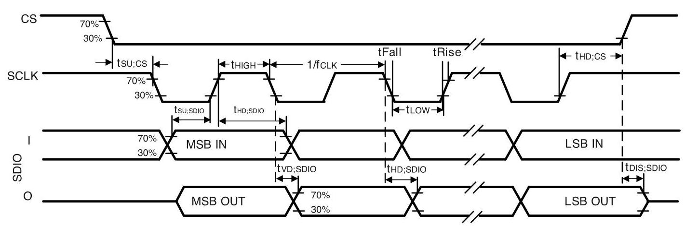

InvenSense ICM-42670-P Datasheet

## High Performance 6-Axis MotionTracking ${}^{\mathrm{{TM}}}$ IMU

## ICM-42670-P HIGHLIGHTS

The ICM-42670-P is a high performance 6-axis MEMS MotionTracking device that combines a 3-axis gyroscope and a 3-axis accelerometer. It has a configurable host interface that supports ${\mathrm{{I3C}}}^{\mathrm{{SM}}},{\mathrm{I}}^{2}\mathrm{C}$ , and SPI serial communication, features up to 2.25 Kbytes FIFO and 2 programmable interrupts with ultra-low-power wake-on-motion support to minimize system power consumption.

The ICM-42670-P supports the lowest gyro and accel sensor noise in this IMU class, and has the highest stability against temperature, shock (up to ${20},{000}\mathrm{\;g}$ ) or SMT/bend induced offset as well as immunity against out-of-band vibration induced noise.

Other industry-leading features include on-chip APEX Motion Processing engine for gesture recognition, and pedometer, along with programmable digital filters, and an embedded temperature sensor.

The device supports a VDD operating range of 1.71V to 3.6V, and a separate VDDIO operating range from 1.71V to 3.6V.

## BLOCK DIAGRAM

## ICM-42670-P FEATURES

- Low-Noise mode 6-axis current consumption of 0.55 mA

- Low-Power mode support for always-on experience

- Sleep Mode Current Consumption: ${3.5\mu }\mathrm{A}$

- User selectable Gyro Full-scale range (dps): $\pm  {250}/{500}/{1000}/{2000}$

- User selectable Accelerometer Full-scale range (g): $\pm  2/4/8/{16}$

- User-programmable digital filters for gyro, accel, and temp sensor

- APEX Motion Functions: Pedometer, Tilt Detection, Low-g Detection, Freefall Detection, Wake on Motion, Significant Motion Detection

- Host interface: 12.5 MHz I3C ${}^{\mathrm{{SM}}}$ , 1 MHz ${\mathrm{I}}^{2}\mathrm{C}$ , 24 MHz SPI

## APPLICATIONS

- Wearables (Fitness Bands, SmartWatches,

Healthcare wearables)

- Hearables (True Wireless Headsets)

- Gaming Controllers

- Smart Home Appliances

- Smart TV remotes

- Drones

- Robotics

- Augmented Reality/Virtual Reality

## ORDERING INFORMATION

<table><tr><td>PART</td><td>TEMP RANGE</td><td>PACKAGE</td></tr><tr><td>ICM-42670-Pt</td><td>$- {40}^{ \circ  }\mathrm{C}$ to $+ {85}^{ \circ  }\mathrm{C}$</td><td>2.5x3mm 14-Pin LGA</td></tr></table>

†Denotes RoHS and Green-Compliant Package

## TABLE OF CONTENTS

ICM-42670-P Highlights .1 Block Diagram 1 ICM-42670-P Features 1

Applications 1

Ordering Information 1

1 Introduction .8

1.1 Purpose and Scope .8

1.2 Product Overview .8

1.3 Applications .8

2 Features .9

2.1 Gyroscope Features .9

2.2 Accelerometer Features .9

2.3 Motion Features .9

2.4 Additional Features .9

3 Electrical Characteristics 10

3.1 Gyroscope Specifications 10

3.2 Accelerometer Specifications .11

3.3 Electrical Specifications 12

3.4 ${\mathrm{I}}^{2}\mathrm{C}$ Timing Characterization 14

3.5 SPI Timing Characterization - 4-Wire SPI Mode 15

3.6 SPI Timing Characterization - 3-Wire SPI Mode 16

3.7 Absolute Maximum Ratings 17

4 Applications Information 18

4.1 Pin Out Diagram and Signal Description 18

4.2 Typical Operating Circuit. 19

4.3 Bill of Materials for External Components .20

4.4 System Block Diagram .20

4.5 Overview .20

4.6 Three-Axis MEMS Gyroscope .20

4.7 Three-Axis MEMS Accelerometer .20

${4.8}\;{\mathrm{I}}^{\mathrm{{SM}}},{\mathrm{I}}^{2}\mathrm{C}$ and SPI Host Interface 21

4.9 Self-Test .21

4.10 Sensor Data Registers 21

4.11 Interrupts 21

4.12 Digital-Output Temperature Sensor .21

4.13 Bias and LDOs .21

4.14 Charge Pump 2.21

4.15 Standard Power Modes .22

5 Signal Path .23

6 FIFO. .24 6.1 Packet Structure .24

6.2 FIFO Header .26

6.3 Maximum FIFO Storage .27

7 Programmable Interrupts .28

8 APEX Motion Functions .29

9 Digital Interface .30

9.1 ${\mathrm{{BC}}}^{\mathrm{{SM}}},{\mathrm{I}}^{2}\mathrm{C}$ and SPI Serial Interfaces .30

${9.2}\;{\mathrm{{BC}}}^{\mathrm{{SM}}}$ Interface .30

9.3 I ${}^{2}\mathrm{C}$ Interface 3.32

9.4 ${\mathrm{I}}^{2}\mathrm{C}$ Communications Protocol 3.32

9. $5\;{\mathrm{I}}^{2}\mathrm{C}$ Terms .34

9.6 SPI Interface 35

10 Assembly. .36

10.1 Orientation of Axes .36

10.2 Package Dimensions .37

11 Part Number Package Marking .38

12 Use Notes .39

12.1 Gyroscope Power On to Power Off Transition .39

13 Accessing MREG1, MREG2 And MREG3 Registers .40

14 Register Map .41

14.1 User Bank 0 Register Map .41

14.2 User Bank MREG1 Register Map 4.42

14.3 User Bank MREG2 Register Map .43

14.4 User Bank MREG3 Register Map .43

15 User Bank 0 Register Map - Descriptions. 45

15.1 MCLK_RDY .45

15.2 DEVICE_CONFIG 45

15.3 SIGNAL_PATH_RESET .46

15.4 DRIVE_CONFIG1 .47

15.5 DRIVE_CONFIG2 48

15.6 DRIVE_CONFIG3 .49

15.7 INT_CONFIG. .50

15.8 TEMP_DATA1 .50

15.9 TEMP_DATA0 51

15.10 ACCEL_DATA_X1 51

15.11 ACCEL_DATA_X0 51

15.12 ACCEL_DATA_Y1 5.51

15.13 ACCEL_DATA_YO .52

15.14 ACCEL_DATA_Z1 .52

<table><tr><td>15.15</td><td>ACCEL_DATA_ZO5.52</td></tr><tr><td>15.16</td><td>SYRO_DATA_X1..52</td></tr><tr><td>15.17</td><td>.52</td></tr><tr><td>15.18</td><td>GYRO_DATA_Y15.53</td></tr><tr><td>15.19</td><td>9 GYRO_DATA_YO.5.53</td></tr><tr><td>15.20</td><td>GYRO_DATA_Z1.53</td></tr><tr><td>15.21</td><td>1 GYRO_DATA_ZO.53</td></tr><tr><td>15.22</td><td>TMST_FSYNCH53</td></tr><tr><td>15.23</td><td>TMST_FSYNCL.54</td></tr><tr><td>15.24</td><td>APEX_DATA4.54</td></tr><tr><td>15.25</td><td>APEX_DATA5.54</td></tr><tr><td>15.26</td><td>PWR_MGMTO.25</td></tr><tr><td>15.27</td><td>GYRO_CONFIGO.56</td></tr><tr><td>15.28</td><td>ACCEL_CONFIGO57</td></tr><tr><td>15.29</td><td>TEMP_CONFIGO.58</td></tr><tr><td>15.30</td><td>GYRO_CONFIG15.58</td></tr><tr><td>15.31</td><td>ACCEL_CONFIG159</td></tr><tr><td>15.32</td><td>APEX_CONFIGO.59</td></tr><tr><td>15.33</td><td>APEX_CONFIG1.60</td></tr><tr><td>15.34</td><td>WOM_CONFIG.6.61</td></tr><tr><td>15.35</td><td>FIFO_CONFIG1.61</td></tr><tr><td>15.36</td><td>FIFO_CONFIG2.62</td></tr><tr><td>15.37</td><td>6.62</td></tr><tr><td>15.38</td><td>SOURCEO.63</td></tr><tr><td>15.39</td><td>INT_SOURCE16.63</td></tr><tr><td>15.40</td><td>INT_SOURCE3.64</td></tr><tr><td>15.41</td><td>INT_SOURCE4 ..64</td></tr><tr><td>15.42</td><td>FIFO_LOST_PKTO.65</td></tr><tr><td>15.43</td><td>FIFO_LOST_PKT165</td></tr><tr><td>15.44</td><td>APEX_DATAO.65</td></tr><tr><td>15.45</td><td>APEX_DATA1.65</td></tr><tr><td>15.46</td><td>APEX_DATA2.65</td></tr><tr><td>15.47</td><td>APEX_DATA3.66</td></tr><tr><td>15.48</td><td>INTF_CONFIGO.66</td></tr><tr><td>15.49</td><td>INTF_CONFIG1.67</td></tr><tr><td>15.50</td><td>INT_STATUS_DRI.67</td></tr><tr><td>15.51</td><td>INT_STATUS ..68</td></tr><tr><td>15.52</td><td>INT_STATUS2.68</td></tr><tr><td>15.53</td><td>.68</td></tr><tr><td>15.54</td><td>FIFO_COUNTH.69</td></tr></table>

15.55 FIFO_COUNTL .69 15.56 FIFO_DATA 69

15.57 WHO_AM_I .69

15.58 BLK_SEL_W .70

15.59 MADDR_W. .70

15.60 M_W. .70

15.61 BLK_SEL_R .70

15.62 MADDR_R 7.71

15.63 M_R 7.71

16 User Bank MREG1 Register Map - Descriptions 7.72

16.1 TMST_CONFIG1 7.72

16.2 FIFO_CONFIG5 .73

16.3 FIFO_CONFIG6 .74

16.4 FSYNC_CONFIG .75

16.5 INT_CONFIGO. .75

16.6 INT_CONFIG1 .76

16.7 SENSOR_CONFIG3 .76

16.8 ST_CONFIG .77

16.9 SELFTEST. .78

16.10 INTF_CONFIG6. .78

16.11 INTF_CONFIG10 .78

16.12 INTF_CONFIG7. 7.79

16.13 OTP_CONFIG. 7.79

16.14 INT_SOURCE6 .80

16.15 INT_SOURCE7 .80

16.16 INT_SOURCE8 .81

16.17 INT_SOURCE9 .81

16.18 INT_SOURCE10 8.82

16.19 APEX_CONFIG2 .83

16.20 APEX_CONFIG3 .84

16.21 APEX_CONFIG4 .85

16.22 APEX_CONFIG5 .86

16.23 APEX_CONFIG9 .87

16.24 APEX_CONFIG10 .88

16.25 APEX_CONFIG11 .89

16.26 ACCEL_WOM_X_THR .90

16.27 ACCEL_WOM_Y_THR .90

16.28 ACCEL_WOM_Z_THR .90

16.29 OFFSET_USERO .90

16.30 OFFSET_USER1 91

16.31 OFFSET_USER2 .91

16.32 OFFSET_USER3 .91

16.33 OFFSET_USER4 .91

16.34 OFFSET_USER5 .92

16.35 OFFSET_USER6 .92

16.36 OFFSET_USER7 .92

16.37 OFFSET_USER8 .92

16.38 ST_STATUS1 93

16.39 ST_STATUS2 .93

16.40 FDR_CONFIG .94

16.41 APEX_CONFIG12 .95

17 User Bank MREG2 Register Map - Descriptions .96

17.1 OTP_CTRL7 96

18 User Bank MREG3 Register Map - Descriptions 97

18.1 XA_ST_DATA .97

18.2 YA_ST_DATA .97

18.3 ZA_ST_DATA 97

18.4 XG_ST_DATA .97

18.5 YG_ST_DATA .97

18.6 ZG_ST_DATA 98

19 SmartMotion Product Family 9.99

20 Reference 100

21 Revision History 101

TABLE OF FIGURES

Figure 1. ${\mathrm{I}}^{2}\mathrm{C}$ Bus Timing Diagram .14

Figure 2. 4-Wire SPI Bus Timing Diagram 15

Figure 3. 3-Wire SPI Bus Timing Diagram .16

Figure 4. Pin Out Diagram for ICM-42670-P 2.5x3.0x0.76 mm LGA .18

Figure 5. ICM-42670-P Application Schematic ( ${\mathrm{{BC}}}^{\mathrm{{SM}}}/{\mathrm{I}}^{2}\mathrm{C}$ Interface to Host) .19

Figure 6. ICM-42670-P Application Schematic (SPI Interface to Host) .19

Figure 7. ICM-42670-P System Block Diagram .20

Figure 8. ICM-42670-P Signal Path .23

Figure 9. FIFO Packet Structure .24

Figure 10. Maximum FIFO Storage .27

Figure 11. START and STOP Conditions .32

Figure 12. Acknowledge on the ${\mathrm{I}}^{2}\mathrm{C}$ Bus .33

Figure 13. Complete ${\mathrm{I}}^{2}\mathrm{C}$ Data Transfer .33

Figure 14. Typical SPI Master/Slave Configuration .35

Figure 15. Orientation of Axes of Sensitivity and Polarity of Rotation .36

TABLE OF TABLES

Table 1. Gyroscope Specifications .10

Table 2. Accelerometer Specifications .11

Table 3. D.C. Electrical Characteristics .12

Table 4. A.C. Electrical Characteristics .13

Table 5. ${\mathrm{I}}^{2}\mathrm{C}$ Timing Characteristics. .14

Table 6. 4-Wire SPI Timing Characteristics (24-MHz Operation) .15

Table 7. 3-Wire SPI Timing Characteristics (24-MHz Operation) .16

Table 8. Absolute Maximum Ratings .17

Table 9. Signal Descriptions .18

Table 10. Bill of Materials .20

Table 11. Standard Power Modes for ICM-42670-P .22

Table 12. I3C ${}^{\mathrm{{SM}}}$ CCC Commands. .32

Table 13. ${\mathrm{I}}^{2}\mathrm{C}$ Terms .34

## 1 INTRODUCTION

### 1.1 PURPOSE AND SCOPE

This document is a product specification, providing a description, specifications, and design related information on the ICM-42670-P Single-Interface MotionTracking device. The device is housed in a small 2.5x3x0.76 mm 14-pin LGA package.

### 1.2 PRODUCT OVERVIEW

The ICM-42670-P is a 6-axis MotionTracking device that combines a 3-axis gyroscope and a 3-axis accelerometer in a small ${2.5} \times  3 \times  {0.76}\mathrm{\;{mm}}$ (14-pin LGA) package. It also features up to 2.25 Kbytes FIFO that can lower the traffic on the serial bus interface and reduce power consumption by allowing the system processor to burst read sensor data and then go into a low-power mode. ICM-42670-P, with its 6-axis integration, enables manufacturers to eliminate the costly and complex selection, qualification, and system level integration of discrete devices, guaranteeing optimal motion performance for consumers.

The gyroscope supports four programmable full-scale range settings from $\pm  {250}\mathrm{{dps}}$ to $\pm  {2000}\mathrm{{dps}}$ and the accelerometer supports four programmable full-scale range settings from $\pm  2\mathrm{\;g}$ to $\pm  {16}\mathrm{\;g}$ .

Other industry-leading features include on-chip 16-bit ADCs, programmable digital filters, an embedded temperature sensor, and programmable interrupts. The device features ${\mathrm{{I3C}}}^{\mathrm{{SM}}},{}^{1}C$ , and SPI serial interfaces, a VDD operating range of 1.71V to 3.6V, and a separate VDDIO operating range of 1.71V to 3.6V.

The host interface can be configured to support ${\mathrm{{I3C}}}^{\mathrm{{SM}}}$ slave, ${\mathrm{I}}^{2}\mathrm{C}$ slave, or SPI slave modes. The ${\mathrm{{I3C}}}^{\mathrm{{SM}}}$ interface supports speeds up to ${12.5}\mathrm{{MHz}}$ (data rates up to ${12.5}\mathrm{{Mbps}}$ in SDR mode, ${25}\mathrm{{Mbps}}$ in DDR mode), the ${\mathrm{I}}^{2}\mathrm{C}$ interface supports speeds up to $1\mathrm{{MHz}}$ , and the SPI interface supports speeds up to ${24}\mathrm{{MHz}}$ .

The device provides high robustness by supporting 20,000g shock reliability.

### 1.3 APPLICATIONS

- Wearables (Fitness Bands, SmartWatches, Healthcare wearables)

- Hearables (True Wireless Headsets)

- Gaming Controllers

- Smart Home Appliances

- Smart TV remotes

- Drones

- Robotics

- Augmented Reality/Virtual Reality

## 2 FEATURES

### 2.1 GYROSCOPE FEATURES

The triple-axis MEMS gyroscope in the ICM-42670-P includes a wide range of features:

- Digital-output X-, Y-, and Z-axis angular rate sensors (gyroscopes) with programmable full-scale range of $\pm  {250}, \pm  {500}, \pm  {1000}$ , and $\pm  {2000}$ degrees $/\mathrm{{sec}}$

- Low Noise (LN) power mode support

- Digitally programmable low-pass filters

- Factory calibrated sensitivity scale factor

- Self-test

### 2.2 ACCELEROMETER FEATURES

The triple-axis MEMS accelerometer in ICM-42670-P includes a wide range of features:

- Digital-output X-, Y-, and Z-axis accelerometer with programmable full-scale range of $\pm  {2g}, \pm  {4g}, \pm  {8g}$ and $\pm  {16g}$

- Low Noise (LN) and Low Power (LP) power modes support

- User-programmable interrupts

- Wake-on-motion interrupt for low power operation of applications processor

- Self-test

### 2.3 MOTION FEATURES

ICM-42670-P includes the following motion features, also known as APEX (Advanced Pedometer and Event Detection - neXt gen)

- Pedometer: Tracks step count and issues a step detect Interrupt.

- Tilt Detection: Issues an interrupt when the Tilt angle exceeds 35 degrees for more than a programmable time.

- Low-g Detection: Triggers an interrupt when absolute value of accelerometer combined axis falls below a programmable threshold and stays below the threshold for a programmable time.

- Freefall Detection: Triggers an interrupt when device freefall is detected and outputs freefall duration.

- Wake on Motion (WoM): Detects motion when accelerometer samples exceed a programmable threshold. This motion event can be used to enable device operation from sleep mode.

- Significant Motion Detector (SMD): Detects significant motion based on accelerometer data.

### 2.4 ADDITIONAL FEATURES

ICM-42670-P includes the following additional features:

- Up to 2.25 Kbytes FIFO buffer enables the applications processor to read the data in bursts

- User-programmable digital filters for gyroscope, accelerometer, and temperature sensor

- 12.5M Hz ${\mathrm{{I3C}}}^{\mathrm{{SM}}}$ (data rates up to ${12.5}\mathrm{{Mbps}}$ in SDR mode, ${25}\mathrm{{Mbps}}$ in DDR mode) $/1\mathrm{{MHz}}{\mathrm{I}}^{2}\mathrm{C}/{24}\mathrm{{MHz}}\mathrm{{SPl}}$ slave host interface

- Digital-output temperature sensor

- Smallest and thinnest LGA package for portable devices: 2.5x3x0.76 mm (14-pin LGA)

- 20,000g shock tolerant

- MEMS structure hermetically sealed and bonded at wafer level

- RoHS and Green compliant

## 3 ELECTRICAL CHARACTERISTICS

### 3.1 GYROSCOPE SPECIFICATIONS

Typical Operating Conditions, $\mathrm{{VDD}} = {1.8}\mathrm{V},\mathrm{{VDDIO}} = {1.8}\mathrm{V},{\mathrm{T}}_{\mathrm{A}} = {25}^{ \circ  }\mathrm{C}$ , unless otherwise noted. Notes: 1. Tested in production at component-level. 2. Guaranteed by design. 3. Derived from validation or characterization of parts, not tested in production. 4. Calculated from Rate Noise Spectral Density. 5. 20-bits data format supported in FIFO, see section 6.1. 6. Board-level spec values depend on specific board design. For design information of boards used for device characterization, that forms the basis of the spec values reported here, please contact your local TDK InvenSense FAE.

<table><tr><td>PARAMETER</td><td>CONDITIONS</td><td>MIN</td><td>TYP</td><td>MAX</td><td>UNITS</td><td>NOTES</td></tr><tr><td colspan="7">GYROSCOPE SENSITIVITY</td></tr><tr><td rowspan="4">Full-Scale Range</td><td>GYRO_UI_FS_SEL=0</td><td/><td>$\pm  {2000}$</td><td/><td>9/s</td><td>2</td></tr><tr><td>GYRO_UI_FS_SEL=1</td><td/><td>$\pm  {1000}$</td><td/><td>9/s</td><td>2</td></tr><tr><td>GYRO_UI_FS_SEL=2</td><td/><td>$\pm  {500}$</td><td/><td>9/s</td><td>2</td></tr><tr><td>GYRO_UI_FS_SEL=3</td><td/><td>$\pm  {250}$</td><td/><td>9/s</td><td>2</td></tr><tr><td>Gyroscope ADC Word Length</td><td>Output in two's complement format</td><td/><td>16</td><td/><td>bits</td><td>2, 5</td></tr><tr><td rowspan="4">Sensitivity Scale Factor</td><td>GYRO_UI_FS_SEL=0</td><td/><td>16.4</td><td/><td>LSB/(9/s)</td><td>2</td></tr><tr><td>GYRO_UI_FS_SEL=1</td><td/><td>32.8</td><td/><td>LSB/(9/s)</td><td>2</td></tr><tr><td>GYRO_UI_FS_SEL=2</td><td/><td>65.5</td><td/><td>LSB/(°/s)</td><td>2</td></tr><tr><td>GYRO_UI_FS_SEL=3</td><td/><td>131</td><td/><td>LSB/(9/s)</td><td>2</td></tr><tr><td>Sensitivity Scale Factor Initial Tolerance</td><td>${25}^{ \circ  }\mathrm{C}$</td><td/><td>$\pm  1$</td><td/><td>%</td><td>1,7</td></tr><tr><td>Sensitivity Scale Factor Variation Over Temperature</td><td>-40°C to +85°C; Board-Level</td><td/><td>$\pm  {0.007}$</td><td/><td>%/℃</td><td>3, 6</td></tr><tr><td>Nonlinearity</td><td>Best fit straight line; 25°C; Board-Level</td><td/><td>$\pm  {0.1}$</td><td/><td>%</td><td>3, 6</td></tr><tr><td>Cross-Axis Sensitivity</td><td>Board-level</td><td/><td>$\pm  2$</td><td/><td>%</td><td>3, 6</td></tr><tr><td colspan="7">ZERO-RATE OUTPUT (ZRO)</td></tr><tr><td>Initial ZRO Tolerance</td><td>${25}^{ \circ  }\mathrm{C}$</td><td/><td>$\pm  1$</td><td/><td>9/s</td><td>1,7</td></tr><tr><td>ZRO Variation vs. Temperature</td><td>-40°C to +85°C; Board-Level</td><td/><td>$\pm  {0.015}$</td><td/><td>9/s/9C</td><td>3, 6</td></tr><tr><td colspan="7">OTHER PARAMETERS</td></tr><tr><td>Rate Noise Spectral Density</td><td>@ 10 Hz</td><td/><td>0.007</td><td/><td>9/s/VHz</td><td>1</td></tr><tr><td>Total RMS Noise</td><td>Bandwidth = ${100}\mathrm{\;{Hz}}$</td><td/><td>0.07</td><td/><td>9/s-rms</td><td>4</td></tr><tr><td>Gyroscope Mechanical Frequencies</td><td/><td>25</td><td>28</td><td>30</td><td>kHz</td><td>1</td></tr><tr><td>Low Pass Filter Response</td><td/><td>16</td><td/><td>180</td><td>$\mathrm{{Hz}}$</td><td>2</td></tr><tr><td>Gyroscope Start-Up Time</td><td>Time from gyro enable to gyro drive ready</td><td/><td>30</td><td/><td>ms</td><td>3</td></tr><tr><td>Output Data Rate</td><td/><td>12.5</td><td/><td>1600</td><td>$\mathrm{{Hz}}$</td><td>2</td></tr></table>

Table 1. Gyroscope Specifications

7. Value after factory test and trim.

### 3.2 ACCELEROMETER SPECIFICATIONS

Typical Operating Conditions, $\mathrm{{VDD}} = {1.8}\mathrm{\;V},\mathrm{{VDDIO}} = {1.8}\mathrm{\;V},{\mathrm{\;T}}_{\mathrm{A}} = {25}^{ \circ  }\mathrm{C}$ , unless otherwise noted.

<table><tr><td>PARAMETER</td><td>CONDITIONS</td><td>MIN</td><td>TYP</td><td>MAX</td><td>UNITS</td><td>NOTES</td></tr><tr><td colspan="7">ACCELEROMETER SENSITIVITY</td></tr><tr><td rowspan="4">Full-Scale Range</td><td>ACCEL_UI_FS_SEL=0</td><td/><td>$\pm  {16}$</td><td/><td>$g$</td><td>2</td></tr><tr><td>ACCEL_UI_FS_SEL=1</td><td/><td>$\pm  8$</td><td/><td>$g$</td><td>2</td></tr><tr><td>ACCEL_UI_FS_SEL=2</td><td/><td>$\pm  4$</td><td/><td>$g$</td><td>2</td></tr><tr><td>ACCEL_UI_FS_SEL=3</td><td/><td>$\pm  2$</td><td/><td>$g$</td><td>2</td></tr><tr><td>ADC Word Length</td><td>Output in two's complement format</td><td/><td>16</td><td/><td>bits</td><td>2, 5</td></tr><tr><td rowspan="4">Sensitivity Scale Factor</td><td>ACCEL_UI_FS_SEL=0</td><td/><td>2,048</td><td/><td>LSB/g</td><td>2</td></tr><tr><td>ACCEL_UI_FS_SEL=1</td><td/><td>4,096</td><td/><td>LSB/g</td><td>2</td></tr><tr><td>ACCEL_UI_FS_SEL=2</td><td/><td>8,192</td><td/><td>LSB/g</td><td>2</td></tr><tr><td>ACCEL_UI_FS_SEL=3</td><td/><td>16,384</td><td/><td>LSB/g</td><td>2</td></tr><tr><td>Sensitivity Scale Factor Initial Tolerance</td><td>${25}^{ \circ  }\mathrm{C}$</td><td/><td>$\pm  1$</td><td/><td>%</td><td>1,7</td></tr><tr><td>Sensitivity Change vs. Temperature</td><td>-40°C to +85°C; Board-Level</td><td/><td>$\pm  {0.01}$</td><td/><td>%/℃</td><td>3, 6</td></tr><tr><td>Nonlinearity</td><td>Best Fit Straight Line, ±2g; Board-Level</td><td/><td>$\pm  {0.1}$</td><td/><td>%</td><td>3, 6</td></tr><tr><td>Cross-Axis Sensitivity</td><td>Board-level</td><td/><td>$\pm  1$</td><td/><td>%</td><td>3, 6</td></tr><tr><td colspan="7">ZERO-G OUTPUT</td></tr><tr><td>Initial Tolerance</td><td>${25}^{ \circ  }\mathrm{C}$</td><td/><td>$\pm  {25}$</td><td/><td>mg</td><td>1,7</td></tr><tr><td>Zero-G Level Change vs. Temperature</td><td>-40°C to +85°C; Board-Level</td><td/><td>$\pm  {0.15}$</td><td/><td>mg/℃</td><td>3, 6</td></tr><tr><td colspan="7">OTHER PARAMETERS</td></tr><tr><td>Power Spectral Density</td><td>@ 10 Hz</td><td/><td>100</td><td/><td>μg/VHz</td><td>1</td></tr><tr><td>RMS Noise</td><td>Bandwidth = 100 Hz</td><td/><td>1.0</td><td/><td>mg-rms</td><td>4</td></tr><tr><td>Low Pass Filter Response</td><td/><td>16</td><td/><td>180</td><td>$\mathrm{{Hz}}$</td><td>2</td></tr><tr><td>Accelerometer Startup Time</td><td>From sleep mode to valid data</td><td/><td>10</td><td/><td>ms</td><td>3</td></tr><tr><td>Output Data Rate</td><td/><td>1.5625</td><td/><td>1600</td><td>Hz</td><td>2</td></tr></table>

Table 2. Accelerometer Specifications

Notes:

1. Tested in production at component-level.

2. Guaranteed by design.

3. Derived from validation or characterization of parts, not tested in production.

4. Calculated from Power Spectral Density.

5. 20-bits data format supported in FIFO, see section 6.1.

6. Board-level spec values depend on specific board design. For design information of boards used for device characterization, that forms the basis of the spec values reported here, please contact your local TDK InvenSense FAE.

7. Value after factory test and trim.

### 3.3 ELECTRICAL SPECIFICATIONS

#### 3.3.1 D.C. Electrical Characteristics

Typical Operating Conditions, $\mathrm{{VDD}} = {1.8}\mathrm{V},\mathrm{{VDDIO}} = {1.8}\mathrm{V},{\mathrm{T}}_{\mathrm{A}} = {25}^{ \circ  }\mathrm{C}$ , unless otherwise noted.

<table><tr><td>PARAMETER</td><td>CONDITIONS</td><td>MIN</td><td>TYP</td><td>MAX</td><td>UNITS</td><td>NOTES</td></tr><tr><td colspan="7">SUPPLY VOLTAGES</td></tr><tr><td>VDD</td><td/><td>1.71</td><td>1.8</td><td>3.6</td><td>V</td><td>1</td></tr><tr><td>VDDIO</td><td/><td>1.71</td><td>1.8</td><td>3.6</td><td>V</td><td>1</td></tr><tr><td colspan="7">SUPPLY CURRENTS</td></tr><tr><td rowspan="3">Low-Noise Mode</td><td>6-Axis Gyroscope + Accelerometer</td><td/><td>0.55</td><td/><td>mA</td><td>2</td></tr><tr><td>3-Axis Accelerometer</td><td/><td>0.20</td><td/><td>mA</td><td>2</td></tr><tr><td>3-Axis Gyroscope</td><td/><td>0.42</td><td/><td>mA</td><td>2</td></tr><tr><td>Full-Chip Sleep Mode</td><td>At 25°C</td><td/><td>3.5</td><td/><td>μA</td><td>2</td></tr><tr><td colspan="7">TEMPERATURE RANGE</td></tr><tr><td>Specified Temperature Range</td><td>Performance parameters are not applicable beyond Specified Temperature Range</td><td>-40</td><td/><td>+85</td><td>℃</td><td>1</td></tr></table>

Table 3. D.C. Electrical Characteristics

Notes:

1. Guaranteed by design.

2. Derived from validation or characterization of parts, not tested in production.

#### 3.3.2 A.C. Electrical Characteristics

Typical Operating Conditions, $\mathrm{{VDD}} = {1.8}\mathrm{V},\mathrm{{VDDIO}} = {1.8}\mathrm{V},{\mathrm{T}}_{\mathrm{A}} = {25}^{ \circ  }\mathrm{C}$ , unless otherwise noted. Notes:

<table><tr><td>PARAMETER</td><td>CONDITIONS</td><td>MIN</td><td>TYP</td><td>MAX</td><td>UNITS</td><td>NOTES</td></tr><tr><td colspan="7">SUPPLIES</td></tr><tr><td>Supply Ramp Time</td><td>Valid power-on RESET</td><td>0.1</td><td/><td>3</td><td>ms</td><td>1</td></tr><tr><td>Power Supply Noise</td><td/><td/><td>10</td><td/><td>mV peak-peak</td><td>1</td></tr><tr><td colspan="7">TEMPERATURE SENSOR</td></tr><tr><td>Operating Range</td><td>Ambient</td><td>-40</td><td/><td>85</td><td>℃</td><td>1</td></tr><tr><td>${25}^{ \circ  }\mathrm{C}$ Output</td><td>Output in two's complement format</td><td/><td>0</td><td/><td>LSB</td><td>3</td></tr><tr><td>ADC Resolution</td><td/><td/><td>16</td><td/><td>bits</td><td>2</td></tr><tr><td>ODR</td><td>With Filter</td><td>1.5625</td><td/><td>1600</td><td>Hz</td><td>2,4</td></tr><tr><td>Room Temperature Offset</td><td>${25}^{ \circ  }\mathrm{C}$</td><td>-3</td><td/><td>3</td><td>℃</td><td>3</td></tr><tr><td>Stabilization Time (fixed number of clock cycles)</td><td/><td/><td/><td>0.64</td><td>sec</td><td>2</td></tr><tr><td>Sensitivity</td><td>Trimmed</td><td>125</td><td>126.9</td><td>129</td><td>LSB/℃</td><td>1</td></tr><tr><td>Sensitivity for FIFO data</td><td>Trimmed</td><td>1.95</td><td>1.983</td><td>2.01</td><td>LSB/°C</td><td>1</td></tr><tr><td colspan="7">POWER-ON RESET</td></tr><tr><td>Start-up time for register read/write</td><td>From power-up</td><td/><td/><td>1</td><td>ms</td><td>1</td></tr><tr><td colspan="7">I2C ADDRESS</td></tr><tr><td>I2C ADDRESS</td><td>AP ${ADO} = 0$ AP_AD0 = 1</td><td/><td>1101000 1101001</td><td/><td/><td/></tr><tr><td colspan="7">DIGITAL INPUTS (FSYNC, SCLK, SDI, CS)</td></tr><tr><td>${\mathrm{V}}_{\mathrm{{IH}}}$ , High Level Input Voltage</td><td/><td>0.7*VDDIO</td><td/><td/><td>V</td><td rowspan="3">1</td></tr><tr><td>${\mathrm{V}}_{\mathrm{{IL}}}$ , Low Level Input Voltage</td><td/><td/><td/><td>0.3*VDDIO</td><td>V</td></tr><tr><td>${\mathrm{C}}_{\mathrm{l}}$ , Input Capacitance</td><td/><td/><td><10</td><td/><td>pF</td></tr><tr><td colspan="7">DIGITAL OUTPUT (SDO, INT1, INT2)</td></tr><tr><td>${\mathrm{V}}_{\mathrm{{OH}}}$ , High Level Output Voltage</td><td>${\mathrm{R}}_{\mathrm{{LOAD}}} = 1\mathrm{M}\Omega$ ;</td><td>0.9*VDDIO</td><td/><td/><td>V</td><td rowspan="5">1</td></tr><tr><td>${\mathrm{V}}_{\mathrm{{OL}}1}$ , LOW-Level Output Voltage</td><td>${\mathrm{R}}_{\mathrm{{LOAD}}} = 1\mathrm{M}\Omega$ ;</td><td/><td/><td>0.1*VDDIO</td><td>V</td></tr><tr><td>${\mathrm{V}}_{\mathrm{{OL}},\mathrm{{INT}}}$ , INT Low-Level Output Voltage</td><td>OPEN=1, 0.3 mA sink Current</td><td/><td/><td>0.1</td><td>V</td></tr><tr><td>Output Leakage Current</td><td>OPEN=1</td><td/><td>100</td><td/><td>nA</td></tr><tr><td>${\mathrm{t}}_{\mathrm{{INT}}}$ , INT Pulse Width</td><td>int_tpulse_duration $= 0,1\left( {{100}\mathrm{{us}},8\mathrm{{us}}}\right)$ ;</td><td>8</td><td/><td>100</td><td>us</td></tr><tr><td colspan="7">${\mathrm{I}}^{2}\mathrm{{Cl}}/\mathrm{O}$ (SCL, SDA)</td></tr><tr><td>${\mathrm{V}}_{\mathrm{{IL}}}$ , LOW-Level Input Voltage</td><td/><td>-0.5V</td><td/><td>0.3*VDDIO</td><td>V</td><td rowspan="7">1</td></tr><tr><td>${\mathrm{V}}_{\mathrm{{IH}}}$ , HIGH-Level Input Voltage</td><td/><td>0.7*VDDIO</td><td/><td>VDDIO + 0.5V</td><td>V</td></tr><tr><td>${\mathrm{V}}_{\mathrm{{hvs}}}$ , Hysteresis</td><td/><td/><td>0.1*VDDIO</td><td/><td>V</td></tr><tr><td>${\mathrm{V}}_{\mathrm{{OL}}}$ , LOW-Level Output Voltage</td><td>3 mA sink current</td><td>0</td><td/><td>0.4</td><td>V</td></tr><tr><td>Iol, LOW-Level Output Current</td><td>${\mathrm{V}}_{\mathrm{{OL}}} = {0.4}\mathrm{\;V}$ ${V}_{OL} = {0.6V}$</td><td/><td>3 6</td><td/><td>mA mA</td></tr><tr><td>Output Leakage Current</td><td/><td/><td>100</td><td/><td>nA</td></tr><tr><td>${\mathrm{t}}_{\mathrm{{of}}}$ , Output Fall Time from ${\mathrm{V}}_{\mathrm{l}\mathrm{{Hmax}}}$ to ${\mathrm{V}}_{\mathrm{l}\mathrm{{Lmax}}}$</td><td>${\mathrm{C}}_{\mathrm{b}}$ bus capacitance in pf</td><td>${20} + {0.1}{\mathrm{C}}_{\mathrm{b}}$</td><td/><td>300</td><td>ns</td></tr><tr><td colspan="7">INTERNAL CLOCK SOURCE</td></tr><tr><td rowspan="2">Clock Frequency Initial Tolerance</td><td>CLKSEL=`2b00 or gyro inactive; 25°C</td><td>-3</td><td/><td>$+ 3$</td><td>%</td><td>1</td></tr><tr><td>CLKSEL=`2b01 and gyro active; 25°C</td><td>- 1</td><td/><td>$+ 1$</td><td>%</td><td>1</td></tr><tr><td rowspan="2">Frequency Variation over Temperature</td><td>CLKSEL=`2b00 or gyro inactive; -40°C to +85°C</td><td/><td/><td>$\pm  3$</td><td>%</td><td>1</td></tr><tr><td>CLKSEL=`2b01 and gyro active; -40°C to +85°C</td><td/><td/><td>$\pm  1$</td><td>%</td><td>1</td></tr></table>

Table 4. A.C. Electrical Characteristics

1. Expected results based on design, will be updated after characterization. Not tested in production.

2. Guaranteed by design.

3. Production tested.

4. Temperature sensor ODR is the higher value between gyroscope and accelerometer ODR.

### 3.4 ${\mathrm{I}}^{2}\mathrm{C}$ TIMING CHARACTERIZATION

Typical Operating Conditions, $\mathrm{{VDD}} = {1.8}\mathrm{\;V},\mathrm{{VDD}}\mathrm{{IO}} = {1.8}\mathrm{\;V},{\mathrm{\;T}}_{\mathrm{A}} = {25}^{ \circ  }\mathrm{C}$ , unless otherwise noted. Slew Rate can be configured by the user using register DRIVE_CONFIG2.

<table><tr><td>PARAMETERS</td><td>CONDITIONS</td><td>MIN</td><td>TYP</td><td>MAX</td><td>UNITS</td><td>NOTES</td></tr><tr><td>I2C TIMING</td><td>I ${}^{2}$ C FAST-MODE PLUS</td><td/><td/><td/><td/><td/></tr><tr><td>fSCL, SCL Clock Frequency</td><td/><td/><td/><td>1</td><td>MHz</td><td>1</td></tr><tr><td>${\mathrm{t}}_{\mathrm{{HD}}.\mathrm{{STA}}}$ ,(Repeated) START Condition Hold Time</td><td/><td>0.26</td><td/><td/><td>us</td><td>1</td></tr><tr><td>tLow, SCL Low Period</td><td/><td>0.5</td><td/><td/><td>us</td><td>1</td></tr><tr><td>${\mathrm{t}}_{\mathrm{{HIGH}}}$ , SCL High Period</td><td/><td>0.26</td><td/><td/><td>us</td><td>1</td></tr><tr><td>${\mathrm{t}}_{\text{SU.STA }}$ , Repeated START Condition Setup Time</td><td/><td>0.26</td><td/><td/><td>us</td><td>1</td></tr><tr><td>${\mathrm{t}}_{\mathrm{{HD}}.\mathrm{{DAT}}}$ , SDA Data Hold Time</td><td/><td>0</td><td/><td/><td>us</td><td>1</td></tr><tr><td>ty</td><td/><td>50</td><td/><td/><td>ns</td><td>1</td></tr><tr><td>ThusTOP Condition Setup Time</td><td/><td>0.5</td><td/><td/><td>us</td><td>1</td></tr><tr><td>${\mathrm{t}}_{\mathrm{{BUF}}}$ , Bus Free Time Between STOP and START Condition</td><td/><td>0.5</td><td/><td/><td>us</td><td>1</td></tr><tr><td>${\mathrm{C}}_{\mathrm{b}}$ , Capacitive Load for each Bus Line</td><td/><td/><td/><td>550</td><td>pF</td><td>1</td></tr><tr><td>typ.</td><td/><td/><td/><td>0.45</td><td>us</td><td>1</td></tr><tr><td>typ ACK. Data Valid Acknowledge Time</td><td/><td/><td/><td>0.45</td><td>us</td><td>1</td></tr></table>

Table 5. ${\mathrm{I}}^{2}\mathrm{C}$ Timing Characteristics

Notes:

1. Based on characterization of 5 parts over temperature and voltage as mounted on evaluation board or in sockets

Figure 1. ${\mathrm{I}}^{2}\mathrm{C}$ Bus Timing Diagram

### 3.5 SPI TIMING CHARACTERIZATION - 4-WIRE SPI MODE

Typical Operating Conditions, $\mathrm{{VDD}} = {1.8}\mathrm{\;V},\mathrm{{VDDIO}} = {1.8}\mathrm{\;V},{\mathrm{\;T}}_{\mathrm{A}} = {25}^{ \circ  }\mathrm{C}$ , unless otherwise noted. Slew Rate can be configured by the user using register DRIVE_CONFIG3.

<table><tr><td>PARAMETERS</td><td>CONDITIONS</td><td>MIN</td><td>TYP</td><td>MAX</td><td>UNITS</td><td>NOTES</td></tr><tr><td>SPI TIMING</td><td/><td/><td/><td/><td/><td/></tr><tr><td>fSPC, SCLK Clock Frequency</td><td>Default</td><td/><td/><td>24</td><td>MHz</td><td>1</td></tr><tr><td>TLOW, SCLK LOW Period</td><td/><td>17</td><td/><td/><td>ns</td><td>1</td></tr><tr><td>${\mathrm{t}}_{\mathrm{{HIGH}}}$ , SCLK High Period</td><td/><td>17</td><td/><td/><td>ns</td><td>1</td></tr><tr><td>type</td><td/><td>17</td><td/><td/><td>ns</td><td>1</td></tr><tr><td>${\mathrm{t}}_{\mathrm{{HD}}.\mathrm{{CS}}}$ , CS Hold Time</td><td/><td>5</td><td/><td/><td>ns</td><td>1</td></tr><tr><td>tSU.SDI, SDI Setup Time</td><td/><td>13</td><td/><td/><td>ns</td><td>1</td></tr><tr><td>${\mathrm{t}}_{\mathrm{{HD}},\mathrm{{SDI}}}$ , SDI Hold Time</td><td/><td>8</td><td/><td/><td>ns</td><td>1</td></tr><tr><td>type, SDO Valid Time</td><td>${C}_{\text{load }} = {20}\mathrm{{pF}}$</td><td/><td/><td>18.5</td><td>ns</td><td>1</td></tr><tr><td>${\mathrm{t}}_{\mathrm{{HD}},\mathrm{{SDO}}}$ , SDO Hold Time</td><td>${C}_{\text{load }} = {20}\mathrm{{pF}}$</td><td>3.5</td><td/><td/><td>ns</td><td>1</td></tr><tr><td>${\mathrm{t}}_{\text{DIS.SDO,}}$ SDO Output Disable Time</td><td/><td/><td/><td>18.5</td><td>ns</td><td>1</td></tr></table>

Table 6. 4-Wire SPI Timing Characteristics (24-MHz Operation)

Figure 2. 4-Wire SPI Bus Timing Diagram

### 3.6 SPI TIMING CHARACTERIZATION - 3-WIRE SPI MODE

Typical Operating Conditions, $\mathrm{{VDD}} = {1.8}\mathrm{\;V},\mathrm{{VDDIO}} = {1.8}\mathrm{\;V},{\mathrm{\;T}}_{\mathrm{A}} = {25}^{ \circ  }\mathrm{C}$ , unless otherwise noted. Slew Rate can be configured by the user using register DRIVE_CONFIG3. Notes:

<table><tr><td>PARAMETERS</td><td>CONDITIONS</td><td>MIN</td><td>TYP</td><td>MAX</td><td>UNITS</td><td>NOTES</td></tr><tr><td>SPI TIMING</td><td/><td/><td/><td/><td/><td/></tr><tr><td>fSPC, SCLK Clock Frequency</td><td>Default</td><td/><td/><td>24</td><td>MHz</td><td>1</td></tr><tr><td>TLOW, SCLK LOW Period</td><td/><td>17</td><td/><td/><td>ns</td><td>1</td></tr><tr><td>${\mathrm{t}}_{\mathrm{{HIGH}}}$ , SCLK High Period</td><td/><td>17</td><td/><td/><td>ns</td><td>1</td></tr><tr><td>type</td><td/><td>17</td><td/><td/><td>ns</td><td>1</td></tr><tr><td>${\mathrm{t}}_{\mathrm{{HD}}.\mathrm{{CS}}}$ , CS Hold Time</td><td/><td>5</td><td/><td/><td>ns</td><td>1</td></tr><tr><td>TSU.SDIO, SDIO Input Setup Time</td><td/><td>13</td><td/><td/><td>ns</td><td>1</td></tr><tr><td>${\mathrm{t}}_{\mathrm{{HD}},\mathrm{{SDIO}}}$ , SDIO Input Hold Time</td><td/><td>8</td><td/><td/><td>ns</td><td>1</td></tr><tr><td>tVD.SDIO, SDIO Output Valid Time</td><td>${C}_{\text{load }} = {20}\mathrm{{pF}}$</td><td/><td/><td>18.5</td><td>ns</td><td>1</td></tr><tr><td>${\mathrm{t}}_{\mathrm{{HD}}.\mathrm{{SDIO}}}$ , SDIO Output Hold Time</td><td>${C}_{\text{load }} = {20}\mathrm{{pF}}$</td><td>3.5</td><td/><td/><td>ns</td><td>1</td></tr><tr><td>${\mathrm{t}}_{\text{DIS.SDIO }}$ , SDIO Output Disable Time</td><td/><td/><td/><td>18.5</td><td>ns</td><td>1</td></tr></table>

Table 7. 3-Wire SPI Timing Characteristics (24-MHz Operation)

1. Based on characterization of 5 parts over temperature and voltage as mounted on evaluation board or in sockets

Figure 3. 3-Wire SPI Bus Timing Diagram

### 3.7 ABSOLUTE MAXIMUM RATINGS

Stresses above those listed as "Absolute Maximum Ratings" may cause permanent damage to the device. These are stress ratings only and functional operation of the device at these conditions is not implied. Exposure to the absolute maximum ratings conditions for extended periods may affect device reliability.

<table><tr><td>PARAMETER</td><td>RATING</td></tr><tr><td>Supply Voltage, VDD</td><td>-0.5V to 4V</td></tr><tr><td>Supply Voltage, VDDIO</td><td>-0.5V to 4V</td></tr><tr><td>Input Voltage Level (FSYNC, SCL, SDA)</td><td>-0.5V to VDDIO + 0.5 V</td></tr><tr><td>Acceleration (Any Axis, unpowered)</td><td>20,000g for 0.2 ms</td></tr><tr><td>Operating Temperature Range</td><td>$- {40}^{ \circ  }\mathrm{C}$ to $+ {85}^{ \circ  }\mathrm{C}$</td></tr><tr><td>Storage Temperature Range</td><td>-40°C to +125°C</td></tr><tr><td>Electrostatic Discharge (ESD) Protection</td><td>2kV (HBM); 500V (CDM)</td></tr><tr><td>Latch-up</td><td>JEDEC Class II (2),125°C $\pm  {100}\mathrm{\;{mA}}$</td></tr></table>

Table 8. Absolute Maximum Ratings

## 4 APPLICATIONS INFORMATION

### 4.1 PIN OUT DIAGRAM AND SIGNAL DESCRIPTION

<table><tr><td>PIN NUMBER</td><td>PIN NAME</td><td>PIN DESCRIPTION</td></tr><tr><td>1</td><td>AP_SDO / AP_ADO</td><td>AP_SDO: AP SPI serial data output (4-wire mode); AP_AD0: AP I3C ${}^{\mathrm{{SM}}}/{\mathrm{I}}^{2}$ C slave address LSB</td></tr><tr><td>2</td><td>RESV</td><td>No Connect or Connect to GND or Connect to VDDIO</td></tr><tr><td>3</td><td>RESV</td><td>No Connect or Connect to GND or Connect to VDDIO</td></tr><tr><td>4</td><td>INT1 / INT</td><td>INT1: Interrupt 1 (Note: INT1 can be push-pull or open drain) INT: All interrupts mapped to pin 4</td></tr><tr><td>5</td><td>VDDIO</td><td>IO power supply voltage</td></tr><tr><td>6</td><td>GND</td><td>Power supply ground</td></tr><tr><td>7</td><td>FSYNC</td><td>Frame sync input; Connect to GND if FSYNC not used</td></tr><tr><td>8</td><td>VDD</td><td>Power supply voltage</td></tr><tr><td>9</td><td>INT2</td><td>INT2: Interrupt 2 (Note: INT2 can be push-pull or open drain)</td></tr><tr><td>10</td><td>RESV</td><td>No Connect or Connect to GND or Connect to VDDIO</td></tr><tr><td>11</td><td>RESV</td><td>No Connect or Connect to GND or Connect to VDDIO</td></tr><tr><td>12</td><td>AP_CS</td><td>AP SPI Chip select (AP SPI interface); Connect to VDDIO if using AP I3C ${}^{\text{SM}}$ / ${\mathrm{I}}^{2}\mathrm{C}$ interface</td></tr><tr><td>13</td><td>AP_SCL / AP_SCLK</td><td>AP_SCL: AP I3C ${}^{\mathrm{{SM}}}/{\mathrm{I}}^{2}\mathrm{C}$ serial clock; AP_SCLK: AP SPI serial clock</td></tr><tr><td>14</td><td>AP_SDA / AP_SDIO / AP_SDI</td><td>AP_SDA: AP I3C ${}^{\mathrm{{SM}}}/{\mathrm{I}}^{2}\mathrm{C}$ serial data; AP_SDIO: AP SPI serial data I/O (3-wire mode); AP_SDI: AP SPI serial data input (4-wire mode)</td></tr></table>

Table 9. Signal Descriptions

Figure 4. Pin Out Diagram for ICM-42670-P 2.5x3.0x0.76 mm LGA

### 4.2 TYPICAL OPERATING CIRCUIT

Figure 5. ICM-42670-P Application Schematic (I3C ${}^{\mathrm{{SM}}}/{\mathrm{I}}^{2}$ C Interface to Host)

Note: ${\mathrm{I}}^{2}\mathrm{C}$ lines are open drain and pull-up resistors (e.g. ${10}\mathrm{k}\Omega$ ) are required.

Figure 6. ICM-42670-P Application Schematic (SPI Interface to Host)

### 4.3 BILL OF MATERIALS FOR EXTERNAL COMPONENTS

<table><tr><td>COMPONENT</td><td>LABEL</td><td>SPECIFICATION</td><td>QUANTITY</td></tr><tr><td rowspan="2">VDD Bypass Capacitors</td><td>C1</td><td>X7R, 0.1μF ±10%</td><td>1</td></tr><tr><td>C2</td><td>X7R, 2.2μF ±10%</td><td>1</td></tr><tr><td>VDDIO Bypass Capacitor</td><td>C3</td><td>X7R, 10nF ±10%</td><td>1</td></tr></table>

Table 10. Bill of Materials

### 4.4 SYSTEM BLOCK DIAGRAM

## Figure 7. ICM-42670-P System Block Diagram

Note: The above block diagram is an example. Please refer to the pin-out (section 4.1) for other configuration options.

### 4.5 OVERVIEW

The ICM-42670-P is comprised of the following key blocks and functions:

- Three-axis MEMS gyroscope

- Three-axis MEMS accelerometer

- ${\mathrm{{I3C}}}^{\mathrm{{SM}}},{\mathrm{I}}^{2}\mathrm{C}$ , and SPI serial communications interfaces to Host

- Self-Test

- Sensor Data Registers

- FIFO

- Interrupts

- Digital-Output Temperature Sensor

- Bias and LDOs

- Charge Pump

- Standard Power Modes

### 4.6 THREE-AXIS MEMS GYROSCOPE

The ICM-42670-P includes a vibratory MEMS rate gyroscope, which detects rotation about the X-, Y-, and Z- Axes. When the gyroscope is rotated about any of the sense axes, the Coriolis Effect causes a vibration that is detected by a capacitive pickoff. The resulting signal is amplified, demodulated, and filtered to produce a voltage that is proportional to the angular rate. This voltage is digitized using on-chip Analog-to-Digital Converter (ADC) to sample each axis. The full-scale range of the gyro sensor may be digitally programmed to $\pm  {250}, \pm  {500}, \pm  {1000}$ , and $\pm  {2000}$ degrees per second (dps).

### 4.7 THREE-AXIS MEMS ACCELEROMETER

The ICM-42670-P includes a 3-Axis MEMS accelerometer. Acceleration along a particular axis induces displacement of a proof mass in the MEMS structure, and capacitive sensors detect the displacement. The ICM-42670-P architecture reduces the accelerometers' susceptibility to fabrication variations as well as to thermal drift. When the device is placed on a flat surface, it will measure ${0g}$ on the X- and Y-axes and +1 $g$ on the Z-axis. The accelerometers' scale factor is calibrated at the factory and is nominally independent of supply voltage. The full-scale range of the digital output can be adjusted to $\pm  {2g}, \pm  {4g}, \pm  {8g}$ and $\pm  {16g}$ .

### 4.8 I3C ${}^{\mathrm{{SM}}}$ , ${\mathrm{I}}^{2}$ C AND SPI HOST INTERFACE

The ICM-42670-P communicates to the application processor using an ${13C}^{\mathrm{{SM}}},{1}^{2}\mathrm{C}$ , or SPI serial interface. The ICM- 42670-P always acts as a slave when communicating to the application processor.

### 4.9 SELF-TEST

Self-test allows for the testing of the mechanical and electrical portions of the sensors. The self-test for each measurement axis can be activated by means of the gyroscope and accelerometer self-test registers. When the self-test is activated, the electronics cause the sensors to be actuated and produce an output signal. The output signal is used to observe the self-test response. The self-test response is defined as follows:

SELF-TEST RESPONSE = SENSOR OUTPUT WITH SELF-TEST ENABLED – SENSOR OUTPUT WITH SELF-TEST DISABLED

When the value of the self-test response is within the specified min/max limits, the part has passed self-test. When the self-test response exceeds the min/max values, the part is deemed to have failed self-test.

### 4.10 SENSOR DATA REGISTERS

The sensor data registers contain the latest gyroscope, accelerometer, and temperature measurement data. They are read-only registers and are accessed via the serial interface. Data from these registers may be read any time.

### 4.11 INTERRUPTS

Interrupt functionality is configured via the Interrupt Configuration register. Items that are configurable include the interrupt pins configuration, the interrupt latching and clearing method, and triggers for the interrupt. Items that can trigger an interrupt are (1) new data is available to be read (from the FIFO and Data registers); (2) accelerometer event interrupts; (3) FIFO watermark; (4) FIFO full. The interrupt status can be read from the Interrupt Status register.

### 4.12 DIGITAL-OUTPUT TEMPERATURE SENSOR

An on-chip temperature sensor and ADC are used to measure the ICM-42670-P die temperature. The readings from the ADC can be read from the FIFO or the Sensor Data registers.

Temperature sensor ODR is the higher value between gyroscope and accelerometer ODR.

### 4.13 BIAS AND LDOS

The bias and LDO section generate the internal supply and the reference voltages and currents required by the ICM-42670-P.

### 4.14 CHARGE PUMP

An on-chip charge pump generates the high voltage required for the MEMS oscillator.

### 4.15 STANDARD POWER MODES

The following table lists the user-accessible power modes for ICM-42670-P.

<table><tr><td>MODE</td><td>NAME</td><td>GYRO</td><td>ACCEL</td></tr><tr><td>1</td><td>Sleep Mode</td><td>Off</td><td>Off</td></tr><tr><td>2</td><td>Standby Mode</td><td>Drive On</td><td>Off</td></tr><tr><td>3</td><td>Accelerometer Low-Power Mode</td><td>Off</td><td>Duty-Cycled</td></tr><tr><td>4</td><td>Accelerometer Low-Noise Mode</td><td>Off</td><td>On</td></tr><tr><td>5</td><td>Gyroscope Low-Noise Mode</td><td>On</td><td>Off</td></tr><tr><td>6</td><td>6-Axis Low-Noise Mode</td><td>On</td><td>On</td></tr></table>

Table 11. Standard Power Modes for ICM-42670-P

## 5 SIGNAL PATH

The following figure shows a block diagram of the signal path for ICM-42670-P.

Figure 8. ICM-42670-P Signal Path

The signal path starts with ADCs for the gyroscope and accelerometer. Low-Noise Mode and Low-Power Mode options are available for the accelerometer and are selectable using register field ACCEL_MODE. Only Low-Noise Mode is available for gyroscope.

In Low-Noise Mode, the ADC output is sent through an Anti-Alias Filter (AAF). The AAF is a filter with fixed coefficients (not user configurable), also the AAF cannot be bypassed. The AAF is followed by a ${1}^{\text{st }}$ Order Low Pass Filter (LPF) with user selectable filter bandwidth options using register fields ACCEL_UI_FILT_BW and GYRO_UI_FILT_BW.

In Low-Power Mode, the accelerometer ADC output is sent through an Average filter, with user configurable average filter setting using register field ACCEL_UI_AVG.

The output of ${1}^{\text{st }}$ Order LPF in Low-Noise Mode, or Average filter in Low-Power Mode is subject to ODR selection, with user selectable ODR using register fields GYRO_ODR and ACCEL_ODR. This is followed by Full Scale Range (FSR) selection based on user configurable settings for register fields GYRO_UI_FS_SEL and ACCEL_UI_FS_SEL.

## 6 FIFO

The ICM-42670-P contains up to 2.25Kbyte FIFO register that is accessible via the serial interface. Shared SRAM is used for FIFO and APEX features. Default configuration of the device provides 1Kbyte FIFO and rest of the SRAM is used for APEX. User may disable APEX features to extend FIFO size to 2.25 Kbytes using register field APEX_DISABLE in register SENSOR_CONFIG3.

User can configure the FIFO Data Rate (FDR) to control the rate at which FIFO packets are written to the FIFO. Register field FDR_SEL in register FDR_CONFIG (register 0x66h in Bank MREG1) provides FDR control, based on settings for FIFO packet rate decimation factor. User must disable sensors when initializing FDR_SEL value or making changes to it.

### 6.1 PACKET STRUCTURE

Figure 9 shows the FIFO packet structures supported in ICM-42670-P. Base data format for gyroscope and accelerometer is 16-bits per element. 20-bits data format support is included in one of the packet structures. When 20-bits data format is used, gyroscope data consists of 19-bits of actual data and the LSB is always set to 0, accelerometer data consists of 18-bits of actual data and the two lowest order bits are always set to 0 . When 20- bits data format is used, the only FSR settings that are operational are $\pm  {2000}\mathrm{{dps}}$ for gyroscope and $\pm  {16}\mathrm{\;g}$ for accelerometer, even if the FSR selection register settings are configured for other FSR values. The corresponding sensitivity scale factor values are 131 LSB/dps for gyroscope and 8192 LSB/g for accelerometer.

Figure 9. FIFO Packet Structure

The rest of this sub-section describes how individual data is packaged in the different FIFO packet structures.

Packet 1: Individual data is packaged in Packet 1 as shown below.

<table><tr><td>BYTE</td><td>CONTENT</td></tr><tr><td>0x00</td><td>FIFO Header</td></tr><tr><td>0x01</td><td>Accel X [15:8]</td></tr><tr><td>0x02</td><td>Accel X [7:0]</td></tr><tr><td>0x03</td><td>Accel Y [15:8]</td></tr><tr><td>0x04</td><td>Accel Y [7:0]</td></tr><tr><td>0x05</td><td>Accel Z [15:8]</td></tr><tr><td>0x06</td><td>Accel Z [7:0]</td></tr><tr><td>0x07</td><td>Temperature[7:0]</td></tr></table>

Packet 2: Individual data is packaged in Packet 2 as shown below.

<table><tr><td>BYTE</td><td>CONTENT</td></tr><tr><td>0x00</td><td>FIFO Header</td></tr><tr><td>0x01</td><td>Gyro X [15:8]</td></tr><tr><td>0x02</td><td>Gyro X [7:0]</td></tr><tr><td>0x03</td><td>Gyro Y [15:8]</td></tr><tr><td>0x04</td><td>Gyro Y [7:0]</td></tr><tr><td>0x05</td><td>Gyro Z [15:8]</td></tr><tr><td>0x06</td><td>Gyro Z [7:0]</td></tr><tr><td>0x07</td><td>Temperature[7:0]</td></tr></table>

Packet 3: Individual data is packaged in Packet 3 as shown below.

<table><tr><td>BYTE</td><td>CONTENT</td></tr><tr><td>0x00</td><td>FIFO Header</td></tr><tr><td>0x01</td><td>Accel X [15:8]</td></tr><tr><td>0x02</td><td>Accel X [7:0]</td></tr><tr><td>0x03</td><td>Accel Y [15:8]</td></tr><tr><td>0x04</td><td>Accel Y [7:0]</td></tr><tr><td>0x05</td><td>Accel Z [15:8]</td></tr><tr><td>0x06</td><td>Accel Z [7:0]</td></tr><tr><td>0x07</td><td>Gyro X [15:8]</td></tr><tr><td>0x08</td><td>Gyro X [7:0]</td></tr><tr><td>0x09</td><td>Gyro Y [15:8]</td></tr><tr><td>0x0A</td><td>Gyro Y [7:0]</td></tr><tr><td>0x0B</td><td>Gyro Z [15:8]</td></tr><tr><td>0x0C</td><td>Gyro Z [7:0]</td></tr><tr><td>0x0D</td><td>Temperature[7:0]</td></tr><tr><td>0x0E</td><td>TimeStamp [15:8]</td></tr><tr><td>0x0F</td><td>TimeStamp[7:0]</td></tr></table>

Packet 4: Individual data is packaged in Packet 4 as shown below.

<table><tr><td>BYTE</td><td/><td>CONTENT</td></tr><tr><td>0x00</td><td>FIFO Header</td><td/></tr><tr><td>0x01</td><td colspan="2">Accel X [19:12]</td></tr><tr><td>0x02</td><td colspan="2">Accel X [11:4]</td></tr><tr><td>0x03</td><td colspan="2">Accel Y [19:12]</td></tr><tr><td>0x04</td><td colspan="2">Accel Y [11:4]</td></tr><tr><td>0x05</td><td colspan="2">Accel Z [19:12]</td></tr><tr><td>0x06</td><td colspan="2">Accel Z [11:4]</td></tr><tr><td>0x07</td><td colspan="2">Gyro X [19:12]</td></tr><tr><td>0x08</td><td colspan="2">Gyro X [11:4]</td></tr><tr><td>0x09</td><td colspan="2">Gyro Y [19:12]</td></tr><tr><td>0x0A</td><td colspan="2">Gyro Y [11:4]</td></tr><tr><td>0x0B</td><td colspan="2">Gyro Z [19:12]</td></tr><tr><td>0x0C</td><td colspan="2">Gyro Z [11:4]</td></tr><tr><td>0x0D</td><td colspan="2">Temperature[15:8]</td></tr><tr><td>0x0E</td><td colspan="2">Temperature[7:0]</td></tr><tr><td>0x0F</td><td colspan="2">TimeStamp[15:8]</td></tr><tr><td>0x10</td><td colspan="2">TimeStamp[7:0]</td></tr><tr><td>0x11</td><td>Accel X [3:0]</td><td>Gyro X [3:0]</td></tr><tr><td>0x12</td><td>Accel Y [3:0]</td><td>Gyro Y [3:0]</td></tr><tr><td>0x13</td><td>Accel Z [3:0]</td><td>Gyro Z [3:0]</td></tr></table>

### 6.2 FIFO HEADER

The following table shows the structure of the 1byte FIFO header.

<table><tr><td>BIT FIELD</td><td>ITEM</td><td>DESCRIPTION</td></tr><tr><td>7</td><td>HEADER_MSG</td><td>1: FIFO is empty 0: Packet contains sensor data</td></tr><tr><td>6</td><td>HEADER_ACCEL</td><td>1: Packet is sized so that accel data have location in the packet, FIFO_ACCEL_EN must be 1 0: Packet does not contain accel sample</td></tr><tr><td>5</td><td>HEADER_GYRO</td><td>1: Packet is sized so that gyro data have location in the packet, FIFO_GYRO_EN must be 1 0: Packet does not contain gyro sample</td></tr><tr><td>4</td><td>HEADER_20</td><td>1: Packet has a new and valid sample of extended 20-bit data for gyro and/or accel 0: Packet does not contain a new and valid extended 20-bit data</td></tr><tr><td>3:2</td><td>HEADER_TIMESTAMP_FSYNC</td><td>00: Packet does not contain timestamp or FSYNC time data 01: Reserved 10: Packet contains ODR Timestamp 11: Packet contains FSYNC time, and this packet is flagged as first ODR after FSYNC (only if FIFO TMST FSYNC EN is 1)</td></tr><tr><td>1</td><td>HEADER_ODR_ACCEL</td><td>1: The ODR for accel is different for this accel data packet compared to the previous accel packet 0: The ODR for accel is the same as the previous packet with accel</td></tr><tr><td>0</td><td>HEADER_ODR_GYRO</td><td>1: The ODR for gyro is different for this gyro data packet compared to the previous gyro packet 0: The ODR for gyro is the same as the previous packet with gyro</td></tr></table>

Note at least HEADER_ACCEL or HEADER_GYRO must be set for a sensor data packet to be set.

### 6.3 MAXIMUM FIFO STORAGE

The maximum number of packets that can be stored in FIFO is a variable quantity depending on the use case. As shown in Figure 10, the physical FIFO size is 1 Kbytes or 2.25 Kbytes (depending on APEX_DISABLE setting as described above). A number of bytes equal to the packet size selected (see section 6.1) is reserved to prevent reading a packet during write operation. Additionally, a read cache 2 packets wide is available.

The total storage available is up to the maximum number of packets that can be accommodated in 1 Kbytes (or 2.25 Kbytes) plus 40 cache bytes. Note: the cache can hold 5 packets instead of 2 in the specific case when the packet size is 8bytes and the FIFO mode is Stop-on-full.

packet during write operation

Figure 10. Maximum FIFO Storage

## 7 PROGRAMMABLE INTERRUPTS

The ICM-42670-P has a programmable interrupt system that can generate an interrupt signal on the INT pins. Status flags indicate the source of an interrupt. Interrupt sources may be enabled and disabled individually. There are two interrupt outputs. Any interrupt may be mapped to either interrupt pin as explained in the register section. The following configuration options are available for the interrupts

- INT1 and INT2 can be push-pull or open drain

- Level or pulse mode

- Active high or active low Additionally, ICM-42670-P includes In-band Interrupt (IBI) support for the I3C ${}^{\mathrm{{SM}}}$ interface.

## 8 APEX MOTION FUNCTIONS

The APEX (Advanced Pedometer and Event Detection – next gen) features of ICM-42670-P consist of:

- Pedometer: Tracks step count and issues a step detect Interrupt.

- Tilt Detection: Issues an interrupt when the Tilt angle exceeds 35 degrees for more than a programmable time.

- Low-g Detection: Triggers an interrupt when absolute value of accelerometer combined axis falls below a programmable threshold and stays below the threshold for a programmable time.

- Freefall Detection: Triggers an interrupt when device freefall is detected and outputs freefall duration.

- Wake on Motion (WoM): Detects motion when accelerometer samples exceed a programmable threshold. This motion event can be used to enable device operation from sleep mode.

- Significant Motion Detector (SMD): Detects significant motion based on accelerometer data.

Shared SRAM is used for FIFO and APEX features. Default configuration of the device provides 1Kbyte FIFO and rest of the SRAM is used for APEX. User may disable APEX features to extend FIFO size to 2.25 Kbytes using register field APEX_DISABLE in register SENSOR_CONFIG3.

## 9 DIGITAL INTERFACE

### 9.1 I3C ${}^{\mathrm{{SM}}}$ , ${\mathrm{I}}^{2}\mathrm{C}$ AND SPI SERIAL INTERFACES

The internal registers and memory of the ICM-42670-P can be accessed using ${\mathrm{{I2C}}}^{\mathrm{{SM}}}$ at 12.5 MHz (data rates up to 12.5 Mbps in SDR mode, 25 Mbps in DDR mode), ${1}^{2}\mathrm{C}$ at 1 MHz or SPI at 24 MHz. SPI operates in 3-wire or 4-wire mode. Pin assignments for serial interfaces are described in Section 4.1.

### 9.2 I3C ${}^{\mathrm{{SM}}}$ INTERFACE

${\mathrm{{I3C}}}^{\mathrm{{SM}}}$ is a new 2-wire digital interface comprised of the signals serial data (SDA) and serial clock (SCLK). ${\mathrm{{I3C}}}^{\mathrm{{SM}}}$ is intended to improve upon the ${\mathrm{I}}^{2}\mathrm{C}$ interface, while preserving backward compatibility. The ${\mathrm{{ISC}}}^{\mathrm{{SM}}}$ capability of this device is compliant with Version 1.0 of the MIPI Alliance Specification for I3C ${}^{\mathrm{{SM}}}$ .

${\mathrm{{BC}}}^{\mathrm{{SM}}}$ carries the advantages of ${\mathrm{I}}^{2}\mathrm{C}$ in simplicity, low pin count, easy board design, and multi-drop (vs. point to point), but provides the higher data rates, simpler pads, and lower power of SPI. ${13C}^{\mathrm{{SM}}}$ adds higher throughput for a given frequency, in-band interrupts (from slave to master), dynamic addressing.

ICM-42670-P supports the following features of ${\mathrm{{I3C}}}^{\mathrm{{SM}}}$ :

- SDR data rate up to 12.5 Mbps

- DDR data rate up to 25 Mbps

- Dynamic address allocation

- In-band Interrupt (IBI) support

- Support for asynchronous timing control mode 0

- Error detection (CRC and/or Parity)

- Common Command Code (CCC)

The ICM-42670-P always operates as an ${\mathrm{{I3C}}}^{\mathrm{{SM}}}$ slave device when communicating to the system processor, which thus acts as the ${13C}^{\mathrm{{SM}}}$ master. ${13C}^{\mathrm{{SM}}}$ master controls an active pullup resistance on SDA, which it can enable and disable. The pullup resistance may be a board level resistor controlled by a pin, or it may be internal to the ${\mathrm{{ISC}}}^{\mathrm{{SM}}}$ master.

The following table shows ${\mathrm{{I3C}}}^{\mathrm{{SM}}}$ Common Command Code (CCC) commands supported by the device.

<table><tr><td/><td/><td>CCC Description</td><td>Required or Optional per 13C v1.0</td><td>Supported by ICM-42670-P</td></tr><tr><td/><td>1</td><td>ENEC, broadcast mode. (Enable Events)</td><td>Required</td><td>Yes</td></tr><tr><td/><td>2</td><td>DISEC, broadcast mode. (Disable Events)</td><td>Required</td><td>Yes</td></tr><tr><td/><td>3</td><td>ENTASO, broadcast mode. (Enter Activity State 0)</td><td>Required</td><td>Yes</td></tr><tr><td/><td>4</td><td>ENTAS1, broadcast mode. (Enter Activity State 1)</td><td>Optional</td><td>No</td></tr><tr><td/><td>5</td><td>ENTAS2, broadcast mode. (Enter Activity State 0)</td><td>Optional</td><td>No</td></tr><tr><td/><td>6</td><td>ENTAS3, broadcast mode. (Enter Activity State 0)</td><td>Optional</td><td>No</td></tr><tr><td/><td>7</td><td>RSTDAA, broadcast mode. (Reset dynamic address assignment)</td><td>Required</td><td>Yes</td></tr><tr><td/><td>8</td><td>ENTDAA, broadcast mode. (Enter dynamic address assignment)</td><td>Required</td><td>Yes</td></tr><tr><td/><td>9</td><td>DEFSLVS, broadcast mode. (Define list of slaves)</td><td>Optional</td><td>No</td></tr><tr><td/><td>10</td><td>SETMWL, broadcast mode. (Set Max Write Length)</td><td>Required</td><td>Yes</td></tr><tr><td/><td>11</td><td>SETMRL, broadcast mode. (Set Max Read Length)</td><td>Required</td><td>Yes</td></tr><tr><td/><td>12</td><td>ENTTM, broadcast mode. (Enter Test Mode)</td><td>Optional</td><td>No</td></tr><tr><td/><td>13</td><td>ENTHDRO, broadcast mode. (Enter HDR DDR mode)</td><td>Optional</td><td>Yes</td></tr><tr><td/><td>14</td><td>ENTHDR1, broadcast mode. (Enter HDR TSP mode)</td><td>Optional</td><td>No</td></tr><tr><td/><td>15</td><td>ENTHDR2, broadcast mode. (Enter HDR TSL mode)</td><td>Optional</td><td>No</td></tr></table>

<table><tr><td colspan="6">16SETXTIME, broadcast mode. (Exchange Timing Information)</td></tr><tr><td/><td/><td>16.1</td><td>Defining byte $= 0 \times  7\mathrm{\;F}$ (ST)</td><td>Optional</td><td>No</td></tr><tr><td/><td/><td>16.2</td><td>Defining byte = 0xBF (DT)</td><td>Optional</td><td>No</td></tr><tr><td/><td/><td>16.3</td><td>Defining byte $=$ OxDF (Enter Async Mode 0)</td><td>Optional</td><td>Yes</td></tr><tr><td/><td/><td>16.4</td><td>Defining byte = 0xEF (Enter Async Mode 1)</td><td>Optional</td><td>No</td></tr><tr><td/><td/><td>16.5</td><td>Defining byte = 0xF7 (Enter Async Mode 2)</td><td>Optional</td><td>No</td></tr><tr><td/><td/><td>16.6</td><td>Defining byte = 0xFB (Enter Async Mode 3)</td><td>Optional</td><td>No</td></tr><tr><td/><td/><td>16.7</td><td>Defining byte $=$ OxFD (Async Trigger for Async Mode 3)</td><td>Optional</td><td>No</td></tr><tr><td/><td/><td>16.8</td><td>Defining byte $= 0 \times  3\mathrm{\;F}$ (TPH)</td><td>Optional</td><td>No</td></tr><tr><td/><td/><td>16.9</td><td>Defining byte $= 0 \times  9\mathrm{f}\left( \mathrm{{TU}}\right)$</td><td>Optional</td><td>No</td></tr><tr><td/><td/><td>16.10</td><td>Defining byte $= 0 \times  8\mathrm{\;F}$ (ODR)</td><td>Optional</td><td>No</td></tr><tr><td/><td/><td>16.11</td><td>Defining byte $=$ Oxff (disable all timing control function)</td><td>Optional</td><td>Yes</td></tr><tr><td/><td>17</td><td colspan="2">ENEC, direct mode. (Enable Events)</td><td>Required</td><td>Yes</td></tr><tr><td/><td>18</td><td colspan="2">DISEC, direct mode. (Disable Events)</td><td>Required</td><td>Yes</td></tr><tr><td/><td>19</td><td colspan="2">ENTASO, direct mode. (Enter Activity State 0)</td><td>Required</td><td>Yes</td></tr><tr><td/><td>20</td><td colspan="2">ENTAS1, direct mode. (Enter Activity State 1)</td><td>Optional</td><td>No</td></tr><tr><td/><td>21</td><td colspan="2">ENTAS2, direct mode. (Enter Activity State 2)</td><td>Optional</td><td>No</td></tr><tr><td/><td>22</td><td colspan="2">ENTAS3, direct mode. (Enter Activity State 3)</td><td>Optional</td><td>No</td></tr><tr><td/><td>23</td><td colspan="2">RSTDAA, direct mode. (Reset dynamic address assignment)</td><td>Required</td><td>Yes</td></tr><tr><td/><td>24</td><td>address)</td><td>SETDASA, direct mode. (Set Dynamic address from static</td><td>Optional</td><td>Yes</td></tr><tr><td/><td>25</td><td colspan="2">SETNEWDA, direct mode. (Set new dynamic address)</td><td>Required</td><td>Yes</td></tr><tr><td/><td>26</td><td colspan="2">SETMWL, direct mode. (Set Max Write Length)</td><td>Required</td><td>Yes</td></tr><tr><td/><td>27</td><td colspan="2">SETMRL, direct mode. (Set Max Read length)</td><td>Required</td><td>Yes</td></tr><tr><td/><td>28</td><td colspan="2">GETMWL, direct mode. (Get Max write length)</td><td>Required</td><td>Yes</td></tr><tr><td/><td>29</td><td colspan="2">GETMRL, direct mode. (Get Max Read length)</td><td>Required</td><td>Yes</td></tr><tr><td/><td>30</td><td colspan="2">GETPID, direct mode. (Get provisional ID)</td><td>Required</td><td>Yes</td></tr><tr><td/><td>31</td><td colspan="2">GETBCR, direct mode. (Get Bus Characteristics Register)</td><td>Required</td><td>Yes</td></tr><tr><td/><td>32</td><td colspan="2">GETDCR, direct mode. (Get Device Characteristics Register)</td><td>Required</td><td>Yes</td></tr><tr><td/><td>33</td><td colspan="2">GETSTATUS, direct mode. (Get Device Status)</td><td>Required</td><td>Yes</td></tr><tr><td/><td>34</td><td colspan="2">GETACCMST, direct mode. (Get Accept Mastership)</td><td>Optional</td><td>No</td></tr><tr><td/><td>35</td><td colspan="2">SETBRGTGT, direct mode. (Set Bridge Targets)</td><td>Optional</td><td>No</td></tr><tr><td/><td>36</td><td colspan="2">GETMXDS, direct mod. (Get Max Data Speed)</td><td>Optional</td><td>Yes</td></tr><tr><td/><td>37</td><td colspan="2">GETHDRCAP, direct mode. (Get HDR capability)</td><td>Optional</td><td>Yes</td></tr><tr><td/><td>38</td><td colspan="4">SETXTIME, direct mode. (Set Exchange Timing information)</td></tr><tr><td/><td/><td colspan="2">38.1Defining byte $= 0 \times  7\mathrm{\;F}$ (ST)</td><td>Optional</td><td>No</td></tr><tr><td/><td/><td>38.2</td><td>Defining byte $= 0 \times  {BF}$ (DT)</td><td>Optional</td><td>No</td></tr><tr><td/><td/><td colspan="2">38.3Defining byte = 0xDF (Enter Async Mode 0)</td><td>Optional</td><td>Yes</td></tr><tr><td/><td/><td>38.4</td><td>Defining byte = 0xEF (Enter Async Mode 1)</td><td>Optional</td><td>No</td></tr><tr><td/><td/><td>38.5</td><td>Defining byte = 0xF7 (Enter Async Mode 2)</td><td>Optional</td><td>No</td></tr><tr><td/><td/><td>38.6</td><td>Defining byte = 0xFB (Enter Async Mode 3)</td><td>Optional</td><td>No</td></tr><tr><td/><td/><td>38.7</td><td>Defining byte $=$ OxFD (Async Trigger for Async Mode 3)</td><td>Optional</td><td>No</td></tr></table>

<table><tr><td/><td>38.8</td><td>Defining byte $= 0 \times  3\mathrm{\;F}$ (TPH)</td><td>Optional</td><td>No</td></tr><tr><td/><td>38.9</td><td>Defining byte $= 0 \times  9\mathrm{f}\left( \mathrm{{TU}}\right)$</td><td>Optional</td><td>No</td></tr><tr><td/><td>38.10</td><td>Defining byte $= 0 \times  8\mathrm{\;F}$ (ODR)</td><td>Optional</td><td>No</td></tr><tr><td/><td>38.11</td><td>Defining byte $=$ Oxff (disable all timing control function)</td><td>Optional</td><td>Yes</td></tr><tr><td>39</td><td colspan="2">GETXTIME, direct mode. (Get Exchange Timing Information)</td><td>Optional</td><td>Yes</td></tr></table>

## Table 12. I3C ${}^{\mathrm{{SM}}}$ CCC Commands

### 9.3 ${\mathrm{I}}^{2}\mathrm{C}$ INTERFACE

${\mathrm{I}}^{2}\mathrm{C}$ is a two-wire interface comprised of the signals serial data (SDA) and serial clock (SCL). In general, the lines are open-drain and bi-directional. In a generalized ${1}^{2}\mathrm{C}$ interface implementation, attached devices can be a master or a slave. The master device puts the slave address on the bus, and the slave device with the matching address acknowledges the master.

The ICM-42670-P always operates as a slave device when communicating to the system processor, which thus acts as the master. SDA and SCL lines typically need pull-up resistors to VDDIO. The maximum bus speed is 1 MHz.

The slave address of the ICM-42670-P is b110100X, which is 7 bits long. The LSB bit of the 7-bit address is determined by the logic level on pin AP_AD0. This allows two ICM-42670-Ps to be connected to the same I ${}^{2}$ C bus. When used in this configuration, the address of one of the devices should be b1101000 (pin AP_AD0 is logic low) and the address of the other should be b1101001 (pin AP_AD0 is logic high).

### 9.4 ${\mathrm{I}}^{2}\mathrm{C}$ COMMUNICATIONS PROTOCOL

## START (S) and STOP (P) Conditions

Communication on the ${\mathrm{I}}^{2}\mathrm{C}$ bus starts when the master puts the START condition (S) on the bus, which is defined as a HIGH-to-LOW transition of the SDA line while SCL line is HIGH (see figure below). The bus is considered to be busy until the master puts a STOP condition (P) on the bus, which is defined as a LOW to HIGH transition on the SDA line while SCL is HIGH (see Figure 11).

Additionally, the bus remains busy if a repeated START (Sr) is generated instead of a STOP condition.

Figure 11. START and STOP Conditions

## Data Format / Acknowledge

${\mathrm{I}}^{2}\mathrm{C}$ data bytes are defined to be 8-bits long. There is no restriction to the number of bytes transmitted per data transfer. Each byte transferred must be followed by an acknowledge (ACK) signal. The clock for the acknowledge signal is generated by the master, while the receiver generates the actual acknowledge signal by pulling down SDA and holding it low during the HIGH portion of the acknowledge clock pulse.

If a slave is busy and cannot transmit or receive another byte of data until some other task has been performed, it can hold SCL LOW, thus forcing the master into a wait state. Normal data transfer resumes when the slave is ready and releases the clock line (refer to Figure 12).

Figure 12. Acknowledge on the ${\mathrm{I}}^{2}\mathrm{C}$ Bus

## Communications

After beginning communications with the START condition (S), the master sends a 7-bit slave address followed by an ${8}^{\text{th }}$ bit, the read/write bit. The read/write bit indicates whether the master is receiving data from or is writing to the slave device. Then, the master releases the SDA line and waits for the acknowledge signal (ACK) from the slave device. Each byte transferred must be followed by an acknowledge bit. To acknowledge, the slave device pulls the SDA line LOW and keeps it LOW for the high period of the SCL line. Data transmission is always terminated by the master with a STOP condition (P), thus freeing the communications line. However, the master can generate a repeated START condition (Sr), and address another slave without first generating a STOP condition (P). A LOW to HIGH transition on the SDA line while SCL is HIGH defines the stop condition. All SDA changes should take place when SCL is low, with the exception of start and stop conditions.

Figure 13. Complete ${\mathrm{I}}^{2}\mathrm{C}$ Data Transfer

To write the internal ICM-42670-P registers, the master transmits the start condition (S), followed by the ${1}^{2}\mathrm{C}$ address and the write bit (0). At the ${9}^{\text{th }}$ clock cycle (when the clock is high), the ICM-42670-P acknowledges the transfer. Then the master puts the register address (RA) on the bus. After the ICM-42670-P acknowledges the reception of the register address, the master puts the register data onto the bus. This is followed by the ACK signal, and data transfer may be concluded by the stop condition (P). To write multiple bytes after the last ACK signal, the master can continue outputting data rather than transmitting a stop signal. In this case, the ICM-42670-P automatically increments the register address and loads the data to the appropriate register. The following figures show single and two-byte write sequences.

Single-Byte Write Sequence

<table><tr><td>Master</td><td>S</td><td>AD+W</td><td/><td>RA</td><td/><td>DATA</td><td/><td>P</td></tr><tr><td>Slave</td><td/><td/><td>ACK</td><td/><td>ACK</td><td/><td>ACK</td><td/></tr></table>

Burst Write Sequence

<table><tr><td>Master</td><td>S</td><td>AD+W</td><td/><td>RA</td><td/><td>DATA</td><td/><td>DATA</td><td/><td>P</td></tr><tr><td>Slave</td><td/><td/><td>ACK</td><td/><td>ACK</td><td/><td>ACK</td><td/><td>ACK</td><td/></tr></table>

To read the internal ICM-42670-P registers, the master sends a start condition, followed by the ${\mathrm{I}}^{2}\mathrm{C}$ address and a write bit, and then the register address that is going to be read. Upon receiving the ACK signal from the ICM- 42670-P, the master transmits a start signal followed by the slave address and read bit. As a result, the ICM-42670- P sends an ACK signal and the data. The communication ends with a not acknowledge (NACK) signal and a stop bit from master. The NACK condition is defined such that the SDA line remains high at the ${9}^{\text{th }}$ clock cycle. The following figures show single and two-byte read sequences.

Single-Byte Read Sequence

<table><tr><td>Master</td><td>S</td><td>AD+W</td><td/><td>RA</td><td/><td>S</td><td>AD+R</td><td/><td/><td>NACK</td><td>P</td></tr><tr><td>Slave</td><td/><td/><td>ACK</td><td/><td>ACK</td><td/><td/><td>ACK</td><td>DATA</td><td/><td/></tr></table>

Burst Read Sequence

<table><tr><td>Master</td><td>S</td><td>AD+W</td><td/><td>RA</td><td/><td>S</td><td>AD+R</td><td/><td/><td>ACK</td><td/><td>NACK</td><td>P</td></tr><tr><td>Slave</td><td/><td/><td>ACK</td><td/><td>ACK</td><td/><td/><td>ACK</td><td>DATA</td><td/><td>DATA</td><td/><td/></tr></table>

## ${9.5}\;{\mathrm{I}}^{2}\mathrm{C}$ TERMS

<table><tr><td>SIGNAL</td><td>DESCRIPTION</td></tr><tr><td>S</td><td>Start Condition: SDA goes from high to low while SCL is high</td></tr><tr><td>AD</td><td>Slave ${\mathrm{I}}^{2}\mathrm{C}$ address</td></tr><tr><td>W</td><td>Write bit (0)</td></tr><tr><td>R</td><td>Read bit (1)</td></tr><tr><td>ACK</td><td>Acknowledge: SDA line is low while the SCL line is high at the ${9}^{\text{th }}$ clock cycle</td></tr><tr><td>NACK</td><td>Not-Acknowledge: SDA line stays high at the ${9}^{\text{th }}$ clock cycle</td></tr><tr><td>RA</td><td>ICM-42670-P internal register address</td></tr><tr><td>DATA</td><td>Transmit or received data</td></tr><tr><td>P</td><td>Stop condition: SDA going from low to high while SCL is high</td></tr></table>

Table 13. ${\mathrm{I}}^{2}\mathrm{C}$ Terms

### 9.6 SPI INTERFACE

The ICM-42670-P supports 3-wire or 4-wire SPI for the host interface. The ICM-42670-P always operates as a Slave device during standard Master-Slave SPI operation.

With respect to the Master, the Serial Clock output (SCLK), the Serial Data Output (SDO), the Serial Data Input (SDI), and the Serial Data IO (SDIO) are shared among the Slave devices. Each SPI slave device requires its own Chip Select (CS) line from the master.

CS goes low (active) at the start of transmission and goes back high (inactive) at the end. Only one CS line is active at a time, ensuring that only one slave is selected at any given time. The CS lines of the non-selected slave devices are held high, causing their SDO lines to remain in a high-impedance (high-z) state so that they do not interfere with any active devices.

SPI Operational Features

1. Data is delivered MSB first and LSB last

2. Data is latched on the rising edge of SCLK

3. Data should be transitioned on the falling edge of SCLK

4. The maximum frequency of SCLK is ${24}\mathrm{{MHz}}$

5. SPI read and write operations are completed in 16 or more clock cycles (two or more bytes). The first byte contains the Register Address, and the following byte(s) contain(s) the SPI data. The first bit of the first byte contains the Read/Write bit and indicates the Read (1) operation. The following 7 bits contain the Register Address. In cases of multiple-byte Reads, data is two or more bytes:

Register Address format

<table><tr><td>MSB</td><td/><td/><td/><td/><td/><td/><td>LSB</td></tr><tr><td>R/W</td><td>A6</td><td>A5</td><td>A4</td><td>A3</td><td>A2</td><td>A1</td><td>A0</td></tr></table>

SPI Data format

<table><tr><td>MSB</td><td/><td/><td/><td/><td/><td/><td>LSB</td></tr><tr><td>D7</td><td>D6</td><td>D5</td><td>D4</td><td>D3</td><td>D2</td><td>D1</td><td>D0</td></tr></table>

6. Supports Single or Burst Read/Writes.

Figure 14. Typical SPI Master/Slave Configuration

## 10 ASSEMBLY

This section provides general guidelines for assembling Micro Electro-Mechanical Systems (MEMS) devices packaged in LGA package.

### 10.1 ORIENTATION OF AXES

The diagram below shows the orientation of the axes of sensitivity and the polarity of rotation. Note the pin 1 identifier $\left( \bullet \right)$ in the figure.

Figure 15. Orientation of Axes of Sensitivity and Polarity of Rotation

### 10.2 PACKAGE DIMENSIONS

14 Lead LGA (2.5x3x0.76) mm NiAu pad finish

BOTTOM VIEW

<table><tr><td rowspan="2"/><td rowspan="2">SYMBOLS</td><td colspan="3">DIMENSIONS IN MILLIMETERS</td></tr><tr><td>MIN</td><td>NOM</td><td>MAX</td></tr><tr><td>Total Thickness</td><td>A</td><td>0.71</td><td>0.76</td><td>0.81</td></tr><tr><td>Substrate Thickness</td><td>C</td><td colspan="3">0.1REF</td></tr><tr><td>Mold Thickness</td><td>A3</td><td colspan="3">0.65REF</td></tr><tr><td rowspan="2">Body Size</td><td>E</td><td>2.45</td><td>2.50</td><td>2.55</td></tr><tr><td>D</td><td>2.95</td><td>3.00</td><td>3.05</td></tr><tr><td>Lead Width</td><td>$\mathbf{b}$</td><td>0.20</td><td>0.25</td><td>0.30</td></tr><tr><td>Lead Length</td><td>L3</td><td>0.425</td><td>0.475</td><td>0.525</td></tr><tr><td>Lead Pitch</td><td>e</td><td colspan="3">0.5</td></tr><tr><td>Lead Count</td><td/><td colspan="3">14</td></tr><tr><td rowspan="2">Edge Pin Center to Center</td><td>e*3</td><td colspan="3">1.5</td></tr><tr><td>e*2</td><td colspan="3">1</td></tr><tr><td>Body Center to Contact Pin</td><td>e/2</td><td colspan="3">0.25</td></tr><tr><td>Package Edge Tolerance</td><td/><td colspan="3">0.05</td></tr><tr><td>Pad-End to Package Tolerance</td><td/><td>0.05</td><td>0.1</td><td>0.15</td></tr><tr><td>Mold Flatness</td><td/><td/><td/><td>0.1</td></tr><tr><td>Coplanarity</td><td/><td/><td/><td>0.08</td></tr></table>

## 11 PART NUMBER PACKAGE MARKING

The part number package marking for ICM-42670-P devices is summarized below:

## 12 USE NOTES

### 12.1 GYROSCOPE POWER ON TO POWER OFF TRANSITION

After powering the gyroscope off, a period of $> {20}\mathrm{\;{ms}}$ should be allowed to elapse before it is powered back on.

## 13 ACCESSING MREG1, MREG2 AND MREG3 REGISTERS

The following procedure must be used to access registers in user banks MREG1, MREG2, and MREG3.

MREG1, MREG2, and MREG3 registers are accessed indirectly, using the following registers in Bank 0 (_W registers for Write, _R registers for Read)

- BLK_SEL_W

- MADDR_W

- M_W

- BLK_SEL_R

- MADDR_R

- M_R

For MREG1 write access, BLK_SEL_W must be set to 0x00. For MREG2 write access, BLK_SEL_W must be set to 0x28. For MREG3 write access, BLK_SEL_W must be set to 0x50.

For MREG1 read access, BLK_SEL_R must be set to 0x00. For MREG2 read access, BLK_SEL_R must be set to 0x28. For MREG3 read access, BLK_SEL_R must be set to 0x50.

User must ensure BLK_SEL_W and BLK_SEL_R are set to 0x00 after completing MREG1, MREG2, or MREG3 access. Example: To write a value to an MREG1 register at address 0x14 use the following steps:

- BLK_SEL_W must be set to 0

- MADDR_W must be set to 0x14 (address of the MREG1 register being accessed)

- M_W must be set to the desired value

- Wait for ${10\mu }\mathrm{s}$ Example: To read the value of an MREG1 register at address 0x14 use the following steps:

- BLK_SEL_R must be set to 0

- MADDR_R must be set to 0x14 (address of the MREG1 register being accessed)

- Wait for ${10\mu }\mathrm{s}$

- Read register M_R to access the value in MREG1 register 0x14

- Wait for ${10\mu }\mathrm{s}$ Host must not access any other register for ${10\mu }\mathrm{s}$ once MREG1, MREG2 or MREG3 access is kicked off. Additionally, please note the following for MREG1, MREG2 or MREG3 register accesses:

- User must check that register field MCLK_RDY is at value 1 , to confirm that internal clock is running before initiating MREG register access.

- MREG1, MREG2, or MREG3 read and write operations cannot happen in all power modes. Sleep mode, and Accelerometer low power mode with WUOSC do not support MREG1, MREG2 or MREG3 access. When in sleep mode or accelerometer LP mode with WUOSC, MREG1, MREG2 or MREG3 read/write operations require the user to power on the RC oscillator using register field IDLE from register PWR_MGMT0.

- It can take up to ${10\mu }\mathrm{s}$ for MREG1, MREG2 or MREG3 read/write operations to be effective. No register access must be performed during this period

- Multiple serial protocol transactions are needed for a single data byte transfer, please refer to the examples provided.

- Data transfers through indirect access are only supported for single byte transfers and burst data transfer is not supported for read or write operations.

## 14 REGISTER MAP

This section lists the register map for the ICM-42670-P, for user banks 0, MREG1, MREG2 and MREG3. Page 41 of 102

### 14.1 USER BANK 0 REGISTER MAP

<table><tr><td>ADDR (HEX)</td><td>ADDR (DEC)</td><td>REGISTER NAME</td><td>SERIAL I/F</td><td>BIT7</td><td>BIT6</td><td>BITS</td><td>BIT4</td><td>BIT3</td><td>BIT2</td><td>BIT1</td><td>BITO</td></tr><tr><td>00</td><td>00</td><td>MCLK_RDY</td><td>R</td><td colspan="5">MCLK_RDY</td><td colspan="3">-</td></tr><tr><td>01</td><td>01</td><td>DEVICE_CONFIG</td><td>R/W</td><td colspan="5">-</td><td>SPI AP_4WIR E</td><td>-</td><td>SPI_MODE</td></tr><tr><td>02</td><td>02</td><td>SIGNAL_PATH_RESET</td><td>R/W</td><td/><td>-</td><td/><td>SOFT_RESET_ DEVICE CON FIG</td><td>-</td><td>FIFO_FLUSH</td><td colspan="2">-</td></tr><tr><td>03</td><td>03</td><td>DRIVE_CONFIG1</td><td>R/W</td><td colspan="2">-</td><td colspan="3">I3C_DDR_SLEW_RATE</td><td colspan="3">I3C_SDR_SLEW_RATE</td></tr><tr><td>04</td><td>04</td><td>DRIVE_CONFIG2</td><td>R/W</td><td/><td>-</td><td colspan="3">I2C_SLEW_RATE</td><td colspan="3">ALL_SLEW_RATE</td></tr><tr><td>05</td><td>05</td><td>DRIVE_CONFIG3</td><td>R/W</td><td colspan="5">-</td><td colspan="3">SPI_SLEW_RATE</td></tr><tr><td>06</td><td>06</td><td>INT_CONFIG</td><td>R/W</td><td/><td>-</td><td>INT2_MODE</td><td>INT2_DRIVE_ CIRCUIT</td><td>INT2 POLARI TY</td><td>INT1_MODE</td><td>INT1_DRIVE_ CIRCUIT</td><td>INT1_POLARI TY</td></tr><tr><td>09</td><td>09</td><td>TEMP_DATA1</td><td>R</td><td colspan="8">TEMP_DATA[15:8]</td></tr><tr><td>0A</td><td>10</td><td>TEMP_DATAO</td><td>R</td><td colspan="8">TEMP_DATA[7:0]</td></tr><tr><td>OB</td><td>11</td><td>ACCEL_DATA_X1</td><td>R</td><td/><td/><td/><td>ACCEL_DATA_X[15:8]</td><td/><td/><td/><td/></tr><tr><td>0C</td><td>12</td><td>ACCEL_DATA_XO</td><td>R</td><td colspan="8">ACCEL_DATA_X[7:0]</td></tr><tr><td>0D</td><td>13</td><td>ACCEL_DATA_Y1</td><td>R</td><td/><td/><td/><td>ACCEL_DATA_Y[15:8]</td><td/><td/><td/><td/></tr><tr><td>OE</td><td>14</td><td>ACCEL_DATA_YO</td><td>R</td><td colspan="8">ACCEL_DATA_Y[7:0]</td></tr><tr><td>OF</td><td>15</td><td>ACCEL_DATA_Z1</td><td>R</td><td colspan="8">ACCEL DATA_Z[15:8]</td></tr><tr><td>10</td><td>16</td><td>ACCEL DATA_ZO</td><td>R</td><td colspan="8">ACCEL DATA_Z[7:0]</td></tr><tr><td>11</td><td>17</td><td>GYRO DATA_X1</td><td>R</td><td/><td/><td/><td>GYRO DATA X[15:8]</td><td/><td/><td/><td/></tr><tr><td>12</td><td>18</td><td>GYRO DATA_XO</td><td>R</td><td/><td/><td/><td/><td>GYRO _DATA_X[7:0]</td><td/><td/><td/></tr><tr><td>13</td><td>19</td><td>GYRO DATA_Y1</td><td>R</td><td colspan="8">GYRO_DATA_Y[15:8]</td></tr><tr><td>14</td><td>20</td><td>GYRO DATA_YO</td><td>R</td><td colspan="8">GYRO_DATA_Y[7:0]</td></tr><tr><td>15</td><td>21</td><td>GYRO_DATA_Z1</td><td>R</td><td colspan="8">GYRO_DATA_Z[15:8]</td></tr><tr><td>16</td><td>22</td><td>GYRO_DATA_ZO</td><td>R</td><td colspan="8">GYRO_DATA_Z[7:0]</td></tr><tr><td>17</td><td>23</td><td>TMST_FSYNCH</td><td>R</td><td colspan="8">TMST_FSYNC_DATA[15:8]</td></tr><tr><td>18</td><td>24</td><td>TMST_FSYNCL</td><td>R</td><td colspan="8">TMST_FSYNC_DATA[7:0]</td></tr><tr><td>1D</td><td>29</td><td>APEX_DATA4</td><td>R</td><td colspan="8">FF_DUR[7:0]</td></tr><tr><td>1E</td><td>30</td><td>APEX_DATA5</td><td>R</td><td colspan="8">FF_DUR[15:8]</td></tr><tr><td>1F</td><td>31</td><td>PWR_MGMT0</td><td>R/W</td><td>ACCEL_LP_CL K_SEL</td><td colspan="2">-</td><td>IDLE</td><td colspan="2">GYRO_MODE</td><td colspan="2">ACCEL_MODE</td></tr><tr><td>20</td><td>32</td><td>GYRO_CONFIGO</td><td>R/W</td><td>-</td><td/><td>GYRO_UI_FS_SEL</td><td>-</td><td/><td/><td>GYRO_ODR</td><td/></tr><tr><td>21</td><td>33</td><td>ACCEL_CONFIGO</td><td>R/W</td><td>-</td><td colspan="2">ACCEL_UI_FS_SEL</td><td>-</td><td colspan="4">ACCEL_ODR</td></tr><tr><td>22</td><td>34</td><td>TEMP_CONFIGO</td><td>R/W</td><td>-</td><td/><td>TEMP_FILT_BW</td><td/><td/><td/><td>-</td><td/></tr><tr><td>23</td><td>35</td><td>GYRO_CONFIG1</td><td>R/W</td><td colspan="5">-</td><td colspan="3">GYRO_UI_FILT_BW</td></tr><tr><td>24</td><td>36</td><td>ACCEL_CONFIG1</td><td>R/W</td><td>-</td><td/><td>ACCEL_UI_AVG</td><td/><td>-</td><td colspan="3">ACCEL_UI_FILT_BW</td></tr><tr><td>25</td><td>37</td><td>APEX_CONFIGO</td><td>R/W</td><td colspan="4">-</td><td>DMP_POWE R_SAVE_EN</td><td>DMP_INIT_E $\mathrm{N}$</td><td>-</td><td>DMP_MEM_ RESET_EN</td></tr><tr><td>26</td><td>38</td><td>APEX_CONFIG1</td><td>R/W</td><td>-</td><td>SMD_ENABL E</td><td>FF_ENABLE</td><td>TILT_ENABLE</td><td>PED_ENABLE</td><td>-</td><td colspan="2">DMP_ODR</td></tr><tr><td>27</td><td>39</td><td>WOM_CONFIG</td><td>R/W</td><td colspan="3">-</td><td colspan="2">WOM_INT_DUR</td><td>WOM_INT_ MODE</td><td>WOM_MODE</td><td>WOM_EN</td></tr><tr><td>28</td><td>40</td><td>FIFO_CONFIG1</td><td>R/W</td><td/><td/><td>-</td><td/><td/><td/><td>FIFO_MODE</td><td>FIFO_BYPASS</td></tr><tr><td>29</td><td>41</td><td>FIFO_CONFIG2</td><td>R/W</td><td colspan="8">FIFO_WM[7:0]</td></tr><tr><td>2A</td><td>42</td><td>FIFO_CONFIG3</td><td>R/W</td><td colspan="4">-</td><td colspan="4">FIFO_WM[11:8]</td></tr><tr><td>2B</td><td>43</td><td>INT_SOURCEO</td><td>R/W</td><td>ST_INT1_EN</td><td>FSYNC_INT1_ EN</td><td>PLL_RDY_INT 1_EN</td><td>RESET_DONE _INT1_EN</td><td>DRDY_INT1 EN</td><td>FIFO_THS_IN T1_EN</td><td>FIFO_FULL_I NT1_EN</td><td>AGC_RDY_IN T1_EN</td></tr><tr><td>2C</td><td>44</td><td>INT_SOURCE1</td><td>R/W</td><td>-</td><td>I3C PROTOC OL_ERROR_I NT1_EN</td><td colspan="2">-</td><td>SMD INT1 E $\mathrm{N}$</td><td>WOM Z INT 1_EN</td><td>WOM Y INT 1_EN</td><td>WOM X INT 1_EN</td></tr><tr><td>2D</td><td>45</td><td>INT_SOURCE3</td><td>R/W</td><td>ST_INT2_EN</td><td>FSYNC INT2 EN</td><td>PLL_RDY_INT 2_EN</td><td>RESET_DONE _INT2_EN</td><td>DRDY_INT2_ EN</td><td>FIFO_THS_IN T2_EN</td><td>FIFO FULL I NT2_EN</td><td>AGC_RDY_IN T2_EN</td></tr><tr><td>2E</td><td>46</td><td>INT_SOURCE4</td><td>R/W</td><td>-</td><td>I3C PROTOC OL ERROR I NT2 EN</td><td colspan="2">-</td><td>SMD INT2 E $\mathrm{N}$</td><td>WOM Z INT 2_EN</td><td>WOM Y INT 2_EN</td><td>WOM X INT 2_EN</td></tr></table>

Document Number: DS-000451

Revision: 1.0 Detailed register descriptions are provided in the sections that follow.

<table><tr><td>ADDR (HEX)</td><td>ADDR (DEC)</td><td>REGISTER NAME</td><td>SERIAL I/F</td><td>BIT7</td><td>BIT6</td><td>BITS</td><td>BIT4</td><td>BIT3</td><td>BIT2</td><td>BIT1</td><td>BITO</td></tr><tr><td>2F</td><td>47</td><td>FIFO_LOST_PKTO</td><td>R</td><td colspan="8">FIFO_LOST_PKT_CNT[7:0]</td></tr><tr><td>30</td><td>48</td><td>FIFO_LOST_PKT1</td><td>R</td><td colspan="8">FIFO_LOST_PKT_CNT[15:8]</td></tr><tr><td>31</td><td>49</td><td>APEX_DATAO</td><td>R</td><td colspan="8">STEP_CNT[7:0]</td></tr><tr><td>32</td><td>50</td><td>APEX_DATA1</td><td>R</td><td colspan="8">STEP_CNT[15:8]</td></tr><tr><td>33</td><td>51</td><td>APEX_DATA2</td><td>R</td><td colspan="8">STEP_CADENCE</td></tr><tr><td>34</td><td>52</td><td>APEX_DATA3</td><td>R</td><td colspan="5">-</td><td>DMP_IDLE</td><td colspan="2">ACTIVITY_CLASS</td></tr><tr><td>35</td><td>53</td><td>INTF_CONFIGO</td><td>R/W</td><td>-</td><td>FIFO_COUNT FORMAT</td><td>FIFO_COUNT ENDIAN</td><td>SENSOR DAT A_ENDIAN</td><td colspan="4">-</td></tr><tr><td>36</td><td>54</td><td>INTF_CONFIG1</td><td>R/W</td><td colspan="4">-</td><td>I3C_SDR_EN</td><td>I3C_DDR_EN</td><td colspan="2">CLKSEL</td></tr><tr><td>39</td><td>57</td><td>INT_STATUS_DRDY</td><td>R/C</td><td colspan="7">-</td><td>DATA_RDY_I NT</td></tr><tr><td>$3\mathrm{\;A}$</td><td>58</td><td>INT_STATUS</td><td>R/C</td><td>ST_INT</td><td>FSYNC_INT</td><td>PLL_RDY_INT</td><td>RESET_DONE INT</td><td>-</td><td>FIFO_THS_IN T</td><td>FIFO_FULL_I NT</td><td>AGC_RDY_IN T</td></tr><tr><td>$3\mathrm{\;B}$</td><td>59</td><td>INT_STATUS2</td><td>R/C</td><td colspan="4">-</td><td>SMD_INT</td><td>WOM_X_INT</td><td>WOM_Y_INT</td><td>WOM_Z_INT</td></tr><tr><td>3C</td><td>60</td><td>INT_STATUS3</td><td>R/C</td><td colspan="2">-</td><td>STEP_DET_IN T</td><td>STEP_CNT_O VF_INT</td><td>TILT_DET_IN T</td><td>FF_DET_INT</td><td>LOWG_DET_I NT</td><td>-</td></tr><tr><td>3D</td><td>61</td><td>FIFO_COUNTH</td><td>R</td><td colspan="8">FIFO_COUNT[15:8]</td></tr><tr><td>3E</td><td>62</td><td>FIFO_COUNTL</td><td>R</td><td colspan="8">FIFO_COUNT[7:0]</td></tr><tr><td>3F</td><td>63</td><td>FIFO_DATA</td><td>R</td><td colspan="8">FIFO_DATA</td></tr><tr><td>75</td><td>117</td><td>WHO_AM_I</td><td>R</td><td colspan="8">WHOAMI</td></tr><tr><td>79</td><td>121</td><td>BLK_SEL_W</td><td>R/W</td><td colspan="8">BLK_SEL_W</td></tr><tr><td>7A</td><td>122</td><td>MADDR_W</td><td>R/W</td><td colspan="8">MADDR_W</td></tr><tr><td>7B</td><td>123</td><td>M_W</td><td>R/W</td><td/><td/><td/><td>M_W</td><td/><td/><td/><td/></tr><tr><td>7C</td><td>124</td><td>BLK_SEL_R</td><td>R/W</td><td colspan="8">BLK_SEL_R</td></tr><tr><td>7D</td><td>125</td><td>MADDR_R</td><td>R/W</td><td colspan="8">MADDR_R</td></tr><tr><td>7E</td><td>126</td><td>M_R</td><td>R/W</td><td colspan="8">M_R</td></tr></table>

14.2 USER BANK MREG1 REGISTER MAP

<table><tr><td>ADDR (HEX)</td><td>ADDR (DEC)</td><td>REGISTER NAME</td><td>SERIAL I/F</td><td>BIT7</td><td>BIT6</td><td>BITS</td><td>BIT4</td><td>BIT3</td><td>BIT2</td><td>BIT1</td><td>BITO</td></tr><tr><td>00</td><td>00</td><td>TMST_CONFIG1</td><td>R/W</td><td colspan="3">-</td><td>TMST_ON_S REG_EN</td><td>TMST_RES</td><td>TMST_DELTA EN</td><td>TMST_FSYNC _EN</td><td>TMST_EN</td></tr><tr><td>01</td><td>01</td><td>FIFO_CONFIG5</td><td>R/W</td><td colspan="2">-</td><td>FIFO_WM_G T_TH</td><td>FIFO_RESUM E_PARTIAL_R D</td><td>FIFO_HIRES_ EN</td><td>FIFO_TMST_F SYNC_EN</td><td>FIFO_GYRO_ EN</td><td>FIFO_ACCEL_ EN</td></tr><tr><td>02</td><td>02</td><td>FIFO_CONFIG6</td><td>R/W</td><td colspan="3">-</td><td>FIFO_EMPTY INDICATOR_ DIS</td><td colspan="3">-</td><td>RCOSC_REQ ON_FIFO_TH S_DIS</td></tr><tr><td>03</td><td>03</td><td>FSYNC_CONFIG</td><td>R/W</td><td>-</td><td colspan="3">FSYNC_UI_SEL</td><td colspan="2">-</td><td>FSYNC_UI_FL AG_CLEAR_S EL</td><td>FSYNC_POLA RITY</td></tr><tr><td>04</td><td>04</td><td>INT_CONFIGO</td><td>R/W</td><td colspan="2">-</td><td colspan="2">UI_DRDY_INT_CLEAR</td><td colspan="2">FIFO_THS_INT_CLEAR</td><td colspan="2">FIFO_FULL_INT_CLEAR</td></tr><tr><td>05</td><td>05</td><td>INT_CONFIG1</td><td>R/W</td><td>-</td><td>INT_TPULSE_ DURATION</td><td>-</td><td>INT_ASYNC_ RESET</td><td colspan="4">-</td></tr><tr><td>06</td><td>06</td><td>SENSOR_CONFIG3</td><td>R/W</td><td>-</td><td>APEX DISABL E</td><td colspan="6">-</td></tr><tr><td>13</td><td>19</td><td>ST_CONFIG</td><td>R/W</td><td>-</td><td>ST_NUMBER SAMPLE</td><td colspan="3">ACCEL ST_LIM</td><td colspan="3">GYRO_ST_LIM</td></tr><tr><td>14</td><td>20</td><td>SELFTEST</td><td>R/W</td><td>GYRO_ST_EN</td><td>ACCEL_ST_E $\mathrm{N}$</td><td colspan="6">-</td></tr><tr><td>23</td><td>35</td><td>INTF CONFIG6</td><td>R/W</td><td colspan="3">-</td><td>I3C TIMEOU T_EN</td><td>I3C_IBI_BYTE _EN</td><td>I3C_IBI_EN</td><td colspan="2">-</td></tr><tr><td>25</td><td>37</td><td>INTF CONFIG10</td><td>R/W</td><td>ASYNCTIMEO DIS</td><td colspan="7">-</td></tr><tr><td>28</td><td>40</td><td>INTF_CONFIG7</td><td>R/W</td><td colspan="4">-</td><td>I3C DDR WR MODE</td><td colspan="3">-</td></tr><tr><td>2B</td><td>43</td><td>OTP_CONFIG</td><td>R/W</td><td colspan="4">-</td><td colspan="2">OTP_COPY_MODE</td><td colspan="2">-</td></tr><tr><td>2F</td><td>47</td><td>INT_SOURCE6</td><td>R/W</td><td>FF_INT1_EN</td><td>LOWG INT1 EN</td><td>STEP_DET_IN T1_EN</td><td>STEP_CNT_O FL_INT1_EN</td><td>TILT_DET_IN T1_EN</td><td colspan="3">-</td></tr><tr><td>30</td><td>48</td><td>INT_SOURCE7</td><td>R/W</td><td>FF_INT2_EN</td><td>LOWG_INT2 EN</td><td>STEP_DET_IN T2_EN</td><td>STEP_CNT_O FL_INT2_EN</td><td>TILT_DET_IN T2_EN</td><td colspan="3">-</td></tr></table>

<table><tr><td>ADDR (HEX)</td><td>ADDR (DEC)</td><td>REGISTER NAME</td><td>SERIAL I/F</td><td>BIT7</td><td>BIT6</td><td>BITS</td><td>BIT4</td><td>BIT3</td><td>BIT2</td><td>BIT1</td><td>BITO</td></tr><tr><td>31</td><td>49</td><td>INT_SOURCE8</td><td>R/W</td><td colspan="2">-</td><td>FSYNC_IBI_E $\mathrm{N}$</td><td>PLL_RDY_IBI_ EN</td><td>UI_DRDY_IBI _EN</td><td>FIFO_THS_IBI _EN</td><td>FIFO_FULL_IB I_EN</td><td>AGC_RDY_IBI _EN</td></tr><tr><td>32</td><td>50</td><td>INT_SOURCE9</td><td>R/W</td><td>I3C_PROTOC OL_ERROR_I BI_EN</td><td>FF_IBI_EN</td><td>LOWG_IBI_E $\mathrm{N}$</td><td>SMD_IBI_EN</td><td>WOM_Z_IBI_ EN</td><td>WOM_Y_IBI_ EN</td><td>WOM_X_IBI_ EN</td><td>ST_DONE_IBI _EN</td></tr><tr><td>33</td><td>51</td><td>INT_SOURCE10</td><td>R/W</td><td colspan="2">-</td><td>STEP_DET_IB I_EN</td><td>STEP_CNT_O FL_IBI_EN</td><td>TILT_DET_IBI EN</td><td colspan="3">-</td></tr><tr><td>44</td><td>68</td><td>APEX_CONFIG2</td><td>R/W</td><td colspan="4">LOW_ENERGY_AMP_TH_SEL</td><td colspan="4">DMP_POWER_SAVE_TIME_SEL</td></tr><tr><td>45</td><td>69</td><td>APEX_CONFIG3</td><td>R/W</td><td colspan="4">PED_AMP_TH_SEL</td><td colspan="4">PED_STEP_CNT_TH_SEL</td></tr><tr><td>46</td><td>70</td><td>APEX_CONFIG4</td><td>R/W</td><td colspan="3">PED_STEP_DET_TH_SEL</td><td/><td>PED_SB_TIMER_TH_SEL</td><td/><td colspan="2">PED_HI_EN_TH_SEL</td></tr><tr><td>47</td><td>71</td><td>APEX_CONFIG5</td><td>R/W</td><td>TILT_WAIT_TIME_SEL</td><td/><td colspan="3">LOWG_PEAK_TH_HYST_SEL</td><td colspan="3">HIGHG_PEAK_TH_HYST_SEL</td></tr><tr><td>48</td><td>72</td><td>APEX_CONFIG9</td><td>R/W</td><td colspan="4">FF_DEBOUNCE_DURATION_SEL</td><td colspan="3">SMD_SENSITIVITY_SEL</td><td>SENSITIVITY MODE</td></tr><tr><td>49</td><td>73</td><td>APEX_CONFIG10</td><td>R/W</td><td colspan="5">LOWG_PEAK_TH_SEL</td><td colspan="3">LOWG_TIME_TH_SEL</td></tr><tr><td>4A</td><td>74</td><td>APEX_CONFIG11</td><td>R/W</td><td colspan="5">HIGHG_PEAK_TH_SEL</td><td colspan="3">HIGHG_TIME_TH_SEL</td></tr><tr><td>4B</td><td>75</td><td>ACCEL_WOM_X_THR</td><td>R/W</td><td colspan="8">WOM_X_TH</td></tr><tr><td>4C</td><td>76</td><td>ACCEL_WOM_Y_THR</td><td>R/W</td><td colspan="8">WOM_Y_TH</td></tr><tr><td>4D</td><td>77</td><td>ACCEL WOM Z THR</td><td>R/W</td><td colspan="8">WOM_Z_TH</td></tr><tr><td>4E</td><td>78</td><td>OFFSET USERO</td><td>R/W</td><td colspan="8">GYRO_X_OFFUSER[7:0]</td></tr><tr><td>4F</td><td>79</td><td>OFFSET_USER1</td><td>R/W</td><td colspan="4">GYRO_Y_OFFUSER[11:8]</td><td colspan="4">GYRO_X_OFFUSER[11:8]</td></tr><tr><td>50</td><td>80</td><td>OFFSET USER2</td><td>R/W</td><td colspan="8">GYRO Y OFFUSER[7:0]</td></tr><tr><td>51</td><td>81</td><td>OFFSET USER3</td><td>R/W</td><td colspan="8">GYRO_Z_OFFUSER[7:0]</td></tr><tr><td>52</td><td>82</td><td>OFFSET_USER4</td><td>R/W</td><td colspan="4">ACCEL_X_OFFUSER[11:8]</td><td colspan="4">GYRO_Z_OFFUSER[11:8]</td></tr><tr><td>53</td><td>83</td><td>OFFSET USER5</td><td>R/W</td><td colspan="8">ACCEL X OFFUSER[7:0]</td></tr><tr><td>54</td><td>84</td><td>OFFSET USER6</td><td>R/W</td><td colspan="8">ACCEL Y OFFUSER[7:0]</td></tr><tr><td>55</td><td>85</td><td>OFFSET USER7</td><td>R/W</td><td colspan="4">ACCEL Z OFFUSER[11:8]</td><td colspan="4">ACCEL Y OFFUSER[11:8]</td></tr><tr><td>56</td><td>86</td><td>OFFSET USER8</td><td>R/W</td><td colspan="8">ACCEL Z OFFUSER[7:0]</td></tr><tr><td>63</td><td>99</td><td>ST_STATUS1</td><td>R</td><td colspan="2">-</td><td>ACCEL ST P ASS</td><td>ACCEL ST D ONE</td><td>AZ_ST_PASS</td><td>AY_ST_PASS</td><td>AX_ST_PASS</td><td>-</td></tr><tr><td>64</td><td>100</td><td>ST STATUS2</td><td>R</td><td>-</td><td>ST INCOMPL ETE</td><td>GYRO ST PA SS</td><td>GYRO ST DO NE</td><td>GZ ST PASS</td><td>GY ST PASS</td><td>GX_ST_PASS</td><td>-</td></tr><tr><td>66</td><td>102</td><td>FDR CONFIG</td><td>R/W</td><td colspan="4">-</td><td colspan="4">FDR_SEL</td></tr><tr><td>67</td><td>103</td><td>APEX CONFIG12</td><td>R/W</td><td colspan="4">FF MAX DURATION SEL</td><td colspan="4">FF MIN DURATION SEL</td></tr></table>

14.3 USER BANK MREG2 REGISTER MAP

<table><tr><td>ADDR (HEX)</td><td>ADDR (DEC)</td><td>REGISTER NAME</td><td>SERIAL I/F</td><td>BIT7</td><td>BIT6</td><td>BITS</td><td>BIT4</td><td>BIT3</td><td>BIT2</td><td>BIT1</td><td>BITO</td></tr><tr><td>06</td><td>06</td><td>OTP_CTRL7</td><td>R/W</td><td/><td/><td/><td/><td>OTP_RELOAD</td><td>-</td><td>OTP_PWR_D OWN</td><td>-</td></tr></table>

14.4 USER BANK MREG3 REGISTER MAP

<table><tr><td>ADDR (HEX)</td><td>ADDR (DEC)</td><td>REGISTER NAME</td><td>SERIAL I/F</td><td>BIT7</td><td>BIT6</td><td>BITS</td><td>BIT4</td><td>BIT3</td><td>BIT2</td><td>BIT1</td><td>BITO</td></tr><tr><td>00</td><td>00</td><td>XA_ST_DATA</td><td>R</td><td colspan="8">XA_ST_DATA</td></tr><tr><td>01</td><td>01</td><td>YA_ST_DATA</td><td>R</td><td colspan="8">YA_ST_DATA</td></tr><tr><td>02</td><td>02</td><td>ZA_ST_DATA</td><td>R</td><td colspan="8">ZA_ST_DATA</td></tr><tr><td>03</td><td>03</td><td>XG_ST_DATA</td><td>R</td><td colspan="8">XG_ST_DATA</td></tr><tr><td>04</td><td>04</td><td>YG_ST_DATA</td><td>R</td><td colspan="8">YG_ST_DATA</td></tr><tr><td>05</td><td>05</td><td>ZG_ST_DATA</td><td>R</td><td colspan="8">ZG_ST_DATA</td></tr></table>

Register fields marked as Reserved must not be modified by the user. The Reset Value of the register can be used to determine the default value of reserved register fields, and unless otherwise noted this default value must be maintained even if the values of other register fields are modified by the user.

In the sections that follow, some register fields are described as can be changed on-the-fly even if sensor is on. These are the only register fields that can be changed on-the-fly even if sensor is on. Register fields not described as such must not be changed on-the-fly if sensor is on.

## 15 USER BANK 0 REGISTER MAP – DESCRIPTIONS

This section describes the function and contents of each register within user bank 0 .

Note: The device powers up in sleep mode.

### 15.1 MCLK_RDY

Name: MCLK_RDY

Address: 00 (00h)

Serial IF: $R$

Reset value: 0x00 at power-up, changes to 0x01 after OTP load is completed

<table><tr><td>BIT</td><td>NAME</td><td>FUNCTION</td></tr><tr><td>7:4</td><td>-</td><td>Reserved</td></tr><tr><td>3</td><td>MCLK_RDY</td><td>0 : Indicates internal clock is currently not running 1: Indicates internal clock is currently running</td></tr><tr><td>2:0</td><td>-</td><td>Reserved</td></tr></table>

### 15.2 DEVICE_CONFIG

Name: DEVICE_CONFIG

Address: 01 (01h)

Serial IF: R/W

Reset value: 0x04

<table><tr><td>BIT</td><td>NAME</td><td>FUNCTION</td></tr><tr><td>7:3</td><td>-</td><td>Reserved</td></tr><tr><td>2</td><td>SPI_AP_4WIRE</td><td>0: AP interface uses 3-wire SPI mode 1: AP interface uses 4-wire SPI mode</td></tr><tr><td>1</td><td>-</td><td>Reserved</td></tr><tr><td>0</td><td>SPI_MODE</td><td>SPI mode selection 0: Mode 0 and Mode 3 1: Mode 1 and Mode 2 If device is operating in non-SPI mode, user is not allowed to change the power-on default setting of this register. Change of this register setting will not take effect till AP_CS = 1.</td></tr></table>

### 15.3 SIGNAL_PATH_RESET

Name: SIGNAL_PATH_RESET

Address: 02 (02h)

Serial IF: R/W

Reset value: 0x00

<table><tr><td>BIT</td><td>NAME</td><td>FUNCTION</td></tr><tr><td>7:5</td><td>-</td><td>Reserved</td></tr><tr><td>4</td><td>SOFT_RESET_DEVICE_CON FIG</td><td>Software Reset (auto clear bit) 0: Software reset not enabled 1: Software reset enabled</td></tr><tr><td>3</td><td>-</td><td>Reserved</td></tr><tr><td>2</td><td>FIFO_FLUSH</td><td>When set to 1, FIFO will get flushed. FIFO flush requires the following programming sequence: - Write FIFO_FLUSH =1 - Wait for ${1.5\mu }\mathrm{s}$ - Read FIFO_FLUSH, it should now be 0 Host can only program this register bit to 1 .</td></tr><tr><td>1:0</td><td>-</td><td>Reserved</td></tr></table>

### 15.4 DRIVE_CONFIG1

Name: DRIVE_CONFIG1 Address: 03 (03h) Serial IF: R/W Reset value: 0x2B

<table><tr><td>BIT</td><td>NAME</td><td>FUNCTION</td></tr><tr><td>7:6</td><td>-</td><td>Reserved</td></tr><tr><td>5:3</td><td>I3C_DDR_SLEW_RATE</td><td>Controls slew rate for output pin 14 when device is in I3C ${}^{\mathrm{{SM}}}$ DDR protocol. While in ${\mathrm{{I3C}}}^{\mathrm{{SM}}}$ operation, the device automatically switches to use I3C_DDR_SLEW_RATE after receiving ENTHDR0 ccc command from the host. The device automatically switches back to I3C_SDR_SLEW_RATE after the host issues HDR_EXIT pattern. 000: MIN: 20 ns; TYP: 40 ns; MAX: 60 ns 001: MIN: 12 ns; TYP: 24 ns; MAX: 36 ns 010: MIN: 6 ns; TYP: 12 ns; MAX: 19 ns 011: MIN: 4 ns; TYP: 8 ns; MAX: 14 ns 100: MIN: 2 ns; TYP: 4 ns; MAX: 8 ns 101: MAX: 2 ns 110: Reserved 111: Reserved This register field should not be programmed in I3C/DDR mode.</td></tr><tr><td>2:0</td><td>I3C_SDR_SLEW_RATE</td><td>Controls slew rate for output pin 14 in 13C ${}^{\mathrm{{SM}}}$ SDR protocol. After device reset, I2C_SLEW_RATE is used by default. If I3C ${}^{\mathrm{{SM}}}$ feature is enabled, the device automatically switches to use I3C_SDR_SLEW_RATE after receiving 0x7E+W message (an I3C ${}^{\mathrm{{SM}}}$ broadcast message). 000: MIN: 20 ns; TYP: 40 ns; MAX: 60 ns 001: MIN: 12 ns; TYP: 24 ns; MAX: 36 ns 010: MIN: 6 ns; TYP: 12 ns; MAX: 19 ns 011: MIN: 4 ns; TYP: 8 ns; MAX: 14 ns 100: MIN: 2 ns; TYP: 4 ns; MAX: 8 ns 101: MAX: 2 ns 110: Reserved 111: Reserved This register field should not be programmed in I3C/DDR mode</td></tr></table>

### 15.5 DRIVE_CONFIG2

Name: DRIVE_CONFIG2 Address: 04 (04h) Serial IF: R/W Reset value: 0x0D

<table><tr><td>BIT</td><td>NAME</td><td>FUNCTION</td></tr><tr><td>7:6</td><td>-</td><td>Reserved</td></tr><tr><td>5:3</td><td>I2C_SLEW_RATE</td><td>Controls slew rate for output pin 14 in I ${}^{2}$ C mode. After device reset, the I2C_SLEW_RATE is used by default. If the 1st write operation from host is an SPI transaction, the device automatically switches to SPI_SLEW_RATE. If ${\mathrm{{BC}}}^{\mathrm{{SM}}}$ feature is enabled, the device automatically switches to I3C_SDR_SLEW_RATE after receiving 0x7E+W message (an I3C broadcast message). 000: MIN: 20 ns; TYP: 40 ns; MAX: 60 ns 001: MIN: 12 ns; TYP: 24 ns; MAX: 36 ns 010: MIN: 6 ns; TYP: 12 ns; MAX: 19 ns 011: MIN: 4 ns; TYP: 8 ns; MAX: 14 ns 100: MIN: 2 ns; TYP: 4 ns; MAX: 8 ns 101: MAX: 2 ns 110: Reserved 111: Reserved This register field should not be programmed in I3C/DDR mode</td></tr><tr><td>2:0</td><td>ALL_SLEW_RATE</td><td>Configure drive strength for all output pins in all modes (SPI3, SPI4, I ${}^{2}\mathrm{C}$ , I3C ${}^{\mathrm{{SM}}}$ ) excluding pin 14. 000: MIN: 20 ns; TYP: 40 ns; MAX: 60 ns 001: MIN: 12 ns; TYP: 24 ns; MAX: 36 ns 010: MIN: 6 ns; TYP: 12 ns; MAX: 19 ns 011: MIN: 4 ns; TYP: 8 ns; MAX: 14 ns 100: MIN: 2 ns; TYP: 4 ns; MAX: 8 ns 101: MAX: 2 ns 110: Reserved 111: Reserved This register field should not be programmed in I3C/DDR mode</td></tr></table>

### 15.6 DRIVE_CONFIG3

Name: DRIVE_CONFIG3 Address: 05 (05h) Serial IF: R/W Reset value: 0x05

<table><tr><td>BIT</td><td>NAME</td><td>FUNCTION</td></tr><tr><td>7:3</td><td>-</td><td>Reserved</td></tr><tr><td>2:0</td><td>SPI_SLEW_RATE</td><td>Controls slew rate for output pin 14 in SPI 3-wire mode. In SPI 4-wire mode this register controls the slew rate of pin 1 as it is used as an output in SPI 4- wire mode only. After chip reset, the I2C_SLEW_RATE is used by default for pin 14 pin. If the 1st write operation from the host is an SPI3/4 transaction, the device automatically switches to SPI_SLEW_RATE. 000: MIN: 20 ns; TYP: 40 ns; MAX: 60 ns 001: MIN: 12 ns; TYP: 24 ns; MAX: 36 ns 010: MIN: 6 ns; TYP: 12 ns; MAX: 19 ns 011: MIN: 4 ns; TYP: 8 ns; MAX: 14 ns 100: MIN: 2 ns; TYP: 4 ns; MAX: 8 ns 101: MAX: 2 ns 110: Reserved 111: Reserved This register field should not be programmed in I3C/DDR mode</td></tr></table>

### 15.7 INT_CONFIG

Name: INT_CONFIG

Address: 06 (06h)

Serial IF: R/W

Reset value: 0x00

<table><tr><td>BIT</td><td>NAME</td><td>FUNCTION</td></tr><tr><td>7:6</td><td>-</td><td>Reserved</td></tr><tr><td>5</td><td>INT2_MODE</td><td>INT2 interrupt mode 0: Pulsed mode 1: Latched mode</td></tr><tr><td>4</td><td>INT2_DRIVE_CIRCUIT</td><td>INT2 drive circuit 0: Open drain 1: Push pull</td></tr><tr><td>3</td><td>INT2_POLARITY</td><td>INT2 interrupt polarity 0: Active low 1: Active high</td></tr><tr><td>2</td><td>INT1_MODE</td><td>INT1 interrupt mode 0: Pulsed mode 1: Latched mode</td></tr><tr><td>1</td><td>INT1_DRIVE_CIRCUIT</td><td>INT1 drive circuit 0: Open drain 1: Push pull</td></tr><tr><td>0</td><td>INT1_POLARITY</td><td>INT1 interrupt polarity 0: Active low 1: Active high</td></tr></table>

### 15.8 TEMP_DATA1

Name: TEMP_DATA1

Address: 09 (09h)

Serial IF: $R$

Reset value: 0x80

<table><tr><td>BIT</td><td>NAME</td><td>FUNCTION</td></tr><tr><td>7:0</td><td>TEMP_DATA[15:8]</td><td>Upper byte of temperature data</td></tr></table>

### 15.9 TEMP_DATA0

Name: TEMP_DATA0

Address: 10 (OAh)

Serial IF: $R$

Reset value: 0x00

<table><tr><td>BIT</td><td>NAME</td><td>FUNCTION</td></tr><tr><td>7:0</td><td>TEMP_DATA[7:0]</td><td>Lower byte of temperature data</td></tr></table>

Temperature data value from the sensor data registers can be converted to degrees centigrade by using the following formula:

- Temperature in Degrees Centigrade $= \left( {\text{TEMP_DATA}/{128}}\right)  + {25}$

Temperature data stored in FIFO can be an 8-bit or 16-bit quantity, depending on packet format. It can be converted to degrees centigrade by using the following formulas:

- 8-bit quantity: Temperature in Degrees Centigrade $= \left( {\text{TEMP_DATA }/2}\right)  + {25}$ ; where TEMP_DATA refers to the 8 MSBs of the 16-bit word coming from the temperature sensor. In this mode the 8 LSBs are set to ${}^{10}$ .

- 16-bit quantity: Temperature in Degrees Centigrade $= \left( {\text{TEMP_DATA }/{128}}\right)  + {25}$

### 15.10 ACCEL_DATA_X1

Name: ACCEL_DATA_X1

Address: 11 (OBh)

Serial IF: $R$

Reset value: 0x80

<table><tr><td>BIT</td><td>NAME</td><td>FUNCTION</td></tr><tr><td>7:0</td><td>ACCEL_DATA_X[15:8]</td><td>Upper byte of Accel X-axis data</td></tr></table>

### 15.11 ACCEL_DATA_X0

Name: ACCEL_DATA_X0

Address: 12 (OCh)

Serial IF: $R$

Reset value: 0x00

<table><tr><td>BIT</td><td>NAME</td><td>FUNCTION</td></tr><tr><td>7:0</td><td>ACCEL_DATA_X[7:0]</td><td>Lower byte of Accel X-axis data</td></tr></table>

### 15.12 ACCEL_DATA_Y1

Name: ACCEL_DATA_Y1

Address: 13 (ODh)

Serial IF: $R$

Reset value: 0x80

<table><tr><td>BIT</td><td>NAME</td><td>FUNCTION</td></tr><tr><td>7:0</td><td>ACCEL_DATA_Y[15:8]</td><td>Upper byte of Accel Y-axis data</td></tr></table>

### 15.13 ACCEL_DATA_YO

Name: ACCEL_DATA_YO

Address: 14 (OEh)

Serial IF: $R$

Reset value: 0x00

<table><tr><td>BIT</td><td>NAME</td><td>FUNCTION</td></tr><tr><td>7:0</td><td>ACCEL_DATA_Y[7:0]</td><td>Lower byte of Accel Y-axis data</td></tr></table>

### 15.14 ACCEL_DATA_Z1

Name: ACCEL_DATA_Z1

Address: 15 (OFh)

Serial IF: $R$

Reset value: 0x80

<table><tr><td>BIT</td><td>NAME</td><td>FUNCTION</td></tr><tr><td>7:0</td><td>ACCEL_DATA_Z[15:8]</td><td>Upper byte of Accel Z-axis data</td></tr></table>

### 15.15 ACCEL_DATA_ZO

Name: ACCEL_DATA_ZO

Address: 16 (10h)

Serial IF: $R$

Reset value: 0x00

<table><tr><td>BIT</td><td>NAME</td><td>FUNCTION</td></tr><tr><td>7:0</td><td>ACCEL_DATA_Z[7:0]</td><td>Lower byte of Accel Z-axis data</td></tr></table>

### 15.16 GYRO_DATA_X1

Name: GYRO_DATA_X1

Address: 17 (11h)

Serial IF: $R$

Reset value: 0x80

<table><tr><td>BIT</td><td>NAME</td><td>FUNCTION</td></tr><tr><td>7:0</td><td>GYRO_DATA_X[15:8]</td><td>Upper byte of Gyro X-axis data</td></tr></table>

### 15.17 GYRO_DATA_X0

Name: GYRO_DATA_X0

Address: 18 (12h)

Serial IF: $R$

Reset value: 0x00

<table><tr><td>BIT</td><td>NAME</td><td>FUNCTION</td></tr><tr><td>7:0</td><td>GYRO_DATA_X[7:0]</td><td>Lower byte of Gyro X-axis data</td></tr></table>

### 15.18 GYRO_DATA_Y1

Name: GYRO_DATA_Y1

Address: 19 (13h)

Serial IF: $R$

Reset value: 0x80

<table><tr><td>BIT</td><td>NAME</td><td>FUNCTION</td></tr><tr><td>7:0</td><td>GYRO_DATA_Y[15:8]</td><td>Upper byte of Gyro Y-axis data</td></tr></table>

### 15.19 GYRO_DATA_YO

Name: GYRO_DATA_YO

Address: 20 (14h)

Serial IF: $R$

Reset value: 0x00

<table><tr><td>BIT</td><td>NAME</td><td>FUNCTION</td></tr><tr><td>7:0</td><td>GYRO_DATA_Y[7:0]</td><td>Lower byte of Gyro Y-axis data</td></tr></table>

### 15.20 GYRO_DATA_Z1

Name: GYRO_DATA_Z1

Address: 21 (15h)

Serial IF: $R$

Reset value: 0x80

<table><tr><td>BIT</td><td>NAME</td><td>FUNCTION</td></tr><tr><td>7:0</td><td>GYRO_DATA_Z[15:8]</td><td>Upper byte of Gyro Z-axis data</td></tr></table>

### 15.21 GYRO_DATA_ZO

Name: GYRO_DATA_ZO

Address: 22 (16h)

Serial IF: $R$

Reset value: 0x00

<table><tr><td>BIT</td><td>NAME</td><td>FUNCTION</td></tr><tr><td>7:0</td><td>GYRO_DATA_Z[7:0]</td><td>Lower byte of Gyro Z-axis data</td></tr></table>

### 15.22 TMST_FSYNCH

Name: TMST_FSYNCH

Address: 23 (17h)

Serial IF: SYNCR

Reset value: 0x00

<table><tr><td>BIT</td><td>NAME</td><td>FUNCTION</td></tr><tr><td>7:0</td><td>TMST_FSYNC_DATA[15:8]</td><td>Stores the upper byte of the time delta from the rising edge of FSYNC to the latest ODR until the UI Interface reads the FSYNC tag in the status register</td></tr></table>

### 15.23 TMST_FSYNCL

Name: TMST_FSYNCL

Address: 24 (18h)

Serial IF: SYNCR

Reset value: 0x00

<table><tr><td>BIT</td><td>NAME</td><td>FUNCTION</td></tr><tr><td>7:0</td><td>TMST_FSYNC_DATA[7:0]</td><td>Stores the lower byte of the time delta from the rising edge of FSYNC to the latest ODR until the UI Interface reads the FSYNC tag in the status register</td></tr></table>

### 15.24 APEX_DATA4

Name: APEX_DATA4

Address: 29 (1Dh)

Serial IF: $R$

Reset value: 0x00

<table><tr><td>BIT</td><td>NAME</td><td>FUNCTION</td></tr><tr><td>7:0</td><td>FF_DUR[7:0]</td><td>Lower byte of Freefall Duration The duration is given in number of samples and it can be converted to freefall distance in meters by applying the following formula: FF_DISTANCE = 0.5*9.81*(FF_DUR*DMP_ODR_S)^2 Note: DMP_ODR_S is the duration of DMP_ODR expressed in seconds.</td></tr></table>

### 15.25 APEX_DATA5

Name: APEX_DATA5

Address: 30 (1Eh)

Serial IF: $R$

Reset value: 0x00

<table><tr><td>BIT</td><td>NAME</td><td>FUNCTION</td></tr><tr><td>7:0</td><td>FF_DUR[15:8]</td><td>Upper byte of Freefall Duration The duration is given in number of samples and it can be converted to freefall distance in meters by applying the following formula: FF_DISTANCE = 0.5*9.81*(FF_DUR*DMP_ODR_S)^2 Note: DMP_ODR_S is the duration of DMP_ODR expressed in seconds.</td></tr></table>

### 15.26 PWR_MGMT0

Name: PWR_MGMT0

Address: 31 (1Fh)

Serial IF: R/W

Reset value: 0x00

<table><tr><td>BIT</td><td>NAME</td><td>FUNCTION</td></tr><tr><td>7</td><td>ACCEL_LP_CLK_SEL</td><td>0: Accelerometer LP mode uses Wake Up oscillator clock. This is the lowest power consumption mode and it is the recommended setting. 1: Accelerometer LP mode uses RC oscillator clock This field can be changed on-the-fly even if accel sensor is on</td></tr><tr><td>6:5</td><td>-</td><td>Reserved</td></tr><tr><td>4</td><td>IDLE</td><td>If this bit is set to 1 , the RC oscillator is powered on even if Accel and Gyro are powered off. Nominally this bit is set to 0 , so when Accel and Gyro are powered off, the chip will go to OFF state, since the RC oscillator will also be powered off This field can be changed on-the-fly even if a sensor is on</td></tr><tr><td>3:2</td><td>GYRO_MODE</td><td>00: Turns gyroscope off 01: Places gyroscope in Standby Mode 10: Reserved 11: Places gyroscope in Low Noise (LN) Mode Gyroscope needs to be kept ON for a minimum of ${45}\mathrm{\;{ms}}$ . When transitioning from OFF to any of the other modes, do not issue any register writes for 200 µs. This field can be changed on-the-fly even if gyro sensor is on</td></tr><tr><td>1:0</td><td>ACCEL MODE</td><td>00: Turns accelerometer off 01: Turns accelerometer off 10: Places accelerometer in Low Power (LP) Mode 11: Places accelerometer in Low Noise (LN) Mode When selecting LP Mode please refer to ACCEL_LP_CLK_SEL setting, bit[7] of this register. Before entering LP mode and during LP Mode the following combinations of ODR and averaging are not permitted: 1) ODR=1600 Hz or ODR=800 Hz: any averaging. 2) ODR=400 Hz: averaging=16x, 32x or 64x. 3) ODR=200 Hz: averaging=64x. When transitioning from OFF to any of the other modes, do not issue any register writes for ${200\mu }\mathrm{s}$ . This field can be changed on-the-fly even if accel sensor is on</td></tr></table>

### 15.27 GYRO_CONFIGO

Name: GYRO_CONFIG0

Address: 32 (20h)

<table><tr><td colspan="3">Address: 32 (20n) Serial IF: R/W Reset value: 0x06</td></tr><tr><td>BIT</td><td>NAME</td><td>FUNCTION</td></tr><tr><td>7</td><td>-</td><td>Reserved</td></tr><tr><td>6:5</td><td>GYRO_UI_FS_SEL</td><td>Full scale select for gyroscope UI interface output 00: ±2000 dps 01: ±1000 dps 10: $\pm  {500}\mathrm{{dps}}$ 11: ±250 dps This field can be changed on-the-fly even if gyro sensor is on</td></tr><tr><td>4</td><td>-</td><td>Reserved</td></tr><tr><td>3:0</td><td>GYRO_ODR</td><td>Gyroscope ODR selection for UI interface output 0000: Reserved 0001: Reserved 0010: Reserved 0011: Reserved 0100: Reserved 0101: 1.6k Hz 0110: 800 Hz 0111: 400 Hz 1000: 200 Hz 1001: 100 Hz 1010:50 Hz 1011: 25 Hz 1100: 12.5 Hz 1101: Reserved 1110: Reserved 1111: Reserved This field can be changed on-the-fly even if gyro sensor is on</td></tr></table>

### 15.28 ACCEL_CONFIGO

Name: ACCEL_CONFIGO

<table><tr><td/><td>Address: 33 (21h) Serial IF: R/W Reset value: 0x06</td><td/></tr><tr><td>BIT</td><td>NAME</td><td>FUNCTION</td></tr><tr><td>7</td><td>-</td><td>Reserved</td></tr><tr><td>6:5</td><td>ACCEL_UI_FS_SEL</td><td>Full scale select for accelerometer UI interface output 00: ±16g 01: ±8g 10: $\pm  4\mathrm{g}$ 11: $\pm  2\mathrm{g}$ This field can be changed on-the-fly even if accel sensor is on</td></tr><tr><td>4</td><td>-</td><td>Reserved</td></tr><tr><td>3:0</td><td>ACCEL ODR</td><td>Accelerometer ODR selection for UI interface output 0000: Reserved 0001: Reserved 0010: Reserved 0011: Reserved 0100: Reserved 0101: 1.6 kHz (LN mode) 0110: 800 Hz (LN mode) 0111: 400 Hz (LP or LN mode) 1000: 200 Hz (LP or LN mode) 1001: 100 Hz (LP or LN mode) 1010: 50 Hz (LP or LN mode) 1011: 25 Hz (LP or LN mode) 1100: 12.5 Hz (LP or LN mode) 1101: 6.25 Hz (LP mode) 1110: 3.125 Hz (LP mode) 1111: 1.5625 Hz (LP mode) This field can be changed on-the-fly when accel sensor is on</td></tr></table>

### 15.29 TEMP_CONFIGO

Name: TEMP_CONFIG0

Address: 34 (22h)

Serial IF: R/W

Reset value: 0x00

<table><tr><td>BIT</td><td>NAME</td><td>FUNCTION</td></tr><tr><td>7</td><td>-</td><td>Reserved</td></tr><tr><td>6:4</td><td>TEMP_FILT_BW</td><td>Sets the bandwidth of the temperature signal DLPF 000: DLPF bypassed 001: DLPF BW = 180 Hz 010: DLPF BW = 72 Hz 011: DLPF BW = 34 Hz 100: DLPF BW = 16 Hz 101: DLPF BW = 8 Hz 110: DLPF BW = 4 Hz 111: DLPF BW = 4 Hz This field can be changed on-the-fly even if sensor is on</td></tr><tr><td>3:0</td><td>-</td><td>Reserved</td></tr></table>

### 15.30 GYRO_CONFIG1

Name: GYRO_CONFIG1

Address: 35 (23h)

<table><tr><td colspan="3">Serial IF: R/W Reset value: 0x31</td></tr><tr><td>BIT</td><td>NAME</td><td>FUNCTION</td></tr><tr><td>7:3</td><td>-</td><td>Reserved</td></tr><tr><td>2:0</td><td>GYRO_UI_FILT_BW</td><td>Selects GYRO UI low pass filter bandwidth 000: Low pass filter bypassed 001: 180 Hz 010: 121 Hz 011: 73 Hz 100: 53 Hz 101: 34 Hz 110: 25 Hz 111: 16 Hz This field can be changed on-the-fly even if gyro sensor is on</td></tr></table>

### 15.31 ACCEL_CONFIG1

Name: ACCEL_CONFIG1

Address: 36 (24h)

Serial IF: R/W

Reset value: 0x41

<table><tr><td>BIT</td><td>NAME</td><td>FUNCTION</td></tr><tr><td>7</td><td>-</td><td>Reserved</td></tr><tr><td>6:4</td><td>ACCEL_UI_AVG</td><td>Selects averaging filter setting to create accelerometer output in accelerometer low power mode (LPM) 000: 2x average 001: 4x average 010: 8x average 011: 16x average 100: 32x average 101: 64x average 110: 64x average 111: 64x average This field cannot be changed when the accel sensor is in LPM</td></tr><tr><td>3</td><td>-</td><td>Reserved</td></tr><tr><td>2:0</td><td>ACCEL_UI_FILT_BW</td><td>Selects ACCEL UI low pass filter bandwidth 000: Low pass filter bypassed 001: 180 Hz 010: 121 Hz 011: 73 Hz 100: 53 Hz 101: 34 Hz 110: 25 Hz 111: 16 Hz This field can be changed on-the-fly even if accel sensor is on</td></tr></table>

### 15.32 APEX_CONFIGO

Name: APEX_CONFIG0

Address: 37 (25h)

Serial IF: R/W

Reset value: 0x08

<table><tr><td>BIT</td><td>NAME</td><td>FUNCTION</td></tr><tr><td>7:4</td><td>-</td><td>Reserved</td></tr><tr><td>3</td><td>DMP_POWER_SAVE_EN</td><td>When this bit is set to 1 , power saving is enabled for DMP algorithms</td></tr><tr><td>2</td><td>DMP_INIT_EN</td><td>When this bit is set to 1, DMP runs DMP SW initialization procedure. Bit is reset by hardware when the procedure is finished. All other APEX features are ignored as long as DMP_INIT_EN is set. This field can be changed on-the-fly even if accel sensor is on.</td></tr><tr><td>1</td><td>-</td><td>Reserved</td></tr><tr><td>0</td><td>DMP_MEM_RESET_EN</td><td>When this bit is set to 1 , it clears DMP SRAM for APEX operation or Self-test operation.</td></tr></table>

### 15.33 APEX_CONFIG1

Name: APEX_CONFIG1

Address: 38 (26h)

Serial IF: R/W

Reset value: 0x02

<table><tr><td>BIT</td><td>Reset value: UXUZ NAME</td><td>FUNCTION</td></tr><tr><td>7</td><td>-</td><td>Reserved</td></tr><tr><td>6</td><td>SMD_ENABLE</td><td>0: Significant Motion Detection not enabled 1: Significant Motion Detection enabled This field can be changed on-the-fly even if accel sensor is on</td></tr><tr><td>5</td><td>FF_ENABLE</td><td>0: Freefall Detection not enabled 1: Freefall Detection enabled This field can be changed on-the-fly even if accel sensor is on</td></tr><tr><td>4</td><td>TILT_ENABLE</td><td>0: Tilt Detection not enabled 1: Tilt Detection enabled This field can be changed on-the-fly even if accel sensor is on</td></tr><tr><td>3</td><td>PED_ENABLE</td><td>0: Pedometer not enabled 1: Pedometer enabled This field can be changed on-the-fly even if accel sensor is on</td></tr><tr><td>2</td><td>-</td><td>Reserved</td></tr><tr><td>1:0</td><td>DMP_ODR</td><td>00: 25 Hz 01: 400 Hz 10:50 Hz 11: 100 Hz The ACCEL_ODR field must be configured to an ODR equal or greater to the DMP ODR field, for correct device operation. This field can be changed on-the-fly even if accel sensor is on</td></tr></table>

### 15.34 WOM_CONFIG

Name: WOM_CONFIG Address: 39 (27h) Serial IF: R/W Reset value: 0x00

<table><tr><td>BIT</td><td>NAME</td><td>FUNCTION</td></tr><tr><td>7:5</td><td>-</td><td>Reserved</td></tr><tr><td>4:3</td><td>WOM_INT_DUR</td><td>Selects Wake on Motion interrupt assertion from among the following options 00: WoM interrupt asserted at first overthreshold event 01: WoM interrupt asserted at second overthreshold event 10: WoM interrupt asserted at third overthreshold event 11: WoM interrupt asserted at fourth overthreshold event This field can be changed on-the-fly even if accel sensor is on, but it cannot be changed if WOM_EN is already enabled</td></tr><tr><td>2</td><td>WOM_INT_MODE</td><td>0: Set WoM interrupt on the OR of all enabled accelerometer thresholds 1: Set WoM interrupt on the AND of all enabled accelerometer thresholds This field can be changed on-the-fly even if accel sensor is on, but it cannot be changed if WOM EN is already enabled</td></tr><tr><td>1</td><td>WOM_MODE</td><td>0 : Initial sample is stored. Future samples are compared to initial sample 1: Compare current sample to previous sample This field can be changed on-the-fly even if accel sensor is on, but it cannot be changed if WOM_EN is already enabled</td></tr><tr><td>0</td><td>WOM_EN</td><td>0: WOM disabled 1: WOM enabled This field can be changed on-the-fly even if accel sensor is on</td></tr></table>

### 15.35 FIFO_CONFIG1

<table><tr><td colspan="3">Name: FIFO_CONFIG1 Address: 40 (28h) Serial IF: R/W Reset value: 0x01</td></tr><tr><td>BIT</td><td>NAME</td><td>FUNCTION</td></tr><tr><td>7:2</td><td>-</td><td>Reserved</td></tr><tr><td>1</td><td>FIFO_MODE</td><td>FIFO mode control 0: Stream-to-FIFO Mode 1: STOP-on-FULL Mode</td></tr><tr><td>0</td><td>FIFO_BYPASS</td><td>FIFO bypass control 0: FIFO is not bypassed 1: FIFO is bypassed</td></tr></table>

### 15.36 FIFO_CONFIG2

Name: FIFO_CONFIG2

Address: 41 (29h)

Serial IF: R/W

Reset value: 0x00

<table><tr><td>BIT</td><td>NAME</td><td>FUNCTION</td></tr><tr><td>7:0</td><td>FIFO_WM[7:0]</td><td>Lower bits of FIFO watermark. Generate interrupt when the FIFO reaches or exceeds FIFO_WM size in bytes or records according to FIFO_COUNT_FORMAT setting. FIFO_WM_EN must be zero before writing this register. Interrupt only fires once. This register should be set to non- zero value, before choosing this interrupt source. This field should be changed when FIFO is empty to avoid spurious interrupts.</td></tr></table>

### 15.37 FIFO_CONFIG3

Name: FIFO_CONFIG3

Address: 42 (2Ah)

Serial IF: R/W

Reset value: 0x00

<table><tr><td>BIT</td><td>NAME</td><td>FUNCTION</td></tr><tr><td>7:4</td><td>-</td><td>Reserved</td></tr><tr><td>3:0</td><td>FIFO_WM[11:8]</td><td>Upper bits of FIFO watermark. Generate interrupt when the FIFO reaches or exceeds FIFO_WM size in bytes or records according to FIFO_COUNT_FORMAT setting. FIFO_WM_EN must be zero before writing this register. Interrupt only fires once. This register should be set to non- zero value, before choosing this interrupt source. This field should be changed when FIFO is empty to avoid spurious interrupts.</td></tr></table>

### 15.38 INT_SOURCE0

Name: INT_SOURCEO

Address: 43 (2Bh)

Serial IF: R/W

Reset value: 0x10

<table><tr><td>BIT</td><td>NAME</td><td>FUNCTION</td></tr><tr><td>7</td><td>ST_INT1_EN</td><td>0: Self-Test Done interrupt not routed to INT1 1: Self-Test Done interrupt routed to INT1</td></tr><tr><td>6</td><td>FSYNC_INT1_EN</td><td>0: FSYNC interrupt not routed to INT1 1: FSYNC interrupt routed to INT1</td></tr><tr><td>5</td><td>PLL_RDY_INT1_EN</td><td>0: PLL ready interrupt not routed to INT1 1: PLL ready interrupt routed to INT1</td></tr><tr><td>4</td><td>RESET_DONE_INT1_EN</td><td>0: Reset done interrupt not routed to INT1 1: Reset done interrupt routed to INT1</td></tr><tr><td>3</td><td>DRDY_INT1_EN</td><td>0: Data Ready interrupt not routed to INT1 1: Data Ready interrupt routed to INT1</td></tr><tr><td>2</td><td>FIFO_THS_INT1_EN</td><td>0: FIFO threshold interrupt not routed to INT1 1: FIFO threshold interrupt routed to INT1</td></tr><tr><td>1</td><td>FIFO_FULL_INT1_EN</td><td>0: FIFO full interrupt not routed to INT1 1: FIFO full interrupt routed to INT1 To avoid FIFO FULL interrupts while reading FIFO, this bit should be disabled while reading FIFO</td></tr><tr><td>0</td><td>AGC_RDY_INT1_EN</td><td>0: UI AGC ready interrupt not routed to INT1 1: UI AGC ready interrupt routed to INT1</td></tr></table>

### 15.39 INT_SOURCE1

Name: INT_SOURCE1

Address: 44 (2Ch)

Serial IF: R/W

Reset value: 0x00

<table><tr><td>BIT</td><td>NAME</td><td>FUNCTION</td></tr><tr><td>7</td><td>-</td><td>Reserved</td></tr><tr><td>6</td><td>I3C_PROTOCOL_ERROR_IN T1_EN</td><td>0: ${\mathrm{{BC}}}^{\mathrm{{SM}}}$ protocol error interrupt not routed to INT1 1: ${\mathrm{{BC}}}^{\mathrm{{SM}}}$ protocol error interrupt routed to INT1</td></tr><tr><td>5:4</td><td>-</td><td>Reserved</td></tr><tr><td>3</td><td>SMD_INT1_EN</td><td>0: SMD interrupt not routed to INT1 1: SMD interrupt routed to INT1</td></tr><tr><td>2</td><td>WOM_Z_INT1_EN</td><td>0: Z-axis WOM interrupt not routed to INT1 1: Z-axis WOM interrupt routed to INT1</td></tr><tr><td>1</td><td>WOM_Y_INT1_EN</td><td>0: Y-axis WOM interrupt not routed to INT1 1: Y-axis WOM interrupt routed to INT1</td></tr><tr><td>0</td><td>WOM_X_INT1_EN</td><td>0: X-axis WOM interrupt not routed to INT1 1: X-axis WOM interrupt routed to INT1</td></tr></table>

### 15.40 INT_SOURCE3

Name: INT_SOURCE3

Address: 45 (2Dh)

Serial IF: R/W

Reset value: 0x00

<table><tr><td>BIT</td><td>NAME</td><td>FUNCTION</td></tr><tr><td>7</td><td>ST_INT2_EN</td><td>0: Self-Test Done interrupt not routed to INT2 1: Self-Test Done interrupt routed to INT2</td></tr><tr><td>6</td><td>FSYNC_INT2_EN</td><td>0: FSYNC interrupt not routed to INT2 1: FSYNC interrupt routed to INT2</td></tr><tr><td>5</td><td>PLL_RDY_INT2_EN</td><td>0: PLL ready interrupt not routed to INT2 1: PLL ready interrupt routed to INT2</td></tr><tr><td>4</td><td>RESET_DONE_INT2_EN</td><td>0: Reset done interrupt not routed to INT2 1: Reset done interrupt routed to INT2</td></tr><tr><td>3</td><td>DRDY_INT2_EN</td><td>0: Data Ready interrupt not routed to INT2 1: Data Ready interrupt routed to INT2</td></tr><tr><td>2</td><td>FIFO_THS_INT2_EN</td><td>0: FIFO threshold interrupt not routed to INT2 1: FIFO threshold interrupt routed to INT2</td></tr><tr><td>1</td><td>FIFO_FULL_INT2_EN</td><td>0: FIFO full interrupt not routed to INT2 1: FIFO full interrupt routed to INT2</td></tr><tr><td>0</td><td>AGC_RDY_INT2_EN</td><td>0: AGC ready interrupt not routed to INT2 1: AGC ready interrupt routed to INT2</td></tr></table>

### 15.41 INT_SOURCE4

Name: INT_SOURCE4

Address: 46 (2Eh)

Serial IF: R/W

Reset value: 0x00

<table><tr><td>BIT</td><td>NAME</td><td>FUNCTION</td></tr><tr><td>7</td><td>-</td><td>Reserved</td></tr><tr><td>6</td><td>I3C_PROTOCOL_ERROR_IN T2_EN</td><td>0: ${\mathrm{{BC}}}^{\mathrm{{SM}}}$ protocol error interrupt not routed to INT2 1: ${\mathrm{{I3C}}}^{\mathrm{{SM}}}$ protocol error interrupt routed to INT2</td></tr><tr><td>5:4</td><td>-</td><td>Reserved</td></tr><tr><td>3</td><td>SMD_INT2_EN</td><td>0: SMD interrupt not routed to INT2 1: SMD interrupt routed to INT2</td></tr><tr><td>2</td><td>WOM_Z_INT2_EN</td><td>0: Z-axis WOM interrupt not routed to INT2 1: Z-axis WOM interrupt routed to INT2</td></tr><tr><td>1</td><td>WOM_Y_INT2_EN</td><td>0: Y-axis WOM interrupt not routed to INT2 1: Y-axis WOM interrupt routed to INT2</td></tr><tr><td>0</td><td>WOM_X_INT2_EN</td><td>0: X-axis WOM interrupt not routed to INT2 1: X-axis WOM interrupt routed to INT2</td></tr></table>

### 15.42 FIFO_LOST_PKT0

Name: FIFO_LOST_PKTO

Address: 47 (2Fh)

Serial IF: $R$

Reset value: 0x00

<table><tr><td>BIT</td><td>NAME</td><td>FUNCTION</td></tr><tr><td>7:0</td><td>FIFO_LOST_PKT_CNT[7:0]</td><td>Low byte, number of packets lost in the FIFO</td></tr></table>

### 15.43 FIFO_LOST_PKT1

Name: FIFO_LOST_PKT1

Address: 48 (30h)

Serial IF: $R$

Reset value: 0x00

<table><tr><td>BIT</td><td>NAME</td><td>FUNCTION</td></tr><tr><td>7:0</td><td>FIFO_LOST_PKT_CNT[15:8]</td><td>High byte, number of packets lost in the FIFO</td></tr></table>

### 15.44 APEX_DATA0

Name: APEX_DATA0

Address: 49 (31h)

Serial IF: SYNCR

Reset value: 0x00

<table><tr><td>BIT</td><td>NAME</td><td>FUNCTION</td></tr><tr><td>7:0</td><td>STEP_CNT[7:0]</td><td>Pedometer Output: Lower byte of Step Count measured by pedometer</td></tr></table>

### 15.45 APEX_DATA1

Name: APEX_DATA1

Address: 50 (32h)

Serial IF: SYNCR

Reset value: 0x00

<table><tr><td>BIT</td><td>NAME</td><td>FUNCTION</td></tr><tr><td>7:0</td><td>STEP_CNT[15:8]</td><td>Pedometer Output: Upper byte of Step Count measured by pedometer</td></tr></table>

### 15.46 APEX_DATA2

Name: APEX_DATA2

Address: 51 (33h)

Serial IF: $R$

Reset value: 0x00

<table><tr><td>BIT</td><td>NAME</td><td>FUNCTION</td></tr><tr><td>7:0</td><td>STEP_CADENCE</td><td>Pedometer Output: Walk/run cadency in number of samples. Format is u6.2. e.g. At ${50}\mathrm{\;{Hz}}$ ODR and $2\mathrm{\;{Hz}}$ walk frequency, the cadency is 25 samples and the register will output 100 .</td></tr></table>

### 15.47 APEX_DATA3

Name: APEX_DATA3

Address: 52 (34h)

Serial IF: $R$

Reset value: 0x04

<table><tr><td>BIT</td><td>NAME</td><td>FUNCTION</td></tr><tr><td>7:3</td><td>-</td><td>Reserved</td></tr><tr><td>2</td><td>DMP_IDLE</td><td>0: Indicates DMP is running 1: Indicates DMP is idle</td></tr><tr><td>1:0</td><td>ACTIVITY_CLASS</td><td>Pedometer Output: Detected activity 00: Unknown 01: Walk 10: Run 11: Reserved</td></tr></table>

### 15.48 INTF_CONFIGO

Name: INTF_CONFIGO

Address: 53 (35h)

Serial IF: $R/W$

Reset value: 0x30

<table><tr><td>BIT</td><td>NAME</td><td>FUNCTION</td></tr><tr><td>7</td><td>-</td><td>Reserved</td></tr><tr><td>6</td><td>FIFO_COUNT_FORMAT</td><td>0: FIFO count is reported in bytes 1: FIFO count is reported in records ( 1 record = 16 bytes for header + gyro + accel + temp sensor data + time stamp, or 8 bytes for header + gyro/accel + temp sensor data)</td></tr><tr><td>5</td><td>FIFO_COUNT_ENDIAN</td><td>This bit applies to FIFO Count and Lost Packet Count 0: Reported in Little Endian format 1: Reported in Big Endian format</td></tr><tr><td>4</td><td>SENSOR_DATA_ENDIAN</td><td>0: Sensor data is reported in Little Endian format 1: Sensor data is reported in Big Endian format</td></tr><tr><td>3:0</td><td>-</td><td>Reserved</td></tr></table>

### 15.49 INTF_CONFIG1

Name: INTF_CONFIG1

Address: 54 (36h)

Serial IF: R/W

Reset value: 0x4D

<table><tr><td>BIT</td><td>NAME</td><td>FUNCTION</td></tr><tr><td>7:4</td><td>-</td><td>Reserved</td></tr><tr><td>3</td><td>I3C_SDR_EN</td><td>0: ${\mathrm{{I3C}}}^{\mathrm{{SM}}}$ SDR mode not enabled 1: ${\mathrm{{I3C}}}^{\mathrm{{SM}}}$ SDR mode enabled Device will be in pure ${\mathrm{I}}^{2}\mathrm{C}$ mode if $\{ \mathrm{I}3\mathrm{C}\_ \mathrm{{SDR}}\_ \mathrm{{EN}},\mathrm{I}3\mathrm{C}\_ \mathrm{{DDR}}\_ \mathrm{{EN}}\}  = {00}$</td></tr><tr><td>2</td><td>I3C_DDR_EN</td><td>0: ${\mathrm{{I3C}}}^{\mathrm{{SM}}}$ DDR mode not enabled 1: I3C ${}^{\mathrm{{SM}}}$ DDR mode enabled This bit will not take effect unless I3C_SDR_EN = 1.</td></tr><tr><td>1:0</td><td>CLKSEL</td><td>00: Always select internal RC oscillator 01: Select PLL when available, else select RC oscillator (default) 10: Reserved 11: Disable all clocks</td></tr></table>

### 15.50 INT_STATUS_DRDY

Name: INT_STATUS_DRDY Address: 57 (39h)

Serial IF: $R/C$

Reset value: 0x00

<table><tr><td>BIT</td><td>NAME</td><td>FUNCTION</td></tr><tr><td>7:1</td><td>-</td><td>Reserved</td></tr><tr><td>0</td><td>DATA_RDY_INT</td><td>This bit automatically sets to 1 when a Data Ready interrupt is generated. The bit clears to 0 after the register has been read.</td></tr></table>

### 15.51 INT_STATUS

Name: INT_STATUS

Address: 58 (3Ah)

Serial IF: $R/C$

Reset value: 0x10

<table><tr><td>BIT</td><td>NAME</td><td>FUNCTION</td></tr><tr><td>7</td><td>ST_INT</td><td>This bit automatically sets to 1 when a Self Test done interrupt is generated. The bit clears to 0 after the register has been read.</td></tr><tr><td>6</td><td>FSYNC_INT</td><td>This bit automatically sets to 1 when an FSYNC interrupt is generated. The bit clears to 0 after the register has been read.</td></tr><tr><td>5</td><td>PLL_RDY_INT</td><td>This bit automatically sets to 1 when a PLL Ready interrupt is generated. The bit clears to 0 after the register has been read.</td></tr><tr><td>4</td><td>RESET_DONE_INT</td><td>This bit automatically sets to 1 when software reset is complete. The bit clears to 0 after the register has been read.</td></tr><tr><td>3</td><td>-</td><td>Reserved</td></tr><tr><td>2</td><td>FIFO_THS_INT</td><td>This bit automatically sets to 1 when the FIFO buffer reaches the threshold value. The bit clears to 0 after the register has been read.</td></tr><tr><td>1</td><td>FIFO_FULL_INT</td><td>This bit automatically sets to 1 when the FIFO buffer is full. The bit clears to 0 after the register has been read.</td></tr><tr><td>0</td><td>AGC_RDY_INT</td><td>This bit automatically sets to 1 when an AGC Ready interrupt is generated. The bit clears to 0 after the register has been read.</td></tr></table>

### 15.52 INT_STATUS2

Name: INT_STATUS2

Address: 59 (3Bh)

Serial IF: $R/C$

Reset value: 0x00

<table><tr><td>BIT</td><td>NAME</td><td>FUNCTION</td></tr><tr><td>7:4</td><td>-</td><td>Reserved</td></tr><tr><td>3</td><td>SMD_INT</td><td>Significant Motion Detection Interrupt, clears on read</td></tr><tr><td>2</td><td>WOM X INT</td><td>Wake on Motion Interrupt on X-axis, clears on read</td></tr><tr><td>1</td><td>WOM_Y_INT</td><td>Wake on Motion Interrupt on Y-axis, clears on read</td></tr><tr><td>0</td><td>WOM_Z_INT</td><td>Wake on Motion Interrupt on Z-axis, clears on read</td></tr></table>

### 15.53 INT_STATUS3

Name: INT_STATUS3

Address: 60 (3Ch)

Serial IF: $R/C$

Reset value: 0x00

<table><tr><td>BIT</td><td>NAME</td><td>FUNCTION</td></tr><tr><td>7:6</td><td>-</td><td>Reserved</td></tr><tr><td>5</td><td>STEP_DET_INT</td><td>Step Detection Interrupt, clears on read</td></tr><tr><td>4</td><td>STEP_CNT_OVF_INT</td><td>Step Count Overflow Interrupt, clears on read</td></tr><tr><td>3</td><td>TILT_DET_INT</td><td>Tilt Detection Interrupt, clears on read</td></tr><tr><td>2</td><td>FF_DET_INT</td><td>Freefall Interrupt, clears on read</td></tr><tr><td>1</td><td>LOWG_DET_INT</td><td>LowG Interrupt, clears on read</td></tr><tr><td>0</td><td>-</td><td>Reserved</td></tr></table>

### 15.54 FIFO_COUNTH

Name: FIFO_COUNTH

Address: 61 (3Dh)

Serial IF: $R$

Reset value: 0x00

<table><tr><td>BIT</td><td>NAME</td><td>FUNCTION</td></tr><tr><td>7:0</td><td>FIFO_COUNT[15:8]</td><td>High Bits, count indicates the number of records or bytes available in FIFO according to FIFO_COUNT_FORMAT setting. Note: Must read FIFO_COUNTL to latch new data for both FIFO_COUNTH and FIFO_COUNTL.</td></tr></table>

### 15.55 FIFO_COUNTL

Name: FIFO_COUNTL

Address: 62 (3Eh)

Serial IF: $R$

Reset value: 0x00

<table><tr><td>BIT</td><td>NAME</td><td>FUNCTION</td></tr><tr><td>7:0</td><td>FIFO_COUNT[7:0]</td><td>Low Bits, count indicates the number of records or bytes available in FIFO according to FIFO_COUNT_REC setting. Reading this byte latches the data for both FIFO_COUNTH, and FIFO_COUNTL.</td></tr></table>

### 15.56 FIFO_DATA

Name: FIFO_DATA

Address: 63 (3Fh)

Serial IF: $R$

Reset value: 0xFF

<table><tr><td>BIT</td><td>NAME</td><td>FUNCTION</td></tr><tr><td>7:0</td><td>FIFO_DATA</td><td>FIFO data port</td></tr></table>

### 15.57 WHO_AM_I

Name: WHO_AM_I

Address: 117 (75h)

Serial IF: $R$

Reset value: 0x67

<table><tr><td>BIT</td><td>NAME</td><td>FUNCTION</td></tr><tr><td>7:0</td><td>WHOAMI</td><td>Register to indicate to user which device is being accessed</td></tr></table>

## Description:

This register is used to verify the identity of the device. The contents of WHOAMI is an 8-bit device ID. The default value of the register is $0\mathrm{x}{67}$ . This is different from the ${\mathrm{I}}^{2}\mathrm{C}$ address of the device as seen on the slave ${\mathrm{I}}^{2}\mathrm{C}$ controller by the applications processor.

### 15.58 BLK_SEL_W

Name: BLK_SEL_W

Address: 121 (79h)

Serial IF: R/W

Reset value: 0x00

<table><tr><td>BIT</td><td>NAME</td><td>FUNCTION</td></tr><tr><td>7:0</td><td>BLK_SEL_W</td><td>Block address for accessing MREG1 or MREG2 register space for register write operation</td></tr></table>

### 15.59 MADDR_W

Name: MADDR_W

Address: 122 (7Ah)

Serial IF: R/W

Reset value: 0x00

<table><tr><td>BIT</td><td>NAME</td><td>FUNCTION</td></tr><tr><td>7:0</td><td>MADDR_W</td><td>To write to a register in MREG1 or MREG2 space, set this register field to the address of the register in MREG1 or MREG2 space.</td></tr></table>

### 15.60 M_W

Name: M_W

Address: 123 (7Bh)

Serial IF: R/W

Reset value: 0x00

<table><tr><td>BIT</td><td>NAME</td><td>FUNCTION</td></tr><tr><td>7:0</td><td>M_W</td><td>To write a value to a register in MREG1 or MREG2 space, that value must be written to M_W.</td></tr></table>

### 15.61 BLK_SEL_R

Name: BLK_SEL_R

Address: 124 (7Ch)

Serial IF: R/W

Reset value: 0x00

<table><tr><td>BIT</td><td>NAME</td><td>FUNCTION</td></tr><tr><td>7:0</td><td>BLK_SEL_R</td><td>Block address for accessing MREG1 or MREG2 register space for register read operation</td></tr></table>

### 15.62 MADDR_R

Name: MADDR_R

Address: 125 (7Dh)

Serial IF: R/W

Reset value: 0x00

<table><tr><td>BIT</td><td>NAME</td><td>FUNCTION</td></tr><tr><td>7:0</td><td>MADDR_R</td><td>To read the value of a register in MREG1 or MREG2 space, set this register field to the address of the register in MREG1 or MREG2 space.</td></tr></table>

### 15.63 M_R

Name: M_R

Address: 126 (7Eh)

Serial IF: R/W

Reset value: 0x00

<table><tr><td>BIT</td><td>NAME</td><td>FUNCTION</td></tr><tr><td>7:0</td><td>M_R</td><td>To read the value of a register in MREG1 or MREG2 space, that value is accessed from M_R.</td></tr></table>

## 16 USER BANK MREG1 REGISTER MAP - DESCRIPTIONS

This section describes the function and contents of each register within user bank MREG1. The procedure for accessing MREG1 registers is described in section 12.

### 16.1 TMST_CONFIG1

Name: TMST_CONFIG1

Address: 00 (00h)

Serial IF: R/W

Reset value: 0x02

<table><tr><td>BIT</td><td>NAME</td><td>FUNCTION</td></tr><tr><td>7:5</td><td>-</td><td>Reserved</td></tr><tr><td>4</td><td>TMST_ON_SREG_EN</td><td>0: TMST_FSYNCH and TMST_FSYNCL registers report the delta time from FSYNC to next ODR 1: TMST_FSYNCH and TMST_FSYNCL registers report: absolute timestamp when FSYNC even is not present; delta time from FSYNC to next ODR when FSYNC event is present</td></tr><tr><td>3</td><td>TMST_RES</td><td>Time Stamp resolution: When set to 0 (default), time stamp resolution is 1 $\mu \mathrm{s}$ . When set to 1, resolution is ${16\mu }\mathrm{s}$</td></tr><tr><td>2</td><td>TMST_DELTA_EN</td><td>Time Stamp delta enable: When set to 1 , the time stamp field contains the measurement of time since the last occurrence of ODR.</td></tr><tr><td>1</td><td>TMST_FSYNC_EN</td><td>Time Stamp register FSYNC enable (default). When set to 1 , the contents of the Timestamp feature of FSYNC is enabled. The user also needs to select FIFO_TMST_FSYNC_EN in order to propagate the timestamp value to the FIFO.</td></tr><tr><td>0</td><td>TMST_EN</td><td>0: Time Stamp register disable 1: Time Stamp register enable</td></tr></table>

### 16.2 FIFO_CONFIG5

Name: FIFO_CONFIG5

Address: 01 (01h)

Serial IF: R/W

Reset value: 0x20

<table><tr><td>BIT</td><td>NAME</td><td>FUNCTION</td></tr><tr><td>7:6</td><td>-</td><td>Reserved</td></tr><tr><td>5</td><td>FIFO_WM_GT_TH</td><td>0: Trigger FIFO Watermark interrupt when FIFO_COUNT = FIFO_WM 1: Trigger FIFO Watermark interrupt on every ODR if FIFO_COUNT = FIFO_WM</td></tr><tr><td>4</td><td>FIFO_RESUME_PARTIAL_RD</td><td>0: FIFO is read in packets. If a partial packet is read, then the subsequent read will start from the beginning of the un-read packet. 1: FIFO can be read partially. When read is resumed, FIFO bytes will continue from last read point. The SW driver is responsible for cascading previous read and present read and for maintaining frame boundaries.</td></tr><tr><td>3</td><td>FIFO_HIRES_EN</td><td>0:20-bit resolution not enabled in the FIFO packet readout 1: 20-bit resolution enabled in the FIFO packet readout</td></tr><tr><td>2</td><td>FIFO_TMST_FSYNC_EN</td><td>0: TMST in the FIFO cannot be replaced by the FSYNC timestamp 1: Allows the TMST in the FIFO to be replaced by the FSYNC timestamp</td></tr><tr><td>1</td><td>FIFO_GYRO_EN</td><td>0: Gyro packets not enabled to go to FIFO 1: Enables Gyro packets to go to FIFO</td></tr><tr><td>0</td><td>FIFO_ACCEL_EN</td><td>0: Accel packets not enabled to go to FIFO 1: Enables Accel packets to go to FIFO</td></tr></table>

### 16.3 FIFO_CONFIG6

Name: FIFO_CONFIG6 Address: 02 (02h) Serial IF: R/W Reset value: 0x00

<table><tr><td>BIT</td><td>NAME</td><td>FUNCTION</td></tr><tr><td>7:5</td><td>-</td><td>Reserved</td></tr><tr><td>4</td><td>FIFO_EMPTY_INDICATOR_DIS</td><td>0: 0xFF is sent out as FIFO data when FIFO is empty. 1: The last FIFO data is sent out when FIFO is empty.</td></tr><tr><td>3:1</td><td>-</td><td>Reserved</td></tr><tr><td>0</td><td>RCOSC_REQ_ON_FIFO_THS_DIS</td><td>0: When the FIFO is operating in ALP+WUOSC mode and the watermark (WM) interrupt is enabled, the FIFO wakes up the system oscillator (RCOSC) as soon as the watermark level is reached. The system oscillator remains enabled until a Host FIFO read operation happens. This will temporarily cause a small increase in the power consumption due to the enabling of the system oscillator. 1: The system oscillator is not automatically woken-up by the FIFO/INT when the WM interrupt is triggered. The side effect is that the host can receive invalid packets until the system oscillator is off after it has been turned on for other reasons not related to a WM interrupt. The recommended setting of this bit is ’ 1 ’ before entering and during all power modes excluding ALP with WUOSC. This is in order to avoid having to do a FIFO access/flush before entering sleep mode. During ALP with WUOSC it is recommended to set this bit to ‘0’. It is recommended to reset this bit back to ‘1’ before exiting ALP+WUOSC with a wait time of 1 ODR or higher.</td></tr></table>

### 16.4 FSYNC_CONFIG

Name: FSYNC_CONFIG

Address: 03 (03h)

Serial IF: R/W

Reset value: 0x00

<table><tr><td>BIT</td><td>NAME</td><td>FUNCTION</td></tr><tr><td>7</td><td>-</td><td>Reserved</td></tr><tr><td>6:4</td><td>FSYNC_UI_SEL</td><td>000: Do not tag FSYNC flag 001: Tag FSYNC flag to TEMP_OUT LSB 010: Tag FSYNC flag to GYRO_XOUT LSB 011: Tag FSYNC flag to GYRO_YOUT LSB 100: Tag FSYNC flag to GYRO_ZOUT LSB 101: Tag FSYNC flag to ACCEL_XOUT LSB 110: Tag FSYNC flag to ACCEL_YOUT LSB 111: Tag FSYNC flag to ACCEL_ZOUT LSB</td></tr><tr><td>3:2</td><td>-</td><td>Reserved</td></tr><tr><td>1</td><td>FSYNC_UI_FLAG_CLEAR_SEL</td><td>0: FSYNC flag is cleared when UI sensor register is updated 1: FSYNC flag is cleared when UI interface reads the sensor register LSB of FSYNC tagged axis</td></tr><tr><td>0</td><td>FSYNC_POLARITY</td><td>0: Start from Rising edge of FSYNC pulse to measure FSYNC interval 1: Start from Falling edge of FSYNC pulse to measure FSYNC interval</td></tr></table>

### 16.5 INT_CONFIGO

<table><tr><td colspan="3">Name: INT_CONFIGO Address: 04 (04h) Serial IF: R/W Reset value: 0x00</td></tr><tr><td>BIT</td><td>NAME</td><td>FUNCTION</td></tr><tr><td>7:6</td><td>-</td><td>Reserved</td></tr><tr><td rowspan="5">5:4</td><td rowspan="5">UI_DRDY_INT_CLEAR</td><td>Data Ready Interrupt Clear Option (latched mode)</td></tr><tr><td>00: Clear on Status Bit Read</td></tr><tr><td>01: Clear on Status Bit Read</td></tr><tr><td>10: Clear on Sensor Register Read</td></tr><tr><td>11: Clear on Status Bit Read OR on Sensor Register read</td></tr><tr><td/><td rowspan="6">FIFO_THS_INT_CLEAR</td><td>FIFO Threshold Interrupt Clear Option (latched mode)</td></tr><tr><td/><td/></tr><tr><td>3:2</td><td>00: Clear on Status Bit Read</td></tr><tr><td/><td>01: Clear on Status Bit Read</td></tr><tr><td/><td>10: Clear on FIFO data 1Byte Read</td></tr><tr><td/><td>11: Clear on Status Bit Read OR on FIFO data 1 byte read</td></tr><tr><td rowspan="6">1:0</td><td rowspan="6">FIFO_FULL_INT_CLEAR</td><td>FIFO Full Interrupt Clear Option (latched mode)</td></tr><tr><td/></tr><tr><td>00: Clear on Status Bit Read</td></tr><tr><td>01: Clear on Status Bit Read</td></tr><tr><td>10: Clear on FIFO data 1Byte Read</td></tr><tr><td>11: Clear on Status Bit Read OR on FIFO data 1 byte read</td></tr></table>

### 16.6 INT_CONFIG1

Name: INT_CONFIG1

Address: 05 (05h)

Serial IF: R/W

Reset value: 0x10

<table><tr><td>BIT</td><td>NAME</td><td>FUNCTION</td></tr><tr><td>7</td><td>-</td><td>Reserved</td></tr><tr><td>6</td><td>INT_TPULSE_DURATION</td><td>Interrupt pulse duration 0: Interrupt pulse duration is ${100\mu }\mathrm{s}$ 1: Interrupt pulse duration is ${8\mu }\mathrm{s}$</td></tr><tr><td>5</td><td>-</td><td>Reserved</td></tr><tr><td>4</td><td>INT_ASYNC_RESET</td><td>0 : The interrupt pulse is reset as soon as the interrupt status register is read if the pulse is still active. 1: The interrupt pulse remains high for the intended duration independent of when the interrupt status register is read. This is the default and recommended setting. In this case, when in ALP with the WUOSC clock, the clearing of the interrupt status register requires up to one ODR period after reading.</td></tr><tr><td>3:0</td><td>-</td><td>Reserved</td></tr></table>

### 16.7 SENSOR_CONFIG3

Name: SENSOR_CONFIG3

Address: 06 (06h)

Serial IF: R/W

Reset value: 0x00

<table><tr><td>BIT</td><td>NAME</td><td>FUNCTION</td></tr><tr><td>7</td><td>-</td><td>Reserved</td></tr><tr><td>6</td><td>APEX_DISABLE</td><td>1: Disable APEX features to extend FIFO size to 2.25 Kbytes</td></tr><tr><td>5:0</td><td>-</td><td>Reserved</td></tr></table>

### 16.8 ST_CONFIG

Name: ST_CONFIG

Address: 19 (13h)

Serial IF: R/W

Reset value: 0x00

<table><tr><td>BIT</td><td>NAME</td><td>FUNCTION</td></tr><tr><td>7</td><td>-</td><td>Reserved</td></tr><tr><td>6</td><td>ST_NUMBER_SAMPLE</td><td>This bit selects the number of sensor samples that should be used to process self-test 0:16 samples 1: 200 samples</td></tr><tr><td>5:3</td><td>ACCEL_ST_LIM</td><td>These bits control the tolerated ratio between self-test processed values and reference (fused) ones for accelerometer 000 to 110: Reserved 111: 50%</td></tr><tr><td>2:0</td><td>GYRO_ST_LIM</td><td>These bits control the tolerated ratio between self-test processed values and reference (fused) ones for gyroscope 000 to 110: Reserved 111:50%</td></tr></table>

### 16.9 SELFTEST

Name: SELFTEST

Address: 20 (14h)

Serial IF: R/W

Reset value: 0x00

<table><tr><td>BIT</td><td>NAME</td><td>FUNCTION</td></tr><tr><td>7</td><td>GYRO_ST_EN</td><td>1: Enable gyro self-test operation. Host needs to program this bit to 0 to move device out of self-test mode. If host programs this bit to 0 while ST_BUSY $= 1$ and ST_DONE $= 0$ , the current running self-test operation is terminated by host.</td></tr><tr><td>6</td><td>ACCEL ST_EN</td><td>1: Enable accel self-test operation. Host needs to program this bit to 0 to move device out of self-test mode. If host programs this bit to 0 while ST_BUSY $= 1$ and ST_DONE $= 0$ , the current running self-test operation is terminated by host.</td></tr><tr><td>5:0</td><td>-</td><td>Reserved</td></tr></table>

### 16.10 INTF_CONFIG6

Name: INTF_CONFIG6

Address: 35 (23h)

Serial IF: R/W

Reset value: 0x7C

<table><tr><td>BIT</td><td>NAME</td><td>FUNCTION</td></tr><tr><td>7:5</td><td>-</td><td>Reserved</td></tr><tr><td>4</td><td>I3C_TIMEOUT_EN</td><td>0: $\mathrm{I}2\mathrm{C}/{\mathrm{{I3C}}}^{\mathrm{{SM}}}$ timeout function not enabled 1: I2C/I3C ${}^{\mathrm{{SM}}}$ timeout function enabled</td></tr><tr><td>3</td><td>I3C_IBI_BYTE_EN</td><td>0: ${\mathrm{{BC}}}^{\mathrm{{SM}}}$ IBI payload function not enabled 1: ${\mathrm{{I3C}}}^{\mathrm{{SM}}}$ IBI payload function enabled</td></tr><tr><td>2</td><td>I3C_IBI_EN</td><td>0: ${\mathrm{{I3C}}}^{\mathrm{{SM}}}$ IBI function not enabled 1: ${\mathrm{{I3C}}}^{\mathrm{{SM}}}$ IBI function enabled</td></tr><tr><td>1:0</td><td>-</td><td>Reserved</td></tr></table>

### 16.11 INTF_CONFIG10

Name: INTF_CONFIG10 Address: 37 (25h) Serial IF: R/W Reset value: 0x00

<table><tr><td>BIT</td><td>NAME</td><td>FUNCTION</td></tr><tr><td>7</td><td>ASYNCTIMEO_DIS</td><td>0: ${\mathrm{{BC}}}^{\mathrm{{SM}}}$ Asynchronous Mode 0 timing control is enabled 1: ${\mathrm{{BC}}}^{\mathrm{{SM}}}$ Asynchronous Mode 0 timing control is disabled</td></tr><tr><td>6:0</td><td>-</td><td>Reserved</td></tr></table>

### 16.12 INTF_CONFIG7

Name: INTF_CONFIG7 Address: 40 (28h) Serial IF: R/W Reset value: 0x0C

<table><tr><td>BIT</td><td>NAME</td><td>FUNCTION</td></tr><tr><td>7:4</td><td>-</td><td>Reserved</td></tr><tr><td>3</td><td>I3C_DDR_WR_MODE</td><td>This bit controls how ${\mathrm{{I3C}}}^{\mathrm{{SM}}}$ slave treats the 1st 2-byte data from host in a DDR write operation. 0: (a) The 1st-byte in DDR-WR configures the starting register address where the write operation should occur. (b) The 2nd-byte in DDR-WR is ignored and dropped. (c) The 3rd-byte in DDR-WR will be written into the register with address specified by the 1st-byte. Or, the next DDR-RD will be starting from the address specified by the 1st-byte of previous DDR-WR. 1: (a) The 1st-byte in DDR-WR configures the starting register address where the write operation should occur. (b) The 2nd-byte in DDR-WR will be written into the register with address specified by the 1st-byte.</td></tr><tr><td>2:0</td><td>-</td><td>Reserved</td></tr></table>

### 16.13 OTP_CONFIG

Name: OTP_CONFIG

Address: 43 (2Bh)

Serial IF: $R/W$

Reset value: 0x06

<table><tr><td>BIT</td><td>NAME</td><td>FUNCTION</td></tr><tr><td>7:4</td><td>-</td><td>Reserved</td></tr><tr><td>3:2</td><td>OTP_COPY_MODE</td><td>00: Reserved 01: Enable copying OTP block to SRAM 10: Reserved 11: Enable copying self-test data from OTP memory to SRAM</td></tr><tr><td>1:0</td><td>-</td><td>Reserved</td></tr></table>

### 16.14 INT_SOURCE6

Name: INT_SOURCE6

Address: 47 (2Fh)

Serial IF: R/W

Reset value: 0x00

<table><tr><td>BIT</td><td>NAME</td><td>FUNCTION</td></tr><tr><td>7</td><td>FF_INT1_EN</td><td>0: Freefall interrupt not routed to INT1 1: Freefall interrupt routed to INT1</td></tr><tr><td>6</td><td>LOWG_INT1_EN</td><td>0: Low-g interrupt not routed to INT1 1: Low-g interrupt routed to INT1</td></tr><tr><td>5</td><td>STEP_DET_INT1_EN</td><td>0: Step detect interrupt not routed to INT1 1: Step detect interrupt routed to INT1</td></tr><tr><td>4</td><td>STEP_CNT_OFL_INT1_EN</td><td>0: Step count overflow interrupt not routed to INT1 1: Step count overflow interrupt routed to INT1</td></tr><tr><td>3</td><td>TILT_DET_INT1_EN</td><td>0: Tilt detect interrupt not routed to INT1 1: Tile detect interrupt routed to INT1</td></tr><tr><td>2:0</td><td>-</td><td>Reserved</td></tr></table>

### 16.15 INT_SOURCE7

<table><tr><td colspan="3">Name: INT_SOURCE7 Address: 48 (30h) Serial IF: R/W Reset value: 0x00</td></tr><tr><td>BIT</td><td>NAME</td><td>FUNCTION</td></tr><tr><td>7</td><td>FF_INT2_EN</td><td>0: Freefall interrupt not routed to INT2 1: Freefall interrupt routed to INT2</td></tr><tr><td>6</td><td>LOWG_INT2_EN</td><td>0: Low-g interrupt not routed to INT2 1: Low-g interrupt routed to INT2</td></tr><tr><td>5</td><td>STEP_DET_INT2_EN</td><td>0: Step detect interrupt not routed to INT2 1: Step detect interrupt routed to INT2</td></tr><tr><td>4</td><td>STEP_CNT_OFL_INT2_EN</td><td>0: Step count overflow interrupt not routed to INT2 1: Step count overflow interrupt routed to INT2</td></tr><tr><td>3</td><td>TILT_DET_INT2_EN</td><td>0: Tilt detect interrupt not routed to INT2 1: Tile detect interrupt routed to INT2</td></tr><tr><td>2:0</td><td>-</td><td>Reserved</td></tr></table>

### 16.16 INT_SOURCE8

Name: INT_SOURCE8

Address: 49 (31h)

Serial IF: R/W

Reset value: 0x00

<table><tr><td>BIT</td><td>NAME</td><td>FUNCTION</td></tr><tr><td>7:6</td><td>-</td><td>Reserved</td></tr><tr><td>5</td><td>FSYNC_IBI_EN</td><td>0: FSYNC interrupt not routed to IBI 1: FSYNC interrupt routed to IBI</td></tr><tr><td>4</td><td>PLL_RDY_IBI_EN</td><td>0: PLL ready interrupt not routed to IBI 1: PLL ready interrupt routed to IBI</td></tr><tr><td>3</td><td>UI_DRDY_IBI_EN</td><td>0: UI data ready interrupt not routed to IBI 1: UI data ready interrupt routed to IBI</td></tr><tr><td>2</td><td>FIFO_THS_IBI_EN</td><td>0: FIFO threshold interrupt not routed to IBI 1: FIFO threshold interrupt routed to IBI</td></tr><tr><td>1</td><td>FIFO_FULL_IBI_EN</td><td>0: FIFO full interrupt not routed to IBI 1: FIFO full interrupt routed to IBI</td></tr><tr><td>0</td><td>AGC_RDY_IBI_EN</td><td>0: AGC ready interrupt not routed to IBI 1: AGC ready interrupt routed to IBI</td></tr></table>

### 16.17 INT_SOURCE9

Name: INT_SOURCE9

Address: 50 (32h)

Serial IF: R/W

Reset value: 0x00

<table><tr><td>BIT</td><td>NAME</td><td>FUNCTION</td></tr><tr><td>7</td><td>I3C_PROTOCOL_ERROR_IBI EN</td><td>0: ${\mathrm{{BC}}}^{\mathrm{{SM}}}$ protocol error interrupt not routed to $\left| \mathrm{B}\right|$ 1: ${\mathrm{{BC}}}^{\mathrm{{SM}}}$ protocol error interrupt routed to $\mathrm{{IBI}}$</td></tr><tr><td>6</td><td>FF_IBI_EN</td><td>0: Freefall interrupt not routed to IBI 1: Freefall interrupt routed to IBI</td></tr><tr><td>5</td><td>LOWG_IBI_EN</td><td>0: Low-g interrupt not routed to IBI 1: Low-g interrupt routed to IBI</td></tr><tr><td>4</td><td>SMD_IBI_EN</td><td>0: SMD interrupt not routed to IBI 1: SMD interrupt routed to IBI</td></tr><tr><td>3</td><td>WOM_Z_IBI_EN</td><td>0: Z-axis WOM interrupt not routed to IBI 1: Z-axis WOM interrupt routed to IBI</td></tr><tr><td>2</td><td>WOM_Y_IBI_EN</td><td>0: Y-axis WOM interrupt not routed to IBI 1: Y-axis WOM interrupt routed to IBI</td></tr><tr><td>1</td><td>WOM_X_IBI_EN</td><td>0: X-axis WOM interrupt not routed to IBI 1: X-axis WOM interrupt routed to IBI</td></tr><tr><td>0</td><td>ST_DONE_IBI_EN</td><td>0: Self-test done interrupt not routed to IBI 1: Self-test done interrupt routed to IBI</td></tr></table>

### 16.18 INT_SOURCE10

Name: INT_SOURCE10

Address: 51 (33h)

Serial IF: R/W

Reset value: 0x00

<table><tr><td>BIT</td><td>NAME</td><td>FUNCTION</td></tr><tr><td>7:6</td><td>-</td><td>Reserved</td></tr><tr><td>5</td><td>STEP_DET_IBI_EN</td><td>0: Step detect interrupt not routed to IBI 1: Step detect interrupt routed to IBI</td></tr><tr><td>4</td><td>STEP_CNT_OFL_IBI_EN</td><td>0: Step count overflow interrupt not routed to IBI 1: Step count overflow interrupt routed to IBI</td></tr><tr><td>3</td><td>TILT_DET_IBI_EN</td><td>0: Tilt detect interrupt not routed to IBI 1: Tile detect interrupt routed to IBI</td></tr><tr><td>2:0</td><td>-</td><td>Reserved</td></tr></table>

### 16.19 APEX_CONFIG2

Name: APEX_CONFIG2

Address: 68 (44h)

Serial IF: R/W

Reset value: 0xA2

<table><tr><td>BIT</td><td>NAME</td><td>FUNCTION</td></tr><tr><td>7:4</td><td>LOW_ENERGY_AMP_TH_S EL</td><td>Threshold to select a valid step. Used to increase step detection for slow walk use case. 0000: 30 mg 0001: 35 mg 0010: 40 mg 0011: 45 mg 0100: 50 mg 0101: 55 mg 0110: 60 mg 0111: 65 mg 1000: 70 mg 1001: 75 mg 1010: 80 mg (default) 1011: 85 mg 1100: 90 mg 1101: 95 mg 1110: 100 mg 1111: 105 mg</td></tr><tr><td>3:0</td><td>DMP_POWER_SAVE_TIME SEL</td><td>Duration of the period while the DMP stays awake after receiving a WOM event. 0000: 0 seconds 0001: 4 seconds 0010: 8 seconds (default) 0011: 12 seconds 0100: 16 seconds 0101: 20 seconds 0110: 24 seconds 0111: 28 seconds 1000: 32 seconds 1001: 36 seconds 1010: 40 seconds 1011: 44 seconds 1100: 48 seconds 1101: 52 seconds 1110: 56 seconds 1111: 60 seconds</td></tr></table>

16.20 APEX_CONFIG3 Name: APEX_CONFIG3 Address: 69 (45h) Serial IF: R/W Reset value: 0x85

<table><tr><td>BIT</td><td>NAME</td><td>FUNCTION</td></tr><tr><td>7:4</td><td>PED_AMP_TH_SEL</td><td>Threshold of step detection sensitivity. Low values increase detection sensitivity: reduce miss-detection. High values reduce detection sensitivity: reduce false-positive. 0000: 30 mg 0001: 34 mg 0010: 38 mg 0011: 42 mg 0100: 46 mg 0101:50 mg 0110: 54 mg 0111: 58 mg 1000: 62 mg (default) 1001: 66 mg 1010: 70 mg 1011: 74 mg 1100: 78 mg 1101: 82 mg 1110: 86 mg 1111: 90 mg</td></tr><tr><td>3:0</td><td>PED_STEP_CNT_TH_SEL</td><td>Minimum number of steps that must be detected before step count is incremented. Low values reduce latency but increase false positives. High values increase step count accuracy but increase latency. 0000: 0 steps 0001: 1 step 0010: 2 steps 0011: 3 steps 0100: 4 steps 0101: 5 steps (default) 0110: 6 steps 0111: 7 steps 1000: 8 steps 1001: 9 steps 1010: 10 steps 1011: 11 steps 1100: 12 steps 1101: 13 steps 1110: 14 steps 1111: 15 steps</td></tr></table>

### 16.21 APEX_CONFIG4

Name: APEX_CONFIG4 Address: 70 (46h) Serial IF: R/W Reset value: 0x51

<table><tr><td>BIT</td><td>NAME</td><td>FUNCTION</td></tr><tr><td>7:5</td><td>PED_STEP_DET_TH_SEL</td><td>Minimum number of steps that must be detected before step event is signaled. Low values reduce latency but increase false positives. High values increase step event validity but increase latency. 000: 0 steps 001: 1 step 010: 2 steps (default) 011: 3 steps 100: 4 steps 101: 5 steps 110: 6 steps 111: 7 steps</td></tr><tr><td>4:2</td><td>PED_SB_TIMER_TH_SEL</td><td>Duration before algorithm considers that user has stopped taking steps. 000: 50 samples 001: 75 sample 010: 100 samples 011: 125 samples 100: 150 samples (default) 101: 175 samples 110: 200 samples 111: 225 samples</td></tr><tr><td>1:0</td><td>PED_HI_EN_TH_SEL</td><td>Threshold to classify acceleration signal as motion not due to steps. High values improve vibration rejection. Low values improve detection. 00: 87.89 mg 01: 104.49 mg (default) 10: 132.81 mg 11: 155.27 mg</td></tr></table>

### 16.22 APEX_CONFIG5

Name: APEX_CONFIG5

Address: 71 (47h)

Serial IF: R/W

Reset value: 0x80

<table><tr><td>BIT</td><td>Reset value: 0x80 NAME</td><td>FUNCTION</td></tr><tr><td>7:6</td><td>TILT_WAIT_TIME_SEL</td><td>Minimum duration for which the device should be tilted before signaling event. 00: 0s 01: 2s 10: 4s (default) 11: 6s</td></tr><tr><td>5:3</td><td>LOWG_PEAK_TH_HYST_SEL</td><td>Hysteresis value added to the low-g threshold after exceeding it. 000: 31 mg (default) 001: 63 mg 010: 94 mg 011: 125 mg 100: 156 mg 101: 188 mg 110: 219 mg 111: 250 mg</td></tr><tr><td>2:0</td><td>HIGHG_PEAK_TH_HYST_SEL</td><td>Hysteresis value subtracted from the high-g threshold after exceeding it. 000: 31 mg (default) 001: 63 mg 010: 94 mg 011: 125 mg 100: 156 mg 101: 188 mg 110: 219 mg 111: 250 mg</td></tr></table>

### 16.23 APEX_CONFIG9

Name: APEX_CONFIG9 Address: 72 (48h) Serial IF: R/W Reset value: 0x00

<table><tr><td>BIT</td><td>NAME</td><td>FUNCTION</td></tr><tr><td>7:4</td><td>FF_DEBOUNCE_DURATION_ SEL</td><td>Period after a freefall is signaled during which a new freefall will not be detected. Prevents false detection due to bounces. 0000: 0 ms 0001: 1250 ms 0010: 1375 ms 0011: 1500 ms 0100: 1625 ms 0101: 1750 ms 0110: 1875 ms 0111: 2000 ms 1000: 2125 ms (default) 1001: 2250 ms 1010: 2375 ms 1011: 2500 ms 1100: 2625 ms 1101: 2750 ms 1110: 2875 ms 1111: 3000 ms</td></tr><tr><td>3:1</td><td>SMD_SENSITIVITY_SEL</td><td>Parameter to tune SMD algorithm robustness to rejection, ranging from 0 to 4 (values higher than 4 are reserved). Low values increase detection rate but increase false positives. High values reduce false positives but reduce detection rate (especially for transport use cases). Default value is 0 .</td></tr><tr><td>0</td><td>SENSITIVITY_MODE</td><td>Pedometer sensitivity mode 0: Normal (default) 1: Slow walk Slow walk mode improves slow walk detection ( $< 1\mathrm{\;{Hz}}$ ) but the number of false positives may increase.</td></tr></table>

### 16.24 APEX_CONFIG10

Name: APEX_CONFIG10 Address: 73 (49h) Serial IF: R/W Reset value: 0x00

<table><tr><td>BIT</td><td>NAME</td><td>FUNCTION</td></tr><tr><td>7:3</td><td>LOWG_PEAK_TH_SEL</td><td>Threshold for accel values below which low-g state is detected. 00000: 31 mg (default) 00001: 63 mg 00010: 94 mg 00011: 125 mg 00100: 156 mg 00101: 188 mg 00110: 219 mg 00111: 250 mg 01000: 281 mg 01001: 313 mg 01010: 344 mg 01011: 375 mg 01100: 406 mg 01101: 438 mg 01110: 469 mg 01111: 500 mg 10000: 531 mg 10001: 563 mg 10010: 594 mg 10011: 625 mg 10100: 656 mg 10101: 688 mg 10110: 719 mg 10111: 750 mg 11000: 781 mg 11001: 813 mg 11010: 844 mg 11011: 875 mg 11100: 906 mg 11101: 938 mg 11110: 969 mg 11111: 1000 mg</td></tr><tr><td>2:0</td><td>LOWG_TIME_TH_SEL</td><td>Number of samples required to enter low-g state. 000: 1 sample (default) 001: 2 samples 010: 3 samples 011: 4 samples 100: 5 samples 101: 6 samples 110: 7 samples 111: 8 samples</td></tr></table>

### 16.25 APEX_CONFIG11

Name: APEX_CONFIG11 Address: 74 (4Ah) Serial IF: $R/W$ Reset value: 0x00

<table><tr><td>BIT</td><td>NAME</td><td>FUNCTION</td></tr><tr><td>7:3</td><td>HIGHG_PEAK_TH_SEL</td><td>Threshold for accel values above which high-g state is detected. 00000: 250 mg (default) 00001: 500 mg 00010: 750 mg 00011: 1000 mg 00100: 1250 mg 00101: 1500 mg 00110: 1750 mg 00111: 2000 mg 01000: 2250 mg 01001: 2500 mg 01010: 2750 mg 01011: 3000 mg 01100: 3250 mg 01101: 3500 mg 01110: 3750 mg 01111: 4000 mg 10000: 4250 mg 10001: 4500 mg 10010: 4750 mg 10011: 5000 mg 10100: 5250 mg 10101: 5500 mg 10110: 5750 mg 10111: 6000 mg 11000: 6250 mg 11001: 6500 mg 11010: 6750 mg 11011: 7000 mg 11100: 7250 mg 11101: 7500 mg 11110: 7750 mg 11111: 8000 mg</td></tr><tr><td>2:0</td><td>HIGHG_TIME_TH_SEL</td><td>Number of samples required to enter high-g state. 000: 1 sample (default) 001: 2 samples 010: 3 samples 011: 4 samples 100: 5 samples 101: 6 samples 110: 7 samples 111: 8 samples</td></tr></table>

### 16.26 ACCEL_WOM_X_THR

Name: ACCEL_WOM_X_THR

Address: 75 (4Bh)

Serial IF: R/W

Reset value: 0x00

<table><tr><td>BIT</td><td>NAME</td><td>FUNCTION</td></tr><tr><td>7:0</td><td>WOM_X_TH</td><td>Threshold value for the Wake on Motion Interrupt for X-axis accelerometer WoM thresholds are expressed in fixed "mg" independent of the selected Range $\left\lbrack  {0\mathrm{\;g} : 1\mathrm{\;g}}\right\rbrack$ ; Resolution $1\mathrm{\;g}/{256} =  \sim  {3.9}\mathrm{\;{mg}}$</td></tr></table>

### 16.27 ACCEL_WOM_Y_THR

Name: ACCEL_WOM_Y_THR

Address: 76 (4Ch)

Serial IF: R/W

Reset value: 0x00

<table><tr><td>BIT</td><td>NAME</td><td>FUNCTION</td></tr><tr><td>7:0</td><td>WOM_Y_TH</td><td>Threshold value for the Wake on Motion Interrupt for Y-axis accelerometer WoM thresholds are expressed in fixed "mg" independent of the selected Range $\left\lbrack  {0\mathrm{\;g} : 1\mathrm{\;g}}\right\rbrack$ ; Resolution $1\mathrm{\;g}/{256} =  \sim  {3.9}\mathrm{\;{mg}}$</td></tr></table>

### 16.28 ACCEL_WOM_Z_THR

Name: ACCEL_WOM_Z_THR

Address: 77 (4Dh)

Serial IF: R/W

Reset value: 0x00

<table><tr><td>BIT</td><td>NAME</td><td>FUNCTION</td></tr><tr><td>7:0</td><td>WOM_Z_TH</td><td>Threshold value for the Wake on Motion Interrupt for Z-axis accelerometer WoM thresholds are expressed in fixed "mg" independent of the selected Range $\left\lbrack  {0\mathrm{\;g} : 1\mathrm{\;g}}\right\rbrack$ ; Resolution $1\mathrm{\;g}/{256} =  \sim  {3.9}\mathrm{{mg}}$</td></tr></table>

### 16.29 OFFSET_USERO

Name: OFFSET_USERO

Address: 78 (4Eh)

Serial IF: R/W

Reset value: 0x00

<table><tr><td>BIT</td><td>NAME</td><td>FUNCTION</td></tr><tr><td>7:0</td><td>GYRO_X_OFFUSER[7:0]</td><td>Lower bits of X-gyro offset programmed by user. Max value is $\pm  {64}\mathrm{{dps}}$ , resolution is $1/{32}\mathrm{{dps}}$ .</td></tr></table>

### 16.30 OFFSET_USER1

Name: OFFSET_USER1

Address: 79 (4Fh)

Serial IF: R/W

Reset value: 0x00

<table><tr><td>BIT</td><td>NAME</td><td>FUNCTION</td></tr><tr><td>7:4</td><td>GYRO_Y_OFFUSER[11:8]</td><td>Upper bits of Y-gyro offset programmed by user. Max value is $\pm  {64}\mathrm{{dps}}$ , resolution is 1/32 dps.</td></tr><tr><td>3:0</td><td>GYRO_X_OFFUSER[11:8]</td><td>Upper bits of X-gyro offset programmed by user. Max value is $\pm  {64}\mathrm{{dps}}$ , resolution is 1/32 dps.</td></tr></table>

### 16.31 OFFSET_USER2

Name: OFFSET_USER2

Address: 80 (50h)

Serial IF: R/W

Reset value: 0x00

<table><tr><td>BIT</td><td>NAME</td><td>FUNCTION</td></tr><tr><td>7:0</td><td>GYRO_Y_OFFUSER[7:0]</td><td>Lower bits of Y-gyro offset programmed by user. Max value is $\pm  {64}\mathrm{{dps}}$ , resolution is $1/{32}\mathrm{{dps}}$ .</td></tr></table>

### 16.32 OFFSET_USER3

Name: OFFSET_USER3

Address: 81 (51h)

Serial IF: R/W

Reset value: 0x00

<table><tr><td>BIT</td><td>NAME</td><td>FUNCTION</td></tr><tr><td>7:0</td><td>GYRO_Z_OFFUSER[7:0]</td><td>Lower bits of Z-gyro offset programmed by user. Max value is $\pm  {64}\mathrm{{dps}}$ , resolution is $1/{32}$ dps.</td></tr></table>

### 16.33 OFFSET_USER4

Name: OFFSET_USER4

Address: 82 (52h)

Serial IF: $R/W$

Reset value: 0x00

Clock Domain: SCLK_UI

<table><tr><td>BIT</td><td>NAME</td><td>FUNCTION</td></tr><tr><td>7:4</td><td>ACCEL_X_OFFUSER[11:8]</td><td>Upper bits of X-accel offset programmed by user. Max value is $\pm  1\mathrm{\;g}$ , resolution is 0.5mg .</td></tr><tr><td>3:0</td><td>GYRO_Z_OFFUSER[11:8]</td><td>Upper bits of Z-gyro offset programmed by user. Max value is $\pm  {64}\mathrm{{dps}}$ , resolution is $1/{32}$ dps.</td></tr></table>

### 16.34 OFFSET_USER5

Name: OFFSET_USER5

Address: 83 (53h)

Serial IF: R/W

Reset value: 0x00

<table><tr><td>BIT</td><td>NAME</td><td>FUNCTION</td></tr><tr><td>7:0</td><td>ACCEL_X_OFFUSER[7:0]</td><td>Lower bits of X-accel offset programmed by user. Max value is $\pm  1\mathrm{\;g}$ , resolution is 0.5mg .</td></tr></table>

### 16.35 OFFSET_USER6

Name: OFFSET_USER6

Address: 84 (54h)

Serial IF: R/W

Reset value: 0x00

<table><tr><td>BIT</td><td>NAME</td><td>FUNCTION</td></tr><tr><td>7:0</td><td>ACCEL_Y_OFFUSER[7:0]</td><td>Lower bits of Y-accel offset programmed by user. Max value is $\pm  1\mathrm{\;g}$ , resolution is 0.5mg .</td></tr></table>

### 16.36 OFFSET_USER7

Name: OFFSET_USER7

Address: 85 (55h)

Serial IF: R/W

Reset value: 0x00

Clock Domain: SCLK_UI

<table><tr><td>BIT</td><td>NAME</td><td>FUNCTION</td></tr><tr><td>7:4</td><td>ACCEL_Z_OFFUSER[11:8]</td><td>Upper bits of Z-accel offset programmed by user. Max value is $\pm  1\mathrm{\;g}$ , resolution is 0.5mg .</td></tr><tr><td>3:0</td><td>ACCEL_Y_OFFUSER[11:8]</td><td>Upper bits of Y-accel offset programmed by user. Max value is $\pm  1\mathrm{\;g}$ , resolution is 0.5mg .</td></tr></table>

### 16.37 OFFSET_USER8

Name: OFFSET_USER8

Address: 86 (56h)

Serial IF: R/W

Reset value: 0x00

<table><tr><td>BIT</td><td>NAME</td><td>FUNCTION</td></tr><tr><td>7:0</td><td>ACCEL_Z_OFFUSER[7:0]</td><td>Lower bits of Z-accel offset programmed by user. Max value is $\pm  1\mathrm{\;g}$ , resolution is 0.5mg .</td></tr></table>

### 16.38 ST_STATUS1

Name: ST_STATUS1

Address: 99 (63h)

Serial IF: $R$

Reset value: 0x00

<table><tr><td>BIT</td><td>NAME</td><td>FUNCTION</td></tr><tr><td>7:6</td><td>-</td><td>Reserved</td></tr><tr><td>5</td><td>ACCEL_ST_PASS</td><td>1: Accel self-test passed for all the 3 axes</td></tr><tr><td>4</td><td>ACCEL_ST_DONE</td><td>1: Accel self-test done for all the 3 axes</td></tr><tr><td>3</td><td>AZ_ST_PASS</td><td>1: Accel Z-axis self-test passed</td></tr><tr><td>2</td><td>AY_ST_PASS</td><td>1: Accel Y-axis self-test passed</td></tr><tr><td>1</td><td>AX_ST_PASS</td><td>1: Accel X-axis self-test passed</td></tr><tr><td>0</td><td>-</td><td>Reserved</td></tr></table>

### 16.39 ST_STATUS2

Name: ST_STATUS2

Address: 100 (64h)

Serial IF: $R$

Reset value: 0x00

<table><tr><td>BIT</td><td>NAME</td><td>FUNCTION</td></tr><tr><td>7</td><td>-</td><td>Reserved</td></tr><tr><td>6</td><td>ST_INCOMPLETE</td><td>1: Self-test is incomplete. This bit is set to 1 if the self-test was aborted. One possible cause of aborting the self-test may be the detection of significant movement in the gyro when the self-test for gyro and/or accel is being executed.</td></tr><tr><td>5</td><td>GYRO_ST_PASS</td><td>1: Gyro self-test passed for all the 3 axes</td></tr><tr><td>4</td><td>GYRO_ST_DONE</td><td>1: Gyro self-test done for all the 3 axes</td></tr><tr><td>3</td><td>GZ_ST_PASS</td><td>1: Gyro Z-axis self-test passed</td></tr><tr><td>2</td><td>GY_ST_PASS</td><td>1: Gyro Y-axis self-test passed</td></tr><tr><td>1</td><td>GX_ST_PASS</td><td>1: Gyro X-axis self-test passed</td></tr><tr><td>0</td><td>-</td><td>Reserved</td></tr></table>

### 16.40 FDR_CONFIG

Name: FDR_CONFIG

Address: 102 (66h)

Serial IF: R/W

Reset value: 0x00

<table><tr><td>BIT</td><td>NAME</td><td>FUNCTION</td></tr><tr><td>7:4</td><td>-</td><td>Reserved</td></tr><tr><td>3:0</td><td>FDR_SEL</td><td>FIFO packet rate decimation factor. Sets the number of discarded FIFO packets. User must disable sensors when initializing FDR_SEL value or making changes to it. Oxxx: Decimation is disabled, all packets are sent to FIFO 1000: 1 packet out of 2 is sent to FIFO 1001: 1 packet out of 4 is sent to FIFO 1010: 1 packet out of 8 is sent to FIFO 1011: 1 packet out of 16 is sent to FIFO 1100: 1 packet out of 32 is sent to FIFO 1101: 1 packet out of 64 is sent to FIFO 1110: 1 packet out of 128 is sent to FIFO 1111: 1 packet out of 256 is sent to FIFO</td></tr></table>

### 16.41 APEX_CONFIG12

Name: APEX_CONFIG12

Address: 103 (67h)

Serial IF: $R/W$

Reset value: 0x00

<table><tr><td>BIT</td><td>NAME</td><td>FUNCTION</td></tr><tr><td>7:4</td><td>FF_MAX_DURATION_SEL</td><td>Maximum freefall length. Longer freefalls are ignored. 0000: 102 cm (default) 0001: 120 cm 0010: 139 cm 0011: 159 cm 0100: 181 cm 0101: 204 cm 0110: 228 cm 0111: 254 cm 1000: 281 cm 1001: 310 cm 1010: 339 cm 1011: 371 cm 1100: 403 cm 1101: 438 cm 1110: 473 cm 1111: 510 cm</td></tr><tr><td>3:0</td><td>FF_MIN_DURATION_SEL</td><td>Minimum freefall length. Shorter freefalls are ignored. 0000: 10 cm (default) 0001: 12 cm 0010: 13 cm 0011: 16 cm 0100: 18 cm 0101: 20 cm 0110: 23 cm 0111: 25 cm 1000: 28 cm 1001: 31 cm 1010: 34 cm 1011: 38 cm 1100: 41 cm 1101: 45 cm 1110: 48 cm 1111: 52 cm</td></tr></table>

## 17 USER BANK MREG2 REGISTER MAP - DESCRIPTIONS

This section describes the function and contents of each register within user bank MREG2. The procedure for accessing MREG2 registers is described in section 12.

### 17.1 OTP_CTRL7

Name: OTP_CTRL7

Address: 06 (06h)

Serial IF: RWS

Reset value: 0x06 (initial reset value is 0x0C, it changes to 0x06 after OTP load completes)

<table><tr><td>BIT</td><td>NAME</td><td>FUNCTION</td></tr><tr><td>7:4</td><td>-</td><td>Reserved</td></tr><tr><td>3</td><td>OTP_RELOAD</td><td>Setting this bit to 1 triggers OTP copy operation.</td></tr><tr><td>2</td><td>-</td><td>Reserved</td></tr><tr><td>1</td><td>OTP_PWR_DOWN</td><td>0: Power up OTP to copy from OTP to SRAM 1: Power down OTP This bit is automatically set to 1 when OTP copy operation is complete.</td></tr><tr><td>0</td><td>-</td><td>Reserved</td></tr></table>

## 18 USER BANK MREG3 REGISTER MAP – DESCRIPTIONS

This section describes the function and contents of each register within user bank MREG3. The procedure for accessing MREG3 registers is described in section 12.

### 18.1 XA_ST_DATA

Name: XA_ST_DATA

Address: 00 (00h)

Serial IF: $R$

Reset value: 0x00

<table><tr><td>BIT</td><td>NAME</td><td>FUNCTION</td></tr><tr><td>7:0</td><td>XA_ST_DATA</td><td>Accel X-axis factory trimmed self-test response.</td></tr></table>

### 18.2 YA_ST_DATA

Name: YA_ST_DATA

Address: 01 (01h)

Serial IF: $R$

Reset value: 0x00

<table><tr><td>BIT</td><td>NAME</td><td>FUNCTION</td></tr><tr><td>7:0</td><td>YA_ST_DATA</td><td>Accel Y-axis factory trimmed self-test response.</td></tr></table>

### 18.3 ZA_ST_DATA

Name: ZA_ST_DATA

Address: 02 (02h)

Serial IF: $R$

Reset value: 0x00

<table><tr><td>BIT</td><td>NAME</td><td>FUNCTION</td></tr><tr><td>7:0</td><td>ZA_ST_DATA</td><td>Accel Z-axis factory trimmed self-test response.</td></tr></table>

### 18.4 XG_ST_DATA

Name: XG_ST_DATA

Address: 03 (03h)

Serial IF: $R$

Reset value: 0x00

BIT NAME FUNCTION

7:0 Gyro X-axis factory trimmed self-test response.

### 18.5 YG_ST_DATA

Name: YG_ST_DATA

Address: 04 (04h)

Serial IF: $R$

Reset value: 0x00

<table><tr><td>BIT</td><td>NAME</td><td>FUNCTION</td></tr><tr><td>7:0</td><td>YG_ST_DATA</td><td>Gyro Y-axis factory trimmed self-test response.</td></tr></table>

### 18.6 ZG_ST_DATA

Name: ZG_ST_DATA

Address: 05 (05h)

Serial IF: $R$

Reset value: 0x00

<table><tr><td>BIT</td><td>NAME</td><td>FUNCTION</td></tr><tr><td>7:0</td><td>ZG_ST_DATA</td><td>Gyro Z-axis factory trimmed self-test response.</td></tr></table>

## 19 SMARTMOTION PRODUCT FAMILY

ICM-42670-P is a member of the SmartMotion ${}^{\tau }$ family of MEMS motion sensors with 1-,2-,3-,6-,7-, and 9-axis IMU platforms addressing the emerging need of many mass-market consumer applications via improved performance, accuracy, and intuitive motion and gesture-based interfaces.

For more information, please visit invensense.tdk.com.

## 20 REFERENCE

Please refer to the following application notes for additional information.

- InvenSense MEMS Handling Application Note (AN-IVS-0002A-00) for the following information:

- Manufacturing Recommendations

- Assembly Guidelines and Recommendations

PCB Design Guidelines and Recommendations

MEMS Handling Instructions

ESD Considerations

- Reflow Specification

- Storage Specifications

Package Marking Specification

- Tape & Reel Specification

- Reel & Pizza Box Label

- Packaging

- Representative Shipping Carton Label

- Compliance

- Environmental Compliance

- DRC Compliance

- Compliance Declaration Disclaimer

- Understanding IMU Sensor Offset (AN-000257)

- ICM-42607x DMP Mode Accelerometer and Gyroscope Self-Test (AN-000258)

- ICM-42607x/42670x Products PCB Board Design Guide (AN-000262)

- TDK InvenSense IMU Calibration Application Note (AN-000265)

- ICM-42607x/42670x Accelerometer Low Power Mode Implementation (AN-000266)

- ICM-42607x and ICM-42670x Errata (AN-000273)

## 21 REVISION HISTORY

<table><tr><td>REVISION DATE</td><td>REVISION</td><td>DESCRIPTION</td></tr><tr><td>04/15/2021</td><td>1.0</td><td>Initial Release</td></tr></table>

This information furnished by InvenSense or its affiliates ("TDK InvenSense") is believed to be accurate and reliable. However, no responsibility is assumed by TDK InvenSense for its use, or for any infringements of patents or other rights of third parties that may result from its use. Specifications are subject to change without notice. TDK InvenSense reserves the right to make changes to this product, including its circuits and software, in order to improve its design and/or performance, without prior notice. TDK InvenSense makes no warranties, neither expressed nor implied, regarding the information and specifications contained in this document. TDK InvenSense assumes no responsibility for any claims or damages arising from information contained in this document, or from the use of products and services detailed therein. This includes, but is not limited to, claims or damages based on the infringement of patents, copyrights, mask work and/or other intellectual property rights.

Certain intellectual property owned by InvenSense and described in this document is patent protected. No license is granted by implication or otherwise under any patent or patent rights of InvenSense. This publication supersedes and replaces all information previously supplied. Trademarks that are registered trademarks are the property of their respective companies. TDK InvenSense sensors should not be used or sold in the development, storage, production or utilization of any conventional or mass-destructive weapons or for any other weapons or life threatening applications, as well as in any other life critical applications such as medical equipment, transportation, aerospace and nuclear instruments, undersea equipment, power plant equipment, disaster prevention and crime prevention equipment.

©2020-2021 InvenSense. All rights reserved. InvenSense, MotionTracking, MotionProcessing, MotionProcessor, MotionFusion, MotionApps, DMP, AAR, and the InvenSense logo are trademarks of InvenSense, Inc. The TDK logo is a trademark of TDK Corporation. Other company and product names may be trademarks of the respective companies with which they are associated.

