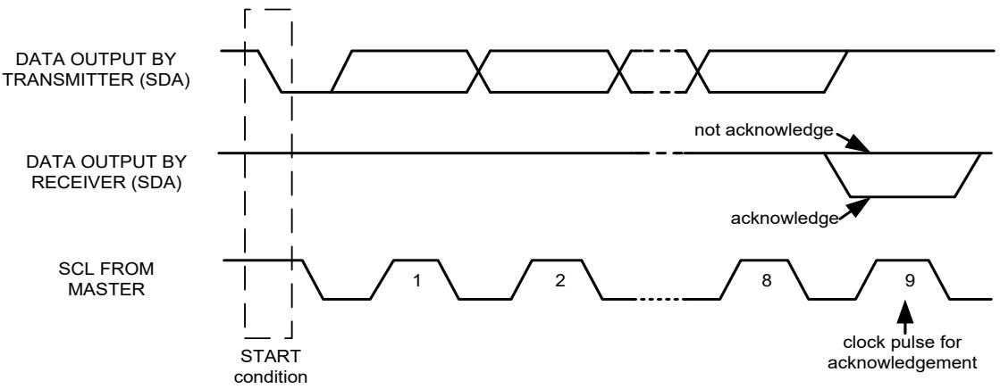
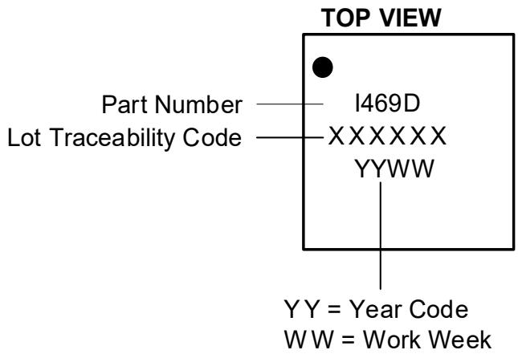

# GENERAL DESCRIPTION

The ICM-40609-D is a 6-axis MEMS MotionTracking™ device that combines a 3-axis gyroscope and a 3-axis accelerometer designed for the drone market. The ICM-40609-D is form factor compatible with our legacy drone devices – making the transition to the latest offering incredibly simple.

The ICM-40609-D takes advantage of a state-of-theart architecture design that enhances the IMU’s performance and accuracy over temperature, making it the ideal drone solution to control the stability of the platform during long flight times that may experience high temperature shifts.

The ICM-40609-D has a max ODR of $3 2 \mathsf { K H z }$ , making it the best sampling rate available in a consumer device. The ability to capture data at such a high ODR allows for customers to easily find any anomalies or errors that need to be addressed during flight. The accel Full Scale Range has also been increased to $3 2 \mathsf { g } .$ , allowing for substantial linear movement to be easily tracked.

Other industry-leading features include on-chip 16- bit ADCs, programmable digital filters, an embedded temperature sensor, and programmable interrupts. The device features ${ \mathsf { I } } ^ { 2 } { \mathsf { C } }$ and SPI serial interfaces, a VDD operating range of 1.71V to 3.6V, and a separate VDDIO operating range of 1.71V to 3.6V.

# FEATURES

• Gyro Noise: 4.5mdps/√Hz • Gyro Offset Stability TC: ±10mdps/C • Gyro Sensitivity Error: $\pm 0 . 5 \%$ • Gyro Sensitivity/temp: ±0.045%/C • Accel Noise: 100μg/√Hz • Accel Offset Stability TC: ±0.15mg/C • Accel Sensitivity Error: $\pm 0 . 5 \%$ • Accel Sensitivity/temp: $\pm 0 . 0 0 7 \% / \mathrm { c }$ • Gyro $^ +$ Accel Combo current: 0.77mA • Extended Accel Full Scale Range: 32g Improved ODR Latency: 32KHz

# Custom architecture for Improved Thermal Gradient Behavior

Best-in-class accuracy over temperature

# Increased ODR/FSR for max data collection

32g Accel Full Scale Range $3 2 \mathsf { K H z }$ ODR Sample Rate

# Form Factor Compatible with Legacy Products

Easily transition from ICM-20602 and MPU-6500 Only minor pinout changes required

# APPLICATIONS

• Drones, Flight Controller

<table><tr><td rowspan=1 colspan=1>PARTNUMBER</td><td rowspan=1 colspan=1>PACKAGE SIZE</td><td rowspan=1 colspan=1>TARGETMARKETS</td><td rowspan=1 colspan=1>FULL SCALE RANGE</td><td rowspan=1 colspan=1>ODR &amp; SAMPLE SYNCH</td><td rowspan=1 colspan=1>STATUS</td></tr><tr><td rowspan=1 colspan=1>MPU-6500</td><td rowspan=1 colspan=1>3x3x0.9mm 24-pin QFN</td><td rowspan=1 colspan=1>Various</td><td rowspan=1 colspan=1>±2000dps/16g</td><td rowspan=1 colspan=1>G: 8KHz/ A: 4KHz16-bit</td><td rowspan=1 colspan=1>NR/ND</td></tr><tr><td rowspan=1 colspan=1>ICM-20602</td><td rowspan=1 colspan=1>3x3x0.75mm 16-pin LGA</td><td rowspan=1 colspan=1>Various</td><td rowspan=1 colspan=1>±2000dps/16g</td><td rowspan=1 colspan=1>G: 8KHz/A: 4KHz16-bit</td><td rowspan=1 colspan=1>NR/ND</td></tr><tr><td rowspan=1 colspan=1>ICM-42688-P</td><td rowspan=1 colspan=1>2.5x3 14mm-pin LGA</td><td rowspan=1 colspan=1>Robotics/HMD/loT/Drones</td><td rowspan=1 colspan=1>±2000dps/16g</td><td rowspan=1 colspan=1>32KHzG: 19-bit /A: 18-bit</td><td rowspan=1 colspan=1>Active</td></tr><tr><td rowspan=1 colspan=1>ICM-40609-D</td><td rowspan=1 colspan=1>3x3x0.91mm 24-pin LGA</td><td rowspan=1 colspan=1>Enhanced DronePerformance</td><td rowspan=1 colspan=1>±2000dps/32g</td><td rowspan=1 colspan=1>32KHz16-bit</td><td rowspan=1 colspan=1>2H 2022</td></tr></table>

# TABLE OF CONTENTS

General Description.......... .... 1 Features....   
Applications ..

# 1 Introduction. . 8

1.1 Purpose and Scope ..... . 8   
1.2 Product Overview .. . 8   
1.3 Applications . . 8

# Features... 9

2.1 Gyroscope Features ... . 9   
2.2 Accelerometer Features . . 9   
2.3 Additional Features.. 9

# Electrical Characteristics. . 10

3.1 Gyroscope Specifications.... .... 10   
3.2 Accelerometer Specifications . ... 11   
3.3 Electrical Specifications .... ... 12   
3.4 ${ \mathsf { I } } ^ { 2 } { \mathsf { C } }$ Timing Characterization .. .. 14   
3.5 SPI Timing Characterization – 4-Wire SPI Mode .. .... 15   
3.6 SPI Timing Characterization – 3-Wire SPI Mode ..... ... 16   
3.7 Absolute Maximum Ratings.... .. 17

# Applications Information.. .18

4.1 Pin Out Diagram and Signal Description.. .18   
4.2 Typical Operating Circuit.. . 19   
4.3 Bill of Materials for External Components.. ... 20   
4.4 System Block Diagram . ... 21   
4.5 Overview... .. 21   
4.6 Three-Axis MEMS Gyroscope with 16-bit ADCs and Signal Conditioning... .. 21   
4.7 Three-Axis MEMS Accelerometer with 16-bit ADCs and Signal Conditioning .... .. 21   
4.8 I 2 C and SPI Host Interface .. . 21   
4.9 Self-Test .. . 21   
4.10 Clocking .... .. 22   
4.11 Sensor Data Registers.. ... 22   
4.12 Interrupts.... ... 22   
4.13 Digital-Output Temperature Sensor.. ... 22   
4.14 Bias and LDOs ... . 22   
4.15 Charge Pump .... . 22   
4.16 Standard Power Modes.. .23

# 5 Signal Path .. .. 24

# 5.1 Notch Filter ... . 24

6.1 Packet Structure . .36   
6.2 FIFO Header .. . 37   
6.3 Maximum FIFO Storage ... . 38   
6.4 FIFO Configuration Registers . . 38

7.1 Wake-On Motion Interrupt............. ..... 40

# Digital Interface .. . 41

8.1 ${ \mathsf { I } } ^ { 2 } { \mathsf { C } }$ and SPI Serial Interfaces .. .41   
8.2 I 2 C Interface . . 41   
8.3 I 2 C Communications Protocol . . 41   
8.4 I 2 C Terms ... . 43   
8.5 SPI Interface. . 44

# Assembly .. . 45

9.1 Orientation of Axes... . 45   
9.2 Package Dimensions ..... . 46   
10 Part Number Package Marking........ .... 48

# 11 Use Notes ... .. 49

11.1 Accelerometer Mode Transitions.. . 49   
11.2 Accelerometer Low Power (LP) Mode Averaging Filter Setting .. 49   
11.3 Settings for ${ \mathsf { I } } ^ { 2 } { \mathsf { C } } ,$ and SPI Operation. . 49   
11.4 Notch Filter and Anti-Alias Filter Operation . . 49   
11.5 Register Values Modification.. . 49

# 12 Register Map .. .. 50

12.1 User Bank 0 Register Map .. . 50   
12.2 User Bank 1 Register Map . . 51   
12.3 User Bank 2 Register Map . . 52   
12.4 User Bank 4 Register Map .. . 52

3 User Bank 0 Register Map – Descriptions............. .... 53

13.1 DEVICE_CONFIG . . 53

13.2 DRIVE_CONFIG .

13.3 INT_CONFIG....... ........... 54   
13.4 FIFO_CONFIG ........ ........................................................................................................................... 54   
13.5 TEMP_DATA1 ....... .................. 54   
13.6 TEMP_DATA0 ......... ........................................................................................................................... 55   
13.7 ACCEL_DATA_X1................................................................................................................................ 55   
13.8 ACCEL_DATA_X0... ..... 55   
13.9 ACCEL_DATA_Y1....... .................................................................................................................... 55   
13.10 ACCEL_DATA_Y0..... ...................................................................................................................... 55   
13.11 ACCEL_DATA_Z1 ................................................................................................................................ 56   
13.12 ACCEL_DATA_Z0..... ......................................................................................................................... 56   
13.13 GYRO_DATA_X1.... ......................................................................................................................... 56   
13.14 GYRO_DATA_X0.... ................................................................................................................ ...... 56   
13.15 GYRO_DATA_Y1................................................................................................................................. 56   
13.16 GYRO_DATA_Y0................................................................................................................................. 57   
13.17 GYRO_DATA_Z1.. ..... 57   
13.18 GYRO_DATA_Z0................................................................................................................................. 57   
13.19 TMST_FSYNCH....   
13.20 TMST_FSYNCL.................................................................................................................................... 57   
13.21 INT_STATUS ....................................................................................................................................... 58   
13.22 FIFO_COUNTH ................................................................................................................................... 58   
13.23 FIFO_COUNTL .................................................................................................................................... 58   
13.24 FIFO_DATA......................................................................................................................................... 59   
13.25 INT_STATUS2........ ........................................................................................................................... 59   
13.26 SIGNAL_PATH_RESET . ............................................................................................... ...... 59   
13.27 INTF_CONFIG0.... ........................................................................................................ ...... 59   
13.28 INTF_CONFIG1..... ......................................................................................................................... 61   
13.29 PWR_MGMT0.... ......................................................................................................... ...... 61   
13.30 GYRO_CONFIG0...... ...................................................................................................... ....... 62   
13.31 ACCEL_CONFIG0... .... 63   
13.32 GYRO_CONFIG1..... ....... 64   
13.33 GYRO_ACCEL_CONFIG0... .............................................................................................. ...... 65   
13.34 ACCEL_CONFIG1 .......   
13.35 TMST_CONFIG .. ..... 66   
13.36 WOM_CONFIG...... .......................   
13.37 FIFO_CONFIG1........ ........................................................................................................................... 67   
13.38 FIFO_CONFIG2........   
13.39 FIFO_CONFIG3........ .......................................................................................................................... 68

# 13.40 FSYNC_CONFIG.. . 68

13.41 INT_CONFIG0.... ...... 69   
13.42 INT_CONFIG1.. .......................................................................................................... ..... 69   
13.43 INT_SOURCE0 .. ............................................................................................... .... 70   
13.44 INT_SOURCE1 .................................................................................................................................... 70   
13.45 INT_SOURCE3 ....... ............................................................................................................................. 71   
13.46 INT_SOURCE4 ...... ................................................................................................................ ...... 71   
13.47 FIFO_LOST_PKT0 . ... 71   
13.48 FIFO_LOST_PKT1 . ... 72   
13.49 SELF_TEST_CONFIG ..... ................................................................................................... ..... 72   
13.50 WHO_AM_I ....... .................................................................................................................. 72   
13.51 REG_BANK_SEL..... ......................................................................................................................... 73   
User Bank 1 Register Map – Descriptions... .................................................................................................... 74   
14.1 SENSOR_CONFIG0 .. ..... 74   
14.2 GYRO_CONFIG_STATIC2... .... 74   
14.3 GYRO_CONFIG_STATIC3... ... 74   
14.4 GYRO_CONFIG_STATIC4... ............................. .... 75   
14.5 GYRO_CONFIG_STATIC5... ..... 75   
14.6 GYRO_CONFIG_STATIC6... .... 75   
14.7 GYRO_CONFIG_STATIC7....... ....................................... ........ 75   
14.8 GYRO_CONFIG_STATIC8... ..... 76   
14.9 GYRO_CONFIG_STATIC9......... ........................................................................................................... 76   
14.10 GYRO_CONFIG_STATIC10 .................................................................................................................. 76   
14.11 XG_ST_DATA........ ............................................................................................................ 77   
14.12 YG_ST_DATA....... ......................................................................................................................... 77   
14.13 ZG_ST_DATA... ... 77   
14.14 TMSTVAL0 ......................................................................................................................................... 77   
14.15 TMSTVAL1 .... ............................................................................................................. ..... 77   
14.16 TMSTVAL2 .......... ........................................................................................................................... 78   
14.17 INTF_CONFIG4...... ............................................................................................................................ 78   
14.18 INTF_CONFIG5..... .............................................................................................................. 78   
User Bank 2 Register Map – Descriptions......................................................................................................... 79   
15.1 ACCEL_CONFIG_STATIC2.. .............................................................................................................. 79   
15.2 ACCEL_CONFIG_STATIC3 ................................................................................................................... 79   
15.3 ACCEL_CONFIG_STATIC4 ................................................................................................................... 79   
15.4 XA_ST_DATA........ ............................................................................................................................. 79   
15.5 YA_ST_DATA.... ................................................................................................................ ....... 80   
15.6 ZA_ST_DATA.. ... 80   
16 User Bank 4 Register Map – Descriptions.. .. 81   
16.1 ACCEL_WOM_X_THR.. .. 81   
16.2 ACCEL_WOM_Y_THR.. .. 81   
16.3 ACCEL_WOM_Z_THR.. .. 81   
16.4 OFFSET_USER0 .. .. 81   
16.5 OFFSET_USER1 . .. 82   
16.6 OFFSET_USER2 . .. 82   
16.7 OFFSET_USER3 . .. 82   
16.8 OFFSET_USER4 . .. 82   
16.9 OFFSET_USER5 . .. 83   
16.10 OFFSET_USER6 . .. 83   
16.11 OFFSET_USER7 . .. 83   
16.12 OFFSET_USER8 . .. 83   
17 Reference . .. 84   
18 Revision History .. .. 85

# TABLE OF FIGURES

Figure 1. ${ \mathsf { I } } ^ { 2 } { \mathsf { C } }$ Bus Timing Diagram.. .. 14   
Figure 2. 4-Wire SPI Mode-3 Bus Timing Diagram.. .. 15   
Figure 3. 4-Wire SPI Mode-0 Bus Timing Diagram. . 15   
Figure 4. 3-Wire Mode-3 SPI Bus Timing Diagram....... .......................................................... ...... 16   
Figure 5. 3-Wire Mode-0 SPI Bus Timing Diagram.. .. 16   
Figure 6. Pin Out Diagram for ICM-40609-D 3x3.0x0.91 mm LGA.. ..18   
Figure 7. ICM-40609-D Application Schematic ( ${ \mathsf { I } } ^ { 2 } { \mathsf { C } }$ Interface to Host) . ..19   
Figure 8. ICM-40609-D Application Schematic (SPI Interface to Host)... .................................. ....19   
Figure 9. ICM-40609-D System Block Diagram .... ........... 21   
Figure 10. ICM-40609-D Signal Path. .. 24   
Figure 11. FIFO Packet Structure . ..... ... 36   
Figure 12. Maximum FIFO Storage ... ....................................................................................................... ... 38   
Figure 13. START and STOP Conditions ..... ....................................................................................................... ..... 41   
Figure 14. Acknowledge on the ${ 1 ^ { 2 } } \mathsf { C }$ Bus . ................................................................................... ... 42   
Figure 15. Complete ${ \mathsf { I } } ^ { 2 } { \mathsf { C } }$ Data Transfer . ... 42   
Figure 16. Typical SPI Master/Slave Configuration.. ... 44   
Figure 17. Orientation of Axes of Sensitivity and Polarity of Rotation ...... ......45

# TABLE OF TABLES

Table 1. Gyroscope Specifications .... ... 10   
Table 2. Accelerometer Specifications ..... .......................................................................................................... ..... 11   
Table 3. D.C. Electrical Characteristics.... ..... 12   
Table 4. A.C. Electrical Characteristics.. ................................................................. ..... 13   
Table 5. ${ \mathsf { I } } ^ { 2 } { \mathsf { C } }$ Timing Characteristics.... .... 14   
Table 6. 4-Wire SPI Timing Characteristics (24-MHz Operation). ...15   
Table 7. 3-Wire SPI Timing Characteristics (24-MHz Operation). ....16   
Table 8. Absolute Maximum Ratings .. ... 17   
Table 9. Signal Descriptions ... ................................................................................. ... 18   
Table 10. Bill of Materials . ................................................................................... .... 20   
Table 11. Standard Power Modes for ICM-40609-D.. ......................................................................................... .... 23   
Table 12. ${ \mathsf { I } } ^ { 2 } { \mathsf { C } }$ Terms ....... ............................................................................................. 43

# 1 INTRODUCTION

# 1.1 PURPOSE AND SCOPE

This document is a product specification, providing a description, specifications, and design related information on the ICM-40609-D Single-Interface MotionTracking device. The device is housed in a small $3 \times 3 \times 0 . 9 1 \ : \mathsf { m m } \ : 2 \angle$ -pin LGA package.

# 1.2 PRODUCT OVERVIEW

The ICM-40609-D is a 6-axis MotionTracking device that combines a 3-axis gyroscope, and a 3-axis accelerometer in a small $3 \times 3 \times 0 . 9 1 \mathrm { m m }$ (24-pin LGA) package. It also features a 2 KB FIFO that can lower the traffic on the serial bus interface and reduce power consumption by allowing the system processor to burst read sensor data and then go into a low-power mode. ICM-40609-D, with its 6-axis integration, enables manufacturers to eliminate the costly and complex selection, qualification, and system level integration of discrete devices, guaranteeing optimal motion performance for consumers.

The gyroscope supports eight programmable full-scale range settings from $^ { \pm 1 5 . 6 2 5 }$ dps to $\pm 2 0 0 0$ dps, and the accelerometer supports four programmable full-scale range settings from $\pm 4 \sigma$ to $\pm 3 2 { \tt g }$ .

Other industry-leading features include on-chip 16-bit ADCs, programmable digital filters, an embedded temperature sensor, and programmable interrupts. The device features ${ \mathsf { I } } ^ { 2 } { \mathsf { C } }$ and SPI serial interfaces, a VDD operating range of 1.71V to 3.6V, and a separate VDDIO operating range of 1.71V to 3.6V.

The host interface can be configured to support ${ \mathsf { I } } ^ { 2 } { \mathsf { C } }$ slave or SPI slave modes. The $1 ^ { 2 } { \mathsf { C } }$ interface supports speeds up to 1 MHz, and the SPI interface supports speeds up to $2 4 M H z$ .

By leveraging its patented and volume-proven CMOS-MEMS fabrication platform, which integrates MEMS wafers with companion CMOS electronics through wafer-level bonding, InvenSense has driven the package size down to a footprint and thickness of $3 \times 3 \times 0 . 9 1 \mathrm { m m }$ (24-pin LGA), to provide a very small yet high-performance low-cost package. The device provides high robustness by supporting $_ { 2 0 , 0 0 0 g }$ shock reliability.

# 1.3 APPLICATIONS

• Drones • Robotics • IoT Applications

# 2 FEATURES

# 2.1 GYROSCOPE FEATURES

The triple-axis MEMS gyroscope in the ICM-40609-D includes a wide range of features:

Digital-output X-, Y-, and Z-axis angular rate sensors (gyroscopes) with programmable full-scale range of ±15.625, ±31.25, ±62.5, $\pm 1 2 5$ , $\pm 2 5 0$ , $\pm 5 0 0$ , $\pm 1 0 0 0$ , and $\pm 2 0 0 0$ degrees/sec • Low Noise (LN) power mode support • Digitally programmable low-pass filters • Factory calibrated sensitivity scale factor • Self-test

# 2.2 ACCELEROMETER FEATURES

The triple-axis MEMS accelerometer in ICM-40609-D includes a wide range of features:

Digital-output X-, Y-, and Z-axis accelerometer with programmable full-scale range of $\pm 4 g , \pm 8 g , \pm 1 6 g$ and $\pm 3 2 g$ • Low Noise (LN) and Low Power (LP) power modes support • User-programmable interrupts • Wake-on-motion interrupt for low power operation of applications processor • Self-test

# 2.3 ADDITIONAL FEATURES

ICM-40609-D includes the following additional features:

• 2KB FIFO buffer enables the applications processor to read the data in bursts   
• User-programmable digital filters for gyroscope, accelerometer, and temperature sensor   
• Wake on Motion: Detects motion when accelerometer data exceeds a programmable threshold   
• 1 MHz I2 C / 24 MHz SPI slave host interface   
• Digital-output temperature sensor   
• Smallest and thinnest LGA package for portable devices: 3 x 3 x 0.91 mm (24-pin LGA)   
• 20,000g shock tolerant   
• MEMS structure hermetically sealed and bonded at wafer level   
• RoHS and Green compliant

# 3 ELECTRICAL CHARACTERISTICS

# 3.1 GYROSCOPE SPECIFICATIONS

Typical Operating Circuit of section 4.2, $\mathsf { V D D } = 1 . 8 \mathsf { V }$ , $\mathsf { V D D } \mathsf { I O } = 1 . 8 \mathsf { V }$ , ${ \mathsf { T } } _ { \mathsf { A } } { = } 2 5 ^ { \circ } { \mathsf { C } } _ { \iota }$ , unless otherwise noted.

Table 1. Gyroscope Specifications   

<table><tr><td rowspan=1 colspan=1>PARAMETER</td><td rowspan=1 colspan=1>CONDITIONS</td><td rowspan=1 colspan=1>MIN</td><td rowspan=1 colspan=1>TYP</td><td rowspan=1 colspan=1>MAX</td><td rowspan=1 colspan=1>UNITS</td><td rowspan=1 colspan=1>NOTES</td></tr><tr><td rowspan=1 colspan=7>GYROSCOPE SENSITIVITY</td></tr><tr><td rowspan=8 colspan=1>Full-Scale Range</td><td rowspan=1 colspan=1>GYRO_FS_SEL=0</td><td rowspan=1 colspan=1></td><td rowspan=1 colspan=1>±2000</td><td rowspan=1 colspan=1></td><td rowspan=1 colspan=1>/s</td><td rowspan=1 colspan=1>2</td></tr><tr><td rowspan=1 colspan=1>GYRO_FS_SEL=1</td><td rowspan=1 colspan=1></td><td rowspan=1 colspan=1>±1000</td><td rowspan=1 colspan=1></td><td rowspan=1 colspan=1>/s</td><td rowspan=1 colspan=1>2</td></tr><tr><td rowspan=1 colspan=1>GYRO_FS_SEL=2</td><td rowspan=1 colspan=1></td><td rowspan=1 colspan=1>±500</td><td rowspan=1 colspan=1></td><td rowspan=1 colspan=1>/s</td><td rowspan=1 colspan=1>2</td></tr><tr><td rowspan=1 colspan=1>GYRO_FS_SEL =3</td><td rowspan=1 colspan=1></td><td rowspan=1 colspan=1>±250</td><td rowspan=1 colspan=1></td><td rowspan=1 colspan=1>/s</td><td rowspan=1 colspan=1>2</td></tr><tr><td rowspan=1 colspan=1>GYRO_FS_SEL=4</td><td rowspan=1 colspan=1></td><td rowspan=1 colspan=1>±125</td><td rowspan=1 colspan=1></td><td rowspan=1 colspan=1>/s</td><td rowspan=1 colspan=1>2</td></tr><tr><td rowspan=1 colspan=1>GYRO_FS_SEL=5</td><td rowspan=1 colspan=1></td><td rowspan=1 colspan=1>±62.5</td><td rowspan=1 colspan=1></td><td rowspan=1 colspan=1>/s</td><td rowspan=1 colspan=1>2</td></tr><tr><td rowspan=1 colspan=1>GYRO_FS_SEL=6</td><td rowspan=1 colspan=1></td><td rowspan=1 colspan=1>±31.25</td><td rowspan=1 colspan=1></td><td rowspan=1 colspan=1>/s</td><td rowspan=1 colspan=1>2</td></tr><tr><td rowspan=1 colspan=1>GYRO_FS_SEL=7</td><td rowspan=1 colspan=1></td><td rowspan=1 colspan=1>±15.625</td><td rowspan=1 colspan=1></td><td rowspan=1 colspan=1>/s</td><td rowspan=1 colspan=1>2</td></tr><tr><td rowspan=1 colspan=1>Gyroscope ADC Word Length</td><td rowspan=1 colspan=1></td><td rowspan=1 colspan=1></td><td rowspan=1 colspan=1>16</td><td rowspan=1 colspan=1></td><td rowspan=1 colspan=1>bits</td><td rowspan=1 colspan=1>2</td></tr><tr><td rowspan=8 colspan=1>Sensitivity Scale Factor</td><td rowspan=1 colspan=1>GYRO_FS_SEL=0</td><td rowspan=1 colspan=1></td><td rowspan=1 colspan=1>16.4</td><td rowspan=1 colspan=1></td><td rowspan=1 colspan=1>LSB/(9/s)</td><td rowspan=1 colspan=1>2</td></tr><tr><td rowspan=1 colspan=1>GYRO_FS_SEL=1</td><td rowspan=1 colspan=1></td><td rowspan=1 colspan=1>32.8</td><td rowspan=1 colspan=1></td><td rowspan=1 colspan=1>LSB/(9/s)</td><td rowspan=1 colspan=1>2</td></tr><tr><td rowspan=1 colspan=1>GYRO_FS_SEL=2</td><td rowspan=1 colspan=1></td><td rowspan=1 colspan=1>65.5</td><td rowspan=1 colspan=1></td><td rowspan=1 colspan=1>LSB/(/s)</td><td rowspan=1 colspan=1>2</td></tr><tr><td rowspan=1 colspan=1>GYRO_FS_SEL =3</td><td rowspan=1 colspan=1></td><td rowspan=1 colspan=1>131</td><td rowspan=1 colspan=1></td><td rowspan=1 colspan=1>LSB/(9/s)</td><td rowspan=1 colspan=1>2</td></tr><tr><td rowspan=1 colspan=1>GYRO_FS_SEL =4</td><td rowspan=1 colspan=1></td><td rowspan=1 colspan=1>262</td><td rowspan=1 colspan=1></td><td rowspan=1 colspan=1>LSB/(9/s)</td><td rowspan=1 colspan=1>2</td></tr><tr><td rowspan=1 colspan=1>GYRO_FS_SEL=5</td><td rowspan=1 colspan=1></td><td rowspan=1 colspan=1>524.3</td><td rowspan=1 colspan=1></td><td rowspan=1 colspan=1>LSB/(9/s)</td><td rowspan=1 colspan=1>2</td></tr><tr><td rowspan=1 colspan=1>GYRO_FS_SEL =6</td><td rowspan=1 colspan=1></td><td rowspan=1 colspan=1>1048.6</td><td rowspan=1 colspan=1></td><td rowspan=1 colspan=1>LSB/(/s)</td><td rowspan=1 colspan=1>2</td></tr><tr><td rowspan=1 colspan=1>GYRO_FS_SEL=7</td><td rowspan=1 colspan=1></td><td rowspan=1 colspan=1>2097.2</td><td rowspan=1 colspan=1></td><td rowspan=1 colspan=1>LSB/(/s)</td><td rowspan=1 colspan=1>2</td></tr><tr><td rowspan=1 colspan=1>Sensitivity Scale Factor Initial Tolerance</td><td rowspan=1 colspan=1>25℃</td><td rowspan=1 colspan=1></td><td rowspan=1 colspan=1>±0.5</td><td rowspan=1 colspan=1></td><td rowspan=1 colspan=1>%</td><td rowspan=1 colspan=1>1</td></tr><tr><td rowspan=1 colspan=1>Sensitivity Scale Factor Variation OverTemperature</td><td rowspan=1 colspan=1>-40°C to +85°C</td><td rowspan=1 colspan=1></td><td rowspan=1 colspan=1>±0.045</td><td rowspan=1 colspan=1></td><td rowspan=1 colspan=1>%/</td><td rowspan=1 colspan=1>3</td></tr><tr><td rowspan=1 colspan=1>Nonlinearity</td><td rowspan=1 colspan=1>Best fit straight line; 25C</td><td rowspan=1 colspan=1></td><td rowspan=1 colspan=1>±0.1</td><td rowspan=1 colspan=1></td><td rowspan=1 colspan=1>%</td><td rowspan=1 colspan=1>3</td></tr><tr><td rowspan=1 colspan=1>Cross-Axis Sensitivity</td><td rowspan=1 colspan=1></td><td rowspan=1 colspan=1></td><td rowspan=1 colspan=1>±1</td><td rowspan=1 colspan=1></td><td rowspan=1 colspan=1>%</td><td rowspan=1 colspan=1>3</td></tr><tr><td rowspan=1 colspan=1></td><td rowspan=1 colspan=1>ZERO-RATE OUTPUT (ZRO)</td><td rowspan=1 colspan=1></td><td rowspan=1 colspan=3></td><td rowspan=1 colspan=1></td></tr><tr><td rowspan=1 colspan=1>Initial ZRO Tolerance</td><td rowspan=1 colspan=1>Board-level,25℃</td><td rowspan=1 colspan=1></td><td rowspan=1 colspan=1>±1</td><td rowspan=1 colspan=1></td><td rowspan=1 colspan=1>/s</td><td rowspan=1 colspan=1>3</td></tr><tr><td rowspan=1 colspan=1>ZRO Variation vs.Temperature</td><td rowspan=1 colspan=1>-40°Cto +85C</td><td rowspan=1 colspan=1></td><td rowspan=1 colspan=1>±0.01</td><td rowspan=1 colspan=1></td><td rowspan=1 colspan=1>/s/</td><td rowspan=1 colspan=1>3</td></tr><tr><td rowspan=1 colspan=1></td><td rowspan=1 colspan=1>OTHER PARAMETERS</td><td rowspan=1 colspan=1></td><td rowspan=1 colspan=3></td><td rowspan=1 colspan=1></td></tr><tr><td rowspan=1 colspan=1>Rate Noise Spectral Density</td><td rowspan=1 colspan=1>@10 Hz</td><td rowspan=1 colspan=1></td><td rowspan=1 colspan=1>0.0045</td><td rowspan=1 colspan=1></td><td rowspan=1 colspan=1>/s/VHz</td><td rowspan=1 colspan=1>1</td></tr><tr><td rowspan=1 colspan=1>Total RMS Noise</td><td rowspan=1 colspan=1>Bandwidth = 100 Hz</td><td rowspan=1 colspan=1></td><td rowspan=1 colspan=1>0.045</td><td rowspan=1 colspan=1></td><td rowspan=1 colspan=1>/s-rms</td><td rowspan=1 colspan=1>4</td></tr><tr><td rowspan=1 colspan=1>Gyroscope Mechanical Frequencies</td><td rowspan=1 colspan=1></td><td rowspan=1 colspan=1>25</td><td rowspan=1 colspan=1>27</td><td rowspan=1 colspan=1>29</td><td rowspan=1 colspan=1>KHz</td><td rowspan=1 colspan=1>1</td></tr><tr><td rowspan=2 colspan=1>Low Pass Filter Response</td><td rowspan=1 colspan=1>ODR&lt;1kHz</td><td rowspan=1 colspan=1>5</td><td rowspan=1 colspan=1></td><td rowspan=1 colspan=1>500</td><td rowspan=1 colspan=1>Hz</td><td rowspan=1 colspan=1>2</td></tr><tr><td rowspan=1 colspan=1>ODR≥1kHz</td><td rowspan=1 colspan=1>5</td><td rowspan=1 colspan=1></td><td rowspan=1 colspan=1>995</td><td rowspan=1 colspan=1>Hz</td><td rowspan=1 colspan=1>2</td></tr><tr><td rowspan=1 colspan=1>Gyroscope Start-Up Time</td><td rowspan=1 colspan=1>Time from gyroenable to gyrodriveready</td><td rowspan=1 colspan=1></td><td rowspan=1 colspan=1>30</td><td rowspan=1 colspan=1></td><td rowspan=1 colspan=1>ms</td><td rowspan=1 colspan=1>3</td></tr><tr><td rowspan=1 colspan=1>Output Data Rate</td><td></td><td rowspan=1 colspan=1>12.5</td><td rowspan=1 colspan=1></td><td rowspan=1 colspan=1>32000</td><td rowspan=1 colspan=1>Hz</td><td rowspan=1 colspan=1>2</td></tr></table>

1. Tested in production. 2. Guaranteed by design. 3. Derived from validation or characterization of parts, not guaranteed in production. 4. Calculated from Rate Noise Spectral Density.

# Notes:

# 3.2 ACCELEROMETER SPECIFICATIONS

Typical Operating Circuit of section 4.2, $/ \mathsf { D } \mathsf { D } = 1 . 8 \mathsf { V } _ { \mathrm { \Omega } }$ , VDDIO $= 1 . 8 \mathsf { V }$ , ${ \sf T } _ { \sf A } { = } 2 5 ^ { \circ } { \sf C } ,$ unless otherwise noted.

# Notes:

Table 2. Accelerometer Specifications   

<table><tr><td rowspan=1 colspan=1>PARAMETER</td><td rowspan=1 colspan=1>CONDITIONS</td><td rowspan=1 colspan=1>MIN</td><td rowspan=1 colspan=1>TYP</td><td rowspan=1 colspan=1>MAX</td><td rowspan=1 colspan=1>UNITS</td><td rowspan=1 colspan=1>NOTES</td></tr><tr><td rowspan=1 colspan=7>ACCELEROMETER SENSITIVITY</td></tr><tr><td rowspan=4 colspan=1>Full-Scale Range</td><td rowspan=1 colspan=1>ACCEL_FS_SEL=0</td><td rowspan=1 colspan=1></td><td rowspan=1 colspan=1>±32</td><td rowspan=1 colspan=1></td><td rowspan=1 colspan=1>g</td><td rowspan=1 colspan=1>2</td></tr><tr><td rowspan=1 colspan=1>ACCEL_FS_SEL=1</td><td rowspan=1 colspan=1></td><td rowspan=1 colspan=1>±16</td><td rowspan=1 colspan=1></td><td rowspan=1 colspan=1>g</td><td rowspan=1 colspan=1>2</td></tr><tr><td rowspan=1 colspan=1>ACCEL_FS_SEL=2</td><td rowspan=1 colspan=1></td><td rowspan=1 colspan=1>±8</td><td rowspan=1 colspan=1></td><td rowspan=1 colspan=1>g</td><td rowspan=1 colspan=1>2</td></tr><tr><td rowspan=1 colspan=1>ACCEL_FS_SEL =3</td><td rowspan=1 colspan=1></td><td rowspan=1 colspan=1>±4</td><td rowspan=1 colspan=1></td><td rowspan=1 colspan=1>g</td><td rowspan=1 colspan=1>2</td></tr><tr><td rowspan=1 colspan=1>ADC Word Length</td><td rowspan=1 colspan=1>Output in two&#x27;s complement format</td><td rowspan=1 colspan=1></td><td rowspan=1 colspan=1>16</td><td rowspan=1 colspan=1></td><td rowspan=1 colspan=1>bits</td><td rowspan=1 colspan=1>2</td></tr><tr><td rowspan=4 colspan=1>Sensitivity Scale Factor</td><td rowspan=1 colspan=1>ACCEL_FS_SEL=0</td><td rowspan=1 colspan=1></td><td rowspan=1 colspan=1>1,024</td><td rowspan=1 colspan=1></td><td rowspan=1 colspan=1>LSB/g</td><td rowspan=1 colspan=1>2</td></tr><tr><td rowspan=1 colspan=1>ACCEL_FS_SEL=1</td><td rowspan=1 colspan=1></td><td rowspan=1 colspan=1>2,048</td><td rowspan=1 colspan=1></td><td rowspan=1 colspan=1>LSB/g</td><td rowspan=1 colspan=1>2</td></tr><tr><td rowspan=1 colspan=1>ACCEL_FS_SEL=2</td><td rowspan=1 colspan=1></td><td rowspan=1 colspan=1>4,096</td><td rowspan=1 colspan=1></td><td rowspan=1 colspan=1>LSB/g</td><td rowspan=1 colspan=1>2</td></tr><tr><td rowspan=1 colspan=1>ACCEL_FS_SEL=3</td><td rowspan=1 colspan=1></td><td rowspan=1 colspan=1>8,192</td><td rowspan=1 colspan=1></td><td rowspan=1 colspan=1>LSB/g</td><td rowspan=1 colspan=1>2</td></tr><tr><td rowspan=1 colspan=1>Sensitivity Scale Factor Initial Tolerance</td><td rowspan=1 colspan=1>Component-level</td><td rowspan=1 colspan=1></td><td rowspan=1 colspan=1>±0.5</td><td rowspan=1 colspan=1></td><td rowspan=1 colspan=1>%</td><td rowspan=1 colspan=1>1</td></tr><tr><td rowspan=1 colspan=1>Sensitivity Change vs.Temperature</td><td rowspan=1 colspan=1>-40°C to +85°C</td><td rowspan=1 colspan=1></td><td rowspan=1 colspan=1>±0.007</td><td rowspan=1 colspan=1></td><td rowspan=1 colspan=1>%/℃</td><td rowspan=1 colspan=1>3</td></tr><tr><td rowspan=1 colspan=1>Nonlinearity</td><td rowspan=1 colspan=1>Best Fit Straight Line,±2g</td><td rowspan=1 colspan=1></td><td rowspan=1 colspan=1>±0.1</td><td rowspan=1 colspan=1></td><td rowspan=1 colspan=1>%</td><td rowspan=1 colspan=1>3</td></tr><tr><td rowspan=1 colspan=1>Cross-Axis Sensitivity</td><td rowspan=1 colspan=1></td><td rowspan=1 colspan=1></td><td rowspan=1 colspan=1>±1</td><td rowspan=1 colspan=1></td><td rowspan=1 colspan=1>%</td><td rowspan=1 colspan=1>3</td></tr><tr><td rowspan=1 colspan=7>ZERO-G OUTPUT</td></tr><tr><td rowspan=1 colspan=1>Initial Tolerance</td><td rowspan=1 colspan=1>Board-level,all axes</td><td rowspan=1 colspan=1></td><td rowspan=1 colspan=1>±40</td><td rowspan=1 colspan=1></td><td rowspan=1 colspan=1>mg</td><td rowspan=1 colspan=1>3</td></tr><tr><td rowspan=1 colspan=1>Zero-G Level Change vs.Temperature</td><td rowspan=1 colspan=1>-40°Cto +85C</td><td rowspan=1 colspan=1></td><td rowspan=1 colspan=1>±0.15</td><td rowspan=1 colspan=1></td><td rowspan=1 colspan=1>mg/c</td><td rowspan=1 colspan=1>3</td></tr><tr><td rowspan=1 colspan=7>OTHER PARAMETERS</td></tr><tr><td rowspan=1 colspan=1>Power Spectral Density</td><td rowspan=1 colspan=1>@10Hz</td><td rowspan=1 colspan=1></td><td rowspan=1 colspan=1>100</td><td rowspan=1 colspan=1></td><td rowspan=1 colspan=1>μg/VHz</td><td rowspan=1 colspan=1>1</td></tr><tr><td rowspan=1 colspan=1>RMS Noise</td><td rowspan=1 colspan=1>Bandwidth = 100 Hz</td><td rowspan=1 colspan=1></td><td rowspan=1 colspan=1>1.00</td><td rowspan=1 colspan=1></td><td rowspan=1 colspan=1>mg-rms</td><td rowspan=1 colspan=1>4</td></tr><tr><td rowspan=2 colspan=1>Low-Pass Filter Response</td><td rowspan=1 colspan=1>ODR&lt;1kHz</td><td rowspan=1 colspan=1>5</td><td rowspan=1 colspan=1></td><td rowspan=1 colspan=1>500</td><td rowspan=1 colspan=1>Hz</td><td rowspan=1 colspan=1>2</td></tr><tr><td rowspan=1 colspan=1>ODR≥1kHz</td><td rowspan=1 colspan=1>5</td><td rowspan=1 colspan=1></td><td rowspan=1 colspan=1>995</td><td rowspan=1 colspan=1>Hz</td><td rowspan=1 colspan=1>2</td></tr><tr><td rowspan=1 colspan=1>Accelerometer Startup Time</td><td rowspan=1 colspan=1>From sleep mode to valid data</td><td rowspan=1 colspan=1></td><td rowspan=1 colspan=1>10</td><td rowspan=1 colspan=1></td><td rowspan=1 colspan=1>ms</td><td rowspan=1 colspan=1>3</td></tr><tr><td rowspan=1 colspan=1>Output Data Rate</td><td></td><td rowspan=1 colspan=1>1.5625</td><td rowspan=1 colspan=1></td><td rowspan=1 colspan=1>32000</td><td rowspan=1 colspan=1>Hz</td><td rowspan=1 colspan=1>2</td></tr></table>

1. Tested in production. 2. Guaranteed by design. 3. Derived from validation or characterization of parts, not guaranteed in production. 4. Calculated from Power Spectral Density.

# 3.3 ELECTRICAL SPECIFICATIONS

# 3.3.1 D.C. Electrical Characteristics

Typical Operating Circuit of section 4.2, $\mathsf { V D D } = 1 . 8 \mathsf { V }$ , $\mathsf { V D D } \mathsf { I O } = 1 . 8 \mathsf { V }$ , $T _ { \mathsf { A } } { = } 2 5 ^ { \circ } \mathsf { C }$ , unless otherwise noted.

Table 3. D.C. Electrical Characteristics   

<table><tr><td rowspan=1 colspan=1>PARAMETER</td><td rowspan=1 colspan=1>CONDITIONS</td><td rowspan=1 colspan=1>MIN</td><td rowspan=1 colspan=1>TYP</td><td rowspan=1 colspan=1>MAX</td><td rowspan=1 colspan=1>UNITS</td><td rowspan=1 colspan=1>NOTES</td></tr><tr><td rowspan=1 colspan=7>SUPPLY VOLTAGES</td></tr><tr><td rowspan=1 colspan=1>VDD</td><td rowspan=1 colspan=1></td><td rowspan=1 colspan=1>1.71</td><td rowspan=1 colspan=1>1.8</td><td rowspan=1 colspan=1>3.6</td><td rowspan=1 colspan=1>v</td><td rowspan=1 colspan=1>1</td></tr><tr><td rowspan=1 colspan=1>VDDIO</td><td rowspan=1 colspan=1></td><td rowspan=1 colspan=1>1.71</td><td rowspan=1 colspan=1>1.8</td><td rowspan=1 colspan=1>3.6</td><td rowspan=1 colspan=1>v</td><td rowspan=1 colspan=1>1</td></tr><tr><td rowspan=1 colspan=3>SUPPLYCURRENTS</td><td rowspan=1 colspan=1></td><td rowspan=1 colspan=2></td><td rowspan=1 colspan=1></td></tr><tr><td rowspan=3 colspan=1>Low-Noise Mode</td><td rowspan=1 colspan=1>6-Axis Gyroscope + Accelerometer</td><td rowspan=1 colspan=1></td><td rowspan=1 colspan=1>0.77</td><td rowspan=1 colspan=1></td><td rowspan=1 colspan=1>mA</td><td rowspan=1 colspan=1>2</td></tr><tr><td rowspan=1 colspan=1>3-Axis Accelerometer</td><td rowspan=1 colspan=1></td><td rowspan=1 colspan=1>0.27</td><td rowspan=1 colspan=1></td><td rowspan=1 colspan=1>mA</td><td rowspan=1 colspan=1>2</td></tr><tr><td rowspan=1 colspan=1>3-Axis Gyroscope</td><td rowspan=1 colspan=1></td><td rowspan=1 colspan=1>0.61</td><td rowspan=1 colspan=1></td><td rowspan=1 colspan=1>mA</td><td rowspan=1 colspan=1>2</td></tr><tr><td rowspan=1 colspan=1>Accelerometer Low-Power Mode(Gyroscope disabled)</td><td rowspan=1 colspan=1>200Hz ODR,1x averaging</td><td rowspan=1 colspan=1></td><td rowspan=1 colspan=1>0.06</td><td rowspan=1 colspan=1></td><td rowspan=1 colspan=1>mA</td><td rowspan=1 colspan=1>2</td></tr><tr><td rowspan=1 colspan=1>Full-Chip Sleep Mode</td><td rowspan=1 colspan=1>At 25C</td><td rowspan=1 colspan=1></td><td rowspan=1 colspan=1>11</td><td rowspan=1 colspan=1></td><td rowspan=1 colspan=1>HA</td><td rowspan=1 colspan=1>2</td></tr><tr><td rowspan=1 colspan=1></td><td rowspan=1 colspan=6>TEMPERATURE RANGE</td></tr><tr><td rowspan=1 colspan=1>Specified Temperature Range</td><td rowspan=1 colspan=1>Performance parameters are not applicablebeyond Specified Temperature Range</td><td rowspan=1 colspan=1>-40</td><td rowspan=1 colspan=1></td><td rowspan=1 colspan=1>+85</td><td rowspan=1 colspan=1>℃</td><td rowspan=1 colspan=1>1</td></tr></table>

# Notes:

1. Guaranteed by design.   
2. Derived from validation or characterization of parts, not guaranteed in production.

# 3.3.2 A.C. Electrical Characteristics

Typical Operating Circuit of section 4.2, $\mathsf { V D D } = 1 . 8 \mathsf { V }$ , VDDIO $= 1 . 8 \mathsf { V }$ , ${ \sf T } _ { \sf A } { = } 2 5 ^ { \circ } { \sf C } _ { \iota }$ , unless otherwise noted.

Table 4. A.C. Electrical Characteristics   

<table><tr><td rowspan=1 colspan=1>PARAMETER</td><td rowspan=1 colspan=1>CONDITIONS</td><td rowspan=1 colspan=1>MIN</td><td rowspan=1 colspan=1>TYP</td><td rowspan=1 colspan=1>MAX</td><td rowspan=1 colspan=1>UNITS</td><td rowspan=1 colspan=1>NOTES</td></tr><tr><td rowspan=1 colspan=7>SUPPLIES</td></tr><tr><td rowspan=1 colspan=1>Supply Ramp Time</td><td rowspan=1 colspan=1>Monotonic ramp.Ramp rate is 10% to 90% ofthe final value</td><td rowspan=1 colspan=1>0.01</td><td rowspan=1 colspan=1></td><td rowspan=1 colspan=1>3</td><td rowspan=1 colspan=1>ms</td><td rowspan=1 colspan=1>1</td></tr><tr><td rowspan=1 colspan=1>Power Supply Noise</td><td rowspan=1 colspan=1></td><td rowspan=1 colspan=1></td><td rowspan=1 colspan=1>10</td><td rowspan=1 colspan=1></td><td rowspan=1 colspan=1>mvpeak-peak</td><td rowspan=1 colspan=1>1</td></tr><tr><td rowspan=1 colspan=7>TEMPERATURESENSOR</td></tr><tr><td rowspan=1 colspan=1>Operating Range</td><td rowspan=1 colspan=1>Ambient</td><td rowspan=1 colspan=1>-40</td><td rowspan=1 colspan=1></td><td rowspan=1 colspan=1>85</td><td rowspan=1 colspan=1>℃</td><td rowspan=1 colspan=1>1</td></tr><tr><td rowspan=1 colspan=1>25COutput</td><td></td><td rowspan=1 colspan=1></td><td rowspan=1 colspan=1>0</td><td rowspan=1 colspan=1></td><td rowspan=1 colspan=1>LSB</td><td rowspan=1 colspan=1>3</td></tr><tr><td rowspan=1 colspan=1>ADC Resolution</td><td></td><td rowspan=1 colspan=1></td><td rowspan=1 colspan=1>16</td><td rowspan=1 colspan=1></td><td rowspan=1 colspan=1>bits</td><td rowspan=1 colspan=1>2</td></tr><tr><td rowspan=1 colspan=1>ODR</td><td rowspan=1 colspan=1>With Filter</td><td rowspan=1 colspan=1>25</td><td rowspan=1 colspan=1></td><td rowspan=1 colspan=1>8000</td><td rowspan=1 colspan=1>Hz</td><td rowspan=1 colspan=1>2</td></tr><tr><td rowspan=1 colspan=1>RoomTemperature Offset</td><td rowspan=1 colspan=1>25°℃</td><td rowspan=1 colspan=1>-5</td><td rowspan=1 colspan=1></td><td rowspan=1 colspan=1>5</td><td rowspan=1 colspan=1>℃</td><td rowspan=1 colspan=1>3</td></tr><tr><td rowspan=1 colspan=1>Stabilization Time</td><td></td><td rowspan=1 colspan=1></td><td rowspan=1 colspan=1></td><td rowspan=1 colspan=1>14000</td><td rowspan=1 colspan=1>μs</td><td rowspan=1 colspan=1>2</td></tr><tr><td rowspan=1 colspan=1>Sensitivity</td><td rowspan=1 colspan=1>Untrimmed</td><td rowspan=1 colspan=1></td><td rowspan=1 colspan=1>132.48</td><td rowspan=1 colspan=1></td><td rowspan=1 colspan=1>LSB/C</td><td rowspan=1 colspan=1>1</td></tr><tr><td rowspan=1 colspan=1>Sensitivity for FIFO data</td><td></td><td rowspan=1 colspan=1></td><td rowspan=1 colspan=1>2.07</td><td rowspan=1 colspan=1></td><td rowspan=1 colspan=1>LSB/C</td><td rowspan=1 colspan=1>1</td></tr><tr><td rowspan=1 colspan=1></td><td rowspan=1 colspan=1>POWER-ON RESET</td><td rowspan=1 colspan=1>RESET</td><td rowspan=1 colspan=1></td><td rowspan=1 colspan=1></td><td rowspan=1 colspan=1></td><td rowspan=1 colspan=1></td></tr><tr><td rowspan=1 colspan=1>Start-uptimeforregister read/write</td><td rowspan=1 colspan=1>Frompower-up</td><td rowspan=1 colspan=1></td><td rowspan=1 colspan=1></td><td rowspan=1 colspan=1>1</td><td rowspan=1 colspan=1>ms</td><td rowspan=1 colspan=1>1</td></tr><tr><td rowspan=1 colspan=1></td><td rowspan=1 colspan=1>CADDRESS</td><td rowspan=1 colspan=1></td><td rowspan=1 colspan=1></td><td rowspan=1 colspan=1></td><td rowspan=1 colspan=1></td><td rowspan=1 colspan=1></td></tr><tr><td rowspan=1 colspan=1>I²C ADDRESS</td><td rowspan=1 colspan=1>AP_AD0 = 0AP_AD0= 1</td><td rowspan=1 colspan=1></td><td rowspan=1 colspan=1>11010001101001</td><td rowspan=1 colspan=1></td><td rowspan=1 colspan=1></td><td rowspan=1 colspan=1></td></tr><tr><td rowspan=1 colspan=7>DIGITAL INPUTS (FSYNC, SCLK,SI,)</td></tr><tr><td rowspan=1 colspan=1>VIH, High Level Input Voltage</td><td rowspan=1 colspan=1></td><td rowspan=1 colspan=1>0.7*VDDI0</td><td rowspan=1 colspan=1></td><td rowspan=1 colspan=1></td><td rowspan=1 colspan=1>V</td><td rowspan=3 colspan=1>1</td></tr><tr><td rowspan=1 colspan=1>VIL, Low Level Input Voltage</td><td rowspan=1 colspan=1></td><td rowspan=1 colspan=1></td><td rowspan=1 colspan=1></td><td rowspan=1 colspan=1>0.3*VDDI0</td><td rowspan=1 colspan=1>V</td></tr><tr><td rowspan=1 colspan=1>C, Input Capacitance</td><td rowspan=1 colspan=1></td><td rowspan=1 colspan=1></td><td rowspan=1 colspan=1>&lt;10</td><td rowspan=1 colspan=1></td><td rowspan=1 colspan=1>pF</td></tr><tr><td rowspan=1 colspan=7>DIGITAL OUTPUT (SDO, INT1, INT2)</td></tr><tr><td rowspan=1 colspan=1>VoH, High Level Output Voltage</td><td rowspan=1 colspan=1>RLOAD=1MΩ;</td><td rowspan=1 colspan=1>0.9*VDDI0</td><td rowspan=1 colspan=1></td><td rowspan=1 colspan=1></td><td rowspan=1 colspan=1>V</td><td rowspan=5 colspan=1>1</td></tr><tr><td rowspan=1 colspan=1>VoL1,LOW-Level Output Voltage</td><td rowspan=1 colspan=1>RLOAD=1MΩ;</td><td rowspan=1 colspan=1></td><td rowspan=1 colspan=1></td><td rowspan=1 colspan=1>0.1*VDDIO</td><td rowspan=1 colspan=1>V</td></tr><tr><td rowspan=1 colspan=1>VoLINT,INT Low-Level Output Voltage</td><td rowspan=1 colspan=1>OPEN=1,0.3 mA sinkCurrent</td><td rowspan=1 colspan=1></td><td rowspan=1 colspan=1></td><td rowspan=1 colspan=1>0.1</td><td rowspan=1 colspan=1>V</td></tr><tr><td rowspan=1 colspan=1>Output Leakage Current</td><td rowspan=1 colspan=1>OPEN=1</td><td rowspan=1 colspan=1></td><td rowspan=1 colspan=1>100</td><td rowspan=1 colspan=1></td><td rowspan=1 colspan=1>nA</td></tr><tr><td rowspan=1 colspan=1>tINT, INT Pulse Width</td><td rowspan=1 colspan=1>int_tpulse_duration=0,1(100us,8us );</td><td rowspan=1 colspan=1>8</td><td rowspan=1 colspan=1></td><td rowspan=1 colspan=1>100</td><td rowspan=1 colspan=1>μs</td></tr><tr><td rowspan=1 colspan=1></td><td rowspan=1 colspan=1>I2CI/O (SCL, SDA)</td><td rowspan=1 colspan=1>SDA）</td><td rowspan=1 colspan=1></td><td rowspan=1 colspan=1></td><td rowspan=1 colspan=1></td><td rowspan=1 colspan=1></td></tr><tr><td rowspan=1 colspan=1>VIL,LOW-Level Input Voltage</td><td rowspan=1 colspan=1></td><td rowspan=1 colspan=1>-0.5V</td><td rowspan=1 colspan=1></td><td rowspan=1 colspan=1>0.3*VDDI0</td><td rowspan=1 colspan=1>v</td><td rowspan=7 colspan=1>1</td></tr><tr><td rowspan=1 colspan=1>VIH, HIGH-Level Input Voltage</td><td rowspan=1 colspan=1></td><td rowspan=1 colspan=1>0.7*VDDI0</td><td rowspan=1 colspan=1></td><td rowspan=1 colspan=1>VDDIO +0.5V</td><td rowspan=1 colspan=1>V</td></tr><tr><td rowspan=1 colspan=1>Vhys, Hysteresis</td><td rowspan=1 colspan=1></td><td rowspan=1 colspan=1></td><td rowspan=1 colspan=1>0.1*VDDI0</td><td rowspan=1 colspan=1></td><td rowspan=1 colspan=1>V</td></tr><tr><td rowspan=1 colspan=1>VoL LOW-LevelOutput Voltage</td><td rowspan=1 colspan=1>3 mA sink current</td><td rowspan=1 colspan=1>0</td><td rowspan=1 colspan=1></td><td rowspan=1 colspan=1>0.4</td><td rowspan=1 colspan=1>v</td></tr><tr><td rowspan=1 colspan=1>loL, LOW-Level Output Current</td><td rowspan=1 colspan=1>VoL=0.4 VVoL=0.6V</td><td rowspan=1 colspan=1></td><td rowspan=1 colspan=1>3</td><td rowspan=1 colspan=1></td><td rowspan=1 colspan=1>mAmA</td></tr><tr><td rowspan=1 colspan=1>Output Leakage Current</td><td rowspan=1 colspan=1></td><td rowspan=1 colspan=1></td><td rowspan=1 colspan=1>100</td><td rowspan=1 colspan=1></td><td rowspan=1 colspan=1>nA</td></tr><tr><td rowspan=1 colspan=1>tof,OutputFall Time from ViHmaxtoVILmax</td><td rowspan=1 colspan=1>Cb bus capacitance in pf</td><td rowspan=1 colspan=1>20+0.1Cb</td><td rowspan=1 colspan=1></td><td rowspan=1 colspan=1>300</td><td rowspan=1 colspan=1>ns</td></tr><tr><td rowspan=1 colspan=7>INTERNAL CLOCK SOURCE</td></tr><tr><td rowspan=2 colspan=1>Clock Frequency Initial Tolerance</td><td rowspan=1 colspan=1>CLKSEL=2bo0 or gyro inactive; 25C</td><td rowspan=1 colspan=1>-3</td><td rowspan=1 colspan=1></td><td rowspan=1 colspan=1>+3</td><td rowspan=1 colspan=1>%</td><td rowspan=1 colspan=1>1</td></tr><tr><td rowspan=1 colspan=1>CLK_SEL=&#x27;2b01 and gyro active; 25C</td><td rowspan=1 colspan=1>-1</td><td rowspan=1 colspan=1></td><td rowspan=1 colspan=1>+1</td><td rowspan=1 colspan=1>%</td><td rowspan=1 colspan=1>1</td></tr><tr><td rowspan=2 colspan=1>Frequency Variation over Temperature</td><td rowspan=1 colspan=1>CLK_SEL=2bo0 or gyroinactive;-40Cto+85℃</td><td rowspan=1 colspan=1></td><td rowspan=1 colspan=1></td><td rowspan=1 colspan=1>±3</td><td rowspan=1 colspan=1>%</td><td rowspan=1 colspan=1>1</td></tr><tr><td rowspan=1 colspan=1>CLK_SEL=2b01and gyro active;-40C to +85C</td><td rowspan=1 colspan=1></td><td rowspan=1 colspan=1></td><td rowspan=1 colspan=1>±2</td><td rowspan=1 colspan=1>%</td><td rowspan=1 colspan=1>1</td></tr></table>

# Notes:

1. Expected results based on design, will be updated after characterization. Not guaranteed in production.   
2. Guaranteed by design.   
3. To be Production tested.

# 3.4 I 2 C TIMING CHARACTERIZATION

Typical Operating Circuit of section 4.2, $\mathsf { V D D } = 1 . 8 \mathsf { V }$ , VDDIO $= 1 . 8 \mathsf { V }$ , ${ \sf T } _ { \sf A } { = } 2 5 ^ { \circ } { \sf C } _ { \iota }$ , unless otherwise noted.

<table><tr><td rowspan=1 colspan=1>PARAMETERS</td><td rowspan=1 colspan=1>CONDITIONS</td><td rowspan=1 colspan=1>MIN</td><td rowspan=1 colspan=1>TYPICAL</td><td rowspan=1 colspan=1>MAX</td><td rowspan=1 colspan=1>UNITS</td><td rowspan=1 colspan=1>NOTES</td></tr><tr><td rowspan=1 colspan=1>ICTIMING</td><td rowspan=1 colspan=1>IC FAST-MODE PLUS</td><td rowspan=1 colspan=1></td><td rowspan=1 colspan=1></td><td rowspan=1 colspan=1></td><td rowspan=1 colspan=1></td><td rowspan=1 colspan=1></td></tr><tr><td rowspan=1 colspan=1>fscL, SCLClock Frequency</td><td rowspan=1 colspan=1></td><td rowspan=1 colspan=1></td><td rowspan=1 colspan=1></td><td rowspan=1 colspan=1>1</td><td rowspan=1 colspan=1>MHz</td><td rowspan=1 colspan=1>1</td></tr><tr><td rowspan=1 colspan=1>tHD.STA, (Repeated) START Condition Hold Time</td><td rowspan=1 colspan=1></td><td rowspan=1 colspan=1>0.26</td><td rowspan=1 colspan=1></td><td rowspan=1 colspan=1></td><td rowspan=1 colspan=1>us</td><td rowspan=1 colspan=1>1</td></tr><tr><td rowspan=1 colspan=1>tLow, SCL Low Period</td><td rowspan=1 colspan=1></td><td rowspan=1 colspan=1>0.5</td><td rowspan=1 colspan=1></td><td rowspan=1 colspan=1></td><td rowspan=1 colspan=1>us</td><td rowspan=1 colspan=1>1</td></tr><tr><td rowspan=1 colspan=1>tHIGH, SCL High Period</td><td rowspan=1 colspan=1></td><td rowspan=1 colspan=1>0.26</td><td rowspan=1 colspan=1></td><td rowspan=1 colspan=1></td><td rowspan=1 colspan=1>uμs</td><td rowspan=1 colspan=1>1</td></tr><tr><td rowspan=1 colspan=1>tsU.STA, Repeated START Condition Setup Time</td><td rowspan=1 colspan=1></td><td rowspan=1 colspan=1>0.26</td><td rowspan=1 colspan=1></td><td rowspan=1 colspan=1></td><td rowspan=1 colspan=1>us</td><td rowspan=1 colspan=1>1</td></tr><tr><td rowspan=1 colspan=1>tHD.DAT,SDA Data HoldTme</td><td rowspan=1 colspan=1></td><td rowspan=1 colspan=1>0</td><td rowspan=1 colspan=1></td><td rowspan=1 colspan=1></td><td rowspan=1 colspan=1>us</td><td rowspan=1 colspan=1>1</td></tr><tr><td rowspan=1 colspan=1>tsU.DAT, SDA Data SetupTime</td><td rowspan=1 colspan=1></td><td rowspan=1 colspan=1>50</td><td rowspan=1 colspan=1></td><td rowspan=1 colspan=1></td><td rowspan=1 colspan=1>ns</td><td rowspan=1 colspan=1>1</td></tr><tr><td rowspan=1 colspan=1>tr, SDA and SCL Rise Time</td><td rowspan=1 colspan=1>Cb bus cap.from 10 to 400 pF</td><td rowspan=1 colspan=1></td><td rowspan=1 colspan=1></td><td rowspan=1 colspan=1>120</td><td rowspan=1 colspan=1>ns</td><td rowspan=1 colspan=1>1</td></tr><tr><td rowspan=1 colspan=1>t,SDA andSCLFall Time</td><td rowspan=1 colspan=1>Cb bus cap.from10 to 400 pF</td><td rowspan=1 colspan=1></td><td rowspan=1 colspan=1></td><td rowspan=1 colspan=1>120</td><td rowspan=1 colspan=1>ns</td><td rowspan=1 colspan=1>1</td></tr><tr><td rowspan=1 colspan=1>tsu.sTo, STOP Condition Setup Time</td><td rowspan=1 colspan=1></td><td rowspan=1 colspan=1>0.5</td><td rowspan=1 colspan=1></td><td rowspan=1 colspan=1></td><td rowspan=1 colspan=1>us</td><td rowspan=1 colspan=1>1</td></tr><tr><td rowspan=1 colspan=1>tBUF, Bus Free Time Between STOP and STARTCondition</td><td rowspan=1 colspan=1></td><td rowspan=1 colspan=1>0.5</td><td rowspan=1 colspan=1></td><td rowspan=1 colspan=1></td><td rowspan=1 colspan=1>us</td><td rowspan=1 colspan=1>1</td></tr><tr><td rowspan=1 colspan=1>Cb, Capacitive Load for each Bus Line</td><td rowspan=1 colspan=1></td><td rowspan=1 colspan=1></td><td rowspan=1 colspan=1>&lt;400</td><td rowspan=1 colspan=1></td><td rowspan=1 colspan=1>pF</td><td rowspan=1 colspan=1>1</td></tr><tr><td rowspan=1 colspan=1>tvD.DAT,Data ValidTime</td><td rowspan=1 colspan=1></td><td rowspan=1 colspan=1></td><td rowspan=1 colspan=1></td><td rowspan=1 colspan=1>0.45</td><td rowspan=1 colspan=1>μs</td><td rowspan=1 colspan=1>1</td></tr><tr><td rowspan=1 colspan=1>tvD.Ack,Data ValidAcknowledgeTime</td><td rowspan=1 colspan=1></td><td rowspan=1 colspan=1></td><td rowspan=1 colspan=1></td><td rowspan=1 colspan=1>0.45</td><td rowspan=1 colspan=1>us</td><td rowspan=1 colspan=1>1</td></tr></table>

# Table 5. I2C Timing Characteristics

# Notes:

1. Based on characterization of 5 parts over temperature and voltage as mounted on evaluation board or in sockets

  
Figure 1. I2C Bus Timing Diagram

# 3.5 SPI TIMING CHARACTERIZATION – 4-WIRE SPI MODE

Typical Operating Circuit of section 4.2, $\mathsf { V D D } = 1 . 8 \mathsf { V }$ , $\mathsf { V D D } \mathsf { I O } = 1 . 8 \mathsf { V }$ , ${ \sf T } _ { \sf A } { = } 2 5 ^ { \circ } { \sf C } _ { \iota }$ , unless otherwise noted.

<table><tr><td rowspan=1 colspan=1>PARAMETERS</td><td rowspan=1 colspan=1>CONDITIONS</td><td rowspan=1 colspan=1>MIN</td><td rowspan=1 colspan=1>TYP</td><td rowspan=1 colspan=1>MAX</td><td rowspan=1 colspan=1>UNITS</td><td rowspan=1 colspan=1>NOTES</td></tr><tr><td rowspan=1 colspan=1>SPI TIMING</td><td rowspan=1 colspan=1></td><td rowspan=1 colspan=1></td><td rowspan=1 colspan=1></td><td rowspan=1 colspan=1></td><td rowspan=1 colspan=1></td><td rowspan=1 colspan=1></td></tr><tr><td rowspan=1 colspan=1>fsPc,SCLK Clock Frequency</td><td rowspan=1 colspan=1>Default</td><td rowspan=1 colspan=1></td><td rowspan=1 colspan=1></td><td rowspan=1 colspan=1>24</td><td rowspan=1 colspan=1>MHz</td><td rowspan=1 colspan=1>1</td></tr><tr><td rowspan=1 colspan=1>tow, SCLK Low Period</td><td rowspan=1 colspan=1></td><td rowspan=1 colspan=1>24.5</td><td rowspan=1 colspan=1></td><td rowspan=1 colspan=1></td><td rowspan=1 colspan=1>ns</td><td rowspan=1 colspan=1>1</td></tr><tr><td rowspan=1 colspan=1>tHIGH, SCLK High Period</td><td rowspan=1 colspan=1></td><td rowspan=1 colspan=1>24.5</td><td rowspan=1 colspan=1></td><td rowspan=1 colspan=1></td><td rowspan=1 colspan=1>ns</td><td rowspan=1 colspan=1>1</td></tr><tr><td rowspan=1 colspan=1>tsu.cs, CS Setup Time</td><td rowspan=1 colspan=1></td><td rowspan=1 colspan=1>39</td><td rowspan=1 colspan=1></td><td rowspan=1 colspan=1></td><td rowspan=1 colspan=1>ns</td><td rowspan=1 colspan=1>1</td></tr><tr><td rowspan=1 colspan=1>tHD.cs, CS HoldTime</td><td rowspan=1 colspan=1></td><td rowspan=1 colspan=1>18</td><td rowspan=1 colspan=1></td><td rowspan=1 colspan=1></td><td rowspan=1 colspan=1>ns</td><td rowspan=1 colspan=1>1</td></tr><tr><td rowspan=1 colspan=1>tsU.SDI, SDI Setup Time</td><td rowspan=1 colspan=1></td><td rowspan=1 colspan=1>13</td><td rowspan=1 colspan=1></td><td rowspan=1 colspan=1></td><td rowspan=1 colspan=1>ns</td><td rowspan=1 colspan=1>1</td></tr><tr><td rowspan=1 colspan=1>tHD.SDI, SDI Hold Time</td><td rowspan=1 colspan=1></td><td rowspan=1 colspan=1>8</td><td rowspan=1 colspan=1></td><td rowspan=1 colspan=1></td><td rowspan=1 colspan=1>ns</td><td rowspan=1 colspan=1>1</td></tr><tr><td rowspan=1 colspan=1>tvD.SDo,SDO Valid Time</td><td rowspan=1 colspan=1>Cload = 20 pF</td><td rowspan=1 colspan=1></td><td rowspan=1 colspan=1></td><td rowspan=1 colspan=1>21.5</td><td rowspan=1 colspan=1>ns</td><td rowspan=1 colspan=1>1</td></tr><tr><td rowspan=1 colspan=1>tHD.SDo, SDO Hold Time</td><td rowspan=1 colspan=1>Cload = 20 pF</td><td rowspan=1 colspan=1>9.5</td><td rowspan=1 colspan=1></td><td rowspan=1 colspan=1></td><td rowspan=1 colspan=1>ns</td><td rowspan=1 colspan=1>1</td></tr><tr><td rowspan=1 colspan=1>tpIs.SDo, SDO Output Disable Time</td><td rowspan=1 colspan=1></td><td rowspan=1 colspan=1></td><td rowspan=1 colspan=1></td><td rowspan=1 colspan=1>28</td><td rowspan=1 colspan=1>ns</td><td rowspan=1 colspan=1>1</td></tr></table>

# Notes:

1. Based on characterization of 5 parts over temperature and voltage as mounted on evaluation board or in sockets   
2. Based on other parameter values

  
Table 6. 4-Wire SPI Timing Characteristics (24-MHz Operation)   
Figure 2. 4-Wire SPI Mode-3 Bus Timing Diagram

  
Figure 3. 4-Wire SPI Mode-0 Bus Timing Diagram

# 3.6 SPI TIMING CHARACTERIZATION – 3-WIRE SPI MODE

Typical Operating Circuit of section 4.2, $\mathsf { V D D } = 1 . 8 \mathsf { V }$ , $\mathsf { V D D } \mathsf { I O } = 1 . 8 \mathsf { V }$ , ${ \sf T } _ { \sf A } { = } 2 5 ^ { \circ } { \sf C } _ { \iota }$ , unless otherwise noted.

<table><tr><td rowspan=1 colspan=1>PARAMETERS</td><td rowspan=1 colspan=1>CONDITIONS</td><td rowspan=1 colspan=1>MIN</td><td rowspan=1 colspan=1>TYP</td><td rowspan=1 colspan=1>MAX</td><td rowspan=1 colspan=1>UNITS</td><td rowspan=1 colspan=1>NOTES</td></tr><tr><td rowspan=1 colspan=1>SPI TIMING</td><td rowspan=1 colspan=1></td><td rowspan=1 colspan=1></td><td rowspan=1 colspan=1></td><td rowspan=1 colspan=1></td><td rowspan=1 colspan=1></td><td rowspan=1 colspan=1></td></tr><tr><td rowspan=1 colspan=1>fsPc,SCLK Clock Frequency</td><td rowspan=1 colspan=1>Default</td><td rowspan=1 colspan=1></td><td rowspan=1 colspan=1></td><td rowspan=1 colspan=1>24</td><td rowspan=1 colspan=1>MHz</td><td rowspan=1 colspan=1>1</td></tr><tr><td rowspan=1 colspan=1>tow, SCLK Low Period</td><td rowspan=1 colspan=1></td><td rowspan=1 colspan=1>24.5</td><td rowspan=1 colspan=1></td><td rowspan=1 colspan=1></td><td rowspan=1 colspan=1>ns</td><td rowspan=1 colspan=1>1</td></tr><tr><td rowspan=1 colspan=1>tHIGH, SCLK High Period</td><td rowspan=1 colspan=1></td><td rowspan=1 colspan=1>24.5</td><td rowspan=1 colspan=1></td><td rowspan=1 colspan=1></td><td rowspan=1 colspan=1>ns</td><td rowspan=1 colspan=1>1</td></tr><tr><td rowspan=1 colspan=1>tsu.cs, CS Setup Time</td><td rowspan=1 colspan=1></td><td rowspan=1 colspan=1>39</td><td rowspan=1 colspan=1></td><td rowspan=1 colspan=1></td><td rowspan=1 colspan=1>ns</td><td rowspan=1 colspan=1>1</td></tr><tr><td rowspan=1 colspan=1>tHD.cs, CS Hold Time</td><td rowspan=1 colspan=1></td><td rowspan=1 colspan=1>5</td><td rowspan=1 colspan=1></td><td rowspan=1 colspan=1></td><td rowspan=1 colspan=1>ns</td><td rowspan=1 colspan=1>1</td></tr><tr><td rowspan=1 colspan=1>tsu.SDio, SDIO Input SetupTime</td><td rowspan=1 colspan=1></td><td rowspan=1 colspan=1>13</td><td rowspan=1 colspan=1></td><td rowspan=1 colspan=1></td><td rowspan=1 colspan=1>ns</td><td rowspan=1 colspan=1>1</td></tr><tr><td rowspan=1 colspan=1>tHD.SDIo,SDIO Input HoldTime</td><td rowspan=1 colspan=1></td><td rowspan=1 colspan=1>8</td><td rowspan=1 colspan=1></td><td rowspan=1 colspan=1></td><td rowspan=1 colspan=1>ns</td><td rowspan=1 colspan=1>1</td></tr><tr><td rowspan=1 colspan=1>tvD.SDIo,SDIO Output Valid Time</td><td rowspan=1 colspan=1>Cload = 20 pF</td><td rowspan=1 colspan=1></td><td rowspan=1 colspan=1></td><td rowspan=1 colspan=1>18.5</td><td rowspan=1 colspan=1>ns</td><td rowspan=1 colspan=1>1</td></tr><tr><td rowspan=1 colspan=1>tHD.SDI0, SDIO Output Hold Time</td><td rowspan=1 colspan=1>Cload = 20 pF</td><td rowspan=1 colspan=1>9.5</td><td rowspan=1 colspan=1></td><td rowspan=1 colspan=1></td><td rowspan=1 colspan=1>ns</td><td rowspan=1 colspan=1>1</td></tr><tr><td rowspan=1 colspan=1>tDIs.SDIo, SDlO Output Disable Time</td><td rowspan=1 colspan=1></td><td rowspan=1 colspan=1></td><td rowspan=1 colspan=1></td><td rowspan=1 colspan=1>28</td><td rowspan=1 colspan=1>ns</td><td rowspan=1 colspan=1>1</td></tr></table>

# Notes:

1. Based on characterization of 5 parts over temperature and voltage as mounted on evaluation board or in sockets   
2. Based on other parameter values

  
Table 7. 3-Wire SPI Timing Characteristics (24-MHz Operation)   
Figure 4. 3-Wire Mode-3 SPI Bus Timing Diagram

  
Figure 5. 3-Wire Mode-0 SPI Bus Timing Diagram

# 3.7 ABSOLUTE MAXIMUM RATINGS

Stress above those listed as “Absolute Maximum Ratings” may cause permanent damage to the device. These are stress ratings only and functional operation of the device at these conditions is not implied. Exposure to the absolute maximum ratings conditions for extended periods may affect device reliability.

Table 8. Absolute Maximum Ratings   

<table><tr><td rowspan=1 colspan=1>PARAMETER</td><td rowspan=1 colspan=1>RATING</td></tr><tr><td rowspan=1 colspan=1>Supply Voltage, VDD</td><td rowspan=1 colspan=1>-0.5V to +4V</td></tr><tr><td rowspan=1 colspan=1>Supply Voltage, VDDIO</td><td rowspan=1 colspan=1>-0.5V to +4V</td></tr><tr><td rowspan=1 colspan=1>Input Voltage Level (FSYNC, SCL, SDA)</td><td rowspan=1 colspan=1>-0.5V to VDDIO + 0.5V</td></tr><tr><td rowspan=1 colspan=1>Acceleration (Any Axis, unpowered)</td><td rowspan=1 colspan=1>20,000g for 0.2 ms</td></tr><tr><td rowspan=1 colspan=1>Operating Temperature Range</td><td rowspan=1 colspan=1>-40°C to +85°C</td></tr><tr><td rowspan=1 colspan=1> Storage Temperature Range</td><td rowspan=1 colspan=1>-40°C to +125°C</td></tr><tr><td rowspan=1 colspan=1>Electrostatic Discharge (ESD) Protection</td><td rowspan=1 colspan=1>2 kV (HBM);200V (MM)</td></tr><tr><td rowspan=1 colspan=1>Latch-up</td><td rowspan=1 colspan=1>JEDEC Class  (2),125C±100 mA</td></tr></table>

# 4 APPLICATIONS INFORMATION

# 4.1 PIN OUT DIAGRAM AND SIGNAL DESCRIPTION

Table 9. Signal Descriptions   

<table><tr><td rowspan=1 colspan=1>PIN NUMBER</td><td rowspan=1 colspan=1>PIN NAME</td><td rowspan=1 colspan=1> PIN DESCRIPTION</td></tr><tr><td rowspan=1 colspan=1>8</td><td rowspan=1 colspan=1>VDDI0</td><td rowspan=1 colspan=1>Digital I/O supply voltage</td></tr><tr><td rowspan=1 colspan=1>9</td><td rowspan=1 colspan=1>AD0 /SDO</td><td rowspan=1 colspan=1>ADO: I²C Slave Address LSB SDO: SPl serial data output (4-wire mode)</td></tr><tr><td rowspan=1 colspan=1>11</td><td rowspan=1 colspan=1>RESV</td><td rowspan=1 colspan=1>RESV: Connect to GND</td></tr><tr><td rowspan=1 colspan=1>12</td><td rowspan=1 colspan=1>INT1 / INT</td><td rowspan=1 colspan=1>INT1: Interrupt 1INT: Interrupt if all interrupts mapped to pin 12</td></tr><tr><td rowspan=1 colspan=1>13</td><td rowspan=1 colspan=1>VDD</td><td rowspan=1 colspan=1>Power supply voltage</td></tr><tr><td rowspan=1 colspan=1>18</td><td rowspan=1 colspan=1>GND</td><td rowspan=1 colspan=1>Power supply ground</td></tr><tr><td rowspan=1 colspan=1>19</td><td rowspan=1 colspan=1>INT2 / FSYNC</td><td rowspan=1 colspan=1>INT2: Interrupt 2FSYNC: Frame sync input; Connect to GND if FSYNC selected butFSYNC signal not input</td></tr><tr><td rowspan=1 colspan=1>20</td><td rowspan=1 colspan=1>RESV</td><td rowspan=1 colspan=1>Reserved, connect to GND</td></tr><tr><td rowspan=1 colspan=1>22</td><td rowspan=1 colspan=1>nCS</td><td rowspan=1 colspan=1>Chip select (SPI mode only)</td></tr><tr><td rowspan=1 colspan=1>23</td><td rowspan=1 colspan=1>SCL /SCLK</td><td rowspan=1 colspan=1>SCL: I²C serial clockSCLK: SPl serial clock</td></tr><tr><td rowspan=1 colspan=1>24</td><td rowspan=1 colspan=1>SDA / SDI /SDIO</td><td rowspan=1 colspan=1>SDA: I²C serial dataSDI: SPl serial data input (4-wire mode)SDIO: SPl serial data I/O (3-wire mode)</td></tr><tr><td rowspan=1 colspan=1>1-7,10,14-17,21</td><td rowspan=1 colspan=1>NC</td><td rowspan=1 colspan=1>No Connect pins. Do not connect.</td></tr></table>

  
Figure 6. Pin Out Diagram for ICM-40609-D 3x3.0x0.91 mm LGA

# 4.2 TYPICAL OPERATING CIRCUIT

  
Figure 7. ICM-40609-D Application Schematic $1 ^ { 2 } ($ Interface to Host)

Note: ${ \mathsf { I } } ^ { 2 } { \mathsf { C } }$ lines are open drain and pull-up resistors (e.g. ${ 1 0 \mathsf { k } \Omega }$ ) are required.

  
Figure 8. ICM-40609-D Application Schematic (SPI Interface to Host)

# 4.3 BILL OF MATERIALS FOR EXTERNAL COMPONENTS

Table 10. Bill of Materials   

<table><tr><td rowspan=1 colspan=1>COMPONENT</td><td rowspan=1 colspan=1>LABEL</td><td rowspan=1 colspan=1>SPECIFICATION</td><td rowspan=1 colspan=1>QUANTITY</td></tr><tr><td rowspan=1 colspan=1>VDD Bypass Capacitors</td><td rowspan=1 colspan=1>C1C2</td><td rowspan=1 colspan=1> X7R,0.1μF ±10%X7R,2.2μF ±10%</td><td rowspan=1 colspan=1>11</td></tr><tr><td rowspan=1 colspan=1> VDDIO Bypass Capacitor</td><td rowspan=1 colspan=1>C3</td><td rowspan=1 colspan=1>X7R,10nF ±10%</td><td rowspan=1 colspan=1>1</td></tr></table>

# 4.4 SYSTEM BLOCK DIAGRAM

  
Figure 9. ICM-40609-D System Block Diagram

Note: The block diagram in Figure 9 is an example. Please refer to the pin-out (section 4.1) for other configuration options.

# 4.5 OVERVIEW

The ICM-40609-D is comprised of the following key blocks and functions:

• Three-axis MEMS rate gyroscope sensor with 16-bit ADCs and signal conditioning   
• Three-axis MEMS accelerometer sensor with 16-bit ADCs and signal conditioning   
• ${ \mathsf { I } } ^ { 2 } { \mathsf { C } }$ and SPI serial communications interfaces to Host   
• Self-Test   
• Clocking   
• Sensor Data Registers   
• FIFO   
• Interrupts   
• Digital-Output Temperature Sensor   
• Bias and LDOs   
• Charge Pump   
• Standard Power Modes

# 4.6 THREE-AXIS MEMS GYROSCOPE WITH 16-BIT ADCS AND SIGNAL CONDITIONING

The ICM-40609-D includes a vibratory MEMS rate gyroscope, which detects rotation about the X-, Y-, and Z- Axes. When the gyroscope is rotated about any of the sense axes, the Coriolis Effect causes a vibration that is detected by a capacitive pickoff. The resulting signal is amplified, demodulated, and filtered to produce a voltage that is proportional to the angular rate. This voltage is digitized using on-chip Analog-to-Digital Converters (ADCs) to sample each axis. The full-scale range of the gyro sensors may be digitally programmed to ±15.625, $\pm 3 1 . 2 5 $ , $\pm 6 2 . 5$ , ±125, ±250, ±500, ±1000, and $\pm 2 0 0 0$ degrees per second (dps).

# 4.7 THREE-AXIS MEMS ACCELEROMETER WITH 16-BIT ADCS AND SIGNAL CONDITIONING

The ICM-40609-D includes a 3-Axis MEMS accelerometer. Acceleration along a particular axis induces displacement of a proof mass in the MEMS structure, and capacitive sensors detect the displacement. The ICM-40609-D architecture reduces the accelerometers’ susceptibility to fabrication variations as well as to thermal drift. When the device is placed on a flat surface, it will measure $_ { 0 g }$ on the ${ \tt X } -$ and Y-axes and $+ 1 g$ on the Z-axis. The accelerometers’ scale factor is calibrated at the factory and is nominally independent of supply voltage. The fullscale range of the digital output can be adjusted to $\pm 4 g , \pm 8 g , \pm 1 6 g$ and $\pm 3 2 g$ .

# 4.8 I2C AND SPI HOST INTERFACE

The ICM-40609-D communicates to the application processor using an ${ \mathsf { I } } ^ { 2 } { \mathsf { C } } ,$ or SPI serial interface. The ICM-40609-D always acts as a slave when communicating to the application processor.

# 4.9 SELF-TEST

Self-test allows for the testing of the mechanical and electrical portions of the sensors. The self-test for each measurement axis can be activated by means of the gyroscope and accelerometer self-test registers.

When the self-test is activated, the electronics cause the sensors to be actuated and produce an output signal. The output signal is used to observe the self-test response.

The self-test response is defined as follows:

SELF-TEST RESPONSE $=$ SENSOR OUTPUT WITH SELF-TEST ENABLED – SENSOR OUTPUT WITH SELF-TEST DISABLED

When the value of the self-test response is within the specified min/max limits of the product specification, the part has passed self-test. When the self-test response exceeds the min/max values, the part is deemed to have failed self-test.

# 4.10 CLOCKING

The ICM-40609-D has a flexible clocking scheme, allowing the following internal clock sources to be used for the internal synchronous circuitry. This synchronous circuitry includes the signal conditioning and ADCs, and various control circuits and registers.

a) An internal relaxation oscillator   
b) Auto-select between internal relaxation oscillator and gyroscope MEMS oscillator to use the best available source

The only setting supporting specified performance in all modes is option b). It is recommended that option b) be used when using internal clock source.

# 4.11 SENSOR DATA REGISTERS

The sensor data registers contain the latest gyroscope, accelerometer, and temperature measurement data. They are read-only registers and are accessed via the serial interface. Data from these registers may be read anytime.

# 4.12 INTERRUPTS

Interrupt functionality is configured via the Interrupt Configuration register. Items that are configurable include the interrupt pins configuration, the interrupt latching and clearing method, and triggers for the interrupt. Items that can trigger an interrupt are (1) Clock generator locked to new reference oscillator (used when switching clock sources); (2) new data is available to be read (from the FIFO and Data registers); (3) accelerometer event interrupts; (4) FIFO watermark; (5) FIFO overflow. The interrupt status can be read from the Interrupt Status register.

# 4.13 DIGITAL-OUTPUT TEMPERATURE SENSOR

An on-chip temperature sensor and ADC are used to measure the ICM-40609-D die temperature. The readings from the ADC can be read from the FIFO or the Sensor Data registers.

Temperature data value from the sensor data registers can be converted to degrees centigrade by using the following formula:

Temperature in Degrees Centigrade $=$ (TEMP_DATA / 132.48) + 25

Temperature data stored in FIFO is an 8-bit quantity, FIFO_TEMP_DATA. It can be converted to degrees centigrade by using the following formula:

Temperature in Degrees Centigrade $=$ (FIFO_TEMP_DATA / 2.07) + 25

# 4.14 BIAS AND LDOS

The bias and LDO section generates the internal supply and the reference voltages and currents required by the ICM-40609-D.

# 4.15 CHARGE PUMP

An on-chip charge pump generates the high voltage required for the MEMS oscillator.

# 4.16 STANDARD POWER MODES

Table 11 lists the user-accessible power modes for ICM-40609-D.

Table 11. Standard Power Modes for ICM-40609-D   

<table><tr><td rowspan=1 colspan=1>MODE</td><td rowspan=1 colspan=1>NAME</td><td rowspan=1 colspan=1>GYRO</td><td rowspan=1 colspan=1>ACCEL</td></tr><tr><td rowspan=1 colspan=1>1</td><td rowspan=1 colspan=1>SleepMode</td><td rowspan=1 colspan=1>Off</td><td rowspan=1 colspan=1>Off</td></tr><tr><td rowspan=1 colspan=1>2</td><td rowspan=1 colspan=1>Standby Mode</td><td rowspan=1 colspan=1>Drive On</td><td rowspan=1 colspan=1>Off</td></tr><tr><td rowspan=1 colspan=1>3</td><td rowspan=1 colspan=1>Accelerometer Low-Power Mode</td><td rowspan=1 colspan=1>Off</td><td rowspan=1 colspan=1>Duty-Cycled</td></tr><tr><td rowspan=1 colspan=1>4</td><td rowspan=1 colspan=1>Accelerometer Low-Noise Mode</td><td rowspan=1 colspan=1>Off</td><td rowspan=1 colspan=1>On</td></tr><tr><td rowspan=1 colspan=1>5</td><td rowspan=1 colspan=1>Gyroscope Low-Noise Mode</td><td rowspan=1 colspan=1>On</td><td rowspan=1 colspan=1>Off</td></tr><tr><td rowspan=1 colspan=1>6</td><td rowspan=1 colspan=1>6-Axis Low-Noise Mode</td><td rowspan=1 colspan=1>On</td><td rowspan=1 colspan=1>On</td></tr></table>

# 5 SIGNAL PATH

Figure 10 shows a block diagram of the signal path for ICM-40609-D.

  
Figure 10. ICM-40609-D Signal Path

The signal path starts with independent 16-bit ADCs for each axis of gyroscope and accelerometer. The ADC output goes through a Decimation Filter that has fixed bandwidth of $3 2 k \mathsf { H } z$ for ICM-40609-D. Other components of the signal path are described below in further detail.

# 5.1 NOTCH FILTER

The Notch Filter is supported only for the gyroscope signal path. The following steps can be used to program the notch filter. Note that the notch filter is specific to each axis in the gyroscope, so the X, Y, and Z axis can be programmed independently.

# 5.1.1 Frequency of Notch Filter (each axis)

To operate the Notch filter, two parameters NF_COSWZ, and NF_COSWZ_SEL must be programmed for each gyroscope axis.

Parameters NF_COSWZ are defined for each axis of the gyroscope as GYRO_X_NF_COSWZ (register bank 1, register 0x0Fh & register 0x12h), GYRO_Y_NF_COSWZ (register bank 1, register 0x10h & register 0x12h), GYRO_Z_NF_COSWZ (register bank 1, register 0x11h $\&$ register 0x12h). Note that the parameters have 9-bit values across two different registers.

Parameters NF_COSWZ_SEL are defined for each axis of the gyroscope as GYRO_X_NF_COSWZ_SEL (register bank 1, register 0x12h, bit 3), GYRO_Y_NF_COSWZ_SEL (register bank 1, register 0x12h, bit 4), GYRO_Z_NF_COSWZ_SEL (register bank 1, register 0x12h, bit 5).

Each value must be calculated using the steps described below and programmed into the corresponding register locations mentioned above.

fdesired is the desired frequency of the Notch Filter in kHz. The lower bound for fdesired is $1 \mathsf { k H z }$ , and the upper bound is $3 1 / 1 2$ . Operating the notch filter outside this range is not supported.

Step1: COSWZ ${ \bf \Phi } _ { \cdot } = { \bf c } _ { \bf \Phi }$ os(2\*pi\*fdesired/32)   
Step2: If abs(COSWZ) ${ \tt S O . 8 7 5 }$ NF_COSWZ $\equiv$ round[COSWZ\*256] NF_COSWZ_SEL $= 0$ else NF_COSWZ_SEL $= 1$ if COSWZ $> 0 . 8 7 5$ NF_COSWZ $\equiv$ round $[ 8 ^ { * } ( 1 { \cdot } \mathsf { C O S W } Z ) ^ { * } 2 5 6 ]$ else if COSWZ $< - 0 . 8 7 5$ NF_COSWZ $\equiv$ round $[ - 8 ^ { * } ( 1 { + } \mathsf { C O S W } \mathsf { Z } ) ^ { * } 2 5 6 ]$ end End

# 5.1.2 Bandwidth of Notch Filter (common to all axes)

The notch filter allows the user to control the width of the notch from eight possible values using a 3-bit parameter GYRO_NF_BW_SEL in register bank 1, register $0 \times 1 3 \mathsf { h }$ , bits 6:4. This parameter is common to all three axes.

<table><tr><td rowspan=1 colspan=1>GYRO_NF_BW_SEL</td><td rowspan=1 colspan=1>Notch Filter Bandwidth (Hz)</td></tr><tr><td rowspan=1 colspan=1>0</td><td rowspan=1 colspan=1>1449</td></tr><tr><td rowspan=1 colspan=1>1</td><td rowspan=1 colspan=1>680</td></tr><tr><td rowspan=1 colspan=1>2</td><td rowspan=1 colspan=1>329</td></tr><tr><td rowspan=1 colspan=1>3</td><td rowspan=1 colspan=1>162</td></tr><tr><td rowspan=1 colspan=1>4</td><td rowspan=1 colspan=1>80</td></tr><tr><td rowspan=1 colspan=1>5</td><td rowspan=1 colspan=1>40</td></tr><tr><td rowspan=1 colspan=1>6</td><td rowspan=1 colspan=1>20</td></tr><tr><td rowspan=1 colspan=1>7</td><td rowspan=1 colspan=1>10</td></tr></table>

The notch filter can be selected or bypassed by using the parameter GYRO_NF_DIS in register bank 1, register $0 \times 0 \mathsf { B h }$ , bit 0 as shown below.

<table><tr><td rowspan=1 colspan=1>GYRO_NF_DIS</td><td rowspan=1 colspan=1>Function</td></tr><tr><td rowspan=1 colspan=1>0</td><td rowspan=1 colspan=1>Enable notch filter</td></tr><tr><td rowspan=1 colspan=1>1</td><td rowspan=1 colspan=1>Disable notch filter</td></tr></table>

# 5.2 ANTI-ALIAS FILTER

Anti-alias filters for gyroscope and accelerometer can be independently programmed to have bandwidths ranging from $ 1 0 \mathsf { H z }$ to $9 9 5 \mathsf { H z }$ . To program the anti-alias filter for a required bandwidth, use the table below to map the bandwidth to register values as shown:

a. Register bank 2, register $0 \times 0 3 \mathsf { h }$ , bits 6:1, ACCEL_AAF_DELT: Code from 1 to 63 that allows programming the bandwidth for accelerometer anti-alias filter   
b. Register bank 2, register $0 \times 0 4 \mathsf { h }$ , bits 7:0 and Bank 2, register $0 \times 0 5 \mathsf { h }$ , bits 3:0, ACCEL_AAF_DELTSQR: Square of the delt value for accelerometer   
c. Register bank 2, register 0x05h, bits 7:4, ACCEL_AAF_BITSHIFT: Bitshift value for accelerometer used in hardware implementation   
d. Register bank 1, register 0x0Ch, bits 5:0, GYRO_AAF_DELT: Code from 1 to 63 that allows programming the bandwidth for gyroscope anti-alias filter   
e. Register bank 1, register 0x0Dh, bits 7:0 and Bank 1, register 0x0Eh, bits 3:0, GYRO_AAF_DELTSQR: Square of the delt value for gyroscope   
f. Register bank 1, register 0x0Eh, bits 7:4, GYRO_AAF_BITSHIFT: Bitshift value for gyroscope used in hardware implementation

<table><tr><td colspan="1" rowspan="1"> 3dB Bandwidth (Hz)</td><td colspan="1" rowspan="1">ACCEL_AAF_DELT;GYRO_AAF_DELT</td><td colspan="1" rowspan="1">ACCEL_AAF_DELTSQR;GYRO_AAF_DELTSQR</td><td colspan="1" rowspan="1">ACCEL_AAF_BITSHIFT;GYRO_AAF_BITSHIFT</td></tr><tr><td colspan="1" rowspan="1">42</td><td colspan="1" rowspan="1">1</td><td colspan="1" rowspan="1">1</td><td colspan="1" rowspan="1">15</td></tr><tr><td colspan="1" rowspan="1">84</td><td colspan="1" rowspan="1">2</td><td colspan="1" rowspan="1">4</td><td colspan="1" rowspan="1">13</td></tr><tr><td colspan="1" rowspan="1">126</td><td colspan="1" rowspan="1">3</td><td colspan="1" rowspan="1">9</td><td colspan="1" rowspan="1">12</td></tr><tr><td colspan="1" rowspan="1">170</td><td colspan="1" rowspan="1">4</td><td colspan="1" rowspan="1">16</td><td colspan="1" rowspan="1">11</td></tr><tr><td colspan="1" rowspan="1">213</td><td colspan="1" rowspan="1">5</td><td colspan="1" rowspan="1">25</td><td colspan="1" rowspan="1">10</td></tr><tr><td colspan="1" rowspan="1">258</td><td colspan="1" rowspan="1">6</td><td colspan="1" rowspan="1">36</td><td colspan="1" rowspan="1">10</td></tr><tr><td colspan="1" rowspan="1">303</td><td colspan="1" rowspan="1">7</td><td colspan="1" rowspan="1">49</td><td colspan="1" rowspan="1">9</td></tr><tr><td colspan="1" rowspan="1">348</td><td colspan="1" rowspan="1">8</td><td colspan="1" rowspan="1">64</td><td colspan="1" rowspan="1">9</td></tr><tr><td colspan="1" rowspan="1">394</td><td colspan="1" rowspan="1">9</td><td colspan="1" rowspan="1">81</td><td colspan="1" rowspan="1">9</td></tr><tr><td colspan="1" rowspan="1">441</td><td colspan="1" rowspan="1">10</td><td colspan="1" rowspan="1">100</td><td colspan="1" rowspan="1">8</td></tr><tr><td colspan="1" rowspan="1">488</td><td colspan="1" rowspan="1">11</td><td colspan="1" rowspan="1">122</td><td colspan="1" rowspan="1">8</td></tr><tr><td colspan="1" rowspan="1">536</td><td colspan="1" rowspan="1">12</td><td colspan="1" rowspan="1">144</td><td colspan="1" rowspan="1">8</td></tr><tr><td colspan="1" rowspan="1">585</td><td colspan="1" rowspan="1">13</td><td colspan="1" rowspan="1">170</td><td colspan="1" rowspan="1">8</td></tr><tr><td colspan="1" rowspan="1">634</td><td colspan="1" rowspan="1">14</td><td colspan="1" rowspan="1">196</td><td colspan="1" rowspan="1">7</td></tr><tr><td colspan="1" rowspan="1">684</td><td colspan="1" rowspan="1">15</td><td colspan="1" rowspan="1">224</td><td colspan="1" rowspan="1">7</td></tr><tr><td colspan="1" rowspan="1">734</td><td colspan="1" rowspan="1">16</td><td colspan="1" rowspan="1">256</td><td colspan="1" rowspan="1">7</td></tr><tr><td colspan="1" rowspan="1">785</td><td colspan="1" rowspan="1">17</td><td colspan="1" rowspan="1">288</td><td colspan="1" rowspan="1">7</td></tr><tr><td colspan="1" rowspan="1">837</td><td colspan="1" rowspan="1">18</td><td colspan="1" rowspan="1">324</td><td colspan="1" rowspan="1">7</td></tr><tr><td colspan="1" rowspan="1">890</td><td colspan="1" rowspan="1">19</td><td colspan="1" rowspan="1">360</td><td colspan="1" rowspan="1">6</td></tr><tr><td colspan="1" rowspan="1">943</td><td colspan="1" rowspan="1">20</td><td colspan="1" rowspan="1">400</td><td colspan="1" rowspan="1">6</td></tr><tr><td colspan="1" rowspan="1">997</td><td colspan="1" rowspan="1">21</td><td colspan="1" rowspan="1">440</td><td colspan="1" rowspan="1">6</td></tr><tr><td colspan="1" rowspan="1">1051</td><td colspan="1" rowspan="1">22</td><td colspan="1" rowspan="1">488</td><td colspan="1" rowspan="1">6</td></tr><tr><td colspan="1" rowspan="1">1107</td><td colspan="1" rowspan="1">23</td><td colspan="1" rowspan="1">528</td><td colspan="1" rowspan="1">6</td></tr><tr><td colspan="1" rowspan="1">1163</td><td colspan="1" rowspan="1">24</td><td colspan="1" rowspan="1">576</td><td colspan="1" rowspan="1">6</td></tr><tr><td colspan="1" rowspan="1">1220</td><td colspan="1" rowspan="1">25</td><td colspan="1" rowspan="1">624</td><td colspan="1" rowspan="1">6</td></tr><tr><td colspan="1" rowspan="1">1277</td><td colspan="1" rowspan="1">26</td><td colspan="1" rowspan="1">680</td><td colspan="1" rowspan="1">6</td></tr><tr><td colspan="1" rowspan="1">1336</td><td colspan="1" rowspan="1">27</td><td colspan="1" rowspan="1">736</td><td colspan="1" rowspan="1">5</td></tr><tr><td colspan="1" rowspan="1">1395</td><td colspan="1" rowspan="1">28</td><td colspan="1" rowspan="1">784</td><td colspan="1" rowspan="1">5</td></tr><tr><td colspan="1" rowspan="1">1454</td><td colspan="1" rowspan="1">29</td><td colspan="1" rowspan="1">848</td><td colspan="1" rowspan="1">5</td></tr><tr><td colspan="1" rowspan="1">1515</td><td colspan="1" rowspan="1">30</td><td colspan="1" rowspan="1">896</td><td colspan="1" rowspan="1">5</td></tr><tr><td colspan="1" rowspan="1">1577</td><td colspan="1" rowspan="1">31</td><td colspan="1" rowspan="1">960</td><td colspan="1" rowspan="1">5</td></tr><tr><td colspan="1" rowspan="1">1639</td><td colspan="1" rowspan="1">32</td><td colspan="1" rowspan="1">1024</td><td colspan="1" rowspan="1">5</td></tr><tr><td colspan="1" rowspan="1">1702</td><td colspan="1" rowspan="1">33</td><td colspan="1" rowspan="1">1088</td><td colspan="1" rowspan="1">5</td></tr><tr><td colspan="1" rowspan="1">1766</td><td colspan="1" rowspan="1">34</td><td colspan="1" rowspan="1">1152</td><td colspan="1" rowspan="1">5</td></tr><tr><td colspan="1" rowspan="1">1830</td><td colspan="1" rowspan="1">35</td><td colspan="1" rowspan="1">1232</td><td colspan="1" rowspan="1">5</td></tr><tr><td colspan="1" rowspan="1">1896</td><td colspan="1" rowspan="1">36</td><td colspan="1" rowspan="1">1296</td><td colspan="1" rowspan="1">5</td></tr><tr><td colspan="1" rowspan="1">1962</td><td colspan="1" rowspan="1">37</td><td colspan="1" rowspan="1">1376</td><td colspan="1" rowspan="1">4</td></tr><tr><td colspan="1" rowspan="1">2029</td><td colspan="1" rowspan="1">38</td><td colspan="1" rowspan="1">1440</td><td colspan="1" rowspan="1">4</td></tr><tr><td colspan="1" rowspan="1">2097</td><td colspan="1" rowspan="1">39</td><td colspan="1" rowspan="1">1536</td><td colspan="1" rowspan="1">4</td></tr><tr><td colspan="1" rowspan="1">2166</td><td colspan="1" rowspan="1">40</td><td colspan="1" rowspan="1">1600</td><td colspan="1" rowspan="1">4</td></tr><tr><td colspan="1" rowspan="1">2235</td><td colspan="1" rowspan="1">41</td><td colspan="1" rowspan="1">1696</td><td colspan="1" rowspan="1">4</td></tr><tr><td colspan="1" rowspan="1">2306</td><td colspan="1" rowspan="1">42</td><td colspan="1" rowspan="1">1760</td><td colspan="1" rowspan="1">4</td></tr><tr><td colspan="1" rowspan="1">2377</td><td colspan="1" rowspan="1">43</td><td colspan="1" rowspan="1">1856</td><td colspan="1" rowspan="1">4</td></tr><tr><td colspan="1" rowspan="1">2449</td><td colspan="1" rowspan="1">44</td><td colspan="1" rowspan="1">1952</td><td colspan="1" rowspan="1">4</td></tr><tr><td colspan="1" rowspan="1">2522</td><td colspan="1" rowspan="1">45</td><td colspan="1" rowspan="1">2016</td><td colspan="1" rowspan="1">4</td></tr><tr><td colspan="1" rowspan="1">2596</td><td colspan="1" rowspan="1">46</td><td colspan="1" rowspan="1">2112</td><td colspan="1" rowspan="1">4</td></tr><tr><td colspan="1" rowspan="1">2671</td><td colspan="1" rowspan="1">47</td><td colspan="1" rowspan="1">2208</td><td colspan="1" rowspan="1">4</td></tr><tr><td colspan="1" rowspan="1">2746</td><td colspan="1" rowspan="1">48</td><td colspan="1" rowspan="1">2304</td><td colspan="1" rowspan="1">4</td></tr><tr><td colspan="1" rowspan="1">2823</td><td colspan="1" rowspan="1">49</td><td colspan="1" rowspan="1">2400</td><td colspan="1" rowspan="1">4</td></tr><tr><td colspan="1" rowspan="1">2900</td><td colspan="1" rowspan="1">50</td><td colspan="1" rowspan="1">2496</td><td colspan="1" rowspan="1">4</td></tr><tr><td colspan="1" rowspan="1">2978</td><td colspan="1" rowspan="1">51</td><td colspan="1" rowspan="1">2592</td><td colspan="1" rowspan="1">4</td></tr><tr><td colspan="1" rowspan="1">3057</td><td colspan="1" rowspan="1">52</td><td colspan="1" rowspan="1">2720</td><td colspan="1" rowspan="1">4</td></tr><tr><td colspan="1" rowspan="1">3137</td><td colspan="1" rowspan="1">53</td><td colspan="1" rowspan="1">2816</td><td colspan="1" rowspan="1">3</td></tr><tr><td colspan="1" rowspan="1">3217</td><td colspan="1" rowspan="1">54</td><td colspan="1" rowspan="1">2944</td><td colspan="1" rowspan="1">3</td></tr><tr><td colspan="1" rowspan="1">3299</td><td colspan="1" rowspan="1">55</td><td colspan="1" rowspan="1">3008</td><td colspan="1" rowspan="1">3</td></tr><tr><td colspan="1" rowspan="1">3381</td><td colspan="1" rowspan="1">56</td><td colspan="1" rowspan="1">3136</td><td colspan="1" rowspan="1">3</td></tr><tr><td colspan="1" rowspan="1">3464</td><td colspan="1" rowspan="1">57</td><td colspan="1" rowspan="1">3264</td><td colspan="1" rowspan="1">3</td></tr><tr><td colspan="1" rowspan="1">3548</td><td colspan="1" rowspan="1">58</td><td colspan="1" rowspan="1">3392</td><td colspan="1" rowspan="1">3</td></tr><tr><td colspan="1" rowspan="1">3633</td><td colspan="1" rowspan="1">59</td><td colspan="1" rowspan="1">3456</td><td colspan="1" rowspan="1">3</td></tr><tr><td colspan="1" rowspan="1">3718</td><td colspan="1" rowspan="1">60</td><td colspan="1" rowspan="1">3584</td><td colspan="1" rowspan="1">3</td></tr><tr><td colspan="1" rowspan="1">3805</td><td colspan="1" rowspan="1">61</td><td colspan="1" rowspan="1">3712</td><td colspan="1" rowspan="1">3</td></tr><tr><td colspan="1" rowspan="1">3892</td><td colspan="1" rowspan="1">62</td><td colspan="1" rowspan="1">3840</td><td colspan="1" rowspan="1">3</td></tr><tr><td colspan="1" rowspan="1">3979</td><td colspan="1" rowspan="1">63</td><td colspan="1" rowspan="1">3968</td><td colspan="1" rowspan="1">3</td></tr></table>

The anti-alias filter can be selected or bypassed for the gyroscope by using the parameter GYRO_AAF_DIS in register bank 1, register $0 \times 0 \mathsf { B h }$ , bit 1 as shown below.

<table><tr><td rowspan=1 colspan=1>GYRO_AAF_DIS</td><td rowspan=1 colspan=1>Function</td></tr><tr><td rowspan=1 colspan=1>0</td><td rowspan=1 colspan=1>Enable gyroscope anti-aliasing filter</td></tr><tr><td rowspan=1 colspan=1>1</td><td rowspan=1 colspan=1>Disable gyroscope anti-aliasing filter</td></tr></table>

The anti-alias filter can be selected or bypassed for the accelerometer by using the parameter ACCEL_AAF_DIS in register bank 2, register $0 \times 0 3 \mathsf { h }$ , bit 0 as shown below.

<table><tr><td rowspan=1 colspan=1>ACCEL_AAF_DIS</td><td rowspan=1 colspan=1>Function</td></tr><tr><td rowspan=1 colspan=1>0</td><td rowspan=1 colspan=1>Enable accelerometer anti-aliasing filter</td></tr><tr><td rowspan=1 colspan=1>1</td><td rowspan=1 colspan=1>Disable accelerometer anti-aliasing filter</td></tr></table>

# 5.3 USER PROGRAMMABLE OFFSET

Gyroscope and accelerometer offsets can be programmed by the user by using registers OFFSET_USER0, through OFFSET_USER8, in bank 0, registers $0 \times 7 7 \mathsf { h }$ through 0x7Fh (bank 4) as shown below.

<table><tr><td rowspan=1 colspan=1>REGISTER ADDRESS</td><td rowspan=1 colspan=1>REGISTER NAME</td><td rowspan=1 colspan=1>BITS</td><td rowspan=1 colspan=1>FUNCTION</td></tr><tr><td rowspan=1 colspan=1>0x77h</td><td rowspan=1 colspan=1>OFFSET_USERO</td><td rowspan=1 colspan=1>7:0</td><td rowspan=1 colspan=1>Lower bits of X-gyro offset programmed by user.Max value is ±64 dps, resolution is 1/32 dps.</td></tr><tr><td rowspan=2 colspan=1>0x78h</td><td rowspan=2 colspan=1>OFFSET_USER1</td><td rowspan=1 colspan=1>3:0</td><td rowspan=1 colspan=1>Upper bits of X-gyro offset programmed by user.Max value is ±64 dps,resolution is 1/32 dps.</td></tr><tr><td rowspan=1 colspan=1>7:4</td><td rowspan=1 colspan=1>Upper bits of Y-gyro offset programmed by user.Max value is ±64 dps,resolution is 1/32 dps.</td></tr><tr><td rowspan=1 colspan=1>Ox79h</td><td rowspan=1 colspan=1>OFFSET_USER2</td><td rowspan=1 colspan=1>7:0</td><td rowspan=1 colspan=1>Lower bits of Y-gyro offset programmed by user.Max value is ±64 dps,resolution is 1/32 dps.</td></tr><tr><td rowspan=1 colspan=1>Ox7Ah</td><td rowspan=1 colspan=1>OFFSET_USER3</td><td rowspan=1 colspan=1>7:0</td><td rowspan=1 colspan=1>Lower bits of Z-gyro offset programmed by user.Max value is ±64 dps, resolution is 1/32 dps.</td></tr><tr><td rowspan=2 colspan=1>Ox7Bh</td><td rowspan=2 colspan=1>OFFSET_USER4</td><td rowspan=1 colspan=1>3:0</td><td rowspan=1 colspan=1>Upper bits of Z-gyro offset programmed by user.Max value is ±64 dps, resolution is 1/32 dps.</td></tr><tr><td rowspan=1 colspan=1>7:4</td><td rowspan=1 colspan=1>Upper bits of X-accel offset programmed by user.Max value is ±1 g, resolution is 0.5 g.</td></tr><tr><td rowspan=1 colspan=1>Ox7Ch</td><td rowspan=1 colspan=1>OFFSET_USER5</td><td rowspan=1 colspan=1>7:0</td><td rowspan=1 colspan=1>Lower bits of X-accel offset programmed by user.Max value is ±1 g, resolution is 0.5 g.</td></tr><tr><td rowspan=1 colspan=1>Ox7Dh</td><td rowspan=1 colspan=1>OFFSET_USER6</td><td rowspan=1 colspan=1>7:0</td><td rowspan=1 colspan=1>Lower bits of Y-accel offset programmed by user.Max value is ±1 g, resolution is 0.5 g.</td></tr><tr><td rowspan=2 colspan=1>Ox7Eh</td><td rowspan=2 colspan=1>OFFSET_USER7</td><td rowspan=1 colspan=1>3:0</td><td rowspan=1 colspan=1>Upper bits of Y-accel offset programmed by user.Max value is ±1 g, resolution is 0.5 g.</td></tr><tr><td rowspan=1 colspan=1>7:4</td><td rowspan=1 colspan=1>Upper bits of Z-accel offset programmed by user.Max value is ±1 g, resolution is 0.5 g.</td></tr><tr><td rowspan=1 colspan=1>Ox7Fh</td><td rowspan=1 colspan=1>OFFSET_USER8</td><td rowspan=1 colspan=1>7:0</td><td rowspan=1 colspan=1>Lower bits of Z-accel offset programmed by user.Max value is ±1 g, resolution is 0.5 g.</td></tr></table>

# 5.4 UI FILTER BLOCK

The UI filter block can be programmed to select filter order and bandwidth independently for gyroscope and accelerometer.

Gyroscope filter order can be selected by programming the parameter GYRO_UI_FILT_ORD in register bank 0, register 0x51h, bits 3:2, as shown below.

<table><tr><td rowspan=1 colspan=1>GYRO_UI_F_FILT_ORD</td><td rowspan=1 colspan=1>Filter Order</td></tr><tr><td rowspan=1 colspan=1>00</td><td rowspan=1 colspan=1>1st order</td></tr><tr><td rowspan=1 colspan=1>01</td><td rowspan=1 colspan=1>2nd order</td></tr><tr><td rowspan=1 colspan=1>10</td><td rowspan=1 colspan=1>3rd order</td></tr><tr><td rowspan=1 colspan=1>11</td><td rowspan=1 colspan=1>Reserved</td></tr></table>

Accelerometer filter order can be selected by programming the parameter ACCEL_UI_FILT_ORD in register bank 0, register $0 \times 5 3 \mathsf { h }$ , bits 4:3, as shown below.

<table><tr><td rowspan=1 colspan=1>ACCEL_UI_FILT_ORD</td><td rowspan=1 colspan=1>Filter Order</td></tr><tr><td rowspan=1 colspan=1>00</td><td rowspan=1 colspan=1>1st order</td></tr><tr><td rowspan=1 colspan=1>01</td><td rowspan=1 colspan=1>2nd order</td></tr><tr><td rowspan=1 colspan=1>10</td><td rowspan=1 colspan=1>3rd order</td></tr><tr><td rowspan=1 colspan=1>11</td><td rowspan=1 colspan=1>Reserved</td></tr></table>

Gyroscope and accelerometer filter 3dB bandwidth can be selected by programming the parameter GYRO_UI_FILT_BW in register bank 0, register 0x52h, bits 3:0, and the parameter ACCEL_UI_FILT_BW in register bank 0, register 0x52h, bits 7:4, as shown below. The values shown in bold correspond to low noise and the values shown in italics correspond to low latency. User can select the appropriate setting based on the application requirements for power and latency. Corresponding Noise Bandwidth (NBW) and Group Delay values are also shown.

# 5.4.1 $\pmb { 1 } ^ { \mathsf { s t } }$ Order Filter 3dB Bandwidth, Noise Bandwidth (NBW), Group Delay

<table><tr><td rowspan=1 colspan=1></td><td rowspan=1 colspan=11> 3dB Bandwidth (Hz) for GYRO/ACCEL_UI_FILT_ORD=0 (1st order filter)</td></tr><tr><td rowspan=1 colspan=1></td><td rowspan=1 colspan=1></td><td rowspan=1 colspan=10>GYRO/ACCEL_UI_FILT_BW</td></tr><tr><td rowspan=1 colspan=1>GYRO/ACCEL_ODR</td><td rowspan=1 colspan=1>ODR(Hz)</td><td rowspan=1 colspan=1>0</td><td rowspan=1 colspan=1>1</td><td rowspan=1 colspan=1>2</td><td rowspan=1 colspan=1>3</td><td rowspan=1 colspan=1>4</td><td rowspan=1 colspan=1>5</td><td rowspan=1 colspan=1>6</td><td rowspan=1 colspan=1>7</td><td rowspan=1 colspan=1>14</td><td rowspan=1 colspan=1>15</td></tr><tr><td rowspan=1 colspan=1>1</td><td rowspan=1 colspan=1>32000</td><td rowspan=1 colspan=10>8400.0</td></tr><tr><td rowspan=1 colspan=1>2</td><td rowspan=1 colspan=1>16000</td><td rowspan=1 colspan=10>4194.1</td></tr><tr><td rowspan=1 colspan=1>3</td><td rowspan=1 colspan=1>8000</td><td rowspan=1 colspan=10>2096.3</td></tr><tr><td rowspan=1 colspan=1>4</td><td rowspan=1 colspan=1>4000</td><td rowspan=1 colspan=10>1048.1</td></tr><tr><td rowspan=1 colspan=1>5</td><td rowspan=1 colspan=1>2000</td><td rowspan=1 colspan=10>524.0</td></tr><tr><td rowspan=1 colspan=1>6</td><td rowspan=1 colspan=1>1000</td><td rowspan=1 colspan=1>498.3</td><td rowspan=1 colspan=1>227.2</td><td rowspan=1 colspan=1>188.9</td><td rowspan=1 colspan=1>111.0</td><td rowspan=1 colspan=1>92.4</td><td rowspan=1 colspan=1>59.6</td><td rowspan=1 colspan=1>48.8</td><td rowspan=1 colspan=1>23.9</td><td rowspan=1 colspan=1>262.0</td><td rowspan=1 colspan=1>2096.3</td></tr><tr><td rowspan=1 colspan=1>15</td><td rowspan=1 colspan=1>500</td><td rowspan=1 colspan=1>249.1</td><td rowspan=1 colspan=1>113.6</td><td rowspan=1 colspan=1>94.4</td><td rowspan=1 colspan=1>55.5</td><td rowspan=1 colspan=1>46.2</td><td rowspan=1 colspan=1>29.8</td><td rowspan=1 colspan=1>24.4</td><td rowspan=1 colspan=1>11.9</td><td rowspan=1 colspan=1>131.0</td><td rowspan=1 colspan=1>1048.1</td></tr><tr><td rowspan=1 colspan=1>7</td><td rowspan=1 colspan=1>200</td><td rowspan=1 colspan=1>99.6</td><td rowspan=1 colspan=1>90.9</td><td rowspan=1 colspan=1>75.5</td><td rowspan=1 colspan=1>44.4</td><td rowspan=1 colspan=1>37.0</td><td rowspan=1 colspan=1>23.8</td><td rowspan=1 colspan=1>19.5</td><td rowspan=1 colspan=1>9.6</td><td rowspan=1 colspan=1>104.8</td><td rowspan=1 colspan=1>419.2</td></tr><tr><td rowspan=1 colspan=1>8</td><td rowspan=1 colspan=1>100</td><td rowspan=1 colspan=1>49.8</td><td rowspan=1 colspan=1>90.9</td><td rowspan=1 colspan=1>75.5</td><td rowspan=1 colspan=1>44.4</td><td rowspan=1 colspan=1>37.0</td><td rowspan=1 colspan=1>23.8</td><td rowspan=1 colspan=1>19.5</td><td rowspan=1 colspan=1>9.6</td><td rowspan=1 colspan=1>104.8</td><td rowspan=1 colspan=1>209.6</td></tr><tr><td rowspan=1 colspan=1>9</td><td rowspan=1 colspan=1>50</td><td rowspan=1 colspan=1>24.9</td><td rowspan=1 colspan=1>90.9</td><td rowspan=1 colspan=1>75.5</td><td rowspan=1 colspan=1>44.4</td><td rowspan=1 colspan=1>37.0</td><td rowspan=1 colspan=1>23.8</td><td rowspan=1 colspan=1>19.5</td><td rowspan=1 colspan=1>9.6</td><td rowspan=1 colspan=1>104.8</td><td rowspan=1 colspan=1>104.8</td></tr><tr><td rowspan=1 colspan=1>10</td><td rowspan=1 colspan=1>25</td><td rowspan=1 colspan=1>12.5</td><td rowspan=1 colspan=1>90.9</td><td rowspan=1 colspan=1>75.5</td><td rowspan=1 colspan=1>44.4</td><td rowspan=1 colspan=1>37.0</td><td rowspan=1 colspan=1>23.8</td><td rowspan=1 colspan=1>19.5</td><td rowspan=1 colspan=1>9.6</td><td rowspan=1 colspan=1>104.8</td><td rowspan=1 colspan=1>52.4</td></tr><tr><td rowspan=1 colspan=1>11</td><td rowspan=1 colspan=1>12.5</td><td rowspan=1 colspan=1>12.5</td><td rowspan=1 colspan=1>90.9</td><td rowspan=1 colspan=1>75.5</td><td rowspan=1 colspan=1>44.4</td><td rowspan=1 colspan=1>37.0</td><td rowspan=1 colspan=1>23.8</td><td rowspan=1 colspan=1>19.5</td><td rowspan=1 colspan=1>9.6</td><td rowspan=1 colspan=1>104.8</td><td rowspan=1 colspan=1>52.4</td></tr></table>

<table><tr><td rowspan=1 colspan=1></td><td rowspan=1 colspan=11>NBW Bandwidth (Hz) for GYRO/ACCEL_UI_FILT_ORD=0 (1st order filter)</td></tr><tr><td rowspan=1 colspan=1></td><td rowspan=1 colspan=1></td><td rowspan=1 colspan=10>GYRO/ACCEL_UI_FILT_BW</td></tr><tr><td rowspan=1 colspan=1>GYRO/ACCEL_ODR</td><td rowspan=1 colspan=1>ODR(Hz)</td><td rowspan=1 colspan=1>0</td><td rowspan=1 colspan=1>1</td><td rowspan=1 colspan=1>2</td><td rowspan=1 colspan=1>3</td><td rowspan=1 colspan=1>4</td><td rowspan=1 colspan=1>5</td><td rowspan=1 colspan=1>6</td><td rowspan=1 colspan=1>7</td><td rowspan=1 colspan=1>14</td><td rowspan=1 colspan=1>15</td></tr><tr><td rowspan=1 colspan=1>1</td><td rowspan=1 colspan=1>32000</td><td rowspan=1 colspan=10>8831.7</td></tr><tr><td rowspan=1 colspan=1>2</td><td rowspan=1 colspan=1>16000</td><td rowspan=1 colspan=10>4410.6</td></tr><tr><td rowspan=1 colspan=1>3</td><td rowspan=1 colspan=1>8000</td><td rowspan=1 colspan=10>2204.6</td></tr><tr><td rowspan=1 colspan=1>4</td><td rowspan=1 colspan=1>4000</td><td rowspan=1 colspan=10>1102.2</td></tr><tr><td rowspan=1 colspan=1>5</td><td rowspan=1 colspan=1>2000</td><td rowspan=1 colspan=10>551.1</td></tr><tr><td rowspan=1 colspan=1>6</td><td rowspan=1 colspan=1>1000</td><td rowspan=1 colspan=1>551.1</td><td rowspan=1 colspan=1>230.8</td><td rowspan=1 colspan=1>196.3</td><td rowspan=1 colspan=1>126.5</td><td rowspan=1 colspan=1>108.9</td><td rowspan=1 colspan=1>75.8</td><td rowspan=1 colspan=1>64.1</td><td rowspan=1 colspan=1>34.1</td><td rowspan=1 colspan=1>275.6</td><td rowspan=1 colspan=1>2204.6</td></tr><tr><td rowspan=1 colspan=1>15</td><td rowspan=1 colspan=1>500</td><td rowspan=1 colspan=1>280.5</td><td rowspan=1 colspan=1>115.4</td><td rowspan=1 colspan=1>98.2</td><td rowspan=1 colspan=1>63.3</td><td rowspan=1 colspan=1>54.5</td><td rowspan=1 colspan=1>37.9</td><td rowspan=1 colspan=1>32.1</td><td rowspan=1 colspan=1>17.1</td><td rowspan=1 colspan=1>137.8</td><td rowspan=1 colspan=1>1102.2</td></tr><tr><td rowspan=1 colspan=1>7</td><td rowspan=1 colspan=1>200</td><td rowspan=1 colspan=1>112.2</td><td rowspan=1 colspan=1>92.4</td><td rowspan=1 colspan=1>78.5</td><td rowspan=1 colspan=1>50.6</td><td rowspan=1 colspan=1>43.6</td><td rowspan=1 colspan=1>30.3</td><td rowspan=1 colspan=1>25.7</td><td rowspan=1 colspan=1>13.7</td><td rowspan=1 colspan=1>110.3</td><td rowspan=1 colspan=1>440.9</td></tr><tr><td rowspan=1 colspan=1>8</td><td rowspan=1 colspan=1>100</td><td rowspan=1 colspan=1>56.1</td><td rowspan=1 colspan=1>92.4</td><td rowspan=1 colspan=1>78.5</td><td rowspan=1 colspan=1>50.6</td><td rowspan=1 colspan=1>43.6</td><td rowspan=1 colspan=1>30.3</td><td rowspan=1 colspan=1>25.7</td><td rowspan=1 colspan=1>13.7</td><td rowspan=1 colspan=1>110.3</td><td rowspan=1 colspan=1>220.5</td></tr><tr><td rowspan=1 colspan=1>9</td><td rowspan=1 colspan=1>50</td><td rowspan=1 colspan=1>28.1</td><td rowspan=1 colspan=1>92.4</td><td rowspan=1 colspan=1>78.5</td><td rowspan=1 colspan=1>50.6</td><td rowspan=1 colspan=1>43.6</td><td rowspan=1 colspan=1>30.3</td><td rowspan=1 colspan=1>25.7</td><td rowspan=1 colspan=1>13.7</td><td rowspan=1 colspan=1>110.3</td><td rowspan=1 colspan=1>110.3</td></tr><tr><td rowspan=1 colspan=1>10</td><td rowspan=1 colspan=1>25</td><td rowspan=1 colspan=1>14.1</td><td rowspan=1 colspan=1>92.4</td><td rowspan=1 colspan=1>78.5</td><td rowspan=1 colspan=1>50.6</td><td rowspan=1 colspan=1>43.6</td><td rowspan=1 colspan=1>30.3</td><td rowspan=1 colspan=1>25.7</td><td rowspan=1 colspan=1>13.7</td><td rowspan=1 colspan=1>110.3</td><td rowspan=1 colspan=1>55.2</td></tr><tr><td rowspan=1 colspan=1>11</td><td rowspan=1 colspan=1>12.5</td><td rowspan=1 colspan=1>14.1</td><td rowspan=1 colspan=1>92.4</td><td rowspan=1 colspan=1>78.5</td><td rowspan=1 colspan=1>50.6</td><td rowspan=1 colspan=1>43.6</td><td rowspan=1 colspan=1>30.3</td><td rowspan=1 colspan=1>25.7</td><td rowspan=1 colspan=1>13.7</td><td rowspan=1 colspan=1>110.3</td><td rowspan=1 colspan=1>55.2</td></tr></table>

<table><tr><td rowspan=1 colspan=1></td><td rowspan=1 colspan=11> Group Delay @DC (ms) for GYRO/ACCEL_UI_FILT_ORD=0 (1st order filter)</td></tr><tr><td rowspan=1 colspan=1></td><td rowspan=1 colspan=1></td><td rowspan=1 colspan=10>GYRO/ACCEL_UI_FILT_BW</td></tr><tr><td rowspan=1 colspan=1>GYRO/ACCEL_ODR</td><td rowspan=1 colspan=1>ODR(Hz)</td><td rowspan=1 colspan=1>0</td><td rowspan=1 colspan=1>1</td><td rowspan=1 colspan=1>2</td><td rowspan=1 colspan=1>3</td><td rowspan=1 colspan=1>4</td><td rowspan=1 colspan=1>5</td><td rowspan=1 colspan=1>6</td><td rowspan=1 colspan=1>7</td><td rowspan=1 colspan=1>14</td><td rowspan=1 colspan=1>15</td></tr><tr><td rowspan=1 colspan=1>1</td><td rowspan=1 colspan=1>32000</td><td rowspan=1 colspan=10>0.1</td></tr></table>

5.4.2 2nd Order Filter 3dB Bandwidth, Noise Bandwidth (NBW), Group Delay   

<table><tr><td rowspan=1 colspan=1>2</td><td rowspan=1 colspan=1>16000</td><td rowspan=1 colspan=10>0.1</td></tr><tr><td rowspan=1 colspan=1>3</td><td rowspan=1 colspan=1>8000</td><td rowspan=1 colspan=10>0.2</td></tr><tr><td rowspan=1 colspan=1>4</td><td rowspan=1 colspan=1>4000</td><td rowspan=1 colspan=10>0.4</td></tr><tr><td rowspan=1 colspan=1>5</td><td rowspan=1 colspan=1>2000</td><td rowspan=1 colspan=10>0.8</td></tr><tr><td rowspan=1 colspan=1>6</td><td rowspan=1 colspan=1>1000</td><td rowspan=1 colspan=1>0.6</td><td rowspan=1 colspan=1>1.8</td><td rowspan=1 colspan=1>2.0</td><td rowspan=1 colspan=1>2.8</td><td rowspan=1 colspan=1>3.1</td><td rowspan=1 colspan=1>4.1</td><td rowspan=1 colspan=1>4.7</td><td rowspan=1 colspan=1>8.1</td><td rowspan=1 colspan=1>1.5</td><td rowspan=1 colspan=1>0.2</td></tr><tr><td rowspan=1 colspan=1>15</td><td rowspan=1 colspan=1>500</td><td rowspan=1 colspan=1>1.1</td><td rowspan=1 colspan=1>3.6</td><td rowspan=1 colspan=1>4.0</td><td rowspan=1 colspan=1>5.5</td><td rowspan=1 colspan=1>6.1</td><td rowspan=1 colspan=1>8.1</td><td rowspan=1 colspan=1>9.3</td><td rowspan=1 colspan=1>16.2</td><td rowspan=1 colspan=1>3.0</td><td rowspan=1 colspan=1>0.4</td></tr><tr><td rowspan=1 colspan=1>7</td><td rowspan=1 colspan=1>200</td><td rowspan=1 colspan=1>2.7</td><td rowspan=1 colspan=1>4.4</td><td rowspan=1 colspan=1>5.0</td><td rowspan=1 colspan=1>6.8</td><td rowspan=1 colspan=1>7.6</td><td rowspan=1 colspan=1>10.2</td><td rowspan=1 colspan=1>11.7</td><td rowspan=1 colspan=1>20.3</td><td rowspan=1 colspan=1>3.8</td><td rowspan=1 colspan=1>1.0</td></tr><tr><td rowspan=1 colspan=1>8</td><td rowspan=1 colspan=1>100</td><td rowspan=1 colspan=1>5.3</td><td rowspan=1 colspan=1>4.4</td><td rowspan=1 colspan=1>5.0</td><td rowspan=1 colspan=1>6.8</td><td rowspan=1 colspan=1>7.6</td><td rowspan=1 colspan=1>10.2</td><td rowspan=1 colspan=1>11.7</td><td rowspan=1 colspan=1>20.3</td><td rowspan=1 colspan=1>3.8</td><td rowspan=1 colspan=1>1.9</td></tr><tr><td rowspan=1 colspan=1>9</td><td rowspan=1 colspan=1>50</td><td rowspan=1 colspan=1>10.5</td><td rowspan=1 colspan=1>4.4</td><td rowspan=1 colspan=1>5.0</td><td rowspan=1 colspan=1>6.8</td><td rowspan=1 colspan=1>7.6</td><td rowspan=1 colspan=1>10.2</td><td rowspan=1 colspan=1>11.7</td><td rowspan=1 colspan=1>20.3</td><td rowspan=1 colspan=1>3.8</td><td rowspan=1 colspan=1>3.8</td></tr><tr><td rowspan=1 colspan=1>10</td><td rowspan=1 colspan=1>25</td><td rowspan=1 colspan=1>21.0</td><td rowspan=1 colspan=1>4.4</td><td rowspan=1 colspan=1>5.0</td><td rowspan=1 colspan=1>6.8</td><td rowspan=1 colspan=1>7.6</td><td rowspan=1 colspan=1>10.2</td><td rowspan=1 colspan=1>11.7</td><td rowspan=1 colspan=1>20.3</td><td rowspan=1 colspan=1>3.8</td><td rowspan=1 colspan=1>7.5</td></tr><tr><td rowspan=1 colspan=1>11</td><td rowspan=1 colspan=1>12.5</td><td rowspan=1 colspan=1>21.0</td><td rowspan=1 colspan=1>4.4</td><td rowspan=1 colspan=1>5.0</td><td rowspan=1 colspan=1>6.8</td><td rowspan=1 colspan=1>7.6</td><td rowspan=1 colspan=1>10.2</td><td rowspan=1 colspan=1>11.7</td><td rowspan=1 colspan=1>20.3</td><td rowspan=1 colspan=1>3.8</td><td rowspan=1 colspan=1>7.5</td></tr></table>

<table><tr><td colspan="1" rowspan="1"></td><td colspan="11" rowspan="1"> 3dB Bandwidth (Hz) for GYRO/ACCEL_UI_FILT_ORD=1 (2nd order filter)</td></tr><tr><td colspan="1" rowspan="1"></td><td colspan="1" rowspan="1"></td><td colspan="10" rowspan="1">GYRO/ACCEL_UI_FILT_BW</td></tr><tr><td colspan="1" rowspan="1">GYRO/ACCEL_ODR</td><td colspan="1" rowspan="1">ODR(Hz)</td><td colspan="1" rowspan="1">0</td><td colspan="1" rowspan="1">1</td><td colspan="1" rowspan="1">2</td><td colspan="1" rowspan="1">3</td><td colspan="1" rowspan="1">4</td><td colspan="1" rowspan="1">5</td><td colspan="1" rowspan="1">6</td><td colspan="1" rowspan="1">7</td><td colspan="1" rowspan="1">14</td><td colspan="1" rowspan="1">15</td></tr><tr><td colspan="1" rowspan="1">1</td><td colspan="1" rowspan="1">32000</td><td colspan="10" rowspan="1">8400.0</td></tr><tr><td colspan="1" rowspan="1">2</td><td colspan="1" rowspan="1">16000</td><td colspan="10" rowspan="1">4194.1</td></tr><tr><td colspan="1" rowspan="1">3</td><td colspan="1" rowspan="1">8000</td><td colspan="10" rowspan="1">2096.3</td></tr><tr><td colspan="1" rowspan="1">4</td><td colspan="1" rowspan="1">4000</td><td colspan="10" rowspan="1">1048.1</td></tr><tr><td colspan="1" rowspan="1">5</td><td colspan="1" rowspan="1">2000</td><td colspan="10" rowspan="1">524.0</td></tr><tr><td colspan="1" rowspan="1">6</td><td colspan="1" rowspan="1">1000</td><td colspan="1" rowspan="1">493.3</td><td colspan="1" rowspan="1">230.7</td><td colspan="1" rowspan="1">191.6</td><td colspan="1" rowspan="1">117.5</td><td colspan="1" rowspan="1">97.1</td><td colspan="1" rowspan="1">59.6</td><td colspan="1" rowspan="1">48.0</td><td colspan="1" rowspan="1">21.3</td><td colspan="1" rowspan="1">262.0</td><td colspan="1" rowspan="1">2096.3</td></tr><tr><td colspan="1" rowspan="1">15</td><td colspan="1" rowspan="1">500</td><td colspan="1" rowspan="1">246.7</td><td colspan="1" rowspan="1">115.3</td><td colspan="1" rowspan="1">95.8</td><td colspan="1" rowspan="1">58.8</td><td colspan="1" rowspan="1">48.5</td><td colspan="1" rowspan="1">29.8</td><td colspan="1" rowspan="1">24.0</td><td colspan="1" rowspan="1">10.6</td><td colspan="1" rowspan="1">131.0</td><td colspan="1" rowspan="1">1048.1</td></tr><tr><td colspan="1" rowspan="1">7</td><td colspan="1" rowspan="1">200</td><td colspan="1" rowspan="1">98.7</td><td colspan="1" rowspan="1">92.3</td><td colspan="1" rowspan="1">76.6</td><td colspan="1" rowspan="1">47.0</td><td colspan="1" rowspan="1">38.8</td><td colspan="1" rowspan="1">23.8</td><td colspan="1" rowspan="1">19.2</td><td colspan="1" rowspan="1">8.5</td><td colspan="1" rowspan="1">104.8</td><td colspan="1" rowspan="1">419.2</td></tr><tr><td colspan="1" rowspan="1">8</td><td colspan="1" rowspan="1">100</td><td colspan="1" rowspan="1">49.3</td><td colspan="1" rowspan="1">92.3</td><td colspan="1" rowspan="1">76.6</td><td colspan="1" rowspan="1">47.0</td><td colspan="1" rowspan="1">38.8</td><td colspan="1" rowspan="1">23.8</td><td colspan="1" rowspan="1">19.2</td><td colspan="1" rowspan="1">8.5</td><td colspan="1" rowspan="1">104.8</td><td colspan="1" rowspan="1">209.6</td></tr><tr><td colspan="1" rowspan="1">9</td><td colspan="1" rowspan="1">50</td><td colspan="1" rowspan="1">24.7</td><td colspan="1" rowspan="1">92.3</td><td colspan="1" rowspan="1">76.6</td><td colspan="1" rowspan="1">47.0</td><td colspan="1" rowspan="1">38.8</td><td colspan="1" rowspan="1">23.8</td><td colspan="1" rowspan="1">19.2</td><td colspan="1" rowspan="1">8.5</td><td colspan="1" rowspan="1">104.8</td><td colspan="1" rowspan="1">104.8</td></tr><tr><td colspan="1" rowspan="1">10</td><td colspan="1" rowspan="1">25</td><td colspan="1" rowspan="1">12.3</td><td colspan="1" rowspan="1">92.3</td><td colspan="1" rowspan="1">76.6</td><td colspan="1" rowspan="1">47.0</td><td colspan="1" rowspan="1">38.8</td><td colspan="1" rowspan="1">23.8</td><td colspan="1" rowspan="1">19.2</td><td colspan="1" rowspan="1">8.5</td><td colspan="1" rowspan="1">104.8</td><td colspan="1" rowspan="1">52.4</td></tr><tr><td colspan="1" rowspan="1">11</td><td colspan="1" rowspan="1">12.5</td><td colspan="1" rowspan="1">12.3</td><td colspan="1" rowspan="1">92.3</td><td colspan="1" rowspan="1">76.6</td><td colspan="1" rowspan="1">47.0</td><td colspan="1" rowspan="1">38.8</td><td colspan="1" rowspan="1">23.8</td><td colspan="1" rowspan="1">19.2</td><td colspan="1" rowspan="1">8.5</td><td colspan="1" rowspan="1">104.8</td><td colspan="1" rowspan="1">52.4</td></tr><tr><td colspan="1" rowspan="1"></td><td colspan="11" rowspan="1">NBW Bandwidth (Hz) for GYRO/ACCEL_UI_FILT_ORD=1 (2nd order filter)</td></tr><tr><td colspan="1" rowspan="1"></td><td colspan="1" rowspan="1"></td><td colspan="10" rowspan="1">GYRO/ACCEL_UI_FILT_BW</td></tr><tr><td colspan="1" rowspan="1">GYRO/ACCEL_ODR</td><td colspan="1" rowspan="1">ODR(Hz)</td><td colspan="1" rowspan="1">0</td><td colspan="1" rowspan="1">1</td><td colspan="1" rowspan="1">2</td><td colspan="1" rowspan="1">3</td><td colspan="1" rowspan="1">4</td><td colspan="1" rowspan="1">5</td><td colspan="1" rowspan="1">6</td><td colspan="1" rowspan="1">7</td><td colspan="1" rowspan="1">14</td><td colspan="1" rowspan="1">15</td></tr><tr><td colspan="1" rowspan="1">1</td><td colspan="1" rowspan="1">32000</td><td colspan="10" rowspan="1">8831.7</td></tr><tr><td colspan="1" rowspan="1">2</td><td colspan="1" rowspan="1">16000</td><td colspan="10" rowspan="1">4410.6</td></tr><tr><td colspan="1" rowspan="1">3</td><td colspan="1" rowspan="1">8000</td><td colspan="10" rowspan="1">2204.6</td></tr><tr><td colspan="1" rowspan="1">4</td><td colspan="1" rowspan="1">4000</td><td colspan="10" rowspan="1">1102.2</td></tr><tr><td colspan="1" rowspan="1">5</td><td colspan="1" rowspan="1">2000</td><td colspan="10" rowspan="1">551.1</td></tr><tr><td colspan="1" rowspan="1">6</td><td colspan="1" rowspan="1">1000</td><td colspan="1" rowspan="1">551.1</td><td colspan="1" rowspan="1">223.7</td><td colspan="1" rowspan="1">189.9</td><td colspan="1" rowspan="1">122.7</td><td colspan="1" rowspan="1">102.8</td><td colspan="1" rowspan="1">64.7</td><td colspan="1" rowspan="1">52.5</td><td colspan="1" rowspan="1">23.7</td><td colspan="1" rowspan="1">275.6</td><td colspan="1" rowspan="1">2204.6</td></tr><tr><td colspan="1" rowspan="1">15</td><td colspan="1" rowspan="1">500</td><td colspan="1" rowspan="1">259.6</td><td colspan="1" rowspan="1">111.9</td><td colspan="1" rowspan="1">95.0</td><td colspan="1" rowspan="1">61.4</td><td colspan="1" rowspan="1">51.4</td><td colspan="1" rowspan="1">32.4</td><td colspan="1" rowspan="1">26.3</td><td colspan="1" rowspan="1">11.9</td><td colspan="1" rowspan="1">137.8</td><td colspan="1" rowspan="1">1102.2</td></tr><tr><td colspan="1" rowspan="1">7</td><td colspan="1" rowspan="1">200</td><td colspan="1" rowspan="1">103.9</td><td colspan="1" rowspan="1">89.5</td><td colspan="1" rowspan="1">76.0</td><td colspan="1" rowspan="1">49.1</td><td colspan="1" rowspan="1">41.2</td><td colspan="1" rowspan="1">25.9</td><td colspan="1" rowspan="1">21.0</td><td colspan="1" rowspan="1">9.5</td><td colspan="1" rowspan="1">110.3</td><td colspan="1" rowspan="1">440.9</td></tr><tr><td colspan="1" rowspan="1">8</td><td colspan="1" rowspan="1">100</td><td colspan="1" rowspan="1">52.0</td><td colspan="1" rowspan="1">89.5</td><td colspan="1" rowspan="1">76.0</td><td colspan="1" rowspan="1">49.1</td><td colspan="1" rowspan="1">41.2</td><td colspan="1" rowspan="1">25.9</td><td colspan="1" rowspan="1">21.0</td><td colspan="1" rowspan="1">9.5</td><td colspan="1" rowspan="1">110.3</td><td colspan="1" rowspan="1">220.5</td></tr><tr><td colspan="1" rowspan="1">9</td><td colspan="1" rowspan="1">50</td><td colspan="1" rowspan="1">26.0</td><td colspan="1" rowspan="1">89.5</td><td colspan="1" rowspan="1">76.0</td><td colspan="1" rowspan="1">49.1</td><td colspan="1" rowspan="1">41.2</td><td colspan="1" rowspan="1">25.9</td><td colspan="1" rowspan="1">21.0</td><td colspan="1" rowspan="1">9.5</td><td colspan="1" rowspan="1">110.3</td><td colspan="1" rowspan="1">110.3</td></tr><tr><td colspan="1" rowspan="1">10</td><td colspan="1" rowspan="1">25</td><td colspan="1" rowspan="1">13.0</td><td colspan="1" rowspan="1">89.5</td><td colspan="1" rowspan="1">76.0</td><td colspan="1" rowspan="1">49.1</td><td colspan="1" rowspan="1">41.2</td><td colspan="1" rowspan="1">25.9</td><td colspan="1" rowspan="1">21.0</td><td colspan="1" rowspan="1">9.5</td><td colspan="1" rowspan="1">110.3</td><td colspan="1" rowspan="1">55.2</td></tr><tr><td colspan="1" rowspan="1">11</td><td colspan="1" rowspan="1">12.5</td><td colspan="1" rowspan="1">13.0</td><td colspan="1" rowspan="1">89.5</td><td colspan="1" rowspan="1">76.0</td><td colspan="1" rowspan="1">49.1</td><td colspan="1" rowspan="1">41.2</td><td colspan="1" rowspan="1">25.9</td><td colspan="1" rowspan="1">21.0</td><td colspan="1" rowspan="1">9.5</td><td colspan="1" rowspan="1">110.3</td><td colspan="1" rowspan="1">55.2</td></tr></table>

<table><tr><td rowspan=1 colspan=1></td><td rowspan=1 colspan=11>Group Delay @DC (ms) for GYRO/ACCEL_UI_FILT_ORD=1 (2nd order filter)</td></tr><tr><td rowspan=1 colspan=1></td><td rowspan=1 colspan=1></td><td rowspan=1 colspan=10>GYRO/ACCEL_UI_FILT_BW</td></tr><tr><td rowspan=1 colspan=1>GYRO/ACCEL_ODR</td><td rowspan=1 colspan=1>ODR(Hz)</td><td rowspan=1 colspan=1>0</td><td rowspan=1 colspan=1>1</td><td rowspan=1 colspan=1>2</td><td rowspan=1 colspan=1>3</td><td rowspan=1 colspan=1>4</td><td rowspan=1 colspan=1>5</td><td rowspan=1 colspan=1>6</td><td rowspan=1 colspan=1>7</td><td rowspan=1 colspan=1>14</td><td rowspan=1 colspan=1>15</td></tr><tr><td rowspan=1 colspan=1>1</td><td rowspan=1 colspan=1>32000</td><td rowspan=1 colspan=10>0.1</td></tr><tr><td rowspan=1 colspan=1>2</td><td rowspan=1 colspan=1>16000</td><td rowspan=1 colspan=5></td><td rowspan=1 colspan=5>0.1</td></tr><tr><td rowspan=1 colspan=1>3</td><td rowspan=1 colspan=1>8000</td><td rowspan=1 colspan=5></td><td rowspan=1 colspan=5>0.2</td></tr><tr><td rowspan=1 colspan=1>4</td><td rowspan=1 colspan=1>4000</td><td rowspan=1 colspan=5></td><td rowspan=1 colspan=5>0.4</td></tr><tr><td rowspan=1 colspan=1>5</td><td rowspan=1 colspan=1>2000</td><td rowspan=1 colspan=10>0.8</td></tr><tr><td rowspan=1 colspan=1>6</td><td rowspan=1 colspan=1>1000</td><td rowspan=1 colspan=1>0.7</td><td rowspan=1 colspan=1>2.1</td><td rowspan=1 colspan=1>2.4</td><td rowspan=1 colspan=1>3.2</td><td rowspan=1 colspan=1>3.7</td><td rowspan=1 colspan=1>5.2</td><td rowspan=1 colspan=1>6.1</td><td rowspan=1 colspan=1>12.0</td><td rowspan=1 colspan=1>1.5</td><td rowspan=1 colspan=1>0.2</td></tr><tr><td rowspan=1 colspan=1>15</td><td rowspan=1 colspan=1>500</td><td rowspan=1 colspan=1>1.3</td><td rowspan=1 colspan=1>4.1</td><td rowspan=1 colspan=1>4.7</td><td rowspan=1 colspan=1>6.4</td><td rowspan=1 colspan=1>7.3</td><td rowspan=1 colspan=1>10.4</td><td rowspan=1 colspan=1>12.2</td><td rowspan=1 colspan=1>24.0</td><td rowspan=1 colspan=1>3.0</td><td rowspan=1 colspan=1>0.4</td></tr><tr><td rowspan=1 colspan=1>7</td><td rowspan=1 colspan=1>200</td><td rowspan=1 colspan=1>3.3</td><td rowspan=1 colspan=1>5.1</td><td rowspan=1 colspan=1>5.8</td><td rowspan=1 colspan=1>8.0</td><td rowspan=1 colspan=1>9.1</td><td rowspan=1 colspan=1>12.9</td><td rowspan=1 colspan=1>15.3</td><td rowspan=1 colspan=1>30.0</td><td rowspan=1 colspan=1>3.8</td><td rowspan=1 colspan=1>1.0</td></tr><tr><td rowspan=1 colspan=1>8</td><td rowspan=1 colspan=1>100</td><td rowspan=1 colspan=1>6.5</td><td rowspan=1 colspan=1>5.1</td><td rowspan=1 colspan=1>5.8</td><td rowspan=1 colspan=1>8.0</td><td rowspan=1 colspan=1>9.1</td><td rowspan=1 colspan=1>12.9</td><td rowspan=1 colspan=1>15.3</td><td rowspan=1 colspan=1>30.0</td><td rowspan=1 colspan=1>3.8</td><td rowspan=1 colspan=1>1.9</td></tr><tr><td rowspan=1 colspan=1>9</td><td rowspan=1 colspan=1>50</td><td rowspan=1 colspan=1>12.9</td><td rowspan=1 colspan=1>5.1</td><td rowspan=1 colspan=1>5.8</td><td rowspan=1 colspan=1>8.0</td><td rowspan=1 colspan=1>9.1</td><td rowspan=1 colspan=1>12.9</td><td rowspan=1 colspan=1>15.3</td><td rowspan=1 colspan=1>30.0</td><td rowspan=1 colspan=1>3.8</td><td rowspan=1 colspan=1>3.8</td></tr><tr><td rowspan=1 colspan=1>10</td><td rowspan=1 colspan=1>25</td><td rowspan=1 colspan=1>25.7</td><td rowspan=1 colspan=1>5.1</td><td rowspan=1 colspan=1>5.8</td><td rowspan=1 colspan=1>8.0</td><td rowspan=1 colspan=1>9.1</td><td rowspan=1 colspan=1>12.9</td><td rowspan=1 colspan=1>15.3</td><td rowspan=1 colspan=1>30.0</td><td rowspan=1 colspan=1>3.8</td><td rowspan=1 colspan=1>7.5</td></tr><tr><td rowspan=1 colspan=1>11</td><td rowspan=1 colspan=1>12.5</td><td rowspan=1 colspan=1>25.7</td><td rowspan=1 colspan=1>5.1</td><td rowspan=1 colspan=1>5.8</td><td rowspan=1 colspan=1>8.0</td><td rowspan=1 colspan=1>9.1</td><td rowspan=1 colspan=1>12.9</td><td rowspan=1 colspan=1>15.3</td><td rowspan=1 colspan=1>30.0</td><td rowspan=1 colspan=1>3.8</td><td rowspan=1 colspan=1>7.5</td></tr></table>

# 5.4.3 3rd Order Filter 3dB Bandwidth, Noise Bandwidth (NBW), Group Delay

<table><tr><td rowspan=1 colspan=1></td><td rowspan=1 colspan=11> 3dB Bandwidth (Hz) for GYRO/ACCEL_UI_FILT_ORD=2 (3rd order filter)</td></tr><tr><td rowspan=1 colspan=1></td><td rowspan=1 colspan=1></td><td rowspan=1 colspan=10>GYRO/ACCEL_UI__FILT_BW</td></tr><tr><td rowspan=1 colspan=1>GYRO/ACCEL_ODR</td><td rowspan=1 colspan=1>ODR(Hz)</td><td rowspan=1 colspan=1>0</td><td rowspan=1 colspan=1>1</td><td rowspan=1 colspan=1>2</td><td rowspan=1 colspan=1>3</td><td rowspan=1 colspan=1>4</td><td rowspan=1 colspan=1>5</td><td rowspan=1 colspan=1>6</td><td rowspan=1 colspan=1>7</td><td rowspan=1 colspan=1>14</td><td rowspan=1 colspan=1>15</td></tr><tr><td rowspan=1 colspan=1>1</td><td rowspan=1 colspan=1>32000</td><td rowspan=1 colspan=10>8400.0</td></tr><tr><td rowspan=1 colspan=1>2</td><td rowspan=1 colspan=1>16000</td><td rowspan=1 colspan=10>4194.1</td></tr><tr><td rowspan=1 colspan=1>3</td><td rowspan=1 colspan=1>8000</td><td rowspan=1 colspan=10>2096.3</td></tr><tr><td rowspan=1 colspan=1>4</td><td rowspan=1 colspan=1>4000</td><td rowspan=1 colspan=10>1048.1</td></tr><tr><td rowspan=1 colspan=1>5</td><td rowspan=1 colspan=1>2000</td><td rowspan=1 colspan=10>524.0</td></tr><tr><td rowspan=1 colspan=1>6</td><td rowspan=1 colspan=1>1000</td><td rowspan=1 colspan=1>492.9</td><td rowspan=1 colspan=1>234.7</td><td rowspan=1 colspan=1>195.8</td><td rowspan=1 colspan=1>118.9</td><td rowspan=1 colspan=1>97.9</td><td rowspan=1 colspan=1>60.8</td><td rowspan=1 colspan=1>46.8</td><td rowspan=1 colspan=1>25.2</td><td rowspan=1 colspan=1>262.0</td><td rowspan=1 colspan=1>2096.3</td></tr><tr><td rowspan=1 colspan=1>15</td><td rowspan=1 colspan=1>500</td><td rowspan=1 colspan=1>246.4</td><td rowspan=1 colspan=1>117.4</td><td rowspan=1 colspan=1>97.9</td><td rowspan=1 colspan=1>59.5</td><td rowspan=1 colspan=1>48.9</td><td rowspan=1 colspan=1>30.4</td><td rowspan=1 colspan=1>23.4</td><td rowspan=1 colspan=1>12.6</td><td rowspan=1 colspan=1>131.0</td><td rowspan=1 colspan=1>1048.1</td></tr><tr><td rowspan=1 colspan=1>7</td><td rowspan=1 colspan=1>200</td><td rowspan=1 colspan=1>98.6</td><td rowspan=1 colspan=1>93.9</td><td rowspan=1 colspan=1>78.3</td><td rowspan=1 colspan=1>47.6</td><td rowspan=1 colspan=1>39.2</td><td rowspan=1 colspan=1>24.3</td><td rowspan=1 colspan=1>18.7</td><td rowspan=1 colspan=1>10.1</td><td rowspan=1 colspan=1>104.8</td><td rowspan=1 colspan=1>419.2</td></tr><tr><td rowspan=1 colspan=1>8</td><td rowspan=1 colspan=1>100</td><td rowspan=1 colspan=1>49.3</td><td rowspan=1 colspan=1>93.9</td><td rowspan=1 colspan=1>78.3</td><td rowspan=1 colspan=1>47.6</td><td rowspan=1 colspan=1>39.2</td><td rowspan=1 colspan=1>24.3</td><td rowspan=1 colspan=1>18.7</td><td rowspan=1 colspan=1>10.1</td><td rowspan=1 colspan=1>104.8</td><td rowspan=1 colspan=1>209.6</td></tr><tr><td rowspan=1 colspan=1>9</td><td rowspan=1 colspan=1>50</td><td rowspan=1 colspan=1>24.6</td><td rowspan=1 colspan=1>93.9</td><td rowspan=1 colspan=1>78.3</td><td rowspan=1 colspan=1>47.6</td><td rowspan=1 colspan=1>39.2</td><td rowspan=1 colspan=1>24.3</td><td rowspan=1 colspan=1>18.7</td><td rowspan=1 colspan=1>10.1</td><td rowspan=1 colspan=1>104.8</td><td rowspan=1 colspan=1>104.8</td></tr><tr><td rowspan=1 colspan=1>10</td><td rowspan=1 colspan=1>25</td><td rowspan=1 colspan=1>12.3</td><td rowspan=1 colspan=1>93.9</td><td rowspan=1 colspan=1>78.3</td><td rowspan=1 colspan=1>47.6</td><td rowspan=1 colspan=1>39.2</td><td rowspan=1 colspan=1>24.3</td><td rowspan=1 colspan=1>18.7</td><td rowspan=1 colspan=1>10.1</td><td rowspan=1 colspan=1>104.8</td><td rowspan=1 colspan=1>52.4</td></tr><tr><td rowspan=1 colspan=1>11</td><td rowspan=1 colspan=1>12.5</td><td rowspan=1 colspan=1>12.3</td><td rowspan=1 colspan=1>93.9</td><td rowspan=1 colspan=1>78.3</td><td rowspan=1 colspan=1>47.6</td><td rowspan=1 colspan=1>39.2</td><td rowspan=1 colspan=1>24.3</td><td rowspan=1 colspan=1>18.7</td><td rowspan=1 colspan=1>10.1</td><td rowspan=1 colspan=1>104.8</td><td rowspan=1 colspan=1>52.4</td></tr></table>

<table><tr><td colspan="1" rowspan="1"></td><td colspan="11" rowspan="1"> NBW Bandwidth (Hz) for GYRO/ACCEL_UI_FILT_ORD=0 (1st order filter)</td></tr><tr><td colspan="1" rowspan="1"></td><td colspan="1" rowspan="1"></td><td colspan="10" rowspan="1">GYRO/ACCEL_UI_FILT_BW</td></tr><tr><td colspan="1" rowspan="1">GYRO/ACCEL_ODR</td><td colspan="1" rowspan="1">ODR(Hz)</td><td colspan="1" rowspan="1">0</td><td colspan="1" rowspan="1">1</td><td colspan="1" rowspan="1">2</td><td colspan="1" rowspan="1">3</td><td colspan="1" rowspan="1">4</td><td colspan="1" rowspan="1">5</td><td colspan="1" rowspan="1">6</td><td colspan="1" rowspan="1">7</td><td colspan="1" rowspan="1">14</td><td colspan="1" rowspan="1">15</td></tr><tr><td colspan="1" rowspan="1">1</td><td colspan="1" rowspan="1">32000</td><td colspan="10" rowspan="1">8831.7</td></tr><tr><td colspan="1" rowspan="1">2</td><td colspan="1" rowspan="1">16000</td><td colspan="10" rowspan="1">4410.6</td></tr><tr><td colspan="1" rowspan="1">3</td><td colspan="1" rowspan="1">8000</td><td colspan="10" rowspan="1">2204.6</td></tr><tr><td colspan="1" rowspan="1">4</td><td colspan="1" rowspan="1">4000</td><td colspan="10" rowspan="1">1102.2</td></tr><tr><td colspan="1" rowspan="1">5</td><td colspan="1" rowspan="1">2000</td><td colspan="10" rowspan="1">551.1</td></tr><tr><td colspan="1" rowspan="1">6</td><td colspan="1" rowspan="1">1000</td><td colspan="1" rowspan="1">551.1</td><td colspan="1" rowspan="1">221.3</td><td colspan="1" rowspan="1">188.5</td><td colspan="1" rowspan="1">120.1</td><td colspan="1" rowspan="1">100.0</td><td colspan="1" rowspan="1">62.9</td><td colspan="1" rowspan="1">48.6</td><td colspan="1" rowspan="1">26.4</td><td colspan="1" rowspan="1">275.6</td><td colspan="1" rowspan="1">2204.6</td></tr><tr><td colspan="1" rowspan="1">15</td><td colspan="1" rowspan="1">500</td><td colspan="1" rowspan="1">252.0</td><td colspan="1" rowspan="1">110.7</td><td colspan="1" rowspan="1">94.3</td><td colspan="1" rowspan="1">60.1</td><td colspan="1" rowspan="1">50.0</td><td colspan="1" rowspan="1">31.5</td><td colspan="1" rowspan="1">24.3</td><td colspan="1" rowspan="1">13.2</td><td colspan="1" rowspan="1">137.8</td><td colspan="1" rowspan="1">1102.2</td></tr><tr><td colspan="1" rowspan="1">7</td><td colspan="1" rowspan="1">200</td><td colspan="1" rowspan="1">100.8</td><td colspan="1" rowspan="1">88.6</td><td colspan="1" rowspan="1">75.4</td><td colspan="1" rowspan="1">48.1</td><td colspan="1" rowspan="1">40.0</td><td colspan="1" rowspan="1">25.2</td><td colspan="1" rowspan="1">19.5</td><td colspan="1" rowspan="1">10.6</td><td colspan="1" rowspan="1">110.3</td><td colspan="1" rowspan="1">440.9</td></tr><tr><td colspan="1" rowspan="1">8</td><td colspan="1" rowspan="1">100</td><td colspan="1" rowspan="1">50.4</td><td colspan="1" rowspan="1">88.6</td><td colspan="1" rowspan="1">75.4</td><td colspan="1" rowspan="1">48.1</td><td colspan="1" rowspan="1">40.0</td><td colspan="1" rowspan="1">25.2</td><td colspan="1" rowspan="1">19.5</td><td colspan="1" rowspan="1">10.6</td><td colspan="1" rowspan="1">110.3</td><td colspan="1" rowspan="1">220.5</td></tr><tr><td colspan="1" rowspan="1">9</td><td colspan="1" rowspan="1">50</td><td colspan="1" rowspan="1">25.2</td><td colspan="1" rowspan="1">88.6</td><td colspan="1" rowspan="1">75.4</td><td colspan="1" rowspan="1">48.1</td><td colspan="1" rowspan="1">40.0</td><td colspan="1" rowspan="1">25.2</td><td colspan="1" rowspan="1">19.5</td><td colspan="1" rowspan="1">10.6</td><td colspan="1" rowspan="1">110.3</td><td colspan="1" rowspan="1">110.3</td></tr><tr><td colspan="1" rowspan="1">10</td><td colspan="1" rowspan="1">25</td><td colspan="1" rowspan="1">12.6</td><td colspan="1" rowspan="1">88.6</td><td colspan="1" rowspan="1">75.4</td><td colspan="1" rowspan="1">48.1</td><td colspan="1" rowspan="1">40.0</td><td colspan="1" rowspan="1">25.2</td><td colspan="1" rowspan="1">19.5</td><td colspan="1" rowspan="1">10.6</td><td colspan="1" rowspan="1">110.3</td><td colspan="1" rowspan="1">55.2</td></tr><tr><td colspan="1" rowspan="1">11</td><td colspan="1" rowspan="1">12.5</td><td colspan="1" rowspan="1">12.6</td><td colspan="1" rowspan="1">88.6</td><td colspan="1" rowspan="1">75.4</td><td colspan="1" rowspan="1">48.1</td><td colspan="1" rowspan="1">40.0</td><td colspan="1" rowspan="1">25.2</td><td colspan="1" rowspan="1">19.5</td><td colspan="1" rowspan="1">10.6</td><td colspan="1" rowspan="1">110.3</td><td colspan="1" rowspan="1">55.2</td></tr><tr><td colspan="1" rowspan="1"></td><td colspan="11" rowspan="1">Group Delay @DC (ms) for GYRO/ACCEL_UI_FILT_ORD=2 (3rd order filter)</td></tr><tr><td colspan="1" rowspan="1"></td><td colspan="1" rowspan="1"></td><td colspan="10" rowspan="1">GYRO/ACCEL_UI_FILT_BW</td></tr><tr><td colspan="1" rowspan="1">GYRO/ACCEL_ODR</td><td colspan="1" rowspan="1">ODR(Hz)</td><td colspan="1" rowspan="1">0</td><td colspan="1" rowspan="1">1</td><td colspan="1" rowspan="1">2</td><td colspan="1" rowspan="1">3</td><td colspan="1" rowspan="1">4</td><td colspan="1" rowspan="1">5</td><td colspan="1" rowspan="1">6</td><td colspan="1" rowspan="1">7</td><td colspan="1" rowspan="1">14</td><td colspan="1" rowspan="1">15</td></tr><tr><td colspan="1" rowspan="1">1</td><td colspan="1" rowspan="1">32000</td><td colspan="10" rowspan="1">0.1</td></tr><tr><td colspan="1" rowspan="1">2</td><td colspan="1" rowspan="1">16000</td><td colspan="10" rowspan="1">0.1</td></tr><tr><td colspan="1" rowspan="1">3</td><td colspan="1" rowspan="1">8000</td><td colspan="10" rowspan="1">0.2</td></tr><tr><td colspan="1" rowspan="1">4</td><td colspan="1" rowspan="1">4000</td><td colspan="10" rowspan="1">0.4</td></tr><tr><td colspan="1" rowspan="1">5</td><td colspan="1" rowspan="1">2000</td><td colspan="10" rowspan="1">0.8</td></tr><tr><td colspan="1" rowspan="1">6</td><td colspan="1" rowspan="1">1000</td><td colspan="1" rowspan="1">0.8</td><td colspan="1" rowspan="1">2.3</td><td colspan="1" rowspan="1">2.7</td><td colspan="1" rowspan="1">4.0</td><td colspan="1" rowspan="1">4.6</td><td colspan="1" rowspan="1">6.6</td><td colspan="1" rowspan="1">8.2</td><td colspan="1" rowspan="1">14.1</td><td colspan="1" rowspan="1">1.5</td><td colspan="1" rowspan="1">0.2</td></tr><tr><td colspan="1" rowspan="1">15</td><td colspan="1" rowspan="1">500</td><td colspan="1" rowspan="1">1.6</td><td colspan="1" rowspan="1">4.6</td><td colspan="1" rowspan="1">5.4</td><td colspan="1" rowspan="1">7.9</td><td colspan="1" rowspan="1">9.2</td><td colspan="1" rowspan="1">13.2</td><td colspan="1" rowspan="1">16.3</td><td colspan="1" rowspan="1">28.1</td><td colspan="1" rowspan="1">3.0</td><td colspan="1" rowspan="1">0.4</td></tr><tr><td colspan="1" rowspan="1">7</td><td colspan="1" rowspan="1">200</td><td colspan="1" rowspan="1">4.0</td><td colspan="1" rowspan="1">5.8</td><td colspan="1" rowspan="1">6.8</td><td colspan="1" rowspan="1">9.8</td><td colspan="1" rowspan="1">11.4</td><td colspan="1" rowspan="1">16.5</td><td colspan="1" rowspan="1">20.4</td><td colspan="1" rowspan="1">35.2</td><td colspan="1" rowspan="1">3.8</td><td colspan="1" rowspan="1">1.0</td></tr><tr><td colspan="1" rowspan="1">8</td><td colspan="1" rowspan="1">100</td><td colspan="1" rowspan="1">8.0</td><td colspan="1" rowspan="1">5.8</td><td colspan="1" rowspan="1">6.8</td><td colspan="1" rowspan="1">9.8</td><td colspan="1" rowspan="1">11.4</td><td colspan="1" rowspan="1">16.5</td><td colspan="1" rowspan="1">20.4</td><td colspan="1" rowspan="1">35.2</td><td colspan="1" rowspan="1">3.8</td><td colspan="1" rowspan="1">1.9</td></tr><tr><td colspan="1" rowspan="1">9</td><td colspan="1" rowspan="1">50</td><td colspan="1" rowspan="1">15.9</td><td colspan="1" rowspan="1">5.8</td><td colspan="1" rowspan="1">6.8</td><td colspan="1" rowspan="1">9.8</td><td colspan="1" rowspan="1">11.4</td><td colspan="1" rowspan="1">16.5</td><td colspan="1" rowspan="1">20.4</td><td colspan="1" rowspan="1">35.2</td><td colspan="1" rowspan="1">3.8</td><td colspan="1" rowspan="1">3.8</td></tr><tr><td colspan="1" rowspan="1">10</td><td colspan="1" rowspan="1">25</td><td colspan="1" rowspan="1">31.8</td><td colspan="1" rowspan="1">5.8</td><td colspan="1" rowspan="1">6.8</td><td colspan="1" rowspan="1">9.8</td><td colspan="1" rowspan="1">11.4</td><td colspan="1" rowspan="1">16.5</td><td colspan="1" rowspan="1">20.4</td><td colspan="1" rowspan="1">35.2</td><td colspan="1" rowspan="1">3.8</td><td colspan="1" rowspan="1">7.5</td></tr><tr><td colspan="1" rowspan="1">11</td><td colspan="1" rowspan="1">12.5</td><td colspan="1" rowspan="1">31.8</td><td colspan="1" rowspan="1">5.8</td><td colspan="1" rowspan="1">6.8</td><td colspan="1" rowspan="1">9.8</td><td colspan="1" rowspan="1">11.4</td><td colspan="1" rowspan="1">16.5</td><td colspan="1" rowspan="1">20.4</td><td colspan="1" rowspan="1">35.2</td><td colspan="1" rowspan="1">3.8</td><td colspan="1" rowspan="1">7.5</td></tr></table>

# 5.5 ODR AND FSR SELECTION

Gyroscope ODR can be selected by programming the parameter GYRO_ODR in register bank 0, register 0x4Fh, bits 3:0 as shown below.

<table><tr><td rowspan=1 colspan=1>GYRO_ODR</td><td rowspan=1 colspan=1>Gyroscope ODR Value</td></tr><tr><td rowspan=1 colspan=1>0000</td><td rowspan=1 colspan=1>Reserved</td></tr><tr><td rowspan=1 colspan=1>0001</td><td rowspan=1 colspan=1>32 kHz</td></tr><tr><td rowspan=1 colspan=1>0010</td><td rowspan=1 colspan=1>16 kHz</td></tr><tr><td rowspan=1 colspan=1>0011</td><td rowspan=1 colspan=1>8 kHz</td></tr><tr><td rowspan=1 colspan=1>0100</td><td rowspan=1 colspan=1>4 kHz</td></tr><tr><td rowspan=1 colspan=1>0101</td><td rowspan=1 colspan=1>2 kHz</td></tr><tr><td rowspan=1 colspan=1>0110</td><td rowspan=1 colspan=1>1 kHz (default)</td></tr><tr><td rowspan=1 colspan=1>0111</td><td rowspan=1 colspan=1>200 Hz</td></tr><tr><td rowspan=1 colspan=1>1000</td><td rowspan=1 colspan=1>100 Hz</td></tr><tr><td rowspan=1 colspan=1>1001</td><td rowspan=1 colspan=1>50 Hz</td></tr><tr><td rowspan=1 colspan=1>1010</td><td rowspan=1 colspan=1>25 Hz</td></tr><tr><td rowspan=1 colspan=1>1011</td><td rowspan=1 colspan=1>12.5 Hz</td></tr><tr><td rowspan=1 colspan=1>1100</td><td rowspan=1 colspan=1>Reserved</td></tr><tr><td rowspan=1 colspan=1>1101</td><td rowspan=1 colspan=1>Reserved</td></tr><tr><td rowspan=1 colspan=1>1110</td><td rowspan=1 colspan=1>Reserved</td></tr><tr><td rowspan=1 colspan=1>1111</td><td rowspan=1 colspan=1>500 Hz</td></tr></table>

Gyroscope FSR can be selected by programming the parameter GYRO_FS_SEL in register bank 0, register 0x4Fh, bits 7:5 as shown below.

<table><tr><td rowspan=1 colspan=1>GYRO_FS_SEL</td><td rowspan=1 colspan=1>Gyroscope FSR Value</td></tr><tr><td rowspan=1 colspan=1>000</td><td rowspan=1 colspan=1>±2000 dps</td></tr><tr><td rowspan=1 colspan=1>001</td><td rowspan=1 colspan=1>±1000 dps</td></tr><tr><td rowspan=1 colspan=1>010</td><td rowspan=1 colspan=1>±500 dps</td></tr><tr><td rowspan=1 colspan=1>011</td><td rowspan=1 colspan=1>±250 dps</td></tr><tr><td rowspan=1 colspan=1>100</td><td rowspan=1 colspan=1>±125 dps</td></tr><tr><td rowspan=1 colspan=1>101</td><td rowspan=1 colspan=1>±62.5 dps</td></tr><tr><td rowspan=1 colspan=1>110</td><td rowspan=1 colspan=1>±31.25 dps</td></tr><tr><td rowspan=1 colspan=1>111</td><td rowspan=1 colspan=1>±15.625 dps</td></tr></table>

Accelerometer ODR can be selected by programming the parameter ACCEL_ODR in register bank 0, register 0x50h, bits 3:0 as shown below.

<table><tr><td rowspan=1 colspan=1>ACCEL_ODR</td><td rowspan=1 colspan=1>Accelerometer ODR Value</td></tr><tr><td rowspan=1 colspan=1>0000</td><td rowspan=1 colspan=1>Reserved</td></tr><tr><td rowspan=1 colspan=1>0001</td><td rowspan=1 colspan=1>32 kHz</td></tr><tr><td rowspan=1 colspan=1>0010</td><td rowspan=1 colspan=1>16 kHz</td></tr><tr><td rowspan=1 colspan=1>0011</td><td rowspan=1 colspan=1>8 kHz</td></tr><tr><td rowspan=1 colspan=1>0100</td><td rowspan=1 colspan=1>4 kHz</td></tr><tr><td rowspan=1 colspan=1>0101</td><td rowspan=1 colspan=1>2 kHz</td></tr><tr><td rowspan=1 colspan=1>0110</td><td rowspan=1 colspan=1>1 kHz (default)</td></tr><tr><td rowspan=1 colspan=1>0111</td><td rowspan=1 colspan=1>200 Hz</td></tr><tr><td rowspan=1 colspan=1>1000</td><td rowspan=1 colspan=1>100 Hz</td></tr><tr><td rowspan=1 colspan=1>1001</td><td rowspan=1 colspan=1>50 Hz</td></tr><tr><td rowspan=1 colspan=1>1010</td><td rowspan=1 colspan=1>25 Hz</td></tr><tr><td rowspan=1 colspan=1>1011</td><td rowspan=1 colspan=1>12.5 Hz</td></tr><tr><td rowspan=1 colspan=1>1100</td><td rowspan=1 colspan=1>6.25 Hz</td></tr><tr><td rowspan=1 colspan=1>1101</td><td rowspan=1 colspan=1>3.125 Hz</td></tr><tr><td rowspan=1 colspan=1>1110</td><td rowspan=1 colspan=1>1.5625 Hz</td></tr><tr><td rowspan=1 colspan=1>1111</td><td rowspan=1 colspan=1>500 Hz</td></tr></table>

Accelerometer FSR can be selected by programming the parameter ACCEL_FS_SEL in register bank 0, register 0x50h, bits 7:5 as shown below.

<table><tr><td rowspan=1 colspan=1>ACCEL_FS_SEL</td><td rowspan=1 colspan=1>Accelerometer FSR Value</td></tr><tr><td rowspan=1 colspan=1>000</td><td rowspan=1 colspan=1>±32g</td></tr><tr><td rowspan=1 colspan=1>001</td><td rowspan=1 colspan=1>±16g</td></tr><tr><td rowspan=1 colspan=1>010</td><td rowspan=1 colspan=1>±8g</td></tr><tr><td rowspan=1 colspan=1>011</td><td rowspan=1 colspan=1>±4g</td></tr><tr><td rowspan=1 colspan=1>100</td><td rowspan=1 colspan=1>Reserved</td></tr><tr><td rowspan=1 colspan=1>101</td><td rowspan=1 colspan=1>Reserved</td></tr><tr><td rowspan=1 colspan=1>110</td><td rowspan=1 colspan=1>Reserved</td></tr><tr><td rowspan=1 colspan=1>111</td><td rowspan=1 colspan=1>Reserved</td></tr></table>

# 6 FIFO

The ICM-40609-D contains a 2 KB FIFO register that is accessible via the serial interface. The FIFO configuration register determines which data is written into the FIFO. Possible choices include gyroscope data, accelerometer data, temperature readings, and FSYNC input. A FIFO counter keeps track of how many bytes of valid data are contained in the FIFO.

# 6.1 PACKET STRUCTURE

The following figure shows the FIFO packet structures supported in ICM-40609-D.

Packet 3   

<table><tr><td rowspan=1 colspan=1>Header(1 byte)</td><td rowspan=2 colspan=1></td><td rowspan=1 colspan=1>Header(1 byte)</td><td rowspan=2 colspan=1></td><td rowspan=1 colspan=1>Header(1 byte)</td></tr><tr><td rowspan=1 colspan=1>Accelerometer Data(6 bytes)</td><td rowspan=1 colspan=1>Gyroscope Data(6 bytes)</td><td rowspan=1 colspan=1>Accelerometer Data(6 bytes)</td></tr><tr><td rowspan=1 colspan=1>Temperature Data(1 byte)</td><td rowspan=1 colspan=1></td><td rowspan=1 colspan=1>Temperature Data(1 byte)</td><td rowspan=1 colspan=1></td><td rowspan=1 colspan=1>Gyroscope Data(6 bytes)</td></tr><tr><td></td><td></td><td></td><td></td><td rowspan=1 colspan=1>Temperature Data(1 byte)</td></tr><tr><td></td><td></td><td></td><td></td><td rowspan=1 colspan=1>TimeStamp(2 bytes)</td></tr></table>

The rest of this sub-section describes how individual data is packaged in the different FIFO packet structures.

Packet 1: Individual data is packaged in Packet 1 as shown below.

<table><tr><td rowspan=1 colspan=1>Byte</td><td rowspan=1 colspan=1>Content</td></tr><tr><td rowspan=1 colspan=1>Ox00</td><td rowspan=1 colspan=1>FIFO Header</td></tr><tr><td rowspan=1 colspan=1>0x01</td><td rowspan=1 colspan=1>Accel X [15:8]</td></tr><tr><td rowspan=1 colspan=1>0x02</td><td rowspan=1 colspan=1>Accel X [7:0]</td></tr><tr><td rowspan=1 colspan=1>0x03</td><td rowspan=1 colspan=1>Accel Y [15:8]</td></tr><tr><td rowspan=1 colspan=1>0x04</td><td rowspan=1 colspan=1>Accel Y [7:0]</td></tr><tr><td rowspan=1 colspan=1>0x05</td><td rowspan=1 colspan=1>Accel Z [15:8]</td></tr><tr><td rowspan=1 colspan=1>0x06</td><td rowspan=1 colspan=1>Accel Z [7:0]</td></tr><tr><td rowspan=1 colspan=1>0x07</td><td rowspan=1 colspan=1>Temperature[7:0]</td></tr></table>

Packet 2: Individual data is packaged in Packet 2 as shown below.   

<table><tr><td rowspan=1 colspan=1>Byte</td><td rowspan=1 colspan=1>Content</td></tr><tr><td rowspan=1 colspan=1>0x00</td><td rowspan=1 colspan=1>FIFO Header</td></tr><tr><td rowspan=1 colspan=1>0x01</td><td rowspan=1 colspan=1>Gyro X [15:8]</td></tr><tr><td rowspan=1 colspan=1>0x02</td><td rowspan=1 colspan=1>Gyro X[7:0]</td></tr><tr><td rowspan=1 colspan=1>0x03</td><td rowspan=1 colspan=1>Gyro Y [15:8]</td></tr><tr><td rowspan=1 colspan=1>0x04</td><td rowspan=1 colspan=1>Gyro Y [7:0]</td></tr><tr><td rowspan=1 colspan=1>0x05</td><td rowspan=1 colspan=1>Gyro Z [15:8]</td></tr><tr><td rowspan=1 colspan=1>0x06</td><td rowspan=1 colspan=1>Gyro Z [7:0]</td></tr><tr><td rowspan=1 colspan=1>0x07</td><td rowspan=1 colspan=1>Temperature[7:0]</td></tr></table>

Packet 3: Individual data is packaged in Packet 3 as shown below.   

<table><tr><td rowspan=1 colspan=1>Byte</td><td rowspan=1 colspan=1>Content</td></tr><tr><td rowspan=1 colspan=1>0x00</td><td rowspan=1 colspan=1>FIFO Header</td></tr><tr><td rowspan=1 colspan=1>0x01</td><td rowspan=1 colspan=1>Accel X [15:8]</td></tr><tr><td rowspan=1 colspan=1>0x02</td><td rowspan=1 colspan=1>Accel X [7:0]</td></tr><tr><td rowspan=1 colspan=1>0x03</td><td rowspan=1 colspan=1>Accel Y[15:8]</td></tr><tr><td rowspan=1 colspan=1>0x04</td><td rowspan=1 colspan=1>Accel Y[7:0]</td></tr><tr><td rowspan=1 colspan=1>0x05</td><td rowspan=1 colspan=1>Accel Z [15:8]</td></tr><tr><td rowspan=1 colspan=1>0x06</td><td rowspan=1 colspan=1>Accel Z [7:0]</td></tr><tr><td rowspan=1 colspan=1>0x07</td><td rowspan=1 colspan=1>Gyro X [15:8]</td></tr><tr><td rowspan=1 colspan=1>0x08</td><td rowspan=1 colspan=1>Gyro X [7:0]</td></tr><tr><td rowspan=1 colspan=1>0x09</td><td rowspan=1 colspan=1>Gyro Y[15:8]</td></tr><tr><td rowspan=1 colspan=1>Ox0A</td><td rowspan=1 colspan=1>Gyro Y[7:0]</td></tr><tr><td rowspan=1 colspan=1>OxOB</td><td rowspan=1 colspan=1>Gyro Z [15:8]</td></tr><tr><td rowspan=1 colspan=1>Ox0C</td><td rowspan=1 colspan=1>Gyro Z [7:0]</td></tr><tr><td rowspan=1 colspan=1>Ox0D</td><td rowspan=1 colspan=1>Temperature[7:0]</td></tr><tr><td rowspan=1 colspan=1>OxOE</td><td rowspan=1 colspan=1>TimeStamp[15:8]</td></tr><tr><td rowspan=1 colspan=1>OxOF</td><td rowspan=1 colspan=1>TimeStamp[7:0]</td></tr></table>

# 6.2 FIFO HEADER

The following table shows the structure of the 1-byte FIFO header.

<table><tr><td colspan="1" rowspan="1">BIT FIELD</td><td colspan="1" rowspan="1">ITEM</td><td colspan="1" rowspan="1">DESCRIPTION</td></tr><tr><td colspan="1" rowspan="1">7</td><td colspan="1" rowspan="1">HEADER_MSG</td><td colspan="1" rowspan="1"> 1: FIFO is emptyO: Packet contains sensor data</td></tr><tr><td colspan="1" rowspan="1">6</td><td colspan="1" rowspan="1">HEADER_ACCEL</td><td colspan="1" rowspan="1">1: Packet is sized so that accel data have location in the packet, FIFO_ACCEL_ENmust be 1O: Packet does not contain accel sample</td></tr><tr><td colspan="1" rowspan="1">5</td><td colspan="1" rowspan="1">HEADER_GYRO</td><td colspan="1" rowspan="1">1: Packet is sized so that gyro data have location in the packet, FlFO_GYRO_EN mustbe 1O: Packet does not contain gyro sample</td></tr><tr><td colspan="1" rowspan="1">3:2</td><td colspan="1" rowspan="1">HEADER_TIMESTAMP_FSYNC</td><td colspan="1" rowspan="1">00: Packet does not contain timestamp or FSYNC time data01: Reserved10: Packet contains ODR Timestamp11: Packet contains FSYNC time,and this packet is flagged as first ODR after FSYNC(only if FIFO_TMST_FSYNC_EN is1)</td></tr><tr><td colspan="1" rowspan="1">1</td><td colspan="1" rowspan="1">HEADER_ODR_ACCEL</td><td colspan="1" rowspan="1">1: The ODR for accel is different for this accel data packet compared to the previousaccel packet</td></tr><tr><td colspan="1" rowspan="1"></td><td colspan="1" rowspan="1"></td><td colspan="1" rowspan="1">O: The ODR for accel is the same as the previous packet with accel</td></tr><tr><td colspan="1" rowspan="1">0</td><td colspan="1" rowspan="1">HEADER_ODR_GYRO</td><td colspan="1" rowspan="1">1: The ODR for gyro is different for this gyro data packet compared to the previous gyro packetO: The ODR for gyro is the same as the previous packet with gyro</td></tr></table>

Note at least HEADER_ACCEL or HEADER_GYRO must be set for a sensor data packet to be set.

# 6.3 MAXIMUM FIFO STORAGE

The maximum number of packets that can be stored in FIFO is a variable quantity depending on the use case. As shown in the figure below, the physical FIFO size is 2048 bytes. A number of bytes equal to the packet size selected (see section 6.1) is reserved to prevent reading a packet during write operation. Additionally, a read cache 2 packets wide is available.

When there is no serial interface operation, the read cache is not available for storing packets, being fed by the serial interface clock.

When serial interface operation happens, depending on the operation length and the packet size chosen, either 1 or 2 of the packet entries in read cache may become available for storing packets. In that case the total storage available is up to the maximum number of packets that can be accommodated in 2048 bytes $^ { + 1 }$ packet size, depending on the packet size used.

Due to the non-deterministic nature of system operation, driver memory allocation should always be the largest size of 2080 bytes.

  
Figure 12. Maximum FIFO Storage

# 6.4 FIFO CONFIGURATION REGISTERS

The following control bits in bank 0, register 0x5Fh determine what data is placed into the FIFO. The values of these bits may change while the FIFO is being filled without corruption of the FIFO.

<table><tr><td rowspan=1 colspan=1>BIT</td><td rowspan=1 colspan=1>NAME</td><td rowspan=1 colspan=1>FUNCTION</td></tr><tr><td rowspan=1 colspan=1>3</td><td rowspan=1 colspan=1>FIFO_TMST_FSYNC_EN</td><td rowspan=1 colspan=1>0: FIFO will only contain ODR timestamp information 1: FIFO can also contain FSYNC time and FSYNC tag for one ODR after anFSYNC event</td></tr><tr><td rowspan=1 colspan=1>1</td><td rowspan=1 colspan=1>FIFO_GYRO_EN</td><td rowspan=1 colspan=1>0: Default setting; Gyroscope data not placed into FIFO1: Enables gyroscope data packets of 6-bytes to be placed in FIFO</td></tr><tr><td rowspan=1 colspan=1>0</td><td rowspan=1 colspan=1>FIFO_ACCEL_EN</td><td rowspan=1 colspan=1>O: Default setting; Accelerometer data not placed into FIFO1: Enables accelerometer data packets of 6-bytes to be placed in FIFO</td></tr></table>

Configuration register settings above impact FIFO header and FIFO packet size as follows:   

<table><tr><td rowspan=1 colspan=1>FIFO_ACCEL_EN</td><td rowspan=1 colspan=1>FIFO_GYRO_EN</td><td rowspan=1 colspan=1>FIFO_TMST_FSYNC_EN</td><td rowspan=1 colspan=1>Header</td><td rowspan=1 colspan=1>Packet size</td></tr><tr><td rowspan=1 colspan=1>1</td><td rowspan=1 colspan=1>1</td><td rowspan=1 colspan=1>0</td><td rowspan=1 colspan=1>8&#x27;b_0110_10xx</td><td rowspan=1 colspan=1>16 Bytes</td></tr><tr><td rowspan=1 colspan=1>1</td><td rowspan=1 colspan=1>1</td><td rowspan=1 colspan=1>1</td><td rowspan=1 colspan=1>8&#x27;b__0110_1xxx</td><td rowspan=1 colspan=1>16 Bytes</td></tr><tr><td rowspan=1 colspan=1>1</td><td rowspan=1 colspan=1>0</td><td rowspan=1 colspan=1>×</td><td rowspan=1 colspan=1>8&#x27;b0100_00xx</td><td rowspan=1 colspan=1>8 Bytes</td></tr><tr><td rowspan=1 colspan=1>0</td><td rowspan=1 colspan=1>1</td><td rowspan=1 colspan=1>×</td><td rowspan=1 colspan=1>8&#x27;b0010_00xx</td><td rowspan=1 colspan=1>8 Bytes</td></tr><tr><td rowspan=1 colspan=1>0</td><td rowspan=1 colspan=1>0</td><td rowspan=1 colspan=1>×</td><td rowspan=1 colspan=1>No FIFO writes</td><td rowspan=1 colspan=1>No FIFO writes</td></tr></table>

# 7 PROGRAMMABLE INTERRUPTS

The ICM-40609-D has a programmable interrupt system that can generate an interrupt signal on the INT pins. Status flags indicate the source of an interrupt. Interrupt sources may be enabled and disabled individually. There are two interrupt outputs. Any interrupt may be mapped to either interrupt pin as explained in the register section. The following configuration options are available for the interrupts

• INT1 and INT2 can be push-pull or open drain   
• Level or pulse mode   
• Active high or active low

# 7.1 WAKE-ON MOTION INTERRUPT

The ICM-40609-D provides motion detection capability. A qualifying motion sample is one where the high passed sample from any axis has an absolute value exceeding a user-programmable threshold. The following steps explain how to configure the Wake-on-Motion Interrupt.

Wake on Motion configuration parameters 1. WOM_X_TH (Register 0x4Ah in Bank 4) 2. WOM_Y_TH (Register 0x4Bh in Bank 4) 3. WOM_Z_TH (Register 0x4Ch in Bank 4) 4. WOM_INT_MODE (Register 0x57h in Bank 0) 5. WOM_MODE (Register 0x57h in Bank 0) 6. WOM_MODE1 (Register 0x57h in Bank 0)

• Initialize Sensor in a typical configuration 1. Set accelerometer ODR (Register 0x50h in Bank 0) ACCEL_ODR $= 9$ for ${ 5 0 } \mathsf { H z }$ 2. Set Accel to Low Power mode (Register 0x4Eh in Bank 0) ACCEL_MODE $^ { \circ 2 }$ and (Register 0x4Dh in Bank 0), ACCEL_LP_CLK_SEL $= 0$ , for low power mode 3. Wait 1 millisecond

• Initialize Wake on Motion hardware

1. Set WOM_X_TH to 98 (Register 0x4Ah in Bank 4)   
2. Set WOM_Y_TH to 98 (Register 0x4Bh in Bank 4)   
3. Set WOM_Z_TH to 98 (Register 0x4Ch in Bank 4)   
4. Wait 1 millisecond   
5. Set WOM_INT_MODE to 0 (Register 0x57h in Bank 0)   
6. Set WOM_MODE to 1 (Register 0x57h in Bank 0)   
7. Set WOM_MODE1 to 1 (Register 0x57h in Bank 0)   
8. Wait 1 millisecond   
9. Enable all 3 axes as WOM sources for INT1 by setting bits 2:0 in register INT_SOURCE1   
(Register 0x66h in Bank 0) to 1. Or if INT2 is selected for WOM, enable all 3 axes as WOM   
sources by setting bits 2:0 in register INT_SOURCE4 (Register 0x69h in Bank 0) to 1.

10. Wait 50 milliseconds

Output registers

1. Read interrupt register (Register 0x37h in Bank 0) for WOM_X_INT   
2. Read interrupt register (Register 0x37h in Bank 0) for WOM_Y_INT   
3. Read interrupt register (Register 0x37h in Bank 0) for WOM_Z_INT

# 8 DIGITAL INTERFACE

# 8.1 $1 ^ { 2 } \complement$ AND SPI SERIAL INTERFACES

The internal registers and memory of the ICM-40609-D can be accessed using ${ \mathsf { I } } ^ { 2 } { \mathsf { C } }$ at 1 MHz or SPI at 24 MHz. SPI operates in 3-wire or 4-wire mode. Pin assignments for serial interfaces are described in Section 4.1.

# 8.2 I 2C INTERFACE

${ \mathsf { I } } ^ { 2 } { \mathsf { C } }$ is a two-wire interface comprised of the signals serial data (SDA) and serial clock (SCL). In general, the lines are open-drain and bi-directional. In a generalized ${ \mathsf { I } } ^ { 2 } { \mathsf { C } }$ interface implementation, attached devices can be a master or a slave. The master device puts the slave address on the bus, and the slave device with the matching address acknowledges the master.

The ICM-40609-D always operates as a slave device when communicating to the system processor, which thus acts as the master. SDA and SCL lines typically need pull-up resistors to VDDIO. The maximum bus speed is 1 MHz.

The slave address of the ICM-40609-D is b110100X, which is 7 bits long. The LSB bit of the 7-bit address is determined by the logic level on pin AP_AD0. This allows two ICM-40609-Ds to be connected to the same ${ \mathsf { I } } ^ { 2 } { \mathsf { C } }$ bus. When used in this configuration, the address of one of the devices should be b1101000 (pin AP_AD0 is logic low) and the address of the other should be b1101001 (pin AP_AD0 is logic high).

# 8.3 $1 ^ { 2 } \complement$ COMMUNICATIONS PROTOCOL

START (S) and STOP (P) Conditions

Communication on the ${ \mathsf { I } } ^ { 2 } { \mathsf { C } }$ bus starts when the master puts the START condition (S) on the bus, which is defined as a HIGH-to-LOW transition of the SDA line while SCL line is HIGH (see figure below). The bus is considered to be busy until the master puts a STOP condition (P) on the bus, which is defined as a LOW to HIGH transition on the SDA line while SCL is HIGH (see figure below).

Additionally, the bus remains busy if a repeated START (Sr) is generated instead of a STOP condition.

  
Figure 13. START and STOP Conditions

# Data Format / Acknowledge

${ \mathsf { I } } ^ { 2 } { \mathsf { C } }$ data bytes are defined to be 8-bits long. There is no restriction to the number of bytes transmitted per data transfer. Each byte transferred must be followed by an acknowledge (ACK) signal. The clock for the acknowledge signal is generated by the master, while the receiver generates the actual acknowledge signal by pulling down SDA and holding it low during the HIGH portion of the acknowledge clock pulse.

If a slave is busy and cannot transmit or receive another byte of data until some other task has been performed, it can hold SCL LOW, thus forcing the master into a wait state. Normal data transfer resumes when the slave is ready, and releases the clock line (refer to the following figure).

  
Figure 14. Acknowledge on the $1 ^ { 2 } C$ Bus

# Communications

After beginning communications with the START condition (S), the master sends a 7-bit slave address followed by an ${ 8 ^ { \mathrm { { t h } } } }$ bit, the read/write bit. The read/write bit indicates whether the master is receiving data from or is writing to the slave device. Then, the master releases the SDA line and waits for the acknowledge signal (ACK) from the slave device. Each byte transferred must be followed by an acknowledge bit. To acknowledge, the slave device pulls the SDA line LOW and keeps it LOW for the high period of the SCL line. Data transmission is always terminated by the master with a STOP condition (P), thus freeing the communications line. However, the master can generate a repeated START condition (Sr), and address another slave without first generating a STOP condition (P). A LOW to HIGH transition on the SDA line while SCL is HIGH defines the stop condition. All SDA changes should take place when SCL is low, with the exception of start and stop conditions.

  
Figure 15. Complete I2C Data Transfer

To write the internal ICM-40609-D registers, the master transmits the start condition (S), followed by the ${ \mathsf { I } } ^ { 2 } { \mathsf { C } }$ address and the write bit (0). At the ${ \mathfrak { g } } ^ { { \mathfrak { t h } } }$ clock cycle (when the clock is high), the ICM-40609-D acknowledges the transfer. Then the master puts the register address (RA) on the bus. After the ICM-40609-D acknowledges the reception of the register address, the master puts the register data onto the bus. This is followed by the ACK signal, and data transfer may be concluded by the stop condition (P). To write multiple bytes after the last ACK signal, the master can continue outputting data rather than transmitting a stop signal. In this case, the ICM-40609-D automatically increments the register address and loads the data to the appropriate register. The following figures show single and two-byte write sequences.

Single-Byte Write Sequence

<table><tr><td rowspan=1 colspan=1>Master</td><td rowspan=1 colspan=1>S</td><td rowspan=1 colspan=1>AD+W</td><td rowspan=1 colspan=1></td><td rowspan=1 colspan=1>RA</td><td rowspan=1 colspan=1></td><td rowspan=1 colspan=1>DATA</td><td rowspan=1 colspan=1></td><td rowspan=1 colspan=1>P</td></tr><tr><td rowspan=1 colspan=1>Slave</td><td rowspan=1 colspan=1></td><td rowspan=1 colspan=1></td><td rowspan=1 colspan=1>ACK</td><td rowspan=1 colspan=1></td><td rowspan=1 colspan=1>ACK</td><td rowspan=1 colspan=1></td><td rowspan=1 colspan=1>ACK</td><td rowspan=1 colspan=1></td></tr></table>

# Burst Write Sequence

<table><tr><td rowspan=1 colspan=1>Master</td><td rowspan=1 colspan=1>S</td><td rowspan=1 colspan=1>AD+W</td><td rowspan=1 colspan=1></td><td rowspan=1 colspan=1>RA</td><td rowspan=1 colspan=1></td><td rowspan=1 colspan=1>DATA</td><td rowspan=1 colspan=1></td><td rowspan=1 colspan=1>DATA</td><td rowspan=1 colspan=1></td><td rowspan=1 colspan=1>P</td></tr><tr><td rowspan=1 colspan=1>Slave</td><td rowspan=1 colspan=1></td><td rowspan=1 colspan=1></td><td rowspan=1 colspan=1>ACK</td><td rowspan=1 colspan=1></td><td rowspan=1 colspan=1>ACK</td><td rowspan=1 colspan=1></td><td rowspan=1 colspan=1>ACK</td><td rowspan=1 colspan=1></td><td rowspan=1 colspan=1>ACK</td><td rowspan=1 colspan=1></td></tr></table>

To read the internal ICM-40609-D registers, the master sends a start condition, followed by the ${ \mathsf { I } } ^ { 2 } { \mathsf { C } }$ address and a write bit, and then the register address that is going to be read. Upon receiving the ACK signal from the ICM40609-D, the master transmits a start signal followed by the slave address and read bit. As a result, the ICM-40609- D sends an ACK signal and the data. The communication ends with a not acknowledge (NACK) signal and a stop bit from master. The NACK condition is defined such that the SDA line remains high at the ${ 9 ^ { \mathrm { t h } } }$ clock cycle. The following figures show single- and two-byte read sequences.

# Single-Byte Read Sequence

<table><tr><td rowspan=1 colspan=1>Master</td><td rowspan=1 colspan=1>S</td><td rowspan=1 colspan=1>AD+W</td><td rowspan=1 colspan=1></td><td rowspan=1 colspan=1>RA</td><td rowspan=1 colspan=1></td><td rowspan=1 colspan=1>S</td><td rowspan=1 colspan=1>AD+R</td><td rowspan=1 colspan=1></td><td rowspan=1 colspan=1></td><td rowspan=1 colspan=1>NACK</td><td rowspan=1 colspan=1>P</td></tr><tr><td rowspan=1 colspan=1>Slave</td><td rowspan=1 colspan=1></td><td rowspan=1 colspan=1></td><td rowspan=1 colspan=1>ACK</td><td rowspan=1 colspan=1></td><td rowspan=1 colspan=1>ACK</td><td rowspan=1 colspan=1></td><td rowspan=1 colspan=1></td><td rowspan=1 colspan=1>ACK</td><td rowspan=1 colspan=1>DATA</td><td rowspan=1 colspan=1></td><td rowspan=1 colspan=1></td></tr></table>

# Burst Read Sequence

<table><tr><td rowspan=1 colspan=1>Master</td><td rowspan=1 colspan=1>S</td><td rowspan=1 colspan=1>AD+W</td><td rowspan=1 colspan=1></td><td rowspan=1 colspan=1>RA</td><td rowspan=1 colspan=1></td><td rowspan=1 colspan=1>S</td><td rowspan=1 colspan=1>AD+R</td><td rowspan=1 colspan=1></td><td rowspan=1 colspan=1></td><td rowspan=1 colspan=1>ACK</td><td rowspan=1 colspan=1></td><td rowspan=1 colspan=1>NACK</td><td rowspan=1 colspan=1>P</td></tr><tr><td rowspan=1 colspan=1>Slave</td><td rowspan=1 colspan=1></td><td rowspan=1 colspan=1></td><td rowspan=1 colspan=1>ACK</td><td rowspan=1 colspan=1></td><td rowspan=1 colspan=1>ACK</td><td rowspan=1 colspan=1></td><td rowspan=1 colspan=1></td><td rowspan=1 colspan=1>ACK</td><td rowspan=1 colspan=1>DATA</td><td rowspan=1 colspan=1></td><td rowspan=1 colspan=1>DATA</td><td rowspan=1 colspan=1></td><td rowspan=1 colspan=1></td></tr></table>

# 8.4 I 2C TERMS

Table 12. I2C Terms   

<table><tr><td rowspan=1 colspan=1>Signal</td><td rowspan=1 colspan=1>Description</td></tr><tr><td rowspan=1 colspan=1>S</td><td rowspan=1 colspan=1>Start Condition: SDA goes from high to low while SCL is high</td></tr><tr><td rowspan=1 colspan=1>AD</td><td rowspan=1 colspan=1>Slave I²C address</td></tr><tr><td rowspan=1 colspan=1>W</td><td rowspan=1 colspan=1>Write bit (0)</td></tr><tr><td rowspan=1 colspan=1>R</td><td rowspan=1 colspan=1>Read bit (1)</td></tr><tr><td rowspan=1 colspan=1>ACK</td><td rowspan=1 colspan=1>Acknowledge: SDA line is low while the SCL line is high at the 9th clockcycle</td></tr><tr><td rowspan=1 colspan=1>NACK</td><td rowspan=1 colspan=1>Not-Acknowledge: SDA line stays high at the 9th clock cycle</td></tr><tr><td rowspan=1 colspan=1>RA</td><td rowspan=1 colspan=1>ICM-40609-D internal register address</td></tr><tr><td rowspan=1 colspan=1>DATA</td><td rowspan=1 colspan=1>Transmit or received data</td></tr><tr><td rowspan=1 colspan=1>P</td><td rowspan=1 colspan=1>Stop condition: SDA going from low to high while SCL is high</td></tr></table>

# 8.5 SPI INTERFACE

The ICM-40609-D supports 3-wire or 4-wire SPI for the host interface. The ICM-40609-D always operates as a Slave device during standard Master-Slave SPI operation.

With respect to the Master, the Serial Clock output (SCLK), the Serial Data Output (SDO), the Serial Data Input (SDI), and the Serial Data IO (SDIO) are shared among the Slave devices. Each SPI slave device requires its own Chip Select (CS) line from the master.

CS goes low (active) at the start of transmission and goes back high (inactive) at the end. Only one CS line is active at a time, ensuring that only one slave is selected at any given time. The CS lines of the non-selected slave devices are held high, causing their SDO lines to remain in a high-impedance (high-z) state so that they do not interfere with any active devices.

# SPI Operational Features

1. Data is delivered MSB first and LSB last   
2. Data is latched on the rising edge of SCLK   
3. Data should be transitioned on the falling edge of SCLK   
4. The maximum frequency of SCLK is 24 MHz   
5. SPI read and write operations are completed in 16 or more clock cycles (two or more bytes). The first byte contains the SPI Address, and the following byte(s) contain(s) the SPI data. The first bit of the first byte contains the Read/Write bit and indicates the Read (1) or Write (0) operation. The following 7 bits contain the Register Address. In cases of multiple-byte Read/Writes, data is two or more bytes:

SPI Address format   

<table><tr><td rowspan=1 colspan=1>MSB</td><td rowspan=1 colspan=1></td><td rowspan=1 colspan=1></td><td rowspan=1 colspan=1></td><td rowspan=1 colspan=1></td><td rowspan=1 colspan=1></td><td rowspan=1 colspan=1></td><td rowspan=1 colspan=1>LSB</td></tr><tr><td rowspan=1 colspan=1>R/W</td><td rowspan=1 colspan=1>A6</td><td rowspan=1 colspan=1>A5</td><td rowspan=1 colspan=1>A4</td><td rowspan=1 colspan=1>A3</td><td rowspan=1 colspan=1>A2</td><td rowspan=1 colspan=1>A1</td><td rowspan=1 colspan=1>A0</td></tr></table>

# SPI Data format

<table><tr><td rowspan=1 colspan=1>MSB</td><td rowspan=1 colspan=1></td><td rowspan=1 colspan=1></td><td rowspan=1 colspan=1></td><td rowspan=1 colspan=1></td><td rowspan=1 colspan=1></td><td rowspan=1 colspan=1></td><td rowspan=1 colspan=1>LSB</td></tr><tr><td rowspan=1 colspan=1>D7</td><td rowspan=1 colspan=1>D6</td><td rowspan=1 colspan=1>D5</td><td rowspan=1 colspan=1>D4</td><td rowspan=1 colspan=1>D3</td><td rowspan=1 colspan=1>D2</td><td rowspan=1 colspan=1>D1</td><td rowspan=1 colspan=1>DO</td></tr></table>

6. Supports Single or Burst Read/Writes.

  
Figure 16. Typical SPI Master/Slave Configuration

# 9 ASSEMBLY

This section provides general guidelines for assembling InvenSense Micro Electro-Mechanical Systems (MEMS) gyros packaged in LGA package.

# 9.1 ORIENTATION OF AXES

The diagram below shows the orientation of the axes of sensitivity and the polarity of rotation. Note the pin 1 identifier $( \bullet )$ in the figure.

  
Figure 17. Orientation of Axes of Sensitivity and Polarity of Rotation

# 9.2 PACKAGE DIMENSIONS

24 Lead LGA $( 3 \times 3 \times 0 . 9 1 _ { \scriptscriptstyle { i } } )$ ) mm NiAu pad finish

<table><tr><td rowspan=1 colspan=1></td><td rowspan=1 colspan=3>DIMENSIONS IN MILLIMETERS</td></tr><tr><td rowspan=1 colspan=1>SYMBOLS</td><td rowspan=1 colspan=1>MIN</td><td rowspan=1 colspan=1>NOM</td><td rowspan=1 colspan=1>MAX</td></tr><tr><td rowspan=1 colspan=1>A</td><td rowspan=1 colspan=1>0.85</td><td rowspan=1 colspan=1>0.91</td><td rowspan=1 colspan=1>0.97</td></tr><tr><td rowspan=1 colspan=1>A1</td><td rowspan=1 colspan=3>0.105           REF</td></tr><tr><td rowspan=1 colspan=1>A2</td><td rowspan=1 colspan=3>0.8            REF</td></tr><tr><td rowspan=1 colspan=1>D</td><td rowspan=1 colspan=1>2.9</td><td rowspan=1 colspan=1>3</td><td rowspan=1 colspan=1>3.1</td></tr><tr><td rowspan=1 colspan=1>E</td><td rowspan=1 colspan=1>2.9</td><td rowspan=1 colspan=1>3</td><td rowspan=1 colspan=1>3.1</td></tr><tr><td rowspan=1 colspan=1>W</td><td rowspan=1 colspan=1>0.15</td><td rowspan=1 colspan=1>0.2</td><td rowspan=1 colspan=1>0.25</td></tr><tr><td rowspan=1 colspan=1>L</td><td rowspan=1 colspan=1>0.25</td><td rowspan=1 colspan=1>0.3</td><td rowspan=1 colspan=1>0.35</td></tr><tr><td rowspan=1 colspan=1>e</td><td rowspan=1 colspan=3>0.4            BSC</td></tr><tr><td rowspan=1 colspan=1>n</td><td rowspan=1 colspan=3>24</td></tr><tr><td rowspan=1 colspan=1>D1</td><td rowspan=1 colspan=3>2             BSC</td></tr><tr><td rowspan=1 colspan=1>E1</td><td rowspan=1 colspan=3>2             BSC</td></tr><tr><td rowspan=1 colspan=1>SD</td><td rowspan=1 colspan=3>0.2            BSC</td></tr><tr><td rowspan=1 colspan=1>SE</td><td rowspan=1 colspan=3>0.2            BSC</td></tr><tr><td rowspan=1 colspan=1>b</td><td rowspan=1 colspan=3>             -</td></tr><tr><td rowspan=1 colspan=1>e1</td><td rowspan=1 colspan=3></td></tr><tr><td rowspan=1 colspan=1>n1</td><td rowspan=1 colspan=3>-</td></tr><tr><td rowspan=1 colspan=1>aaa</td><td rowspan=1 colspan=3>0.1</td></tr><tr><td rowspan=1 colspan=1>bbb</td><td rowspan=1 colspan=3>0.2</td></tr><tr><td rowspan=1 colspan=1>ddd</td><td rowspan=1 colspan=3>0.08</td></tr><tr><td rowspan=1 colspan=1>eee</td><td rowspan=1 colspan=3></td></tr><tr><td rowspan=1 colspan=1>fff</td><td rowspan=1 colspan=3>--</td></tr><tr><td rowspan=1 colspan=1>H</td><td rowspan=1 colspan=1></td><td rowspan=1 colspan=1>0.1</td><td rowspan=1 colspan=1>REF</td></tr><tr><td rowspan=1 colspan=1>P</td><td rowspan=1 colspan=1></td><td rowspan=1 colspan=1>0.2</td><td rowspan=1 colspan=1>REF</td></tr><tr><td rowspan=1 colspan=1>S</td><td rowspan=1 colspan=1></td><td rowspan=1 colspan=1>0.184</td><td rowspan=1 colspan=1>REF</td></tr></table>

# 10 PART NUMBER PACKAGE MARKING

The part number package marking for ICM-40609-D devices is summarized below:

<table><tr><td>Part Number</td><td> Part Number Package Marking</td></tr><tr><td>ICM-40609-D</td><td>1469D</td></tr></table>

# 11 USE NOTES

# 11.1 ACCELEROMETER MODE TRANSITIONS

When transitioning from accelerometer Low Power (LP) mode to accelerometer Low Noise (LN) mode, if ODR is $6 . 2 5 \mathsf { H z }$ or lower, software should change ODR to a value of $1 2 . 5 \mathsf { H z }$ or higher, because accelerometer LN mode does not support ODR values below $1 2 . 5 \mathsf { H z }$ .

When transitioning from accelerometer LN mode to accelerometer LP mode, if ODR is greater than $5 0 0 \ H z$ , software should change ODR to a value of $5 0 0 \mathsf { H z }$ or lower, because accelerometer LP mode does not support ODR values above $5 0 0 ~ \mathsf { H z }$ .

# 11.2 ACCELEROMETER LOW POWER (LP) MODE AVERAGING FILTER SETTING

Software drivers provided with the device use Averaging Filter setting of 16x. This setting is recommended for meeting Android noise requirements in LP mode, and to minimize accelerometer offset variation when transitioning from LP to Low Noise (LN) mode. 1x averaging filter can be used by following the setting configuration shown in section 14.38.

# 11.3 SETTINGS FOR ${ \mathsf { I } } ^ { 2 } { \mathsf { C } } ,$ AND SPI OPERATION

Upon bootup the device comes up in SPI mode. The following settings should be used for ${ \mathsf { I } } ^ { 2 } { \mathsf { C } } ,$ and SPI operation.

<table><tr><td rowspan=1 colspan=1>Register Field</td><td rowspan=1 colspan=1>1²C DriverSetting</td><td rowspan=1 colspan=1>SPI DriverSetting</td></tr><tr><td rowspan=1 colspan=1>I2C_SLEW_RATE (bits 5:3,register DRIVE_CONFIG,addressOx13,bank O)</td><td rowspan=1 colspan=1>1</td><td rowspan=1 colspan=1>0</td></tr><tr><td rowspan=1 colspan=1>SPI_SLEW_RATE(bits 2:0,register DRIVE_CONFIG,address0x13,bank 0)</td><td rowspan=1 colspan=1>1</td><td rowspan=1 colspan=1>5</td></tr></table>

# 11.4 NOTCH FILTER AND ANTI-ALIAS FILTER OPERATION

Use of Notch Filter and Anti-Alias Filter is supported only for Low Noise (LN) mode operation. The host is responsible for keeping the UI path in LN mode while Notch Filter and Anti-Alias Filter are turned on.

# 11.5 REGISTER VALUES MODIFICATION

The only register settings that user can modify during sensor operation are for ODR selection, FSR selection, and sensor mode changes (register parameters GYRO_ODR, ACCEL_ODR, GYRO_FS_SEL, ACCEL_FS_SEL, GYRO_MODE, ACCEL_MODE). User must not modify any other register values during sensor operation. The following procedure must be used for other register values modification.

• Turn Accel and Gyro Off Modify register values • Turn Accel and/or Gyro On

# 12 REGISTER MAP

This section lists the register map for the ICM-40609-D, for user banks 0, 1, 2, 4.

# 12.1 USER BANK 0 REGISTER MAP

<table><tr><td colspan="1" rowspan="1">Addr(Hex)</td><td colspan="1" rowspan="1">Addr(Dec.)</td><td colspan="1" rowspan="1">Register Name</td><td colspan="1" rowspan="1">Serial/F</td><td colspan="1" rowspan="1">Bit7</td><td colspan="1" rowspan="1">Bit6</td><td colspan="1" rowspan="1">Bit5</td><td colspan="1" rowspan="1">Bit4</td><td colspan="1" rowspan="1">Bit3</td><td colspan="1" rowspan="1">Bit2</td><td colspan="1" rowspan="1">Bit1</td><td colspan="1" rowspan="1">Bito</td></tr><tr><td colspan="1" rowspan="1">11</td><td colspan="1" rowspan="1">17</td><td colspan="1" rowspan="1">DEVICE_CONFIG</td><td colspan="1" rowspan="1">R/W</td><td colspan="3" rowspan="1"></td><td colspan="1" rowspan="1">SPI_MODE</td><td colspan="3" rowspan="1"></td><td colspan="1" rowspan="1">SOFT_RESETCONFIG</td></tr><tr><td colspan="1" rowspan="1">13</td><td colspan="1" rowspan="1">19</td><td colspan="1" rowspan="1">DRIVE_CONFIG</td><td colspan="1" rowspan="1">R/W</td><td colspan="2" rowspan="1"></td><td colspan="1" rowspan="1"></td><td colspan="1" rowspan="1">I2C_SLEW_RATE</td><td colspan="1" rowspan="1"></td><td colspan="2" rowspan="1">SPI_SLEW_RATE</td><td colspan="1" rowspan="1"></td></tr><tr><td colspan="1" rowspan="1">14</td><td colspan="1" rowspan="1">20</td><td colspan="1" rowspan="1">INT_CONFIG</td><td colspan="1" rowspan="1">R/W</td><td colspan="2" rowspan="1"></td><td colspan="1" rowspan="1">INT2_MODE</td><td colspan="1" rowspan="1">INT2_DRIVE_CIRCUIT</td><td colspan="1" rowspan="1">INT2_POLARITY</td><td colspan="1" rowspan="1">INT1_MODE</td><td colspan="1" rowspan="1">INT1_DRIVE_CIRCUIT</td><td colspan="1" rowspan="1">INT1_POLARITY</td></tr><tr><td colspan="1" rowspan="1">16</td><td colspan="1" rowspan="1">22</td><td colspan="1" rowspan="1">FIFO_CONFIG</td><td colspan="1" rowspan="1">R/W</td><td colspan="2" rowspan="1">FIFO_MODE</td><td></td><td></td><td></td><td></td><td></td><td></td></tr><tr><td colspan="1" rowspan="1">1D</td><td colspan="1" rowspan="1">29</td><td colspan="1" rowspan="1">TEMP_DATA1</td><td colspan="1" rowspan="1">SYNCR</td><td colspan="8" rowspan="1">TEMP_DATA[15:8]</td></tr><tr><td colspan="1" rowspan="1">1E</td><td colspan="1" rowspan="1">30</td><td colspan="1" rowspan="1">TEMP_DATAO</td><td colspan="1" rowspan="1">SYNCR</td><td colspan="8" rowspan="1">TEMP_DATA[7:0]</td></tr><tr><td colspan="1" rowspan="1">1F</td><td colspan="1" rowspan="1">31</td><td colspan="1" rowspan="1">ACCEL_DATA_X1</td><td colspan="1" rowspan="1">SYNCR</td><td colspan="8" rowspan="1">ACCEL_DATA_X[15:8]</td></tr><tr><td colspan="1" rowspan="1">20</td><td colspan="1" rowspan="1">32</td><td colspan="1" rowspan="1">ACCEL_DATA_X0</td><td colspan="1" rowspan="1">SYNCR</td><td colspan="8" rowspan="1">ACCEL_DATA_X[7:0]</td></tr><tr><td colspan="1" rowspan="1">21</td><td colspan="1" rowspan="1">33</td><td colspan="1" rowspan="1">ACCEL_DATA_Y1</td><td colspan="1" rowspan="1">SYNCR</td><td colspan="8" rowspan="1">ACCEL_DATA_Y[15:8]</td></tr><tr><td colspan="1" rowspan="1">22</td><td colspan="1" rowspan="1">34</td><td colspan="1" rowspan="1">ACCEL_DATA_Y0</td><td colspan="1" rowspan="1">SYNCR</td><td colspan="8" rowspan="1">ACCEL_DATA_Y[7:0]</td></tr><tr><td colspan="1" rowspan="1">23</td><td colspan="1" rowspan="1">35</td><td colspan="1" rowspan="1">ACCEL_DATA_Z1</td><td colspan="1" rowspan="1">SYNCR</td><td colspan="8" rowspan="1">ACCEL_DATA_Z[15:8]</td></tr><tr><td colspan="1" rowspan="1">24</td><td colspan="1" rowspan="1">36</td><td colspan="1" rowspan="1">ACCEL_DATA_Z0</td><td colspan="1" rowspan="1">SYNCR</td><td colspan="8" rowspan="1">ACCEL_DATA_Z[7:0]</td></tr><tr><td colspan="1" rowspan="1">25</td><td colspan="1" rowspan="1">37</td><td colspan="1" rowspan="1">GYRO_DATA_X1</td><td colspan="1" rowspan="1">SYNCR</td><td colspan="8" rowspan="1">GYRO_DATA_X[15:8]</td></tr><tr><td colspan="1" rowspan="1">26</td><td colspan="1" rowspan="1">38</td><td colspan="1" rowspan="1">GYRO_DATA_X0</td><td colspan="1" rowspan="1">SYNCR</td><td colspan="8" rowspan="1">GYRO_DATA_X[7:0]</td></tr><tr><td colspan="1" rowspan="1">27</td><td colspan="1" rowspan="1">39</td><td colspan="1" rowspan="1">GYRO_DATA_Y1</td><td colspan="1" rowspan="1">SYNCR</td><td colspan="8" rowspan="1">GYRO_DATA_Y[15:8]</td></tr><tr><td colspan="1" rowspan="1">28</td><td colspan="1" rowspan="1">40</td><td colspan="1" rowspan="1">GYRO_DATA_Y0</td><td colspan="1" rowspan="1">SYNCR</td><td colspan="8" rowspan="1">GYRO_DATA_Y[7:0]</td></tr><tr><td colspan="1" rowspan="1">29</td><td colspan="1" rowspan="1">41</td><td colspan="1" rowspan="1">GYRO_DATA_Z1</td><td colspan="1" rowspan="1">SYNCR</td><td colspan="8" rowspan="1">GYRO_DATA_Z[15:8]</td></tr><tr><td colspan="1" rowspan="1">2A</td><td colspan="1" rowspan="1">42</td><td colspan="1" rowspan="1">GYRO_DATA_Z0</td><td colspan="1" rowspan="1">SYNCR</td><td colspan="8" rowspan="1">GYRO_DATA_Z[7:0]</td></tr><tr><td colspan="1" rowspan="1">2B</td><td colspan="1" rowspan="1">43</td><td colspan="1" rowspan="1">TMST_FSYNCH</td><td colspan="1" rowspan="1">SYNCR</td><td colspan="8" rowspan="1">TMST_FSYNC_DATA[15:8]</td></tr><tr><td colspan="1" rowspan="1">2C</td><td colspan="1" rowspan="1">44</td><td colspan="1" rowspan="1">TMST_FSYNCL</td><td colspan="1" rowspan="1">SYNCR</td><td colspan="8" rowspan="1">TMST_FSYNC_DATA[7:0]</td></tr><tr><td colspan="1" rowspan="1">2D</td><td colspan="1" rowspan="1">45</td><td colspan="1" rowspan="1">INT_STATUS</td><td colspan="1" rowspan="1">R/C</td><td colspan="1" rowspan="1"></td><td colspan="1" rowspan="1">UI_FSYNC_INT</td><td colspan="1" rowspan="1">PLL_RDY_INT</td><td colspan="1" rowspan="1">RESET_DONE_INT</td><td colspan="1" rowspan="1">DATA_RDY_INT</td><td colspan="1" rowspan="1">FIFO_THS_INT</td><td colspan="1" rowspan="1">FIFO_FULL_INT</td><td colspan="1" rowspan="1">AGC_RDY_INT</td></tr><tr><td colspan="1" rowspan="1">2E</td><td colspan="1" rowspan="1">46</td><td colspan="1" rowspan="1">FIFO_COUNTH</td><td colspan="1" rowspan="1">R</td><td colspan="8" rowspan="1">FIFO_COUNT[15:8]</td></tr><tr><td colspan="1" rowspan="1">2F</td><td colspan="1" rowspan="1">47</td><td colspan="1" rowspan="1">FIFO_COUNTL</td><td colspan="1" rowspan="1">R</td><td colspan="8" rowspan="1">FIFO_COUNT[7:0]</td></tr><tr><td colspan="1" rowspan="1">30</td><td colspan="1" rowspan="1">48</td><td colspan="1" rowspan="1">FIFO_DATA</td><td colspan="1" rowspan="1">R</td><td colspan="8" rowspan="1">FIFO_DATA</td></tr><tr><td colspan="1" rowspan="1">37</td><td colspan="1" rowspan="1">55</td><td colspan="1" rowspan="1">INT_STATUS2</td><td colspan="1" rowspan="1">R/C</td><td></td><td></td><td></td><td></td><td></td><td colspan="1" rowspan="1">WOM_Z_INT</td><td colspan="1" rowspan="1">WOM_Y_INT</td><td colspan="1" rowspan="1">WOM_X_INT</td></tr><tr><td colspan="1" rowspan="1">4B</td><td colspan="1" rowspan="1">75</td><td colspan="1" rowspan="1">SIGNAL_PATH_RESET</td><td colspan="1" rowspan="1">W/C</td><td colspan="4" rowspan="1"></td><td colspan="1" rowspan="1">ABORT_AND_RESET</td><td colspan="1" rowspan="1">TMST_STROBE</td><td colspan="1" rowspan="1">FIFO_FLUSH</td><td colspan="1" rowspan="1">-</td></tr><tr><td colspan="1" rowspan="1">4C</td><td colspan="1" rowspan="1">76</td><td colspan="1" rowspan="1">INTF_CONFIGO</td><td colspan="1" rowspan="1">R/W</td><td colspan="1" rowspan="1">FIFO_HOLD_LAST_DATA_EN</td><td colspan="1" rowspan="1">FIFO_COUNT_REC</td><td colspan="1" rowspan="1">FIFO_COUNT_ENDIAN</td><td colspan="1" rowspan="1">SENSOR_DATA_ENDIAN</td><td colspan="2" rowspan="1"></td><td colspan="2" rowspan="1">UI_SIFS_CFG</td></tr><tr><td colspan="1" rowspan="1">4D</td><td colspan="1" rowspan="1">77</td><td colspan="1" rowspan="1">INTF_CONFIG1</td><td colspan="1" rowspan="1">R/W</td><td colspan="2" rowspan="1">EN_TEST_MODE</td><td colspan="2" rowspan="1"></td><td colspan="1" rowspan="1">ACCEL_LP_CLK_SEL</td><td colspan="1" rowspan="1"></td><td colspan="2" rowspan="1">CLKSEL</td></tr><tr><td colspan="1" rowspan="1">4E</td><td colspan="1" rowspan="1">78</td><td colspan="1" rowspan="1">PWR_MGMTO</td><td colspan="1" rowspan="1">R/W</td><td colspan="2" rowspan="1"></td><td colspan="1" rowspan="1">TEMP_DIS</td><td colspan="1" rowspan="1">IDLE</td><td colspan="2" rowspan="1">GYRO_MODE</td><td colspan="2" rowspan="1">ACCEL_MODE</td></tr><tr><td colspan="1" rowspan="1">4F</td><td colspan="1" rowspan="1">79</td><td colspan="1" rowspan="1">GYRO_CONFIGO</td><td colspan="1" rowspan="1">R/W</td><td colspan="3" rowspan="1">GYRO_FS_SEL</td><td colspan="1" rowspan="1">-</td><td colspan="4" rowspan="1">GYRO_ODR</td></tr><tr><td colspan="1" rowspan="1">50</td><td colspan="1" rowspan="1">80</td><td colspan="1" rowspan="1">ACCEL_CONFIGO</td><td colspan="1" rowspan="1">R/W</td><td colspan="3" rowspan="1">ACCEL_FS_SEL</td><td colspan="1" rowspan="1">-</td><td colspan="4" rowspan="1">ACCEL_ODR</td></tr><tr><td colspan="1" rowspan="1">51</td><td colspan="1" rowspan="1">81</td><td colspan="1" rowspan="1">GYRO_CONFIG1</td><td colspan="1" rowspan="1">R/W</td><td colspan="3" rowspan="1">TEMP_FILT_BW</td><td colspan="1" rowspan="1">-</td><td colspan="2" rowspan="1">GYRO_UI_FILT_ORD</td><td colspan="2" rowspan="1">GYRO_DEC2_M2_ORD</td></tr><tr><td colspan="1" rowspan="1">52</td><td colspan="1" rowspan="1">82</td><td colspan="1" rowspan="1">GYRO_ACCEL_CONFIG0</td><td colspan="1" rowspan="1">R/W</td><td colspan="3" rowspan="1">ACCEL_UI_FILT_BW</td><td colspan="1" rowspan="1"></td><td colspan="4" rowspan="1">GYRO_UI_FILT_BW</td></tr><tr><td colspan="1" rowspan="1">53</td><td colspan="1" rowspan="1">83</td><td colspan="1" rowspan="1">ACCEL_CONFIG1</td><td colspan="1" rowspan="1">R/W</td><td colspan="3" rowspan="1"></td><td colspan="1" rowspan="1">ACCEL_UI_FILT_ORD</td><td colspan="1" rowspan="1">ACCEL_UI_FILT_ORD</td><td colspan="2" rowspan="1">ACCEL_DEC2_M2_ORD</td><td colspan="1" rowspan="1">-</td></tr><tr><td colspan="1" rowspan="1">54</td><td colspan="1" rowspan="1">84</td><td colspan="1" rowspan="1">TMST_CONFIG</td><td colspan="1" rowspan="1">R/W</td><td colspan="3" rowspan="1"></td><td colspan="1" rowspan="1">TMST_TO_REGS_EN</td><td colspan="1" rowspan="1">TMST_RES</td><td colspan="1" rowspan="1">TMST_DELTAEN</td><td colspan="1" rowspan="1">TMST_FSYNC_EN</td><td colspan="1" rowspan="1">TMST_EN</td></tr><tr><td colspan="1" rowspan="1">57</td><td colspan="1" rowspan="1">87</td><td colspan="1" rowspan="1">WOM_CONFIG</td><td colspan="1" rowspan="1">R/W</td><td colspan="4" rowspan="1"></td><td colspan="1" rowspan="1">WOM_INT_MODE</td><td colspan="1" rowspan="1">WOM_MODE</td><td colspan="2" rowspan="1">WOM_MODE1</td></tr><tr><td colspan="1" rowspan="1">5F</td><td colspan="1" rowspan="1">95</td><td colspan="1" rowspan="1">FIFO_CONFIG1</td><td colspan="1" rowspan="1">R/W</td><td colspan="1" rowspan="1"></td><td colspan="1" rowspan="1">FIFO_RESUME_PARTIAL_RD</td><td colspan="1" rowspan="1">FIFO_WM_GT_TH</td><td colspan="1" rowspan="1"></td><td colspan="1" rowspan="1">FIFO_TMST_FSYNC_EN</td><td colspan="1" rowspan="1">FIFO_TEMP_EN</td><td colspan="1" rowspan="1">FIFO_GYRO_EN</td><td colspan="1" rowspan="1">FIFO_ACCEL_EN</td></tr><tr><td colspan="1" rowspan="1">60</td><td colspan="1" rowspan="1">96</td><td colspan="1" rowspan="1">FIFO_CONFIG2</td><td colspan="1" rowspan="1">R/W</td><td colspan="4" rowspan="1">FIFO_WM[7:0]</td><td colspan="4" rowspan="1">FIFO_WM[7:0]</td></tr><tr><td colspan="1" rowspan="1">61</td><td colspan="1" rowspan="1">97</td><td colspan="1" rowspan="1">FIFO_CONFIG3</td><td colspan="1" rowspan="1">R/W</td><td colspan="4" rowspan="1"></td><td colspan="4" rowspan="1">FIFO_WM[11:8]</td></tr><tr><td colspan="1" rowspan="1">Addr(Hex)</td><td colspan="1" rowspan="1">Addr(Dec.)</td><td colspan="1" rowspan="1">Register Name</td><td colspan="1" rowspan="1">SerialI/F</td><td colspan="1" rowspan="1">Bit7</td><td colspan="1" rowspan="1">Bit6</td><td colspan="1" rowspan="1">Bit5</td><td colspan="1" rowspan="1">Bit4</td><td colspan="1" rowspan="1">Bit3</td><td colspan="1" rowspan="1">Bit2</td><td colspan="1" rowspan="1">Bit1</td><td colspan="1" rowspan="1">Bito</td></tr><tr><td colspan="1" rowspan="1">62</td><td colspan="1" rowspan="1">98</td><td colspan="1" rowspan="1">FSYNC_CONFIG</td><td colspan="1" rowspan="1">R/W</td><td colspan="1" rowspan="1"></td><td colspan="3" rowspan="1">FSYNC_UI_SEL</td><td colspan="2" rowspan="1">■</td><td colspan="1" rowspan="1">FSYNC_UI_FLAG_CLEAR_SEL</td><td colspan="1" rowspan="1">FSYNC_POLARITY</td></tr><tr><td colspan="1" rowspan="1">63</td><td colspan="1" rowspan="1">99</td><td colspan="1" rowspan="1">INT_CONFIGO</td><td colspan="1" rowspan="1">R/W</td><td colspan="2" rowspan="1"></td><td colspan="2" rowspan="1">UI_DRDY_INT_CLEAR</td><td colspan="2" rowspan="1">FIFO_THS_INT_CLEAR</td><td colspan="2" rowspan="1">FIFO_FULL_INT_CLEAR</td></tr><tr><td colspan="1" rowspan="1">64</td><td colspan="1" rowspan="1">100</td><td colspan="1" rowspan="1">INT_CONFIG1</td><td colspan="1" rowspan="1">R/W</td><td colspan="1" rowspan="1"></td><td colspan="1" rowspan="1">INT_TPULSE_DURATION</td><td colspan="1" rowspan="1">INT_TDEASSERT_DISABLE</td><td colspan="1" rowspan="1">INT_ASYNC_RESET</td><td colspan="4" rowspan="1"></td></tr><tr><td colspan="1" rowspan="1">65</td><td colspan="1" rowspan="1">101</td><td colspan="1" rowspan="1">INT_SOURCEO</td><td colspan="1" rowspan="1">R/W</td><td colspan="1" rowspan="1">-</td><td colspan="1" rowspan="1">UI_FSYNC_INT1_EN</td><td colspan="1" rowspan="1">PLL_RDY_INT1_EN</td><td colspan="1" rowspan="1">RESET_DONE_INT1_EN</td><td colspan="1" rowspan="1">UI_DRDY_INT1_EN</td><td colspan="1" rowspan="1">FIFO_THS_INT1_EN</td><td colspan="1" rowspan="1">FIFO_FULL_INT1_EN</td><td colspan="1" rowspan="1">UI_AGC_RDY_INT1_EN</td></tr><tr><td colspan="1" rowspan="1">66</td><td colspan="1" rowspan="1">102</td><td colspan="1" rowspan="1">INT_SOURCE1</td><td colspan="1" rowspan="1">R/W</td><td colspan="5" rowspan="1">-</td><td colspan="1" rowspan="1">WOM_Z_INT1_EN</td><td colspan="1" rowspan="1">WOM_Y_INT1_EN</td><td colspan="1" rowspan="1">WOM_X_INT1_EN</td></tr><tr><td colspan="1" rowspan="1">68</td><td colspan="1" rowspan="1">104</td><td colspan="1" rowspan="1">INT_SOURCE3</td><td colspan="1" rowspan="1">R/W</td><td colspan="1" rowspan="1"></td><td colspan="1" rowspan="1">UI_FSYNC_INT2_EN</td><td colspan="1" rowspan="1">PLL_RDY_INT2_EN</td><td colspan="1" rowspan="1">RESET_DONE_INT2_EN</td><td colspan="1" rowspan="1">UI_DRDY_INT2_EN</td><td colspan="1" rowspan="1">FIFO_THS_INT2_EN</td><td colspan="1" rowspan="1">FIFO_FULL_1NT2_EN</td><td colspan="1" rowspan="1">UI_AGC_RDY_INT2_EN</td></tr><tr><td colspan="1" rowspan="1">69</td><td colspan="1" rowspan="1">105</td><td colspan="1" rowspan="1">INT_SOURCE4</td><td colspan="1" rowspan="1">R/W</td><td colspan="5" rowspan="1"></td><td colspan="1" rowspan="1">WOM_Z_INT2_EN</td><td colspan="1" rowspan="1">WOM_Y_INT2_EN</td><td colspan="1" rowspan="1">WOM_X_INT2_EN</td></tr><tr><td colspan="1" rowspan="1">6C</td><td colspan="1" rowspan="1">108</td><td colspan="1" rowspan="1">FIFO_LOST_PKTO</td><td colspan="1" rowspan="1">R</td><td colspan="8" rowspan="1">FIFO_LOST_PKT_CNT[15:8]</td></tr><tr><td colspan="1" rowspan="1">6D</td><td colspan="1" rowspan="1">109</td><td colspan="1" rowspan="1">FIFO_LOST_PKT1</td><td colspan="1" rowspan="1">R</td><td colspan="8" rowspan="1">FIFO_LOST_PKT_CNT[7:0]</td></tr><tr><td colspan="1" rowspan="1">70</td><td colspan="1" rowspan="1">112</td><td colspan="1" rowspan="1">SELF_TEST_CONFIG</td><td colspan="1" rowspan="1">R/W</td><td colspan="1" rowspan="1"></td><td colspan="1" rowspan="1">ACCEL_ST_POWER</td><td colspan="1" rowspan="1">EN_AZ_ST</td><td colspan="1" rowspan="1">EN_AY_ST</td><td colspan="1" rowspan="1">EN_AX_ST</td><td colspan="1" rowspan="1">EN_GZ_ST</td><td colspan="1" rowspan="1">EN_GY_ST</td><td colspan="1" rowspan="1">EN_GX_ST</td></tr><tr><td colspan="1" rowspan="1">75</td><td colspan="1" rowspan="1">117</td><td colspan="1" rowspan="1">WHO_AM_I</td><td colspan="1" rowspan="1">R</td><td colspan="8" rowspan="1">WHOAMI</td></tr><tr><td colspan="1" rowspan="1">76</td><td colspan="1" rowspan="1">118</td><td colspan="1" rowspan="1">REG_BANK_SEL</td><td colspan="1" rowspan="1">R/W</td><td colspan="5" rowspan="1">-</td><td colspan="3" rowspan="1">BANK_SEL</td></tr></table>

# 12.2 USER BANK 1 REGISTER MAP

<table><tr><td rowspan=1 colspan=1>Addr(Hex)</td><td rowspan=1 colspan=1>Addr(Dec.)</td><td rowspan=1 colspan=1>Register Name</td><td rowspan=1 colspan=1>Serial/F</td><td rowspan=1 colspan=1>Bit7</td><td rowspan=1 colspan=1>Bit6</td><td rowspan=1 colspan=1>Bit5</td><td rowspan=1 colspan=1>Bit4</td><td rowspan=1 colspan=1>Bit3</td><td rowspan=1 colspan=1>Bit2</td><td rowspan=1 colspan=1>Bit1</td><td rowspan=1 colspan=1>Bito</td></tr><tr><td rowspan=1 colspan=1>03</td><td rowspan=1 colspan=1>03</td><td rowspan=1 colspan=1>SENSOR_CONFIGO</td><td rowspan=1 colspan=1>R/W</td><td rowspan=1 colspan=2></td><td rowspan=1 colspan=1>ZG_DISABLE</td><td rowspan=1 colspan=1>YG_DISABLE</td><td rowspan=1 colspan=1>XG_DISABLE</td><td rowspan=1 colspan=1>ZA_DISABLE</td><td rowspan=1 colspan=1>YA_DISABLE</td><td rowspan=1 colspan=1>XA_DISABLE</td></tr><tr><td rowspan=1 colspan=1>B</td><td rowspan=1 colspan=1>11</td><td rowspan=1 colspan=1>GYRO_CONFIG_STATIC2</td><td rowspan=1 colspan=1>R/W</td><td rowspan=1 colspan=6></td><td rowspan=1 colspan=1>GYRO_AAF_DIS</td><td rowspan=1 colspan=1>GYRO_NF_DIS</td></tr><tr><td rowspan=1 colspan=1>C</td><td rowspan=1 colspan=1>12</td><td rowspan=1 colspan=1>GYRO_CONFIG_STATIC3</td><td rowspan=1 colspan=1>R/W</td><td rowspan=1 colspan=2>=</td><td rowspan=1 colspan=6>GYRO_AAF_DELT</td></tr><tr><td rowspan=1 colspan=1>OD</td><td rowspan=1 colspan=1>13</td><td rowspan=1 colspan=1>GYRO_CONFIG_STATIC4</td><td rowspan=1 colspan=1>R/W</td><td rowspan=1 colspan=8>GYRO_AAF_DELTSQR[7:0]</td></tr><tr><td rowspan=1 colspan=1>0E</td><td rowspan=1 colspan=1>14</td><td rowspan=1 colspan=1>GYRO_CONFIG_STATIC5</td><td rowspan=1 colspan=1>R/W</td><td rowspan=1 colspan=4>GYRO_AAF_BITSHIFT</td><td rowspan=1 colspan=4>GYRO_AAF_DELTSQR[11:8]</td></tr><tr><td rowspan=1 colspan=1>OF</td><td rowspan=1 colspan=1>15</td><td rowspan=1 colspan=1>GYRO_CONFIG_STATIC6</td><td rowspan=1 colspan=1>R/W</td><td rowspan=1 colspan=8>GYRO_X_NF_COSWZ[7:0]</td></tr><tr><td rowspan=1 colspan=1>10</td><td rowspan=1 colspan=1>16</td><td rowspan=1 colspan=1>GYRO_CONFIG_STATIC7</td><td rowspan=1 colspan=1>R/W</td><td rowspan=1 colspan=8>GYRO_Y_NF_COSWZ[7:0]</td></tr><tr><td rowspan=1 colspan=1>11</td><td rowspan=1 colspan=1>17</td><td rowspan=1 colspan=1>GYRO_CONFIG_STATIC8</td><td rowspan=1 colspan=1>R/W</td><td rowspan=1 colspan=8>GYRO_Z_NF_COSWZ[7:0]</td></tr><tr><td rowspan=1 colspan=1>12</td><td rowspan=1 colspan=1>18</td><td rowspan=1 colspan=1>GYRO_CONFIG_STATIC9</td><td rowspan=1 colspan=1>R/W</td><td rowspan=1 colspan=2></td><td rowspan=1 colspan=1>GYRO_Z_NF_COSWZ_SELI0]</td><td rowspan=1 colspan=1>GYRO_Y_NF_COSWZ_SEL[0</td><td rowspan=1 colspan=1>GYRO_X_NF_COSWZ_SEL0</td><td rowspan=1 colspan=1>GYRO_Z_NF_COSWZ[8]</td><td rowspan=1 colspan=1>GYRO_Y_NF_COSWZ[8]</td><td rowspan=1 colspan=1>GYRO_X_NFCOSWZ[8]</td></tr><tr><td rowspan=1 colspan=1>13</td><td rowspan=1 colspan=1>19</td><td rowspan=1 colspan=1>GYRO_CONFIG_STATIC10</td><td rowspan=1 colspan=1>R/W</td><td rowspan=1 colspan=1></td><td rowspan=1 colspan=3>GYRO_NF_BW_SEL</td><td rowspan=1 colspan=3>GYRO_HPF_BW_IND</td><td rowspan=1 colspan=1>GYRO_HPF_ORD_IND</td></tr><tr><td rowspan=1 colspan=1>5F</td><td rowspan=1 colspan=1>95</td><td rowspan=1 colspan=1>XG_ST_DATA</td><td rowspan=1 colspan=1>R/W</td><td rowspan=1 colspan=8>XG_ST_DATA</td></tr><tr><td rowspan=1 colspan=1>60</td><td rowspan=1 colspan=1>96</td><td rowspan=1 colspan=1>YG_ST_DATA</td><td rowspan=1 colspan=1>R/W</td><td rowspan=1 colspan=8>YG_ST_DATA</td></tr><tr><td rowspan=1 colspan=1>61</td><td rowspan=1 colspan=1>97</td><td rowspan=1 colspan=1>ZG_ST_DATA</td><td rowspan=1 colspan=1>R/W</td><td rowspan=1 colspan=8>ZG_ST_DATA</td></tr><tr><td rowspan=1 colspan=1>62</td><td rowspan=1 colspan=1>98</td><td rowspan=1 colspan=1>TMSTVALO</td><td rowspan=1 colspan=1>R</td><td rowspan=1 colspan=8>TMST_VALUE[7:0]</td></tr><tr><td rowspan=1 colspan=1>63</td><td rowspan=1 colspan=1>99</td><td rowspan=1 colspan=1>TMSTVAL1</td><td rowspan=1 colspan=1>R</td><td rowspan=1 colspan=8>TMST_VALUE[15:8]</td></tr><tr><td rowspan=1 colspan=1>64</td><td rowspan=1 colspan=1>100</td><td rowspan=1 colspan=1>TMSTVAL2</td><td rowspan=1 colspan=1>R</td><td rowspan=1 colspan=4></td><td rowspan=1 colspan=4>TMST_VALUE[19:16]</td></tr><tr><td rowspan=1 colspan=1>7A</td><td rowspan=1 colspan=1>122</td><td rowspan=1 colspan=1>INTF_CONFIG4</td><td rowspan=1 colspan=1>R/W</td><td rowspan=1 colspan=6></td><td rowspan=1 colspan=1>SPI_AP_4WIRE</td><td rowspan=1 colspan=1></td></tr><tr><td rowspan=1 colspan=1>7B</td><td rowspan=1 colspan=1>123</td><td rowspan=1 colspan=1>INTF_CONFIG5</td><td rowspan=1 colspan=1>R/W</td><td></td><td></td><td></td><td></td><td></td><td rowspan=1 colspan=2>PIN19_FUNCTION</td><td rowspan=1 colspan=1>-</td></tr></table>

# 12.3 USER BANK 2 REGISTER MAP

<table><tr><td rowspan=1 colspan=1>Addr(Hex)</td><td rowspan=1 colspan=1>Addr(Dec.)</td><td rowspan=1 colspan=1>Register Name</td><td rowspan=1 colspan=1>Serial/F</td><td rowspan=1 colspan=1>Bit7</td><td rowspan=1 colspan=1>Bit6</td><td rowspan=1 colspan=1>Bit5</td><td rowspan=1 colspan=1>Bit4</td><td rowspan=1 colspan=1>Bit3</td><td rowspan=1 colspan=1>Bit2</td><td rowspan=1 colspan=1>Bit1</td><td rowspan=1 colspan=1>Bito</td></tr><tr><td rowspan=1 colspan=1>03</td><td rowspan=1 colspan=1>03</td><td rowspan=1 colspan=1>ACCEL_CONFIG_STATIC2</td><td rowspan=1 colspan=1>R/W</td><td rowspan=1 colspan=1></td><td rowspan=1 colspan=6>ACCEL_AAF_DELT</td><td rowspan=1 colspan=1>ACCEL_AAFDIS</td></tr><tr><td rowspan=1 colspan=1>04</td><td rowspan=1 colspan=1>04</td><td rowspan=1 colspan=1>ACCEL_CONFIG_STATIC3</td><td rowspan=1 colspan=1>R/W</td><td rowspan=1 colspan=8>ACCEL_AAF_DELTSQR[7:0]</td></tr><tr><td rowspan=1 colspan=1>05</td><td rowspan=1 colspan=1>05</td><td rowspan=1 colspan=1>ACCEL_CONFIG_STATIC4</td><td rowspan=1 colspan=1>R/W</td><td rowspan=1 colspan=8>ACCEL_AAF_BITSHIFT                                ACCEL_AAF_DELTSQR[11:8]</td></tr><tr><td rowspan=1 colspan=1>3B</td><td rowspan=1 colspan=1>59</td><td rowspan=1 colspan=1>XA_ST_DATA</td><td rowspan=1 colspan=1>R/W</td><td rowspan=1 colspan=8>XA_ST_DATA</td></tr><tr><td rowspan=1 colspan=1>3C</td><td rowspan=1 colspan=1>60</td><td rowspan=1 colspan=1>YA_ST_DATA</td><td rowspan=1 colspan=1>R/W</td><td rowspan=1 colspan=8>YA_ST_DATA</td></tr><tr><td rowspan=1 colspan=1>3D</td><td rowspan=1 colspan=1>61</td><td rowspan=1 colspan=1>ZA_ST_DATA</td><td rowspan=1 colspan=1>R/W</td><td rowspan=1 colspan=8>ZA_ST_DATA</td></tr></table>

# 12.4 USER BANK 4 REGISTER MAP

<table><tr><td rowspan=1 colspan=1>Addr(Hex)</td><td rowspan=1 colspan=1>Addr(Dec.)</td><td rowspan=1 colspan=1>Register Name</td><td rowspan=1 colspan=1>Serial1/F</td><td rowspan=1 colspan=1>Bit7</td><td rowspan=1 colspan=1>Bit6</td><td rowspan=1 colspan=1>Bit5</td><td rowspan=1 colspan=1>Bit4</td><td rowspan=1 colspan=1>Bit3</td><td rowspan=1 colspan=1>Bit2</td><td rowspan=1 colspan=1>Bit1</td><td rowspan=1 colspan=1>Bito</td></tr><tr><td rowspan=1 colspan=1>4A</td><td rowspan=1 colspan=1>74</td><td rowspan=1 colspan=1>ACCEL_WOM_X_THR</td><td rowspan=1 colspan=1>R/W</td><td rowspan=1 colspan=8>WOM_X_TH</td></tr><tr><td rowspan=1 colspan=1>4B</td><td rowspan=1 colspan=1>75</td><td rowspan=1 colspan=1>ACCEL_WOM_Y_THR</td><td rowspan=1 colspan=1>R/W</td><td rowspan=1 colspan=8>WOM_Y_TH</td></tr><tr><td rowspan=1 colspan=1>4C</td><td rowspan=1 colspan=1>76</td><td rowspan=1 colspan=1>ACCEL_WOM_Z_THR</td><td rowspan=1 colspan=1>R/W</td><td rowspan=1 colspan=8>WOM_Z_TH</td></tr><tr><td rowspan=1 colspan=1>77</td><td rowspan=1 colspan=1>119</td><td rowspan=1 colspan=1>OFFSET_USERO</td><td rowspan=1 colspan=1>R/W</td><td rowspan=1 colspan=8>GYRO_X_OFFUSER[7:0]</td></tr><tr><td rowspan=1 colspan=1>78</td><td rowspan=1 colspan=1>120</td><td rowspan=1 colspan=1>OFFSET_USER1</td><td rowspan=1 colspan=1>R/W</td><td rowspan=1 colspan=4>GYRO_Y_OFFUSER[11:8]</td><td rowspan=1 colspan=4>GYRO_X_OFFUSER[11:8]</td></tr><tr><td rowspan=1 colspan=1>79</td><td rowspan=1 colspan=1>121</td><td rowspan=1 colspan=1>OFFSET_USER2</td><td rowspan=1 colspan=1>R/W</td><td rowspan=1 colspan=8>GYRO_Y_OFFUSER[7:0]</td></tr><tr><td rowspan=1 colspan=1>7A</td><td rowspan=1 colspan=1>122</td><td rowspan=1 colspan=1>OFFSET_USER3</td><td rowspan=1 colspan=1>R/W</td><td rowspan=1 colspan=8>GYRO_Z_OFFUSER[7:0]</td></tr><tr><td rowspan=1 colspan=1>7B</td><td rowspan=1 colspan=1>123</td><td rowspan=1 colspan=1>OFFSET_USER4</td><td rowspan=1 colspan=1>R/W</td><td rowspan=1 colspan=4>ACCEL_X_OFFUSER[11:8]</td><td rowspan=1 colspan=4>GYRO_Z_OFFUSER[11:8]</td></tr><tr><td rowspan=1 colspan=1>7C</td><td rowspan=1 colspan=1>124</td><td rowspan=1 colspan=1>OFFSET_USER5</td><td rowspan=1 colspan=1>R/W</td><td rowspan=1 colspan=8>ACCEL_X_OFFUSER[7:0]</td></tr><tr><td rowspan=1 colspan=1>7D</td><td rowspan=1 colspan=1>125</td><td rowspan=1 colspan=1>OFFSET_USER6</td><td rowspan=1 colspan=1>R/W</td><td rowspan=1 colspan=8>ACCEL_Y_OFFUSER[7:0]</td></tr><tr><td rowspan=1 colspan=1>7E</td><td rowspan=1 colspan=1>126</td><td rowspan=1 colspan=1>OFFSET_USER7</td><td rowspan=1 colspan=1>R/W</td><td rowspan=1 colspan=4>ACCEL_Z_OFFUSER[11:8]</td><td rowspan=1 colspan=4>ACCEL_Y_OFFUSER[11:8]</td></tr><tr><td rowspan=1 colspan=1>7F</td><td rowspan=1 colspan=1>127</td><td rowspan=1 colspan=1>OFFSET_USER8</td><td rowspan=1 colspan=1>R/W</td><td rowspan=1 colspan=8>ACCEL_Z_OFFUSER[7:0]</td></tr></table>

Detailed register descriptions are provided in the sections that follow. Please note the following regarding Clock Domain for each register:

1. Clock Domain: SCLK_UI means that the register is controlled from the UI interface

Register fields marked as Reserved must not be modified by the user. The Reset Value of the register can be used to determine the default value of reserved register fields, and unless otherwise noted this default value must be maintained even if the values of other register fields are modified by the user.

# 13 USER BANK 0 REGISTER MAP – DESCRIPTIONS

This section describes the function and contents of each register within USR Bank 0.

Note: The device powers up in sleep mode.

# 13.1 DEVICE_CONFIG

<table><tr><td rowspan=1 colspan=3>Name: DEVICE_CONFIGAddress: 17 (11h)Serial IF: R/WReset value: 0x00Clock Domain: SCLK_UI</td></tr><tr><td rowspan=1 colspan=1>BIT</td><td rowspan=1 colspan=1>NAME</td><td rowspan=1 colspan=1>FUNCTION</td></tr><tr><td rowspan=1 colspan=1>7:5</td><td rowspan=1 colspan=1>1</td><td rowspan=1 colspan=1>Reserved</td></tr><tr><td rowspan=1 colspan=1>4</td><td rowspan=1 colspan=1>SPI_MODE</td><td rowspan=1 colspan=1>SPI mode selectionO: Mode O and Mode 3 (default)1: Mode 1and Mode 2</td></tr><tr><td rowspan=1 colspan=1>3:1</td><td rowspan=1 colspan=1>1</td><td rowspan=1 colspan=1>Reserved</td></tr><tr><td rowspan=1 colspan=1>0</td><td rowspan=1 colspan=1>SOFT_RESET_CONFIG</td><td rowspan=1 colspan=1>Software reset configurationO: Normal (default)1: Enable resetAfter writing 1to this bitfield, wait 1ms for soft reset to be effective,beforeattemptingany other register access</td></tr></table>

# 13.2 DRIVE_CONFIG

Name: DRIVE_CONFIG Address: 19 (13h) Serial IF: R/W Reset value: 0x05 Clock Domain: SCLK_UI

<table><tr><td rowspan=1 colspan=1>BIT</td><td rowspan=1 colspan=1>NAME</td><td rowspan=1 colspan=1>FUNCTION</td></tr><tr><td rowspan=1 colspan=1>7:6</td><td rowspan=1 colspan=1>=</td><td rowspan=1 colspan=1>Reserved</td></tr><tr><td rowspan=1 colspan=1>5:3</td><td rowspan=1 colspan=1>I2C_SLEW_RATE</td><td rowspan=1 colspan=1>Controls slew rate for output pin 14 in I2C mode only000: 20ns-60ns001: 12ns-36ns010: 6ns-18ns011: 4ns-12ns100: 2ns-6ns101:&lt;2ns110: Reserved111: Reserved</td></tr><tr><td rowspan=1 colspan=1>2:0</td><td rowspan=1 colspan=1>SPI_SLEW_RATE</td><td rowspan=1 colspan=1>Controls slew rate for output pin 14 in SPl mode, and for all other outputpins000: 20ns-60ns001: 12ns-36ns010: 6ns-18ns011: 4ns-12ns100: 2ns-6ns101:&lt;2ns110: Reserved111: Reserved</td></tr></table>

# 13.3 INT_CONFIG

<table><tr><td rowspan=1 colspan=3>Address: 20 (14h) Serial IF: R/WReset value: Ox00Clock Domain: SCLK_OIS1</td></tr><tr><td rowspan=1 colspan=1>BIT</td><td rowspan=1 colspan=1>NAME</td><td rowspan=1 colspan=1>FUNCTION</td></tr><tr><td rowspan=1 colspan=1>7:6</td><td rowspan=1 colspan=1></td><td rowspan=1 colspan=1>Reserved</td></tr><tr><td rowspan=1 colspan=1>5</td><td rowspan=1 colspan=1>INT2_MODE</td><td rowspan=1 colspan=1>INT2 interrupt mode0: Pulsed mode1: Latched mode</td></tr><tr><td rowspan=1 colspan=1>4</td><td rowspan=1 colspan=1>INT2_DRIVE_CIRCUIT</td><td rowspan=1 colspan=1>INT2 drive circuit0: Open drain1: Push pull</td></tr><tr><td rowspan=1 colspan=1>3</td><td rowspan=1 colspan=1>INT2_POLARITY</td><td rowspan=1 colspan=1> INT2 interrupt polarityO: Active low (default)1: Active high</td></tr><tr><td rowspan=1 colspan=1>2</td><td rowspan=1 colspan=1>INT1_MODE</td><td rowspan=1 colspan=1>INT1 interrupt modeO: Pulsed mode1: Latched mode</td></tr><tr><td rowspan=1 colspan=1>1</td><td rowspan=1 colspan=1>INT1_DRIVE_CIRCUIT</td><td rowspan=1 colspan=1>INT1 drive circuit0: Open drain1: Push pull</td></tr><tr><td rowspan=1 colspan=1>0</td><td rowspan=1 colspan=1>INT1_POLARITY</td><td rowspan=1 colspan=1>INT1 interrupt polarityO: Active low (default)1: Active high</td></tr></table>

# 13.4 FIFO_CONFIG

<table><tr><td rowspan=1 colspan=3>Name:FIFO_CONFIGAddress: 22(16h)Serial IF: R/WReset value: 0x00Clock Domain: SCLK_UI</td></tr><tr><td rowspan=1 colspan=1>BIT</td><td rowspan=1 colspan=1>NAME</td><td rowspan=1 colspan=1>FUNCTION</td></tr><tr><td rowspan=1 colspan=1>7:6</td><td rowspan=1 colspan=1>FIFO_MODE</td><td rowspan=1 colspan=1>00: Bypass Mode (default)01: Stream-to-FIFO Mode10: STOP-on-FULL Mode11: STOP-on-FULL Mode</td></tr><tr><td rowspan=1 colspan=1>5:0</td><td rowspan=1 colspan=1></td><td rowspan=1 colspan=1>Reserved</td></tr></table>

# 13.5 TEMP_DATA1

<table><tr><td colspan="2">Name:TEMP_DATA1 Address: 29 (1Dh) Serial IF: SYNCR Reset value: 0x00</td></tr><tr><td>Clock Domain: SCLK_UI BIT NAME</td><td></td></tr><tr><td>7:0 TEMP_DATA[15:8]</td><td>FUNCTION Upper byte of temperature data</td></tr></table>

# 13.6 TEMP_DATA0

<table><tr><td colspan="4">Name:TEMP_DATA0 Address: 30 (1Eh) Serial IF: SYNCR Reset value: 0x00</td></tr><tr><td>BIT</td><td>Clock Domain: SCLK_UI NAME</td><td>FUNCTION</td><td></td></tr><tr><td>7:0</td><td>TEMP_DATA[7:0]</td><td>Lower byte of temperature data</td><td></td></tr></table>

Temperature data value from the sensor data registers can be converted to degrees centigrade by using the following formula:

Temperature in Degrees Centigrade $=$ (TEMP_DATA / 132.48) + 25

Temperature data stored in FIFO is an 8-bit quantity, FIFO_TEMP_DATA. It can be converted to degrees centigrade by using the following formula:

Temperature in Degrees Centigrade $=$ (FIFO_TEMP_DATA / 2.07) + 25

# 13.7 ACCEL_DATA_X1

<table><tr><td colspan="3">Name: ACCEL_DATA_X1 Address: 31 (1Fh) Serial IF: SYNCR Reset value: 0x00</td></tr><tr><td>Clock Domain: SCLK_UI BIT NAME</td><td></td><td>FUNCTION</td></tr><tr><td>7:0</td><td>ACCEL_DATA_X[15:8]</td><td>Upper byte of Accel X-axis data</td></tr></table>

# 13.8 ACCEL_DATA_X0

<table><tr><td colspan="3">Name: ACCEL_DATA_X0 Address: 32 (20h) Serial IF: SYNCR Reset value: Ox00</td></tr><tr><td colspan="2">Clock Domain: SCLK_UI NAME</td><td></td></tr><tr><td>BIT 7:0</td><td>ACCEL_DATA_X[7:0]</td><td>FUNCTION Lower byte of Accel X-axis data</td></tr></table>

# 13.9 ACCEL_DATA_Y1

<table><tr><td colspan="4">Name: ACCEL_DATA_Y1 Address: 33 (21h) Serial IF: SYNCR Reset value: Ox00</td></tr><tr><td></td><td>Clock Domain: SCLK_UI</td><td>FUNCTION</td><td></td></tr><tr><td>BIT 7:0</td><td>NAME ACCEL_DATA_Y[15:8]</td><td>Upper byte of Accel Y-axis data</td><td></td></tr></table>

# 13.10ACCEL_DATA_Y0

<table><tr><td>Name:ACCEL_DATA_Y0</td></tr><tr><td>Address: 34 (22h)</td></tr><tr><td>Serial IF: SYNCR</td></tr><tr><td>Reset value: 0x00</td></tr><tr><td>Clock Domain: SCLK_UI</td></tr></table>

<table><tr><td rowspan=1 colspan=1>BIT</td><td rowspan=1 colspan=1>NAME</td><td rowspan=1 colspan=1>FUNCTION</td></tr><tr><td rowspan=1 colspan=1>7:0</td><td rowspan=1 colspan=1>ACCEL_DATA_Y[7:0]</td><td rowspan=1 colspan=1>Lower byte of Accel Y-axis data</td></tr></table>

# 13.11ACCEL_DATA_Z1

<table><tr><td colspan="2">Name: ACCEL_DATA_Z1 Address: 35 (23h) Serial IF: SYNCR Reset value: Ox00</td></tr><tr><td>Clock Domain: SCLK_UI BIT NAME</td><td>FUNCTION</td></tr><tr><td>7:0 ACCEL_DATA_Z[15:8]</td><td>Upper byte of Accel Z-axis data</td></tr></table>

# 13.12ACCEL_DATA_Z0

<table><tr><td colspan="2">Name: ACCEL_DATA_Z0 Address: 36 (24h) Serial IF: SYNCR Reset value: Ox00</td></tr><tr><td>Clock Domain: SCLK_UI BIT NAME</td><td>FUNCTION</td></tr><tr><td>7:0 ACCEL_DATA_Z[7:0]</td><td>Lower byte of Accel Z-axis data</td></tr></table>

# 13.13GYRO_DATA_X1

<table><tr><td>Name: GYRO_DATA_X1 Address: 37 (25h) Serial IF: SYNCR Reset value: 0x00 Clock Domain: SCLK_UI FUNCTION</td><td></td><td></td></tr><tr><td>BIT</td><td>NAME</td><td></td></tr><tr><td>7:0</td><td>GYRO_DATA_X[15:8]</td><td>Upper byte of Gyro X-axis data</td></tr></table>

# 13.14GYRO_DATA_X0

<table><tr><td colspan="2">Name: GYRO_DATA_X0 Address: 38 (26h) Serial IF: SYNCR Reset value: Ox00</td><td></td></tr><tr><td>BIT</td><td>Clock Domain: SCLK_UI NAME</td><td>FUNCTION</td></tr><tr><td>7:0</td><td>GYRO_DATA_X[7:0]</td><td>Lower byte of Gyro X-axis data</td></tr></table>

# 13.15GYRO_DATA_Y1

<table><tr><td colspan="2">Name: GYRO_DATA_Y1 Address: 39 (27h) Serial IF: SYNCR Reset value: Ox00</td></tr><tr><td>Clock Domain: SCLK_UI BIT NAME</td><td>FUNCTION</td></tr><tr><td>7:0 GYRO_DATA_Y[15:8]</td><td>Upper byte of Gyro Y-axis data</td></tr></table>

# 13.16GYRO_DATA_Y0

<table><tr><td colspan="3">Name: GYRO_DATA_Y0 Address: 40 (28h) Serial IF: SYNCR Reset value: Ox00</td></tr><tr><td>Clock Domain: SCLK_UI BIT</td><td>NAME</td><td>FUNCTION</td></tr><tr><td>7:0</td><td>GYRO_DATA_Y[7:0]</td><td>Lower byte of Gyro Y-axis data</td></tr></table>

# 13.17GYRO_DATA_Z1

<table><tr><td colspan="2">Name: GYRO_DATA_Z1 Address: 41 (29h) Serial IF: SYNCR Reset value: 0x00</td></tr><tr><td colspan="2">Clock Domain: SCLK_UI FUNCTION GYRO_DATA_Z[15:8]</td></tr><tr><td>BIT NAME 7:0</td><td>Upper byte of Gyro Z-axis data</td></tr></table>

# 13.18GYRO_DATA_Z0

<table><tr><td colspan="2">Name:GYRO_DATA_Z0 Address: 42 (2Ah) Serial IF: SYNCR Reset value: Ox00</td></tr><tr><td colspan="2">Clock Domain: SCLK_UI</td></tr><tr><td>BIT NAME 7:0</td><td>FUNCTION</td></tr><tr><td>GYRO_DATA_Z[7:0]</td><td>Lower byte of Gyro Z-axis data</td></tr></table>

# 13.19TMST_FSYNCH

Name: TMST_FSYNCH Address: 43 (2Bh) Serial IF: SYNCR Reset value: 0x00 Clock Domain: SCLK_UI

<table><tr><td rowspan=1 colspan=1>BIT</td><td rowspan=1 colspan=1>NAME</td><td rowspan=1 colspan=1>FUNCTION</td></tr><tr><td rowspan=1 colspan=1>7:0</td><td rowspan=1 colspan=1>TMST_FSYNC_DATA[15:8]</td><td rowspan=1 colspan=1>Stores the upper byte of the time delta from the rising edge of FSYNC tothe latest ODR until the UI Interface reads the FSYNC tag in the statusregister</td></tr></table>

# 13.20TMST_FSYNCL

<table><tr><td colspan="3">Name: TMST_FSYNCL Address: 44 (2Ch) Serial IF: SYNCR Reset value: 0x00</td></tr><tr><td>Clock Domain: SCLK_UI BIT</td><td>NAME</td><td>FUNCTION Stores the lower byte of the time delta from the rising edge of FSYNC to</td></tr><tr><td>7:0</td><td>TMST_FSYNC_DATA[7:0]</td><td>the latest ODR until the UI Interface reads the FSYNC tag in the status register</td></tr></table>

# 13.21INT_STATUS

Name: INT_STATUS Address: 45 (2Dh) Serial IF: R/C Reset value: 0x00 Clock Domain: SCLK_UI

<table><tr><td rowspan=1 colspan=1>BIT</td><td rowspan=1 colspan=1>NAME</td><td rowspan=1 colspan=1>FUNCTION</td></tr><tr><td rowspan=1 colspan=1>7</td><td rowspan=1 colspan=1>-</td><td rowspan=1 colspan=1>Reserved</td></tr><tr><td rowspan=1 colspan=1>6</td><td rowspan=1 colspan=1>UI_FSYNC_INT</td><td rowspan=1 colspan=1>This bit automatically sets to 1 when a Ul FSYNC interrupt is generated. Thebit clears to O after the register has been read.</td></tr><tr><td rowspan=1 colspan=1>5</td><td rowspan=1 colspan=1> PLL_RDY_INT</td><td rowspan=1 colspan=1>This bit automatically sets to 1 when a PLL Ready interrupt is generated. Thebit clears to O after the register has been read.</td></tr><tr><td rowspan=1 colspan=1>4</td><td rowspan=1 colspan=1>RESET_DONE_INT</td><td rowspan=1 colspan=1>This bit automatically sets to 1when software reset is complete. The bitclears to O after the register has been read.</td></tr><tr><td rowspan=1 colspan=1>3</td><td rowspan=1 colspan=1>DATA_RDY_INT</td><td rowspan=1 colspan=1>This bit automatically sets to 1 when a Data Ready interrupt is generated.The bit clears to O after the register has been read.</td></tr><tr><td rowspan=1 colspan=1>2</td><td rowspan=1 colspan=1>FIFO_THS_INT</td><td rowspan=1 colspan=1>This bit automatically sets to 1 when the FlFO buffer reaches the thresholdvalue.The bit clears to Oafter the register has been read.</td></tr><tr><td rowspan=1 colspan=1>1</td><td rowspan=1 colspan=1>FIFO_FULL_INT</td><td rowspan=1 colspan=1>This bit automatically sets to 1 when the FIFO buffer is full. The bit clears toO after the register has been read.</td></tr><tr><td rowspan=1 colspan=1>0</td><td rowspan=1 colspan=1>AGC_RDY_INT</td><td rowspan=1 colspan=1>This bit automatically sets to 1 when an AGC Ready interrupt is generated.The bit clears to O after the register has been read.</td></tr></table>

# 13.22FIFO_COUNTH

Name: FIFO_COUNTH Address: 46 (2Eh) Serial IF: R Reset value: 0x00 Clock Domain: SCLK_UI

<table><tr><td rowspan=1 colspan=1>BIT</td><td rowspan=1 colspan=1>NAME</td><td rowspan=1 colspan=1>FUNCTION</td></tr><tr><td rowspan=1 colspan=1>7:0</td><td rowspan=1 colspan=1>FIFO_COUNT[15:8]</td><td rowspan=1 colspan=1>High Bits, count indicates the number of records or bytes available in FIFOaccording to FIFO_COUNT_REC setting.Note: Must read FIFO_COUNTL to latch new data for both FIFO_COUNTHand FIFO_COUNTL.</td></tr></table>

# 13.23FIFO_COUNTL

Name: FIFO_COUNTL Address: 47 (2Fh) Serial IF: R Reset value: 0x00 Clock Domain: SCLK_UI

<table><tr><td rowspan=1 colspan=1>BIT</td><td rowspan=1 colspan=1>NAME</td><td rowspan=1 colspan=1>FUNCTION</td></tr><tr><td rowspan=1 colspan=1>7:0</td><td rowspan=1 colspan=1>FIFO_COUNT[7:0]</td><td rowspan=1 colspan=1>Low Bits,count indicates the number of records or bytes available in FIFOaccording to FIFO_COUNT_REC setting.Reading this byte latches the data for both FIFO_COUNTH,andFIFO_COUNTL.</td></tr></table>

# 13.24FIFO_DATA

<table><tr><td colspan="2">Name: FIFO_DATA Address: 48 (30h) Serial IF: R Reset value: OxFF</td></tr><tr><td colspan="2">Clock Domain: SCLK_UI</td></tr><tr><td>BIT NAME</td><td>FUNCTION</td></tr><tr><td>7:0 FIFO_DATA</td><td>FIFO data port</td></tr></table>

# 13.25INT_STATUS2

<table><tr><td rowspan=1 colspan=3>Name: INT_STATUS2Address: 55 (37h)Serial IF: R/CReset value: 0x00Clock Domain: SCLK_UI</td></tr><tr><td rowspan=1 colspan=1>BIT</td><td rowspan=1 colspan=1>NAME</td><td rowspan=1 colspan=1>FUNCTION</td></tr><tr><td rowspan=1 colspan=1>7:3</td><td rowspan=1 colspan=1>1</td><td rowspan=1 colspan=1>Reserved</td></tr><tr><td rowspan=1 colspan=1>2</td><td rowspan=1 colspan=1>WOM_Z_INT</td><td rowspan=1 colspan=1>Wake on Motion Interrupt on Z-axis,clears on read</td></tr><tr><td rowspan=1 colspan=1>1</td><td rowspan=1 colspan=1>WOM_Y_INT</td><td rowspan=1 colspan=1>Wake on Motion Interrupt on Y-axis,clears on read</td></tr><tr><td rowspan=1 colspan=1>0</td><td rowspan=1 colspan=1>WOM_X_INT</td><td rowspan=1 colspan=1>Wake on Motion Interrupt on X-axis, clears on read</td></tr></table>

# 13.26SIGNAL_PATH_RESET

Name: SIGNAL_PATH_RESET   
Address: 75 (4Bh)   
Serial IF: W/C   
Reset value: 0x00   
Clock Domain: SCLK_UI

<table><tr><td rowspan=1 colspan=1>BIT</td><td rowspan=1 colspan=1>NAME</td><td rowspan=1 colspan=1>FUNCTION</td></tr><tr><td rowspan=1 colspan=1>7:4</td><td rowspan=1 colspan=1>-</td><td rowspan=1 colspan=1>Reserved</td></tr><tr><td rowspan=1 colspan=1>3</td><td rowspan=1 colspan=1>ABORT_AND_RESET</td><td rowspan=1 colspan=1>When this bit is set to 1, the signal path is reset by restarting the ODRcounter and signal path controls</td></tr><tr><td rowspan=1 colspan=1>2</td><td rowspan=1 colspan=1>TMST_STROBE</td><td rowspan=1 colspan=1>When this bit is set to 1, the time stamp counter is latched into the timestamp register.This is a write on clear bit.</td></tr><tr><td rowspan=1 colspan=1>1</td><td rowspan=1 colspan=1>FIFO_FLUSH</td><td rowspan=1 colspan=1>When set to 1, FIFO will get flushed.</td></tr><tr><td rowspan=1 colspan=1>0</td><td rowspan=1 colspan=1>-</td><td rowspan=1 colspan=1>Reserved</td></tr></table>

# 13.27INTF_CONFIG0

Name: INTF_CONFIG0 Address: 76 (4Ch) Serial IF: R/W Reset value: 0x30 Clock Domain: SCLK_UI

<table><tr><td>BIT</td><td>NAME</td><td>FUNCTION</td></tr><tr><td rowspan="3">7</td><td rowspan="3">FIFO_HOLD_LAST_DATA_E N</td><td>Setting O corresponds to the following:</td></tr><tr><td>Sense Registers from Power on Reset tillfirst sample:</td></tr><tr><td>Invalid Samples Value: -32768</td></tr><tr><td rowspan="2"></td><td></td><td>Sense Registers after first sample received:</td></tr><tr><td rowspan="11">1:0 UI_SIFS_CFG</td><td></td><td>Sense Registers Valid Sample Values: 0 Range limited from -32766 to +32767 when FSYNC tag is disabled,or for sensor not selected for FSYNC tag Range limited from -32765 to +32767 (odd values) for</td></tr><tr><td>0 0 0</td><td>sensor selected for FSYNC tag,and FSYNC is tagged Range limited from -32766 to +32766 (even values) for sensor selected for FSYNC tag,but FSYNC is not tagged Sense Registers Invalid Sample Values: -32768 when FSYNC tag is disabled,or for sensor not</td></tr><tr><td>tag but FSYNC is not tagged 。 tagged FIFO:</td><td>selected for FSYNC tag,or for sensor selected for FSYNC -32767 for sensor selected for FSYNC tag,and FSYNC is</td></tr><tr><td>Invalid Sample Value: -32768 Valid Sample Values: -32766 to +32767</td><td></td></tr><tr><td>Setting 1 corresponds to the following: Sense Registers from Power on Reset till first sample:</td><td></td></tr><tr><td>Invalid Samples Value: 0 Sense Registers after first sample received:</td><td></td></tr><tr><td></td><td></td></tr><tr><td>0 0</td><td>Sense Registers Valid Sample Values: Range limited from -32768 to +32767 when FSYNC tag is</td></tr><tr><td></td><td>disabled,or for sensor not selected for FSYNC tag Range limited from -32767 to +32767 (odd values) for</td></tr><tr><td></td><td>sensor selected for FSYNC tag,and FSYNC is tagged 0 Range limited from -32768 to +32766 (even values) for sensor selected for FSYNC tag, but FSYNC is not tagged</td></tr><tr><td></td><td>Sense Registers Invalid Sample Values: o Registers hold last valid sample until new one arrives</td></tr><tr><td></td><td>FIFO: Invalid Sample Value: Copy last valid sample</td></tr><tr><td></td><td>. . Valid Sample Values: -32768 to +32767</td></tr><tr><td>6 FIFO_COUNT_REC</td><td>O: FIFO count is reported in bytes 1: FIFO count is reported in records (1 record = 16 bytes for header + gyro</td></tr><tr><td></td><td>accel + temp sensor data + time stamp,or 8 bytes for header + gyro/accel</td></tr><tr><td></td><td>temp sensor data)</td></tr><tr><td>FIFO_COUNT_ENDIAN</td><td></td></tr><tr><td>5</td><td>O: FIFO count is reported in Little Endian format</td></tr><tr><td></td><td></td></tr><tr><td></td><td></td></tr><tr><td></td><td></td></tr><tr><td></td><td></td></tr><tr><td></td><td></td></tr><tr><td></td><td>1: FlFO count is reported in Big Endian format (default)</td></tr><tr><td></td><td></td></tr><tr><td></td><td>O: Sensor data is reported in Little Endian format</td></tr><tr><td>SENSOR_DATA_ENDIAN</td><td></td></tr><tr><td>4</td><td></td></tr><tr><td></td><td>1: Sensor data is reported in Big Endian format (default)</td></tr><tr><td></td><td></td></tr><tr><td></td><td></td></tr><tr><td>3:2</td><td>Reserved Ox: Reserved</td></tr><tr><td></td><td>10: Disable SPI 11: Disable I2C</td></tr></table>

Invalid Data Generation: FIFO/Sense Registers may contain invalid data under the following conditions:

a) From power on reset to first ODR sample of any sensor (accel, gyro, temp sensor)   
b) When any sensor is disabled (accel, gyro, temp sensor)   
c) When accel and gyro are enabled with different ODRs. In this case, the sensor with lower ODR will generate invalid samples when it has no new data.

Invalid data can take special values or can hold last valid sample received. For -32768 to be used as a flag for invalid accel/gyro samples, the valid accel/gyro sample range is limited in such case as well. Bit 7 of INTF_CONFIG0 controls what values invalid (and valid) samples can take as shown above.

# 13.28INTF_CONFIG1

<table><tr><td rowspan=1 colspan=3>Name: INTF_CONFIG1Address: 77 (4Dh)Serial IF: R/WReset value: 0x91Clock Domain: SCLK_UI</td></tr><tr><td rowspan=1 colspan=1>BIT</td><td rowspan=1 colspan=1>NAME</td><td rowspan=1 colspan=1>FUNCTION</td></tr><tr><td rowspan=1 colspan=1>7:6</td><td rowspan=1 colspan=1>EN_TEST_MODE</td><td rowspan=1 colspan=1>Enables test mode.Must be set to O1for normal device operation.</td></tr><tr><td rowspan=1 colspan=1>5:4</td><td rowspan=1 colspan=1>-</td><td rowspan=1 colspan=1>Reserved</td></tr><tr><td rowspan=1 colspan=1>3</td><td rowspan=1 colspan=1>ACCEL_LP_CLK_SEL</td><td rowspan=1 colspan=1>O: Accelerometer LP mode uses Wake Up oscillator clock1: Accelerometer LP mode uses RC oscillator clock</td></tr><tr><td rowspan=1 colspan=1>2</td><td rowspan=1 colspan=1>1</td><td rowspan=1 colspan=1>Reserved</td></tr><tr><td rowspan=1 colspan=1>1:0</td><td rowspan=1 colspan=1>CLKSEL</td><td rowspan=1 colspan=1>00: Always select internal RC oscillator01: Select PLL when available,else select RC oscillator (default)10: Reserved11: Disable all clocks</td></tr></table>

# 13.29PWR_MGMT0

<table><tr><td colspan="3" rowspan="1">Name:PWR_MGMT0Address: 78 (4Eh)Serial IF: R/WReset value: 0x00Clock Domain: SCLK_UI</td></tr><tr><td colspan="1" rowspan="1">BIT</td><td colspan="1" rowspan="1">NAME</td><td colspan="1" rowspan="1">FUNCTION</td></tr><tr><td colspan="1" rowspan="1">7:6</td><td colspan="1" rowspan="1">1</td><td colspan="1" rowspan="1">Reserved</td></tr><tr><td colspan="1" rowspan="1">5</td><td colspan="1" rowspan="1">TEMP_DIS</td><td colspan="1" rowspan="1">O: Temperature sensor is enabled (default)1: Temperature sensor is disabled</td></tr><tr><td colspan="1" rowspan="1">4</td><td colspan="1" rowspan="1">IDLE</td><td colspan="1" rowspan="1">If this bit is set to 1, the RC oscillator is powered on even if Accel and Gyroare powered off.Nominally this bit is set to O,so when Accel and Gyro are powered off,the chip will go to OFF state, since the RC oscillator will also be powered off</td></tr><tr><td colspan="1" rowspan="1">3:2</td><td colspan="1" rowspan="1">GYRO_MODE</td><td colspan="1" rowspan="1">00: Turns gyroscope off (default)01: Places gyroscope in Standby Mode10: Reserved11: Places gyroscope in Low Noise (LN) ModeGyroscope needs to be kept ON for a minimum of 45ms. When transitioningfrom OFF to any of the other modes,do not issue any register writes for200μs.</td></tr><tr><td>1:0</td><td>ACCEL_MODE When transitioning from OFF to any of the other modes, do not issue any</td><td>O0: Turns accelerometer off (default) 01: Turns accelerometer off 10: Places accelerometer in Low Power (LP) Mode 11: Places accelerometer in Low Noise (LN) Mode</td></tr></table>

# 13.30GYRO_CONFIG0

Name: GYRO_CONFIG0 Address: 79 (4Fh) Serial IF: R/W Reset value: 0x07

<table><tr><td rowspan=1 colspan=9>Clock Domain: SCLK_UI</td></tr><tr><td rowspan=1 colspan=1>BIT</td><td rowspan=1 colspan=7>NAME</td><td rowspan=1 colspan=1>FUNCTION</td></tr><tr><td rowspan=1 colspan=1>7:5</td><td rowspan=1 colspan=7>GYRO_FS_SEL</td><td rowspan=1 colspan=1>Full scale select for gyroscope Ul interface output000:±2000dps (default)001: ±1000dps010: ±500dps011: ±250dps100: ±125dps101: ±62.5dps110: ±31.25dps111: ±15.625dps</td></tr><tr><td rowspan=1 colspan=1>4</td><td rowspan=1 colspan=7>1</td><td rowspan=1 colspan=1>Reserved</td></tr><tr><td rowspan=1 colspan=1></td><td rowspan=7 colspan=7>GYRO_ODR</td><td rowspan=16 colspan=1>Gyroscope ODR selection for Ul interface output0000: Reserved0001: 32kHz0010: 16kHz0011: 8kHz0100: 4kHz0101: 2kHz0110: 1kHz (default)0111: 200Hz1000:100Hz1001: 50Hz1010: 25Hz1011: 12.5Hz1100: Reserved1101: Reserved1110: Reserved1111: 500Hz</td></tr><tr><td rowspan=1 colspan=1></td></tr><tr><td rowspan=1 colspan=1></td></tr><tr><td rowspan=1 colspan=1></td></tr><tr><td rowspan=1 colspan=1></td><td rowspan=1 colspan=1></td></tr><tr><td rowspan=1 colspan=1></td></tr><tr><td rowspan=1 colspan=1>3:0</td><td rowspan=1 colspan=3>GYRO_ODR</td></tr><tr><td rowspan=1 colspan=1></td><td rowspan=1 colspan=3></td><td rowspan=2 colspan=4></td></tr><tr><td rowspan=2 colspan=1></td><td rowspan=1 colspan=2></td><td rowspan=1 colspan=1></td></tr><tr><td rowspan=7 colspan=7></td></tr><tr><td></td><td rowspan=6 colspan=2></td></tr><tr><td></td><td rowspan=1 colspan=1>1100: Reserved</td></tr><tr><td></td><td rowspan=1 colspan=2></td><td rowspan=1 colspan=1>1101: Reserved</td></tr><tr><td></td></tr><tr><td></td><td rowspan=1 colspan=2></td></tr><tr><td></td><td rowspan=1 colspan=2></td></tr></table>

# 13.31ACCEL_CONFIG0

<table><tr><td rowspan=1 colspan=3>Address: 80 (50h)Serial IF: R/WReset value: 0x07Clock Domain: SCLK_UI</td></tr><tr><td rowspan=1 colspan=1>BIT</td><td rowspan=1 colspan=1>NAME</td><td rowspan=1 colspan=1>FUNCTION</td></tr><tr><td rowspan=1 colspan=1>7:5</td><td rowspan=1 colspan=1>ACCEL_FS_SEL</td><td rowspan=1 colspan=1>Full scale select for accelerometer Ul interface output000: ±32g (default)001: ±16g010: ±8g011: ±4g100: Reserved101: Reserved110: Reserved111: Reserved</td></tr><tr><td rowspan=1 colspan=1>4</td><td rowspan=1 colspan=1>=</td><td rowspan=1 colspan=1>Reserved</td></tr><tr><td rowspan=1 colspan=1></td><td rowspan=4 colspan=1>ACCEL_ODR</td><td rowspan=4 colspan=1>Accelerometer ODR selection for Ul interface output0000: Reserved0001: 32kHz (LN mode)0010: 16kHz (LN mode)0011: 8kHz (LN mode)0100: 4kHz (LN mode)0101: 2kHz (LN mode)0110: 1kHz (LN mode) (default)0111: 200Hz (LP or LN mode)1000: 100Hz (LP or LN mode)1001: 50Hz (LP or LN mode)1010: 25Hz (LP or LN mode)1011: 12.5Hz (LP or LN mode)1100: 6.25Hz (LP mode)1101: 3.125Hz (LP mode)1110: 1.5625Hz (LP mode)1111: 500Hz (LP or LN mode)</td></tr><tr><td rowspan=1 colspan=1></td></tr><tr><td rowspan=1 colspan=1>3:0</td></tr><tr><td rowspan=1 colspan=1></td></tr></table>

# 13.32GYRO_CONFIG1

Name: GYRO_CONFIG1 Address: 81 (51h) Serial IF: R/W Reset value: 0x1A

<table><tr><td rowspan=1 colspan=3>Clock Domain: SCLK_UI</td></tr><tr><td rowspan=1 colspan=1>BIT</td><td rowspan=1 colspan=1>NAME</td><td rowspan=1 colspan=1>FUNCTION</td></tr><tr><td rowspan=1 colspan=1>7:5</td><td rowspan=1 colspan=1>TEMP_FILT_BW</td><td rowspan=1 colspan=1> Sets the bandwidth of the temperature signal DLPF000: DLPF BW = 4000Hz; DLPF Latency = O.125ms (default)001: DLPF BW = 170Hz; DLPF Latency = 1ms010: DLPF BW = 82Hz; DLPF Latency = 2ms011: DLPF BW = 40Hz; DLPF Latency = 4ms100: DLPF BW = 2OHz; DLPF Latency = 8ms101: DLPF BW = 10Hz; DLPF Latency = 16ms110: DLPF BW = 5Hz; DLPF Latency = 32ms111: DLPF BW = 5Hz; DLPF Latency = 32ms</td></tr><tr><td rowspan=1 colspan=1>4</td><td rowspan=1 colspan=1>1</td><td rowspan=1 colspan=1>Reserved</td></tr><tr><td rowspan=1 colspan=1>3:2</td><td rowspan=1 colspan=1>GYRO_UI_FILT_ORD</td><td rowspan=1 colspan=1>Selects order of GYRO UI filter00: 1st Order01: 2nd Order10: 3rd Order11: Reserved</td></tr><tr><td rowspan=1 colspan=1>1:0</td><td rowspan=1 colspan=1>GYRO_DEC2_M2_ORD</td><td rowspan=1 colspan=1>Selects order of GYRO DEC2_M2 Filter00: Reserved01: Reserved10: 3rd Order11: Reserved</td></tr></table>

# 13.33GYRO_ACCEL_CONFIG0

Name: GYRO_ACCEL_CONFIG0 Address: 82 (52h)

<table><tr><td rowspan=2 colspan=3>Address:82(52n)Serial IF: R/WReset value: 0x11Clock Domain: SCLK_UIBIT  NAME                         FUNCTION</td></tr><tr><td rowspan=1 colspan=1>BIT</td><td rowspan=1 colspan=1>NAME</td></tr><tr><td rowspan=1 colspan=1></td><td rowspan=1 colspan=1></td><td rowspan=10 colspan=1>LN Mode:Bandwidth for Accel LPF0 BW=ODR/21 BW=max(400Hz, ODR)/4 (default)2 BW=max(400Hz,ODR)/53 BW=max(400Hz, ODR)/84 BW=max(400Hz, ODR)/105 BW=max(400Hz,ODR)/166 BW=max(400Hz, ODR)/207 BW=max(400Hz, ODR)/408 to 13: Reserved14 Low Latency option: Trivial decimation @ ODR of Dec2 filter output. Dec2runs at max(400Hz, ODR)15 Low Latency option: Trivial decimation @ ODR of Dec2 filter output. Dec2runs at max(200Hz, 8*ODR)LP Mode:O Reserved1 1x AVG filter (default)2 to 5 Reserved6 16x AVG filter7 to 15 Reserved</td></tr><tr><td rowspan=1 colspan=1></td><td rowspan=1 colspan=1></td></tr><tr><td rowspan=1 colspan=1></td><td rowspan=1 colspan=1></td></tr><tr><td rowspan=1 colspan=1></td><td rowspan=2 colspan=1></td></tr><tr><td rowspan=1 colspan=1></td><td rowspan=3 colspan=1></td></tr><tr><td rowspan=1 colspan=1></td></tr><tr><td rowspan=1 colspan=1></td></tr><tr><td rowspan=1 colspan=1>7:4</td><td rowspan=1 colspan=1>ACCEL_UI_FILT_BW</td></tr><tr><td rowspan=1 colspan=1></td><td rowspan=2 colspan=1></td></tr><tr><td rowspan=1 colspan=1></td></tr><tr><td rowspan=1 colspan=1>3:0</td><td rowspan=1 colspan=1>GYRO_UI_FILT_BW</td><td rowspan=1 colspan=1>LN Mode:Bandwidth for Gyro LPF0 BW=ODR/21 BW=max(400Hz, ODR)/4 (default)2 BW=max(400Hz, ODR)/53 BW=max(400Hz, ODR)/84 BW=max(400Hz, ODR)/105 BW=max(400Hz, ODR)/166 BW=max(400Hz, ODR)/207 BW=max(400Hz, ODR)/408 to 13:Reserved14 Low Latency option: Trivial decimation @ ODR of Dec2 filter output. Dec2runs at max(400Hz, ODR)15 Low Latency option: Trivial decimation @ ODR of Dec2 filter output. Dec2runs at max(200Hz, 8*ODR)</td></tr></table>

# 13.34ACCEL_CONFIG1

<table><tr><td rowspan=1 colspan=3>Name:ACCEL_CONFIG1Address: 83 (53h)Serial IF: R/WReset value: 0x15Clock Domain: SCLK_UI</td></tr><tr><td rowspan=1 colspan=1>BIT</td><td rowspan=1 colspan=1>NAME</td><td rowspan=1 colspan=1>FUNCTION</td></tr><tr><td rowspan=1 colspan=1>7:5</td><td rowspan=1 colspan=1>-</td><td rowspan=1 colspan=1>Reserved</td></tr><tr><td rowspan=1 colspan=1>4:3</td><td rowspan=1 colspan=1>ACCEL_UI_FILT_ORD</td><td rowspan=1 colspan=1>Selects order of ACCEL UI filter00: 1st Order01: 2nd Order10: 3rd Order11: Reserved</td></tr><tr><td rowspan=1 colspan=1>2:1</td><td rowspan=1 colspan=1>ACCEL_DEC2_M2_0RD</td><td rowspan=1 colspan=1>Order of Accelerometer DEC2_M2 filter00: Reserved01: Reserved10: 3rd order11: Reserved</td></tr><tr><td rowspan=1 colspan=1>0</td><td rowspan=1 colspan=1>=</td><td rowspan=1 colspan=1>Reserved</td></tr></table>

# 13.35TMST_CONFIG

<table><tr><td rowspan=1 colspan=3>Name:TMST_CONFIGAddress: 84 (54h)Serial IF: R/WReset value: 0x20Clock Domain: SCLK_UI</td></tr><tr><td rowspan=1 colspan=1>BIT</td><td rowspan=1 colspan=1>NAME</td><td rowspan=1 colspan=1>FUNCTION</td></tr><tr><td rowspan=1 colspan=1>7:5</td><td rowspan=1 colspan=1>-</td><td rowspan=1 colspan=1>Reserved</td></tr><tr><td rowspan=1 colspan=1>4</td><td rowspan=1 colspan=1>TMST_TO_REGS_EN</td><td rowspan=1 colspan=1>0: TMST_VALUE[19:0] read always returns Os1: TMST_VALUE[19:0] read returns timestamp value</td></tr><tr><td rowspan=1 colspan=1>3</td><td rowspan=1 colspan=1>TMST_RES</td><td rowspan=1 colspan=1>Time Stamp resolution: When set to O (default), time stamp resolution is 1μs. When set to 1, resolution is 16μs</td></tr><tr><td rowspan=1 colspan=1>2</td><td rowspan=1 colspan=1>TMST_DELTA_EN</td><td rowspan=1 colspan=1>Time Stamp delta enable: When set to 1, the time stamp field contains themeasurement of time since the last occurrence of ODR.</td></tr><tr><td rowspan=1 colspan=1>1</td><td rowspan=1 colspan=1>TMST_FSYNC_EN</td><td rowspan=1 colspan=1>Time Stamp register FSYNC enable (default).When set to 1, the contents ofthe Timestamp feature of FSYNC is enabled.The user also needs to selectFIFO_TMST_FSYNC_EN in order to propagate the timestamp value to theFIFO.</td></tr><tr><td rowspan=1 colspan=1>0</td><td rowspan=1 colspan=1>TMST_EN</td><td rowspan=1 colspan=1>O: Time Stamp register disable1: Time Stamp register enable (default)</td></tr></table>

# 13.36WOM_CONFIG

<table><tr><td rowspan=1 colspan=3>Name:WOM_CONFIGAddress: 87 (57h)Serial IF: R/WReset value: 0x00Clock Domain: SCLK_UI</td></tr><tr><td rowspan=1 colspan=1>BIT</td><td rowspan=1 colspan=1>NAME</td><td rowspan=1 colspan=1>FUNCTION</td></tr><tr><td rowspan=1 colspan=1>7:4</td><td rowspan=1 colspan=1>1</td><td rowspan=1 colspan=1>Reserved</td></tr><tr><td rowspan=1 colspan=1>3</td><td rowspan=1 colspan=1>WOM_INT_MODE</td><td rowspan=1 colspan=1>O: Set WoM interrupt on the OR of all enabled accelerometer thresholds1: Set WoM interrupt on the AND of all enabled accelerometer threshold</td></tr><tr><td rowspan=1 colspan=1>2</td><td rowspan=1 colspan=1>WOM_MODE</td><td rowspan=1 colspan=1>O: Initial sample is stored.Future samples are compared to initial sample1: Compare current sample to previous sample</td></tr><tr><td rowspan=1 colspan=1>1:0</td><td rowspan=1 colspan=1>WOM_MODE1</td><td rowspan=1 colspan=1>00: Reserved 01: Set to 1 for WOM interrupt configuration10: Reserved11: Reserved</td></tr></table>

# 13.37FIFO_CONFIG1

Name: FIFO_CONFIG1 Address: 95 (5Fh) Serial IF: R/W Reset value: 0x00 Clock Domain: SCLK_UI

<table><tr><td rowspan=1 colspan=1>BIT</td><td rowspan=1 colspan=1>NAME</td><td rowspan=1 colspan=1>FUNCTION</td></tr><tr><td rowspan=1 colspan=1>7</td><td rowspan=1 colspan=1>1</td><td rowspan=1 colspan=1>Reserved</td></tr><tr><td rowspan=1 colspan=1>6</td><td rowspan=1 colspan=1>FIFO_RESUME_PARTIAL_RD</td><td rowspan=1 colspan=1>O: Partial FIFO read disabled, requires re-reading of the entire FIFO1: FIFO read can be partial,and resume from last read point</td></tr><tr><td rowspan=1 colspan=1>5</td><td rowspan=1 colspan=1>FIFO_WM_GT_TH</td><td rowspan=1 colspan=1>Trigger FIFO watermark interrupt on every ODR (DMA write) ifFIFO_COUNT≥FIFO_WM_TH</td></tr><tr><td rowspan=1 colspan=1>4</td><td rowspan=1 colspan=1>1</td><td rowspan=1 colspan=1>Reserved</td></tr><tr><td rowspan=1 colspan=1>3</td><td rowspan=1 colspan=1>FIFO_TMST_FSYNC_EN</td><td rowspan=1 colspan=1>Must be set to 1 for all FIFO use cases when FSYNC is used</td></tr><tr><td rowspan=1 colspan=1>2</td><td rowspan=1 colspan=1>FIFO_TEMP_EN</td><td rowspan=1 colspan=1>Enable temperature sensor packets to go to FIFO</td></tr><tr><td rowspan=1 colspan=1>1</td><td rowspan=1 colspan=1>FIFO_GYRO_EN</td><td rowspan=1 colspan=1>Enable gyroscope packets to go to FIFO</td></tr><tr><td rowspan=1 colspan=1>0</td><td rowspan=1 colspan=1>FIFO_ACCEL_EN</td><td rowspan=1 colspan=1>Enable accelerometer packets to go to FIFO</td></tr></table>

# 13.38FIFO_CONFIG2

Name: FIFO_CONFIG2 Address: 96 (60h) Serial IF: R/W Reset value: 0x00 Clock Domain: SCLK_UI

<table><tr><td>BIT</td><td>NAME</td><td>FUNCTION</td></tr><tr><td>7:0</td><td>FIFO_WM[7:0]</td><td>Lower bits of FIFO watermark. Generate interrupt when the FIFO reaches or exceeds FIFO_WM size in bytes or records according to FIFO_COUNT_REC setting. FIFO_WM_EN must be zero before writing this register. Interrupt only fires once.This register should be set to non-zero value,before choosing this interrupt source.</td></tr></table>

# 13.39FIFO_CONFIG3

<table><tr><td rowspan=1 colspan=3>Name:FIFO_CONFIG3Address: 97 (61h)Serial IF: R/WReset value: 0x00Clock Domain: SCLK_UI</td></tr><tr><td rowspan=1 colspan=1>BIT</td><td rowspan=1 colspan=1>NAME</td><td rowspan=1 colspan=1>FUNCTION</td></tr><tr><td rowspan=1 colspan=1>7:4</td><td rowspan=1 colspan=1>-</td><td rowspan=1 colspan=1>Reserved</td></tr><tr><td rowspan=1 colspan=1>3:0</td><td rowspan=1 colspan=1>FIFO_WM[11:8]</td><td rowspan=1 colspan=1>Upper bits of FIFO watermark. Generate interrupt when the FIFO reachesor exceeds FlFO_WM size in bytes or records according toFIFO_COUNT_REC setting. FIFO_WM_EN must be zero before writing thisregister. Interrupt only fires once. This register should be set to non-zerovalue,before choosing this interrupt source.</td></tr></table>

Note: Do not set FIFO_WM to value 0.

# 13.40FSYNC_CONFIG

<table><tr><td rowspan=1 colspan=3>Name: FSYNC_CONFIGAddress: 98 (62h)Serial IF: R/WReset value: 0x10Clock Domain: SCLK_UI</td></tr><tr><td rowspan=1 colspan=1>BIT</td><td rowspan=1 colspan=1>NAME</td><td rowspan=1 colspan=1>FUNCTION</td></tr><tr><td rowspan=1 colspan=1>7</td><td rowspan=1 colspan=1>=</td><td rowspan=1 colspan=1>Reserved</td></tr><tr><td rowspan=1 colspan=1>6:4</td><td rowspan=1 colspan=1>FSYNC_UI_SEL</td><td rowspan=1 colspan=1>000: Do not tag FSYNC flag001: Tag FSYNC flag to TEMP_OUT LSB010: Tag FSYNC flag to GYRO_XOUT LSB011: Tag FSYNC flag to GYRO_YOUT LSB100: Tag FSYNC flag to GYRO_ZOUT LSB101: Tag FSYNC flag to ACCEL_XOUT LSB110: Tag FSYNC flag to ACCEL_YOUT LSB111: Tag FSYNC flag to ACCEL_ZOUT LSB</td></tr><tr><td rowspan=1 colspan=1>3:2</td><td rowspan=1 colspan=1>1</td><td rowspan=1 colspan=1>Reserved</td></tr><tr><td rowspan=1 colspan=1>1</td><td rowspan=1 colspan=1>FSYNC_UI_FLAG_CLEAR_SEL</td><td rowspan=1 colspan=1>O: FSYNC flag is cleared when Ul sensor register is updated1: FSYNC flag is cleared when Ul interface reads the sensor register LSB ofFSYNC tagged axis</td></tr><tr><td rowspan=1 colspan=1>0</td><td rowspan=1 colspan=1>FSYNC_POLARITY</td><td rowspan=1 colspan=1>O: Start from Rising edge of FSYNC pulse to measure FSYNC interval1: Start from Falling edge of FSYNC pulse to measure FSYNC interval</td></tr></table>

# 13.41INT_CONFIG0

<table><tr><td colspan="2">Name: INT_CONFIGO Address: 99 (63h) Serial IF: R/W Reset value: Ox00</td></tr><tr><td colspan="2">Clock Domain: SCLK_UI</td></tr><tr><td>BIT NAME 7:6</td><td>FUNCTION Reserved</td></tr><tr><td></td><td>Data Ready Interrupt Clear Option (latched mode)</td></tr><tr><td rowspan="4">5:4 UI_DRDY_INT_CLEAR</td><td>O0: Clear on Status Bit Read (default)</td></tr><tr><td>01: Clear on Status Bit Read</td></tr><tr><td>10: Clear on FIFO data 1Byte Read</td></tr><tr><td>11: Clear on Status Bit Read AND on FIFO data 1 byte read FIFO Threshold Interrupt Clear Option (latched mode)</td></tr><tr><td rowspan="4">3:2</td><td rowspan="4">FIFO_THS_INT_CLEAR</td><td>O0: Clear on Status Bit Read (default)</td></tr><tr><td>01: Clear on Status Bit Read</td></tr><tr><td>10: Clear on FIFO data 1Byte Read</td></tr><tr><td>11: Clear on Status Bit Read AND on FIFO data 1 byte read</td></tr><tr><td rowspan="4">1:0</td><td rowspan="4">FIFO_FULL_INT_CLEAR</td><td>FIFO Ful Interrupt Clear Option (latched mode) O0: Clear on Status Bit Read (default)</td></tr><tr><td></td></tr><tr><td>01: Clear on Status Bit Read</td></tr><tr><td>10: Clear on FIFO data 1Byte Read 11: Clear on Status Bit Read AND on FIFO data 1 byte read</td></tr></table>

# 13.42INT_CONFIG1

<table><tr><td rowspan=1 colspan=3>Name: INT_CONFIG1Address: 100 (64h)Serial IF: R/WReset value: 0x10Clock Domain: SCLK_UI</td></tr><tr><td rowspan=1 colspan=1>BIT</td><td rowspan=1 colspan=1>NAME</td><td rowspan=1 colspan=1>FUNCTION</td></tr><tr><td rowspan=1 colspan=1>7</td><td rowspan=1 colspan=1>=</td><td rowspan=1 colspan=1>Reserved</td></tr><tr><td rowspan=1 colspan=1>6</td><td rowspan=1 colspan=1>INT_TPULSE_DURATION</td><td rowspan=1 colspan=1>Interrupt pulse durationO: Interrupt pulse duration is 100μs. Use only if ODR &lt;4kHz. (Default)1: Interrupt pulse duration is 8 μs. Required if ODR ≥ 4kHz,optional for ODR&lt;4kHz.</td></tr><tr><td rowspan=1 colspan=1>5</td><td rowspan=1 colspan=1>INT_TDEASSERT_DISABLE</td><td rowspan=1 colspan=1>Interrupt de-assertion durationO: The interrupt de-assertion duration is set to a minimum of 100μs. Useonly if ODR &lt; 4kHz. (Default)1: Disables de-assert duration. Required if ODR ≥ 4kHz,optional for ODR &lt;4kHz.</td></tr><tr><td rowspan=1 colspan=1>4</td><td rowspan=1 colspan=1>INT_ASYNC_RESET</td><td rowspan=1 colspan=1> User should change setting to O from default setting of 1, for proper INT1and INT2 pin operation</td></tr><tr><td rowspan=1 colspan=1>3:0</td><td rowspan=1 colspan=1>-</td><td rowspan=1 colspan=1>Reserved</td></tr></table>

# 13.43INT_SOURCE0

Name: INT_SOURCE0

<table><tr><td rowspan=1 colspan=3>Address: 101 (65h) Serial IF: R/WReset value: 0x10Clock Domain: SCLK_UI</td></tr><tr><td rowspan=1 colspan=1>BIT</td><td rowspan=1 colspan=1>NAME</td><td rowspan=1 colspan=1>FUNCTION</td></tr><tr><td rowspan=1 colspan=1>7</td><td rowspan=1 colspan=1>1</td><td rowspan=1 colspan=1>Reserved</td></tr><tr><td rowspan=1 colspan=1>6</td><td rowspan=1 colspan=1>UI_FSYNC_INT1_EN</td><td rowspan=1 colspan=1>0: UI FSYNC interrupt not routed to INT11: UI FSYNC interrupt routed to INT1</td></tr><tr><td rowspan=1 colspan=1>5</td><td rowspan=1 colspan=1>PLL_RDY_INT1_EN</td><td rowspan=1 colspan=1> O: PLL ready interrupt not routed to INT11: PLL ready interrupt routed to INT1</td></tr><tr><td rowspan=1 colspan=1>4</td><td rowspan=1 colspan=1>RESET_DONE_INT1_EN</td><td rowspan=1 colspan=1>O: Reset done interrupt not routed to INT11: Reset done interrupt routed to INT1</td></tr><tr><td rowspan=1 colspan=1>3</td><td rowspan=1 colspan=1>UI_DRDY_INT1_EN</td><td rowspan=1 colspan=1>O: Ul data ready interrupt not routed to INT11: Ul data ready interrupt routed to INT1</td></tr><tr><td rowspan=1 colspan=1>2</td><td rowspan=1 colspan=1>FIFO_THS_INT1_EN</td><td rowspan=1 colspan=1>O: FIFO threshold interrupt not routed to INT11: FIFO threshold interrupt routed to INT1</td></tr><tr><td rowspan=1 colspan=1>1</td><td rowspan=1 colspan=1>FIFO_FULL_INT1_EN</td><td rowspan=1 colspan=1>O: FIFO full interrupt not routed to INT11: FIFO full interrupt routed to INT1</td></tr><tr><td rowspan=1 colspan=1>0</td><td rowspan=1 colspan=1>UI_AGC_RDY_INT1_EN</td><td rowspan=1 colspan=1>O: UI AGC ready interrupt not routed to INT11: UI AGC ready interrupt routed to INT1</td></tr></table>

# 13.44INT_SOURCE1

<table><tr><td rowspan=1 colspan=3>Name: INT_SOURCE1Address: 102 (66h) Serial IF: R/WReset value: 0x00Clock Domain: SCLK_UI</td></tr><tr><td rowspan=1 colspan=1>BIT</td><td rowspan=1 colspan=1>NAME</td><td rowspan=1 colspan=1>FUNCTION</td></tr><tr><td rowspan=1 colspan=1>7:3</td><td rowspan=1 colspan=1>-</td><td rowspan=1 colspan=1>Reserved</td></tr><tr><td rowspan=1 colspan=1>2</td><td rowspan=1 colspan=1>WOM_Z_INT1_EN</td><td rowspan=1 colspan=1>0: Z-axis WOM interrupt not routed to INT11: Z-axis WOM interrupt routed to INT1</td></tr><tr><td rowspan=1 colspan=1>1</td><td rowspan=1 colspan=1>WOM_Y_INT1_EN</td><td rowspan=1 colspan=1>0: Y-axis WOM interrupt not routed to INT11: Y-axis WOM interrupt routed to INT1</td></tr><tr><td rowspan=1 colspan=1>0</td><td rowspan=1 colspan=1>WOM_X_INT1_EN</td><td rowspan=1 colspan=1>O: X-axis WOM interrupt not routed to INT11: X-axis WOM interrupt routed to INT1</td></tr></table>

# 13.45INT_SOURCE3

Name: INT_SOURCE3 Address: 104 (68h)

<table><tr><td rowspan=1 colspan=3>Address:104 (68h)Serial IF: R/WReset value: 0x00Clock Domain: SCLK_UI</td></tr><tr><td rowspan=1 colspan=1>BIT</td><td rowspan=1 colspan=1>NAME</td><td rowspan=1 colspan=1>FUNCTION</td></tr><tr><td rowspan=1 colspan=1>7</td><td rowspan=1 colspan=1>1</td><td rowspan=1 colspan=1>Reserved</td></tr><tr><td rowspan=1 colspan=1>6</td><td rowspan=1 colspan=1>UI_FSYNC_INT2_EN</td><td rowspan=1 colspan=1>0: UI FSYNC interrupt not routed to INT21: UI FSYNC interrupt routed to INT2</td></tr><tr><td rowspan=1 colspan=1>5</td><td rowspan=1 colspan=1>PLL_RDY_INT2_EN</td><td rowspan=1 colspan=1>O: PLL ready interrupt not routed to INT21: PLL ready interrupt routed to INT2</td></tr><tr><td rowspan=1 colspan=1>4</td><td rowspan=1 colspan=1>RESET_DONE_INT2_EN</td><td rowspan=1 colspan=1>O: Reset done interrupt not routed to INT21: Reset done interrupt routed to INT2</td></tr><tr><td rowspan=1 colspan=1>3</td><td rowspan=1 colspan=1>UI_DRDY_INT2_EN</td><td rowspan=1 colspan=1>O: Ul data ready interrupt not routed to INT21: Ul data ready interrupt routed to INT2</td></tr><tr><td rowspan=1 colspan=1>2</td><td rowspan=1 colspan=1>FIFO_THS_INT2_EN</td><td rowspan=1 colspan=1>O: FIFO threshold interrupt not routed to INT21: FIFO threshold interrupt routed to INT2</td></tr><tr><td rowspan=1 colspan=1>1</td><td rowspan=1 colspan=1>FIFO_FULL_INT2_EN</td><td rowspan=1 colspan=1>O: FIFO full interrupt not routed to INT21: FIFO full interrupt routed to INT2</td></tr><tr><td rowspan=1 colspan=1>0</td><td rowspan=1 colspan=1>UI_AGC_RDY_INT2_EN</td><td rowspan=1 colspan=1>0: UI AGC ready interrupt not routed to INT21: UI AGC ready interrupt routed to INT2</td></tr></table>

# 13.46INT_SOURCE4

<table><tr><td rowspan=1 colspan=3>Name: INT_SOURCE4Address: 105 (69h)Serial IF: R/WReset value: 0x00Clock Domain: SCLK_UI</td></tr><tr><td rowspan=1 colspan=1>BIT</td><td rowspan=1 colspan=1>NAME</td><td rowspan=1 colspan=1>FUNCTION</td></tr><tr><td rowspan=1 colspan=1>7:3</td><td rowspan=1 colspan=1>1</td><td rowspan=1 colspan=1>Reserved</td></tr><tr><td rowspan=1 colspan=1>2</td><td rowspan=1 colspan=1>WOM_Z_INT2_EN</td><td rowspan=1 colspan=1>0: Z-axis WOM interrupt not routed to INT21: Z-axis WOM interrupt routed to INT2</td></tr><tr><td rowspan=1 colspan=1>1</td><td rowspan=1 colspan=1>WOM_Y_INT2_EN</td><td rowspan=1 colspan=1>O: Y-axis WOM interrupt not routed to INT21: Y-axis WOM interrupt routed to INT2</td></tr><tr><td rowspan=1 colspan=1>0</td><td rowspan=1 colspan=1>WOM_X_INT2_EN</td><td rowspan=1 colspan=1>0: X-axis WOM interrupt not routed to INT21: X-axis WOM interrupt routed to INT2</td></tr></table>

# 13.47FIFO_LOST_PKT0

<table><tr><td colspan="2">Name: FIFO_LOST_PKT0 Address: 108 (6Ch) Serial IF: R Reset value: 0x00</td></tr><tr><td>Clock Domain: SCLK_UI BIT NAME</td><td></td><td>FUNCTION</td></tr><tr><td>7:0</td><td>FIFO_LOST_PKT_CNT[7:0]</td><td>Low byte,number of packets lost in the FIFO</td></tr></table>

# 13.48FIFO_LOST_PKT1

<table><tr><td colspan="2">Name: FIFO_LOST_PKT1 Address: 109 (6Dh) Serial IF: R Reset value: 0x00</td></tr><tr><td colspan="2">Clock Domain: SCLK_UI</td></tr><tr><td>BIT NAME 7:0</td><td>FUNCTION</td></tr><tr><td>FIFO_LOST_PKT_CNT[15:8]</td><td>High byte,number of packets lost in the FIFO</td></tr></table>

# 13.49SELF_TEST_CONFIG

<table><tr><td rowspan=1 colspan=3>Name:SELF_TEST_CONFIGAddress: 112 (70h)Serial IF: R/WReset value: 0x00Clock Domain: SCLK_UI</td></tr><tr><td rowspan=1 colspan=1>BIT</td><td rowspan=1 colspan=1>NAME</td><td rowspan=1 colspan=1>FUNCTION</td></tr><tr><td rowspan=1 colspan=1>7</td><td rowspan=1 colspan=1>1</td><td rowspan=1 colspan=1>Reserved</td></tr><tr><td rowspan=1 colspan=1>6</td><td rowspan=1 colspan=1>ACCEL_ST_POWER</td><td rowspan=1 colspan=1>Set to 1 for accel self-testOtherwise set to O; Set to O after self-test is completed</td></tr><tr><td rowspan=1 colspan=1>5</td><td rowspan=1 colspan=1>EN_AZ_ST</td><td rowspan=1 colspan=1>Enable Z-accel self-test</td></tr><tr><td rowspan=1 colspan=1>4</td><td rowspan=1 colspan=1>EN_AY_ST</td><td rowspan=1 colspan=1>Enable Y-accel self-test</td></tr><tr><td rowspan=1 colspan=1>3</td><td rowspan=1 colspan=1>EN_AX_ST</td><td rowspan=1 colspan=1>Enable X-accel self-test</td></tr><tr><td rowspan=1 colspan=1>2</td><td rowspan=1 colspan=1>EN_GZ_ST</td><td rowspan=1 colspan=1>Enable Z-gyro self-test</td></tr><tr><td rowspan=1 colspan=1>1</td><td rowspan=1 colspan=1>EN_GY_ST</td><td rowspan=1 colspan=1>Enable Y-gyro self-test</td></tr><tr><td rowspan=1 colspan=1>0</td><td rowspan=1 colspan=1>EN_GX_ST</td><td rowspan=1 colspan=1>Enable X-gyro self-test</td></tr></table>

# 13.50WHO_AM_I

<table><tr><td colspan="4">Name: WHO_AM_I Address: 117 (75h) Serial IF: R Reset value: Ox3B</td></tr><tr><td></td><td>Clock Domain: SCLK_UI</td><td></td><td></td></tr><tr><td>BIT 7:0</td><td>NAME FUNCTION WHOAMI</td><td>Register to indicate to user which device is being accessed</td><td></td></tr></table>

# Description:

This register is used to verify the identity of the device. The contents of WHOAMI is an 8-bit device ID. The default value of the register is $0 \times 3 8$ . This is different from the ${ \mathsf { I } } ^ { 2 } { \mathsf { C } }$ address of the device as seen on the slave ${ \mathsf { I } } ^ { 2 } { \mathsf { C } }$ controller by the applications processor.

# 13.51REG_BANK_SEL

Note: This register is accessible from all register banks

<table><tr><td rowspan=1 colspan=3>Name: REG_BANK_SELAddress: 118 (76h)Serial IF: R/WReset value: 0x00Clock Domain: ALL</td></tr><tr><td rowspan=1 colspan=1>BIT</td><td rowspan=1 colspan=1>NAME</td><td rowspan=1 colspan=1>FUNCTION</td></tr><tr><td rowspan=1 colspan=1>7:3</td><td rowspan=1 colspan=1>-</td><td rowspan=1 colspan=1>Reserved</td></tr><tr><td rowspan=1 colspan=1>2:0</td><td rowspan=1 colspan=1>BANK_SEL</td><td rowspan=1 colspan=1>Registerbank selection000: Bank O (default)001: Bank 1010: Bank 2011: Bank 3100: Bank 4101: Reserved110: Reserved111: Reserved</td></tr></table>

# 14 USER BANK 1 REGISTER MAP – DESCRIPTIONS

This section describes the function and contents of each register within USR Bank 1.

# 14.1 SENSOR_CONFIG0

<table><tr><td rowspan=1 colspan=3>Name: SENSOR_CONFIG0Address: 03 (03h)Serial IF: R/WReset value: 0x40Clock Domain: SCLK_UI</td></tr><tr><td rowspan=1 colspan=1>BIT</td><td rowspan=1 colspan=1>NAME</td><td rowspan=1 colspan=1>FUNCTION</td></tr><tr><td rowspan=1 colspan=1>7:6</td><td rowspan=1 colspan=1>1</td><td rowspan=1 colspan=1>Reserved</td></tr><tr><td rowspan=1 colspan=1>5</td><td rowspan=1 colspan=1>ZG_DISABLE</td><td rowspan=1 colspan=1>0: Z gyroscope is on1: Z gyroscope is disabled</td></tr><tr><td rowspan=1 colspan=1>4</td><td rowspan=1 colspan=1>YG_DISABLE</td><td rowspan=1 colspan=1>0: Y gyroscope is on1: Y gyroscope is disabled</td></tr><tr><td rowspan=1 colspan=1>3</td><td rowspan=1 colspan=1> XG_DISABLE</td><td rowspan=1 colspan=1>0: X gyroscope is on1: X gyroscope is disabled</td></tr><tr><td rowspan=1 colspan=1>2</td><td rowspan=1 colspan=1>ZA_DISABLE</td><td rowspan=1 colspan=1>0: Z accelerometer is on1: Z accelerometer is disabled</td></tr><tr><td rowspan=1 colspan=1>1</td><td rowspan=1 colspan=1>YA_DISABLE</td><td rowspan=1 colspan=1>O: Y accelerometer is on1: Yaccelerometer is disabled</td></tr><tr><td rowspan=1 colspan=1>0</td><td rowspan=1 colspan=1>XA_DISABLE</td><td rowspan=1 colspan=1>O: X accelerometer is on1: Xaccelerometer is disabled</td></tr></table>

# 14.2 GYRO_CONFIG_STATIC2

Name: GYRO_CONFIG_STATIC2   
Address: 11 (0Bh)   
Serial IF: R/W   
Reset value: 0x03   
Clock Domain: SCLK_UI

<table><tr><td rowspan=1 colspan=1>BIT</td><td rowspan=1 colspan=1>NAME</td><td rowspan=1 colspan=1>FUNCTION</td></tr><tr><td rowspan=1 colspan=1>7:2</td><td rowspan=1 colspan=1>-</td><td rowspan=1 colspan=1>Reserved</td></tr><tr><td rowspan=1 colspan=1>1</td><td rowspan=1 colspan=1>GYRO_AAF_DIS</td><td rowspan=1 colspan=1>O: Enable Anti-Aliasing/Low Pass Filter1: Disable Anti-Aliasing/Low Pass Filter (default)</td></tr><tr><td rowspan=1 colspan=1>0</td><td rowspan=1 colspan=1>GYRO_NF_DIS</td><td rowspan=1 colspan=1>O: Enable Notch Filter1: Disable Notch Filter (default)</td></tr></table>

# 14.3 GYRO_CONFIG_STATIC3

<table><tr><td rowspan=1 colspan=1>BIT</td><td rowspan=1 colspan=1>NAME</td><td rowspan=1 colspan=1>FUNCTION</td></tr><tr><td rowspan=1 colspan=1>7:6</td><td rowspan=1 colspan=1>=</td><td rowspan=1 colspan=1>Reserved</td></tr><tr><td rowspan=1 colspan=1>5:0</td><td rowspan=1 colspan=1>GYRO_AAF_DELT</td><td rowspan=1 colspan=1>Controls bandwidth of the gyroscope anti-alias filterSee section 5.2 for details</td></tr></table>

# 14.4 GYRO_CONFIG_STATIC4

<table><tr><td colspan="2">Name: GYRO_CONFIG_STATIC4 Address: 13 (0Dh) Serial IF: R/W Reset value: 0x81</td></tr><tr><td colspan="2">Clock Domain: SCLK_UI BIT NAME FUNCTION</td></tr><tr><td>GYRO_AAF_DELTSQR[7:0] 7:0</td><td>Controls bandwidth of the gyroscope anti-alias filter See section 5.2 for details</td></tr></table>

# 14.5 GYRO_CONFIG_STATIC5

Name: GYRO_CONFIG_STATIC5   
Address: 14 (0Eh)   
Serial IF: R/W   
Reset value: 0x3F   
Clock Domain: SCLK_UI

<table><tr><td rowspan=1 colspan=1>BIT</td><td rowspan=1 colspan=1>NAME</td><td rowspan=1 colspan=1>FUNCTION</td></tr><tr><td rowspan=1 colspan=1>7:4</td><td rowspan=1 colspan=1>GYRO_AAF_BITSHIFT</td><td rowspan=1 colspan=1>Controls bandwidth of the gyroscope anti-alias filterSee section 5.2 for details</td></tr><tr><td rowspan=1 colspan=1>3:0</td><td rowspan=1 colspan=1>GYRO_AAF_DELTSQR[11:8]</td><td rowspan=1 colspan=1>Controls bandwidth of the gyroscope anti-alias filterSee section 5.2 for details</td></tr></table>

# 14.6 GYRO_CONFIG_STATIC6

<table><tr><td colspan="2">Name: GYRO_CONFIG_STATIC6 Address: 15 (0Fh) Serial IF: R/W</td></tr><tr><td colspan="2">Reset value: OxEA Clock Domain: SCLK_UI NAME</td></tr><tr><td>BIT 7:0</td><td>FUNCTION GYRO_X_NF_COSWZ[7:0]</td></tr><tr><td></td><td>Used for gyroscope X-axis notch filter frequency selection See section 5.1 for details</td></tr></table>

# 14.7 GYRO_CONFIG_STATIC7

<table><tr><td colspan="2">Name: GYRO_CONFIG_STATIC7 Address: 16 (10h) Serial IF: R/W Reset value: 0x28</td></tr><tr><td>Clock Domain: SCLK_UI BIT NAME</td><td>FUNCTION</td></tr><tr><td>7:0 GYRO_Y_NF_COSWZ[7:0]</td><td>Used for gyroscope Y-axis notch filter frequency selection See section 5.1 for details</td></tr></table>

# 14.8 GYRO_CONFIG_STATIC8

<table><tr><td colspan="2">Name: GYRO_CONFIG_STATIC8 Address: 17 (11h) Serial IF: R/W Reset value: 0x07</td></tr><tr><td colspan="2">Clock Domain: SCLK_UI BIT NAME FUNCTION</td></tr><tr><td>7:0</td><td>Used for gyroscope Z-axis notch filter frequency selection GYRO_Z_NF_COSWZ[7:0] See section 5.1 for details</td></tr></table>

# 14.9 GYRO_CONFIG_STATIC9

<table><tr><td rowspan=1 colspan=3>Name: GYRO_CONFIG_STATIC9Address: 18 (12h) Serial IF: R/WReset value: 0x01Clock Domain: SCLK_UI</td></tr><tr><td rowspan=1 colspan=1>BIT</td><td rowspan=1 colspan=1>NAME</td><td rowspan=1 colspan=1>FUNCTION</td></tr><tr><td rowspan=1 colspan=1>7:6</td><td rowspan=1 colspan=1>-</td><td rowspan=1 colspan=1>Reserved</td></tr><tr><td rowspan=1 colspan=1>5</td><td rowspan=1 colspan=1>GYRO_Z_NF_COSWZ_SEL[0]</td><td rowspan=1 colspan=1>Used for gyroscope Z-axis notch filter frequency selectionSee section 5.1 for details</td></tr><tr><td rowspan=1 colspan=1>4</td><td rowspan=1 colspan=1>GYRO_Y_NF_COSWZ_SEL[0]</td><td rowspan=1 colspan=1>Used for gyroscope Y-axis notch filter frequency selectionSee section 5.1 for details</td></tr><tr><td rowspan=1 colspan=1>3</td><td rowspan=1 colspan=1>GYRO_X_NF_COSWZ_SEL[0]</td><td rowspan=1 colspan=1>Used for gyroscope X-axis notch filter frequency selectionSee section 5.1 for details</td></tr><tr><td rowspan=1 colspan=1>2</td><td rowspan=1 colspan=1>GYRO_Z_NF_COSWZ[8]</td><td rowspan=1 colspan=1>Used for gyroscope Z-axis notch filter frequency selectionSee section 5.1 for details</td></tr><tr><td rowspan=1 colspan=1>1</td><td rowspan=1 colspan=1>GYRO_Y_NF_COSWZ[8]</td><td rowspan=1 colspan=1>Used for gyroscope Y-axis notch filter frequency selectionSee section 5.1 for details</td></tr><tr><td rowspan=1 colspan=1>0</td><td rowspan=1 colspan=1>GYRO_X_NF_COSWZ[8]</td><td rowspan=1 colspan=1>Used for gyroscope X-axis notch filter frequency selectionSee section 5.1 for details</td></tr></table>

# 14.10GYRO_CONFIG_STATIC10

<table><tr><td rowspan=1 colspan=3>Name: GYRO_CONFIG_STATIC10Address: 19 (13h)Serial IF: R/WReset value: 0x11Clock Domain: SCLK_UI</td></tr><tr><td rowspan=1 colspan=1>BIT</td><td rowspan=1 colspan=1>NAME</td><td rowspan=1 colspan=1>FUNCTION</td></tr><tr><td rowspan=1 colspan=1>7</td><td rowspan=1 colspan=1>1</td><td rowspan=1 colspan=1>Reserved</td></tr><tr><td rowspan=1 colspan=1>6:4</td><td rowspan=1 colspan=1>GYRO_NF_BW_SEL</td><td rowspan=1 colspan=1>Selects bandwidth for gyroscope notch filterSee section 5.1 for details</td></tr><tr><td rowspan=1 colspan=1>3:1</td><td rowspan=1 colspan=1>GYRO_HPF_BW_IND</td><td rowspan=1 colspan=1>Selects HPF 3dB cutoff frequency bandwidthSee section 5.6 for details</td></tr><tr><td rowspan=1 colspan=1>0</td><td rowspan=1 colspan=1>GYRO_HPF_ORD_IND</td><td rowspan=1 colspan=1>Selects HPF filter order (see section 5.6 for details)O: 1st order HPF1: 2nd order HPF</td></tr></table>

# 14.11XG_ST_DATA

Name: XG_ST_DATA   
Address: 95 (5Fh)   
Serial IF: R/W   
Reset value: 0xXX (The value in this register indicates the self-test output generated during manufacturing tests)   
Clock Domain: SCLK_UI

<table><tr><td rowspan=1 colspan=1>BIT</td><td rowspan=1 colspan=1>NAME</td><td rowspan=1 colspan=1>FUNCTION</td></tr><tr><td rowspan=1 colspan=1>7:0</td><td rowspan=1 colspan=1>XG_ST_DATA</td><td rowspan=1 colspan=1>X-gyro self-test data</td></tr></table>

# 14.12YG_ST_DATA

Name: YG_ST_DATA   
Address: 96 (60h)   
Serial IF: R/W   
Reset value: 0xXX (The value in this register indicates the self-test output generated during manufacturing tests)   
Clock Domain: SCLK_UI

<table><tr><td rowspan=1 colspan=1>BIT</td><td rowspan=1 colspan=1>NAME</td><td rowspan=1 colspan=1>FUNCTION</td></tr><tr><td rowspan=1 colspan=1>7:0</td><td rowspan=1 colspan=1>YG_ST_DATA</td><td rowspan=1 colspan=1>Y-gyro self-test data</td></tr></table>

# 14.13ZG_ST_DATA

Name: ZG_ST_DATA   
Address: 97 (61h)   
Serial IF: R/W   
Reset value: 0xXX (The value in this register indicates the self-test output generated during manufacturing tests)   
Clock Domain: SCLK_UI

<table><tr><td>BIT</td><td>NAME</td><td>FUNCTION</td></tr><tr><td>7:0</td><td>ZG_ST_DATA</td><td>Z-gyro self-test data</td></tr></table>

# 14.14TMSTVAL0

Name: TMSTVAL0 Address: 98 (62h) Serial IF: R Reset value: 0x00 Clock Domain: SCLK_UI

<table><tr><td rowspan=1 colspan=1>BIT</td><td rowspan=1 colspan=1>NAME</td><td rowspan=1 colspan=1>FUNCTION</td></tr><tr><td rowspan=1 colspan=1>7:0</td><td rowspan=1 colspan=1>TMST_VALUE[7:0]</td><td rowspan=1 colspan=1>When TMST_STROBE is programmed, the current value of the internalcounter is latched to this register. Allows the full 20-bit precision of the timestamp to be read back.</td></tr></table>

# 14.15TMSTVAL1

Name: TMSTVAL1 Address: 99 (63h) Serial IF: R Reset value: 0x00 Clock Domain: SCLK_UI

<table><tr><td>BIT</td><td>NAME</td><td>FUNCTION</td></tr><tr><td>7:0</td><td>TMST_VALUE[15:8]</td><td>When TMST_STROBE is programmed, the current value of the internal counter is latched to this register. Allows theful 20-bit precision of the time stamp to be read back.</td></tr></table>

# 14.16TMSTVAL2

<table><tr><td rowspan=1 colspan=3>Name: TMSTVAL2Address: 100 (64h)Serial IF: RReset value: Ox00Clock Domain: SCLK_UI</td></tr><tr><td rowspan=1 colspan=1>BIT</td><td rowspan=1 colspan=1>NAME</td><td rowspan=2 colspan=1>FUNCTIONReserved</td></tr><tr><td rowspan=1 colspan=1>7:4</td><td rowspan=1 colspan=1>1</td></tr><tr><td rowspan=1 colspan=1>3:0</td><td rowspan=1 colspan=1>TMST_VALUE[19:16]</td><td rowspan=1 colspan=1>When TMST_STROBE is programmed,the current value of the internalcounter is latched to this register. Allows the full 20-bit precision of the timestamp to be read back.</td></tr></table>

# 14.17INTF_CONFIG4

<table><tr><td rowspan=1 colspan=3>Name: INTF_CONFIG4Address: 122 (7Ah) Serial IF: R/WReset value: 0x02Clock Domain: SCLK_UI</td></tr><tr><td rowspan=1 colspan=1>BIT</td><td rowspan=1 colspan=1>NAME</td><td rowspan=1 colspan=1>FUNCTION</td></tr><tr><td rowspan=1 colspan=1>7:2</td><td rowspan=1 colspan=1>-</td><td rowspan=1 colspan=1>Reserved</td></tr><tr><td rowspan=1 colspan=1>1</td><td rowspan=1 colspan=1>SPI_AP_4WIRE</td><td rowspan=1 colspan=1>0:AP interface uses 3-wire SPl mode1: AP interface uses 4-wire SPl mode (default)</td></tr><tr><td rowspan=1 colspan=1>0</td><td rowspan=1 colspan=1>1</td><td rowspan=1 colspan=1>Reserved</td></tr></table>

# 14.18INTF_CONFIG5

Name: INTF_CONFIG5 Address: 123 (7Bh) Serial IF: R/W Reset value: 0x24 Clock Domain: SCLK_UI

<table><tr><td rowspan=1 colspan=1>BIT</td><td rowspan=1 colspan=1>NAME</td><td rowspan=1 colspan=1>FUNCTION</td></tr><tr><td rowspan=1 colspan=1>7:3</td><td rowspan=1 colspan=1>1</td><td rowspan=1 colspan=1>Reserved</td></tr><tr><td rowspan=1 colspan=1>2:1</td><td rowspan=1 colspan=1>PIN19_FUNCTION</td><td rowspan=1 colspan=1> Selects among the following functionalities for pin 900: INT201: FSYNC10: Reserved11: Reserved</td></tr><tr><td rowspan=1 colspan=1>0</td><td rowspan=1 colspan=1></td><td rowspan=1 colspan=1>Reserved</td></tr></table>

# 15 USER BANK 2 REGISTER MAP – DESCRIPTIONS

This section describes the function and contents of each register within USR Bank 2.

# 15.1 ACCEL_CONFIG_STATIC2

Name: ACCEL_CONFIG_STATIC2   
Address: 03 (03h)   
Serial IF: R/W   
Reset value: 0x7F   
Clock Domain: SCLK_UI

<table><tr><td rowspan=1 colspan=1>BIT</td><td rowspan=1 colspan=1>NAME</td><td rowspan=1 colspan=1>FUNCTION</td></tr><tr><td rowspan=1 colspan=1>7</td><td rowspan=1 colspan=1>1</td><td rowspan=1 colspan=1>Reserved</td></tr><tr><td rowspan=1 colspan=1>6:1</td><td rowspan=1 colspan=1>ACCEL_AAF_DELT</td><td rowspan=1 colspan=1>Controls bandwidth of the accelerometer anti-alias filterSee section 5.2 for details</td></tr><tr><td rowspan=1 colspan=1>0</td><td rowspan=1 colspan=1>ACCEL_AAF_DIS</td><td rowspan=1 colspan=1>O: Enable accelerometer anti-aliasing filter1: Disable accelerometer anti-aliasing filter (default)</td></tr></table>

# 15.2 ACCEL_CONFIG_STATIC3

<table><tr><td colspan="2">Name: ACCEL_CONFIG_STATIC3 Address: 04 (04h) Serial IF: R/W Reset value: 0x81</td></tr><tr><td>Clock Domain: SCLK_UI BIT NAME</td><td>FUNCTION</td></tr><tr><td>ACCEL_AAF_DELTSQR[7:0] 7:0</td><td>Controls bandwidth of the accelerometer anti-alias filter See section 5.2 for details</td></tr></table>

# 15.3 ACCEL_CONFIG_STATIC4

<table><tr><td rowspan=1 colspan=3>Name: ACCEL_CONFIG_STATIC4Address: 05 (05h)Serial IF: R/WReset value: Ox3FClock Domain: SCLK_UI</td></tr><tr><td rowspan=1 colspan=1>BIT</td><td rowspan=1 colspan=1>NAME</td><td rowspan=1 colspan=1>FUNCTION</td></tr><tr><td rowspan=1 colspan=1>7:4</td><td rowspan=1 colspan=1>ACCEL_AAF_BITSHIFT</td><td rowspan=1 colspan=1>Controls bandwidth of the accelerometer anti-alias filterSee section 5.2 for details</td></tr><tr><td rowspan=1 colspan=1>3:0</td><td rowspan=1 colspan=1>ACCEL_AAF_DELTSQR[11:8]</td><td rowspan=1 colspan=1>Controls bandwidth of the accelerometer anti-alias filterSee section 5.2 for details</td></tr></table>

# 15.4 XA_ST_DATA

Name: XA_ST_DATA   
Address: 59 (3Bh)   
Serial IF: R/W   
Reset value: 0xXX (The value in this register indicates the self-test output generated during manufacturing tests)   
Clock Domain: SCLK_UI

<table><tr><td rowspan=1 colspan=1>BIT</td><td rowspan=1 colspan=1>NAME</td><td rowspan=1 colspan=1>FUNCTION</td></tr><tr><td rowspan=1 colspan=1>7:0</td><td rowspan=1 colspan=1>XA_ST_DATA</td><td rowspan=1 colspan=1>X-accel self-test data</td></tr></table>

# 15.5 YA_ST_DATA

Name: YA_ST_DATA   
Address: 60 (3Ch)   
Serial IF: R/W   
Reset value: 0xXX (The value in this register indicates the self-test output generated during manufacturing tests)   
Clock Domain: SCLK_UI

<table><tr><td rowspan=1 colspan=1>BIT</td><td rowspan=1 colspan=1>NAME</td><td rowspan=1 colspan=1>FUNCTION</td></tr><tr><td rowspan=1 colspan=1>7:0</td><td rowspan=1 colspan=1>YA_ST_DATA</td><td rowspan=1 colspan=1>Y-accel self-test data</td></tr></table>

# 15.6 ZA_ST_DATA

<table><tr><td>Name: ZA_ST_DATA</td></tr><tr><td>Address: 61 (3Dh)</td></tr><tr><td>Serial IF: R/W</td></tr><tr><td>Reset value: OxXX(The valuein this register indicates the self-test output generated during manufacturing tests)</td></tr><tr><td>Clock Domain: SCLK_UI</td></tr></table>

<table><tr><td rowspan=1 colspan=1>BIT</td><td rowspan=1 colspan=1>NAME</td><td rowspan=1 colspan=1>FUNCTION</td></tr><tr><td rowspan=1 colspan=1>7:0</td><td rowspan=1 colspan=1>ZA_ST_DATA</td><td rowspan=1 colspan=1>Z-accel self-test data</td></tr></table>

# 16 USER BANK 4 REGISTER MAP – DESCRIPTIONS

This section describes the function and contents of each register within USR Bank 4.

# 16.1 ACCEL_WOM_X_THR

Name: ACCEL_WOM_X_THR Address: 74 (4Ah) Serial IF: R/W Reset value: 0x00 Clock Domain: SCLK_UI

<table><tr><td rowspan=1 colspan=1>BIT</td><td rowspan=1 colspan=1>NAME</td><td rowspan=1 colspan=1>FUNCTION</td></tr><tr><td rowspan=1 colspan=1>7:0</td><td rowspan=1 colspan=1>WOM_X_TH</td><td rowspan=1 colspan=1>Threshold value for the Wake on Motion Interrupt for X-axis accelerometerWoM thresholds are expressed in fixed “mg&quot; independent of the selectedRange [0g :1g]; Resolution 1g/256=~3.9mg</td></tr></table>

# 16.2 ACCEL_WOM_Y_THR

<table><tr><td rowspan=1 colspan=1>BIT</td><td rowspan=1 colspan=1>NAME</td><td rowspan=1 colspan=1>FUNCTION</td></tr><tr><td rowspan=1 colspan=1>7:0</td><td rowspan=1 colspan=1>WOM_Y_TH</td><td rowspan=1 colspan=1>Threshold value for the Wake on Motion Interrupt for Y-axis accelerometerWoM thresholds are expressed in fixed &quot;mg&quot; independent of the selectedRange [0g : 1gl; Resolution 1g/256=~3.9mg</td></tr></table>

# 16.3 ACCEL_WOM_Z_THR

Name: ACCEL_WOM_Z_THR Address: 76 (4Ch) Serial IF: R/W Reset value: 0x00 Clock Domain: SCLK_UI

<table><tr><td rowspan=1 colspan=1>BIT</td><td rowspan=1 colspan=1>NAME</td><td rowspan=1 colspan=1>FUNCTION</td></tr><tr><td rowspan=1 colspan=1>7:0</td><td rowspan=1 colspan=1>WOM_Z_TH</td><td rowspan=1 colspan=1>Threshold value for the Wake on Motion Interrupt for Z-axis accelerometerWoM thresholds are expressed in fixed “mg&quot; independent of the selectedRange [0g : 1g]; Resolution 1g/256=~3.9mg</td></tr></table>

# 16.4 OFFSET_USER0

Name: OFFSET_USER0 Address: 119 (77h) Serial IF: R/W Reset value: 0x00 Clock Domain: SCLK_UI

<table><tr><td rowspan=1 colspan=1>BIT</td><td rowspan=1 colspan=1>NAME</td><td rowspan=1 colspan=1>FUNCTION</td></tr><tr><td rowspan=1 colspan=1>7:0</td><td rowspan=1 colspan=1>GYRO_X_OFFUSER[7:0]</td><td rowspan=1 colspan=1>Lower bits of X-gyro offset programmed by user. Max value is ±64 dps,resolution is 1/32 dps.</td></tr></table>

# 16.5 OFFSET_USER1

<table><tr><td rowspan=1 colspan=3>Name:OFFSET_USER1Address: 120 (78h)Serial IF: R/WReset value: 0x00Clock Domain: SCLK_UI</td></tr><tr><td rowspan=1 colspan=1>BIT</td><td rowspan=1 colspan=1>NAME</td><td rowspan=1 colspan=1>FUNCTION</td></tr><tr><td rowspan=1 colspan=1>7:4</td><td rowspan=1 colspan=1>GYRO_Y_OFFUSER[11:8]</td><td rowspan=1 colspan=1>Upper bits of Y-gyro offset programmed by user. Max value is ±64 dps,resolution is 1/32 dps.</td></tr><tr><td rowspan=1 colspan=1>3:0</td><td rowspan=1 colspan=1>GYRO_X_OFFUSER[11:8]</td><td rowspan=1 colspan=1>Upper bits of X-gyro offset programmed by user. Max value is ±64 dps,resolution is 1/32 dps.</td></tr></table>

# 16.6 OFFSET_USER2

<table><tr><td colspan="3">Name:OFFSET_USER2 Address: 121 (79h) Serial IF: R/W Reset value: 0x00</td></tr><tr><td colspan="2">Clock Domain: SCLK_UI BIT NAME</td><td>FUNCTION</td></tr><tr><td>7:0</td><td>GYRO_Y_OFFUSER[7:0]</td><td>Lower bits of Y-gyro offset programmed by user. Max value is ±64 dps, resolution is 1/32 dps.</td></tr></table>

# 16.7 OFFSET_USER3

<table><tr><td colspan="3">Name:OFFSET_USER3 Address: 122 (7Ah) Serial IF: R/W Reset value: 0x00 Clock Domain: SCLK_UI</td></tr><tr><td colspan="2">BIT NAME</td><td>FUNCTION</td></tr><tr><td>7:0</td><td>GYRO_Z_OFFUSER[7:0]</td><td>Lower bits of Z-gyro offset programmed by user. Max value is ±64 dps, resolution is1/32 dps.</td></tr></table>

# 16.8 OFFSET_USER4

Name: OFFSET_USER4 Address: 123 (7Bh) Serial IF: R/W Reset value: 0x00 Clock Domain: SCLK_UI

<table><tr><td rowspan=1 colspan=1>BIT</td><td rowspan=1 colspan=1>NAME</td><td rowspan=1 colspan=1>FUNCTION</td></tr><tr><td rowspan=1 colspan=1>7:4</td><td rowspan=1 colspan=1>ACCEL_X_OFFUSER[11:8]</td><td rowspan=1 colspan=1> Upper bits of X-accel offset programmed by user. Max value is ±1g,resolution is 0.5mg.</td></tr><tr><td rowspan=1 colspan=1>3:0</td><td rowspan=1 colspan=1>GYRO_Z_OFFUSER[11:8]</td><td rowspan=1 colspan=1>Upper bits of Z-gyro ofset programmed by user. Max value is ±64 dps,resolution is 1/32 dps.</td></tr></table>

# 16.9 OFFSET_USER5

<table><tr><td rowspan=1 colspan=1>BIT</td><td rowspan=1 colspan=1>NAME</td><td rowspan=1 colspan=1>FUNCTION</td></tr><tr><td rowspan=1 colspan=1>7:0</td><td rowspan=1 colspan=1>ACCEL_X_OFFUSER[7:0]</td><td rowspan=1 colspan=1> Lower bits of X-accel ofset programmed by user. Max value is ±1g,resolution is 0.5mg.</td></tr></table>

# 16.10OFFSET_USER6

<table><tr><td rowspan=1 colspan=1>BIT</td><td rowspan=1 colspan=1>NAME</td><td rowspan=2 colspan=1>FUNCTION Lower bits of Y-accel offset programmed by user. Max value is ±1g,resolution is 0.5mg.</td></tr><tr><td rowspan=1 colspan=1>7:0</td><td rowspan=1 colspan=1>ACCEL_Y_OFFUSER[7:0]</td></tr></table>

# 16.11OFFSET_USER7

<table><tr><td rowspan=1 colspan=3>Name:OFFSET_USER7Address: 126 (7Eh)Serial IF: R/WReset value: 0x00Clock Domain: SCLK_UI</td></tr><tr><td rowspan=1 colspan=1>BIT</td><td rowspan=1 colspan=1>NAME</td><td rowspan=1 colspan=1>FUNCTION</td></tr><tr><td rowspan=1 colspan=1>7:4</td><td rowspan=1 colspan=1>ACCEL_Z_OFFUSER[11:8]</td><td rowspan=1 colspan=1>Upper bits of Z-accel offset programmed by user. Max value is ±1g,resolution is 0.5mg.</td></tr><tr><td rowspan=1 colspan=1>3:0</td><td rowspan=1 colspan=1>ACCEL_Y_OFFUSER[11:8]</td><td rowspan=1 colspan=1>Upper bits of Y-accel offset programmed by user. Max value is ±1g,resolution is 0.5mg.</td></tr></table>

# 16.12OFFSET_USER8

<table><tr><td colspan="2">Name: OFFSET_USER8 Address: 127 (7Fh) Serial IF: R/W Reset value: 0x00</td></tr><tr><td>Clock Domain: SCLK_UI BIT NAME</td><td>FUNCTION</td></tr><tr><td>7:0</td><td>Lower bits of Z-accel ofset programmed by user. Max value is ±1g, ACCEL_Z_OFFUSER[7:0] resolution is 0.5mg.</td></tr></table>

# 17 REFERENCE

Please refer to “InvenSense MEMS Handling Application Note (AN-IVS-0002A-00)” for the following information:

• Manufacturing Recommendations

$\bigcirc$ Assembly Guidelines and Recommendations   
$\bigcirc$ PCB Design Guidelines and Recommendations   
$\bigcirc$ MEMS Handling Instructions   
o ESD Considerations   
o Reflow Specification   
o Storage Specifications   
o Package Marking Specification   
o Tape & Reel Specification   
o Reel & Pizza Box Label   
o Packaging   
o Representative Shipping Carton Label

# • Compliance

o Environmental Compliance $\bigcirc$ DRC Compliance $\bigcirc$ Compliance Declaration Disclaimer

# 18 REVISION HISTORY

<table><tr><td rowspan=1 colspan=1>Revision Date</td><td rowspan=1 colspan=1>Revision</td><td rowspan=1 colspan=1>Description</td></tr><tr><td rowspan=1 colspan=1>08/01/2019</td><td rowspan=1 colspan=1>1.0</td><td rowspan=1 colspan=1>Initial Release</td></tr><tr><td rowspan=1 colspan=1>10/24/2019</td><td rowspan=1 colspan=1>1.1</td><td rowspan=1 colspan=1>Updated Section 9</td></tr><tr><td rowspan=1 colspan=1>06/07/2022</td><td rowspan=1 colspan=1>1.2</td><td rowspan=1 colspan=1>Formatting updates</td></tr></table>

This information furnished by InvenSense or its affiliates (“TDK InvenSense”) is believed to be accurate and reliable. However, no responsibility is assumed by TDK InvenSense for its use, or for any infringements of patents or other rights of third parties that may result from its use. Specifications are subject to change without notice. TDK InvenSense reserves the right to make changes to this product, including its circuits and software, in order to improve its design and/or performance, without prior notice. TDK InvenSense makes no warranties, neither expressed nor implied, regarding the information and specifications contained in this document. TDK InvenSense assumes no responsibility for any claims or damages arising from information contained in this document, or from the use of products and services detailed therein. This includes, but is not limited to, claims or damages based on the infringement of patents, copyrights, mask work and/or other intellectual property rights.

Certain intellectual property owned by InvenSense and described in this document is patent protected. No license is granted by implication or otherwise under any patent or patent rights of InvenSense. This publication supersedes and replaces all information previously supplied. Trademarks that are registered trademarks are the property of their respective companies. TDK InvenSense sensors should not be used or sold in the development, storage, production or utilization of any conventional or mass-destructive weapons or for any other weapons or life threatening applications, as well as in any other life critical applications such as medical equipment, transportation, aerospace and nuclear instruments, undersea equipment, power plant equipment, disaster prevention and crime prevention equipment.

©2019—2022 InvenSense. All rights reserved. InvenSense, MotionTracking, MotionProcessing, MotionProcessor, MotionFusion, MotionApps, DMP, AAR, and the InvenSense logo are trademarks of InvenSense, Inc. The TDK logo is a trademark of TDK Corporation. Other company and product names may be trademarks of the respective companies with which they are associated.

众TDK InvenSense ©2019—2022 InvenSense. All rights reserved.