High Performance Dual-Interface (UI + AUX) 6-Axis MEMS MotionTracking Device

# ICM-45686 HIGHLIGHTS

# FEATURES

The ICM-45686 is a high-performance dual interface (UI $^ +$ AUX) 6-axis MEMS MotionTracking device. It has a configurable host interface that supports $1 3 C ^ { \mathsf { S M } }$ , ${ \mathsf { I } } ^ { 2 } { \mathsf { C } }$ and SPI serial communication, and an AUX interface that supports SPI slave mode for connection to OIS controllers or ${ \mathsf { I } } ^ { 2 } { \mathsf { C } }$ master mode for connection to external sensors. The device features up to 8Kbytes FIFO and 2 programmable interrupts.

The ICM-45686 supports the lowest gyro and accel sensor noise in this IMU class, and has the highest stability against temperature, shock (up to 20,000g) or SMT/bend induced offset as well as immunity against out-of-band vibration induced noise. Other industryleading features include InvenSense on-chip APEX Motion Processing engine for gesture recognition, activity classification, and pedometer, along with programmable digital filters, and an embedded temperature sensor.

Gyroscope Noise: 3.8 mdps/Hz & Accelerometer Noise: $7 0 \mu \ g / \nu \ H z$ o Low-Noise mode 6-axis current consumption of $0 . 4 2 ~ \mathsf { m A }$ at $1 6 0 0 H z$ User selectable Gyro Full-scale range (dps): ±15.625/31.25/62.5/125/250/500/1000/2000 /4000 User selectable Accelerometer Full-scale range (g): ±2/4/8/16/32 User configurable internal pull-up/pull-downs included on I/O interfaces to reduce system costs associated with external pull-ups/pulldowns User configurable Output Data Rate (ODR) and FIFO Data Rate (FDR) • User-programmable digital filters for gyro, accel, and temp sensor APEX Motion Functions: o Pedometer, Tilt Detection, Single/Double Tap Detection, Raise to Wake, Wake on Motion o Free-Fall Detection, Significant Motion Detection, Low-G Detection, High-G Detection Host interface: 12.9 MHz I3CSM, 1 MHz ${ \mathsf { I } } ^ { 2 } { \mathsf { C } } ,$ 24 MHz SPI

# APPLICATIONS

Head Mounted Displays; AR/VR Controllers; Wearables; IoT Applications

# BLOCK DIAGRAM

# ORDERING INFORMATION

<table><tr><td rowspan=1 colspan=1>PART</td><td rowspan=1 colspan=1>TEMP RANGE</td><td rowspan=1 colspan=1>PACKAGE</td></tr><tr><td rowspan=1 colspan=1>ICM-45686t</td><td rowspan=1 colspan=1>-40°C to +85C</td><td rowspan=1 colspan=1>2.5x3mm14-Pin LGA</td></tr></table>

†Denotes RoHS and Green-Compliant Package

Document Number: DS-000577   
Revision: 1.0   
Rev. Date: 07/25/2024

# TABLE OF CONTENTS

ICM-45686 Highlights ..   
Features... 1 Applications .. 1 Block Diagram.. 1 Ordering Information .

# 1 Introduction.. .. 15

1.1 Purpose and Scope . . 15   
1.2 Product Overview . .15   
1.3 Applications . .15

# 2 Features.. .. 16

2.1 Gyroscope Features .. . 16   
2.2 Accelerometer Features . . 16   
2.3 Motion Features ... .16   
2.4 Additional Features. .17

# Electrical Characteristics.......... .. 18

3.1 Gyroscope Specifications ....... .... 18   
3.2 Accelerometer Specifications ............ ...... 19   
3.3 Electrical Specifications ...... ..... 20   
3.4 I2C Timing Characterization .. .. 22   
3.5 SPI Timing Characterization – 4-Wire SPI Mode .. .... 24   
3.6 SPI Timing Characterization – 3-Wire SPI Mode .... ..... 25   
3.7 Absolute Maximum Ratings .... .... 26

# Applications Information. 27

4.1 Pin Out Diagram and Signal Description ... . 27   
4.2 Typical Operating Circuit (Dual Interface OIS Mode).. .. 31   
4.3 Typical Operating Circuit (Dual Interface ${ \mathsf { I } } ^ { 2 } { \mathsf { C } }$ Master Mode) . . 32   
4.4 Typical Operating Circuit (Single Interface Mode) ...... ... 33   
4.5 Bill of Materials for External Components. . 34   
4.6 System Block Diagram . .. 35   
4.7 Overview.. .. 35   
4.8 Three-Axis MEMS Gyroscope with 16-bit ADCs and Signal Conditioning .. .. 36   
4.9 Three-Axis MEMS Accelerometer with 16-bit ADCs and Signal Conditioning ... .. 36   
4.10 ${ \mathsf { I } } 3 { \mathsf { C } } ^ { \mathsf { S M } }$ , ${ \mathsf { I } } ^ { 2 } { \mathsf { C } }$ and SPI Host Interface ... .. 36   
4.11 ${ \mathsf { I } } ^ { 2 } { \mathsf { C } }$ Master Interface for Connection To External Sensors ... .. 36   
4.12 SPI Auxiliary Interface for Connection to OIS Controllers .. . 36   
4.13 Self-Test .... .37   
4.14 Clocking ... .37   
4.15 Sensor Data Registers. . 37   
4.16 Interrupts.. .37   
4.17 Digital-Output Temperature Sensor.. . 37   
4.18 Bias and LDOs . . 37   
4.19 Charge Pump . . 38   
4.20 Standard Power Modes . . 38

# Signal Path ...... .. 39

# FIFO.. .. 40

Programmable Interrupts. . 43

EDMP . .. 44

APEX Motion Functions . .45

# Digital Interface ... .. 46

10.1 I3CSM, I2C and SPI Serial Interfaces . 46   
10.2 I3CSM Interface.. .. 46   
10.3 I2C Interface .. .49   
10.4 I2C Master Interface . . 49   
10.5 SPI Interface . . 50

# 11 Assembly.... .. 51

Device Package In Tape And Reel . .54

3 Part Number Package Marking...... . 55

# 14 Indirect Register Access.. . 56

14.1 Host Indirect Access Register (IREG) . . 56   
14.2 General Rules for Accessing IREG. . 56   
14.3 Minimum Wait Time-Gap.. .56   
14.4 IREG Write . . 56   
14.5 IREG READ . . 57

# 15 Device Configuration for Data Endianness .......... .. 58

# 16 Register Map .. .59

16.1 User Bank 0 Register Map . . 59   
16.2 User Bank IMEM_SRAM Register Map. .. 61   
16.3 User Bank IPREG_BAR Register Map ... .. 64   
16.4 User Bank IPREG_TOP1 Register Map .. ..64   
16.5 User Bank IPREG_SYS1 Register Map . .... 66   
16.6 User Bank IPREG_SYS2 Register Map .. .... 67   
User Bank 0 Register Map – Descriptions.... ...... 68   
17.1 ACCEL_DATA_X1_UI . ... 68   
17.2 ACCEL_DATA_X0_UI ....... ................................ 68   
17.3 ACCEL_DATA_Y1_UI .... ...... 68   
17.4 ACCEL_DATA_Y0_UI ............. ................ ............................... 68   
17.5 ACCEL_DATA_Z1_UI ..... ...... 68   
17.6 ACCEL_DATA_Z0_UI ............ .............................. 69   
17.7 GYRO_DATA_X1_UI .........................   
17.8 GYRO_DATA_X0_UI ........................................................................................................................... 69   
17.9 GYRO_DATA_Y1_UI .. ..... 69   
17.10 GYRO_DATA_Y0_UI ....... ............................................................................................................... 69   
17.11 GYRO_DATA_Z1_UI ..... ...................................................................................................................... 70   
17.12 GYRO_DATA_Z0_UI ........................................................................................................................... 70   
17.13 TEMP_DATA1_UI .... ...... 70   
17.14 TEMP_DATA0_UI .. ............................................................................................................................. 70   
17.15 TMST_FSYNCH ................................................................................................................................... 71   
17.16 TMST_FSYNCL.. .... 71   
17.17 PWR_MGMT0... .............................................................................................................. ...... 71   
17.18 FIFO_COUNT_0.......... ............................................................................................................. ........ 72   
17.19 FIFO_COUNT_1 .................................................................................................................................. 72   
17.20 FIFO_DATA.... ............................................................................................. ....... 72   
17.21 INT1_CONFIG0................................................................................................................................... 73   
17.22 INT1_CONFIG1...... ........................................................................................................................ 75   
17.23 INT1_CONFIG2.... .... 76   
17.24 INT1_STATUS0.. ... 77   
17.25 INT1_STATUS1..... ............................................................................................ ..... 78   
17.26 ACCEL_CONFIG0 ... ..... 79   
17.27 GYRO_CONFIG0.. .... 80   
17.28 FIFO_CONFIG0... .... 81   
17.29 FIFO_CONFIG1_0... .... 81   
17.30 FIFO_CONFIG1_1.. .... 82   
17.31 FIFO_CONFIG2.. .... 82   
17.32 FIFO_CONFIG3..... ......... ........ 83   
17.33 FIFO_CONFIG4...... ........ 84   
17.34 TMST_WOM_CONFIG...... ...................... ............... ......... 85   
17.35 FSYNC_CONFIG0..... ................................................................................................... ........ 86   
17.36 FSYNC_CONFIG1. ........................................................................................................ ..... 86   
17.37 RTC_CONFIG..... .................................................................................................................. 87   
17.38 DMP_EXT_SEN_ODR_CFG ................................................................................................................. 87   
17.39 ODR_DECIMATE_CONFIG .................................................................................................................. 88   
17.40 EDMP_APEX_EN0 .............................................................................................................................. 89   
17.41 EDMP_APEX_EN1 . .......................................................................................................................... 89   
17.42 APEX_BUFFER_MGMT. ......................................................................................... ..... 90   
17.43 INTF_CONFIG0.... ................................................................................................................. 91   
17.44 INTF_CONFIG1_OVRD ....................................................................................................................... 92   
17.45 INTF_AUX_CONFIG ............. ............................................................................................................ 92   
17.46 IOC_PAD_SCENARIO .......................................................................................................................... 93   
17.47 IOC_PAD_SCENARIO_AUX_OVRD ..................................................................................................... 93   
17.48 DRIVE_CONFIG0 . ........................................................................................ 94   
17.49 DRIVE_CONFIG1 ....... ....................................................................................................................... 95   
17.50 DRIVE_CONFIG2 . ............................................................................................................... ....... 95   
17.51 REG_MISC1..... ................................................................................................................... 96   
17.52 INT_APEX_CONFIG0 .......................................................................................................................... 96   
17.53 INT_APEX_CONFIG1 .......................................................................................................................... 97   
17.54 INT_APEX_STATUS0........................................................................................................................... 98   
17.55 INT_APEX_STATUS1........ .................................................................................................................. 98   
17.56 ACCEL_DATA_X1_AUX1.. .... 99   
17.57 ACCEL_DATA_X0_AUX1.. ........................................................................................ .... 99   
17.58 ACCEL_DATA_Y1_AUX1..... ................................................................................................. ...... 99   
17.59 ACCEL_DATA_Y0_AUX1... ....................... .... 99   
17.60 ACCEL_DATA_Z1_AUX1.. .... 99   
17.61 ACCEL_DATA_Z0_AUX1.. ....100   
17.62 GYRO_DATA_X1_AUX1.. ...100   
17.63 GYRO_DATA_X0_AUX1.. ....100   
17.64 GYRO_DATA_Y1_AUX1.. ........................................... .........100   
17.65 GYRO_DATA_Y0_AUX1.. ....................................................................................... ....100   
17.66 GYRO_DATA_Z1_AUX1... .......................................................................................................101   
17.67 GYRO_DATA_Z0_AUX1.. ................................................................................................ ........101   
17.68 TEMP_DATA1_AUX1.. .....101   
17.69 TEMP_DATA0_AUX1......   
17.70 TMST_FSYNCH_AUX1 ......................................................................................................................101   
17.71 TMST_FSYNCL_AUX1....... ..................................................................................................... .........102

# 17.72 PWR_MGMT_AUX1 .102

17.75 INT2_CONFIG1.. ........ ......105  
17.76 INT2_CONFIG2.. ......106  
17.77 INT2_STATUS0... ....107  
17.78 INT2_STATUS1.... .......108  
17.79 WHO_AM_I .. ......108  
17.80 REG_HOST_MSG..... ...... 109  
17.81 IREG_ADDR_15_8..... ...... 109  
17.82 IREG_ADDR_7_0... ........ 109  
17.83 IREG_DATA ..... ......109  
17.84 REG_MISC2... ........ ....... ......110  
User Bank IMEM_SRAM Register Map – Descriptions ... ..................................................... .......111  
18.1 IMEM_SRAM_REG_0.... ........... ............ ........................... ......... .......111  
18.2 IMEM_SRAM_REG_1.. ................................................................................. ....111  
18.3 IMEM_SRAM_REG_2....... ................................................................................................................111  
18.4 IMEM_SRAM_REG_3..... .............................................................................................. ........111  
18.5 IMEM_SRAM_REG_4... ........................................................................................... .....112  
18.6 IMEM_SRAM_REG_5........ ...............................................................................................................112  
18.7 IMEM_SRAM_REG_6.... ........................................................................................... ......112  
18.8 IMEM_SRAM_REG_7.... ....................................................................................... ....112  
18.9 IMEM_SRAM_REG_8....... ....................................................................................................113  
18.10 IMEM_SRAM_REG_9.. ......................................................................................... .....113  
18.11 IMEM_SRAM_REG_10... ........................................................................................ .....113  
18.12 IMEM_SRAM_REG_11.... ........ ......... ........113  
18.13 IMEM_SRAM_REG_56... ......114  
18.14 IMEM_SRAM_REG_57... .......... .....114  
18.15 IMEM_SRAM_REG_64..... ............ .......... ........115  
18.16 IMEM_SRAM_REG_68... ............. .................................... .......115  
18.17 IMEM_SRAM_REG_92... ......116  
18.18 IMEM_SRAM_REG_96... ......116  
18.19 IMEM_SRAM_REG_97.... ......116  
18.20 IMEM_SRAM_REG_98.. ......116  
18.21 IMEM_SRAM_REG_99.. ......117  
18.22 IMEM_SRAM_REG_100.. .....117  
18.23 IMEM_SRAM_REG_101. .....117  
18.24 IMEM_SRAM_REG_102. ..117  
18.25 IMEM_SRAM_REG_103... ......117  
18.26 IMEM_SRAM_REG_104......... .......................118  
18.27 IMEM_SRAM_REG_105.... ....118  
18.28 IMEM_SRAM_REG_106........ .....................118  
18.29 IMEM_SRAM_REG_107...... .......118  
18.30 IMEM_SRAM_REG_136.......... ..............................................119  
18.31 IMEM_SRAM_REG_137..... ......119  
18.32 IMEM_SRAM_REG_138....... .......................................................................................................119  
18.33 IMEM_SRAM_REG_139 ...................................................................................................................119  
18.34 IMEM_SRAM_REG_141 ...................................................................................................................120  
18.35 IMEM_SRAM_REG_142.... .............................................................................................................120  
18.36 IMEM_SRAM_REG_143.... ............................................................................................................120  
18.37 IMEM_SRAM_REG_144 ...................................................................................................................120  
18.38 IMEM_SRAM_REG_146 ...................................................................................................................121  
18.39 IMEM_SRAM_REG_154 ...................................................................................................................121  
18.40 IMEM_SRAM_REG_155.. ...121  
18.41 IMEM_SRAM_REG_156 ...................................................................................................................121  
18.42 IMEM_SRAM_REG_157 ...................................................................................................................122  
18.43 IMEM_SRAM_REG_159 ...................................................................................................................122  
18.44 IMEM_SRAM_REG_160..... ........................................................................... ......122  
18.45 IMEM_SRAM_REG_182......... ..........................................................................................................122  
18.46 IMEM_SRAM_REG_185....... ........................................................................................................123  
18.47 IMEM_SRAM_REG_186... ...123  
18.48 IMEM_SRAM_REG_196.... ............................................................................................ .....123  
18.49 IMEM_SRAM_REG_197.... ..................................................................................... ....123  
18.50 IMEM_SRAM_REG_198... ................. ....124  
18.51 IMEM_SRAM_REG_199.. ..124  
18.52 IMEM_SRAM_REG_288.. ....124  
18.53 IMEM_SRAM_REG_289... .......125  
18.54 IMEM_SRAM_REG_290.. ...125  
18.55 IMEM_SRAM_REG_291.. ....125  
18.56 IMEM_SRAM_REG_292... ......125  
18.57 IMEM_SRAM_REG_293......... ................. ........... ............................................................126  
18.58 IMEM_SRAM_REG_294... ....126  
18.59 IMEM_SRAM_REG_295....... .........126  
18.60 IMEM_SRAM_REG_296..... ......126  
18.61 IMEM_SRAM_REG_297. ..127  
18.62 IMEM_SRAM_REG_298.. .....127  
18.63 IMEM_SRAM_REG_299......... ......................127  
18.64 IMEM_SRAM_REG_304... ....128  
18.65 IMEM_SRAM_REG_305....... ............128  
18.66 IMEM_SRAM_REG_306..... .......128  
18.67 IMEM_SRAM_REG_307.......... ........................128  
18.68 IMEM_SRAM_REG_308..... ......129  
18.69 IMEM_SRAM_REG_309.....  
18.70 IMEM_SRAM_REG_316....... ............................................................................................................129  
18.71 IMEM_SRAM_REG_317 ...................................................................................................................129  
18.72 IMEM_SRAM_REG_318..... ............................................................................................................130  
18.73 IMEM_SRAM_REG_319.... ............................................................................................................130  
18.74 IMEM_SRAM_REG_320 ...................................................................................................................130  
18.75 IMEM_SRAM_REG_321 ...................................................................................................................130  
18.76 IMEM_SRAM_REG_392 ...................................................................................................................131  
18.77 IMEM_SRAM_REG_393.. ...131  
18.78 IMEM_SRAM_REG_400 ...................................................................................................................131  
18.79 IMEM_SRAM_REG_401 ...................................................................................................................132  
18.80 IMEM_SRAM_REG_402 ...................................................................................................................132  
18.81 IMEM_SRAM_REG_403..... ........................................................................ ......132  
18.82 IMEM_SRAM_REG_404......... ..........................................................................................................133  
18.83 IMEM_SRAM_REG_405....... .......................................................................................................133  
18.84 IMEM_SRAM_REG_406... ...133  
18.85 IMEM_SRAM_REG_540.... ............................................................................................ .....134  
18.86 IMEM_SRAM_REG_541... ................................................................................... ....134  
18.87 IMEM_SRAM_REG_542... ....134  
18.88 IMEM_SRAM_REG_543.. ..135  
18.89 IMEM_SRAM_REG_544... ....135  
18.90 IMEM_SRAM_REG_545... .......135  
18.91 IMEM_SRAM_REG_546.. ..136  
18.92 IMEM_SRAM_REG_547... ....136  
18.93 IMEM_SRAM_REG_548.... ......136  
18.94 IMEM_SRAM_REG_549 ............... ...........................................137  
18.95 IMEM_SRAM_REG_550... ......137  
18.96 IMEM_SRAM_REG_551....... .........137  
18.97 IMEM_SRAM_REG_556.... ......138  
18.98 IMEM_SRAM_REG_557. ..138  
18.99 IMEM_SRAM_REG_558............. ......................................................................................................138  
18.100 IMEM_SRAM_REG_559 ..............................................................................................................139  
18.101 IMEM_SRAM_REG_560 ........ ........................................................................................... ........139  
18.102 IMEM_SRAM_REG_561 .......... ....................................................................................................139  
18.103 IMEM_SRAM_REG_562 ........ .....................................................................................................140  
18.104 IMEM_SRAM_REG_563 . ....140  
18.105 IMEM_SRAM_REG_564 ... ................................................................................... ....140  
18.106 IMEM_SRAM_REG_565 . ....141  
18.107 IMEM_SRAM_REG_566 . ....141  
18.108 IMEM_SRAM_REG_567 .. ....141  
18.109 IMEM_SRAM_REG_568 .. ....142  
18.110 IMEM_SRAM_REG_569 . ..142  
18.111 IMEM_SRAM_REG_570 ....... .......142  
18.112 IMEM_SRAM_REG_571 ....... .......143  
18.113 IMEM_SRAM_REG_572 ....... .......143  
18.114 IMEM_SRAM_REG_573 ..... .......143  
18.115 IMEM_SRAM_REG_574 ...... .......144  
18.116 IMEM_SRAM_REG_575 . ....144  
18.117 IMEM_SRAM_REG_576 . ....144  
18.118 IMEM_SRAM_REG_577 ...... .................................................................................... .......145  
18.119 IMEM_SRAM_REG_578 ..... .................................................................. ......145  
18.120 IMEM_SRAM_REG_579 .... ........................................................................................ ........145  
18.121 IMEM_SRAM_REG_580 ..............................................................................................................146  
18.122 IMEM_SRAM_REG_581 . ..146  
18.123 IMEM_SRAM_REG_582 ..............................................................................................................146  
18.124 IMEM_SRAM_REG_583 ..............................................................................................................147  
18.125 IMEM_SRAM_REG_584 ..............................................................................................................147  
18.126 IMEM_SRAM_REG_585 ....... ............................................................... .......147  
18.127 IMEM_SRAM_REG_586 ....... ...................................................................................................148  
18.128 IMEM_SRAM_REG_587 . ...148  
18.129 IMEM_SRAM_REG_988 ....148  
18.130 IMEM_SRAM_REG_989 . ...................................................................... ....149  
18.131 IMEM_SRAM_REG_990 . ....149  
18.132 IMEM_SRAM_REG_991 . ....149  
18.133 IMEM_SRAM_REG_994 .. .......150  
18.134 IMEM_SRAM_REG_995 . ...150  
18.135 IMEM_SRAM_REG_1000 . .....150  
18.136 IMEM_SRAM_REG_1001 .... ......151  
18.137 IMEM_SRAM_REG_1002 ...... ......................................................................................................151  
18.138 IMEM_SRAM_REG_1003 . ......151  
18.139 IMEM_SRAM_REG_1004 ............................................................................................................152  
18.140 IMEM_SRAM_REG_1008 ............................................................................................................152  
18.141 IMEM_SRAM_REG_1009 . ....152  
18.142 IMEM_SRAM_REG_1010 ............................................................................................................153  
18.143 IMEM_SRAM_REG_1011 ..... ....................................................................................... .......153  
18.144 IMEM_SRAM_REG_1016 .......  
18.145 IMEM_SRAM_REG_1017 . ....154  
18.146 IMEM_SRAM_REG_1018 .... ................................................................................ ......154  
18.147 IMEM_SRAM_REG_1019 . ...154  
18.148 IMEM_SRAM_REG_1042 ...... .................................................................................................155  
18.149 IMEM_SRAM_REG_1168 to IMEM_SRAM_REG_1203 ............................................................... 155  
19 User Bank IPREG_BAR Register Map – Descriptions . ..156  
19.1 IPREG_BAR_REG_57 ..... ................................................................................................156  
19.2 IPREG_BAR_REG_58 ..... ...........................................................................................................157  
19.3 IPREG_BAR_REG_59 ........................................................................................................................158  
19.4 IPREG_BAR_REG_60 ....... ..............................................................................................................159  
19.5 IPREG_BAR_REG_61 ......... ...............................................................................................................160  
19.6 IPREG_BAR_REG_62. ...161  
20 User Bank IPREG_TOP1 Register Map – Descriptions ....................................................................................162  
20.1 I2CM_COMMAND_0 .. ...162  
20.2 I2CM_COMMAND_1 ..... ..............................................................................................................163  
20.3 I2CM_COMMAND_2 ... ............................................................. .....164  
20.4 I2CM_COMMAND_3 ...... ...............................................................................................................165  
20.5 I2CM_DEV_PROFILE0 ...... ......................................................................................................166  
20.6 I2CM_DEV_PROFILE1 ......................................................................................................................166  
20.7 I2CM_DEV_PROFILE2 ... .................................................................................................. .....166  
20.8 I2CM_DEV_PROFILE3 ......................................................................................................................166  
20.9 I2CM_CONTROL............................................................................................................................... 167  
20.10 I2CM_STATUS... ......................................................................... ....167  
20.11 I2CM_EXT_DEV_STATUS .................................................................................................................168  
20.12 I2CM_RD_DATA0... ..... 168  
20.13 I2CM_RD_DATA1... ..... 169  
20.14 I2CM_RD_DATA2... .... 169  
20.15 I2CM_RD_DATA3...... .............................................................................................. ....... 169  
20.16 I2CM_RD_DATA4..... .................................................................................................................... 170  
20.17 I2CM_RD_DATA5.... ...................................................................................................... ....... 170  
20.18 I2CM_RD_DATA6.. ..................................................................................................................... 170  
20.19 I2CM_RD_DATA7..... ........................................................................................................................ 171  
20.20 I2CM_RD_DATA8.... ........................................................................................................................ 171  
20.21 I2CM_RD_DATA9...... ....................................................................................................................... 171  
20.22 I2CM_RD_DATA10........................................................................................................................... 172  
20.23 I2CM_RD_DATA11.. .... 172  
20.24 I2CM_RD_DATA12........................................................................................................................... 172  
20.25 I2CM_RD_DATA13.. ..... 173  
20.26 I2CM_RD_DATA14........................................................................................................................... 173  
20.27 I2CM_RD_DATA15........................................................................................................................... 173  
20.28 I2CM_RD_DATA16...... .................................................................................................................. 174  
20.29 I2CM_RD_DATA17........................................................................................................................... 174  
20.30 I2CM_RD_DATA18..... .............................................................................................................. 174  
20.31 I2CM_RD_DATA19....... .............................................................................................................. 175  
20.32 I2CM_RD_STATUS20 .......................................................................................................................175  
20.33 I2CM_WR_DATA0......... .................................................................................................................. 175  
20.34 I2CM_WR_DATA1............................................................................................................................ 175  
20.35 I2CM_WR_DATA2...... ................................................................................................... ....... 176  
20.36 I2CM_WR_DATA3..... ...................................................................................... .... 176  
20.37 I2CM_WR_DATA4..... ................................................................................................ ..... 176  
20.38 I2CM_WR_DATA5...... ............................................................................................ ...... 176  
20.39 SIFS_IXC_ERROR_STATUS. ...177  
20.40 EDMP_PRGRM_IRQ0_0... .....177  
20.41 EDMP_PRGRM_IRQ0_1.. ...177  
20.42 EDMP_PRGRM_IRQ1_0... ......178  
20.43 EDMP_PRGRM_IRQ1_1.. ......178  
20.44 EDMP_PRGRM_IRQ2_0.... .......178  
20.45 EDMP_PRGRM_IRQ2_1.. .....178  
20.46 EDMP_SP_START_ADDR... ......179  
20.47 SMC_CONTROL_0.... ...... 179  
20.48 SMC_CONTROL_1 ............................................................................................................................ 180  
20.49 STC_CONFIG .........  
20.50 SREG_CTRL ...... .......181  
20.51 SIFS_I3C_STC_CFG........ ............................................... .......................................................... 181  
20.52 INT_PULSE_MIN_ON_INTF0..... ..........181  
20.53 INT_PULSE_MIN_ON_INTF1. .......182  
20.54 INT_PULSE_MIN_OFF_INTF0... ......182  
20.55 INT_PULSE_MIN_OFF_INTF1. ...... ............................................................................ .......182  
20.56 ISR_0_7 ........... ..................................................................................................183  
20.57 ISR_8_15.. ..183  
20.58 ISR_16_23.... .................................................................................................................184  
20.59 STATUS_MASK_PIN_0_7 ..... ........................................................................................... .......184  
20.60 STATUS_MASK_PIN_8_15 ....... ......................................................................................................185  
20.61 STATUS_MASK_PIN_16_23 . .............................................................................. ....186  
20.62 INT_I2CM_SOURCE....... ........................................................................................... ...... 186  
20.63 ACCEL_WOM_X_THR..... ................................................................................................ ......186  
20.64 ACCEL_WOM_Y_THR...... ................................................................................................................187  
20.65 ACCEL_WOM_Z_THR.... ............................................................................................ ....187  
20.66 SELFTEST ......... ............................................................................................................................188  
20.67 IPREG_MISC ........ .......................................................................................................................188  
20.68 SW_PLL1_TRIM................................................................................................................................ 189  
20.69 FIFO_SRAM_SLEEP . ............................................ ...... 189  
21 User Bank IPREG_SYS1 Register Map – Descriptions .....................................................................................190  
21.1 IPREG_SYS1_REG_42 ... ........190  
21.2 IPREG_SYS1_REG_43 .. ...190  
21.3 IPREG_SYS1_REG_56 .. ................................................................... ...190  
21.4 IPREG_SYS1_REG_57 .......................................................................................................................190  
21.5 IPREG_SYS1_REG_70 .......................................................................................................................191  
21.6 IPREG_SYS1_REG_71 .......................................................................................................................191  
21.7 IPREG_SYS1_REG_166 ... ..................................................................................................................191  
21.8 IPREG_SYS1_REG_168 .....................................................................................................................191  
21.9 IPREG_SYS1_REG_170 .....................................................................................................................192  
21.10 IPREG_SYS1_REG_171 ..... .............................................................................................................193  
21.11 IPREG_SYS1_REG_172 .. .....193  
22 User Bank IPREG_SYS2 Register Map – Descriptions . ....194  
22.1 IPREG_SYS2_REG_24 ........ .........194  
22.2 IPREG_SYS2_REG_25 ..... .......194  
22.3 IPREG_SYS2_REG_32 .. ......194  
22.4 IPREG_SYS2_REG_33 ..... .................. ............................. ........194  
22.5 IPREG_SYS2_REG_40 .......... ...................... .........................195  
22.6 IPREG_SYS2_REG_41 . ..195  
22.7 IPREG_SYS2_REG_123 .. ..195  
22.8 IPREG_SYS2_REG_129 . ..196  
22.9 IPREG_SYS2_REG_130 . ..196  
22.10 IPREG_SYS2_REG_131 . ..197  
22.11 IPREG_SYS2_REG_132 . ..197  
23 Reference ... ..198  
24 Revision History .. ..199

# TABLE OF FIGURES

Figure 1. ${ \mathsf { I } } ^ { 2 } { \mathsf { C } }$ Bus Timing Diagram... ..23   
Figure 2. 4-Wire SPI Bus Timing Diagram . ..24   
Figure 3. 3-Wire SPI Bus Timing Diagram .... ..25   
Figure 4. Pin Out Diagram for ICM-45686 2.5x3.0x0.81 mm LGA .. ..31   
Figure 5. ICM-45686 Application Schematic Dual Interface OIS Mode $( 1 3 C ^ { 5 M } / 1 ^ { 2 } C$ Interface to Host). ..31   
Figure 6. ICM-45686 Application Schematic Dual Interface OIS Mode (SPI Interface to Host) . .32   
Figure 7. ICM-45686 Application Schematic Dual Interface ${ \mathsf { I } } ^ { 2 } { \mathsf { C } }$ Master Mode $( 1 3 C ^ { \mathsf { S M } } / 1 ^ { 2 } C$ Interface to Host) . ..32   
Figure 8. ICM-45686 Application Schematic Dual Interface ${ \mathsf { I } } ^ { 2 } { \mathsf { C } }$ Master Mode (SPI Interface to Host).. ..33   
Figure 9. ICM-45686 Application Schematic Single Interface Mode $\vert 1 3 C ^ { \mathsf { S M } } / 1 ^ { 2 } \mathsf { C }$ Interface to Host).. .33   
Figure 10. ICM-45686 Application Schematic Single Interface Mode (SPI Interface to Host) .. ..34   
Figure 11. ICM-45686 System Block Diagram.. ..35   
Figure 12. ICM-45686 Signal Path. ..39   
Figure 13. Typical SPI Master/Slave Configuration. ..50   
Figure 14. Orientation of Axes of Sensitivity and Polarity of Rotation .. ..51   
Figure 15. ICM-45686 Device Package in Tape and Reel .. ..54   
Figure 16. Tape Dimensions with ICM-45686 Device Package . .54

# TABLE OF TABLES

Table 1. Gyroscope Specifications . ..18   
Table 2. Accelerometer Specifications . ..19   
Table 3. D.C. Electrical Characteristics.. ..20   
Table 4. A.C. Electrical Characteristics. ............................................................................................. ...21   
Table 5. ${ 1 ^ { 2 } } \mathsf { C }$ Host Interface Timing Characteristics. ............................................................................... ...22   
Table 6. ${ 1 ^ { 2 } } \mathsf { C }$ Master Interface Timing Characteristics. ..22   
Table 7. 4-Wire SPI Timing Characteristics .. ....24   
Table 8. 3-Wire SPI Timing Characteristics ... ..25   
Table 9. Absolute Maximum Ratings .... ....26   
Table 10. Signal Descriptions . ...30   
Table 11. Bill of Materials .... ..34   
Table 12. Standard Power Modes for ICM-45686 . ...38   
Table 13. ${ | 3 C ^ { S M } }$ CCC Commands.. ...49

# 1 INTRODUCTION

# 1.1 PURPOSE AND SCOPE

This document is a product specification, providing a description, specifications, and design related information on the ICM-45686 Dual-Interface MotionTracking device. The device is housed in a small $2 . 5 { \times } 3 { \times } 0 . 8 1 \ \mathrm { m m } \ 1$ 4-pin LGA package.

# 1.2 PRODUCT OVERVIEW

The ICM-45686 is a 6-axis MotionTracking device with a main interface for UI and an AUX interface that supports SPI slave mode for connection to OIS controllers or ${ \mathsf { I } } ^ { 2 } { \mathsf { C } }$ master mode for connection to external sensors. It combines a 3-axis gyroscope, and a 3-axis accelerometer in a small $2 . 5 { \times } 3 { \times } 0 . 8 1 \mathrm { m m }$ (14-pin LGA) package. The device supports independent data paths for UI and the auxiliary interface, with independent control for full-scale range (FSR) and output data rate (ODR).

ICM-45686 also features up to 8Kbytes FIFO that can lower the traffic on the serial bus interface, and reduce power consumption by allowing the system processor to burst read sensor data and then go into a low-power mode. ICM-45686, with its 6-axis integration, enables manufacturers to eliminate the costly and complex selection, qualification, and system level integration of discrete devices, guaranteeing optimal motion performance for consumers.

The gyroscope supports eight independently programmable full-scale range settings from ±15.625dps to ±4000dps for the UI path and the auxiliary path, and the accelerometer supports four independently programmable full-scale range settings from $\pm 2 { \tt g }$ to $\pm 3 2 8$ for the UI path and the auxiliary path.

Other industry-leading features include on-chip 16-bit ADCs, programmable digital filters, an embedded temperature sensor, and programmable interrupts. The device features ${ \mathsf { I } } 3 { \mathsf { C } } ^ { \mathsf { S M } }$ , ${ \mathsf { I } } ^ { 2 } { \mathsf { C } }$ and SPI serial interfaces, a VDD operating range of 1.71V to 3.6V, and a separate VDDIO operating range of 1.08V to 3.6V.

The host interface can be configured to support ${ | 3 C ^ { \mathsf { S M } } }$ slave, ${ \mathsf { I } } ^ { 2 } { \mathsf { C } }$ slave, or SPI slave modes. The ${ | 3 C ^ { 5 M } }$ interface supports speeds up to 12.9MHz (data rates up to 12.9Mbps in SDR mode, 25.8Mbps in DDR mode), the ${ \mathsf { I } } ^ { 2 } { \mathsf { C } }$ interface supports speeds up to 1MHz, and the SPI interface supports speeds up to 24MHz.

User configurable internal pull-up/pull-downs are included on I/O interfaces to reduce system costs associated with external pull-ups/pull-downs.

By leveraging its patented and volume-proven CMOS-MEMS fabrication platform, which integrates MEMS wafers with companion CMOS electronics through wafer-level bonding, TDK InvenSense has driven the package size down to a footprint and thickness of $2 . 5 { \times } 3 { \times } 0 . 8 1 \mathrm { m m }$ (14-pin LGA), to provide a very small yet high performance low cost package. The device provides high robustness by supporting 20,000g shock reliability.

# 1.3 APPLICATIONS

• Head Mounted Displays  
• AR/VR Controllers  
• Wearables  
• IoT Applications

# 2 FEATURES

# 2.1 GYROSCOPE FEATURES

The triple-axis MEMS gyroscope in the ICM-45686 includes a wide range of features:

Digital-output X-, Y-, and Z-axis angular rate sensors (gyroscopes) with independently programmable fullscale range of $^ { \pm 1 5 . 6 2 5 }$ , $\pm 3 1 . 2 5 $ , $\pm 6 2 . 5$ , ±125, $\pm 2 5 0$ , $\pm 5 0 0$ , $\pm 1 0 0 0$ , $\pm 2 0 0 0$ and $\pm 4 0 0 0$ degrees/sec c for UI and auxiliary path Low Noise (LN) and Low Power (LP) power modes support • Digitally-programmable low-pass filters • Self-test

# 2.2 ACCELEROMETER FEATURES

The triple-axis MEMS accelerometer in ICM-45686 includes a wide range of features:

Digital-output X-, Y-, and Z-axis accelerometer with independently programmable full-scale range of $\pm 2 g$ , ±4g, ±8g, ±16g and $\pm 3 2 g$ for UI and auxiliary path • Low Noise (LN) and Low Power (LP) power modes support • User-programmable interrupts • Wake-on-motion interrupt for low power operation of applications processor • Self-test

# 2.3 MOTION FEATURES

ICM-45686 includes the following motion features, also known as APEX (Advanced Pedometer and Event Detection – neXt gen)

• Pedometer: Tracks Step Count, also issues Step Detect interrupt.   
• Tilt Detection: Issues an interrupt when the Tilt angle exceeds $3 5 ^ { \circ }$ for more than a programmable time.   
• Raise to Wake/Sleep: Gesture detection for wake and sleep events. Interrupt is issued when either of these two events are detected. Single Tap / Double Tap Detection: Issues an interrupt when a tap is detected, along with the tap type.   
• Wake on Motion: Detects motion when accelerometer data exceeds a programmable threshold.   
• Freefall Detection: Triggers an interrupt when device freefall is detected and outputs freefall duration.   
• Significant Motion Detection: Detects significant motion based on accelerometer data.   
• Low-G Detection: Triggers an interrupt when absolute value of accelerometer combined axis falls below programmable threshold and stays below the threshold for a programmable time.   
• High-G Detection: Triggers an interrupt when absolute value of accelerometer goes above a programmable threshold and stays above the threshold for a programmable time.

# 2.4 ADDITIONAL FEATURES

ICM-45686 includes the following additional features:

• External clock input supports highly accurate clock input from 20kHz to 40kHz, helps to reduce system level sensitivity error, improve orientation measurement from gyroscope data, reduce ODR sensitivity to temperature and device to device variation   
• Up to 8Kbytes FIFO buffer enables the applications processor to read the data in bursts, default FIFO size is 2Kbytes, user can extend it up to 8kByte by disabling APEX functions   
• EDMP Enhanced Digital Motion Processor for implementing motion algorithms   
• 20-bits data format support in FIFO for high-data resolution   
• User-programmable digital filters for gyroscope, accelerometer, and temperature sensor Main interface: 12.9MHz ${ | 3 C ^ { 5 M } }$ (data rates up to 12.9Mbps in SDR mode, 25.8Mbps in DDR mode) / 1 MHz I2C / 24 MHz SPI slave host interface   
• Auxiliary interface: $4 0 0 k H z 1 ^ { 2 } C$ master   
• User configurable internal pull-up/pull-downs included on I/O interfaces to reduce system costs associated with external pull-ups/pull-downs   
• User configurable Output Data Rate (ODR) and FIFO Data Rate (FDR)   
• Digital-output temperature sensor   
• Smallest and thinnest LGA package for portable devices: 2.5x3x0.81 mm (14-pin LGA)   
• ${ 2 0 , 0 0 0 g }$ shock tolerant   
• MEMS structure hermetically sealed and bonded at wafer level   
• RoHS and Green compliant

# 3 ELECTRICAL CHARACTERISTICS

# 3.1 GYROSCOPE SPECIFICATIONS

Typical Operating Circuit of section 4.2, $\mathsf { V D D } = 1 . 8 \ : \mathsf { V }$ , VDDIO $= 1 . 8 \mathsf { V }$ , ${ \mathsf { T } } _ { \mathsf { A } } { = } 2 5 ^ { \circ } { \mathsf { C } } _ { \iota }$ , unless otherwise noted.

Table 1. Gyroscope Specifications   

<table><tr><td rowspan=1 colspan=1>PARAMETER</td><td rowspan=1 colspan=1>CONDITIONS</td><td rowspan=1 colspan=1>MIN</td><td rowspan=1 colspan=1>TYP</td><td rowspan=1 colspan=1>MAX</td><td rowspan=1 colspan=1>UNITS</td><td rowspan=1 colspan=1>NOTES</td></tr><tr><td rowspan=1 colspan=7>GYROSCOPE SENSITIVITY</td></tr><tr><td rowspan=9 colspan=1>Full-Scale Range</td><td rowspan=1 colspan=1>GYRO_UI_FS_SEL=O;GYRO_AUX1_FS_SEL=0</td><td rowspan=1 colspan=1></td><td rowspan=1 colspan=1>±4000</td><td rowspan=1 colspan=1></td><td rowspan=1 colspan=1>/s</td><td rowspan=1 colspan=1>3</td></tr><tr><td rowspan=1 colspan=1>GYRO_UI_FS_SEL=1;GYRO_AUX1_FS_SEL=1</td><td rowspan=1 colspan=1></td><td rowspan=1 colspan=1>±2000</td><td rowspan=1 colspan=1></td><td rowspan=1 colspan=1>/s</td><td rowspan=1 colspan=1>3</td></tr><tr><td rowspan=1 colspan=1>GYRO_UI_FS_SEL=2;GYRO_AUX1_FS_SEL=2</td><td rowspan=1 colspan=1></td><td rowspan=1 colspan=1>±1000</td><td rowspan=1 colspan=1></td><td rowspan=1 colspan=1>/s</td><td rowspan=1 colspan=1>3</td></tr><tr><td rowspan=1 colspan=1>GYRO_UI_FS_SEL=3;GYRO_AUX1_FS_SEL=3</td><td rowspan=1 colspan=1></td><td rowspan=1 colspan=1>±500</td><td rowspan=1 colspan=1></td><td rowspan=1 colspan=1>/s</td><td rowspan=1 colspan=1>3</td></tr><tr><td rowspan=1 colspan=1>GYRO_UI_FS_SEL=4;GYRO_AUX1_FS_SEL=4</td><td rowspan=1 colspan=1></td><td rowspan=1 colspan=1>±250</td><td rowspan=1 colspan=1></td><td rowspan=1 colspan=1>/s</td><td rowspan=1 colspan=1>3</td></tr><tr><td rowspan=1 colspan=1>GYRO_UI_FS_SEL=5;GYRO_AUX1_FS_SEL=5</td><td rowspan=1 colspan=1></td><td rowspan=1 colspan=1>±125</td><td rowspan=1 colspan=1></td><td rowspan=1 colspan=1>/s</td><td rowspan=1 colspan=1>3</td></tr><tr><td rowspan=1 colspan=1>GYRO_UI_FS_SEL=6;GYRO_AUX1_FS_SEL=6</td><td rowspan=1 colspan=1></td><td rowspan=1 colspan=1>±62.5</td><td rowspan=1 colspan=1></td><td rowspan=1 colspan=1>/s</td><td rowspan=1 colspan=1>3</td></tr><tr><td rowspan=1 colspan=1>GYRO_UI_FS_SEL=7;GYRO_AUX1_FS_SEL=7</td><td rowspan=1 colspan=1></td><td rowspan=1 colspan=1>±31.25</td><td rowspan=1 colspan=1></td><td rowspan=1 colspan=1>/s</td><td rowspan=1 colspan=1>3</td></tr><tr><td rowspan=1 colspan=1>GYRO_UI_FS_SEL=8;GYRO_AUX1_FS_SEL=8</td><td rowspan=1 colspan=1></td><td rowspan=1 colspan=1>±15.625</td><td rowspan=1 colspan=1></td><td rowspan=1 colspan=1>/s</td><td rowspan=1 colspan=1>3</td></tr><tr><td rowspan=1 colspan=1>Gyroscope ADC Word Length</td><td rowspan=1 colspan=1>Output in two&#x27;s complement format</td><td rowspan=1 colspan=1></td><td rowspan=1 colspan=1>16</td><td rowspan=1 colspan=1></td><td rowspan=1 colspan=1>bits</td><td rowspan=1 colspan=1>3,6</td></tr><tr><td rowspan=9 colspan=1>Sensitivity Scale Factor</td><td rowspan=1 colspan=1>GYRO_UI_FS_SEL=O;GYRO_AUX1_FS_SEL=0</td><td rowspan=1 colspan=1></td><td rowspan=1 colspan=1>8.2</td><td rowspan=1 colspan=1></td><td rowspan=1 colspan=1>LSB/(%/s)</td><td rowspan=1 colspan=1>3</td></tr><tr><td rowspan=1 colspan=1>GYRO_UI_FS_SEL=1;GYRO_AUX1_FS_SEL=1</td><td rowspan=1 colspan=1></td><td rowspan=1 colspan=1>16.4</td><td rowspan=1 colspan=1></td><td rowspan=1 colspan=1>LSB/(/s)</td><td rowspan=1 colspan=1>3</td></tr><tr><td rowspan=1 colspan=1>GYRO_UI_FS_SEL=2;GYRO_AUX1_FS_SEL=2</td><td rowspan=1 colspan=1></td><td rowspan=1 colspan=1>32.8</td><td rowspan=1 colspan=1></td><td rowspan=1 colspan=1>LSB/(9/s)</td><td rowspan=1 colspan=1>3</td></tr><tr><td rowspan=1 colspan=1>GYRO_UI_FS_SEL=3;GYRO_AUX1_FS_SEL=3</td><td rowspan=1 colspan=1></td><td rowspan=1 colspan=1>65.5</td><td rowspan=1 colspan=1></td><td rowspan=1 colspan=1>LSB/(/s)</td><td rowspan=1 colspan=1>3</td></tr><tr><td rowspan=1 colspan=1>GYRO_UI_FS_SEL=4;GYRO_AUX1_FS_SEL=4</td><td rowspan=1 colspan=1></td><td rowspan=1 colspan=1>131</td><td rowspan=1 colspan=1></td><td rowspan=1 colspan=1>LSB/(9/s)</td><td rowspan=1 colspan=1>3</td></tr><tr><td rowspan=1 colspan=1>GYRO_UI_FS_SEL=5;GYRO_AUX1_FS_SEL=5</td><td rowspan=1 colspan=1></td><td rowspan=1 colspan=1>262</td><td rowspan=1 colspan=1></td><td rowspan=1 colspan=1>LSB/(%/s)</td><td rowspan=1 colspan=1>3</td></tr><tr><td rowspan=1 colspan=1>GYRO_UI_FS_SEL=6;GYRO_AUX1_FS_SEL=6</td><td rowspan=1 colspan=1></td><td rowspan=1 colspan=1>524.3</td><td rowspan=1 colspan=1></td><td rowspan=1 colspan=1>LSB/(/s)</td><td rowspan=1 colspan=1>3</td></tr><tr><td rowspan=1 colspan=1>GYRO_UI_FS_SEL=7;GYRO_AUX1_FS_SEL=7</td><td rowspan=1 colspan=1></td><td rowspan=1 colspan=1>1048.6</td><td rowspan=1 colspan=1></td><td rowspan=1 colspan=1>LSB/(/s)</td><td rowspan=1 colspan=1>3</td></tr><tr><td rowspan=1 colspan=1>GYRO_UI_FS_SEL=8;GYRO_AUX1_FS_SEL=8</td><td rowspan=1 colspan=1></td><td rowspan=1 colspan=1>2097.2</td><td rowspan=1 colspan=1></td><td rowspan=1 colspan=1>LSB/(%/s)</td><td rowspan=1 colspan=1>3</td></tr><tr><td rowspan=1 colspan=1>Sensitivity Scale Factor Initial Tolerance</td><td rowspan=1 colspan=1>Component-level, 25C</td><td rowspan=1 colspan=1></td><td rowspan=1 colspan=1>±0.2</td><td rowspan=1 colspan=1></td><td rowspan=1 colspan=1>%</td><td rowspan=1 colspan=1>2</td></tr><tr><td rowspan=1 colspan=1>Sensitivity Change vs.Temperature</td><td rowspan=1 colspan=1>-40C to +85C,board-level</td><td rowspan=1 colspan=1></td><td rowspan=1 colspan=1>±0.01</td><td rowspan=1 colspan=1></td><td rowspan=1 colspan=1>%/C</td><td rowspan=1 colspan=1>1,9</td></tr><tr><td rowspan=1 colspan=1>Nonlinearity</td><td rowspan=1 colspan=1>Best fit straight line; board-level, 25C</td><td rowspan=1 colspan=1></td><td rowspan=1 colspan=1>±0.05</td><td rowspan=1 colspan=1></td><td rowspan=1 colspan=1>%</td><td rowspan=1 colspan=1>1,9</td></tr><tr><td rowspan=1 colspan=1>Cross-Axis Sensitivity</td><td rowspan=1 colspan=1>Board-level</td><td rowspan=1 colspan=1></td><td rowspan=1 colspan=1>±0.2</td><td rowspan=1 colspan=1></td><td rowspan=1 colspan=1>%</td><td rowspan=1 colspan=1>1,9</td></tr><tr><td rowspan=1 colspan=1></td><td rowspan=1 colspan=1>ZERO-RATE OUTPUT (ZRO)</td><td rowspan=1 colspan=1></td><td rowspan=1 colspan=1></td><td rowspan=1 colspan=1></td><td rowspan=1 colspan=1></td><td rowspan=1 colspan=1></td></tr><tr><td rowspan=1 colspan=1>Initial ZRO Tolerance</td><td rowspan=1 colspan=1>Component-level, 25C</td><td rowspan=1 colspan=1></td><td rowspan=1 colspan=1>±0.3</td><td rowspan=1 colspan=1></td><td rowspan=1 colspan=1>/s</td><td rowspan=1 colspan=1>2</td></tr><tr><td rowspan=1 colspan=1>ZRO Change vs.Temperature</td><td rowspan=1 colspan=1>-40C to +85C,board-level</td><td rowspan=1 colspan=1></td><td rowspan=1 colspan=1>±0.005</td><td rowspan=1 colspan=1></td><td rowspan=1 colspan=1>/s/C</td><td rowspan=1 colspan=1>1,9</td></tr><tr><td rowspan=1 colspan=1></td><td rowspan=1 colspan=1>OTHER PARAMETERS</td><td rowspan=1 colspan=1></td><td rowspan=1 colspan=1></td><td rowspan=1 colspan=1></td><td rowspan=1 colspan=1></td><td rowspan=1 colspan=1></td></tr><tr><td rowspan=1 colspan=1>Rate Noise Spectral Density</td><td rowspan=1 colspan=1>@10 Hz,25°℃</td><td rowspan=1 colspan=1></td><td rowspan=1 colspan=1>0.0038</td><td rowspan=1 colspan=1></td><td rowspan=1 colspan=1>/s/VHz</td><td rowspan=1 colspan=1>2,4</td></tr><tr><td rowspan=1 colspan=1>Total RMS Noise</td><td rowspan=1 colspan=1>Bandwidth = 100 Hz</td><td rowspan=1 colspan=1></td><td rowspan=1 colspan=1>0.038</td><td rowspan=1 colspan=1></td><td rowspan=1 colspan=1>/s-rms</td><td rowspan=1 colspan=1>4,5</td></tr><tr><td rowspan=1 colspan=1>Gyroscope Mechanical Frequencies</td><td rowspan=1 colspan=1></td><td rowspan=1 colspan=1></td><td rowspan=1 colspan=1>29.7</td><td rowspan=1 colspan=1></td><td rowspan=1 colspan=1>kHz</td><td rowspan=1 colspan=1>2</td></tr><tr><td rowspan=1 colspan=1>Gyroscope Start-Up Time</td><td rowspan=1 colspan=1>Time from gyro enableto gyro drive ready</td><td rowspan=1 colspan=1></td><td rowspan=1 colspan=1>35</td><td rowspan=1 colspan=1></td><td rowspan=1 colspan=1>ms</td><td rowspan=1 colspan=1>1,7</td></tr><tr><td rowspan=2 colspan=1> Output Data Rate</td><td rowspan=1 colspan=1>Low Noise Mode (LNM)</td><td rowspan=1 colspan=1>12.5</td><td rowspan=1 colspan=1></td><td rowspan=1 colspan=1>6400</td><td rowspan=1 colspan=1>Hz</td><td rowspan=1 colspan=1>3</td></tr><tr><td rowspan=1 colspan=1>Low Power Mode (LPM)</td><td rowspan=1 colspan=1>1.5625</td><td rowspan=1 colspan=1></td><td rowspan=1 colspan=1>400</td><td rowspan=1 colspan=1>Hz</td><td rowspan=1 colspan=1>3</td></tr></table>

# Notes:

1. Derived from validation or characterization of parts, not tested in production.   
2. Tested in production.   
3. Guaranteed by design.   
4. Noise specifications shown are for low-noise mode.   
5. Calculated from Rate Noise Spectral Density.   
6. 20-bits data format supported in FIFO, see section 6.   
7. Measurement conditions: Gyroscope $O D R = 6 4 0 0 H z$ ; Register field GYRO_UI_LPFBW_SEL set to 000 (low pass filter bypassed.   
8. AUX1 output is fixed at 6.4kHz ODR LNM.   
9. Board-level specs performance depends on specific board design of TDK-InvenSense test boards and may not be directly reproducible with other board designs.

# 3.2 ACCELEROMETER SPECIFICATIONS

Typical Operating Circuit of section 4.2, VD $\ b _ { 2 } = 1 . 8 \ V _ { \scriptscriptstyle { - } }$ , VDDIO $= 1 . 8 \mathsf { V }$ , ${ \mathsf { T } } _ { \mathsf { A } } { = } 2 5 ^ { \circ } { \mathsf { C } } _ { \iota }$ , unless otherwise noted.

Table 2. Accelerometer Specifications   

<table><tr><td rowspan=1 colspan=1>PARAMETER</td><td rowspan=1 colspan=1>CONDITIONS</td><td rowspan=1 colspan=1>MIN</td><td rowspan=1 colspan=1>TYP</td><td rowspan=1 colspan=1>MAX</td><td rowspan=1 colspan=1>UNITS</td><td rowspan=1 colspan=1>NOTES</td></tr><tr><td rowspan=1 colspan=7>ACCELEROMETER SENSITIVITY</td></tr><tr><td rowspan=5 colspan=1>Full-Scale Range</td><td rowspan=1 colspan=1>ACCEL_UI_FS_SEL=O;ACCEL_AUX1_FS_SEL=0</td><td rowspan=1 colspan=1></td><td rowspan=1 colspan=1>±32</td><td rowspan=1 colspan=1></td><td rowspan=1 colspan=1>g</td><td rowspan=1 colspan=1>3</td></tr><tr><td rowspan=1 colspan=1>ACCEL_UI_FS_SEL=1;ACCEL_AUX1_FS_SEL=1</td><td rowspan=1 colspan=1></td><td rowspan=1 colspan=1>±16</td><td rowspan=1 colspan=1></td><td rowspan=1 colspan=1>g</td><td rowspan=1 colspan=1>3</td></tr><tr><td rowspan=1 colspan=1>ACCEL_UI_FS_SEL=2;ACCEL_AUX1_FS_SEL=2</td><td rowspan=1 colspan=1></td><td rowspan=1 colspan=1>±8</td><td rowspan=1 colspan=1></td><td rowspan=1 colspan=1>g</td><td rowspan=1 colspan=1>3</td></tr><tr><td rowspan=1 colspan=1>ACCEL_UI_FS_SEL=3;ACCEL_AUX1_FS_SEL=3</td><td rowspan=1 colspan=1></td><td rowspan=1 colspan=1>±4</td><td rowspan=1 colspan=1></td><td rowspan=1 colspan=1>g</td><td rowspan=1 colspan=1>3</td></tr><tr><td rowspan=1 colspan=1>ACCEL_UI_FS_SEL=4;ACCEL_AUX1_FS_SEL=4</td><td rowspan=1 colspan=1></td><td rowspan=1 colspan=1>±2</td><td rowspan=1 colspan=1></td><td rowspan=1 colspan=1>g</td><td rowspan=1 colspan=1>3</td></tr><tr><td rowspan=1 colspan=1>ADC Word Length</td><td rowspan=1 colspan=1>Output in two&#x27;s complement format</td><td rowspan=1 colspan=1></td><td rowspan=1 colspan=1>16</td><td rowspan=1 colspan=1></td><td rowspan=1 colspan=1>bits</td><td rowspan=1 colspan=1>3,6</td></tr><tr><td rowspan=5 colspan=1>Sensitivity Scale Factor</td><td rowspan=1 colspan=1>ACCEL_UI_FS_SEL=O;ACCEL_AUX1_FS_SEL=0</td><td rowspan=1 colspan=1></td><td rowspan=1 colspan=1>1,024</td><td rowspan=1 colspan=1></td><td rowspan=1 colspan=1>LSB/g</td><td rowspan=1 colspan=1>3</td></tr><tr><td rowspan=1 colspan=1>ACCEL_UI_FS_SEL=1;ACCEL_AUX1_FS_SEL=1</td><td rowspan=1 colspan=1></td><td rowspan=1 colspan=1>2,048</td><td rowspan=1 colspan=1></td><td rowspan=1 colspan=1>LSB/g</td><td rowspan=1 colspan=1>3</td></tr><tr><td rowspan=1 colspan=1>ACCEL_UI_FS_SEL=2;ACCEL_AUX1_FS_SEL=2</td><td rowspan=1 colspan=1></td><td rowspan=1 colspan=1>4,096</td><td rowspan=1 colspan=1></td><td rowspan=1 colspan=1>LSB/g</td><td rowspan=1 colspan=1>3</td></tr><tr><td rowspan=1 colspan=1>ACCEL_UI_FS_SEL=3;ACCEL_AUX1_FS_SEL=3</td><td rowspan=1 colspan=1></td><td rowspan=1 colspan=1>8,192</td><td rowspan=1 colspan=1></td><td rowspan=1 colspan=1>LSB/g</td><td rowspan=1 colspan=1>3</td></tr><tr><td rowspan=1 colspan=1>ACCEL_UI_FS_SEL=4;ACCEL_AUX1_FS_SEL=4</td><td rowspan=1 colspan=1></td><td rowspan=1 colspan=1>16,384</td><td rowspan=1 colspan=1></td><td rowspan=1 colspan=1>LSB/g</td><td rowspan=1 colspan=1>3</td></tr><tr><td rowspan=1 colspan=1>Sensitivity Scale FactorInitial Tolerance</td><td rowspan=1 colspan=1>Component-level,25C</td><td rowspan=1 colspan=1></td><td rowspan=1 colspan=1>±0.2</td><td rowspan=1 colspan=1></td><td rowspan=1 colspan=1>%</td><td rowspan=1 colspan=1>2</td></tr><tr><td rowspan=1 colspan=1>Sensitivity Change vs.Temperature</td><td rowspan=1 colspan=1>-40C to +85C,board-level</td><td rowspan=1 colspan=1></td><td rowspan=1 colspan=1>±0.01</td><td rowspan=1 colspan=1></td><td rowspan=1 colspan=1>%/℃</td><td rowspan=1 colspan=1>1,9</td></tr><tr><td rowspan=1 colspan=1>Nonlinearity</td><td rowspan=1 colspan=1>Best fit straight line,±2g; board-level,25C</td><td rowspan=1 colspan=1></td><td rowspan=1 colspan=1>±0.01</td><td rowspan=1 colspan=1></td><td rowspan=1 colspan=1>%</td><td rowspan=1 colspan=1>1,9</td></tr><tr><td rowspan=1 colspan=1>Cross-Axis Sensitivity</td><td rowspan=1 colspan=1>Board-level</td><td rowspan=1 colspan=1></td><td rowspan=1 colspan=1>±0.2</td><td rowspan=1 colspan=1></td><td rowspan=1 colspan=1>%</td><td rowspan=1 colspan=1>1,9</td></tr><tr><td rowspan=1 colspan=1></td><td rowspan=1 colspan=1>ZERO-G OUTPUT</td><td rowspan=1 colspan=1></td><td rowspan=1 colspan=1></td><td rowspan=1 colspan=1></td><td rowspan=1 colspan=1></td><td rowspan=1 colspan=1></td></tr><tr><td rowspan=1 colspan=1>Initial Tolerance</td><td rowspan=1 colspan=1>Component-level,25C</td><td rowspan=1 colspan=1></td><td rowspan=1 colspan=1>±10</td><td rowspan=1 colspan=1></td><td rowspan=1 colspan=1>mg</td><td rowspan=1 colspan=1>2</td></tr><tr><td rowspan=1 colspan=1>Zero-G Level Changevs. Temperature</td><td rowspan=1 colspan=1>-40°C to +85C, board-level</td><td rowspan=1 colspan=1></td><td rowspan=1 colspan=1>±0.15</td><td rowspan=1 colspan=1></td><td rowspan=1 colspan=1>mg/ec</td><td rowspan=1 colspan=1>1,9</td></tr><tr><td rowspan=1 colspan=2>OTHER PARAMETERS</td><td rowspan=1 colspan=1></td><td rowspan=1 colspan=1></td><td rowspan=1 colspan=1></td><td rowspan=1 colspan=1></td><td rowspan=1 colspan=1></td></tr><tr><td rowspan=3 colspan=1>Noise Spectral Density</td><td rowspan=1 colspan=1>@10 Hz; Up to ±8g FSR</td><td rowspan=1 colspan=1></td><td rowspan=1 colspan=1>70</td><td rowspan=1 colspan=1></td><td rowspan=1 colspan=1>ug/VHz</td><td rowspan=1 colspan=1>2,4</td></tr><tr><td rowspan=1 colspan=1>@ 10 Hz; ±16g FSR</td><td rowspan=1 colspan=1></td><td rowspan=1 colspan=1>80</td><td rowspan=1 colspan=1></td><td rowspan=1 colspan=1>μg/VHz</td><td rowspan=1 colspan=1>2,4</td></tr><tr><td rowspan=1 colspan=1>@ 10 Hz; ±32g FSR</td><td rowspan=1 colspan=1></td><td rowspan=1 colspan=1>110</td><td rowspan=1 colspan=1></td><td rowspan=1 colspan=1>μg/VHz</td><td rowspan=1 colspan=1>2,4</td></tr><tr><td rowspan=3 colspan=1>RMS Noise</td><td rowspan=1 colspan=1>Bandwidth = 100 Hz; Up to ±8g FSR</td><td rowspan=1 colspan=1></td><td rowspan=1 colspan=1>0.7</td><td rowspan=1 colspan=1></td><td rowspan=1 colspan=1>mg-rms</td><td rowspan=1 colspan=1>4,5</td></tr><tr><td rowspan=1 colspan=1>Bandwidth = 100 Hz;±16g FSR</td><td rowspan=1 colspan=1></td><td rowspan=1 colspan=1>0.8</td><td rowspan=1 colspan=1></td><td rowspan=1 colspan=1>mg-rms</td><td rowspan=1 colspan=1>4,5</td></tr><tr><td rowspan=1 colspan=1>Bandwidth = 100 Hz;±32g FSR</td><td rowspan=1 colspan=1></td><td rowspan=1 colspan=1>1.1</td><td rowspan=1 colspan=1></td><td rowspan=1 colspan=1>mg-rms</td><td rowspan=1 colspan=1>4,5</td></tr><tr><td rowspan=1 colspan=1>Accelerometer StartupTime</td><td rowspan=1 colspan=1>From sleep mode to valid data</td><td rowspan=1 colspan=1></td><td rowspan=1 colspan=1>10</td><td rowspan=1 colspan=1></td><td rowspan=1 colspan=1>ms</td><td rowspan=1 colspan=1>1,7</td></tr><tr><td rowspan=2 colspan=1> Output Data Rate</td><td rowspan=1 colspan=1>Low Noise Mode (LNM)</td><td rowspan=1 colspan=1>12.5</td><td rowspan=1 colspan=1></td><td rowspan=1 colspan=1>6400</td><td rowspan=1 colspan=1>12.5</td><td rowspan=1 colspan=1>3</td></tr><tr><td rowspan=1 colspan=1>Low Power Mode (LPM)</td><td rowspan=1 colspan=1>1.5625</td><td rowspan=1 colspan=1></td><td rowspan=1 colspan=1>400</td><td rowspan=1 colspan=1>1.5625</td><td rowspan=1 colspan=1>3</td></tr></table>

# Notes:

1. Derived from validation or characterization of parts, not tested in production.   
2. Tested in production.   
3. Guaranteed by design.   
4. Noise specifications shown are for low-noise mode.   
5. Calculated from Noise Spectral Density.   
6. 20-bits data format supported in FIFO, see section 6.   
7. Measurement conditions: Accelerometer ODR $=$ 6400Hz; Register field ACCEL_UI_LPFBW_SEL set to 000 (low pass filter bypassed).   
8. AUX1 output is fixed at 6.4kHz ODR LNM.   
9. Board-level specs performance depends on specific board design of TDK-InvenSense test boards and may not be directly reproducible with other board designs.

# 3.3 ELECTRICAL SPECIFICATIONS

# 3.3.1 D.C. Electrical Characteristics

Typical Operating Circuit of section 4.2, $\mathsf { V D D } = 1 . 8 \setminus$ , VDDIO $= 1 . 8 \mathsf { V }$ , ${ \mathsf { T } } _ { \mathsf { A } } { = } 2 5 ^ { \circ } { \mathsf { C } } _ { \iota }$ , unless otherwise noted.

Table 3. D.C. Electrical Characteristics   

<table><tr><td rowspan=1 colspan=1>PARAMETER</td><td rowspan=1 colspan=1>CONDITIONS</td><td rowspan=1 colspan=1>MIN</td><td rowspan=1 colspan=1>TYP</td><td rowspan=1 colspan=1>MAX</td><td rowspan=1 colspan=1>UNITS</td><td rowspan=1 colspan=1>NOTES</td></tr><tr><td rowspan=1 colspan=7>SUPPLY VOLTAGES</td></tr><tr><td rowspan=1 colspan=1>VDD</td><td rowspan=1 colspan=1></td><td rowspan=1 colspan=1>1.71</td><td rowspan=1 colspan=1>1.8</td><td rowspan=1 colspan=1>3.6</td><td rowspan=1 colspan=1>V</td><td rowspan=1 colspan=1>1</td></tr><tr><td rowspan=1 colspan=1>VDDIO</td><td rowspan=1 colspan=1></td><td rowspan=1 colspan=1>1.08*</td><td rowspan=1 colspan=1>1.8</td><td rowspan=1 colspan=1>3.6</td><td rowspan=1 colspan=1>V</td><td rowspan=1 colspan=1>1</td></tr><tr><td rowspan=1 colspan=1></td><td rowspan=1 colspan=6>SUPPLY CURRENTS</td></tr><tr><td rowspan=6 colspan=1>Low-Noise Mode</td><td rowspan=1 colspan=1>6-Axis Gyroscope + Accelerometer (1600Hz ODR)</td><td rowspan=1 colspan=1></td><td rowspan=1 colspan=1>420</td><td rowspan=1 colspan=1></td><td rowspan=1 colspan=1>HA</td><td rowspan=1 colspan=1>2</td></tr><tr><td rowspan=1 colspan=1>6-Axis Gyroscope + Accelerometer (6400Hz ODR)</td><td rowspan=1 colspan=1></td><td rowspan=1 colspan=1>440</td><td rowspan=1 colspan=1></td><td rowspan=1 colspan=1>uA</td><td rowspan=1 colspan=1>2</td></tr><tr><td rowspan=1 colspan=1>3-Axis Accelerometer (1600Hz ODR)</td><td rowspan=1 colspan=1></td><td rowspan=1 colspan=1>120</td><td rowspan=1 colspan=1></td><td rowspan=1 colspan=1>uA</td><td rowspan=1 colspan=1>2</td></tr><tr><td rowspan=1 colspan=1>3-Axis Accelerometer (6400Hz ODR)</td><td rowspan=1 colspan=1></td><td rowspan=1 colspan=1>130</td><td rowspan=1 colspan=1></td><td rowspan=1 colspan=1>HA</td><td rowspan=1 colspan=1>2</td></tr><tr><td rowspan=1 colspan=1>3-Axis Gyroscope (1600Hz ODR)</td><td rowspan=1 colspan=1></td><td rowspan=1 colspan=1>360</td><td rowspan=1 colspan=1></td><td rowspan=1 colspan=1>uA</td><td rowspan=1 colspan=1>2</td></tr><tr><td rowspan=1 colspan=1>3-Axis Gyroscope (6400Hz ODR)</td><td rowspan=1 colspan=1></td><td rowspan=1 colspan=1>370</td><td rowspan=1 colspan=1></td><td rowspan=1 colspan=1>HA</td><td rowspan=1 colspan=1>2</td></tr><tr><td rowspan=4 colspan=1>Low-Power Mode</td><td rowspan=1 colspan=1>6-Axis Gyroscope+ Accelerometer(50Hz ODR; Gyro 10x AVG; Accel 4x AVG)</td><td rowspan=1 colspan=1></td><td rowspan=1 colspan=1>220</td><td rowspan=1 colspan=1></td><td rowspan=1 colspan=1>HA</td><td rowspan=1 colspan=1>2</td></tr><tr><td rowspan=1 colspan=1>6-Axis Gyroscope + Accelerometer(200Hz ODR; Gyro 10x AVG; Accel 4x AVG)</td><td rowspan=1 colspan=1></td><td rowspan=1 colspan=1>325</td><td rowspan=1 colspan=1></td><td rowspan=1 colspan=1>HA</td><td rowspan=1 colspan=1>2</td></tr><tr><td rowspan=1 colspan=1>3-Axis Accelerometer (50Hz ODR; 4x AVG)</td><td rowspan=1 colspan=1></td><td rowspan=1 colspan=1>67</td><td rowspan=1 colspan=1></td><td rowspan=1 colspan=1>HA</td><td rowspan=1 colspan=1>2</td></tr><tr><td rowspan=1 colspan=1>3-Axis GyrosCOpe (50Hz ODR; 10x AVG)</td><td rowspan=1 colspan=1></td><td rowspan=1 colspan=1>210</td><td rowspan=1 colspan=1></td><td rowspan=1 colspan=1>uA</td><td rowspan=1 colspan=1>2</td></tr><tr><td rowspan=1 colspan=1>UItra Low-Power Mode</td><td rowspan=1 colspan=1>3-Axis Accelerometer (50Hz ODR; 1x AVG)</td><td rowspan=1 colspan=1></td><td rowspan=1 colspan=1>15</td><td rowspan=1 colspan=1></td><td rowspan=1 colspan=1>HA</td><td rowspan=1 colspan=1>2</td></tr><tr><td rowspan=1 colspan=1>Full-Chip Sleep Mode</td><td rowspan=1 colspan=1>At 259C</td><td rowspan=1 colspan=1></td><td rowspan=1 colspan=1>2.2</td><td rowspan=1 colspan=1></td><td rowspan=1 colspan=1>HA</td><td rowspan=1 colspan=1>2</td></tr><tr><td rowspan=1 colspan=3>TEMPERATURE RANGE</td><td rowspan=1 colspan=4></td></tr><tr><td rowspan=1 colspan=1> Specified Temperature Range</td><td rowspan=1 colspan=1>Performance parameters are not applicable beyondSpecified Temperature Range</td><td rowspan=1 colspan=1>-40</td><td rowspan=1 colspan=1></td><td rowspan=1 colspan=1>+85</td><td rowspan=1 colspan=1>℃</td><td rowspan=1 colspan=1>1</td></tr></table>

# Notes:

1. Guaranteed by design.   
2. Derived from validation or characterization of parts, not tested in production.

\* Important Note: When using ${ \mathsf { I } } 3 { \mathsf { C } } ^ { \mathsf { S M } }$ interface the minimum VDDIO value is 1.1V.

# 3.3.2 A.C. Electrical Characteristics

Typical Operating Circuit of section 4.2, VDD $\mathbf { \Omega } = 1 . 8 \ V _ { \cdot }$ , VDDIO $= 1 . 8 \mathsf { V }$ , ${ \mathsf { T } } _ { \mathsf { A } } { = } 2 5 ^ { \circ } { \mathsf { C } } _ { \iota }$ , unless otherwise noted.

Table 4. A.C. Electrical Characteristics   

<table><tr><td rowspan=1 colspan=1>PARAMETER</td><td rowspan=1 colspan=1>CONDITIONS</td><td rowspan=1 colspan=1>MIN</td><td rowspan=1 colspan=1>TYP</td><td rowspan=1 colspan=1>MAX</td><td rowspan=1 colspan=1>UNITS</td><td rowspan=1 colspan=1>NOTES</td></tr><tr><td rowspan=1 colspan=7>SUPPLIES</td></tr><tr><td rowspan=1 colspan=1> Supply Ramp Time</td><td rowspan=1 colspan=1>Valid power-on RESET Monotonic ramp.Ramprateis 10% to90%of the final value</td><td rowspan=1 colspan=1>0.01</td><td rowspan=1 colspan=1></td><td rowspan=1 colspan=1>1</td><td rowspan=1 colspan=1>ms</td><td rowspan=1 colspan=1>1</td></tr><tr><td rowspan=1 colspan=1>Power Supply Noise</td><td rowspan=1 colspan=1>VDD=1.8V or 3.6V,up to 1MHz</td><td rowspan=1 colspan=1></td><td rowspan=1 colspan=1>10</td><td rowspan=1 colspan=1>50</td><td rowspan=1 colspan=1>mVpeak-peak</td><td rowspan=1 colspan=1>1</td></tr><tr><td rowspan=1 colspan=7>TEMPERATURESENSOR</td></tr><tr><td rowspan=1 colspan=1>Operating Range</td><td rowspan=1 colspan=1>Ambient</td><td rowspan=1 colspan=1>-40</td><td rowspan=1 colspan=1></td><td rowspan=1 colspan=1>85</td><td rowspan=1 colspan=1>℃</td><td rowspan=1 colspan=1>1</td></tr><tr><td rowspan=1 colspan=1>25°COutput</td><td rowspan=1 colspan=1>Output in two&#x27;s complement format</td><td rowspan=1 colspan=1></td><td rowspan=1 colspan=1>0</td><td rowspan=1 colspan=1></td><td rowspan=1 colspan=1>LSB</td><td rowspan=1 colspan=1>3</td></tr><tr><td rowspan=1 colspan=1>ADC Resolution</td><td></td><td rowspan=1 colspan=1></td><td rowspan=1 colspan=1>16</td><td rowspan=1 colspan=1></td><td rowspan=1 colspan=1>bits</td><td rowspan=1 colspan=1>2</td></tr><tr><td rowspan=1 colspan=1>ODR</td><td rowspan=1 colspan=1>With Filter</td><td rowspan=1 colspan=1>1.5625</td><td rowspan=1 colspan=1></td><td rowspan=1 colspan=1>3200</td><td rowspan=1 colspan=1>Hz</td><td rowspan=1 colspan=1>2,4</td></tr><tr><td rowspan=1 colspan=1>RoomTemperature Offset</td><td rowspan=1 colspan=1>25℃</td><td rowspan=1 colspan=1>-5</td><td rowspan=1 colspan=1></td><td rowspan=1 colspan=1>5</td><td rowspan=1 colspan=1>℃</td><td rowspan=1 colspan=1>3</td></tr><tr><td rowspan=1 colspan=1>Stabilization Time (fixed number of clockcycles)</td><td rowspan=1 colspan=1></td><td rowspan=1 colspan=1></td><td rowspan=1 colspan=1></td><td rowspan=1 colspan=1>0.014</td><td rowspan=1 colspan=1>sec</td><td rowspan=1 colspan=1>2</td></tr><tr><td rowspan=1 colspan=1>Sensitivity</td><td rowspan=1 colspan=1>Trimmed</td><td rowspan=1 colspan=1></td><td rowspan=1 colspan=1>128</td><td rowspan=1 colspan=1></td><td rowspan=1 colspan=1>LSB/C</td><td rowspan=1 colspan=1>1</td></tr><tr><td rowspan=1 colspan=1>Sensitivityfor FIFOdata</td><td rowspan=1 colspan=1>Trimmed</td><td rowspan=1 colspan=1></td><td rowspan=1 colspan=1>2</td><td rowspan=1 colspan=1></td><td rowspan=1 colspan=1>LSB/C</td><td rowspan=1 colspan=1>1</td></tr><tr><td rowspan=1 colspan=1></td><td rowspan=1 colspan=1>POWER-ONRESET</td><td rowspan=1 colspan=1>RESET</td><td rowspan=1 colspan=1></td><td rowspan=1 colspan=1></td><td rowspan=1 colspan=1></td><td rowspan=1 colspan=1></td></tr><tr><td rowspan=1 colspan=1>Start-up time forregister read/write</td><td rowspan=1 colspan=1>From power-up</td><td rowspan=1 colspan=1></td><td rowspan=1 colspan=1></td><td rowspan=1 colspan=1>1</td><td rowspan=1 colspan=1>ms</td><td rowspan=1 colspan=1>1</td></tr><tr><td rowspan=1 colspan=1></td><td rowspan=1 colspan=1>ICADDRESS</td><td rowspan=1 colspan=1>S</td><td rowspan=1 colspan=1></td><td rowspan=1 colspan=1></td><td rowspan=1 colspan=1></td><td rowspan=1 colspan=1></td></tr><tr><td rowspan=1 colspan=1>I²C ADDRESS</td><td rowspan=1 colspan=1>AP_AD0=0AP_AD0= 1</td><td rowspan=1 colspan=1></td><td rowspan=1 colspan=1>11010001101001</td><td rowspan=1 colspan=1></td><td rowspan=1 colspan=1></td><td rowspan=1 colspan=1></td></tr><tr><td rowspan=1 colspan=7>DIGITAL INPUTS (FSYNC,SCLK, SDI, CS)</td></tr><tr><td rowspan=1 colspan=1>ViH, High Level Input Voltage</td><td rowspan=1 colspan=1></td><td rowspan=1 colspan=1>0.7*VDDIO</td><td rowspan=1 colspan=1></td><td rowspan=1 colspan=1>VDDIO +0.5V</td><td rowspan=1 colspan=1>V</td><td rowspan=3 colspan=1>1</td></tr><tr><td rowspan=1 colspan=1>VI, Low Level Input Voltage</td><td rowspan=1 colspan=1></td><td rowspan=1 colspan=1>-0.5V</td><td rowspan=1 colspan=1></td><td rowspan=1 colspan=1>0.3*VDDIO</td><td rowspan=1 colspan=1>V</td></tr><tr><td rowspan=1 colspan=1>Cl, Input Capacitance</td><td rowspan=1 colspan=1></td><td rowspan=1 colspan=1></td><td rowspan=1 colspan=1>&lt;10</td><td rowspan=1 colspan=1></td><td rowspan=1 colspan=1>pF</td></tr><tr><td rowspan=1 colspan=7>DIGITAL OUTPUT (SDO,INT1, INT2)</td></tr><tr><td rowspan=1 colspan=1>VoH, High Level Output Voltage</td><td rowspan=1 colspan=1>RLOAD=1MΩ;</td><td rowspan=1 colspan=1>0.9*VDDIO</td><td rowspan=1 colspan=1></td><td rowspan=1 colspan=1></td><td rowspan=1 colspan=1>V</td><td rowspan=5 colspan=1>1</td></tr><tr><td rowspan=1 colspan=1>VoL1,LOW-Level Output Voltage</td><td rowspan=1 colspan=1>RLOAD=1 MΩ;</td><td rowspan=1 colspan=1></td><td rowspan=1 colspan=1></td><td rowspan=1 colspan=1>0.1*VDDIO</td><td rowspan=1 colspan=1>V</td></tr><tr><td rowspan=1 colspan=1>VoLINT, INT Low-Level Output Voltage</td><td rowspan=1 colspan=1>OPEN=1,0.3 mA sinkCurrent</td><td rowspan=1 colspan=1></td><td rowspan=1 colspan=1></td><td rowspan=1 colspan=1>0.1</td><td rowspan=1 colspan=1>V</td></tr><tr><td rowspan=1 colspan=1>Output Leakage Current</td><td rowspan=1 colspan=1>OPEN=1</td><td rowspan=1 colspan=1></td><td rowspan=1 colspan=1>100</td><td rowspan=1 colspan=1></td><td rowspan=1 colspan=1>nA</td></tr><tr><td rowspan=1 colspan=1>tiNT,INT Pulse Width</td><td rowspan=1 colspan=1>int0_tpulse_duration=0,1(100us,8μs)int1_tpulse_duration= 0,1(100us,8μs)</td><td rowspan=1 colspan=1></td><td rowspan=1 colspan=1>100or 8</td><td rowspan=1 colspan=1>100</td><td rowspan=1 colspan=1>us</td></tr><tr><td rowspan=1 colspan=1></td><td></td><td rowspan=1 colspan=1>SDA）</td><td rowspan=1 colspan=1></td><td rowspan=1 colspan=1></td><td rowspan=1 colspan=1></td><td rowspan=1 colspan=1></td></tr><tr><td rowspan=1 colspan=1>VIL,LOW-Level Input Voltage</td><td rowspan=1 colspan=1></td><td rowspan=1 colspan=1>-0.5V</td><td rowspan=1 colspan=1></td><td rowspan=1 colspan=1>0.3*VDDIO</td><td rowspan=1 colspan=1>v</td><td rowspan=7 colspan=1>1</td></tr><tr><td rowspan=1 colspan=1>VIH, HIGH-Level Input Voltage</td><td rowspan=1 colspan=1></td><td rowspan=1 colspan=1>0.7*VDDIO</td><td rowspan=1 colspan=1></td><td rowspan=1 colspan=1>VDDIO +0.5V</td><td rowspan=1 colspan=1>V</td></tr><tr><td rowspan=1 colspan=1>Vhys, Hysteresis</td><td rowspan=1 colspan=1></td><td rowspan=1 colspan=1></td><td rowspan=1 colspan=1>0.1*VDDIO</td><td rowspan=1 colspan=1></td><td rowspan=1 colspan=1>V</td></tr><tr><td rowspan=1 colspan=1>VoL, LOW-Level Output Voltage</td><td rowspan=1 colspan=1>3 mA sink current</td><td rowspan=1 colspan=1>0</td><td rowspan=1 colspan=1></td><td rowspan=1 colspan=1>0.4</td><td rowspan=1 colspan=1>V</td></tr><tr><td rowspan=1 colspan=1>lo LOW-Level Output Current</td><td rowspan=1 colspan=1>VoL=0.4VVoL=0.6V</td><td rowspan=1 colspan=1></td><td rowspan=1 colspan=1>3</td><td rowspan=1 colspan=1></td><td rowspan=1 colspan=1>mAmA</td></tr><tr><td rowspan=1 colspan=1>Output Leakage Current</td><td rowspan=1 colspan=1></td><td rowspan=1 colspan=1></td><td rowspan=1 colspan=1>100</td><td rowspan=1 colspan=1></td><td rowspan=1 colspan=1>nA</td></tr><tr><td rowspan=1 colspan=1>tofOutputFallTimefromVaVa</td><td rowspan=1 colspan=1>Cb bus capacitance in pf</td><td rowspan=1 colspan=1>20+0.1Cb</td><td rowspan=1 colspan=1></td><td rowspan=1 colspan=1>300</td><td rowspan=1 colspan=1>ns</td></tr><tr><td rowspan=1 colspan=7>INTERNAL CLOCK SOURCE</td></tr><tr><td rowspan=2 colspan=1>Clock Frequency Initial Tolerance</td><td rowspan=1 colspan=1>Gyro inactive; 25℃</td><td rowspan=1 colspan=1>-1.25</td><td rowspan=1 colspan=1></td><td rowspan=1 colspan=1>+1.25</td><td rowspan=1 colspan=1>%</td><td rowspan=1 colspan=1>1</td></tr><tr><td rowspan=1 colspan=1>Gyro active; 25℃</td><td rowspan=1 colspan=1>-1.25</td><td rowspan=1 colspan=1></td><td rowspan=1 colspan=1>+1.25</td><td rowspan=1 colspan=1>%</td><td rowspan=1 colspan=1>1</td></tr><tr><td rowspan=2 colspan=1>Frequency Variation over Temperature</td><td rowspan=1 colspan=1>Gyro inactive;-40C to +85℃</td><td rowspan=1 colspan=1></td><td rowspan=1 colspan=1></td><td rowspan=1 colspan=1>±3</td><td rowspan=1 colspan=1>%</td><td rowspan=1 colspan=1>1</td></tr><tr><td rowspan=1 colspan=1>Gyro active;-40oC to +85℃</td><td rowspan=1 colspan=1></td><td rowspan=1 colspan=1></td><td rowspan=1 colspan=1>±1</td><td rowspan=1 colspan=1>%</td><td rowspan=1 colspan=1>1</td></tr></table>

# Notes:

1. Based on design. Not tested in production.   
2. Guaranteed by design.   
3. Production tested.   
4. Temperature sensor ODR is the higher value between gyroscope and accelerometer ODR.

# 3.4 I2C TIMING CHARACTERIZATION

Typical Operating Circuit of section 4.2, $\mathsf { V D D } = 1 . 8 \mathsf { V } .$ , VDDIO $= 1 . 8 \mathsf { V }$ , ${ \mathsf { T } } _ { \mathsf { A } } { = } 2 5 ^ { \circ } { \mathsf { C } } ,$ unless otherwise noted.

Table 5. I2C Host Interface Timing Characteristics   

<table><tr><td rowspan=1 colspan=1>Parameters</td><td rowspan=1 colspan=1>Conditions</td><td rowspan=1 colspan=1>Min</td><td rowspan=1 colspan=1>Typical</td><td rowspan=1 colspan=1>Max</td><td rowspan=1 colspan=1>Units</td><td rowspan=1 colspan=1>Notes</td></tr><tr><td rowspan=1 colspan=1>IC TIMING (Host Interface)</td><td rowspan=1 colspan=1>IC FAST-MODE PLUS</td><td rowspan=1 colspan=1></td><td rowspan=1 colspan=1></td><td rowspan=1 colspan=1></td><td rowspan=1 colspan=1></td><td rowspan=1 colspan=1></td></tr><tr><td rowspan=1 colspan=1>fscL,SCLClockFrequency</td><td rowspan=1 colspan=1></td><td rowspan=1 colspan=1></td><td rowspan=1 colspan=1></td><td rowspan=1 colspan=1>1</td><td rowspan=1 colspan=1>MHz</td><td rowspan=1 colspan=1>1</td></tr><tr><td rowspan=1 colspan=1>tHD.STA, (Repeated)START Condition Hold Time</td><td rowspan=1 colspan=1></td><td rowspan=1 colspan=1>0.26</td><td rowspan=1 colspan=1></td><td rowspan=1 colspan=1></td><td rowspan=1 colspan=1>us</td><td rowspan=1 colspan=1>1</td></tr><tr><td rowspan=1 colspan=1>tLow, SCL Low Period</td><td rowspan=1 colspan=1></td><td rowspan=1 colspan=1>0.50</td><td rowspan=1 colspan=1></td><td rowspan=1 colspan=1></td><td rowspan=1 colspan=1>us</td><td rowspan=1 colspan=1>1</td></tr><tr><td rowspan=1 colspan=1>tHIGH,SCL High Period</td><td rowspan=1 colspan=1></td><td rowspan=1 colspan=1>0.26</td><td rowspan=1 colspan=1></td><td rowspan=1 colspan=1></td><td rowspan=1 colspan=1>us</td><td rowspan=1 colspan=1>1</td></tr><tr><td rowspan=1 colspan=1>tsU.STA, Repeated START Condition Setup Time</td><td rowspan=1 colspan=1></td><td rowspan=1 colspan=1>0.26</td><td rowspan=1 colspan=1></td><td rowspan=1 colspan=1></td><td rowspan=1 colspan=1>μs</td><td rowspan=1 colspan=1>1</td></tr><tr><td rowspan=1 colspan=1>tHD.DAT,SDA Data Holdime</td><td rowspan=1 colspan=1></td><td rowspan=1 colspan=1>。</td><td rowspan=1 colspan=1></td><td rowspan=1 colspan=1></td><td rowspan=1 colspan=1>us</td><td rowspan=1 colspan=1>1</td></tr><tr><td rowspan=1 colspan=1>tsU.DAT,SDA Data SetupTime</td><td rowspan=1 colspan=1></td><td rowspan=1 colspan=1>50</td><td rowspan=1 colspan=1></td><td rowspan=1 colspan=1></td><td rowspan=1 colspan=1>ns</td><td rowspan=1 colspan=1>1</td></tr><tr><td rowspan=1 colspan=1>tr, SDA and SCL Rise Time</td><td rowspan=1 colspan=1>Cb bus cap.from 30to130pF</td><td rowspan=1 colspan=1></td><td rowspan=1 colspan=1></td><td rowspan=1 colspan=1>120</td><td rowspan=1 colspan=1>ns</td><td rowspan=1 colspan=1>1,2</td></tr><tr><td rowspan=1 colspan=1>t, SDA and SCLFall Time</td><td rowspan=1 colspan=1>Cb bus cap.from 30 to130 pF</td><td rowspan=1 colspan=1>20x(VDD/5.5V)</td><td rowspan=1 colspan=1></td><td rowspan=1 colspan=1>120</td><td rowspan=1 colspan=1>ns</td><td rowspan=1 colspan=1>1,2</td></tr><tr><td rowspan=1 colspan=1>tsu.sTo, STOPCondition SetupTime</td><td rowspan=1 colspan=1></td><td rowspan=1 colspan=1>0.26</td><td rowspan=1 colspan=1></td><td rowspan=1 colspan=1></td><td rowspan=1 colspan=1>us</td><td rowspan=1 colspan=1>1</td></tr><tr><td rowspan=1 colspan=1>tBUF, Bus Free Time Between STOP and STARTCondition</td><td rowspan=1 colspan=1></td><td rowspan=1 colspan=1>0.50</td><td rowspan=1 colspan=1></td><td rowspan=1 colspan=1></td><td rowspan=1 colspan=1>us</td><td rowspan=1 colspan=1>1</td></tr><tr><td rowspan=1 colspan=1>Cb, Capacitive Loadforeach Bus Line</td><td rowspan=1 colspan=1></td><td rowspan=1 colspan=1>30</td><td rowspan=1 colspan=1></td><td rowspan=1 colspan=1>130</td><td rowspan=1 colspan=1>pF</td><td rowspan=1 colspan=1>1</td></tr><tr><td rowspan=1 colspan=1>tvD.DAT,Data ValidTime</td><td rowspan=1 colspan=1></td><td rowspan=1 colspan=1></td><td rowspan=1 colspan=1></td><td rowspan=1 colspan=1>0.45</td><td rowspan=1 colspan=1>us</td><td rowspan=1 colspan=1>1</td></tr><tr><td rowspan=1 colspan=1>tvD.Ack,Data ValidAcknowledgeTime</td><td rowspan=1 colspan=1></td><td rowspan=1 colspan=1></td><td rowspan=1 colspan=1></td><td rowspan=1 colspan=1>0.45</td><td rowspan=1 colspan=1>μs</td><td rowspan=1 colspan=1>1</td></tr></table>

# Notes:

1. Based on characterization of 5 parts over temperature and voltage as mounted on evaluation board or in sockets.   
2. Transition times are defined between thresholds: $0 . 3 ^ { * }$ VDDIO, $0 . 7 ^ { * } \mathsf { V D D } \mathsf { I O }$ .

Typical Operating Circuit of section 4.2, $\mathsf { V D D } = 1 . 8 \mathsf { V } _ { - }$ , $\mathsf { V D D } \mathsf { I O } = 1 . 8 \mathsf { V }$ , ${ \sf T } _ { \sf A } { = } 2 5 ^ { \circ } { \sf C } ,$ unless otherwise noted.

Table 6. I2C Master Interface Timing Characteristics   

<table><tr><td rowspan=1 colspan=1>Parameters</td><td rowspan=1 colspan=1>Conditions</td><td rowspan=1 colspan=1>Min</td><td rowspan=1 colspan=1>Typical</td><td rowspan=1 colspan=1>Max</td><td rowspan=1 colspan=1>Units</td><td rowspan=1 colspan=1>Notes</td></tr><tr><td rowspan=1 colspan=1>IC TIMING (Master Interface)</td><td rowspan=1 colspan=1>IC FAST-MODE</td><td rowspan=1 colspan=1></td><td rowspan=1 colspan=1></td><td rowspan=1 colspan=1></td><td rowspan=1 colspan=1></td><td rowspan=1 colspan=1></td></tr><tr><td rowspan=1 colspan=1>fscL, SCL Clock Frequency</td><td rowspan=1 colspan=1></td><td rowspan=1 colspan=1></td><td rowspan=1 colspan=1></td><td rowspan=1 colspan=1>400</td><td rowspan=1 colspan=1>kHz</td><td rowspan=1 colspan=1>1</td></tr><tr><td rowspan=1 colspan=1>tHD.STA, (Repeated) START Condition Hold Time</td><td rowspan=1 colspan=1></td><td rowspan=1 colspan=1>0.60</td><td rowspan=1 colspan=1></td><td rowspan=1 colspan=1></td><td rowspan=1 colspan=1>us</td><td rowspan=1 colspan=1>1</td></tr><tr><td rowspan=1 colspan=1>tLow, SCL Low Period</td><td rowspan=1 colspan=1></td><td rowspan=1 colspan=1>1.30</td><td rowspan=1 colspan=1></td><td rowspan=1 colspan=1></td><td rowspan=1 colspan=1>us</td><td rowspan=1 colspan=1>1</td></tr><tr><td rowspan=1 colspan=1>tHIGH, SCLHigh Period</td><td rowspan=1 colspan=1></td><td rowspan=1 colspan=1>0.60</td><td rowspan=1 colspan=1></td><td rowspan=1 colspan=1></td><td rowspan=1 colspan=1>us</td><td rowspan=1 colspan=1>1</td></tr><tr><td rowspan=1 colspan=1>tsu.sTA, Repeated START Condition Setup Time</td><td rowspan=1 colspan=1></td><td rowspan=1 colspan=1>0.60</td><td rowspan=1 colspan=1></td><td rowspan=1 colspan=1></td><td rowspan=1 colspan=1>μs</td><td rowspan=1 colspan=1>1</td></tr><tr><td rowspan=1 colspan=1>tHD.DAT, SDA Data Hold Time</td><td rowspan=1 colspan=1></td><td rowspan=1 colspan=1>。</td><td rowspan=1 colspan=1></td><td rowspan=1 colspan=1></td><td rowspan=1 colspan=1>us</td><td rowspan=1 colspan=1>1</td></tr><tr><td rowspan=1 colspan=1>tsU.DAT, SDA Data Setup Time</td><td rowspan=1 colspan=1></td><td rowspan=1 colspan=1>100</td><td rowspan=1 colspan=1></td><td rowspan=1 colspan=1></td><td rowspan=1 colspan=1>ns</td><td rowspan=1 colspan=1>1</td></tr><tr><td rowspan=1 colspan=1>tr, SDA and SCL Rise Time</td><td rowspan=1 colspan=1>Cb bus cap.from 30 to 200 pF</td><td rowspan=1 colspan=1>20</td><td rowspan=1 colspan=1></td><td rowspan=1 colspan=1>300</td><td rowspan=1 colspan=1>ns</td><td rowspan=1 colspan=1>1,2</td></tr><tr><td rowspan=1 colspan=1>tt, SDA and SCLFall Time</td><td rowspan=1 colspan=1>Cb bus cap.from 30 to 200 pF</td><td rowspan=1 colspan=1>20x(VDD/5.5V)</td><td rowspan=1 colspan=1></td><td rowspan=1 colspan=1>300</td><td rowspan=1 colspan=1>ns</td><td rowspan=1 colspan=1>1,2</td></tr><tr><td rowspan=1 colspan=1>tsU.sTo, STOP Condition Setup Time</td><td rowspan=1 colspan=1></td><td rowspan=1 colspan=1></td><td rowspan=1 colspan=1></td><td rowspan=1 colspan=1>0.60</td><td rowspan=1 colspan=1>us</td><td rowspan=1 colspan=1>1</td></tr><tr><td rowspan=1 colspan=1>tBUF, Bus Free TimeBetweenSTOPand STARTCondition</td><td rowspan=1 colspan=1></td><td rowspan=1 colspan=1>1.30</td><td rowspan=1 colspan=1></td><td rowspan=1 colspan=1></td><td rowspan=1 colspan=1>us</td><td rowspan=1 colspan=1>1</td></tr><tr><td rowspan=1 colspan=1>Cb, Capacitive Load for each Bus Line</td><td rowspan=1 colspan=1></td><td rowspan=1 colspan=1>30</td><td rowspan=1 colspan=1></td><td rowspan=1 colspan=1>200</td><td rowspan=1 colspan=1>pF</td><td rowspan=1 colspan=1>1</td></tr><tr><td rowspan=1 colspan=1>tvD.DAT,Data ValidTime</td><td rowspan=1 colspan=1></td><td rowspan=1 colspan=1></td><td rowspan=1 colspan=1></td><td rowspan=1 colspan=1>0.90</td><td rowspan=1 colspan=1>us</td><td rowspan=1 colspan=1>1</td></tr><tr><td rowspan=1 colspan=1>tvD.Ack, Data Valid Acknowledge Time</td><td rowspan=1 colspan=1></td><td rowspan=1 colspan=1></td><td rowspan=1 colspan=1></td><td rowspan=1 colspan=1>0.90</td><td rowspan=1 colspan=1>μs</td><td rowspan=1 colspan=1>1</td></tr></table>

# Notes:

1. Based on characterization of 5 parts over temperature and voltage as mounted on evaluation board or in sockets.   
2. Transition times are defined between thresholds: $0 . 3 ^ { * }$ VDDIO, $0 . 7 ^ { * } \mathsf { V D D } \mathsf { I O }$ .

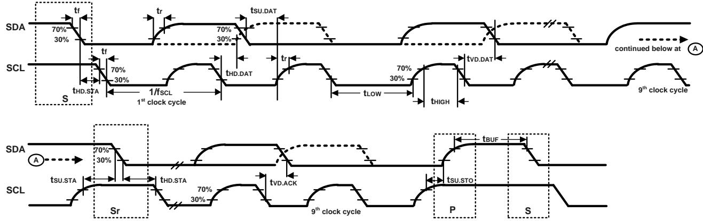  
Figure 1. I2C Bus Timing Diagram

# 3.5 SPI TIMING CHARACTERIZATION – 4-WIRE SPI MODE

Typical Operating Circuit of section 4.2, VD $) = 1 . 8 \ : \mathsf { V } _ { \mathrm { \Omega } }$ , $\mathsf { V D D } \mathsf { I O } = 1 . 8 \mathsf { V }$ , ${ \mathsf { T } } _ { \mathsf { A } } { = } 2 5 ^ { \circ } { \mathsf { C } } ,$ unless otherwise noted.

Table 7. 4-Wire SPI Timing Characteristics   

<table><tr><td rowspan=2 colspan=1>PARAMETERS</td><td rowspan=2 colspan=1>CONDITIONS</td><td rowspan=1 colspan=2>VDDIO &lt;1.71V</td><td rowspan=1 colspan=2>VDDIO ≥ 1.71V</td><td rowspan=1 colspan=1></td><td rowspan=1 colspan=1></td></tr><tr><td rowspan=1 colspan=1>MIN</td><td rowspan=1 colspan=1>MAX</td><td rowspan=1 colspan=1>MIN</td><td rowspan=1 colspan=1>MAX</td><td rowspan=1 colspan=1>UNITS</td><td rowspan=1 colspan=1>NOTES</td></tr><tr><td rowspan=1 colspan=1>SPI TIMING</td><td rowspan=1 colspan=1></td><td rowspan=1 colspan=1></td><td rowspan=1 colspan=1></td><td rowspan=1 colspan=1></td><td rowspan=1 colspan=1></td><td rowspan=1 colspan=1></td><td rowspan=1 colspan=1></td></tr><tr><td rowspan=1 colspan=1>fsPc, SCLK Clock Frequency</td><td rowspan=1 colspan=1>Default</td><td rowspan=1 colspan=1></td><td rowspan=1 colspan=1>20</td><td rowspan=1 colspan=1></td><td rowspan=1 colspan=1>24</td><td rowspan=1 colspan=1>MHz</td><td rowspan=1 colspan=1>1</td></tr><tr><td rowspan=1 colspan=1>tlow, SCLK Low Period</td><td rowspan=1 colspan=1></td><td rowspan=1 colspan=1>23.5</td><td rowspan=1 colspan=1></td><td rowspan=1 colspan=1>17</td><td rowspan=1 colspan=1></td><td rowspan=1 colspan=1>ns</td><td rowspan=1 colspan=1>1</td></tr><tr><td rowspan=1 colspan=1>tHIGH, SCLK High Period</td><td rowspan=1 colspan=1></td><td rowspan=1 colspan=1>22.5</td><td rowspan=1 colspan=1></td><td rowspan=1 colspan=1>17</td><td rowspan=1 colspan=1></td><td rowspan=1 colspan=1>ns</td><td rowspan=1 colspan=1>1</td></tr><tr><td rowspan=1 colspan=1>tsu.cs，,CS Setup Time</td><td rowspan=1 colspan=1></td><td rowspan=1 colspan=1>17</td><td rowspan=1 colspan=1></td><td rowspan=1 colspan=1>17</td><td rowspan=1 colspan=1></td><td rowspan=1 colspan=1>ns</td><td rowspan=1 colspan=1>1</td></tr><tr><td rowspan=1 colspan=1>tHD.cs, CS Hold Time</td><td rowspan=1 colspan=1></td><td rowspan=1 colspan=1>5</td><td rowspan=1 colspan=1></td><td rowspan=1 colspan=1>5</td><td rowspan=1 colspan=1></td><td rowspan=1 colspan=1>ns</td><td rowspan=1 colspan=1>1</td></tr><tr><td rowspan=1 colspan=1>tsu.SDI, SDI Setup Time</td><td rowspan=1 colspan=1></td><td rowspan=1 colspan=1>13</td><td rowspan=1 colspan=1></td><td rowspan=1 colspan=1>13</td><td rowspan=1 colspan=1></td><td rowspan=1 colspan=1>ns</td><td rowspan=1 colspan=1>1</td></tr><tr><td rowspan=1 colspan=1>tHD.SDI,,SDI Hold Time</td><td rowspan=1 colspan=1></td><td rowspan=1 colspan=1>8</td><td rowspan=1 colspan=1></td><td rowspan=1 colspan=1>8</td><td rowspan=1 colspan=1></td><td rowspan=1 colspan=1>ns</td><td rowspan=1 colspan=1>1</td></tr><tr><td rowspan=1 colspan=1>tvD.sDo,SDO ValidTime</td><td rowspan=1 colspan=1>Cload = 20 pF</td><td rowspan=1 colspan=1></td><td rowspan=1 colspan=1>18.5</td><td rowspan=1 colspan=1></td><td rowspan=1 colspan=1>18.5</td><td rowspan=1 colspan=1>ns</td><td rowspan=1 colspan=1>1</td></tr><tr><td rowspan=1 colspan=1>tHD.SDO, SDO Hold Time</td><td rowspan=1 colspan=1>Cload = 20 pF</td><td rowspan=1 colspan=1>3.5</td><td rowspan=1 colspan=1></td><td rowspan=1 colspan=1>3.5</td><td rowspan=1 colspan=1></td><td rowspan=1 colspan=1>ns</td><td rowspan=1 colspan=1>1</td></tr><tr><td rowspan=1 colspan=1>tDIS.SDo,SDO Output Disable Time</td><td rowspan=1 colspan=1></td><td rowspan=1 colspan=1></td><td rowspan=1 colspan=1>28</td><td rowspan=1 colspan=1></td><td rowspan=1 colspan=1>28</td><td rowspan=1 colspan=1>ns</td><td rowspan=1 colspan=1>1</td></tr></table>

# Notes:

1. Based on characterization of 5 parts over temperature and voltage as mounted on evaluation board or in sockets

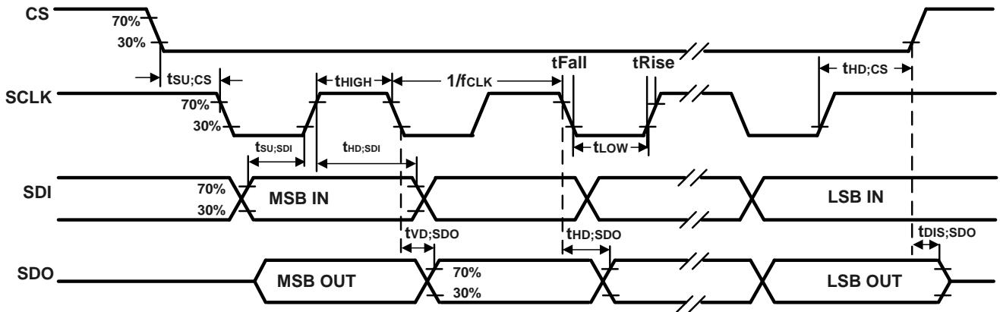  
Figure 2. 4-Wire SPI Bus Timing Diagram

# 3.6 SPI TIMING CHARACTERIZATION – 3-WIRE SPI MODE

Typical Operating Circuit of section 4.2, VD $\ b _ { \textrm { 2 } } = 1 . 8 \ \lor $ , $\mathsf { V D D } \mathsf { I O } = 1 . 8 \mathsf { V }$ , ${ \mathsf { T } } _ { \mathsf { A } } { = } 2 5 ^ { \circ } { \mathsf { C } } ,$ unless otherwise noted.

Table 8. 3-Wire SPI Timing Characteristics   

<table><tr><td rowspan=2 colspan=1>PARAMETERS</td><td rowspan=2 colspan=1>CONDITIONS</td><td rowspan=1 colspan=2>VDDIO &lt;1.71V</td><td rowspan=1 colspan=2>VDDIO ≥ 1.71V</td><td rowspan=1 colspan=1></td><td rowspan=1 colspan=1></td></tr><tr><td rowspan=1 colspan=1>MIN</td><td rowspan=1 colspan=1>MAX</td><td rowspan=1 colspan=1>MIN</td><td rowspan=1 colspan=1>MAX</td><td rowspan=1 colspan=1>UNITS</td><td rowspan=1 colspan=1>NOTES</td></tr><tr><td rowspan=1 colspan=1>SPI TIMING</td><td rowspan=1 colspan=1></td><td rowspan=1 colspan=1></td><td rowspan=1 colspan=1></td><td rowspan=1 colspan=1></td><td rowspan=1 colspan=1></td><td rowspan=1 colspan=1></td><td rowspan=1 colspan=1></td></tr><tr><td rowspan=1 colspan=1>fsPc, SCLK Clock Frequency</td><td rowspan=1 colspan=1>Default</td><td rowspan=1 colspan=1></td><td rowspan=1 colspan=1>20</td><td rowspan=1 colspan=1></td><td rowspan=1 colspan=1>24</td><td rowspan=1 colspan=1>MHz</td><td rowspan=1 colspan=1>1</td></tr><tr><td rowspan=1 colspan=1>tLow, SCLK Low Period</td><td rowspan=1 colspan=1></td><td rowspan=1 colspan=1>23.5</td><td rowspan=1 colspan=1></td><td rowspan=1 colspan=1>17</td><td rowspan=1 colspan=1></td><td rowspan=1 colspan=1>ns</td><td rowspan=1 colspan=1>1</td></tr><tr><td rowspan=1 colspan=1>tHIGH, SCLK High Period</td><td rowspan=1 colspan=1></td><td rowspan=1 colspan=1>22.5</td><td rowspan=1 colspan=1></td><td rowspan=1 colspan=1>17</td><td rowspan=1 colspan=1></td><td rowspan=1 colspan=1>ns</td><td rowspan=1 colspan=1>1</td></tr><tr><td rowspan=1 colspan=1>tsu.cs, CS Setup Time</td><td rowspan=1 colspan=1></td><td rowspan=1 colspan=1>17</td><td rowspan=1 colspan=1></td><td rowspan=1 colspan=1>17</td><td rowspan=1 colspan=1></td><td rowspan=1 colspan=1>ns</td><td rowspan=1 colspan=1>1</td></tr><tr><td rowspan=1 colspan=1>tHD.cs, CS Hold Time</td><td rowspan=1 colspan=1></td><td rowspan=1 colspan=1>5</td><td rowspan=1 colspan=1></td><td rowspan=1 colspan=1>5</td><td rowspan=1 colspan=1></td><td rowspan=1 colspan=1>ns</td><td rowspan=1 colspan=1>1</td></tr><tr><td rowspan=1 colspan=1>tsUSDIo,SDlOInput SetupTime</td><td rowspan=1 colspan=1></td><td rowspan=1 colspan=1>13</td><td rowspan=1 colspan=1></td><td rowspan=1 colspan=1>13</td><td rowspan=1 colspan=1></td><td rowspan=1 colspan=1>ns</td><td rowspan=1 colspan=1>1</td></tr><tr><td rowspan=1 colspan=1>tHD.SDIo, SDIO Input Hold Time</td><td rowspan=1 colspan=1></td><td rowspan=1 colspan=1>8</td><td rowspan=1 colspan=1></td><td rowspan=1 colspan=1>8</td><td rowspan=1 colspan=1></td><td rowspan=1 colspan=1>ns</td><td rowspan=1 colspan=1>1</td></tr><tr><td rowspan=1 colspan=1>tvD.sDIo, SDlO Output Valid Time</td><td rowspan=1 colspan=1>Cload = 20 pF</td><td rowspan=1 colspan=1></td><td rowspan=1 colspan=1>18.5</td><td rowspan=1 colspan=1></td><td rowspan=1 colspan=1>18.5</td><td rowspan=1 colspan=1>ns</td><td rowspan=1 colspan=1>1</td></tr><tr><td rowspan=1 colspan=1>tHD.SDIo, SDIO Output Hold Time</td><td rowspan=1 colspan=1>Cload = 20 pF</td><td rowspan=1 colspan=1>3.5</td><td rowspan=1 colspan=1></td><td rowspan=1 colspan=1>3.5</td><td rowspan=1 colspan=1></td><td rowspan=1 colspan=1>ns</td><td rowspan=1 colspan=1>1</td></tr><tr><td rowspan=1 colspan=1>tDIS.SDIo, SDlO Output Disable Time</td><td rowspan=1 colspan=1></td><td rowspan=1 colspan=1></td><td rowspan=1 colspan=1>28</td><td rowspan=1 colspan=1></td><td rowspan=1 colspan=1>28</td><td rowspan=1 colspan=1>ns</td><td rowspan=1 colspan=1>1</td></tr></table>

# Notes:

1. Based on characterization of 5 parts over temperature and voltage as mounted on evaluation board or in sockets

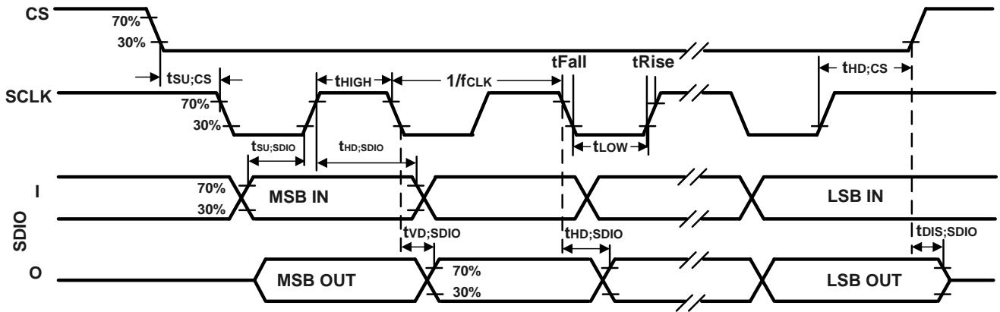  
Figure 3. 3-Wire SPI Bus Timing Diagram

# 3.7 ABSOLUTE MAXIMUM RATINGS

Stress above those listed as “Absolute Maximum Ratings” may cause permanent damage to the device. These are stress ratings only and functional operation of the device at these conditions is not implied. Exposure to the absolute maximum ratings conditions for extended periods may affect device reliability.

Table 9. Absolute Maximum Ratings   

<table><tr><td rowspan=1 colspan=1>Parameter</td><td rowspan=1 colspan=1>Rating</td></tr><tr><td rowspan=1 colspan=1>Supply Voltage, VDD</td><td rowspan=1 colspan=1>-0.5 V to +4 V</td></tr><tr><td rowspan=1 colspan=1>Supply Voltage, VDDIO</td><td rowspan=1 colspan=1>-0.5 V to +4 V</td></tr><tr><td rowspan=1 colspan=1>Input Voltage Level (FSYNC,SCL, SDA)</td><td rowspan=1 colspan=1>-0.5 V to VDDIO + 0.5 V</td></tr><tr><td rowspan=1 colspan=1>Acceleration (Any Axis, unpowered)</td><td rowspan=1 colspan=1>20,000g for 0.2 ms</td></tr><tr><td rowspan=1 colspan=1>Operating Temperature Range</td><td rowspan=1 colspan=1>-40°C to +85C</td></tr><tr><td rowspan=1 colspan=1>Storage Temperature Range</td><td rowspan=1 colspan=1>-40°C to +125°C</td></tr><tr><td rowspan=1 colspan=1>Electrostatic Discharge (ESD) Protection</td><td rowspan=1 colspan=1>2 kV (HBM);500 V (CDM)</td></tr><tr><td rowspan=1 colspan=1>Latch-up</td><td rowspan=1 colspan=1> JEDEC Class I (2) for VDDIO≤1.98V,JEDEC Class I(1) forVDDIO &gt; 1.98V,±100 mA</td></tr></table>

# 4 APPLICATIONS INFORMATION

# 4.1 PIN OUT DIAGRAM AND SIGNAL DESCRIPTION

<table><tr><td colspan="1" rowspan="1">PinNumber</td><td colspan="1" rowspan="1"> Pin Name</td><td colspan="1" rowspan="1">Single Interface Mode</td><td colspan="1" rowspan="1">Dual Interface Ols Mode</td><td colspan="1" rowspan="1"> Dual Interface I²C MasterMode</td><td colspan="1" rowspan="1">Notes</td></tr><tr><td colspan="1" rowspan="1">1</td><td colspan="1" rowspan="1">AP_SDO /AP_AD0</td><td colspan="1" rowspan="1">AP_SDO: AP SPI serial dataoutput (4-wire mode);AP_ADO: AP I3CSM /I²C slaveaddress LSB</td><td colspan="1" rowspan="1">AP_SDO: AP SPI serial dataoutput (4-wire mode);AP_ADO:AP I3CSM /I²C slaveaddress LSB</td><td colspan="1" rowspan="1">AP_SDO:AP SPI serialdata output (4-wiremode); AP_AD0:AP I3CSM/l²C slave address LSB</td><td colspan="1" rowspan="1">By default, internal pull-up is enabled.The internal weak pull-up is not strongenough to replace a pull-up resistorusually used on an open-drain bus.Thispin supports both internal pull up andpull-down functionality.Internal pullup/down is controlled by two registerspads_ap_sdo_pe_trim_d2a[o] andpads_ap_sdo_pud_trim_d2a[O].Internalpull-up can be disabled (enabled) byconfiguringpads_ap_sdo_pe_trim_d2a[0]=0(1)and internal pull direction down (up) canbe setby pads_ap_sdo_pud_trim_d2a[0]= 0 (1).If the AP interface is active,the internal pull-up should be disabled by settingpads_ap_sdo_pe_trim_d2a[0]=0.</td></tr><tr><td colspan="1" rowspan="1">2</td><td colspan="1" rowspan="1">RESV /AUX1_SDIO/AUX1_SDI/MAS_DA</td><td colspan="1" rowspan="1">RESV: No Connect orConnect to VDDIO orConnect to GND</td><td colspan="1" rowspan="1">AUX1_SDIO:AUX1 SPI serialdata IO (3-wire mode);AUX1_SDI: AUX1 SPI serialdata input (4-wire mode)</td><td colspan="1" rowspan="1">MAS_DA: I²C serialmaster data</td><td colspan="1" rowspan="1">By default, internal pull-up is enabled.The internal weak pull-up is not strongenough to replace a pull-up resistorusually used on an open-drain bus.Thispin supports both internal pull up andpull-down functionality.Internal pullup/down is controlled by two registerspads_aux_sdi_tp1_tp_pe_trim_d2a[0]andpads_aux_sdi_tp1_tp_pud_trim_d2a[0].Internal pull-up can be disabled(enabled) by configuringpads_aux_sdi_tp1_tp_pe_trim_d2a[0]=0(1)and internal pull direction down(up) can be set bypads_aux_sdi_tp1_tp_pud_trim_d2a[0]= 0 (1).If the AUX1 interface is active, theinternal pull-up should be disabled bysetting pads_aux1_sdi_pe_trim_d2a[0]=0.If pin2 is no connect,leavepads_aux1_sdi_pe_trim_d2a[0]=1.If pin2 is connected to VDDIO or GND,disable internal pull-up by setingpads_aux1_sdi_pe_trim_d2a[0] =0.</td></tr><tr><td colspan="1" rowspan="1">3</td><td colspan="1" rowspan="1">RESVAUX1_SCLK/MAS_CLK</td><td colspan="1" rowspan="1">RESV: No Connect orConnect to VDDIO orConnect to GND</td><td colspan="1" rowspan="1">AUX1_SCLK: AUX1 SPI serialclock</td><td colspan="1" rowspan="1">MAS_CLK: I²C serialmaster clock</td><td colspan="1" rowspan="1">Bydefault, internal pull-up is enabled.The internal weak pull-up is not strongenough to replace a pull-up resistorusually used on an open-drain bus.Thispin supports both internal pull up andpull-down functionality.Internal pullup/down is controlled by two registerspads_aux_sclk_tp2_tp_pe_trim_d2a[0]andpads_aux_sclk_tp2_tp_pud_trim_d2a[0].Internal pull-up can be disabled(enabled) by configuringpads_aux_sclk_tp2_tp_pe_trim_d2a[0]=0 (1)and internal pull direction down</td></tr><tr><td colspan="1" rowspan="1"></td><td colspan="1" rowspan="1"></td><td colspan="1" rowspan="1"></td><td colspan="1" rowspan="1"></td><td colspan="1" rowspan="1"></td><td colspan="1" rowspan="1">(up) can be set bypads_aux_sclk_tp2_tp_pud_trim_d2a[0]= 0(1).If the AUX1 interface is active, theinternal pull-up should be disabled bysetting pads_aux1_sclk_pe_trim_d2a[0]= 0.If pin3 is no connect, leavepads_aux1_sclk_pe_trim_d2a[0]=1.If pin3 is connected to VDDlO or GND,disable internal pull-up by settingpads_aux1_sclk_pe_trim_d2a[0]=0.</td></tr><tr><td colspan="1" rowspan="1">4</td><td colspan="1" rowspan="1">INT1/INT</td><td colspan="1" rowspan="1">INT1: Interrupt 1(Note: INT1can be push-pull or opendrain); iNT: Allinterruptsmapped to pin 4</td><td colspan="1" rowspan="1">INT1: Interrupt 1(Note: INT1can be push-pull or opendrain); iNT: Alinterruptsmapped to pin 4</td><td colspan="1" rowspan="1">INT1: Interrupt 1 (Note:INT1 can be push-pull oropen drain); INT: Allinterrupts mapped to pin4</td><td colspan="1" rowspan="1">Bydefault,internal pull-up is disabled.The internal weak pull-up is not strongenough to replace a pull-up resistorusually used on an open-drain bus.Thispin supports both internal pull up andpull-down functionality.Internal pullup/down is controlled by two registerspads_int1_tp0_tp_pe_trim_d2a[O] andpads_int1_tp0_tp_pud_trim_d2a[0].Internal pull can be disabled (enabled)by configuringpads_int1_tp0_tp_pe_trim_d2a[0]=0(1)and internal pull direction down (up)can be set bypads_int1_tp0_tp_pud_trim_d2a[0]=0(1).</td></tr><tr><td colspan="1" rowspan="1">5</td><td colspan="1" rowspan="1">VDDIO</td><td colspan="1" rowspan="1">VDDIO: IO power supplyvoltage</td><td colspan="1" rowspan="1">VDDIO:IO power supplyvoltage</td><td colspan="1" rowspan="1">VDDIO:IO power supplyvoltage</td><td colspan="1" rowspan="1"></td></tr><tr><td colspan="1" rowspan="1">6</td><td colspan="1" rowspan="1">GND</td><td colspan="1" rowspan="1">GND: Power supply ground</td><td colspan="1" rowspan="1">GND: Power supply ground</td><td colspan="1" rowspan="1">GND: Power supplyground</td><td colspan="1" rowspan="1"></td></tr><tr><td colspan="1" rowspan="1">7</td><td colspan="1" rowspan="1">RESV</td><td colspan="1" rowspan="1">RESV: No Connect orConnect to VDDIO orConnect to GND</td><td colspan="1" rowspan="1">RESV: No Connect or Connectto VDDIO or Connect to GND</td><td colspan="1" rowspan="1">RESV: No Connect orConnect to VDDIO orConnect to GND</td><td colspan="1" rowspan="1">By default, internal pull-up is enabled.The internal weak pull-up is not strongenough to replace a pull-up resistor usually used on an open-drain bus.Thispin supports both internal pull up andpull-down functionality.Internal pullup/down is controlled by two registerspads_pin7_pe_trim_d2a[0]and pads_pin7_cs_pud_trim_d2a[0].Internal pull can be disabled (enabled)by configuringpads_pin7_pe_trim_d2a[O]=0(1)andinternal pull direction down (up) can besetby pads_pin7_cs_pud_trim_d2a[0]=0 (1).If pin7 is no connect, leavepads_pin7_pe_trim_d2a[0]=1.If pin7 isconnected to VDDIO or GND,disableinternal pull-up by settingpads_pin7_pe_trim_d2a[0]=0.</td></tr><tr><td colspan="1" rowspan="1">8</td><td colspan="1" rowspan="1">VDD</td><td colspan="1" rowspan="1">VDD: Power supply voltage</td><td colspan="1" rowspan="1">VDD: Power supply voltage</td><td colspan="1" rowspan="1">VDD: Power supplyvoltage</td><td colspan="1" rowspan="1"></td></tr><tr><td colspan="1" rowspan="1">9</td><td colspan="1" rowspan="1">INT2/FSYNC/CLKIN</td><td colspan="1" rowspan="1">INT2: Interrupt 2 (Note: INT2can be push-pull or opendrain); FSYNC: Frame syncinput; CLKIN: External clockinput; If pin not used,can beNo Connect or Connect toVDDIO</td><td colspan="1" rowspan="1">INT2: Interrupt 2 (Note: INT2can be push-pull or opendrain); FSYNC: Frame syncinput; CLKIN: External clockinput; If pin not used, can beNo Connect or Connect toVDDIO</td><td colspan="1" rowspan="1">INT2: Interrupt 2(Note:INT2 can be push-pull oropen drain); FSYNC:Frame sync input; CLKIN:External clock input; If pinnot used,can be NoConnect or Connect toVDDIO</td><td colspan="1" rowspan="1">By default, internal pull-up is enabled.The internal weak pull-up is not strongenough to replace a pull-up resistorusually used on an open-drain bus.This pin supports both internal pull up andpull-down functionality.Internal pullup/down is controlled by two registerspads_int2_pe_trim_d2a[0] andpads_int2_pud_trim_d2a[0].Internalpull-up can be disabled (enabled) byconfiguring pads_int2_pe_trim_d2a[0] =0(1)and internal pull direction down</td></tr><tr><td colspan="1" rowspan="1"></td><td colspan="1" rowspan="1"></td><td colspan="1" rowspan="1"></td><td colspan="1" rowspan="1"></td><td colspan="1" rowspan="1"></td><td colspan="1" rowspan="1">(up) can be set bypads_int2_pud_trim_d2a[0]=0(1).If pin9 is no connect, leavepads_int2_pe_trim_d2a[0]=1.If pin9 isconnected as an I/O, disable internalpull-up by settingpads_int2_pe_trim_d2a[0]=0.Note: INT2 is available for AUX1interrupt when AUX1 is enabled.INT2 isavailable for host interrupt onlyif AUX1is disabled.</td></tr><tr><td colspan="1" rowspan="1">10</td><td colspan="1" rowspan="1">RESV /AUX1_CS</td><td colspan="1" rowspan="1">RESV: No Connect orConnect to VDDIO orConnect to GND</td><td colspan="1" rowspan="1">AUX1_CS: AUX1 SPI chip select</td><td colspan="1" rowspan="1">RESV: No Connect orConnect to VDDIO orConnect to GND</td><td colspan="1" rowspan="1">By default, internal pull-up is enabled.The internal weak pull-up is not strongenough to replace a pull-up resistorusually used on an open-drain bus.Thispin supports both internal pull up andpull-down functionality.Internal pullup/down is controlled by two registerspads_aux_cs_tp3_tp_pe_trim_d2a[0]andpads_aux_cs_tp3_tp_pud_trim_d2a[0].Internal pull-up can be disabled(enabled) by configuringpads_aux_cs_tp3_tp_pe_trim_d2a[0]=0(1)and internal pull direction down (up)can be set bypads_aux_cs_tp3_tp_pud_trim_d2a[0]=0 (1).If the AUX1 interface is active, theinternal pull-up should be disabled bysetting pads_aux1_cs_pe_trim_d2a[0] =O.If pin10 is no connect, leavepads_aux1_cs_pe_trim_d2a[0]=1.If pin10 is connected to VDDlO or GND,disable internal pull-up by settingpads_aux1_cs_pe_trim_d2a[0]=0.</td></tr><tr><td colspan="1" rowspan="1">11</td><td colspan="1" rowspan="1">RESV /AUX1_SD0</td><td colspan="1" rowspan="1">RESV: No Connect orConnect to VDDIO orConnect to GND</td><td colspan="1" rowspan="1">AUX1_SDO:AUX1 SPI serialdata output (4-wire mode); NoConnect if pin not used</td><td colspan="1" rowspan="1">RESV: No Connect orConnect to VDDIO orConnect to GND</td><td colspan="1" rowspan="1">By default,internal pull-up is enabled.The internal weak pull-up is not strongenough to replace a pull-up resistorusually used on an open-drain bus.Thispin supports both internal pull up andpull-down functionality.Internal pullup/down is controlled by two registerspads_aux_sdo_pe_trim_d2a[O] andpads_aux_sdo_pud_trim_d2a[0].Internal pull-up can be disabled(enabled) by configuringpads_aux_sdo_pe_trim_d2a[0]=0(1)and internal pull direction down (up) canbe set bypads_aux_sdo_pud_trim_d2a[O]=0 (1).If AUX1 interface is active,the internal pull-up should be disabled by settingpads_aux1_sdo_pe_trim_d2a[0]=0.Ifpin11 is no connect, leavepads_aux1_sdo_pe_trim_d2a[0]=1.Ifpin11 is connected to VDDlO or GND,disable internal pull-up by settingpads_aux1_sdo_pe_trim_d2a[0]=0.</td></tr><tr><td colspan="1" rowspan="1">12</td><td colspan="1" rowspan="1">AP_CS</td><td colspan="1" rowspan="1">AP_CS: AP SPI Chip select(AP SPI interface); Connectto VDDIO if using AP I3CSM/²C interface</td><td colspan="1" rowspan="1">AP_CS: AP SPI Chip select (APSPl interface); Connect toVDDIO if using AP I3CSM /²Cinterface</td><td colspan="1" rowspan="1">AP_CS: AP SPI Chip select(AP SPI interface);Connect to VDDIO if usingAP I3CSM /IC interface</td><td colspan="1" rowspan="1">By default, internal pull-up is enabled.The internal weak pull-up is not strongenough to replace a pull-up resistorusually used on an open-drain bus.This pin supports both internal pull up andpull-down functionality.Internal pull</td></tr></table>

Table 10. Signal Descriptions   

<table><tr><td rowspan=1 colspan=1></td><td rowspan=1 colspan=1></td><td rowspan=1 colspan=1></td><td rowspan=1 colspan=1></td><td rowspan=1 colspan=1></td><td rowspan=1 colspan=1>up/down is controlled by two registerspads_ap_cs_pe_trim_d2a[0]andpads_ap_cs_pud_trim_d2a[0].Internalpull can be disabled (enabled) byconfiguring pads_ap_cs_pe_trim_d2a[0]= 0 (1) and internal pull direction down(up) can be set bypads_ap_cs_pud_trim_d2a[O]=0(1).If the AP interface is active, the internalpull-up should be disabled by setingpads_ap_cs_pe_trim_d2a[0]=0.</td></tr><tr><td rowspan=1 colspan=1>13</td><td rowspan=1 colspan=1>AP_SCL/AP_SCLK</td><td rowspan=1 colspan=1>AP_SCL:AP I3CSM/I²C serialclock; AP_SCLK: AP SPl serialclock</td><td rowspan=1 colspan=1>AP_SCL:AP I3CSM/²C serialclock; AP_SCLK: AP SPI serialclock</td><td rowspan=1 colspan=1>AP_SCL: AP I3CSM /I²Cserial clock; AP_SCLK:APSPI serial clock</td><td rowspan=1 colspan=1>By default, internal pull-up is enabled.The internal weak pull-up is not strongenough to replace a pull-up resistorusually used on an open-drain bus.Thispin supports both internal pull up andpull-down functionality.Internal pullup/down is controlled by two registerspads_ap_sclk_pe_trim_d2a[0] andpads_ap_sclk_pud_trim_d2a[O].Internalpull can be disabled (enabled)byconfiguringpads_ap_sclk_pe_trim_d2a[0] =0(1)and internal pull direction down (up) canbe set by pads_ap_sclk_pud_trim_d2a[0]= 0 (1).If the AP interface is active, the internal pull-up should be disabled by settingpads_ap_sclk_pe_trim_d2a[0] =0.</td></tr><tr><td rowspan=1 colspan=1>14</td><td rowspan=1 colspan=1>AP_SDA /AP_SDIO /AP_SDI</td><td rowspan=1 colspan=1>AP_SDA:AP I3CSM /I²C serialdata; AP_SDIO:AP SPI serialdata I/O (3-wire mode);AP_SDI: AP SPI serial datainput (4-wire mode)</td><td rowspan=1 colspan=1>AP_SDA:AP I3CSM /I²C serialdata;AP_SDIO:AP SPI serialdata I/O (3-wire mode);AP_SDI: AP SPI serial datainput (4-wire mode)</td><td rowspan=1 colspan=1>AP_SDA:AP I3CSM /I²Cserial data; AP_SDIO:APSPl serial data I/O (3-wiremode); AP_SDI: AP SPIserial data input (4-wiremode)</td><td rowspan=1 colspan=1>By default, internal pull-up is enabled.The internal weak pull-up is not strongenough to replace a pull-up resistorusually used on an open-drain bus.Thispin supports both internal pull up andpull-down functionality.Internal pullup/down is controlled by two registerspads_ap_sdi_pe_trim_d2a[O] andpads_ap_sdi_pud_trim_d2a[O].Internalpull can be disabled (enabled) byconfiguring pads_ap_sdi_pe_trim_d2a[0]= 0 (1) and internal pull direction down(up) can be set bypads_ap_sdi_pud_trim_d2a[0] =0(1).If the AP interface is active, the internalpull-up should be disabled by settingpads_ap_sdi_pe_trim_d2a[0]=0.</td></tr></table>

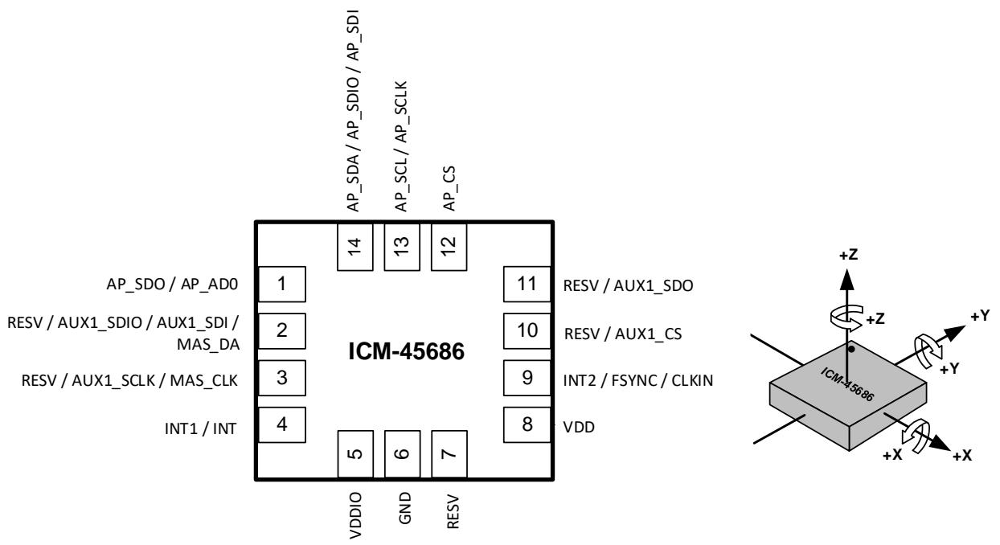  
Figure 4. Pin Out Diagram for ICM-45686 2.5x3.0x0.81 mm LGA

# 4.2 TYPICAL OPERATING CIRCUIT (DUAL INTERFACE OIS MODE)

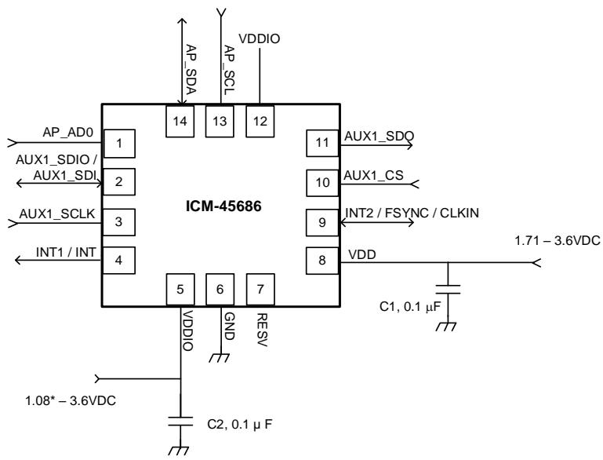  
\* Important Note: When using I3CM interface the minimum VDDlO value is 1.1V.   
Figure 5. ICM-45686 Application Schematic Dual Interface OIS Mode (I3CSM / I2C Interface to Host)

Note: ${ \mathsf { I } } ^ { 2 } { \mathsf { C } }$ lines are open drain and pull-up resistors (e.g. $1 0 \mathsf { k } \Omega$ ) are required.

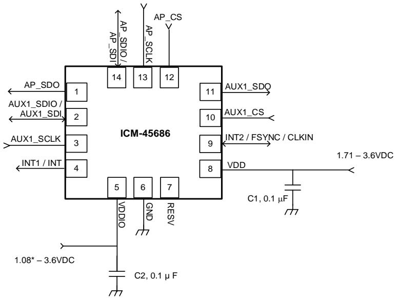  
Figure 6. ICM-45686 Application Schematic Dual Interface OIS Mode (SPI Interface to Host)

4.3 TYPICAL OPERATING CIRCUIT (DUAL INTERFACE $1 ^ { 2 } C$ MASTER MODE)

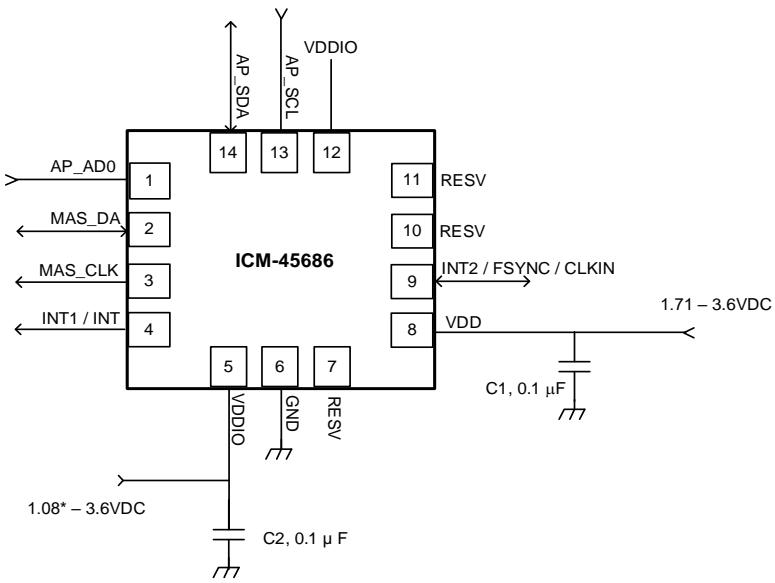  
\* Important Note: When using I3C5M interface the minimum VDDlO value is 1.1V.   
Figure 7. ICM-45686 Application Schematic Dual Interface $1 ^ { 2 } \pmb { \complement }$ Master Mode (I3CSM / I2C Interface to Host)

Note: ${ 1 ^ { 2 } } \mathsf { C }$ lines are open drain and pull-up resistors (e.g. $1 0 \mathrm { k } \Omega$ ) are required.

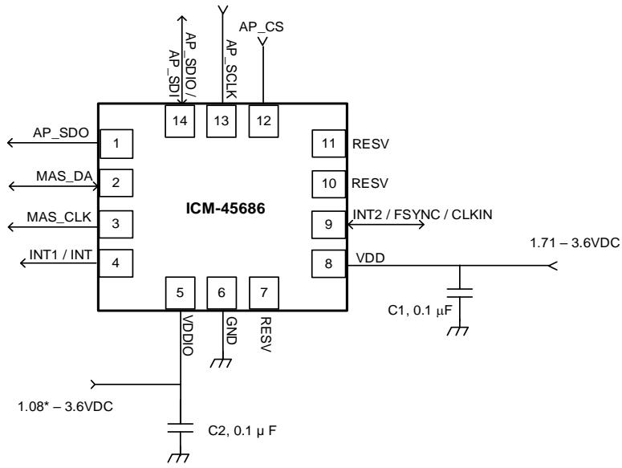  
\* Important Note: When using l3CSM interface the minimum VDDlO value is 1.1V.

# 4.4 TYPICAL OPERATING CIRCUIT (SINGLE INTERFACE MODE)

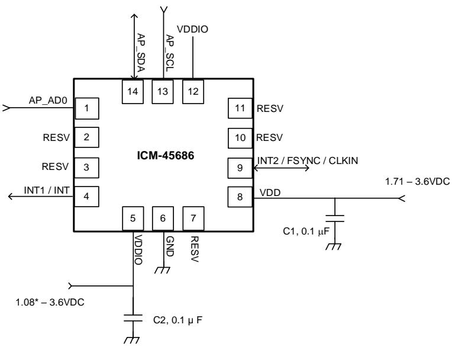  
Figure 8. ICM-45686 Application Schematic Dual Interface $1 ^ { 2 } C$ Master Mode (SPI Interface to Host)   
\* Important Note:When using $1 3 C ^ { 5 M }$ interface the minimum VDDIO value is 1.1V.   
Figure 9. ICM-45686 Application Schematic Single Interface Mode (I3CSM / I2C Interface to Host)

Note: ${ \mathsf { I } } ^ { 2 } { \mathsf { C } }$ lines are open drain and pull-up resistors (e.g. $1 0 \mathrm { k } \Omega$ ) are required.

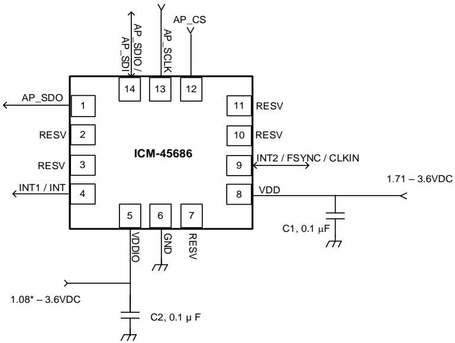  
Figure 10. ICM-45686 Application Schematic Single Interface Mode (SPI Interface to Host)

# 4.5 BILL OF MATERIALS FOR EXTERNAL COMPONENTS

Table 11. Bill of Materials   

<table><tr><td rowspan=1 colspan=1>Component</td><td rowspan=1 colspan=1>Label</td><td rowspan=1 colspan=1> Specification</td><td rowspan=1 colspan=1>Quantity</td></tr><tr><td rowspan=1 colspan=1> VDD Bypass Capacitor</td><td rowspan=1 colspan=1>C1</td><td rowspan=1 colspan=1> X7R,0.1μF ±10%</td><td rowspan=1 colspan=1>1</td></tr><tr><td rowspan=1 colspan=1>VDDIO Bypass Capacitor</td><td rowspan=1 colspan=1>C2</td><td rowspan=1 colspan=1> X7R, 0.1μF ±10%</td><td rowspan=1 colspan=1>1</td></tr></table>

Note: Use larger bypass capacitor than $0 . 1 \mu \mathsf { F }$ if power supply ripple exceeds ${ 5 0 } \mathsf { m V }$ peak-to-peak.

# 4.6 SYSTEM BLOCK DIAGRAM

  
Figure 11. ICM-45686 System Block Diagram

Note: The above block diagram is an example. Please refer to the pin-out (section 4.1) for other configuration options.

# 4.7 OVERVIEW

The ICM-45686 is comprised of the following key blocks and functions:

Three-axis MEMS rate gyroscope sensor with 16-bit ADCs and signal conditioning $\bigcirc$ 20-bits data format support in FIFO for high-data resolution (see section 5 for details)   
• Three-axis MEMS accelerometer sensor with 16-bit ADCs and signal conditioning o 20-bits data format support in FIFO for high-data resolution (see section 5 for details) ${ | 3 C ^ { \mathsf { S M } } }$ , I2C and SPI Host Interface ${ \mathsf { I } } ^ { 2 } { \mathsf { C } }$ Master Interface for connection to external sensors   
• SPI Auxiliary Interface for connection to OIS controllers   
• Self-Test   
• Clocking Sensor Data Registers   
• FIFO   
• Interrupts   
• Digital-Output Temperature Sensor   
• Bias and LDOs Charge Pump Standard Power Modes

# 4.8 THREE-AXIS MEMS GYROSCOPE WITH 16-BIT ADCS AND SIGNAL CONDITIONING

The ICM-45686 includes a vibratory MEMS rate gyroscope, which detects rotation about the X-, Y-, and Z- Axes. When the gyroscope is rotated about any of the sense axes, the Coriolis Effect causes a vibration that is detected by a capacitive pickoff. The resulting signal is amplified, demodulated, and filtered to produce a voltage that is proportional to the angular rate. This voltage is digitized using on-chip Analog-to-Digital Converters (ADCs) to sample each axis. The full-scale range of the gyro sensors may be digitally programmed to $^ { \pm 1 5 . 6 2 5 }$ , $\pm 3 1 . 2 5 $ , $\pm 6 2 . 5 .$ ±125, $\pm 2 5 0$ , $\pm 5 0 0$ , $\pm 1 0 0 0$ , $\pm 2 0 0 0$ and $\pm 4 0 0 0$ degrees per second (dps).

# 4.9 THREE-AXIS MEMS ACCELEROMETER WITH 16-BIT ADCS AND SIGNAL CONDITIONING

The ICM-45686 includes a 3-Axis MEMS accelerometer. Acceleration along a particular axis induces displacement of a proof mass in the MEMS structure, and capacitive sensors detect the displacement. The ICM-45686 architecture reduces the accelerometers’ susceptibility to fabrication variations as well as to thermal drift. When the device is placed on a flat surface, it will measure $_ { 0 g }$ on the $\mathsf { X } -$ and Y-axes and $+ 1 g$ on the Z-axis. The accelerometers’ scale factor is calibrated at the factory and is nominally independent of supply voltage. The fullscale range of the digital output can be adjusted to $\pm 2 g$ , $\pm 4 g$ , $\pm 8 g ,$ , $\pm 1 6 g$ and $\pm 3 2 g$ .

# 4.10 $1 3 C ^ { S M }$ , $1 ^ { 2 } \complement$ AND SPI HOST INTERFACE

The ICM-45686 communicates to the application processor using an $1 3 C ^ { \mathsf { S M } }$ , ${ \mathsf { I } } ^ { 2 } { \mathsf { C } } ,$ or SPI serial interface. The ICM45686 always acts as a slave when communicating to the application processor.

# 4.11 $1 ^ { 2 } C$ MASTER INTERFACE FOR CONNECTION TO EXTERNAL SENSORS

The ICM-45686 has an ${ \mathsf { I } } ^ { 2 } { \mathsf { C } }$ master interface for connection to external sensors. ${ \mathsf { I } } ^ { 2 } { \mathsf { C } }$ master pins are muxed with some of the pins used for SPI Auxiliary OIS interface, as described in section 4, so the device can be configured to support ${ \mathsf { I } } ^ { 2 } { \mathsf { C } }$ master mode or OIS mode.

Up to 2 external sensors can be connected on this interface and their data read into the ICM-45686. ${ \mathsf { I } } ^ { 2 } { \mathsf { C } }$ speed up to 400kHz is supported on the master interface. After ${ \mathsf { I } } ^ { 2 } { \mathsf { C } }$ master finishes reading sensor data from the external sensor(s), the received sensor data is then reformatted by the internal processor (eDMP). The reformatted external sensor data is then moved into FIFO along with other internal sensor data. The external host reads the FIFO to retrieve both the external sensor data and the internal sensor data.

Independent of the number of external devices on the ${ \mathsf { I } } ^ { 2 } { \mathsf { C } }$ bus, the ${ \mathsf { I } } ^ { 2 } { \mathsf { C } }$ master automatically executes up to $4 1 ^ { 2 } \mathsf { C }$ transactions per trigger.   
• The $4 1 ^ { 2 } \mathsf { C }$ transactions are fully independent to each other.   
• Each ${ \mathsf { I } } ^ { 2 } { \mathsf { C } }$ transaction can be targeting any external ${ \mathsf { I } } ^ { 2 } { \mathsf { C } }$ device (capped at 2 external ${ \mathsf { I } } ^ { 2 } { \mathsf { C } }$ devices). Each ${ \mathsf { I } } ^ { 2 } { \mathsf { C } }$ transaction can be a read or a write access transaction.   
• Each ${ \mathsf { I } } ^ { 2 } { \mathsf { C } }$ transaction can be a burst or a non-burst access transaction.   
• A read transaction can be from an auto-incremented address location, or from a new address location. A read operation with a new address location consumes one of the $4 1 ^ { 2 } \mathsf { C }$ transactions per trigger.

# 4.12 SPI AUXILIARY INTERFACE FOR CONNECTION TO OIS CONTROLLERS

The ICM-45686 supports SPI slave and ${ \mathsf { I } } 3 { \mathsf { C } } ^ { \mathsf { S M } }$ slave for connection to OIS controllers. Some pins of the SPI Auxiliary OIS interface are muxed with ${ \mathsf { I } } ^ { 2 } { \mathsf { C } }$ master pins, as described in Section 4. So the device can be configured to support ${ \mathsf { I } } ^ { 2 } { \mathsf { C } }$ master mode or OIS mode. The ICM-45686 always acts as a slave when communicating with OIS controller over this interface. The interface cannot access FIFO data.

The AUX1 interface default configuration can be checked by read only register IOC_PAD_SCENARIO through host interface. By default, AUX1 interface is enabled, and default interface for AUX1 is SPI3W or ${ \mathsf { I } } 3 { \mathsf { C } } ^ { \mathsf { S M } }$ .

To change the auxiliary interface configuration, user must read/write register IOC_PAD_SCENARIO_AUX_OVRD through host interface. Note that such changes will not be reflected in the read only register IOC_PAD_SCENARIO.

# 4.13 SELF-TEST

Self-test allows for the testing of the mechanical and electrical portions of the sensors. The self-test for each measurement axis can be activated by means of the gyroscope and accelerometer self-test registers.

When the self-test is activated, the electronics cause the sensors to be actuated and produce an output signal. The output signal is used to observe the self-test response.

The self-test response is defined as follows:

Self-test response $=$ Sensor output with self-test enabled – Sensor output with self-test disabled

When the value of the self-test response is within the specified min/max limits of the product specification, the part has passed self-test. When the self-test response exceeds the min/max values, the part is deemed to have failed self-test.

# 4.14 CLOCKING

The ICM-45686 has a flexible clocking scheme, allowing external or internal clock sources to be used for the internal synchronous circuitry. This synchronous circuitry includes the signal conditioning and ADCs, and various control circuits and registers.

The CLKIN pin on ICM-45686 provides the ability to input an external clock. A highly accurate external clock may be used rather than the internal clocks sources, if greater clock accuracy is desired. External clock input supports highly accurate clock input from 20kHz to 40kHz.

Allowable internal sources for generating the internal clock are:

a) An internal relaxation oscillator   
b) Auto-select between internal relaxation oscillator and gyroscope MEMS oscillator to use the best available source

For internal sources, the only setting supporting specified performance in all modes is option b). It is recommended that option b) be used when using internal clock source.

# 4.15 SENSOR DATA REGISTERS

The sensor data registers contain the latest gyroscope, accelerometer, and temperature measurement data. They are read-only registers and are accessed via the serial interface. Data from these registers may be read anytime.

# 4.16 INTERRUPTS

Interrupt functionality is configured via the Interrupt Configuration register. Items that are configurable include the interrupt pins configuration, the interrupt latching and clearing method, and triggers for the interrupt. Items that can trigger an interrupt are (1) Clock generator locked to new reference oscillator (used when switching clock sources); (2) new data is available to be read (from the FIFO and Data registers); (3) accelerometer event interrupts; (4) FIFO watermark; (5) FIFO overflow. The interrupt status can be read from the Interrupt Status register.

# 4.17 DIGITAL-OUTPUT TEMPERATURE SENSOR

An on-chip temperature sensor and ADC are used to measure the ICM-45686 die temperature. The readings from the ADC can be read from the FIFO or the Sensor Data registers.

Temperature sensor register data TEMP_DATA is updated with new data at max (Accelerometer ODR, Gyroscope ODR).

# 4.18 BIAS AND LDOS

The bias and LDO section generates the internal supply and the reference voltages and currents required by the ICM-45686.

# 4.19 CHARGE PUMP

An on-chip charge pump generates the high voltage required for the MEMS oscillator.

# 4.20 STANDARD POWER MODES

The following table lists the user-accessible power modes for ICM-45686.

Table 12. Standard Power Modes for ICM-45686   

<table><tr><td rowspan=1 colspan=1>Name</td><td rowspan=1 colspan=1>Gyro</td><td rowspan=1 colspan=1>Accel</td></tr><tr><td rowspan=1 colspan=1>Sleep Mode</td><td rowspan=1 colspan=1>Off</td><td rowspan=1 colspan=1>Off</td></tr><tr><td rowspan=1 colspan=1>Standby Mode</td><td rowspan=1 colspan=1>DriveOn</td><td rowspan=1 colspan=1>Off</td></tr><tr><td rowspan=1 colspan=1>Accelerometer Low-Power Mode</td><td rowspan=1 colspan=1>Off</td><td rowspan=1 colspan=1>Duty-Cycled</td></tr><tr><td rowspan=1 colspan=1>Accelerometer Ultra Low-Power Mode</td><td rowspan=1 colspan=1>Off</td><td rowspan=1 colspan=1>Duty-Cycled</td></tr><tr><td rowspan=1 colspan=1>Gyroscope Low-Power Mode</td><td rowspan=1 colspan=1>Duty-Cycled</td><td rowspan=1 colspan=1>Off</td></tr><tr><td rowspan=1 colspan=1>6-Axis Low-Power Mode</td><td rowspan=1 colspan=1>Duty-Cycled</td><td rowspan=1 colspan=1>Duty-Cycled</td></tr><tr><td rowspan=1 colspan=1>Accelerometer Low-Noise Mode</td><td rowspan=1 colspan=1>Off</td><td rowspan=1 colspan=1>On</td></tr><tr><td rowspan=1 colspan=1>Gyroscope Low-Noise Mode</td><td rowspan=1 colspan=1>On</td><td rowspan=1 colspan=1>Off</td></tr><tr><td rowspan=1 colspan=1>6-Axis Low-Noise Mode</td><td rowspan=1 colspan=1>On</td><td rowspan=1 colspan=1>On</td></tr></table>

# 5 SIGNAL PATH

The following figure shows a block diagram of the signal path for ICM-45686.

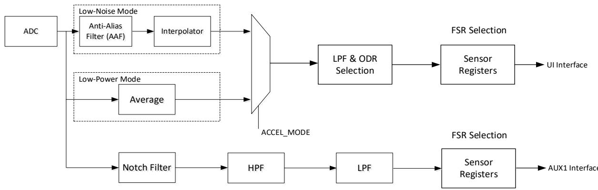  
Figure 12. ICM-45686 Signal Path

The signal path starts with ADCs for the gyroscope and accelerometer. Low-Noise Mode and Low-Power Mode options are available for the gyroscope and accelerometer and are selectable using register fields GYRO_MODE and ACCEL_MODE respectively.

In Low-Noise Mode, the ADC output is sent through an Anti-Alias Filter (AAF). The AAF is an FIR filter with fixed coefficients (not user configurable). The AAF can be enabled or disabled by the user using GYRO_SRC_CTRL and ACCEL_SRC_CTRL.

The AAF is followed by an Interpolator. Sensor data can be re-timed using an interpolator when the user applies an external clock for higher ODR accuracy or operates the ICM-45686 in ${ | 3 C ^ { 5 M } }$ synchronous mode. The Interpolator can be enabled or disabled by the user using GYRO_SRC_CTRL and ACCEL_SRC_CTRL.

In Low-Power Mode, the gyroscope and accelerometer ADC outputs are sent through Average filters, with user configurable average filter setting using register fields GYRO_LP_AVG_SEL and ACCEL_LP_AVG_SEL.

The output of Interpolator in Low-Noise Mode, or Average filter in Low-Power Mode is subject to UI LPF and ODR selection. The UI LPF BW is set by register bit field GYRO_UI_LPFBW_SEL and ACCEL_UI_LPFBW_SEL for gyroscope and accelerometer respectively. User selectable ODR is set using register fields GYRO_ODR and ACCEL_ODR. This is followed by Full Scale Range (FSR) selection based on user configurable settings for register fields GYRO_UI_FS_SEL and ACCEL_UI_FS_SEL.

The AUX1 signal path includes a Notch Filter. The notch filter is not user programmable. The usage of the notch filter in the auxiliary path is recommended for sharper roll-off and for the cases where user is asynchronously sampling the auxiliary interface data output at integer multiples of 1 kHz rate. The notch filter may be bypassed using GYRO_OIS_M6_BYP.

The notch filter is followed by an HPF on the AUX1 signal path. HPF cut-off frequency can be selected using GYRO_OIS_HPFBW_SEL and ACCEL_OIS_HPFBW_SEL. HPF can be bypassed using GYRO_OIS_HPF1_BYP and ACCEL_OIS_HPF1_BYP.

The HPF is followed by LPF on the AUX1 signal path. The AUX1 LPF BW is set by register bit field GYRO_OIS_LPF1BW_SEL and ACCEL_OIS_LPF1BW_SEL for gyroscope and accelerometer respectively. This is followed by Full Scale Range (FSR) selection based on user configurable settings for register fields GYRO_AUX1_FS_SEL and ACCEL_AUX1_FS_SEL. AUX1 output is fixed at 6.4kHz ODR.

# 6 FIFO

The ICM-45686 contains up to 8Kbytes FIFO (default FIFO size is 2Kbytes, user can extend it up to 8Kbytes by disabling APEX functions) that is accessible via the serial interface. The FIFO configuration register determines which data is written into the FIFO. Possible choices include gyroscope data, accelerometer data, temperature readings, and FSYNC input. A FIFO counter keeps track of how many bytes of valid data are contained in the FIFO.

ICM-45686 includes FIFO Compression algorithm that allows storing compressed sensor data in FIFO frames, thus virtually providing more FIFO space. It allows to store up to 4 times the number of frames with respect to noncompressed data. Frame decompression must be performed on the Host which reads the FIFO. Compression algorithm uses a hardware lossless algorithm, based on data variation analysis of each axis. Compression ratios x2, x3, x4 are supported, providing up to 32kByte data storage capability.

A 20-bit data format support is included in one of the FIFO packets structures. When the 20-bit data format is used, the gyroscope data consists of 20-bit of actual data, the accelerometer data consists of 19-bit of actual data and the LSB is always set to 0. Irrespective of the user-full scale selection, this high-resolution 20-bit data format is always scaled to ±4000dps (131.1 LSB/dps) for gyroscope and $\pm 3 2 { \mathrm g } \left( 1 6 3 8 4 \ : \mathrm { L S B / g } \right)$ for accelerometer.

FIFO packet decimation capability is provided for additional storage optimization. User can configure the FIFO Data Rate (FDR) to control the decimation rate for writing packets to the FIFO. User must disable sensors when initializing FDR control value or making changes to it.

# 6.1 PACKET STRUCTURE

FIFO packets are assembled in different packet sizes based on the enabled sensors. When internal sensors Accel and Gyro are enabled, the following packets are available:

• 8 bytes packet: Contains Accel-only or Gyro-only data and Temperature data (1 byte) 16 bytes packet: Contains Accel data, Gyro data, Temperature data (1 byte), Timestamp 20 bytes packet: Contains high-resolution Accel data, Gyro data, Temperature data (2 bytes), Timestamp

The following figure shows packets organization for each format (big endian mode).

<table><tr><td></td><td></td><td></td><td></td><td></td><td></td><td></td><td rowspan=1 colspan=2></td><td rowspan=1 colspan=1>0</td><td rowspan=1 colspan=1>Header</td></tr><tr><td></td><td rowspan=2 colspan=2></td><td></td><td rowspan=2 colspan=2>0</td><td rowspan=2 colspan=1>Header</td><td></td><td></td><td></td><td></td></tr><tr><td rowspan=1 colspan=1>Header</td><td rowspan=1 colspan=4>1</td><td rowspan=1 colspan=2></td><td rowspan=1 colspan=1>1</td><td rowspan=1 colspan=1>AxH</td></tr><tr><td></td><td rowspan=2 colspan=2></td><td></td><td></td><td></td><td rowspan=2 colspan=1>GxH</td><td></td><td></td><td></td><td></td></tr><tr><td rowspan=1 colspan=1>AxH</td><td></td><td></td><td></td><td rowspan=1 colspan=2></td><td rowspan=1 colspan=1>2</td><td rowspan=1 colspan=1>AxL</td></tr><tr><td></td><td rowspan=2 colspan=2></td><td rowspan=2 colspan=4>23</td><td rowspan=2 colspan=1>2</td><td rowspan=2 colspan=3>GxL</td><td></td></tr><tr><td rowspan=1 colspan=1>AxL</td><td rowspan=1 colspan=2></td><td rowspan=1 colspan=1>AyH</td></tr><tr><td></td><td></td><td></td><td></td><td></td><td></td><td rowspan=1 colspan=1>GyH</td><td></td><td></td><td rowspan=1 colspan=1>3</td><td></td></tr><tr><td rowspan=2 colspan=1>AyH</td><td rowspan=2 colspan=1></td><td></td><td></td><td></td><td></td><td></td><td></td><td></td><td></td><td></td></tr><tr><td></td><td></td><td></td><td></td><td></td><td rowspan=1 colspan=2></td><td rowspan=1 colspan=1>4</td><td rowspan=1 colspan=1>AyL</td></tr><tr><td></td><td rowspan=2 colspan=4>4</td><td></td><td rowspan=2 colspan=1>GyL</td><td></td><td></td><td></td><td></td></tr><tr><td rowspan=1 colspan=1>AyL</td><td rowspan=1 colspan=2></td><td rowspan=1 colspan=3>5</td><td rowspan=1 colspan=1>5</td><td rowspan=2 colspan=1>Az H</td></tr><tr><td></td><td></td><td></td><td></td><td></td><td rowspan=1 colspan=1>5</td><td rowspan=1 colspan=1>GzH</td><td></td><td></td><td></td></tr><tr><td rowspan=1 colspan=1>AzH</td><td></td><td></td><td></td><td></td><td></td><td></td><td rowspan=1 colspan=2></td><td rowspan=1 colspan=1>6</td><td rowspan=1 colspan=1>AzL</td></tr><tr><td></td><td></td><td></td><td></td><td></td><td></td><td rowspan=1 colspan=1>GzL</td><td></td><td></td><td></td><td></td></tr><tr><td rowspan=1 colspan=1>AzL</td><td></td><td></td><td></td><td rowspan=1 colspan=2>6</td><td></td><td rowspan=1 colspan=2></td><td rowspan=1 colspan=1>7</td><td rowspan=1 colspan=1>GxH</td></tr><tr><td></td><td rowspan=1 colspan=2></td><td></td><td rowspan=2 colspan=2>7</td><td rowspan=2 colspan=1>Temp (1byte)</td><td></td><td></td><td></td><td></td></tr><tr><td rowspan=1 colspan=1>Temp(1byte)</td><td></td><td></td><td></td><td></td><td rowspan=1 colspan=2>8</td><td rowspan=1 colspan=1>GxL</td></tr><tr><td></td><td></td><td></td><td></td><td></td><td></td><td></td><td></td><td></td><td></td><td rowspan=1 colspan=1>GyH</td></tr><tr><td></td><td></td><td></td><td></td><td></td><td></td><td></td><td></td><td></td><td></td><td rowspan=1 colspan=1>GyL</td></tr><tr><td></td><td></td><td></td><td></td><td></td><td></td><td></td><td></td><td></td><td></td><td rowspan=1 colspan=1>Gz H</td></tr><tr><td></td><td></td><td></td><td></td><td></td><td></td><td></td><td></td><td></td><td></td><td rowspan=1 colspan=1>Gz L</td></tr><tr><td></td><td></td><td></td><td></td><td></td><td></td><td></td><td></td><td></td><td></td><td rowspan=1 colspan=1>Temp(1byte)</td></tr><tr><td></td><td></td><td></td><td></td><td></td><td></td><td></td><td></td><td></td><td></td><td rowspan=1 colspan=1>Timestamp H</td></tr><tr><td></td><td></td><td></td><td></td><td></td><td></td><td></td><td></td><td></td><td></td><td rowspan=1 colspan=1>TimestampL</td></tr><tr><td></td><td></td><td></td><td></td><td></td><td></td><td></td><td></td><td></td><td></td><td rowspan=1 colspan=1></td></tr></table>

<table><tr><td>7 0</td><td>(20 bytes) 0</td></tr><tr><td>1</td><td>Header Ax H</td></tr><tr><td>2</td><td>AxL</td></tr><tr><td>3</td><td>AyH</td></tr><tr><td>4</td><td>AyL</td></tr><tr><td>5</td><td></td></tr><tr><td>6</td><td>AzH AzL</td></tr><tr><td>7</td><td>GxH</td></tr><tr><td>8</td><td></td></tr><tr><td>9</td><td>GxL</td></tr><tr><td>10</td><td>GyH</td></tr><tr><td>11</td><td>GyL</td></tr><tr><td>12</td><td>GzH</td></tr><tr><td>13</td><td>GzL</td></tr><tr><td>14</td><td>TempH</td></tr><tr><td>15</td><td>TempL</td></tr><tr><td>16</td><td>TimestampH TimestampL</td></tr><tr><td colspan="2">17 AxLSB</td></tr><tr><td>18</td><td>Gx LSB</td></tr><tr><td>AyLSB</td><td>GyLSB</td></tr><tr><td>AzLSB</td><td>Gz LSB</td></tr><tr><td>19</td><td></td></tr></table>

When external sensors ES0 and ES1 are enabled, the following packets are available:

16 bytes packet: Contains $6 / 9$ bytes ES0-only or ES1-only data   
20 bytes frame: Contains $6 / 9$ bytes ES0 data and ES1 data   
32 bytes frame: Contains Accel data, Gyro data, $6 / 9$ bytes ES0 data, ES1 data, Temperature data   
(1 byte), Timestamp. The 32 bytes format is always selected when at least one internal sensor and   
one external sensor are enabled

The following figure shows packets organization for each format (big endian mode).

<table><tr><td>6b Ext Sensor 0 (16 bytes) 7</td><td>0</td><td>9b Ext Sensor 0 (16 bytes) 7 0</td><td></td><td>(16 bytes) 7</td></tr><tr><td>0</td><td>Header</td><td>Header</td><td>0</td><td>Header</td></tr><tr><td>1</td><td>Header2</td><td>Header2</td><td>1</td><td>Header2</td></tr><tr><td>2</td><td>ES0_BO</td><td>ESO_BO</td><td>2</td><td>ES1_B0</td></tr><tr><td>3</td><td>ESO_B1</td><td>ES0_B1</td><td>3</td><td>ES1_B1</td></tr><tr><td>4</td><td>ES0_B2</td><td>ESO_B2</td><td>4</td><td>ES1_B2</td></tr><tr><td>5</td><td>ESO_B3</td><td>ESO_B3</td><td>5</td><td>ES1_B3</td></tr><tr><td>6</td><td>ES0_B4</td><td>ESO_B4</td><td>6 7</td><td>ES1_B4</td></tr><tr><td>7</td><td>ESO_B5</td><td>ESO_B5</td><td></td><td>ES1_B5</td></tr><tr><td>8</td><td>Reserved</td><td>ES0_B6</td><td>8</td><td>Reserved</td></tr><tr><td>9</td><td>Reserved</td><td>ESO_B7</td><td>9 10</td><td>Reserved</td></tr><tr><td>10</td><td>Reserved</td><td>ESO_B8</td><td></td><td>Reserved</td></tr><tr><td>11</td><td>Reserved</td><td>Reserved</td><td>11</td><td>Reserved</td></tr><tr><td>12</td><td>Reserved</td><td>Reserved</td><td>12 13</td><td>Reserved</td></tr><tr><td>13</td><td>Reserved</td><td>Reserved</td><td>14</td><td>Reserved</td></tr><tr><td>14</td><td>Reserved</td><td>Reserved Reserved</td><td>15</td><td>Reserved</td></tr><tr><td>15</td><td>Reserved</td><td>14 15</td><td></td><td>Reserved</td></tr></table>

<table><tr><td>Ext Sensor 1 7 0 Header</td><td>(20 bytes) 0</td></tr><tr><td></td><td>Header2</td></tr><tr><td>2</td><td>ESO_BO</td></tr><tr><td>3</td><td>ESO_B1</td></tr><tr><td>4</td><td>ESO_B2</td></tr><tr><td>5</td><td>ESO_B3</td></tr><tr><td>6</td><td>ESO_B4</td></tr><tr><td></td><td>ESO_B5</td></tr><tr><td>8</td><td>Reserved</td></tr><tr><td>9</td><td>Reserved</td></tr><tr><td>10</td><td>Reserved</td></tr><tr><td>11</td><td>ES1BO</td></tr><tr><td>12</td><td>ES1_B1</td></tr><tr><td>13</td><td>ES1_B2</td></tr><tr><td>14</td><td>ES1_B3</td></tr><tr><td>15</td><td>ES1_B4</td></tr><tr><td>16</td><td>ES1_B5</td></tr><tr><td>17</td><td>Reserved</td></tr><tr><td>18</td><td>Reserved</td></tr><tr><td>19</td><td>Reserved</td></tr></table>

<table><tr><td>9b Ext Sensor 0 + Ext Sensor 1</td><td>(20 bytes) 7 0</td></tr><tr><td></td><td>Header Header2</td></tr><tr><td></td><td>ESO_BO</td></tr><tr><td></td><td>ESO_B1</td></tr><tr><td>4</td><td>ESO_B2</td></tr><tr><td></td><td>ESO_B3</td></tr><tr><td>6</td><td>ESO_B4</td></tr><tr><td></td><td>ESO_B5</td></tr><tr><td>8</td><td>ESO_B6</td></tr><tr><td>9</td><td>ESO_B7</td></tr><tr><td>10</td><td>ESO_B8</td></tr><tr><td>11</td><td>ES1BO</td></tr><tr><td>12</td><td>ES1_B1</td></tr><tr><td>13</td><td>ES1_B2</td></tr><tr><td>14</td><td>ES1_B3</td></tr><tr><td>15</td><td>ES1_B4</td></tr><tr><td>16</td><td>ES1_B5</td></tr><tr><td>17</td><td>Reserved</td></tr><tr><td>18</td><td>Reserved</td></tr><tr><td>19</td><td>Reserved</td></tr></table>

<table><tr><td>6b Ext Sensor 0 + 7</td><td>Ext Sensor 1 (32 bytes)</td><td>9b Ext Sensor 0+</td><td>Ext Sensor 1 (32 bytes)</td></tr><tr><td>0</td><td>0 Header</td><td>7 0</td><td>0 Header</td></tr><tr><td></td><td>Header2</td><td>1</td><td>Header2</td></tr><tr><td>2</td><td>AxH</td><td>2</td><td>AxH</td></tr><tr><td>3</td><td>AxL</td><td>3</td><td>AxL</td></tr><tr><td>4</td><td>AyH</td><td>4</td><td>AyH</td></tr><tr><td>5</td><td>AyL</td><td>5</td><td>AyL</td></tr><tr><td>6</td><td>Az H</td><td>6</td><td>Az H</td></tr><tr><td>7</td><td>AzL</td><td>7</td><td>AzL</td></tr><tr><td>8</td><td>GxH</td><td>8</td><td>GxH</td></tr><tr><td>9</td><td>GxL</td><td>9</td><td>GxL</td></tr><tr><td>10</td><td>GyH</td><td>10</td><td>GyH</td></tr><tr><td>11</td><td>GyL</td><td>11</td><td>GyL</td></tr><tr><td>12</td><td>GzH</td><td>12</td><td>GzH</td></tr><tr><td>13</td><td>GzL</td><td>13</td><td>GzL</td></tr><tr><td>14</td><td>ESO_BO</td><td>14</td><td>ESO_BO</td></tr><tr><td>15</td><td>ESO_B1</td><td>15</td><td>ESO_B1</td></tr><tr><td>16</td><td>ESO_B2</td><td>16</td><td>ES0_B2</td></tr><tr><td>17</td><td>ESOB3</td><td>17</td><td>ESOB3</td></tr><tr><td>18</td><td>ESOB4</td><td>18</td><td>ESO_B4</td></tr><tr><td>19</td><td>ESOB5</td><td>19</td><td>ESOB5</td></tr><tr><td>20</td><td>Reserved</td><td>20</td><td>ESO_B6</td></tr><tr><td>21</td><td>Reserved</td><td>21</td><td>ESO_B7</td></tr><tr><td>22</td><td>Reserved</td><td>22</td><td>ESO_B8</td></tr><tr><td>23</td><td>ES1_B0</td><td>23</td><td>ES1_B0</td></tr><tr><td>24</td><td>ES1B1</td><td>24</td><td>ES1B1</td></tr><tr><td>25</td><td>ES1B2</td><td>25</td><td>ES1B2</td></tr><tr><td>26</td><td>ES1B3</td><td>26</td><td>ES1B3</td></tr><tr><td>27</td><td>ES1B4</td><td>27</td><td>ES1B4</td></tr><tr><td>28</td><td>ES1_B5</td><td>28</td><td>ES1_B5</td></tr><tr><td>29</td><td>Temp(1byte)</td><td>29</td><td>Temp(1byte)</td></tr><tr><td>30</td><td>TimestampH</td><td>30</td><td>Timestamp H</td></tr><tr><td>31</td><td>TimestampL</td><td>31</td><td>TimestampL</td></tr></table>

# 6.2 FIFO HEADER

The following table shows the structure of the first byte of the FIFO header.

<table><tr><td colspan="1" rowspan="1">Bit Field</td><td colspan="1" rowspan="1">Item</td><td colspan="1" rowspan="1">Description</td></tr><tr><td colspan="1" rowspan="1">7</td><td colspan="1" rowspan="1">EXT_HEADER</td><td colspan="1" rowspan="1">1: FIFO header length is extended to 2 bytes.The second byte is used for compressed frame decoding fields or external sensors informationO: FIFO header length is1 byte</td></tr><tr><td colspan="1" rowspan="1">6</td><td colspan="1" rowspan="1">ACCEL_EN</td><td colspan="1" rowspan="1">1: Accel is enabled or high resolution is enabledO: Accel is not enabled and high resolution is not enabled</td></tr><tr><td colspan="1" rowspan="1">5</td><td colspan="1" rowspan="1">GYRO_EN</td><td colspan="1" rowspan="1">1: Gyro is enabled or high resolution is enabledO: Gyrois not enabled and high resolution is not enabled</td></tr><tr><td colspan="1" rowspan="1">4</td><td colspan="1" rowspan="1">HIRES_EN</td><td colspan="1" rowspan="1">1: High-resolution is enabled (20-bytes format)O: High-resolution is not enabled</td></tr><tr><td colspan="1" rowspan="1">3</td><td colspan="1" rowspan="1">TMST_FIELD_EN</td><td colspan="1" rowspan="1">1: Timestamp field is included in the packet.This requires that: a) high-resolution isenabled,or b)both Accel and Gyro are enabled,or c) either Accel or Gyro areenabled,and either ESO or ES1 are enabledThe timestamp field contains the timestamp value or FSYNC-ODR delay dependingon configurationO: Timestamp field is not included in the packet</td></tr><tr><td colspan="1" rowspan="1">2</td><td colspan="1" rowspan="1">FSYNC_TAG_EN</td><td colspan="1" rowspan="1">1: FSYNC is triggered and the Timestamp field contains the FSYNC-ODR delay O: FSYNC is not triggered and the Timestamp field does not contain the FSYNC-ODRdelay</td></tr><tr><td colspan="1" rowspan="1">1</td><td colspan="1" rowspan="1">ACCEL_ODR</td><td colspan="1" rowspan="1">1: The ODR for accel is different for this accel data packet compared to the previousaccel packetO: The ODR for accel is the same as the previous packet with accel</td></tr><tr><td colspan="1" rowspan="1">0</td><td colspan="1" rowspan="1">GYRO_ODR</td><td colspan="1" rowspan="1">1: The ODR for gyro is different for this gyro data packet compared to the previousgyro packetO: The ODR for gyro is the same as the previous packet with gyro</td></tr></table>

When External Sensors are enabled, an additional header byte is used. The second byte of the header is described below.

<table><tr><td>Bit Field</td><td>Item</td><td>Description</td></tr><tr><td>7:5</td><td></td><td>Reserved</td></tr><tr><td rowspan="2">4</td><td rowspan="2">ES0_6b_9b</td><td>Indicates how many bytes sensor ES0 provides</td></tr><tr><td>1: Sensor ESO provides 9 bytes data</td></tr><tr><td rowspan="2">3</td><td rowspan="2">ES1_VLD</td><td>O: Sensor ESO provides 6 bytes data</td></tr><tr><td>1: ES1 data is valid</td></tr><tr><td rowspan="2">2</td><td rowspan="2">ES0_VLD</td><td>O: ES1 data is not valid</td></tr><tr><td>1: ESO data is valid</td></tr><tr><td rowspan="2">1</td><td rowspan="2">ES1_EN</td><td>O: ESO data is not valid</td></tr><tr><td>1: Sensor ES1 is enabled</td></tr><tr><td rowspan="2">0</td><td rowspan="2">ESO_EN</td><td>O: Sensor ES1is not enabled</td></tr><tr><td>1:Sensor ESO is enabled O:Sensor ESO is not enabled</td></tr></table>

# 7 PROGRAMMABLE INTERRUPTS

The ICM-45686 has a programmable interrupt system that can generate an interrupt signal on the INT pins. Status flags indicate the source of an interrupt. Interrupt sources may be enabled and disabled individually. There are two interrupt outputs. Any interrupt may be mapped to either interrupt pin as explained in the register section. The following configuration options are available for the interrupts:

• INT1 and INT2 can be push-pull or open drain   
• Level or pulse mode   
• Active high or active low

Additionally, ICM-45686 includes In-band Interrupt (IBI) support for the ${ | 3 C ^ { 5 M } }$ interface.

# 8 EDMP

The on-chip Enhanced Digital Motion Processor (EDMP) is designed for motion processing of next-gen sensor products. It enables ultra-low power run-time and offloads computation of motion processing and sensor fusion algorithms from the host processor. It enables the host system to execute custom algorithms and issue software interrupts to the external environment. The EDMP can be deployed in the system to minimize system level power, simplify the software architecture, and save valuable MIPS on the host processor. The EDMP implements a motion sensor optimized custom ISA with special motion processing instructions.

# 9 APEX MOTION FUNCTIONS

The APEX (Advanced Pedometer and Event Detection – neXt gen) features of ICM-45686 consist of:

Pedometer: Tracks Step Count, also issues Step Detect interrupt.   
Tilt Detection: Issues an interrupt when the Tilt angle exceeds $3 5 ^ { \circ }$ for more than a programmable time. Raise to Wake/Sleep: Gesture detection for wake and sleep events. Interrupt is issued when either of these two events are detected.   
Single Tap / Double Tap Detection: Issues an interrupt when a tap is detected, along with the tap type. Wake on Motion: Detects motion when accelerometer data exceeds a programmable threshold. This motion event can be used to enable chip operation from sleep mode.   
Freefall Detection: Triggers an interrupt when device freefall is detected and outputs freefall duration. Significant Motion Detection: Detects significant motion based on accelerometer data.   
Low-G Detection: Triggers an interrupt when absolute value of accelerometer combined axis falls below a programmable threshold and stays below the threshold for a programmable time.   
High-G Detection: Triggers an interrupt when absolute value of accelerometer goes above a   
programmable threshold and stays above the threshold for a programmable time.

These functions are run as software on EDMP.

# 10 DIGITAL INTERFACE

# 10.1 $1 3 C ^ { S M }$ , $1 ^ { 2 } \complement$ AND SPI SERIAL INTERFACES

The internal registers and memory of the ICM-45686 can be accessed using ${ | 3 C ^ { 5 M } }$ at $1 2 . 9 \mathsf { M H z }$ (data rates up to 12.9 Mbps in SDR mode, 25.8 Mbps in DDR mode), ${ \mathsf { I } } ^ { 2 } { \mathsf { C } }$ at 1 MHz or SPI at $2 4 M H z$ . SPI operates in 3-wire or 4-wire mode. Pin assignments for serial interfaces are described in section 4.

When the device is not in SPI mode, the default bus protocol is ${ | ^ { 2 } \mathsf { C } }$ with the internal 50ns glitch filter enabled. The $1 ^ { \mathfrak { s t } }$ transaction seen by the device with $0 \times 7 E$ as the device ID automatically turns off the internal 50ns glitch filter. This first 0x7E on the SCL/SDA bus can be at up to 2.5MHz in open-drain mode. Once the internal 50ns glitch filter is off, the device supports up to 12.9MHz bus speed.

# 10.2 $1 3 C ^ { S M }$ INTERFACE

${ | 3 C ^ { 5 M } }$ is a new 2-wire digital interface comprised of the signals serial data (SDA) and serial clock (SCLK). ${ | 3 C ^ { S M } }$ is intended to improve upon the ${ \mathsf { I } } ^ { 2 } { \mathsf { C } }$ interface, while preserving backward compatibility. The ${ | 3 C ^ { 5 M } }$ capability of this device is compliant with Version 1.0 of the MIPI Alliance Specification for ${ | 3 C ^ { 5 M } }$ . Please refer to the corresponding MIPI ${ | 3 C ^ { 5 M } }$ specification for ${ | 3 C ^ { \mathsf { S M } } }$ timing information for this device.

${ | 3 C ^ { \mathsf { S M } } }$ carries the advantages of ${ | ^ { 2 } \mathsf { C } }$ in simplicity, low pin count, easy board design, and multi-drop (vs. point to point), but provides the higher data rates, simpler pads, and lower power of SPI. ${ | 3 C ^ { S M } }$ adds higher throughput for a given frequency, in-band interrupts (from slave to master), dynamic addressing.

ICM-45686 supports the following features of ${ | 3 C ^ { \mathsf { S M } } }$ :

SDR data rate up to 12.9 Mbps   
• DDR data rate up to 25.8 Mbps   
• Dynamic address allocation   
• In-band Interrupt (IBI) support   
• Support for asynchronous timing control mode 0   
• Error detection (CRC and/or Parity) Common Command Code (CCC)

The ICM-45686 always operates as an ${ | 3 C ^ { 5 M } }$ slave device when communicating to the system processor, which thus acts as the ${ \mathsf { I } } 3 { \mathsf { C } } ^ { \mathsf { S M } }$ master. ${ \mathsf { I } } 3 { \mathsf { C } } ^ { \mathsf { S M } }$ master controls an active pullup resistance on SDA, which it can enable and disable. The pullup resistance may be a board level resistor controlled by a pin, or it may be internal to the ${ \mathsf { I } } 3 { \mathsf { C } } ^ { \mathsf { S M } }$ master.

The following table shows ${ | 3 C ^ { \mathsf { S M } } }$ Common Command Code (CCC) commands supported by the device.

<table><tr><td colspan="3" rowspan="1">CCC Description</td><td colspan="1" rowspan="1"> Required or Optional per I3C v1.0</td><td colspan="1" rowspan="1"> Supported byICM-45686 HostInterface</td></tr><tr><td colspan="1" rowspan="1"></td><td colspan="1" rowspan="1">1</td><td colspan="1" rowspan="1">ENEC,broadcast mode.(Enable Events).</td><td colspan="1" rowspan="1">Required</td><td colspan="1" rowspan="1">Yes</td></tr><tr><td colspan="1" rowspan="1"></td><td colspan="1" rowspan="1">2</td><td colspan="1" rowspan="1">DISEC,broadcast mode.(Disable Events)</td><td colspan="1" rowspan="1">Required</td><td colspan="1" rowspan="1">Yes</td></tr><tr><td colspan="1" rowspan="1"></td><td colspan="1" rowspan="1">3</td><td colspan="1" rowspan="1">ENTASO,broadcast mode. (Enter Activity State 0)</td><td colspan="1" rowspan="1">Required</td><td colspan="1" rowspan="1">Yes</td></tr><tr><td colspan="1" rowspan="1"></td><td colspan="1" rowspan="1">4</td><td colspan="1" rowspan="1">ENTAS1,broadcast mode. (Enter Activity State 1)</td><td colspan="1" rowspan="1">Optional</td><td colspan="1" rowspan="1">No</td></tr><tr><td colspan="1" rowspan="1"></td><td colspan="1" rowspan="1">5</td><td colspan="1" rowspan="1">ENTAS2, broadcast mode.(Enter Activity State 0)</td><td colspan="1" rowspan="1">Optional</td><td colspan="1" rowspan="1">No</td></tr><tr><td colspan="1" rowspan="1"></td><td colspan="1" rowspan="1">6</td><td colspan="1" rowspan="1">ENTAS3, broadcast mode. (Enter Activity State 0)</td><td colspan="1" rowspan="1">Optional</td><td colspan="1" rowspan="1">No</td></tr><tr><td colspan="1" rowspan="1">7</td><td colspan="2" rowspan="1"> RSTDAA, broadcast mode.(Reset dynamic addressassignment).</td><td colspan="1" rowspan="1">Required</td><td colspan="1" rowspan="1">Yes</td></tr><tr><td colspan="1" rowspan="1">8</td><td colspan="2" rowspan="1">ENTDAA, broadcast mode.(Enter dynamic addressassignment).</td><td colspan="1" rowspan="1">Required</td><td colspan="1" rowspan="1">Yes</td></tr><tr><td colspan="1" rowspan="1">9</td><td colspan="2" rowspan="1">DEFSLVS, broadcast mode. (Define list of slaves).</td><td colspan="1" rowspan="1">Optional</td><td colspan="1" rowspan="1">No</td></tr><tr><td colspan="1" rowspan="1">10</td><td colspan="2" rowspan="1">SETMWL, broadcast mode. (Set Max Write Length).</td><td colspan="1" rowspan="1">Required</td><td colspan="1" rowspan="1">Yes</td></tr><tr><td colspan="1" rowspan="1">11</td><td colspan="2" rowspan="1"> SETMRL, broadcast mode. (Set Max Read Length).</td><td colspan="1" rowspan="1"> Required</td><td colspan="1" rowspan="1">Yes</td></tr><tr><td colspan="1" rowspan="1">12</td><td colspan="2" rowspan="1">ENTTM, broadcast mode.(Enter Test Mode).</td><td colspan="1" rowspan="1">Optional</td><td colspan="1" rowspan="1">No</td></tr><tr><td colspan="1" rowspan="1">13</td><td colspan="2" rowspan="1">ENTHDR0, broadcast mode. (Enter HDR DDR mode)</td><td colspan="1" rowspan="1">Optional</td><td colspan="1" rowspan="1">Yes</td></tr><tr><td colspan="1" rowspan="1">14</td><td colspan="2" rowspan="1">ENTHDR1, broadcast mode. (Enter HDR TSP mode)</td><td colspan="1" rowspan="1">Optional</td><td colspan="1" rowspan="1">No</td></tr><tr><td colspan="1" rowspan="1">15</td><td colspan="2" rowspan="1">ENTHDR2, broadcast mode.(Enter HDR TSL mode)</td><td colspan="1" rowspan="1">Optional</td><td colspan="1" rowspan="1">No</td></tr><tr><td colspan="1" rowspan="1">16</td><td colspan="4" rowspan="1">SETXTIME, broadcast mode. (Exchange Timing Information).</td></tr><tr><td colspan="1" rowspan="1"></td><td colspan="1" rowspan="1">16.1</td><td colspan="1" rowspan="1">Defining byte = Ox7F (ST)</td><td colspan="1" rowspan="1">Optional</td><td colspan="1" rowspan="1">Yes</td></tr><tr><td colspan="1" rowspan="1"></td><td colspan="1" rowspan="1">16.2</td><td colspan="1" rowspan="1">Defining byte = OxBF (DT)</td><td colspan="1" rowspan="1">Optional</td><td colspan="1" rowspan="1">Yes</td></tr><tr><td colspan="1" rowspan="1"></td><td colspan="1" rowspan="1">16.3</td><td colspan="1" rowspan="1">Defining byte = OxDF (Enter Async Mode 0)</td><td colspan="1" rowspan="1">Optional</td><td colspan="1" rowspan="1">Yes</td></tr><tr><td colspan="1" rowspan="1"></td><td colspan="1" rowspan="1">16.4</td><td colspan="1" rowspan="1">Defining byte = OxEF (Enter Async Mode 1)</td><td colspan="1" rowspan="1">Optional</td><td colspan="1" rowspan="1">No</td></tr><tr><td colspan="1" rowspan="1"></td><td colspan="1" rowspan="1">16.5</td><td colspan="1" rowspan="1"> Defining byte = OxF7 (Enter Async Mode 2)</td><td colspan="1" rowspan="1">Optional</td><td colspan="1" rowspan="1">No</td></tr><tr><td colspan="1" rowspan="1"></td><td colspan="1" rowspan="1">16.6</td><td colspan="1" rowspan="1"> Defining byte = OxFB (Enter Async Mode 3)</td><td colspan="1" rowspan="1">Optional</td><td colspan="1" rowspan="1">No</td></tr><tr><td colspan="1" rowspan="1"></td><td colspan="1" rowspan="1">16.7</td><td colspan="1" rowspan="1"> Defining byte = OxFD (Async Trigger for AsyncMode 3).</td><td colspan="1" rowspan="1">Optional</td><td colspan="1" rowspan="1">No</td></tr><tr><td colspan="1" rowspan="1"></td><td colspan="1" rowspan="1">16.8</td><td colspan="1" rowspan="1">Defining byte =Ox3F (TPH)</td><td colspan="1" rowspan="1">Optional</td><td colspan="1" rowspan="1">Yes</td></tr><tr><td colspan="1" rowspan="1"></td><td colspan="1" rowspan="1">16.9</td><td colspan="1" rowspan="1">Defining byte = Ox9f (TU)</td><td colspan="1" rowspan="1">Optional</td><td colspan="1" rowspan="1">Yes</td></tr><tr><td colspan="1" rowspan="1"></td><td colspan="1" rowspan="1">16.10</td><td colspan="1" rowspan="1">Defining byte = Ox8F (ODR)</td><td colspan="1" rowspan="1">Optional</td><td colspan="1" rowspan="1">Yes</td></tr><tr><td colspan="1" rowspan="1">17</td><td colspan="2" rowspan="1">ENEC,direct mode. (Enable Events).</td><td colspan="1" rowspan="1">Required</td><td colspan="1" rowspan="1">Yes</td></tr><tr><td colspan="1" rowspan="1">18</td><td colspan="2" rowspan="1">DISEC, direct mode.(Disable Events).</td><td colspan="1" rowspan="1">Required</td><td colspan="1" rowspan="1">Yes</td></tr><tr><td colspan="1" rowspan="1">19</td><td colspan="2" rowspan="1">ENTASO, direct mode. (Enter Activity State 0).</td><td colspan="1" rowspan="1">Required</td><td colspan="1" rowspan="1">Yes</td></tr><tr><td colspan="1" rowspan="1">20</td><td colspan="2" rowspan="1">ENTAS1,direct mode. (Enter Activity State 1).</td><td colspan="1" rowspan="1">Optional</td><td colspan="1" rowspan="1">No</td></tr><tr><td colspan="1" rowspan="1">21</td><td colspan="2" rowspan="1">ENTAS2, direct mode. (Enter Activity State 2).</td><td colspan="1" rowspan="1">Optional</td><td colspan="1" rowspan="1">No</td></tr><tr><td colspan="1" rowspan="1">22</td><td colspan="2" rowspan="1">ENTAS3, direct mode.(Enter Activity State 3).</td><td colspan="1" rowspan="1">Optional</td><td colspan="1" rowspan="1">No</td></tr><tr><td colspan="1" rowspan="1">23</td><td colspan="2" rowspan="1">RSTDAA, direct mode. (Reset dynamic addressassignment).</td><td colspan="1" rowspan="1">Required</td><td colspan="1" rowspan="1">Yes</td></tr><tr><td colspan="1" rowspan="1">24</td><td colspan="2" rowspan="1">SETDASA, direct mode. (Set Dynamic address from staticaddress).</td><td colspan="1" rowspan="1">Optional</td><td colspan="1" rowspan="1">Yes</td></tr><tr><td colspan="1" rowspan="1">25</td><td colspan="2" rowspan="1">SETNEWDA, direct mode. (Set new dynamic address)</td><td colspan="1" rowspan="1">Required</td><td colspan="1" rowspan="1">Yes</td></tr><tr><td colspan="1" rowspan="1">26</td><td colspan="2" rowspan="1"> SETMWL, direct mode. (Set Max Write Length).</td><td colspan="1" rowspan="1">Required /Conditional</td><td colspan="1" rowspan="1">Yes</td></tr><tr><td colspan="1" rowspan="1">27</td><td colspan="2" rowspan="1">SETMRL, direct mode. (Set Max Read length).</td><td colspan="1" rowspan="1">Required /Conditional</td><td colspan="1" rowspan="1">Yes</td></tr><tr><td colspan="1" rowspan="1">28</td><td colspan="2" rowspan="1">GETMWL, direct mode. (Get Max write length).</td><td colspan="1" rowspan="1">Required /Conditional</td><td colspan="1" rowspan="1">Yes</td></tr><tr><td colspan="1" rowspan="1">29</td><td colspan="2" rowspan="1">GETMRL, direct mode.(Get Max Read length).</td><td colspan="1" rowspan="1">Required /Conditional</td><td colspan="1" rowspan="1">Yes</td></tr><tr><td colspan="1" rowspan="1">30</td><td colspan="2" rowspan="1">GETPID,direct mode.(Get provisional ID).</td><td colspan="1" rowspan="1">Required</td><td colspan="1" rowspan="1">Yes</td></tr><tr><td colspan="1" rowspan="1">31</td><td colspan="2" rowspan="1"> GETBCR, direct mode. (Get Bus Characteristics Register).</td><td colspan="1" rowspan="1"> Required</td><td colspan="1" rowspan="1">Yes</td></tr><tr><td colspan="1" rowspan="1">32</td><td colspan="2" rowspan="1"> GETDCR,direct mode.(Get Device CharacteristicsRegister).</td><td colspan="1" rowspan="1">Required</td><td colspan="1" rowspan="1">Yes</td></tr><tr><td colspan="1" rowspan="1">33</td><td colspan="2" rowspan="1"> GETSTATUS, direct mode.(Get Device Status).</td><td colspan="1" rowspan="1">Required</td><td colspan="1" rowspan="1">Yes</td></tr><tr><td colspan="1" rowspan="1">34</td><td colspan="2" rowspan="1">GETACCMST, direct mode. (Get Accept Mastership).</td><td colspan="1" rowspan="1">Optional</td><td colspan="1" rowspan="1">No</td></tr><tr><td colspan="1" rowspan="1">35</td><td colspan="2" rowspan="1">SETBRGTGT, direct mode. (Set Bridge Targets).</td><td colspan="1" rowspan="1">Optional</td><td colspan="1" rowspan="1">No</td></tr><tr><td colspan="1" rowspan="1">36</td><td colspan="2" rowspan="1">GETMXDS,direct mod. (Get Max Data Speed).</td><td colspan="1" rowspan="1">Optional</td><td colspan="1" rowspan="1">Yes</td></tr><tr><td colspan="1" rowspan="1">37</td><td colspan="2" rowspan="1">GETHDRCAP, direct mode. (Get HDR capability).</td><td colspan="1" rowspan="1">Optional</td><td colspan="1" rowspan="1">Yes</td></tr><tr><td colspan="1" rowspan="1">38</td><td colspan="4" rowspan="1">SETXTIME, direct mode. (Set Exchange Timing information).</td></tr><tr><td colspan="1" rowspan="1"></td><td colspan="1" rowspan="1">38.1</td><td colspan="1" rowspan="1">Defining byte = OX7F (ST)</td><td colspan="1" rowspan="1">Optional</td><td colspan="1" rowspan="1">Yes</td></tr><tr><td colspan="1" rowspan="1"></td><td colspan="1" rowspan="1">38.2</td><td colspan="1" rowspan="1">Defining byte = OxBF (DT)</td><td colspan="1" rowspan="1">Optional</td><td colspan="1" rowspan="1">Yes</td></tr><tr><td colspan="1" rowspan="1"></td><td colspan="1" rowspan="1">38.3</td><td colspan="1" rowspan="1">Defining byte = OxDF(Enter Async Mode 0)</td><td colspan="1" rowspan="1">Optional</td><td colspan="1" rowspan="1">Yes</td></tr><tr><td colspan="1" rowspan="1"></td><td colspan="1" rowspan="1">38.4</td><td colspan="1" rowspan="1">Defining byte = OxEF (Enter Async Mode 1)</td><td colspan="1" rowspan="1">Optional</td><td colspan="1" rowspan="1">No</td></tr><tr><td colspan="1" rowspan="1"></td><td colspan="1" rowspan="1">38.5</td><td colspan="1" rowspan="1">Defining byte = OxF7 (Enter Async Mode 2)</td><td colspan="1" rowspan="1">Optional</td><td colspan="1" rowspan="1">No</td></tr><tr><td colspan="1" rowspan="1"></td><td colspan="1" rowspan="1">38.6</td><td colspan="1" rowspan="1">Defining byte = OxFB (Enter Async Mode 3)</td><td colspan="1" rowspan="1">Optional</td><td colspan="1" rowspan="1">No</td></tr><tr><td colspan="1" rowspan="1"></td><td colspan="1" rowspan="1">38.7</td><td colspan="1" rowspan="1">Defining byte = OxFD (Async Trigger for AsyncMode 3).</td><td colspan="1" rowspan="1">Optional</td><td colspan="1" rowspan="1">No</td></tr></table>

Table 13. I3CSM CCC Commands   

<table><tr><td rowspan=1 colspan=1></td><td rowspan=1 colspan=1>38.8</td><td rowspan=1 colspan=1>Defining byte = Ox3F (TPH)</td><td rowspan=1 colspan=1>Optional</td><td rowspan=1 colspan=1>Yes</td></tr><tr><td rowspan=1 colspan=1></td><td rowspan=1 colspan=1>38.9</td><td rowspan=1 colspan=1>Defining byte = Ox9f (TU)</td><td rowspan=1 colspan=1>Optional</td><td rowspan=1 colspan=1>Yes</td></tr><tr><td rowspan=1 colspan=1></td><td rowspan=1 colspan=1>38.10</td><td rowspan=1 colspan=1>Defining byte = Ox8F (ODR)</td><td rowspan=1 colspan=1>Optional</td><td rowspan=1 colspan=1>Yes</td></tr><tr><td rowspan=1 colspan=1>39</td><td rowspan=1 colspan=2>GETXTIME,direct mode.(Get Exchange TimingInformation).</td><td rowspan=1 colspan=1>Optional</td><td rowspan=1 colspan=1>Yes</td></tr></table>

# 10.3 I2C INTERFACE

${ \mathsf { I } } ^ { 2 } { \mathsf { C } }$ is a two-wire interface comprised of the signals serial data (SDA) and serial clock (SCL). In general, the lines are open-drain and bi-directional. In a generalized ${ \mathsf { I } } ^ { 2 } { \mathsf { C } }$ interface implementation, attached devices can be a master or a slave. The master device puts the slave address on the bus, and the slave device with the matching address acknowledges the master.

The ICM-45686 always operates as a slave device when communicating to the system processor, which thus acts as the master. SDA and SCL lines typically need pull-up resistors to VDDIO. The maximum bus speed is 1 MHz.

The slave address of the ICM-45686 is b110100X, which is 7 bits long. The LSB bit of the 7-bit address is determined by the logic level on pin AP_AD0. This allows two ICM-45686s to be connected to the same ${ \mathsf { I } } ^ { 2 } { \mathsf { C } }$ bus. When used in this configuration, the address of one of the devices should be b1101000 (pin AP_AD0 is logic low) and the address of the other should be b1101001 (pin AP_AD0 is logic high).

# 10.4 $1 ^ { 2 } C$ MASTER INTERFACE

${ \mathsf { I } } ^ { 2 } { \mathsf { C } }$ master is compliant with the ${ \mathsf { I } } ^ { 2 } { \mathsf { C } }$ standard-Mode (max 100kbps), and ${ \mathsf { I } } ^ { 2 } { \mathsf { C } }$ Fast-Mode (max 400kbps). It supports 8-bit ${ \mathsf { I } } ^ { 2 } { \mathsf { C } }$ static address. It does not support multi-master on the ${ \mathsf { I } } ^ { 2 } { \mathsf { C } }$ bus. Clock-stretching by external ${ \mathsf { I } } ^ { 2 } { \mathsf { C } }$ devices is not supported.

# 10.5 SPI INTERFACE

The ICM-45686 supports 3-wire or 4-wire SPI for the host interface. The ICM-45686 always operates as a Slave device during standard Master-Slave SPI operation.

With respect to the Master, the Serial Clock output (SCLK), the Serial Data Output (SDO), the Serial Data Input (SDI), and the Serial Data IO (SDIO) are shared among the Slave devices. Each SPI slave device requires its own Chip Select (CS) line from the master.

CS goes low (active) at the start of transmission and goes back high (inactive) at the end. Only one CS line is active at a time, ensuring that only one slave is selected at any given time. The CS lines of the non-selected slave devices are held high, causing their SDO lines to remain in a high-impedance (high-z) state so that they do not interfere with any active devices.

# SPI Operational Features

1. Data is delivered MSB first and LSB last   
2. Data is latched on the rising edge of SCLK   
3. Data should be transitioned on the falling edge of SCLK   
4. The maximum frequency of SCLK is 24 MHz (it is 20MHz at VDDIO 1.2V)   
5. SPI read and write operations are completed in 16 or more clock cycles (two or more bytes). The first byte contains the Register Address, and the following byte(s) contain(s) the SPI data. The first bit of the first byte contains the Read/Write bit and indicates the Read (1) operation. The following 7 bits contain the Register Address. In cases of multiple-byte Reads, data is two or more bytes:

Register Address format   

<table><tr><td rowspan=1 colspan=1>MSB</td><td rowspan=1 colspan=1></td><td rowspan=1 colspan=1></td><td rowspan=1 colspan=1></td><td rowspan=1 colspan=1></td><td rowspan=1 colspan=1></td><td rowspan=1 colspan=1></td><td rowspan=1 colspan=1>LSB</td></tr><tr><td rowspan=1 colspan=1>R/W</td><td rowspan=1 colspan=1>A6</td><td rowspan=1 colspan=1>A5</td><td rowspan=1 colspan=1>A4</td><td rowspan=1 colspan=1>A3</td><td rowspan=1 colspan=1>A2</td><td rowspan=1 colspan=1>A1</td><td rowspan=1 colspan=1>A0</td></tr></table>

# SPI Data format

<table><tr><td rowspan=1 colspan=1>MSB</td><td rowspan=1 colspan=1></td><td rowspan=1 colspan=1></td><td rowspan=1 colspan=1></td><td rowspan=1 colspan=1></td><td rowspan=1 colspan=1></td><td rowspan=1 colspan=1></td><td rowspan=1 colspan=1>LSB</td></tr><tr><td rowspan=1 colspan=1>D7</td><td rowspan=1 colspan=1>D6</td><td rowspan=1 colspan=1>D5</td><td rowspan=1 colspan=1>D4</td><td rowspan=1 colspan=1>D3</td><td rowspan=1 colspan=1>D2</td><td rowspan=1 colspan=1>D1</td><td rowspan=1 colspan=1>D0</td></tr></table>

6. Supports Single or Burst Read/Writes.

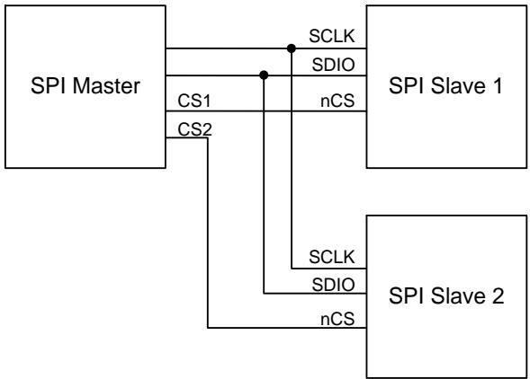  
Figure 13. Typical SPI Master/Slave Configuration

# 11 ASSEMBLY

This section provides general guidelines for assembling InvenSense Micro Electro-Mechanical Systems (MEMS) devices packaged in LGA package.

# 11.1 ORIENTATION OF AXES

The diagram below shows the orientation of the axes of sensitivity and the polarity of rotation. Note the pin 1 identifier $( \bullet )$ in the figure.

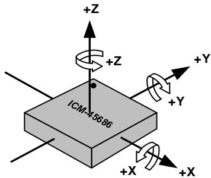  
Figure 14. Orientation of Axes of Sensitivity and Polarity of Rotation

# 11.2 PACKAGE DIMENSIONS

14 Lead LGA $( 2 . 5 { \times } 3 { \times } 0 . 8 1 )$ ) mm NiAu pad finish

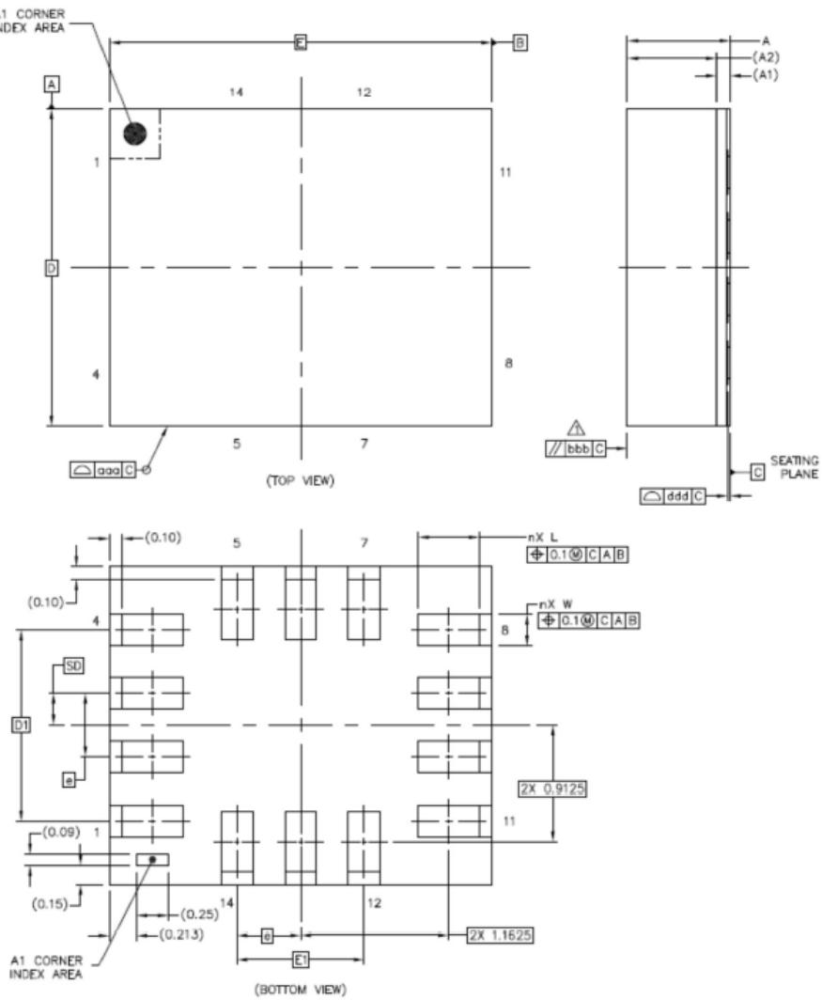

<table><tr><td rowspan=2 colspan=1></td><td rowspan=2 colspan=1>SYMBOLS</td><td rowspan=1 colspan=3>DIMENSIONSINMILLIMETERS</td></tr><tr><td rowspan=1 colspan=1>MIN</td><td rowspan=1 colspan=1>NOM</td><td rowspan=1 colspan=1>MAX</td></tr><tr><td rowspan=1 colspan=1>Total Thickness</td><td rowspan=1 colspan=1>A</td><td rowspan=1 colspan=1>0.76</td><td rowspan=1 colspan=1>0.81</td><td rowspan=1 colspan=1>0.86</td></tr><tr><td rowspan=1 colspan=1>Substrate Thickness</td><td rowspan=1 colspan=1>A1</td><td rowspan=1 colspan=3>0.105          REF</td></tr><tr><td rowspan=1 colspan=1>MoldThickness</td><td rowspan=1 colspan=1>A2</td><td rowspan=1 colspan=3>0.7           REF</td></tr><tr><td rowspan=2 colspan=1>Body Size</td><td rowspan=1 colspan=1>D</td><td rowspan=1 colspan=1></td><td rowspan=1 colspan=1>2.5</td><td rowspan=1 colspan=1>BSC</td></tr><tr><td rowspan=1 colspan=1>E</td><td rowspan=1 colspan=1></td><td rowspan=1 colspan=1>3</td><td rowspan=1 colspan=1>BSC</td></tr><tr><td rowspan=1 colspan=1>Lead Width</td><td rowspan=1 colspan=1>W</td><td rowspan=1 colspan=1>0.2</td><td rowspan=1 colspan=1>0.25</td><td rowspan=1 colspan=1>0.3</td></tr><tr><td rowspan=1 colspan=1>Lead Length</td><td rowspan=1 colspan=1>L</td><td rowspan=1 colspan=1>0.425</td><td rowspan=1 colspan=1>0.475</td><td rowspan=1 colspan=1>0.525</td></tr><tr><td rowspan=1 colspan=1>Lead Pitch</td><td rowspan=1 colspan=1>e</td><td rowspan=1 colspan=3>0.5           BSC</td></tr><tr><td rowspan=1 colspan=1>Lead Count</td><td rowspan=1 colspan=1>n</td><td rowspan=1 colspan=3>14</td></tr><tr><td rowspan=2 colspan=1>Edge Ball Center to Center</td><td rowspan=1 colspan=1>D1</td><td rowspan=1 colspan=3>1.5           BSC</td></tr><tr><td rowspan=1 colspan=1>E1</td><td rowspan=1 colspan=3>1            BSC</td></tr><tr><td rowspan=2 colspan=1>Body Center to Contact Ball</td><td rowspan=1 colspan=1>SD</td><td rowspan=1 colspan=3>0.25           BSC</td></tr><tr><td rowspan=1 colspan=1>SE</td><td rowspan=1 colspan=3>:            BSC</td></tr><tr><td rowspan=1 colspan=1>Package Edge Tolerance</td><td rowspan=1 colspan=1>aaa</td><td rowspan=1 colspan=3>0.1</td></tr><tr><td rowspan=1 colspan=1>Mold Flatness</td><td rowspan=1 colspan=1>bbb</td><td rowspan=1 colspan=3>0.2</td></tr><tr><td rowspan=1 colspan=1>Coplanarity</td><td rowspan=1 colspan=1>ddd</td><td rowspan=1 colspan=3>0.08</td></tr></table>

# 12 DEVICE PACKAGE IN TAPE AND REEL

ICM-45686 devices are packaged in the tape and reel as shown in the figures below.

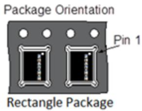  
Figure 15. ICM-45686 Device Package in Tape and Reel

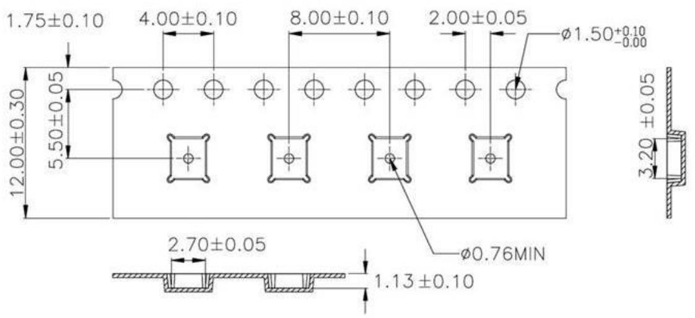  
Figure 16. Tape Dimensions with ICM-45686 Device Package

# 13 PART NUMBER PACKAGE MARKING

The part number package marking for ICM-45686 devices is summarized below:

<table><tr><td>Part Number</td><td> Part Number Package Marking</td></tr><tr><td>ICM-45686</td><td>14586</td></tr></table>

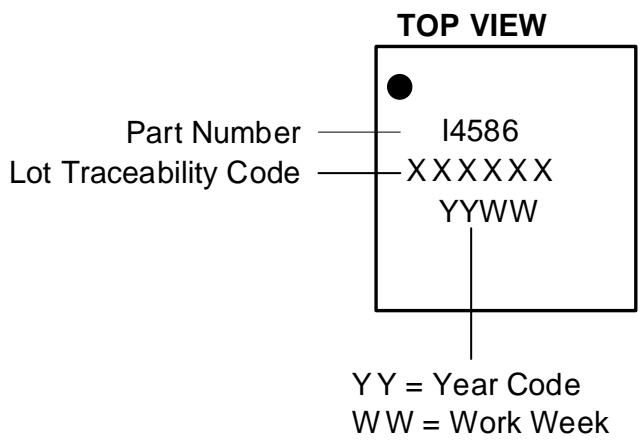

# 14 INDIRECT REGISTER ACCESS

# 14.1 HOST INDIRECT ACCESS REGISTER (IREG)

An IREG is a register or a memory storage element that is not addressed directly by a 7-bit address. IREGs can only be addressed using an internal 16-bit address. Indirect register access procedures described in this section must be used to access all IREGs.

The host configures the internal 16-bit address by programming following registers: {ireg_addr_15_8[7:0], ireg_addr_7_0[7:0]}.

# 14.2 GENERAL RULES FOR ACCESSING IREG

1. Burst-write and burst-read operations are not supported when accessing IREGs from the host. 2. Reading of an IREG is done on a read-pre-fetch basis (details in IREG READ section below). 3. A minimum wait time (refer to section MINIMUM WAIT TIME GAP below for details) is required between two consecutive read/write access to an IREG.

# 14.3 MINIMUM WAIT TIME-GAP

The minimum time gap between two consecutive IREG accesses for various IREG components is $4 \mu \ s$

# 14.4 IREG WRITE

Procedure for writing to an IREG.

1. The host specifies the destination address of an IREG by programming IREG_ADDR_7_0, IREG_ADDR_15_8.

a. If host wants to access a register in IMEM_SRAM, it should add base address 0x0000 to the address of that register shown in the IMEM_SRAM registers section, and then use that resulting value in registers IREG_ADDR_7_0, IREG_ADDR_15_8.   
b. If host wants to access a register in IPREG_BAR, it should add base address 0xA000 to the address of that register shown in the IPREG_BAR registers section, and then use that resulting value in registers IREG_ADDR_7_0, IREG_ADDR_15_8.   
c. If host wants to access a register in IPREG_SYS1, it should add base address 0xA400 to the address of that register shown in the IPREG_SYS1 registers section, and then use that resulting value in registers IREG_ADDR_7_0, IREG_ADDR_15_8.   
d. If host wants to access a register in IPREG_SYS2, it should add base address 0xA500 to the address of that register shown in the IPREG_SYS2 registers section, and then use that resulting value in registers IREG_ADDR_7_0, IREG_ADDR_15_8.   
e. If host wants to access a register in IPREG_TOP1, it should add base address 0xA200 to the address of that register shown in the IPREG_TOP1 registers section, and then use that resulting value in registers IREG_ADDR_7_0, IREG_ADDR_15_8.

2. The host programs the write data to the IREG_DATA register.

3. The above programming steps must be performed in a single burst-write transaction to prevent an unintended read-pre-fetch operation.   
4. After the IREG_DATA register is written, an internal operation is triggered to pass the contents from the IREG_DATA register to a register pointed by {IREG_ADDR_7_0, IREG_ADDR_15_8}.   
5. After the contents from the IREG_DATA register is written to the selected register, the internal 16-bit address is auto-incremented.   
6. After a minimum wait time-gap, the host can write to the IREG_DATA register again, which is effectively writing to the register pointed by the post-auto-incremented address.   
7. Or, after a minimum wait time-gap, the host can program a new destination address for the next write operation.

# 14.5 IREG READ

Procedure for reading from an IREG.

1. The host specifies the destination address of an IREG by programming IREG_ADDR_7_0, IREG_ADDR_15_8.

a. If host wants to access a register in IMEM_SRAM, it should add base address 0x0000 to the address of that register shown in the IMEM_SRAM registers section, and then use that resulting value in registers IREG_ADDR_7_0, IREG_ADDR_15_8.   
b. If host wants to access a register in IPREG_BAR, it should add base address 0xA000 to the address of that register shown in the IPREG_BAR registers section, and then use that resulting value in registers IREG_ADDR_7_0, IREG_ADDR_15_8.   
c. If host wants to access a register in IPREG_SYS1, it should add base address 0xA400 to the address of that register shown in the IPREG_SYS1 registers section, and then use that resulting value in registers IREG_ADDR_7_0, IREG_ADDR_15_8.   
d. If host wants to access a register in IPREG_SYS2, it should add base address 0xA500 to the address of that register shown in the IPREG_SYS2 registers section, and then use that resulting value in registers IREG_ADDR_7_0, IREG_ADDR_15_8.   
e. If host wants to access a register in IPREG_TOP1, it should add base address 0xA200 to the address of that register shown in the IPREG_TOP1 registers section, and then use that resulting value in registers IREG_ADDR_7_0, IREG_ADDR_15_8.

2. Upon the $\mathsf { C S B } = 1$ (SPI) or STOP (I2C) after the above programming, an internal read-pre-fetch operation is triggered.

3. The internal read-pre-fetch operation returns the desired data, which is saved to the IREG_DATA register.

4. After a minimum wait time-gap, the host reads the IREG_DATA register to retrieve the read-data.

5. After the host reads the IREG_DATA register, the internal 16-bit address is auto-incremented, and anothe internal read-pre-fetch is automatically triggered, to fetch data from the IREG register pointed to by the post-auto-incremented address.

6. After a minimum wait time-gap, the host can either read the IREG_DATA register to get the read-data from the next address location, or it can program a new read address.

# 15 DEVICE CONFIGURATION FOR DATA ENDIANNESS

By default the device data endianness is Little Endian, for data in Sensor Data Registers and FIFO, and for FIFO Count. User must set register field SREG_DATA_ENDIAN_SEL in register SREG_CTRL to 1, to enable Big Endian data format for data in Sensor Data Registers and FIFO, and for FIFO Count.

Data descriptions in the register map for Sensor Data Registers, FIFO data, and FIFO Count are for the commonly used Big Endian format.

# 16 REGISTER MAP

This section lists the register map for the ICM-45686, for user bank 0, IMEM_SRAM, IPREG_BAR, IPREG_TOP1, IPREG_SYS1, IPREG_SYS2.

Please refer to the procedure in Section 14 for configuring device data endianness before using the register map.

# 16.1 USER BANK 0 REGISTER MAP

<table><tr><td colspan="1" rowspan="1">Addr(Hex)</td><td colspan="1" rowspan="1">Addr(Dec.)</td><td colspan="1" rowspan="1">Register Name</td><td colspan="1" rowspan="1">Serial1/F</td><td colspan="1" rowspan="1">Bit7</td><td colspan="1" rowspan="1">Bit6</td><td colspan="1" rowspan="1">Bit5</td><td colspan="1" rowspan="1">Bit4</td><td colspan="1" rowspan="1">Bit3</td><td colspan="1" rowspan="1">Bit2</td><td colspan="1" rowspan="1">Bit1</td><td colspan="1" rowspan="1">Bito</td></tr><tr><td colspan="1" rowspan="1">0</td><td colspan="1" rowspan="1">00</td><td colspan="1" rowspan="1">ACCEL_DATA_X1_UI</td><td colspan="1" rowspan="1">SYNCR</td><td colspan="8" rowspan="1">ACCEL_DATA_X_UI[15:8]</td></tr><tr><td colspan="1" rowspan="1">01</td><td colspan="1" rowspan="1">01</td><td colspan="1" rowspan="1">ACCEL_DATA_XO_UI</td><td colspan="1" rowspan="1">SYNCR</td><td colspan="8" rowspan="1">ACCEL_DATA_X_UI[7:0]</td></tr><tr><td colspan="1" rowspan="1">02</td><td colspan="1" rowspan="1">02</td><td colspan="1" rowspan="1">ACCEL_DATA_Y1_UI</td><td colspan="1" rowspan="1">SYNCR</td><td colspan="8" rowspan="1">ACCEL_DATA_Y_UI[15:8]</td></tr><tr><td colspan="1" rowspan="1">03</td><td colspan="1" rowspan="1">03</td><td colspan="1" rowspan="1">ACCEL_DATA_YO_UI</td><td colspan="1" rowspan="1">SYNCR</td><td colspan="8" rowspan="1">ACCEL_DATA_Y_UI[7:0]</td></tr><tr><td colspan="1" rowspan="1">04</td><td colspan="1" rowspan="1">04</td><td colspan="1" rowspan="1">ACCEL_DATA_Z1_UI</td><td colspan="1" rowspan="1">SYNCR</td><td colspan="8" rowspan="1">ACCEL_DATA_Z_UI[15:8]</td></tr><tr><td colspan="1" rowspan="1">05</td><td colspan="1" rowspan="1">05</td><td colspan="1" rowspan="1">ACCEL_DATA_ZO_UI</td><td colspan="1" rowspan="1">SYNCR</td><td colspan="8" rowspan="1">ACCEL_DATA_Z_UI[7:0]</td></tr><tr><td colspan="1" rowspan="1">06</td><td colspan="1" rowspan="1">06</td><td colspan="1" rowspan="1">GYRO_DATA_X1_UI</td><td colspan="1" rowspan="1">SYNCR</td><td colspan="8" rowspan="1">GYRO_DATA_X_UI[15:8]</td></tr><tr><td colspan="1" rowspan="1">07</td><td colspan="1" rowspan="1">07</td><td colspan="1" rowspan="1">GYRO_DATA_X0_UI</td><td colspan="1" rowspan="1">SYNCR</td><td colspan="8" rowspan="1">GYRO_DATA_X_UI[7:0]</td></tr><tr><td colspan="1" rowspan="1">08</td><td colspan="1" rowspan="1">08</td><td colspan="1" rowspan="1">GYRO_DATA_Y1_UI</td><td colspan="1" rowspan="1">SYNCR</td><td colspan="8" rowspan="1">GYRO_DATA_Y_UI[15:8]</td></tr><tr><td colspan="1" rowspan="1">09</td><td colspan="1" rowspan="1">09</td><td colspan="1" rowspan="1">GYRO_DATA_YO_UI</td><td colspan="1" rowspan="1">SYNCR</td><td colspan="8" rowspan="1">GYRO_DATA_Y_UI[7:0]</td></tr><tr><td colspan="1" rowspan="1">0A</td><td colspan="1" rowspan="1">10</td><td colspan="1" rowspan="1">GYRO_DATA_Z1_UI</td><td colspan="1" rowspan="1">SYNCR</td><td colspan="8" rowspan="1">GYRO_DATA_Z_UI[15:8]</td></tr><tr><td colspan="1" rowspan="1">0B</td><td colspan="1" rowspan="1">11</td><td colspan="1" rowspan="1">GYRO_DATA_ZO_UI</td><td colspan="1" rowspan="1">SYNCR</td><td colspan="8" rowspan="1">GYRO_DATA_Z_UI[7:0]</td></tr><tr><td colspan="1" rowspan="1">0C</td><td colspan="1" rowspan="1">12</td><td colspan="1" rowspan="1">TEMP_DATA1_UI</td><td colspan="1" rowspan="1">SYNCR</td><td colspan="8" rowspan="1">TEMP_DATA_UI[15:8]</td></tr><tr><td colspan="1" rowspan="1">0D</td><td colspan="1" rowspan="1">13</td><td colspan="1" rowspan="1">TEMP_DATAO_UI</td><td colspan="1" rowspan="1">SYNCR</td><td colspan="8" rowspan="1">TEMP_DATA_U[7:0]</td></tr><tr><td colspan="1" rowspan="1">0E</td><td colspan="1" rowspan="1">14</td><td colspan="1" rowspan="1">TMST_FSYNCH</td><td colspan="1" rowspan="1">SYNCR</td><td colspan="8" rowspan="1">TMST_FSYNC_DATA_UI[15:8]</td></tr><tr><td colspan="1" rowspan="1">OF</td><td colspan="1" rowspan="1">15</td><td colspan="1" rowspan="1">TMST_FSYNCL</td><td colspan="1" rowspan="1">SYNCR</td><td colspan="8" rowspan="1">TMST_FSYNC_DATA_UI[7:0]</td></tr><tr><td colspan="1" rowspan="1">10</td><td colspan="1" rowspan="1">16</td><td colspan="1" rowspan="1">PWR_MGMT0</td><td colspan="1" rowspan="1">R/W</td><td colspan="4" rowspan="1"></td><td colspan="2" rowspan="1">GYRO_MODE</td><td colspan="2" rowspan="1">ACCEL_MODE</td></tr><tr><td colspan="1" rowspan="1">12</td><td colspan="1" rowspan="1">18</td><td colspan="1" rowspan="1">FIFO_COUNT_0</td><td colspan="1" rowspan="1">R</td><td colspan="8" rowspan="1">FIFO_DATA_CNT[15:8]</td></tr><tr><td colspan="1" rowspan="1">13</td><td colspan="1" rowspan="1">19</td><td colspan="1" rowspan="1">FIFO_COUNT_1</td><td colspan="1" rowspan="1">R</td><td colspan="8" rowspan="1">FIFO_DATA_CNT[7:0]</td></tr><tr><td colspan="1" rowspan="1">14</td><td colspan="1" rowspan="1">20</td><td colspan="1" rowspan="1">FIFO_DATA</td><td colspan="1" rowspan="1">R</td><td colspan="8" rowspan="1">FIFO_DATA</td></tr><tr><td colspan="1" rowspan="1">16</td><td colspan="1" rowspan="1">22</td><td colspan="1" rowspan="1">INT1_CONFIGO</td><td colspan="1" rowspan="1">R/W</td><td colspan="1" rowspan="1">INT1_STATUS_EN_RESET_DONE</td><td colspan="1" rowspan="1">INT1_STATUS_EN_AUX1_AGC_RDY</td><td colspan="1" rowspan="1">INT1_STATUS_EN_AP_AGCRDY</td><td colspan="1" rowspan="1">INT1_STATUS_EN_AP_FSYNC</td><td colspan="1" rowspan="1">INT1_STATUS_EN_AUX1_DRDY</td><td colspan="1" rowspan="1">INT1_STATUS_EN_DRDY</td><td colspan="1" rowspan="1">INT1_STATUS_EN_FIFO_THs</td><td colspan="1" rowspan="1">INT1_STATUS_EN_FIFO_FUF</td></tr><tr><td colspan="1" rowspan="1">17</td><td colspan="1" rowspan="1">23</td><td colspan="1" rowspan="1">INT1_CONFIG1</td><td colspan="1" rowspan="1">R/W</td><td colspan="1" rowspan="1">-</td><td colspan="1" rowspan="1">INT1_STATUS_EN_APEX_EVENT</td><td colspan="1" rowspan="1">INT1_STATUS_EN_12CM_DONE</td><td colspan="1" rowspan="1">INT1_STATUS_EN_13C_PROTOCOL_ERR</td><td colspan="1" rowspan="1">INT1_STATUS_EN_WOM_Z</td><td colspan="1" rowspan="1">INT1_STATUS_EN_WOM_Y</td><td colspan="1" rowspan="1">INT1_STATUS_EN_WOM_X</td><td colspan="1" rowspan="1">INT1_STATUS_EN_PLL_RDY</td></tr><tr><td colspan="1" rowspan="1">18</td><td colspan="1" rowspan="1">24</td><td colspan="1" rowspan="1">INT1_CONFIG2</td><td colspan="1" rowspan="1">R/W</td><td colspan="5" rowspan="1">-</td><td colspan="1" rowspan="1">INT1_DRIVE</td><td colspan="1" rowspan="1">INT1_MODE</td><td colspan="1" rowspan="1">INT1_POLARITY</td></tr><tr><td colspan="1" rowspan="1">19</td><td colspan="1" rowspan="1">25</td><td colspan="1" rowspan="1">INT1_STATUSO</td><td colspan="1" rowspan="1">R/C</td><td colspan="1" rowspan="1">INT1_STATUS_RESET_DONE</td><td colspan="1" rowspan="1">INT1_STATUS_AUX1_AGC_RDY</td><td colspan="1" rowspan="1">INT1_STATUS_AP_AGC_RDY</td><td colspan="1" rowspan="1">INT1_STATUS_AP_FSYNC</td><td colspan="1" rowspan="1">INT1_STATUS_AUX1_DRDY</td><td colspan="1" rowspan="1">INT1_STATUS_DRDY</td><td colspan="1" rowspan="1">INT1_STATUS_FIFO_THS</td><td colspan="1" rowspan="1">INT1_STATUS_FIFO_FULL</td></tr><tr><td colspan="1" rowspan="1">1A</td><td colspan="1" rowspan="1">26</td><td colspan="1" rowspan="1">INT1_STATUS1</td><td colspan="1" rowspan="1">R/C</td><td colspan="1" rowspan="1">-</td><td colspan="1" rowspan="1">INT1_STATUS_APEX_EVENT</td><td colspan="1" rowspan="1">INT1_STATUS_12CM_DONE</td><td colspan="1" rowspan="1">INT1_STATUS_I3C_PROTOCOL_ERR</td><td colspan="1" rowspan="1">INT1_STATUS_WOM_Z</td><td colspan="1" rowspan="1">INT1_STATUS_WOM_Y</td><td colspan="1" rowspan="1">INT1_STATUS_WOM_X</td><td colspan="1" rowspan="1">INT1_STATUS_PLL_RDY</td></tr><tr><td colspan="1" rowspan="1">1B</td><td colspan="1" rowspan="1">27</td><td colspan="1" rowspan="1">ACCEL_CONFIGO</td><td colspan="1" rowspan="1">R/W</td><td colspan="1" rowspan="1">-</td><td colspan="3" rowspan="1">ACCEL_UI_FS_SEL</td><td colspan="1" rowspan="1"></td><td colspan="3" rowspan="1">ACCEL_ODR</td></tr><tr><td colspan="1" rowspan="1">1C</td><td colspan="1" rowspan="1">28</td><td colspan="1" rowspan="1">GYRO_CONFIGO</td><td colspan="1" rowspan="1">R/W</td><td colspan="2" rowspan="1">GYRO_UI_FS_SEL</td><td colspan="1" rowspan="1">GYRO_UI_FS_SEL</td><td colspan="1" rowspan="1"></td><td colspan="1" rowspan="1"></td><td colspan="3" rowspan="1">GYRO_ODR</td></tr><tr><td colspan="1" rowspan="1">1D</td><td colspan="1" rowspan="1">29</td><td colspan="1" rowspan="1">FIFO_CONFIGO</td><td colspan="1" rowspan="1">R/W</td><td colspan="2" rowspan="1">FIFO_MODE</td><td colspan="1" rowspan="1"></td><td colspan="1" rowspan="1"></td><td colspan="3" rowspan="1">FIFO_DEPTH</td><td colspan="1" rowspan="1"></td></tr><tr><td colspan="1" rowspan="1">1E</td><td colspan="1" rowspan="1">30</td><td colspan="1" rowspan="1">FIFO_CONFIG1_0</td><td colspan="1" rowspan="1">R/W</td><td colspan="7" rowspan="1">FIFO_WM_TH[7:0]</td><td colspan="1" rowspan="1"></td></tr><tr><td colspan="1" rowspan="1">1F</td><td colspan="1" rowspan="1">31</td><td colspan="1" rowspan="1">FIFO_CONFIG1_1</td><td colspan="1" rowspan="1">R/W</td><td colspan="8" rowspan="1">FIFO_WM_TH[15:8]</td></tr><tr><td colspan="1" rowspan="1">20</td><td colspan="1" rowspan="1">32</td><td colspan="1" rowspan="1">FIFO_CONFIG2</td><td colspan="1" rowspan="1">R/W</td><td colspan="1" rowspan="1">FIFO_FLUSH</td><td colspan="3" rowspan="1"></td><td colspan="1" rowspan="1">FIFO_WR_WM_GT_TH</td><td colspan="3" rowspan="1"></td></tr><tr><td colspan="1" rowspan="1">21</td><td colspan="1" rowspan="1">33</td><td colspan="1" rowspan="1">FIFO_CONFIG3</td><td colspan="1" rowspan="1">R/W</td><td colspan="2" rowspan="1"></td><td colspan="1" rowspan="1">FIFO_ES1_EN</td><td colspan="1" rowspan="1">FIFO_ESO_EN</td><td colspan="1" rowspan="1">FIFO_HIRES_EN</td><td colspan="1" rowspan="1">FIFO_GYRO_EN</td><td colspan="1" rowspan="1">FIFO_ACCEL_EN</td><td colspan="1" rowspan="1">FIFO_IF_EN</td></tr><tr><td colspan="1" rowspan="1">22</td><td colspan="1" rowspan="1">34</td><td colspan="1" rowspan="1">FIFO_CONFIG4</td><td colspan="1" rowspan="1">R/W</td><td colspan="1" rowspan="1"></td><td colspan="1" rowspan="1"></td><td colspan="3" rowspan="1">FIFO_COMP_NC_FLOW_CFG</td><td colspan="1" rowspan="1">FIFO_COMP_EN</td><td colspan="1" rowspan="1">FIFO_TMST_FSYNC_EN</td><td colspan="1" rowspan="1">FIFO_ESO_6B9B</td></tr><tr><td colspan="1" rowspan="1">23</td><td colspan="1" rowspan="1">35</td><td colspan="1" rowspan="1">TMST_WOM_CONFIG</td><td colspan="1" rowspan="1">R/W</td><td colspan="1" rowspan="1">-</td><td colspan="1" rowspan="1">TMST_DELTA_EN</td><td colspan="1" rowspan="1">TMST_RESOL</td><td colspan="1" rowspan="1">WOM_EN</td><td colspan="1" rowspan="1">WOM_MODE</td><td colspan="1" rowspan="1">WOM_INT_MODE</td><td colspan="2" rowspan="1">WOM_INT_DUR</td></tr><tr><td colspan="1" rowspan="1">24</td><td colspan="1" rowspan="1">36</td><td colspan="1" rowspan="1">FSYNC_CONFIGO</td><td colspan="1" rowspan="1">R/W</td><td colspan="4" rowspan="1"></td><td colspan="1" rowspan="1">AP_FSYNC_FLAG_CLEAR_SEL</td><td colspan="3" rowspan="1">AP_FSYNC_SEL</td></tr><tr><td colspan="1" rowspan="1">25</td><td colspan="1" rowspan="1">37</td><td colspan="1" rowspan="1">FSYNC_CONFIG1</td><td colspan="1" rowspan="1">R/W</td><td colspan="4" rowspan="1"></td><td colspan="1" rowspan="1">AUX1_FSYNC_FLAG_CLEAR_SEL</td><td colspan="3" rowspan="1">AUX1_FSYNC_SEL</td></tr><tr><td colspan="1" rowspan="1">26</td><td colspan="1" rowspan="1">38</td><td colspan="1" rowspan="1">RTC_CONFIG</td><td colspan="1" rowspan="1">R/W</td><td colspan="1" rowspan="1">=</td><td colspan="1" rowspan="1">RTC_ALIGN</td><td colspan="1" rowspan="1">RTC_MODE</td><td colspan="2" rowspan="1"></td><td colspan="3" rowspan="1"></td></tr><tr><td colspan="1" rowspan="1">27</td><td colspan="1" rowspan="1">39</td><td colspan="1" rowspan="1">DMP_EXT_SEN_ODR_CFG</td><td colspan="1" rowspan="1">R/W</td><td colspan="1" rowspan="1"></td><td colspan="1" rowspan="1">EXT_SENSOR_EN</td><td colspan="3" rowspan="1">EXT_ODR</td><td colspan="3" rowspan="1">APEX_ODR</td></tr><tr><td colspan="1" rowspan="1">28</td><td colspan="1" rowspan="1">40</td><td colspan="1" rowspan="1">ODR_DECIMATE_CONFIG</td><td colspan="1" rowspan="1">R/W</td><td colspan="1" rowspan="1"></td><td colspan="1" rowspan="1">GYRO_FIFO_ODR_DEC</td><td colspan="2" rowspan="1">GYRO_FIFO_ODR_DEC</td><td colspan="1" rowspan="1"></td><td colspan="3" rowspan="1">ACCEL_FIFO_ODR_DEC</td></tr><tr><td colspan="1" rowspan="1">29</td><td colspan="1" rowspan="1">41</td><td colspan="1" rowspan="1">EDMP_APEX_ENO</td><td colspan="1" rowspan="1">R/W</td><td colspan="1" rowspan="1">SMD_EN</td><td colspan="1" rowspan="1">R2W_EN</td><td colspan="1" rowspan="1">FF_EN</td><td colspan="1" rowspan="1">PEDO_EN</td><td colspan="1" rowspan="1">TILT_EN</td><td colspan="2" rowspan="1"></td><td colspan="1" rowspan="1">TAP_EN</td></tr><tr><td colspan="1" rowspan="1">2A</td><td colspan="1" rowspan="1">42</td><td colspan="1" rowspan="1">EDMP_APEX_EN1</td><td colspan="1" rowspan="1">R/W</td><td colspan="1" rowspan="1"></td><td colspan="1" rowspan="1">EDMP_ENABLE</td><td colspan="1" rowspan="1">FEATURE3_EN</td><td colspan="2" rowspan="1"></td><td colspan="1" rowspan="1">POWER_SAVE_EN</td><td colspan="1" rowspan="1">INIT_EN</td><td colspan="1" rowspan="1">SOFT_HARD_IRON_CORR_EN</td></tr><tr><td colspan="1" rowspan="1">2B</td><td colspan="1" rowspan="1">43</td><td colspan="1" rowspan="1">APEX_BUFFER_MGMT</td><td colspan="1" rowspan="1">R/W</td><td colspan="2" rowspan="1">FF_DURATION_HOST_RPTR</td><td colspan="1" rowspan="1">FF_DURATION_EDMP_WPTR</td><td colspan="1" rowspan="1">FF_DURATION_EDMP_WPTR</td><td colspan="2" rowspan="1">STEP_COUNT_HOST_RPTR</td><td colspan="1" rowspan="1">STEP_COUNT_EDMP_WPTR</td><td colspan="1" rowspan="1">STEP_COUNT_EDMP_WPTR</td></tr><tr><td colspan="1" rowspan="1">2C</td><td colspan="1" rowspan="1">44</td><td colspan="1" rowspan="1">INTF_CONFIGO</td><td colspan="1" rowspan="1">R/W</td><td colspan="2" rowspan="1"></td><td colspan="1" rowspan="1">VIRTUAL_ACCESS_AUX1_EN</td><td colspan="3" rowspan="1"></td><td colspan="1" rowspan="1">AP_SPI_34_MODE</td><td colspan="1" rowspan="1">AP_SPI_MODE</td></tr><tr><td colspan="1" rowspan="1">2D</td><td colspan="1" rowspan="1">45</td><td colspan="1" rowspan="1">INTF_CONFIG1_OVRD</td><td colspan="1" rowspan="1">R/W</td><td colspan="4" rowspan="1"></td><td colspan="1" rowspan="1">AP_SPI_34MODE_OVRD</td><td colspan="1" rowspan="1">AP_SPI_34MODE_OVRD_VAL</td><td colspan="1" rowspan="1">AP_SPI_MODE_OVRD</td><td colspan="1" rowspan="1">AP_SPI_MODE_OVRD_VAL</td></tr><tr><td colspan="1" rowspan="1">2E</td><td colspan="1" rowspan="1">46</td><td colspan="1" rowspan="1">INTF_AUX_CONFIG</td><td colspan="1" rowspan="1">R/W</td><td colspan="6" rowspan="1"></td><td colspan="1" rowspan="1">AUX1_SPI_34_MODE</td><td colspan="1" rowspan="1">AUX1_SPI_MODE</td></tr><tr><td colspan="1" rowspan="1">2F</td><td colspan="1" rowspan="1">47</td><td colspan="1" rowspan="1">IOC_PAD_SCENARIO</td><td colspan="1" rowspan="1">R</td><td colspan="5" rowspan="1"></td><td colspan="2" rowspan="1">AUX1_MODE</td><td colspan="1" rowspan="1">AUX1_ENABL</td></tr><tr><td colspan="1" rowspan="1">30</td><td colspan="1" rowspan="1">48</td><td colspan="1" rowspan="1">IOC_PAD_SCENARIO_AUX_OVRD</td><td colspan="1" rowspan="1">R/W</td><td colspan="3" rowspan="1"></td><td colspan="1" rowspan="1">AUX1_MODE_OVRD</td><td colspan="2" rowspan="1">AUX1_ENABLE_OVRD_VAL</td><td colspan="1" rowspan="1">AUX1_ENABLE_OVRD</td><td colspan="1" rowspan="1">AUX1_ENABLE_OVRD_VAL</td></tr><tr><td colspan="1" rowspan="1">32</td><td colspan="1" rowspan="1">50</td><td colspan="1" rowspan="1">DRIVE_CONFIGO</td><td colspan="1" rowspan="1">R/W</td><td colspan="1" rowspan="1"></td><td colspan="3" rowspan="1">PADS_I2C_SLEW</td><td colspan="3" rowspan="1">PADS_SPI_SLEW</td><td colspan="1" rowspan="1">-</td></tr><tr><td colspan="1" rowspan="1">33</td><td colspan="1" rowspan="1">51</td><td colspan="1" rowspan="1">DRIVE_CONFIG1</td><td colspan="1" rowspan="1">R/W</td><td colspan="2" rowspan="1"></td><td colspan="3" rowspan="1">PADS_I3C_DDR_SLEW</td><td colspan="2" rowspan="1">PADS_I3C_SDR_SLEW</td><td colspan="1" rowspan="1"></td></tr><tr><td colspan="1" rowspan="1">34</td><td colspan="1" rowspan="1">52</td><td colspan="1" rowspan="1">DRIVE_CONFIG2</td><td colspan="1" rowspan="1">R/W</td><td colspan="2" rowspan="1"></td><td colspan="3" rowspan="1"></td><td colspan="1" rowspan="1"></td><td colspan="1" rowspan="1">PADS_SLEW</td><td colspan="1" rowspan="1"></td></tr><tr><td colspan="1" rowspan="1">39</td><td colspan="1" rowspan="1">57</td><td colspan="1" rowspan="1">INT_APEX_CONFIGO</td><td colspan="1" rowspan="1">R/W</td><td colspan="1" rowspan="1">INT_STATUS_MASK_PIN_R2W_WAKE_DET</td><td colspan="1" rowspan="1">INT_STATUS_MASK_PIN_FF_DET</td><td colspan="1" rowspan="1">INT_STATUS_MASK_PIN_STEP_DET</td><td colspan="1" rowspan="1">INT_STATUS_MASK_PIN_STEP_CNT_OVFL</td><td colspan="1" rowspan="1">INT_STATUS_MASK_PIN_TILT_DET</td><td colspan="1" rowspan="1">INT_STATUS_MASK_PIN_LOW_G_DET</td><td colspan="1" rowspan="1">INT_STATUS_MASK_PIN_HIGH_G_DET</td><td colspan="1" rowspan="1">INT_STATUS_MASK_PIN_TAP_DET</td></tr><tr><td colspan="1" rowspan="1">3A</td><td colspan="1" rowspan="1">58</td><td colspan="1" rowspan="1">INT_APEX_CONFIG1</td><td colspan="1" rowspan="1">R/W</td><td colspan="3" rowspan="1"></td><td colspan="1" rowspan="1">INT_STATUS_MASK_PIN_SA_DONE</td><td colspan="1" rowspan="1">-</td><td colspan="1" rowspan="1">INT_STATUS_MASK_PIN_SELFTEST_DONE</td><td colspan="1" rowspan="1">INT_STATUS_MASK_PIN_SMD_DET</td><td colspan="1" rowspan="1">INT_STATUS_MASK_PIN_R2W_SLEEP_DET</td></tr><tr><td colspan="1" rowspan="1">3B</td><td colspan="1" rowspan="1">59</td><td colspan="1" rowspan="1">INT_APEX_STATUSO</td><td colspan="1" rowspan="1">R/C</td><td colspan="1" rowspan="1">INT_STATUS_R2W_WAKE_DET</td><td colspan="1" rowspan="1">INT_STATUS_FF_DET</td><td colspan="1" rowspan="1">INT_STATUS_STEP_DET</td><td colspan="1" rowspan="1">INT_STATUS_STEP_CNT_OVFL</td><td colspan="1" rowspan="1">INT_STATUS_TILT_DET</td><td colspan="1" rowspan="1">INT_STATUS_LOW_G_DET</td><td colspan="1" rowspan="1">INT_STATUS_HIGH_G_DET</td><td colspan="1" rowspan="1">INT_STATUS_TAP_DET</td></tr><tr><td colspan="1" rowspan="1">3C</td><td colspan="1" rowspan="1">60</td><td colspan="1" rowspan="1">INT_APEX_STATUS1</td><td colspan="1" rowspan="1">R/C</td><td colspan="3" rowspan="1"></td><td colspan="1" rowspan="1">INT_STATUS_SA_DONE</td><td colspan="1" rowspan="1">-</td><td colspan="1" rowspan="1">INT_STATUS_SELFTEST_DONE</td><td colspan="1" rowspan="1">INT_STATUS_SMD_DET</td><td colspan="1" rowspan="1">INT_STATUS_R2W_SLEEP_DET</td></tr><tr><td colspan="1" rowspan="1">44</td><td colspan="1" rowspan="1">68</td><td colspan="1" rowspan="1">ACCEL_DATA_X1_AUX1</td><td colspan="1" rowspan="1">SYNCR</td><td colspan="8" rowspan="1">ACCEL_DATA_X_AUX1[15:8]</td></tr><tr><td colspan="1" rowspan="1">45</td><td colspan="1" rowspan="1">69</td><td colspan="1" rowspan="1">ACCEL_DATA_XO_AUX1</td><td colspan="1" rowspan="1">SYNCR</td><td colspan="8" rowspan="1">ACCEL_DATA_X_AUX1[7:0]</td></tr><tr><td colspan="1" rowspan="1">46</td><td colspan="1" rowspan="1">70</td><td colspan="1" rowspan="1">ACCEL_DATA_Y1_AUX1</td><td colspan="1" rowspan="1">SYNCR</td><td colspan="8" rowspan="1">ACCEL_DATA_Y_AUX1[15:8]</td></tr><tr><td colspan="1" rowspan="1">47</td><td colspan="1" rowspan="1">71</td><td colspan="1" rowspan="1">ACCEL_DATA_YO_AUX1</td><td colspan="1" rowspan="1">SYNCR</td><td colspan="8" rowspan="1">ACCEL_DATA_Y_AUX1[7:0]</td></tr><tr><td colspan="1" rowspan="1">48</td><td colspan="1" rowspan="1">72</td><td colspan="1" rowspan="1">ACCEL_DATA_Z1_AUX1</td><td colspan="1" rowspan="1">SYNCR</td><td colspan="8" rowspan="1">ACCEL_DATA_Z_AUX1[15:8]</td></tr><tr><td colspan="1" rowspan="1">49</td><td colspan="1" rowspan="1">73</td><td colspan="1" rowspan="1">ACCEL_DATA_ZO_AUX1</td><td colspan="1" rowspan="1">SYNCR</td><td colspan="8" rowspan="1">ACCEL_DATA_Z_AUX1[7:0]</td></tr><tr><td colspan="1" rowspan="1">4A</td><td colspan="1" rowspan="1">74</td><td colspan="1" rowspan="1">GYRO_DATA_X1_AUX1</td><td colspan="1" rowspan="1">SYNCR</td><td colspan="8" rowspan="1">GYRO_DATA_X_AUX1[15:8]</td></tr><tr><td colspan="1" rowspan="1">4B</td><td colspan="1" rowspan="1">75</td><td colspan="1" rowspan="1">GYRO_DATA_XO_AUX1</td><td colspan="1" rowspan="1">SYNCR</td><td colspan="8" rowspan="1">GYRO_DATA_X_AUX1[7:0]</td></tr><tr><td colspan="1" rowspan="1">4C</td><td colspan="1" rowspan="1">76</td><td colspan="1" rowspan="1">GYRO_DATA_Y1_AUX1</td><td colspan="1" rowspan="1">SYNCR</td><td colspan="8" rowspan="1">GYRO_DATA_Y_AUX1[15:8]</td></tr><tr><td colspan="1" rowspan="1">4D</td><td colspan="1" rowspan="1">77</td><td colspan="1" rowspan="1">GYRO_DATA_YO_AUX1</td><td colspan="1" rowspan="1">SYNCR</td><td colspan="8" rowspan="1">GYRO_DATA_Y_AUX1[7:0]</td></tr><tr><td colspan="1" rowspan="1">4E</td><td colspan="1" rowspan="1">78</td><td colspan="1" rowspan="1">GYRO_DATA_Z1_AUX1</td><td colspan="1" rowspan="1">SYNCR</td><td colspan="8" rowspan="1">GYRO_DATA_Z_AUX1[15:8]</td></tr><tr><td colspan="1" rowspan="1">4F</td><td colspan="1" rowspan="1">79</td><td colspan="1" rowspan="1">GYRO_DATA_ZO_AUX1</td><td colspan="1" rowspan="1">SYNCR</td><td colspan="8" rowspan="1">GYRO_DATA_Z_AUX1[7:0]</td></tr><tr><td colspan="1" rowspan="1">50</td><td colspan="1" rowspan="1">80</td><td colspan="1" rowspan="1">TEMP_DATA1_AUX1</td><td colspan="1" rowspan="1">SYNCR</td><td colspan="8" rowspan="1">TEMP_DATA_AUX1[15:8]</td></tr><tr><td colspan="1" rowspan="1">51</td><td colspan="1" rowspan="1">81</td><td colspan="1" rowspan="1">TEMP_DATAO_AUX1</td><td colspan="1" rowspan="1">SYNCR</td><td colspan="8" rowspan="1">TEMP_DATA_AUX1[7:0]</td></tr><tr><td colspan="1" rowspan="1">52</td><td colspan="1" rowspan="1">82</td><td colspan="1" rowspan="1">TMST_FSYNCH_AUX1</td><td colspan="1" rowspan="1">SYNCR</td><td colspan="8" rowspan="1">TMST_FSYNC_DATA_AUX1[15:8]</td></tr><tr><td colspan="1" rowspan="1">53</td><td colspan="1" rowspan="1">83</td><td colspan="1" rowspan="1">TMST_FSYNCL_AUX1</td><td colspan="1" rowspan="1">SYNCR</td><td colspan="8" rowspan="1">TMST_FSYNC_DATA_AUX1[7:0]</td></tr><tr><td colspan="1" rowspan="1">Addr(Hex)</td><td colspan="1" rowspan="1">Addr(Dec.)</td><td colspan="1" rowspan="1">Register Name</td><td colspan="1" rowspan="1">SerialI/F</td><td colspan="1" rowspan="1">Bit7</td><td colspan="1" rowspan="1">Bit6</td><td colspan="1" rowspan="1">Bit5</td><td colspan="1" rowspan="1">Bit4</td><td colspan="1" rowspan="1">Bit3</td><td colspan="1" rowspan="1">Bit2</td><td colspan="1" rowspan="1">Bit1</td><td colspan="1" rowspan="1">Bito</td></tr><tr><td colspan="1" rowspan="1">54</td><td colspan="1" rowspan="1">84</td><td colspan="1" rowspan="1">PWR_MGMT_AUX1</td><td colspan="1" rowspan="1">R/W</td><td colspan="6" rowspan="1">=</td><td colspan="1" rowspan="1">GYRO_AUX1_EN</td><td colspan="1" rowspan="1">ACCEL_AUX1_EN</td></tr><tr><td colspan="1" rowspan="1">55</td><td colspan="1" rowspan="1">85</td><td colspan="1" rowspan="1">FS_SEL_AUX1</td><td colspan="1" rowspan="1">R/W</td><td colspan="1" rowspan="1">-</td><td colspan="4" rowspan="1">GYRO_AUX1_FS_SEL</td><td colspan="3" rowspan="1">ACCEL_AUX1_FS_SEL</td></tr><tr><td colspan="1" rowspan="1">56</td><td colspan="1" rowspan="1">86</td><td colspan="1" rowspan="1">INT2_CONFIGO</td><td colspan="1" rowspan="1">R/W</td><td colspan="1" rowspan="1">INT2_STATUS_EN_RESET_DONE</td><td colspan="1" rowspan="1">INT2_STATUS_EN_AUX1_AGC_RDY</td><td colspan="1" rowspan="1">INT2_STATUS_EN_AP_AGC_RDY</td><td colspan="1" rowspan="1">INT2_STATUS_EN_AP_FSYNC</td><td colspan="1" rowspan="1">INT2_STATUS_EN_AUX1_DRDY</td><td colspan="1" rowspan="1">INT2_STATUS_EN_DRDY</td><td colspan="1" rowspan="1">INT2_STATUS_EN_FIFO_THS</td><td colspan="1" rowspan="1">INT2_STATUS_EN_FIFO_FUF</td></tr><tr><td colspan="1" rowspan="1">57</td><td colspan="1" rowspan="1">87</td><td colspan="1" rowspan="1">INT2_CONFIG1</td><td colspan="1" rowspan="1">R/W</td><td colspan="1" rowspan="1">-</td><td colspan="1" rowspan="1">INT2_STATUS_EN_APEX_EVENT</td><td colspan="1" rowspan="1">INT2_STATUS_EN_12CM_DONE</td><td colspan="1" rowspan="1">INT2_STATUS_EN_13C_PROTOCOL_ERR</td><td colspan="1" rowspan="1">INT2_STATUS_EN_WOM_Z</td><td colspan="1" rowspan="1">INT2_STATUS_EN_WOM_Y</td><td colspan="1" rowspan="1">INT2_STATUS_EN_WOM_X</td><td colspan="1" rowspan="1">INT2_STATUS_EN_PLL_RDY</td></tr><tr><td colspan="1" rowspan="1">58</td><td colspan="1" rowspan="1">88</td><td colspan="1" rowspan="1">INT2_CONFIG2</td><td colspan="1" rowspan="1">R/W</td><td colspan="5" rowspan="1"></td><td colspan="1" rowspan="1">INT2_DRIVE</td><td colspan="1" rowspan="1">INT2_MODE</td><td colspan="1" rowspan="1">INT2_POLARITY</td></tr><tr><td colspan="1" rowspan="1">59</td><td colspan="1" rowspan="1">89</td><td colspan="1" rowspan="1">INT2_STATUSO</td><td colspan="1" rowspan="1">R/C</td><td colspan="1" rowspan="1">INT2_STATUS_RESET_DONE</td><td colspan="1" rowspan="1">INT2_STATUS_AUX1_AGC_RDY</td><td colspan="1" rowspan="1">INT2_STATUS_AP_AGC_RDY</td><td colspan="1" rowspan="1">INT2_STATUS_AP_FSYNC</td><td colspan="1" rowspan="1">INT2_STATUS_AUX1_DRDY</td><td colspan="1" rowspan="1">INT2_STATUS_DRDY</td><td colspan="1" rowspan="1">INT2_STATUS_FIFO_THS</td><td colspan="1" rowspan="1">INT2_STATUS_FIFO_FULL</td></tr><tr><td colspan="1" rowspan="1">5A</td><td colspan="1" rowspan="1">90</td><td colspan="1" rowspan="1">INT2_STATUS1</td><td colspan="1" rowspan="1">R/C</td><td colspan="1" rowspan="1"></td><td colspan="1" rowspan="1">INT1_STATUS_APEX_EVEN1</td><td colspan="1" rowspan="1">INT1_STATUS_12CM_DONE</td><td colspan="1" rowspan="1">INT1_STATUS_13C_PROTOCOL_ERR</td><td colspan="1" rowspan="1">INT1_STATUS_WOM_Z</td><td colspan="1" rowspan="1">INT1_STATUS_WOM_Y</td><td colspan="1" rowspan="1">INT1_STATUS_WOM_X</td><td colspan="1" rowspan="1">INT1_STATUS_PLL_RDY</td></tr><tr><td colspan="1" rowspan="1">72</td><td colspan="1" rowspan="1">114</td><td colspan="1" rowspan="1">WHO_AM_I</td><td colspan="1" rowspan="1">R</td><td colspan="8" rowspan="1">WHOAMI</td></tr><tr><td colspan="1" rowspan="1">73</td><td colspan="1" rowspan="1">115</td><td colspan="1" rowspan="1">REG_HOST_MSG</td><td colspan="1" rowspan="1">R/W</td><td colspan="2" rowspan="1"></td><td colspan="1" rowspan="1">EDMP_ON_DEMAND_EN</td><td colspan="4" rowspan="1"></td><td colspan="1" rowspan="1">TESTOPENABLE</td></tr><tr><td colspan="1" rowspan="1">7C</td><td colspan="1" rowspan="1">124</td><td colspan="1" rowspan="1">IREG_ADDR_15_8</td><td colspan="1" rowspan="1">R/W</td><td colspan="8" rowspan="1">IREG_ADDR_15_8</td></tr><tr><td colspan="1" rowspan="1">7D</td><td colspan="1" rowspan="1">125</td><td colspan="1" rowspan="1">IREG_ADDR_7_0</td><td colspan="1" rowspan="1">R/W</td><td colspan="8" rowspan="1">IREG_ADDR_7_0</td></tr><tr><td colspan="1" rowspan="1">7E</td><td colspan="1" rowspan="1">126</td><td colspan="1" rowspan="1">IREG_DATA</td><td colspan="1" rowspan="1">R/W</td><td colspan="8" rowspan="1">IREG_DATA</td></tr><tr><td colspan="1" rowspan="1">7F</td><td colspan="1" rowspan="1">127</td><td colspan="1" rowspan="1">REG_MISC2</td><td colspan="1" rowspan="1">R/W</td><td colspan="6" rowspan="1">-</td><td colspan="1" rowspan="1">SOFT_RST</td><td colspan="1" rowspan="1">IREG_DONE</td></tr></table>

# 16.2 USER BANK IMEM_SRAM REGISTER MAP

<table><tr><td colspan="1" rowspan="1">Addr(Hex)</td><td colspan="1" rowspan="1">Addr(Dec.)</td><td colspan="1" rowspan="1">Register Name</td><td colspan="1" rowspan="1">Serial/F</td><td colspan="1" rowspan="1">Bit7</td><td colspan="1" rowspan="1">Bit6</td><td colspan="1" rowspan="1">Bit5</td><td colspan="1" rowspan="1">Bit4</td><td colspan="1" rowspan="1">Bit3</td><td colspan="1" rowspan="1">Bit2</td><td colspan="1" rowspan="1">Bit1</td><td colspan="1" rowspan="1">Bito</td></tr><tr><td colspan="1" rowspan="1">0</td><td colspan="1" rowspan="1">00</td><td colspan="1" rowspan="1">IMEM_SRAM_REG_0</td><td colspan="1" rowspan="1">R/W</td><td colspan="8" rowspan="1">GYRO_X_STR_FT[7:0]</td></tr><tr><td colspan="1" rowspan="1">01</td><td colspan="1" rowspan="1">01</td><td colspan="1" rowspan="1">IMEM_SRAM_REG_1</td><td colspan="1" rowspan="1">R/W</td><td colspan="8" rowspan="1">GYRO_X_STR_FT[15:8]</td></tr><tr><td colspan="1" rowspan="1">02</td><td colspan="1" rowspan="1">02</td><td colspan="1" rowspan="1">IMEM_SRAM_REG_2</td><td colspan="1" rowspan="1">R/W</td><td colspan="8" rowspan="1">GYRO_Y_STR_FT[7:0]</td></tr><tr><td colspan="1" rowspan="1">03</td><td colspan="1" rowspan="1">03</td><td colspan="1" rowspan="1">IMEM_SRAM_REG_3</td><td colspan="1" rowspan="1">R/W</td><td colspan="8" rowspan="1">GYRO_Y_STR_FT[15:8]</td></tr><tr><td colspan="1" rowspan="1">04</td><td colspan="1" rowspan="1">04</td><td colspan="1" rowspan="1">IMEM_SRAM_REG_4</td><td colspan="1" rowspan="1">R/W</td><td colspan="8" rowspan="1">GYRO_Z_STR_FT[7:0]</td></tr><tr><td colspan="1" rowspan="1">05</td><td colspan="1" rowspan="1">05</td><td colspan="1" rowspan="1">IMEM_SRAM_REG_5</td><td colspan="1" rowspan="1">R/W</td><td colspan="8" rowspan="1">GYRO_Z_STR_FT[15:8]</td></tr><tr><td colspan="1" rowspan="1">06</td><td colspan="1" rowspan="1">06</td><td colspan="1" rowspan="1">IMEM_SRAM_REG_6</td><td colspan="1" rowspan="1">R/W</td><td colspan="8" rowspan="1">GYRO_X_CMOS_GAIN_FT[7:0]</td></tr><tr><td colspan="1" rowspan="1">07</td><td colspan="1" rowspan="1">07</td><td colspan="1" rowspan="1">IMEM_SRAM_REG_7</td><td colspan="1" rowspan="1">R/W</td><td colspan="4" rowspan="1"></td><td colspan="4" rowspan="1">GYRO_X_CMOS_GAIN_FT[11:8]</td></tr><tr><td colspan="1" rowspan="1">08</td><td colspan="1" rowspan="1">08</td><td colspan="1" rowspan="1">IMEM_SRAM_REG_8</td><td colspan="1" rowspan="1">R/W</td><td colspan="8" rowspan="1">GYRO_Y_CMOS_GAIN_FT[7:0]</td></tr><tr><td colspan="1" rowspan="1">09</td><td colspan="1" rowspan="1">09</td><td colspan="1" rowspan="1">IMEM_SRAM_REG_9</td><td colspan="1" rowspan="1">R/W</td><td colspan="4" rowspan="1"></td><td colspan="4" rowspan="1">GYRO_Y_CMOS_GAIN_FT[11:8]</td></tr><tr><td colspan="1" rowspan="1">0A</td><td colspan="1" rowspan="1">10</td><td colspan="1" rowspan="1">IMEM_SRAM_REG_10</td><td colspan="1" rowspan="1">R/W</td><td colspan="8" rowspan="1">GYRO_Z_CMOS_GAIN_FT[7:0]</td></tr><tr><td colspan="1" rowspan="1">0B</td><td colspan="1" rowspan="1">11</td><td colspan="1" rowspan="1">IMEM_SRAM_REG_11</td><td colspan="1" rowspan="1">R/W</td><td colspan="4" rowspan="1"></td><td colspan="4" rowspan="1">GYRO_Z_CMOS_GAIN_FT[11:8]</td></tr><tr><td colspan="1" rowspan="1">38</td><td colspan="1" rowspan="1">56</td><td colspan="1" rowspan="1">IMEM_SRAM_REG_56</td><td colspan="1" rowspan="1">R/W</td><td colspan="1" rowspan="1">ST_AVG_TIME[]</td><td colspan="4" rowspan="1"></td><td colspan="1" rowspan="1">ST_GYRO_EN</td><td colspan="1" rowspan="1">ST_ACCEL_EN</td><td colspan="1" rowspan="1">STC_INIT_EN</td></tr><tr><td colspan="1" rowspan="1">39</td><td colspan="1" rowspan="1">57</td><td colspan="1" rowspan="1">IMEM_SRAM_REG_57</td><td colspan="1" rowspan="1">R/W</td><td colspan="3" rowspan="1">ST_GYRO_LIMIT</td><td colspan="3" rowspan="1">ST_ACCEL_LIMIT</td><td colspan="2" rowspan="1">ST_AVG_TIME[2:1]</td></tr><tr><td colspan="1" rowspan="1">40</td><td colspan="1" rowspan="1">64</td><td colspan="1" rowspan="1">IMEM_SRAM_REG_64</td><td colspan="1" rowspan="1">R/W</td><td colspan="8" rowspan="1">ST_DEBUG_EN</td></tr><tr><td colspan="1" rowspan="1">44</td><td colspan="1" rowspan="1">68</td><td colspan="1" rowspan="1">IMEM_SRAM_REG_68</td><td colspan="1" rowspan="1">R</td><td colspan="2" rowspan="1">ST_STATUS</td><td colspan="1" rowspan="1">GZ_ST_PASS</td><td colspan="1" rowspan="1">GY_ST_PASS</td><td colspan="1" rowspan="1">GX_ST_PASS</td><td colspan="1" rowspan="1">AZ_ST_PASS</td><td colspan="1" rowspan="1">AY_ST_PASS</td><td colspan="1" rowspan="1">AX_ST_PASS</td></tr><tr><td colspan="1" rowspan="1">5C</td><td colspan="1" rowspan="1">92</td><td colspan="1" rowspan="1">IMEM_SRAM_REG_92</td><td colspan="1" rowspan="1">R/W</td><td colspan="8" rowspan="1">QUAT_RESET_EN</td></tr><tr><td colspan="1" rowspan="1">60</td><td colspan="1" rowspan="1">96</td><td colspan="1" rowspan="1">IMEM_SRAM_REG_96</td><td colspan="1" rowspan="1">R/W</td><td colspan="8" rowspan="1">STC_GAIN_GX[7:0]</td></tr><tr><td colspan="1" rowspan="1">61</td><td colspan="1" rowspan="1">97</td><td colspan="1" rowspan="1">IMEM_SRAM_REG_97</td><td colspan="1" rowspan="1">R/W</td><td colspan="8" rowspan="1">STC_GAIN_GX[15:8]</td></tr><tr><td colspan="1" rowspan="1">62</td><td colspan="1" rowspan="1">98</td><td colspan="1" rowspan="1">IMEM_SRAM_REG_98</td><td colspan="1" rowspan="1">R/W</td><td colspan="8" rowspan="1">STC_GAIN_GX[23:16]</td></tr><tr><td colspan="1" rowspan="1">63</td><td colspan="1" rowspan="1">99</td><td colspan="1" rowspan="1">IMEM_SRAM_REG_99</td><td colspan="1" rowspan="1">R/W</td><td colspan="8" rowspan="1">STC_GAIN_GX[31:24]</td></tr><tr><td colspan="1" rowspan="1">64</td><td colspan="1" rowspan="1">100</td><td colspan="1" rowspan="1">IMEM_SRAM_REG_100</td><td colspan="1" rowspan="1">R/W</td><td colspan="8" rowspan="1">STC_GAIN_GY[7:0]</td></tr><tr><td colspan="1" rowspan="1">65</td><td colspan="1" rowspan="1">101</td><td colspan="1" rowspan="1">IMEM_SRAM_REG_101</td><td colspan="1" rowspan="1">R/W</td><td colspan="8" rowspan="1">STC_GAIN_GY[15:8]</td></tr><tr><td colspan="1" rowspan="1">66</td><td colspan="1" rowspan="1">102</td><td colspan="1" rowspan="1">IMEM_SRAM_REG_102</td><td colspan="1" rowspan="1">R/W</td><td colspan="8" rowspan="1">STC_GAIN_GY[23:16]</td></tr><tr><td colspan="1" rowspan="1">67</td><td colspan="1" rowspan="1">103</td><td colspan="1" rowspan="1">IMEM_SRAM_REG_103</td><td colspan="1" rowspan="1">R/W</td><td colspan="8" rowspan="1">STC_GAIN_GY[31:24]</td></tr><tr><td colspan="1" rowspan="1">68</td><td colspan="1" rowspan="1">104</td><td colspan="1" rowspan="1">IMEM_SRAM_REG_104</td><td colspan="1" rowspan="1">R/W</td><td colspan="8" rowspan="1">STC_GAIN_GZ[7:0]</td></tr><tr><td colspan="1" rowspan="1">Addr(Hex)</td><td colspan="1" rowspan="1">Addr(Dec.)</td><td colspan="1" rowspan="1"> Register Name</td><td colspan="1" rowspan="1">Serial1/F</td><td colspan="1" rowspan="1">Bit7</td><td colspan="1" rowspan="1">Bit6</td><td colspan="1" rowspan="1">Bit5</td><td colspan="1" rowspan="1">Bit4</td><td colspan="1" rowspan="1">Bit3</td><td colspan="1" rowspan="1">Bit2</td><td colspan="1" rowspan="1">Bit1</td><td colspan="1" rowspan="1">Bito</td></tr><tr><td colspan="1" rowspan="1">69</td><td colspan="1" rowspan="1">105</td><td colspan="1" rowspan="1">IMEM_SRAM_REG_105</td><td colspan="1" rowspan="1">R/W</td><td colspan="8" rowspan="1">STC_GAIN_GZ[15:8]</td></tr><tr><td colspan="1" rowspan="1">6A</td><td colspan="1" rowspan="1">106</td><td colspan="1" rowspan="1">IMEM_SRAM_REG_106</td><td colspan="1" rowspan="1">R/W</td><td colspan="8" rowspan="1">STC_GAIN_GZ[23:16]</td></tr><tr><td colspan="1" rowspan="1">6B</td><td colspan="1" rowspan="1">107</td><td colspan="1" rowspan="1">IMEM_SRAM_REG_107</td><td colspan="1" rowspan="1">R/W</td><td colspan="8" rowspan="1">STC_GAIN_GZ[31:24]</td></tr><tr><td colspan="1" rowspan="1">88</td><td colspan="1" rowspan="1">136</td><td colspan="1" rowspan="1">IMEM_SRAM_REG_136</td><td colspan="1" rowspan="1">R/W</td><td colspan="8" rowspan="1">FF_DURATION_BUF1[7:0]</td></tr><tr><td colspan="1" rowspan="1">89</td><td colspan="1" rowspan="1">137</td><td colspan="1" rowspan="1">IMEM_SRAM_REG_137</td><td colspan="1" rowspan="1">R/W</td><td colspan="8" rowspan="1">FF_DURATION_BUF1[15:8]</td></tr><tr><td colspan="1" rowspan="1">8A</td><td colspan="1" rowspan="1">138</td><td colspan="1" rowspan="1">IMEM_SRAM_REG_138</td><td colspan="1" rowspan="1">R/W</td><td colspan="8" rowspan="1">FF_DURATION_BUF2[7:0]</td></tr><tr><td colspan="1" rowspan="1">8B</td><td colspan="1" rowspan="1">139</td><td colspan="1" rowspan="1">IMEM_SRAM_REG_139</td><td colspan="1" rowspan="1">R/W</td><td colspan="8" rowspan="1">FF_DURATION_BUF2[15:8]</td></tr><tr><td colspan="1" rowspan="1">8D</td><td colspan="1" rowspan="1">141</td><td colspan="1" rowspan="1">IMEM_SRAM_REG_141</td><td colspan="1" rowspan="1">R/W</td><td colspan="8" rowspan="1">TAP_NUM</td></tr><tr><td colspan="1" rowspan="1">8E</td><td colspan="1" rowspan="1">142</td><td colspan="1" rowspan="1">IMEM_SRAM_REG_142</td><td colspan="1" rowspan="1">R/W</td><td colspan="8" rowspan="1">TAP_AXIS</td></tr><tr><td colspan="1" rowspan="1">8F</td><td colspan="1" rowspan="1">143</td><td colspan="1" rowspan="1">IMEM_SRAM_REG_143</td><td colspan="1" rowspan="1">R/W</td><td colspan="8" rowspan="1">TAP_DIR</td></tr><tr><td colspan="1" rowspan="1">90</td><td colspan="1" rowspan="1">144</td><td colspan="1" rowspan="1">IMEM_SRAM_REG_144</td><td colspan="1" rowspan="1">R/W</td><td colspan="8" rowspan="1">DOUBLE_TAP_TIMING</td></tr><tr><td colspan="1" rowspan="1">92</td><td colspan="1" rowspan="1">146</td><td colspan="1" rowspan="1">IMEM_SRAM_REG_146</td><td colspan="1" rowspan="1">R/W</td><td colspan="8" rowspan="1">TILT_RESET_EN</td></tr><tr><td colspan="1" rowspan="1">9A</td><td colspan="1" rowspan="1">154</td><td colspan="1" rowspan="1">IMEM_SRAM_REG_154</td><td colspan="1" rowspan="1">R/W</td><td colspan="8" rowspan="1">PED_STEP_CNT_BUF1[7:0]</td></tr><tr><td colspan="1" rowspan="1">9B</td><td colspan="1" rowspan="1">155</td><td colspan="1" rowspan="1">IMEM_SRAM_REG_155</td><td colspan="1" rowspan="1">R/W</td><td colspan="8" rowspan="1">PED_STEP_CNT_BUF1[15:8]</td></tr><tr><td colspan="1" rowspan="1">9C</td><td colspan="1" rowspan="1">156</td><td colspan="1" rowspan="1">IMEM_SRAM_REG_156</td><td colspan="1" rowspan="1">R/W</td><td colspan="8" rowspan="1">PED_STEP_CNT_BUF2[7:0]</td></tr><tr><td colspan="1" rowspan="1">9D</td><td colspan="1" rowspan="1">157</td><td colspan="1" rowspan="1">IMEM_SRAM_REG_157</td><td colspan="1" rowspan="1">R/W</td><td colspan="8" rowspan="1">PED_STEP_CNT_BUF2[15:8]</td></tr><tr><td colspan="1" rowspan="1">9F</td><td colspan="1" rowspan="1">159</td><td colspan="1" rowspan="1">IMEM_SRAM_REG_159</td><td colspan="1" rowspan="1">R/W</td><td colspan="8" rowspan="1">PED_STEP_CADENCE</td></tr><tr><td colspan="1" rowspan="1">A0</td><td colspan="1" rowspan="1">160</td><td colspan="1" rowspan="1">IMEM_SRAM_REG_160</td><td colspan="1" rowspan="1">R/W</td><td colspan="8" rowspan="1">POWER_ACTIVITY_CLASS</td></tr><tr><td colspan="1" rowspan="1">B6</td><td colspan="1" rowspan="1">182</td><td colspan="1" rowspan="1">IMEM_SRAM_REG_182</td><td colspan="1" rowspan="1">R/W</td><td colspan="8" rowspan="1">ES_RAM_IMAGE_EN</td></tr><tr><td colspan="1" rowspan="1">B9</td><td colspan="1" rowspan="1">185</td><td colspan="1" rowspan="1">IMEM_SRAM_REG_185</td><td colspan="1" rowspan="1">R/W</td><td colspan="8" rowspan="1">ES0_COMPASS_EN</td></tr><tr><td colspan="1" rowspan="1">BA</td><td colspan="1" rowspan="1">186</td><td colspan="1" rowspan="1">IMEM_SRAM_REG_186</td><td colspan="1" rowspan="1">R/W</td><td colspan="8" rowspan="1">ES_POWER_MODE</td></tr><tr><td colspan="1" rowspan="1">C4</td><td colspan="1" rowspan="1">196</td><td colspan="1" rowspan="1">IMEM_SRAM_REG_196</td><td colspan="1" rowspan="1">R/W</td><td colspan="8" rowspan="1">POWER_SAVE_TIME[7:0]</td></tr><tr><td colspan="1" rowspan="1">C5</td><td colspan="1" rowspan="1">197</td><td colspan="1" rowspan="1">IMEM_SRAM_REG_197</td><td colspan="1" rowspan="1">R/W</td><td colspan="8" rowspan="1">POWER_SAVE_TIME[15:8]</td></tr><tr><td colspan="1" rowspan="1">C6</td><td colspan="1" rowspan="1">198</td><td colspan="1" rowspan="1">IMEM_SRAM_REG_198</td><td colspan="1" rowspan="1">R/W</td><td colspan="8" rowspan="1">POWER_SAVE_TIME[23:16]</td></tr><tr><td colspan="1" rowspan="1">C7</td><td colspan="1" rowspan="1">199</td><td colspan="1" rowspan="1">IMEM_SRAM_REG_199</td><td colspan="1" rowspan="1">R/W</td><td colspan="8" rowspan="1">POWER_SAVE_TIME[31:24]</td></tr><tr><td colspan="1" rowspan="1">120</td><td colspan="1" rowspan="1">288</td><td colspan="1" rowspan="1">IMEM_SRAM_REG_288</td><td colspan="1" rowspan="1">R/W</td><td colspan="8" rowspan="1">FF_MIN_DURATION[7:0]</td></tr><tr><td colspan="1" rowspan="1">121</td><td colspan="1" rowspan="1">289</td><td colspan="1" rowspan="1">IMEM_SRAM_REG_289</td><td colspan="1" rowspan="1">R/W</td><td colspan="8" rowspan="1">FF_MIN_DURATION[15:8]</td></tr><tr><td colspan="1" rowspan="1">122</td><td colspan="1" rowspan="1">290</td><td colspan="1" rowspan="1">IMEM_SRAM_REG_290</td><td colspan="1" rowspan="1">R/W</td><td colspan="8" rowspan="1">FF_MIN_DURATION[23:16]</td></tr><tr><td colspan="1" rowspan="1">123</td><td colspan="1" rowspan="1">291</td><td colspan="1" rowspan="1">IMEM_SRAM_REG_291</td><td colspan="1" rowspan="1">R/W</td><td colspan="8" rowspan="1">FF_MIN_DURATION[31:24]</td></tr><tr><td colspan="1" rowspan="1">124</td><td colspan="1" rowspan="1">292</td><td colspan="1" rowspan="1">IMEM_SRAM_REG_292</td><td colspan="1" rowspan="1">R/W</td><td colspan="8" rowspan="1">FF_MAX_DURATION[7:0]</td></tr><tr><td colspan="1" rowspan="1">125</td><td colspan="1" rowspan="1">293</td><td colspan="1" rowspan="1">IMEM_SRAM_REG_293</td><td colspan="1" rowspan="1">R/W</td><td colspan="8" rowspan="1">FF_MAX_DURATION[15:8]</td></tr><tr><td colspan="1" rowspan="1">126</td><td colspan="1" rowspan="1">294</td><td colspan="1" rowspan="1">IMEM_SRAM_REG_294</td><td colspan="1" rowspan="1">R/W</td><td colspan="8" rowspan="1">FF_MAX_DURATION[23:16]</td></tr><tr><td colspan="1" rowspan="1">127</td><td colspan="1" rowspan="1">295</td><td colspan="1" rowspan="1">IMEM_SRAM_REG_295</td><td colspan="1" rowspan="1">R/W</td><td colspan="8" rowspan="1">FF_MAX_DURATION[31:24]</td></tr><tr><td colspan="1" rowspan="1">128</td><td colspan="1" rowspan="1">296</td><td colspan="1" rowspan="1">IMEM_SRAM_REG_296</td><td colspan="1" rowspan="1">R/W</td><td colspan="8" rowspan="1">FF_DEBOUNCE_DURATION[7:0]</td></tr><tr><td colspan="1" rowspan="1">129</td><td colspan="1" rowspan="1">297</td><td colspan="1" rowspan="1">IMEM_SRAM_REG_297</td><td colspan="1" rowspan="1">R/W</td><td colspan="8" rowspan="1">FF_DEBOUNCE_DURATION[15:8]</td></tr><tr><td colspan="1" rowspan="1">12A</td><td colspan="1" rowspan="1">298</td><td colspan="1" rowspan="1">IMEM_SRAM_REG_298</td><td colspan="1" rowspan="1">R/W</td><td colspan="8" rowspan="1">FF_DEBOUNCE_DURATION[23:16]</td></tr><tr><td colspan="1" rowspan="1">12B</td><td colspan="1" rowspan="1">299</td><td colspan="1" rowspan="1">IMEM_SRAM_REG_299</td><td colspan="1" rowspan="1">R/W</td><td colspan="8" rowspan="1">FF_DEBOUNCE_DURATION[31:24]</td></tr><tr><td colspan="1" rowspan="1">130</td><td colspan="1" rowspan="1">304</td><td colspan="1" rowspan="1">IMEM_SRAM_REG_304</td><td colspan="1" rowspan="1">R/W</td><td colspan="8" rowspan="1">HIGHG_PEAK_TH[7:0]</td></tr><tr><td colspan="1" rowspan="1">131</td><td colspan="1" rowspan="1">305</td><td colspan="1" rowspan="1">IMEM_SRAM_REG_305</td><td colspan="1" rowspan="1">R/W</td><td colspan="8" rowspan="1">HIGHG_PEAK_TH[15:8]</td></tr><tr><td colspan="1" rowspan="1">132</td><td colspan="1" rowspan="1">306</td><td colspan="1" rowspan="1">IMEM_SRAM_REG_306</td><td colspan="1" rowspan="1">R/W</td><td colspan="8" rowspan="1">HIGHG_PEAK_TH_HYST[7:0]</td></tr><tr><td colspan="1" rowspan="1">133</td><td colspan="1" rowspan="1">307</td><td colspan="1" rowspan="1">IMEM_SRAM_REG_307</td><td colspan="1" rowspan="1">R/W</td><td colspan="8" rowspan="1">HIGHG_PEAK_TH_HYST[15:8]</td></tr><tr><td colspan="1" rowspan="1">134</td><td colspan="1" rowspan="1">308</td><td colspan="1" rowspan="1">IMEM_SRAM_REG_308</td><td colspan="1" rowspan="1">R/W</td><td colspan="8" rowspan="1">HIGHG_TIME_TH[7:0]</td></tr><tr><td colspan="1" rowspan="1">135</td><td colspan="1" rowspan="1">309</td><td colspan="1" rowspan="1">IMEM_SRAM_REG_309</td><td colspan="1" rowspan="1">R/W</td><td colspan="8" rowspan="1">HIGHG_TIME_TH[15:8]</td></tr><tr><td colspan="1" rowspan="1">13C</td><td colspan="1" rowspan="1">316</td><td colspan="1" rowspan="1">IMEM_SRAM_REG_316</td><td colspan="1" rowspan="1">R/W</td><td colspan="8" rowspan="1">LOWG_PEAK_TH[7:0]</td></tr><tr><td colspan="1" rowspan="1">13D</td><td colspan="1" rowspan="1">317</td><td colspan="1" rowspan="1">IMEM_SRAM_REG_317</td><td colspan="1" rowspan="1">R/W</td><td colspan="8" rowspan="1">LOWG_PEAK_TH[15:8]</td></tr><tr><td colspan="1" rowspan="1">13E</td><td colspan="1" rowspan="1">318</td><td colspan="1" rowspan="1">IMEM_SRAM_REG_318</td><td colspan="1" rowspan="1">R/W</td><td colspan="8" rowspan="1">LOWG_PEAK_TH_HYST[7:0]</td></tr><tr><td colspan="1" rowspan="1">13F</td><td colspan="1" rowspan="1">319</td><td colspan="1" rowspan="1">IMEM_SRAM_REG_319</td><td colspan="1" rowspan="1">R/W</td><td colspan="8" rowspan="1">LOWG_PEAK_TH_HYST[15:8]</td></tr><tr><td colspan="1" rowspan="1">140</td><td colspan="1" rowspan="1">320</td><td colspan="1" rowspan="1">IMEM_SRAM_REG_320</td><td colspan="1" rowspan="1">R/W</td><td colspan="8" rowspan="1">LOWG_TIME_TH[7:0]</td></tr><tr><td colspan="1" rowspan="1">141</td><td colspan="1" rowspan="1">321</td><td colspan="1" rowspan="1">IMEM_SRAM_REG_321</td><td colspan="1" rowspan="1">R/W</td><td colspan="8" rowspan="1">LOWG_TIME_TH[15:8]</td></tr><tr><td colspan="1" rowspan="1">188</td><td colspan="1" rowspan="1">392</td><td colspan="1" rowspan="1">IMEM_SRAM_REG_392</td><td colspan="1" rowspan="1">R/W</td><td colspan="8" rowspan="1">TILT_WAIT_TIME[7:0]</td></tr><tr><td colspan="1" rowspan="1">189</td><td colspan="1" rowspan="1">393</td><td colspan="1" rowspan="1">IMEM_SRAM_REG_393</td><td colspan="1" rowspan="1">R/W</td><td colspan="8" rowspan="1">TILT_WAIT_TIME[15:8]</td></tr><tr><td colspan="1" rowspan="1">190</td><td colspan="1" rowspan="1">400</td><td colspan="1" rowspan="1">IMEM_SRAM_REG_400</td><td colspan="1" rowspan="1">R/W</td><td colspan="8" rowspan="1">TAP_TMAX[7:0]</td></tr><tr><td colspan="1" rowspan="1">191</td><td colspan="1" rowspan="1">401</td><td colspan="1" rowspan="1">IMEM_SRAM_REG_401</td><td colspan="1" rowspan="1">R/W</td><td colspan="8" rowspan="1">TAP_TMAX[15:8]</td></tr><tr><td colspan="1" rowspan="1">192</td><td colspan="1" rowspan="1">402</td><td colspan="1" rowspan="1">IMEM_SRAM_REG_402</td><td colspan="1" rowspan="1">R/W</td><td colspan="8" rowspan="1">TAP_TMIN</td></tr><tr><td colspan="1" rowspan="1">193</td><td colspan="1" rowspan="1">403</td><td colspan="1" rowspan="1">IMEM_SRAM_REG_403</td><td colspan="1" rowspan="1">R/W</td><td colspan="8" rowspan="1">TAP_MIN_JERK</td></tr><tr><td colspan="1" rowspan="1">194</td><td colspan="1" rowspan="1">404</td><td colspan="1" rowspan="1">IMEM_SRAM_REG_404</td><td colspan="1" rowspan="1">R/W</td><td colspan="8" rowspan="1">TAP_SMUDGE_REJECT_THR</td></tr><tr><td colspan="1" rowspan="1">195</td><td colspan="1" rowspan="1">405</td><td colspan="1" rowspan="1">IMEM_SRAM_REG_405</td><td colspan="1" rowspan="1">R/W</td><td colspan="8" rowspan="1">TAP_MAX_PEAK_TOL</td></tr><tr><td colspan="1" rowspan="1">196</td><td colspan="1" rowspan="1">406</td><td colspan="1" rowspan="1">IMEM_SRAM_REG_406</td><td colspan="1" rowspan="1">R/W</td><td colspan="8" rowspan="1">TAP_TAVG</td></tr><tr><td colspan="1" rowspan="1">21C</td><td colspan="1" rowspan="1">543</td><td colspan="1" rowspan="1">IMEM_SRAM_REG_540</td><td colspan="1" rowspan="1">R/W</td><td colspan="8" rowspan="1">R2W_SLEEP_TIME_OUT[7:0]</td></tr><tr><td colspan="1" rowspan="1">21D</td><td colspan="1" rowspan="1">543</td><td colspan="1" rowspan="1">IMEM_SRAM_REG_541</td><td colspan="1" rowspan="1">R/W</td><td colspan="8" rowspan="1">R2W_SLEEP_TIME_OUT[15:8]</td></tr><tr><td colspan="1" rowspan="1">21E</td><td colspan="1" rowspan="1">543</td><td colspan="1" rowspan="1">IMEM_SRAM_REG_542</td><td colspan="1" rowspan="1">R/W</td><td colspan="8" rowspan="1">R2W_SLEEP_TIME_OUT[23:16]</td></tr><tr><td colspan="1" rowspan="1">21F</td><td colspan="1" rowspan="1">543</td><td colspan="1" rowspan="1">IMEM_SRAM_REG_543</td><td colspan="1" rowspan="1">R/W</td><td colspan="8" rowspan="1">R2W_SLEEP_TIME_OUT[31:24]</td></tr><tr><td colspan="1" rowspan="1">220</td><td colspan="1" rowspan="1">544</td><td colspan="1" rowspan="1">IMEM_SRAM_REG_544</td><td colspan="1" rowspan="1">R/W</td><td colspan="8" rowspan="1">R2W_SLEEP_GESTURE_DELAY[7:0]</td></tr><tr><td colspan="1" rowspan="1">221</td><td colspan="1" rowspan="1">545</td><td colspan="1" rowspan="1">IMEM_SRAM_REG_545</td><td colspan="1" rowspan="1">R/W</td><td colspan="8" rowspan="1">R2W_SLEEP_GESTURE_DELAY[15:8]</td></tr><tr><td colspan="1" rowspan="1">222</td><td colspan="1" rowspan="1">546</td><td colspan="1" rowspan="1">IMEM_SRAM_REG_546</td><td colspan="1" rowspan="1">R/W</td><td colspan="8" rowspan="1">R2W_SLEEP_GESTURE_DELAY[23:16]</td></tr><tr><td colspan="1" rowspan="1">223</td><td colspan="1" rowspan="1">547</td><td colspan="1" rowspan="1">IMEM_SRAM_REG_547</td><td colspan="1" rowspan="1">R/W</td><td colspan="8" rowspan="1">R2W_SLEEP_GESTURE_DELAY[31:24]</td></tr><tr><td colspan="1" rowspan="1">224</td><td colspan="1" rowspan="1">548</td><td colspan="1" rowspan="1">IMEM_SRAM_REG_548</td><td colspan="1" rowspan="1">R/W</td><td colspan="8" rowspan="1">R2W_MOUNTING_MATRIX[7:0]</td></tr><tr><td colspan="1" rowspan="1">225</td><td colspan="1" rowspan="1">549</td><td colspan="1" rowspan="1">IMEM_SRAM_REG_549</td><td colspan="1" rowspan="1">R/W</td><td colspan="8" rowspan="1">R2W_MOUNTING_MATRIX[15:8]</td></tr><tr><td colspan="1" rowspan="1">226</td><td colspan="1" rowspan="1">550</td><td colspan="1" rowspan="1">IMEM_SRAM_REG_550</td><td colspan="1" rowspan="1">R/W</td><td colspan="8" rowspan="1">R2W_MOUNTING_MATRIX[23:16]</td></tr><tr><td colspan="1" rowspan="1">227</td><td colspan="1" rowspan="1">551</td><td colspan="1" rowspan="1">IMEM_SRAM_REG_551</td><td colspan="1" rowspan="1">R/W</td><td colspan="8" rowspan="1">R2W_MOUNTING_MATRIX[31:24]</td></tr><tr><td colspan="1" rowspan="1">22C</td><td colspan="1" rowspan="1">556</td><td colspan="1" rowspan="1">IMEM_SRAM_REG_556</td><td colspan="1" rowspan="1">R/W</td><td colspan="8" rowspan="1">R2W_GRAVITY_FILTER_GAIN[7:0]</td></tr><tr><td colspan="1" rowspan="1">22D</td><td colspan="1" rowspan="1">557</td><td colspan="1" rowspan="1">IMEM_SRAM_REG_557</td><td colspan="1" rowspan="1">R/W</td><td colspan="8" rowspan="1">R2W_GRAVITY_FILTER_GAIN[15:8]</td></tr><tr><td colspan="1" rowspan="1">22E</td><td colspan="1" rowspan="1">558</td><td colspan="1" rowspan="1">IMEM_SRAM_REG_558</td><td colspan="1" rowspan="1">R/W</td><td colspan="8" rowspan="1">R2W_GRAVITY_FILTER_GAIN[23:16]</td></tr><tr><td colspan="1" rowspan="1">22F</td><td colspan="1" rowspan="1">559</td><td colspan="1" rowspan="1">IMEM_SRAM_REG_559</td><td colspan="1" rowspan="1">R/W</td><td colspan="8" rowspan="1">R2W_GRAVITY_FILTER_GAIN[31:24]</td></tr><tr><td colspan="1" rowspan="1">230</td><td colspan="1" rowspan="1">560</td><td colspan="1" rowspan="1">IMEM_SRAM_REG_560</td><td colspan="1" rowspan="1">R/W</td><td colspan="8" rowspan="1">R2W_MOTION_THR_ANGLE_COSINE[7:0]</td></tr><tr><td colspan="1" rowspan="1">231</td><td colspan="1" rowspan="1">561</td><td colspan="1" rowspan="1">IMEM_SRAM_REG_561</td><td colspan="1" rowspan="1">R/W</td><td colspan="8" rowspan="1">R2W_MOTION_THR_ANGLE_COSINE[15:8]</td></tr><tr><td colspan="1" rowspan="1">232</td><td colspan="1" rowspan="1">562</td><td colspan="1" rowspan="1">IMEM_SRAM_REG_562</td><td colspan="1" rowspan="1">R/W</td><td colspan="8" rowspan="1">R2W_MOTION_THR_ANGLE_COSINE[23:16]</td></tr><tr><td colspan="1" rowspan="1">233</td><td colspan="1" rowspan="1">563</td><td colspan="1" rowspan="1">IMEM_SRAM_REG_563</td><td colspan="1" rowspan="1">R/W</td><td colspan="8" rowspan="1">R2W_MOTION_THR_ANGLE_COSINE[31:24]</td></tr><tr><td colspan="1" rowspan="1">234</td><td colspan="1" rowspan="1">564</td><td colspan="1" rowspan="1">IMEM_SRAM_REG_564</td><td colspan="1" rowspan="1">R/W</td><td colspan="8" rowspan="1">R2W_MOTION_THR_TIMER_FAST[7:0]</td></tr><tr><td colspan="1" rowspan="1">235</td><td colspan="1" rowspan="1">565</td><td colspan="1" rowspan="1">IMEM_SRAM_REG_565</td><td colspan="1" rowspan="1">R/W</td><td colspan="8" rowspan="1">R2W_MOTION_THR_TIMER_FAST[15:8]</td></tr><tr><td colspan="1" rowspan="1">236</td><td colspan="1" rowspan="1">566</td><td colspan="1" rowspan="1">IMEM_SRAM_REG_566</td><td colspan="1" rowspan="1">R/W</td><td colspan="8" rowspan="1">R2W_MOTION_THR_TIMER_FAST[23:16]</td></tr><tr><td colspan="1" rowspan="1">237</td><td colspan="1" rowspan="1">567</td><td colspan="1" rowspan="1">IMEM_SRAM_REG_567</td><td colspan="1" rowspan="1">R/W</td><td colspan="8" rowspan="1">R2W_MOTION_THR_TIMER_FAST[31:24]</td></tr><tr><td colspan="1" rowspan="1">238</td><td colspan="1" rowspan="1">568</td><td colspan="1" rowspan="1">IMEM_SRAM_REG_568</td><td colspan="1" rowspan="1">R/W</td><td colspan="8" rowspan="1">R2W_MOTION_THR_TIMER_SLOW[7:0]</td></tr><tr><td colspan="1" rowspan="1">239</td><td colspan="1" rowspan="1">569</td><td colspan="1" rowspan="1">IMEM_SRAM_REG_569</td><td colspan="1" rowspan="1">R/W</td><td colspan="8" rowspan="1">R2W_MOTION_THR_TIMER_SLOW[15:8]</td></tr><tr><td colspan="1" rowspan="1">23A</td><td colspan="1" rowspan="1">570</td><td colspan="1" rowspan="1">IMEM_SRAM_REG_570</td><td colspan="1" rowspan="1">R/W</td><td colspan="8" rowspan="1">R2W_MOTION_THR_TIMER_SLOW[23:16]</td></tr><tr><td colspan="1" rowspan="1">23B</td><td colspan="1" rowspan="1">571</td><td colspan="1" rowspan="1">IMEM_SRAM_REG_571</td><td colspan="1" rowspan="1">R/W</td><td colspan="8" rowspan="1">R2W_MOTION_THR_TIMER_SLOW[31:24]</td></tr><tr><td colspan="1" rowspan="1">23C</td><td colspan="1" rowspan="1">572</td><td colspan="1" rowspan="1">IMEM_SRAM_REG_572</td><td colspan="1" rowspan="1">R/W</td><td colspan="8" rowspan="1">R2W_MOTION_PREV_GRAVITY_TIMEOUT[7:0]</td></tr><tr><td colspan="1" rowspan="1">23D</td><td colspan="1" rowspan="1">573</td><td colspan="1" rowspan="1">IMEM_SRAM_REG_573</td><td colspan="1" rowspan="1">R/W</td><td colspan="8" rowspan="1">R2W_MOTION_PREV_GRAVITY_TIMEOUT[15:8]</td></tr><tr><td colspan="1" rowspan="1">23E</td><td colspan="1" rowspan="1">574</td><td colspan="1" rowspan="1">IMEM_SRAM_REG_574</td><td colspan="1" rowspan="1">R/W</td><td colspan="8" rowspan="1">R2W_MOTION_PREV_GRAVITY_TIMEOUT[23:16]</td></tr><tr><td colspan="1" rowspan="1">23F</td><td colspan="1" rowspan="1">575</td><td colspan="1" rowspan="1">IMEM_SRAM_REG_575</td><td colspan="1" rowspan="1">R/W</td><td colspan="8" rowspan="1">R2W_MOTION_PREV_GRAVITY_TIMEOUT[31:24]</td></tr><tr><td colspan="1" rowspan="1">240</td><td colspan="1" rowspan="1">576</td><td colspan="1" rowspan="1">IMEM_SRAM_REG_576</td><td colspan="1" rowspan="1">R/W</td><td colspan="8" rowspan="1">R2W_LAST_GRAVITY_MOTION_TIMER[7:0]</td></tr><tr><td colspan="1" rowspan="1">241</td><td colspan="1" rowspan="1">577</td><td colspan="1" rowspan="1">IMEM_SRAM_REG_577</td><td colspan="1" rowspan="1">R/W</td><td colspan="8" rowspan="1">R2W_LAST_GRAVITY_MOTION_TIMER[15:8]</td></tr><tr><td colspan="1" rowspan="1">242</td><td colspan="1" rowspan="1">578</td><td colspan="1" rowspan="1">IMEM_SRAM_REG_578</td><td colspan="1" rowspan="1">R/W</td><td colspan="8" rowspan="1">R2W_LAST_GRAVITY_MOTION_TIMER[23:16]</td></tr><tr><td colspan="1" rowspan="1">243</td><td colspan="1" rowspan="1">579</td><td colspan="1" rowspan="1">IMEM_SRAM_REG_579</td><td colspan="1" rowspan="1">R/W</td><td colspan="8" rowspan="1">R2W_LAST_GRAVITY_MOTION_TIMER[31:24]</td></tr><tr><td colspan="1" rowspan="1">244</td><td colspan="1" rowspan="1">580</td><td colspan="1" rowspan="1">IMEM_SRAM_REG_580</td><td colspan="1" rowspan="1">R/W</td><td colspan="8" rowspan="1">R2W_LAST_GRAVITY_TIMEOUT[7:0]</td></tr><tr><td colspan="1" rowspan="1">245</td><td colspan="1" rowspan="1">581</td><td colspan="1" rowspan="1">IMEM_SRAM_REG_581</td><td colspan="1" rowspan="1">R/W</td><td colspan="8" rowspan="1">R2W_LAST_GRAVITY_TIMEOUT[15:8]</td></tr><tr><td colspan="1" rowspan="1">246</td><td colspan="1" rowspan="1">582</td><td colspan="1" rowspan="1">IMEM_SRAM_REG_582</td><td colspan="1" rowspan="1">R/W</td><td colspan="8" rowspan="1">R2W_LAST_GRAVITY_TIMEOUT[23:16]</td></tr><tr><td colspan="1" rowspan="1">247</td><td colspan="1" rowspan="1">583</td><td colspan="1" rowspan="1">IMEM_SRAM_REG_583</td><td colspan="1" rowspan="1">R/W</td><td colspan="8" rowspan="1">R2W_LAST_GRAVITY_TIMEOUT[31:24]</td></tr><tr><td colspan="1" rowspan="1">248</td><td colspan="1" rowspan="1">584</td><td colspan="1" rowspan="1">IMEM_SRAM_REG_584</td><td colspan="1" rowspan="1">R/W</td><td colspan="8" rowspan="1">R2W_GESTURE_VALIDITY_TIMEOUT[7:0]</td></tr><tr><td colspan="1" rowspan="1">249</td><td colspan="1" rowspan="1">585</td><td colspan="1" rowspan="1">IMEM_SRAM_REG_585</td><td colspan="1" rowspan="1">R/W</td><td colspan="8" rowspan="1">R2W_GESTURE_VALIDITY_TIMEOUT[15:8]</td></tr><tr><td colspan="1" rowspan="1">24A</td><td colspan="1" rowspan="1">586</td><td colspan="1" rowspan="1">IMEM_SRAM_REG_586</td><td colspan="1" rowspan="1">R/W</td><td colspan="8" rowspan="1">R2W_GESTURE_VALIDITY_TIMEOUT[23:16]</td></tr><tr><td colspan="1" rowspan="1">24B</td><td colspan="1" rowspan="1">587</td><td colspan="1" rowspan="1">IMEM_SRAM_REG_587</td><td colspan="1" rowspan="1">R/W</td><td colspan="8" rowspan="1">R2W_GESTURE_VALIDITY_TIMEOUT[31:24]</td></tr><tr><td colspan="1" rowspan="1">Addr(Hex)</td><td colspan="1" rowspan="1">Addr(Dec.)</td><td colspan="1" rowspan="1">Register Name</td><td colspan="1" rowspan="1">SerialI/F</td><td colspan="1" rowspan="1">Bit7</td><td colspan="1" rowspan="1">Bit6</td><td colspan="1" rowspan="1">Bit5</td><td colspan="1" rowspan="1">Bit4</td><td colspan="1" rowspan="1">Bit3</td><td colspan="1" rowspan="1">Bit2</td><td colspan="1" rowspan="1">Bit1</td><td colspan="1" rowspan="1">Bito</td></tr><tr><td colspan="1" rowspan="1">3DC</td><td colspan="1" rowspan="1">988</td><td colspan="1" rowspan="1">IMEM_SRAM_REG_988</td><td colspan="1" rowspan="1">R/W</td><td colspan="8" rowspan="1">PED_STEP_CNT_TH[7:0]</td></tr><tr><td colspan="1" rowspan="1">3DD</td><td colspan="1" rowspan="1">989</td><td colspan="1" rowspan="1">IMEM_SRAM_REG_989</td><td colspan="1" rowspan="1">R/W</td><td colspan="8" rowspan="1">PED_STEP_CNT_TH[15:8]</td></tr><tr><td colspan="1" rowspan="1">3DE</td><td colspan="1" rowspan="1">990</td><td colspan="1" rowspan="1">IMEM_SRAM_REG_990</td><td colspan="1" rowspan="1">R/W</td><td colspan="8" rowspan="1">PED_STEP_DET_TH[7:0]</td></tr><tr><td colspan="1" rowspan="1">3DF</td><td colspan="1" rowspan="1">991</td><td colspan="1" rowspan="1">IMEM_SRAM_REG_991</td><td colspan="1" rowspan="1">R/W</td><td colspan="8" rowspan="1">PED_STEP_DET_TH[15:8]</td></tr><tr><td colspan="1" rowspan="1">3E2</td><td colspan="1" rowspan="1">994</td><td colspan="1" rowspan="1">IMEM_SRAM_REG_994</td><td colspan="1" rowspan="1">R/W</td><td colspan="8" rowspan="1">PED_SB_TIMER_TH[7:0]</td></tr><tr><td colspan="1" rowspan="1">3E3</td><td colspan="1" rowspan="1">995</td><td colspan="1" rowspan="1">IMEM_SRAM_REG_995</td><td colspan="1" rowspan="1">R/W</td><td colspan="8" rowspan="1">PED_SB_TIMER_TH[15:8]</td></tr><tr><td colspan="1" rowspan="1">3E8</td><td colspan="1" rowspan="1">1000</td><td colspan="1" rowspan="1">IMEM_SRAM_REG_1000</td><td colspan="1" rowspan="1">R/W</td><td colspan="8" rowspan="1">PED_LOW_EN_AMP_TH[7:0]</td></tr><tr><td colspan="1" rowspan="1">3E9</td><td colspan="1" rowspan="1">1001</td><td colspan="1" rowspan="1">IMEM_SRAM_REG_1001</td><td colspan="1" rowspan="1">R/W</td><td colspan="8" rowspan="1">PED_LOW_EN_AMP_TH[15:8]</td></tr><tr><td colspan="1" rowspan="1">3EA</td><td colspan="1" rowspan="1">1002</td><td colspan="1" rowspan="1">IMEM_SRAM_REG_1002</td><td colspan="1" rowspan="1">R/W</td><td colspan="8" rowspan="1">PED_LOW_EN_AMP_TH[23:16]</td></tr><tr><td colspan="1" rowspan="1">3EB</td><td colspan="1" rowspan="1">1003</td><td colspan="1" rowspan="1">IMEM_SRAM_REG_1003</td><td colspan="1" rowspan="1">R/W</td><td colspan="8" rowspan="1">PED_LOW_EN_AMP_TH[31:24]</td></tr><tr><td colspan="1" rowspan="1">3EC</td><td colspan="1" rowspan="1">1004</td><td colspan="1" rowspan="1">IMEM_SRAM_REG_1004</td><td colspan="1" rowspan="1">R/W</td><td colspan="8" rowspan="1">PED_SENSITIVITY_MODE</td></tr><tr><td colspan="1" rowspan="1">3F0</td><td colspan="1" rowspan="1">1008</td><td colspan="1" rowspan="1">IMEM_SRAM_REG_1008</td><td colspan="1" rowspan="1">R/W</td><td colspan="8" rowspan="1">PED_AMP_TH[7:0]</td></tr><tr><td colspan="1" rowspan="1">3F1</td><td colspan="1" rowspan="1">1009</td><td colspan="1" rowspan="1">IMEM_SRAM_REG_1009</td><td colspan="1" rowspan="1">R/W</td><td colspan="8" rowspan="1">PED_AMP_TH[15:8]</td></tr><tr><td colspan="1" rowspan="1">3F2</td><td colspan="1" rowspan="1">1010</td><td colspan="1" rowspan="1">IMEM_SRAM_REG_1010</td><td colspan="1" rowspan="1">R/W</td><td colspan="8" rowspan="1">PED_AMP_TH[23:16]</td></tr><tr><td colspan="1" rowspan="1">3F3</td><td colspan="1" rowspan="1">1011</td><td colspan="1" rowspan="1">IMEM_SRAM_REG_1011</td><td colspan="1" rowspan="1">R/W</td><td colspan="8" rowspan="1">PED_AMP_TH[31:24]</td></tr><tr><td colspan="1" rowspan="1">3F8</td><td colspan="1" rowspan="1">1016</td><td colspan="1" rowspan="1">IMEM_SRAM_REG_1016</td><td colspan="1" rowspan="1">R/W</td><td colspan="8" rowspan="1">PED_HI_EN_TH[7:0]</td></tr><tr><td colspan="1" rowspan="1">3F9</td><td colspan="1" rowspan="1">1017</td><td colspan="1" rowspan="1">IMEM_SRAM_REG_1017</td><td colspan="1" rowspan="1">R/W</td><td colspan="8" rowspan="1">PED_HI_EN_TH[15:8]</td></tr><tr><td colspan="1" rowspan="1">3FA</td><td colspan="1" rowspan="1">1018</td><td colspan="1" rowspan="1">IMEM_SRAM_REG_1018</td><td colspan="1" rowspan="1">R/W</td><td colspan="8" rowspan="1">PED_HI_EN_TH[23:16]</td></tr><tr><td colspan="1" rowspan="1">3FB</td><td colspan="1" rowspan="1">1019</td><td colspan="1" rowspan="1">IMEM_SRAM_REG_1019</td><td colspan="1" rowspan="1">R/W</td><td colspan="8" rowspan="1">PED_HI_EN_TH[31:24]</td></tr><tr><td colspan="1" rowspan="1">412</td><td colspan="1" rowspan="1">1042</td><td colspan="1" rowspan="1">IMEM_SRAM_REG_1042</td><td colspan="1" rowspan="1">R/W</td><td colspan="8" rowspan="1">SMD_SENSITIVITY</td></tr><tr><td colspan="1" rowspan="1">4904</td><td colspan="1" rowspan="1">1168 to1203</td><td colspan="1" rowspan="1">IMEM_SRAM_REG_1168 toIMEM_SRAM_REG_1203</td><td colspan="1" rowspan="1">R/W</td><td colspan="8" rowspan="1">SOFT_IRON_SENSITIVITY_MATRIX[287:0]</td></tr></table>

# 16.3 USER BANK IPREG_BAR REGISTER MAP

<table><tr><td rowspan=1 colspan=1>Addr(Hex)</td><td rowspan=1 colspan=1>Addr(Dec.)</td><td rowspan=1 colspan=1>Register Name</td><td rowspan=1 colspan=1>Serial1/F</td><td rowspan=1 colspan=1>Bit7</td><td rowspan=1 colspan=1>Bit6</td><td rowspan=1 colspan=1>Bit5</td><td rowspan=1 colspan=1>Bit4</td><td rowspan=1 colspan=1>Bit3</td><td rowspan=1 colspan=1>Bit2</td><td rowspan=1 colspan=1>Bit1</td><td rowspan=1 colspan=1>Bito</td></tr><tr><td rowspan=1 colspan=1>39</td><td rowspan=1 colspan=1>57</td><td rowspan=1 colspan=1>IPREG_BAR_REG_57</td><td rowspan=1 colspan=1>R/W</td><td rowspan=1 colspan=1></td><td rowspan=1 colspan=1>IO_OPTO</td><td rowspan=1 colspan=1>IO_OPT1</td><td></td><td></td><td></td><td></td><td></td></tr><tr><td rowspan=1 colspan=1>3A</td><td rowspan=1 colspan=1>58</td><td rowspan=1 colspan=1>IPREG_BAR_REG_58</td><td rowspan=1 colspan=1>R/W</td><td rowspan=1 colspan=1>PADS_AP_SCLK_PUD_TRIM_D2A</td><td rowspan=1 colspan=1>PADS_AP_SCLK_PE_TRIM_D2A</td><td rowspan=1 colspan=1></td><td rowspan=1 colspan=1>PADS_AP_CS_PUD_TRIM_D2A</td><td rowspan=1 colspan=1>PADS_AP_CS_PE_TRIM_D2A</td><td rowspan=1 colspan=2></td><td rowspan=1 colspan=1>IO_OPT2</td></tr><tr><td rowspan=1 colspan=1>3B</td><td rowspan=1 colspan=1>59</td><td rowspan=1 colspan=1>IPREG_BAR_REG_59</td><td rowspan=1 colspan=1>R/W</td><td rowspan=1 colspan=1>PADS_PIN7_PE_TRIM_D2A</td><td rowspan=1 colspan=1>-</td><td rowspan=1 colspan=1>PADS_AP_SDO_PUD_TRIM_D2A</td><td rowspan=1 colspan=1>PADS_AP_SDO_PE_TRIM_D2A</td><td rowspan=1 colspan=1>-</td><td rowspan=1 colspan=1>PADS_AP_SDI_PUD_TRIM_D2A</td><td rowspan=1 colspan=1>PADS_AP_SDI_PE_TRIM_D2A</td><td rowspan=1 colspan=1></td></tr><tr><td rowspan=1 colspan=1>3C</td><td rowspan=1 colspan=1>60</td><td rowspan=1 colspan=1>IPREG_BAR_REG_60</td><td rowspan=1 colspan=1>R/W</td><td rowspan=1 colspan=1>-</td><td rowspan=1 colspan=1>PADS_AUX1_SCLK_PUD_TRIM_D2A</td><td rowspan=1 colspan=1>PADS_AUX1_SCLK_PE_TRIM_D2A</td><td rowspan=1 colspan=1>PADS_AUX_SCLK_TP2_FROM_PAD_DISABLE_TRIM_D2A</td><td rowspan=1 colspan=1>PADS_AUX1_CS_PUD_TRIM_D2A</td><td rowspan=1 colspan=1>PADS_AUX1CS_PE_TRIM_D2A</td><td rowspan=1 colspan=1>-</td><td rowspan=1 colspan=1>PADS_PIN7_CS_PUD_TRIM_D2A</td></tr><tr><td rowspan=1 colspan=1>3D</td><td rowspan=1 colspan=1>61</td><td rowspan=1 colspan=1>IPREG_BAR_REG_61</td><td rowspan=1 colspan=1>R/W</td><td rowspan=1 colspan=1>PADS_INT1_PUD_TRIM_D2A</td><td rowspan=1 colspan=1>PADS_INT1_PE_TRIM_D2A</td><td rowspan=1 colspan=1></td><td rowspan=1 colspan=1>PADS_AUX1_SDO_PUD_TRIM_D2A</td><td rowspan=1 colspan=1>PADS_AUX1_SDO_PE_TRIM_D2A</td><td rowspan=1 colspan=1></td><td rowspan=1 colspan=1>PADS_AUX1_SDI_PUD_TRIM_D2A</td><td rowspan=1 colspan=1>PADS_AUX1_SDI_PE_TRIM_D2A</td></tr><tr><td rowspan=1 colspan=1>3E</td><td rowspan=1 colspan=1>62</td><td rowspan=1 colspan=1>IPREG_BAR_REG_62</td><td rowspan=1 colspan=1>R/W</td><td rowspan=1 colspan=5>-</td><td rowspan=1 colspan=1>PADS_INT2_PUD_TRIM_D2A</td><td rowspan=1 colspan=1>PADS_INT2_PE_TRIM_D2A</td><td rowspan=1 colspan=1>-</td></tr></table>

# 16.4 USER BANK IPREG_TOP1 REGISTER MAP

<table><tr><td colspan="1" rowspan="1">Addr(Hex)</td><td colspan="1" rowspan="1">Addr(Dec.)</td><td colspan="1" rowspan="1">Register Name</td><td colspan="1" rowspan="1">SerialI/F</td><td colspan="1" rowspan="1">Bit7</td><td colspan="1" rowspan="1">Bit6</td><td colspan="1" rowspan="1">Bit5</td><td colspan="1" rowspan="1">Bit4</td><td colspan="1" rowspan="1">Bit3</td><td colspan="1" rowspan="1">Bit2</td><td colspan="1" rowspan="1">Bit1</td><td colspan="1" rowspan="1">Bito</td></tr><tr><td colspan="1" rowspan="1">06</td><td colspan="1" rowspan="1">06</td><td colspan="1" rowspan="1">I2CM_COMMAND_0</td><td colspan="1" rowspan="1">R/W</td><td colspan="1" rowspan="1">ENDFLAG_0</td><td colspan="1" rowspan="1">CH_SEL_0</td><td colspan="2" rowspan="1">R_W_0</td><td colspan="4" rowspan="1">BURSTLEN_O</td></tr><tr><td colspan="1" rowspan="1">07</td><td colspan="1" rowspan="1">07</td><td colspan="1" rowspan="1">I2CM_COMMAND_1</td><td colspan="1" rowspan="1">R/W</td><td colspan="1" rowspan="1">ENDFLAG_1</td><td colspan="1" rowspan="1">CH_SEL_1</td><td colspan="2" rowspan="1">R_W_1</td><td colspan="4" rowspan="1">BURSTLEN_1</td></tr><tr><td colspan="1" rowspan="1">08</td><td colspan="1" rowspan="1">08</td><td colspan="1" rowspan="1">I2CM_COMMAND_2</td><td colspan="1" rowspan="1">R/W</td><td colspan="1" rowspan="1">ENDFLAG_2</td><td colspan="1" rowspan="1">CH_SEL_2</td><td colspan="2" rowspan="1">R_W_2</td><td colspan="4" rowspan="1">BURSTLEN_2</td></tr><tr><td colspan="1" rowspan="1">09</td><td colspan="1" rowspan="1">09</td><td colspan="1" rowspan="1">I2CM_COMMAND_3</td><td colspan="1" rowspan="1">R/W</td><td colspan="1" rowspan="1">ENDFLAG_3</td><td colspan="1" rowspan="1">CH_SEL_3</td><td colspan="2" rowspan="1">R_W_3</td><td colspan="4" rowspan="1">BURSTLEN_3</td></tr><tr><td colspan="1" rowspan="1">0E</td><td colspan="1" rowspan="1">14</td><td colspan="1" rowspan="1">I2CM_DEV_PROFILEO</td><td colspan="1" rowspan="1">R/W</td><td colspan="8" rowspan="1">RD_ADDRESS_0</td></tr><tr><td colspan="1" rowspan="1">Addr(Hex)</td><td colspan="1" rowspan="1">Addr(Dec.)</td><td colspan="1" rowspan="1">Register Name</td><td colspan="1" rowspan="1">Serial/F</td><td colspan="1" rowspan="1">Bit7</td><td colspan="1" rowspan="1">Bit6</td><td colspan="1" rowspan="1">Bit5</td><td colspan="1" rowspan="1">Bit4</td><td colspan="1" rowspan="1">Bit3</td><td colspan="1" rowspan="1">Bit2</td><td colspan="1" rowspan="1">Bit1</td><td colspan="1" rowspan="1">Bito</td></tr><tr><td colspan="1" rowspan="1">OF</td><td colspan="1" rowspan="1">15</td><td colspan="1" rowspan="1">I2CM_DEV_PROFILE1</td><td colspan="1" rowspan="1">R/W</td><td colspan="1" rowspan="1"></td><td colspan="7" rowspan="1">DEV_ID_0</td></tr><tr><td colspan="1" rowspan="1">10</td><td colspan="1" rowspan="1">16</td><td colspan="1" rowspan="1">I2CM_DEV_PROFILE2</td><td colspan="1" rowspan="1">R/W</td><td colspan="1" rowspan="1"></td><td colspan="7" rowspan="1">RD_ADDRESS_1</td></tr><tr><td colspan="1" rowspan="1">11</td><td colspan="1" rowspan="1">17</td><td colspan="1" rowspan="1">I2CM_DEV_PROFILE3</td><td colspan="1" rowspan="1">R/W</td><td colspan="1" rowspan="1"></td><td colspan="7" rowspan="1">DEV_ID_1</td></tr><tr><td colspan="1" rowspan="1">16</td><td colspan="1" rowspan="1">22</td><td colspan="1" rowspan="1">I2CM_CONTROL</td><td colspan="1" rowspan="1">RWS</td><td colspan="1" rowspan="1"></td><td colspan="1" rowspan="1">12CM_RESTART_EN</td><td colspan="2" rowspan="1"></td><td colspan="1" rowspan="1">I2CM_SPEED</td><td colspan="2" rowspan="1"></td><td colspan="1" rowspan="1">12CM_GO</td></tr><tr><td colspan="1" rowspan="1">18</td><td colspan="1" rowspan="1">24</td><td colspan="1" rowspan="1">I2CM_STATUS</td><td colspan="1" rowspan="1">R</td><td colspan="2" rowspan="1"></td><td colspan="1" rowspan="1">I2CM_SDA_ERR</td><td colspan="1" rowspan="1">I2CM_SCL_ERR</td><td colspan="1" rowspan="1">I2CM_SRST_ERR</td><td colspan="1" rowspan="1">12CM_TIMEOUT_ERR</td><td colspan="1" rowspan="1">I2CM_DONE</td><td colspan="1" rowspan="1">I2CM_BUSY</td></tr><tr><td colspan="1" rowspan="1">1A</td><td colspan="1" rowspan="1">26</td><td colspan="1" rowspan="1">I2CM_EXT_DEV_STATUS</td><td colspan="1" rowspan="1"></td><td colspan="4" rowspan="1"></td><td colspan="4" rowspan="1">I2CM_EXT_DEV_STATUS</td></tr><tr><td colspan="1" rowspan="1">1B</td><td colspan="1" rowspan="1">27</td><td colspan="1" rowspan="1">I2CM_RD_DATA0</td><td colspan="1" rowspan="1">RWS</td><td colspan="8" rowspan="1">I2CM_RD_DATA0</td></tr><tr><td colspan="1" rowspan="1">1C</td><td colspan="1" rowspan="1">28</td><td colspan="1" rowspan="1">I2CM_RD_DATA1</td><td colspan="1" rowspan="1">RWS</td><td colspan="8" rowspan="1">I2CM_RD_DATA1</td></tr><tr><td colspan="1" rowspan="1">1D</td><td colspan="1" rowspan="1">29</td><td colspan="1" rowspan="1">I2CM_RD_DATA2</td><td colspan="1" rowspan="1">RWS</td><td colspan="8" rowspan="1">I2CM_RD_DATA2</td></tr><tr><td colspan="1" rowspan="1">1E</td><td colspan="1" rowspan="1">30</td><td colspan="1" rowspan="1">I2CM_RD_DATA3</td><td colspan="1" rowspan="1">RWS</td><td colspan="8" rowspan="1">I2CM_RD_DATA3</td></tr><tr><td colspan="1" rowspan="1">1F</td><td colspan="1" rowspan="1">31</td><td colspan="1" rowspan="1">I2CM_RD_DATA4</td><td colspan="1" rowspan="1">RWS</td><td colspan="8" rowspan="1">I2CM_RD_DATA4</td></tr><tr><td colspan="1" rowspan="1">20</td><td colspan="1" rowspan="1">32</td><td colspan="1" rowspan="1">I2CM_RD_DATA5</td><td colspan="1" rowspan="1">RWS</td><td colspan="8" rowspan="1">I2CM_RD_DATA5</td></tr><tr><td colspan="1" rowspan="1">21</td><td colspan="1" rowspan="1">33</td><td colspan="1" rowspan="1">I2CM_RD_DATA6</td><td colspan="1" rowspan="1">RWS</td><td colspan="8" rowspan="1">I2CM_RD_DATA6</td></tr><tr><td colspan="1" rowspan="1">22</td><td colspan="1" rowspan="1">34</td><td colspan="1" rowspan="1">I2CM_RD_DATA7</td><td colspan="1" rowspan="1">RWS</td><td colspan="8" rowspan="1">I2CM_RD_DATA7</td></tr><tr><td colspan="1" rowspan="1">23</td><td colspan="1" rowspan="1">35</td><td colspan="1" rowspan="1">I2CM_RD_DATA8</td><td colspan="1" rowspan="1">RWS</td><td colspan="8" rowspan="1">I2CM_RD_DATA8</td></tr><tr><td colspan="1" rowspan="1">24</td><td colspan="1" rowspan="1">36</td><td colspan="1" rowspan="1">I2CM_RD_DATA9</td><td colspan="1" rowspan="1">RWS</td><td colspan="8" rowspan="1">I2CM_RD_DATA9</td></tr><tr><td colspan="1" rowspan="1">25</td><td colspan="1" rowspan="1">37</td><td colspan="1" rowspan="1">I2CM_RD_DATA10</td><td colspan="1" rowspan="1">RWS</td><td colspan="8" rowspan="1">I2CM_RD_DATA10</td></tr><tr><td colspan="1" rowspan="1">26</td><td colspan="1" rowspan="1">38</td><td colspan="1" rowspan="1">I2CM_RD_DATA11</td><td colspan="1" rowspan="1">RWS</td><td colspan="8" rowspan="1">I2CM_RD_DATA11</td></tr><tr><td colspan="1" rowspan="1">27</td><td colspan="1" rowspan="1">39</td><td colspan="1" rowspan="1">I2CM_RD_DATA12</td><td colspan="1" rowspan="1">RWS</td><td colspan="8" rowspan="1">I2CM_RD_DATA12</td></tr><tr><td colspan="1" rowspan="1">28</td><td colspan="1" rowspan="1">40</td><td colspan="1" rowspan="1">I2CM_RD_DATA13</td><td colspan="1" rowspan="1">RWS</td><td colspan="8" rowspan="1">I2CM_RD_DATA13</td></tr><tr><td colspan="1" rowspan="1">29</td><td colspan="1" rowspan="1">41</td><td colspan="1" rowspan="1">I2CM_RD_DATA14</td><td colspan="1" rowspan="1">RWS</td><td colspan="8" rowspan="1">I2CM_RD_DATA14</td></tr><tr><td colspan="1" rowspan="1">2A</td><td colspan="1" rowspan="1">42</td><td colspan="1" rowspan="1">I2CM_RD_DATA15</td><td colspan="1" rowspan="1">RWS</td><td colspan="8" rowspan="1">I2CM_RD_DATA15</td></tr><tr><td colspan="1" rowspan="1">2B</td><td colspan="1" rowspan="1">43</td><td colspan="1" rowspan="1">I2CM_RD_DATA16</td><td colspan="1" rowspan="1">RWS</td><td colspan="8" rowspan="1">I2CM_RD_DATA16</td></tr><tr><td colspan="1" rowspan="1">2C</td><td colspan="1" rowspan="1">44</td><td colspan="1" rowspan="1">I2CM_RD_DATA17</td><td colspan="1" rowspan="1">RWS</td><td colspan="8" rowspan="1">I2CM_RD_DATA17</td></tr><tr><td colspan="1" rowspan="1">2D</td><td colspan="1" rowspan="1">45</td><td colspan="1" rowspan="1">I2CM_RD_DATA18</td><td colspan="1" rowspan="1">RWS</td><td colspan="8" rowspan="1">I2CM_RD_DATA18</td></tr><tr><td colspan="1" rowspan="1">2E</td><td colspan="1" rowspan="1">46</td><td colspan="1" rowspan="1">I2CM_RD_DATA19</td><td colspan="1" rowspan="1">RWS</td><td colspan="8" rowspan="1">I2CM_RD_DATA19</td></tr><tr><td colspan="1" rowspan="1">2F</td><td colspan="1" rowspan="1">47</td><td colspan="1" rowspan="1">I2CM_RD_DATA20</td><td colspan="1" rowspan="1">RWS</td><td colspan="8" rowspan="1">I2CM_RD_DATA20</td></tr><tr><td colspan="1" rowspan="1">33</td><td colspan="1" rowspan="1">51</td><td colspan="1" rowspan="1">I2CM_WR_DATA0</td><td colspan="1" rowspan="1">R/W</td><td colspan="8" rowspan="1">I2CM_WR_DATA0</td></tr><tr><td colspan="1" rowspan="1">34</td><td colspan="1" rowspan="1">52</td><td colspan="1" rowspan="1">I2CM_WR_DATA1</td><td colspan="1" rowspan="1">R/W</td><td colspan="8" rowspan="1">I2CM_WR_DATA1</td></tr><tr><td colspan="1" rowspan="1">35</td><td colspan="1" rowspan="1">53</td><td colspan="1" rowspan="1">I2CM_WR_DATA2</td><td colspan="1" rowspan="1">R/W</td><td colspan="8" rowspan="1">I2CM_WR_DATA2</td></tr><tr><td colspan="1" rowspan="1">36</td><td colspan="1" rowspan="1">54</td><td colspan="1" rowspan="1">I2CM_WR_DATA3</td><td colspan="1" rowspan="1">R/W</td><td colspan="8" rowspan="1">I2CM_WR_DATA3</td></tr><tr><td colspan="1" rowspan="1">37</td><td colspan="1" rowspan="1">55</td><td colspan="1" rowspan="1">I2CM_WR_DATA4</td><td colspan="1" rowspan="1">R/W</td><td colspan="8" rowspan="1">I2CM_WR_DATA4</td></tr><tr><td colspan="1" rowspan="1">38</td><td colspan="1" rowspan="1">56</td><td colspan="1" rowspan="1">I2CM_WR_DATA5</td><td colspan="1" rowspan="1">R/W</td><td colspan="8" rowspan="1">I2CM_WR_DATA5</td></tr><tr><td colspan="1" rowspan="1">4B</td><td colspan="1" rowspan="1">75</td><td colspan="1" rowspan="1">SIFS_IXC_ERROR_STATUS</td><td colspan="1" rowspan="1">R/C</td><td colspan="6" rowspan="1"></td><td colspan="1" rowspan="1">AUX1_SIFS_IXC_TIMEOUT_ERR</td><td colspan="1" rowspan="1">SIFS_IXC_TIMEOUT_ERR</td></tr><tr><td colspan="1" rowspan="1">4F</td><td colspan="1" rowspan="1">79</td><td colspan="1" rowspan="1">EDMP_PRGRM_IRQ0_0</td><td colspan="1" rowspan="1">R/W</td><td colspan="8" rowspan="1">PRGRM_STRT_ADDR_IRQ_0[7:0]</td></tr><tr><td colspan="1" rowspan="1">50</td><td colspan="1" rowspan="1">80</td><td colspan="1" rowspan="1">EDMP_PRGRM_IRQ0_1</td><td colspan="1" rowspan="1">R/W</td><td colspan="8" rowspan="1">PRGRM_STRT_ADDR_IRQ_0[15:8]</td></tr><tr><td colspan="1" rowspan="1">51</td><td colspan="1" rowspan="1">81</td><td colspan="1" rowspan="1">EDMP_PRGRM_IRQ1_0</td><td colspan="1" rowspan="1">R/W</td><td colspan="8" rowspan="1">PRGRM_STRT_ADDR_IRQ_1[7:0]</td></tr><tr><td colspan="1" rowspan="1">52</td><td colspan="1" rowspan="1">82</td><td colspan="1" rowspan="1">EDMP_PRGRM_IRQ1_1</td><td colspan="1" rowspan="1">R/W</td><td colspan="8" rowspan="1">PRGRM_STRT_ADDR_IRQ_1[15:8]</td></tr><tr><td colspan="1" rowspan="1">53</td><td colspan="1" rowspan="1">83</td><td colspan="1" rowspan="1">EDMP_PRGRM_IRQ2_0</td><td colspan="1" rowspan="1">R/W</td><td colspan="8" rowspan="1">PRGRM_STRT_ADDR_IRQ_2[7:0]</td></tr><tr><td colspan="1" rowspan="1">54</td><td colspan="1" rowspan="1">84</td><td colspan="1" rowspan="1">EDMP_PRGRM_IRQ2_1</td><td colspan="1" rowspan="1">R/W</td><td colspan="8" rowspan="1">PRGRM_STRT_ADDR_IRQ_2[15:8]</td></tr><tr><td colspan="1" rowspan="1">55</td><td colspan="1" rowspan="1">85</td><td colspan="1" rowspan="1">EDMP_SP_START_ADDR</td><td colspan="1" rowspan="1">R/W</td><td colspan="8" rowspan="1">EDMP_SP_START_ADDR</td></tr><tr><td colspan="1" rowspan="1">58</td><td colspan="1" rowspan="1">88</td><td colspan="1" rowspan="1">SMC_CONTROL_0</td><td colspan="1" rowspan="1">R/W</td><td colspan="3" rowspan="1"></td><td colspan="1" rowspan="1">ACCEL_LP_CLK_SEL</td><td colspan="1" rowspan="1">TEMP_DIS</td><td colspan="1" rowspan="1">TMST_FORCE_AUX_FINE_EN</td><td colspan="1" rowspan="1">TMST_FSYNC_EN</td><td colspan="1" rowspan="1">TMST_EN</td></tr><tr><td colspan="1" rowspan="1">59</td><td colspan="1" rowspan="1">89</td><td colspan="1" rowspan="1">SMC_CONTROL_1</td><td colspan="1" rowspan="1">R/W</td><td colspan="4" rowspan="1"></td><td colspan="1" rowspan="1">SREG_AUX_ACCEL_ONLY_EN</td><td colspan="3" rowspan="1"></td></tr><tr><td colspan="1" rowspan="1">63</td><td colspan="1" rowspan="1">99</td><td colspan="1" rowspan="1">STC_CONFIG</td><td colspan="1" rowspan="1">R/W</td><td colspan="4" rowspan="1"></td><td colspan="2" rowspan="1">STC_SENSOR_SEL</td><td colspan="2" rowspan="1"></td></tr><tr><td colspan="1" rowspan="1">67</td><td colspan="1" rowspan="1">103</td><td colspan="1" rowspan="1">SREG_CTRL</td><td colspan="1" rowspan="1">R/W</td><td colspan="6" rowspan="1"></td><td colspan="1" rowspan="1">SREG_DATA_ENDIAN_SEL</td><td colspan="1" rowspan="1"></td></tr><tr><td colspan="1" rowspan="1">Addr(Hex)</td><td colspan="1" rowspan="1">Addr(Dec.)</td><td colspan="1" rowspan="1">Register Name</td><td colspan="1" rowspan="1">Serial1/F</td><td colspan="1" rowspan="1">Bit7</td><td colspan="1" rowspan="1">Bit6</td><td colspan="1" rowspan="1">Bit5</td><td colspan="1" rowspan="1">Bit4</td><td colspan="1" rowspan="1">Bit3</td><td colspan="1" rowspan="1">Bit2</td><td colspan="1" rowspan="1">Bit1</td><td colspan="1" rowspan="1">Bito</td></tr><tr><td colspan="1" rowspan="1">68</td><td colspan="1" rowspan="1">104</td><td colspan="1" rowspan="1">SIFS_I3C_STC_CFG</td><td colspan="1" rowspan="1">R/W</td><td colspan="5" rowspan="1"></td><td colspan="1" rowspan="1">I3C_STC_MODE</td><td colspan="2" rowspan="1"></td></tr><tr><td colspan="1" rowspan="1">69</td><td colspan="1" rowspan="1">105</td><td colspan="1" rowspan="1">INT_PULSE_MIN_ON_INTFO</td><td colspan="1" rowspan="1">R/W</td><td></td><td></td><td></td><td></td><td></td><td colspan="3" rowspan="1">INTO_TPULSE_DURATION</td></tr><tr><td colspan="1" rowspan="1">6A</td><td colspan="1" rowspan="1">106</td><td colspan="1" rowspan="1">INT_PULSE_MIN_ON_INTF1</td><td colspan="1" rowspan="1">R/W</td><td></td><td></td><td></td><td></td><td></td><td colspan="3" rowspan="1">INT1_TPULSE_DURATION</td></tr><tr><td colspan="1" rowspan="1">6B</td><td colspan="1" rowspan="1">107</td><td colspan="1" rowspan="1">INT_PULSE_MIN_OFF_INTFO</td><td colspan="1" rowspan="1">R/W</td><td></td><td></td><td></td><td></td><td></td><td colspan="3" rowspan="1">INTO_TDEASSERT_DISABLE</td></tr><tr><td colspan="1" rowspan="1">6C</td><td colspan="1" rowspan="1">108</td><td colspan="1" rowspan="1">INT_PULSE_MIN_OFF_INTF1</td><td colspan="1" rowspan="1">R/W</td><td></td><td></td><td></td><td></td><td></td><td colspan="3" rowspan="1">INT1_TDEASSERT_DISABLE</td></tr><tr><td colspan="1" rowspan="1">6E</td><td colspan="1" rowspan="1">110</td><td colspan="1" rowspan="1">ISR_0_7</td><td colspan="1" rowspan="1">R/C</td><td colspan="2" rowspan="1"></td><td colspan="1" rowspan="1">INT_STATUS_ON_DEMAND_PIN_0</td><td colspan="1" rowspan="1"></td><td colspan="1" rowspan="1">INT_STATUS_EXT_ODR_DRDY_PIN_0</td><td colspan="2" rowspan="1"></td><td colspan="1" rowspan="1">INT_STATUS_ACCEL_DRDY_PIN_0</td></tr><tr><td colspan="1" rowspan="1">6F</td><td colspan="1" rowspan="1">111</td><td colspan="1" rowspan="1">ISR_8_15</td><td colspan="1" rowspan="1">R/C</td><td colspan="2" rowspan="1"></td><td colspan="1" rowspan="1">INT_STATUS_ON_DEMAND_PIN_1</td><td colspan="1" rowspan="1"></td><td colspan="1" rowspan="1">INT_STATUS_EXT_ODR_DRDY_PIN_1</td><td colspan="2" rowspan="1"></td><td colspan="1" rowspan="1">INT_STATUS_ACCEL_DRDY_PIN_1</td></tr><tr><td colspan="1" rowspan="1">70</td><td colspan="1" rowspan="1">112</td><td colspan="1" rowspan="1">ISR_16_23</td><td colspan="1" rowspan="1">R/C</td><td colspan="2" rowspan="1"></td><td colspan="1" rowspan="1">INT_STATUS_ON_DEMAND_PIN_2</td><td colspan="1" rowspan="1"></td><td colspan="1" rowspan="1">INT_STATUS_EXT_ODR_DRDY_PIN_2</td><td colspan="2" rowspan="1"></td><td colspan="1" rowspan="1">INT_STATUS_ACCEL_DRDY_PIN_2</td></tr><tr><td colspan="1" rowspan="1">71</td><td colspan="1" rowspan="1">113</td><td colspan="1" rowspan="1">STATUS_MASK_PIN_0_7</td><td colspan="1" rowspan="1">R/W</td><td colspan="2" rowspan="1"></td><td colspan="1" rowspan="1">INT_ON_DEMAND_PIN_0_DIS</td><td colspan="1" rowspan="1"></td><td colspan="1" rowspan="1">INT_EXT_ODR_DRDY_PIN_0_DIS</td><td colspan="2" rowspan="1"></td><td colspan="1" rowspan="1">INT_ACCEL_DRDY_PIN_0_DIS</td></tr><tr><td colspan="1" rowspan="1">72</td><td colspan="1" rowspan="1">114</td><td colspan="1" rowspan="1">STATUS_MASK_PIN_8_15</td><td colspan="1" rowspan="1">R/W</td><td colspan="2" rowspan="1"></td><td colspan="1" rowspan="1">INT_ON_DEMAND_PIN_1_DIS</td><td colspan="1" rowspan="1"></td><td colspan="1" rowspan="1">INT_EXT_ODR_DRDY_PIN_1_DIS</td><td colspan="2" rowspan="1"></td><td colspan="1" rowspan="1">INT_ACCEL_DRDY_PIN_1_DIS</td></tr><tr><td colspan="1" rowspan="1">73</td><td colspan="1" rowspan="1">115</td><td colspan="1" rowspan="1">STATUS_MASK_PIN_16_23</td><td colspan="1" rowspan="1">R/W</td><td colspan="2" rowspan="1"></td><td colspan="1" rowspan="1">INT_ON_DEMAND_PIN_2_DIS</td><td colspan="1" rowspan="1"></td><td colspan="1" rowspan="1">INT_EXT_ODR_DRDY_PIN_2_DIS</td><td colspan="2" rowspan="1"></td><td colspan="1" rowspan="1">INT_ACCEL_DRDY_PIN_2_DIS</td></tr><tr><td colspan="1" rowspan="1">74</td><td colspan="1" rowspan="1">116</td><td colspan="1" rowspan="1">INT_I2CM_SOURCE</td><td colspan="1" rowspan="1">R/W</td><td colspan="6" rowspan="1"></td><td colspan="1" rowspan="1">INT_STATUSI2CM_SMC_EXT_ODR_EN</td><td colspan="1" rowspan="1">-</td></tr><tr><td colspan="1" rowspan="1">7E</td><td colspan="1" rowspan="1">126</td><td colspan="1" rowspan="1">ACCEL_WOM_X_THR</td><td colspan="1" rowspan="1">R/W</td><td colspan="8" rowspan="1">WOM_X_TH</td></tr><tr><td colspan="1" rowspan="1">7F</td><td colspan="1" rowspan="1">127</td><td colspan="1" rowspan="1">ACCEL_WOM_Y_THR</td><td colspan="1" rowspan="1">R/W</td><td colspan="8" rowspan="1">WOM_Y_TH</td></tr><tr><td colspan="1" rowspan="1">80</td><td colspan="1" rowspan="1">128</td><td colspan="1" rowspan="1">ACCEL_WOM_Z_THR</td><td colspan="1" rowspan="1">R/W</td><td colspan="8" rowspan="1">WOM_Z_TH</td></tr><tr><td colspan="1" rowspan="1">90</td><td colspan="1" rowspan="1">144</td><td colspan="1" rowspan="1">SELFTEST</td><td colspan="1" rowspan="1"></td><td colspan="2" rowspan="1"></td><td colspan="1" rowspan="1">EN_GZ_ST</td><td colspan="1" rowspan="1">EN_GY_ST</td><td colspan="1" rowspan="1">EN_GX_ST</td><td colspan="1" rowspan="1">EN_AZ_ST</td><td colspan="1" rowspan="1">EN_AY_ST</td><td colspan="1" rowspan="1">EN_AX_ST</td></tr><tr><td colspan="1" rowspan="1">97</td><td colspan="1" rowspan="1">151</td><td colspan="1" rowspan="1">IPREG_MISC</td><td colspan="1" rowspan="1">R</td><td colspan="3" rowspan="1"></td><td colspan="3" rowspan="1"></td><td colspan="1" rowspan="1">EDMP_IDLE</td><td colspan="1" rowspan="1">-</td></tr><tr><td colspan="1" rowspan="1">A2</td><td colspan="1" rowspan="1">162</td><td colspan="1" rowspan="1">SW_PLL1_TRIM</td><td colspan="1" rowspan="1">R</td><td colspan="6" rowspan="1">SW_PLL1_TRIM</td><td colspan="2" rowspan="1"></td></tr><tr><td colspan="1" rowspan="1">A7</td><td colspan="1" rowspan="1">167</td><td colspan="1" rowspan="1">FIFO_SRAM_SLEEP</td><td colspan="1" rowspan="1">R/W</td><td></td><td></td><td></td><td></td><td></td><td></td><td colspan="2" rowspan="1">FIFO_GSLEEP_SHARED_SRAM</td></tr></table>

# 16.5 USER BANK IPREG_SYS1 REGISTER MAP

<table><tr><td rowspan=1 colspan=1>Addr(Hex)</td><td rowspan=1 colspan=1>Addr(Dec.)</td><td rowspan=1 colspan=1>Register Name</td><td rowspan=1 colspan=1>Serial/F</td><td rowspan=1 colspan=1>Bit7</td><td rowspan=1 colspan=1>Bit6</td><td rowspan=1 colspan=1>Bit5</td><td rowspan=1 colspan=1>Bit4</td><td rowspan=1 colspan=1>Bit3</td><td rowspan=1 colspan=1>Bit2</td><td rowspan=1 colspan=1>Bit1</td><td rowspan=1 colspan=1>Bito</td></tr><tr><td rowspan=1 colspan=1>2A</td><td rowspan=1 colspan=1>42</td><td rowspan=1 colspan=1>IPREG_SYS1_REG_42</td><td rowspan=1 colspan=1>R/W</td><td rowspan=1 colspan=8>GYRO_X_OFFUSER[7:0]</td></tr><tr><td rowspan=1 colspan=1>2B</td><td rowspan=1 colspan=1>43</td><td rowspan=1 colspan=1>IPREG_SYS1_REG_43</td><td rowspan=1 colspan=1>R/W</td><td rowspan=1 colspan=2></td><td rowspan=1 colspan=6>GYRO_X_OFFUSER[13:8]</td></tr><tr><td rowspan=1 colspan=1>38</td><td rowspan=1 colspan=1>56</td><td rowspan=1 colspan=1>IPREG_SYS1_REG_56</td><td rowspan=1 colspan=1>R/W</td><td rowspan=1 colspan=8>GYRO_Y_OFFUSER[7:0]</td></tr><tr><td rowspan=1 colspan=1>39</td><td rowspan=1 colspan=1>57</td><td rowspan=1 colspan=1>IPREG_SYS1_REG_57</td><td rowspan=1 colspan=1>R/W</td><td rowspan=1 colspan=2></td><td rowspan=1 colspan=6>GYRO_Y_OFFUSER[13:8]</td></tr><tr><td rowspan=1 colspan=1>46</td><td rowspan=1 colspan=1>70</td><td rowspan=1 colspan=1>IPREG_SYS1_REG_56</td><td rowspan=1 colspan=1>R/W</td><td rowspan=1 colspan=8>GYRO_Z_OFFUSER[7:0]</td></tr><tr><td rowspan=1 colspan=1>47</td><td rowspan=1 colspan=1>71</td><td rowspan=1 colspan=1>IPREG_SYS1_REG_57</td><td rowspan=1 colspan=1>R/W</td><td rowspan=1 colspan=1></td><td rowspan=1 colspan=1></td><td rowspan=1 colspan=6>GYRO_Z_OFFUSER[13:8]</td></tr><tr><td rowspan=1 colspan=1>A6</td><td rowspan=1 colspan=1>166</td><td rowspan=1 colspan=1>IPREG_SYS1_REG_166</td><td rowspan=1 colspan=1>R/W</td><td rowspan=1 colspan=1></td><td rowspan=1 colspan=2>GYRO_SRC_CTRL</td><td></td><td></td><td></td><td></td><td></td></tr><tr><td rowspan=1 colspan=1>A8</td><td rowspan=1 colspan=1>168</td><td rowspan=1 colspan=1>IPREG_SYS1_REG_168</td><td rowspan=1 colspan=1>R/W</td><td rowspan=1 colspan=3></td><td rowspan=1 colspan=3></td><td rowspan=1 colspan=1>GYRO_OIS_M6_BYP</td><td rowspan=1 colspan=1></td></tr><tr><td rowspan=1 colspan=1>AA</td><td rowspan=1 colspan=1>170</td><td rowspan=1 colspan=1>IPREG_SYS1_REG_170</td><td rowspan=1 colspan=1>R/W</td><td rowspan=1 colspan=3>GYRO_OIS_HPFBW_SEL</td><td rowspan=1 colspan=4>GYRO_LP_AVG_SEL</td><td rowspan=1 colspan=1></td></tr><tr><td rowspan=1 colspan=1>AB</td><td rowspan=1 colspan=1>171</td><td rowspan=1 colspan=1>IPREG_SYS1_REG_171</td><td rowspan=1 colspan=1>R/W</td><td></td><td></td><td></td><td></td><td></td><td rowspan=1 colspan=3>GYRO_OIS_LPF1BW_SEL</td></tr><tr><td rowspan=1 colspan=1>AC</td><td rowspan=1 colspan=1>172</td><td rowspan=1 colspan=1>IPREG_SYS1_REG_172</td><td rowspan=1 colspan=1>R/W</td><td rowspan=1 colspan=1>GYRO_OIS_HPF1_BYP</td><td rowspan=1 colspan=4></td><td rowspan=1 colspan=3>GYRO_UI_LPFBW_SEL</td></tr></table>

# 16.6 USER BANK IPREG_SYS2 REGISTER MAP

<table><tr><td rowspan=1 colspan=1>Addr(Hex)</td><td rowspan=1 colspan=1>Addr(Dec.)</td><td rowspan=1 colspan=1>Register Name</td><td rowspan=1 colspan=1>SerialI/F</td><td rowspan=1 colspan=1>Bit7</td><td rowspan=1 colspan=1>Bit6</td><td rowspan=1 colspan=1>Bit5</td><td rowspan=1 colspan=1>Bit4</td><td rowspan=1 colspan=1>Bit3</td><td rowspan=1 colspan=1>Bit2</td><td rowspan=1 colspan=1>Bit1</td><td rowspan=1 colspan=1>Bito</td></tr><tr><td rowspan=1 colspan=1>18</td><td rowspan=1 colspan=1>24</td><td rowspan=1 colspan=1>IPREG_SYS2_REG_24</td><td rowspan=1 colspan=1>R/W</td><td rowspan=1 colspan=8>ACCEL_X_OFFUSER[7:0]</td></tr><tr><td rowspan=1 colspan=1>19</td><td rowspan=1 colspan=1>25</td><td rowspan=1 colspan=1>IPREG_SYS2_REG_25</td><td rowspan=1 colspan=1>R/W</td><td rowspan=1 colspan=2></td><td rowspan=1 colspan=6>ACCEL_X_OFFUSER[13:8]</td></tr><tr><td rowspan=1 colspan=1>20</td><td rowspan=1 colspan=1>32</td><td rowspan=1 colspan=1>IPREG_SYS2_REG_32</td><td rowspan=1 colspan=1>R/W</td><td rowspan=1 colspan=8>ACCEL_Y_OFFUSER[7:0]</td></tr><tr><td rowspan=1 colspan=1>21</td><td rowspan=1 colspan=1>33</td><td rowspan=1 colspan=1>IPREG_SYS2_REG_33</td><td rowspan=1 colspan=1>R/W</td><td rowspan=1 colspan=2></td><td rowspan=1 colspan=6>ACCEL_Y_OFFUSER[13:8]</td></tr><tr><td rowspan=1 colspan=1>28</td><td rowspan=1 colspan=1>40</td><td rowspan=1 colspan=1>IPREG_SYS2_REG_40</td><td rowspan=1 colspan=1>R/W</td><td rowspan=1 colspan=8>ACCEL_Z_OFFUSER[7:0]</td></tr><tr><td rowspan=1 colspan=1>29</td><td rowspan=1 colspan=1>41</td><td rowspan=1 colspan=1>IPREG_SYS2_REG_41</td><td rowspan=1 colspan=1>R/W</td><td rowspan=1 colspan=2></td><td rowspan=1 colspan=6>ACCEL_Z_OFFUSER[13:8]</td></tr><tr><td rowspan=1 colspan=1>7B</td><td rowspan=1 colspan=1>123</td><td rowspan=1 colspan=1>IPREG_SYS2_REG_123</td><td rowspan=1 colspan=1>R/W</td><td></td><td></td><td></td><td></td><td></td><td></td><td rowspan=1 colspan=2>ACCEL_SRC_CTRL</td></tr><tr><td rowspan=1 colspan=1>81</td><td rowspan=1 colspan=1>129</td><td rowspan=1 colspan=1>IPREG_SYS2_REG_129</td><td rowspan=1 colspan=1>R/W</td><td rowspan=1 colspan=1></td><td rowspan=1 colspan=3>ACCEL_OIS_HPFBW_SEL</td><td rowspan=1 colspan=4>ACCEL_LP_AVG_SEL</td></tr><tr><td rowspan=1 colspan=1>82</td><td rowspan=1 colspan=1>130</td><td rowspan=1 colspan=1>IPREG_SYS2_REG_130</td><td rowspan=1 colspan=1>R/W</td><td></td><td></td><td></td><td></td><td></td><td rowspan=1 colspan=3>ACCEL_OIS_LPF1BW_SEL</td></tr><tr><td rowspan=1 colspan=1>83</td><td rowspan=1 colspan=1>131</td><td rowspan=1 colspan=1>IPREG_SYS2_REG_131</td><td rowspan=1 colspan=1>R/W</td><td></td><td></td><td></td><td></td><td></td><td rowspan=1 colspan=3>ACCEL_UI_LPFBW_SEL</td></tr><tr><td rowspan=1 colspan=1>84</td><td rowspan=1 colspan=1>132</td><td rowspan=1 colspan=1>IPREG_SYS2_REG_132</td><td rowspan=1 colspan=1>R/W</td><td rowspan=1 colspan=5>=</td><td rowspan=1 colspan=1>ACCEL_OIS_M6_BYP</td><td rowspan=1 colspan=1>-</td><td rowspan=1 colspan=1>ACCEL_OIS_HPF1_BYP</td></tr></table>

Detailed register descriptions are provided in the sections that follow.

Register fields marked as Reserved must not be modified by the user. The Reset Value of the register can be used to determine the default value of reserved register fields, and unless otherwise noted this default value must be maintained even if the values of other register fields are modified by the user.

In the sections that follow, some register fields are described as “can be changed on-the-fly.” These are the only register fields that can be changed on-the-fly even if sensor is on. Register fields not described as such must not be changed on-the-fly if sensor is on.

# 17 USER BANK 0 REGISTER MAP – DESCRIPTIONS

Please refer to the procedure in Section 14 for configuring device data endianness before using the register map.

# 17.1 ACCEL_DATA_X1_UI

<table><tr><td colspan="2">Name:ACCEL_DATA_X1_UI Address: 00 (00h) Serial IF: SYNCR Reset value: 0x00</td></tr><tr><td>Clock Domain: SCLK NAME</td><td></td><td>FUNCTION</td></tr><tr><td>BIT 7:0</td><td>ACCEL_DATA_X_UI[15:8]</td><td>Upper byte of Accel X-axis data for Ul path</td></tr></table>

# 17.2 ACCEL_DATA_X0_UI

<table><tr><td colspan="4">Name:ACCEL_DATA_X0_UI Address: 01 (01h) Serial IF: SYNCR Reset value: 0x00</td></tr><tr><td>Clock Domain: SCLK BIT</td><td>NAME</td><td>FUNCTION</td><td></td></tr><tr><td>7:0</td><td>ACCEL_DATA_X_UI[7:0]</td><td colspan="2">Lower byte of Accel X-axis data for Ul path</td></tr></table>

# 17.3 ACCEL_DATA_Y1_UI

<table><tr><td>Name:ACCEL_DATA_Y1_UI Address: 02 (02h) Serial IF: SYNCR Reset value: 0x00 7:0</td><td colspan="2"></td><td></td></tr><tr><td></td><td>Clock Domain: SCLK</td><td></td><td></td></tr><tr><td>BIT</td><td>NAME</td><td>FUNCTION ACCEL_DATA_Y_UI[15:8]</td><td>Upper byte of Accel Y-axis data for Ul path</td></tr></table>

# 17.4 ACCEL_DATA_Y0_UI

<table><tr><td rowspan="3">Name:ACCEL_DATA_YO_UI Address: 03 (03h) Serial IF: SYNCR Reset value: 0x00 BIT 7:0</td><td></td><td></td></tr><tr><td>Clock Domain: SCLK</td><td></td></tr><tr><td>NAME ACCEL_DATA_Y_UI[7:0]</td><td>FUNCTION Lower byte of Accel Y-axis data for Ul path</td></tr></table>

# 17.5 ACCEL_DATA_Z1_UI

<table><tr><td colspan="3">Name:ACCEL_DATA_Z1_UI Address: 04 (04h) Serial IF: SYNCR Reset value: 0x00</td></tr><tr><td colspan="3">Clock Domain: SCLK FUNCTION</td></tr><tr><td>BIT 7:0</td><td>NAME ACCEL_DATA_Z_UI[15:8]</td><td></td></tr><tr><td></td><td></td><td>Upper byte of Accel Z-axis data for Ul path</td></tr></table>

# 17.6 ACCEL_DATA_Z0_UI

<table><tr><td colspan="4">Name:ACCEL_DATA_ZO_UI Address: 05 (05h) Serial IF: SYNCR Reset value: 0x00</td></tr><tr><td>Clock Domain: SCLK</td><td></td><td></td><td></td></tr><tr><td>BIT 7:0</td><td>NAME ACCEL_DATA_Z_UI[7:0]</td><td>FUNCTION Lower byte of Accel Z-axis data for Ul path</td><td></td></tr></table>

# 17.7 GYRO_DATA_X1_UI

<table><tr><td colspan="2">Name:GYRO_DATA_X1_UI Address: 06 (06h) Serial IF: SYNCR Reset value: 0x00</td></tr><tr><td>Clock Domain: SCLK BIT NAME</td><td>FUNCTION</td></tr><tr><td>7:0 GYRO_DATA_X_UI[15:8]</td><td>Upper byte of Gyro X-axis data for Ul path</td></tr></table>

# 17.8 GYRO_DATA_X0_UI

Name: GYRO_DATA_X0_UI Address: 07 (07h) Serial IF: SYNCR Reset value: 0x00 Clock Domain: SCLK

<table><tr><td rowspan=1 colspan=1>BIT</td><td rowspan=1 colspan=1>NAME</td><td rowspan=1 colspan=1>FUNCTION</td></tr><tr><td rowspan=1 colspan=1>7:0</td><td rowspan=1 colspan=1>GYRO_DATA_X_UI[7:0]</td><td rowspan=1 colspan=1>Lower byte of Gyro X-axis data for Ul path</td></tr></table>

# 17.9 GYRO_DATA_Y1_UI

<table><tr><td>Name:GYRO_DATA_Y1_UI Address: 08 (08h) Serial IF: SYNCR Reset value: 0x00 Clock Domain: SCLK</td></tr><tr><td>BIT NAME FUNCTION 7:0 GYRO_DATA_Y_UI[15:8] Upper byte of Gyro Y-axis data for Ul path</td></tr><tr><td></td></tr></table>

# 17.10 GYRO_DATA_Y0_UI

<table><tr><td colspan="2">Name:GYRO_DATA_Y0_UI Address: 09 (09h) Serial IF: SYNCR Reset value: 0x00</td><td></td></tr><tr><td colspan="2">Clock Domain: SCLK BIT NAME</td><td>FUNCTION</td></tr><tr><td>7:0</td><td>GYRO_DATA_Y_UI[7:0]</td><td>Lower byte of Gyro Y-axis data for Ul path</td></tr></table>

# 17.11 GYRO_DATA_Z1_UI

<table><tr><td colspan="4">Name: GYRO_DATA_Z1_UI Address: 10 (0Ah) Serial IF: SYNCR</td></tr><tr><td>Reset value: 0x00</td><td>Clock Domain: SCLK</td><td></td><td></td></tr><tr><td>BIT 7:0</td><td>NAME GYRO_DATA_Z_UI[15:8]</td><td>FUNCTION Upper byte of Gyro Z-axis data for Ul path</td><td></td></tr></table>

# 17.12 GYRO_DATA_Z0_UI

<table><tr><td>Name: GYRO_DATA_Z0_UI Address: 11 (0Bh) Serial IF: SYNCR Reset value: 0x00</td><td colspan="2"></td><td></td></tr><tr><td></td><td>Clock Domain: SCLK</td><td>FUNCTION</td><td></td></tr><tr><td>BIT 7:0</td><td>NAME GYRO_DATA_Z_UI[7:0]</td><td>Lower byte of Gyro Z-axis data for Ul path</td><td></td></tr></table>

# 17.13 TEMP_DATA1_UI

Name: TEMP_DATA1_UI Address: 12 (0Ch) Serial IF: SYNCR Reset value: 0x00 Clock Domain: SCLK

<table><tr><td rowspan=1 colspan=1>BIT</td><td rowspan=1 colspan=1>NAME</td><td rowspan=1 colspan=1>FUNCTION</td></tr><tr><td rowspan=1 colspan=1>7:0</td><td rowspan=1 colspan=1>TEMP_DATA_UI[15:8]</td><td rowspan=1 colspan=1>Upper byte of temperature data for Ul path</td></tr></table>

# 17.14 TEMP_DATA0_UI

<table><tr><td colspan="2">Name:TEMP_DATA0_UI Address: 13 (0Dh) Serial IF: SYNCR Reset value: 0x00</td><td></td></tr><tr><td>Clock Domain: SCLK BIT NAME</td><td></td><td>FUNCTION</td></tr><tr><td>7:0</td><td>TEMP_DATA_UI[7:0]</td><td>Lower byte of temperature data for Ul path</td></tr></table>

Temperature data value from the sensor data registers can be converted to degrees centigrade by using the following formula:

Temperature in Degrees Centigrade $=$ (TEMP_DATA / 128) + 25

Temperature data stored in FIFO is an 8-bit quantity, FIFO_TEMP_DATA. It can be converted to degrees centigrade by using the following formula:

Temperature in Degrees Centigrade $=$ (FIFO_TEMP_DATA / 2) + 25

# 17.15 TMST_FSYNCH

<table><tr><td colspan="3">Name: TMST_FSYNCH Address: 14 (0Eh) Serial IF: SYNCR Reset value: Ox00</td></tr><tr><td>Clock Domain: SCLK BIT NAME</td><td>FUNCTION</td><td> Stores the upper byte of the time delta from the rising edge of FSYNC to</td></tr><tr><td>7:0</td><td>TMST_FSYNC_DATA_UI[15:8]</td><td>the latest ODR until the UI Interface reads the FSYNC tag in the status register</td></tr></table>

# 17.16 TMST_FSYNCL

<table><tr><td rowspan=1 colspan=1>BIT</td><td rowspan=1 colspan=1>NAME</td><td rowspan=1 colspan=1>FUNCTION</td></tr><tr><td rowspan=1 colspan=1>7:0</td><td rowspan=1 colspan=1>TMST_FSYNC_DATA_UI[7:0]</td><td rowspan=1 colspan=1> Stores the lower byte of the time delta from the rising edge of FSYNC to the latest ODR until the UI Interface reads the FSYNC tag in the statusregister</td></tr></table>

# 17.17 PWR_MGMT0

<table><tr><td rowspan=1 colspan=3>Name:PWR_MGMT0Address: 16 (10h)Serial IF: R/WReset value: Ox00Clock Domain: MCLK</td></tr><tr><td rowspan=1 colspan=1>BIT</td><td rowspan=1 colspan=1>NAME</td><td rowspan=1 colspan=1>FUNCTION</td></tr><tr><td rowspan=1 colspan=1>7:4</td><td rowspan=1 colspan=1>1</td><td rowspan=1 colspan=1>Reserved</td></tr><tr><td rowspan=1 colspan=1>3:2</td><td rowspan=1 colspan=1>GYRO_MODE</td><td rowspan=1 colspan=1>00: Turns gyroscope off01: Places gyroscope in Standby Mode10: Places gyroscope in Low Power (LP) Mode11: Places gyroscope in Low Noise (LN) ModeCan be changed on-the-fly.</td></tr><tr><td rowspan=1 colspan=1>1:0</td><td rowspan=1 colspan=1>ACCEL_MODE</td><td rowspan=1 colspan=1>00:Turns accelerometer off01: Turns accelerometer off10: Places accelerometer in Low Power (LP) Mode11: Places accelerometer in Low Noise (LN) ModeCan be changed on-the-fly.</td></tr></table>

# 17.18 FIFO_COUNT_0

<table><tr><td colspan="4">Name: FIFO_COUNT_0 Address: 18 (12h) Serial IF: R Reset value: 0x00</td></tr><tr><td>Clock Domain: SCLK</td><td>NAME</td><td>FUNCTION</td><td></td></tr><tr><td>BIT 7:0</td><td>FIFO_DATA_CNT[15:8]</td><td>High Bits, count indicates the number of packets available in FIFO.</td><td></td></tr></table>

# 17.19 FIFO_COUNT_1

<table><tr><td colspan="4">Name: FIFO_COUNT_1 Address: 19 (13h) Serial IF: R Reset value: Ox00</td></tr><tr><td>Clock Domain: SCLK</td><td>NAME</td><td>FUNCTION</td><td></td></tr><tr><td>BIT 7:0</td><td>FIFO_DATA_CNT[7:0]</td><td>Low Bits,count indicates the number of packets available in FIFO.</td><td></td></tr></table>

# 17.20 FIFO_DATA

Name: FIFO_DATA Address: 20 (14h) Serial IF: R Reset value: 0x7F Clock Domain: SCLK

<table><tr><td rowspan=1 colspan=1>BIT</td><td rowspan=1 colspan=1>NAME</td><td rowspan=1 colspan=1>FUNCTION</td></tr><tr><td rowspan=1 colspan=1>7:0</td><td rowspan=1 colspan=1>FIFO_DATA</td><td rowspan=1 colspan=1>FIFO data port</td></tr></table>

# 17.21 INT1_CONFIG0

Name: INT1_CONFIG0 Address: 22 (16h) Serial IF: R/W Reset value: 0x80

<table><tr><td colspan="3" rowspan="1">Resetvalue:0x80Clock Domain: MCLK</td></tr><tr><td colspan="1" rowspan="1">BIT</td><td colspan="1" rowspan="1">NAME</td><td colspan="1" rowspan="1">FUNCTION</td></tr><tr><td colspan="1" rowspan="1">7</td><td colspan="1" rowspan="1">INT1_STATUS_EN_RESET_DONE</td><td colspan="1" rowspan="1">Enable interrupt status bit to flag the occurrence of Reset Done event onINT1O: Disable interrupt.1: Enable interrupt.Setting can be changed by Ul interface.</td></tr><tr><td colspan="1" rowspan="1">6</td><td colspan="1" rowspan="1">INT1_STATUS_EN_AUX1_AGC_RDY</td><td colspan="1" rowspan="1">Enable interrupt status bit to flag the occurrence of AUX1 AGC Ready eventon INT1O: Disable interrupt.1: Enable interrupt.Setting can be changed by Ul interface.</td></tr><tr><td colspan="1" rowspan="1">5</td><td colspan="1" rowspan="1">INT1_STATUS_EN_AP_AGC_RDY</td><td colspan="1" rowspan="1">Enable interrupt status bit to flag the occurrence of Ul AGC Ready event onINT1O: Disable interrupt.1: Enable interrupt.Setting can be changed by Ul interface.</td></tr><tr><td colspan="1" rowspan="1">4</td><td colspan="1" rowspan="1">INT1_STATUS_EN_AP_FSYNC</td><td colspan="1" rowspan="1"> Enable interrupt status bit to flag the occurrence of Ul FSYNC event on INT1O: Disable interrupt.1: Enable interrupt. Setting can be changed by Ul interface.</td></tr><tr><td colspan="1" rowspan="1">3</td><td colspan="1" rowspan="1">INT1_STATUS_EN_AUX1_DRDY</td><td colspan="1" rowspan="1">Enable interrupt status bit to flag the occurrence of AUX1 Data Ready eventon INT10: Disable interrupt.1: Enable interrupt.Setting can be changed by Ul interface.</td></tr><tr><td colspan="1" rowspan="1">2</td><td colspan="1" rowspan="1">INT1_STATUS_EN_DRDY</td><td colspan="1" rowspan="1">Enable interrupt status bit to flag the occurrence of UI Data Ready event onINT1O: Disable interrupt.1: Enable interrupt.Setting can be changed by Ul interface.</td></tr><tr><td colspan="1" rowspan="1">1</td><td colspan="1" rowspan="1">INT1_STATUS_EN_FIFO_THS</td><td colspan="1" rowspan="1"> Enable interrupt status bit to flag the occurrence of FIFO count ≥ FIFOthreshold event on INT1</td></tr><tr><td colspan="1" rowspan="1"></td><td colspan="1" rowspan="1"></td><td colspan="1" rowspan="1">0: Disable interrupt.1: Enable interrupt.Setting can be changed by Ul interface.</td></tr><tr><td colspan="1" rowspan="1">0</td><td colspan="1" rowspan="1">INT1_STATUS_EN_FIFO_FULL</td><td colspan="1" rowspan="1">Enable interrupt status bit to flag the occurrence of FIFO full event on INT1O: Disable interrupt.1: Enable interrupt.Setting can be changed by Ul interface.</td></tr></table>

# 17.22 INT1_CONFIG1

Name: INT1_CONFIG1 Address: 23 (17h) Serial IF: R/W

<table><tr><td colspan="3" rowspan="1">Reset value: 0x00Clock Domain: MCLK</td></tr><tr><td colspan="1" rowspan="1">BIT</td><td colspan="1" rowspan="1">NAME</td><td colspan="1" rowspan="1">FUNCTION</td></tr><tr><td colspan="1" rowspan="1">7</td><td colspan="1" rowspan="1"></td><td colspan="1" rowspan="1">Reserved</td></tr><tr><td colspan="1" rowspan="1">6</td><td colspan="1" rowspan="1">INT1_STATUS_EN_APEX_EVENT</td><td colspan="1" rowspan="1">Enable interrupt status bit to flag the occurrence of APEX event on INT1 0: Disable interrupt.1: Enable interrupt.Setting can be changed by Ul interface.</td></tr><tr><td colspan="1" rowspan="1">5</td><td colspan="1" rowspan="1">INT1_STATUS_EN_I2CM_DONE</td><td colspan="1" rowspan="1">Enable interrupt status bit to flag the completion of I²C master event on INT1 O: Disable interrupt.1: Enable interrupt.Setting can be changed by Ul interface.</td></tr><tr><td colspan="1" rowspan="1">4</td><td colspan="1" rowspan="1">INT1_STATUS_EN_I3C_PROTOCOL_ERR</td><td colspan="1" rowspan="1">Enable interrupt status bit to flag the occurrence of I3C Protocol Error eventon INT1 0: Disable interrupt.1: Enable interrupt.Setting can be changed by Ul interface.</td></tr><tr><td colspan="1" rowspan="1">3</td><td colspan="1" rowspan="1">INT1_STATUS_EN_WOM_Z</td><td colspan="1" rowspan="1">Enable interrupt status bit to flag the occurrence of WOM on Z-axis event onINT1 O: Disable interrupt. 1: Enable interrupt.Setting can be changed by Ul interface.</td></tr><tr><td colspan="1" rowspan="1">2</td><td colspan="1" rowspan="1">INT1_STATUS_EN_WOM_Y</td><td colspan="1" rowspan="1">Enable interrupt status bit to flag the occurrence of WOM on Y-axis event onINT1 0: Disable interrupt.1: Enable interrupt.Setting can be changed by Ul interface.</td></tr><tr><td colspan="1" rowspan="1">1</td><td colspan="1" rowspan="1">INT1_STATUS_EN_WOM_X</td><td colspan="1" rowspan="1">Enable interrupt status bit to flag the occurrence of WOM on X-axis event onINT10: Disable interrupt.1: Enable interrupt.Setting can be changed by Ul interface.</td></tr><tr><td colspan="1" rowspan="1">0</td><td colspan="1" rowspan="1">INT1_STATUS_EN_PLL_RDY</td><td colspan="1" rowspan="1">Enable interrupt status bit to flag the occurrence of PLL Ready event on INT1O: Disable interrupt.</td></tr><tr><td></td><td></td><td>1: Enable interrupt. Setting can be changed by Ul interface.</td></tr></table>

# 17.23 INT1_CONFIG2

Name: INT1_CONFIG2 Address: 24 (18h)

<table><tr><td rowspan=1 colspan=3> Serial IF: R/WReset value: 0x04Clock Domain: MCLK</td></tr><tr><td rowspan=1 colspan=1>BIT</td><td rowspan=1 colspan=1>NAME</td><td rowspan=1 colspan=1>FUNCTION</td></tr><tr><td rowspan=1 colspan=1>7:3</td><td rowspan=1 colspan=1></td><td rowspan=1 colspan=1>Reserved</td></tr><tr><td rowspan=1 colspan=1>2</td><td rowspan=1 colspan=1>INT1_DRIVE</td><td rowspan=1 colspan=1>Sets INT1 to open-drain or push-pullO: Push-pull1: Open-drain</td></tr><tr><td rowspan=1 colspan=1>1</td><td rowspan=1 colspan=1>INT1_MODE</td><td rowspan=1 colspan=1> INT1 interrupt mode 0: Pulse mode1: Latch modeSetting can be changed only when allinterrupts of the corresponding serialinterface are disabled</td></tr><tr><td rowspan=1 colspan=1>0</td><td rowspan=1 colspan=1>INT1_POLARITY</td><td rowspan=1 colspan=1>INT1 interrupt polarity0: Active low1: Active highSetting can be changed only when all interrupts of the corresponding serialinterface are disabled</td></tr></table>

# 17.24 INT1_STATUS0

Name: INT1_STATUS0 Address: 25 (19h) Serial IF: R/C Reset value: 0x00

<table><tr><td rowspan=1 colspan=3>Resetvalue:Ox00Clock Domain: MCLK</td></tr><tr><td rowspan=1 colspan=1>BIT</td><td rowspan=1 colspan=1>NAME</td><td rowspan=1 colspan=1>FUNCTION</td></tr><tr><td rowspan=1 colspan=1>7</td><td rowspan=1 colspan=1>INT1_STATUS_RESET_DONE</td><td rowspan=1 colspan=1>Flags the occurrence of Reset Done event on INT1O: Interrupt did not occur1: Interrupt occurred</td></tr><tr><td rowspan=1 colspan=1>6</td><td rowspan=1 colspan=1>INT1_STATUS_AUX1_AGC_RDY</td><td rowspan=1 colspan=1>Flags the occurrence of AUX1 AGC Ready event on INT1O: Interrupt did not occur1: Interrupt occurred</td></tr><tr><td rowspan=1 colspan=1>5</td><td rowspan=1 colspan=1>INT1_STATUS_AP_AGC_RDY</td><td rowspan=1 colspan=1>Flags the occurrence of Ul AGC Ready event on INT1O: Interrupt did not occur1: Interrupt occurred</td></tr><tr><td rowspan=1 colspan=1>4</td><td rowspan=1 colspan=1>INT1_STATUS_AP_FSYNC</td><td rowspan=1 colspan=1>Flags the occurrence of UI FSYNC event on INT1O: Interrupt did not occur1: Interrupt occurred</td></tr><tr><td rowspan=1 colspan=1>3</td><td rowspan=1 colspan=1>INT1_STATUS_AUX1_DRDY</td><td rowspan=1 colspan=1>Flags the occurrence of AUX1 Data Ready event on INT1O: Interrupt did not occur1: Interrupt occurred</td></tr><tr><td rowspan=1 colspan=1>2</td><td rowspan=1 colspan=1>INT1_STATUS_DRDY</td><td rowspan=1 colspan=1>Flags the occurrence of Ul Data Ready event on INT1O: Interrupt did not occur1: Interrupt occurred</td></tr><tr><td rowspan=1 colspan=1>1</td><td rowspan=1 colspan=1>INT1_STATUS_FIFO_THS</td><td rowspan=1 colspan=1>Flags the occurrence of FIFO count ≥ FIFO threshold event on INT1O: Interrupt did not occur1: Interrupt occurred</td></tr><tr><td rowspan=1 colspan=1>0</td><td rowspan=1 colspan=1>INT1_STATUS_FIFO_FULL</td><td rowspan=1 colspan=1>Flags the occurrence of FIFO full event on INT1O: Interrupt did not occur1: Interrupt occurred</td></tr></table>

# 17.25 INT1_STATUS1

Name: INT1_STATUS1 Address: 26 (1Ah) Serial IF: R/C

<table><tr><td rowspan=1 colspan=3>SerialIF:R/CReset value: 0x00Clock Domain: MCLK</td></tr><tr><td rowspan=1 colspan=1>BIT</td><td rowspan=1 colspan=1>NAME</td><td rowspan=1 colspan=1>FUNCTION</td></tr><tr><td rowspan=1 colspan=1>7</td><td rowspan=1 colspan=1>=</td><td rowspan=1 colspan=1>Reserved</td></tr><tr><td rowspan=1 colspan=1>6</td><td rowspan=1 colspan=1>INT1_STATUS_APEX_EVENT</td><td rowspan=1 colspan=1>Flags the occurrence of APEX event on INT1O: Interrupt did not occur1: Interrupt occurred</td></tr><tr><td rowspan=1 colspan=1>5</td><td rowspan=1 colspan=1>INT1_STATUS_I2CM_DONE</td><td rowspan=1 colspan=1>Flags the occurrence of I²C Master Done event on INT1O: Interrupt did not occur1: Interrupt occurred</td></tr><tr><td rowspan=1 colspan=1>4</td><td rowspan=1 colspan=1>INT1_STATUS_I3C_PROTOCOL_ERR</td><td rowspan=1 colspan=1>Flags the occurrence of I3CSM Protocol Error event on INT1O: Interrupt did not occur1: Interrupt occurred</td></tr><tr><td rowspan=1 colspan=1>3</td><td rowspan=1 colspan=1>INT1_STATUS_WOM_Z</td><td rowspan=1 colspan=1>Flags the occurrence of Z-axis WOM event on INT1O: Interrupt did not occur1: Interrupt occurred</td></tr><tr><td rowspan=1 colspan=1>2</td><td rowspan=1 colspan=1>INT1_STATUS_WOM_Y</td><td rowspan=1 colspan=1>Flags the occurrence of Y-axis WOM event on INT1O: Interrupt did not occur1: Interrupt occurred</td></tr><tr><td rowspan=1 colspan=1>1</td><td rowspan=1 colspan=1>INT1_STATUS_WOM_X</td><td rowspan=1 colspan=1>Flags the occurrence of X-axis WOM event on INT1O: Interrupt did not occur1: Interrupt occurred</td></tr><tr><td rowspan=1 colspan=1>0</td><td rowspan=1 colspan=1>INT1_STATUS_PLL_RDY</td><td rowspan=1 colspan=1>Flags the occurrence of PLL Ready event on INT1O: Interrupt did not occur1: Interrupt occurred</td></tr></table>

# 17.26 ACCEL_CONFIG0

<table><tr><td rowspan=1 colspan=5>Name: ACCEL_CONFIG0Address: 27 (1Bh)Serial IF: R/WReset value: 0x06Clock Domain: MCLK</td></tr><tr><td rowspan=1 colspan=1>BIT</td><td rowspan=1 colspan=3>NAME</td><td rowspan=1 colspan=1>FUNCTION</td></tr><tr><td rowspan=1 colspan=1>7</td><td rowspan=1 colspan=3></td><td rowspan=1 colspan=1>Reserved</td></tr><tr><td rowspan=1 colspan=1>6:4</td><td rowspan=1 colspan=3>ACCEL_UI_FS_SEL</td><td rowspan=1 colspan=1>Full scale select foraccelerometer Ulinterface output000: ±32g001: ±16g010: ±8g011:±4g100: ±2g101: Reserved110: Reserved111: ReservedCan be changed on-the-fly.</td></tr><tr><td rowspan=4 colspan=1>3:0</td><td rowspan=4 colspan=3>ACCEL_ODR</td><td rowspan=4 colspan=1>Accelerometer ODR selection for Ul interface output0000: Reserved0001: Reserved0010: Reserved0011: 6.4kHz (LN mode)0100:3.2kHz (LN mode)0101: 1.6kHz (LN mode)0110:800Hz (LN mode)0111: 400Hz (LP or LN mode)1000: 200Hz (LP or LN mode)1001: 100Hz (LP or LN mode)1010: 50Hz (LP or LN mode)1011: 25Hz(LP or LN mode)1100: 12.5Hz (LP or LN mode)1101: 6.25Hz (LP mode)1110:3.125Hz (LP mode)1111: 1.5625Hz (LP mode)Can be changed on-the-fly.</td></tr><tr><td rowspan=1 colspan=2></td></tr><tr><td rowspan=1 colspan=2></td></tr><tr><td rowspan=1 colspan=1></td></tr></table>

# 17.27 GYRO_CONFIG0

<table><tr><td colspan="2">Name: GYRO_CONFIG0</td></tr><tr><td colspan="2">Address: 28 (1Ch)</td></tr><tr><td colspan="2">Serial IF: R/W</td></tr><tr><td colspan="2">Reset value: 0x06</td></tr><tr><td colspan="2">Clock Domain: MCLK NAME FUNCTION</td></tr><tr><td>BIT 7:4 GYRO_UI_FS_SEL</td><td>Full scale select for gyroscope Ul interface output 0000: ±4000dps 0001: ±2000dps 0010: ±1000dps 0011: ±500dps 0100: ±250dps</td></tr><tr><td></td><td>1000: ±15.625dps Rest of the settings are reserved Can be changed on-the-fly. Gyroscope ODR selection for Ul interface output 0000: Reserved 0001: Reserved 0010: Reserved 0011: 6.4kHz (LN mode) 0100: 3.2kHz (LN mode) 0101: 1.6kHz (LN mode) 0110:800Hz (LN mode) 0111: 400Hz (LP or LN mode) GYRO_ODR 1000: 200Hz (LP or LN mode) 1001: 100Hz (LP or LN mode)</td></tr></table>

# 17.28 FIFO_CONFIG0

Name: FIFO_CONFIG0 Address: 29 (1Dh) Serial IF: R/W Reset value: 0x00 Clock Domain: MCLK

<table><tr><td>BIT</td><td>NAME</td><td>FUNCTION</td></tr><tr><td>7:6</td><td>FIFO_MODE</td><td>Set the FIFO operation mode. 00: Bypass (disabled) 01: Stream mode - Frames are overwritten when the FIFO full condition is reached.Supported only for 8,16,20 bytes frame size.When this mode is selected for 32 or 64 bytes frame sizes, FIFO remains in Bypass mode. 10: Stop-on-full mode - Frames are not stored in FIFO once the FIFO full condition is reached. 11: Reserved Can be changed on-the-fly.</td></tr><tr><td>5:0</td><td>FIFO_DEPTH</td><td>Set the FIFO depth in bytes. 000111: Sets FIFO depth to 2K bytes (recommended setting) 011111: Sets FIFO depth to 8K bytes (valid when all APEX features are disabled) Others: Reserved Can be changed when FIFO is disabled (Bypass mode).</td></tr></table>

# 17.29 FIFO_CONFIG1_0

Name: FIFO_CONFIG1_0 Address: 30 (1Eh) Serial IF: R/W Reset value: 0x00 Clock Domain: MCLK

<table><tr><td>BIT</td><td>NAME</td><td>FUNCTION</td></tr><tr><td>7:0</td><td>FIFO_WM_TH[7:0]</td><td>Lower bits of FIFO watermark threshold.When set to O,the watermark is disabled.When writing new threshold value,user must first write threshold LSByte (bits [7:0]), then MSByte (bits [15:8]). New threshold register value willtake effect only when MSByte is written. Can be changed on-the-fly.</td></tr></table>

# 17.30 FIFO_CONFIG1_1

Name: FIFO_CONFIG1_1 Address: 31 (1Fh) Serial IF: R/W Reset value: 0x00 Clock Domain: MCLK

<table><tr><td>BIT</td><td>NAME</td><td>FUNCTION</td></tr><tr><td>7:0</td><td>FIFO_WM_TH[15:8]</td><td>Upper bits of FIFO watermark threshold.When set to O,the watermark is disabled.When writing new threshold value, user must first write threshold LSByte (bits [7:0]), then MSByte (bits [15:8]). New threshold register value will take effect only when MSByte is written. Can be changed on-the-fly.</td></tr></table>

# 17.31 FIFO_CONFIG2

<table><tr><td rowspan=1 colspan=3>Name:FIFO_CONFIG2Address: 32 (20h)Serial IF: R/WReset value: 0x20Clock Domain: MCLK</td></tr><tr><td rowspan=1 colspan=1>BIT</td><td rowspan=1 colspan=1>NAME</td><td rowspan=1 colspan=1>FUNCTION</td></tr><tr><td rowspan=1 colspan=1>7</td><td rowspan=1 colspan=1>FIFO_FLUSH</td><td rowspan=1 colspan=1>FIFO flush command.When set high the FIFO is flushed, meaning thepointers and control logic is reset. Configuration registers are not reset.Can be changed on-the-fly.</td></tr><tr><td rowspan=1 colspan=1>6:4</td><td rowspan=1 colspan=1>=</td><td rowspan=1 colspan=1>Reserved</td></tr><tr><td rowspan=1 colspan=1>3</td><td rowspan=1 colspan=1>FIFO_WR_WM_GT_TH</td><td rowspan=1 colspan=1>Set write watermark interrupt generating condition:O: Write watermark interrupt generated when FlFO data count is equal tothe FIFO watermark threshold1: Write watermark interrupt generated when FlFO data count is greaterthan or equal to FlFO watermark thresholdCan be changed when FIFO is disabled (Bypass mode).</td></tr><tr><td rowspan=1 colspan=1>2:0</td><td rowspan=1 colspan=1></td><td rowspan=1 colspan=1>Reserved</td></tr></table>

# 17.32 FIFO_CONFIG3

<table><tr><td rowspan=1 colspan=3>Name: FIFO_CONFIG3Address: 33 (21h)Serial IF: R/WReset value: Ox00Clock Domain: MCLK</td></tr><tr><td rowspan=1 colspan=1>BIT</td><td rowspan=1 colspan=1>NAME</td><td rowspan=1 colspan=1>FUNCTION</td></tr><tr><td rowspan=1 colspan=1>7:6</td><td rowspan=1 colspan=1>-</td><td rowspan=1 colspan=1>Reserved</td></tr><tr><td rowspan=1 colspan=1>5</td><td rowspan=1 colspan=1>FIFO_ES1_EN</td><td rowspan=1 colspan=1>Enable External Sensor1data insertion into FIFO frame</td></tr><tr><td rowspan=1 colspan=1>4</td><td rowspan=1 colspan=1>FIFO_ES0_EN</td><td rowspan=1 colspan=1>Enable External Sensor O data insertion into FlFO frame</td></tr><tr><td rowspan=1 colspan=1>3</td><td rowspan=1 colspan=1>FIFO_HIRES_EN</td><td rowspan=1 colspan=1>Enable high resolution accel and gyro data insertion into FlFO frame</td></tr><tr><td rowspan=1 colspan=1>2</td><td rowspan=1 colspan=1>FIFOGYRO_EN</td><td rowspan=1 colspan=1>Enable gyro data insertion into FIFO frame</td></tr><tr><td rowspan=1 colspan=1>1</td><td rowspan=1 colspan=1>FIFO_ACCEL_EN</td><td rowspan=1 colspan=1>Enable accel data insertion into FlFO frame</td></tr><tr><td rowspan=1 colspan=1>0</td><td rowspan=1 colspan=1>FIFO_IF_EN</td><td rowspan=1 colspan=1>Enable Sensor Registers write interface to FlFO.This interface should beenabled when the FlFO is also enabled (i.e., not in bypass mode). A standard enable sequence is:1) Enable FIFO.2) Enable Sensor Registers to FIFO interface.The opposite sequence should be used for the disable.To prevent power drain, FIFO_IF_EN should be set toOif FIFO is in bypassmode.Can be changed on-the-fly.</td></tr></table>

# 17.33 FIFO_CONFIG4

Name: FIFO_CONFIG4 Address: 34 (22h)

<table><tr><td rowspan=1 colspan=3>Serial IF: R/WReset value: 0x00Clock Domain: MCLK</td></tr><tr><td rowspan=1 colspan=1>BIT</td><td rowspan=1 colspan=1>NAME</td><td rowspan=1 colspan=1>FUNCTION</td></tr><tr><td rowspan=1 colspan=1>7:6</td><td rowspan=1 colspan=1></td><td rowspan=1 colspan=1>Reserved</td></tr><tr><td rowspan=1 colspan=1>5:3</td><td rowspan=1 colspan=1>FIFO_COMP_NC_FLOW_CFG</td><td rowspan=1 colspan=1>Configures the compression algorithm to write non-compressed packetsto FIFO at a certain rate000: Non-compressed packet flow is disabled001: Non-compressed packet every 8 frames010: Non-compressed packet every 16 frames011: Non-compressed packet every 32 frames100: Non-compressed packet every 64 frames101: Non-compressed packet every 128 framesOthers: Reserved</td></tr><tr><td rowspan=1 colspan=1>2</td><td rowspan=1 colspan=1>FIFO_COMP_EN</td><td rowspan=1 colspan=1>O: FIFO compression disabled1: FIFO compression enabled</td></tr><tr><td rowspan=1 colspan=1>1</td><td rowspan=1 colspan=1>FIFO_TMST_FSYNC_EN</td><td rowspan=1 colspan=1>Enable the insertion of the Timestamp or FSYNC data into FIFO frameO: No Timestamp/FSYNC data inserted into FIFO frame (timestamp fieldsare OxOOOO). FSYNC_TAG_EN bit in FIFO header is 0.1: Timestamp/FSYNC data inserted into FIFO frame.FSYNC_TAG_EN bit inFIFO header is set on an FSYNC trigger event.</td></tr><tr><td rowspan=1 colspan=1>0</td><td rowspan=1 colspan=1>FIFO_ES0_6B_9B</td><td rowspan=1 colspan=1>Select number of valid bytes provided by External Sensor 00: 6 bytes1: 9 bytes</td></tr></table>

# 17.34 TMST_WOM_CONFIG

Name: TMST_WOM_CONFIG   
Address: 35 (23h)   
Serial IF: R/W

<table><tr><td rowspan=1 colspan=3>Reset value: Ox00Clock Domain: MCLK</td></tr><tr><td rowspan=1 colspan=1>BIT</td><td rowspan=1 colspan=1>NAME</td><td rowspan=1 colspan=1>FUNCTION</td></tr><tr><td rowspan=1 colspan=1>7</td><td rowspan=1 colspan=1></td><td rowspan=1 colspan=1>Reserved</td></tr><tr><td rowspan=1 colspan=1>6</td><td rowspan=1 colspan=1>TMST_DELTA_EN</td><td rowspan=1 colspan=1>Time Stamp Delta EnableO: Time stamp field does not contain the measurement of time since thelast occurrence of trigger event1: Time stamp field contains the measurement of time since the lastoccurrence of trigger event</td></tr><tr><td rowspan=1 colspan=1>5</td><td rowspan=1 colspan=1>TMST_RESOL</td><td rowspan=1 colspan=1>Time Stamp Resolution0: 1μs1: 16μs</td></tr><tr><td rowspan=1 colspan=1>4</td><td rowspan=1 colspan=1>WOM_EN</td><td rowspan=1 colspan=1>Wake on Motion EnableO: Wake on Motion not enabled1: Wake on Motion enabled</td></tr><tr><td rowspan=1 colspan=1>3</td><td rowspan=1 colspan=1>WOM_MODE</td><td rowspan=1 colspan=1>Wake on Motion Mode O: Initial sample is stored. Future samples are compared to initial sample 1: Compare current sample to previous sample</td></tr><tr><td rowspan=1 colspan=1>2</td><td rowspan=1 colspan=1>WOM_INT_MODE</td><td rowspan=1 colspan=1>Wake on Motion Interrupt0: Off1: On</td></tr><tr><td rowspan=1 colspan=1>1:0</td><td rowspan=1 colspan=1>WOM_INT_DUR</td><td rowspan=1 colspan=1>Wake on Motion Interrupt DurationO0:Wake on Motion interrupt asserted at first over-threshold event01: Wake on Motion interrupt asserted at second over-threshold event10:Wake on Motion interrupt asserted at third over-threshold event11:Wake on Motion interrupt asserted at fourth over-threshold event</td></tr></table>

# 17.35 FSYNC_CONFIG0

Name: FSYNC_CONFIG0 Address: 36 (24h)

<table><tr><td rowspan=1 colspan=3>Serial IF: R/WReset value: 0x00Clock Domain: MCLK</td></tr><tr><td rowspan=1 colspan=1>BIT</td><td rowspan=1 colspan=1>NAME</td><td rowspan=1 colspan=1>FUNCTION</td></tr><tr><td rowspan=1 colspan=1>7:4</td><td rowspan=1 colspan=1></td><td rowspan=1 colspan=1>Reserved</td></tr><tr><td rowspan=1 colspan=1>3</td><td rowspan=1 colspan=1>AP_FSYNC_FLAG_CLEAR_SEL</td><td rowspan=1 colspan=1>Select the AP/UI FSYNC flag clear policy.O: The FSYNC flag is cleared when UI/AP sensor register is updated.1: The FSYNC flag is cleared when UI/AP serial interface reads the sensorregister LSB of FSYNC tagged axis.</td></tr><tr><td rowspan=1 colspan=1>2:0</td><td rowspan=1 colspan=1>AP_FSYNC_SEL</td><td rowspan=1 colspan=1>Select the AP/Ul sensor that willcarry the FSYNC tagging.O: FSYNC tagging is disabled1: Tag FSYNC flag to TEMP_DATA_UI LSB2: Tag FSYNC flag to GYRO_DATA_X_UI LSB3: Tag FSYNC flag to GYRO_DATA_Y_UI LSB4: Tag FSYNC flag to GYRO_DATA_Z_UI LSB5: Tag FSYNC flag to ACCEL_DATA_X_UI LSB6:Tag FSYNC flag to ACCEL_DATA_Y_UI LSB7: Tag FSYNC flag to ACCEL_DATA_Z_UI LSB</td></tr></table>

# 17.36 FSYNC_CONFIG1

<table><tr><td rowspan=1 colspan=3>Name: FSYNC_CONFIG1Address: 37 (25h)Serial IF: R/WReset value: Ox00Clock Domain: MCLK</td></tr><tr><td rowspan=1 colspan=1>BIT</td><td rowspan=1 colspan=1>NAME</td><td rowspan=1 colspan=1>FUNCTION</td></tr><tr><td rowspan=1 colspan=1>7:4</td><td rowspan=1 colspan=1></td><td rowspan=1 colspan=1>Reserved</td></tr><tr><td rowspan=1 colspan=1>3</td><td rowspan=1 colspan=1>AUX1_FSYNC_FLAG_CLEAR_SEL</td><td rowspan=1 colspan=1>Select the AUX1 FSYNC flag clear policy.O: The FSYNC flag is cleared when AUX1 sensor register is updated .1: The FSYNC flag is cleared when AUX1 serial interface reads the sensorregister LSB of FSYNC tagged axis.</td></tr><tr><td rowspan=2 colspan=1>2:0</td><td rowspan=2 colspan=1>AUX1_FSYNC_SEL</td><td rowspan=2 colspan=1>Select the AUX1 sensor that will carry the FSYNC tagging.O: FSYNC tagging is disabled1: Tag FSYNC flag to TEMP_DATA_AUX1 LSB2: Tag FSYNC flag to GYRO_DATA_X_AUX1 LSB3: Tag FSYNC flag to GYRO_DATA_Y_AUX1 LSB4: Tag FSYNC flag to GYRO_DATA_Z_AUX1 LSB5: Tag FSYNC flag to ACCEL_DATA_X_AUX1 LSB6: Tag FSYNC flag to ACCEL_DATA_Y_AUX1 LSB7: Tag FSYNC flag to ACCEL_DATA_Z_AUX1 LSB</td></tr><tr><td rowspan=1 colspan=1>NCflag</td></tr></table>

# 17.37 RTC_CONFIG

<table><tr><td rowspan=2 colspan=3>Name: RTC_CONFIGAddress: 38 (26h)Serial IF: R/WReset value: 0x03Clock Domain: MCLK</td></tr><tr><td rowspan=1 colspan=1>Clock</td></tr><tr><td rowspan=1 colspan=1>BIT</td><td rowspan=1 colspan=1>NAME</td><td rowspan=1 colspan=1>FUNCTION</td></tr><tr><td rowspan=1 colspan=1>7</td><td rowspan=1 colspan=1>1</td><td rowspan=1 colspan=1>Reserved</td></tr><tr><td rowspan=1 colspan=1>6</td><td rowspan=1 colspan=1>RTC_ALIGN</td><td rowspan=1 colspan=1>RTC align bit. Re-align command is generated by writing 1to this bit.</td></tr><tr><td rowspan=1 colspan=1>5</td><td rowspan=1 colspan=1>RTC_MODE</td><td rowspan=1 colspan=1>O: RTC functionality not enabled.1: RTC functionality enabled.If also the l3csM Synchronous Mode functionality is enabled, then settingthis bit to 1 will have no effect. RTC functionality can be enabled only if ACCEL_LP_CLK_SEL is set to 1; otherwise device may not behave asexpected.</td></tr><tr><td rowspan=1 colspan=1>4:0</td><td rowspan=1 colspan=1></td><td rowspan=1 colspan=1>Reserved</td></tr></table>

# 17.38 DMP_EXT_SEN_ODR_CFG

Name: DMP_EXT_SEN_ODR_CFG   
Address: 39 (27h)   
Serial IF: R/W   
Reset value: 0x01

<table><tr><td colspan="3" rowspan="1">Clock Domain: MCLK</td></tr><tr><td colspan="1" rowspan="1">BIT</td><td colspan="1" rowspan="1">NAME</td><td colspan="1" rowspan="1">FUNCTION</td></tr><tr><td colspan="1" rowspan="1">7</td><td colspan="1" rowspan="1"></td><td colspan="1" rowspan="1">Reserved</td></tr><tr><td colspan="1" rowspan="1">6</td><td colspan="1" rowspan="1">EXT_SENSOR_EN</td><td colspan="1" rowspan="1">O: Disables generation of ODR event for external sensor operation per thesetting of EXT_ODR.1: Enables generation of ODR event for external sensor operation per thesetting of EXT_ODR.</td></tr><tr><td colspan="1" rowspan="1">5:3</td><td colspan="1" rowspan="1">EXT_ODR</td><td colspan="1" rowspan="1">²C master external sensor ODR000: 3.125Hz001: 6.25Hz010: 12.5Hz011: 25Hz100: 50Hz101: 100Hz110: 200Hz111: 400Hz</td></tr><tr><td colspan="1" rowspan="1">2:0</td><td colspan="1" rowspan="1">APEX_ODR</td><td colspan="1" rowspan="1">DMP Output Data Rate.APEX_ODR should be smaller than or equal toboth ACCEL_ODR and GYRO_ODR.All rates shown below except 800Hzcan be set if Accel UI/AP in in LP mode. Accel UI/AP must be in LN mode toset 800Hz.000: 25Hz001: 50Hz010: 100Hz011: 200Hz100: 400Hz</td></tr><tr><td></td><td></td><td>101: 800Hz</td></tr><tr><td></td><td>110: Reserved</td></tr><tr><td></td><td>111:Reserved</td></tr></table>

# 17.39 ODR_DECIMATE_CONFIG

Name: ODR_DECIMATE_CONFIG Address: 40 (28h)

<table><tr><td rowspan=1 colspan=6>Serial IF: R/WReset value: 0x00Clock Domain: MCLK</td></tr><tr><td rowspan=1 colspan=1>BIT</td><td rowspan=1 colspan=4>NAME</td><td rowspan=1 colspan=1>FUNCTION</td></tr><tr><td rowspan=1 colspan=1></td><td rowspan=1 colspan=4></td><td rowspan=7 colspan=1>Decimation factor for Gyroscope FIFO data:0000: 1 (same are input ODR)0001: 20010: 40011: 80100: 160101: 320110: 640111: 1281000: 2561001: 5121010: 10241011: 20481100: 40961101: Reserved1110: Reserved1111: Reserved</td></tr><tr><td rowspan=1 colspan=1></td><td rowspan=1 colspan=1></td><td rowspan=6 colspan=3>GYRO_FIFO_ODR_DEC</td></tr><tr><td rowspan=1 colspan=1></td><td rowspan=1 colspan=1></td></tr><tr><td rowspan=4 colspan=1>7:4</td><td></td></tr><tr><td></td><td rowspan=1 colspan=2></td></tr><tr><td></td><td rowspan=1 colspan=1>1000: 256</td></tr><tr><td></td><td rowspan=1 colspan=2></td><td rowspan=1 colspan=1></td></tr><tr><td rowspan=1 colspan=1>3:0</td><td rowspan=1 colspan=4>ACCEL_FIFO_ODR_DEC</td><td rowspan=1 colspan=1>Decimation factor for Accelerometer FIFO data:0000: 1 (same are input ODR)0001: 20010: 40011: 80100: 160101: 320110: 640111: 1281000: 2561001: 5121010: 10241011: 20481100: 40961101: Reserved1110: Reserved1111: Reserved</td></tr></table>

# 17.40 EDMP_APEX_EN0

<table><tr><td rowspan=1 colspan=3>Name:EDMP_APEX_EN0Address: 41 (29h) Serial IF: R/WReset value: 0x00Clock Domain: MCLK</td></tr><tr><td rowspan=1 colspan=1>BIT</td><td rowspan=1 colspan=1>NAME</td><td rowspan=1 colspan=1>FUNCTION</td></tr><tr><td rowspan=1 colspan=1>7</td><td rowspan=1 colspan=1>SMD_EN</td><td rowspan=1 colspan=1>Set1 to enable SMD algorithm</td></tr><tr><td rowspan=1 colspan=1>6</td><td rowspan=1 colspan=1>R2W_EN</td><td rowspan=1 colspan=1>Set1 to enable Raise to Wake algorithm</td></tr><tr><td rowspan=1 colspan=1>5</td><td rowspan=1 colspan=1>FF_EN</td><td rowspan=1 colspan=1>Set1 to enable Freefall algorithm</td></tr><tr><td rowspan=1 colspan=1>4</td><td rowspan=1 colspan=1>PEDO_EN</td><td rowspan=1 colspan=1>Set1 to enable Pedometer algorithm</td></tr><tr><td rowspan=1 colspan=1>3</td><td rowspan=1 colspan=1>TILT_EN</td><td rowspan=1 colspan=1>Set 1 to enable Tilt algorithm</td></tr><tr><td rowspan=1 colspan=1>2:1</td><td rowspan=1 colspan=1>1</td><td rowspan=1 colspan=1>Reserved</td></tr><tr><td rowspan=1 colspan=1>0</td><td rowspan=1 colspan=1>TAP_EN</td><td rowspan=1 colspan=1>Set1 to enable Tapalgorithm</td></tr></table>

# 17.41 EDMP_APEX_EN1

<table><tr><td rowspan=1 colspan=3>Name:EDMP_APEX_EN1Address: 42 (2Ah) Serial IF: R/WReset value: Ox00Clock Domain: MCLK</td></tr><tr><td rowspan=1 colspan=1>BIT</td><td rowspan=1 colspan=1>NAME</td><td rowspan=1 colspan=1>FUNCTION</td></tr><tr><td rowspan=1 colspan=1>7</td><td rowspan=1 colspan=1>1</td><td rowspan=1 colspan=1>Reserved</td></tr><tr><td rowspan=1 colspan=1>6</td><td rowspan=1 colspan=1>EDMP_ENABLE</td><td rowspan=1 colspan=1>Set 1 to enable eDMP</td></tr><tr><td rowspan=1 colspan=1>5</td><td rowspan=1 colspan=1>FEATURE3_EN</td><td rowspan=1 colspan=1>Set1 to enable eDMP to run algorithms from RAM image</td></tr><tr><td rowspan=1 colspan=1>4:3</td><td rowspan=1 colspan=1>-</td><td rowspan=1 colspan=1>Reserved</td></tr><tr><td rowspan=1 colspan=1>2</td><td rowspan=1 colspan=1>POWER_SAVE_EN</td><td rowspan=1 colspan=1>Set 1 to enable power save mode</td></tr><tr><td rowspan=1 colspan=1>1</td><td rowspan=1 colspan=1>INIT_EN</td><td rowspan=1 colspan=1>This bit is set by the host to indicate: eDMP executes only the segment ofcode that initialize constants used by algorithms.</td></tr><tr><td rowspan=1 colspan=1>0</td><td rowspan=1 colspan=1>SOFT_HARD_IRON_CORR_EN</td><td rowspan=1 colspan=1>Set 1 to enable soft iron hard iron correction</td></tr></table>

# 17.42 APEX_BUFFER_MGMT

Name: APEX_BUFFER_MGMT Address: 43 (2Bh)

<table><tr><td rowspan=1 colspan=3>Serial IF: R/W (bits5:4areRonly)Reset value: 0x00Clock Domain: MCLK</td></tr><tr><td rowspan=1 colspan=1>BIT</td><td rowspan=1 colspan=1>NAME</td><td rowspan=1 colspan=1>FUNCTION</td></tr><tr><td rowspan=1 colspan=1>7:6</td><td rowspan=1 colspan=1>FF_DURATION_HOST_RPTR</td><td rowspan=1 colspan=1>LSB indicates SRAMaddress for host to read; MSB indicates size 2 bufferwrap around00: Host reads buffer O01: Host reads buffer 110: Host reads buffer O11: Host reads buffer 1</td></tr><tr><td rowspan=1 colspan=1>5:4</td><td rowspan=1 colspan=1>FF_DURATION_EDMP_WPTR</td><td rowspan=1 colspan=1>Read only register field: LSB indicates SRAM address for eDMP to write;MSB indicates size 2 buffer wrap around00: eDMP writes to buffer 001: eDMP writes to buffer 110:eDMP writes to buffer 011: eDMP writes to buffer 1</td></tr><tr><td rowspan=1 colspan=1>3:2</td><td rowspan=1 colspan=1>STEP_COUNT_HOST_RPTR</td><td rowspan=1 colspan=1>LSB indicates SRAM address for host to read; MSB indicates size 2 bufferwrap around00: Host reads buffer 001: Host reads buffer 110: Host reads buffer O11: Host reads buffer 1</td></tr><tr><td rowspan=1 colspan=1>1:0</td><td rowspan=1 colspan=1>STEP_COUNT_EDMP_WPTR</td><td rowspan=1 colspan=1>Read only register field: LSB indicates SRAM address for eDMP to write;MSB indicates size 2 buffer wrap around00: eDMP writes to buffer 001: eDMP writes to buffer 110: eDMP writes to buffer 011:eDMP writes to buffer 1</td></tr></table>

# 17.43 INTF_CONFIG0

<table><tr><td rowspan=1 colspan=3>Name: INTF_CONFIG0Address: 44 (2Ch) Serial IF: R/W (bits 1and O are Read only)Reset value: Ox9AClock Domain: MCLK</td></tr><tr><td rowspan=1 colspan=1>BIT</td><td rowspan=1 colspan=1>NAME</td><td rowspan=1 colspan=1>FUNCTION</td></tr><tr><td rowspan=1 colspan=1>7:6</td><td rowspan=1 colspan=1>1</td><td rowspan=1 colspan=1>Reserved</td></tr><tr><td rowspan=1 colspan=1>5</td><td rowspan=1 colspan=1>VIRTUAL_ACCESS_AUX1_EN</td><td rowspan=1 colspan=1>Enable AUX1 virtual access by host interfaceO:AUX1 virtual access by host interface not enabled1: AUX1 virtual access by host enabled; AUX1 registers are accessible byhost interface but not accessible by AUX1 interface</td></tr><tr><td rowspan=1 colspan=1>4:2</td><td rowspan=1 colspan=1>1</td><td rowspan=1 colspan=1>Reserved</td></tr><tr><td rowspan=1 colspan=1>1</td><td rowspan=1 colspan=1>AP_SPI_34_MODE</td><td rowspan=1 colspan=1>Read only register field, shows OTP trim for Ul interface SPl in 3-wire or 4-wire mode0: 3-wire mode1: 4-wire mode</td></tr><tr><td rowspan=1 colspan=1>0</td><td rowspan=1 colspan=1>AP_SPI_MODE</td><td rowspan=1 colspan=1>Read only register field, shows OTP trim for Ul interface SPl modeselectionO: SPI mode0 or 31: SPl mode 1or 2</td></tr></table>

# 17.44 INTF_CONFIG1_OVRD

<table><tr><td rowspan=1 colspan=3>Name: INTF_CONFIG1_OVRDAddress: 45 (2Dh) Serial IF: R/WReset value: Ox0CClock Domain: SCLK</td></tr><tr><td rowspan=1 colspan=1>BIT</td><td rowspan=1 colspan=1>NAME</td><td rowspan=1 colspan=1>FUNCTION</td></tr><tr><td rowspan=1 colspan=1>7:4</td><td rowspan=1 colspan=1>-</td><td rowspan=1 colspan=1>Reserved</td></tr><tr><td rowspan=1 colspan=1>3</td><td rowspan=1 colspan=1>AP_SPI_34_MODE_OVRD</td><td rowspan=1 colspan=1>O: Override disable for AP interface SPl 4-wire/3-wire modes1: Override enable for AP interface SPl 4-wire/3-wire modes</td></tr><tr><td rowspan=1 colspan=1>2</td><td rowspan=1 colspan=1>AP_SPI_34_MODE_OVRD_VAL</td><td rowspan=1 colspan=1>Override value for AP interface SPl 4-wire/3-wire modesO: SPl 3-wire mode1: SPl 4-wire mode</td></tr><tr><td rowspan=1 colspan=1>1</td><td rowspan=1 colspan=1>AP_SPI_MODE_OVRD</td><td rowspan=1 colspan=1>O: Override disable for AP interface SPI_MODE value1: Override enable for AP interface SPI_MODE value</td></tr><tr><td rowspan=1 colspan=1>0</td><td rowspan=1 colspan=1>AP_SPI_MODE_OVRD_VAL</td><td rowspan=1 colspan=1>Override value for AP interface SPl ModeO: SPI mode 0 or 31: SPl mode1 or 2</td></tr></table>

# 17.45 INTF_AUX_CONFIG

<table><tr><td rowspan=1 colspan=3>Name: INTF_AUX_CONFIGAddress: 46 (2Eh)Serial IF: R/WReset value: 0x02Clock Domain: MCLK</td></tr><tr><td rowspan=1 colspan=1>BIT</td><td rowspan=1 colspan=1>NAME</td><td rowspan=1 colspan=1>FUNCTION</td></tr><tr><td rowspan=1 colspan=1>7:2</td><td rowspan=1 colspan=1>1</td><td rowspan=1 colspan=1>Reserved</td></tr><tr><td rowspan=1 colspan=1>1</td><td rowspan=1 colspan=1>AUX1_SPI_34_MODE</td><td rowspan=1 colspan=1>Configures AUX1 SPl in 3-wire or 4-wire mode0: 3-wire mode1: 4-wire mode</td></tr><tr><td rowspan=1 colspan=1>0</td><td rowspan=1 colspan=1>AUX1_SPI_MODE</td><td rowspan=1 colspan=1>AUX1 SPI mode selectionO: SPI mode0 or 31: SPl mode1 or 2</td></tr></table>

# 17.46 IOC_PAD_SCENARIO

<table><tr><td rowspan=1 colspan=3>Name: IOC_PAD_SCENARIOAddress: 47 (2Fh)Serial IF: RReset value: 0x09Clock Domain: MCLK</td></tr><tr><td rowspan=1 colspan=1>BIT</td><td rowspan=1 colspan=1>NAME</td><td rowspan=1 colspan=1>FUNCTION</td></tr><tr><td rowspan=1 colspan=1>7:3</td><td rowspan=1 colspan=1></td><td rowspan=1 colspan=1>Reserved</td></tr><tr><td rowspan=1 colspan=1>2:1</td><td rowspan=1 colspan=1>AUX1_MODE</td><td rowspan=1 colspan=1>Read only register field,effective only when AUX1_ENABLEis 1.SelectsAUX1 mode:00: AUX1 in SPI Slave mode01: AUX1 in I2C Master mode10:AUX1 in I2C Master Bypass mode (Enable only when AP is not in SPlmode)11: Reserved</td></tr><tr><td rowspan=1 colspan=1>0</td><td rowspan=1 colspan=1>AUX1_ENABLE</td><td rowspan=1 colspan=1>Read only register field,enableor disable AUX1O: AUX1 disabled1:AUX1 enabled</td></tr></table>

# 17.47 IOC_PAD_SCENARIO_AUX_OVRD

Name: IOC_PAD_SCENARIO_AUX_OVRD Address: 48 (30h)

<table><tr><td rowspan=1 colspan=3>Serial IF: R/WReset value: Ox00Clock Domain: MCLK</td></tr><tr><td rowspan=1 colspan=1>BIT</td><td rowspan=1 colspan=1>NAME</td><td rowspan=1 colspan=1>FUNCTION</td></tr><tr><td rowspan=1 colspan=1>7:5</td><td rowspan=1 colspan=1></td><td rowspan=1 colspan=1>Reserved</td></tr><tr><td rowspan=1 colspan=1>4</td><td rowspan=1 colspan=1>AUX1_MODE_OVRD</td><td rowspan=1 colspan=1>Override enable for AUX1_MODE 0: Disable1: Enable</td></tr><tr><td rowspan=1 colspan=1>3:2</td><td rowspan=1 colspan=1>AUX1_ENABLE_OVRD_VAL</td><td rowspan=1 colspan=1>Override value for AUX1_ENABLE.Effective only when AUX1_ENABLE is 1.Selects modes of AUX1 use:0: AUX1 in SPI Slave mode1: AUX1 in I2C Master mode2: AUX1 in I2C Master Bypass mode (enable only when AP is not in SPlmode)Note: When enabling the I2C Master Bypass mode,this register should beprogrammed individually, not as part of a burst transaction.</td></tr><tr><td rowspan=1 colspan=1>1</td><td rowspan=1 colspan=1>AUX1_ENABLE_OVRD</td><td rowspan=1 colspan=1>Override enable for AUX1_ENABLEO: Disable1: Enable</td></tr><tr><td rowspan=1 colspan=1>0</td><td rowspan=1 colspan=1>AUX1_ENABLE_OVRD_VAL</td><td rowspan=1 colspan=1>Override value for AUX1_ENABLEO: AUX1 disabled1:AUX1 enabled</td></tr></table>

# 17.48 DRIVE_CONFIG0

<table><tr><td rowspan=1 colspan=3>Name:DRIVE_CONFIG0Address: 50 (32h)Serial IF: R/WReset value: 0x6CClock Domain: MCLK</td></tr><tr><td rowspan=1 colspan=1>BIT</td><td rowspan=1 colspan=1>NAME</td><td rowspan=1 colspan=1>FUNCTION</td></tr><tr><td rowspan=1 colspan=1>7</td><td rowspan=1 colspan=1></td><td rowspan=1 colspan=1>Reserved</td></tr><tr><td rowspan=1 colspan=1>6:4</td><td rowspan=1 colspan=1>PADS_I2C_SLEW</td><td rowspan=1 colspan=1>Slew rate control for any pin in the I²C mode of operation, including pinson the AP serial interface when device is a client device of an I²C bus,including pins on the AUX1 serial interface when device is a master deviceof an l²C bus.Setting of the slew rate takes effect 1.5μs after the register is programmed.000: MIN: 3 ns; TYP: 20 ns; MAX: 136 ns010: MIN: 2 ns; TYP: 7 ns; MAX: 84 nsOthers: Reserved</td></tr><tr><td rowspan=1 colspan=1>3:1</td><td rowspan=1 colspan=1>PADS_SPI_SLEW</td><td rowspan=1 colspan=1>Slew rate control for any pin in the SPl mode of operation.Setting of the slew rate takes effect 1.5μs after the register isprogrammed.000: MIN: 12 ns; TYP: 38 ns; MAX: 106 ns001: MIN: 4 ns; TYP: 14 ns; MAX: 45 ns010: MIN: 3 ns; TYP: 10 ns; MAX: 37 ns011: MIN: 2 ns; TYP: 7 ns; MAX: 25 ns100: MIN: 1 ns; TYP: 5 ns; MAX: 17 ns101: MIN: 1 ns; TYP: 4 ns; MAX: 14 ns11x: MIN: O.1 ns; TYP: 0.5 ns; MAX: 6 ns</td></tr><tr><td rowspan=1 colspan=1>0</td><td rowspan=1 colspan=1></td><td rowspan=1 colspan=1>Reserved</td></tr></table>

# 17.49 DRIVE_CONFIG1

Name: DRIVE_CONFIG1

<table><tr><td rowspan=1 colspan=3>Address: 51 (33h)Serial IF: R/WReset value: 0x36Clock Domain: MCLK</td></tr><tr><td rowspan=1 colspan=1>BIT</td><td rowspan=1 colspan=1>NAME</td><td rowspan=1 colspan=1>FUNCTION</td></tr><tr><td rowspan=1 colspan=1>7:6</td><td rowspan=1 colspan=1></td><td rowspan=1 colspan=1>Reserved</td></tr><tr><td rowspan=1 colspan=1>5:3</td><td rowspan=1 colspan=1>PADS_I3C_DDR_SLEW</td><td rowspan=1 colspan=1>Slew rate control when device is in I3csM DDR protocol. Setting of the slewrate takes effect 1.5μs after the register is programmed.000: MIN: 12 ns; TYP: 38 ns; MAX: 106 ns001: MIN: 4 ns; TYP: 14 ns; MAX: 45 ns010: MIN: 3 ns; TYP: 10 ns; MAX: 37 ns011: MIN: 2 ns; TYP: 7 ns; MAX: 25 ns100: MIN: 1 ns; TYP: 5 ns; MAX: 17 ns101: MIN: 1 ns; TYP: 4 ns; MAX: 14 ns11x: MIN: 0.1 ns; TYP: 0.5 ns; MAX: 6 ns</td></tr><tr><td rowspan=1 colspan=1>2:0</td><td rowspan=1 colspan=1>PADS_I3C_SDR_SLEW</td><td rowspan=1 colspan=1>Slew rate control when device is in I3cSM SDR protocol. Seting of the slewrate takes effect 1.5μs after the register is programmed.000: MIN: 12 ns; TYP: 38 ns; MAX: 106 ns001: MIN: 4 ns; TYP: 14 ns; MAX: 45 ns010: MIN: 3 ns; TYP: 10 ns; MAX: 37 ns011: MIN: 2 ns; TYP: 7 ns; MAX: 25 ns100: MIN: 1 ns; TYP: 5 ns; MAX: 17 ns101: MIN: 1 ns; TYP: 4 ns; MAX: 14 ns11x: MIN: 0.1 ns; TYP: 0.5 ns; MAX: 6 ns</td></tr></table>

# 17.50 DRIVE_CONFIG2

Name: DRIVE_CONFIG2 Address: 52 (34h) Serial IF: R/W Reset value: 0x06 Clock Domain: MCLK

# 17.51 REG_MISC1

<table><tr><td rowspan=1 colspan=3>Name: REG_MISC1Address: 53 (35h)Serial IF: R/WReset value: 0x00Clock Domain: MCLK</td></tr><tr><td rowspan=1 colspan=1>BIT</td><td rowspan=1 colspan=1>NAME</td><td rowspan=1 colspan=1>FUNCTION</td></tr><tr><td rowspan=1 colspan=1>7:4</td><td rowspan=1 colspan=1></td><td rowspan=1 colspan=1>Reserved</td></tr><tr><td rowspan=1 colspan=1>3:0</td><td rowspan=1 colspan=1>OSC_ID_OVRD</td><td rowspan=1 colspan=1>Selects MCLK source.0000: MCLK source requested by internal logic (default)0010: Requests internal relaxation oscillator1000: Requests external clockRest: ReservedThe selected clock source is the highest index that&#x27;s requested and that isready.</td></tr></table>

# 17.52 INT_APEX_CONFIG0

Name: INT_APEX_CONFIG0 Address: 57 (39h) Serial IF: R/W

<table><tr><td colspan="3" rowspan="1">Resetvalue:Ox00Clock Domain: MCLK</td></tr><tr><td colspan="1" rowspan="1">BIT</td><td colspan="1" rowspan="1">NAME</td><td colspan="1" rowspan="1">FUNCTION</td></tr><tr><td colspan="1" rowspan="1">7</td><td colspan="1" rowspan="1">INT_STATUS_MASK_PIN_R2W_WAKE_DET</td><td colspan="1" rowspan="1">Enable interrupt pinassertion when the INT_STATUS_R2W_WAKE_DETstatus bit is 1.O: Enable Interrupt pin assertion1: No Interrupt pin assertion</td></tr><tr><td colspan="1" rowspan="1">6</td><td colspan="1" rowspan="1">INT_STATUS_MASK_PIN_FF_DET</td><td colspan="1" rowspan="1">Enable interrupt pin assertion when the INT_STATUS_FF_DET status bit is1.O: Enable Interrupt pin assertion1: No Interrupt pin assertion</td></tr><tr><td colspan="1" rowspan="1">5</td><td colspan="1" rowspan="1">INT_STATUS_MASK_PIN_STEP_DET</td><td colspan="1" rowspan="1">Enable interrupt pin assertion when the INT_STATUS_STEP_DET status bitis 1.O: Enable Interrupt pin assertion1: No Interrupt pin assertion</td></tr><tr><td colspan="1" rowspan="1">4</td><td colspan="1" rowspan="1">INT_STATUS_MASK_PIN_STEP_CNT_OVFL</td><td colspan="1" rowspan="1">Enable interrupt pin assertion when the INT_STATUS_STEP_CNT_OVFLstatus bit is 1.O: Enable Interrupt pin assertion1: No Interrupt pin assertion</td></tr><tr><td colspan="1" rowspan="1">3</td><td colspan="1" rowspan="1">INT_STATUS_MASK_PIN_TILT_DET</td><td colspan="1" rowspan="1">Enable interrupt pin assertion when the INT_STATUS_TILT_DET status bitis 1.O: Enable Interrupt pin assertion1: No Interrupt pin assertion</td></tr><tr><td>2</td><td>INT_STATUS_MASK_PIN_LO W_G_DET</td><td>Enable interrupt pin assertion when the INT_STATUS_LOW_G_DET status bit is 1. O: Enable Interrupt pin assertion</td></tr><tr><td>1</td><td>INT_STATUS_MASK_PIN_HIG H_G_DET</td><td>1: No Interrupt pin assertion Enable interrupt pin assertion when the INT_STATUS_HIGH_G_DET status bit is 1. O: Enable Interrupt pin assertion 1: No Interrupt pin assertion</td></tr><tr><td>0</td><td>INT_STATUS_MASK_PIN_TAP _DET</td><td>Enable interrupt pin assertion when the INT_STATUS_TAP_DET status bit is 1. O: Enable Interrupt pin assertion 1: No Interrupt pin assertion</td></tr></table>

# 17.53 INT_APEX_CONFIG1

<table><tr><td rowspan=1 colspan=3>Name: INT_APEX_CONFIG1Address: 58 (3Ah) Serial IF: R/WReset value: 0x00Clock Domain: MCLK</td></tr><tr><td rowspan=1 colspan=1>BIT</td><td rowspan=1 colspan=1>NAME</td><td rowspan=1 colspan=1>FUNCTION</td></tr><tr><td rowspan=1 colspan=1>7:5</td><td rowspan=1 colspan=1>-</td><td rowspan=1 colspan=1>Reserved</td></tr><tr><td rowspan=1 colspan=1>4</td><td rowspan=1 colspan=1>INT_STATUS_MASK_PIN_SA_DONE</td><td rowspan=1 colspan=1>O: Enable interrupt generation when Secure Authentication is done1: Disable interrupt generation for Secure Authentication</td></tr><tr><td rowspan=1 colspan=1>3</td><td rowspan=1 colspan=1>1</td><td rowspan=1 colspan=1>Reserved</td></tr><tr><td rowspan=1 colspan=1>2</td><td rowspan=1 colspan=1>INT_STATUS_MASK_PIN_SELFTEST_DONE</td><td rowspan=1 colspan=1>O: Enable interrupt generation when self-test is done1: Disable interrupt generation for self-test</td></tr><tr><td rowspan=1 colspan=1>1</td><td rowspan=1 colspan=1>INT_STATUS_MASK_PIN_SMD_DET</td><td rowspan=1 colspan=1>0: Enable interrupt generation for Significant Motion Detection (SMD)1: Disable interrupt generation for Significant Motion Detection (SMD)</td></tr><tr><td rowspan=1 colspan=1>0</td><td rowspan=1 colspan=1>INT_STATUS_MASK_PIN_R2W_SLEEP_DET</td><td rowspan=1 colspan=1>O: Enable interrupt generation for Wake Sleep Detection1: Disable interrupt generation for Wake Sleep Detection</td></tr></table>

# 17.54 INT_APEX_STATUS0

Name: INT_APEX_STATUS0

<table><tr><td rowspan=1 colspan=3>Address: 59 (3Bh)Serial IF: R/CReset value: 0x00Clock Domain: MCLK</td></tr><tr><td rowspan=1 colspan=1>BIT</td><td rowspan=1 colspan=1>NAME</td><td rowspan=1 colspan=1>FUNCTION</td></tr><tr><td rowspan=1 colspan=1>7</td><td rowspan=1 colspan=1>INT_STATUS_R2W_WAKE_DET</td><td rowspan=1 colspan=1>O: Wake interrupt did not occur.1:Wake interrupt occurred.</td></tr><tr><td rowspan=1 colspan=1>6</td><td rowspan=1 colspan=1>INT_STATUS_FF_DET</td><td rowspan=1 colspan=1>O: Freefall interrupt did not occur.1: Freefall interrupt occurred.</td></tr><tr><td rowspan=1 colspan=1>5</td><td rowspan=1 colspan=1>INT_STATUS_STEP_DET</td><td rowspan=1 colspan=1>O: Step Detection interrupt did not occur.1: Step Detection interrupt occurred.</td></tr><tr><td rowspan=1 colspan=1>4</td><td rowspan=1 colspan=1>INT_STATUS_STEP_CNT_OVFL</td><td rowspan=1 colspan=1>0: Step-Count Overflow interrupt did not occur.1: Step-Count Overflow interrupt occurred.</td></tr><tr><td rowspan=1 colspan=1>3</td><td rowspan=1 colspan=1>INT_STATUS_TILT_DET</td><td rowspan=1 colspan=1> O: Tilt Detection interrupt did not occur.1: Tilt Detection interrupt occurred.</td></tr><tr><td rowspan=1 colspan=1>2</td><td rowspan=1 colspan=1>INT_STATUS_LOW_G_DET</td><td rowspan=1 colspan=1>O: LowG Detection interrupt did not occur.1: LowG Detection interrupt occurred.</td></tr><tr><td rowspan=1 colspan=1>1</td><td rowspan=1 colspan=1>INT_STATUS_HIGH_G_DET</td><td rowspan=1 colspan=1>O: HighG Detection interrupt did not occur.1: HighG Detection interrupt occurred.</td></tr><tr><td rowspan=1 colspan=1>0</td><td rowspan=1 colspan=1>INT_STATUS_TAP_DET</td><td rowspan=1 colspan=1>O: Tap Detection interrupt did not occur.1: Tap Detection interrupt occurred.</td></tr></table>

# 17.55 INT_APEX_STATUS1

<table><tr><td rowspan=1 colspan=3>Name: INT_APEX_STATUS1Address: 60 (3Ch)Serial IF: R/CReset value: Ox00Clock Domain: MCLK</td></tr><tr><td rowspan=1 colspan=1>BIT</td><td rowspan=1 colspan=1>NAME</td><td rowspan=1 colspan=1>FUNCTION</td></tr><tr><td rowspan=1 colspan=1>7:5</td><td rowspan=1 colspan=1>1</td><td rowspan=1 colspan=1>Reserved</td></tr><tr><td rowspan=1 colspan=1>4</td><td rowspan=1 colspan=1>INT_STATUS_SA_DONE</td><td rowspan=1 colspan=1>For EDMP_OUT interface. O: Secure Authentication interrupt did not occur.1: Secure Authentication interrupt occurred.</td></tr><tr><td rowspan=1 colspan=1>3</td><td rowspan=1 colspan=1>1</td><td rowspan=1 colspan=1>Reserved</td></tr><tr><td rowspan=1 colspan=1>2</td><td rowspan=1 colspan=1>INT_STATUS_SELFTEST_DONE</td><td rowspan=1 colspan=1>O: Self-Test interrupt did not occur.1: Self-Test interrupt occurred.</td></tr><tr><td rowspan=1 colspan=1>1</td><td rowspan=1 colspan=1>INT_STATUS_SMD_DET</td><td rowspan=1 colspan=1>This bit is set to 1 when Significant Motion Detection (SMD) interrupt isgeneratedO: Significant Motion Detection (SMD) interrupt did not occur.1: Significant Motion Detection (SMD) interrupt occurred.</td></tr><tr><td rowspan=1 colspan=1>0</td><td rowspan=1 colspan=1>INT_STATUS_R2W_SLEEP_DET</td><td rowspan=1 colspan=1>O: Sleep interrupt did not occur.1: Sleep interrupt occurred.</td></tr></table>

# 17.56 ACCEL_DATA_X1_AUX1

<table><tr><td colspan="2">Name: ACCEL_DATA_X1_AUX1 Address: 68 (44h) Serial IF: SYNCR Reset value: 0x00</td></tr><tr><td>Clock Domain: SCLK BIT NAME</td><td>FUNCTION</td></tr><tr><td>7:0 ACCEL_DATA_X_AUX1[15:8]</td><td>Upper byte of Accel X-axis data for AUX1 path</td></tr></table>

# 17.57 ACCEL_DATA_X0_AUX1

Name: ACCEL_DATA_X0_AUX1   
Address: 69 (45h)   
Serial IF: SYNCR   
Reset value: 0x00   
Clock Domain: SCLK

<table><tr><td rowspan=1 colspan=1>BIT</td><td rowspan=1 colspan=1>NAME</td><td rowspan=1 colspan=1>FUNCTION</td></tr><tr><td rowspan=1 colspan=1>7:0</td><td rowspan=1 colspan=1>ACCEL_DATA_X_AUX1[7:0]</td><td rowspan=1 colspan=1>Lower byte of Accel X-axis data for AUX1 path</td></tr></table>

# 17.58 ACCEL_DATA_Y1_AUX1

Name: ACCEL_DATA_Y1_AUX1   
Address: 70 (46h)   
Serial IF: SYNCR   
Reset value: 0x00   
Clock Domain: SCLK

<table><tr><td rowspan=1 colspan=1>BIT</td><td rowspan=1 colspan=1>NAME</td><td rowspan=1 colspan=1>FUNCTION</td></tr><tr><td rowspan=1 colspan=1>7:0</td><td rowspan=1 colspan=1>ACCEL_DATA_Y_AUX1[15:8]</td><td rowspan=1 colspan=1>Upper byte of Accel Y-axis data for AUX1 path</td></tr></table>

# 17.59 ACCEL_DATA_Y0_AUX1

<table><tr><td rowspan="3">Address: 71 (47h) Serial IF: SYNCR Reset value: 0x00 Clock Domain: SCLK BIT</td><td colspan="2">Name:ACCEL_DATA_YO_AUX1</td></tr><tr><td colspan="2"></td></tr><tr><td>NAME</td><td>FUNCTION</td></tr><tr><td>7:0</td><td>ACCEL_DATA_Y_AUX1[7:0]</td><td>Lower byte of Accel Y-axis data for AUX1 path</td></tr></table>

# 17.60 ACCEL_DATA_Z1_AUX1

<table><tr><td colspan="4">Name:ACCEL_DATA_Z1_AUX1 Address: 72 (48h) Serial IF: SYNCR Reset value: 0x00</td></tr><tr><td>Clock Domain: SCLK BIT</td><td>NAME</td><td>FUNCTION</td><td></td></tr><tr><td>7:0</td><td>ACCEL_DATA_Z_AUX1[15:8]</td><td>Upper byte of Accel Z-axis data for AUX1 path</td><td></td></tr></table>

# 17.61 ACCEL_DATA_Z0_AUX1

<table><tr><td colspan="3">Name:ACCEL_DATA_ZO_AUX1 Address: 73 (49h) Serial IF: SYNCR Reset value: 0x00</td></tr><tr><td>Clock Domain: SCLK BIT</td><td>NAME</td><td>FUNCTION</td></tr><tr><td>7:0</td><td>ACCEL_DATA_Z_AUX1I[7:0]</td><td>Lower byte of Accel Z-axis data for AUX1 path</td></tr></table>

# 17.62 GYRO_DATA_X1_AUX1

Name: GYRO_DATA_X1_AUX1   
Address: 74 (4Ah)   
Serial IF: SYNCR   
Reset value: 0x00   
Clock Domain: SCLK

<table><tr><td rowspan=1 colspan=1>BIT</td><td rowspan=1 colspan=1>NAME</td><td rowspan=1 colspan=1>FUNCTION</td></tr><tr><td rowspan=1 colspan=1>7:0</td><td rowspan=1 colspan=1>GYRO_DATA_X_AUX1[15:8]</td><td rowspan=1 colspan=1>Upper byte of Gyro X-axis data for AUX1 path</td></tr></table>

# 17.63 GYRO_DATA_X0_AUX1

Name: GYRO_DATA_X0_AUX1   
Address: 75 (4Bh)   
Serial IF: SYNCR   
Reset value: 0x00   
Clock Domain: SCLK

<table><tr><td rowspan=1 colspan=1>BIT</td><td rowspan=1 colspan=1>NAME</td><td rowspan=1 colspan=1>FUNCTION</td></tr><tr><td rowspan=1 colspan=1>7:0</td><td rowspan=1 colspan=1>GYRO_DATA_X_AUX1[7:0]</td><td rowspan=1 colspan=1>Lower byte of Gyro X-axis data for AUX1 path</td></tr></table>

# 17.64 GYRO_DATA_Y1_AUX1

<table><tr><td colspan="3">Name: GYRO_DATA_Y1_AUX1 Address: 76 (4Ch) Serial IF: SYNCR Reset value: 0x00</td></tr><tr><td colspan="3">Clock Domain: SCLK NAME</td></tr><tr><td>BIT</td><td></td><td>FUNCTION</td></tr><tr><td>7:0</td><td>GYRO_DATA_Y_AUX1[15:8]</td><td>Upper byte of Gyro Y-axis data for AUX1 path</td></tr></table>

# 17.65 GYRO_DATA_Y0_AUX1

<table><tr><td colspan="3">Name:GYRO_DATA_Y0_AUX1 Address: 77 (4Dh) Serial IF: SYNCR Reset value: 0x00</td></tr><tr><td>Clock Domain: SCLK BIT</td><td>NAME</td><td>FUNCTION</td></tr><tr><td>7:0</td><td>GYRO_DATA_Y_AUX1[7:0]</td><td>Lower byte of Gyro Y-axis data for AUX1 path</td></tr></table>

# 17.66 GYRO_DATA_Z1_AUX1

<table><tr><td colspan="3">Name: GYRO_DATA_Z1_AUX1 Address: 78 (4Eh) Serial IF: SYNCR Reset value: 0x00</td></tr><tr><td>Clock Domain: SCLK BIT NAME</td><td></td><td>FUNCTION</td></tr><tr><td>7:0</td><td>GYRO_DATA_Z_AUX1[15:8]</td><td>Upper byte of Gyro Z-axis data for AUX1 path</td></tr></table>

# 17.67 GYRO_DATA_Z0_AUX1

Name: GYRO_DATA_Z0_AUX1   
Address: 79 (4Fh)   
Serial IF: SYNCR   
Reset value: 0x00   
Clock Domain: SCLK

<table><tr><td rowspan=1 colspan=1>BIT</td><td rowspan=1 colspan=1>NAME</td><td rowspan=1 colspan=1>FUNCTION</td></tr><tr><td rowspan=1 colspan=1>7:0</td><td rowspan=1 colspan=1>GYRO_DATA_Z_AUX1[7:0]</td><td rowspan=1 colspan=1>Lower byte of Gyro Z-axis data for AUX1 path</td></tr></table>

# 17.68 TEMP_DATA1_AUX1

Name: TEMP_DATA1_AUX1 Address: 80 (50h) Serial IF: SYNCR Reset value: 0x00 Clock Domain: SCLK

<table><tr><td rowspan=1 colspan=1>BIT</td><td rowspan=1 colspan=1>NAME</td><td rowspan=1 colspan=1>FUNCTION</td></tr><tr><td rowspan=1 colspan=1>7:0</td><td rowspan=1 colspan=1>TEMP_DATA_AUX1[15:8]</td><td rowspan=1 colspan=1>Upper byte of temperature data for AUX1 path</td></tr></table>

# 17.69 TEMP_DATA0_AUX1

<table><tr><td colspan="3">Name: TEMP_DATA0_AUX1 Address: 81 (51h) Serial IF: SYNCR Reset value: 0x00</td></tr><tr><td colspan="3">Clock Domain: SCLK</td></tr><tr><td>BIT 7:0</td><td>NAME</td><td>FUNCTION</td></tr><tr><td></td><td>TEMP_DATA_AUX1[7:0]</td><td>Lower byte of temperature data for AUX1 path</td></tr></table>

# 17.70 TMST_FSYNCH_AUX1

<table><tr><td rowspan=1 colspan=1>BIT</td><td rowspan=1 colspan=1>NAME</td><td rowspan=1 colspan=1>FUNCTION</td></tr><tr><td rowspan=1 colspan=1>7:0</td><td rowspan=1 colspan=1>TMST_FSYNC_DATA_AUX1[15:8]</td><td rowspan=1 colspan=1>Stores the upper byte of the time delta from the rising edge of FSYNC to the latest ODR until the UI Interface reads the FSYNC tag in thestatus register</td></tr></table>

# 17.71 TMST_FSYNCL_AUX1

<table><tr><td colspan="2">Name:TMST_FSYNCL_AUX1 Address: 83 (53h) Serial IF: SYNCR Reset value: Ox00</td></tr><tr><td>Clock Domain: SCLK BIT NAME</td><td>FUNCTION</td></tr><tr><td>7:0 TMST_FSYNC_DATA_AUX1[7:0]</td><td>Stores the lower byte of the time delta from the rising edge of FSYNC to the latest ODR until the UI Interface reads the FSYNC tag in the status register</td></tr></table>

# 17.72 PWR_MGMT_AUX1

<table><tr><td rowspan=1 colspan=3>Name: PWR_MGMT_AUX1Address: 84 (54h) Serial IF: R/WReset value: 0x00Clock Domain: MCLK</td></tr><tr><td rowspan=1 colspan=1>BIT</td><td rowspan=1 colspan=1>NAME</td><td rowspan=1 colspan=1>FUNCTION</td></tr><tr><td rowspan=1 colspan=1>7:2</td><td rowspan=1 colspan=1>■</td><td rowspan=1 colspan=1>Reserved</td></tr><tr><td rowspan=1 colspan=1>1</td><td rowspan=1 colspan=1>GYRO_AUX1_EN</td><td rowspan=1 colspan=1>Enable AUX1 interface for the Gyroscope sensor.0: OFF1: ONCan be changed on-the-fly.</td></tr><tr><td rowspan=1 colspan=1>0</td><td rowspan=1 colspan=1>ACCEL_AUX1_EN</td><td rowspan=1 colspan=1>Enable AUX1 interface for the Accelerometer sensor.0: OFF1: ONCan be changed on-the-fly.</td></tr></table>

# 17.73 FS_SEL_AUX1

<table><tr><td colspan="3" rowspan="1">Name:FS_SEL_AUX1Address: 85 (55h)Serial IF: R/WReset value: 0x00Clock Domain: MCLK</td></tr><tr><td colspan="1" rowspan="1">BIT</td><td colspan="1" rowspan="1">NAME</td><td colspan="1" rowspan="1">FUNCTION</td></tr><tr><td colspan="1" rowspan="1">7</td><td colspan="1" rowspan="1">1</td><td colspan="1" rowspan="1">Reserved</td></tr><tr><td colspan="1" rowspan="1"></td><td colspan="1" rowspan="2">GYRO_AUX1_FS_SEL</td><td colspan="1" rowspan="2">Full scale select for gyroscope AUX1 interface output0000:±4000dps0001: ±2000dps0010: ±1000dps0011: ±500dps0100: ±250dps0101: ±125dps0110: ±62.5dps0111: ±31.25dps1000: ±15.625dpsRest of the settings are reservedCan be changed on-the-fly.</td></tr><tr><td colspan="1" rowspan="1">6:3</td></tr><tr><td></td><td>000:±32g 001: ±16g 010: ±8g 011: ±4g 100: ±2g 101: Reserved 110: Reserved 111: Reserved</td><td>Full scale select for accelerometer AUX1 interface output</td></tr><tr><td>2:0</td><td>ACCEL_AUX1_FS_SEL Can be changed on-the-fly.</td><td></td></tr></table>

# 17.74 INT2_CONFIG0

Name: INT2_CONFIG0 Address: 86 (56h) Serial IF: R/W Reset value: 0x80

<table><tr><td colspan="3" rowspan="1">Clock Domain: MCLK</td></tr><tr><td colspan="1" rowspan="1">BIT</td><td colspan="1" rowspan="1">NAME</td><td colspan="1" rowspan="1">FUNCTION</td></tr><tr><td colspan="1" rowspan="1">7</td><td colspan="1" rowspan="1">INT2_STATUS_EN_RESET_DONE</td><td colspan="1" rowspan="1">Enable interrupt status bit to flag the occurrence of Reset Done event onINT2O: Disable interrupt.1: Enable interrupt.Setting can be changed by Ul or AUX1 interface.</td></tr><tr><td colspan="1" rowspan="1">6</td><td colspan="1" rowspan="1">INT2_STATUS_EN_AUX1_AGC_RDY</td><td colspan="1" rowspan="1">Enable interrupt status bit to flag the occurrence of AUX1 AGC Ready eventon INT2O: Disable interrupt.1: Enable interrupt.Setting can be changed by Ul or AUX1 interface.</td></tr><tr><td colspan="1" rowspan="1">5</td><td colspan="1" rowspan="1">INT2_STATUS_EN_AP_AGC_RDY</td><td colspan="1" rowspan="1">Enable interrupt status bit to flag the occurrence of Ul AGC Ready event onINT2O: Disable interrupt.1: Enable interrupt.Setting can be changed by Ul or AUX1 interface.</td></tr><tr><td colspan="1" rowspan="1">4</td><td colspan="1" rowspan="1">INT2_STATUS_EN_AP_FSYNC</td><td colspan="1" rowspan="1">Enable interrupt status bit to flag the occurrence of Ul FSYNC event on INT2O: Disable interrupt.1: Enable interrupt.Setting can be changed by Ul or AUX1 interface.</td></tr><tr><td colspan="1" rowspan="1">3</td><td colspan="1" rowspan="1">INT2_STATUS_EN_AUX1_DRDY</td><td colspan="1" rowspan="1">Enable interrupt status bit to flag the occurrence of AUX1 Data Ready eventon INT2O: Disable interrupt.1: Enable interrupt.</td></tr><tr><td colspan="1" rowspan="1"></td><td colspan="1" rowspan="1"></td><td colspan="1" rowspan="1">Setting can be changed by Ul or AUX1 interface.</td></tr><tr><td colspan="1" rowspan="1">2</td><td colspan="1" rowspan="1">INT2_STATUS_EN_DRDY</td><td colspan="1" rowspan="1">Enable interrupt status bit to flag the occurrence of Ul Data Ready event onINT2O: Disable interrupt.1: Enable interrupt.Setting can be changed by Ul or AUX1 interface.</td></tr><tr><td colspan="1" rowspan="1">1</td><td colspan="1" rowspan="1">INT2_STATUS_EN_FIFO_THS</td><td colspan="1" rowspan="1">Enable interrupt status bit to flag the occurrence of FIFO count ≥ FIFOthreshold event on INT2O: Disable interrupt.1: Enable interrupt.Setting canbe changed by Ul or AUX1 interface.</td></tr><tr><td colspan="1" rowspan="1">0</td><td colspan="1" rowspan="1">INT2_STATUS_EN_FIFO_FULL</td><td colspan="1" rowspan="1">Enable interrupt status bit to flag the occurrence of FIFO full event on INT2O: Disable interrupt.1: Enable interrupt.Setting can be changed by Ul or AUX1 interface.</td></tr></table>

# 17.75 INT2_CONFIG1

Name: INT2_CONFIG1 Address: 87 (57h) Serial IF: R/W

<table><tr><td colspan="3">Reset value: 0x00 Clock Domain: MCLK</td></tr><tr><td>BIT</td><td>NAME</td><td>FUNCTION</td></tr><tr><td>7</td><td>■</td><td>Reserved</td></tr><tr><td rowspan="4">6</td><td rowspan="4">INT2_STATUS_EN_APEX_E VENT</td><td>Enable interrupt status bit to flag the occurrence of APEX event on INT2</td></tr><tr><td> O: Disable interrupt.</td></tr><tr><td>1: Enable interrupt.</td></tr><tr><td>Setting can be changed by Ul interface.</td></tr><tr><td rowspan="4">5 ONE</td><td rowspan="4">INT2_STATUS_EN_I2CM_D</td><td>Enable interrupt status bit to flag the completion of I2C master event on INT2</td></tr><tr><td>O: Disable interrupt.</td></tr><tr><td>1: Enable interrupt.</td></tr><tr><td>Setting can be changed by Ul interface.</td></tr><tr><td rowspan="4">4 TOCOL_ERR</td><td rowspan="4">INT2_STATUS_EN_I3C_PRO</td><td>Enable interrupt status bit to flag the occurrence of I3C Protocol Error event on INT2</td></tr><tr><td> 0: Disable interrupt.</td></tr><tr><td>1: Enable interrupt.</td></tr><tr><td>Setting can be changed by Ul interface. Enable interrupt status bit to flag the occurrence of WOM on Z-axis event on</td></tr><tr><td rowspan="4">3</td><td rowspan="4">INT2_STATUS_EN_WOM_Z</td><td>INT2</td></tr><tr><td> 0: Disable interrupt.</td></tr><tr><td>1: Enable interrupt.</td></tr><tr><td>Setting can be changed by Ul interface. Enable interrupt status bit to flag the occurrence of WOM on Y-axis event on</td></tr><tr><td rowspan="2">2</td><td rowspan="2">INT2_STATUS_EN_WOM_Y</td><td>INT2 0: Disable interrupt.</td></tr><tr><td>1: Enable interrupt. Setting can be changed by Ul interface.</td></tr><tr><td rowspan="4">1</td><td rowspan="4">INT2_STATUS_EN_WOM_X</td><td>Enable interrupt status bit to flag the occurrence of WOM on X-axis event on INT2</td></tr><tr><td>O: Disable interrupt.</td></tr><tr><td>1: Enable interrupt.</td></tr><tr><td> Setting can be changed by Ul interface.</td></tr><tr><td rowspan="2">0 INT2_STATUS_EN_PLL_RDY</td><td rowspan="2">O: Disable interrupt.</td><td> Enable interrupt status bit to flag the occurrence of PLL Ready event on INT2</td></tr><tr><td></td></tr><tr><td></td><td></td><td>1: Enable interrupt. Setting can be changed by Ul interface.</td></tr></table>

# 17.76 INT2_CONFIG2

Name: INT2_CONFIG2 Address: 88 (58h)

<table><tr><td rowspan=1 colspan=3> Serial IF: R/WReset value: 0x04Clock Domain: MCLK</td></tr><tr><td rowspan=1 colspan=1>BIT</td><td rowspan=1 colspan=1>NAME</td><td rowspan=1 colspan=1>FUNCTION</td></tr><tr><td rowspan=1 colspan=1>7:3</td><td rowspan=1 colspan=1></td><td rowspan=1 colspan=1>Reserved</td></tr><tr><td rowspan=1 colspan=1>2</td><td rowspan=1 colspan=1>INT2_DRIVE</td><td rowspan=1 colspan=1>Sets INT2 to open-drain or push-pullO: Push-pull1: Open-drain</td></tr><tr><td rowspan=1 colspan=1>1</td><td rowspan=1 colspan=1>INT2_MODE</td><td rowspan=1 colspan=1>INT2 interrupt mode0: Pulse mode1: Latch modeSetting can be changed only when all interrupts of the corresponding serialinterface are disabled</td></tr><tr><td rowspan=1 colspan=1>0</td><td rowspan=1 colspan=1>INT2_POLARITY</td><td rowspan=1 colspan=1>INT2 interrupt polarity0: Active low1: Active highSetting can be changed only when allinterrupts of the corresponding serialinterfaceare disabled</td></tr></table>

# 17.77 INT2_STATUS0

Name: INT2_STATUS0 Address: 89 (59h) Serial IF: R/C Reset value: 0x00

<table><tr><td rowspan=1 colspan=3>Clock Domain: MCLK</td></tr><tr><td rowspan=1 colspan=1>BIT</td><td rowspan=1 colspan=1>NAME</td><td rowspan=1 colspan=1>FUNCTION</td></tr><tr><td rowspan=1 colspan=1>7</td><td rowspan=1 colspan=1>INT2_STATUS_RESET_DONE</td><td rowspan=1 colspan=1>Flags the occurrence of Reset Done event on INT2 O: Interrupt did not occur1: Interrupt occurred</td></tr><tr><td rowspan=1 colspan=1>6</td><td rowspan=1 colspan=1>INT2_STATUS_AUX1_AGC_RDY</td><td rowspan=1 colspan=1>Flags the occurrence of AUX1 AGC Ready event on INT2O: Interrupt did not occur1: Interrupt occurred</td></tr><tr><td rowspan=1 colspan=1>5</td><td rowspan=1 colspan=1>INT2_STATUS_AP_AGC_RDY</td><td rowspan=1 colspan=1>Flags the occurrence of Ul AGC Ready event on INT2O: Interrupt did not occur1: Interrupt occurred</td></tr><tr><td rowspan=1 colspan=1>4</td><td rowspan=1 colspan=1>INT2_STATUS_AP_FSYNC</td><td rowspan=1 colspan=1>Flags the occurrence of UI FSYNC event on INT2O: Interrupt did not occur1: Interrupt occurred</td></tr><tr><td rowspan=1 colspan=1>3</td><td rowspan=1 colspan=1>INT2_STATUS_AUX1_DRDY</td><td rowspan=1 colspan=1>Flags the occurrence of AUX1 Data Ready event on INT2O: Interrupt did not occur1: Interrupt occurred</td></tr><tr><td rowspan=1 colspan=1>2</td><td rowspan=1 colspan=1>INT2_STATUS_DRDY</td><td rowspan=1 colspan=1>Flags the occurrence of Ul Data Ready event on INT2O: Interrupt did not occur1: Interrupt occurred</td></tr><tr><td rowspan=1 colspan=1>1</td><td rowspan=1 colspan=1>INT2_STATUS_FIFO_THS</td><td rowspan=1 colspan=1>Flags the occurrence of FIFO count ≥ FIFO threshold event on INT2O: Interrupt did not occur1: Interrupt occurred</td></tr><tr><td rowspan=1 colspan=1>0</td><td rowspan=1 colspan=1>INT2_STATUS_FIFO_FULL</td><td rowspan=1 colspan=1>Flags the occurrence of FIFO full event on INT2O: Interrupt did not occur1: Interrupt occurred</td></tr></table>

# 17.78 INT2_STATUS1

Name: INT2_STATUS1 Address: 90 (5Ah) Serial IF: R/C

<table><tr><td rowspan=1 colspan=3>SerlalIF:R/CReset value: 0x00Clock Domain: MCLK</td></tr><tr><td rowspan=1 colspan=1>BIT</td><td rowspan=1 colspan=1>NAME</td><td rowspan=1 colspan=1>FUNCTION</td></tr><tr><td rowspan=1 colspan=1>7</td><td rowspan=1 colspan=1>=</td><td rowspan=1 colspan=1>Reserved</td></tr><tr><td rowspan=1 colspan=1>6</td><td rowspan=1 colspan=1>INT2_STATUS_APEX_EVENT</td><td rowspan=1 colspan=1>Flags the occurrence of APEX event on INT2O: Interrupt did not occur1: Interrupt occurred</td></tr><tr><td rowspan=1 colspan=1>5</td><td rowspan=1 colspan=1>INT2_STATUS_I2CM_DONE</td><td rowspan=1 colspan=1>Flags the occurrence of I²C Master Done event on INT2O: Interrupt did not occur1:Interrupt occurred</td></tr><tr><td rowspan=1 colspan=1>4</td><td rowspan=1 colspan=1>INT2_STATUS_I3C_PROTOCOL_ERR</td><td rowspan=1 colspan=1>Flags the occurrence of I3CSM Protocol Error event on INT2O: Interrupt did not occur1: Interrupt occurred</td></tr><tr><td rowspan=1 colspan=1>3</td><td rowspan=1 colspan=1>INT2_STATUS_WOM_Z</td><td rowspan=1 colspan=1>Flags the occurrence of Z-axis WOM event on INT2O: Interrupt did not occur1: Interrupt occurred</td></tr><tr><td rowspan=1 colspan=1>2</td><td rowspan=1 colspan=1>INT2_STATUS_WOM_Y</td><td rowspan=1 colspan=1>Flags the occurrence of Y-axis WOM event on INT2O: Interrupt did not occur1: Interrupt occurred</td></tr><tr><td rowspan=1 colspan=1>1</td><td rowspan=1 colspan=1>INT2_STATUS_WOM_X</td><td rowspan=1 colspan=1>Flags the occurrence of X-axis WOM event on INT2O: Interrupt did not occur1: Interrupt occurred</td></tr><tr><td rowspan=1 colspan=1>0</td><td rowspan=1 colspan=1>INT2_STATUS_PLL_RDY</td><td rowspan=1 colspan=1>Flags the occurrence of PLL Ready event on INT2O: Interrupt did not occur1: Interrupt occurred</td></tr></table>

# 17.79 WHO_AM_I

<table><tr><td colspan="4">Name: WHO_AM_I Address: 114 (72h) Serial IF: R Reset value: OxE9</td></tr><tr><td>Clock Domain: ALL</td><td></td><td></td><td></td></tr><tr><td>BIT</td><td>NAME</td><td>FUNCTION</td><td></td></tr><tr><td>7:0</td><td>WHOAMI</td><td></td><td>Register to indicate to user which device is being accessed</td></tr></table>

Description:

This register is used to verify the identity of the device. The contents of WHOAMI is an 8-bit device ID. The default value of the register is 0xE9. This is different from the ${ \mathsf { I } } ^ { 2 } { \mathsf { C } }$ address of the device as seen on the slave ${ \mathsf { I } } ^ { 2 } { \mathsf { C } }$ controller by the applications processor.

# 17.80 REG_HOST_MSG

<table><tr><td colspan="4">Name: REG_HOST_MSG Address: 115 (73h) Serial IF: R/W Reset value: 0x00</td></tr><tr><td>Clock Domain: SCLK BIT</td><td>NAME</td><td>FUNCTION</td><td></td></tr><tr><td>7:6</td><td>1</td><td>Reserved</td><td></td></tr><tr><td>5</td><td>EDMP_ON_DEMAND_EN</td><td>When set,a trigger willbe sent which will cause the eDMP to run once. It is</td><td></td></tr><tr><td>4:1</td><td>1</td><td>automatically reset to 0. Reserved</td><td></td></tr><tr><td>0</td><td>TESTOPENABLE</td><td>1: Enable test operation</td><td></td></tr></table>

# 17.81 IREG_ADDR_15_8

Name: IREG_ADDR_15_8 Address: 124 (7Ch) Serial IF: R/W Reset value: 0xAF Clock Domain: SCLK

<table><tr><td rowspan=1 colspan=1>BIT</td><td rowspan=1 colspan=1>NAME</td><td rowspan=1 colspan=1>FUNCTION</td></tr><tr><td rowspan=1 colspan=1>7:0</td><td rowspan=1 colspan=1>IREG_ADDR_15_8</td><td rowspan=1 colspan=1>Address bit[15:8] of the 16-bit indirect address for assessing indirect accessregisters (IREG)Can be changed on-the-fly.</td></tr></table>

# 17.82 IREG_ADDR_7_0

Name: IREG_ADDR_7_0 Address: 125 (7Dh) Serial IF: R/W Reset value: 0x06 Clock Domain: SCLK

<table><tr><td rowspan=1 colspan=1>BIT</td><td rowspan=1 colspan=1>NAME</td><td rowspan=1 colspan=1>FUNCTION</td></tr><tr><td rowspan=1 colspan=1>7:0</td><td rowspan=1 colspan=1>IREG_ADDR_7_0</td><td rowspan=1 colspan=1>Address bit[7:0] of the 16-bit indirect address for assessing indirect accessregisters (IREG)Can be changed on-the-fly.</td></tr></table>

# 17.83 IREG_DATA

<table><tr><td colspan="3">Name: IREG_DATA Address: 126 (7Eh) Serial IF: R/W Reset value: 0x02</td></tr><tr><td colspan="2">Clock Domain: SCLK BIT NAME</td><td>FUNCTION</td></tr><tr><td>7:0</td><td>IREG_DATA</td><td>Register for indirect access registers (IREG) data read/write operations. Can be changed on-the-fly.</td></tr></table>

# 17.84 REG_MISC2

<table><tr><td rowspan=1 colspan=3>Name: REG_MISC2Address: 127 (7Fh)Serial IF: R/WReset value: 0x01Clock Domain: SCLK</td></tr><tr><td rowspan=1 colspan=1>BIT</td><td rowspan=1 colspan=1>NAME</td><td rowspan=1 colspan=1>FUNCTION</td></tr><tr><td rowspan=1 colspan=1>7:2</td><td rowspan=1 colspan=1></td><td rowspan=1 colspan=1>Reserved</td></tr><tr><td rowspan=1 colspan=1>1</td><td rowspan=1 colspan=1>SOFT_RST</td><td rowspan=1 colspan=1>O: Soft reset not enabled.1: Triggers soft reset operation.The programmed value of 1 is self-cleared toO upon completion of soft reset operation.Can be changed on-the-fly.</td></tr><tr><td rowspan=1 colspan=1>0</td><td rowspan=1 colspan=1>IREG_DONE</td><td rowspan=1 colspan=1>O: Indicates that an indirect register access operation is in progress. No newindirect register access should be triggered.1: Indirect register access has completed. New indirect register access can betriggered.</td></tr></table>

# 18 USER BANK IMEM_SRAM REGISTER MAP – DESCRIPTIONS

This section describes the function and contents of each register within user bank IMEM_SRAM. The registers described in this section are indirect access registers. Section 13 describes the procedure for accessing indirect access registers.

# 18.1 IMEM_SRAM_REG_0

Name: IMEM_SRAM_REG_0   
Address: 00 (00h)   
Serial IF: R/W   
Reset value: Random value after reset until host runs EDMP_INIT procedure   
Clock Domain: MCLK

<table><tr><td rowspan=1 colspan=1>BIT</td><td rowspan=1 colspan=1>NAME</td><td rowspan=1 colspan=1>FUNCTION</td></tr><tr><td rowspan=1 colspan=1>7:0</td><td rowspan=1 colspan=1>GYRO_X_STR_FT[7:0]</td><td rowspan=1 colspan=1>Self-test response for gyro X-axis. Units are in kdps. Fullscale is 0.5kdps, LSBis 30mdps.</td></tr></table>

# 18.2 IMEM_SRAM_REG_1

Name: IMEM_SRAM_REG_1   
Address: 01 (01h)   
Serial IF: R/W   
Reset value: Random value after reset until host runs EDMP_INIT procedure   
Clock Domain: MCLK

<table><tr><td rowspan=1 colspan=1>BIT</td><td rowspan=1 colspan=1>NAME</td><td rowspan=1 colspan=1>FUNCTION</td></tr><tr><td rowspan=1 colspan=1>7:0</td><td rowspan=1 colspan=1>GYRO_X_STR_FT[15:8]</td><td rowspan=1 colspan=1>Self-test response for gyro X-axis. Units are in kdps.Fullscale is 0.5kdps, LSBis 30mdps.</td></tr></table>

# 18.3 IMEM_SRAM_REG_2

<table><tr><td rowspan=1 colspan=1>BIT</td><td rowspan=1 colspan=1>NAME</td><td rowspan=1 colspan=1>FUNCTION</td></tr><tr><td rowspan=1 colspan=1>7:0</td><td rowspan=1 colspan=1>GYRO_Y_STR_FT[7:0]</td><td rowspan=1 colspan=1>Self-test response for gyro Y-axis. Units are in kdps.Fullscale is 0.5kdps, LSBis 30mdps.</td></tr></table>

# 18.4 IMEM_SRAM_REG_3

<table><tr><td rowspan=1 colspan=1>BIT</td><td rowspan=1 colspan=1>NAME</td><td rowspan=1 colspan=1>FUNCTION</td></tr><tr><td rowspan=1 colspan=1>7:0</td><td rowspan=1 colspan=1>GYRO_Y_STR_FT[15:8]</td><td rowspan=1 colspan=1>Self-test response for gyro Y-axis. Units are in kdps.Fullscale is 0.5kdps, LSBis 30mdps.</td></tr></table>

# 18.5 IMEM_SRAM_REG_4

Name: IMEM_SRAM_REG_4   
Address: 04 (04h)   
Serial IF: R/W   
Reset value: Random value after reset until host runs EDMP_INIT procedure   
Clock Domain: MCLK

<table><tr><td rowspan=1 colspan=1>BIT</td><td rowspan=1 colspan=1>NAME</td><td rowspan=1 colspan=1>FUNCTION</td></tr><tr><td rowspan=1 colspan=1>7:0</td><td rowspan=1 colspan=1>GYRO_Z_STR_FT[7:0]</td><td rowspan=1 colspan=1>Self-test response for gyro Z-axis. Units are in kdps.Fullscale is 0.5kdps, LSBis 30mdps.</td></tr></table>

# 18.6 IMEM_SRAM_REG_5

Name: IMEM_SRAM_REG_5   
Address: 05 (05h)   
Serial IF: R/W   
Reset value: Random value after reset until host runs EDMP_INIT procedure   
Clock Domain: MCLK

<table><tr><td rowspan=1 colspan=1>BIT</td><td rowspan=1 colspan=1>NAME</td><td rowspan=1 colspan=1>FUNCTION</td></tr><tr><td rowspan=1 colspan=1>7:0</td><td rowspan=1 colspan=1>GYRO_Z_STR_FT[15:8]</td><td rowspan=1 colspan=1>Self-test response for gyro Z-axis.Unitsarein kdps.Fullscale is 0.5kdps, LSBis 30mdps.</td></tr></table>

# 18.7 IMEM_SRAM_REG_6

Name: IMEM_SRAM_REG_6   
Address: 06 (06h)   
Serial IF: R/W   
Reset value: Random value after reset until host runs EDMP_INIT procedure   
Clock Domain: MCLK

<table><tr><td rowspan=1 colspan=1>BIT</td><td rowspan=1 colspan=1>NAME</td><td rowspan=1 colspan=1>FUNCTION</td></tr><tr><td rowspan=1 colspan=1>7:0</td><td rowspan=1 colspan=1>GYRO_X_CMOS_GAIN_FT[7:0]</td><td rowspan=1 colspan=1>Gyro X-axis gain measurement result. Units are in kdps. FSR is 500 dps,resolution is 122 mdps.</td></tr></table>

# 18.8 IMEM_SRAM_REG_7

Name: IMEM_SRAM_REG_7   
Address: 07 (07h)   
Serial IF: R/W   
Reset value: Random value after reset until host runs EDMP_INIT procedure   
Clock Domain: MCLK

<table><tr><td rowspan=1 colspan=1>BIT</td><td rowspan=1 colspan=1>NAME</td><td rowspan=1 colspan=1>FUNCTION</td></tr><tr><td rowspan=1 colspan=1>7:4</td><td rowspan=1 colspan=1>1</td><td rowspan=1 colspan=1>Reserved</td></tr><tr><td rowspan=1 colspan=1>3:0</td><td rowspan=1 colspan=1>GYRO_X_CMOS_GAIN_FT[11:8]</td><td rowspan=1 colspan=1>Gyro X-axis gain measurement result. Units are in kdps.FSR is 500 dps,resolution is 122 mdps.</td></tr></table>

# 18.9 IMEM_SRAM_REG_8

Name: IMEM_SRAM_REG_8   
Address: 08 (08h)   
Serial IF: R/W   
Reset value: Random value after reset until host runs EDMP_INIT procedure   
Clock Domain: MCLK

<table><tr><td rowspan=1 colspan=1>BIT</td><td rowspan=1 colspan=1>NAME</td><td rowspan=1 colspan=1>FUNCTION</td></tr><tr><td rowspan=1 colspan=1>7:0</td><td rowspan=1 colspan=1>GYRO_Y_CMOS_GAIN_FT[7:0]</td><td rowspan=1 colspan=1>Gyro Y-axis gain measurement result. Units are in kdps. FSR is 500 dps,resolution is 122 mdps.</td></tr></table>

# 18.10 IMEM_SRAM_REG_9

Name: IMEM_SRAM_REG_9   
Address: 09 (09h)   
Serial IF: R/W   
Reset value: Random value after reset until host runs EDMP_INIT procedure   
Clock Domain: MCLK

<table><tr><td rowspan=1 colspan=1>BIT</td><td rowspan=1 colspan=1>NAME</td><td rowspan=2 colspan=1>FUNCTIONReserved</td></tr><tr><td rowspan=1 colspan=1>7:4</td><td rowspan=1 colspan=1>1</td></tr><tr><td rowspan=1 colspan=1>3:0</td><td rowspan=1 colspan=1>GYRO_Y_CMOS_GAIN_FT[11:8]</td><td rowspan=1 colspan=1>Gyro Y-axis gain measurement result. Units are in kdps. FSR is 500 dps,resolution is 122 mdps.</td></tr></table>

# 18.11 IMEM_SRAM_REG_10

Name: IMEM_SRAM_REG_10   
Address: 10 (0Ah)   
Serial IF: R/W   
Reset value: Random value after reset until host runs EDMP_INIT procedure   
Clock Domain: MCLK

<table><tr><td rowspan=1 colspan=1>BIT</td><td rowspan=1 colspan=1>NAME</td><td rowspan=1 colspan=1>FUNCTION</td></tr><tr><td rowspan=1 colspan=1>7:0</td><td rowspan=1 colspan=1>GYRO_Z_CMOS_GAIN_FT[7:0]</td><td rowspan=1 colspan=1> Gyro Z-axis gain measurement result. Units are in kdps.FSR is 500 dps,resolution is 122 mdps.</td></tr></table>

# 18.12 IMEM_SRAM_REG_11

<table><tr><td rowspan=1 colspan=1>BIT</td><td rowspan=1 colspan=1>NAME</td><td rowspan=1 colspan=1>FUNCTION</td></tr><tr><td rowspan=1 colspan=1>7:4</td><td rowspan=1 colspan=1>=</td><td rowspan=1 colspan=1>Reserved</td></tr><tr><td rowspan=1 colspan=1>3:0</td><td rowspan=1 colspan=1>GYRO_Z_CMOS_GAIN_FT[11:8]</td><td rowspan=1 colspan=1>Gyro Z-axis gain measurement result. Units are in kdps. FSR is 500 dps,resolution is 122 mdps.</td></tr></table>

# 18.13 IMEM_SRAM_REG_56

<table><tr><td rowspan=1 colspan=3>Name:IMEM_SRAM_REG_56Address: 56 (38h)Serial IF: R/W Reset value: Random value after reset until host runs EDMP_INIT procedureClock Domain: MCLK</td></tr><tr><td rowspan=1 colspan=1>BIT</td><td rowspan=1 colspan=1>NAME</td><td rowspan=1 colspan=1>FUNCTION</td></tr><tr><td rowspan=1 colspan=1>7</td><td rowspan=1 colspan=1>ST_AVG_TIME[0]</td><td rowspan=1 colspan=1>Averaging time used to perform self-test (ST_AVG_TIME[2:1]inIMEM_SRAM_REG_57)000: 10ms001: 20ms010: 40ms011: 80ms100: 160ms101: 320msRest: Reserved</td></tr><tr><td rowspan=1 colspan=1>6:3</td><td rowspan=1 colspan=1>-</td><td rowspan=1 colspan=1>Reserved</td></tr><tr><td rowspan=1 colspan=1>2</td><td rowspan=1 colspan=1>ST_GYRO_EN</td><td rowspan=1 colspan=1>1: Enable gyro self-test operation</td></tr><tr><td rowspan=1 colspan=1>1</td><td rowspan=1 colspan=1>ST_ACCEL_EN</td><td rowspan=1 colspan=1>1: Enable accel self-test operation</td></tr><tr><td rowspan=1 colspan=1>0</td><td rowspan=1 colspan=1>STC_INIT_EN</td><td rowspan=1 colspan=1>1: Initializes self-test parameters</td></tr></table>

# 18.14 IMEM_SRAM_REG_57

Name: IMEM_SRAM_REG_57   
Address: 57 (39h)   
Serial IF: R/W   
Reset value: Random value after reset until host runs EDMP_INIT procedure   
Clock Domain: MCLK

<table><tr><td colspan="1" rowspan="1">BIT</td><td colspan="1" rowspan="1">NAME</td><td colspan="1" rowspan="1">FUNCTION</td></tr><tr><td colspan="1" rowspan="1">7:5</td><td colspan="1" rowspan="1">ST_GYRO_LIMIT</td><td colspan="1" rowspan="1">Tolerance between factory trim and gyro self-test response000: 5%001: 10%010: 15%011: 20%100: 25%101: 30%110: 40%111: 50%</td></tr><tr><td colspan="1" rowspan="1">4:2</td><td colspan="1" rowspan="1">ST_ACCEL_LIMIT</td><td colspan="1" rowspan="1">Tolerance between factory trim and accel self-test response000: 5%001: 10%010: 15%011: 20%100: 25%101: 30%110: 40%111: 50%</td></tr><tr><td rowspan="6">1:0 ST_AVG_TIME[2:1]</td><td rowspan="5"></td><td>Averaging time used to perform self-test (ST_AVG_TIME[O] in IMEM_SRAM_REG_56)</td></tr><tr><td></td></tr><tr><td>000: 10ms</td></tr><tr><td>001: 20ms</td></tr><tr><td>010: 40ms 011: 80ms</td></tr><tr><td rowspan="6"></td><td></td><td></td></tr><tr><td></td><td>100: 160ms 101: 320ms</td></tr><tr><td></td><td></td></tr><tr><td>Rest: Reserved</td><td></td></tr></table>

# 18.15 IMEM_SRAM_REG_64

Name: IMEM_SRAM_REG_64   
Address: 64 (40h)   
Serial IF: R/W   
Reset value: Random value after reset until host runs EDMP_INIT procedure   
Clock Domain: MCLK

<table><tr><td rowspan=1 colspan=1>BIT</td><td rowspan=1 colspan=1>NAME</td><td rowspan=1 colspan=1>FUNCTION</td></tr><tr><td rowspan=1 colspan=1>7:0</td><td rowspan=1 colspan=1>ST_DEBUG_EN</td><td rowspan=1 colspan=1>Debug capability of self-test feature. Must be set to O whenever self-test isrequested.</td></tr></table>

# 18.16 IMEM_SRAM_REG_68

<table><tr><td rowspan=1 colspan=3>Name: IMEM_SRAM_REG_68Address: 68 (44h)Serial IF: RReset value: Random value after reset until host runs EDMP_INIT procedure Clock Domain: MCLK</td></tr><tr><td rowspan=1 colspan=1>BIT</td><td rowspan=1 colspan=1>NAME</td><td rowspan=1 colspan=1>FUNCTION</td></tr><tr><td rowspan=1 colspan=1>7:6</td><td rowspan=1 colspan=1>ST_STATUS</td><td rowspan=1 colspan=1>Self-test status (gyro or accel)00: Done01: In Progress10: Error11: Reserved</td></tr><tr><td rowspan=1 colspan=1>5</td><td rowspan=1 colspan=1>GZ_ST_PASS</td><td rowspan=1 colspan=1>1: Gyro Z-axis self-test passed</td></tr><tr><td rowspan=1 colspan=1>4</td><td rowspan=1 colspan=1>GY_ST_PASS</td><td rowspan=1 colspan=1>1: Gyro Y-axis self-test passed</td></tr><tr><td rowspan=1 colspan=1>3</td><td rowspan=1 colspan=1>GX_ST_PASS</td><td rowspan=1 colspan=1>1: Gyro X-axis self-test passed</td></tr><tr><td rowspan=1 colspan=1>2</td><td rowspan=1 colspan=1>AZ_ST_PASS</td><td rowspan=1 colspan=1>1:Accel Z-axis self-test passed</td></tr><tr><td rowspan=1 colspan=1>1</td><td rowspan=1 colspan=1>AY_ST_PASS</td><td rowspan=1 colspan=1>1: Accel Y-axis self-test passed</td></tr><tr><td rowspan=1 colspan=1>0</td><td rowspan=1 colspan=1>AX_ST_PASS</td><td rowspan=1 colspan=1>1: Accel X-axis self-test passed</td></tr></table>

# 18.17 IMEM_SRAM_REG_92

Name: IMEM_SRAM_REG_92   
Address: 92 (5Ch)   
Serial IF: R/W   
Reset value: Random value after reset until host runs EDMP_INIT procedure   
Clock Domain: MCLK

<table><tr><td rowspan=1 colspan=1>BIT</td><td rowspan=1 colspan=1>NAME</td><td rowspan=1 colspan=1>FUNCTION</td></tr><tr><td rowspan=1 colspan=1>7:0</td><td rowspan=1 colspan=1>QUAT_RESET_EN</td><td rowspan=1 colspan=1>Set 1 to force reset 3-axis quaternion when next tilt reset is done.This isapplicable only if TILT_RESET_EN is also set to 1.Range: [0- 1]Default: 0</td></tr></table>

# 18.18 IMEM_SRAM_REG_96

<table><tr><td rowspan=1 colspan=1>BIT</td><td rowspan=1 colspan=1>NAME</td><td rowspan=1 colspan=1>FUNCTION</td></tr><tr><td rowspan=1 colspan=1>7:0</td><td rowspan=1 colspan=1>STC_GAIN_GX[7:0]</td><td rowspan=1 colspan=1>Gyro measurements for X-axis in s32.16 for gyro self-test</td></tr></table>

# 18.19 IMEM_SRAM_REG_97

<table><tr><td rowspan=1 colspan=1>BIT</td><td rowspan=1 colspan=1>NAME</td><td rowspan=1 colspan=1>FUNCTION</td></tr><tr><td rowspan=1 colspan=1>7:0</td><td rowspan=1 colspan=1>STC_GAIN_GX[15:8]</td><td rowspan=1 colspan=1>Gyro measurements for X-axis in s32.16 for gyro self-test</td></tr></table>

# 18.20 IMEM_SRAM_REG_98

<table><tr><td colspan="4">Name:IMEM_SRAM_REG_98 Address: 98 (62h) Serial IF: R/W Reset value: Random value after reset until host runs EDMP_INIT procedure</td></tr><tr><td>Clock Domain: MCLK</td><td colspan="2">FUNCTION</td><td></td></tr><tr><td>BIT</td><td>NAME STC_GAIN_GX[23:16]</td><td>Gyro measurements for X-axis in s32.16 for gyro self-test</td><td></td></tr></table>

# 18.21 IMEM_SRAM_REG_99

<table><tr><td>Name: IMEM_SRAM_REG_99 Address:99 (63h) Serial IF: R/W Reset value: Random value after reset until host runs EDMP_INIT procedure Clock Domain: MCLK</td><td colspan="2"></td></tr><tr><td>BIT</td><td>NAME</td><td>FUNCTION</td></tr><tr><td>7:0</td><td>STC_GAIN_GX[31:24]</td><td>Gyro measurements for X-axis in s32.16 for gyro self-test</td></tr></table>

# 18.22 IMEM_SRAM_REG_100

<table><tr><td rowspan=1 colspan=1>BIT</td><td rowspan=1 colspan=1>NAME</td><td rowspan=1 colspan=1>FUNCTION</td></tr><tr><td rowspan=1 colspan=1>7:0</td><td rowspan=1 colspan=1>STC_GAIN_GY[7:0]</td><td rowspan=1 colspan=1>Gyro measurements for Y-axis in s32.16 for gyro self-test</td></tr></table>

# 18.23 IMEM_SRAM_REG_101

<table><tr><td>Name:IMEM_SRAM_REG_101 Address: 101(65h) Serial IF: R/W Clock Domain: MCLK</td><td colspan="2">Reset value: Random value after reset until host runs EDMP_INIT procedure</td></tr><tr><td>BIT</td><td>NAME FUNCTION</td><td></td></tr><tr><td>7:0</td><td>STC_GAIN_GY[15:8]</td><td>Gyro measurements for Y-axis in s32.16 for gyro self-test</td></tr></table>

# 18.24 IMEM_SRAM_REG_102

<table><tr><td rowspan=1 colspan=1>BIT</td><td rowspan=1 colspan=1>NAME</td><td rowspan=1 colspan=1>FUNCTION</td></tr><tr><td rowspan=1 colspan=1>7:0</td><td rowspan=1 colspan=1>STC_GAIN_GY[23:16]</td><td rowspan=1 colspan=1>Gyro measurements for Y-axis in s32.16 for gyro self-test</td></tr></table>

# 18.25 IMEM_SRAM_REG_103

<table><tr><td rowspan=1 colspan=1>BIT</td><td rowspan=1 colspan=1>NAME</td><td rowspan=1 colspan=1>FUNCTION</td></tr><tr><td rowspan=1 colspan=1>7:0</td><td rowspan=1 colspan=1>STC_GAIN_GY[31:24]</td><td rowspan=1 colspan=1>Gyro measurements for Y-axis in s32.16 for gyro self-test</td></tr></table>

# 18.26 IMEM_SRAM_REG_104

<table><tr><td rowspan="2">Name: IMEM_SRAM_REG_104 Address: 104 (68h) Serial IF: R/W Clock Domain: MCLK</td><td rowspan="2"></td></tr><tr><td>Reset value: Random value after reset until host runs EDMP_INIT procedure</td></tr><tr><td>BIT NAME</td><td>FUNCTION</td><td></td></tr><tr><td>7:0</td><td>STC_GAIN_GZ[7:0]</td><td>Gyro measurements for Z-axis in s32.16 for gyro self-test</td></tr></table>

# 18.27 IMEM_SRAM_REG_105

<table><tr><td rowspan=1 colspan=1>BIT</td><td rowspan=1 colspan=1>NAME</td><td rowspan=1 colspan=1>FUNCTION</td></tr><tr><td rowspan=1 colspan=1>7:0</td><td rowspan=1 colspan=1>STC_GAIN_GZ[15:8]</td><td rowspan=1 colspan=1>Gyro measurements for Z-axis in s32.16 for gyro self-test</td></tr></table>

# 18.28 IMEM_SRAM_REG_106

<table><tr><td>Name:IMEM_SRAM_REG_106 Address: 106 (6Ah) Serial IF: R/W Reset value: Random value after reset until host runs EDMP_INIT procedure</td><td colspan="2"></td></tr><tr><td>Clock Domain: MCLK BIT</td><td>NAME FUNCTION</td><td></td></tr><tr><td>7:0</td><td>STC_GAIN_GZ[23:16]</td><td>Gyro measurements for Z-axis in s32.16 for gyro self-test</td></tr></table>

# 18.29 IMEM_SRAM_REG_107

<table><tr><td rowspan=1 colspan=1>BIT</td><td rowspan=1 colspan=1>NAME</td><td rowspan=1 colspan=1>FUNCTION</td></tr><tr><td rowspan=1 colspan=1>7:0</td><td rowspan=1 colspan=1>STC_GAIN_GZ[31:24]</td><td rowspan=1 colspan=1>Gyro measurements for Z-axis in s32.16 for gyro self-test</td></tr></table>

# 18.30 IMEM_SRAM_REG_136

Name: IMEM_SRAM_REG_136   
Address: 136 (88h)   
Serial IF: R/W   
Reset value: Random value after reset until host runs EDMP_INIT procedure   
Clock Domain: MCLK

<table><tr><td rowspan=1 colspan=1>BIT</td><td rowspan=1 colspan=1>NAME</td><td rowspan=1 colspan=1>FUNCTION</td></tr><tr><td rowspan=1 colspan=1>7:0</td><td rowspan=1 colspan=1>FF_DURATION_BUF1[7:0]</td><td rowspan=1 colspan=1>Duration of the freefallin number of samples.Filled in alternatively withFF_DURATION_BUF2.Unit: Number of samples. Freefallduration in seconds isFF_DURATION_BUF1/ACCEL_ODR (in Hz)</td></tr></table>

# 18.31 IMEM_SRAM_REG_137

<table><tr><td>Name: IMEM_SRAM_REG_137</td></tr><tr><td>Address:137 (89h)</td></tr><tr><td>Serial IF: R/W</td></tr><tr><td></td></tr><tr><td>Reset value: Random value after reset until host runs EDMP_INIT procedure Clock Domain:MCLK</td></tr></table>

<table><tr><td rowspan=1 colspan=1>BIT</td><td rowspan=1 colspan=1>NAME</td><td rowspan=1 colspan=1>FUNCTION</td></tr><tr><td rowspan=1 colspan=1>7:0</td><td rowspan=1 colspan=1>FF_DURATION_BUF1[15:8]</td><td rowspan=1 colspan=1>Duration of the freefallin number of samples. Filled in alternatively withFF_DURATION_BUF2.Unit: Number of samples. Freefall duration in seconds isFF_DURATION_BUF1/ACCEL_ODR (in Hz)</td></tr></table>

# 18.32 IMEM_SRAM_REG_138

<table><tr><td>Name: IMEM_SRAM_REG_138</td></tr><tr><td>Address: 138 (8Ah)</td></tr><tr><td>Serial IF: R/W</td></tr><tr><td></td></tr><tr><td>Resetvalue: Random value after reset until host runs EDMP_INIT procedure Clock Domain:MCLK</td></tr></table>

<table><tr><td rowspan=1 colspan=1>BIT</td><td rowspan=1 colspan=1>NAME</td><td rowspan=1 colspan=1>FUNCTION</td></tr><tr><td rowspan=1 colspan=1>7:0</td><td rowspan=1 colspan=1>FF_DURATION_BUF2[7:0]</td><td rowspan=1 colspan=1> Duration of the freefallin number of samples. Filled in alternatively withFF_DURATION_BUF1.Unit: Number of samples. Freefall duration in seconds isFF_DURATION_BUF2/ACCEL_ODR (in Hz)</td></tr></table>

# 18.33 IMEM_SRAM_REG_139

<table><tr><td>Name: IMEM_SRAM_REG_139</td></tr><tr><td>Address: 139 (8Bh)</td></tr><tr><td>Serial IF: R/W</td></tr><tr><td>Reset value: Random value after reset until host runs EDMP_INIT procedure</td></tr><tr><td>Clock Domain: MCLK</td></tr></table>

<table><tr><td rowspan=1 colspan=1>BIT</td><td rowspan=1 colspan=1>NAME</td><td rowspan=1 colspan=1>FUNCTION</td></tr><tr><td rowspan=1 colspan=1>7:0</td><td rowspan=1 colspan=1>FF_DURATION_BUF2[15:8]</td><td rowspan=1 colspan=1>Duration of the freefallin number of samples. Filled in alternatively withFF_DURATION_BUF1. Unit: Number of samples.Freefall duration in seconds isFF_DURATION_BUF2/ACCEL_ODR (in Hz)</td></tr></table>

# 18.34 IMEM_SRAM_REG_141

Name: IMEM_SRAM_REG_141   
Address: 141 (8Dh)   
Serial IF: R/W   
Reset value: Random value after reset until host runs EDMP_INIT procedure   
Clock Domain: MCLK

<table><tr><td rowspan=1 colspan=1>BIT</td><td rowspan=1 colspan=1>NAME</td><td rowspan=1 colspan=1>FUNCTION</td></tr><tr><td rowspan=1 colspan=1>7:0</td><td rowspan=1 colspan=1>TAP_NUM</td><td rowspan=1 colspan=1>Type of the last reported TAP event:O: no tap,1: single tap,2: double tap</td></tr></table>

# 18.35 IMEM_SRAM_REG_142

<table><tr><td rowspan=1 colspan=1>BIT</td><td rowspan=1 colspan=1>NAME</td><td rowspan=1 colspan=1>FUNCTION</td></tr><tr><td rowspan=1 colspan=1>7:0</td><td rowspan=1 colspan=1>TAP_AXIS</td><td rowspan=1 colspan=1> Indicates the axis of the tap in the device frameO: AX, 1: AY, 2: AZ</td></tr></table>

# 18.36 IMEM_SRAM_REG_143

Name: IMEM_SRAM_REG_143   
Address: 143 (8Fh)   
Serial IF: R/W   
Reset value: Random value after reset until host runs EDMP_INIT procedure   
Clock Domain: MCLK

<table><tr><td rowspan=1 colspan=1>BIT</td><td rowspan=1 colspan=1>NAME</td><td rowspan=1 colspan=1>FUNCTION</td></tr><tr><td rowspan=1 colspan=1>7:0</td><td rowspan=1 colspan=1>TAP_DIR</td><td rowspan=1 colspan=1>Indicates the direction of the tap in the device frameO: Positive,1: Negative</td></tr></table>

# 18.37 IMEM_SRAM_REG_144

Name: IMEM_SRAM_REG_144   
Address: 144 (90h)   
Serial IF: R/W   
Reset value: Random value after reset until host runs EDMP_INIT procedure   
Clock Domain: MCLK

<table><tr><td>BIT</td><td>NAME</td><td>FUNCTION</td></tr><tr><td>7:0</td><td>DOUBLE_TAP_TIMING</td><td>Indicate in case of double tap, the sample count between the 2 detected pulses In case of double tap,indicates the sample count between the two detected pulses. Double tap timing in seconds is DOUBLE_TAP_TIMING /ACCEL_ODR (in Hz).</td></tr></table>

# 18.38 IMEM_SRAM_REG_146

Name: IMEM_SRAM_REG_146   
Address: 146 (92h)   
Serial IF: R/W   
Reset value: Random value after reset until host runs EDMP_INIT procedure   
Clock Domain: MCLK

<table><tr><td rowspan=1 colspan=1>BIT</td><td rowspan=1 colspan=1>NAME</td><td rowspan=1 colspan=1>FUNCTION</td></tr><tr><td rowspan=1 colspan=1>7:0</td><td rowspan=1 colspan=1>TILT_RESET_EN</td><td rowspan=1 colspan=1>Set1 to reset tilt prior to any further tilt processing on next sensor data.Range: [0 - 1]Default: 0</td></tr></table>

# 18.39 IMEM_SRAM_REG_154

Name: IMEM_SRAM_REG_154   
Address: 154 (9Ah)   
Serial IF: R/W   
Reset value: Random value after reset until host runs EDMP_INIT procedure   
Clock Domain: MCLK

<table><tr><td rowspan=1 colspan=1>BIT</td><td rowspan=1 colspan=1>NAME</td><td rowspan=1 colspan=1>FUNCTION</td></tr><tr><td rowspan=1 colspan=1>7:0</td><td rowspan=1 colspan=1>PED_STEP_CNT_BUF1[7:0]</td><td rowspan=1 colspan=1>Number of steps done since the last init of the pedometer feature. Filled inalternatively with PED_STEP_CNT_BUF2. Unit: number of steps</td></tr></table>

# 18.40 IMEM_SRAM_REG_155

<table><tr><td colspan="3">Name: IMEM_SRAM_REG_155 Address: 155 (9Bh) Serial IF: R/W Reset value: Random value after reset until host runs EDMP_INIT procedure</td></tr><tr><td>Clock Domain: MCLK BIT</td><td>NAME PED_STEP_CNT_BUF1[15:8</td><td>FUNCTION</td></tr><tr><td>7:0</td><td></td><td>Number of steps done since the last init of the pedometer feature.Filled in alternatively with PED_STEP_CNT_BUF2.Unit: number of steps</td></tr></table>

# 18.41 IMEM_SRAM_REG_156

Name: IMEM_SRAM_REG_156   
Address: 156 (9Ch)   
Serial IF: R/W   
Reset value: Random value after reset until host runs EDMP_INIT procedure   
Clock Domain: MCLK

<table><tr><td rowspan=1 colspan=1>BIT</td><td rowspan=1 colspan=1>NAME</td><td rowspan=1 colspan=1>FUNCTION</td></tr><tr><td rowspan=1 colspan=1>7:0</td><td rowspan=1 colspan=1>PED_STEP_CNT_BUF2[7:0]</td><td rowspan=1 colspan=1>Number of steps done since the last init of the pedometer feature.Filled inalternatively with PED_STEP_CNT_BUF1. Unit: number of steps</td></tr></table>

# 18.42 IMEM_SRAM_REG_157

<table><tr><td rowspan=1 colspan=1>BIT</td><td rowspan=1 colspan=1>NAME</td><td rowspan=1 colspan=1>FUNCTION</td></tr><tr><td rowspan=1 colspan=1>7:0</td><td rowspan=1 colspan=1>PED_STEP_CNT_BUF2[15:8</td><td rowspan=1 colspan=1>Number of steps done since the last init of the pedometer feature. Filled inalternatively with PED_STEP_CNT_BUF1. Unit: number of steps</td></tr></table>

# 18.43 IMEM_SRAM_REG_159

Name: IMEM_SRAM_REG_159   
Address: 159 (9Fh)   
Serial IF: R/W   
Reset value: Random value after reset until host runs EDMP_INIT procedure   
Clock Domain: MCLK

<table><tr><td rowspan=1 colspan=1>BIT</td><td rowspan=1 colspan=1>NAME</td><td rowspan=1 colspan=1>FUNCTION</td></tr><tr><td rowspan=1 colspan=1>7:0</td><td rowspan=1 colspan=1>PED_STEP_CADENCE</td><td rowspan=1 colspan=1>Instant step cadence measured by the algorithm Unit: 4*number of samplesbetween two consecutive steps.Cadency (step/s)= (ped_step_cadence /4)/(pedometer_ODR).</td></tr></table>

# 18.44 IMEM_SRAM_REG_160

Name: IMEM_SRAM_REG_160   
Address: 160 (A0h)   
Serial IF: R/W   
Reset value: Random value after reset until host runs EDMP_INIT procedure   
Clock Domain: MCLK

<table><tr><td>BIT</td><td>NAME</td><td>FUNCTION</td></tr><tr><td>7:0</td><td>POWER_ACTIVITY_CLASS</td><td>Activity classification of step detected 00000000: Unknown 00000001: Walk</td></tr></table>

# 18.45 IMEM_SRAM_REG_182

Name: IMEM_SRAM_REG_182   
Address: 182 (B6h)   
Serial IF: R/W   
Reset value: Random value after reset until host runs EDMP_INIT procedure   
Clock Domain: MCLK

<table><tr><td rowspan=1 colspan=1>BIT</td><td rowspan=1 colspan=1>NAME</td><td rowspan=1 colspan=1>FUNCTION</td></tr><tr><td rowspan=1 colspan=1>7:0</td><td rowspan=1 colspan=1>ES_RAM_IMAGE_EN</td><td rowspan=1 colspan=1>Set 1to load device specific RAM image for external sensor support,otherwise set 0</td></tr></table>

# 18.46 IMEM_SRAM_REG_185

<table><tr><td rowspan=1 colspan=1>BIT</td><td rowspan=1 colspan=1>NAME</td><td rowspan=1 colspan=1>FUNCTION</td></tr><tr><td rowspan=1 colspan=1>7:0</td><td rowspan=1 colspan=1>ES0_COMPASS_EN</td><td rowspan=1 colspan=1>Set 1 for compass support with esO,for other external sensors with esO, set0</td></tr></table>

# 18.47 IMEM_SRAM_REG_186

Name: IMEM_SRAM_REG_186   
Address: 186 (BAh)   
Serial IF: R/W   
Reset value: Random value after reset until host runs EDMP_INIT procedure   
Clock Domain: MCLK

<table><tr><td rowspan=1 colspan=1>BIT</td><td rowspan=1 colspan=1>NAME</td><td rowspan=1 colspan=1>FUNCTION</td></tr><tr><td rowspan=1 colspan=1>7:0</td><td rowspan=1 colspan=1>ES_POWER_MODE</td><td rowspan=1 colspan=1>Set 1 for possbility of power savings when APEX features utilization isminimal.Set 0 when APEX features utilization is at maximum.</td></tr></table>

# 18.48 IMEM_SRAM_REG_196

Name: IMEM_SRAM_REG_196   
Address: 196 (C4h)   
Serial IF: R/W   
Reset value: Random value after reset until host runs EDMP_INIT procedure   
Clock Domain: MCLK

<table><tr><td>BIT</td><td>NAME</td><td>FUNCTION</td></tr><tr><td>7:0</td><td>POWER_SAVE_TIME[7:0]</td><td>Time of inactivity after which eDMP goes into power save mode. Units: Time in sample number Range: [0 -4294967295]</td></tr></table>

# 18.49 IMEM_SRAM_REG_197

<table><tr><td>Name:IMEM_SRAM_REG_197</td></tr><tr><td>Address:197 (C5h)</td></tr><tr><td>Serial IF: R/W</td></tr><tr><td></td></tr><tr><td>Reset value: Random value after reset until host runs EDMP_INIT procedure Clock Domain: MCLK</td></tr></table>

<table><tr><td>BIT</td><td>NAME</td><td>FUNCTION</td></tr><tr><td>7:0</td><td>POWER_SAVE_TIME[15:8]</td><td>Time of inactivity after which eDMP goes into power save mode. Units: Time in sample number Range: [0 -4294967295]</td></tr></table>

# 18.50 IMEM_SRAM_REG_198

Name: IMEM_SRAM_REG_198   
Address: 198 (C6h)   
Serial IF: R/W   
Reset value: Random value after reset until host runs EDMP_INIT procedure   
Clock Domain: MCLK

<table><tr><td>BIT</td><td>NAME</td><td>FUNCTION</td></tr><tr><td>7:0</td><td>POWER_SAVE_TIME[23:16 ]</td><td>Time of inactivity after which eDMP goes into power save mode. Units: Time in sample number Range: [0 -4294967295] Default: 6400 corresponding to 8s for ODR = 800Hz</td></tr></table>

# 18.51 IMEM_SRAM_REG_199

<table><tr><td>Name:IMEM_SRAM_REG_199</td></tr><tr><td>Address:199 (C7h)</td></tr><tr><td>Serial IF: R/W</td></tr><tr><td>Reset value: Random value after reset until host runs EDMP_INIT procedure</td></tr><tr><td>Clock Domain:MCLK</td></tr></table>

<table><tr><td>BIT</td><td>NAME</td><td>FUNCTION</td></tr><tr><td>7:0</td><td>POWER_SAVE_TIME[31:24 ]</td><td>Time of inactivity after which eDMP goes into power save mode. Units: Time in sample number Range: [0 -4294967295] Default: 6400 corresponding to 8s for ODR = 800Hz</td></tr></table>

# 18.52 IMEM_SRAM_REG_288

Name: IMEM_SRAM_REG_288   
Address: 288 (120h)   
Serial IF: R/W   
Reset value: Random value after reset until host runs EDMP_INIT procedure   
Clock Domain: MCLK

<table><tr><td>BIT</td><td>NAME</td><td>FUNCTION</td></tr><tr><td rowspan="3">7:0</td><td rowspan="3">FF_MIN_DURATION[7:0]</td><td>Minimum freefall duration.Shorter freefalls are ignored.</td></tr><tr><td>Unit: time in samples number</td></tr><tr><td>Range:[4-420] Default: 57 (set for default ODR = 400 Hz, equivalent to 142 ms)</td></tr></table>

# 18.53 IMEM_SRAM_REG_289

Name: IMEM_SRAM_REG_289   
Address: 289 (121h)   
Serial IF: R/W   
Reset value: Random value after reset until host runs EDMP_INIT procedure   
Clock Domain: MCLK

<table><tr><td>BIT</td><td>NAME</td><td>FUNCTION</td></tr><tr><td rowspan="3">7:0</td><td rowspan="3">FF_MIN_DURATION[15:8]</td><td>Minimum freefall duration.Shorter freefallsare ignored.</td></tr><tr><td>Unit: time in samples number</td></tr><tr><td>Range:[4-420] Default: 57 (set for default ODR = 400 Hz, equivalent to 142 ms)</td></tr></table>

# 18.54 IMEM_SRAM_REG_290

Name: IMEM_SRAM_REG_290   
Address: 290 (122h)   
Serial IF: R/W   
Reset value: Random value after reset until host runs EDMP_INIT procedure   
Clock Domain: MCLK

<table><tr><td>BIT</td><td>NAME</td><td>FUNCTION</td></tr><tr><td rowspan="3">7:0</td><td rowspan="3">FF_MIN_DURATION[23:16]</td><td>Minimum freefall duration.Shorter freefalls are ignored.</td></tr><tr><td> Unit: time in samples number</td></tr><tr><td>Range:[4-420] Default: 57 (set for default ODR = 400 Hz,equivalent to 142 ms)</td></tr></table>

# 18.55 IMEM_SRAM_REG_291

<table><tr><td>Name:IMEM_SRAM_REG_291</td></tr><tr><td>Address: 291 (123h)</td></tr><tr><td>Serial IF: R/W</td></tr><tr><td>Resetvalue: Random value after reset until host runs EDMP_INIT procedure</td></tr><tr><td>Clock Domain:MCLK</td></tr></table>

<table><tr><td>BIT</td><td>NAME</td><td>FUNCTION</td></tr><tr><td rowspan="3">7:0</td><td rowspan="3">FF_MIN_DURATION[31:24]</td><td>Minimum freefall duration.Shorter freefalls are ignored.</td></tr><tr><td> Unit: time in samples number</td></tr><tr><td>Range: [4 - 420] Default: 57 (set for default ODR = 400 Hz,equivalent to 142 ms)</td></tr></table>

# 18.56 IMEM_SRAM_REG_292

<table><tr><td>Name:IMEM_SRAM_REG_292</td></tr><tr><td>Address: 292 (124h)</td></tr><tr><td>Serial IF: R/W</td></tr><tr><td></td></tr><tr><td>Reset value: Random value after reset until host runs EDMP_INIT procedure Clock Domain: MCLK</td></tr></table>

<table><tr><td>BIT</td><td>NAME</td><td>FUNCTION</td></tr><tr><td rowspan="3">7:0</td><td rowspan="3">FF_MAX_DURATION[7:0]</td><td>Maximum freefall duration. Longer freefals are ignored.</td></tr><tr><td>Unit: time in samples number</td></tr><tr><td>Range: [12 - 1040] Default: 285 (set for default ODR = 400 Hz, equivalent to 712 ms)</td></tr></table>

# 18.57 IMEM_SRAM_REG_293

Name: IMEM_SRAM_REG_293   
Address: 293 (125h)   
Serial IF: R/W   
Reset value: Random value after reset until host runs EDMP_INIT procedure   
Clock Domain: MCLK

<table><tr><td>BIT</td><td>NAME</td><td>FUNCTION</td></tr><tr><td>7:0</td><td>FF_MAX_DURATION[15:8]</td><td>Maximum freefall duration.Longer freefallsare ignored. Unit: time in samples number Range:[12 -1040]</td></tr></table>

# 18.58 IMEM_SRAM_REG_294

Name: IMEM_SRAM_REG_294   
Address: 294 (126h)   
Serial IF: R/W   
Reset value: Random value after reset until host runs EDMP_INIT procedure   
Clock Domain: MCLK

<table><tr><td rowspan=1 colspan=1>BIT</td><td rowspan=1 colspan=1>NAME</td><td rowspan=1 colspan=1>FUNCTION</td></tr><tr><td rowspan=1 colspan=1>7:0</td><td rowspan=1 colspan=1>FF_MAX_DURATION[23:16]</td><td rowspan=1 colspan=1>Maximum freefall duration. Longer freefalls are ignored.Unit: time in samples numberRange: [12 - 1040]Default: 285 (set for default ODR = 400 Hz,equivalent to 712 ms)</td></tr></table>

# 18.59 IMEM_SRAM_REG_295

<table><tr><td>Name: IMEM_SRAM_REG_295</td></tr><tr><td>Address: 295 (127h)</td></tr><tr><td>Serial IF: R/W</td></tr><tr><td></td></tr><tr><td>Reset value: Random value after reset until host runs EDMP_INIT procedure Clock Domain:MCLK</td></tr></table>

<table><tr><td rowspan=1 colspan=1>BIT</td><td rowspan=1 colspan=1>NAME</td><td rowspan=1 colspan=1>FUNCTION</td></tr><tr><td rowspan=1 colspan=1>7:0</td><td rowspan=1 colspan=1>FF_MAX_DURATION[31:24]</td><td rowspan=1 colspan=1>Maximum freefall duration.Longer freefallsare ignored.Unit: time in samples numberRange: [12 -1040]Default: 285 (set for default ODR = 400 Hz, equivalent to 712 ms)</td></tr></table>

# 18.60 IMEM_SRAM_REG_296

<table><tr><td>Name:IMEM_SRAM_REG_296</td></tr><tr><td>Address: 296 (128h)</td></tr><tr><td>Serial IF: R/W</td></tr><tr><td>Reset value: Random value after reset until host runs EDMP_INIT procedure</td></tr><tr><td>Clock Domain: MCLK</td></tr></table>

<table><tr><td>BIT</td><td>NAME</td><td>FUNCTION</td></tr><tr><td>7:0</td><td>FF_DEBOUNCE_DURATION [7:0]</td><td>Period after a freefall is signaled during which a new freefall will not be detected. Prevents false detection due to bounces. Unit: time in samples number Range: [75 -3000] Default: 800 (set for default ODR = 800 Hz, equivalent to 1 s)</td></tr></table>

# 18.61 IMEM_SRAM_REG_297

Name: IMEM_SRAM_REG_297   
Address: 297 (129h)   
Serial IF: R/W   
Reset value: Random value after reset until host runs EDMP_INIT procedure   
Clock Domain: MCLK

<table><tr><td>BIT</td><td>NAME</td><td>FUNCTION</td></tr><tr><td>7:0</td><td>FF_DEBOUNCE_DURATION [15:8]</td><td>Period after a freefall is signaled during which a new freefall will not be detected. Prevents false detection due to bounces. Unit: time in samples number Range: [75 -3000] Default: 800 (set for default ODR = 800 Hz, equivalent to 1 s)</td></tr></table>

# 18.62 IMEM_SRAM_REG_298

<table><tr><td>Name:IMEM_SRAM_REG_298</td></tr><tr><td>Address: 298 (12Ah)</td></tr><tr><td>Serial IF: R/W</td></tr><tr><td>Reset value: Random value after reset until host runs EDMP_INIT procedure</td></tr><tr><td>Clock Domain:MCLK</td></tr></table>

<table><tr><td>BIT</td><td>NAME</td><td>FUNCTION</td></tr><tr><td>7:0</td><td>FF_DEBOUNCE_DURATION [23:16]</td><td>Period after a freefall is signaled during which a new freefall will not be detected. Prevents false detection due to bounces. Unit: time in samples number Range:[75-3000] Default: 800 (set for default ODR = 800 Hz, equivalent to 1 s)</td></tr></table>

# 18.63 IMEM_SRAM_REG_299

Name: IMEM_SRAM_REG_299   
Address: 299 (12Bh)   
Serial IF: R/W   
Reset value: Random value after reset until host runs EDMP_INIT procedure   
Clock Domain: MCLK

<table><tr><td>BIT</td><td>NAME</td><td>FUNCTION</td></tr><tr><td>7:0</td><td>FF_DEBOUNCE_DURATION [31:24]</td><td>Period aftera freefall is signaled during which a new freefall will not be detected. Prevents false detection due to bounces. Unit: time in samples number Range: [75 -3000] Default: 800 (set for default ODR = 800 Hz, equivalent to 1 s)</td></tr></table>

# 18.64 IMEM_SRAM_REG_304

Name: IMEM_SRAM_REG_304   
Address: 304 (130h)   
Serial IF: R/W   
Reset value: Random value after reset until host runs EDMP_INIT procedure   
Clock Domain: MCLK

<table><tr><td rowspan=1 colspan=1>BIT</td><td rowspan=1 colspan=1>NAME</td><td rowspan=1 colspan=1>FUNCTION</td></tr><tr><td rowspan=1 colspan=1>7:0</td><td rowspan=1 colspan=1>HIGHG_PEAK_TH[7:0]</td><td rowspan=1 colspan=1>Threshold for accel values above which high-g state is detected.Unit: g in q12Range: [1024- 32768]Default: 29696</td></tr></table>

# 18.65 IMEM_SRAM_REG_305

Name: IMEM_SRAM_REG_305   
Address: 305 (131h)   
Serial IF: R/W   
Reset value: Random value after reset until host runs EDMP_INIT procedure   
Clock Domain: MCLK

<table><tr><td rowspan=1 colspan=1>BIT</td><td rowspan=1 colspan=1>NAME</td><td rowspan=1 colspan=1>FUNCTION</td></tr><tr><td rowspan=1 colspan=1>7:0</td><td rowspan=1 colspan=1>HIGHG_PEAK_TH[15:8]</td><td rowspan=1 colspan=1>Threshold for accel values above which high-g state is detected.Unit: g in q12Range:[1024-32768]Default: 29696</td></tr></table>

# 18.66 IMEM_SRAM_REG_306

<table><tr><td>Name: IMEM_SRAM_REG_306</td></tr><tr><td>Address:306 (132h)</td></tr><tr><td>Serial IF: R/W</td></tr><tr><td></td></tr><tr><td>Reset value: Random value after reset until host runs EDMP_INIT procedure Clock Domain:MCLK</td></tr></table>

<table><tr><td rowspan=1 colspan=1>BIT</td><td rowspan=1 colspan=1>NAME</td><td rowspan=1 colspan=1>FUNCTION</td></tr><tr><td rowspan=1 colspan=1>7:0</td><td rowspan=1 colspan=1>HIGHG_PEAK_TH_HYST[7:0]</td><td rowspan=1 colspan=1> Hysteresis value subtracted from the high-g threshold after exceeding it.Unit: g in q12Range: [128 - 1024]Default: 640</td></tr></table>

# 18.67 IMEM_SRAM_REG_307

Name: IMEM_SRAM_REG_307   
Address: 307 (133h)   
Serial IF: R/W   
Reset value: Random value after reset until host runs EDMP_INIT procedure   
Clock Domain: MCLK

<table><tr><td rowspan=1 colspan=1>BIT</td><td rowspan=1 colspan=1>NAME</td><td rowspan=1 colspan=1>FUNCTION</td></tr><tr><td rowspan=1 colspan=1>7:0</td><td rowspan=1 colspan=1>HIGHG_PEAK_TH_HYST[15:8]</td><td rowspan=1 colspan=1> Hysteresis value subtracted from the high-g threshold after exceeding it.Unit: g in q12Range: [128 - 1024]Default: 640</td></tr></table>

# 18.68 IMEM_SRAM_REG_308

Name: IMEM_SRAM_REG_308   
Address: 308 (134h)   
Serial IF: R/W   
Reset value: Random value after reset until host runs EDMP_INIT procedure   
Clock Domain: MCLK

<table><tr><td>BIT</td><td>NAME</td><td>FUNCTION</td></tr><tr><td rowspan="4">7:0</td><td rowspan="4">HIGHG_TIME_TH[7:0]</td><td>Threshold for accel values above which high-g state is detected.</td></tr><tr><td>Unit: time in samples number</td></tr><tr><td>Range: [1-300]</td></tr><tr><td>Default: 1 (set for default ODR = 800 Hz, equivalent to 1.25 ms)</td></tr></table>

# 18.69 IMEM_SRAM_REG_309

Name: IMEM_SRAM_REG_309   
Address: 309 (135h)   
Serial IF: R/W   
Reset value: Random value after reset until host runs EDMP_INIT procedure   
Clock Domain: MCLK

<table><tr><td>BIT</td><td>NAME</td><td>FUNCTION</td></tr><tr><td rowspan="3">7:0</td><td rowspan="3">HIGHG_TIME_TH[15:8]</td><td>Threshold for accel values above which high-g state is detected.</td></tr><tr><td>Unit: time in samples number</td></tr><tr><td>Range:[1-300] Default: 1 (set for default ODR = 800 Hz,equivalent to 1.25 ms)</td></tr></table>

# 18.70 IMEM_SRAM_REG_316

<table><tr><td>Name: IMEM_SRAM_REG_316</td></tr><tr><td>Address: 316 (13Ch)</td></tr><tr><td>Serial IF: R/W</td></tr><tr><td></td></tr><tr><td>Reset value: Random value after reset until host runs EDMP_INIT procedure Clock Domain:MCLK</td></tr></table>

<table><tr><td>BIT</td><td>NAME</td><td>FUNCTION</td></tr><tr><td rowspan="3">7:0</td><td rowspan="3">LOWG_PEAK_TH[7:0]</td><td>Threshold for accel values below which low-g state is detected.</td></tr><tr><td>Unit: g in q12</td></tr><tr><td>Range:[128- 4096] Default: 2048</td></tr></table>

# 18.71 IMEM_SRAM_REG_317

<table><tr><td>Name: IMEM_SRAM_REG_317</td></tr><tr><td>Address:317 (13Dh)</td></tr><tr><td></td></tr><tr><td>Serial IF: R/W</td></tr><tr><td>Reset value: Random value after reset until host runs EDMP_INIT procedure Clock Domain: MCLK</td></tr></table>

<table><tr><td rowspan=1 colspan=1>BIT</td><td rowspan=1 colspan=1>NAME</td><td rowspan=1 colspan=1>FUNCTION</td></tr><tr><td rowspan=1 colspan=1>7:0</td><td rowspan=1 colspan=1>LOWG_PEAK_TH[15:8]</td><td rowspan=1 colspan=1>Threshold for accel values below which low-g state is detected.Unit: g in q12Range: [128 - 4096]Default: 2048</td></tr></table>

# 18.72 IMEM_SRAM_REG_318

Name: IMEM_SRAM_REG_318   
Address: 318 (13Eh)   
Serial IF: R/W   
Reset value: Random value after reset until host runs EDMP_INIT procedure   
Clock Domain: MCLK

<table><tr><td rowspan=1 colspan=1>BIT</td><td rowspan=1 colspan=1>NAME</td><td rowspan=1 colspan=1>FUNCTION</td></tr><tr><td rowspan=1 colspan=1>7:0</td><td rowspan=1 colspan=1>LOWG_PEAK_TH_HYST[7:0]</td><td rowspan=1 colspan=1> Hysteresis value added to the low-g threshold after exceeding it.Unit: g in q12Range: [128 - 1024]Default: 128</td></tr></table>

# 18.73 IMEM_SRAM_REG_319

Name: IMEM_SRAM_REG_319   
Address: 319 (13Fh)   
Serial IF: R/W   
Reset value: Random value after reset until host runs EDMP_INIT procedure   
Clock Domain: MCLK

<table><tr><td rowspan=1 colspan=1>BIT</td><td rowspan=1 colspan=1>NAME</td><td rowspan=1 colspan=1>FUNCTION</td></tr><tr><td rowspan=1 colspan=1>7:0</td><td rowspan=1 colspan=1>LOWG_PEAK_TH_HYST[15:8]</td><td rowspan=1 colspan=1> Hysteresis value added to the low-g threshold after exceeding it.Unit: g in q12Range: [128 - 1024]Default: 128</td></tr></table>

# 18.74 IMEM_SRAM_REG_320

<table><tr><td>Name: IMEM_SRAM_REG_320</td></tr><tr><td>Address: 320 (140h)</td></tr><tr><td>Serial IF: R/W</td></tr><tr><td></td></tr><tr><td>Reset value: Random value after reset until host runs EDMP_INIT procedure Clock Domain:MCLK</td></tr></table>

<table><tr><td>BIT</td><td>NAME</td><td>FUNCTION</td></tr><tr><td rowspan="4">7:0</td><td rowspan="4">LOWG_TIME_TH[7:0]</td><td>Number of samples required to enter low-g state.</td></tr><tr><td> Unit: time in samples number</td></tr><tr><td>Range: [1 -300]</td></tr><tr><td>Default: 13 (set for default ODR = 800 Hz, equivalent to 16 ms)</td></tr></table>

# 18.75 IMEM_SRAM_REG_321

<table><tr><td>Name:IMEM_SRAM_REG_321</td></tr><tr><td>Address:321 (141h)</td></tr><tr><td></td></tr><tr><td>Serial IF: R/W</td></tr><tr><td>Reset value: Random value after reset until host runs EDMP_INIT procedure Clock Domain: MCLK</td></tr></table>

<table><tr><td>BIT</td><td>NAME</td><td>FUNCTION</td></tr><tr><td rowspan="3">7:0</td><td rowspan="3">LOWG_TIME_TH[15:8]</td><td>Number of samples required to enter low-g state.</td></tr><tr><td>Unit: time in samples number</td></tr><tr><td>Range:[1-300] Default: 13 (set for default ODR = 800 Hz,equivalent to 16 ms)</td></tr></table>

# 18.76 IMEM_SRAM_REG_392

Name: IMEM_SRAM_REG_392   
Address: 392 (188h)   
Serial IF: R/W   
Reset value: Random value after reset until host runs EDMP_INIT procedure   
Clock Domain: MCLK

<table><tr><td>BIT</td><td>NAME</td><td>FUNCTION</td></tr><tr><td>7:0</td><td>TILT_WAIT_TIME[7:0]</td><td>Minimum duration for which the device should be tilted before signaling event. Unit: time in sample number Range: [0 -65536] Default: 200 for ODR = 50Hz, 100 for ODR = 25Hz</td></tr></table>

# 18.77 IMEM_SRAM_REG_393

<table><tr><td>Name:IMEM_SRAM_REG_393</td></tr><tr><td>Address:393 (189h)</td></tr><tr><td>Serial IF: R/W</td></tr><tr><td>Reset value: Random value after reset until host runs EDMP_INIT procedure</td></tr><tr><td>Clock Domain: MCLK</td></tr></table>

<table><tr><td>BIT</td><td>NAME</td><td>FUNCTION</td></tr><tr><td>7:0</td><td>TILT_WAIT_TIME[15:8]</td><td>Minimum duration for which the device should be tilted before signaling event. Unit: time in sample number Range: [0 -65536]</td></tr></table>

# 18.78 IMEM_SRAM_REG_400

Name: IMEM_SRAM_REG_400   
Address: 400 (190h)   
Serial IF: R/W   
Reset value: Random value after reset until host runs EDMP_INIT procedure   
Clock Domain: MCLK

<table><tr><td rowspan=1 colspan=1>BIT</td><td rowspan=1 colspan=1>NAME</td><td rowspan=1 colspan=1>FUNCTION</td></tr><tr><td rowspan=1 colspan=1>7:0</td><td rowspan=1 colspan=1>TAP_TMAX[7:0]</td><td rowspan=1 colspan=1>Size of the analysis window to detect tap events (single-tap or double-tap)unit: time in sample numberrange: [49 - 496]default: 99 (set for default ODR = 200Hz, equivalent to. 0.5s)</td></tr></table>

# 18.79 IMEM_SRAM_REG_401

Name: IMEM_SRAM_REG_401   
Address: 401 (191h)   
Serial IF: R/W   
Reset value: Random value after reset until host runs EDMP_INIT procedure   
Clock Domain: MCLK

<table><tr><td rowspan=1 colspan=1>BIT</td><td rowspan=1 colspan=1>NAME</td><td rowspan=1 colspan=1>FUNCTION</td></tr><tr><td rowspan=1 colspan=1>7:0</td><td rowspan=1 colspan=1>TAP_TMAX[15:8]</td><td rowspan=1 colspan=1>Size of the analysis window to detect tap events (single-tap or double-tap)unit: time in sample numberrange: [49-496]default: 99 (set for default ODR = 200Hz, equivalent to. 0.5s)</td></tr></table>

# 18.80 IMEM_SRAM_REG_402

Name: IMEM_SRAM_REG_402   
Address: 402 (192h)   
Serial IF: R/W   
Reset value: Random value after reset until host runs EDMP_INIT procedure   
Clock Domain: MCLK

<table><tr><td>BIT</td><td>NAME</td><td>FUNCTION</td></tr><tr><td>7:0</td><td></td><td>Single tap window, sub-windows within Tmax to detect single-tap event. Unit: time in sample number</td></tr><tr><td></td><td>TAP_TMIN</td><td>Range: [24-184]</td></tr><tr><td></td><td></td><td>Default: 33 (set for default ODR = 200Hz, equivalent to. 0.165s)</td></tr></table>

# 18.81 IMEM_SRAM_REG_403

<table><tr><td>Name: IMEM_SRAM_REG_403</td></tr><tr><td>Address: 403 (193h)</td></tr><tr><td>Serial IF: R/W</td></tr><tr><td></td></tr><tr><td>Reset value: Random value after reset until host runs EDMP_INIT procedure Clock Domain:MCLK</td></tr></table>

<table><tr><td rowspan=1 colspan=1>BIT</td><td rowspan=1 colspan=1>NAME</td><td rowspan=1 colspan=1>FUNCTION</td></tr><tr><td rowspan=1 colspan=1>7:0</td><td rowspan=1 colspan=1>TAP_MIN_JERK</td><td rowspan=1 colspan=1>The minimal value of jerk to be considered as a tap candidate.Unit: g in q6Range: [0 - 64]Default: 17</td></tr></table>

# 18.82 IMEM_SRAM_REG_404

Name: IMEM_SRAM_REG_404   
Address: 404 (194h)   
Serial IF: R/W   
Reset value: Random value after reset until host runs EDMP_INIT procedure   
Clock Domain: MCLK

<table><tr><td>BIT</td><td>NAME</td><td>FUNCTION</td></tr><tr><td>7:0</td><td>TAP_SMUDGE_REJECT_TH R</td><td>Max acceptable number of samples (jerk value) over TAP_MAX_PEAK_TOL during the Tmin window. Over this value, Tap event is rejected unit: time in number of samples range: [13-92] Default: 17 (set for default ODR = 200Hz,equivalent to 0.085s)</td></tr></table>

# 18.83 IMEM_SRAM_REG_405

<table><tr><td>Name:IMEM_SRAM_REG_405</td></tr><tr><td>Address: 405 (195h)</td></tr><tr><td>Serial IF: R/W</td></tr><tr><td></td></tr><tr><td>Reset value: Random value after reset until host runs EDMP_INIT procedure Clock Domain:MCLK</td></tr></table>

<table><tr><td>BIT</td><td>NAME</td><td>FUNCTION</td></tr><tr><td>7:0</td><td>TAP_MAX_PEAK_TOL</td><td>Maximum peak tolerance is the percentage of pulse amplitude to get the smudge threshold for rejection. Range: [1 (12.5%)2 (25.0%)3 (37.5%)4 (50.0 %)] Default: 2 Default: 17</td></tr></table>

# 18.84 IMEM_SRAM_REG_406

<table><tr><td>Name: IMEM_SRAM_REG_406</td></tr><tr><td>Address: 406 (196h)</td></tr><tr><td>Serial IF: R/W</td></tr><tr><td></td></tr><tr><td>Reset value: Random value after reset until host runs EDMP_INIT procedure Clock Domain: MCLK</td></tr></table>

<table><tr><td>BIT</td><td>NAME</td><td>FUNCTION</td></tr><tr><td>7:0</td><td>TAP_TAVG</td><td>Energy measurement window size to determine the tap axis associated with the 1st tap. Unit: time in sample number Range: [1;2;4; 8] Default: 8</td></tr></table>

# 18.85 IMEM_SRAM_REG_540

Name: IMEM_SRAM_REG_540   
Address: 540 (21Ch)   
Serial IF: R/W   
Reset value: Random value after reset until host runs EDMP_INIT procedure   
Clock Domain: MCLK

<table><tr><td>BIT</td><td>NAME</td><td>FUNCTION</td></tr><tr><td>7:0</td><td>R2W_SLEEP_TIME_OUT[7: 0</td><td>Defines the duration after wake event to report sleep event no matter if position changes or not. Unit: time in ms (millisecond) Range:[100-10000] Default: 640 (equivalent to 0.64s)</td></tr></table>

# 18.86 IMEM_SRAM_REG_541

<table><tr><td>Name:IMEM_SRAM_REG_541</td></tr><tr><td>Address: 541 (21Dh)</td></tr><tr><td>Serial IF: R/W</td></tr><tr><td></td></tr><tr><td>Reset value: Random value after reset until host runs EDMP_INIT procedure Clock Domain:MCLK</td></tr></table>

<table><tr><td>BIT</td><td>NAME</td><td>FUNCTION</td></tr><tr><td>7:0</td><td>R2W_SLEEP_TIME_OUT[15 :8]</td><td>Defines the duration after wake event to report sleep event no matter if position changes or not. Unit: time in ms (millisecond) Range:[100-10000] Default: 640 (equivalent to 0.64s)</td></tr></table>

# 18.87 IMEM_SRAM_REG_542

Name: IMEM_SRAM_REG_542   
Address: 542 (21Eh)   
Serial IF: R/W   
Reset value: Random value after reset until host runs EDMP_INIT procedure   
Clock Domain: MCLK

<table><tr><td>BIT</td><td>NAME</td><td>FUNCTION</td></tr><tr><td>7:0</td><td>R2W_SLEEP_TIME_OUT[23 :16]</td><td>Defines the duration after wake event to report sleep event no matter if position changes or not. Unit: time in ms (millisecond) Range:[100 - 10000] Default: 640 (equivalent to 0.64s)</td></tr></table>

# 18.88 IMEM_SRAM_REG_543

Name: IMEM_SRAM_REG_543   
Address: 543 (21Fh)   
Serial IF: R/W   
Reset value: Random value after reset until host runs EDMP_INIT procedure   
Clock Domain: MCLK

<table><tr><td>BIT</td><td>NAME</td><td>FUNCTION</td></tr><tr><td>7:0</td><td>R2W_SLEEP_TIME_OUT[31 :24]</td><td>Defines the duration after wake event to report sleep event no matter if position changes or not. Unit: time in ms (millisecond) Range:[100-10000] Default: 640 (equivalent to 0.64s)</td></tr></table>

# 18.89 IMEM_SRAM_REG_544

Name: IMEM_SRAM_REG_544   
Address: 544 (220h)   
Serial IF: R/W   
Reset value: Random value after reset until host runs EDMP_INIT procedure   
Clock Domain: MCLK

<table><tr><td>BIT</td><td>NAME</td><td>FUNCTION</td></tr><tr><td>7:0</td><td>R2W_SLEEP_GESTURE_DEL AY[7:0]</td><td>Defines the minimal duration of sleep position before trigger the sleep event. Unit: time in ms (millisecond) Range: [0 - 256] Default: 96 (equivalent to 0.096s)</td></tr></table>

# 18.90 IMEM_SRAM_REG_545

Name: IMEM_SRAM_REG_545   
Address: 545 (221h)   
Serial IF: R/W   
Reset value: Random value after reset until host runs EDMP_INIT procedure   
Clock Domain: MCLK

<table><tr><td>BIT</td><td>NAME</td><td>FUNCTION</td></tr><tr><td>7:0</td><td>R2W_SLEEP_GESTURE_DEL AY[15:8]</td><td>Defines the minimal duration of sleep position before trigger the sleep event. Unit: time in ms (millisecond) Range: [0 - 256] Default: 96 (equivalent to 0.096s)</td></tr></table>

# 18.91 IMEM_SRAM_REG_546

Name: IMEM_SRAM_REG_546   
Address: 546 (222h)   
Serial IF: R/W   
Reset value: Random value after reset until host runs EDMP_INIT procedure   
Clock Domain: MCLK

<table><tr><td>BIT</td><td>NAME</td><td>FUNCTION</td></tr><tr><td>7:0</td><td>R2W_SLEEP_GESTURE_DEL AY[23:16]</td><td>Defines the minimal duration of sleep position before trigger the sleep event. Unit: time in ms (millisecond) Range: [0 - 256] Default: 96 (equivalent to 0.096s)</td></tr></table>

# 18.92 IMEM_SRAM_REG_547

Name: IMEM_SRAM_REG_547   
Address: 547 (223h)   
Serial IF: R/W   
Reset value: Random value after reset until host runs EDMP_INIT procedure   
Clock Domain: MCLK

<table><tr><td>BIT</td><td>NAME</td><td>FUNCTION</td></tr><tr><td>7:0</td><td>R2W_SLEEP_GESTURE_DEL AY[31:24]</td><td>Defines the minimal duration of sleep position before trigger the sleep event. Unit: time in ms (millisecond) Range: [0 - 256] Default: 96 (equivalent to 0.096s)</td></tr></table>

# 18.93 IMEM_SRAM_REG_548

Name: IMEM_SRAM_REG_548   
Address: 548 (224h)   
Serial IF: R/W   
Reset value: Random value after reset until host runs EDMP_INIT procedure   
Clock Domain: MCLK

<table><tr><td>BIT</td><td>NAME</td><td>FUNCTION</td></tr><tr><td rowspan="5">7:0</td><td rowspan="5">R2W_MOUNTING_MATRIX [7:0]</td><td>Mounting matrix to rotate data from chip frame to device frame.</td></tr><tr><td>Range: 3 lower bits only are used [b2 b1 b0]:</td></tr><tr><td>b2=1 swap Xand Y ：</td></tr><tr><td>b1= 1flip X sign</td></tr><tr><td>-b0= 1 flip Ysign Default: O (device frame aligned with android frame)</td></tr></table>

# 18.94 IMEM_SRAM_REG_549

Name: IMEM_SRAM_REG_549   
Address: 549 (225h)   
Serial IF: R/W   
Reset value: Random value after reset until host runs EDMP_INIT procedure   
Clock Domain: MCLK

<table><tr><td>BIT</td><td>NAME</td><td>FUNCTION</td></tr><tr><td rowspan="5">7:0</td><td rowspan="5">R2W_MOUNTING_MATRIX [15:8]</td><td>Mounting matrix to rotate data from chip frame to device frame.</td></tr><tr><td>Range: 3 lower bits only are used [b2 b1 b0]:</td></tr><tr><td>- b2= 1 swap Xand Y</td></tr><tr><td>b1 = 1 flip X sign</td></tr><tr><td>-b0= 1 flip Y sign Default: O (device frame aligned with android frame)</td></tr></table>

# 18.95 IMEM_SRAM_REG_550

Name: IMEM_SRAM_REG_550   
Address: 550 (226h)   
Serial IF: R/W   
Reset value: Random value after reset until host runs EDMP_INIT procedure   
Clock Domain: MCLK

<table><tr><td>BIT</td><td>NAME</td><td>FUNCTION</td></tr><tr><td rowspan="5">7:0</td><td rowspan="5">R2W_MOUNTING_MATRIX [23:16]</td><td>Mounting matrix to rotate data from chip frame to device frame.</td></tr><tr><td>Range: 3 lower bits only are used [b2 b1 b0]:</td></tr><tr><td>- b2= 1 swap Xand Y</td></tr><tr><td>：b1=1flip Xsign</td></tr><tr><td>-b0= 1 flip Y sign Default: O (device frame aligned with android frame)</td></tr></table>

# 18.96 IMEM_SRAM_REG_551

<table><tr><td>Name:IMEM_SRAM_REG_551</td></tr><tr><td>Address: 551 (227h)</td></tr><tr><td>Serial IF: R/W</td></tr><tr><td>Reset value: Random value after reset until host runs EDMP_INIT procedure Clock Domain:MCLK</td></tr></table>

<table><tr><td>BIT</td><td>NAME</td><td>FUNCTION</td></tr><tr><td rowspan="5">7:0</td><td rowspan="5">R2W_MOUNTING_MATRIX [31:24]</td><td>Mounting matrix to rotate data from chip frame to device frame.</td></tr><tr><td>Range: 3 lower bits only are used [b2 b1 b0]:</td></tr><tr><td>b2=1 swap Xand Y</td></tr><tr><td>b1= 1flip X sign</td></tr><tr><td>-b0= 1 flip Ysign Default: O (device frame aligned with android frame)</td></tr></table>

# 18.97 IMEM_SRAM_REG_556

Name: IMEM_SRAM_REG_556   
Address: 556 (22Ch)   
Serial IF: R/W   
Reset value: Random value after reset until host runs EDMP_INIT procedure   
Clock Domain: MCLK

<table><tr><td>BIT</td><td>NAME</td><td>FUNCTION</td></tr><tr><td>7:0</td><td>R2W_GRAVITY_FILTER_GAI N[7:0]</td><td>Gain used to filter the accelerometer to obtain an estimation of the gravity (low-pass filter), defined as: forgetting factor = Gain * SAMPLING_PERIOD / (40 * 32),and 100Hz. Range: [2-16] Default: 6 for ODR = 50Hz,8 for ODR = 25Hz</td></tr></table>

# 18.98 IMEM_SRAM_REG_557

Name: IMEM_SRAM_REG_557   
Address: 557 (22Dh)   
Serial IF: R/W   
Reset value: Random value after reset until host runs EDMP_INIT procedure   
Clock Domain: MCLK

<table><tr><td>BIT</td><td>NAME</td><td>FUNCTION</td></tr><tr><td>7:0</td><td>R2W_GRAVITY_FILTER_GAI N[15:8]</td><td>Gain used to filter the accelerometer to obtain an estimation of the gravity (low-pass filter),defined as: forgetting factor = Gain * SAMPLING_PERIOD / (40 *32),and 100Hz. Range: [2-16] Default: 6 for ODR= 50Hz,8 for ODR = 25Hz</td></tr></table>

# 18.99 IMEM_SRAM_REG_558

Name: IMEM_SRAM_REG_558   
Address: 558 (22Eh)   
Serial IF: R/W   
Reset value: Random value after reset until host runs EDMP_INIT procedure   
Clock Domain: MCLK

<table><tr><td>BIT</td><td>NAME</td><td>FUNCTION</td></tr><tr><td>7:0</td><td>R2W_GRAVITY_FILTER_GAI N[23:16]</td><td>Gain used to filter the accelerometer to obtain an estimation of the gravity (low-passfilter), defined as: forgetting factor = Gain * SAMPLING_PERIOD / (40 * 32),and 100Hz. Range: [2-16] Default: 6 for ODR = 50Hz,8 for ODR = 25Hz</td></tr></table>

# 18.100 IMEM_SRAM_REG_559

Name: IMEM_SRAM_REG_559   
Address: 559 (22Fh)   
Serial IF: R/W   
Reset value: Random value after reset until host runs EDMP_INIT procedure   
Clock Domain: MCLK

<table><tr><td>BIT</td><td>NAME</td><td>FUNCTION</td></tr><tr><td>7:0</td><td>R2W_GRAVITY_FILTER_GAI N[31:24]</td><td>Gain used to filter the accelerometer to obtain an estimation of the gravity (low-pass filter), defined as: forgetting factor = Gain * SAMPLING_PERIOD / (40 * 32),and 100Hz. Range: [2-16] Default: 6 for ODR = 50Hz,8 for ODR = 25Hz</td></tr></table>

# 18.101 IMEM_SRAM_REG_560

Name: IMEM_SRAM_REG_560   
Address: 560 (230h)   
Serial IF: R/W   
Reset value: Random value after reset until host runs EDMP_INIT procedure   
Clock Domain: MCLK

<table><tr><td>BIT</td><td>NAME</td><td>FUNCTION</td></tr><tr><td>7:0</td><td>R2W_MOTION_THR_ANGL E_COSINE[7:0]</td><td>Set the minimal angle that needed to be applied to device to detect R2W Unit: fixed point value q30 of cosine of the angle Range: [130856211 - 1069655912], corresponding to angle between 5 and 85 degrees Default: 1046221864, corresponding to an angle of 13 degrees</td></tr></table>

# 18.102 IMEM_SRAM_REG_561

Name: IMEM_SRAM_REG_561   
Address: 561 (231h)   
Serial IF: R/W   
Reset value: Random value after reset until host runs EDMP_INIT procedure   
Clock Domain: MCLK

<table><tr><td>BIT</td><td>NAME</td><td>FUNCTION</td></tr><tr><td>7:0</td><td>R2W_MOTION_THR_ANGL E_COSINE[15:8]</td><td>Setthe minimal angle that needed to be applied to device to detect R2W Unit: fixed point value q30 of cosine of the angle Range: [130856211 -1069655912],corresponding to angle between 5 and 85 degrees Default: 1046221864,corresponding to an angle of 13 degrees</td></tr></table>

# 18.103 IMEM_SRAM_REG_562

Name: IMEM_SRAM_REG_562   
Address: 562 (232h)   
Serial IF: R/W   
Reset value: Random value after reset until host runs EDMP_INIT procedure   
Clock Domain: MCLK

<table><tr><td>BIT</td><td>NAME</td><td>FUNCTION</td></tr><tr><td>7:0</td><td>R2W_MOTION_THR_ANGL E_COSINE[23:16]</td><td>Set the minimal angle that needed to be applied to device to detect R2W Unit: fixed point value q30 of cosine of the angle Range:[130856211 - 1069655912], corresponding to angle between 5 and 85 degrees Default: 1046221864,corresponding to an angle of 13 degrees</td></tr></table>

# 18.104 IMEM_SRAM_REG_563

<table><tr><td>Name:IMEM_SRAM_REG_563</td></tr><tr><td>Address: 563 (233h)</td></tr><tr><td>Serial IF: R/W</td></tr><tr><td>Reset value: Random value after reset until host runs EDMP_INIT procedure</td></tr><tr><td>Clock Domain:MCLK</td></tr></table>

<table><tr><td>BIT</td><td>NAME</td><td>FUNCTION</td></tr><tr><td>7:0</td><td>R2W_MOTION_THR_ANGL E_COSINE[31:24]</td><td>Set the minimal angle that needed to be applied to device to detect R2W Unit: fixed point value q30 of cosine of the angle Range: [130856211 - 1069655912], corresponding to angle between 5 and 85 degrees Default: 1046221864, corresponding to an angle of 13 degrees</td></tr></table>

# 18.105 IMEM_SRAM_REG_564

Name: IMEM_SRAM_REG_564   
Address: 564 (234h)   
Serial IF: R/W   
Reset value: Random value after reset until host runs EDMP_INIT procedure   
Clock Domain: MCLK

<table><tr><td>BIT</td><td>NAME</td><td>FUNCTION</td></tr><tr><td>7:0</td><td>R2W_MOTION_THR_TIME R_FAST[7:0]</td><td>Timer relative to the rapidity of the algorithm to trigger wake up when the orientation before motion is Yaxis up (with less than 30 degrees of inclination). Unit: ms (no dependency on ODR,it is managed internally by the algorithm) Range: [100 - 500] Default: 240</td></tr></table>

# 18.106 IMEM_SRAM_REG_565

Name: IMEM_SRAM_REG_565   
Address: 565 (235h)   
Serial IF: R/W   
Reset value: Random value after reset until host runs EDMP_INIT procedure   
Clock Domain: MCLK

<table><tr><td>BIT</td><td>NAME</td><td>FUNCTION</td></tr><tr><td>7:0</td><td>R2W_MOTION_THR_TIME R_FAST[15:8]</td><td>Timer relative to the rapidity of the algorithm to trigger wake up when the orientation before motion is Y axis up (with less than 30 degrees of inclination). Unit: ms (no dependency on ODR,it is managed internally by the algorithm) Range: [100 - 500] Default: 240</td></tr></table>

# 18.107 IMEM_SRAM_REG_566

<table><tr><td>Name:IMEM_SRAM_REG_566</td></tr><tr><td>Address: 566 (236h)</td></tr><tr><td>Serial IF: R/W</td></tr><tr><td> Reset value: Random value after reset until host runs EDMP_INIT procedure</td></tr><tr><td>Clock Domain: MCLK</td></tr></table>

<table><tr><td>BIT</td><td>NAME</td><td>FUNCTION</td></tr><tr><td>7:0</td><td>R2W_MOTION_THR_TIME R_FAST[23:16]</td><td>Timer relative to the rapidity of the algorithm to trigger wake up when the orientation before motion is Yaxis up (with less than 30 degrees of inclination). Unit: ms (no dependency on ODR,it is managed internally by the algorithm) Range:[100-500] Default: 240</td></tr></table>

# 18.108 IMEM_SRAM_REG_567

<table><tr><td>Name: IMEM_SRAM_REG_567</td></tr><tr><td>Address: 567 (237h)</td></tr><tr><td>Serial IF: R/W</td></tr><tr><td>Reset value: Random value after reset until host runs EDMP_INIT procedure</td></tr><tr><td>Clock Domain: MCLK</td></tr></table>

<table><tr><td>BIT</td><td>NAME</td><td>FUNCTION</td></tr><tr><td>7:0</td><td>R2W_MOTION_THR_TIME R_FAST[31:24]</td><td>Timer relative to the rapidity of the algorithm to trigger wake up when the orientation before motion is Yaxis up (with less than 30 degrees of inclination). Unit: ms (no dependency on ODR,it is managed internally by the algorithm) Range:[100 - 500] Default: 240</td></tr></table>

# 18.109 IMEM_SRAM_REG_568

Name: IMEM_SRAM_REG_568   
Address: 568 (238h)   
Serial IF: R/W   
Reset value: Random value after reset until host runs EDMP_INIT procedure   
Clock Domain: MCLK

<table><tr><td>BIT</td><td>NAME</td><td>FUNCTION</td></tr><tr><td>7:0</td><td>R2W_MOTION_THR_TIME R_SLOW[7:0]</td><td>Timer relative to the rapidity of the algorithm to trigger wake up when the orientation before motion is Y axis up (with less than 30 degrees of inclination). Unit: ms (no dependency on ODR,it is managed internally by the algorithm) Range: [100 - 500] Default: 240</td></tr></table>

# 18.110 IMEM_SRAM_REG_569

<table><tr><td>Name:IMEM_SRAM_REG_569</td></tr><tr><td>Address: 569 (239h)</td></tr><tr><td>Serial IF: R/W</td></tr><tr><td></td></tr><tr><td>Reset value: Random value after reset until host runs EDMP_INIT procedure Clock Domain: MCLK</td></tr></table>

<table><tr><td>BIT</td><td>NAME</td><td>FUNCTION</td></tr><tr><td>7:0</td><td>R2W_MOTION_THR_TIME R_SLOW[15:8]</td><td>Timer relative to the rapidity of the algorithm to trigger wake up when the orientation before motion is Yaxis up (with less than 30 degrees of inclination). Unit: ms (no dependency on ODR, it is managed internally by the algorithm) Range: [100 - 500] Default: 240</td></tr></table>

# 18.111 IMEM_SRAM_REG_570

<table><tr><td>Name: IMEM_SRAM_REG_570</td></tr><tr><td>Address: 570 (23Ah)</td></tr><tr><td>Serial IF: R/W</td></tr><tr><td>Reset value: Random value after reset until host runs EDMP_INIT procedure</td></tr><tr><td>Clock Domain: MCLK</td></tr></table>

<table><tr><td>BIT</td><td>NAME</td><td>FUNCTION</td></tr><tr><td>7:0</td><td>R2W_MOTION_THR_TIME R_SLOW[23:16]</td><td>Timer relative to the rapidity of the algorithm to trigger wake up when the orientation before motion is Yaxis up (with less than 30 degrees of inclination). Unit: ms (no dependency on ODR,it is managed internally by the algorithm) Range:[100 - 500] Default: 240</td></tr></table>

# 18.112 IMEM_SRAM_REG_571

Name: IMEM_SRAM_REG_571   
Address: 571 (23Bh)   
Serial IF: R/W   
Reset value: Random value after reset until host runs EDMP_INIT procedure   
Clock Domain: MCLK

<table><tr><td>BIT</td><td>NAME</td><td>FUNCTION</td></tr><tr><td>7:0</td><td>R2W_MOTION_THR_TIME R_SLOW[31:24]</td><td>Timer relative to the rapidity of the algorithm to trigger wake up when the orientation before motion is Y axis up (with less than 30 degrees of inclination). Unit: ms (no dependency on ODR,it is managed internally by the algorithm) Range: [100 - 500] Default: 240</td></tr></table>

# 18.113 IMEM_SRAM_REG_572

<table><tr><td>Name:IMEM_SRAM_REG_572</td></tr><tr><td>Address: 572 (23Ch)</td></tr><tr><td>Serial IF: R/W</td></tr><tr><td> Reset value: Random value after reset until host runs EDMP_INIT procedure</td></tr><tr><td>Clock Domain: MCLK</td></tr></table>

<table><tr><td>BIT</td><td>NAME</td><td>FUNCTION</td></tr><tr><td>7:0</td><td>R2W_MOTION_PREV_GRA VITY_TIMEOUT[7:0]</td><td>Time delay to update internal value of previous gravity when no motion is detected. Longer time enables detection motion during slower gesture. Unit: ms (no dependency on ODR,it is managed internally by the algorithm) Range: [100 - 1000] Default:300</td></tr></table>

# 18.114 IMEM_SRAM_REG_573

<table><tr><td>Name: IMEM_SRAM_REG_573</td></tr><tr><td>Address: 573 (23Dh)</td></tr><tr><td>Serial IF: R/W</td></tr><tr><td>Reset value: Random value after reset until host runs EDMP_INIT procedure</td></tr><tr><td>Clock Domain: MCLK</td></tr></table>

<table><tr><td>BIT</td><td>NAME</td><td>FUNCTION</td></tr><tr><td>7:0</td><td>R2W_MOTION_PREV_GRA VITY_TIMEOUT[15:8]</td><td>Time delay to update internal value of previous gravity when no motion is detected. Longer time enables detection motion during slower gesture. Unit: ms (no dependency on ODR, it is managed internally by the algorithm) Range: [100- 1000] Default: 300</td></tr></table>

# 18.115 IMEM_SRAM_REG_574

Name: IMEM_SRAM_REG_574   
Address: 574 (23Eh)   
Serial IF: R/W   
Reset value: Random value after reset until host runs EDMP_INIT procedure   
Clock Domain: MCLK

<table><tr><td>BIT</td><td>NAME</td><td>FUNCTION</td></tr><tr><td>7:0</td><td>R2W_MOTION_PREV_GRA VITY_TIMEOUT[23:16]</td><td>Time delay to update internal value of previous gravity when no motion is detected. Longer time enables detection motion during slower gesture. Unit: ms (no dependency on ODR,it is managed internally by the algorithm) Range:[100- 1000] Default: 300</td></tr></table>

# 18.116 IMEM_SRAM_REG_575

<table><tr><td>Name:IMEM_SRAM_REG_575</td></tr><tr><td>Address: 575 (23Fh)</td></tr><tr><td>Serial IF: R/W</td></tr><tr><td></td></tr><tr><td>Reset value: Random value after reset until host runs EDMP_INIT procedure Clock Domain: MCLK</td></tr></table>

<table><tr><td>BIT</td><td>NAME</td><td>FUNCTION</td></tr><tr><td>7:0</td><td>R2W_MOTION_PREV_GRA VITY_TIMEOUT[31:24]</td><td>Time delay to update internal value of previous gravity when no motion is detected. Longer time enables detection motion during slower gesture. Unit: ms (no dependency on ODR,it is managed internally by the algorithm) Range: [100 - 1000] Default:300</td></tr></table>

# 18.117 IMEM_SRAM_REG_576

<table><tr><td>Name: IMEM_SRAM_REG_576</td></tr><tr><td>Address: 576 (240h)</td></tr><tr><td>Serial IF: R/W</td></tr><tr><td></td></tr><tr><td>Reset value: Random value after reset until host runs EDMP_INIT procedure Clock Domain: MCLK</td></tr></table>

<table><tr><td>BIT</td><td>NAME</td><td>FUNCTION</td></tr><tr><td>7:0</td><td>R2W_LAST_GRAVITY_MOT ION_TIMER[7:0]</td><td>Time delay to update the current gravity estimator when no motion is detected. Unit: ms (no dependency on ODR,it is managed internally by the algorithm) Range: [100 -1000] Default: 480</td></tr></table>

# 18.118 IMEM_SRAM_REG_577

Name: IMEM_SRAM_REG_577   
Address: 577 (241h)   
Serial IF: R/W   
Reset value: Random value after reset until host runs EDMP_INIT procedure   
Clock Domain: MCLK

<table><tr><td>BIT</td><td>NAME</td><td>FUNCTION</td></tr><tr><td>7:0</td><td>R2W_LAST_GRAVITY_MOT ION_TIMER[15:8]</td><td>Time delay to update the current gravity estimator when no motion is detected. Unit: ms (no dependency on ODR,it is managed internally by the algorithm) Range: [100- 1000] Default: 480</td></tr></table>

# 18.119 IMEM_SRAM_REG_578

Name: IMEM_SRAM_REG_578   
Address: 578 (242h)   
Serial IF: R/W   
Reset value: Random value after reset until host runs EDMP_INIT procedure   
Clock Domain: MCLK

<table><tr><td>BIT</td><td>NAME</td><td>FUNCTION</td></tr><tr><td>7:0</td><td>R2W_LAST_GRAVITY_MOT ION_TIMER[23:16]</td><td>Time delay to update the current gravity estimator when no motion is detected. Unit: ms (no dependency on ODR,it is managed internally by the algorithm) Range:[100 - 1000] Default: 480</td></tr></table>

# 18.120 IMEM_SRAM_REG_579

<table><tr><td>Name: IMEM_SRAM_REG_579</td></tr><tr><td>Address: 579 (243h)</td></tr><tr><td>Serial IF: R/W</td></tr><tr><td>Reset value: Random value after reset until host runs EDMP_INIT procedure</td></tr><tr><td>Clock Domain:MCLK</td></tr></table>

<table><tr><td>BIT</td><td>NAME</td><td>FUNCTION</td></tr><tr><td>7:0</td><td>R2W_LAST_GRAVITY_MOT ION_TIMER[31:24]</td><td>Time delay to update the current gravity estimator when no motion is detected. Unit: ms (no dependency on ODR, it is managed internally by the algorithm) Range: [100- 1000] Default: 480</td></tr></table>

# 18.121 IMEM_SRAM_REG_580

Name: IMEM_SRAM_REG_580   
Address: 580 (244h)   
Serial IF: R/W   
Reset value: Random value after reset until host runs EDMP_INIT procedure   
Clock Domain: MCLK

<table><tr><td>BIT</td><td>NAME</td><td>FUNCTION</td></tr><tr><td>7:0</td><td>R2W_LAST_GRAVITY_TIME OUT[7:0]</td><td>Time delay to update gravity in case motion is detected all the time, force to update gravity estimator even if the device is not stable. Unit: ms (no dependency on ODR, it is managed internally by the algorithm) Range:[1000-10000] Default: 2600</td></tr></table>

# 18.122 IMEM_SRAM_REG_581

<table><tr><td>Name:IMEM_SRAM_REG_581</td></tr><tr><td>Address: 581 (245h)</td></tr><tr><td>Serial IF: R/W</td></tr><tr><td></td></tr><tr><td>Reset value: Random value after reset until host runs EDMP_INIT procedure Clock Domain:MCLK</td></tr></table>

<table><tr><td>BIT</td><td>NAME</td><td>FUNCTION</td></tr><tr><td>7:0</td><td>R2W_LAST_GRAVITY_TIME OUT[15:8]</td><td>Time delay to update gravity in case motion is detected all the time, force to update gravity estimator even if the device is not stable. Unit: ms (no dependency on ODR,it is managed internally by the algorithm) Range:[1000 - 10000] Default: 2600</td></tr></table>

# 18.123 IMEM_SRAM_REG_582

Name: IMEM_SRAM_REG_582   
Address: 582 (246h)   
Serial IF: R/W   
Reset value: Random value after reset until host runs EDMP_INIT procedure   
Clock Domain: MCLK

<table><tr><td>BIT</td><td>NAME</td><td>FUNCTION</td></tr><tr><td>7:0</td><td>R2W_LAST_GRAVITY_TIME OUT[23:16]</td><td>Time delay to update gravity in case motion is detected all the time, force to update gravity estimator even if the device is not stable. Unit: ms (no dependency on ODR,it is managed internally by the algorithm) Range: [1000 -10000] Default: 2600</td></tr></table>

# 18.124 IMEM_SRAM_REG_583

Name: IMEM_SRAM_REG_583   
Address: 583 (247h)   
Serial IF: R/W   
Reset value: Random value after reset until host runs EDMP_INIT procedure   
Clock Domain: MCLK

<table><tr><td>BIT</td><td>NAME</td><td>FUNCTION</td></tr><tr><td>7:0</td><td>R2W_LAST_GRAVITY_TIME OUT[31:24]</td><td>Time delay to update gravity in case motion is detected allthe time,force to update gravity estimator even if the device is not stable. Unit: ms (no dependency on ODR, it is managed internally by the algorithm) Range:[1000-10000] Default: 2600</td></tr></table>

# 18.125 IMEM_SRAM_REG_584

<table><tr><td>Name: IMEM_SRAM_REG_584</td></tr><tr><td>Address: 584 (248h)</td></tr><tr><td>Serial IF: R/W</td></tr><tr><td></td></tr><tr><td>Reset value: Random value after reset until host runs EDMP_INIT procedure Clock Domain: MCLK</td></tr></table>

<table><tr><td rowspan=1 colspan=1>BIT</td><td rowspan=1 colspan=1>NAME</td><td rowspan=1 colspan=1>FUNCTION</td></tr><tr><td rowspan=1 colspan=1>7:0</td><td rowspan=1 colspan=1>R2W_GESTURE_VALIDITY_TIMEOUT[7:0]</td><td rowspan=1 colspan=1> If gesture is not completed in this timeout limit, gesture is invalid.Unit: ms (no dependency on ODR, it is managed internally by the algorithm)Range: [100 - 1000]Default: 240</td></tr></table>

# 18.126 IMEM_SRAM_REG_585

<table><tr><td>Name:IMEM_SRAM_REG_585</td></tr><tr><td>Address: 585 (249h)</td></tr><tr><td>Serial IF: R/W</td></tr><tr><td></td></tr><tr><td>Reset value: Random value after reset until host runs EDMP_INIT procedure Clock Domain: MCLK</td></tr></table>

<table><tr><td rowspan=1 colspan=1>BIT</td><td rowspan=1 colspan=1>NAME</td><td rowspan=1 colspan=1>FUNCTION</td></tr><tr><td rowspan=1 colspan=1>7:0</td><td rowspan=1 colspan=1>R2W_GESTURE_VALIDITY_TIMEOUT[15:8]</td><td rowspan=1 colspan=1> If gesture is not completed in this timeout limit, gesture is invalid.Unit: ms (no dependency on ODR,it is managed internally by the algorithm)Range:[100- 1000]Default: 240</td></tr></table>

# 18.127 IMEM_SRAM_REG_586

Name: IMEM_SRAM_REG_586   
Address: 586 (24Ah)   
Serial IF: R/W   
Reset value: Random value after reset until host runs EDMP_INIT procedure   
Clock Domain: MCLK

<table><tr><td rowspan=1 colspan=1>BIT</td><td rowspan=1 colspan=1>NAME</td><td rowspan=1 colspan=1>FUNCTION</td></tr><tr><td rowspan=1 colspan=1>7:0</td><td rowspan=1 colspan=1>R2W_GESTURE_VALIDITY_TIMEOUT[23:16]</td><td rowspan=1 colspan=1> If gesture is not completed in this timeout limit, gesture is invalid.Unit: ms (no dependency on ODR,it is managed internally by the algorithm)Range: [100 -1000]Default: 240</td></tr></table>

# 18.128 IMEM_SRAM_REG_587

Name: IMEM_SRAM_REG_587   
Address: 587 (24Bh)   
Serial IF: R/W   
Reset value: Random value after reset until host runs EDMP_INIT procedure   
Clock Domain: MCLK

<table><tr><td rowspan=1 colspan=1>BIT</td><td rowspan=1 colspan=1>NAME</td><td rowspan=1 colspan=1>FUNCTION</td></tr><tr><td rowspan=1 colspan=1>7:0</td><td rowspan=1 colspan=1>R2W_GESTURE_VALIDITY_TIMEOUT[31:24]</td><td rowspan=1 colspan=1> If gesture is not completed in this timeout limit, gesture is invalid.Unit: ms (no dependency on ODR,it is managed internally by the algorithm)Range:[100 -1000]Default: 240</td></tr></table>

# 18.129 IMEM_SRAM_REG_988

<table><tr><td>Name: IMEM_SRAM_REG_988</td></tr><tr><td>Address: 988 (3DCh)</td></tr><tr><td>Serial IF: R/W</td></tr><tr><td></td></tr><tr><td>Reset value: Random value after reset until host runs EDMP_INIT procedure Clock Domain:MCLK</td></tr></table>

<table><tr><td>BIT</td><td>NAME</td><td>FUNCTION</td></tr><tr><td>7:0</td><td>PED_STEP_CNT_TH[7:0]</td><td>Minimum number of steps that must be detected before step count is incremented. Low values reduce latency but increase false positives. High values increase step count accuracy but increase latency Unit: Number of steps Range: [0-15]</td></tr></table>

# 18.130 IMEM_SRAM_REG_989

Name: IMEM_SRAM_REG_989   
Address: 989 (3DDh)   
Serial IF: R/W   
Reset value: Random value after reset until host runs EDMP_INIT procedure   
Clock Domain: MCLK

<table><tr><td>BIT</td><td>NAME</td><td>FUNCTION</td></tr><tr><td>7:0</td><td>PED_STEP_CNT_TH[15:8]</td><td>Minimum number of steps that must be detected before step count is incremented. Low values reduce latency but increase false positives. High values increase step count accuracy but increase latency Unit: Number of steps</td></tr></table>

# 18.131 IMEM_SRAM_REG_990

<table><tr><td>Name: IMEM_SRAM_REG_990</td></tr><tr><td>Address: 990 (3DEh)</td></tr><tr><td></td></tr><tr><td>Serial IF: R/W</td></tr><tr><td>Reset value: Random value after reset until host runs EDMP_INIT procedure Clock Domain: MCLK</td></tr></table>

<table><tr><td>BIT</td><td>NAME</td><td>FUNCTION</td></tr><tr><td>7:0</td><td>PED_STEP_DET_TH[7:0]</td><td>Minimum number of steps that must be detected before step event is signaled. Low values reduce latency but increase false positives. High values increase step event validity but increase latency. Unit: number of steps Range: [0-7]</td></tr></table>

# 18.132 IMEM_SRAM_REG_991

<table><tr><td>Name: IMEM_SRAM_REG_991</td></tr><tr><td>Address: 991 (3DFh)</td></tr><tr><td>Serial IF: R/W</td></tr><tr><td></td></tr><tr><td>Reset value: Random value after reset until host runs EDMP_INIT procedure Clock Domain:MCLK</td></tr></table>

<table><tr><td>BIT</td><td>NAME</td><td>FUNCTION</td></tr><tr><td>7:0</td><td>PED_STEP_DET_TH[15:8]</td><td>Minimum number of steps that must be detected before step event is signaled. Low values reduce latency but increase false positives. High values increase step event validity but increase latency. Unit: number of steps Range: [0-7]</td></tr></table>

# 18.133 IMEM_SRAM_REG_994

Name: IMEM_SRAM_REG_994   
Address: 994 (3E2h)   
Serial IF: R/W   
Reset value: Random value after reset until host runs EDMP_INIT procedure   
Clock Domain: MCLK

<table><tr><td>BIT</td><td>NAME</td><td>FUNCTION</td></tr><tr><td>7:0</td><td>PED_SB_TIMER_TH[7:0]</td><td>While in the step buffer state, the step buffer count resets to Oif a new step isn&#x27;t detected for this amount of time (user is considered to have &quot;stopped walking&quot;). Unit: time in samples number Range: [0 - 225] Default: 150 for ODR = 50Hz</td></tr></table>

# 18.134 IMEM_SRAM_REG_995

Name: IMEM_SRAM_REG_995   
Address: 995 (3E3h)   
Serial IF: R/W   
Reset value: Random value after reset until host runs EDMP_INIT procedure   
Clock Domain: MCLK

<table><tr><td>BIT</td><td>NAME</td><td>FUNCTION</td></tr><tr><td>7:0</td><td>PED_SB_TIMER_TH[15:8]</td><td>While in the step buffer state,the step buffer count resets to Oif a new step isn&#x27;t detected for this amount of time (user is considered to have &quot;stopped walking&quot;). Unit: time in samples number Range: [0 - 225] Default: 150 for ODR = 50Hz</td></tr></table>

# 18.135 IMEM_SRAM_REG_1000

<table><tr><td>Name:IMEM_SRAM_REG_1000</td></tr><tr><td>Address:1000 (3E8h)</td></tr><tr><td>Serial IF: R/W</td></tr><tr><td></td></tr><tr><td>Reset value: Random value after reset until host runs EDMP_INIT procedure Clock Domain: MCLK</td></tr></table>

<table><tr><td>BIT</td><td>NAME</td><td>FUNCTION</td></tr><tr><td>7:0</td><td>PED_LOW_EN_AMP_TH[7: 0]</td><td>Threshold to select a valid step. Used to increase step detection for slow walk use case only. Unit: g in q25. Range:[1006632-3523215] Default: 2684354</td></tr></table>

# 18.136 IMEM_SRAM_REG_1001

Name: IMEM_SRAM_REG_1001   
Address: 1001 (3E9h)   
Serial IF: R/W   
Reset value: Random value after reset until host runs EDMP_INIT procedure   
Clock Domain: MCLK

<table><tr><td>BIT</td><td>NAME</td><td>FUNCTION</td></tr><tr><td>7:0</td><td>PED_LOW_EN_AMP_TH[15 :8]</td><td>Threshold to select a valid step.Used to increase step detection for slow walk use case only. Unit: g in q25. Range:[1006632-3523215] Default: 2684354</td></tr></table>

# 18.137 IMEM_SRAM_REG_1002

<table><tr><td>Name:IMEM_SRAM_REG_1002</td></tr><tr><td>Address:1002 (3EAh)</td></tr><tr><td>Serial IF: R/W</td></tr><tr><td></td></tr><tr><td>Reset value: Random value after reset until host runs EDMP_INIT procedure Clock Domain:MCLK</td></tr></table>

<table><tr><td>BIT</td><td>NAME</td><td>FUNCTION</td></tr><tr><td>7:0</td><td>PED_LOW_EN_AMP_TH[23 :16]</td><td>Threshold to select a valid step. Used to increase step detection for slow walk use case only. Unit: g in q25. Range:[1006632-3523215] Default: 2684354</td></tr></table>

# 18.138 IMEM_SRAM_REG_1003

<table><tr><td>Name:IMEM_SRAM_REG_1003</td></tr><tr><td>Address:1003 (3EBh)</td></tr><tr><td>Serial IF: R/W</td></tr><tr><td></td></tr><tr><td>Reset value: Random value after reset until host runs EDMP_INIT procedure Clock Domain:MCLK</td></tr></table>

<table><tr><td>BIT</td><td>NAME</td><td>FUNCTION</td></tr><tr><td>7:0</td><td>PED_LOW_EN_AMP_TH[31 :24]</td><td>Threshold to select a valid step. Used to increase step detection for slow walk use case only. Unit: g in q25. Range:[1006632-3523215] Default: 2684354</td></tr></table>

# 18.139 IMEM_SRAM_REG_1004

Name: IMEM_SRAM_REG_1004   
Address: 1004 (3ECh)   
Serial IF: R/W   
Reset value: Random value after reset until host runs EDMP_INIT procedure   
Clock Domain: MCLK

<table><tr><td>BIT</td><td>NAME</td><td>FUNCTION</td></tr><tr><td>7:0</td><td>PED_SENSITIVITY_MODE</td><td>Pedometer sensitivity mode. Slow walk mode improves slow walk detection (&lt;1 Hz) but the number of false positives may increase Range: O: Normal 1: Slow walk Default: 0</td></tr></table>

# 18.140 IMEM_SRAM_REG_1008

Name: IMEM_SRAM_REG_1008   
Address: 1008 (3F0h)   
Serial IF: R/W   
Reset value: Random value after reset until host runs EDMP_INIT procedure   
Clock Domain: MCLK

<table><tr><td>BIT</td><td>NAME</td><td>FUNCTION</td></tr><tr><td>7:0</td><td>PED_AMP_TH[7:0]</td><td>Threshold of step detection sensitivity. Low values increase detection sensitivity: reduce miss-detection. High values reduce detection sensitivity: reduce false-positive.</td></tr></table>

# 18.141 IMEM_SRAM_REG_1009

<table><tr><td>Name:IMEM_SRAM_REG_1009</td></tr><tr><td>Address:1009 (3F1h)</td></tr><tr><td>Serial IF: R/W</td></tr><tr><td></td></tr><tr><td>Reset value: Random value after reset until host runs EDMP_INIT procedure Clock Domain: MCLK</td></tr></table>

<table><tr><td>BIT</td><td>NAME</td><td>FUNCTION</td></tr><tr><td>7:0</td><td>PED_AMP_TH[15:8]</td><td>Threshold of step detection sensitivity. Low values increase detection sensitivity: reduce miss-detection. High values reduce detection sensitivity: reduce false-positive. Unit: g in q25.</td></tr></table>

# 18.142 IMEM_SRAM_REG_1010

Name: IMEM_SRAM_REG_1010   
Address: 1010 (3F2h)   
Serial IF: R/W   
Reset value: Random value after reset until host runs EDMP_INIT procedure   
Clock Domain: MCLK

<table><tr><td>BIT</td><td>NAME</td><td>FUNCTION</td></tr><tr><td>7:0</td><td>PED_AMP_TH[23:16]</td><td>Threshold of step detection sensitivity. Low values increase detection sensitivity: reduce miss-detection. High values reduce detection sensitivity: reduce false-positive. Unit: g in q25.</td></tr></table>

# 18.143 IMEM_SRAM_REG_1011

<table><tr><td>Name:IMEM_SRAM_REG_1011</td></tr><tr><td>Address: 1011 (3F3h)</td></tr><tr><td></td></tr><tr><td>Serial IF: R/W</td></tr><tr><td>Reset value: Random value after reset until host runs EDMP_INIT procedure Clock Domain: MCLK</td></tr></table>

<table><tr><td>BIT</td><td>NAME</td><td>FUNCTION</td></tr><tr><td>7:0</td><td>PED_AMP_TH[31:24]</td><td>Threshold of step detection sensitivity. Low values increase detection sensitivity: reduce miss-detection. High values reduce detection sensitivity: reduce false-positive. Unit: g in q25. Range:[1006632 -3019898]</td></tr></table>

# 18.144 IMEM_SRAM_REG_1016

<table><tr><td>Name: IMEM_SRAM_REG_1016</td></tr><tr><td>Address:1016 (3F8h)</td></tr><tr><td>Serial IF: R/W</td></tr><tr><td>Reset value: Random value after reset until host runs EDMP_INIT procedure</td></tr><tr><td>Clock Domain:MCLK</td></tr></table>

<table><tr><td>BIT</td><td>NAME</td><td>FUNCTION</td></tr><tr><td>7:0</td><td>PED_HI_EN_TH[7:0]</td><td>Threshold to classify acceleration signal as motion not due to steps High values improve vibration rejection. Low values improve detection. Unit: g in q25.</td></tr></table>

# 18.145 IMEM_SRAM_REG_1017

Name: IMEM_SRAM_REG_1017   
Address: 1017 (3F9h)   
Serial IF: R/W   
Reset value: Random value after reset until host runs EDMP_INIT procedure   
Clock Domain: MCLK

<table><tr><td>BIT</td><td>NAME</td><td>FUNCTION</td></tr><tr><td>7:0</td><td>PED_HI_EN_TH[15:8]</td><td>Threshold to classify acceleration signal as motion not due to steps High values improve vibration rejection. Low values improve detection. Unit: g in q25.</td></tr></table>

# 18.146 IMEM_SRAM_REG_1018

Name: IMEM_SRAM_REG_1018   
Address: 1018 (3FAh)   
Serial IF: R/W   
Reset value: Random value after reset until host runs EDMP_INIT procedure   
Clock Domain: MCLK

<table><tr><td>BIT</td><td>NAME</td><td>FUNCTION</td></tr><tr><td>7:0</td><td>PED_HI_EN_TH[23:16]</td><td>Threshold to classify acceleration signal as motion not due to steps High values improve vibration rejection. Low values improve detection. Unit: g in q25. Range: [2949120-5210112]</td></tr></table>

# 18.147 IMEM_SRAM_REG_1019

<table><tr><td>Name:IMEM_SRAM_REG_1019</td></tr><tr><td>Address:1019 (3FBh)</td></tr><tr><td>Serial IF: R/W</td></tr><tr><td></td></tr><tr><td>Reset value: Random value after reset until host runs EDMP_INIT procedure</td></tr><tr><td>Clock Domain:MCLK</td></tr></table>

<table><tr><td>BIT</td><td>NAME</td><td>FUNCTION</td></tr><tr><td>7:0</td><td>PED_HI_EN_TH[31:24]</td><td>Threshold to classify acceleration signal as motion not due to steps High values improve vibration rejection. Low values improve detection. Unit: g in q25.</td></tr></table>

# 18.148 IMEM_SRAM_REG_1042

Name: IMEM_SRAM_REG_1042   
Address: 1042 (412h)   
Serial IF: R/W   
Reset value: Random value after reset until host runs EDMP_INIT procedure   
Clock Domain: MCLK

<table><tr><td>BIT</td><td>NAME</td><td>FUNCTION</td></tr><tr><td>7:0</td><td>SMD_SENSITIVITY</td><td>Parameter to tune SMD algorithm robustness to rejection, ranging from 0 to 4 (values higher than 4 are reserved). Low values increase detection rate but increase false positives. High values reduce false positives but reduce detection rate (especially for transport use cases). Range: [0 - 4] Default: 0</td></tr></table>

# 18.149 IMEM_SRAM_REG_1168 TO IMEM_SRAM_REG_1203

Name: IMEM_SRAM_REG_1168 to IMEM_SRAM_REG_1203   
Address: 1168 to 1203 (490h to 4B3h)   
Serial IF: R/W   
Reset value: Random value after reset until host runs EDMP_INIT procedure   
Clock Domain: MCLK

<table><tr><td rowspan=1 colspan=1>BIT</td><td rowspan=1 colspan=1>NAME</td><td rowspan=1 colspan=1>FUNCTION</td></tr><tr><td rowspan=1 colspan=1>7:0</td><td rowspan=1 colspan=1>SOFT_IRON_SENSITIVITY_MATRIX[287:0]</td><td rowspan=1 colspan=1> Input 3x3 calibration matrix in q14 format applied to uncalibrated data.</td></tr></table>

# 19 USER BANK IPREG_BAR REGISTER MAP – DESCRIPTIONS

This section describes the function and contents of each register within user bank IPREG_BAR. The registers described in this section are indirect access registers. Section 13 describes the procedure for accessing indirect access registers.

# 19.1 IPREG_BAR_REG_57

Name: IPREG_BAR_REG_57 Address: 57 (39h) Serial IF: R/W Reset value: 0x33 Clock Domain: MCLK

<table><tr><td rowspan=1 colspan=1>BIT</td><td rowspan=1 colspan=1>NAME</td><td rowspan=1 colspan=1>FUNCTION</td></tr><tr><td rowspan=1 colspan=1>7</td><td rowspan=1 colspan=1>1</td><td rowspan=1 colspan=1>Reserved</td></tr><tr><td rowspan=1 colspan=1>6</td><td rowspan=1 colspan=1>I0_OPTO</td><td rowspan=1 colspan=1>Set this register field to 1 for optimal speed of IOs.IO_OPT1 must be also set to 1 if IO_OPT0 is set to 1.Can be changed on-the-fly.</td></tr><tr><td rowspan=1 colspan=1>5</td><td rowspan=1 colspan=1>I0_OPT1</td><td rowspan=1 colspan=1>Set this register field to 1 for optimal speed of IOs.Can be changed on-the-fly.</td></tr><tr><td rowspan=1 colspan=1>4:0</td><td rowspan=1 colspan=1>1</td><td rowspan=1 colspan=1>Reserved</td></tr></table>

# 19.2 IPREG_BAR_REG_58

Name: IPREG_BAR_REG_58 Address: 58 (3Ah) Serial IF: R/W Reset value: 0xD9

<table><tr><td rowspan=1 colspan=3>Clock Domain: MCLK</td></tr><tr><td rowspan=1 colspan=1>BIT</td><td rowspan=1 colspan=1>NAME</td><td rowspan=1 colspan=1>FUNCTION</td></tr><tr><td rowspan=1 colspan=1>7</td><td rowspan=1 colspan=1>PADS_AP_SCLK_PUD_TRIM_D2A</td><td rowspan=1 colspan=1>Selects internal resistor pull direction for AP_SCLK pin (pin 13)0: Down1: UpCan be changed on-the-fly.</td></tr><tr><td rowspan=1 colspan=1>6</td><td rowspan=1 colspan=1>PADS_AP_SCLK_PE_TRIM_D2A</td><td rowspan=1 colspan=1>Enables internal pul resistor to pull up or down for AP_SCLK pin (pin 13),depending on direction selected by bit 7.O: Not enabled1: EnabledCan be changed on-the-fly.</td></tr><tr><td rowspan=1 colspan=1>5</td><td rowspan=1 colspan=1></td><td rowspan=1 colspan=1>Reserved</td></tr><tr><td rowspan=1 colspan=1>4</td><td rowspan=1 colspan=1>PADS_AP_CS_PUD_TRIM_D2A</td><td rowspan=1 colspan=1>Selects internal resistor pull direction for AP_CS pin (pin 12)0: Down1: UpCan be changed on-the-fly.</td></tr><tr><td rowspan=1 colspan=1>3</td><td rowspan=1 colspan=1>PADS_AP_CS_PE_TRIM_D2A</td><td rowspan=1 colspan=1>Enables internal pull resistor to pull up or down for AP_CS pin (pin 12),depending on direction selected by bit 4.O: Not enabled1: EnabledCan be changed on-the-fly.</td></tr><tr><td rowspan=1 colspan=1>2:1</td><td rowspan=1 colspan=1>-</td><td rowspan=1 colspan=1>Reserved</td></tr><tr><td rowspan=1 colspan=1>0</td><td rowspan=1 colspan=1>I0_OPT2</td><td rowspan=1 colspan=1>Set this register field to 1 for optimal speed of lOs.IO_OPT1 must be also set to 1 if IO_OPT2 is set to 1Can be changed on-the-fly.</td></tr></table>

# 19.3 IPREG_BAR_REG_59

Name: IPREG_BAR_REG_59 Address: 59 (3Bh)

<table><tr><td rowspan=1 colspan=3>Serial IF:R/WReset value: OxB6Clock Domain: MCLK</td></tr><tr><td rowspan=1 colspan=1>BIT</td><td rowspan=1 colspan=1>NAME</td><td rowspan=1 colspan=1>FUNCTION</td></tr><tr><td rowspan=1 colspan=1>7</td><td rowspan=1 colspan=1>PADS_PIN7_PE_TRIM_D2A</td><td rowspan=1 colspan=1>Enables internal pul resistor to pull up or down for pin 7,depending ondirection selected by bit Oof register IPREG_BAR_REG_60 O: Not enabled1: EnabledCan be changed on-the-fly.</td></tr><tr><td rowspan=1 colspan=1>6</td><td rowspan=1 colspan=1></td><td rowspan=1 colspan=1>Reserved</td></tr><tr><td rowspan=1 colspan=1>5</td><td rowspan=1 colspan=1>PADS_AP_SDO_PUD_TRIM_D2A</td><td rowspan=1 colspan=1>Selects internal resistor pull direction for AP_SDO pin (pin 1)0: Down1: UpCan be changed on-the-fly.</td></tr><tr><td rowspan=1 colspan=1>4</td><td rowspan=1 colspan=1>PADS_AP_SDO_PE_TRIM_D2A</td><td rowspan=1 colspan=1>Enables internal pullresistor to pull up or down for AP_SDO pin (pin 1),depending on direction selected by bit 5.O: Not enabled1: EnabledCan be changed on-the-fly.</td></tr><tr><td rowspan=1 colspan=1>3</td><td rowspan=1 colspan=1>=</td><td rowspan=1 colspan=1>Reserved</td></tr><tr><td rowspan=1 colspan=1>2</td><td rowspan=1 colspan=1>PADS_AP_SDI_PUD_TRIM_D2A</td><td rowspan=1 colspan=1>Selects internal resistor pull direction for AP_SDl pin (pin 14)0: Down1: UpCan be changed on-the-fly.</td></tr><tr><td rowspan=1 colspan=1>1</td><td rowspan=1 colspan=1>PADS_AP_SDI_PE_TRIM_D2A</td><td rowspan=1 colspan=1>Enables internal pull resistor to pull up or down for AP_SDI pin (pin 14),depending on direction selected by bit 2.O: Not enabled1: EnabledCan be changed on-the-fly.</td></tr><tr><td rowspan=1 colspan=1>0</td><td rowspan=1 colspan=1>1</td><td rowspan=1 colspan=1>Reserved</td></tr></table>

# 19.4 IPREG_BAR_REG_60

Name: IPREG_BAR_REG_60 Address: 60 (3Ch)

<table><tr><td rowspan=1 colspan=3>Serial IF: R/WReset value: Ox6DClock Domain: MCLK</td></tr><tr><td rowspan=1 colspan=1>BIT</td><td rowspan=1 colspan=1>NAME</td><td rowspan=1 colspan=1>FUNCTION</td></tr><tr><td rowspan=1 colspan=1>7</td><td rowspan=1 colspan=1>-</td><td rowspan=1 colspan=1>Reserved</td></tr><tr><td rowspan=1 colspan=1>6</td><td rowspan=1 colspan=1>PADS_AUX1_SCLK_PUD_TRIM_D2A</td><td rowspan=1 colspan=1>Enables internal pull resistor to pull up or down for AUX1_SCLK pin (pin 3),depending on direction selected by bit 5.O: Not enabled1: EnabledCan be changed on-the-fly.</td></tr><tr><td rowspan=1 colspan=1>5</td><td rowspan=1 colspan=1>PADS_AUX1_SCLK_PE_TRIM_D2A</td><td rowspan=1 colspan=1>Selects internal resistor pull direction for AUX1_SCLK pin (pin 3)0: Down1: UpCan be changed on-the-fly.</td></tr><tr><td rowspan=1 colspan=1>4</td><td rowspan=1 colspan=1>PADS_AUX_SCLK_TP2_FROM_PAD_DISABLE_TRIM_D2A</td><td rowspan=1 colspan=1> Set this bit to 1 if using IC master mode.Set it to O otherwise.</td></tr><tr><td rowspan=1 colspan=1>3</td><td rowspan=1 colspan=1>PADS_AUX1_CS_PUD_TRIM_D2A</td><td rowspan=1 colspan=1>Enables internal pull resistor to pull up or down for AUX1_CS pin (pin 10),depending on direction selected by bit 2.O: Not enabled1: EnabledCan be changed on-the-fly.</td></tr><tr><td rowspan=1 colspan=1>2</td><td rowspan=1 colspan=1>PADS_AUX1_CS_PE_TRIM_D2A</td><td rowspan=1 colspan=1>Selects internal resistor pull direction for AUX1_CS pin (pin 10)0: Down1: UpCan be changed on-the-fly.</td></tr><tr><td rowspan=1 colspan=1>1</td><td rowspan=1 colspan=1></td><td rowspan=1 colspan=1>Reserved</td></tr><tr><td rowspan=1 colspan=1>0</td><td rowspan=1 colspan=1>PADS_PIN7_CS_PUD_TRIM_D2A</td><td rowspan=1 colspan=1>Selects internal resistor pull direction for pin 70: Down1: UpCan be changed on-the-fly.</td></tr></table>

# 19.5 IPREG_BAR_REG_61

Name: IPREG_BAR_REG_61 Address: 61 (3Dh) Serial IF: R/W Reset value: 0xBB

<table><tr><td rowspan=1 colspan=3>ResetValue:OXBBClock Domain: MCLK</td></tr><tr><td rowspan=1 colspan=1>BIT</td><td rowspan=1 colspan=1>NAME</td><td rowspan=1 colspan=1>FUNCTION</td></tr><tr><td rowspan=1 colspan=1>7</td><td rowspan=1 colspan=1>PADS_INT1_PUD_TRIM_D2A</td><td rowspan=1 colspan=1>Enables internal pullresistor to pull up or down for INT1 pin (pin 4),depending on direction selected by bit 6.O: Not enabled1: EnabledCan be changed on-the-fly.</td></tr><tr><td rowspan=1 colspan=1>6</td><td rowspan=1 colspan=1>PADS_INT1_PE_TRIM_D2A</td><td rowspan=1 colspan=1>Selects internal resistor pull direction for INT1 pin (pin 4)0: Down1: UpCan be changed on-the-fly.</td></tr><tr><td rowspan=1 colspan=1>5</td><td rowspan=1 colspan=1></td><td rowspan=1 colspan=1>Reserved</td></tr><tr><td rowspan=1 colspan=1>4</td><td rowspan=1 colspan=1>PADS_AUX1_SDO_PUD_TRIM_D2A</td><td rowspan=1 colspan=1>Selects internal resistor pull direction for AUX1_SDO pin (pin 11)0: Down1: UpCan be changed on-the-fly.</td></tr><tr><td rowspan=1 colspan=1>3</td><td rowspan=1 colspan=1>PADS_AUX1_SDO_PE_TRIM_D2A</td><td rowspan=1 colspan=1>Enables internal pullresistor to pull up or down for AUX1_SDO pin (pin 11),depending on direction selected by bit 4.O: Not enabled1: EnabledCan be changed on-the-fly.</td></tr><tr><td rowspan=1 colspan=1>2</td><td rowspan=1 colspan=1>1</td><td rowspan=1 colspan=1>Reserved</td></tr><tr><td rowspan=1 colspan=1>1</td><td rowspan=1 colspan=1>PADS_AUX1_SDI_PUD_TRIM_D2A</td><td rowspan=1 colspan=1>Enables internal pull resistor to pull up or down for AUX1_SDI pin (pin 2),depending on direction selected by bit 0.O: Not enabled1: EnabledCan be changed on-the-fly.</td></tr><tr><td rowspan=1 colspan=1>0</td><td rowspan=1 colspan=1>PADS_AUX1_SDI_PE_TRIM_D2A</td><td rowspan=1 colspan=1>Selects internal resistor pull direction for AUX1_SDl pin (pin 2)0: Down1: UpCan be changed on-the-fly.</td></tr></table>

# 19.6 IPREG_BAR_REG_62

<table><tr><td rowspan=1 colspan=3>Name: IPREG_BAR_REG_62Address: 62 (3Eh)Serial IF: R/WReset value: 0x06Clock Domain: MCLK</td></tr><tr><td rowspan=1 colspan=1>BIT</td><td rowspan=1 colspan=1>NAME</td><td rowspan=1 colspan=1>FUNCTION</td></tr><tr><td rowspan=1 colspan=1>7:3</td><td rowspan=1 colspan=1>1</td><td rowspan=1 colspan=1>Reserved</td></tr><tr><td rowspan=1 colspan=1>2</td><td rowspan=1 colspan=1>PADS_INT2_PUD_TRIM_D2A</td><td rowspan=1 colspan=1>Selects internal resistor pull direction for INT2 pin (pin 9)0: Down1: UpCan be changed on-the-fly.</td></tr><tr><td rowspan=1 colspan=1>1</td><td rowspan=1 colspan=1>PADS_INT2_PE_TRIM_D2A</td><td rowspan=1 colspan=1>Enables internal pull resistor to pull up or down for INT2 pin (pin 9),depending on direction selected by bit 2.O: Not enabled1: EnabledCan be changed on-the-fly.</td></tr><tr><td rowspan=1 colspan=1>0</td><td rowspan=1 colspan=1></td><td rowspan=1 colspan=1>Reserved</td></tr></table>

# 20 USER BANK IPREG_TOP1 REGISTER MAP – DESCRIPTIONS

This section describes the function and contents of each register within user bank IPREG_TOP1. The registers described in this section are indirect access registers. Section 13 describes the procedure for accessing indirect access registers.

# 20.1 I2CM_COMMAND_0

Name: I2CM_COMMAND_0 ( ${ \mathsf { I } } ^ { 2 } { \mathsf { C } }$ master command buffer 0) Address: 06 (06h)

<table><tr><td colspan="3">Serial IF:R/W Reset value: 0x00</td></tr><tr><td>Clock Domain: MCLK BIT NAME</td><td></td><td>FUNCTION</td></tr><tr><td>7</td><td>ENDFLAG_0</td><td>Indicates if the current entry is the last I²C master communication with the external slave device.</td></tr><tr><td>6</td><td>CH_SEL_0</td><td>Specifies the channel number for I²C master transaction. Two external sensors are supported. O: Specify one external sensor with device ID “ID1&quot; 1: Specify the other external sensor with device ID &quot;ID2&quot; “ID1&quot; and “ID2&quot; should be replaced by the actual device ID of the chosen external devices.</td></tr><tr><td>5:4</td><td>R_W_0</td><td>²C master read/write command. 00: Write operation 01: Read operation with register address specified 10: Read operation without register address specified 11: Reserved Specifies the burst length of I²C master communication with the external</td></tr><tr><td>3:0</td><td>BURSTLEN_0</td><td>slave device. 0000: Reserved 0001: 1 byte 0010: 2 bytes 0011: 3 bytes 0100: 4 bytes 0101: 5 bytes 0110: 6 bytes 0111: 7 bytes 1000: 8 bytes 1001: 9 bytes 1010: 10 bytes 1011: 11 bytes 1100: 12 bytes 1101: 13 bytes 1110: 14 bytes 1111: 15 bytes Note: For write operation the valid values are Ooo1 to O11O; For read operation the valid values are Ooo1 to 1111.</td></tr></table>

# 20.2 I2CM_COMMAND_1

Name: I2CM_COMMAND_1 ( ${ \mathsf { I } } ^ { 2 } { \mathsf { C } }$ master command buffer 1) Address: 07 (07h)

<table><tr><td colspan="3">Serial IF: R/W Reset value: 0x00</td></tr><tr><td colspan="2">Clock Domain: MCLK NAME</td><td>FUNCTION</td></tr><tr><td>BIT 7</td><td>ENDFLAG_1</td><td>Indicates if the current entry is the last I²C master communication with the external slave device.</td></tr><tr><td>6</td><td>CH_SEL_1</td><td>Specifies the channel number for I²C master transaction. Two external sensors are supported. O: Specify one external sensor with device ID “ID1&quot; 1: Specify the other external sensor with device ID “ID2&quot; &quot;ID1&quot; and “ID2&quot; should be replaced by the actual device ID of the chosen external devices.</td></tr><tr><td>5:4</td><td>R_W_1</td><td>I2C master read/write command. 00: Write operation 01: Read operation with register address specified 10: Read operation without register address specified 11: Reserved Specifies the burst length of I2C master communication with the external</td></tr><tr><td>3:0</td><td>BURSTLEN_1</td><td>slave device. 0000: Reserved 0001: 1 byte 0010: 2 bytes 0011: 3 bytes 0100: 4 bytes 0101: 5 bytes 0110: 6 bytes 0111: 7 bytes 1000: 8 bytes 1001: 9 bytes 1010: 10 bytes 1011: 11 bytes 1100: 12 bytes 1101: 13 bytes 1110: 14 bytes 1111: 15 bytes Note: For write operation the valid values are Oo01 to O11O; For read operation the valid values are Ooo1 to 1111.</td></tr></table>

# 20.3 I2CM_COMMAND_2

Name: I2CM_COMMAND_2 ( ${ \mathsf { I } } ^ { 2 } { \mathsf { C } }$ master command buffer 2) Address: 08 (08h)

<table><tr><td rowspan=1 colspan=3>Serial IF: R/WReset value: 0x00Clock Domain: MCLK</td></tr><tr><td rowspan=1 colspan=1>BIT</td><td rowspan=1 colspan=1>NAME</td><td rowspan=1 colspan=1>FUNCTION</td></tr><tr><td rowspan=1 colspan=1>7</td><td rowspan=1 colspan=1>ENDFLAG_2</td><td rowspan=1 colspan=1>Indicates if the current entry is the last I²C master communication with theexternal slave device.</td></tr><tr><td rowspan=1 colspan=1>6</td><td rowspan=1 colspan=1>CH_SEL_2</td><td rowspan=1 colspan=1>Specifies the channel number for I²C master transaction.Two external sensors are supported.O: Specify one external sensor with device ID &quot;ID1&quot;1: Specify the other external sensor with device ID “ID2&quot;&quot;ID1&quot; and “ID2&quot; should be replaced by the actual device ID of the chosenexternal devices.</td></tr><tr><td rowspan=1 colspan=1>5:4</td><td rowspan=1 colspan=1>R_W_2</td><td rowspan=1 colspan=1>IC master read/write command.00: Write operation01: Read operation with register address specified10: Read operation without register address specified11: Reserved</td></tr><tr><td rowspan=1 colspan=1>3:0</td><td rowspan=1 colspan=1>BURSTLEN_2</td><td rowspan=1 colspan=1>Specifies the burst length of I²C master communication with the externalslave device.0000: Reserved0001: 1 byte0010: 2 bytes0011: 3 bytes0100: 4 bytes0101: 5 bytes0110: 6 bytes0111: 7 bytes1000: 8 bytes1001: 9 bytes1010: 10 bytes1011: 11 bytes1100: 12 bytes1101: 13 bytes1110: 14 bytes1111: 15 bytesNote: For write operation the valid values are Oo01 to O11O; For readoperation the valid values are Ooo1 to 1111.</td></tr></table>

# 20.4 I2CM_COMMAND_3

Name: I2CM_COMMAND_3 ( ${ \mathsf { I } } ^ { 2 } { \mathsf { C } }$ master command buffer 3) Address: 09 (09h)

<table><tr><td rowspan=1 colspan=3>Serial IF: R/WReset value: Ox00Clock Domain: MCLK</td></tr><tr><td rowspan=1 colspan=1>BIT</td><td rowspan=1 colspan=1>NAME</td><td rowspan=1 colspan=1>FUNCTION</td></tr><tr><td rowspan=1 colspan=1>7</td><td rowspan=1 colspan=1>ENDFLAG_3</td><td rowspan=1 colspan=1>Indicates if the current entry is the last I²C master communication with theexternal slave device.</td></tr><tr><td rowspan=1 colspan=1>6</td><td rowspan=1 colspan=1>CH_SEL_3</td><td rowspan=1 colspan=1>Specifies the channel number for I²C master transaction.Two external sensors are supported.O: Specify one external sensor with device ID “ID1&quot;1: Specify the other external sensor with device ID “ID2&quot;&quot;ID1&quot; and“ID2&quot; should be replaced by the actual device ID of the chosenexternal devices.</td></tr><tr><td rowspan=1 colspan=1>5:4</td><td rowspan=1 colspan=1>R_W_3</td><td rowspan=1 colspan=1>IC master read/write command.00: Write operation01: Read operation with register address specified10: Read operation without register address specified11: Reserved</td></tr><tr><td rowspan=1 colspan=1>3:0</td><td rowspan=1 colspan=1>BURSTLEN_3</td><td rowspan=1 colspan=1>Specifies the burst length of I²C master communication with the externalslave device.0000: Reserved0001: 1 byte0010: 2 bytes0011: 3 bytes0100: 4 bytes0101: 5 bytes0110: 6 bytes0111: 7 bytes1000: 8 bytes1001: 9 bytes1010: 10 bytes1011: 11 bytes1100: 12 bytes1101: 13 bytes1110: 14 bytes1111: 15 bytesNote: For write operation the valid values are Oo01 to O11O; For readoperation the valid values are Ooo1 to 1111.</td></tr></table>

# 20.5 I2CM_DEV_PROFILE0

<table><tr><td colspan="3">Name: I2CM_DEV_PROFILE0 Address: 14 (0Eh) Serial IF: R/W Reset value: 0x00</td></tr><tr><td>Clock Domain: MCLK BIT NAME</td><td></td><td>FUNCTION</td></tr><tr><td>7:0</td><td>RD_ADDRESS_0</td><td>Specifies the read address for channel OI²C master transaction</td></tr></table>

# 20.6 I2CM_DEV_PROFILE1

<table><tr><td rowspan=1 colspan=1>BIT</td><td rowspan=1 colspan=1>NAME</td><td rowspan=1 colspan=1>FUNCTION</td></tr><tr><td rowspan=1 colspan=1>7</td><td rowspan=1 colspan=1>-</td><td rowspan=1 colspan=1>Reserved</td></tr><tr><td rowspan=1 colspan=1>6:0</td><td rowspan=1 colspan=1>DEV_ID_0</td><td rowspan=1 colspan=1>Specifies the slave ID for channel O I²C master transaction</td></tr></table>

# 20.7 I2CM_DEV_PROFILE2

<table><tr><td colspan="4">Name: I2CM_DEV_PROFILE2 Address: 16 (10h) Serial IF: R/W Reset value: 0x00</td></tr><tr><td colspan="2">Clock Domain: MCLK NAME</td><td colspan="2"></td></tr><tr><td>BIT 7:0</td><td>RD_ADDRESS_1</td><td>FUNCTION</td><td></td></tr><tr><td></td><td></td><td></td><td>Specifies the read address for channel 1I²C master transaction</td></tr></table>

# 20.8 I2CM_DEV_PROFILE3

<table><tr><td rowspan=1 colspan=1>BIT</td><td rowspan=1 colspan=1>NAME</td><td rowspan=1 colspan=1>FUNCTION</td></tr><tr><td rowspan=1 colspan=1>7</td><td rowspan=1 colspan=1>=</td><td rowspan=1 colspan=1>Reserved</td></tr><tr><td rowspan=1 colspan=1>6:0</td><td rowspan=1 colspan=1>DEV_ID_1</td><td rowspan=1 colspan=1>Specifies the slave ID for channel 1I²C master transaction</td></tr></table>

# 20.9 I2CM_CONTROL

<table><tr><td rowspan=1 colspan=3>Name: I2CM_CONTROLAddress: 22 (16h)Serial IF: RWSReset value: 0x00Clock Domain: MCLK</td></tr><tr><td rowspan=1 colspan=1>BIT</td><td rowspan=1 colspan=1>NAME</td><td rowspan=1 colspan=1>FUNCTION</td></tr><tr><td rowspan=1 colspan=1>7</td><td rowspan=1 colspan=1>1</td><td rowspan=1 colspan=1>Reserved</td></tr><tr><td rowspan=1 colspan=1>6</td><td rowspan=1 colspan=1>I2CM_RESTART_EN</td><td rowspan=1 colspan=1>O: No Restart is used1: In an I2C register read transaction,the Restart is used to bridge theregister-address write transaction and register-data read transaction.This bitis not programmable by MCU when l2CM_BUSY = 1.</td></tr><tr><td rowspan=1 colspan=1>5:4</td><td rowspan=1 colspan=1>1</td><td rowspan=1 colspan=1>Reserved</td></tr><tr><td rowspan=1 colspan=1>3</td><td rowspan=1 colspan=1>I2CM_SPEED</td><td rowspan=1 colspan=1>0: I²C Fast Mode1: I²C Standard Mode</td></tr><tr><td rowspan=1 colspan=1>2:1</td><td rowspan=1 colspan=1>1</td><td rowspan=1 colspan=1>Reserved</td></tr><tr><td rowspan=1 colspan=1>0</td><td rowspan=1 colspan=1>I2CM_G0</td><td rowspan=1 colspan=1>1: Kicks off I²C master operation. Clears to O after I²C master operation iscompleted.This bit is not programmable when l2CM_BUSY= 1</td></tr></table>

# 20.10 I2CM_STATUS

<table><tr><td rowspan=1 colspan=3>Name:I2CM_STATUSAddress: 24 (18h)Serial IF: RReset value: 0x00Clock Domain: MCLK</td></tr><tr><td rowspan=1 colspan=1>BIT</td><td rowspan=1 colspan=1>NAME</td><td rowspan=1 colspan=1>FUNCTION</td></tr><tr><td rowspan=1 colspan=1>7:6</td><td rowspan=1 colspan=1>1</td><td rowspan=1 colspan=1>Reserved</td></tr><tr><td rowspan=1 colspan=1>5</td><td rowspan=1 colspan=1>I2CM_SDA_ERR</td><td rowspan=1 colspan=1>I2C master SDA error indication</td></tr><tr><td rowspan=1 colspan=1>4</td><td rowspan=1 colspan=1>I2CM_SCLERR</td><td rowspan=1 colspan=1>I2C master SCL error indication</td></tr><tr><td rowspan=1 colspan=1>3</td><td rowspan=1 colspan=1>I2CM__SRST_ERR</td><td rowspan=1 colspan=1>I2C master SRST error indication</td></tr><tr><td rowspan=1 colspan=1>2</td><td rowspan=1 colspan=1>I2CM_TIMEOUT_ERR</td><td rowspan=1 colspan=1>I2C master timeout error indication</td></tr><tr><td rowspan=1 colspan=1>1</td><td rowspan=1 colspan=1>I2CM_DONE</td><td rowspan=1 colspan=1>1: Status bit, indicates I²C master operation has completed,with or withouterrors.This bit is cleared due to (a) MCU read or (b) when l2CM_GO isprogrammed to 1 or (c) ODR event for fetching sensor data from theexternal sensor.</td></tr><tr><td rowspan=1 colspan=1>0</td><td rowspan=1 colspan=1>I2CM_BUSY</td><td rowspan=1 colspan=1>O: Indicates no I²C master operation is running1: Indicates I²C master operation is running</td></tr></table>

# 20.11 I2CM_EXT_DEV_STATUS

Name: I2CM_EXT_DEV_STATUS   
Address: 26 (1Ah)   
Serial IF: R/C   
Reset value: 0x0F

<table><tr><td colspan="3">Clock Domain: MCLK</td></tr><tr><td>BIT NAME</td><td></td><td>FUNCTION</td></tr><tr><td>7:4</td><td></td><td>Reserved Indicates ACK/NACK feedback from the external device per each entry of the command buffer.I2CM_EXT_DEV_STATUS is set to OxF whenever I²C master</td></tr><tr><td rowspan="3">3:0</td><td rowspan="3">I2CM_EXT_DEV_STATUS</td><td>operation is kicked off. Bit 0 of I2CM_EXT_DEV_STATUS:ACK/NACK feedback from the external device to I2CM_COMMAND_0. 0: ACK</td></tr><tr><td>1: NACK Bit1 of I2CM_EXT_DEV_STATUS: ACK/NACK feedback from the external device to I2CM_COMMAND_1. 0: ACK</td></tr><tr><td>1: NACK Bit 2 of I2CM_EXT_DEV_STATUS:ACK/NACK feedback from the external device to I2CM_COMMAND_2.</td></tr><tr><td rowspan="2"></td><td>O: ACK 1: NACK 1: NACK</td><td></td></tr><tr><td></td><td>Bit3 of I2CM_EXT_DEV_STATUS: ACK/NACK feedback from the external device to I2CM_COMMAND_3. O: ACK</td></tr></table>

# 20.12 I2CM_RD_DATA0

<table><tr><td rowspan=1 colspan=3>Name:I2CM_RD_DATA0Address: 27 (1Bh)Serial IF: RWSReset value: Ox00Clock Domain: MCLK</td></tr><tr><td rowspan=1 colspan=1>BIT</td><td rowspan=1 colspan=1>NAME</td><td rowspan=1 colspan=1>FUNCTION</td></tr><tr><td rowspan=1 colspan=1>7:0</td><td rowspan=1 colspan=1>I2CM_RD_DATA0</td><td rowspan=1 colspan=1>The 1st byte received from I²C slave.Content of this register is automatically cleared to O when I2CM_GO = 1 orupon ODR event for fetching sensor data from the external sensor.</td></tr></table>

# 20.13 I2CM_RD_DATA1

Name: I2CM_RD_DATA1 Address: 28 (1Ch) Serial IF: RWS Reset value: 0x00 Clock Domain: MCLK

<table><tr><td rowspan=1 colspan=1>BIT</td><td rowspan=1 colspan=1>NAME</td><td rowspan=1 colspan=1>FUNCTION</td></tr><tr><td rowspan=1 colspan=1>7:0</td><td rowspan=1 colspan=1>I2CM_RD_DATA1</td><td rowspan=1 colspan=1>The 2nd byte received from I²C slave.Content of this register is automatically cleared to 0 when l2CM_GO = 1 orupon ODR event for fetching sensor data from the external sensor.</td></tr></table>

# 20.14 I2CM_RD_DATA2

<table><tr><td colspan="3">Name: I2CM_RD_DATA2 Address: 29 (1Dh) Serial IF: RWS Reset value: Ox00</td></tr><tr><td rowspan="2">Clock Domain: MCLK BIT NAME</td><td rowspan="2"></td><td>FUNCTION</td></tr><tr><td>The 3rd byte received from I²C slave.</td></tr><tr><td rowspan="2">7:0</td><td rowspan="2">I2CM_RD_DATA2</td><td></td></tr><tr><td>Content of this register is automatically cleared to O when I2CM_GO = 1 or upon ODR event for fetching sensor data from the external sensor.</td></tr></table>

# 20.15 I2CM_RD_DATA3

Name: I2CM_RD_DATA3 Address: 30 (1Eh) Serial IF: RWS Reset value: 0x00 Clock Domain: MCLK

<table><tr><td rowspan=1 colspan=1>BIT</td><td rowspan=1 colspan=1>NAME</td><td rowspan=1 colspan=1>FUNCTION</td></tr><tr><td rowspan=1 colspan=1>7:0</td><td rowspan=1 colspan=1>I2CM_RD_DATA3</td><td rowspan=1 colspan=1>The 4th byte received from I²C slave.Content of this register is automatically cleared to 0 when l2CM_GO = 1 orupon ODR event for fetching sensor data from the external sensor.</td></tr></table>

# 20.16 I2CM_RD_DATA4

Name: I2CM_RD_DATA4 Address: 31 (1Fh) Serial IF: RWS Reset value: 0x00 Clock Domain: MCLK

<table><tr><td rowspan=1 colspan=1>BIT</td><td rowspan=1 colspan=1>NAME</td><td rowspan=1 colspan=1>FUNCTION</td></tr><tr><td rowspan=1 colspan=1>7:0</td><td rowspan=1 colspan=1>I2CM_RD_DATA4</td><td rowspan=1 colspan=1>The 5th byte received from I²C slave.Content of this register is automatically cleared to 0 when l2CM_GO = 1 orupon ODR event for fetching sensor data from the external sensor.</td></tr></table>

# 20.17 I2CM_RD_DATA5

<table><tr><td rowspan=1 colspan=3>Name: I2CM_RD_DATA5Address: 32 (20h)Serial IF: RWSReset value: Ox00Clock Domain: MCLK</td></tr><tr><td rowspan=1 colspan=1>BIT</td><td rowspan=1 colspan=1>NAME</td><td rowspan=1 colspan=1>FUNCTION</td></tr><tr><td rowspan=1 colspan=1>7:0</td><td rowspan=1 colspan=1>I2CM_RD_DATA5</td><td rowspan=1 colspan=1>The 6th byte received from I²C slave.Content of this register is automatically cleared to O when I2CM_GO = 1 orupon ODR event for fetching sensor data from the external sensor.</td></tr></table>

# 20.18 I2CM_RD_DATA6

Name: I2CM_RD_DATA6 Address: 33 (21h) Serial IF: RWS Reset value: 0x00 Clock Domain: MCLK

<table><tr><td rowspan=1 colspan=1>BIT</td><td rowspan=1 colspan=1>NAME</td><td rowspan=1 colspan=1>FUNCTION</td></tr><tr><td rowspan=1 colspan=1>7:0</td><td rowspan=1 colspan=1>I2CM_RD_DATA6</td><td rowspan=1 colspan=1>The 7th byte received from I²C slave.Content of this register is automatically cleared to 0 when l2CM_GO = 1 orupon ODR event for fetching sensor data from the external sensor.</td></tr></table>

# 20.19 I2CM_RD_DATA7

Name: I2CM_RD_DATA7 Address: 34 (22h) Serial IF: RWS Reset value: 0x00 Clock Domain: MCLK

<table><tr><td rowspan=1 colspan=1>BIT</td><td rowspan=1 colspan=1>NAME</td><td rowspan=1 colspan=1>FUNCTION</td></tr><tr><td rowspan=1 colspan=1>7:0</td><td rowspan=1 colspan=1>I2CM_RD_DATA7</td><td rowspan=1 colspan=1>The 8th byte received from I²C slave.Content of this register is automatically cleared to 0 when l2CM_GO = 1 orupon ODR event for fetching sensor data from the external sensor.</td></tr></table>

# 20.20 I2CM_RD_DATA8

<table><tr><td colspan="3">Name:I2CM_RD_DATA8 Address: 35 (23h) Serial IF: RWS Reset value: Ox00</td></tr><tr><td rowspan="2">Clock Domain: MCLK BIT NAME</td><td rowspan="2"></td><td>FUNCTION</td></tr><tr><td>The gth byte received from I²C slave.</td></tr><tr><td rowspan="2">7:0</td><td rowspan="2">I2CM_RD_DATA8</td><td></td></tr><tr><td>Content of this register is automatically cleared to O when I2CM_GO = 1 or upon ODR event for fetching sensor data from the external sensor.</td></tr></table>

# 20.21 I2CM_RD_DATA9

<table><tr><td rowspan=1 colspan=3>Name: I2CM_RD_DATA9Address: 36 (24h)Serial IF: RWSReset value: Ox00Clock Domain: MCLK</td></tr><tr><td rowspan=1 colspan=1>BIT</td><td rowspan=1 colspan=1>NAME</td><td rowspan=1 colspan=1>FUNCTION</td></tr><tr><td rowspan=1 colspan=1>7:0</td><td rowspan=1 colspan=1>I2CM_RD_DATA9</td><td rowspan=1 colspan=1>The 10th byte received from I2C slave.Content of this register is automatically cleared to O when l2CM_GO = 1 orupon ODR event for fetching sensor data from the external sensor.</td></tr></table>

# 20.22 I2CM_RD_DATA10

Name: I2CM_RD_DATA10 Address: 37 (25h) Serial IF: RWS Reset value: 0x00 Clock Domain: MCLK

<table><tr><td rowspan=1 colspan=1>BIT</td><td rowspan=1 colspan=1>NAME</td><td rowspan=1 colspan=1>FUNCTION</td></tr><tr><td rowspan=1 colspan=1>7:0</td><td rowspan=1 colspan=1>I2CM_RD_DATA10</td><td rowspan=1 colspan=1>The11th byte received from I2C slave.Content of this register is automatically cleared to 0 when l2CM_GO = 1 orupon ODR event for fetching sensor data from the external sensor.</td></tr></table>

# 20.23 I2CM_RD_DATA11

<table><tr><td colspan="3">Name:I2CM_RD_DATA11 Address: 38 (26h) Serial IF: RWS Reset value: Ox00 Clock Domain: MCLK</td></tr><tr><td rowspan="2">BIT NAME</td><td rowspan="2"></td><td>FUNCTION</td></tr><tr><td>The 12th byte received from I²C slave.</td></tr><tr><td rowspan="2">7:0</td><td rowspan="2">I2CM_RD_DATA11</td><td></td></tr><tr><td>Content of this register is automatically cleared to O when I2CM_GO = 1 or upon ODR event for fetching sensor data from the external sensor.</td></tr></table>

# 20.24 I2CM_RD_DATA12

<table><tr><td colspan="3">Name: I2CM_RD_DATA12 Address: 39 (27h) Serial IF: RWS</td></tr><tr><td colspan="3">Reset value: Ox00 Clock Domain: MCLK NAME FUNCTION</td></tr><tr><td>BIT 7:0</td><td>I2CM_RD_DATA12</td><td>The 13th byte received from I²C slave.</td></tr><tr><td></td><td></td><td>Content of this register is automatically cleared to O when I2CM_GO = 1 or upon ODR event for fetching sensor data from the external sensor.</td></tr></table>

# 20.25 I2CM_RD_DATA13

Name: I2CM_RD_DATA13 Address: 40 (28h) Serial IF: RWS Reset value: 0x00 Clock Domain: MCLK

<table><tr><td rowspan=1 colspan=1>BIT</td><td rowspan=1 colspan=1>NAME</td><td rowspan=1 colspan=1>FUNCTION</td></tr><tr><td rowspan=1 colspan=1>7:0</td><td rowspan=1 colspan=1>I2CM_RD_DATA13</td><td rowspan=1 colspan=1>The 14th byte received from I²C slave.Content of this register is automatically cleared to 0 when l2CM_GO = 1 orupon ODR event for fetching sensor data from the external sensor.</td></tr></table>

# 20.26 I2CM_RD_DATA14

<table><tr><td colspan="3">Name:I2CM_RD_DATA14 Address: 41 (29h) Serial IF: RWS Reset value: Ox00 Clock Domain: MCLK</td></tr><tr><td rowspan="2">BIT NAME</td><td rowspan="2"></td><td>FUNCTION</td></tr><tr><td>The 15th byte received from I²C slave.</td></tr><tr><td rowspan="2">7:0</td><td rowspan="2">I2CM_RD_DATA14</td><td></td></tr><tr><td>Content of this register is automatically cleared to O when I2CM_GO = 1 or upon ODR event for fetching sensor data from the external sensor.</td></tr></table>

# 20.27 I2CM_RD_DATA15

<table><tr><td colspan="3">Name: I2CM_RD_DATA15 Address: 42 (2Ah) Serial IF: RWS</td></tr><tr><td colspan="3">Reset value: Ox00 Clock Domain: MCLK NAME FUNCTION</td></tr><tr><td>BIT 7:0</td><td>I2CM_RD_DATA15</td><td>The 16th byte received from I²C slave.</td></tr><tr><td rowspan="2"></td><td rowspan="2"></td><td></td></tr><tr><td>Content of this register is automatically cleared to O when I2CM_GO = 1 or upon ODR event for fetching sensor data from the external sensor.</td></tr></table>

# 20.28 I2CM_RD_DATA16

Name: I2CM_RD_DATA16 Address: 43 (2Bh) Serial IF: RWS Reset value: 0x00 Clock Domain: MCLK

<table><tr><td rowspan=1 colspan=1>BIT</td><td rowspan=1 colspan=1>NAME</td><td rowspan=1 colspan=1>FUNCTION</td></tr><tr><td rowspan=1 colspan=1>7:0</td><td rowspan=1 colspan=1>I2CM_RD_DATA16</td><td rowspan=1 colspan=1>The17th byte received from I2C slave.Content of this register is automatically cleared to 0 when l2CM_GO = 1 orupon ODR event for fetching sensor data from the external sensor.</td></tr></table>

# 20.29 I2CM_RD_DATA17

<table><tr><td colspan="3">Name:I2CM_RD_DATA17 Address: 44 (2Ch) Serial IF: RWS Reset value: 0x00 Clock Domain: MCLK</td></tr><tr><td rowspan="2">BIT NAME</td><td rowspan="2"></td><td>FUNCTION</td></tr><tr><td>The 18th byte received from I²C slave.</td></tr><tr><td rowspan="2">7:0</td><td rowspan="2">I2CM_RD_DATA17</td><td></td></tr><tr><td>Content of this register is automatically cleared to O when I2CM_GO = 1 or upon ODR event for fetching sensor data from the external sensor.</td></tr></table>

# 20.30 I2CM_RD_DATA18

<table><tr><td colspan="3">Name: I2CM_RD_DATA18 Address: 45 (2Dh) Serial IF: RWS</td></tr><tr><td colspan="3">Reset value: Ox00 Clock Domain: MCLK NAME FUNCTION</td></tr><tr><td>BIT 7:0</td><td>I2CM_RD_DATA18</td><td>The 19th byte received from I²C slave.</td></tr><tr><td rowspan="2"></td><td rowspan="2"></td><td></td></tr><tr><td>Content of this register is automatically cleared to O when I2CM_GO = 1 or upon ODR event for fetching sensor data from the external sensor.</td></tr></table>

# 20.31 I2CM_RD_DATA19

Name: I2CM_RD_DATA19 Address: 46 (2Eh) Serial IF: RWS Reset value: 0x00 Clock Domain: MCLK

<table><tr><td rowspan=1 colspan=1>BIT</td><td rowspan=1 colspan=1>NAME</td><td rowspan=1 colspan=1>FUNCTION</td></tr><tr><td rowspan=1 colspan=1>7:0</td><td rowspan=1 colspan=1>I2CM_RD_DATA19</td><td rowspan=1 colspan=1>The 2oth byte received from I²C slave.Content of this register is automatically cleared to 0 when l2CM_GO = 1 orupon ODR event for fetching sensor data from the external sensor.</td></tr></table>

# 20.32 I2CM_RD_STATUS20

<table><tr><td rowspan=1 colspan=3>Name:I2CM_RD_DATA20Address: 47 (2Fh)Serial IF: RWSReset value: 0x00Clock Domain: MCLK</td></tr><tr><td rowspan=1 colspan=1>BIT</td><td rowspan=1 colspan=1>NAME</td><td rowspan=1 colspan=1>FUNCTION</td></tr><tr><td rowspan=1 colspan=1>7:0</td><td rowspan=1 colspan=1>I2CM_RD_DATA20</td><td rowspan=1 colspan=1>The 21st byte received from I²C slave.Content of this register is automatically cleared to O when I2CM_GO = 1 orupon ODR event for fetching sensor data from the external sensor.</td></tr></table>

# 20.33 I2CM_WR_DATA0

<table><tr><td colspan="2">Name: I2CM_WR_DATA0 Address: 51 (33h) Serial IF: R/W Reset value: 0x00</td></tr><tr><td>Clock Domain: MCLK BIT</td><td>NAME FUNCTION</td><td></td></tr><tr><td>7:0</td><td>I2CM_WR_DATA0</td><td>Thedata/address byte fora Write transaction.</td></tr></table>

# 20.34 I2CM_WR_DATA1

<table><tr><td colspan="3">Name: I2CM_WR_DATA1 Address: 52 (34h) Serial IF: R/W Reset value: 0x00</td></tr><tr><td>Clock Domain: MCLK BIT</td><td>NAME</td><td>FUNCTION</td></tr><tr><td>7:0</td><td>I2CM_WR_DATA1</td><td>The data/address byte fora Write transaction.</td></tr></table>

# 20.35 I2CM_WR_DATA2

<table><tr><td colspan="2">Name: I2CM_WR_DATA2 Address: 53 (35h) Serial IF: R/W Reset value: 0x00</td></tr><tr><td>Clock Domain: MCLK BIT NAME</td><td>FUNCTION</td></tr><tr><td>7:0 I2CM_WR_DATA2</td><td>The data/address byte fora Write transaction.</td></tr></table>

# 20.36 I2CM_WR_DATA3

<table><tr><td colspan="4">Name: I2CM_WR_DATA3 Address: 54 (36h) Serial IF: R/W Reset value: 0x00</td></tr><tr><td>BIT</td><td>Clock Domain: MCLK NAME</td><td>FUNCTION</td><td></td></tr><tr><td>7:0</td><td>I2CM_WR_DATA3</td><td>The data/address byte fora Write transaction.</td><td></td></tr></table>

# 20.37 I2CM_WR_DATA4

<table><tr><td colspan="3">Name: I2CM_WR_DATA4 Address: 55 (37h) Serial IF: R/W Reset value: 0x00</td></tr><tr><td>Clock Domain: MCLK BIT</td><td>NAME</td><td>FUNCTION</td></tr><tr><td>7:0</td><td>I2CM_WR_DATA4</td><td>The data/address byte fora Write transaction.</td></tr></table>

# 20.38 I2CM_WR_DATA5

<table><tr><td colspan="2">Name: I2CM_WR_DATA5 Address: 56 (38h) Serial IF: R/W Reset value: 0x00</td></tr><tr><td>Clock Domain: MCLK BIT</td><td>NAME FUNCTION</td><td></td></tr><tr><td>7:0</td><td>I2CM_WR_DATA5</td><td>The data/address byte fora Write transaction.</td></tr></table>

# 20.39 SIFS_IXC_ERROR_STATUS

Name: SIFS_IXC_ERROR_STATUS   
Address: 75 (4Bh)   
Serial IF: R/C   
Reset value: 0x00   
Clock Domain: MCLK

<table><tr><td rowspan=1 colspan=1>BIT</td><td rowspan=1 colspan=1>NAME</td><td rowspan=1 colspan=1>FUNCTION</td></tr><tr><td rowspan=1 colspan=1>7:2</td><td rowspan=1 colspan=1>=</td><td rowspan=1 colspan=1>Reserved</td></tr><tr><td rowspan=1 colspan=1>1</td><td rowspan=1 colspan=1>AUX1_SIFS_IXC_TIMEOUT_ERR</td><td rowspan=1 colspan=1>O: No timeout error or when SPl slave is selected for serial transfers.1: Indicates than an IxC timeout error occurred in AUX1 SIFS. No clock togglecondition from host for 32ms while an IxC transaction was ongoing (afterSTART and before STOP).</td></tr><tr><td rowspan=1 colspan=1>0</td><td rowspan=1 colspan=1>SIFS_IXC_TIMEOUT_ERR</td><td rowspan=1 colspan=1>O: No timeout error or when SPl slave is selected for serial transfers.1: Indicates than an IxC timeout error occurred in SIFS. No clock togglecondition from host for 32ms while an IxC transaction was ongoing (afterSTART and before STOP).</td></tr></table>

# 20.40 EDMP_PRGRM_IRQ0_0

<table><tr><td rowspan=1 colspan=1>BIT</td><td rowspan=1 colspan=1>NAME</td><td rowspan=1 colspan=1>FUNCTION</td></tr><tr><td rowspan=1 colspan=1>7:0</td><td rowspan=1 colspan=1>PRGRM_STRT_ADDR_IRQ_0[7:0]</td><td rowspan=1 colspan=1>Start address of IRQ_O vector.Can be changed on-the-fly.</td></tr></table>

# 20.41 EDMP_PRGRM_IRQ0_1

<table><tr><td colspan="3">Name: EDMP_PRGRM_IRQ0_1 Address: 80 (50h) Serial IF: R/W Reset value: Ox00</td></tr><tr><td>Clock Domain: MCLK BIT</td><td>NAME</td><td>FUNCTION Start address of IRQ_O vector.</td></tr><tr><td>7:0</td><td>PRGRM_STRT_ADDR_IRQ_ 0[15:8]</td><td>Can be changed on-the-fly.</td></tr></table>

# 20.42 EDMP_PRGRM_IRQ1_0

Name: EDMP_PRGRM_IRQ1_0   
Address: 81 (51h)   
Serial IF: R/W   
Reset value: 0x00   
Clock Domain: MCLK

<table><tr><td rowspan=1 colspan=1>BIT</td><td rowspan=1 colspan=1>NAME</td><td rowspan=1 colspan=1>FUNCTION</td></tr><tr><td rowspan=1 colspan=1>7:0</td><td rowspan=1 colspan=1>PRGRM_STRT_ADDR_IRQ_1[7:0]</td><td rowspan=1 colspan=1>Start address of IRQ_1 vector.Can be changed on-the-fly.</td></tr></table>

# 20.43 EDMP_PRGRM_IRQ1_1

<table><tr><td colspan="3">Name: EDMP_PRGRM_IRQ1_1 Address: 82 (52h) Serial IF: R/W Reset value: 0x00</td></tr><tr><td>Clock Domain: MCLK BIT</td><td>NAME</td><td>FUNCTION Start address of IRQ_1 vector.</td></tr><tr><td>7:0</td><td>PRGRM_STRT_ADDR_IRQ_ 1[15:8]</td><td>Can be changed on-the-fly.</td></tr></table>

# 20.44 EDMP_PRGRM_IRQ2_0

Name: EDMP_PRGRM_IRQ2_0   
Address: 83 (53h)   
Serial IF: R/W   
Reset value: 0x00   
Clock Domain: MCLK

<table><tr><td rowspan=1 colspan=1>BIT</td><td rowspan=1 colspan=1>NAME</td><td rowspan=1 colspan=1>FUNCTION</td></tr><tr><td rowspan=1 colspan=1>7:0</td><td rowspan=1 colspan=1>PRGRM_STRT_ADDR_IRQ_2[7:0]</td><td rowspan=1 colspan=1>Start address of IRQ_2 vector.Can be changed on-the-fly.</td></tr></table>

# 20.45 EDMP_PRGRM_IRQ2_1

<table><tr><td colspan="4">Name: EDMP_PRGRM_IRQ2_1 Address: 84 (54h) Serial IF: R/W Reset value: Ox00</td></tr><tr><td>Clock Domain: MCLK BIT</td><td>NAME</td><td>FUNCTION Start address of IRQ_2 vector.</td><td></td></tr><tr><td>7:0</td><td>PRGRM_STRT_ADDR_IRQ_ 2[15:8]</td><td>Can be changed on-the-fly.</td><td></td></tr></table>

# 20.46 EDMP_SP_START_ADDR

<table><tr><td colspan="3">Name:EDMP_SP_START_ADDR Address: 85 (55h) Serial IF: R/W Reset value: Ox00</td></tr><tr><td>Clock Domain: MCLK BIT</td><td>NAME</td><td>FUNCTION</td></tr><tr><td>7:0</td><td>EDMP_SP_START_ADDR</td><td>Sets eDMP stack address. Can be changed on-the-fly.</td></tr></table>

# 20.47 SMC_CONTROL_0

<table><tr><td colspan="3" rowspan="1">Name:SMC_CONTROL_0Address: 88 (58h) Serial IF: R/WReset value: 0x60Clock Domain: MCLK</td></tr><tr><td colspan="1" rowspan="1">BIT</td><td colspan="1" rowspan="1">NAME</td><td colspan="1" rowspan="1">FUNCTION</td></tr><tr><td colspan="1" rowspan="1">7:5</td><td colspan="1" rowspan="1"></td><td colspan="1" rowspan="1">Reserved</td></tr><tr><td colspan="1" rowspan="1"></td><td colspan="1" rowspan="3">ACCEL_LP_CLK_SEL</td><td colspan="1" rowspan="3">This bit is applicable to host interface operation.A.When RTC mode is not enabled (or RTC_MODE = 0):This bit is effective when the host interface is in accel only operation withACCEL_MODE set to LP mode.O: Host interface is in AULP mode.1: Host interface is in ALP mode.When I3CsM Synchronous Timing Control function is enabled on hostinterface, if the host interface is in accel only operation with ACCEL_MODEset to LP mode,ACCEL_LP_CLK_SEL must be set to 1.I3CsM SynchronousTiming Control may not generate correct timing if ACCEL_LP_CLK_SEL is setto 0.B.When RTC mode is enabled (or RTC_MODE= 1):Independent of enabling/disabling of I3CsM Synchronous timing controlfunction,ACCEL_LP_CLK_SEL must be set to 1.Dynamic Change Supported.</td></tr><tr><td colspan="1" rowspan="1"></td></tr><tr><td colspan="1" rowspan="1">4</td></tr><tr><td colspan="1" rowspan="1">3</td><td colspan="1" rowspan="1">TEMP_DIS</td><td colspan="1" rowspan="1">O: Temperature Sensor not disabled.1: Temperature Sensor disabled.</td></tr><tr><td colspan="1" rowspan="1">2</td><td colspan="1" rowspan="1">TMST_FORCE_AUX_FINE_EN</td><td colspan="1" rowspan="1">O: Time Stamp fine counting enabled only on Ul interface.1: Time Stamp fine counting enabled on AUX interfaces in addition to Ulinterface.</td></tr><tr><td colspan="1" rowspan="1">1</td><td colspan="1" rowspan="1">TMST_FSYNC_EN</td><td colspan="1" rowspan="1">Time Stamp register FSYNC Enable.O: Timestamp feature of FSYNC not enabled.</td></tr><tr><td colspan="1" rowspan="1"></td><td colspan="1" rowspan="1"></td><td colspan="1" rowspan="1">1:Timestamp feature of FSYNC enabled</td></tr><tr><td colspan="1" rowspan="1">0</td><td colspan="1" rowspan="1">TMST_EN</td><td colspan="1" rowspan="1">O: Timestamp not enabled.1:Timestamp enabled.</td></tr></table>

# 20.48 SMC_CONTROL_1

Name: SMC_CONTROL_1 Address: 89 (59h) Serial IF: R/W Reset value: 0x04 Clock Domain: MCLK

<table><tr><td rowspan=1 colspan=1>BIT</td><td rowspan=1 colspan=1>NAME</td><td rowspan=1 colspan=1>FUNCTION</td></tr><tr><td rowspan=1 colspan=1>7:4</td><td rowspan=1 colspan=1>-</td><td rowspan=1 colspan=1>Reserved</td></tr><tr><td rowspan=1 colspan=1>3</td><td rowspan=1 colspan=1>SREG_AUX_ACCEL_ONLY_EN</td><td rowspan=1 colspan=1>O: Sensor data register read from AUX1 interface is supported only if gyrosensor is enabled.1: Sensor data register read from AUX1 interface is supported even if gyrosensor is not enabled.</td></tr><tr><td rowspan=1 colspan=1>2:0</td><td rowspan=1 colspan=1>=</td><td rowspan=1 colspan=1>Reserved</td></tr></table>

# 20.49 STC_CONFIG

<table><tr><td rowspan=1 colspan=3>Name: STC_CONFIGAddress: 99 (63h)Serial IF: R/WReset value: 0x00Clock Domain: MCLK</td></tr><tr><td rowspan=1 colspan=1>BIT</td><td rowspan=1 colspan=1>NAME</td><td rowspan=1 colspan=1>FUNCTION</td></tr><tr><td rowspan=1 colspan=1>7:4</td><td rowspan=1 colspan=1>-</td><td rowspan=1 colspan=1>Reserved</td></tr><tr><td rowspan=1 colspan=1>3:2</td><td rowspan=1 colspan=1>STC_SENSOR_SEL</td><td rowspan=1 colspan=1>Sensor that controls STC:0 or 1: Slowest ODR sensor2: Accel3: Gyro</td></tr><tr><td rowspan=1 colspan=1>1:0</td><td rowspan=1 colspan=1></td><td rowspan=1 colspan=1>Reserved</td></tr></table>

# 20.50 SREG_CTRL

Name: SREG_CTRL Address: 103 (67h) Serial IF: R/W Reset value: 0x00 Clock Domain: MCLK

<table><tr><td rowspan=1 colspan=1>BIT</td><td rowspan=1 colspan=1>NAME</td><td rowspan=1 colspan=1>FUNCTION</td></tr><tr><td rowspan=1 colspan=1>7:2</td><td rowspan=1 colspan=1></td><td rowspan=1 colspan=1>Reserved</td></tr><tr><td rowspan=1 colspan=1>1</td><td rowspan=1 colspan=1>SREG_DATA_ENDIAN_SEL</td><td rowspan=1 colspan=1>Selects Endianness of Sensor Data Registers and FIFO dataO: Sensor data, FlFO data,and FlFO count is in Little Endian format1: Sensor data, FIFO data,and FIFO count is in Big Endian formatNote: User must set register field SREG_DATA_ENDIAN_SEL to 1,to enableBig Endian data format for data in Sensor Data Registers and FlFO,and forFIFO Count.</td></tr><tr><td rowspan=1 colspan=1>0</td><td rowspan=1 colspan=1></td><td rowspan=1 colspan=1>Reserved</td></tr></table>

# 20.51 SIFS_I3C_STC_CFG

<table><tr><td rowspan=2 colspan=3>Name: SIFS_I3C_STC_CFGAddress: 104 (68h) Serial IF: R/WReset value: 0x23Clock Domain: MCLK</td></tr><tr><td rowspan=1 colspan=1>Clock</td></tr><tr><td rowspan=1 colspan=1>BIT</td><td rowspan=1 colspan=1>NAME</td><td rowspan=1 colspan=1>FUNCTION</td></tr><tr><td rowspan=1 colspan=1>7:3</td><td rowspan=1 colspan=1></td><td rowspan=1 colspan=1>Reserved</td></tr><tr><td rowspan=1 colspan=1>2</td><td rowspan=1 colspan=1>I3C_STC_MODE</td><td rowspan=1 colspan=1>Enable the STC controllerO: Disable I3C STC.1: Enable I3C STC.Toggling this bit restarts the ODR frequency and phase correction operationas if the chip is out of reset.The STC functionality can be enabled only if ACCEL_LP_CLK_SEL is set to 1;otherwise device may not behave as expected.</td></tr><tr><td rowspan=1 colspan=1>1:0</td><td rowspan=1 colspan=1></td><td rowspan=1 colspan=1>Reserved</td></tr></table>

# 20.52 INT_PULSE_MIN_ON_INTF0

<table><tr><td rowspan=1 colspan=3>Name: INT_PULSE_MIN_ON_INTFOAddress: 105 (69h) Serial IF: R/WReset value: 0x01Clock Domain: MCLK</td></tr><tr><td rowspan=1 colspan=1>BIT</td><td rowspan=1 colspan=1>NAME</td><td rowspan=1 colspan=1>FUNCTION</td></tr><tr><td rowspan=1 colspan=1>7:3</td><td rowspan=1 colspan=1>-</td><td rowspan=1 colspan=1>Reserved</td></tr><tr><td rowspan=1 colspan=1>2:0</td><td rowspan=1 colspan=1>INTO_TPULSE_DURATION</td><td rowspan=1 colspan=1>INT0 interrupt pulse minimum “on&quot; duration for host interface, when inpulse mode.</td></tr></table>

<table><tr><td></td><td></td><td>0:100μs (use only if ODR &lt; 4kHz) 1: 8μs (required if ODR ≥ 4kHz, optional for ODR &lt;4kHz) Other Settings: Reserved</td></tr></table>

# 20.53 INT_PULSE_MIN_ON_INTF1

Name: INT_PULSE_MIN_ON_INTF1   
Address: 106 (6Ah)   
Serial IF: R/W   
Reset value: 0x01   
Clock Domain: MCLK

<table><tr><td rowspan=1 colspan=1>BIT</td><td rowspan=1 colspan=1>NAME</td><td rowspan=1 colspan=1>FUNCTION</td></tr><tr><td rowspan=1 colspan=1>7:3</td><td rowspan=1 colspan=1>=</td><td rowspan=1 colspan=1>Reserved</td></tr><tr><td rowspan=1 colspan=1>2:0</td><td rowspan=1 colspan=1>INT1_TPULSE_DURATION</td><td rowspan=1 colspan=1> INT1 interrupt pulse minimum “on&quot; duration for host interface, when inpulse mode.0: 100μs (use only if ODR &lt; 4kHz)1: 8μs (required if ODR ≥ 4kHz, optional for ODR &lt; 4kHz)Other Settings: Reserved</td></tr></table>

# 20.54 INT_PULSE_MIN_OFF_INTF0

<table><tr><td rowspan=1 colspan=3>Name: INT_PULSE_MIN_OFF_INTFOAddress: 107 (6Bh)Serial IF: R/WReset value: 0x01Clock Domain: MCLK</td></tr><tr><td rowspan=1 colspan=1>BIT</td><td rowspan=1 colspan=1>NAME</td><td rowspan=1 colspan=1>FUNCTION</td></tr><tr><td rowspan=1 colspan=1>7:3</td><td rowspan=1 colspan=1></td><td rowspan=1 colspan=1>Reserved</td></tr><tr><td rowspan=1 colspan=1>2:0</td><td rowspan=1 colspan=1>INTO_TDEASSERT_DISABLE</td><td rowspan=1 colspan=1>INTO interrupt pulse minimum “off&quot; duration for host interface, indicatesminimum interrupt de-assertion duration.0: 100μs1: 8μsOther Settings:Reserved</td></tr></table>

# 20.55 INT_PULSE_MIN_OFF_INTF1

<table><tr><td rowspan=1 colspan=3>Name:INT_PULSE_MIN_OFF_INTF1Address: 108 (6Ch)Serial IF: R/WReset value: 0x01Clock Domain: MCLK</td></tr><tr><td rowspan=1 colspan=1>BIT</td><td rowspan=1 colspan=1>NAME</td><td rowspan=1 colspan=1>FUNCTION</td></tr><tr><td rowspan=1 colspan=1>7:3</td><td rowspan=1 colspan=1></td><td rowspan=1 colspan=1>Reserved</td></tr><tr><td rowspan=1 colspan=1>2:0</td><td rowspan=1 colspan=1>INT1_TDEASSERT_DISABLE</td><td rowspan=1 colspan=1> INT1 interrupt pulse minimum “off&quot; duration for host interface, indicatesminimum interrupt de-assertion duration.0: 100us1: 8usOther Settings: Reserved</td></tr></table>

# 20.56 ISR_0_7

Name: ISR_0_7 Address: 110 (6Eh) Serial IF: R/C Reset value: 0x00

<table><tr><td rowspan=1 colspan=3>Clock Domain: MCLK</td></tr><tr><td rowspan=1 colspan=1>BIT</td><td rowspan=1 colspan=1>NAME</td><td rowspan=1 colspan=1>FUNCTION</td></tr><tr><td rowspan=1 colspan=1>7:6</td><td rowspan=1 colspan=1></td><td rowspan=1 colspan=1>Reserved</td></tr><tr><td rowspan=1 colspan=1>5</td><td rowspan=1 colspan=1>INT_STATUS_ON_DEMAND_PIN_0</td><td rowspan=1 colspan=1>For IRQO interface,if this interrupt status bit is enabled, this bit is to flag theoccurrence of on demand event.O: Interrupt did not occur.1: Interrupt occurred.</td></tr><tr><td rowspan=1 colspan=1>4</td><td rowspan=1 colspan=1>-</td><td rowspan=1 colspan=1>Reserved</td></tr><tr><td rowspan=1 colspan=1>3</td><td rowspan=1 colspan=1>INT_STATUS_EXT_ODR_DRDY_PIN_0</td><td rowspan=1 colspan=1>For IRQO interface,if this interrupt status bit is enabled,this bit is to flag theOccurrence of EXT ODR DRDY event.O: Interrupt did not occur.1: Interrupt occurred.</td></tr><tr><td rowspan=1 colspan=1>2:1</td><td rowspan=1 colspan=1>-</td><td rowspan=1 colspan=1>Reserved</td></tr><tr><td rowspan=1 colspan=1>0</td><td rowspan=1 colspan=1>INT_STATUS_ACCEL_DRDY_PIN_0</td><td rowspan=1 colspan=1>For IRQO interface,if this interrupt status bit is enabled, this bit is to flag theOccurrence of Accel DRDY event.O: Interrupt did not occur.1: Interrupt occurred.</td></tr></table>

# 20.57 ISR_8_15

Name: ISR_8_15 Address: 111 (6Fh) Serial IF: R/C Reset value: 0x00 Clock Domain: MCLK

<table><tr><td rowspan=1 colspan=1>CloCk</td><td rowspan=1 colspan=2>ClockDomain:MCLK</td></tr><tr><td rowspan=1 colspan=1>BIT</td><td rowspan=1 colspan=1>NAME</td><td rowspan=1 colspan=1>FUNCTION</td></tr><tr><td rowspan=1 colspan=1>7:6</td><td rowspan=1 colspan=1>1</td><td rowspan=1 colspan=1>Reserved</td></tr><tr><td rowspan=1 colspan=1>5</td><td rowspan=1 colspan=1>INT_STATUS_ON_DEMAND_PIN_1</td><td rowspan=1 colspan=1>For IRQ1 interface,if this interrupt status bit is enabled,this bit is to flag theoccurrence of on demand event.O: Interrupt did not occur.1: Interrupt occurred.</td></tr><tr><td rowspan=1 colspan=1>4</td><td rowspan=1 colspan=1></td><td rowspan=1 colspan=1>Reserved</td></tr><tr><td rowspan=1 colspan=1>3</td><td rowspan=1 colspan=1>INT_STATUS_EXT_ODR_DRDY_PIN_1</td><td rowspan=1 colspan=1>For IRQ1 interface,if this interrupt status bit is enabled,this bit is to flag theOCcurrence of EXT ODR DRDY event.O: Interrupt did not occur.1: Interrupt occurred.</td></tr><tr><td rowspan=1 colspan=1>2:1</td><td rowspan=1 colspan=1>-</td><td rowspan=1 colspan=1>Reserved</td></tr><tr><td rowspan=1 colspan=1>0</td><td rowspan=1 colspan=1>INT_STATUS_ACCEL_DRDY_PIN_1</td><td rowspan=1 colspan=1>For IRQ1 interface,if this interrupt status bit is enabled,this bit is to flag theOccurrence of Accel DRDY event.O: Interrupt did not occur.</td></tr></table>

<table><tr><td rowspan=1 colspan=1>1:Interrupt occurred</td></tr></table>

# 20.58 ISR_16_23

Name: ISR_16_23 Address: 112 (70h) Serial IF: R/C Reset value: 0x00 Clock Domain: MCLK

<table><tr><td rowspan=1 colspan=1>BIT</td><td rowspan=1 colspan=1>NAME</td><td rowspan=1 colspan=1>FUNCTION</td></tr><tr><td rowspan=1 colspan=1>7:6</td><td rowspan=1 colspan=1></td><td rowspan=1 colspan=1>Reserved</td></tr><tr><td rowspan=1 colspan=1>5</td><td rowspan=1 colspan=1>INT_STATUS_ON_DEMAND_PIN_2</td><td rowspan=1 colspan=1>For IRQ2 interface,if this interrupt status bit is enabled, this bit is to flag theoccurrence of on demand event.O: Interrupt did not occur.1: Interrupt occurred.</td></tr><tr><td rowspan=1 colspan=1>4</td><td rowspan=1 colspan=1></td><td rowspan=1 colspan=1>Reserved</td></tr><tr><td rowspan=1 colspan=1>3</td><td rowspan=1 colspan=1>INT_STATUS_EXT_ODR_DRDY_PIN_2</td><td rowspan=1 colspan=1>For IRQ2 interface,if this interrupt status bit is enabled,this bit is to flag theOccurrence of EXT ODR DRDY event.O: Interrupt did not occur.1: Interrupt occurred.</td></tr><tr><td rowspan=1 colspan=1>2:1</td><td rowspan=1 colspan=1>1</td><td rowspan=1 colspan=1>Reserved</td></tr><tr><td rowspan=1 colspan=1>0</td><td rowspan=1 colspan=1>INT_STATUS_ACCEL_DRDY_PIN_2</td><td rowspan=1 colspan=1>For IRQ2 interface,if this interrupt status bit is enabled, this bit is to flag theOccurrence of Accel DRDY event.O: Interrupt did not occur.1: Interrupt occurred.</td></tr></table>

# 20.59 STATUS_MASK_PIN_0_7

<table><tr><td colspan="3" rowspan="1">Name: STATUS_MASK_PIN_0_7Address: 113 (71h)Serial IF: R/WReset value: Ox3FClock Domain: MCLK</td></tr><tr><td colspan="1" rowspan="1">BIT</td><td colspan="1" rowspan="1">NAME</td><td colspan="1" rowspan="1">FUNCTION</td></tr><tr><td colspan="1" rowspan="1">7:6</td><td colspan="1" rowspan="1"></td><td colspan="1" rowspan="1">Reserved</td></tr><tr><td colspan="1" rowspan="1">5</td><td colspan="1" rowspan="1">INT_ON_DEMAND_PIN_0_DIS</td><td colspan="1" rowspan="1">For IRQO,on-demand DRDY event, this is to enable the interrupt pinassertion when the INT_STATUS_ON_DEMAND_PIN_0 status bit is 1.O: Enable the Interrupt pin assertion.1: No Interrupt pin assertion.</td></tr><tr><td colspan="1" rowspan="1">4</td><td colspan="1" rowspan="1"></td><td colspan="1" rowspan="1">Reserved</td></tr><tr><td colspan="1" rowspan="1">3</td><td colspan="1" rowspan="1">INT_EXT_ODR_DRDY_PIN_0_DIS</td><td colspan="1" rowspan="1">For IRQ0, ODR DRDY event, this is to enable the interrupt pin assertion whenthe INT_STATUS_EXT_ODR_DRDY_PIN_O status bit is 1.O: Enable the Interrupt pin assertion.1: No Interrupt pin assertion.</td></tr><tr><td colspan="1" rowspan="1">2:1</td><td colspan="1" rowspan="1"></td><td colspan="1" rowspan="1">Reserved</td></tr><tr><td>0</td><td>INT_ACCEL_DRDY_PIN_0_ DIS</td><td>For IRQO,accel DRDY event, this is to enable the interrupt pin assertion when the INT_STATUS_ACCEL_DRDY_PIN_0 status bit is 1. O: Enable the Interrupt pin assertion. 1: No Interrupt pin assertion.</td></tr></table>

# 20.60 STATUS_MASK_PIN_8_15

Name: STATUS_MASK_PIN_8_15   
Address: 114 (72h)   
Serial IF: R/W   
Reset value: 0x3F   
Clock Domain: MCLK

<table><tr><td rowspan=1 colspan=1>BIT</td><td rowspan=1 colspan=1>NAME</td><td rowspan=1 colspan=1>FUNCTION</td></tr><tr><td rowspan=1 colspan=1>7:6</td><td rowspan=1 colspan=1></td><td rowspan=1 colspan=1>Reserved</td></tr><tr><td rowspan=1 colspan=1>5</td><td rowspan=1 colspan=1>INT_ON_DEMAND_PIN_1_DIS</td><td rowspan=1 colspan=1>For IRQ1,on-demand DRDY event, this is to enable the interrupt pinassertion when the INT_STATUS_ON_DEMAND_PIN_1 status bit is 1.O: Enable the Interrupt pin assertion.1: No Interrupt pin assertion.</td></tr><tr><td rowspan=1 colspan=1>4</td><td rowspan=1 colspan=1></td><td rowspan=1 colspan=1>Reserved</td></tr><tr><td rowspan=1 colspan=1>3</td><td rowspan=1 colspan=1>INT_EXT_ODR_DRDY_PIN_1_DIS</td><td rowspan=1 colspan=1>For IRQ1, ODR DRDY event,this is to enable the interrupt pin assertion whenthe INT_STATUS_EXT_ODR_DRDY_PIN_1 status bit is 1.O: Enable the Interrupt pin assertion.1: No Interrupt pin assertion.</td></tr><tr><td rowspan=1 colspan=1>2:1</td><td rowspan=1 colspan=1>-</td><td rowspan=1 colspan=1>Reserved</td></tr><tr><td rowspan=1 colspan=1>0</td><td rowspan=1 colspan=1>INT_ACCEL_DRDY_PIN_1_DIS</td><td rowspan=1 colspan=1>For IRQ1,accel DRDY event,this is to enable the interrupt pin assertionwhen the INT_STATUS_ACCEL_DRDY_PIN_1 status bit is1.O: Enable the Interrupt pin assertion.1: No Interrupt pin assertion.</td></tr></table>

# 20.61 STATUS_MASK_PIN_16_23

<table><tr><td rowspan=1 colspan=3>Name: STATUS_MASK_PIN_16_23Address: 115 (73h)Serial IF: R/WReset value: Ox3FClock Domain: MCLK</td></tr><tr><td rowspan=1 colspan=1>BIT</td><td rowspan=1 colspan=1>NAME</td><td rowspan=1 colspan=1>FUNCTION</td></tr><tr><td rowspan=1 colspan=1>7:6</td><td rowspan=1 colspan=1>1</td><td rowspan=1 colspan=1>Reserved</td></tr><tr><td rowspan=1 colspan=1>5</td><td rowspan=1 colspan=1>INT_ON_DEMAND_PIN_2_DIS</td><td rowspan=1 colspan=1>Enables the eDMP to be run once when IRQ2 is triggered by setting theEDMP_ON_DEMAND_EN bit.</td></tr><tr><td rowspan=1 colspan=1>4</td><td rowspan=1 colspan=1>-</td><td rowspan=1 colspan=1>Reserved</td></tr><tr><td rowspan=1 colspan=1>3</td><td rowspan=1 colspan=1>INT_EXT_ODR_DRDY_PIN_2_DIS</td><td rowspan=1 colspan=1>For IRQ2, ODR DRDY event, this is to enable the interrupt pin assertion whenthe INT_STATUS_EXT_ODR_DRDY_PIN_2 status bit is 1.O: Enable the Interrupt pin assertion.1: No Interrupt pin assertion.</td></tr><tr><td rowspan=1 colspan=1>2:1</td><td rowspan=1 colspan=1>-</td><td rowspan=1 colspan=1>Reserved</td></tr><tr><td rowspan=1 colspan=1>0</td><td rowspan=1 colspan=1>INT_ACCEL_DRDY_PIN_2_DIS</td><td rowspan=1 colspan=1>For IRQ2,accel DRDY event, this is to enable the interrupt pin assertionwhen the INT_STATUS_ACCEL_DRDY_PIN_2 status bit is 1.O: Enable the Interrupt pin assertion.1: No Interrupt pin assertion.</td></tr></table>

# 20.62 INT_I2CM_SOURCE

<table><tr><td rowspan=1 colspan=3>Name: INT_I2CM_SOURCEAddress: 116 (74h)Serial IF: R/WReset value: 0x00Clock Domain: MCLK</td></tr><tr><td rowspan=1 colspan=1>BIT</td><td rowspan=1 colspan=1>NAME</td><td rowspan=1 colspan=1>FUNCTION</td></tr><tr><td rowspan=1 colspan=1>7:2</td><td rowspan=1 colspan=1>-</td><td rowspan=1 colspan=1>Reserved</td></tr><tr><td rowspan=1 colspan=1>1</td><td rowspan=1 colspan=1>INT_STATUS_I2CM_SMC_EXT_ODR_EN</td><td rowspan=1 colspan=1>0: Does not automatically trigger eDMP operation on target ODR1: Automatically triggers eDMP operation on target ODR</td></tr><tr><td rowspan=1 colspan=1>0</td><td rowspan=1 colspan=1>-</td><td rowspan=1 colspan=1>Reserved</td></tr></table>

# 20.63 ACCEL_WOM_X_THR

Name: ACCEL_WOM_X_THR   
Address: 126 (7Eh)   
Serial IF: R/W   
Reset value: 0x00   
Clock Domain: MCLK

<table><tr><td>BIT</td><td>NAME</td><td>FUNCTION</td></tr><tr><td>7:0</td><td>WOM_X_TH</td><td>Set X-axis Wake on Motion threshold Wake on Motion thresholds are expressed in fixed “mg&quot; independently of the selected full-scale (format &lt;U,8,0&gt;,range [Og : 1g], resolution 1g/256=~4mg)</td></tr></table>

# 20.64 ACCEL_WOM_Y_THR

Name: ACCEL_WOM_Y_THR   
Address: 127 (7Fh)   
Serial IF: R/W   
Reset value: 0x00   
Clock Domain: MCLK

<table><tr><td>BIT</td><td>NAME</td><td>FUNCTION</td></tr><tr><td>7:0</td><td>WOM_Y_TH</td><td>Set Y-axis Wake on Motion threshold Wake on Motion thresholds are expressed in fixed “mg&quot; independently of the selected full-scale (format &lt;U,8,0&gt;,range [Og : 1g], resolution</td></tr></table>

# 20.65 ACCEL_WOM_Z_THR

Name: ACCEL_WOM_Z_THR   
Address: 128 (80h)   
Serial IF: R/W   
Reset value: 0x00   
Clock Domain: MCLK

<table><tr><td>BIT</td><td>NAME</td><td>FUNCTION</td></tr><tr><td>7:0</td><td>WOM_Z_TH</td><td>Set Z-axis Wake on Motion threshold Wake on Motion thresholds are expressed in fixed “mg&quot; independently of</td></tr><tr><td></td><td></td><td>the selected full-scale (format &lt;U,8,0&gt;,range [0g : 1g], resolution</td></tr><tr><td></td><td></td><td>1g/256=~4mg)</td></tr></table>

# 20.66 SELFTEST

Name: SELFTEST Address: 144 (90h)

<table><tr><td rowspan=1 colspan=3>Serial IF: R/WReset value: 0x00Clock Domain: MCLK</td></tr><tr><td rowspan=1 colspan=1>BIT</td><td rowspan=1 colspan=1>NAME</td><td rowspan=1 colspan=1>FUNCTION</td></tr><tr><td rowspan=1 colspan=1>7:6</td><td rowspan=1 colspan=1></td><td rowspan=1 colspan=1>Reserved</td></tr><tr><td rowspan=1 colspan=1>5</td><td rowspan=1 colspan=1>EN_GZ_ST</td><td rowspan=1 colspan=1>O: Z-axis gyroscope self-test is not enabled1: Z-axis gyroscope self-test is enabledCan be changed on-the-fly.</td></tr><tr><td rowspan=1 colspan=1>4</td><td rowspan=1 colspan=1>EN_GY_ST</td><td rowspan=1 colspan=1>O: Y-axis gyroscope self-test is not enabled1: Y-axis gyroscope self-test is enabledCan be changed on-the-fly.</td></tr><tr><td rowspan=1 colspan=1>3</td><td rowspan=1 colspan=1>EN_GX_ST</td><td rowspan=1 colspan=1>O: X-axis gyroscope self-test is not enabled1: X-axis gyroscope self-test is enabledCan be changed on-the-fly.</td></tr><tr><td rowspan=1 colspan=1>2</td><td rowspan=1 colspan=1>EN_AZ_ST</td><td rowspan=1 colspan=1>O: Z-axis accelerometer self-test is not enabled1: Z-axis accelerometer self-test is enabledCan be changed on-the-fly.</td></tr><tr><td rowspan=1 colspan=1>1</td><td rowspan=1 colspan=1>EN_AY_ST</td><td rowspan=1 colspan=1>O: Y-axis accelerometer self-test is not enabled1: Y-axis accelerometer self-test is enabledCan be changed on-the-fly.</td></tr><tr><td rowspan=1 colspan=1>0</td><td rowspan=1 colspan=1>EN_AX_ST</td><td rowspan=1 colspan=1>O: X-axis accelerometer self-test is not enabled1: X-axis accelerometer self-test is enabledCan be changed on-the-fly.</td></tr></table>

# 20.67 IPREG_MISC

<table><tr><td rowspan=1 colspan=3>Name: IPREG_MISCAddress: 151 (97h)Serial IF: RReset value: 0x02Clock Domain: MCLK</td></tr><tr><td rowspan=1 colspan=1>BIT</td><td rowspan=1 colspan=1>NAME</td><td rowspan=1 colspan=1>FUNCTION</td></tr><tr><td rowspan=1 colspan=1>7:2</td><td rowspan=1 colspan=1>1</td><td rowspan=1 colspan=1>Reserved</td></tr><tr><td rowspan=1 colspan=1>1</td><td rowspan=1 colspan=1>EDMP_IDLE</td><td rowspan=1 colspan=1>0: Indicates eDMP is busy.1: Indicates eDMP is idle.</td></tr><tr><td rowspan=1 colspan=1>0</td><td rowspan=1 colspan=1></td><td rowspan=1 colspan=1>Reserved</td></tr></table>

# 20.68 SW_PLL1_TRIM

<table><tr><td rowspan=2 colspan=3>Name: SW_PLL1_TRIMAddress: 162 (A2h)Serial IF: RReset value: Ox00Clock Domain:MCLK</td></tr><tr><td rowspan=1 colspan=1>Clock</td></tr><tr><td rowspan=1 colspan=1>BIT</td><td rowspan=1 colspan=1>NAME</td><td rowspan=1 colspan=1>FUNCTION</td></tr><tr><td rowspan=1 colspan=1>7:0</td><td rowspan=1 colspan=1>SW_PLL1_TRIM</td><td rowspan=1 colspan=1>Stores variation of PLL frequency test measurement vs. target value, used forSW applications.Value to trim =(PLL_measurement- 6144000Hz) /6144000Hz * 2540. 6144000Hz is the target PLL freq. 2540 is the resolutioncoefficient: max register range / max oscillator frequency error = (2^7 - 1) /5%, with a sign bit.</td></tr></table>

# 20.69 FIFO_SRAM_SLEEP

<table><tr><td colspan="3">Name:FIFO_SRAM_SLEEP Address: 167 (A7h) Serial IF: R/W Reset value: 0x00</td></tr><tr><td>Clock Domain: MCLK BIT NAME</td><td></td><td>FUNCTION</td></tr><tr><td>7:2</td><td></td><td rowspan="2">Reserved Set selected SRAM bank global sleep mode</td></tr><tr><td>1:0</td><td>Bit O: FIFO_GSLEEP_SHARED_SR AM</td></tr></table>

# 21 USER BANK IPREG_SYS1 REGISTER MAP – DESCRIPTIONS

This section describes the function and contents of each register within user bank IPREG_SYS1. The registers described in this section are indirect access registers. Section 13 describes the procedure for accessing indirect access registers.

# 21.1 IPREG_SYS1_REG_42

Name: IPREG_SYS1_REG_42 Address: 42 (2Ah) Serial IF: R/W Reset value: 0x00 Clock Domain: MCLK

<table><tr><td rowspan=1 colspan=1>BIT</td><td rowspan=1 colspan=1>NAME</td><td rowspan=1 colspan=1>FUNCTION</td></tr><tr><td rowspan=1 colspan=1>7:0</td><td rowspan=1 colspan=1>GYRO_X_OFFUSER[7:0]</td><td rowspan=1 colspan=1>Low bits for X-gyro offset programmed by user. Range is ±62.5dps,resolution is 7.5mdps.</td></tr></table>

# 21.2 IPREG_SYS1_REG_43

<table><tr><td rowspan=1 colspan=1>BIT</td><td rowspan=1 colspan=1>NAME</td><td rowspan=1 colspan=1>FUNCTION</td></tr><tr><td rowspan=1 colspan=1>7:6</td><td rowspan=1 colspan=1>=</td><td rowspan=1 colspan=1>Reserved</td></tr><tr><td rowspan=1 colspan=1>5:0</td><td rowspan=1 colspan=1>GYRO_X_OFFUSER[13:8]</td><td rowspan=1 colspan=1>Upper bits for X-gyro offset programmed by user. Range is ±62.5dps,resolution is 7.5mdps.</td></tr></table>

# 21.3 IPREG_SYS1_REG_56

<table><tr><td rowspan=1 colspan=1>BIT</td><td rowspan=1 colspan=1>NAME</td><td rowspan=1 colspan=1>FUNCTION</td></tr><tr><td rowspan=1 colspan=1>7:0</td><td rowspan=1 colspan=1>GYRO_Y_OFFUSER[7:0]</td><td rowspan=1 colspan=1> Low bits for Y-gyro offset programmed by user. Range is ±62.5dps, resolutionis 7.5mdps.</td></tr></table>

# 21.4 IPREG_SYS1_REG_57

<table><tr><td rowspan=1 colspan=1>BIT</td><td rowspan=1 colspan=1>NAME</td><td rowspan=1 colspan=1>FUNCTION</td></tr><tr><td rowspan=1 colspan=1>7:6</td><td rowspan=1 colspan=1>1</td><td rowspan=1 colspan=1>Reserved</td></tr><tr><td rowspan=1 colspan=1>5:0</td><td rowspan=1 colspan=1>GYRO_Y_OFFUSER[13:8]</td><td rowspan=1 colspan=1>Upper bits for Y-gyro ofset programmed by user. Range is ±62.5dps,resolution is 7.5mdps.</td></tr></table>

# 21.5 IPREG_SYS1_REG_70

<table><tr><td colspan="2">Name: IPREG_SYS1_REG_70 Address: 70 (46h) Serial IF: R/W Reset value: 0x00</td></tr><tr><td>Clock Domain: MCLK BIT NAME GYRO_Z_OFFUSER[7:0]</td><td>FUNCTION</td></tr><tr><td>7:0</td><td>Low bits for Z-gyro ofset programmed by user. Range is ±62.5dps, resolution is 7.5mdps.</td></tr></table>

# 21.6 IPREG_SYS1_REG_71

Name: IPREG_SYS1_REG_71 Address: 71 (47h) Serial IF: R/W Reset value: 0x00 Clock Domain: MCLK

<table><tr><td rowspan=1 colspan=1>BIT</td><td rowspan=1 colspan=1>NAME</td><td rowspan=1 colspan=1>FUNCTION</td></tr><tr><td rowspan=1 colspan=1>7:6</td><td rowspan=1 colspan=1>-</td><td rowspan=1 colspan=1>Reserved</td></tr><tr><td rowspan=1 colspan=1>5:0</td><td rowspan=1 colspan=1>GYRO_Z_OFFUSER[13:8]</td><td rowspan=1 colspan=1>Upper bits for Z-gyro offset programmed by user. Range is ±62.5dps,resolution is 7.5mdps.</td></tr></table>

# 21.7 IPREG_SYS1_REG_166

Name: IPREG_SYS1_REG_166   
Address: 166 (A6h)   
Serial IF: R/W   
Reset value: 0x1B   
Clock Domain: MCLK

<table><tr><td rowspan=1 colspan=1>BIT</td><td rowspan=1 colspan=1>NAME</td><td rowspan=1 colspan=1>FUNCTION</td></tr><tr><td rowspan=1 colspan=1>7</td><td rowspan=1 colspan=1>1</td><td rowspan=1 colspan=1>Reserved</td></tr><tr><td rowspan=1 colspan=1>6:5</td><td rowspan=1 colspan=1>GYRO_SRC_CTRL</td><td rowspan=1 colspan=1>Gyro SRC CTRL:O: Interpolator and FIR filter off1: Interpolator off and FIR filter on2: Interpolator on and FIR filter on3: Reserved (debug mode)</td></tr><tr><td rowspan=1 colspan=1>4:0</td><td rowspan=1 colspan=1></td><td rowspan=1 colspan=1>Reserved</td></tr></table>

# 21.8 IPREG_SYS1_REG_168

<table><tr><td rowspan=1 colspan=3>Name: IPREG_SYS1_REG_168Address: 168 (A8h)Serial IF: R/WReset value: 0x02Clock Domain: MCLK</td></tr><tr><td rowspan=1 colspan=1>BIT</td><td rowspan=1 colspan=1>NAME</td><td rowspan=1 colspan=1>FUNCTION</td></tr><tr><td rowspan=1 colspan=1>7:2</td><td rowspan=1 colspan=1>1</td><td rowspan=1 colspan=1>Reserved</td></tr><tr><td rowspan=1 colspan=1>1</td><td rowspan=1 colspan=1>GYRO_OIS_M6_BYP</td><td rowspan=1 colspan=1> 0: OlS path gyro notch filter not bypassed1: OlS path gyro notch filter bypassed</td></tr><tr><td rowspan=1 colspan=1>0</td><td rowspan=1 colspan=1>-</td><td rowspan=1 colspan=1>Reserved</td></tr></table>

# 21.9 IPREG_SYS1_REG_170

Name: IPREG_SYS1_REG_170   
Address: 170 (AAh)   
Serial IF: R/W   
Reset value: 0x0A

<table><tr><td rowspan=1 colspan=3>Clock Domain: MCLK</td></tr><tr><td rowspan=1 colspan=1>BIT</td><td rowspan=1 colspan=1>NAME</td><td rowspan=1 colspan=1>FUNCTION</td></tr><tr><td rowspan=1 colspan=1>7:5</td><td rowspan=1 colspan=1>GYRO_OIS_HPFBW_SEL</td><td rowspan=1 colspan=1> Select Bandwidth for Gyro OIS signal path HPF000: Bypass001: Reserved010: 0.25Hz011: 0.062Hz100: 0.016HzOthers: Reserved</td></tr><tr><td rowspan=2 colspan=1>4:1</td><td rowspan=2 colspan=1>GYRO_LP_AVG_SEL</td><td rowspan=2 colspan=1>Gyro Low Power Mode Averaging Filter Selection0000: 1x0001: 2x0010: 4x0011: 5x0100: 7x0101: 8x0110: 10x0111: 11x1000: 16x1001: 18x1010: 20x1011: 32x1100: 64xOthers: Reserved</td></tr><tr><td rowspan=1 colspan=1>1011: 32x</td></tr><tr><td rowspan=1 colspan=1>0</td><td rowspan=1 colspan=1></td><td rowspan=1 colspan=1>Reserved</td></tr></table>

# 21.10 IPREG_SYS1_REG_171

<table><tr><td rowspan=1 colspan=3>Name: IPREG_SYS1_REG_171Address: 171 (ABh)Serial IF: R/WReset value: 0x09Clock Domain: MCLK</td></tr><tr><td rowspan=1 colspan=1>BIT</td><td rowspan=1 colspan=1>NAME</td><td rowspan=1 colspan=1>FUNCTION</td></tr><tr><td rowspan=1 colspan=1>7:3</td><td rowspan=1 colspan=1>-</td><td rowspan=1 colspan=1>Reserved</td></tr><tr><td rowspan=1 colspan=1>2:0</td><td rowspan=1 colspan=1>GYRO_OIS_LPF1BW_SEL</td><td rowspan=1 colspan=1>Selects cut-off bandwidth for 1st order LPF in Gyro AUX1 signal path000: Bypass001: 1100Hz010: 900Hz011: 600Hz100: 285Hz101: 139Hz110: 65Hz111: 65Hz</td></tr></table>

# 21.11 IPREG_SYS1_REG_172

<table><tr><td rowspan=1 colspan=3>Name: IPREG_SYS1_REG_172Address: 172 (ACh)Serial IF: R/WReset value: 0x80Clock Domain: MCLK</td></tr><tr><td rowspan=1 colspan=1>BIT</td><td rowspan=1 colspan=1>NAME</td><td rowspan=1 colspan=1>FUNCTION</td></tr><tr><td rowspan=1 colspan=1>7</td><td rowspan=1 colspan=1>GYRO_OIS_HPF1_BYP</td><td rowspan=1 colspan=1>O: HPF not bypassed for Gyro AUX1 signal path1: HPF bypassed for Gyro AUX1 signal path</td></tr><tr><td rowspan=1 colspan=1>6:3</td><td rowspan=1 colspan=1>1</td><td rowspan=1 colspan=1>Reserved</td></tr><tr><td rowspan=1 colspan=1>2:0</td><td rowspan=1 colspan=1>GYRO_UI_LPFBW_SEL</td><td rowspan=1 colspan=1>Selects cut-off bandwidth for Gyro Ul path LPF000: Bypass001: ODR/4010: ODR/8011: ODR/16100: ODR/32101: ODR/64110: ODR/128111: ODR/128</td></tr></table>

Note: When the FIR AAF is enabled, the signal path BW is decided by the FIR AAF and UI LPF combination. Please refer to AN-000365 ICM-456xx User Guide for details.

# 22 USER BANK IPREG_SYS2 REGISTER MAP – DESCRIPTIONS

This section describes the function and contents of each register within user bank IPREG_SYS2. The registers described in this section are indirect access registers. Section 13 describes the procedure for accessing indirect access registers.

# 22.1 IPREG_SYS2_REG_24

Name: IPREG_SYS2_REG_24 Address: 24 (18h) Serial IF: R/W Reset value: 0x00 Clock Domain: MCLK

<table><tr><td rowspan=1 colspan=1>BIT</td><td rowspan=1 colspan=1>NAME</td><td rowspan=1 colspan=1>FUNCTION</td></tr><tr><td rowspan=1 colspan=1>7:0</td><td rowspan=1 colspan=1>ACCEL_X_OFFUSER[7:0]</td><td rowspan=1 colspan=1>Low bits for X-accel offset programmed by user. Range is ±1g, resolution is0.125mg.</td></tr></table>

# 22.2 IPREG_SYS2_REG_25

<table><tr><td rowspan=1 colspan=1>BIT</td><td rowspan=1 colspan=1>NAME</td><td rowspan=2 colspan=1>FUNCTIONReserved</td></tr><tr><td rowspan=1 colspan=1>7:6</td><td rowspan=1 colspan=1>=</td></tr><tr><td rowspan=1 colspan=1>5:0</td><td rowspan=1 colspan=1>ACCEL_X_OFFUSER[13:8]</td><td rowspan=1 colspan=1>Upper bits for X-accel offset programmed by user. Range is ±1g,resolution is0.125mg.</td></tr></table>

# 22.3 IPREG_SYS2_REG_32

<table><tr><td colspan="2">Name: IPREG_SYS2_REG_32 Address: 32 (20h) Serial IF: R/W Reset value: 0x00 Clock Domain: MCLK</td></tr><tr><td>BIT NAME ACCEL_Y_OFFUSER[7:0]</td><td>FUNCTION Low bits for Y-accel offset programmed by user. Range is ±1g, resolution is</td></tr><tr><td>7:0</td><td>0.125mg.</td></tr></table>

# 22.4 IPREG_SYS2_REG_33

<table><tr><td rowspan=1 colspan=1>BIT</td><td rowspan=1 colspan=1>NAME</td><td rowspan=1 colspan=1>FUNCTION</td></tr><tr><td rowspan=1 colspan=1>7:6</td><td rowspan=1 colspan=1>1</td><td rowspan=1 colspan=1>Reserved</td></tr><tr><td rowspan=1 colspan=1>5:0</td><td rowspan=1 colspan=1>ACCEL_Y_OFFUSER[13:8]</td><td rowspan=1 colspan=1>Upper bits for Y-accel offset programmed by user. Range is ±1g, resolution is0.125mg.</td></tr></table>

# 22.5 IPREG_SYS2_REG_40

<table><tr><td rowspan=1 colspan=1>BIT</td><td rowspan=1 colspan=1>NAME</td><td rowspan=1 colspan=1>FUNCTION</td></tr><tr><td rowspan=1 colspan=1>7:0</td><td rowspan=1 colspan=1>ACCEL_Z_OFFUSER[7:0]</td><td rowspan=1 colspan=1> Low bits for Z-accel ofset programmed by user. Range is ±1g, resolution is0.125mg.</td></tr></table>

# 22.6 IPREG_SYS2_REG_41

<table><tr><td rowspan=1 colspan=1>BIT</td><td rowspan=1 colspan=1>NAME</td><td rowspan=1 colspan=1>FUNCTION</td></tr><tr><td rowspan=1 colspan=1>7:6</td><td rowspan=1 colspan=1>=</td><td rowspan=1 colspan=1>Reserved</td></tr><tr><td rowspan=1 colspan=1>5:0</td><td rowspan=1 colspan=1>ACCEL_Z_OFFUSER[13:8]</td><td rowspan=1 colspan=1>Upper bits for Z-accel ofset programmed by user. Range is ±1g, resolution is0.125mg.</td></tr></table>

# 22.7 IPREG_SYS2_REG_123

<table><tr><td rowspan=1 colspan=3>Name: IPREG_SYS2_REG_123Address: 123 (7Bh)Serial IF: R/WReset value: 0x14Clock Domain: MCLK</td></tr><tr><td rowspan=1 colspan=1>BIT</td><td rowspan=1 colspan=1>NAME</td><td rowspan=1 colspan=1>FUNCTION</td></tr><tr><td rowspan=1 colspan=1>7:2</td><td rowspan=1 colspan=1></td><td rowspan=1 colspan=1>Reserved</td></tr><tr><td rowspan=1 colspan=1>1:0</td><td rowspan=1 colspan=1>ACCEL_SRC_CTRL</td><td rowspan=1 colspan=1>Accel SRC CTRL:O: Interpolator and FIR filter off1: Interpolator off and FIR filter on2: Interpolator on and FIR filter on3:Reserved (debug mode)</td></tr></table>

# 22.8 IPREG_SYS2_REG_129

Name: IPREG_SYS2_REG_129 Address: 129 (81h) Serial IF: R/W

<table><tr><td rowspan=1 colspan=4>Reset value: 0x02Clock Domain: MCLK</td></tr><tr><td rowspan=1 colspan=1>BIT</td><td rowspan=1 colspan=2>NAME</td><td rowspan=1 colspan=1>FUNCTION</td></tr><tr><td rowspan=1 colspan=1>7</td><td rowspan=1 colspan=2>1</td><td rowspan=1 colspan=1>Reserved</td></tr><tr><td rowspan=1 colspan=1>6:4</td><td rowspan=1 colspan=2>ACCEL_OIS_HPFBW_SEL</td><td rowspan=1 colspan=1> Select Bandwidth for Accel OIS signal path HPF000: Bypass001: Reserved010: 0.25Hz011: 0.062Hz100: 0.016HzOthers: Reserved</td></tr><tr><td rowspan=6 colspan=1>3:0</td><td rowspan=9 colspan=2>ACCEL_LP_AVG_SEL</td><td rowspan=10 colspan=1>Accel Low Power Mode Averaging Filter Selection0000: 1x0001: 2x0010: 4x0011: 5x0100: 7x0101: 8x0110: 10x0111: 11x1000: 16x1001: 18x1010: 20x1011: 32x1100: 64xOthers: Reserved</td></tr><tr><td rowspan=1 colspan=1></td></tr><tr><td rowspan=1 colspan=1></td></tr><tr><td rowspan=1 colspan=1>0010: 4x</td></tr><tr><td rowspan=1 colspan=1>0011: 5x</td></tr><tr><td rowspan=1 colspan=1>0100: 7x</td></tr><tr><td rowspan=2 colspan=1></td></tr><tr><td rowspan=1 colspan=1></td></tr><tr><td rowspan=2 colspan=1></td><td rowspan=1 colspan=1></td></tr><tr><td rowspan=1 colspan=2></td></tr></table>

# 22.9 IPREG_SYS2_REG_130

<table><tr><td rowspan=1 colspan=3>Name: IPREG_SYS2_REG_130Address: 130 (82h)Serial IF: R/WReset value: 0x00Clock Domain: MCLK</td></tr><tr><td rowspan=1 colspan=1>BIT</td><td rowspan=1 colspan=1>NAME</td><td rowspan=1 colspan=1>FUNCTION</td></tr><tr><td rowspan=1 colspan=1>7:6</td><td rowspan=1 colspan=1></td><td rowspan=1 colspan=1>Reserved</td></tr><tr><td rowspan=1 colspan=1>2:0</td><td rowspan=1 colspan=1>ACCEL_OIS_LPF1BW_SEL</td><td rowspan=1 colspan=1>Selects cut-off bandwidth for 1st order LPF in Accel AUX1 signal path000: Bypass001: 1100Hz010:900Hz011: 600Hz100: 285Hz101: 139Hz110: 65Hz111: 65Hz</td></tr></table>

# 22.10 IPREG_SYS2_REG_131

<table><tr><td rowspan=1 colspan=3>Name: IPREG_SYS2_REG_131Address: 131(83h)Serial IF: R/WReset value: 0x00Clock Domain: MCLK</td></tr><tr><td rowspan=1 colspan=1>BIT</td><td rowspan=1 colspan=1>NAME</td><td rowspan=1 colspan=1>FUNCTION</td></tr><tr><td rowspan=1 colspan=1>7:3</td><td rowspan=1 colspan=1>1</td><td rowspan=1 colspan=1>Reserved</td></tr><tr><td rowspan=1 colspan=1>2:0</td><td rowspan=1 colspan=1>ACCEL_UI_LPFBW_SEL</td><td rowspan=1 colspan=1>Selects cut-off bandwidth for Accel Ul path LPF000: Bypass001: ODR/4010: ODR/8011: ODR/16100: ODR/32101: ODR/64110: ODR/128111: ODR/128</td></tr></table>

Note: When the FIR AAF is enabled, the signal path BW is decided by the FIR AAF and UI LPF combination. Please refer to AN-000365 ICM-456xx User Guide for details.

# 22.11 IPREG_SYS2_REG_132

<table><tr><td rowspan=2 colspan=3>Name: IPREG_SYS2_REG_132Address: 132 (84h) Serial IF: R/WReset value: 0x03Clock Domain: MCLK</td></tr><tr><td rowspan=1 colspan=1>Clock</td></tr><tr><td rowspan=1 colspan=1>BIT</td><td rowspan=1 colspan=1>NAME</td><td rowspan=1 colspan=1>FUNCTION</td></tr><tr><td rowspan=1 colspan=1>7:3</td><td rowspan=1 colspan=1>1</td><td rowspan=1 colspan=1>Reserved</td></tr><tr><td rowspan=1 colspan=1>2</td><td rowspan=1 colspan=1>ACCEL_OIS_M6_BYP</td><td rowspan=1 colspan=1>O: OIS path accel notch filter not bypassed1: OlS path accel notch filter bypassed</td></tr><tr><td rowspan=1 colspan=1>1</td><td rowspan=1 colspan=1>1</td><td rowspan=1 colspan=1>Reserved</td></tr><tr><td rowspan=1 colspan=1>0</td><td rowspan=1 colspan=1>ACCEL_OIS_HPF1_BYP</td><td rowspan=1 colspan=1>O: HPF not bypassed for Accel AUX1 signal path1: HPF bypassed for Accel AUX1 signal path</td></tr></table>

# 23 REFERENCE

Please refer to the following application notes for additional information.

IMU PCB Design and MEMS Assembly Guidelines (AN-000393) • Understanding IMU Sensor Offset (AN-000257) • TDK InvenSense IMU Calibration Application Note (AN-000265) • ICM-456xx Errata Update (AN-000364) • ICM-45605 & ICM-45686 User Guide (AN-000478)

# 24 REVISION HISTORY

<table><tr><td rowspan=1 colspan=1>Revision Date</td><td rowspan=1 colspan=1>Revision</td><td rowspan=1 colspan=1>Description</td></tr><tr><td rowspan=1 colspan=1>07/25/2024</td><td rowspan=1 colspan=1>1.0</td><td rowspan=1 colspan=1>Initial Release</td></tr></table>

This information furnished by InvenSense or its affiliates (“TDK InvenSense”) is believed to be accurate and reliable. However, no responsibility is assumed by TDK InvenSense for its use, or for any infringements of patents or other rights of third parties that may result from its use. Specifications are subject to change without notice. TDK InvenSense reserves the right to make changes to this product, including its circuits and software, in order to improve its design and/or performance, without prior notice. TDK InvenSense makes no warranties, neither expressed nor implied, regarding the information and specifications contained in this document. TDK InvenSense assumes no responsibility for any claims or damages arising from information contained in this document, or from the use of products and services detailed therein. This includes, but is not limited to, claims or damages based on the infringement of patents, copyrights, mask work and/or other intellectual property rights.

Certain intellectual property owned by InvenSense and described in this document is patent protected. No license is granted by implication or otherwise under any patent or patent rights of InvenSense. This publication supersedes and replaces all information previously supplied. Trademarks that are registered trademarks are the property of their respective companies. TDK InvenSense sensors should not be used or sold in the development, storage, production or utilization of any conventional or mass-destructive weapons or for any other weapons or life threatening applications, as well as in any other life critical applications such as medical equipment, transportation, aerospace and nuclear instruments, undersea equipment, power plant equipment, disaster prevention and crime prevention equipment.

$\textcircled { \odot } 2 0 2 4$ InvenSense. All rights reserved. InvenSense, MotionTracking, MotionProcessing, MotionProcessor, MotionFusion, MotionApps, DMP, AAR, and the InvenSense logo are trademarks of InvenSense, Inc. The TDK logo is a trademark of TDK Corporation. Other company and product names may be trademarks of the respective companies with which they are associated.

&TDK InvenSense $\textcircled { \odot } 2 0 2 4$ InvenSense. All rights reserved.