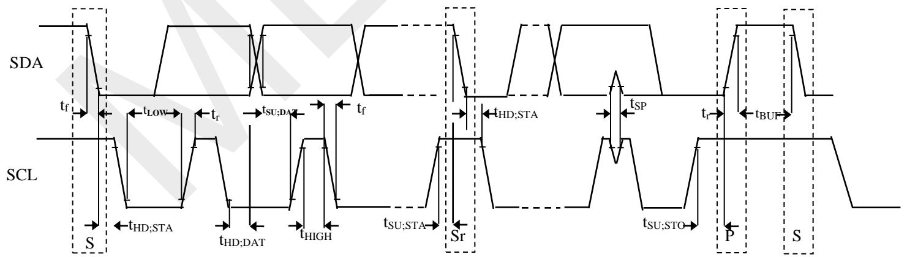

# memSic

# ±8 Gauss, High Performance 3-axis Magnetic Sensor

# FEATURES

 Fully integrated 3-axis magnetic sensor and electronic circuits requiring fewer external components

 Superior dynamic range and accuracy:

±8G FSR   
18bits operation   
0.4mG total RMS noise   
Enables heading accuracy of $\pm 0 . 5 0$

 Max output data rate of 1000Hz  Industrial standard low profile package 3.0mm x 3.0mm x 1.0mm

 Degaussing with built-in SET/RESET function √ Eliminates thermal variation induced offset error (Null field output) Clears the residual magnetization resulting from strong external fields

On-chip sensitivity compensation On-chip temperature sensor Data_Ready Interrupt Low power consumption $1 \mu \mathsf { A }$ power down current $\mathsf { I } ^ { 2 } \mathsf { C }$ Slave, FAST(≤400KHz) mode 3.0V single low power supply SPI interface available  RoHS compliant

# APPLICATIONS

 Electronic Compass & Navigation   
Position Sensing General Purpose Magnetic Field Measurements

# DESCRIPTION

The MMC5983MA is an AEC-Q100 qualified complete 3-axis magnetic sensor with on-chip signal processing and integrated I2C/SPI bus suitable for use in automotive applications. The device can be connected directly to a microprocessor, eliminating the need for A/D converters or timing resources.

# MMC5983MA

# FUNCTIONAL BLOCK DIAGRAM

It can measure magnetic fields within the full scale range of $\pm 8$ Gauss (G), with $0 . 2 5 \mathsf { m G } / 0 . 0 6 2 5 \mathsf { m G }$ per LSB resolution at 16bits/18bits operation mode and 0.4 mG total RMS noise level, enabling heading accuracy of $\pm 0 . 5 ^ { \circ }$ in electronic compass applications.

An integrated SET/RESET function provides for the elimination of error due to Null Field output change with temperature. Temperature information from the integrated temperature sensor is available over the I2C Interface. The SET/RESET function can be performed for each measurement, periodically, or when the temperature changes by a predetermined amount as the specific application requires.

In addition, the SET/RESET function clears the sensors of any residual magnetic polarization resulting from exposure to strong external magnets.

The MMC5983MA is packaged in a low profile LGA package and an operating temperature range from - $4 0 \%$ to $+ 1 0 5 ^ { \circ } \mathsf C$ .

The MMC5983MA provides an $\mathsf { I 2 C }$ digital output with $4 0 0 \mathsf { K H z }$ , fast mode operation, and a 10MHz SPI digital output.

SPECIFICATIONS (Measurements $@$ $\mathsf { 2 5 ^ { \circ } C }$ , unless otherwise noted; $V _ { \mathsf { D D } } { = } 3 . 0 \mathsf { V }$ unless otherwise specified)   

<table><tr><td rowspan=1 colspan=1> Parameter</td><td rowspan=1 colspan=1>Conditions</td><td rowspan=1 colspan=1>Min</td><td rowspan=1 colspan=1>Typ</td><td rowspan=1 colspan=1>Max</td><td rowspan=1 colspan=1>Units</td></tr><tr><td rowspan=1 colspan=1>Field Range (Each Axis)</td><td rowspan=1 colspan=1>Total applied field</td><td rowspan=1 colspan=1></td><td rowspan=1 colspan=1>±8</td><td rowspan=1 colspan=1></td><td rowspan=1 colspan=1>G</td></tr><tr><td rowspan=2 colspan=1>Supply Voltage</td><td rowspan=1 colspan=1>VDD</td><td rowspan=1 colspan=1>2.8</td><td rowspan=1 colspan=1>3.0</td><td rowspan=1 colspan=1>3.6</td><td rowspan=1 colspan=1>V</td></tr><tr><td rowspan=1 colspan=1>VDDIO(I²Cinterface and INT)</td><td rowspan=1 colspan=1>2.8</td><td rowspan=1 colspan=1>3.0</td><td rowspan=1 colspan=1>3.6</td><td rowspan=1 colspan=1>V</td></tr><tr><td rowspan=1 colspan=1>Supply Voltage Rise Time</td><td rowspan=1 colspan=1></td><td rowspan=1 colspan=1></td><td rowspan=1 colspan=1></td><td rowspan=1 colspan=1>5.0</td><td rowspan=1 colspan=1>ms</td></tr><tr><td rowspan=4 colspan=1>Supply Current1.2(7 measurements/second)</td><td rowspan=1 colspan=1>BW=00</td><td rowspan=1 colspan=1></td><td rowspan=1 colspan=1>450</td><td rowspan=1 colspan=1></td><td rowspan=1 colspan=1>HA</td></tr><tr><td rowspan=1 colspan=1>BW=01</td><td rowspan=1 colspan=1></td><td rowspan=1 colspan=1>225</td><td rowspan=1 colspan=1></td><td rowspan=1 colspan=1>A</td></tr><tr><td rowspan=1 colspan=1>BW=10</td><td rowspan=1 colspan=1></td><td rowspan=1 colspan=1>112.5</td><td rowspan=1 colspan=1></td><td rowspan=1 colspan=1>UA</td></tr><tr><td rowspan=1 colspan=1>BW=11</td><td rowspan=1 colspan=1></td><td rowspan=1 colspan=1>32</td><td rowspan=1 colspan=1></td><td rowspan=1 colspan=1>uA</td></tr><tr><td rowspan=1 colspan=1>Power Down Current2</td><td rowspan=1 colspan=1></td><td rowspan=1 colspan=1></td><td rowspan=1 colspan=1>1.0</td><td rowspan=1 colspan=1></td><td rowspan=1 colspan=1>μA</td></tr><tr><td rowspan=1 colspan=1>Operating Temperature</td><td rowspan=1 colspan=1></td><td rowspan=1 colspan=1>-40</td><td rowspan=1 colspan=1></td><td rowspan=1 colspan=1>105</td><td rowspan=1 colspan=1>℃</td></tr><tr><td rowspan=1 colspan=1>Storage Temperature</td><td rowspan=1 colspan=1></td><td rowspan=1 colspan=1>-55</td><td rowspan=1 colspan=1></td><td rowspan=1 colspan=1>125</td><td rowspan=1 colspan=1>℃</td></tr><tr><td rowspan=1 colspan=1>Linearity Error2(Best fit straight line)</td><td rowspan=1 colspan=1>FS=±8GHapplied=±4G</td><td rowspan=1 colspan=1></td><td rowspan=1 colspan=1>0.1</td><td rowspan=1 colspan=1></td><td rowspan=1 colspan=1>%FS</td></tr><tr><td rowspan=1 colspan=1>Hysteresis2</td><td rowspan=1 colspan=1>3 sweeps across ±8G</td><td rowspan=1 colspan=1></td><td rowspan=1 colspan=1>0.01</td><td rowspan=1 colspan=1></td><td rowspan=1 colspan=1>%FS</td></tr><tr><td rowspan=1 colspan=1>Repeatability Error²2</td><td rowspan=1 colspan=1>3 sweeps across ±8G</td><td rowspan=1 colspan=1></td><td rowspan=1 colspan=1>0.1</td><td rowspan=1 colspan=1></td><td rowspan=1 colspan=1>%FS</td></tr><tr><td rowspan=1 colspan=1>Alignment Error</td><td rowspan=1 colspan=1></td><td rowspan=1 colspan=1></td><td rowspan=1 colspan=1>±1.0</td><td rowspan=1 colspan=1>±3.0</td><td rowspan=1 colspan=1>Degrees</td></tr><tr><td rowspan=1 colspan=1>Transverse Sensitivity</td><td rowspan=1 colspan=1></td><td rowspan=1 colspan=1></td><td rowspan=1 colspan=1>±0.8</td><td rowspan=1 colspan=1></td><td rowspan=1 colspan=1>%</td></tr><tr><td rowspan=4 colspan=1>Total RMS Noise²</td><td rowspan=1 colspan=1>BW=00</td><td rowspan=1 colspan=1></td><td rowspan=1 colspan=1>0.4</td><td rowspan=1 colspan=1></td><td rowspan=1 colspan=1>mG</td></tr><tr><td rowspan=1 colspan=1>BW=01</td><td rowspan=1 colspan=1></td><td rowspan=1 colspan=1>0.6</td><td rowspan=1 colspan=1></td><td rowspan=1 colspan=1>mG</td></tr><tr><td rowspan=1 colspan=1>BW=10</td><td rowspan=1 colspan=1></td><td rowspan=1 colspan=1>0.8</td><td rowspan=1 colspan=1></td><td rowspan=1 colspan=1>mG</td></tr><tr><td rowspan=1 colspan=1>BW=11</td><td rowspan=1 colspan=1></td><td rowspan=1 colspan=1>1.2</td><td rowspan=1 colspan=1></td><td rowspan=1 colspan=1>mG</td></tr><tr><td rowspan=1 colspan=1>Output Resolution</td><td rowspan=1 colspan=1></td><td rowspan=1 colspan=1></td><td rowspan=1 colspan=1>18</td><td rowspan=1 colspan=1></td><td rowspan=1 colspan=1>Bits</td></tr><tr><td rowspan=5 colspan=1>Max Output data rate²</td><td rowspan=1 colspan=1>BW=00</td><td rowspan=1 colspan=1></td><td rowspan=1 colspan=1>50</td><td rowspan=1 colspan=1></td><td rowspan=1 colspan=1>Hz</td></tr><tr><td rowspan=1 colspan=1>BW=01</td><td rowspan=1 colspan=1></td><td rowspan=1 colspan=1>100</td><td rowspan=1 colspan=1></td><td rowspan=1 colspan=1>Hz</td></tr><tr><td rowspan=1 colspan=1>BW=10</td><td rowspan=1 colspan=1></td><td rowspan=1 colspan=1>225</td><td rowspan=1 colspan=1></td><td rowspan=1 colspan=1>Hz</td></tr><tr><td rowspan=1 colspan=1>BW=11</td><td rowspan=1 colspan=1></td><td rowspan=1 colspan=1>580</td><td rowspan=1 colspan=1></td><td rowspan=1 colspan=1>Hz</td></tr><tr><td rowspan=1 colspan=1>BW=11(CM_Freq=111)</td><td rowspan=1 colspan=1></td><td rowspan=1 colspan=1>1000</td><td rowspan=1 colspan=1></td><td rowspan=1 colspan=1>Hz</td></tr><tr><td rowspan=1 colspan=1>Heading Accuracy3</td><td rowspan=1 colspan=1></td><td rowspan=1 colspan=1></td><td rowspan=1 colspan=1>±1.0</td><td rowspan=1 colspan=1></td><td rowspan=1 colspan=1>Degrees</td></tr><tr><td rowspan=3 colspan=1>Sensitivity Accuracy4,5</td><td rowspan=1 colspan=1>±8G</td><td rowspan=1 colspan=1></td><td rowspan=1 colspan=1>±5</td><td rowspan=1 colspan=1></td><td rowspan=1 colspan=1>%</td></tr><tr><td rowspan=1 colspan=1>With16bits operation</td><td rowspan=1 colspan=1></td><td rowspan=1 colspan=1>4096</td><td rowspan=1 colspan=1></td><td rowspan=1 colspan=1>Counts/G</td></tr><tr><td rowspan=1 colspan=1>With18bits operation</td><td rowspan=1 colspan=1></td><td rowspan=1 colspan=1>16384</td><td rowspan=1 colspan=1></td><td rowspan=1 colspan=1>Counts/G</td></tr><tr><td rowspan=1 colspan=1>Sensitivity Change OverTemperature</td><td rowspan=1 colspan=1>-40~105℃Delta from 25 C,±8 G</td><td rowspan=1 colspan=1></td><td rowspan=1 colspan=1>±5</td><td rowspan=1 colspan=1></td><td rowspan=1 colspan=1>%</td></tr><tr><td rowspan=3 colspan=1>Null Field Output5</td><td rowspan=1 colspan=1></td><td rowspan=1 colspan=1></td><td rowspan=1 colspan=1>±0.5</td><td rowspan=1 colspan=1></td><td rowspan=1 colspan=1>G</td></tr><tr><td rowspan=1 colspan=1>With16bits operation</td><td rowspan=1 colspan=1></td><td rowspan=1 colspan=1>32768</td><td rowspan=1 colspan=1></td><td rowspan=1 colspan=1>Counts</td></tr><tr><td rowspan=1 colspan=1>With18bits operation</td><td rowspan=1 colspan=1></td><td rowspan=1 colspan=1>131072</td><td rowspan=1 colspan=1></td><td rowspan=1 colspan=1>Counts</td></tr><tr><td rowspan=1 colspan=1>Null Field Output Change OverTemperature using SET/RESET</td><td rowspan=1 colspan=1>-40~105℃Delta from 25℃</td><td rowspan=1 colspan=1></td><td rowspan=1 colspan=1>±3</td><td rowspan=1 colspan=1></td><td rowspan=1 colspan=1>mG</td></tr><tr><td rowspan=1 colspan=1>Temperature Sensor Output</td><td rowspan=1 colspan=1></td><td rowspan=1 colspan=1></td><td rowspan=1 colspan=1>0.8</td><td rowspan=1 colspan=1></td><td rowspan=1 colspan=1>C/Count</td></tr><tr><td rowspan=1 colspan=1>Disturbing Field6</td><td rowspan=1 colspan=1></td><td rowspan=1 colspan=1></td><td rowspan=1 colspan=1>10</td><td rowspan=1 colspan=1></td><td rowspan=1 colspan=1>G</td></tr><tr><td rowspan=1 colspan=1>Maximum Exposed Field</td><td rowspan=1 colspan=1></td><td rowspan=1 colspan=1></td><td rowspan=1 colspan=1></td><td rowspan=1 colspan=1>10,000</td><td rowspan=1 colspan=1>G</td></tr><tr><td rowspan=1 colspan=1>SET/RESET Repeatabiity</td><td rowspan=1 colspan=1></td><td rowspan=1 colspan=1></td><td rowspan=1 colspan=1>±1</td><td rowspan=1 colspan=1></td><td rowspan=1 colspan=1>mG</td></tr></table>

1. Supply current is proportional to how many measurements performed per second. Based on 3lots characterization result. MEMSIC product enables users to utilize heading accuracy to be 1.0 degree typical when using MEMSIC’s proprietary software or algorithm. Sensitivity of the orthogonal axes is analytically derived from raw data and is subsequently processed by MEMSIC software drivers. Based on shipment test result. This is the magnitude of external field that can be tolerated without changing the sensor characteristics. If the disturbing field is exceeded, a SET/RE operation is required to restore proper sensor operation.

DIGITAL INTERFACE $( \mathsf { V } \mathsf { I } \mathsf { O } { = } 3 . \mathsf { 0 } \mathsf { V } )$   

<table><tr><td rowspan=1 colspan=1>Symbol</td><td rowspan=1 colspan=1>Parameter (Units)</td><td rowspan=1 colspan=1>Minimum</td><td rowspan=1 colspan=1>Typical</td><td rowspan=1 colspan=1>Maximum</td></tr><tr><td rowspan=1 colspan=1>VIH</td><td rowspan=1 colspan=1>High Level Input Voltage (Volts)</td><td rowspan=1 colspan=1>0.7*VIO</td><td rowspan=1 colspan=1></td><td rowspan=1 colspan=1></td></tr><tr><td rowspan=1 colspan=1>VIL</td><td rowspan=1 colspan=1>Low Level Input Voltage (Volts)</td><td rowspan=1 colspan=1></td><td rowspan=1 colspan=1></td><td rowspan=1 colspan=1>0.3*VIO</td></tr><tr><td rowspan=1 colspan=1>VHYS</td><td rowspan=1 colspan=1>Hysteresis of Schmitt Trigger Input (Volts)</td><td rowspan=1 colspan=1>0.2</td><td rowspan=1 colspan=1></td><td rowspan=1 colspan=1></td></tr><tr><td rowspan=1 colspan=1>I</td><td rowspan=1 colspan=1>Input Leakage, Al Inputs (uA)</td><td rowspan=1 colspan=1>-10</td><td rowspan=1 colspan=1></td><td rowspan=1 colspan=1>10</td></tr><tr><td rowspan=1 colspan=1>VOH</td><td rowspan=1 colspan=1>High Level Output Voltage (Volts)</td><td rowspan=1 colspan=1>0.8*VIO</td><td rowspan=1 colspan=1></td><td rowspan=1 colspan=1></td></tr><tr><td rowspan=1 colspan=1>VoL</td><td rowspan=1 colspan=1>Low Level Output Voltage (Volts)</td><td rowspan=1 colspan=1></td><td rowspan=1 colspan=1></td><td rowspan=1 colspan=1>0.2*VIO</td></tr></table>

# I2C INTERFACE I/O CHARACTERISTICS $\left( \mathsf { V } \mathsf { I } \mathsf { O } { = } 3 . \mathsf { 0 } \mathsf { V } \right)$

<table><tr><td rowspan=1 colspan=1>Parameter</td><td rowspan=1 colspan=1> Symbol</td><td rowspan=1 colspan=1>Test Condition</td><td rowspan=1 colspan=1>Min.</td><td rowspan=1 colspan=1>Typ.</td><td rowspan=1 colspan=1>Max.</td><td rowspan=1 colspan=1>Unit</td></tr><tr><td rowspan=1 colspan=1>Logic Input Low Level</td><td rowspan=1 colspan=1>ViL</td><td rowspan=1 colspan=1></td><td rowspan=1 colspan=1>-0.5</td><td rowspan=1 colspan=1></td><td rowspan=1 colspan=1>0.3*Vio</td><td rowspan=1 colspan=1>V</td></tr><tr><td rowspan=1 colspan=1>Logic Input High Level</td><td rowspan=1 colspan=1>VIH</td><td rowspan=1 colspan=1></td><td rowspan=1 colspan=1>0.7*Vio</td><td rowspan=1 colspan=1></td><td rowspan=1 colspan=1>Vio</td><td rowspan=1 colspan=1>V</td></tr><tr><td rowspan=1 colspan=1>Hysteresis of Schmit Input</td><td rowspan=1 colspan=1>Vhys</td><td rowspan=1 colspan=1></td><td rowspan=1 colspan=1>0.2</td><td rowspan=1 colspan=1></td><td rowspan=1 colspan=1></td><td rowspan=1 colspan=1>v</td></tr><tr><td rowspan=1 colspan=1>Logic Output Low Level</td><td rowspan=1 colspan=1>VoL</td><td rowspan=1 colspan=1></td><td rowspan=1 colspan=1></td><td rowspan=1 colspan=1></td><td rowspan=1 colspan=1>0.6</td><td rowspan=1 colspan=1>V</td></tr><tr><td rowspan=1 colspan=1>Input Leakage Current</td><td rowspan=1 colspan=1>1</td><td rowspan=1 colspan=1>0.1Vio&lt;Vin&lt;0.9VI0</td><td rowspan=1 colspan=1>-10</td><td rowspan=1 colspan=1></td><td rowspan=1 colspan=1>10</td><td rowspan=1 colspan=1>HA</td></tr><tr><td rowspan=1 colspan=1>SCL Clock Frequency</td><td rowspan=1 colspan=1>fscL</td><td rowspan=1 colspan=1></td><td rowspan=1 colspan=1>0</td><td rowspan=1 colspan=1></td><td rowspan=1 colspan=1>400</td><td rowspan=1 colspan=1>kHz</td></tr><tr><td rowspan=1 colspan=1>START Hold Time</td><td rowspan=1 colspan=1>tHD:STA</td><td rowspan=1 colspan=1></td><td rowspan=1 colspan=1>0.6</td><td rowspan=1 colspan=1>?</td><td rowspan=1 colspan=1></td><td rowspan=1 colspan=1>uS</td></tr><tr><td rowspan=1 colspan=1>START Setup Time</td><td rowspan=1 colspan=1>tSU:STA</td><td rowspan=1 colspan=1></td><td rowspan=1 colspan=1>0.6</td><td rowspan=1 colspan=1></td><td rowspan=1 colspan=1></td><td rowspan=1 colspan=1>uS</td></tr><tr><td rowspan=1 colspan=1>LOW period of SCL</td><td rowspan=1 colspan=1>tLow</td><td rowspan=1 colspan=1></td><td rowspan=1 colspan=1>1.3</td><td rowspan=1 colspan=1></td><td rowspan=1 colspan=1></td><td rowspan=1 colspan=1>uS</td></tr><tr><td rowspan=1 colspan=1>HIGH period of SCL</td><td rowspan=1 colspan=1>tHIGH</td><td rowspan=1 colspan=1></td><td rowspan=1 colspan=1>0.6</td><td rowspan=1 colspan=1></td><td rowspan=1 colspan=1></td><td rowspan=1 colspan=1>us</td></tr><tr><td rowspan=1 colspan=1>Data Hold Time</td><td rowspan=1 colspan=1>tHD;DAT</td><td rowspan=1 colspan=1></td><td rowspan=1 colspan=1>。</td><td rowspan=1 colspan=1></td><td rowspan=1 colspan=1>0.9</td><td rowspan=1 colspan=1>uS</td></tr><tr><td rowspan=1 colspan=1>Data Setup Time</td><td rowspan=1 colspan=1>tsU:DAT</td><td rowspan=1 colspan=1></td><td rowspan=1 colspan=1>0.1</td><td rowspan=1 colspan=1></td><td rowspan=1 colspan=1></td><td rowspan=1 colspan=1>uS</td></tr><tr><td rowspan=1 colspan=1>Rise Time</td><td rowspan=1 colspan=1>t</td><td rowspan=1 colspan=1>From ViL toViH</td><td rowspan=1 colspan=1></td><td rowspan=1 colspan=1></td><td rowspan=1 colspan=1>0.3</td><td rowspan=1 colspan=1>uS</td></tr><tr><td rowspan=1 colspan=1>Fall Time</td><td rowspan=1 colspan=1>t</td><td rowspan=1 colspan=1>From VIH toVIL</td><td rowspan=1 colspan=1></td><td rowspan=1 colspan=1></td><td rowspan=1 colspan=1>0.3</td><td rowspan=1 colspan=1>uS</td></tr><tr><td rowspan=1 colspan=1>Bus Free Time Between STOP andSTART</td><td rowspan=1 colspan=1>tBUF</td><td rowspan=1 colspan=1></td><td rowspan=1 colspan=1>1.3</td><td rowspan=1 colspan=1></td><td rowspan=1 colspan=1></td><td rowspan=1 colspan=1>uS</td></tr><tr><td rowspan=1 colspan=1> STOP Setup Time</td><td rowspan=1 colspan=1>tsU;STO</td><td rowspan=1 colspan=1></td><td rowspan=1 colspan=1>0.6</td><td rowspan=1 colspan=1></td><td rowspan=1 colspan=1></td><td rowspan=1 colspan=1>us</td></tr></table>

# SPI INTERFACE I/O CHARACTERISTICS $( \mathsf { V } \mathsf { I } \mathsf { O } { = } 3 . \mathsf { 0 } \mathsf { V } )$

<table><tr><td rowspan=2 colspan=1>Parameter</td><td rowspan=2 colspan=1> Symbol</td><td rowspan=1 colspan=3>Value 1</td><td rowspan=1 colspan=1>Unit</td></tr><tr><td rowspan=1 colspan=1>Min.</td><td rowspan=1 colspan=1>Typ.</td><td rowspan=1 colspan=1>Max.</td><td rowspan=1 colspan=1></td></tr><tr><td rowspan=1 colspan=1>SPI clock cycle</td><td rowspan=1 colspan=1>tc(SCK)</td><td rowspan=1 colspan=1>100</td><td rowspan=1 colspan=1></td><td rowspan=1 colspan=1></td><td rowspan=1 colspan=1>ns</td></tr><tr><td rowspan=1 colspan=1>SPI clock frequency</td><td rowspan=1 colspan=1>fc(SCK)</td><td rowspan=1 colspan=1></td><td rowspan=1 colspan=1></td><td rowspan=1 colspan=1>10</td><td rowspan=1 colspan=1>MHz</td></tr><tr><td rowspan=1 colspan=1>CS setup time</td><td rowspan=1 colspan=1>tsu(CS)</td><td rowspan=1 colspan=1>6</td><td rowspan=1 colspan=1></td><td rowspan=1 colspan=1></td><td rowspan=7 colspan=1>ns</td></tr><tr><td rowspan=1 colspan=1>CS hold time</td><td rowspan=1 colspan=1>th(Cs)</td><td rowspan=1 colspan=1>8</td><td rowspan=1 colspan=1></td><td rowspan=1 colspan=1></td></tr><tr><td rowspan=1 colspan=1>SDl input setup time</td><td rowspan=1 colspan=1>tsu(SI)</td><td rowspan=1 colspan=1>5</td><td rowspan=1 colspan=1></td><td rowspan=1 colspan=1></td></tr><tr><td rowspan=1 colspan=1> SDl input hold time</td><td rowspan=1 colspan=1>th(SI)</td><td rowspan=1 colspan=1>15</td><td rowspan=1 colspan=1></td><td rowspan=1 colspan=1></td></tr><tr><td rowspan=1 colspan=1>SDO valid output time</td><td rowspan=1 colspan=1>tv(So)</td><td rowspan=1 colspan=1></td><td rowspan=1 colspan=1></td><td rowspan=1 colspan=1>50</td></tr><tr><td rowspan=1 colspan=1>SDO output hold time</td><td rowspan=1 colspan=1>th(SO)</td><td rowspan=1 colspan=1>9</td><td rowspan=1 colspan=1></td><td rowspan=1 colspan=1></td></tr><tr><td rowspan=1 colspan=1>SDO output disable time</td><td rowspan=1 colspan=1>tdis(SO)</td><td rowspan=1 colspan=1></td><td rowspan=1 colspan=1></td><td rowspan=1 colspan=1>50</td></tr></table>

1. Values are guaranteed at 10 MHz clock frequency for SPI, based on characterization results, not tested in production.

  
Timing Definition

CS (SPI_CS) is the serial port enable and it is controlled by the SPI master. It goes low at the start of the transmission and goes back high at the end.

SCK (SPI_SCK) is the serial port clock and it is controlled by the SPI master. It is stopped high when CS is high (no transmission).

SDI (SPI_SDI) and SDO (SPI_SDO) are respectively the serial port data input and output. Those lines are driven a the falling edge of SCK and should be captured at the rising edge of SCK.

Both the Read Register and Write Register commands are completed in 16 clocks pulses or in multiple of 8 in case of multiple byte read/write. Bit duration is the time between two falling edges of SCK. The first bit (bit 0) starts at the first falling edge of SCK after the falling edge of CS while the last bit (bit 15, bit 23, ...) starts at the last falling edge of SCK (SPI_CS) just before the rising edge of CS.

bit 0: RW bit. When 0, the data DI(7:0) is written into the device. When 1, the data DO(7:0) from the device is read.   
In latter case, the chip will drive SDO at the start of bit 8.

bit 1: Don’t care.

bit 2-7: Address AD(5:0). This is the address field of the indexed register.

bit 8-15: Data DI(7:0) (write mode). This is the data that will be written into the device (MSB first) (MSB first). bit 8- 15: data DO(7:0) (read mode). This is the data that will be read from the device (MSB first).

In multiple read/write commands further blocks of 8 clock periods will be added.

  
SPI Read Protocol

The SPI Read command is performed with 16 clocks pulses. Multiple byte read command is performed adding blocks of 8 clocks pulses at the previous one.

bit 0: READ bit. The value is 1.

bit 1: don’t care.   
bit 2-7: address AD(5:0). This is the address field of the indexed register.   
bit 8-15: data DO(7:0) (read mode). This is the data that will be read from the device (MSB first).   
bit 16-... : data DO(...-8). Further data in multiple byte reading.

Multiple Bytes SPl Read Protocol (2 bytes example)

The SPI Write command is performed with 16 clocks pulses. Multiple byte write command is performed adding blocks of 8 clocks pulses at the previous one.

bit 0: WRITE bit. The value is 0.   
bit 1: don’t care bit 2 -7: address AD(5:0). This is the address field of the indexed register.   
bit 8-15: data DI(7:0) (write mode). This is the data that will be written inside the device (MSB first).   
bit 16-... : data DI(...-8). Further data in multiple byte writing.

The part can be configured as 3-wires SPI read mode, by write “1” to Internal Control Register 3 (0CH), bit 6 before reading command.

The SPI Read command is performed with 16 clocks pulses:

bit 0: READ bit. The value is 1.

bit 1: don’t care.

bit 2-7: address AD(5:0). This is the address field of the indexed register.

bit 8-15: data DO(7:0) (read mode). This is the data that will be read from the device (MSB first). Multiple write command is also available in 3-wires mode.

# ABSOLUTE MAXIMUM RATINGS\*

Supply Voltage $- 0 . 5$ to $+ 3 . 6 \lor$ Storage Temperature $\mathtt { - 5 5 ^ { \circ } C }$ to $+ 1 2 5 \mathrm { ^ \circ C }$ Maximum Exposed Field $1 0 0 0 0 \mathsf { G }$

\*Note: Stresses above those listed under Absolute Maximum Ratings may cause permanent damage to the device. This is a stress rating only; the functional operation of the device at these or any other conditions above those indicated in the operational sections of this specification is not implied. Exposure to absolute maximum rating conditions for extended periods may affect the device’s reliability.

# Pin Description: LGA Package

<table><tr><td rowspan=1 colspan=1>Pin</td><td rowspan=1 colspan=1>Name</td><td rowspan=1 colspan=1>Description</td><td rowspan=1 colspan=1>/0</td></tr><tr><td rowspan=1 colspan=1>1</td><td rowspan=1 colspan=1>SCL/SPI_SCK</td><td rowspan=1 colspan=1>Serial Clock Line forI2C/SPIbus</td><td rowspan=1 colspan=1>1</td></tr><tr><td rowspan=1 colspan=1>2</td><td rowspan=1 colspan=1>VDD</td><td rowspan=1 colspan=1>Power Supply</td><td rowspan=1 colspan=1>P</td></tr><tr><td rowspan=1 colspan=1>3</td><td rowspan=1 colspan=1>NC</td><td rowspan=1 colspan=1>Not Connected</td><td rowspan=1 colspan=1>NC</td></tr><tr><td rowspan=1 colspan=1>4</td><td rowspan=1 colspan=1>SPI_CS</td><td rowspan=1 colspan=1>Chip Select line forSPI (active low). Tie to VDDIO for I2CInterface</td><td rowspan=1 colspan=1>1</td></tr><tr><td rowspan=1 colspan=1>5</td><td rowspan=1 colspan=1>SPI_SDO</td><td rowspan=1 colspan=1> SPI Serial Data Out</td><td rowspan=1 colspan=1>0</td></tr><tr><td rowspan=1 colspan=1>6</td><td rowspan=1 colspan=1>NC</td><td rowspan=1 colspan=1>Not Connected</td><td rowspan=1 colspan=1>NC</td></tr><tr><td rowspan=1 colspan=1>7</td><td rowspan=1 colspan=1>NC</td><td rowspan=1 colspan=1>Not Connected</td><td rowspan=1 colspan=1>NC</td></tr><tr><td rowspan=1 colspan=1>8</td><td rowspan=1 colspan=1>NC</td><td rowspan=1 colspan=1>Not ConnectedA</td><td rowspan=1 colspan=1>NC</td></tr><tr><td rowspan=1 colspan=1>9</td><td rowspan=1 colspan=1>GND</td><td rowspan=1 colspan=1>Connect to Ground</td><td rowspan=1 colspan=1>P</td></tr><tr><td rowspan=1 colspan=1>10</td><td rowspan=1 colspan=1>CAP</td><td rowspan=1 colspan=1>Connect a 10uF capacitor forSET/RESET</td><td rowspan=1 colspan=1>P</td></tr><tr><td rowspan=1 colspan=1>11</td><td rowspan=1 colspan=1>GND</td><td rowspan=1 colspan=1>Connect to Ground</td><td rowspan=1 colspan=1>P</td></tr><tr><td rowspan=1 colspan=1>12</td><td rowspan=1 colspan=1>NC</td><td rowspan=1 colspan=1> Not Connected</td><td rowspan=1 colspan=1>NC</td></tr><tr><td rowspan=1 colspan=1>13</td><td rowspan=1 colspan=1>VDDIO</td><td rowspan=1 colspan=1>Power supply for I2Cand INT</td><td rowspan=1 colspan=1>P</td></tr><tr><td rowspan=1 colspan=1>14</td><td rowspan=1 colspan=1>NC</td><td rowspan=1 colspan=1> Not Connected</td><td rowspan=1 colspan=1>NC</td></tr><tr><td rowspan=1 colspan=1>15</td><td rowspan=1 colspan=1>INT</td><td rowspan=1 colspan=1> Interrupt Output</td><td rowspan=1 colspan=1>0</td></tr><tr><td rowspan=1 colspan=1>16</td><td rowspan=1 colspan=1>SDA/SPI_SDI</td><td rowspan=1 colspan=1>Serial Data Line forI2C/SPI bus</td><td rowspan=1 colspan=1>/0</td></tr></table>

All parts are shipped in tape and reel packaging with 5000pcs per $1 3 "$ reel.

# Caution:

This is an Electro-Static Discharge (ESD) sensitive device.

# Ordering Guide:

# Marking illustration:

Note: Coordinates shown above indicate polarity after a SET operation.

The black dot on top-right marks the location of pin one (1). The $1 ^ { \mathsf { s t } }$ line represents the device’s Name. The 2nd line represents the device’s Lot Number.

# THEORY OF OPERATION

The Anisotropic Magneto-Resistive (AMR) sensors are special resistors made of permalloy thin film deposited on a silicon wafer. During manufacturing, a strong magnetic field is applied to the film to orient its magnetic domains in the same direction, establishing a magnetization vector. Subsequently, an external magnetic field applied perpendicularly to the sides of the film causes the magnetization to rotate and change angle. This effect causes the film’s resistance to vary with the intensity of the applied magnetic field. The MEMSIC AMR sensor is incorporated into a Wheatstone bridge configuration to maximize Signal to Noise ratio. A change in magnetic field produces a proportional change in differential voltage across the Wheatstone bridge.

However, the influence of a strong magnetic field (more than $ 1 0 \ \mathsf { G } )$ in any direction could upset, or flip, the polarity of the film, thus changing the sensor characteristics. A strong restoring magnetic field must be applied momentarily to restore, or set, the sensor characteristics. The MEMSIC magnetic sensor has an on-chip magnetically coupled strap: a SET/RESET strap pulsed with a high current, to provide the restoring magnetic field

# EXTERNAL CIRCUITRY CONNECTION

The MMC5983MA was designed for flexible power connections to support existing and new designs. It can operate from a single $2 . 8 \lor$ to $3 . 6 \mathsf { V }$ supply or from dual supplies using a $2 . 8 \lor$ to 3.6V VDD supply and a $2 . 8 \lor$ to $3 . 6 \mathsf { V }$ VDDIO supply. The circuit connection diagrams below illustrate power supply connection options.

<Top View> SPI Single Supply Connection

# PIN DESCRIPTIONS

CAP– This is the supply input for SET/RESET coil. MEMSIC recommends a minimum 10 uF low ESR capacitor placed in close proximity to the CAP pin.

GND– This is the ground pin for the magnetic sensor.

SDA/SPI_SDI – This pin is the $1 ^ { 2 } { \mathsf { C } } / { \mathsf { S } } { \mathsf { P } } |$ serial data line, and operates in $\mathsf { I } ^ { 2 } \mathsf { C }$ FAST (400 KHz)/SPI mode.

SCL/SPI_SCK– This pin is the I2C/SPI serial clock line, and operates in FAST (400 KHz)/SPI mode.

SPI_CS – This pin is chip select line for SPI (active low). Tie to VDDIO for I²C Interface.

SPI_SDO – This pin the SPI serial data out line.

VDD–This pin is the power supply of the ASIC.

VDDIO–This pin is the power supply of the digital interface of the ASIC.

INT– This pin is Interrupt output. Active High. It is held as hi-Z until an interrupt function is enabled.

Note: VDD and CAP pins are shorted together inside the device.

# HARDWARE DESIGN CONSIDERATIONS

Provide adequate separation distance to devices that contain permanent magnets or generate magnetic fields (e.g. speakers, coils, inductors) The combined magnetic field to be measured and interference magnetic field should be less than the full scale range of the MMC5983MA. Provide adequate separation distance to current carrying traces. Do not route current carrying traces under the sensor or on the other side of the PCB opposite to the device. / Do not cover the sensor with magnetized material or materials that may become magnetized, (e.g., shield box, LCD, battery, iron bearing materials). / Do not place the device opposite to magnetized materials or materials that may become magnetized located on the other side of the PCB.

Please refer to MEMSIC magnetic sensor layout guideline.

# POWER CONSUMPTION

The power consumed by the device is proportional to the number of measurements taken per second. For example, when $8 \mathsf { W } < 1 : 0 > = 0 0$ , which is 16-bit mode with 10ms per measurement, MMC5983MA consumes $4 5 0 ~ \mu \mathsf { A }$ (typical) at $3 . 0 ~ \mathsf { V }$ with 7 measurements per second. If only 2 measurements are performed per second, the current will be $4 5 0 \div 2 / 7 = 1 2 8 \mu \mathrm { A }$ .

# $\mathsf { I } ^ { 2 } \mathsf { C }$ INTERFACE DESCRIPTION

A slave mode $\mathsf { I 2 C }$ circuit has been implemented into the MEMSIC magnetic sensor as a standard interface for customer applications. The A/D converter functionality has been added to the MEMSIC sensor, thereby increasing ease-of-use, and lowering power consumption, footprint and total solution cost.

The I2C (or Inter IC bus) is an industry standard bidirectional two-wire interface bus. A master $\mathsf { I 2 C }$ device can operate READ/WRITE and control up to 128 devices by device addressing. The MEMSIC magnetic sensor operates only in a slave mode, i.e. only responding to calls by a Master device to its address.

# I2C BUS CHARACTERISTICS

The two wires in the $\mathsf { I } ^ { 2 } \mathsf { C }$ bus are called SDA (serial data line) and SCL (serial clock line). In order for a data transfer to start, the bus has to be free, which is defined by both wires in a HIGH output state. Due to the opendrain / pull-up resistor structure and wired Boolean “AND” operation, any device on the bus can pull lines low and overwrite a HIGH signal. The data on the SDA line has to be stable during the HIGH period of the SCL line. In other words, valid data can only change when the SCL line is LOW.

Note: Rp selection guide: 2.7K ohm for an $\mathsf { I 2 C }$ bus less than 10 cm length, and 10K ohm for a bus length less than 5 cm.

# REGISTER MAP

<table><tr><td rowspan=1 colspan=1>Register Name</td><td rowspan=1 colspan=1>Address</td><td rowspan=1 colspan=1>Description</td></tr><tr><td rowspan=1 colspan=1>Xout0</td><td rowspan=1 colspan=1>00H</td><td rowspan=1 colspan=1>Xout[17:10]</td></tr><tr><td rowspan=1 colspan=1>Xout1</td><td rowspan=1 colspan=1>01H</td><td rowspan=1 colspan=1>Xout [9:2]</td></tr><tr><td rowspan=1 colspan=1>Yout0</td><td rowspan=1 colspan=1>02H</td><td rowspan=1 colspan=1>Yout[17:10]</td></tr><tr><td rowspan=1 colspan=1>Yout1</td><td rowspan=1 colspan=1>03H</td><td rowspan=1 colspan=1>Yout [9:2]</td></tr><tr><td rowspan=1 colspan=1>Zout0</td><td rowspan=1 colspan=1>04H</td><td rowspan=1 colspan=1>Zout[17:10]</td></tr><tr><td rowspan=1 colspan=1>Zout1</td><td rowspan=1 colspan=1>05H</td><td rowspan=1 colspan=1>Zout [9:2]</td></tr><tr><td rowspan=1 colspan=1>XYZout2</td><td rowspan=1 colspan=1>06H</td><td rowspan=1 colspan=1>Xout[1:0], Yout[1:0], Zout[1:0]</td></tr><tr><td rowspan=1 colspan=1>Tout</td><td rowspan=1 colspan=1>07H</td><td rowspan=1 colspan=1>Temperature output</td></tr><tr><td rowspan=1 colspan=1>Status</td><td rowspan=1 colspan=1>08H</td><td rowspan=1 colspan=1>Device status</td></tr><tr><td rowspan=1 colspan=1>Internal control 0</td><td rowspan=1 colspan=1>09H</td><td rowspan=1 colspan=1>Control register 0</td></tr><tr><td rowspan=1 colspan=1>Internal control 1</td><td rowspan=1 colspan=1>OAH</td><td rowspan=1 colspan=1>Control register1</td></tr><tr><td rowspan=1 colspan=1>Internal control 2</td><td rowspan=1 colspan=1>0BH</td><td rowspan=1 colspan=1>Control register 2</td></tr><tr><td rowspan=1 colspan=1>Internal control 3</td><td rowspan=1 colspan=1>0CH</td><td rowspan=1 colspan=1>Control register3</td></tr><tr><td rowspan=1 colspan=1>Product ID1</td><td rowspan=1 colspan=1>2FH</td><td rowspan=1 colspan=1>Product ID</td></tr></table>

# Register Details

Xout0, Xout1, XYZout2

<table><tr><td rowspan=1 colspan=1>Xout0</td><td rowspan=1 colspan=1>7</td><td rowspan=1 colspan=1>6</td><td rowspan=1 colspan=1>5</td><td rowspan=1 colspan=1>4</td><td rowspan=1 colspan=1>3</td><td rowspan=1 colspan=1>2</td><td rowspan=1 colspan=1>1</td><td rowspan=1 colspan=1>0</td></tr><tr><td rowspan=1 colspan=1>Addr:00H</td><td rowspan=1 colspan=8>Xout[17:10]</td></tr><tr><td rowspan=1 colspan=1>Mode</td><td rowspan=1 colspan=8>R</td></tr></table>

<table><tr><td rowspan=1 colspan=1>Xout1</td><td rowspan=1 colspan=1>7</td><td rowspan=1 colspan=1>6</td><td rowspan=1 colspan=1>5</td><td rowspan=1 colspan=1>4</td><td rowspan=1 colspan=1>3</td><td rowspan=1 colspan=1>2</td><td rowspan=1 colspan=1>1</td><td rowspan=1 colspan=1>0</td></tr><tr><td rowspan=1 colspan=1>Addr:01H</td><td rowspan=1 colspan=8>Xout[9:2]</td></tr><tr><td rowspan=1 colspan=1>Mode</td><td rowspan=1 colspan=8>R</td></tr></table>

<table><tr><td rowspan=1 colspan=1>XYZout2</td><td rowspan=1 colspan=1>7</td><td rowspan=1 colspan=1>6</td><td rowspan=1 colspan=1>5</td><td rowspan=1 colspan=1>4</td><td rowspan=1 colspan=1>3</td><td rowspan=1 colspan=1>2</td><td rowspan=1 colspan=1>1</td><td rowspan=1 colspan=1>0</td></tr><tr><td rowspan=1 colspan=1>Addr:06H</td><td rowspan=1 colspan=2>Xout[1:0]</td><td rowspan=1 colspan=2>Yout[1:0]</td><td rowspan=1 colspan=2>Zout[1:0]</td><td rowspan=1 colspan=1>0</td><td rowspan=1 colspan=1>0</td></tr><tr><td rowspan=1 colspan=1>Mode</td><td rowspan=1 colspan=8>R</td></tr></table>

X-axis output, unsigned format.

<table><tr><td rowspan=1 colspan=1>X-axis output</td><td rowspan=1 colspan=1>Data</td></tr><tr><td rowspan=1 colspan=1>16bits operation mode</td><td rowspan=1 colspan=1>Xout[17:2]</td></tr><tr><td rowspan=1 colspan=1>18bits operation mode</td><td rowspan=1 colspan=1>Xout[17:0]</td></tr></table>

Yout0, Yout1, XYZout2   

<table><tr><td rowspan=1 colspan=1>Yout0</td><td rowspan=1 colspan=1>7</td><td rowspan=1 colspan=1>6</td><td rowspan=1 colspan=1>5</td><td rowspan=1 colspan=1>4</td><td rowspan=1 colspan=1>3</td><td rowspan=1 colspan=1>2</td><td rowspan=1 colspan=1>1</td><td rowspan=1 colspan=1>0</td></tr><tr><td rowspan=1 colspan=1>Addr:02H</td><td></td><td></td><td></td><td></td><td></td><td></td><td></td><td></td></tr><tr><td rowspan=1 colspan=1>Mode</td><td></td><td></td><td></td><td></td><td></td><td></td><td></td><td></td></tr></table>

<table><tr><td rowspan=1 colspan=1>Yout1</td><td rowspan=1 colspan=1>7</td><td rowspan=1 colspan=1>6</td><td rowspan=1 colspan=1>5</td><td rowspan=1 colspan=1>4</td><td rowspan=1 colspan=1>3</td><td rowspan=1 colspan=1>2</td><td rowspan=1 colspan=1>1</td><td rowspan=1 colspan=1>0</td></tr><tr><td rowspan=1 colspan=1>Addr:03H</td><td rowspan=1 colspan=8>Yout[9:2]</td></tr><tr><td rowspan=1 colspan=1>Mode</td><td rowspan=1 colspan=8>R</td></tr></table>

<table><tr><td rowspan=1 colspan=1>XYZout2</td><td rowspan=1 colspan=1>7</td><td rowspan=1 colspan=1>6</td><td rowspan=1 colspan=1>5</td><td rowspan=1 colspan=1>4</td><td rowspan=1 colspan=1>3</td><td rowspan=1 colspan=1>2</td><td rowspan=1 colspan=1>1</td><td rowspan=1 colspan=1>0</td></tr><tr><td rowspan=1 colspan=1>Addr:06H</td><td rowspan=1 colspan=2>Xout[1:0]</td><td rowspan=1 colspan=2>Yout[1:0]</td><td rowspan=1 colspan=2>Zout[1:0]</td><td rowspan=1 colspan=1>0</td><td rowspan=1 colspan=1>0</td></tr><tr><td rowspan=1 colspan=1>Mode</td><td rowspan=1 colspan=8>R</td></tr></table>

Y-axis output, unsigned format.

<table><tr><td rowspan=1 colspan=1>Y-axis output</td><td rowspan=1 colspan=1>Data</td></tr><tr><td rowspan=1 colspan=1>16bits operation mode</td><td rowspan=1 colspan=1>Yout[17:2]</td></tr><tr><td rowspan=1 colspan=1>18bits operation mode</td><td rowspan=1 colspan=1>Yout[17:0]</td></tr></table>

Zout0, Zout1, XYZout2   

<table><tr><td rowspan=1 colspan=1>Zout0</td><td rowspan=1 colspan=1>7</td><td rowspan=1 colspan=1>6</td><td rowspan=1 colspan=1>5</td><td rowspan=1 colspan=1>4</td><td rowspan=1 colspan=1>3</td><td rowspan=1 colspan=1>2</td><td rowspan=1 colspan=1>1</td><td rowspan=1 colspan=1>0</td></tr><tr><td rowspan=1 colspan=1>Addr: 04H</td><td rowspan=1 colspan=8>Zout[17:10]</td></tr><tr><td rowspan=1 colspan=1>Mode</td><td rowspan=1 colspan=8>R</td></tr></table>

<table><tr><td rowspan=1 colspan=1>Zout1</td><td rowspan=1 colspan=1>7</td><td rowspan=1 colspan=1>6</td><td rowspan=1 colspan=1>5</td><td rowspan=1 colspan=1>4</td><td rowspan=1 colspan=1>3</td><td rowspan=1 colspan=1>2</td><td rowspan=1 colspan=1>1</td><td rowspan=1 colspan=1>0</td></tr><tr><td rowspan=1 colspan=1>Addr:05H</td><td></td><td></td><td></td><td></td><td></td><td></td><td></td><td></td></tr><tr><td rowspan=1 colspan=1>Mode</td><td></td><td></td><td></td><td></td><td></td><td></td><td></td><td></td></tr></table>

<table><tr><td rowspan=1 colspan=1>XYZout2</td><td rowspan=1 colspan=1>7</td><td rowspan=1 colspan=1>6</td><td rowspan=1 colspan=1>5</td><td rowspan=1 colspan=1>4</td><td rowspan=1 colspan=1>3</td><td rowspan=1 colspan=1>2</td><td rowspan=1 colspan=1>1</td><td rowspan=1 colspan=1>0</td></tr><tr><td rowspan=1 colspan=1>Addr:06H</td><td rowspan=1 colspan=2>Xout[1:0]</td><td rowspan=1 colspan=2>Yout[1:0]</td><td rowspan=1 colspan=2>Zout[1:0]</td><td rowspan=1 colspan=1>0</td><td rowspan=1 colspan=1>0</td></tr><tr><td rowspan=1 colspan=1>Mode</td><td rowspan=1 colspan=8>R</td></tr></table>

Z-axis output, unsigned format.

<table><tr><td rowspan=1 colspan=1>Z-axis output</td><td rowspan=1 colspan=1>Data</td></tr><tr><td rowspan=1 colspan=1>16bits operation mode</td><td rowspan=1 colspan=1>Zout[17:2]</td></tr><tr><td rowspan=1 colspan=1>18bits operation mode</td><td rowspan=1 colspan=1>Zout[17:0]</td></tr></table>

Tout   

<table><tr><td rowspan=1 colspan=1>Tout</td><td rowspan=1 colspan=1>7</td><td rowspan=1 colspan=1>6</td><td rowspan=1 colspan=1>5</td><td rowspan=1 colspan=1>4</td><td rowspan=1 colspan=1>3</td><td rowspan=1 colspan=1>2</td><td rowspan=1 colspan=1>1</td><td rowspan=1 colspan=1>0</td></tr><tr><td rowspan=1 colspan=1>Addr:07H</td><td rowspan=1 colspan=8>Tout[7:0]</td></tr><tr><td rowspan=1 colspan=1>Mode</td><td rowspan=1 colspan=8>R</td></tr></table>

Temperature output, unsigned format. The range is $- 7 5 - 1 2 5 ^ { \circ } C$ , about $0 . 8 ^ { \circ } \mathsf { C }$ /LSB, 00000000 stands for $\yen 75 \textdegree$

Status   

<table><tr><td rowspan=1 colspan=1>Device Status</td><td rowspan=1 colspan=1>7</td><td rowspan=1 colspan=1>6</td><td rowspan=1 colspan=1>5</td><td rowspan=1 colspan=1>4</td><td rowspan=1 colspan=1>3</td><td rowspan=1 colspan=1>2</td><td rowspan=1 colspan=1>1</td><td rowspan=1 colspan=1>0</td></tr><tr><td rowspan=1 colspan=1>Addr: 08H</td><td rowspan=1 colspan=3>Reserved</td><td rowspan=1 colspan=1>OTP_Read_Done</td><td rowspan=1 colspan=2>Reserved</td><td rowspan=1 colspan=1>Meas_T_Done</td><td rowspan=1 colspan=1>Meas_MDone</td></tr><tr><td rowspan=1 colspan=1>Reset Value</td><td rowspan=1 colspan=3>0           0           0</td><td rowspan=1 colspan=1>0</td><td rowspan=1 colspan=2>0           0</td><td rowspan=1 colspan=1>0</td><td rowspan=1 colspan=1>0</td></tr><tr><td rowspan=1 colspan=1>Mode</td><td rowspan=1 colspan=8>RW</td></tr></table>

<table><tr><td rowspan=1 colspan=1>Bit Name</td><td rowspan=1 colspan=1>Description</td></tr><tr><td rowspan=1 colspan=1>Meas_M_Done</td><td rowspan=1 colspan=1>Indicates a measurement event of magnetic field is completed. This bit should be checked beforereading the output. When the new measurement command is occurred, this bit turns to “0&quot;.Whenthe measurement is finished,this bit willremain “1&quot; till next measurement. Writing 1 into this bit will clear the corresponding interrupt.</td></tr><tr><td rowspan=1 colspan=1>Meas_T_Done</td><td rowspan=1 colspan=1>Indicates a measurement event of temperature is completed.When the new measurementcommand is occurred,this bit turns to“0&quot;. When the measurement is finished, this bit will remain&quot;1&quot; till next measurement. Writing 1 into this bit will clear the corresponding interrupt.</td></tr><tr><td rowspan=1 colspan=1>OTP_Rd_Done</td><td rowspan=1 colspan=1> Indicates the chip was able to successfully read its memory.</td></tr></table>

# Internal Control 0

<table><tr><td rowspan=1 colspan=1>ControlRegister 0</td><td rowspan=1 colspan=1>7</td><td rowspan=1 colspan=1>6</td><td rowspan=1 colspan=1>5</td><td rowspan=1 colspan=1>4</td><td rowspan=1 colspan=1>3</td><td rowspan=1 colspan=1>2</td><td rowspan=1 colspan=1>1</td><td rowspan=1 colspan=1>0</td></tr><tr><td rowspan=1 colspan=1>Addr: 09H</td><td rowspan=1 colspan=1>Reserved</td><td rowspan=1 colspan=1>OTPRead</td><td rowspan=1 colspan=1>Auto_SR_en</td><td rowspan=1 colspan=1>Reset</td><td rowspan=1 colspan=1>Set</td><td rowspan=1 colspan=1>INT_meas_done_en</td><td rowspan=1 colspan=1>TM_T</td><td rowspan=1 colspan=1>TM_M</td></tr><tr><td rowspan=1 colspan=1>Reset Value</td><td rowspan=1 colspan=1>0</td><td rowspan=1 colspan=1>0</td><td rowspan=1 colspan=1>0</td><td rowspan=1 colspan=1>0</td><td rowspan=1 colspan=1>0</td><td rowspan=1 colspan=1>0</td><td rowspan=1 colspan=1>0</td><td rowspan=1 colspan=1>0</td></tr><tr><td rowspan=1 colspan=1>Mode</td><td rowspan=1 colspan=1>W</td><td rowspan=1 colspan=1>W</td><td rowspan=1 colspan=1>W</td><td rowspan=1 colspan=1>W</td><td rowspan=1 colspan=1>W</td><td rowspan=1 colspan=1>W</td><td rowspan=1 colspan=1>W</td><td rowspan=1 colspan=1>W</td></tr></table>

<table><tr><td colspan="1" rowspan="1">Bit Name</td><td colspan="1" rowspan="1">Description</td></tr><tr><td colspan="1" rowspan="1">TM_M</td><td colspan="1" rowspan="1">Take magnetic field measurement, set‘1' wil initiate measurement. This bit will be automaticallyreset to O at the end of each measurement.</td></tr><tr><td colspan="1" rowspan="1">TM_T</td><td colspan="1" rowspan="1">Take Temperature measurement, set ‘1'will initiate measurement. This bit willbe automaticallyreset to O at the end of each measurement.This bit and TM_M cannot be high at the same time.</td></tr><tr><td colspan="1" rowspan="1">INT_meas_done_en</td><td colspan="1" rowspan="1">Writing “1" willenable the interrupt for completed measurements. Once a measurement is finished,either magnetic field or temperature,an interrupt will be sent to the host.</td></tr><tr><td colspan="1" rowspan="1">Set</td><td colspan="1" rowspan="1">Writing“1"will cause the chip to do the Set operation，which will allow large set current to flowthrough the sensor coils for 5oons.This bit is self-cleared at the end of Set operation.</td></tr><tr><td colspan="1" rowspan="1">Reset</td><td colspan="1" rowspan="1">Writing “1"” will cause the chip to do the Reset operation, which willallow large reset current to flowthrough the sensor coils for 5oons.This bit is self-cleared at the end of Reset operation.</td></tr><tr><td colspan="1" rowspan="1">Auto_SR_en</td><td colspan="1" rowspan="1">Writing “1"will enable the feature of automaticset/reset.</td></tr><tr><td colspan="1" rowspan="1">OTP Read</td><td colspan="1" rowspan="1">Writing“1” willet the device to read the OTP data again.This bit will be automatically reset to 0after the shadow registers for OTP are refreshed.</td></tr></table>

# Internal Control 1

<table><tr><td rowspan=1 colspan=1>ControlRegister 1</td><td rowspan=1 colspan=1>7</td><td rowspan=1 colspan=1>6</td><td rowspan=1 colspan=1>5</td><td rowspan=1 colspan=1>4</td><td rowspan=1 colspan=1>3</td><td rowspan=1 colspan=1>2</td><td rowspan=1 colspan=1>1</td><td rowspan=1 colspan=1>0</td></tr><tr><td rowspan=1 colspan=1>Addr: 0AH</td><td rowspan=1 colspan=1>SWRST</td><td rowspan=1 colspan=2>Reserved</td><td rowspan=1 colspan=2>YZ-inhibit</td><td rowspan=1 colspan=1>X-inhibit</td><td rowspan=1 colspan=1>BW1</td><td rowspan=1 colspan=1>BWO</td></tr><tr><td rowspan=1 colspan=1>Reset Value</td><td rowspan=1 colspan=1>0</td><td rowspan=1 colspan=1>0</td><td rowspan=1 colspan=1>0</td><td rowspan=1 colspan=1>0</td><td rowspan=1 colspan=1>0</td><td rowspan=1 colspan=1>0</td><td rowspan=1 colspan=1>0</td><td rowspan=1 colspan=1>0</td></tr><tr><td rowspan=1 colspan=1>Mode</td><td rowspan=1 colspan=1>W</td><td rowspan=1 colspan=1>W</td><td rowspan=1 colspan=1>W</td><td rowspan=1 colspan=1>W</td><td rowspan=1 colspan=1>W</td><td rowspan=1 colspan=1>W</td><td rowspan=1 colspan=1>W</td><td rowspan=1 colspan=1>W</td></tr></table>

<table><tr><td rowspan=1 colspan=1>Bit Name</td><td rowspan=1 colspan=5>Description</td></tr><tr><td rowspan=6 colspan=1>BWO&amp;BW1</td><td rowspan=6 colspan=5>Output resolutionBW1     BW0    Measurement Time Bandwidth0          0        8ms                   100Hz0          1         4ms                   200Hz1          0        2ms                   400Hz1          1         0.5ms                 800HzNote: X/Y/Z channel measurements are taken in parallel.These bandwidth selection bits adjust the length of the decimation fiter. They control the durationof each measurement.</td></tr><tr><td rowspan=1 colspan=1>BW1</td><td rowspan=1 colspan=1>BW0</td><td rowspan=1 colspan=1>Measurement Time</td><td rowspan=1 colspan=1>Bandwidth</td></tr><tr><td rowspan=1 colspan=1>0</td><td rowspan=1 colspan=1>0</td><td rowspan=1 colspan=1>8ms</td><td rowspan=1 colspan=1>100Hz</td></tr><tr><td rowspan=1 colspan=1>0</td><td rowspan=1 colspan=1>1</td><td rowspan=1 colspan=1>4ms</td><td rowspan=1 colspan=1>200Hz</td></tr><tr><td rowspan=1 colspan=1>1</td><td rowspan=1 colspan=1>0</td><td rowspan=1 colspan=1>2ms</td><td rowspan=1 colspan=1>400Hz</td></tr><tr><td rowspan=1 colspan=1>1</td><td rowspan=1 colspan=1>1</td><td rowspan=1 colspan=1>0.5ms</td><td rowspan=1 colspan=1>800Hz</td></tr><tr><td rowspan=1 colspan=1>X-inhibit</td><td rowspan=1 colspan=5>Writing “1&quot; will disable X channel.</td></tr><tr><td rowspan=1 colspan=1>Y/Z-inhibit</td><td rowspan=1 colspan=5>Writing “1&quot; to the two bits will disable Y and Z channel.</td></tr><tr><td rowspan=1 colspan=1>SW_RST</td><td rowspan=1 colspan=5>Writing “1&quot;will cause the part to reset, similar to power-up. It will clear all registers and also re-read OTP as part of its startup routine. The power on time is 10mS.</td></tr></table>

# Internal Control 2

<table><tr><td rowspan=1 colspan=1>ControlRegister 2</td><td rowspan=1 colspan=1>7</td><td rowspan=1 colspan=1>6</td><td rowspan=1 colspan=1>5</td><td rowspan=1 colspan=1>4</td><td rowspan=1 colspan=1>3</td><td rowspan=1 colspan=1>2</td><td rowspan=1 colspan=1>1</td><td rowspan=1 colspan=1>0</td></tr><tr><td rowspan=1 colspan=1>Addr: 0BH</td><td rowspan=1 colspan=1>En_prd_set</td><td rowspan=1 colspan=3>Prd_set[2:0]</td><td rowspan=1 colspan=1>Cmm_en</td><td rowspan=1 colspan=3>Cm_freq[2:0]</td></tr><tr><td rowspan=1 colspan=1>Reset Value</td><td rowspan=1 colspan=1>0</td><td rowspan=1 colspan=1>0</td><td rowspan=1 colspan=1>0</td><td rowspan=1 colspan=1>0</td><td rowspan=1 colspan=1>0</td><td rowspan=1 colspan=1>0</td><td rowspan=1 colspan=1>0</td><td rowspan=1 colspan=1>0</td></tr><tr><td rowspan=1 colspan=1>Mode</td><td rowspan=1 colspan=1>W</td><td rowspan=1 colspan=1>W</td><td rowspan=1 colspan=1>W</td><td rowspan=1 colspan=1>W</td><td rowspan=1 colspan=1>W</td><td rowspan=1 colspan=1>w</td><td rowspan=1 colspan=1>w</td><td rowspan=1 colspan=1>W</td></tr></table>

<table><tr><td>Bit Name</td><td colspan="4">Description</td></tr><tr><td rowspan="11">CM_Freq[2:0]</td><td colspan="4">These bits determine how often the chip will take measurements in Continuous Measurement Mode. The frequency is based on the assumption that BW[1:0] = 00.</td></tr><tr><td>CM_Freq[2:0]</td><td>Frequency(Typical)</td><td></td><td rowspan="10"></td></tr><tr><td>000</td><td>ContinuousMeasurementMode isoff.</td><td></td></tr><tr><td>001</td><td>1Hz</td><td></td></tr><tr><td>010</td><td>10 Hz</td><td></td></tr><tr><td>011</td><td>20Hz</td><td></td></tr><tr><td>100 101</td><td>50Hz</td><td></td></tr><tr><td></td><td>100 Hz</td><td></td></tr><tr><td>110 (BW=01)</td><td>200Hz</td><td></td></tr><tr><td>111 (BW=11)</td><td>1000 Hz</td><td></td></tr><tr><td></td><td colspan="2">Writing “1&quot; will enable the continuous mode. In order to enter the continuous mode,</td></tr><tr><td>Cmm_en</td><td colspan="4">CM_Freq[2:0] cannot be 000. These bits determine how often the chip will do a set operation. The device will perform a</td></tr><tr><td rowspan="11">Prd_set[2:0]</td><td colspan="2"> SET automatically per the setting in below table.</td><td colspan="3"></td></tr><tr><td>Prd_set[2:0]</td><td>Times of measurement</td><td rowspan="10"></td><td rowspan="10"></td></tr><tr><td>000</td><td>1</td></tr><tr><td>001</td><td>25</td></tr><tr><td>010</td><td>75</td></tr><tr><td>011</td><td>100</td></tr><tr><td>100</td><td>250</td></tr><tr><td>101</td><td>500</td></tr><tr><td>110</td><td>1000</td></tr><tr><td>111</td><td>2000</td></tr><tr><td></td><td></td></tr><tr><td>En_prd_set</td><td colspan="4">Writing “1&quot; will enable the feature of periodic set. This feature needs to work with both Auto_SR_en and Cmm_en bits set to 1.</td></tr></table>

# Internal Control 3

<table><tr><td rowspan=1 colspan=1>ControlRegister 3</td><td rowspan=1 colspan=1>7</td><td rowspan=1 colspan=1>6</td><td rowspan=1 colspan=1>5</td><td rowspan=1 colspan=1>4</td><td rowspan=1 colspan=1>3</td><td rowspan=1 colspan=1>2</td><td rowspan=1 colspan=1>1</td><td rowspan=1 colspan=1>0</td></tr><tr><td rowspan=1 colspan=1>Addr:0CH</td><td rowspan=1 colspan=1>reserved</td><td rowspan=1 colspan=1>Spi_3w</td><td rowspan=1 colspan=3>?       reserved</td><td rowspan=1 colspan=1>St_enm</td><td rowspan=1 colspan=1>St_enp</td><td rowspan=1 colspan=1>reserved</td></tr><tr><td rowspan=1 colspan=1>Reset Value</td><td rowspan=1 colspan=1>0</td><td rowspan=1 colspan=1>0</td><td rowspan=1 colspan=1>0</td><td rowspan=1 colspan=1>0</td><td rowspan=1 colspan=1>0</td><td rowspan=1 colspan=1>0</td><td rowspan=1 colspan=1>0</td><td rowspan=1 colspan=1>0</td></tr><tr><td rowspan=1 colspan=1>Mode</td><td rowspan=1 colspan=1>W</td><td rowspan=1 colspan=1>W</td><td rowspan=1 colspan=1>W</td><td rowspan=1 colspan=1>W</td><td rowspan=1 colspan=1>W</td><td rowspan=1 colspan=1>W</td><td rowspan=1 colspan=1>W</td><td rowspan=1 colspan=1>W</td></tr></table>

<table><tr><td rowspan=1 colspan=1>BitName</td><td rowspan=1 colspan=1>Description</td></tr><tr><td rowspan=1 colspan=1>St_enp</td><td rowspan=1 colspan=1>Writing “1&quot; will apply an extra current flowing from the positive end to the negative end of an internal coil and result in an extra magnetic field. This feature can be used to check whether the sensor has been saturated.</td></tr><tr><td rowspan=1 colspan=1>St_enm</td><td rowspan=1 colspan=1>Writing “1&quot; willapply an extra current flowing from the negative end to the positive end of an internal coil and result in an extra magnetic field.This feature can be used to check whether the sensor has been saturated.</td></tr><tr><td rowspan=1 colspan=1>Spi_3w</td><td rowspan=1 colspan=1>Writing a 1 into this location will put the device into 3-wire SPl mode.</td></tr></table>

# Product ID1

<table><tr><td rowspan=1 colspan=1>Product ID1</td><td rowspan=1 colspan=1>7</td><td rowspan=1 colspan=1>6</td><td rowspan=1 colspan=1>5</td><td rowspan=1 colspan=1>4</td><td rowspan=1 colspan=1>3</td><td rowspan=1 colspan=1>2</td><td rowspan=1 colspan=1>1</td><td rowspan=1 colspan=1>0</td></tr><tr><td rowspan=1 colspan=1>Addr: 2FH</td><td rowspan=1 colspan=1></td><td rowspan=1 colspan=2></td><td rowspan=1 colspan=1>Product</td><td rowspan=1 colspan=1>ID1[7:0]</td><td rowspan=1 colspan=1></td><td rowspan=1 colspan=1></td><td rowspan=1 colspan=1></td></tr><tr><td rowspan=1 colspan=1>Reset Value</td><td rowspan=1 colspan=1>0</td><td rowspan=1 colspan=1>0</td><td rowspan=1 colspan=1>1</td><td rowspan=1 colspan=1>1</td><td rowspan=1 colspan=1>0</td><td rowspan=1 colspan=1>0</td><td rowspan=1 colspan=1>0</td><td rowspan=1 colspan=1>0</td></tr><tr><td rowspan=1 colspan=1>Mode</td><td rowspan=1 colspan=1>R</td><td rowspan=1 colspan=1>R</td><td rowspan=1 colspan=1>R</td><td rowspan=1 colspan=1>R</td><td rowspan=1 colspan=1>R</td><td rowspan=1 colspan=1>R</td><td rowspan=1 colspan=1>R</td><td rowspan=1 colspan=1>R</td></tr></table>

# DATA TRANSFER

A data transfer is started with a “START” condition and ended with a “STOP” condition. A “START” condition is defined by a HIGH to LOW transition on the SDA line while SCL line is HIGH. A “STOP” condition is defined by a LOW to HIGH transition on the SDA line while the SCL line is held HIGH. All data transfer in $\mathsf { I 2 C }$ system are 8-bits long. Each byte has to be followed by an acknowledge bit. Each data transfer involves a total of 9 clock cycles. Data is transferred starting with the most significant bit (MSB).

After a START condition, the Master device calls a specific slave device by sending its 7-bit address with the ${ 8 ^ { \mathrm { { t h } } } }$ bit (LSB) indicating that either a READ or WRITE operation will follow, [1] for READ and [0] for WRITE. The MEMSIC device 7-bit device address is [0110000].

The initial addressing of the slave is always followed by the master writing the number of the slave register to be read or written, so this initial addressing always indicates a WRITE operation by sending [01100000]. After being addressed, the MEMSIC device being called should respond by an “Acknowledge” signal by pulling SDA line LOW. Subsequent communication bytes can either be

a) The data to be written to the device register, or   
b) Another START condition followed by the device address indicating a READ operation [01100001], and then the master reads the register data.

Multiple data bytes can be written or read to numerically sequential registers without the need of another START condition. Data transfer is terminated by a STOP condition or another START condition. Two detailed examples of communicating with the MEMSIC device are listed below for the actions of acquiring a magnetic field measurement and magnetizing the sensor.

# EXAMPLE MEASUREMENT

$1 ^ { \mathsf { s t } }$ cycle: A START condition is established by the Master device followed by a call to the slave address [0110000] with the eighth bit held low to indicate a WRITE request.

2nd cycle: After an acknowledge signal is received by the Master device (MEMSIC device pulls SDA line low during ${ \mathfrak { g m } }$ SCL pulse), the Master device sends the address of Control Register 0 or [00001001] as the target register to be written. The MEMSIC device should acknowledge receipt of the address (9th SCL pulse, SDA pulled low).

3rdcycle: The Master device writes to the Internal Control Register 0 the code [00000001] (TM_M high) to initiate data acquisition. The MEMSIC device should send an Acknowledge and internally initiate a measurement (collect x, y and z data). A STOP condition indicates the end of the write operation.

4thcycle: The Master device sends a START command followed by the MEMSIC device’s seven bit address, and finally the eighth bit set low to indicate a WRITE. An Acknowledge should be send by the MEMSIC device in response.

5thcycle: The Master device sends the MEMSIC device’s Status Register [00001000] as the address to read.

6thcycle: The Master device sends a START command followed by the MEMSIC device’s seven bit address, and finally the eighth bit set high to indicate a READ. An Acknowledge should be send by the MEMSIC device in response.

7th cycle: The Master device cycles the SCL line. This causes the Status Register data to appear on SDA line. Continuously read the Status Register until the Meas_M_Done bit (bit 0) is set to ‘1’.or check INT pin status. This indicates that data for the x, y, and z sensors is available to be read.

8thcycle: The Master device sends a START command followed by the MEMSIC device’s seven bit address, and finally the eighth bit set low to indicate a WRITE. An Acknowledge should be send by the MEMSIC device in response.

9thcycle: The Master device sends a [00000000] (Xout LSB register address) as the register address to read.

10thcycle: The Master device calls the MEMSIC device’s address with a READ (8th SCL cycle SDA line high). An Acknowledge should be send by the MEMSIC device in response.

11thcycle: Master device continues to cycle the SCL line, and each consecutive byte of data from the X, Y and Z registers should appear on the SDA line. The internal memory address pointer automatically moves to the next byte. The Master device acknowledges each. Thus:

12thcycle: Xout[17:10].

13thcycle: Xout[9:2].

14thcycle: Yout[17:10].

15thcycle: Yout[9:2].

16thcycle: Zout[17:10].

17thcycle: Zout[9:2].

18th cycle: Xout[1:0], Yout[1:0], Zout[1:0] for 18bits mode.

Master ends communications by NOT sending an ‘Acknowledge’ and also follows with a ‘STOP’ command.

# EXAMPLE OF SET

$\uparrow ^ { \mathsf { s t } }$ cycle: A START condition is established by the Master Device followed by a call to the slave address [0110000] with the eighth bit held low to indicate a WRITE request.

${ \pmb { 2 } } ^ { \mathsf { n d } }$ cycle: After an acknowledge signal is received by the Master device (The MEMSIC device pulls the SDA line low during the ${ \mathfrak { g m } }$ SCL pulse), the Master device sends [00001001] as the target address (Internal Control Register 0). The MEMSIC device should acknowledge receipt of the address ( ${ \mathfrak { g m } }$ SCL pulse).

$\pmb { 3 } ^ { \mathsf { r d } }$ cycle: The Master device writes to the MEMSIC device’s Internal Control 0 register the code [00001000] (SET bit) to initiate a SET action. The MEMSIC device should send an Acknowledge.

# EXAMPLE OF RESET

$1 ^ { \mathsf { s t } }$ cycle: A START condition is established by the Master device followed by a call to the slave address [0110000] with the eighth bit held low to indicate a WRITE request

2nd cycle: After an acknowledge signal is received by the Master device (The MEMSIC device pulls the SDA line low during the ${ \mathfrak { g m } }$ SCL pulse), the Master device sends [00001001] as the target address (Internal Control Register 0). The MEMSIC device should acknowledge receipt of the address (9th SCL pulse).

$\pmb { 3 } ^ { \mathsf { r d } }$ cycle: The Master device writes to the MEMSIC device’s Internal Control 0 register the code [00010000] (RESET bit) to initiate a RESET action. The MEMSIC device should send an Acknowledge.

At this point, the MEMSIC AMR sensors have been conditioned for optimum performance and data measurements can commence.

Note: The RESET action can be skipped for most applications

# USING SET AND RESET TO REMOVE BRIDGE OFFSET

The integrated SET and RESET functions of the MMC5893VA enables the user to remove the error associated with bridge Offset change as a function of temperature, thereby enabling more precise heading measurements over a wider temperature than competitive technologies. The SET and RESET functions effectively alternately flip the magnetic sensing polarity of the sensing elements of the device.

1) The most accurate magnetic field measurements can be obtained by using the protocol described as follows: Perform SET. This sets the internal magnetization of the sensing resistors in the direction of the SET field.   
2) Perform MEASUREMENT. This measurement will contain not only the sensors response to the external magnetic field, H, but also the Offset; in other words, Output1 $= + { \mathsf { H } } +$ Offset.   
3) Perform RESET. This resets the internal magnetization of the sensing resistors in the direction of the RESET field, which is opposite to the SET field ( $ 1 8 0 ^ { \circ }$ opposed).   
4) Perform MEASUREMENT. This measurement will contain both the sensors response to the external field and also the Offset. In other words, Output2 $= - \mathsf { H } +$ Offset.   
5) Finally, calculate H by subtracting the two measurements and dividing by 2. This procedure effectively eliminates the Offset from the measurement and therefore any changes in the Offset over temperature.

Note: To calculate and store the offset; add the two measurements and divide by 2. This calculated offset value can be subtracted from subsequent measurements to obtain H directly from each measurement.

# SOLDERING RECOMMENDATIONS

MEMSIC magnetic sensor is capable of withstanding an MSL3 / $2 6 0 \%$ solder reflow. Following is the reflow profile: Note:

  
  
Time (s)

 This is the reflow profile for Pb free process

 The peak temperature on the sensor surface should be limited under $2 6 0 ^ { \circ } \mathsf C$ for no more than 10 seconds.

Reflow conditions recommended by solder paste should be followed to get the best SMT quality.

Maximum 3 SMT cycles

 Second and third reflow cycle should be applied after device has cooled down to $\sf { 2 5 ^ { \circ } C }$ (room temperature)

 If the part is mounted manually, please ensure the temperature does not exceed $2 6 0 ^ { \circ } \mathsf C$ for 10 seconds.

# PACKAGE DRAWING (LGA package)

# LAND PATTERN

Unit: mm

