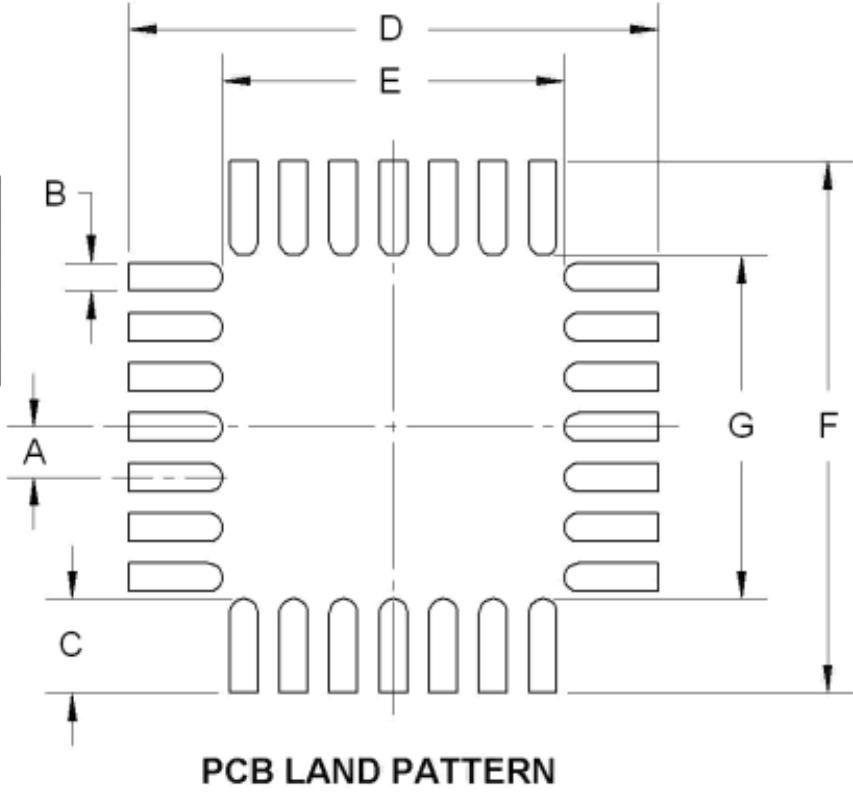
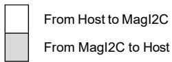

# User Manual

RM3100 & RM2100

Magneto-Inductive Magnetometer

# Table of Contents

# 1 Copyright & Warranty Information .... . 3

2 Introduction . 4

# 3 Specifications... . 5

3.1 Magnetic Sensor Characteristics . 5   
3.2 Sen-XY-f and Sen-Z-f Characteristics. 6   
3.3 MagI2C Characteristics... . 7   
3.4 Dimensions, Packaging, and Pad & Mask Layout . 8   
3.4.1 Sen-XY-f .. . 8   
3.4.2 Sen-Z-f... 1 0   
3.4.3 MagI2C.. 1 2   
3.5 Soldering . 14

# 4 Magnetic Sensor Overview & Set-Up ......... . 16

4.1 Overview .... 1 6

4.2 Layout.. 1 9   
4.2.1 Sensor Orientation. . 19   
4.2.2 Local Magnetic Field Considerations . 19   
4.2.3 Other Layout Considerations . . 20   
4.3 MagI2C Pin-Out.. . 21   
4.3.1 General Pins. . 21   
4.3.2 SPI Pins.. . 23   
4.3.3 I2C Pins.. . 24   
4.4 SPI Timing Requirements. . 25   
4.5 I2C Requirements . . 27   
4.5.1 I2C Register Write . . 27   
4.5.2 I2C Register Read. . 28

# 5 MagI2C Operation..... . 29

5.1 Set the Cycle Count Registers $( 0 { \times } 0 4 - 0 { \times } 0 9 )$ . 29   
5.2 Initiate Continuous Measurement Mode (0x01) . 30   
5.2.1 Setting the CMM Update Rate with TMRC (0x0B). . 32   
5.3 Initiate a Single Measurement $( 0 \times 0 0 )$ . 3 3   
5.4 Confirm New Data Ready . . 34   
5.4.1 STATUS Register $( 0 { \times } 3 4 )$ .. 34   
5.5 Read the Measurement Results . 3 4   
5.6 Troubleshooting and General Information . . 35   
5.6.1 Built-In Self Test Register (0x33) . 35   
5.6.2 HSHAKE Register (0x35) . . 38   
5.6.3 REVID Register (0x36) ... . 38   
5.7 Examples using the SPI Interface . . 39   
5.7.1 Set the Cycle Count Registers.. 39   
5.7.2 Making and Reading Measurements . . 39   
5.8 Examples using the $\mathsf { I } ^ { 2 } \mathsf { C }$ Interface . . 42   
5.8.1 Set the Cycle Count Registers. . 42   
5.8.2 Initiate a Single Measurement . . 42   
5.8.3 Initiate Continuous Measurement Mode . 43   
5.8.4 Read the Measurement Results . 43

# List of Figures

Figure 3-1: Sen-XY-f Sensor Dimensions.. . 8   
Figure 3-2: Sen-XY-f Tape and Reel Dimensions . . 9   
Figure 3-3: Sen-XY-f Recommended Solder Pad, Paste, & Mask Layout. .. 9   
Figure 3-4: Sen-Z-f Sensor Dimensions . 10   
Figure 3-5: Sen-Z-f Tape and Reel Dimensions. . 11   
Figure 3-6: Sen-Z-f Recommended Solder Pad, Paste, & Mask Layout . 11   
Figure 3-7: MagI2C MLF Mechanical Drawing. . 12   
Figure 3-8: MagI2C MLF PCB Pad Pattern... . 13   
Figure 3-9: MagI2C MLF Tape Dimensions... .14   
Figure 3-10: Recommended Solder Reflow Profile . .15   
Figure 4-1: RM3100 reference schematic – SPI Configuration.. .16   
Figure 4-2: RM3100 reference schematic – $\mathsf { I } ^ { 2 } \mathsf { C }$ Configuration.. .17   
Figure 4-3: LR Oscillator Circuit Biasing Diagram . .18   
Figure 4-4: RM3100 North-East-Down (NED) Sensor Layout . . 19   
Figure 4-5: SPI Timing Diagram, ${ \mathsf { C P O L } } = { \mathsf { C P H A } } = 0 .$ ... .26   
Figure 4-6: SPI Timing Diagram, C ${ \mathsf { P O L } } = { \mathsf { C P H A } } = 1$ .. . 26   
Figure 5-1: SPI Activity Sequence Diagram ..... .39

# List of Tables

Table 3-1: Magnetic Sensor Performance.. . 5   
Table 3-2: Sen-XY-f and Sen-Z-f Absolute Maximum Ratings. . 6   
Table 3-3: Sen-XY-f and Sen-Z-f Characteristics. . 6   
Table 3-4: MagI2C Absolute Maximum Ratings... . 7   
Table 3-5: MagI2C Recommended Operating Conditions.. .. 7   
Table 3-6: Recommended Solder Processing Parameters . .15   
Table 4-1: MagI2C Pin Assignments . .22   
Table 4-2: SPI Timing Specifications.. .27   
Table 5-1: MagI2C Register Map. .29   
Table 5-2: Cycle Count Registers . . 30   
Table 5-3: Continuous Mode DRDY Options .31   
Table 5-4: CMM Update Rates.. .33   
Table 5-5: Measurement Results Registers . . 35   
Table 5-6: BIST Timeout Period. .36   
Table 5-7: BIST LR Periods.. .36

# 1 Copyright & Warranty Information

$©$ Copyright 2013 PNI Sensor

All Rights Reserved. Reproduction, adaptation, or translation without prior written permission is prohibited, except as allow ed under copyright laws.

Revised Dec 2022

PNI Sensor 2331 Circadian Way Santa Rosa, CA 95407, USA Tel: (707) 566-2260 Fax: (707) 566-2261

Warranty and Limitation of Liability. PNI Sensor ("PNI") manufactures its Products from parts and components that are new or equivalent to new in performance. PNI warrants that each Product to be delivered hereunder, if properly used, will, for ninety (90) days following the date of shipment unless a different warranty time period for such Product is specified: (i) in PNI’s Price List in effect at time of order acceptance; or (ii) on PNI’s web site (www.pnicorp.com) at time of order acceptance, be free from defects in material and workmanship and will operate in accordance with PNI’s published specifications and documentation for the Product in effect at time of order. PNI will make no changes to the specifications or manufacturing processes that af fect form, fit, or function of the Product without written notice to the Customer, however, PNI may at any time, without such noti ce, make minor changes to specifications or manufacturing processes that do not affect the form, fit, or function of the Product. This warranty will be void if the Products’ serial number, or other identification marks have been defaced, damaged, or removed. T his warranty does not cover wear and tear due to normal use, or damage to the Product as the result of improper usage, neglect of care, alteration, accident, or unauthorized repair.

THE ABOVE WARRANTY IS IN LIEU OF ANY OTHER WARRANTY, WHETHER EXPRESS, IMPLIED, OR STATUTORY, INCLUDING, BUT NOT LIMITED TO, ANY WARRANTY OF MERCHANTABILITY, FITNESS FOR ANY PARTICULAR PURPOSE, OR ANY WARRANTY OTHERWISE ARISING OUT OF ANY PROPOSAL, SPECIFICATION, OR SAMPLE. PNI NEITHER ASSUMES NOR AUTHORIZES ANY PERSON TO ASSUME FOR IT ANY OTHER LIABILITY.

If any Product furnished hereunder fails to conform to the above warranty, Customer’s sole and exclusive remedy and PNI’s sol e and exclusive liability will be, at PNI’s option, to repair, replace, or credit Customer’s account with an amount equal to th e price paid for any such Product which fails during the applicable warranty period provided that (i) Customer promptly notifies PNI in writing that such Product is defective and furnishes an explanation of the deficiency; (ii) such Product is returned to PNI’s service facility at Customer’s risk and expense; and (iii) PNI is satisfied that claimed deficiencies exist and were not caused by ac cident, misuse, neglect, alteration, repair, improper installation, or improper testing. If a Product is defective, transportation ch arges for the return of the Product to Customer within the United States and Canada will be paid by PNI. For all other locations, the warranty excludes all costs of shipping, customs clearance, and other related charges. PNI will have a reasonable time to mak e repairs or to replace the Product or to credit Customer’s account. PNI warrants any such repaired or replacement Product to b e free from defects in material and workmanship on the same terms as the Product originally purchased.

Except for the breach of warranty remedies set forth herein, or for personal injury, PNI shall have no liability for any indi rect or speculative damages (including, but not limited to, consequential, incidental, punitive and special damages) relating to the use of or inability to use this Product, whether arising out of contract, negligence, tort, or under any warranty theory, or for inf ringement of any other party’s intellectual property rights, irrespective of whether PNI had advance notice of the possibility of any s uch damages, including, but not limited to, loss of use, revenue or profit. In no event shall PNI’s total liability for all claim s regarding a Product exceed the price paid for the Product. PNI neither assumes nor authorizes any person to assume for it any other liabilities.

Some states and provinces do not allow limitations on how long an implied warranty lasts or the exclusion or limitation of incidental or consequential damages, so the above limitations or exclusions may not apply to you. This warranty gives you specific legal rights and you may have other rights that vary by state or province.

# 2 Introduction

Thank you for purchasing PNI Sensor’s RM2100 or RM3100 Magnetic Sensor, pn 90052 or pn 90053, respectively. The RM2100 is comprised of two Sen-XY-f sensors, pn 13104, and a MagI2C ASIC controller, pn 13156, which forms the basis for a 2-axis digital compass. The RM3100 is the same as the RM2100 but adds a Sen-Z-f sensor, pn 13101, such that compassing measurements are not constricted to the horizontal plane.

PNI’s magnetic sensor technology provides high resolution, low power consumption, large signal noise immunity, a large dynamic range, and high sampling rates. Measurements are stable over temperature and inherently free from offset drift. The RM3100’s MagI2C ASIC features both continuous measurement mode and single measurement polling, software-configurable resolution and sample rate, and the ability to operate one, two, or three PNI sensors. And it incorporates both $\mathrm { I } ^ { 2 } \mathrm { C }$ and SPI interfaces for system design flexibility.

When implementing an RM3100 or RM2100 Magnetic Sensor, each sensor serves as the inductive element in a simple LR relaxation oscillation circuit, where the sensor’s effective inductance is proportional to the magnetic field parallel to the sensor axis. The LR circuit is driven by the MagI2C ASIC, and the MagI2C’s internal clock is used to measure the circuit’s oscillation frequency, and hence the magnetic field. Since PNI’s Magnetic Sensor works in the frequency domain, resolution and noise are established cleanly by the number of MagI2C internal clock counts (cycle counts). In comparison, fluxgate and MR technologies require expensive and complex signal processing to obtain similar resolution and noise, and in many respects the magnetic sensor’s performance simply cannot be matched. Also, the output from the MagI2C is inherently digital and can be fed directly into a microprocessor, eliminating the need for signal conditioning or an analog/digital interface between the sensor and a microprocessor. The simplicity of PNI’s magnetic sensor combined with the lack of signal conditioning makes it easier and less expensive to implement than alternative fluxgate or magneto-resistive (MR) technologies.

For more information on PNI’s magneto-inductive sensor technology, see PNI’s whitepaper “Magneto-Inductive Technology Overview” at http://www.pnicorp.com/technology/papers.

# 3 Specifications

# 3.1 Magnetic Sensor Characteristics

Table 3-1: Magnetic Sensor Performance1   

<table><tr><td rowspan=1 colspan=1> Parameter</td><td rowspan=1 colspan=3>Cycle Counts²50       100     200</td><td rowspan=1 colspan=1>Units</td></tr><tr><td rowspan=1 colspan=1>Field Measurement Range3</td><td rowspan=1 colspan=3>-800 to +800</td><td rowspan=1 colspan=1>uT</td></tr><tr><td rowspan=1 colspan=1>Gain</td><td rowspan=1 colspan=1>20</td><td rowspan=1 colspan=1>38</td><td rowspan=1 colspan=1>75</td><td rowspan=1 colspan=1> LSB/uT</td></tr><tr><td rowspan=1 colspan=1> Sensitivity</td><td rowspan=1 colspan=1>50</td><td rowspan=1 colspan=1>26</td><td rowspan=1 colspan=1>13</td><td rowspan=1 colspan=1>nT</td></tr><tr><td rowspan=1 colspan=1>Noise</td><td rowspan=1 colspan=1>30</td><td rowspan=1 colspan=1>20</td><td rowspan=1 colspan=1>15</td><td rowspan=1 colspan=1>nT</td></tr><tr><td rowspan=1 colspan=1> Noise Density @ Max. Single-Axis Sample Rate</td><td rowspan=1 colspan=3>1.2</td><td rowspan=1 colspan=1>nT/VHz</td></tr><tr><td rowspan=1 colspan=1> Repeatability over ±200 μT</td><td rowspan=1 colspan=1>15</td><td rowspan=1 colspan=1>8</td><td rowspan=1 colspan=1>8</td><td rowspan=1 colspan=1>nT</td></tr><tr><td rowspan=1 colspan=1>Hysteresis over ±200 μT</td><td rowspan=1 colspan=3>15</td><td rowspan=1 colspan=1>nT</td></tr><tr><td rowspan=1 colspan=1> Linearity over ±200 μT</td><td rowspan=1 colspan=3>0.5</td><td rowspan=1 colspan=1>%</td></tr><tr><td rowspan=1 colspan=1>Maximum Single-Axis Sample Rate(divide by 3 for max. 3-axis sample rate)</td><td rowspan=1 colspan=1>1600</td><td rowspan=1 colspan=1>850</td><td rowspan=1 colspan=1>440</td><td rowspan=1 colspan=1>Hz</td></tr><tr><td rowspan=1 colspan=1> Single-Axis Average Current @ 24 Hz Sample Rate (equivalent to 3-axis @ 8 Hz)</td><td rowspan=1 colspan=1>70</td><td rowspan=1 colspan=1>135</td><td rowspan=1 colspan=1>260</td><td rowspan=1 colspan=1>μA</td></tr><tr><td rowspan=1 colspan=1>Bias Resistor, Rb</td><td rowspan=1 colspan=3>121</td><td rowspan=1 colspan=1>R</td></tr><tr><td rowspan=1 colspan=1> External Timing Resistor for Clock, Rext</td><td rowspan=1 colspan=3>33</td><td rowspan=1 colspan=1> kΩ</td></tr><tr><td rowspan=1 colspan=1>Circuit Oscillation Frequency</td><td rowspan=1 colspan=3>180</td><td rowspan=1 colspan=1>kHz</td></tr><tr><td rowspan=1 colspan=1> Operating Temperature</td><td rowspan=1 colspan=3>-40 to +85</td><td rowspan=1 colspan=1>C</td></tr></table>

# Footnotes:

1. Performance values are typical. Performance specifications established with a supply voltage of $3 . 0 \lor$ , a bias resistor of $1 2 1 \ \Omega$ , an external timing resistor of $3 3 \mathsf { k } \Omega$ , and with measurements taken at room temperature. Other bias resistors, external timing resistors and operating voltages may be used, but performance will differ from the values listed. Contact PNI for additional information.

2. The cycle count setting (eg. 50 ,100, and 200) is user-configurable and set in the Cycle Count Registers. See Section 4.1 for a discussion on how the RM3100 works, and Section 5.1 for how to set the Cycle Count Registers.

3. Field measurement range is defined as the monotonic region of the output characteristic curve. Field measurement range can be extended using different bias resistors.

# 3.2 Sen-XY-f and Sen-Z-f Characteristics

Table 3-2: Sen-XY-f and Sen-Z-f Absolute Maximum Ratings   

<table><tr><td rowspan=1 colspan=4>Parameter                     Minimum     Maximum     Units</td></tr><tr><td rowspan=1 colspan=1>Input Pin Current @ 25C</td><td rowspan=1 colspan=1></td><td rowspan=1 colspan=1>50</td><td rowspan=1 colspan=1>mA</td></tr><tr><td rowspan=1 colspan=1>VoltageAcross Sensor</td><td rowspan=1 colspan=1></td><td rowspan=1 colspan=1>2.0</td><td rowspan=1 colspan=1>VDC</td></tr><tr><td rowspan=1 colspan=1>StorageTemperature</td><td rowspan=1 colspan=1>-40</td><td rowspan=1 colspan=1>+85</td><td rowspan=1 colspan=1>C</td></tr></table>

# CAUTION:

Stresses beyond those listed above may cause permanent damage to the device. These are stress ratings only. Assuming operation with the MagI2C per the guidelines in this manual, these maximum ratings will not be violated.

Table 3-3: Sen-XY-f and Sen-Z-f Characteristics   

<table><tr><td rowspan=1 colspan=6>Parameter                       Min     Typical     Max       Units</td></tr><tr><td rowspan=1 colspan=2>Inductance1</td><td rowspan=1 colspan=1></td><td rowspan=1 colspan=1>500-600</td><td rowspan=1 colspan=1></td><td rowspan=1 colspan=1>H</td></tr><tr><td rowspan=1 colspan=2> DC resistance (@25C±15C</td><td rowspan=1 colspan=1>30</td><td rowspan=1 colspan=1></td><td rowspan=1 colspan=1>45</td><td rowspan=1 colspan=1>Ω</td></tr><tr><td rowspan=1 colspan=2>Resistance versustemperature</td><td rowspan=1 colspan=1></td><td rowspan=1 colspan=1>0.4</td><td rowspan=1 colspan=1></td><td rowspan=1 colspan=1>%/C</td></tr><tr><td rowspan=2 colspan=1>Weight</td><td rowspan=1 colspan=1> Sen-XY-f</td><td rowspan=1 colspan=1></td><td rowspan=1 colspan=1>0.06 [0.002]</td><td rowspan=1 colspan=1></td><td rowspan=1 colspan=1>gm [oz]</td></tr><tr><td rowspan=1 colspan=1>Sen-Z-f</td><td rowspan=1 colspan=1></td><td rowspan=1 colspan=1>0.09 [0.003]</td><td rowspan=1 colspan=1></td><td rowspan=1 colspan=1>gm [oz]</td></tr><tr><td rowspan=1 colspan=2>Operating Temperature</td><td rowspan=1 colspan=1>-40</td><td rowspan=1 colspan=1></td><td rowspan=1 colspan=1>+85</td><td rowspan=1 colspan=1>C</td></tr></table>

1. 1 V peak-to-peak across the sensor $\textcircled { \omega } ~ 1 0 0 ~ \mathsf { k H z }$ sinewave. No DC bias resistance. Measured orthogonal to Earth’s magnetic field.

# Footnote:

# 3.3 MagI2C Characteristics

Table 3-4: MagI2C Absolute Maximum Ratings   

<table><tr><td rowspan=1 colspan=4>Parameter                                              Minimum   Maximum  Units</td></tr><tr><td rowspan=1 colspan=1> Analog/Digital DC Supply Voltage, AVDD &amp; DVDD</td><td rowspan=1 colspan=1>-0.3</td><td rowspan=1 colspan=1>+3.7</td><td rowspan=1 colspan=1>VDC</td></tr><tr><td rowspan=1 colspan=1> Input Pin Voltage</td><td rowspan=1 colspan=1>-0.3</td><td rowspan=1 colspan=1>AVDD 0r DVDD</td><td rowspan=1 colspan=1>VDC</td></tr><tr><td rowspan=1 colspan=1>Input Pin Current @ 25C</td><td rowspan=1 colspan=1>-10.0</td><td rowspan=1 colspan=1>+10.0</td><td rowspan=1 colspan=1>mA</td></tr><tr><td rowspan=1 colspan=1>Storage  Temperature</td><td rowspan=1 colspan=1>-40°</td><td rowspan=1 colspan=1>+125°</td><td rowspan=1 colspan=1>C</td></tr></table>

# CAUTION:

Stresses beyond those listed above may cause permanent damage to the device. These are stress ratings only. Operation of the device at these or other conditions beyond those indicated in the operational sections of the specifications is not implied.

Table 3-5: MagI2C Recommended Operating Conditions   

<table><tr><td rowspan=1 colspan=6>Parameter                                  Symbol   Min       Typ       Max     Units</td></tr><tr><td rowspan=1 colspan=1>Analog/Digital DC Supply Voltage1</td><td rowspan=1 colspan=1>AVDD，DVDD</td><td rowspan=1 colspan=1>2.0</td><td rowspan=1 colspan=1>3.0</td><td rowspan=1 colspan=1>3.6</td><td rowspan=1 colspan=1>VDC</td></tr><tr><td rowspan=2 colspan=1> Supply Voltage    During OperationDifference(DVDD-AVDD)     Analog Unpowered</td><td rowspan=1 colspan=1>△VDD_OP</td><td rowspan=1 colspan=1>-0.1</td><td rowspan=1 colspan=1>0</td><td rowspan=1 colspan=1>+0.1</td><td rowspan=1 colspan=1>VDC</td></tr><tr><td rowspan=1 colspan=1>△VDD_OFF</td><td rowspan=1 colspan=1>DVDD-0.1</td><td rowspan=1 colspan=1>DVDD</td><td rowspan=1 colspan=1>DVDD+0.1</td><td rowspan=1 colspan=1>VDC</td></tr><tr><td rowspan=1 colspan=1> Voltage Ripple on AVDD or DVDD</td><td rowspan=1 colspan=1>VD_riple</td><td rowspan=1 colspan=1></td><td rowspan=1 colspan=1></td><td rowspan=1 colspan=1>0.05</td><td rowspan=1 colspan=1>VpP</td></tr><tr><td rowspan=1 colspan=1>High level input voltage</td><td rowspan=1 colspan=1>VIH</td><td rowspan=1 colspan=1>0.7*DVDD</td><td rowspan=1 colspan=1></td><td rowspan=1 colspan=1>DVDD</td><td rowspan=1 colspan=1>VDC</td></tr><tr><td rowspan=1 colspan=1> Low level input voltage</td><td rowspan=1 colspan=1>VIL</td><td rowspan=1 colspan=1>0</td><td rowspan=1 colspan=1></td><td rowspan=1 colspan=1> 0.3*DVDD</td><td rowspan=1 colspan=1>VDC</td></tr><tr><td rowspan=1 colspan=1>High level output current</td><td rowspan=1 colspan=1>1oH</td><td rowspan=1 colspan=1></td><td rowspan=1 colspan=1></td><td rowspan=1 colspan=1>-1</td><td rowspan=1 colspan=1>mA</td></tr><tr><td rowspan=1 colspan=1> Low level output current</td><td rowspan=1 colspan=1>loL</td><td rowspan=1 colspan=1>1</td><td rowspan=1 colspan=1></td><td rowspan=1 colspan=1></td><td rowspan=1 colspan=1>mA</td></tr><tr><td rowspan=1 colspan=1>Idle Mode Current</td><td rowspan=1 colspan=1></td><td rowspan=1 colspan=1></td><td rowspan=1 colspan=1></td><td rowspan=1 colspan=1>1</td><td rowspan=1 colspan=1>uA</td></tr><tr><td rowspan=1 colspan=1> Leakage Current @ DVDD pin(AVDD=AVss=DVss=0V, DVDD=3.6V)</td><td rowspan=1 colspan=1></td><td rowspan=1 colspan=1></td><td rowspan=1 colspan=1></td><td rowspan=1 colspan=1>100</td><td rowspan=1 colspan=1> nA</td></tr><tr><td rowspan=1 colspan=1>Operating Temperature</td><td rowspan=1 colspan=1>ToP</td><td rowspan=1 colspan=1>-40</td><td rowspan=1 colspan=1></td><td rowspan=1 colspan=1>+85</td><td rowspan=1 colspan=1>C</td></tr></table>

# Footnote:

1. Please contact PNI if operation at ${ < } 2 . 0 \lor$ is required.

# 3.4 Dimensions, Packaging, and Pad & Mask Layout

# 3.4.1 Sen-XY-f

# Dimensions in mm

Polarity Indicator - Embossed Arrow or White Paint on Ends

  
Figure 3-1: Sen-XY-f Sensor Dimensions

# Dimensions in mm

  
Figure 3-2: Sen-XY-f Tape and Reel Dimensions

Full reel is 5000 pcs. Smaller quantities on cut tape. Tape & reel meets ANSI/EIA standard EIA-418-B

  
Dimensions in mm   
Note: PNI recommends a 5 mil stencil. The solder paste area is much smaller than the pad to reduce sensor tilt and misalignment. The above layout allows for rework: for minimal footprint, contact PNI.   
Figure 3-3: Sen-XY-f Recommended Solder Pad, Paste, & Mask Layout

# 3.4.2 Sen-Z-f

  
  
Figure 3-4: Sen-Z-f Sensor Dimensions

# Dimensions in mm

  
Figure 3-5: Sen-Z-f Tape and Reel Dimensions

Full reel is 1200 pcs. Smaller quantities on cut tape. Tape $\&$ reel meets ANSI/EIA standard EIA-418-B

Dimensions in mm

  
Figure 3-6: Sen-Z-f Recommended Solder Pad, Paste, & Mask Layout

Note: PNI recommends a 5 mil stencil. The solder paste area is much smaller than the pad to reduce sensor tilt and misalignment. The above layout allows for rework: for minimal footprint, contact PNI.

# 3.4.3 MagI2C

  
Figure 3-7: MagI2C MLF Mechanical Drawing

Dimensions in mm   

<table><tr><td rowspan=1 colspan=1></td><td rowspan=1 colspan=1>3DMaglC</td><td rowspan=1 colspan=1>Magl2C</td></tr><tr><td rowspan=1 colspan=1>A</td><td rowspan=1 colspan=1>0.50 typ.</td><td rowspan=1 colspan=1>0.40 typ.</td></tr><tr><td rowspan=1 colspan=1>B</td><td rowspan=1 colspan=1>0.28max.</td><td rowspan=1 colspan=1>0.20max.</td></tr><tr><td rowspan=1 colspan=1>C</td><td rowspan=1 colspan=1>0.94 typ.</td><td rowspan=1 colspan=1>0.60typ.</td></tr><tr><td rowspan=1 colspan=1>DF</td><td rowspan=1 colspan=1>5.30 typ.</td><td rowspan=1 colspan=1>4.80 typ.</td></tr><tr><td rowspan=1 colspan=1>E.G</td><td rowspan=1 colspan=1>3.43min.</td><td rowspan=1 colspan=1>3.00min.</td></tr></table>

  
Figure 3-8: MagI2C MLF PCB Pad Pattern

(i） Measured from centerline of sprocket hole to centerline of pocket (ii) Cumulative tolerance of 10 sprocket holes is $\pm 0 . 2$ (ii) Other material available

  
Figure 3-9: MagI2C MLF Tape Dimensions

# Dimensions: mm

Full reel is 5000 pcs. Smaller quantities on cut-tape. Tape & Reel meets ANSI/EIA standard EIA-418

# 3.5 Soldering

Figure 3-10 and Table 3-6 provide the recommended solder reflow profile and processing parameters for RM3100 components. After soldering PNI components to a board, it is possible to wave solder the opposite side of the PCB.

IMPORTANT: PNI sensors require the use of halide-free solder pastes and processes for reflow and cleaning. Contact PNI if you would like recommendations.

  
Figure 3-10: Recommended Solder Reflow Profile

Table 3-6: Recommended Solder Processing Parameters1   

<table><tr><td rowspan=1 colspan=3>Parameter                            Symbol               Value</td></tr><tr><td rowspan=1 colspan=1> Preheat Temperature，Minimum</td><td rowspan=1 colspan=1>Tsmin</td><td rowspan=1 colspan=1>150°℃</td></tr><tr><td rowspan=1 colspan=1> Preheat Temperature， Maximum</td><td rowspan=1 colspan=1>Tsmax</td><td rowspan=1 colspan=1>200°C</td></tr><tr><td rowspan=1 colspan=1>Preheat Time (Tsmin to Tsmax)</td><td rowspan=1 colspan=1></td><td rowspan=1 colspan=1>60 - 180 seconds</td></tr><tr><td rowspan=1 colspan=1> Solder Melt Temperature</td><td rowspan=1 colspan=1>T</td><td rowspan=1 colspan=1>&gt;218°C</td></tr><tr><td rowspan=1 colspan=1>Ramp-Up Rate (Tsmax to TL)</td><td rowspan=1 colspan=1></td><td rowspan=1 colspan=1>3°C/second maximum</td></tr><tr><td rowspan=1 colspan=1> Peak Temperature</td><td rowspan=1 colspan=1>Tp</td><td rowspan=1 colspan=1>&lt;260°℃</td></tr><tr><td rowspan=1 colspan=1>Time from 25C to Peak (Tp)</td><td rowspan=1 colspan=1></td><td rowspan=1 colspan=1>6 minutes maximum</td></tr><tr><td rowspan=1 colspan=1> Time above TL</td><td rowspan=1 colspan=1>tl</td><td rowspan=1 colspan=1>60 - 120 seconds</td></tr><tr><td rowspan=1 colspan=1> Soak Time (within 5°C of Tp)</td><td rowspan=1 colspan=1>tp</td><td rowspan=1 colspan=1>10 - 20 seconds</td></tr><tr><td rowspan=1 colspan=1>Rampdown Rate</td><td rowspan=1 colspan=1></td><td rowspan=1 colspan=1>4°C/second maximum</td></tr></table>

# Footnote:

1. Meets IPC/JEDEC J-STD-020 profile recommendations. Sen-XY-f and SenZ-f classified as moisture sensitivity level 1. MagI2C MLF classified as moisture sensitivity level 3.

# 4 Magnetic Sensor Overview & Set-Up

# 4.1 Overview

Figure 4-1 and Figure 4-2 provide basic schematics for implementing the RM3100 Sensor Suite when using the SPI interface and $\mathrm { I } ^ { 2 } \mathrm { C }$ interface, respectively. The MagI2C is at the center of the schematic, as it ties the user’s host controller, on the left, to the three sensors, on the right. Unused sensor connections should remain floating.

Note: RM3100 and RM2100 Magnetic Sensors typically are used in compassing applications, where each channel represents a Cartesian coordinate axis, X, Y, or Z. For this reason, the term “axis” generally is used instead of “channel”.

  
Figure 4-1: RM3100 reference schematic – SPI Configuration Note: The RM2100 Pins 6, 7, 8, and 9 are no-connect.

  
Figure 4-2: RM3100 reference schematic – $I ^ { 2 } C$ Configuration Note: The RM2100 Pins 6, 7, 8, and 9 are no-connect.

A Sen-XY-f or Sen-Z-f sensor serves as the inductive element in a simple LR relaxation oscillation circuit which is composed of an external bias resistor along with digital gates and a comparator internal to the MagI2C. The sensor’s inductance is a function of the magnetic field strength. As such, the frequency of oscillation of the circuit varies with the strength of the total magnetic field parallel to the sensor. To make a measurement, one side of the sensor is grounded while the other side is alternately driven with positive and negative current through the oscillator. The circuit is driven for a set number of circuit oscillations, and the time to complete the oscillations is measured using the MagI2C’s internal high-speed clock. The MagI2C next switches the bias connection to the sensor and makes another measurement. The side that was previously grounded is now charged and discharged while the other is now grounded.

# Because:

• the total magnetic field represents the sum of the local field and the circuit-induced field, and the circuit-induced magnetic field has the same magnitude but opposite direction for the two bias polarities,

the local magnetic field is proportional to the difference in the time to complete the measurement for each bias. The difference in the number of clock oscillations between the forward and reverse bias directions is output from the MagI2C, and this number is directly proportional to the strength of the local magnetic field in the direction of the sensor.

Figure 4-3 provides a detail of the biasing circuit. For more on PNI’s magneto-inductive technology, refer to the “Magneto-Inductive Technology Overview” white paper found on PNI’s website.

  
Figure 4-3: LR Oscillator Circuit Biasing Diagram

Since PNI’s Magnetic Sensor Suite works in the frequency domain, resolution is cleanly established by the number of circuit oscillations. Also, the output from the MagI2C is inherently digital and can be fed directly into a microprocessor, which eliminates the need for signal conditioning or an analog/digital interface between the sensor and host processor.

# 4.2 Layout

# 4.2.1 Sensor Orientation

Figure 4-4 indicates how the three sensors in a RM3100 Magnetic Sensor should be oriented for a system referenced as north-east-down (NED). The arrow represents the direction of travel or pointing. The Sen-XY-f is insensitive to the location of the polarity indicator, while the location of the polarity indicator is critical for the Sen-Z-f.

  
Figure 4-4: RM3100 North-East-Down (NED) Sensor Layout

If the Sen-Z-f sensor is flipped to the bottom of the board such that the polarity indicator still points back or the curved portion of the sensor still points forward, then to retain NED the Sen-Z-f’s ZDRVN and ZDRVP pads should be as shown above, except on the bottom of the board. As the pads on the Sen-Z-f have switched positions, the connections to the Sen-Z-f sensor will be reversed.

# 4.2.2 Local Magnetic Field Considerations

Because the RM3100 sensor measure magnetic field, it is important to consider what items in the vicinity of the sensors can affect the sensor readings. Note that magnetic field drops off as (1/distance)3. Specific issues to consider include:

• The sensors have a specified linear regime of $\pm 2 0 0 \mu \mathrm { T }$ . (Earth’s field is ${ \sim } 5 0 \mu \mathrm { T } .$ ) To ensure the sensors operate in their linear regime, do not place the sensors close to large electric currents, large masses of ferrous material, or devices incorporating permanent magnets, such as speakers and electric motors.

• Locate the sensors away from changing magnetic fields. If this is not possible, but the local magnetic field is known to have multiple states, try to take readings only when the field is in a known state. For instance, if a motor runs part of the time, take readings only when the motor is in a known state.   
• If you are uncertain about the effect a specific component may have on the system, the RM3100 Evaluation Board can be used to help ascertain this. Place the RM3100 Evaluation Board on a firm surface and gradually bring the component in question close to the board, then note when the magnetic field starts to change. If the component cannot be moved, then gradually move the RM3100 Evaluation Board towards the component, carefully ensuring the orientation of the board remains constant while doing this.   
If an RM3100 Evaluation Board is not available, gradually bring the component in question closer to one of the sensors and observe when the sensor reading from the MagI2C starts to change.

# 4.2.3 Other Layout Considerations

Other design considerations include:

• To minimize the effect of gradients in the magnetic field, position the sensors as close to each other as possible.   
• To reduce coupling to and from other signals, keep the two traces from the MagI2C to each sensor as close as possible to each other. PNI recommends locating the MagI2C within $1 0 \mathrm { c m }$ from the sensors.   
• Keep capacitors, especially tantalum capacitors, far away from the sensors.

# 4.3 MagI2C Pin-Out

The MagI2C’s pin-out is summarized on the following page in Table 4-1. Pin numbers run counterclockwise, when looking from the top, starting at the Pin 1 designator as shown in Figure 3-7.

# 4.3.1 General Pins

# AVDD and DVDD (pins 4, 14, & 26)

AVDD and DVDD should be tied to the analog and digital supply voltages, respectively. The recommend voltages are defined in Table 3-5, and the maximum voltages are given in Table 3-4. DVDD must be on whenever AVDD is on, so DVDD should either be brought up first or at precisely the same time as AVDD. AVDD can be turned off when not making a measurement to conserve power, since all other operations are supported with DVDD. Under this condition, register values will be retained as long as DVDD is powered. Also, AVDD must be within $0 . 1 \mathrm { ~ V ~ }$ of DVDD when AVDD is on.

# AVSS and DVSS (pins 5 & 19)

AVSS and DVSS should be tied to the analog and digital ground, respectively.   
Assuming the ground plane is clean, they may share a common ground.   
Alternatively, they may have their own ground planes if this is more convenient.   
DVSS and AVSS should be within $0 . 1 \mathrm { ~ V ~ }$ of each other.

Table 4-1: MagI2C Pin Assignments   

<table><tr><td rowspan=1 colspan=3>Pin#    Pin Name Description</td></tr><tr><td rowspan=2 colspan=1>1</td><td rowspan=2 colspan=1>MOSI/SDA</td><td rowspan=1 colspan=1>SPl interface (MOSI) - Master Output, Slave Input Serial Data</td></tr><tr><td rowspan=1 colspan=1>C interface (SDA) - Serial Data Line</td></tr><tr><td rowspan=1 colspan=1>2</td><td rowspan=1 colspan=1> RES</td><td rowspan=1 colspan=1> Reserved - connect to ground</td></tr><tr><td rowspan=1 colspan=1>3</td><td rowspan=1 colspan=1>SSN/SA0</td><td rowspan=1 colspan=1> SPl interface - Active low to select port |²C interface - Bit 0 of Magl2C&#x27;s slave address</td></tr><tr><td rowspan=1 colspan=1>4</td><td rowspan=1 colspan=1> AVDD</td><td rowspan=1 colspan=1> Supply voltage for analog section of ASIC</td></tr><tr><td rowspan=1 colspan=1>5</td><td rowspan=1 colspan=1>AVss</td><td rowspan=1 colspan=1> Ground pin for analog section of ASIC</td></tr><tr><td rowspan=1 colspan=1>6</td><td rowspan=1 colspan=1>ZDRVP</td><td rowspan=1 colspan=1> Z sensor drive output</td></tr><tr><td rowspan=1 colspan=1>7</td><td rowspan=1 colspan=1>ZINP</td><td rowspan=1 colspan=1>Z sensor measurement input</td></tr><tr><td rowspan=1 colspan=1>8</td><td rowspan=1 colspan=1>ZINN</td><td rowspan=1 colspan=1> Z sensor measurement input</td></tr><tr><td rowspan=1 colspan=1>9</td><td rowspan=1 colspan=1>ZDRVN</td><td rowspan=1 colspan=1> Z sensor drive output</td></tr><tr><td rowspan=1 colspan=1>10</td><td rowspan=1 colspan=1>YDRVP</td><td rowspan=1 colspan=1>Y sensor drive output</td></tr><tr><td rowspan=1 colspan=1>11</td><td rowspan=1 colspan=1>YINP</td><td rowspan=1 colspan=1>Y sensor measurement input</td></tr><tr><td rowspan=1 colspan=1>12</td><td rowspan=1 colspan=1>YINN</td><td rowspan=1 colspan=1>Y sensor measurement input</td></tr><tr><td rowspan=1 colspan=1>13</td><td rowspan=1 colspan=1>YDRVN</td><td rowspan=1 colspan=1>Y sensor drive output</td></tr><tr><td rowspan=1 colspan=1>14</td><td rowspan=1 colspan=1>DVDD</td><td rowspan=1 colspan=1> Supply voltage for digital section of ASIC.</td></tr><tr><td rowspan=1 colspan=1>15</td><td rowspan=1 colspan=1>XDRVP</td><td rowspan=1 colspan=1>X sensor drive output</td></tr><tr><td rowspan=1 colspan=1>16</td><td rowspan=1 colspan=1>XINP</td><td rowspan=1 colspan=1> X sensor measurement input</td></tr><tr><td rowspan=1 colspan=1>17</td><td rowspan=1 colspan=1>XINN</td><td rowspan=1 colspan=1> X sensor measurement input</td></tr><tr><td rowspan=1 colspan=1>18</td><td rowspan=1 colspan=1>XDRVN</td><td rowspan=1 colspan=1> X sensor drive output</td></tr><tr><td rowspan=1 colspan=1>19</td><td rowspan=1 colspan=1>DVss</td><td rowspan=1 colspan=1>Ground pin for digital section of ASIC</td></tr><tr><td rowspan=1 colspan=1>20</td><td rowspan=1 colspan=1>RES</td><td rowspan=1 colspan=1> Reserved - connect to ground</td></tr><tr><td rowspan=1 colspan=1>21</td><td rowspan=1 colspan=1>NC</td><td rowspan=1 colspan=1> Do not connect</td></tr><tr><td rowspan=1 colspan=1>22</td><td rowspan=1 colspan=1>I2CEN</td><td rowspan=1 colspan=1> I²C enable pin (HIGH = I2C, LOW = SPI)</td></tr><tr><td rowspan=1 colspan=1>23</td><td rowspan=1 colspan=1>DRDY</td><td rowspan=1 colspan=1> Status line</td></tr><tr><td rowspan=1 colspan=1>24</td><td rowspan=1 colspan=1> NC</td><td rowspan=1 colspan=1> Do not connect</td></tr><tr><td rowspan=1 colspan=1>25</td><td rowspan=1 colspan=1>RexT</td><td rowspan=1 colspan=1>External timing resistor for high speed clock.</td></tr><tr><td rowspan=1 colspan=1>26</td><td rowspan=1 colspan=1>DVDD</td><td rowspan=1 colspan=1> Supply voltage for digital section of ASIC.</td></tr><tr><td rowspan=1 colspan=1>27</td><td rowspan=1 colspan=1>SCLK/SCL</td><td rowspan=1 colspan=1> SPl interface (SCLK)- Serial clock inputI²C interface (SCL) - Serial clock line</td></tr><tr><td rowspan=1 colspan=1>28</td><td rowspan=1 colspan=1> MISO/SA1</td><td rowspan=1 colspan=1> SPl interface (MISO) - Master Input. Slave Output I²C interface - Bit 1 of Magl2C&#x27;s slave address</td></tr></table>

# Sensor Drive and Measurement Pins (pins 6 – 13 & 15 – 18)

The various sensor drive and measurement pins should be connected to the sensors. For a north-east-down (NED) reference frame, the connections should be as defined in Figure 4-4.

# I2CEN (pin 22)

This pin should be pulled LOW when using the SPI interface or pulled HIGH when using the $\mathrm { I } ^ { 2 } \mathrm { C }$ interface.

# DRDY (pin 23)

DRDY is used to ensure data is read from the MagI2C only when it is available. The DRDY pin will go HIGH when the measurement is complete. This signals the host that data is ready to be read. The DRDY pin automatically is set LOW when the Measurement Result registers are read or a write operation is performed.

It is not mandatory to use the DRDY pin, as alternative methods exist to determine if data is available. Specifically, the STATUS register provides this information. And, if using the SPI interface where CPHA ${ \bf \Phi } _ { \cdot } = { \bf \Phi }$ CPOL $_ { , = 1 }$ , the MISO line also indicates if data is available when SSN is LOW.

# REXT (pin 25)

$\mathrm { R } _ { \mathrm { E X T } }$ ties to the external timing resistor for the high-speed clock. The recommended value for the resistor and associated clock speed are defined in Table 3-1.

# 4.3.2 SPI Pins

# MOSI (pin 1)

MOSI is an SPI input that provides data from the master device to the MagI2C. Data is transferred most significant bit first. Data must be presented at least 50 ns before the rising edge of SCLK, and remain valid for 50 ns after the edge. New data typically is presented to the MOSI pin on the falling edge of SCLK.

# SSN (pin 3)

This signal sets the MagI2C as the operating slave device on the SPI bus. The SSN pin must be LOW prior to data transfer in either direction, and must stay LOW during the entire transfer.

The SSN pin must transition from HIGH to LOW prior to reading from or writing to the registers. It must stay LOW for the remainder of the operation.

After communication between the MagI2C and master device is finished, the SPI bus can be freed up (SSN pin set HIGH) to communicate with other slave devices while the MagI2C takes a measurement or is idle.

# SCLK (pin 27)

SCLK is a SPI input used to synchronize the data sent in and out through the MISO and MOSI pins. SCLK is generated by the customer-supplied master device and should be 1 MHz or less. One byte of data is exchanged over eight clock cycles. Data is captured by the master device on the rising edge of SCLK. Data is shifted out and presented to the MagI2C on the MOSI pin on the falling edge of SCLK, except for the first bit (MSB) which must be present before the first rising edge of SCLK.

# MISO (pin 28)

MISO is an SPI output that sends data from the MagI2C to the master device. Data is transferred most significant bit first and is captured by the master device on the rising edge of SCLK. The MISO pin is placed in a high impedance state if the MagI2C is not selected (i.e. if $\mathrm { S S N { = } } 1$ ).

# 4.3.3 I2C Pins

# SDA (pin 1)

The SDA line is a bi-directional line used to send commands to the MagI2C and used to transmit data from the MagI2C. Data is transferred most significant bit first. All communication between the host and the MagI2C occurs on this line when implementing the I2C interface.

# SA0 (pin 3)

SA0 represents the second-least significant bit in the MagI2C’s slave address. Pulling this HIGH represents a ‘1’ and pulling it low represents a $^ { \bullet } 0 ^ { \bullet }$ . Along with pin 28 (bit 1) and the higher 5 bits (0b01000), which are pre-defined in hardware, SA0 establishes the 7-bit slave address of the MagI2C on the $\mathrm { I } ^ { 2 } \mathrm { C }$ bus.

# SCL (pin 27)

SCL is used to synchronize the data sent in and out through the SDA pin. SCL is generated by the customer-supplied master device and should be 1 MHz or less. Data is captured by the master device on the rising edge of SCL. Data is shifted out and presented to the MagI2C on the SDA pin on the falling edge of SCL, except for the first bit which must be present before the first rising edge of SCL.

# SA1 (pin 28)

SA1 represents the least significant bit in the MagI2C’s slave address. Pulling this HIGH represents a ‘1’ and pulling it low represents a $^ { \bullet } 0 ^ { \bullet }$ . Along with pin 3 (bit 0) and the higher 5 bits (0b01000), which are pre-defined in hardware, SA1 establishes the 7-bit slave address of the MagI2C on the $\mathrm { I } ^ { 2 } \mathrm { C }$ bus.

# 4.4 SPI Timing Requirements

The MagI2C can act as a slave device on a SPI bus. The SPI interface consists of four signals, as carried on SCLK, MOSI, MISO, and SSN. The SPI clock, SCLK, should run at 1 MHz or less. Data sent out on MOSI is considered valid while SCLK is HIGH, and data is in transition when SCLK is LOW. The first byte sent to the MagI2C contains the Read/Write bit (Write ${ : = } 0$ ) followed by the 7-bit register address. When the register address byte is received the MagI2C returns the STATUS register contents. Assuming SSN stays low and SCLK continues, multiple registers can be written to or read from as the MagI2C will automatically increment to the next register address. The clock polarity when the bus is idle can either be LOW (CPOL ${ \overline { { \bullet } } }$ CPHA $_ { = 0 }$ ) or HIGH (C $\mathrm { \Delta ^ { \circ } O L = C P H A }$ $_ { = 1 }$ ).

As long as SSN is LOW data can transfer to or from the MagI2C. Generally it is a good idea to pull SSN to HIGH after a read or write operation has completed such that the SPI bus can be freed up for other devices. The MagI2C can perform measurements while the SSN line is HIGH, as this does not involve communication with the master. Pulling the SSN to HIGH during a data read or write will terminate the transaction.

The timing parameters, defined in Figure 4-5 or Figure 4-6 and specified in Table 4-2, must be met to ensure reliable communication.

  
Figure 4-5: SPI Timing Diagram, $C P O L = C P H A = 0$

  
Figure 4-6: SPI Timing Diagram, $C P O L = C P H A = 1$

Table 4-2: SPI Timing Specifications   

<table><tr><td rowspan=1 colspan=5>Symbol                       Description                        Min    Max    Units</td></tr><tr><td rowspan=1 colspan=1>tsHZD</td><td rowspan=1 colspan=1> SSN LOW to data output</td><td rowspan=1 colspan=1></td><td rowspan=1 colspan=1>100</td><td rowspan=1 colspan=1>ns</td></tr><tr><td rowspan=1 colspan=1>tssdv</td><td rowspan=1 colspan=1> SSN LOW to Command Byte</td><td rowspan=1 colspan=1>100</td><td rowspan=1 colspan=1></td><td rowspan=1 colspan=1>ns</td></tr><tr><td rowspan=1 colspan=1>tDBSH</td><td rowspan=1 colspan=1>Setup data before active edge</td><td rowspan=1 colspan=1>50</td><td rowspan=1 colspan=1></td><td rowspan=1 colspan=1>ns</td></tr><tr><td rowspan=1 colspan=1>tDASH</td><td rowspan=1 colspan=1> Hold data after active edge</td><td rowspan=1 colspan=1>50</td><td rowspan=1 colspan=1></td><td rowspan=1 colspan=1>ns</td></tr><tr><td rowspan=1 colspan=1>tDRDV</td><td rowspan=1 colspan=1>Clock falling edge to valid data</td><td rowspan=1 colspan=1></td><td rowspan=1 colspan=1>20</td><td rowspan=1 colspan=1>ns</td></tr><tr><td rowspan=1 colspan=1>tssH</td><td rowspan=1 colspan=1>Final clock cycle falling edge to SSN HIGH</td><td rowspan=1 colspan=1>100</td><td rowspan=1 colspan=1></td><td rowspan=1 colspan=1>ns</td></tr><tr><td rowspan=1 colspan=1>tSHDZ</td><td rowspan=1 colspan=1>SSN HIGH to output data tri-state</td><td rowspan=1 colspan=1></td><td rowspan=1 colspan=1>100</td><td rowspan=1 colspan=1>ns</td></tr><tr><td rowspan=1 colspan=1>tssw</td><td rowspan=1 colspan=1> SSN HIGH to LOW (time between transactions)</td><td rowspan=1 colspan=1>100</td><td rowspan=1 colspan=1></td><td rowspan=1 colspan=1></td></tr></table>

# 4.5 I2C Requirements

The MagI2C can operate as a slave device on an $\mathrm { I } ^ { 2 } \mathrm { C }$ bus. It is identified by a 7-bit slave address. The higher 5 bits of the slave address are pre-defined in hardware and the same for all MagI2C devices. PNI has registered these first 5 bits as 0b01000. The lower 2 bits of the slave address are user-configurable, using pins 3 and 28. As such, 4 different slave addresses are possible. For example, setting pin 3 HIGH and pin 28 LOW results in an address of 0b0100001.

The MagI2C’s $\mathrm { I } ^ { 2 } \mathrm { C }$ interface complies with NXP’s UM10204 specification and user manual, revision 03. Standard, fast, fast plus, and high speed modes of the $\mathrm { I } ^ { 2 } \mathrm { C }$ protocol are supported. Below is a link to this document.

http://www.nxp.com/documents/user_manual/UM10204.pdf

# 4.5.1 I2C Register Write

A generic Write transaction is given below.

<table><tr><td rowspan=1 colspan=1>START</td><td rowspan=1 colspan=7>Magl2C ADDRESS</td><td rowspan=1 colspan=1>RW</td><td rowspan=1 colspan=1>ACK</td><td rowspan=1 colspan=7>Magl2C REG.ADDRESS (N)</td><td rowspan=1 colspan=1>ACK</td><td rowspan=1 colspan=6>DATA TO REGISTER (N)</td><td rowspan=1 colspan=1>ACK</td><td rowspan=1 colspan=8>DATA TO REGISTER (N+1)</td><td rowspan=1 colspan=1>ACK</td><td rowspan=1 colspan=1>STOP</td></tr><tr><td rowspan=1 colspan=1>S</td><td rowspan=1 colspan=1>A6</td><td rowspan=1 colspan=1>A5</td><td rowspan=1 colspan=1>A4</td><td rowspan=1 colspan=1>A3</td><td rowspan=1 colspan=1>A2</td><td rowspan=1 colspan=1>A1</td><td rowspan=1 colspan=1>A0</td><td rowspan=1 colspan=1>0</td><td rowspan=1 colspan=1>0</td><td rowspan=1 colspan=1>A7</td><td rowspan=1 colspan=1>A6</td><td rowspan=1 colspan=1>A5</td><td rowspan=1 colspan=1>A4</td><td rowspan=1 colspan=1>A3</td><td rowspan=1 colspan=1>A2</td><td rowspan=1 colspan=1>A1A0</td><td rowspan=1 colspan=1>0</td><td rowspan=1 colspan=1>A7</td><td rowspan=1 colspan=1>A6</td><td rowspan=1 colspan=1>A5</td><td rowspan=1 colspan=1>A4A3A2</td><td rowspan=1 colspan=1>A2</td><td rowspan=1 colspan=1>A1A0</td><td rowspan=1 colspan=1>0</td><td rowspan=1 colspan=1>A7</td><td rowspan=1 colspan=1>A6</td><td rowspan=1 colspan=1>A5</td><td rowspan=1 colspan=1>A4</td><td rowspan=1 colspan=1>A3</td><td rowspan=1 colspan=1>A2</td><td rowspan=1 colspan=1>A1</td><td rowspan=1 colspan=1>A0</td><td rowspan=1 colspan=1>0</td><td rowspan=1 colspan=1>P</td></tr></table>

All communication is on the SDA line. The transaction is initiated by the host, or master, sending the Start condition followed by the MagI2C’s slave address, and then the RW bit is set to $^ { \circ }$ , indicating a Write operation. The slave address is acknowledged by the MagI2C by setting SDA to LOW. This is followed by the desired 7-bit register address and then the register data. The register value automatically increments after every received data byte. The transaction is terminated by the host sending the Stop condition.

The MagI2C will always acknowledge the start of an $\mathrm { I } ^ { 2 } \mathrm { C }$ Write transaction by sending a $\cdot _ { 0 } ,$ (i.e. the ACK signal). But if the Write command cannot be executed for some reason the MagI2C will send a ‘1’ instead (i.e. the NACK signal). The reasons a NACK signal might be sent are established by the HSHAKE register, and include writing to an undefined register or writing to the POLL register while CMM is in progress, or vice versa. See Section 0 for more information.

# 4.5.2 I2C Register Read

To perform a Read transaction, it is first necessary for the master to Write the desired register address, and then to Read the register data. A generic transaction is given below.

<table><tr><td rowspan=1 colspan=1>START</td><td rowspan=1 colspan=7>SLAVE ADDRESS</td><td rowspan=1 colspan=1>RW</td><td rowspan=1 colspan=1>RWACK</td><td rowspan=1 colspan=8>REGISTER ADDRESS (N)</td><td rowspan=1 colspan=1>ACK</td><td rowspan=1 colspan=1>STOP</td></tr><tr><td rowspan=1 colspan=1>s</td><td rowspan=1 colspan=1>A6</td><td rowspan=1 colspan=1>A5</td><td rowspan=1 colspan=1>A4</td><td rowspan=1 colspan=1>A3</td><td rowspan=1 colspan=1>A2A1</td><td rowspan=1 colspan=1>A1</td><td rowspan=1 colspan=1>A0</td><td rowspan=1 colspan=1>0</td><td rowspan=1 colspan=1>0</td><td rowspan=1 colspan=1>A7A6</td><td rowspan=1 colspan=1>A7A6</td><td rowspan=1 colspan=1>A5</td><td rowspan=1 colspan=1>A4</td><td rowspan=1 colspan=1>A3</td><td rowspan=1 colspan=1>A2</td><td rowspan=1 colspan=1>A1</td><td rowspan=1 colspan=1>A0</td><td rowspan=1 colspan=1>0</td><td rowspan=1 colspan=1>P</td></tr></table>

<table><tr><td rowspan=1 colspan=1>START</td><td rowspan=1 colspan=7>SLAVE ADDRESS</td><td rowspan=1 colspan=1>RW</td><td rowspan=1 colspan=1>ACK</td><td rowspan=1 colspan=8>DATA FROM REG. (N)</td><td rowspan=1 colspan=1>ACK</td><td rowspan=1 colspan=8>DATA FROM REG. (N+1)</td><td rowspan=1 colspan=1>NACK</td><td rowspan=1 colspan=1>STOP</td></tr><tr><td rowspan=1 colspan=1>S</td><td rowspan=1 colspan=1>A6</td><td rowspan=1 colspan=1>A5</td><td rowspan=1 colspan=1>A4</td><td rowspan=1 colspan=1>A3</td><td rowspan=1 colspan=1>A2</td><td rowspan=1 colspan=1>A1</td><td rowspan=1 colspan=1>A0</td><td rowspan=1 colspan=1>1</td><td rowspan=1 colspan=1>0</td><td rowspan=1 colspan=1>A7</td><td rowspan=1 colspan=1>A6</td><td rowspan=1 colspan=1>A5</td><td rowspan=1 colspan=1>A4</td><td rowspan=1 colspan=1>A3</td><td rowspan=1 colspan=1>A2</td><td rowspan=1 colspan=1>A1</td><td rowspan=1 colspan=1>A0</td><td rowspan=1 colspan=1>0</td><td rowspan=1 colspan=1>A7</td><td rowspan=1 colspan=1>A6</td><td rowspan=1 colspan=1>A5</td><td rowspan=1 colspan=1>A4</td><td rowspan=1 colspan=1>A3</td><td rowspan=1 colspan=1>A2</td><td rowspan=1 colspan=1>A1</td><td rowspan=1 colspan=1>A0</td><td rowspan=1 colspan=1>1</td><td rowspan=1 colspan=1>P</td></tr></table>

The Write sequence is described in the prior section, except for this case there is no data to send. For the Read sequence the host again sends the MagI2C’s slave address, but this time sets the RW bit is set to ‘1’. The MagI2C acknowledges that it is has been addressed and then sends data from the register address that was previously sent. The host acknowledges receipt of the data, and then the MagI2C increments the register address and sends data from this register. This continues until the host sends the NACK command followed by the Stop command, which terminates the transaction.

# 5 MagI2C Operation

The primary functions of the MagI2C are:

• Set the Cycle Count Registers if the default is not desired.   
• Initiate either a Single Measurement or Continuous Measurement.   
• Confirm New Data Ready.   
• Read the Measurement Results Registers.

Each of these steps is discussed in detail in the following sections.

Note: The MagI2C incorporates an Idle Mode to reduce power consumption. The device automatically idles when not exchanging data or taking a measurement. The MagI2C starts in Idle Mode at power-up.

The MagI2C’s register map is given in Table 5-1. Register addresses are 7 bits. To Write to a register, a $^ { \circ }$ followed by the 7-bit register number should be sent, followed by the register value. To Read from a register, a ‘1’ followed by the 7-bit register number should be sent, effectively adding 0x80 to the register number.

Table 5-1: MagI2C Register Map   

<table><tr><td rowspan=1 colspan=6>Register #             Default PayloadName                         R/W                                DescriptionFormat(Hex)                  (Hex)</td></tr><tr><td rowspan=1 colspan=1>POLL</td><td rowspan=1 colspan=1>00</td><td rowspan=1 colspan=1>RW</td><td rowspan=1 colspan=1>00</td><td rowspan=1 colspan=1>[7:0]</td><td rowspan=1 colspan=1>Polls fora Single Measurement</td></tr><tr><td rowspan=1 colspan=1>CMM</td><td rowspan=1 colspan=1>01</td><td rowspan=1 colspan=1>RW</td><td rowspan=1 colspan=1>00</td><td rowspan=1 colspan=1>[7:0]</td><td rowspan=1 colspan=1>Initiates Continuous Measurement Mode</td></tr><tr><td rowspan=1 colspan=1>CCX</td><td rowspan=1 colspan=1>04-05</td><td rowspan=1 colspan=1>RW</td><td rowspan=1 colspan=1>00C8</td><td rowspan=1 colspan=1>UInt16</td><td rowspan=1 colspan=1>Cycle Count Register-X Axis</td></tr><tr><td rowspan=1 colspan=1>CCY</td><td rowspan=1 colspan=1>06-07</td><td rowspan=1 colspan=1>RW</td><td rowspan=1 colspan=1>00C8</td><td rowspan=1 colspan=1>UInt16</td><td rowspan=1 colspan=1>Cycle Count Register - Y Axis</td></tr><tr><td rowspan=1 colspan=1>CCz</td><td rowspan=1 colspan=1>08-09</td><td rowspan=1 colspan=1>RW</td><td rowspan=1 colspan=1>00C8</td><td rowspan=1 colspan=1>Uint16</td><td rowspan=1 colspan=1>Cycle Count Register -Z Axis</td></tr><tr><td rowspan=1 colspan=1>TMRC</td><td rowspan=1 colspan=1>OB</td><td rowspan=1 colspan=1>RW</td><td rowspan=1 colspan=1>96</td><td rowspan=1 colspan=1>[7:0]</td><td rowspan=1 colspan=1>Sets Continuous Measurement Mode Data Rate</td></tr><tr><td rowspan=1 colspan=1>MX</td><td rowspan=1 colspan=1>24-26</td><td rowspan=1 colspan=1>R</td><td rowspan=1 colspan=1>000000</td><td rowspan=1 colspan=1>Uint24</td><td rowspan=1 colspan=1>Measurement Results-X Axis</td></tr><tr><td rowspan=1 colspan=1>MY</td><td rowspan=1 colspan=1>27 - 29</td><td rowspan=1 colspan=1>R</td><td rowspan=1 colspan=1>000000</td><td rowspan=1 colspan=1>Uint24</td><td rowspan=1 colspan=1> Measurement Results - Y Axis</td></tr><tr><td rowspan=1 colspan=1>MZ</td><td rowspan=1 colspan=1>2A-2C</td><td rowspan=1 colspan=1>R</td><td rowspan=1 colspan=1>000000</td><td rowspan=1 colspan=1>Uint24</td><td rowspan=1 colspan=1>Measurement Results -Z Axis</td></tr><tr><td rowspan=1 colspan=1>BIST</td><td rowspan=1 colspan=1>33</td><td rowspan=1 colspan=1>RW</td><td rowspan=1 colspan=1>00</td><td rowspan=1 colspan=1>[7:0]</td><td rowspan=1 colspan=1>Built-In Self Test</td></tr><tr><td rowspan=1 colspan=1>STATUS</td><td rowspan=1 colspan=1>34</td><td rowspan=1 colspan=1>R</td><td rowspan=1 colspan=1>00</td><td rowspan=1 colspan=1>[7:0]</td><td rowspan=1 colspan=1>Status of DRDY</td></tr><tr><td rowspan=1 colspan=1>HSHAKE</td><td rowspan=1 colspan=1>35</td><td rowspan=1 colspan=1>RW</td><td rowspan=1 colspan=1>1B</td><td rowspan=1 colspan=1>[7:0]</td><td rowspan=1 colspan=1> Handshake Register</td></tr><tr><td rowspan=1 colspan=1>REVID</td><td rowspan=1 colspan=1>36</td><td rowspan=1 colspan=1>R</td><td rowspan=1 colspan=1>-</td><td rowspan=1 colspan=1>Unit8</td><td rowspan=1 colspan=1>Magl2C Revision ldentification</td></tr></table>

# 5.1 Set the Cycle Count Registers (0x04 – 0x09)

The Cycle Count Registers establish the number of sensor oscillation cycles (cycle counts) that will be counted for each sensor in both the forward and reverse bias directions during a measurement sequence. Each sensor has its own cycle count value, and each can be different. Increasing the cycle count value increases measurement gain and resolution. Lowering the cycle count value reduces acquisition time, which increases maximum achievable sample rate or, with a fixed sample rate, decreases power consumption. The Cycle Count read and write addresses, plus their default values, are given in Table 5-2

Table 5-2: Cycle Count Registers   

<table><tr><td rowspan=1 colspan=4>Default      Write Address  Read Address Register Description             Value (Hex)          (Hex)                (Hex)</td></tr><tr><td rowspan=1 colspan=1>X Axis Cycle Count Value - MSB</td><td rowspan=1 colspan=1>0x00</td><td rowspan=1 colspan=1>04</td><td rowspan=1 colspan=1>84</td></tr><tr><td rowspan=1 colspan=1> X Axis Cycle Count Value - LSB</td><td rowspan=1 colspan=1>0xC8</td><td rowspan=1 colspan=1>05</td><td rowspan=1 colspan=1>85</td></tr><tr><td rowspan=1 colspan=1>Y Axis Cycle (Count Value - MSB</td><td rowspan=1 colspan=1>0x00</td><td rowspan=1 colspan=1>06</td><td rowspan=1 colspan=1>86</td></tr><tr><td rowspan=1 colspan=1>Y Axis Cycle ( Count Value - LSB</td><td rowspan=1 colspan=1>0xC8</td><td rowspan=1 colspan=1>07</td><td rowspan=1 colspan=1>87</td></tr><tr><td rowspan=1 colspan=1>Z Axis Cycle (Count Value - MSB</td><td rowspan=1 colspan=1>0x00</td><td rowspan=1 colspan=1>08</td><td rowspan=1 colspan=1>88</td></tr><tr><td rowspan=1 colspan=1> Z Axis Cycle Count Value - LSB</td><td rowspan=1 colspan=1>0xC8</td><td rowspan=1 colspan=1>09</td><td rowspan=1 colspan=1>89</td></tr></table>

Since the registers are adjacent, it is not necessary to send multiple register addresses, as the MagI2C automatically will read/write to the next adjacent register.

The default values for the Cycle Count Registers are $0 \mathrm { x C } 8$ in the LSB and $0 \mathrm { x 0 }$ in the MSB, or $2 0 0 _ { \mathrm { D } }$ . This default value provides a good trade-off between acquisition time and resolution, but favors resolution. If the user is more interested in low power consumption or running at high data rates, a lower cycle count value of (ex. $5 0 \mathrm { { p } }$ or 100D) would be more appropriate. To estimate the appropriate cycle count value for your application review the specifications given at 50, 100, and 200 cycle counts in Table 3-1. Note that these 3 cycle counts by no means represent all the cycle count options, as the minimum value is $^ { \bullet } 0 ^ { \bullet }$ and the maximum is 65,536. Having said this, quantization issues generally dictate working above a cycle count value of ${ \sim } 3 0$ , while noise limits the useful upper range to ${ \sim } 4 0 0$ cycle counts.

Assuming a non-default cycle count value is desired, then prior to sending a command to take a sensor measurement it is necessary to Write values to the Cycle Count Registers. Once the Cycle Count Registers are set, they do not need to be repopulated unless the user wants to change the values or the system is powered down, in which case the default value repopulates the register fields when powered up again.

# 5.2 Initiate Continuous Measurement Mode (0x01)

The MagI2C can either take measurements automatically on a regular frequency (Continuous Measurement Mode) or by polling for single measurement. This section discusses Continuous Measurement Mode. See Section 5.3 for polling a single measurement.

To initiate Continuous Measurement Mode, write to the CMM register address, 0x01, followed by the CMM register contents. To set the rate of data acquisition in Continuous Measurement Mode, see Section 5.2.1. Below are the contents of the CMM register.

<table><tr><td rowspan=2 colspan=1>Bit #Value</td><td rowspan=1 colspan=1>7</td><td rowspan=1 colspan=1>6</td><td rowspan=1 colspan=1>5</td><td rowspan=1 colspan=1>4</td><td rowspan=1 colspan=1>3</td><td rowspan=1 colspan=1>2</td><td rowspan=1 colspan=1>1</td><td rowspan=1 colspan=1>0</td></tr><tr><td rowspan=1 colspan=1>ReservedSet to 0</td><td rowspan=1 colspan=1>CMZ</td><td rowspan=1 colspan=1>CMY</td><td rowspan=1 colspan=1>CMX</td><td rowspan=1 colspan=1>0</td><td rowspan=1 colspan=1>DRDM</td><td rowspan=1 colspan=1>ReservedSet to 0</td><td rowspan=1 colspan=1>START</td></tr></table>

Where:

START – A “1” in this bit position initiates Continuous Measurement Mode. To turn off Continuous Measurement Mode it is necessary to write a $" 0 "$ to this bit position. Note that writing to POLL (i.e. initiating a single measurement command) while operating in Continuous Measurement Mode results in the single measurement command being ignored. • DRDM – These two bits establish the required condition to trigger the DRDY pin to HIGH. There are 4 possible conditions, as set out in Table 5-3.

Table 5-3: Continuous Mode DRDY Options   

<table><tr><td>DRDY Requirements</td><td>DRDM</td></tr><tr><td>DRDY to HlGH aftera full measurement sequence is completed,as established by CMX, CMY, and CMZ.</td><td>0</td></tr><tr><td>DRDY to HIGH : I after the completion of a measurement on any axis.</td><td>1</td></tr></table>

CMX, CMY, CMZ – A “1” in either of these three bit positions indicates a measurement will be taken on that sensor axis when operating in Continuous Measurement Mode. For instance, to take measurements on all three axis, $\mathbf { C M X = }$ $\mathrm { C M Y } = \mathrm { C M Z } = 1$ .

To read from the CMM register, send 0x81. The return byte will provide the same information as above.

# 5.2.1 Setting the CMM Update Rate with TMRC (0x0B)

The time between measurements in Continuous Measurement Mode is established with the TMRC register. The TMRC register is defined below.

<table><tr><td rowspan=2 colspan=1>Bit#Value</td><td rowspan=1 colspan=1>7</td><td rowspan=1 colspan=1>6</td><td rowspan=1 colspan=1>5</td><td rowspan=1 colspan=1>4</td><td rowspan=1 colspan=1>3</td><td rowspan=1 colspan=1>2</td><td rowspan=1 colspan=1>1</td><td rowspan=1 colspan=1>0</td></tr><tr><td rowspan=1 colspan=1>1</td><td rowspan=1 colspan=1>0</td><td rowspan=1 colspan=1>0</td><td rowspan=1 colspan=1>1</td><td rowspan=1 colspan=1>TMRC3</td><td rowspan=1 colspan=1>TMRC2</td><td rowspan=1 colspan=1>TMRC1</td><td rowspan=1 colspan=1>TMRCO</td></tr></table>

The LSB is used set the CMM updatee rate. The MSB should be $0 \mathrm { x } 9$ , as indicated above. The larger the TMRC value, the longer the interval between measurements. Available data rates are given in Table 5-4. Note that the update rates are approximate, and have a one standard deviation tolerance of about $\sim 7 \%$ . The default value for TMRC is $0 \mathrm { x } 9 6$ , establishing a data update rate of ${ \sim } 3 7 \mathrm { H z }$ .

To set the TMRC register, send the register address, $0 \mathrm { x 0 B }$ , followed by the desired TMRC register value. To read the TMRC register, send $\phantom { - } 0 \phantom { - } \mathrm { x } 8 \mathrm { B }$ .

Table 5-4: CMM Update Rates   

<table><tr><td rowspan=1 colspan=3>TMRC Value   Time Between      Update(Hex)            Readings           Rate</td></tr><tr><td rowspan=1 colspan=1>92</td><td rowspan=1 colspan=1>~1.7 ms</td><td rowspan=1 colspan=1>~600 Hz</td></tr><tr><td rowspan=1 colspan=1>93</td><td rowspan=1 colspan=1>~3 ms</td><td rowspan=1 colspan=1>~300 Hz</td></tr><tr><td rowspan=1 colspan=1>94</td><td rowspan=1 colspan=1>~7 ms</td><td rowspan=1 colspan=1>~150 Hz</td></tr><tr><td rowspan=1 colspan=1>95</td><td rowspan=1 colspan=1>~13 ms</td><td rowspan=1 colspan=1>~75 Hz</td></tr><tr><td rowspan=1 colspan=1>96</td><td rowspan=1 colspan=1>~27 ms</td><td rowspan=1 colspan=1>~37 Hz</td></tr><tr><td rowspan=1 colspan=1>97</td><td rowspan=1 colspan=1>~55 ms</td><td rowspan=1 colspan=1>~18 Hz</td></tr><tr><td rowspan=1 colspan=1>98</td><td rowspan=1 colspan=1>~110 ms</td><td rowspan=1 colspan=1>~9 Hz</td></tr><tr><td rowspan=1 colspan=1>99</td><td rowspan=1 colspan=1>~220 ms</td><td rowspan=1 colspan=1>~4.5 Hz</td></tr><tr><td rowspan=1 colspan=1>9A</td><td rowspan=1 colspan=1>~440 ms</td><td rowspan=1 colspan=1>~2.3 Hz</td></tr><tr><td rowspan=1 colspan=1>9B</td><td rowspan=1 colspan=1>~0.8 s</td><td rowspan=1 colspan=1>~1.2 Hz</td></tr><tr><td rowspan=1 colspan=1>9C</td><td rowspan=1 colspan=1>~1.6 s</td><td rowspan=1 colspan=1>~0.6 Hz</td></tr><tr><td rowspan=1 colspan=1>9D</td><td rowspan=1 colspan=1>~3.3 s</td><td rowspan=1 colspan=1>~0.3 Hz</td></tr><tr><td rowspan=1 colspan=1>9E</td><td rowspan=1 colspan=1>~6.7 s</td><td rowspan=1 colspan=1>~0.15 Hz</td></tr><tr><td rowspan=1 colspan=1>9F</td><td rowspan=1 colspan=1>~13 s</td><td rowspan=1 colspan=1>~0.075 Hz</td></tr></table>

# 5.3 Initiate a Single Measurement (0x00)

The MagI2C can operate in either a continuous measurement mode or a polling mode. This section discusses the Single Measurement Command used in a polling mode. See Section 5.2 for operation in continuous measurement mode.

To make a single measurement it is necessary to write the POLL address register, $0 \mathrm { { x } 0 0 }$ , and follow this by the POLL register byte which establishes which axes are to be measured. It is defined as shown below, where a “1” for PMX, PMY, and/or PMZ indicates the X, Y, and/or Z axis, respectively, is to be measured. Note that the DRDY line will go HIGH after all measurements requested in the Single Measurement Command byte have been completed.

<table><tr><td rowspan=2 colspan=1>Bit #Value</td><td rowspan=1 colspan=1>7</td><td rowspan=1 colspan=1>6</td><td rowspan=1 colspan=1>5</td><td rowspan=1 colspan=1>4</td><td rowspan=1 colspan=1>3</td><td rowspan=1 colspan=1>2</td><td rowspan=1 colspan=1>1</td><td rowspan=1 colspan=1>0</td></tr><tr><td rowspan=1 colspan=1>0</td><td rowspan=1 colspan=1>PMZ</td><td rowspan=1 colspan=1>PMY</td><td rowspan=1 colspan=1>PMX</td><td rowspan=1 colspan=1>0</td><td rowspan=1 colspan=1>0</td><td rowspan=1 colspan=1>0</td><td rowspan=1 colspan=1>0</td></tr></table>

# 5.4 Confirm New Data Ready

There are several ways to determine if a measurement has been completed and data is available in the Measurement Results Registers. One method is monitoring the DRDY line for it to go HIGH. Recall that for continuous measurement mode, the DRDM bits of the Continuous Measurement Command byte establish the conditions for DRDY to go HIGH. Another option when using the SPI interface is monitoring the MISO pin for it to go HIGH. (The MISO pin is unavailable when using the $\mathrm { I } ^ { 2 } \mathrm { C }$ interface, as it is used to set the slave address of the device.) Another option is to read from the STATUS register, as discussed below. Only one method need be used.

# 5.4.1 STATUS Register (0x34)

To read the Status Register, first send a read command to the STATUS register, 0xB4.

The return byte provides the contents of the Status Register:

<table><tr><td rowspan=2 colspan=1>Bit#Value</td><td rowspan=1 colspan=1>7</td><td rowspan=1 colspan=1>6</td><td rowspan=1 colspan=1>5</td><td rowspan=1 colspan=1>4</td><td rowspan=1 colspan=1>3</td><td rowspan=1 colspan=1>2</td><td rowspan=1 colspan=1>1</td><td rowspan=1 colspan=1>0</td></tr><tr><td rowspan=1 colspan=1>DRDY</td><td rowspan=1 colspan=1>■</td><td rowspan=1 colspan=1>■</td><td rowspan=1 colspan=1>-</td><td rowspan=1 colspan=1>-</td><td rowspan=1 colspan=1>-</td><td rowspan=1 colspan=1>-</td><td rowspan=1 colspan=1>-</td></tr></table>

Bit 7 will be HIGH if data is available and LOW if it is unavailable. Bits 0 – 6 are indeterminate and should be ignored.

# 5.5 Read the Measurement Results

Each sensor reading consists of 3 bytes of data which are stored in 2’s complement format (range: -8388608 to 8388607) in the Results Registers within the MagI2C and this number is directly proportional to the strength of the local magnetic field in the direction of the specified axis. Note that the greater the Period Select value, the higher the resolution of the measurement and the longer the sample time. These registers are read by sending the Read Results byte, as defined below, where the values of A, B, C, and D establish the register to be addressed, as given in Table 5-5.

<table><tr><td rowspan=2 colspan=1>Bit #Value</td><td rowspan=1 colspan=1>7</td><td rowspan=1 colspan=1>6</td><td rowspan=1 colspan=1>5</td><td rowspan=1 colspan=1>4</td><td rowspan=1 colspan=1>3</td><td rowspan=1 colspan=1>2</td><td rowspan=1 colspan=1>1</td><td rowspan=1 colspan=1>0</td></tr><tr><td rowspan=1 colspan=1>1</td><td rowspan=1 colspan=1>0</td><td rowspan=1 colspan=1>1</td><td rowspan=1 colspan=1>0</td><td rowspan=1 colspan=1>A</td><td rowspan=1 colspan=1>B</td><td rowspan=1 colspan=1>C</td><td rowspan=1 colspan=1>D</td></tr></table>

Table 5-5: Measurement Results Registers   

<table><tr><td rowspan=1 colspan=3>Write Address   Read AddressRegister lDescription(Hex)                 (Hex)</td></tr><tr><td rowspan=1 colspan=1>X Axis ;Measurement (2)</td><td rowspan=1 colspan=1>24</td><td rowspan=1 colspan=1>A4</td></tr><tr><td rowspan=1 colspan=1> X Axis Measurement (1)</td><td rowspan=1 colspan=1>25</td><td rowspan=1 colspan=1>A5</td></tr><tr><td rowspan=1 colspan=1>X Axis Measurement (0)</td><td rowspan=1 colspan=1>26</td><td rowspan=1 colspan=1>A6</td></tr><tr><td rowspan=1 colspan=1>Y Axis Measurement (2)</td><td rowspan=1 colspan=1>27</td><td rowspan=1 colspan=1>A7</td></tr><tr><td rowspan=1 colspan=1>Y Axis Measurement (1)</td><td rowspan=1 colspan=1>28</td><td rowspan=1 colspan=1>A8</td></tr><tr><td rowspan=1 colspan=1>Y Axis Measurement (0)</td><td rowspan=1 colspan=1>29</td><td rowspan=1 colspan=1>A9</td></tr><tr><td rowspan=1 colspan=1> Z Axis Measurement (2)</td><td rowspan=1 colspan=1>2A</td><td rowspan=1 colspan=1>AA</td></tr><tr><td rowspan=1 colspan=1>Z Axis  Measurement (1)</td><td rowspan=1 colspan=1>2B</td><td rowspan=1 colspan=1>AB</td></tr><tr><td rowspan=1 colspan=1>Z Axis Measurement (0)</td><td rowspan=1 colspan=1>2C</td><td rowspan=1 colspan=1>AC</td></tr></table>

Normally it is only necessary to send $^ { 6 6 } { \mathrm { A } } 4 _ { \mathrm { H } } ? $ , since the register value automatically increments on the clock cycles such that after sending $\ " { \bf A } 4 _ { \mathrm { H } } \vec { \bf \Phi } \vec { \bf \Phi }$ all 3 bytes for the $\mathrm { X }$ axis measurement would be clocked out, then the 3 bytes for the $\mathrm { Y }$ axis measurement, then the 3 bytes for the Z axis measurement. After these 9 bytes have been clocked out, the subsequent output data has no relevance.

# 5.6 Troubleshooting and General Information

The MagI2C incorporates several registers that can be used to help troubleshoot the system or device. These include the Built-In Self Test (BIST) register, the Handshake register, and the RevID register.

# 5.6.1 Built-In Self Test Register (0x33)

The Built-In Self Test (BIST) register checks the status of the internal LR circuit oscillator. Write to the BIST register by sending $0 \mathrm { x } 3 3$ followed by the BIST register values, and request a read from the BIST register by sending $0 \mathrm { x B 3 }$ . The register contents are defined below.

<table><tr><td rowspan=2 colspan=1>Bit #Value</td><td rowspan=1 colspan=1>7</td><td rowspan=1 colspan=1>6</td><td rowspan=1 colspan=1>5</td><td rowspan=1 colspan=1>4</td><td rowspan=1 colspan=1>3</td><td rowspan=1 colspan=1>2</td><td rowspan=1 colspan=1>1</td><td rowspan=1 colspan=1>0</td></tr><tr><td rowspan=1 colspan=1>STE</td><td rowspan=1 colspan=1>ZOK</td><td rowspan=1 colspan=1>YOK</td><td rowspan=1 colspan=1>XOK</td><td rowspan=1 colspan=1>BW1</td><td rowspan=1 colspan=1>BWO</td><td rowspan=1 colspan=1>BP1</td><td rowspan=1 colspan=1>BPO</td></tr></table>

# Where:

STE – Setting this to ‘1’ commands the MagI2C to run the built-in self test when the POLL register is written to. The end of the built-in self test sequence will be indicated by DRDY going HIGH. • ZOK, YOK, and XOK – These read-only bits indicate whether or not the X, Y, and Z LR oscillators functioned correctly during the built-in self test. A ‘1’ indicates a properly function oscillator. Note that STE also should be HIGH when this is read, or the reading is invalid. BW – These two bits define the timeout period for the LR oscillator periods, as given in Table 5-6.

Table 5-6: BIST Timeout Period   

<table><tr><td rowspan=1 colspan=3>BIST Wait Time                          BW1            BWO</td></tr><tr><td rowspan=1 colspan=1>Unused</td><td rowspan=1 colspan=1>0</td><td rowspan=1 colspan=1>0</td></tr><tr><td rowspan=1 colspan=1> 1 SleepOscillation  Cycle (30 μs)</td><td rowspan=1 colspan=1>0</td><td rowspan=1 colspan=1>1</td></tr><tr><td rowspan=1 colspan=1>2 SleepOscillation Cycles (60 μs)</td><td rowspan=1 colspan=1>1</td><td rowspan=1 colspan=1>0</td></tr><tr><td rowspan=1 colspan=1> 4 Sleep Oscillation Cycles (120 μs)</td><td rowspan=1 colspan=1>1</td><td rowspan=1 colspan=1>1</td></tr></table>

• BP – These two bits define the number of LR periods for measurement during the built-in self test, as given in Table 5-7.

Table 5-7: BIST LR Periods   

<table><tr><td rowspan=1 colspan=3>BIST LR Periods       BW1             BWO</td></tr><tr><td rowspan=1 colspan=1>Unused</td><td rowspan=1 colspan=1>0</td><td rowspan=1 colspan=1>0</td></tr><tr><td rowspan=1 colspan=1>1 LR Period</td><td rowspan=1 colspan=1>0</td><td rowspan=1 colspan=1>1</td></tr><tr><td rowspan=1 colspan=1>2LRPeriods</td><td rowspan=1 colspan=1>1</td><td rowspan=1 colspan=1>0</td></tr><tr><td rowspan=1 colspan=1> 4 LR Periods</td><td rowspan=1 colspan=1>1</td><td rowspan=1 colspan=1>1</td></tr></table>

An example of the register read and write sequence for a complete BIST operation is given in the flowchart, figure 5-1, below. Note that in this example a 10ms delay is used as an alternative to polling the DRDY pin or DRDY bit in the STATUS register.

  
Figure 5-1: - Full BIST sequence using a timer to wait for BIST completion

# 5.6.2 HSHAKE Register (0x35)

The HSHAKE register is used to set conditions for clearing the DRDY pin and for determining why a register command was not fulfilled. Write to the HSHAKE register by sending $0 \mathrm { x } 3 5$ followed by the BIST register values, and request a read from the HSHAKE register by sending $0 \mathrm { x B 5 }$ . The register contents are defined below.

<table><tr><td rowspan=2 colspan=1>Bit #Value</td><td rowspan=1 colspan=1>7</td><td rowspan=1 colspan=1>6</td><td rowspan=1 colspan=1>5</td><td rowspan=1 colspan=1>4</td><td rowspan=1 colspan=1>3</td><td rowspan=1 colspan=1>2</td><td rowspan=1 colspan=1>1</td><td rowspan=1 colspan=1>0</td></tr><tr><td rowspan=1 colspan=1>0</td><td rowspan=1 colspan=1>NACK2</td><td rowspan=1 colspan=1>NACK1</td><td rowspan=1 colspan=1>NACKO</td><td rowspan=1 colspan=1>1</td><td rowspan=1 colspan=1>0</td><td rowspan=1 colspan=1>DRC1</td><td rowspan=1 colspan=1>DRCO</td></tr></table>

Where:

• DRC0 – Setting this to ‘1’ means DRDY is cleared by any device register write. Clearing occurs during reception of the register address byte for the write transaction on either the SPI or $\mathrm { I } ^ { 2 } \mathrm { C }$ interface. This is the default setting. • DRC1 – Setting this to $^ { \mathfrak { s } } 1 ^ { \mathfrak { s } }$ means DRDY is cleared by reading the Measurement Results registers. Clearing occurs when the MagI2C sends back the first byte of data. This is the default setting. • NACK0 – This read-only bit is set to $^ { \mathfrak { s } } 1 ^ { \mathfrak { s } }$ when writing to an undefined register. • NACK1 – This read-only bit is set to $^ { \mathfrak { s } } 1 ^ { \mathfrak { s } }$ when writing into POLL when CMM is in progress or when writing to CMM when POLL is in progress. • NACK2 – This read-only bit is set to ‘1’ when a read for the Measurement Results registers is requested but data is not ready $( \mathrm { D R D Y } = 0 )$ ).

# 5.6.3 REVID Register (0x36)

The REVID register provides revision identification of the MagI2C. This is a single byte, read-only register. To read the REVID register, send $0 \mathrm { x B 6 }$ .

# 5.7 Examples using the SPI Interface

# 5.7.1 Set the Cycle Count Registers

A sample command sequence is provided below which sets the cycle count value to $1 0 0 _ { \mathrm { D } }$ $( 6 4 _ { \mathrm { H } } )$ for all 3 axes. This is purely for illustrative purposes and the value could be different and/or the number of axes to be addressed could be different.

• Start with SSN set HIGH, then set SSN to LOW.   
• Send $0 4 _ { \mathrm { H } }$ (this is the Write Command Byte to address the MSB for the X axis) • Send 0 (value for the MSB for the X axis)   
• Send $6 4 _ { \mathrm { H } }$ (value for the LSB for the X axis - pointer automatically increments) • Send 0 (value for the MSB for the Y axis - pointer automatically increments) • Send $6 4 \mathrm { { H } }$ (value for the LSB for the Y axis - pointer automatically increments) • Send 0 (value for the MSB for the Z axis - pointer automatically increments) • Send $6 4 _ { \mathrm { H } }$ (value for the LSB for the Z axis - pointer automatically increments) • Set SSN to HIGH

# 5.7.2 Making and Reading Measurements

Figure 5-1 gives the SPI activity sequence for initiating a single measurement and reading the results. The MagI2C works for either $\scriptstyle \mathrm { C P O L = C P H A = 0 }$ or $\scriptstyle \mathrm { C P O L = C P H A = 1 } .$ , so both cases are given. The assumption in the diagram is that the DRDY pin or the MISO line is used to establish when data is ready, but a query of the Status Register could be used instead. SPI timing requirements are discussed in Section 4.4.

  
1） Host writes to POLL register $^ { \prime \prime \cdot \tt A ) }$ with mcasuremont paramcters $\binom { x + 1 3 } { 3 }$ POLL register addness - Qx00 2) Host waiting for mcasurement to omplcte by rcading thc dedicabd DRDY pin or DRDY status bit on thc MISO pin 2a) Host response time from DRDY 3) Host addnesscs MX,MY or MZ rcgister $^ { \dag } \mathfrak { C } > ^ { - 0 \Rightarrow 4 }$ ) for moasunement results 4) Host roads measunement results   
Figure 5-2: SPI Activity Sequence Diagram

The steps to make measurements in Continuous Measurement Mode are given below.

• Start with SSN set HIGH, then set SSN to LOW.   
• Initiate Continuous Measurement Mode by writing to the CMM register address, $0 \mathrm { { x } 0 1 }$ , followed by the CMM register value. This value defines which axes are to be measured, how the DRDY line will be set HIGH. Assuming all 3 axes are to be measured, DRDY goes HIGH after completing measurements on all axes, the CMM value would be $0 \mathrm { { x } } 7 9$ .   
• The RM3100 Evaluation Board will now initiate Continuous Measurement Mode.   
Return SSN to HIGH. This will not affect the measurement process, but will free up the host to communicate with other devices and ensure the next write command sent to the module is interpreted properly.   
• Once the measurement sequence is completed on all axes the MISO pin goes low and the DRDY pin is set HIGH, assuming $0 \mathrm { { x } } 7 9$ is the CMM register value. The module will be placed in Idle Mode until it is time to take another measurement, as defined by the TMRC register.   
• When the host is ready to read the measured values, set SSN to LOW. If SSN already is LOW, then toggle SSN from LOW to HIGH to LOW.   
• Assuming the X axis was one of the axes to be measured, send the MX2 Read address, 0xA4, to begin reading the Measurement Results registers. The measurement readings will now clock out, with the 3 bytes of X-axis data presented first, then Y-axis data, then $Z$ -axis data. The first nine (9) bytes represent a complete 3-axis measurement. This will clear the DRDY line.   
• Return SSN to HIGH to free up the host to communicate with other devices and to ensure the next Command Byte sent to the module is interpreted properly.

The steps to make a single measurement are given as follows.

• Start with SSN set HIGH, then set SSN to LOW. Initiate a single measurement by writing to the POLL register address, $0 \mathrm { { x } 0 0 }$ , followed the register address with either the POLL register value. This defines which axes are to be measured, and should be $0 \mathrm { x } 7 0$ if measurements on all three axes are desired.   
• The MagI2C will now take the prescribed measurements. Return SSN to HIGH. This will not affect the measurement process, but will free up the host to communicate with other devices and ensure the next write command sent to the MagI2C is interpreted properly.   
• Once the measurement sequence is completed on all desired axes, the DRDY pin is set HIGH and the MISO pin goes low, indicating data is read. The MagI2C is placed in Idle Mode. When the host is ready to read the measured values, set SSN to LOW. If SSN already is LOW, then toggle SSN from LOW to HIGH to LOW. Assuming the X axis was one of the axes to be measured, send the MX2 Read address, 0xA4, to begin reading the Measurement Results registers. The measurement readings will now clock out, with the 3 bytes of X-axis data presented first, then Y-axis data, then $Z$ -axis data. The first nine (9) bytes represent a complete 3-axis measurement.

• Return SSN to HIGH to free up the host to communicate with other devices and to ensure the next Command Byte sent to the MagI2C is interpreted properly.

# 5.8 Examples using the $\mathsf { I } ^ { 2 } \mathsf { C }$ Interface

# 5.8.1 Set the Cycle Count Registers

A sample command sequence is provided below which sets the cycle count value to $1 0 0 _ { \mathrm { D } }$ $( 6 4 _ { \mathrm { H } } )$ for all 3 axes. This is for illustrative purposes and the value could be different and/or the number of axes to be addressed could be different. Note only the initial Cycle Count register address needs to be sent, as the MagI2C automatically increments to the next register.

<table><tr><td rowspan=1 colspan=1>START</td><td rowspan=1 colspan=7>Magl2C ADDRESS</td><td rowspan=1 colspan=1>RW</td><td rowspan=1 colspan=1>ACK</td><td rowspan=1 colspan=8>CCX1 REG.ADDRESS (N)</td><td rowspan=1 colspan=1>ACK</td><td rowspan=1 colspan=8>DATA TO CCX1 REG (N)</td><td rowspan=1 colspan=1>ACK</td><td rowspan=1 colspan=8>DATA TO CCXO REG (N+1)</td><td rowspan=1 colspan=1>ACK</td></tr><tr><td rowspan=1 colspan=1>S</td><td rowspan=1 colspan=1>0</td><td rowspan=1 colspan=1>1</td><td rowspan=1 colspan=1>0</td><td rowspan=1 colspan=1>0</td><td rowspan=1 colspan=1>0</td><td rowspan=1 colspan=1>X</td><td rowspan=1 colspan=1>X</td><td rowspan=1 colspan=1>0</td><td rowspan=1 colspan=1>0</td><td rowspan=1 colspan=1>0</td><td rowspan=1 colspan=1>0</td><td rowspan=1 colspan=1>0</td><td rowspan=1 colspan=1>0</td><td rowspan=1 colspan=1>0</td><td rowspan=1 colspan=1>1</td><td rowspan=1 colspan=1>0</td><td rowspan=1 colspan=1>0</td><td rowspan=1 colspan=1>0</td><td rowspan=1 colspan=1>0</td><td rowspan=1 colspan=1>0</td><td rowspan=1 colspan=1>0</td><td rowspan=1 colspan=1>0</td><td rowspan=1 colspan=1>0</td><td rowspan=1 colspan=1>0</td><td rowspan=1 colspan=1>0</td><td rowspan=1 colspan=1>0</td><td rowspan=1 colspan=1>0</td><td rowspan=1 colspan=1>0</td><td rowspan=1 colspan=1>1</td><td rowspan=1 colspan=1>1</td><td rowspan=1 colspan=1>0</td><td rowspan=1 colspan=1>0</td><td rowspan=1 colspan=1>1</td><td rowspan=1 colspan=1>0</td><td rowspan=1 colspan=1>0</td><td rowspan=1 colspan=1>0</td></tr></table>

From Host to MagI2C From MagI2C to Host

<table><tr><td rowspan=1 colspan=8>DATA TO CCY1 REG (N+2)</td><td rowspan=1 colspan=1>ACK</td><td rowspan=1 colspan=8>DATA TO CCYO REG (N+3)</td><td rowspan=1 colspan=1>ACK</td><td rowspan=1 colspan=8>DATA TO CCZ1 REG (N+4)</td><td rowspan=1 colspan=1>ACK</td><td rowspan=1 colspan=8>DATA TO CCZO REG (N+5)</td><td rowspan=1 colspan=1>ACK</td><td rowspan=1 colspan=1>STOP</td></tr><tr><td rowspan=1 colspan=1>0</td><td rowspan=1 colspan=1>0</td><td rowspan=1 colspan=1>0</td><td rowspan=1 colspan=1>0</td><td rowspan=1 colspan=1>0</td><td rowspan=1 colspan=1>0</td><td rowspan=1 colspan=1>0</td><td rowspan=1 colspan=1>0</td><td rowspan=1 colspan=1>0</td><td rowspan=1 colspan=1>0</td><td rowspan=1 colspan=1>1</td><td rowspan=1 colspan=1>1</td><td rowspan=1 colspan=1>0</td><td rowspan=1 colspan=1>0</td><td rowspan=1 colspan=1>1</td><td rowspan=1 colspan=1>0</td><td rowspan=1 colspan=1>0</td><td rowspan=1 colspan=1>0</td><td rowspan=1 colspan=1>0</td><td rowspan=1 colspan=1>0</td><td rowspan=1 colspan=1>0</td><td rowspan=1 colspan=1>0</td><td rowspan=1 colspan=1>0</td><td rowspan=1 colspan=1>0</td><td rowspan=1 colspan=1>0</td><td rowspan=1 colspan=1>0</td><td rowspan=1 colspan=1>0</td><td rowspan=1 colspan=1>0</td><td rowspan=1 colspan=1>1</td><td rowspan=1 colspan=1>1</td><td rowspan=1 colspan=1>0</td><td rowspan=1 colspan=1>0</td><td rowspan=1 colspan=1>1</td><td rowspan=1 colspan=1>0</td><td rowspan=1 colspan=1>0</td><td rowspan=1 colspan=1>0</td><td rowspan=1 colspan=1>P</td></tr></table>

# 5.8.2 Initiate a Single Measurement

The $\mathrm { I } ^ { 2 } \mathrm { C }$ transactions to initiate a single measurement on all 3 axes are given below.

<table><tr><td rowspan=1 colspan=1>START</td><td rowspan=1 colspan=7>Magl2C ADDRESS</td><td rowspan=1 colspan=1>RW</td><td rowspan=1 colspan=1>ACK</td><td rowspan=1 colspan=8>POLL REG.ADDRESS (N)</td><td rowspan=1 colspan=1>ACK</td><td rowspan=1 colspan=8>DATA TO POLL REG (N)</td><td rowspan=1 colspan=1>ACK</td><td rowspan=1 colspan=1>STOP</td></tr><tr><td rowspan=1 colspan=1>S</td><td rowspan=1 colspan=1>0</td><td rowspan=1 colspan=1>1</td><td rowspan=1 colspan=1>0</td><td rowspan=1 colspan=1>0</td><td rowspan=1 colspan=1>0</td><td rowspan=1 colspan=1>X</td><td rowspan=1 colspan=1>X</td><td rowspan=1 colspan=1>0</td><td rowspan=1 colspan=1>0</td><td rowspan=1 colspan=1>0</td><td rowspan=1 colspan=1>0</td><td rowspan=1 colspan=1>0</td><td rowspan=1 colspan=1>0</td><td rowspan=1 colspan=1>0</td><td rowspan=1 colspan=1>0</td><td rowspan=1 colspan=1>0</td><td rowspan=1 colspan=1>0</td><td rowspan=1 colspan=1>0</td><td rowspan=1 colspan=1>0</td><td rowspan=1 colspan=1>1</td><td rowspan=1 colspan=1>1</td><td rowspan=1 colspan=1>1</td><td rowspan=1 colspan=1>0</td><td rowspan=1 colspan=1>0</td><td rowspan=1 colspan=1>0</td><td rowspan=1 colspan=1>0</td><td rowspan=1 colspan=1>0</td><td rowspan=1 colspan=1>P</td></tr></table>

<table><tr><td></td><td>From Host to Magl2C</td></tr><tr><td></td><td>From Magl2C to Host</td></tr></table>

After this transaction sequence the MagI2C will initiate a measurement sequence, and this can run in the background. At the end of the measurement sequence the DRDY pin is set HIGH and the Status Register will have a “1” in bit 7, indicating data is ready. The MagI2C will be placed in Idle Mode.

# 5.8.3 Initiate Continuous Measurement Mode

A sample $\mathrm { I } ^ { 2 } \mathrm { C }$ transaction to initiate continuous measurement mode is given below.

<table><tr><td rowspan=1 colspan=1>START</td><td rowspan=1 colspan=7>Magl2C ADDRESS</td><td rowspan=1 colspan=1>RW</td><td rowspan=1 colspan=1>ACK</td><td rowspan=1 colspan=8>CMM REG.ADDRESS (N)</td><td rowspan=1 colspan=1>ACK</td><td rowspan=1 colspan=8>DATA TO CMM REG(N)</td><td rowspan=1 colspan=1>ACK</td><td rowspan=1 colspan=1>STOP</td></tr><tr><td rowspan=1 colspan=1>S</td><td rowspan=1 colspan=1>0</td><td rowspan=1 colspan=1>1</td><td rowspan=1 colspan=1>0</td><td rowspan=1 colspan=1>0</td><td rowspan=1 colspan=1>0</td><td rowspan=1 colspan=1>X</td><td rowspan=1 colspan=1>X</td><td rowspan=1 colspan=1>0</td><td rowspan=1 colspan=1>0</td><td rowspan=1 colspan=1>0</td><td rowspan=1 colspan=1>0</td><td rowspan=1 colspan=1>0</td><td rowspan=1 colspan=1>0</td><td rowspan=1 colspan=1>0</td><td rowspan=1 colspan=1>0</td><td rowspan=1 colspan=1>0</td><td rowspan=1 colspan=1>1</td><td rowspan=1 colspan=1>0</td><td rowspan=1 colspan=1>0</td><td rowspan=1 colspan=1>1</td><td rowspan=1 colspan=1>1</td><td rowspan=1 colspan=1>1</td><td rowspan=1 colspan=1>1</td><td rowspan=1 colspan=1>0</td><td rowspan=1 colspan=1>0</td><td rowspan=1 colspan=1>1</td><td rowspan=1 colspan=1>0</td><td rowspan=1 colspan=1>P</td></tr></table>

In this example, the CMM register is set to initiate measurements on all 3 axes, and to set DRDY to HIGH after all three measurements are made.

# 5.8.4 Read the Measurement Results

When the host is ready to read the Measurement Results registers, the following transactions should occur. Note only the initial Measurement Results register address needs to be sent, as the MagI2C automatically increments to the subsequent registers.

<table><tr><td rowspan=1 colspan=1>START</td><td rowspan=1 colspan=7>Magl2C ADDRESS</td><td rowspan=1 colspan=1>RW</td><td rowspan=1 colspan=1>RWACK</td><td rowspan=1 colspan=8>MX2 ADDRESS (N)</td><td rowspan=1 colspan=1>ACK</td><td rowspan=1 colspan=1>STOP</td></tr><tr><td rowspan=1 colspan=1>s</td><td rowspan=1 colspan=1>0</td><td rowspan=1 colspan=1>1</td><td rowspan=1 colspan=1>0</td><td rowspan=1 colspan=1>0</td><td rowspan=1 colspan=1>0</td><td rowspan=1 colspan=1>X</td><td rowspan=1 colspan=1>×</td><td rowspan=1 colspan=1>0</td><td rowspan=1 colspan=1>0</td><td rowspan=1 colspan=1>0</td><td rowspan=1 colspan=1>0</td><td rowspan=1 colspan=1>1</td><td rowspan=1 colspan=1>0</td><td rowspan=1 colspan=1>0</td><td rowspan=1 colspan=1>1</td><td rowspan=1 colspan=1>0</td><td rowspan=1 colspan=1>0</td><td rowspan=1 colspan=1>0</td><td rowspan=1 colspan=1>P</td></tr></table>

<table><tr><td rowspan=1 colspan=1>START</td><td rowspan=1 colspan=7>Magl2C ADDRESS</td><td rowspan=1 colspan=1>RW</td><td rowspan=1 colspan=1>RWACK</td><td rowspan=1 colspan=8>DATA FROM MX2 (N)</td><td rowspan=1 colspan=1>ACK</td><td rowspan=1 colspan=8>DATA FROM MX1 (N+1)</td><td rowspan=1 colspan=1>ACK</td></tr><tr><td rowspan=1 colspan=1>s</td><td rowspan=1 colspan=1>0</td><td rowspan=1 colspan=1>1</td><td rowspan=1 colspan=1>0</td><td rowspan=1 colspan=1>0</td><td rowspan=1 colspan=1>0</td><td rowspan=1 colspan=1></td><td rowspan=1 colspan=1>X</td><td rowspan=1 colspan=1>1</td><td rowspan=1 colspan=1>0</td><td rowspan=1 colspan=1>×</td><td rowspan=1 colspan=1>×</td><td rowspan=1 colspan=1>X</td><td rowspan=1 colspan=1></td><td rowspan=1 colspan=1></td><td rowspan=1 colspan=1>X</td><td rowspan=1 colspan=1>X</td><td rowspan=1 colspan=1>X</td><td rowspan=1 colspan=1>0</td><td rowspan=1 colspan=1></td><td rowspan=1 colspan=1>X</td><td rowspan=1 colspan=1></td><td rowspan=1 colspan=1>X</td><td rowspan=1 colspan=1>×</td><td rowspan=1 colspan=1>X</td><td rowspan=1 colspan=1>X</td><td rowspan=1 colspan=1>X</td><td rowspan=1 colspan=1>0</td></tr></table>

<table><tr><td rowspan=1 colspan=8>DATA FROM MXO REG (N+2)</td><td rowspan=1 colspan=1>ACK</td><td rowspan=1 colspan=8>DATA FROM MY2 REG (N+3)</td><td rowspan=1 colspan=1>ACK</td><td rowspan=1 colspan=8>DATA FROM MY1 REG (N+4)</td><td rowspan=1 colspan=1>ACK</td><td rowspan=1 colspan=8>DATA FROM MYO REG (N+5)</td><td rowspan=1 colspan=1>ACK</td></tr><tr><td rowspan=1 colspan=1>X</td><td rowspan=1 colspan=1>X</td><td rowspan=1 colspan=1>X</td><td rowspan=1 colspan=1>X</td><td rowspan=1 colspan=1>×</td><td rowspan=1 colspan=1>×</td><td rowspan=1 colspan=1>X</td><td rowspan=1 colspan=1>X</td><td rowspan=1 colspan=1>0</td><td rowspan=1 colspan=1>×</td><td rowspan=1 colspan=1>X</td><td rowspan=1 colspan=1></td><td rowspan=1 colspan=1>X</td><td rowspan=1 colspan=1>X</td><td rowspan=1 colspan=1></td><td rowspan=1 colspan=1>X</td><td rowspan=1 colspan=1>X</td><td rowspan=1 colspan=1>0</td><td rowspan=1 colspan=1>X</td><td rowspan=1 colspan=1>X</td><td rowspan=1 colspan=1>X</td><td rowspan=1 colspan=1></td><td rowspan=1 colspan=1>X</td><td rowspan=1 colspan=1>X</td><td rowspan=1 colspan=1>X</td><td rowspan=1 colspan=1>X</td><td rowspan=1 colspan=1>0</td><td rowspan=1 colspan=1>X</td><td rowspan=1 colspan=1>X</td><td rowspan=1 colspan=1>X</td><td rowspan=1 colspan=1></td><td rowspan=1 colspan=1></td><td rowspan=1 colspan=1></td><td rowspan=1 colspan=1>X</td><td rowspan=1 colspan=1>X</td><td rowspan=1 colspan=1>0</td></tr></table>

<table><tr><td rowspan=1 colspan=8>DATA FROM MZ2 REG (N+6)</td><td rowspan=1 colspan=1>ACK</td><td rowspan=1 colspan=8>DATA FROM MZ1 REG (N+7)</td><td rowspan=1 colspan=1>ACK</td><td rowspan=1 colspan=8>DATA FROM MZO REG (N+8)</td><td rowspan=1 colspan=1>NACK</td><td rowspan=1 colspan=1>STOP</td></tr><tr><td rowspan=1 colspan=1>X</td><td rowspan=1 colspan=1>X</td><td rowspan=1 colspan=1>X</td><td rowspan=1 colspan=1>X</td><td rowspan=1 colspan=1>X</td><td rowspan=1 colspan=1>X</td><td rowspan=1 colspan=1>X</td><td rowspan=1 colspan=1>X</td><td rowspan=1 colspan=1>0</td><td rowspan=1 colspan=1>X</td><td rowspan=1 colspan=1>X</td><td rowspan=1 colspan=1>X</td><td rowspan=1 colspan=1>X</td><td rowspan=1 colspan=1>X</td><td rowspan=1 colspan=1>X</td><td rowspan=1 colspan=1>X</td><td rowspan=1 colspan=1>X</td><td rowspan=1 colspan=1>0</td><td rowspan=1 colspan=1>X</td><td rowspan=1 colspan=1>X</td><td rowspan=1 colspan=1>×</td><td rowspan=1 colspan=1>×</td><td rowspan=1 colspan=1>X</td><td rowspan=1 colspan=1>X</td><td rowspan=1 colspan=1>X</td><td rowspan=1 colspan=1>×</td><td rowspan=1 colspan=1>0</td><td rowspan=1 colspan=1>P</td></tr></table>

The final NACK is optional, as communication will stop by simply implementing the Stop condition.

# Revision Control Block

<table><tr><td>Revision</td><td>Description of Change</td><td>Effective Date</td><td>Approval</td></tr><tr><td>R03</td><td>Added Revision Control Block. On Figures 4-1 and 4-2, changed pins 2 and 20 to “RES&quot; from“GND&quot;,and changed Table 4-1 appropriately. In Section 4.2.3, indicated the</td><td></td><td>A. Leuzinger</td></tr><tr><td>R04</td><td>Magl2C should be within 10 cm of the sensors, not 0.5 m</td><td></td><td>D.McKenzie</td></tr><tr><td>R05</td><td>Correction to cycle count command example Removal of “Alarm&quot; feature described in section 5.2.2 of</td><td>06/05/15 02/01/16</td><td>D.McKenzie</td></tr><tr><td>R06</td><td>previous revision Updated Figure 3-7 to indicate that the exposed die pad in the</td><td>02/24/16</td><td>D.McKenzie</td></tr><tr><td></td><td>center of the ASlC should not be soldered and should remain unconnected</td><td></td><td></td></tr><tr><td>R07</td><td>Correction to Figure 4-4: RM3100 North-East-Down (NED) Sensor Layout</td><td>06/24/16</td><td>J. Back</td></tr><tr><td>R08</td><td>Added information to document about RM2100</td><td>09/14/22</td><td>H. Nguyen</td></tr><tr><td>R09</td><td>Revised tDRDV</td><td>12/14/22</td><td>J. Miller</td></tr><tr><td>R10</td><td>Added Magl2C PCB Pad Pattern and updated logo</td><td>2/26/24</td><td>H. Nguyen</td></tr><tr><td>R11</td><td>Updated Table 5-4 to fix a typo for data rate at TMRC value 9E</td><td>4/8/24</td><td>H. Nguyen</td></tr><tr><td>R12</td><td>Changed name of document from RM3100 Sensor Suite to RM3100 Magneto-Inductive Magnetometer</td><td>4/9/24</td><td>H. Nguyen</td></tr><tr><td>R13</td><td>Updated Section 4.3.3 to fix error with SA0 and SA1 pins</td><td>6/5/24</td><td>H. Nguyen</td></tr><tr><td>R14</td><td>Updated Figure 3-6 to change 0.325mm clearance to corrected7/31/25 0.3mm</td><td></td><td>H. Nguyen</td></tr></table>