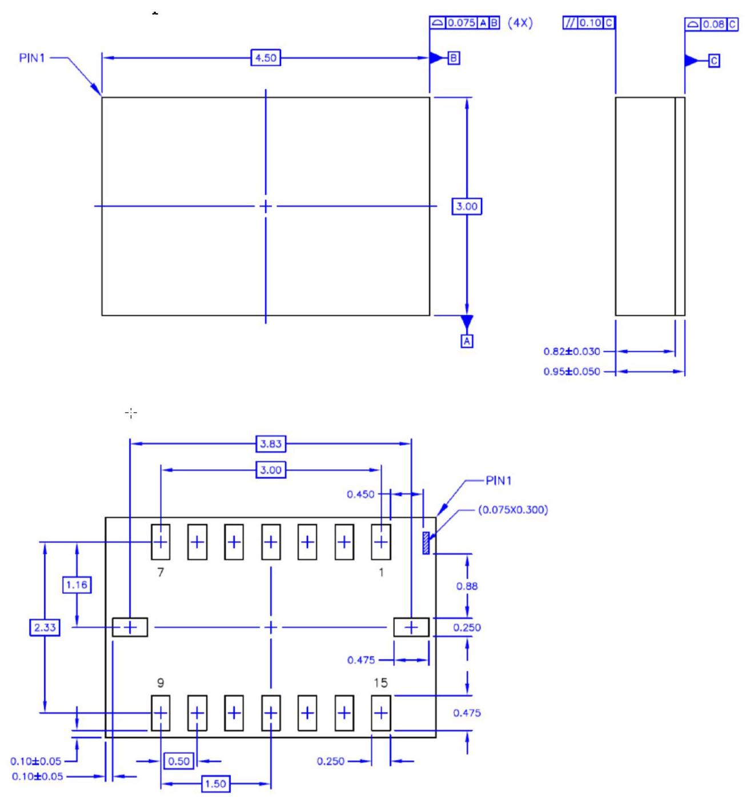

## BMI088

6-axis Motion Tracking for High-performance Applications

## BMI088: Data Sheet

Document revision 1.9 Document release date January 2024 Document number BST-BMI088-DS000-19 Technical reference code 0 273 141 365 Notes Data and descriptions in this document are subject to change without notice. Product photos and pictures are for illustration purposes only and may differ from the real product appearance

## Basic Description

BMI088 is an inertial measurement unit (IMU) for the detection of movements and rotations in 6 degrees of freedom (6DoF). It combines the functionality of two inertial sensors in one device: an advanced triaxial 16-bit gyroscope and a versatile, leading-edge triaxial 16-bit accelerometer.

BMI088 is designed to meet all requirements for high performance consumer applications in harsh vibration environments such as those encountered in drones and robotics applications. The IMU is designed to effectively suppress vibrations above a few hundred Hz that could occasionally occur due to resonances on the pcb or the structure of the total system.

The sensor has an extended measurement range of up to $\pm  {24g}$ to avoid signal clipping under strong signal exposure.

An evaluation circuitry (ASIC) converts the output of the micro-electro-mechanical sensing structures (MEMS), which are developed, produced and tested in BOSCH facilities. The corresponding chip-sets are packed into one single LGA ${3.0}\mathrm{\;{mm}} \times  {4.5}\mathrm{\;{mm}} \times  {0.95}\mathrm{\;{mm}}$ housing. For optimum system integration, BMI088 is fitted with digital interfaces (SPI or I2C), offering a wide VDDIO voltage range from 1.2V to 3.6V. To provide maximum performance and reliability, each device is tested and is ready-to-use calibrated.

To increase flexibility, both gyroscope and accelerometer can not only be operated individually, but tied together for data synchronization purposes. The on-chip features comprise FIFOs for acceleration and gyroscope data and interrupt controllers.

The BMI088 has an excellent temperature behavior with an outstanding low temperature coefficient of the offset (TCO) and temperature coefficient of the sensitivity (TCS). Index of Contents Basic Description 2

1. Specification 7

1.1 Electrical Specifications .7

1.1.1 Electrical Specifications: Accelerometer/Gyroscope 8.8

1.2 Accelerometer Specifications .9

1.3 Gyroscope Specifications .10

1.4 Temperature Sensor Specifications 11

1.5 Absolute Maximum Ratings .12

2. Block Diagram 13

3. Quick Start Guide - Device Initialization 13

4. Functional Description 14

4.1 Power Management and Power Modes .14

4.1.1 Power Modes: Accelerometer 14

4.1.2 Power Modes: Gyroscope 15

4.2 Sensor Data .15

4.3 Sensor Time .16

4.4 Output Data Rate (ODR) and Low-pass Filter. .16

4.4.1 Accelerometer. 16

4.4.2 Gyroscope 16

4.5 Range Settings .16

4.6 Self-test. .16

4.6.1 Accelerometer. 17

4.6.2 Gyroscope 17

4.7 New Data Interrupt .18

4.7.1 Accelerometer. 18

4.7.2 Gyroscope 18

4.8 Soft-Reset. .18 4.8.1 Soft-Reset Accelerometer 18 4.9 FIFO .19

4.9.1 FIFO operating modes 19

4.9.2 FIFO interrupts 19

4.9.3 Accelerometer sensor FIFO buffer 19

4.9.4 Gyroscope sensor FIFO buffer 22

24

5.1 Communication with the sensor .24

5.2 Register Map: Accelerometer 25

5.3 Register Description: Accelerometer .26

5.3.1 Register 0x00: ACC_CHIP_ID 26

5.3.2 Register 0x02: ACC_ERR_REG. 26

5.3.3 Register 0x03: ACC_STATUS 26

5.3.4 Register 0x12 - 0x17: ACC data 27

5.3.5 Register 0x18 - 0x1A: Sensortime data 27

5.3.6 Register 0x1D: ACC_INT_STAT_1 27

5.3.7 Register 0x22 - 0x23: Temperature sensor data 28

5.3.8 Register 0x24-0x25: FIFO_LENGTH. 28

5.3.9 Register 0x26: FIFO_DATA 28

5.3.10 Register 0x40: ACC_CONF 29

5.3.11 Register 0x41: ACC_RANGE 30

5.3.12 Register 0x45: FIFO_DOWNS 30

5.3.13 Register 0x46 - 0x47: FIFO_WTM 30

5.3.14 Register 0x48: FIFO_CONFIG_0 31

5.3.15 Register 0x49: FIFO_CONFIG_1 31

5.3.16 Register 0x53: INT1_IO_CONF. 32

5.3.17 Register 0x54: INT2_IO_CONF 33

5.3.18 Register 0x58: INT1_INT2_MAP_DATA 33

5.3.19 Register 0x6D: ACC_SELF_TEST 34

5.3.20 Register 0x7C: ACC_PWR_CONF 34

5. Register Maps 5.3.21 Register 0x7D: ACC_PWR_CTRL 34 5.3.22 Register 0x7E: ACC_SOFTRESET 35 5.4 Register Map: Gyroscope .36

5.5 Register Description: Gyroscope .37

5.5.1 Register 0x00: GYRO_CHIP_ID 37

5.5.2 Register $0\mathrm{x}{02} - 0\mathrm{x}{07}$ : Rate data 37

5.5.3 Register 0x0A: GYRO_INT_STAT_1 38

5.5.4 Register 0x0E: FIFO_STATUS 38

5.5.5 Register 0x0F: GYRO_RANGE 39

5.5.6 Register 0x10: GYRO_BANDWIDTH 39

5.5.7 Register 0x11: GYRO_LPM1 40

5.5.8 Register 0x14: GYRO_SOFTRESET 40

5.5.9 Register 0x15: GYRO_INT_CTRL 40

5.5.10 Register 0x16: INT3_INT4_IO_CONF 41

5.5.11 Register 0x18: INT3_INT4_IO_MAP 41

5.5.12 Register 0x1E: FIFO_WM_ENABLE 42

5.5.13 Register 0x34: FIFO_EXT_INT_S 42

5.5.14 Register 0x3C: GYRO_SELF_TEST 42

5.5.15 Register 0x3D: FIFO_CONFIG_0 43

5.5.16 Register 0x3E: FIFO_CONFIG_1 43

5.5.17 Register 0x3F: FIFO_DATA 43

6. Digital Interface 44

6.1 Serial Peripheral Interface (SPI) .45

6.1.1 SPI interface of gyroscope part 47

6.1.2 SPI interface of accelerometer part 48

6.2 Inter-Integrated Circuit ( ${\mathrm{I}}^{2}\mathrm{C}$ ). .48

7. Pin-out and Connection Diagram 52

7.1 Pin-out .52

7.2 Connection diagram SPI. .53

7.3 Connection diagram ${\mathrm{I}}^{2}\mathrm{C}$ .53

8. Package 54

8.1 Outline Dimensions .54

8.2 Landing pattern .55

8.3 Sensing axes orientation .56

8.4 Marking 57

8.4.1 Mass production samples 57

8.4.2 Engineering samples 57

8.5 PCB layout and soldering guidelines .57

8.6 Handling instructions .58

8.7 Tape and Reel specification .58

8.7.1 Orientation within the reel 59

8.8 Environmental safety .59

8.8.1 Halogen content 59

9. Legal Disclaimer 60

9.1 Engineering samples .60

9.2 Product use .60

9.3 Application examples and hints .60

10. Document History and Modification 161

<table><tr><td>7 | 62</td><td/><td/></tr><tr><td/><td>Bosch Sensortec | BMI088 Data sheet</td><td/></tr></table>

## 1. Specification

If not stated otherwise, the given values are over lifetime and full performance temperature and voltage ranges, minimum/maximum values are $\pm  {3\sigma }$ .

### 1.1 Electrical Specifications

Table 1: Electrical parameter specification

<table><tr><td>Parameter</td><td>Symbol</td><td>Condition</td><td>Min</td><td>Max</td><td>Unit</td></tr><tr><td>Supply Voltage Internal Domains</td><td>VDD</td><td/><td>2.4</td><td>3.6</td><td>V</td></tr><tr><td>Supply Voltage I/O Domain</td><td>VDDIO</td><td/><td>1.2</td><td>3.6</td><td>V</td></tr><tr><td>Voltage Input Low Level</td><td>${V}_{{1L}, a}$</td><td>SPI & I°C</td><td/><td>0.3VDDIO</td><td>-</td></tr><tr><td>Voltage Input High Level</td><td>${V}_{{IH}, a}$</td><td>SPI & I°C</td><td>0.7VDDIO</td><td/><td>-</td></tr><tr><td>Voltage Output Low Level</td><td>Vol.a</td><td>lol $<  = 2\mathrm{{mA}},\mathrm{{SPI}}$</td><td/><td>0.23VDDIO</td><td>-</td></tr><tr><td>Voltage Output High Level</td><td>VoH</td><td>lon $<  = 2\mathrm{{mA}}$ , SPI</td><td>0.8VDDIO</td><td/><td>-</td></tr><tr><td>Operating Temperature</td><td>Ta</td><td/><td>-40</td><td>+85</td><td>℃</td></tr></table>

8 | 62

#### 1.1.1 Electrical Specifications: Accelerometer/Gyroscope

Table 2: Electrical parameter specification accelerometer

<table><tr><td>Parameter</td><td>Symbol</td><td>Condition</td><td>Min</td><td>Typ</td><td>Max</td><td>Units</td></tr><tr><td>Total Supply Current in Normal mode</td><td>IDD</td><td>$\mathrm{{VDD}} = \mathrm{{VDDIO}} = {3.0}\mathrm{V},$ 25°C, gFS4g</td><td/><td>150</td><td/><td>μA</td></tr><tr><td>Total Supply Current in Suspend Mode</td><td>IDDsum</td><td>VDD = VDDIO = 3.0V, ${25}^{ \circ  }\mathrm{C}$</td><td/><td>3</td><td/><td>μA</td></tr><tr><td>Power-up time</td><td>ts_up</td><td>Time to first valid sample from suspend mode</td><td/><td/><td>1</td><td>ms</td></tr></table>

Table 3: Electrical parameter specification gyroscope

<table><tr><td>Parameter</td><td>Symbol</td><td>Condition</td><td>Min</td><td>Typ</td><td>Max</td><td>Unit</td></tr><tr><td>Supply Current in Normal Mode</td><td>IDD</td><td>$\mathrm{{VDD}} = \mathrm{{VDDIO}} = {3.0}\mathrm{V},$ 25℃, ODR =1kHz</td><td/><td>5</td><td/><td>mA</td></tr><tr><td>Supply Current in Suspend Mode</td><td>IDDsum</td><td>VDD = VDDIO = 3.0V, ${25}^{ \circ  }\mathrm{C}$</td><td/><td>25</td><td/><td>μA</td></tr><tr><td>Supply Current in Deep Suspend Mode</td><td>IDDdsum</td><td>$\mathrm{{VDD}} = \mathrm{{VDDIO}} = {3.0}\mathrm{V},$ ${25}^{ \circ  }\mathrm{C}$</td><td/><td><5</td><td/><td>μA</td></tr><tr><td>Start-up time</td><td>tsu</td><td>to ±1% of final value; from power-off</td><td/><td>30</td><td/><td>ms</td></tr><tr><td>Wake-up time</td><td>twusm</td><td>From suspend- and deep suspend-modes</td><td/><td>30</td><td/><td>ms</td></tr><tr><td>Wake-up time</td><td>twufpm</td><td>From fast power-up mode</td><td/><td>10</td><td/><td>ms</td></tr></table>

9 | 62

### 1.2 Accelerometer Specifications

Table 4: Accelerometer specifications

<table><tr><td>Parameter</td><td>Symbol</td><td>Condition</td><td>Min</td><td>Typ</td><td>Max</td><td>Units</td></tr><tr><td rowspan="4">Acceleration Range</td><td>grszg</td><td rowspan="4">Selectable via serial digital interface</td><td/><td>$\pm  3$</td><td/><td>g</td></tr><tr><td>grsg</td><td/><td>$\pm  6$</td><td/><td>g</td></tr><tr><td>gFS12g</td><td/><td>$\pm  {12}$</td><td/><td>g</td></tr><tr><td>gFs24g</td><td/><td>$\pm  {24}$</td><td/><td>$g$</td></tr><tr><td rowspan="4">Sensitivity</td><td>${\mathrm{S}}_{3\mathrm{g}}$</td><td>gFS3g, ${\mathrm{T}}_{\mathrm{A}} = {25}^{ \circ  }\mathrm{C}$</td><td/><td>10920</td><td/><td>LSB/g</td></tr><tr><td>S6g</td><td>gFS6g, ${\mathrm{T}}_{\mathrm{A}} = {25}^{ \circ  }\mathrm{C}$</td><td/><td>5460</td><td/><td>LSB/g</td></tr><tr><td>S12g</td><td>gFS12g, Ta=25℃</td><td/><td>2730</td><td/><td>LSB/g</td></tr><tr><td>${\mathrm{S}}_{{24}\mathrm{g}}$</td><td>gFS24g, ${\mathrm{T}}_{\mathrm{A}} = {25}^{ \circ  }\mathrm{C}$</td><td/><td>1365</td><td/><td>LSB/g</td></tr><tr><td>Sensitivity Temperature Drift</td><td>TCS</td><td/><td/><td>0.002</td><td/><td>%/K</td></tr><tr><td>Zero-g Offset</td><td>Off</td><td>Nominal VDD and VDDIO, 25°C, gFS6g</td><td/><td>20</td><td/><td>mg</td></tr><tr><td>Zero-g Offset Temperature Drift</td><td>TCO</td><td/><td/><td><0.2</td><td/><td>mg/K</td></tr><tr><td>Output Data Rate</td><td>ODR</td><td/><td>12.5</td><td/><td>1600</td><td>Hz</td></tr><tr><td>Bandwidth range</td><td>BW</td><td>3dB cut-off frequency of the accelerometer depends on ODR and OSR</td><td>5</td><td/><td>280 (245 for Z axis)</td><td>Hz</td></tr><tr><td>Nonlinearity</td><td>NL</td><td>best fit straight line, gFS3g</td><td/><td>0.5</td><td/><td>%FS</td></tr><tr><td>Output Noise Density</td><td>Nrms</td><td>gFS3g, ${\mathrm{T}}_{\mathrm{A}} = {25}^{ \circ  }\mathrm{C}$ Nominal VDD supplies Normal mode</td><td/><td>190 (Z-axis) 160 $(x - {8y} -$ axis)</td><td/><td>${\mu g}/\sqrt{\mathrm{{Hz}}}$</td></tr><tr><td>Cross Axis Sensitivity</td><td>S</td><td>relative contribution between any two of the three axes</td><td/><td>0.5</td><td/><td>%</td></tr><tr><td>Alignment Error</td><td>Ea</td><td>relative to package outline</td><td/><td>0.5</td><td/><td>0</td></tr></table>

### 1.3 Gyroscope Specifications

Table 5: Gyroscope specifications

<table><tr><td>Parameter</td><td>Symbol</td><td>Condition</td><td>Min</td><td>Typ</td><td>Max</td><td>Unit</td></tr><tr><td rowspan="5">Range</td><td>Res125</td><td rowspan="5">Selectable via serial digital interface</td><td/><td>125</td><td/><td>'/s</td></tr><tr><td>Res250</td><td/><td>250</td><td/><td>%</td></tr><tr><td>Res500</td><td/><td>500</td><td/><td>9/s</td></tr><tr><td>Res1000</td><td/><td>1000</td><td/><td>9/s</td></tr><tr><td>Res2000</td><td/><td>2000</td><td/><td>9/s</td></tr><tr><td rowspan="5">Sensitivity</td><td/><td>Ta=25°C, Rfs125</td><td/><td>262.144</td><td/><td>LSB/%</td></tr><tr><td/><td>Ta=25°C, Rfs250</td><td/><td>131.072</td><td/><td>LSB/%</td></tr><tr><td/><td>Ta=25°C, RFS500</td><td/><td>65.536</td><td/><td>LSB/%</td></tr><tr><td/><td>Ta=25°C, Rfs1000</td><td/><td>32.768</td><td/><td>LSB/%</td></tr><tr><td/><td>Ta=25°C, Rfs2000</td><td/><td>16.384</td><td/><td>LSB/%</td></tr><tr><td>Sensitivity tolerance</td><td/><td>Ta=25°C, Rfs2000</td><td/><td>$\pm  1$</td><td/><td>%</td></tr><tr><td>Sensitivity Change over Temperature</td><td>TCS</td><td>Nominal VDD supplies $- {40}^{ \circ  }\mathrm{C} \leq  {\mathrm{T}}_{ \circ  } \leq   + {85}^{ \circ  }\mathrm{C}$ Res2000</td><td/><td>$\pm  {0.03}$</td><td/><td>%/K</td></tr><tr><td>Sensitivity Supply Volt. Drift</td><td>Svod</td><td>${\mathrm{T}}_{\mathrm{A}} = {25}^{ \circ  }\mathrm{C},$ ${\mathrm{{VDD}}}_{\mathrm{{min}}} \leq  \mathrm{{VDD}} \leq  {\mathrm{{VDD}}}_{\mathrm{{max}}}$</td><td/><td><0.4</td><td/><td>%/V</td></tr><tr><td>Nonlinearity</td><td>NL</td><td>best fit straight line ${\mathrm{R}}_{\mathrm{{FS1000}}},{\mathrm{R}}_{\mathrm{{FS2000}}}$</td><td/><td>$\pm  {0.05}$</td><td/><td>%FS</td></tr><tr><td>g-Sensitivity</td><td/><td>Sensitivity to acceleration stimuli in all three axis (frequency <20kHz)</td><td/><td/><td>0.1</td><td>°/s/g</td></tr><tr><td>Zero-rate Offset</td><td>Off ${\Omega }_{x}{\Omega }_{y}$ and ${\Omega }_{z}$</td><td>Nominal VDD supplies T =25°C, slow and fast offset cancellation off</td><td/><td>$\pm  1$</td><td/><td>%</td></tr><tr><td>Zero-rate Offset Change over Temperature</td><td>TCO</td><td>Nominal VDD supplies $- {40}^{\mathrm{o}}\mathrm{C} \leq  {\mathrm{T}}_{{}_{\mathrm{\Lambda }}} \leq   + {85}^{\mathrm{o}}\mathrm{C}$ Res2000</td><td/><td>$\pm  {0.015}$</td><td/><td>% per K</td></tr><tr><td>Zero-rate Offset Supply Volt. Drift</td><td>Offs2 vod</td><td>${\mathrm{T}}_{\mathrm{A}} = {25}^{ \circ  }\mathrm{C}$ ${\mathrm{{VDD}}}_{\mathrm{{min}}} \leq  \mathrm{{VDD}} \leq  {\mathrm{{VDD}}}_{\mathrm{{max}}}$</td><td/><td><0.1</td><td/><td>'/s/V</td></tr><tr><td>Output Noise</td><td>n</td><td>rms, BW=47Hz (@ 0.014%/s/√Hz)</td><td/><td>0.1</td><td/><td>9/s</td></tr></table>

11 | 62

<table><tr><td rowspan="8">Bandwidth BW</td><td rowspan="8">f. $3\mathrm{\;{dB}}$</td><td/><td/><td>523</td><td/><td rowspan="8">Hz</td></tr><tr><td/><td/><td>230</td><td/></tr><tr><td/><td/><td>116</td><td/></tr><tr><td/><td/><td>64</td><td/></tr><tr><td/><td/><td>47</td><td/></tr><tr><td/><td/><td>32</td><td/></tr><tr><td/><td/><td>23</td><td/></tr><tr><td/><td/><td>12</td><td/></tr><tr><td rowspan="5">Data rate (set of x, y, z rate)</td><td rowspan="5"/><td/><td/><td>2000</td><td rowspan="5"/><td rowspan="5">Hz</td></tr><tr><td/><td/><td>1000</td></tr><tr><td/><td/><td>400</td></tr><tr><td/><td/><td>200</td></tr><tr><td/><td/><td>100</td></tr><tr><td>Data rate tolerance (set of x, y, z rate)</td><td/><td/><td/><td>$\pm  {0.3}$</td><td/><td>%</td></tr><tr><td>Cross Axis Sensitivity</td><td/><td>Sensitivity to stimuli in non-sense-direction</td><td/><td>$\pm  1$</td><td/><td>%</td></tr></table>

### 1.4 Temperature Sensor Specifications

Table 6: Temperature sensor specifications

<table><tr><td>Parameter</td><td>Symbol</td><td>Condition</td><td>Min</td><td>Typ</td><td>Max</td><td>Units</td></tr><tr><td>Temperature Sensor Measurement Range</td><td>Ts</td><td/><td>-104</td><td/><td>150</td><td>℃</td></tr><tr><td>Temperature Sensor Slope</td><td>dTs</td><td/><td/><td>0.125</td><td/><td>K/LSB</td></tr><tr><td>Temperature Sensor Offset error</td><td>OTs</td><td>at 25℃</td><td/><td>$\pm  1$</td><td/><td>K</td></tr></table>

12 | 62

### 1.5 Absolute Maximum Ratings

Table 7: Absolute maximum ratings

<table><tr><td>Parameter</td><td>Condition</td><td>Min</td><td>Max</td><td>Units</td></tr><tr><td rowspan="2">Voltage at Supply Pin</td><td>VDD Pin</td><td>-0.3</td><td>4</td><td>V</td></tr><tr><td>VDDIO Pin</td><td>-0.3</td><td>4</td><td>V</td></tr><tr><td>Voltage at any Logic Pin</td><td>Non-Supply Pin</td><td>-0.3</td><td>VDDIO+0.3</td><td>V</td></tr><tr><td>Passive Storage Temp. Range</td><td>≤ 65% rel. H.</td><td>-50</td><td>+150</td><td>℃</td></tr><tr><td rowspan="3">Mechanical Shock</td><td>$\mathrm{{Duration}} \leq  {200}\mathrm{{\mu s}}$</td><td/><td>10,000</td><td>g</td></tr><tr><td>Duration ≤ 1.0ms</td><td/><td>2,000</td><td>g</td></tr><tr><td>Free fall onto hard surfaces</td><td/><td>1.8</td><td>m</td></tr><tr><td rowspan="3">ESD</td><td>HBM, at any Pin</td><td/><td>2</td><td>kV</td></tr><tr><td>CDM</td><td/><td>500</td><td>V</td></tr><tr><td>MM</td><td/><td>200</td><td>V</td></tr></table>

Note: Stress above these limits may cause damage to the device. Exceeding the specified electrical limits may affect the device reliability or cause malfunction.

## 2. Block Diagram

Figure 1 shows the basic building blocks of the BMI088:

Figure 1: Block diagram of BMI088

## 3. Quick Start Guide - Device Initialization

For a proper device initialization, the following steps should be considered:

- The user must decide on the interface (I2C or SPI) already during HW design: with the PS pin the user determines which interface the sensor should listen to (see chapter 6).

- The gyroscope part of the BMI088 initializes its I/O pins according to the selection given by the PS pin.

- The accelerometer part starts in I2C mode. It will stay in I2C mode until it detects a rising edge on the CSB1 pin (chip select of the accelerometer), on which the accelerometer part switches to SPI mode and stays in this mode until the next power-up-reset.

- To change the accelerometer to SPI mode in the initialization phase, the user could perform a dummy SPI read operation, e.g. of register ACC_CHIP_ID (the obtained value will be invalid).

After the POR the gyroscope is in normal mode, while the accelerometer is in suspend mode. To switch the accelerometer into normal mode, the user must perform the following steps:

a. Power up the sensor

b. Wait 1 ms

c. Enter normal mode by writing ‘4’ to ACC_PWR_CTRL

d. Wait for 450 microseconds

## 4. Functional Description

### 4.1 Power Management and Power Modes

The BMI088 has two distinct power supply pins:

- VDD is the main power supply for the internal blocks

- VDDIO is a separate power supply pin mainly used for the supply of the interface

There are no limitations on the voltage levels of both pins relative to each other, as long as each of them lies within its operating range. Furthermore, the device can be completely switched off (VDD = 0V) while keeping the VDDIO supply on (VDDIO > 0V) or vice versa.

When the VDDIO supply is switched off, all interface pins (CSB, SDI, SCK, PS) must be kept close to GND10 potential.

The device contains a power-on reset (POR) generator. It resets the logic part and the register values after powering-on VDD and VDDIO. This means that all application specific settings which are not equal to the default settings (refer to 6.2 register map accelerometer and to 8.2 register map gyroscope), must be changed back to their designated values after POR.

Please note: the POR resets also the interface. For the gyroscope part, the interface is defined by the voltage level on the PS pin. The interface of the accelerometer part is defined by the voltage level of the CSB1 pin at the moment when the POR is initiated (see chapter 3).

#### 4.1.1 Power Modes: Accelerometer

The power state of the BMI088 accelerometer is controlled through the register ACC_PWR_CTRL. The register ACC_PWR_CTRL enables and disables the accelerometer and the temperature sensor.

To enter normal mode, the value 0x04 must be written to ACC_PWR_CTRL.

To enter suspend mode, register ACC_PWR_CTRL must be cleared.

Note: The sensor is in suspend mode after reset (POR or soft-reset), thus the user actively needs to enter normal mode in order to obtain acceleration values.

Note: After POR or soft-reset, the acceleration sensor needs up to $1\mathrm{{ms}}$ boot time $\left( {\mathrm{{ts}}}_{-\mathrm{{up}}}\right)$

#### 4.1.2 Power Modes: Gyroscope

The gyroscope has 3 different power modes. Besides normal mode, which represents the fully operational state of the device, there are 2 energy saving modes: suspend mode and deep-suspend mode.

After power-up gyro is in normal mode so that all parts of the device are held powered-up and data acquisition is performed continuously.

In suspend mode the whole analog part is powered down. No data acquisition is performed. While in suspend mode the latest rate data and the content of all configuration registers are kept. The registers can still be read (though they are not updated).

Suspend mode is entered by writing 0x80 to the register GYRO_LPM1. It can be left by writing 0x00 to GYRO_LPM1 or by a soft reset (see 4.8).

Although write access to registers is supported at the full interface clock speed (SCL or SCK), a waiting period must be inserted between two consecutive write cycles (please refer also to section 9.2.1).

In deep suspend mode the device reaches the lowest possible power consumption. Only the interface section is kept alive. No data acquisition is performed and the content of the configuration registers is lost.

Deep suspend mode is entered by writing 0x20 to the register GYRO_LPM1. It can be left by writing 0x00 to GYRO_LPM1 or by a soft reset (see 4.8).

Please note, that all application specific settings, which are not equal to the default settings, must be reset to its designated values after leaving deep-suspend mode.

Note: after POR or soft-reset, or when switching between the different power modes, the gyroscope sensor needs up to ${30}\mathrm{\;{ms}}$ time to reach the new state. Any communication with the sensor during this time should be avoided.

### 4.2 Sensor Data

The width of the gyroscope and accelerometer sensor data is 16 bits (11 bits for the temperature sensor) given in two's complement representation.

The bits for each axis are split into an MSB upper part and an LSB lower part. Reading the sensor data registers shall always start with the LSB part. In order to ensure the integrity of the sensor data, the content of an MSB register is locked by reading the corresponding LSB register (shadowing procedure).

For details regarding the registers and the interpretation of the data found in these registers see:

- chapter 5.5.2 for the gyroscope part

- chapter 5.3.4 or the accelerometer part

- chapter 5.3.7 for the temperature sensor

The burst-access mechanism provides an efficient way to read out the angular rate data in ${\mathrm{I}}^{2}\mathrm{C}$ or SPI mode. During a burst-access, the sensor automatically increments the starting read address after each byte. The burst-access allows data to be transferred over the ${\mathrm{I}}^{2}\mathrm{C}$ bus with an up to ${50}\%$ reduced data density. The sensor data (angular rate or acceleration data) in all read-out registers is locked as long as the burst read access is active. Reading the sensor data registers of each gyroscope and accelerometer part in burst read access mode ensures that the sensor values in all readout registers belong to the same sample.

### 4.3 Sensor Time

The accelerometer part of BMI088 has a built-in counter with a width of 24 bits. It increments periodically with a resolution of ${39.0625\mu }\mathrm{s}$ . Details can be found in chapter 5.3.5.

### 4.4 Output Data Rate (ODR) and Low-pass Filter

The sensor signals from the acceleration sensor and gyroscope analog front-end are each routed through a low-pass filter.

#### 4.4.1 Accelerometer

The 3db cut-off frequency of the digital low-pass filter depends on the chosen ODR as well as on the over-sampling-ratio (OSR). Both can be configured in register ACC_CONF. The following table lists the possible options:

Table 8: $3\mathrm{\;{dB}}$ cutoff frequency of the accelerometer according to ODR and OSR settings in ACC_CONF register

<table><tr><td>Accelerometer ODR [Hz]</td><td>Normal (acc bwp = 0xA)</td><td>OSR2 (acc bwp = 0x9)</td><td>OSR4 (acc_bwp = 0x8)</td></tr><tr><td>12.5</td><td>5 Hz</td><td>2 Hz</td><td>1 Hz</td></tr><tr><td>25</td><td>10 Hz</td><td>5 Hz</td><td>3 Hz</td></tr><tr><td>50</td><td>20 Hz</td><td>9 Hz</td><td>5 Hz</td></tr><tr><td>100</td><td>40 Hz</td><td>19 Hz</td><td>10 Hz</td></tr><tr><td>200</td><td>80 Hz</td><td>38 Hz</td><td>20 Hz</td></tr><tr><td>400</td><td>145 Hz</td><td>75 Hz</td><td>40 Hz</td></tr><tr><td>800</td><td>230 Hz (200 Hz for z channel)</td><td>140 Hz</td><td>80 Hz</td></tr><tr><td>1600</td><td>280 Hz (245 Hz for z channel)</td><td>234 Hz (215 Hz for z channel)</td><td>145 Hz</td></tr></table>

#### 4.4.2 Gyroscope

The user can choose between 8 different ODR and low pass filter bandwidth settings (see section 5.5.6).

### 4.5 Range Settings

The measurement range can be set through the registers described in section 5.3.11 for the accelerometer and in section 5.5.5 for the gyroscope.

### 4.6 Self-test

The BMI088 incorporates a self-test feature for both the accelerometer and the gyroscope, indicating whether the sensor is still ok.

#### 4.6.1 Accelerometer

The self-test feature allows for checking the sensor functionality by applying electrostatic forces to the sensor core instead of external accelerations. By physically deflecting the seismic mass, the entire signal path of the sensor is tested. Activation of the self-test results in a static offset in the acceleration data. Any external acceleration or gravitational force, which is applied to the sensor during a self-test, will be observed in the sensor output as a superposition of the acceleration and the self-test signal. This means that the self-test signal depends on the orientation of the sensor. To overcome this, the full self-test procedure should be performed under static circumstances, e.g. when the part is not excited to any acceleration except gravity.

The recommended self-test procedure is as follows:

1) Set $\pm  {24g}$ range by writing 0x03 to register ACC_RANGE (0x41)

2) Set ODR=1.6kHz, continuous sampling mode, "normal mode" (norm_avg4) by writing 0xA7 to register ACC_CONF (0x40)

- Continuous filter function: set bit7 in ACC_CONF

- "normal avg4 mode": ACC_CONF |= 0x02<<4

- ODR=1.6kHz: ACC_CONF |= 0x0C

3) Wait for $> 2\mathrm{\;{ms}}$

4) Enable the positive self-test polarity (i.e. write 0x0D to register ACC_SELF_TEST (0x6D))

5) Wait for $> {50}\mathrm{\;{ms}}$

6) Read the accelerometer offset values for each axis (positive self-test response)

7) Enable the negative self-test polarity (i.e. write 0x09 to register ACC_SELF_TEST (0x6D))

8) Wait for $> {50}\mathrm{\;{ms}}$

9) Read the accelerometer offset values for each axis (negative self-test response)

10) Disable the self-test (i.e. write 0x00 to register ACC_SELF_TEST (0x6D))

11) Calculate difference of positive and negative self-test response and compare with the expected values (see table below)

12) Wait for $> {50}\mathrm{\;{ms}}$ to let the sensor settle to normal mode steady state operation

Table 9: Accelerometer self-test: resulting minimum difference signal between positive and negative self-test signal

<table><tr><td>x-axis signal</td><td>y-axis signal</td><td>z-axis signal</td></tr><tr><td>≥1000 mg</td><td>≥1000 mg</td><td>≥500 mg</td></tr></table>

It is recommended to perform a reset of the device after a self-test has been performed, since the self-test response also affects the interrupt generation. If the reset cannot be performed, the following sequence must be kept to prevent unwanted interrupt generation: disable interrupts, change parameters of interrupts, wait for at least ${50}\mathrm{\;{ms}}$ , and enable desired interrupts.

#### 4.6.2 Gyroscope

A built-in self-test facility of the gyro does not deflect the mechanical MEMS structure (as the accelerometer self-test does), but this test also provides a quick way to determine if the gyroscope is operational within the specified conditions.

To trigger the self-test, bit #0 ('bite_trig') in address GYRO_SELF_TEST must be set. When the test is finished, bit #1 ('bist_rdy') will be set by the gyro and the test result can then be found in bit #2 ('bist_fail'). A '0' indicates that the test was passed without issues. If a failure occurred, the bit 'bist_fail' will be set to ‘1’.

A further test which is running continuously in the background can be checked by reading bit #4 in address GYRO_SELF_TEST. Proper sensor function is indicated if the bit is set to ‘1’.

### 4.7 New Data Interrupt

Both accelerometer and gyroscope part offer a new data ready interrupt, which fires whenever a new data sample set is complete and made available in the corresponding sensor data registers. This allows a low latency data readout.

#### 4.7.1 Accelerometer

The new data interrupt flag can be found in the register ACC_INT_STAT_1 (bit #7). It is set whenever new data is available in the data registers and cleared automatically.

The interrupt can be mapped to the interrupt pins INT1 and/or INT2 in register INT1_INT2_MAP_DATA.

Both interrupt pins INT1 and INT2 can be configured regarding their electrical behavior (see INT1_IO_CONF and INT2_IO_CONF).

#### 4.7.2 Gyroscope

The gyroscope provides a new data interrupt, which will generate an interrupt every time after storing a new value of z-axis angular rate data in the data register. The interrupt is cleared automatically after 280-400 µs.

In contrast to the accelerometer part, for the gyro the new data interrupt must be explicitly enabled by writing 0x80 to the register GYRO_INT_CTRL.

The interrupt can be mapped to the interrupt pins INT3 and/or INT4 in register INT3_INT4_IO_MAP.

Both interrupt pins INT3 and INT4 can be configured regarding their electrical behavior (see INT3_INT4_IO_CONF).

### 4.8 Soft-Reset

A soft-reset can be initiated at any time

- for the accelerometer part by writing the command soft-reset(0xB6)to register ACC_SOFTRESET (see 5.3.22)

- for the gyroscope part by writing the command soft-reset (OxB6) to register GYRO_SOFTRESET (see 5.5.8)

The soft-reset performs a fundamental reset to the device, which is largely equivalent to a power cycle. Following a delay, all user configuration settings are overwritten with their default state (setting stored in the NVM) wherever applicable. This command is functional in all operation modes but must not be performed while NVM writing operation is in progress.

#### 4.8.1 Soft-Reset Accelerometer

## Soft reset timing:

In I2C mode, the rising edge of the SCL line for the ACK bit of the soft reset transfer determines the reception of soft reset. The execution of the soft rest is delayed by ${0.5} - 1$ us if the sensor is not in advanced power save mode i.e. PWR_CONF.adv_power_save=0b0.

The execution of the soft reset causes that the SDA line to be released immediately by the device, independent of the state of the SCL line. If the host requires an explicit I2C ACK for the soft reset (i.e. SDA line remains low while the SCL line is high) the host must put the sensor in advance power save mode (PWR_CONF.adv_power_save=0b1), disable the sensor (PWR_CTRL.acc_en=0b0) and the auxillary interface (PWR_CTRL.aux_en=0b0) before issuing a soft reset.

### 4.9 FIFO

BMI088 offers two integrated FIFO (First In, First Out) buffers for accelerometer and gyroscope sensor signals, helping the user to reduce or even omit time critical read access to the sensor in order to obtain data with a high timing precision.

#### 4.9.1 FIFO operating modes

The FIFO can be operated in different modes: FIFO (or stop-at-full) mode and STREAM mode.

- FIFO or stop-at-full mode: In FIFO or stop-at-full mode, the sensor values are stored in the FIFO buffer subsequently until it is full.

- STREAM mode: The STREAM mode works like the FIFO mode with the difference that once the buffer is full, the oldest data in the FIFO will be overwritten with the newest data from the sensor.

#### 4.9.2 FIFO interrupts

The FIFO buffers support two different types of interrupts:

- Watermark interrupt: Triggered, when the fill level of the FIFO buffer reaches a user-defined level.

- FIFO-full interrupt: Triggered, when the FIFO is full.

#### 4.9.3 Accelerometer sensor FIFO buffer

The accelerometer part of BMI088 has an integrated 1024 byte data FIFO. The FIFO captures data from the data registers in frames, and each frame contains only one sample of a sensor.

##### 4.9.3.1 Enabling FIFO and selecting the mode

The FIFO for accelerometer sensor data is enabled by setting bit #6 in register 0x49 (see 5.3.15).

4.9.3.1.1 Mode selection

When STREAM mode is desired, then the bit #0 in register 0x48 has to be cleared (set to ‘0’) (default value on power up reset, see 5.3.14).

For FIFO or stop-at-full mode, bit #0 has to be set to ‘1’ in register 0x48.

###### 4.9.3.1.2 FIFO data sampling rate

The input data rate to the FIFO is the same as the configured ODR of the sensor. However, it can be reduced selecting a down-sampling factor of ${2}^{k}$ with $k = \left\lbrack  {0,1,\ldots 7}\right\rbrack$ . The factor $k$ must be written to bits #4-6 of register 0x45 (see 5.3.12).

###### 4.9.3.1.3 FIFO synchronization with external interrupts (tag application) for the accel

If the INT1 and/or INT2 pin is configured as input pin (by setting int2_io in register INT2_IO_CTRL and/or setting int1_io in register INT1_IO_CTRL), signals on these pins can also be recorded in the FIFO, and the frames are "tagged" accordingly. Therefore the pins need to be activated for FIFO recording in register FIFO_CONFIG_1 (see 5.3.15).

##### 4.9.3.2 Data format in FIFO

The FIFO captures data in frames. The first byte is a header byte, defining the type of frame. From this, the number of consecutive bytes and their content can be derived.

The header byte consists of the header signature (first 6 bits) and two bits indicating the status of the interrupt pins INT1 and INT2 if configured accordingly (see 4.9.3.1.3).

4.9.3.2.1 Acceleration sensor data frame

- Frame length: 7 bytes ( 1 byte header + 6 bytes payload)

- Header:

<table><tr><td>Bit</td><td>7</td><td>6</td><td>5</td><td>4</td><td>3</td><td>2</td><td>1</td><td>0</td></tr><tr><td/><td>1</td><td>0</td><td>0</td><td>0</td><td>0</td><td>1</td><td>[INT2 tag]</td><td>[INT1 tag]</td></tr></table>

- Payload: the next bytes contain the sensor data in the same order as defined in the register map (addresses 0x12 - 0x17). 4.9.3.2.2 Skip Frame

In the case of FIFO overflows, in both FIFO and STREAM mode, a skip_frame is prepended to the FIFO content, when read out next time. A skip frame does not consume memory in the FIFO.

- Frame length: 2 bytes (1 byte header + 1 byte payload)

- Header:

<table><tr><td>Bit</td><td>7</td><td>6</td><td>5</td><td>4</td><td>3</td><td>2</td><td>1</td><td>0</td></tr><tr><td/><td>0</td><td>1</td><td>0</td><td>0</td><td>0</td><td>0</td><td>reserved</td><td>reserved</td></tr></table>

- Payload: one byte containing the number of skipped frames. When more than 0xFF frames have been skipped, 0xFF is returned. 4.9.3.2.3 Sensortime Frame

A sensortime frame is only sent if the FIFO becomes empty during the burst read. A sensortime frame does not consume memory in the FIFO.

- Frame length: 4 bytes (1 byte header + 3 bytes payload)

- Header:

<table><tr><td>Bit</td><td>7</td><td>6</td><td>5</td><td>4</td><td>3</td><td>2</td><td>1</td><td>0</td></tr><tr><td/><td>0</td><td>1</td><td>0</td><td>0</td><td>0</td><td>1</td><td>reserved</td><td>reserved</td></tr></table>

- Payload: Sensortime (content of registers $0 \times  {18} - 0 \times  1\mathrm{\;A}$ ), taken when the last byte of the last frame is read.

###### 4.9.3.2.4 FIFO input config Frame

Whenever the filter configuration or the range of the accelerometer sensor is changed, a FIFO input config frame is inserted into the FIFO, before the configuration change becomes active. E.g. when the bandwidth for the accelerometer filter is changed in Register ACC_CONF, a FIFO input config frame is inserted before the first frame with accelerometer data with the new bandwidth configuration.

- Frame length: 2 bytes (1 byte header + 1 byte payload)

- Header:

<table><tr><td>Bit</td><td>7</td><td>6</td><td>5</td><td>4</td><td>3</td><td>2</td><td/><td>0</td></tr><tr><td/><td>0</td><td>1</td><td>0</td><td>0</td><td>1</td><td>0</td><td>reserved</td><td>reserved</td></tr></table>

- Payload: The FIFO input config frame contains one byte of data, of which the following bits have a meaning (the content of the other bits can safely be ignored):

- Bit #1: indicates that a configuration change through register ACC_RANGE becomes active (means for example that the range of the accelerometer was changed).

- Bit #0: indicates that a configuration change through the registers ACC_CONF or FIFO_DOWNS becomes active (means of example that the filter settings where changed or the FIFO sampling rate was modified).

###### 4.9.3.2.5 Sample drop Frame

After a reconfiguration, indicated by the fifo_Input_Config frame, the next sample may be dropped, until the sensor delivers valid data again. Instead, a drop frame is inserted at the ODR tick at which a sample was to be expected without reconfiguration.

- Frame length: 2 bytes (1 byte header + 1 byte payload)

- Header:

<table><tr><td>Bit</td><td>7</td><td>6</td><td>5</td><td>4</td><td>3</td><td>2</td><td/><td>0</td></tr><tr><td/><td>0</td><td>1</td><td>0</td><td>1</td><td>0</td><td>0</td><td>reserved</td><td>reserved</td></tr></table>

- Payload: The sample drop frame contains one byte of data, whose content can be ignored.

###### 4.9.3.2.6 FIFO partial frame reads and overreads

When a frame is only partially (uncompletely) read through the register FIFO_DATA it will be repeated completely with the next access. In the case of a FIFO overflow between the first partial read and the second read attempt, the frame may be deleted.

When more data is read from the FIFO than it contains valid data, 0x8000 is returned.

##### 4.9.3.3 FIFO Interrupts

The FIFO supports two interrupts, a FIFO full interrupt and a watermark interrupt:

- The FIFO full interrupt is issued when the FIFO fill level is above the full threshold. The full threshold is reached just before the last two frames are stored in the FIFO.

- The FIFO watermark is issued when the FIFO fill level is superior or equal to the watermark level defined in register FIFO_WTM (see 5.3.13).

In order to enable/use the FIFO full or watermark interrupts they need to be mapped on the desired interrupt pin via INT1_INT2_MAP_DATA (see 5.3.18).

Both interrupts are suppressed when a read operation on the register FIFO_DATA is ongoing. Latched FIFO interrupts will only get cleared, if the status register gets read and the fill level is below the corresponding FIFO interrupt (full or watermark).

##### 4.9.3.4 FIFO Reset

The user can trigger a FIFO reset by writing 0xB0 to ACC_SOFTRESET (register 0x7E).

#### 4.9.4 Gyroscope sensor FIFO buffer

The gyroscope part of BMI088 features an integrated FIFO memory capable of storing up to 100 frames of data in FIFO mode. Each frame consists of three 16-bit rate_x, y, z data words, and 16 bits of interrupt data sampled at the same point in time.

4.9.4.1 Enabling FIFO and selecting the mode

The FIFO for gyroscope sensor data is enabled by setting the appropriate FIFO mode in Register 0x3E: FIFO_CONFIG_1.

4.9.4.1.1 FIFO data sampling rate

The input data rate to the FIFO is the same as the configured ODR of the sensor.

4.9.4.1.2 FIFO sync with external interrupts (tag application) for the gyroscope

The FIFO of the gyroscope features a mode that allows the precise synchronization of external events with the gyroscope angular rate saved in the FIFO. This synchronization can be used for example for image and video stabilization applications.

Any of the gyroscope interrupt pins (INT3 or INT4) can be reconfigured to act as input pin, but not both. In addition, the tag mode has to be enabled. The so configured interrupt pin will then behave as an input pin and not as an interrupt pin. The working principle is shown in below figure:

Timing diagram for external FIFO synchronization. EFS-pin is the Interrupt pin configured to capture external events. FIFO $z\left( 0\right)$ is the least significant bit of the $z$ -axis gyro data stored in the FIFO.

In order to enable the tag mode, bit 5 must be set in register 0x34 (see 5.5.13). The pin can be chosen in the same register, bit 4 .

In this mode, the least significant bit of the z-axis is used as tag-bit, therefore losing its meaning as gyroscope data bit. The remaining 15 bits of the z-axis gyroscope data keep the same meaning as in standard mode.

Once the pin, which is configured for the tag mode, is set to high level, the next FIFO word will be marked with a tag (z-axis LSB = 1). While pin is kept at a high level, the corresponding FIFO words will continuously be tagged. After the pin is reset to low level, the immediate next FIFO word could still be tagged, and only after this word, the next tag will be reset (z-axis LSB=0). This is shown in the above diagram. The tag synchronizes external events with the same time precision as the FIFO update rate. Therefore update rate of the tag is determined by the output data rate.

4.9.4.2 FIFO Data Readout

The FIFO stores the data that are also available at the read-out registers 0x02-0x07. Thus, all configuration settings apply to the FIFO data as well as the data readout registers. The FIFO read out is possible through register 0x3F (FIFO_DATA). The readout can be performed using burst mode. A single burst can read out one or more frames at a time. If a frame is not read completely due to an incomplete read operation, the remaining part of the frame is lost. In this case the FIFO aligns to the next frame during the next read operation. The data format is described in 5.5.17.

###### 4.9.4.2.1 Interface speed requirements for Gyroscope FIFO use

In order to use the FIFO effectively, larger blocks of data need to be read out quickly. Depending on the output data rate of the sensor, this can impose requirements on the interface.

The output data rate of the gyroscope is determined by the filter configuration (see the data sheet of the sensor). What interface speed is required depends on the selected rate.

- For an ${\mathrm{I}}^{2}\mathrm{C}$ speed of ${400}\mathrm{{kHz}}$ , every filter mode can be used.

- For an ${1}^{2}\mathrm{C}$ speed of ${200}\mathrm{{kHz}}$ , only modes with an output data rate of $1\mathrm{{KHz}}$ and below are recommended.

- For an ${1}^{2}\mathrm{C}$ speed of ${100}\mathrm{{kHz}}$ , only modes with an output data rate of ${400}\mathrm{\;{Hz}}$ and below are recommended.

4.9.4.3 FIFO Frame Counter and Overrun Flag

The frame counter (address 0x0E bits<6:0>, see 5.5.4) indicates the current fill level of the buffer. If additional frames are written to the buffer although the FIFO is full, the overrun flag (register 0x0E bit 7) is set. If the FIFO is reset, the FIFO fill level indicated in the frame_counter<6:0> is set to ‘0’ and the overrun flag is reset each time a write operation happens to the FIFO configuration registers.

Note: the overrun bit is not reset when the FIFO fill level frame_counter<6:0> has decremented to '0' due to reading from the FIFO_DATA register, but only when a write operation is performed on FIFO configuration registers.

##### 4.9.4.4 FIFO Interrupts

The FIFO supports two interrupts, a FIFO full interrupt and a watermark interrupt:

- The FIFO full interrupt is issued when the buffer has been fully filled with samples. In FIFO mode this occurs after 100 samples, and in STREAM mode after 99 samples, have been stored in a previously empty FIFO.

The status of the FIFO-full interrupt may be read back through the status bit in INT_STATUS_1 register 0x0A.

- The watermark interrupt is issued when the fill level in the buffer has reached the frame number defined by the water mark level trigger in 0x3D. The status of the watermark may be read back through the address 0x0A bit 4 (fifo_int) status bit. Writing to water mark level trigger in register 0x3D clears the FIFO buffer.

## 5. Register Maps

### 5.1 Communication with the sensor

The entire communication with the device is performed by reading from and writing to registers. Registers have a width of 8 bits; they are mapped to an 8-bit address space. Accelerometer and gyroscope have individual register maps. The selection of the appropriate register map is done on digital interface level by either selecting the corresponding chip select pin (SPI mode) or ${\mathrm{I}}^{2}\mathrm{C}$ address $\left( {{\mathrm{I}}^{2}\mathrm{C}}\right.$ mode). For details regarding the digital interface, see chapter 0 .

The functional registers and the register addresses containing functional bits are marked in the following register maps. All non-functional registers are marked as reserved and should be completely ignored by the user.

It is recommended to mask out (logical and with zero) non-functional bits (marked with ‘-’) of registers which partially contain functional bits (i.e. read the register content first, changing bit by means of bitwise operations, and write the modified byte back to the register).

### 5.2 Register Map: Accelerometer

<table><tr><td colspan="3">Legend</td><td colspan="2">Read-only</td><td colspan="2">Read/Write</td><td colspan="2">Write-only</td><td colspan="2">Reserved</td></tr><tr><td>Addr</td><td>Name</td><td>Reset value</td><td>bit7</td><td>bit6</td><td>bit5</td><td>bit4</td><td>bit3</td><td>bit2</td><td>bit1</td><td>bit0</td></tr><tr><td>0x7E</td><td>ACC SOFTRESET</td><td>0x00</td><td colspan="8">softreset cmd (0xb6)</td></tr><tr><td>0x7D</td><td>ACC PWR CTRL</td><td>0x00</td><td/><td/><td/><td>acc enable</td><td/><td/><td/><td/></tr><tr><td>0x7C</td><td>ACC PWR CONF</td><td>0x03</td><td colspan="8">pwr save mode</td></tr><tr><td colspan="3">0x7B - 0x6E: reserved</td><td colspan="8">-</td></tr><tr><td>0x6D</td><td>ACC SELF TEST</td><td>0x00</td><td colspan="8">acc self test</td></tr><tr><td colspan="3">0x6B - 0x59: reserved</td><td colspan="8">-</td></tr><tr><td>0x58</td><td>INT MAP DATA</td><td>0x00</td><td>-</td><td>int2 drdy</td><td>int2 fwm</td><td>int2 ffull</td><td>-</td><td>int1 drdy</td><td>Inst1 ffwm</td><td>Int1 ffull</td></tr><tr><td colspan="3">0x57 - 0x55: reserved</td><td colspan="8">-</td></tr><tr><td>0x54</td><td>INT2 IO CTRL</td><td>0x00</td><td colspan="3">-</td><td>int2 in</td><td>int2 out</td><td>int2 od</td><td>int2 lv</td><td>-</td></tr><tr><td>0x53</td><td>INT1 IO CTRL</td><td>0x00</td><td colspan="3">-</td><td>int1 in</td><td>int1 out</td><td>int1 od</td><td>int1 M</td><td>-</td></tr><tr><td colspan="3">0x52 - 0x4A: reserved</td><td/><td/><td/><td/><td/><td/><td/><td/></tr><tr><td>0x49</td><td>FIFO_CONFIG_1</td><td>0x10</td><td>-</td><td>acc_en</td><td>-</td><td>1</td><td>int1_en</td><td>int2_en</td><td colspan="2">-</td></tr><tr><td>0x48</td><td>FIFO_CONFIG_0</td><td>0x02</td><td colspan="6">-</td><td>1</td><td>mode</td></tr><tr><td>0x47</td><td>FIFO_WTM_1</td><td>0x02</td><td colspan="3">-</td><td colspan="5">fifo_water_mark[12:8]</td></tr><tr><td>0x46</td><td>FIFO_WTM_0</td><td>0x00</td><td colspan="8">fifo water_mark[7:0]</td></tr><tr><td>0x45</td><td>FIFO_DOWNS</td><td>0x80</td><td>1</td><td colspan="2">fifo_downs</td><td colspan="5">-</td></tr><tr><td colspan="3">0x44 - 0x42: reserved</td><td colspan="8">-</td></tr><tr><td>0x41</td><td>ACC RANGE</td><td>0x01</td><td colspan="8">-acc range</td></tr><tr><td>0x40</td><td>ACC CONF</td><td>0xA8</td><td colspan="4">acc bwp</td><td colspan="4">acc odr</td></tr><tr><td colspan="3">0x3F - 0x27: reserved</td><td colspan="8">-</td></tr><tr><td>0x26</td><td>FIFO DATA</td><td>0x00</td><td colspan="8">fifo data</td></tr><tr><td>0x25</td><td>FIFO LENGTH 1</td><td>0x00</td><td/><td>-</td><td/><td/><td>fifo byte counter[13:8]</td><td/><td/><td/></tr><tr><td>0x24</td><td>FIFO LENGTH 0</td><td>0x00</td><td colspan="8">fifo_byte_counter[7:0]</td></tr><tr><td>0x23</td><td>TEMP LSB</td><td>0x00</td><td colspan="3">temperature $\left\lbrack  {2 : 0}\right\rbrack$</td><td/><td/><td>-</td><td/><td/></tr><tr><td>0x22</td><td>TEMP MSB</td><td>0x00</td><td colspan="8">temperature[10:3]</td></tr><tr><td colspan="3">0x21 - 0x1E: reserved</td><td/><td/><td/><td/><td>-</td><td/><td/><td/></tr><tr><td>0x1D</td><td>ACC INT STAT 1</td><td>0x00</td><td colspan="8">acc drdy-</td></tr><tr><td colspan="3">0x1C - 0x1B: reserved</td><td colspan="8">-</td></tr><tr><td>0x1A</td><td>SENSORTIME 2</td><td>0x00</td><td colspan="8">sensor time[23:16]</td></tr><tr><td>0x19</td><td>SENSORTIME 1</td><td>0x00</td><td/><td/><td/><td>sensor_time[15:8]</td><td/><td/><td/><td/></tr><tr><td>0x18</td><td>SENSORTIME 0</td><td>0x00</td><td colspan="8">sensor time[7:0]</td></tr><tr><td>0x17</td><td>ACC Z MSB</td><td>0x00</td><td/><td/><td/><td>acc_z[15:8]</td><td/><td/><td/><td/></tr><tr><td>0x16</td><td>ACC Z LSB</td><td>0x00</td><td colspan="8">acc z[7:0]</td></tr><tr><td>0x15</td><td>ACC Y MSB</td><td>0x00</td><td/><td/><td/><td/><td>acc_y[15:8]</td><td/><td/><td/></tr><tr><td>0x14</td><td>ACC Y LSB</td><td>0x00</td><td colspan="8">acc y[7:0]</td></tr><tr><td>0x13</td><td>ACC X MSB</td><td>0x00</td><td colspan="8">acc x[15:8]</td></tr><tr><td>0x12</td><td>ACC X LSB</td><td>0x00</td><td colspan="8">acc $\times  \left\lbrack  {7 : 0}\right\rbrack$</td></tr><tr><td colspan="3">0x11 - 0x04: reserved</td><td colspan="8">-</td></tr><tr><td>0x03</td><td>ACC STATUS</td><td>0x10</td><td colspan="8">drdy_acc-</td></tr><tr><td>0x02</td><td>ACC ERR REG</td><td>0x00</td><td/><td>-</td><td/><td/><td>error_code</td><td/><td>-</td><td>fatal_err</td></tr><tr><td>0x01</td><td>-</td><td>-</td><td colspan="8">-</td></tr><tr><td>0x00</td><td>ACC CHIP ID</td><td>0x1E</td><td colspan="8">acc_chip_id</td></tr></table>

26 | 62

### 5.3 Register Description: Accelerometer

#### 5.3.1 Register 0x00: ACC_CHIP_ID

<table><tr><td>Bit</td><td>Access</td><td>Reset value</td><td>Description</td></tr><tr><td>[7:0]</td><td>RO</td><td>0x1E</td><td>Contains identifier code of acceleration sensor</td></tr></table>

#### 5.3.2 Register 0x02: ACC_ERR_REG

Reports sensor error conditions.

<table><tr><td>Bit</td><td>Name</td><td>Access</td><td>Reset value</td><td>Description</td></tr><tr><td>[7:5]</td><td colspan="4">reserved</td></tr><tr><td>[4:2]</td><td>error_code</td><td>RO</td><td>0x00</td><td>Error codes for persistent errors: 0x00: no error 0x01: error occurred in accelerometer configuration (unvalid data in register ACC_CONF)</td></tr><tr><td>[1]</td><td colspan="4">reserved</td></tr><tr><td>[0]</td><td>fatal_err</td><td>RO</td><td>0x0</td><td>Fatal Error, chip is not in operational state (Boot-, power-system). This flag will be reset only by power-on-reset or soft-reset.</td></tr></table>

#### 5.3.3 Register 0x03: ACC_STATUS

Sensor status flag.

<table><tr><td>Bit</td><td>Name</td><td>Access</td><td>Reset value</td><td>Description</td></tr><tr><td>[7]</td><td>acc_drdy</td><td>RO</td><td>0x0</td><td>Data ready for Accelerometer. Reset when one acceleration data register is read out.</td></tr><tr><td>[6:0]</td><td/><td/><td/><td>reserved</td></tr></table>

#### 5.3.4 Register 0x12 - 0x17: ACC data

Registers containing the acceleration sensor output. The sensor output is stored as signed 16 bit number in 2's complement format in each 2 registers. From the registers, the acceleration values can be calculated as follows:

Accel_X_int16 = ACC_X_MSB * 256 + ACC_X_LSB

Accel_Y_int16 = ACC_Y_MSB * 256 + ACC_Y_LSB

Accel_Z_int16 = ACC_Z_MSB * 256 + ACC_Z_LSB

When a register is read containing the LSB value of an acceleration value, the corresponding MSB register is locked internally, until it is read. By this mechanism, it is ensured that both LSB and MSB values belong to the same acceleration value and are not updated between the readouts of the individual registers.

The unit is in LSB. The conversion from LSB to acceleration(mg)is based on the range settings and can be calculated as follows (<0x41>: content of the ACC_RANGE register):

Accel_X_in_mg = Accel_X_int16/32768 * 1000 * 2^(<0x41> + 1) * 1.5

Accel_Y_in_mg = Accel_Y_int16/32768 * 1000 * 2^(<0x41> + 1) * 1.5

Accel_Z_in_mg = Accel_Z_int16/32768 * 1000 * 2^(<0x41> + 1) * 1.5

#### 5.3.5 Register 0x18 - 0x1A: Sensortime data

Registers containing the value of the internal 24-bit counter.

- Register 0x18 (SENSORTIME_0) contains the lower 8 bits of the counter. This register is incremented every ${39.0625\mu }\mathrm{s}$ .

- Register 0x19 (SENSORTIME_1) contains the middle 8 bits of the counter. This register is incremented on SENSORTIME_0 overflow, which is every ${10}\mathrm{\;{ms}}$ .

- Register 0x1A (SENSORTIME_2) contains the higher 8 bits of the counter. This register is incremented on SENSORTIME_1 overflow, which is every 2.56 s.

The complete 24-bit counter overflows after 655.36 s or almost 11 minutes.

#### 5.3.6 Register 0x1D: ACC_INT_STAT_1

Interrupt status register.

<table><tr><td>Bit</td><td>Name</td><td>Access</td><td>Reset value</td><td>Description</td></tr><tr><td>[7]</td><td>acc_drdy</td><td>RO</td><td>0x00</td><td>Acceleration data ready interrupt. Cleared on read of this register</td></tr><tr><td>[6:0]</td><td/><td/><td/><td>reserved</td></tr></table>

28 | 62

#### 5.3.7 Register $0 \times  {22} - 0 \times  {23}$ : Temperature sensor data

Registers containing the temperature sensor data output. The data is stored in an 11-bit value in 2's complement format. The resolution is ${0.125}^{ \circ  }\mathrm{C}/\mathrm{{LSB}}$ , thus the temperature can be obtained as follows:

---

Temp_uint11 = (TEMP_MSB * 8) + (TEMP_LSB / 32)

if Temp_uint11 > 1023 :

	Temp_int11 = Temp_uint11 - 2048

else:

	Temp_int11 = Temp_uint11

Temperature = Temp_int11 * 0,125 °C/LSB + 23°C

---

<table><tr><td>TEMP_MSB</td><td>TEMP_LSB</td><td>Temp_int11</td><td>Temperature</td></tr><tr><td>0x3E</td><td>0x00</td><td>496</td><td>85 °C</td></tr><tr><td>...</td><td>...</td><td>...</td><td>...</td></tr><tr><td>0x00</td><td>0x60</td><td>3</td><td>23.375 °C</td></tr><tr><td>0x00</td><td>0x40</td><td>2</td><td>23.250 °C</td></tr><tr><td>0x00</td><td>0x20</td><td>1</td><td>23.125 °C</td></tr><tr><td>0x00</td><td>0x00</td><td>0</td><td>${23.0}^{ \circ  }\mathrm{C}$</td></tr><tr><td>...</td><td>...</td><td>...</td><td>...</td></tr><tr><td>0xC1</td><td>0x00</td><td>-504</td><td>-40 °C</td></tr><tr><td>0x80</td><td/><td/><td>Invalid</td></tr></table>

The temperature sensor data is updated every ${1.28}\mathrm{\;s}$ .

#### 5.3.8 Register 0x24-0x25: FIFO_LENGTH

The FIFO length registers FIFO_LENGTH_1 and FIFO_LENGTH_0 contain the 14 bit FIFO byte counter. The counter represents the current fill level of the FIFO buffer.

An empty FIFO corresponds to 0x8000. A FIFO content reset can be triggered by reading out all frames from the FIFO buffer or by writing 0xB0 into register 0x7E. The byte counter is updated when a complete frame is read or written.

#### 5.3.9 Register 0x26: FIFO_DATA

When reading out data from FIFO, burst read access must be used. The address will not increase when burst read at the address of FIFO_DATA. The FIFO data is organized in frames as described in section 4.9.3.2.

When a frame is partially read through FIFO Data Register 0x26, it will be repeated completely with the next access. However, in case of a FIFO overflow between the first partial read and the second read attempt, the frame may be deleted.

29 | 62

5.3.10 Register 0x40: ACC_CONF

Accelerometer configuration register.

<table><tr><td>Bit</td><td>Name</td><td>Access</td><td>Reset value</td><td colspan="2">Description</td></tr><tr><td>[7:4]</td><td>acc_bwp</td><td>RW</td><td>0x0A</td><td>section 4.4.1. Possible values: acc_bwp 0x08 0x09 0x0A others</td><td>This parameter influences the bandwidth of the accelerometer low pass filter. For details, see Filter setting OSR4 (4-fold oversampling) OSR2 (2-fold oversampling) Normal reserved</td></tr><tr><td>[3:0]</td><td>acc_odr</td><td>RW</td><td>0x08</td><td>Possible values: acc odr 0x00 – 0x04 0x05 0x06 0x07 0x08 0x09 0x0A 0x0B 0x0C 0x0D – 0X0F</td><td>This parameter sets the output data rate ODR. ODR in Hz reserved 12.5 25 50 100 200 400 800 1600 reserved</td></tr></table>

30 | 62

5.3.11 Register 0x41: ACC_RANGE Accelerometer range setting register.

<table><tr><td>Bit</td><td>Name</td><td>Access</td><td>Reset value</td><td colspan="3">Description</td></tr><tr><td>[7:2]</td><td colspan="6">reserved</td></tr><tr><td>[1:0]</td><td rowspan="6">acc_range</td><td rowspan="6">RW</td><td rowspan="6">0x01</td><td colspan="2">This parameter sets the measurement range. Possible values:</td><td/></tr><tr><td/><td>acc range</td><td>Range setting</td><td/></tr><tr><td/><td>0x00</td><td>$\pm  {3g}$</td><td/></tr><tr><td/><td>0x01</td><td>$\pm  {6g}$</td><td/></tr><tr><td/><td>0x02</td><td>$\pm  {12g}$</td><td/></tr><tr><td/><td>0x03</td><td>$\pm  {24g}$</td><td/></tr></table>

5.3.12 Register 0x45: FIFO_DOWNS

Reduction of sample rate.

<table><tr><td>Bit</td><td>Name</td><td>Access</td><td>Reset value</td><td>Description</td></tr><tr><td>[7]</td><td>Reserved</td><td>RW</td><td>0x01</td><td>This bit must always be ‘1’.</td></tr><tr><td>[6:4]</td><td>fifo_downs</td><td>RO</td><td>0x00</td><td>Reduction of sample rate by a factor 2**fifo downs. Example: fifo_downs=5 will reduce the FIFO sampling rate by a factor of $2 *  * 5 = {32}$ in relation to the chosen ODR of the sensor signal.</td></tr><tr><td>[3:0]</td><td/><td/><td/><td>reserved</td></tr></table>

#### 5.3.13 Register 0x46 - 0x47: FIFO_WTM

Registers containing the 13 bit FIFO watermark level value. A FIFO water mark interrupt signal is active if the FIFO fill level is equal or greater than fifo_water_mark [12:0] (unit of the fifo water mark is one byte).

31 | 62

#### 5.3.14 Register 0x48: FIFO_CONFIG_0

Sets the FIFO mode.

<table><tr><td>Bit</td><td>Name</td><td>Access</td><td>Reset value</td><td colspan="3">Description</td></tr><tr><td colspan="7">[7:2]reserved</td></tr><tr><td>[1]</td><td>Reserved</td><td>RW</td><td>0x01</td><td colspan="3">This bit must always be ‘1’.</td></tr><tr><td rowspan="4">[0]</td><td>mode</td><td>RW</td><td>0x00</td><td colspan="3">This parameter sets the FIFO mode. Possible values:</td></tr><tr><td/><td/><td/><td>value</td><td>mode</td><td/></tr><tr><td/><td/><td/><td>0x00</td><td>STREAM mode</td><td/></tr><tr><td/><td/><td/><td>0x01</td><td>FIFO mode</td><td/></tr></table>

5.3.15 Register 0x49: FIFO_CONFIG_1 Selects sources for the FIFO buffer.

<table><tr><td>Bit</td><td>Name</td><td>Access</td><td>Reset value</td><td>Description</td></tr><tr><td>[7]</td><td colspan="4">reserved</td></tr><tr><td>[6]</td><td>Acc_en</td><td>RW</td><td>0x00</td><td>Enables storing of accelerometer sensor data</td></tr><tr><td>[5]</td><td>Reserved</td><td>RW</td><td>0x00</td><td/></tr><tr><td>[4]</td><td>Reserved</td><td>RW</td><td>0x01</td><td>This bit must always be ‘1’.</td></tr><tr><td>[3]</td><td>Int1_en</td><td>RW</td><td>0x00</td><td>Enables storing of captured interrupt events at pin INT1 (pin needs to be configured as input pin accordingly)</td></tr><tr><td>[2]</td><td>Int2_en</td><td>RW</td><td>0x00</td><td>Enables storing of captured interrupt events at pin INT2 (pin needs to be configured as input pin accordingly)</td></tr><tr><td>[1:0]</td><td colspan="4">reserved</td></tr></table>

32 | 62

5.3.16 Register 0x53: INT1_IO_CONF Configures the input/output pin INT1.

33 | 62

5.3.17 Register 0x54: INT2_IO_CONF Configures the input/output pin INT2.

5.3.18 Register 0x58: INT1_INT2_MAP_DATA

Map data ready interrupt to output pin INT1 and/or INT2.

<table><tr><td>Bit</td><td>Name</td><td>Access</td><td>Reset value</td><td>Description</td></tr><tr><td>[7]</td><td colspan="4">reserved</td></tr><tr><td>[6]</td><td>Int2_drdy</td><td>RW</td><td>0x00</td><td>Map data ready interrupt to pin INT2</td></tr><tr><td>[5]</td><td>int2_fwm</td><td>RW</td><td>0x00</td><td>Map FIFO watermark interrupt to pin INT2</td></tr><tr><td>[4]</td><td>int2 ffull</td><td>RW</td><td>0x00</td><td>Map FIFO full interrupt to pin INT2</td></tr><tr><td>[5:3]</td><td colspan="4">reserved</td></tr><tr><td>[2]</td><td>Int1_drdy</td><td>RW</td><td>0x00</td><td>Map data ready interrupt to pin INT1</td></tr><tr><td>[1]</td><td>int1_fwm</td><td>RW</td><td>0x00</td><td>Map FIFO watermark interrupt to pin INT1</td></tr><tr><td>[0]</td><td>int1 ffull</td><td>RW</td><td>0x00</td><td>Map FIFO full interrupt to pin INT1</td></tr></table>

34 | 62

#### 5.3.19 Register 0x6D: ACC_SELF_TEST

Enables the sensor self-test signal, occurring as a steady offset to the sensor output. Note that the self-test needs to be switched off actively by the user (details see 4.6.1).

<table><tr><td>Bit</td><td>Access</td><td>Reset value</td><td colspan="2">Description</td></tr><tr><td rowspan="6">[7:0]</td><td rowspan="6">RW</td><td rowspan="6">0x00</td><td colspan="2"/></tr><tr><td>self_test</td><td>Behaviour</td></tr><tr><td>0x00</td><td>Self-test is switched off.</td></tr><tr><td>0x0D</td><td>Enable positive self-test signal.</td></tr><tr><td>0x09</td><td>Enable negative self-test signal.</td></tr><tr><td/><td/></tr></table>

#### 5.3.20 Register 0x7C: ACC_PWR_CONF

Switches accelerometer into suspend mode for saving power. In this mode the data acquisition is stopped.

<table><tr><td>Bit</td><td>Name</td><td>Access</td><td>Reset value</td><td colspan="2">Description</td></tr><tr><td>[7:0]</td><td rowspan="4">acc_pwr_save</td><td rowspan="4">RW</td><td rowspan="4">0x03</td><td/><td/></tr><tr><td/><td>acc pwr save</td><td>Filter setting</td></tr><tr><td/><td>0x03</td><td>Suspend mode</td></tr><tr><td/><td>0x00</td><td>Active mode</td></tr></table>

5.3.21 Register 0x7D: ACC_PWR_CTRL

Switches accelerometer ON or OFF. Required to do after every reset in order to obtain acceleration values.

<table><tr><td>Bit</td><td>Name</td><td>Access</td><td>Reset value</td><td colspan="2">Description</td></tr><tr><td rowspan="4">[7:0]</td><td rowspan="4">acc_enable</td><td rowspan="4">RW</td><td rowspan="4">0x00</td><td/><td/></tr><tr><td>acc enable</td><td>Filter setting</td></tr><tr><td>0x00</td><td>Accelerometer off</td></tr><tr><td>0x04</td><td>Accelerometer on</td></tr></table>

#### 5.3.22 Register 0x7E: ACC_SOFTRESET

<table><tr><td>Bit</td><td>Access</td><td>Reset value</td><td>Description</td></tr><tr><td>[7:0]</td><td>W</td><td>N/A</td><td>Writing a value of0xB6 to this register resets the sensor. Following a delay of $1\mathrm{\;{ms}}$ , all configuration settings are overwritten with their reset value. The soft-reset can be triggered from any operation mode.</td></tr></table>

### 5.4 Register Map: Gyroscope

<table><tr><td colspan="3">Legend</td><td colspan="2">Read-only</td><td colspan="2">Read/Write</td><td colspan="2">Write-only</td><td colspan="2">Reserved</td></tr><tr><td>Addr</td><td>Name</td><td>Reset value</td><td>bit7</td><td>bit6</td><td>bit5</td><td>bit4</td><td>bit3</td><td>bit2</td><td>bit1</td><td>bit0</td></tr><tr><td>0x3F</td><td>FIFO_DATA</td><td>N/A</td><td colspan="8">fifo_data_output_register</td></tr><tr><td>0x3E</td><td>FIFO_CONFIG_1</td><td>0x00</td><td>fifo_mode</td><td colspan="7">-</td></tr><tr><td>0x3D</td><td>FIFO_CONFIG_0</td><td>0x00</td><td/><td colspan="7">fifo_water_mark_level_trigger_retain</td></tr><tr><td>0x3C</td><td>GYRO_SELF_TEST</td><td>N/A</td><td colspan="3"/><td>rate_ok</td><td>-</td><td>bist_fail</td><td>bist_rdy</td><td>trig_bist</td></tr><tr><td colspan="3">0x3B - 0x35: reserved</td><td colspan="8">-</td></tr><tr><td>0x34</td><td>FIFO_EXT_INT_S</td><td>0x00</td><td colspan="2"/><td>ext_fifo_s_en</td><td>ext_fifo_s_sel</td><td colspan="4">-</td></tr><tr><td colspan="3">0x33 - 0x1F: reserved</td><td colspan="8">-</td></tr><tr><td>0x1E</td><td>FIFO_WM_EN</td><td>0x00</td><td colspan="8">fifo_watermark_enable</td></tr><tr><td colspan="3">0x1D - 0x19: reserved</td><td colspan="8">-</td></tr><tr><td>0x18</td><td>INT3_INT4_IO_MAP</td><td>0x00</td><td>Int4_data</td><td>-</td><td>Int4_fifo</td><td colspan="2">-</td><td>Int3_fifo</td><td>-</td><td>Int3_data</td></tr><tr><td colspan="3">0x17: reserved</td><td colspan="8">-</td></tr><tr><td>0x16</td><td>INT3_INT4_IO_CONF</td><td>0x0F</td><td colspan="4">-</td><td>Int4_od</td><td>Int4_IV</td><td>Int3_od</td><td>Int3_IV</td></tr><tr><td>0x15</td><td>GYRO_INT_CTRL</td><td>0x00</td><td>data_en</td><td colspan="7">fifo_en-</td></tr><tr><td>0x14</td><td>GYRO_SOFTRESET</td><td>N/A</td><td colspan="8">softreset</td></tr><tr><td colspan="3">0x13 - 0x12: reserved</td><td colspan="8">-</td></tr><tr><td>0x11</td><td>GYRO_LPM1</td><td>0x00</td><td colspan="8">gyro_pm</td></tr><tr><td>0x10</td><td>GYRO_BANDWIDTH</td><td>0x80</td><td colspan="8">gyro_bw</td></tr><tr><td>0x0F</td><td>GYRO_RANGE</td><td>0x00</td><td colspan="8">gyro_range</td></tr><tr><td>0x0E</td><td>FIFO_STATUS</td><td>N/A</td><td colspan="8">fifo_overrunfifo_frame_counter</td></tr><tr><td colspan="3">0x0D - 0x0B: reserved</td><td/><td/><td/><td>-</td><td/><td/><td/><td/></tr><tr><td>0x0A</td><td>GYRO_INT_STAT_1</td><td>N/A</td><td>gyro_drdy</td><td/><td/><td>fifo_int</td><td colspan="4"/></tr><tr><td colspan="3">0x09 - 0x08: reserved</td><td colspan="8">-</td></tr><tr><td>0x07</td><td>RATE_Z_MSB</td><td>N/A</td><td colspan="8">rate_z[15:8]</td></tr><tr><td>0x06</td><td>RATE_Z_LSB</td><td>N/A</td><td colspan="8">rate_z[7:0]</td></tr><tr><td>0x05</td><td>RATE_Y_MSB</td><td>N/A</td><td/><td/><td/><td>rate_y[15:8]</td><td/><td/><td/><td/></tr><tr><td>0x04</td><td>RATE_Y_LSB</td><td>N/A</td><td colspan="8">rate_y[7:0]</td></tr><tr><td>0x03</td><td>RATE_X_MSB</td><td>N/A</td><td/><td/><td/><td>rate_x[15:8]</td><td/><td/><td/><td/></tr><tr><td>0x02</td><td>RATE_X_LSB</td><td>N/A</td><td colspan="8">rate $x\left\lbrack  {7 : 0}\right\rbrack$</td></tr><tr><td>0x01</td><td>Reserved</td><td>N/A</td><td colspan="8">-</td></tr><tr><td>0x00</td><td>GYRO_CHIP_ID</td><td>0x0F</td><td colspan="8">gyro_chip_id</td></tr></table>

### 5.5 Register Description: Gyroscope

#### 5.5.1 Register 0x00: GYRO_CHIP_ID

<table><tr><td>Bit</td><td>Access</td><td>Reset value</td><td>Description</td></tr><tr><td>[7:0]</td><td>RO</td><td>0x0F</td><td>Contains identifier code of gyroscope.</td></tr></table>

#### 5.5.2 Register $0\mathrm{x}{02} - 0\mathrm{x}{07}$ : Rate data

Registers containing the angular velocity sensor output. The sensor output is stored as signed 16-bit number in 2's complement format in each 2 registers. From the registers, the gyro values can be calculated as follows:

Rate_X: RATE_X_MSB * 256 + RATE_X_LSB

Rate_Y: RATE_Y_MSB * 256 + RATE_Y_LSB

Rate_Z: RATE_Z_MSB * 256 + RATE_Z_LSB

When a register is read containing the LSB value of a rate value, the corresponding MSB register is locked internally, until it is read. By this mechanism, it is ensured that both LSB and MSB values belong to the same rate range value and are not updated between the readouts of the individual registers.

The unit is in LSB. The conversion from LSB to angular velocity (degree per second) is based on the range settings (see 5.5.5). For example, for the default range setting of 0x00 in register 0x0F, the following conversion table applies:

<table><tr><td>Sensor output [LSB]</td><td>Angular rate (in 2000%)s range mode)</td></tr><tr><td>+32767</td><td>+ 2000°/s</td></tr><tr><td>...</td><td>...</td></tr><tr><td>0</td><td>0°/s</td></tr><tr><td>...</td><td>...</td></tr><tr><td>-32767</td><td>- 2000°/s</td></tr></table>

38 | 62

#### 5.5.3 Register 0x0A: GYRO_INT_STAT_1

<table><tr><td>Bit</td><td>Name</td><td>Access</td><td>Reset value</td><td>Description</td></tr><tr><td>[7]</td><td>gyro_drdy</td><td>RO</td><td>N/A</td><td>Data ready interrupt status. The interrupt is cleared automatically after 280-400 µs.</td></tr><tr><td colspan="5">[6:5]reserved</td></tr><tr><td>[4]</td><td>fifo int</td><td>RO</td><td>N/A</td><td>FIFO interrupt status</td></tr><tr><td>[3:0]</td><td/><td/><td/><td>reserved</td></tr></table>

5.5.4 Register 0x0E: FIFO_STATUS

The register contains FIFO status information.

<table><tr><td>Bit</td><td>Name</td><td>Access</td><td>Reset value</td><td>Description</td></tr><tr><td>[7]</td><td>Fifo overrun</td><td>RO</td><td>N/A</td><td>If set, FIFO overrun condition has occurred. Note: flag can only be cleared by writing to the FIFO configuration register FIFO_CONFIG_1</td></tr><tr><td>[6:0]</td><td>Fifo_frame_counter</td><td>RO</td><td>N/A</td><td>Current fill level of FIFO buffer. An empty FIFO corresponds to 0x00. The frame counter can be cleared by reading out all frames from the FIFO buffer or writing to the FIFO configuration register FIFO_CONFIG_1.</td></tr></table>

39 | 62

#### 5.5.5 Register 0x0F: GYRO_RANGE

<table><tr><td>Bit</td><td>Access</td><td>Reset value</td><td colspan="3">Description</td></tr><tr><td rowspan="7">[7:0]</td><td rowspan="7">RW</td><td>0x00</td><td colspan="3">Angular rate range and resolution. Possible values:</td></tr><tr><td/><td>gyro_range</td><td>Full scale [°/s]</td><td>Resolution</td></tr><tr><td/><td>0x00</td><td>$\pm  {2000}$</td><td>16.384 LSB/% ⇔ 61.0 m°/s / LSB</td></tr><tr><td/><td>0x01</td><td>$\pm  {1000}$</td><td>32.768 LSB/% ⇔ 30.5 m% / LSB</td></tr><tr><td/><td>0x02</td><td>$\pm  {500}$</td><td>65.536 LSB/% ⇔ 15.3 m% / LSB</td></tr><tr><td/><td>0x03</td><td>$\pm  {250}$</td><td>131.072 LSB/% ⇔ 7.6 m°/s / LSB</td></tr><tr><td/><td>0x04</td><td>$\pm  {125}$</td><td>262.144 LSB/% ⇔ 3.8m% / LSB</td></tr></table>

5.5.6 Register 0x10: GYRO_BANDWIDTH

<table><tr><td>Bit</td><td>Access</td><td>Reset value</td><td colspan="3">Description</td></tr><tr><td rowspan="11">[7:0]</td><td rowspan="11">RW</td><td>0x801</td><td colspan="3">The register allows the selection of the rate data filter bandwidth and output data rate (ODR). Possible values:</td></tr><tr><td/><td>gyro_bw</td><td>ODR [Hz]</td><td>Filter bandwidth [Hz]</td></tr><tr><td/><td>0x00</td><td>2000</td><td>532</td></tr><tr><td/><td>0x01</td><td>2000</td><td>230</td></tr><tr><td/><td>0x02</td><td>1000</td><td>116</td></tr><tr><td/><td>0x03</td><td>400</td><td>47</td></tr><tr><td/><td>0x04</td><td>200</td><td>23</td></tr><tr><td/><td>0x05</td><td>100</td><td>12</td></tr><tr><td/><td>0x06</td><td>200</td><td>64</td></tr><tr><td/><td>0x07</td><td>100</td><td>32</td></tr><tr><td/><td/><td/><td/></tr></table>

${}^{1}$ Note: bit #7 is read-only and always ,1 ${}^{1}$ , but has no function and can safely be ignored.

40 | 62

#### 5.5.7 Register 0x11: GYRO_LPM1

Selection of the main power modes. Please note that only switching between normal mode and the suspend modes is allowed, it is not possible to switch between suspend and deep suspend and vice

versa.

<table><tr><td>Bit</td><td>Access</td><td>Reset value</td><td colspan="3">Description</td></tr><tr><td rowspan="5">[7:0]</td><td rowspan="5">RW</td><td rowspan="5">0x00</td><td colspan="2">Switch to the main power modes.</td><td rowspan="5"/></tr><tr><td>gyro_pm</td><td>Power mode</td></tr><tr><td>0x00</td><td>normal</td></tr><tr><td>0x80</td><td>suspend</td></tr><tr><td>0x20</td><td>deep suspend</td></tr></table>

5.5.8 Register 0x14: GYRO_SOFTRESET

<table><tr><td>Bit</td><td>Access</td><td>Reset value</td><td>Description</td></tr><tr><td>[7:0]</td><td>W</td><td>N/A</td><td>Writing a value of $\mathbf{0} \times  \mathbf{{B6}}$ to this register resets the sensor. (Other values are ignored.) Following a delay of ${30}\mathrm{\;{ms}}$ , all configuration settings are overwritten with their reset value. The soft reset can be triggered from any operation mode.</td></tr></table>

#### 5.5.9 Register 0x15: GYRO_INT_CTRL

<table><tr><td>Bit</td><td>Access</td><td>Reset value</td><td>Description</td></tr><tr><td>[7]</td><td>RW</td><td>0x0</td><td>Enables the new data interrupt to be triggered on new data.</td></tr><tr><td>[6]</td><td>RW</td><td>0x0</td><td>Enables the FIFO interrupt.</td></tr><tr><td>[5:0]</td><td/><td/><td>reserved</td></tr></table>

#### 5.5.10 Register 0x16: INT3_INT4_IO_CONF

Sets electrical and logical properties of the interrupt pins.

5.5.11 Register 0x18: INT3_INT4_IO_MAP

Map the data ready interrupt pin to one of the interrupt pins INT3 and/or INT4.

<table><tr><td>Bit</td><td>Access</td><td>Reset value</td><td>Description</td></tr><tr><td>[7]</td><td>RW</td><td>0x0</td><td>Data ready interrupt is mapped to INT4 pin.</td></tr><tr><td>[6]</td><td/><td/><td>reserved</td></tr><tr><td>[5]</td><td>RW</td><td>0x0</td><td>FIFO interrupt is mapped to INT4.</td></tr><tr><td>[4:3]</td><td/><td/><td>reserved</td></tr><tr><td>[2]</td><td>RW</td><td>0x0</td><td>FIFO interrupt is mapped to INT3.</td></tr><tr><td>[1]</td><td/><td/><td>reserved</td></tr><tr><td>[0]</td><td>RW</td><td>0x0</td><td>Data ready interrupt is mapped to INT3 pin.</td></tr></table>

42 | 62

5.5.12 Register 0x1E: FIFO_WM_ENABLE

Enables FIFO watermark level interrupt.

5.5.13 Register 0x34: FIFO_EXT_INT_S

#### 5.5.14 Register 0x3C: GYRO_SELF_TEST

Built-in self-test of gyroscope.

<table><tr><td>Bit</td><td>Access</td><td>Name</td><td>Reset value</td><td>Description</td></tr><tr><td>[4]</td><td>R</td><td>rate_ok</td><td>‘0’</td><td>A value of ‘1’ indicates proper sensor function.</td></tr><tr><td>[2]</td><td>R</td><td>bist_fail</td><td>‘0’</td><td>If '0' and bist_rdy = '1': built-in self-test is ok, sensor is ok If '1' and bist_rdy = '1': built-in self-test is not ok, sensor values may not be in expected range</td></tr><tr><td>[1]</td><td>R</td><td>bist_rdy</td><td>‘0’</td><td>If bit is '1', built-in self-test has been performed and finished</td></tr><tr><td>[0]</td><td>W</td><td>trig_bist</td><td>N/A</td><td>Setting this bit to ‘1’ (i.e. writing 0x01 to this register) starts the built-in self-test.</td></tr></table>

5.5.15 Register 0x3D: FIFO_CONFIG_0

<table><tr><td>Bit</td><td>Access</td><td>Reset value</td><td>Description</td></tr><tr><td>[7]</td><td/><td/><td>Reserved</td></tr><tr><td>[6:0]</td><td>RW</td><td>0x00</td><td>fifo_water_mark_level_trigger_retain<6:0> defines the FIFO watermark level. An interrupt will be generated, when the number of entries in the FIFO exceeds fifo_water_mark_level_trigger_retain<6:0>. Writing to this register clears the FIFO buffer.</td></tr></table>

#### 5.5.16 Register 0x3E: FIFO_CONFIG_1

Contains FIFO configuration settings. The FIFO buffer memory is cleared and the fifo-full flag is cleared when writing to FIFO_CONFIG_1 register. In addition, the FIFO overrun flag (see 5.5.4) is cleared (it overrun occurred before).

<table><tr><td>Bit</td><td>Access</td><td>Reset value</td><td colspan="3">Description</td></tr><tr><td rowspan="5">[7:0]</td><td rowspan="5">RW</td><td>0x08</td><td colspan="3"/></tr><tr><td/><td>fifo mode</td><td>mode</td><td>description</td></tr><tr><td/><td>0x40</td><td>FIFO</td><td>data collection stops once buffer is full (i.e. filled with 100 frames)</td></tr><tr><td/><td>0x80</td><td>STREAM</td><td>sampling continues when buffer is full (i.e. filled with 99 frames); old is discarded</td></tr><tr><td/><td>else</td><td/><td>reserved</td></tr></table>

#### 5.5.17 Register 0x3F: FIFO_DATA

FIFO data readout register. The format of the LSB and MSB components corresponds to that of the angular rate data readout registers. Read burst access may be used since the address counter will not increment when the read burst is started at the address of FIFO_DATA. The entire frame is discarded when a fame is only partially read out.

The format of the data read-out from register 0x3F is as follows:

Frame $1\left( { \equiv  6\text{Bytes}}\right)$

## 6. Digital Interface

The BMI088 supports two serial digital interface protocols for communication as a slave with a host device: SPI and ${1}^{2}\mathrm{C}$ . The active interface is selected by the state of the Pin#07 (PS) ’protocol select’ pin:

- PS = ’VDDIO’ selects ${\mathrm{I}}^{2}\mathrm{C}$

- PS = 'GND' selects SPI

## Important:

- Please note that in case of SPI protocol the initialization process for the accelerometer part of BMI088 requires some additional steps (see chapter 3).

- Please also note that as the pins of the package are shared between accelerometer and gyroscope part, it is not advisable to configure different interfaces for the two parts.

Both digital interfaces share partly the same pins. Additionally each inertial sensor (accelerometer and gyroscope) provides specific interface pins, which allow the user to operate the inertial sensors independently of each other. The mapping for each interface and each inertial sensor is given in the following table:

Table 10: Mapping of the interface pins

<table><tr><td>Pin#</td><td>Name</td><td>use w/ SPI</td><td>use w/ PC</td><td>Description</td></tr><tr><td>15</td><td>SDO1</td><td>SDO1</td><td>address</td><td>SPI: Accel Data Output I ${}^{2}\mathrm{C}$ : Used to set LSB of Accel I ${}^{2}\mathrm{C}$ address</td></tr><tr><td>10</td><td>SDO2</td><td>SDO2</td><td>address</td><td>SPI: Gyro Data Output l'C: Used to set LSB of Gyro l'C address</td></tr><tr><td>9</td><td>SDA/ SDI</td><td>SDI</td><td>SDA</td><td>SPI: Accel and Gyro Data In l2C: Serial Data</td></tr><tr><td>14</td><td>CSB1</td><td>CSB1</td><td>unused</td><td>SPI: Accel Chip Select (enable)</td></tr><tr><td>5</td><td>CSB2</td><td>CSB2</td><td>unused</td><td>SPI: Gyro Chip Select (enable)</td></tr><tr><td>8</td><td>SCL/ SCK</td><td>SCK</td><td>SCL</td><td>SPI: Serial Clock SCK I ${}^{2}\mathrm{C}$ : Serial Clock SCL</td></tr></table>

45 | 62

The following table shows the electrical specifications of the interface pins:

Table 11: Electrical specification of the interface pins

<table><tr><td>Parameter</td><td>Symbol</td><td>Condition</td><td>Min</td><td>Typ</td><td>Max</td><td>Units</td></tr><tr><td>Pull-up Resistance, CSB pin</td><td>Rup</td><td>Internal Pull-up Resistance to VDDIO</td><td>75</td><td>100</td><td>125</td><td>kΩ</td></tr><tr><td>Input Capacitance</td><td>Cin</td><td/><td/><td>5</td><td>10</td><td>pF</td></tr><tr><td>${1}^{2}\mathrm{C}$ Bus Load Capacitance (max. drive capability)</td><td>C12C_Load</td><td/><td/><td/><td>400</td><td>pF</td></tr></table>

In order to allow for the correct internal synchronisation of data written to the BMI088, a wait time of at least ${2\mu }\mathrm{s}$ (normal mode) or ${1000\mu }\mathrm{s}$ (suspend mode) must be followed.

### 6.1 Serial Peripheral Interface (SPI)

The behavior of the SPI interface is slightly different between gyroscope part and accelerometer part:

- Initialization phase: as described in chapter 3 , the interface of the gyroscope part is selected by the level of the PS pin. In contrast to this, the accelerometer part starts always in ${\mathrm{I}}^{2}\mathrm{C}$ mode (regardless of the level of the PS pin) and needs to be changed to SPI mode actively by sending a rising edge on the CSB1 pin (chip select of the accelerometer), on which the accelerometer part switches to SPI mode and stays in this mode until the next power-up-reset. To change the sensor to SPI mode in the initialization phase, the user could perfom a dummy SPI read operation, e.g. of register ACC_CHIP_ID (the obtained value will be invalid).

- In case of read operations, the SPI interface of the accelerometer part does not send the requested information directly after the master has send the corresponding register address, but sends a dummy byte first, whose content is not predictable. Only after this dummy byte the desired content is sent. (This dummy byte procedure does not apply to the gyroscope part.) Please find more details below in section 6.1.2.

46 | 62

The timing specification for SPI of the BMI088 is given in the following table: The following figure shows the definition of the SPI timings:

Table 12: SPI timing

<table><tr><td>Parameter</td><td>Symbol</td><td>Condition</td><td>Min</td><td>Max</td><td>Units</td></tr><tr><td>Clock Frequency</td><td>fspi</td><td>Max. Load on SDI or SDO = 25pF</td><td/><td>10</td><td>MHz</td></tr><tr><td>SCK Low Pulse</td><td>tsckL</td><td/><td>45</td><td/><td>ns</td></tr><tr><td>SCK High Pulse</td><td>tsckh</td><td/><td>45</td><td/><td>ns</td></tr><tr><td>SDI Setup Time</td><td>tsDI_setup</td><td/><td>20</td><td/><td>ns</td></tr><tr><td>SDI Hold Time</td><td>tsbl_hold</td><td/><td>20</td><td/><td>ns</td></tr><tr><td rowspan="2">SDO Output Delay</td><td rowspan="2">tsdo_od</td><td>Load = 25pF</td><td/><td>30</td><td>ns</td></tr><tr><td>Load = 250pF, VDDIO > 2.4V</td><td/><td>40</td><td>ns</td></tr><tr><td>CSB Setup Time</td><td>toss setup</td><td/><td>40</td><td/><td>ns</td></tr><tr><td>CSB Hold Time</td><td>tcsb_hold</td><td/><td>40</td><td/><td>ns</td></tr><tr><td>Idle time between write accesses</td><td>tidle wacc</td><td>normal mode</td><td>2</td><td/><td>US</td></tr></table>

Figure 2: SPI timing diagram

The SPI interface of the BMI088 is compatible with two modes, '00' and '11'. The automatic selection between [CPOL = '0' and CPHA = '0'] and [CPOL = '1' and CPHA = '1'] is controlled based on the value of SCK after a falling edge of CSB (1 or 2).

#### 6.1.1 SPI interface of gyroscope part

For single byte read as well as write operations, 16-bit protocols are used. The SPI interface also supports multiple-byte read operations (burst-read).

The communication starts when the CSB (1 or 2) is pulled low by the SPI master and stops when CSB (1 or 2) is pulled high. SCK is also controlled by SPI master. SDI and SDO (1 or 2) are driven at the falling edge of SCK and should be captured at the rising edge of SCK.

The data bits are used as follows:

- Bit #0: Read/Write bit. When 0, the data SDI is written into the chip. When 1, the data SDO from the chip is read.

- Bit #1-7: Address AD(6:0).

- Bit #8-15: when in write mode, these are the data SDI, which will be written into the address. When in read mode, these are the data SDO, which are read from the address.

Multiple read operations (burst-read) are possible by keeping CSB low and continuing the data transfer (i.e. continuing to toggle SCK). Only the first register address has to be written. Addresses are automatically incremented after each read access as long as CSB stays active low.

#### 6.1.2 SPI interface of accelerometer part

In case of read operations of the accelerometer part, the requested data is not sent immediately, but instead first a dummy byte is sent, and after this dummy byte the actual reqested register content is transmitted.

This means that - in contrast to the description in section 6.1.1 - a single byte read operation requires to read 2 bytes in burst mode, of which the first received byte can be discarded, while the second byte contains the desired data.

The same applies to burst-read operations. For example, to read the accelerometer values in SPI mode, the user has to read 7 bytes, starting from address 0x12 (ACC data). From these bytes the user must discard the first byte and finds the acceleration information in byte #2-#7 (corresponding to the content of the addresses $0\mathrm{x}{12} - 0\mathrm{x}{17})$ .

## The data bits are used as follows:

- Bit #0: Read/Write bit. When 0, the data SDI is written into the chip. When 1, the data SDO from the chip is read.

- Bit #1-7: Address AD(6:0).

- Bit #8-15:

- When in write mode, these are the data SDI, which will be written into the address.

- When in read mode, these bits contain unpredictable values, and the user has to read Bit #16-23 to get the actual data from the reading address.

### 6.2 Inter-Integrated Circuit (I²C)

The ${\mathrm{I}}^{2}\mathrm{C}$ bus uses SCL (= SCx pin, serial clock) and SDA (= SDx pin, serial data input and output) signal lines. Both lines are connected to VDDIO externally via pull-up resistors so that they are pulled high when the bus is free.

The ${1}^{2}\mathrm{C}$ interface of the BMI088 is compatible with the ${1}^{2}\mathrm{C}$ Specification UM10204 Rev. 03 (19 June 2007), available at http://www.nvp.com.The BMI088 supports ${\mathrm{I}}^{2}\mathrm{C}$ standard mode and fast mode, only 7-bit address mode is supported.

## The default ${\mathrm{I}}^{2}\mathrm{C}$ addresses are:

Accelerometer:

- SDO1 pin pulled to 'GND': 0011000b (0x18)

- SDO1 pin pulled to 'VDDIO': 0011001b (0x19)

Gyroscope:

- SDO2 pin pulled to ‘GND’: 1101000b (0x68)

- SDO2 pin pulled to 'VDDIO': 1101001b (0x69)

The timing specification for ${\mathrm{I}}^{2}\mathrm{C}$ of the BMI088 is given in table 13:

Table 13: ${1}^{2}\mathrm{C}$ timings

<table><tr><td>Parameter</td><td>Symbol</td><td>Min</td><td>Max</td><td>Units</td></tr><tr><td>Clock Frequency</td><td>fsck</td><td/><td>400</td><td>kHz</td></tr><tr><td>SCL Low Period</td><td>tLow</td><td>1.3</td><td/><td rowspan="8">us</td></tr><tr><td>SCL High Period</td><td>THIGH</td><td>0.6</td><td/></tr><tr><td>SDA Setup Time</td><td>tsudat</td><td>0.1</td><td/></tr><tr><td>SDA Hold Time</td><td>THDDAT</td><td>0.0</td><td/></tr><tr><td>Setup Time for a repeated Start Condition</td><td>tsusta</td><td>0.6</td><td/></tr><tr><td>Hold Time for a Start Condition</td><td>thdsta</td><td>0.6</td><td/></tr><tr><td>Setup Time for a Stop Condition</td><td>tsusto</td><td>0.6</td><td/></tr><tr><td>Time before a new Transmission can start</td><td>tbuf</td><td>1.3</td><td/></tr><tr><td>Idle time between write accesses, normal mode</td><td>tiole_wacc_nm</td><td>2</td><td/><td>us</td></tr><tr><td>Idle time between write accesses, suspend mode</td><td>tiole_wacc_sum</td><td>450</td><td/><td>us</td></tr></table>

Figure 3 shows the definition of the ${\mathrm{I}}^{2}\mathrm{C}$ timings given in table 13: The ${\mathrm{I}}^{2}\mathrm{C}$ protocol works as follows:

Figure 3: ${1}^{2}\mathrm{C}$ timing diagram

START: Data transmission on the bus begins with a high to low transition on the SDA line while SCL is held high (start condition (S) indicated by ${1}^{2}\mathrm{C}$ bus master). Once the START signal is transferred by the master, the bus is considered busy.

STOP: Each data transfer should be terminated by a Stop signal (P) generated by master. The STOP condition is a low to HIGH transition on SDA line while SCL is held high.

ACK: Each byte of data transferred must be acknowledged. It is indicated by an acknowledge bit sent by the receiver. The transmitter must release the SDA line (no pull down) during the acknowledge pulse while the receiver must then pull the SDA line low so that it remains stable low during the high period of the acknowledge clock cycle.

In the following diagrams, these abbreviations are used:

---

SStart

PStop

ACKS Acknowledge by slave

ACKM Acknowledge by master

NACKM Not acknowledge by master

RW Read / Write

---

A START immediately followed by a STOP (without SCL toggling from 'VDDIO' to 'GND') is not supported. If such a combination occurs, the STOP is not recognized by the device.

## ${1}^{2}\mathrm{C}$ write access:

${\mathrm{I}}^{2}\mathrm{C}$ write access can be used to write a data byte in one sequence.

The sequence begins with start condition generated by the master, followed by 7 bits slave address and a write bit $\left( {\mathrm{{RW}} = 0}\right)$ . The slave sends an acknowledge bit $\left( {\mathrm{{ACK}} = 0}\right)$ and releases the bus. Then the master sends the one byte register address. The slave again acknowledges the transmission and waits for the 8 bits of data, which shall be written to the specified register address. After the slave acknowledges the data byte, the master generates a stop signal and terminates the writing protocol.

Example of an ${1}^{2}\mathrm{C}$ write access to the accelerometer, writing $0\mathrm{{xA8}}$ to address ox40 (i.e. setting continuous filter function, averaging to 4 samples, ODR to ${100}\mathrm{{Hz}}$ ):

<table><tr><td>Start</td><td>Slave address (0x18)</td><td>RW</td><td>ACKS</td><td>dummy</td><td>Register address (0x40)</td><td>ACKS</td><td>Data (0xA8)</td><td>ACKS</td><td>Stop</td></tr><tr><td>S</td><td>0011000</td><td>0</td><td>A</td><td>0</td><td>1000000</td><td>A</td><td>10101000</td><td>A</td><td>P</td></tr></table>

Figure 4: ${1}^{2}\mathrm{C}$ write

${1}^{2}\mathrm{C}$ read access:

${\mathrm{I}}^{2}\mathrm{C}$ read access also can be used to read one or multiple data bytes in one sequence.

A read sequence consists of a one-byte ${1}^{2}\mathrm{C}$ write phase followed by the ${1}^{2}\mathrm{C}$ read phase. The two parts of the transmission must be separated by a repeated start condition (Sr). The I ${}^{2}\mathrm{C}$ write phase addresses the slave and sends the register address to be read. After slave acknowledges the transmission, the master generates again a start condition and sends the slave address together with a read bit (RW = 1). Then the master releases the bus and waits for the data bytes to be read out from slave. After each data byte the master has to generate an acknowledge bit $\left( {\mathrm{{ACK}} = 0}\right)$ to enable further data transfer. A NACKM (ACK = 1) from the master stops the data being transferred from the slave. The slave releases the bus so that the master can generate a STOP condition and terminate the transmission.

The register address is automatically incremented and, therefore, more than one byte can be sequentially read out. Once a new data read transmission starts, the start address will be set to the register address specified in the latest I ${}^{2}\mathrm{C}$ write command. By default, the start address is set at 0x00. In this way, repetitive multi-bytes reads from the same starting address are possible.

Example of an ${\mathrm{I}}^{2}\mathrm{C}$ read access to the accelerometer, reading all 6 bytes containing acceleration data (0x12-0x17):

Slave address (0x18) ACKS dummy Register address (0x12) ACKS

0 A

Figure 5: ${1}^{2}\mathrm{C}$ multiple read

## 7. Pin-out and Connection Diagram

### 7.1 Pin-out

Table 14: Pin-description

<table><tr><td>Pin#</td><td>Name</td><td>I/O Type</td><td>Description</td><td>SPI mode</td><td>l2C mode</td></tr><tr><td>1*</td><td>INT2</td><td>Digital I/O</td><td>Interrupt pin 2 (accel int #2)</td><td>INT2</td><td>INT2</td></tr><tr><td>2</td><td>NC</td><td>-</td><td>-</td><td>GND</td><td>GND</td></tr><tr><td>3</td><td>VDD</td><td>Supply</td><td>Power supply analog & digital domain (2.4 – 3.6V)</td><td>VDD</td><td>VDD</td></tr><tr><td>4</td><td>GNDA</td><td>Ground</td><td>Ground for analog domain</td><td>GND</td><td>GND</td></tr><tr><td>5</td><td>CSB2</td><td>Digital in</td><td>SPI Chip select Gyro</td><td>CSB2</td><td>DNC (float)</td></tr><tr><td>6</td><td>GNDIO</td><td>Ground</td><td>Ground for I/O</td><td>GND</td><td>GND</td></tr><tr><td>7</td><td>PS</td><td>Digital in</td><td>Protocol select gyroscope (GND = SPI, VDDIO = l²C)</td><td>GND</td><td>VDDIO</td></tr><tr><td>8</td><td>SCL/ SCK</td><td>Digital in</td><td>SPI: serial clock SCK I'C: serial clock SCL</td><td>SCK</td><td>SCL</td></tr><tr><td>9</td><td>SDA/ SDI</td><td>Digital I/O</td><td>I'C: SDA serial data I/O SPI 4W: SDI serial data SPI 3W: SDA serial data I/O</td><td>SDI</td><td>SDA</td></tr><tr><td>10</td><td>SDO2</td><td>Digital out</td><td>SPI Serial data out Gyro Address select in I ${}^{2}$ C mode see chapter 9.2</td><td>SDO2</td><td>GND for default addr.</td></tr><tr><td>11</td><td>VDDIO</td><td>Supply</td><td>Digital I/O supply voltage $\left( {{1.2V}\ldots {3.6V}}\right)$</td><td>VDDIO</td><td>VDDIO</td></tr><tr><td>12*</td><td>INT3</td><td>Digital I/O</td><td>Interrupt pin 3 (gyro int #1)</td><td>INT3</td><td>INT3</td></tr><tr><td>13*</td><td>INT4</td><td>Digital I/O</td><td>Interrupt pin 4 (gyro int #2)</td><td>INT4</td><td>INT4</td></tr><tr><td>14</td><td>CSB1</td><td>Digital in</td><td>SPI Chip select Accel</td><td>CSB1</td><td>VDDIO or DNC (float)</td></tr><tr><td>15</td><td>SDO1</td><td>Digital out</td><td>SPI Serial data out Accel Address select in l²C mode see chapter 9.2</td><td>SDO1</td><td>GND for default addr.</td></tr><tr><td>16*</td><td>INT1</td><td>Digital I/O</td><td>Interrupt pin 1 (accel int #1)</td><td>INT1</td><td>INT1</td></tr></table>

* If INT are not used, do not connect them (DNC)!

### 7.2 Connection diagram SPI

Figure 8: SPI connection

### 7.3 Connection diagram ${\mathrm{I}}^{2}\mathrm{C}$

Figure 9: ${\mathrm{I}}^{2}\mathrm{C}$ connection

54 | 62

## 8. Package

### 8.1 Outline Dimensions

The sensor housing is a standard LGA package. Its dimensions are the following. Unit is mm. Note: Unless otherwise specified tolerance $=$ decimal $\pm  {0.05}$

Figure 10: Package dimensions

### 8.2 Landing pattern

For the design of the landing patterns, we recommend the following dimensioning:

Figure 11: Landing pattern recommendation

Same tolerances as given for the outline dimensions in 8.1 should be assumed. A wiring no-go area in the top layer of the PCB below the sensor is strongly recommended (e.g. no vias, wires or other metal structures).

### 8.3 Sensing axes orientation

If the sensor is accelerated and/or rotated in the indicated directions, the corresponding channels of the device will deliver a positive acceleration and/or yaw rate signal (dynamic acceleration). If the sensor is at rest without any rotation and the force of gravity is acting contrary to the indicated directions, the output of the corresponding acceleration channel will be positive and the corresponding gyroscope channel will be "zero" (static acceleration).

Example: If the sensor is at rest or at uniform motion in a gravity field according to the figure given below, the output signals are: 0g for the X ACC channel and $\;{0}^{ \circ  }$ /sec for the $\Omega  \times$ GYR channel 0g for the Y ACC channel and $\;{0}^{ \circ  }$ /sec for the ${\Omega }_{Y}$ GYR channel $+ 1\mathrm{\;g}$ for the $\mathrm{Z}\mathrm{{ACC}}$ channel and $\;0{^\circ}$ sec for the ${\Omega }_{z}$ GYR channel

Figure 12: Orientation of sensing axis

The following table lists all corresponding output signals on X, Y, Z while the sensor is at rest or at uniform motion in a gravity field under assumption of a top down gravity vector as shown above. The gyroscope signals ${\Omega }_{X},{\Omega }_{Y},{\Omega }_{Z}$ show 0dps output under these static conditions.

Table 15: Output signals depending on device orientation

<table><tr><td>Sensor orientation (gravity vector )</td><td>。</td><td>O</td><td>。</td><td>O</td><td>unright</td><td>193udn</td></tr><tr><td>Output Signal X</td><td>0g</td><td>$+ 1\mathrm{\;g}$</td><td>0g</td><td>-1g</td><td>0g</td><td>0g</td></tr><tr><td>Output Signal Y</td><td>-1g</td><td>0g</td><td>$+ 1\mathrm{\;g}$</td><td>0g</td><td>0g</td><td>0g</td></tr><tr><td>Output Signal Z</td><td>0g</td><td>0g</td><td>0g</td><td>0g</td><td>$+ 1\mathrm{\;g}$</td><td>-1g</td></tr></table>

57 | 62

### 8.4 Marking

#### 8.4.1 Mass production samples

Table 16: Marking of mass production parts

<table><tr><td>Labeling</td><td>Name</td><td>Symbol</td><td>Remark</td></tr><tr><td rowspan="5">365 LYYWW CCC</td><td>Product number</td><td>365</td><td>3 numeric digits, fixed to identify product type</td></tr><tr><td>Sub-con ID</td><td>L</td><td>1 alphanumeric digit, variable to identify sub-con</td></tr><tr><td>Date-Code</td><td>YYWW</td><td>4 numeric digits, fixed to identify YY = "year" WW = "working week</td></tr><tr><td>Lot counter</td><td>CCC</td><td>3 alphanumeric digits, variable to generate mass production trace-code</td></tr><tr><td>Pin 1 identifier</td><td>●</td><td>-</td></tr></table>

#### 8.4.2 Engineering samples

Table 17: Marking of engineering samples

<table><tr><td>Labeling</td><td>Name</td><td>Symbol</td><td>Remark</td></tr><tr><td rowspan="4">088N PYYWW CC</td><td>Eng. sample ID</td><td>N</td><td>1 alphanumeric digit, fixed to identify engineering sample, N = "+" or "e" or "E"</td></tr><tr><td>Sample ID</td><td>PYYWW</td><td>P: assembly house YYWW: Year (last 2 digits)/Work week</td></tr><tr><td>Counter ID</td><td>CC</td><td>C-samples; lot number (e.g.C5: C-samples, ${5}^{\text{th }}$ lot)</td></tr><tr><td>Pin 1 identifier</td><td/><td>-</td></tr></table>

### 8.5 PCB layout and soldering guidelines

The following general layout rules are recommended

- PCB land width $=$ LGA solder pin width

- PCB land length $=$ LGA solder pin length $+ {0.1}\mathrm{\;{mm}}$ on each side

- Solder mask opening width $= \mathrm{{PCB}}$ land width $+ {0.05}\mathrm{\;{mm}}$ on each side

- Solder mask opening length $=$ PCB land length $+ {0.05}\mathrm{\;{mm}}$ on each side

## Recommendation about stencil design and solder paste application

- It is recommended to keep the openings of the stencil mask for the signal pads between 70% and 90% of the PCB pad area.

- An accurate alignment of the stencil and the printed circuit board (within ${0.025}\mathrm{\;{mm}}$ ) is recommended.

- A stencil thickness of ${80} - {150\mu }\mathrm{m}$ is recommended for screen printing

The moisture sensitivity level (MSL) of the BMI088 sensors corresponds to JEDEC Level 1. See also:

- IPC/JEDEC J-STD-020E "Joint Industry Standard: Moisture/Reflow Sensitivity Classification for non-hermetic Solid State Surface Mount Devices"

- IPC/JEDEC J-STD-033D "Joint Industry Standard: Handling, Packing, Shipping and Use of Moisture/Reflow Sensitive Surface Mount Devices"

The sensor fulfils the lead-free soldering requirements of the above-mentioned IPC/JEDEC standard, i.e. reflow soldering with a peak temperature up to ${260}^{ \circ  }\mathrm{C}$ .

For more details, refer the Handling, Soldering and Mounting Instructions document available at https://www.bosch-sensortec.com/bst/support_tools/downloads/overview_downloads

### 8.6 Handling instructions

Micromechanical sensors are designed to sense acceleration with high accuracy even at low amplitudes and contain highly sensitive structures inside the sensor element. The MEMS sensor can tolerate mechanical shocks up to several thousand $g$ ’s. However, these limits might be exceeded in conditions with extreme shock loads such as e.g. hammer blow on or next to the sensor, dropping of the sensor onto hard surfaces etc.

We recommend to avoid $g$ -forces beyond the specified limits during transport, handling and mounting of the sensors in a defined and qualified installation process.

This device has built-in protections against high electrostatic discharges or electric fields (e.g. 2kV HBM); however, anti-static precautions should be taken as for any other CMOS component. Unless otherwise specified, proper operation can only occur when all terminal voltages are kept within the supply voltage range. Unused inputs must always be tied to a defined logic voltage level.

### 8.7 Tape and Reel specification

BMI088 is shipped in a standard cardboard box. The box dimension for each reel is $\mathrm{L} \times  \mathrm{W} \times  \mathrm{H} = {35}\mathrm{\;{cm}}$ x ${35}\mathrm{\;{cm}} \times  5\mathrm{\;{cm}}$ . Each reel contains 5,000pcs of BMI088.

${\mathrm{A}}_{0} = {4.85};{\mathrm{B}}_{0} = {3.35};{\mathrm{K}}_{0} = {1.20}$

Tape and reel dimensions in $\mathrm{{mm}}$

59 | 62

8.7.1 Orientation within the reel

Orientation of the BMI088 devices relative to the tape

### 8.8 Environmental safety

The BMI088 sensor meets the requirements of the EC restriction of hazardous substances (RoHS) directive, see also:

RoHS-Directive 2011/65/EU and its amendments, including the amendment 2015/863/EU on the restriction of the use of certain hazardous substances in electrical and electronic equipment.

#### 8.8.1 Halogen content

The BMI088 is halogen-free. For more details on the analysis results please contact your Bosch Sensortec representative.

## 9. Legal Disclaimer

### 9.1 Engineering samples

Engineering Samples are marked with an asterisk (*), (E) or (e). Samples may vary from the valid technical specifications of the product series contained in this data sheet. They are therefore not intended or fit for resale to third parties or for use in end products. Their sole purpose is internal client testing. The testing of an engineering sample may in no way replace the testing of a product series. Bosch Sensortec assumes no liability for the use of engineering samples. The Purchaser shall indemnify Bosch Sensortec from all claims arising from the use of engineering samples.

### 9.2 Product use

Bosch Sensortec products are developed for the consumer goods industry. They may only be used within the parameters of this product data sheet. They are not fit for use in life-sustaining or safety-critical systems. Safety-critical systems are those for which a malfunction is expected to lead to bodily harm, death or severe property damage. In addition, they shall not be used directly or indirectly for military purposes (including but not limited to nuclear, chemical or biological proliferation of weapons or development of missile technology), nuclear power, deep sea or space applications (including but not limited to satellite technology).

Bosch Sensortec products are released on the basis of the legal and normative requirements relevant to the Bosch Sensortec product for use in the following geographical target market: BE, BG, DK, DE, EE, FI, FR, GR, IE, IT, HR, LV, LT, LU, MT, NL, AT, PL, PT, RO, SE, SK, SI, ES, CZ, HU, CY, US, CN, JP, KR, TW. If you need further information or have further requirements, please contact your local sales contact.

The resale and/or use of Bosch Sensortec products are at the purchaser's own risk and his own responsibility. The examination of fitness for the intended use is the sole responsibility of the purchaser.

The purchaser shall indemnify Bosch Sensortec from all third party claims arising from any product use not covered by the parameters of this product data sheet or not approved by Bosch Sensortec and reimburse Bosch Sensortec for all costs in connection with such claims.

The purchaser accepts the responsibility to monitor the market for the purchased products, particularly with regard to product safety, and to inform Bosch Sensortec without delay of all safety-critical incidents.

### 9.3 Application examples and hints

With respect to any examples or hints given herein, any typical values stated herein and/or any information regarding the application of the device, Bosch Sensortec hereby disclaims any and all warranties and liabilities of any kind, including without limitation warranties of non-infringement of intellectual property rights or copyrights of any third party. The information given in this document shall in no event be regarded as a guarantee of conditions or characteristics. They are provided for illustrative purposes only and no evaluation regarding infringement of intellectual property rights or copyrights or regarding functionality, performance or error has been made.

## 10. Document History and Modification

<table><tr><td>Rev. No</td><td>Chapter</td><td>Description of modification/changes</td><td>Date</td></tr><tr><td>1.0</td><td>-</td><td>Initial release</td><td>03-Dec-2017</td></tr><tr><td>1.1</td><td>All</td><td>Typos</td><td>30-Jan-2018</td></tr><tr><td rowspan="5">1.2</td><td>3 + 4.1.1</td><td>Updated switching between power modes</td><td rowspan="5">23-Mar-2018</td></tr><tr><td>5.2</td><td>Fixed typo in register range</td></tr><tr><td>5.3.6</td><td>Added clearing condition of data ready int bit</td></tr><tr><td>5.2+5.3.10+5.3.11</td><td>Corrected INT pin settings bits</td></tr><tr><td>5.4</td><td>Fixed typo in bit naming in register 0x16</td></tr><tr><td>1.3</td><td>7.1</td><td>Updated pin 14 assignment in I2C mode</td><td>27-Apr-2018</td></tr><tr><td rowspan="7">1.4</td><td>4.4.1 + 5.2 + 5.3.8</td><td>Clarified how to set Accel bandwidth setting</td><td rowspan="7">16-Sep-2018</td></tr><tr><td>4.9</td><td>Included info on FIFO</td></tr><tr><td>5.3.4</td><td>Corrected conversion from LSB to mg</td></tr><tr><td>7.2 + 7.3</td><td>Updated pin 4 and 6 assignment in SPI/I2C mode</td></tr><tr><td>7.2</td><td>Clarified connection to SPI host interface</td></tr><tr><td>8.3</td><td>Updated marking</td></tr><tr><td>8.6</td><td>Included tape & reel specifications</td></tr><tr><td rowspan="7">1.5</td><td>4.9.1 - 4.9.4</td><td>Updated FIFO details</td><td rowspan="7">07-Feb-2020</td></tr><tr><td>5.2,5.4</td><td>Updated Register Maps with FIFO content</td></tr><tr><td>5.5.10</td><td>Updated reset values of Gyro Reg 0x16</td></tr><tr><td>8.2</td><td>Included landing pattern</td></tr><tr><td>8.4.1</td><td>Corrected lot counter typo</td></tr><tr><td>8.5,8.8</td><td>Updated content</td></tr><tr><td>9</td><td>Updated product use disclaimer</td></tr><tr><td>1.6</td><td>9</td><td>Disclaimer update</td><td>18-Nov-2020</td></tr><tr><td rowspan="3">1.7</td><td>8.8</td><td>Environmental safety - RoHS directive update</td><td rowspan="3">08-Nov-2021</td></tr><tr><td>3</td><td>Device Initialization chapter update</td></tr><tr><td>6.2</td><td>Timing tiDLE_wacc_sum update</td></tr><tr><td>1.8</td><td>4.8</td><td>Soft Reset chapter updated</td><td>17-Jan-2022</td></tr><tr><td>1.9</td><td>5.3</td><td>ACC_SOFTRESET register is updated</td><td>05-Jan-2024</td></tr></table>

Bosch Sensortec GmbH

Gerhard-Kindler-Straße 9 72770 Reutlingen / Germany contact@bosch-sensortec.com www.bosch-sensortec.com Modifications reserved Specifications subject to change without notice Document number: BST-BMI088-DS000-19 Revision_1.9_012024