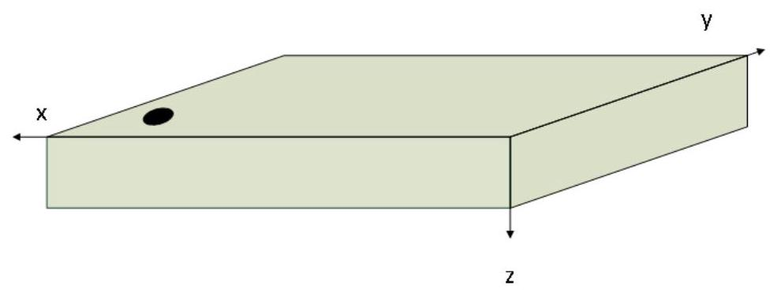

## ⑥ BOSCH

BMM350

3-axis magnetic sensor with high data rate

## BST-BMM350-DS001-27

Document revision 1.27

Document release date February 2025

Document number BST-BMM350-DS001-27

Sales Part Number 0273.017.027

Notes Data and descriptions in this document are subject to change without notice. Product photos and pictures are for illustration purposes only and may differ from the real product appearance.

## 1. Basic Description

The BMM350 is a 3-axis magnetic sensor which operates in automatic mode or triggered mode. The magnetic-to-digital conversion technology is based on TMR (tunnel magneto resistance)

The BMM350 is designed to meet all requirements for high performance consumer applications such as magnetic compass, virtual, augmented and mixed reality applications and high-end gaming, platform stabilization applications such as image stabilization, or indoor navigation and dead-reckoning, for example in robotics applications.

Evaluation circuitry converts the output of the magnetic transducer sensing structures, developed, produced and tested in BOSCH facilities. The corresponding chip-sets are packed into one single WLCSP 1.28mm x 1.28mm x 0.5mm housing. For optimum system integration the BMM350 is fitted with digital interfaces (I2C, I3C), offering a wide VDDIO voltage range from 1.72V to 3.6V. To provide maximum performance and reliability each device is tested and ready-touse calibrated.

The BMM350 has an excellent temperature behaviour with an outstanding low temperature coefficients of the offset (TCO) and of the sensitivity (TCS).

An API is provided for quick integration into the target system.

## Key features

Three-axis magnetic field sensor

- Ultra-Small package Wafer Level Chip Scale Package (9 pins, 0.4mm ball pitch) footprint ${1.28} \times  {1.28}{\mathrm{\;{mm}}}^{2}$ , height ${0.5}\mathrm{\;{mm}}$

- Digital interface I2C, I3C, 1 interrupt pin, 1 pin for I2C/I3C (legacy) address definition

- Low voltage operation ${\mathrm{V}}_{\mathrm{{DD}}}$ supply voltage range: ${1.72}\mathrm{\;V}$ to ${1.98}\mathrm{\;V}$ ${\mathrm{V}}_{\mathrm{{DDIO}}}$ interface voltage range: ${1.72}\mathrm{\;V}$ to ${3.6}\mathrm{\;V}$

- Flexible functionality Magnetic field range typical: $\pm  {2000\mu }\mathrm{T}\left( {\mathrm{x},\mathrm{y}\text{-axis}}\right) , \pm  {2000\mu }\mathrm{T}\left( {\mathrm{z}\text{-axis}}\right)$ Magnetic field resolution of $\sim  {0.1\mu }\mathrm{T}$

- On-chip interrupt controller Interrupt-signal generation for new data

- Ultra-low power Low current consumption (typ. ${200\mu }\mathrm{A}@{100}\mathrm{\;{Hz}}$ in regular power preset), short wake-up time

- Normal and forced mode periodic operation (normal mode) and triggered operation (forced mode)

- Temperature range $- {40}{}^{ \circ  }\mathrm{C}\ldots  + {85}{}^{ \circ  }\mathrm{C}$

- RoHS compliant, halogen-free

## Typical applications

- Magnetic heading information

- Tilt-compensated electronic compass for map rotation, navigation and augmented reality

- Gyroscope calibration in 9-DoF applications for mobile devices

- In-door navigation, e.g. step counting in combination with accelerometer

- Gaming (AR/VR)

## General Description

The BMM350 is a standalone geomagnetic sensor for consumer market applications. It allows measurements of the magnetic field in three perpendicular axes. Based on Bosch's proprietary TMR technology, performance and features of BMM350 are carefully tuned and perfectly match the demanding requirements of all 3-axis mobile applications such as electronic compass, navigation or augmented reality.

An evaluation circuitry (ASIC) converts the output of the geomagnetic sensor to digital results which can be read out over the digital interfaces I2C or I3C.

Package and interfaces of the BMM350 have been designed to match a multitude of hardware requirements. As the sensor features an ultra-small footprint and a flat package, it is ingeniously suited for mobile applications. The wafer level chip scale package (WLCSP) with dimensions of only ${1.28} \times  {1.28} \times  {0.5}{\mathrm{\;{mm}}}^{3}$ ensures high flexibility in PCB placement.

The BMM350 offers low voltage operation (V ${}_{\mathrm{{DD}}}$ voltage range from 1.72V to 1.98V, VDD10 voltage range 1.72V to 3.6V) and can be programmed to optimize functionality, performance and power consumption in customer specific applications.

The BMM350 senses the three axis of the terrestrial field in cell phones, handhelds, computer peripherals, man-machine interfaces, virtual reality features and game controllers. Table of Contents 1. Basic Description 2.2

2. Specification .8

2.1 Electrical operation conditions .8

2.2 Magnetometer output signal specification .9

3. Absolute maximum ratings 11

4. Block diagram. 12

5. Functional description 13

5.1 Power modes, boot procedure .14

5.1.1 Power off. 14

5.1.2 Suspend mode 14

5.1.3 Normal mode 14

5.1.4 Forced mode. 15

5.1.5 Magnetic reset in normal and forced mode/excessive field strengths handling. 17

5.1.6 Self Test .17

5.2 Compensated data access from magnetic and temperature registers 18

5.2.1 Accessing compensation data 18

5.2.2 Sensortime 18

5.3 Excessive field strengths handling .19

5.4 Data rate and noise performance setting 19

5.5 Interrupt settings and interrupt status 20

5.5.1 Mapping Interrupt to INT pin 20

5.5.2 Interrupt polarity at INT pin 20

5.5.3 Interrupt drive type: CMOS or open drain 20

5.5.4 Interrupt latching type or non-latching .20

5.5.5 In-band interrupt 20

5.6 Pad drive settings .21

5.7 Enable/disable axis .21

5.8 Sensortime always available .21

5.9 I2C watchdog setting .21

5.10 Status information .21

5.10.1 CHIP_ID . 21

5.10.2 ERR_REG: PMU and boot error. 2.22

5.10.3 PMU_CMD_STATUS: PMU (command) status 22

5.10.4 I3C_ERR: I3C status/error reporting 2.22 5.10.5 Soft reset, reset detection. 2.22

6. Pin and package description

2.23

5.1 Landing pattern recommendation .24

5.2 Connection diagrams. .24

5.3 Recommendations for PCB design .24

7. API functions 25

8. Register Map. .26

8.1 Register (0x00) CHIP_ID. .29

8.2 Register (0x02) ERR_REG. .29

8.3 Register (0x03) PAD_CTRL .30

8.4 Register (0x04) PMU_CMD_AGGR_SET 30

8.5 Register (0x05) PMU_CMD_AXIS_EN. 31

8.6 Register (0x06) PMU_CMD. 32

8.7 Register (0x07) PMU_CMD_STATUS_0 3.33

8.8 Register (0x08) PMU_CMD_STATUS_1 34

8.9 Register (0x09) I3C_ERR. 34

8.10 Register (0x0A) I2C_WDT_SET. .34

8.11 Register (0x2E) INT_CTRL 35

8.12 Register (0x2F) INT_CTRL_IBI 36

8.13 Register (0x30) INT_STATUS. 36

8.14 Register (0x31) MAG_X_XLSB 37

8.15 Register (0x32) MAG_X_LSB. 37

8.16 Register (0x33) MAG_X_MSB. 37

8.17 Register (0x34) MAG_Y_XLSB 3.38

8.18 Register (0x35) MAG_Y_LSB. 38

8.19 Register (0x36) MAG_Y_MSB. .38

8.20 Register (0x37) MAG_Z_XLSB 3.38

8.21 Register (0x38) MAG_Z_LSB. 39

8.22 Register (0x39) MAG_Z_MSB 39

8.23 Register (0x3A) TEMP_XLSB. 39

8.24 Register (0x3B) TEMP_LSB. 39

8.25 Register (0x3C) TEMP_MSB. .40

8.26 Register (0x3D) SENSORTIME_XLSB 40

8.27 Register (0x3E) SENSORTIME_LSB 40

8.28 Register(0x3F) SENSORTIME_MSB 40

8.29 Register (0x50) OTP_CMD_REG. 41

8.30 Register (0x52) OTP_DATA_MSB_REG 41

8.31 Register (0x53) OTP_DATA_LSB_REG. 41

8.32 Register (0x55) OTP_STATUS_REG .42 8.33 Register (0x60) TMR_SELFTEST_USER 42

8.34 Register (0x61) CTRL_USER. 43

8.35 Register (0x7E) CMD. 43

9. Digital Interfaces 44

9.1 Interface selection. 44

9.2 $\;{\mathrm{I}}^{2}\mathrm{C}$ interface 44

9.2.1 I ${}^{2}\mathrm{C}$ write 45

9.2.2 I ${}^{2}\mathrm{C}$ read. 46

9.2.3 Dummy bytes in I2C mode .46

9.3 I3C interface .46

9.3.1 Supported CCC 47

9.3.2 Dummy bytes in I3C mode 48

9.3.3 I3C provisional ID 48

9.3.4 I3C read timing diagrams 49

9.3.5 I3C write timing diagrams 50

9.4 Interface parameter specification 50

9.4.1 General interface parameters 50

9.4.2 I BO timings. 51

9.4.3 I3C timings 52

10.Package information 5.53

10.1 Marking/Lasermarking, coordinate system 54

11. Examples of use .56

12.Timing control 57

12.1 Timing control Asynchronous mode. 57

13.Recommendations for external capacitor CRST 58

14.Environmental Safety 59

14.1 RoHS 59

14.2 Halogen content. 59

14.3 Internal Package Structure 59

15.Acronyms .60

16. Legal disclaimer .61

17.Document history and modification .62

## List of figures

Figure 1: Block diagram 12

Figure 2: Power mode transitions 16

Figure 3: View from lasermarking side, balls invisible, required external components in operation. 23

Figure 4: Pin names only, laser marking side 23

Figure 5: ${\mathrm{I}}^{2}\mathrm{C}$ multiple byte write (not auto-incremented) 45

Figure 6: I'C single byte write. 46

Figure 7: I'C multiple byte read, first 2 bytes transferred must be discarded, they are dummy bytes. 46

Figure 8: I3C data package 46

Figure 9: ${\mathrm{I}}^{2}\mathrm{C}$ timing diagram 51

Figure 10: Pin out and package dimensions 53

Figure 11: Marking 54

Figure 12: Coordinate system definition, right-handed. lasermarking side up 55

Figure 13: Timing control async mode, from MIPI I3C spec 57

Figure 14. External capacitor 58

List of tables

Table 1: Electrical operation conditions . 8

Table 2: magnetometer property specification .9

Table 3: Magnetometer output signal 10

Table 4: Absolute maximum ratings 11

Table 5: Allowed combinations of output data rate ODR and noise configuration/averaging and related curren

consumption in $\mu {A}^{ * }$ . 15

Table 6: Highest forced mode trigger rate versus noise performance/ averaging setting 16

Table 7: Power consumption versus data rate ODR and noise performance setting, allowed combinations of setting

n/a: not allowed. 19

Table 8 : 8-bit portrait register map 26

Table 9: I2C address definition 44

Table 10: I2C address roll-out. 45

Table 11: MIPI I3C CCC supported commands 47

Table 12: Interface parameters 50

Table 13: ${\mathrm{I}}^{2}\mathrm{C}$ timings 51

Table 14: I3C timings 52

## 2. Specification

If not stated otherwise, the given values with minimum/maximum values are mean $\pm  {3\sigma }$ , typical values are mean $\pm  {1\sigma }$ . Room temperature (RT) refers to ${25}^{ \circ  }\mathrm{C}$ , a full-scale sweep (FSS) refers to $\pm  {2000\mu }\mathrm{T}$ . Values are given after API correction. Data refers to parts soldered on PCB and without underfill or encapsulation.

### 2.1 Electrical operation conditions

Table 1: Electrical operation conditions

<table><tr><td>Parameter</td><td>Symbol</td><td>Condition</td><td>Min</td><td>Typ</td><td>Max</td><td>Unit</td></tr><tr><td>Supply Voltage Internal Domains</td><td>VDD</td><td/><td>1.72</td><td/><td>1.98</td><td>V</td></tr><tr><td>Supply Voltage I/O Domain</td><td>VDDIO</td><td/><td>1.72</td><td/><td>3.6</td><td>V</td></tr><tr><td>Voltage Input Low Level</td><td>${\mathrm{V}}_{\mathrm{{IL}},\mathrm{a}}$</td><td>12C&I3C</td><td/><td/><td>0.3VDDIO</td><td>-</td></tr><tr><td>Voltage Input High Level</td><td>${V}_{{IH}, a}$</td><td>12C&I3C</td><td>0.7VDDIO</td><td/><td/><td>-</td></tr><tr><td>Voltage Output Low Level</td><td>Vol.a</td><td>loL<= 2mA</td><td/><td/><td>0.23VDDIO</td><td>-</td></tr><tr><td>Voltage Output High Level</td><td>Von</td><td>lon $<  = 2\mathrm{{mA}}$</td><td>0.8VDDIO</td><td/><td/><td>-</td></tr><tr><td>Operating Temperature</td><td>${\mathrm{T}}_{\mathrm{A}}$</td><td/><td>-40</td><td/><td>+85</td><td>℃</td></tr><tr><td rowspan="2">Current in normal mode</td><td>ldd, n, rp IDD, ref</td><td>ODR=100, 25°C, averaging=2 samples (regular power setting )</td><td/><td>200</td><td/><td>uA</td></tr><tr><td>Idd, n, In</td><td>ODR=100, 25°C , averaging=4 samples (low noise)</td><td/><td>350</td><td/><td>uA</td></tr><tr><td>Current in suspend mode</td><td>Idd, sus</td><td>data retention</td><td/><td>1.8</td><td/><td>uA</td></tr><tr><td>Peak supply current in active mode (normal or forced mode)</td><td>IDDpk, m</td><td>In measurement phase ${\mathrm{T}}_{\mathrm{A}} = {25}^{ \circ  }\mathrm{C}$ , before bit reset</td><td/><td>3.5</td><td/><td>mA</td></tr><tr><td>Sensor start-up time (suspend to normal mode)1</td><td>Tsus2nm</td><td>Start-up time from suspend mode to normal mode</td><td/><td>70</td><td/><td>ms</td></tr><tr><td>Sensor start-up time (OFF to suspend mode)</td><td>Tpon2sus</td><td>Start-up time from OFF to suspend mode</td><td/><td>2.5</td><td/><td>ms</td></tr></table>

as well as in the event of applications for industrial property rights

### 2.2 Magnetometer output signal specification

Table 2: magnetometer property specification

<table><tr><td>Parameter</td><td>Symbol</td><td>Condition</td><td>Min</td><td>Typ</td><td>Max</td><td>Unit</td></tr><tr><td>Magnetic field range, all axes</td><td>${\mathrm{R}}_{\mathrm{{ng}}}$</td><td/><td>-2000</td><td/><td>2000</td><td>$\mu \mathrm{T}$</td></tr><tr><td>Zero-field offset drift before or after soldering</td><td>offma</td><td>${25}^{ \circ  }\mathrm{C}$</td><td/><td>$\pm  {25}$</td><td/><td>μT</td></tr><tr><td>Zero-B offset</td><td>${\mathrm{{OFF}}}_{\mathrm{m},\mathrm{{cal}}}$</td><td>After software calibration with Bosch Sensortec eCompass software1 $- {40}^{ \circ  }\mathrm{C} \leq  {\mathrm{T}}_{\mathrm{A}} \leq$ +85°C</td><td/><td>$\pm  2$</td><td/><td>μT</td></tr><tr><td>ODRs in normal mode</td><td>ODR</td><td>At room temperature, after soldering</td><td>Typ -2 %</td><td>400 200 100 50 25 25/2 25/4 25/8 25/16</td><td>Typ+2%</td><td>Hz</td></tr><tr><td>Maximum forced mode trigger frequency</td><td>FMTf</td><td>averaging=0 only</td><td/><td>200</td><td/><td>Hz</td></tr><tr><td>Relative ODR drift over temperature</td><td>ODR, dev, Ir</td><td>Reduced temperature sweep $\left\lbrack  {-{5}^{ \circ  }\mathrm{C},{65}^{ \circ  }\mathrm{C}}\right\rbrack$</td><td>-3</td><td/><td>3</td><td>%</td></tr><tr><td/><td>ODR, dev, fr</td><td>Full temperature sweep [-40°C,85°C]</td><td>-4</td><td/><td>4</td><td>%</td></tr><tr><td>3dB bandwidth</td><td>BW</td><td>by design</td><td/><td>ODR/2</td><td/><td>Hz</td></tr></table>

${}^{1}$ Magnetic zero-B offset assuming calibration with Bosch Sensortec eCompass software. Typical value after applying calibration movements containing various device orientations (typical device usage).

<table><tr><td>Parameter</td><td>Symbol</td><td>Condition</td><td>Min</td><td>Typ</td><td>Max</td><td>Unit</td></tr><tr><td>Sensitivity/gain error after soldering 2</td><td>Gerr, m</td><td>After API compensation ${\mathrm{T}}_{\mathrm{A}} = {25}^{ \circ  }\mathrm{C}$ Nominal VDD supplies x/y axis</td><td/><td>+/-1</td><td/><td>%</td></tr><tr><td>Sensitivity/gain error after soldering 3</td><td>Gerr, m</td><td>After API compensation ${\mathrm{T}}_{\mathrm{A}} = {25}^{ \circ  }\mathrm{C}$ Nominal VDD supplies Z axis</td><td/><td>+/-3</td><td/><td>%</td></tr><tr><td>Sensitivity Temperature Drift</td><td>TCSm</td><td>After API compensation $- {40}^{ \circ  }\mathrm{C} \leq  {\mathrm{T}}_{\mathrm{A}} \leq   + {85}^{ \circ  }\mathrm{C}$ Nominal VDD supplies all axis</td><td/><td>+/-0.010</td><td/><td>%/K</td></tr><tr><td>TCO error</td><td>TCOerr</td><td>-40°C to 85°C</td><td/><td>$\pm  {200}$</td><td/><td>nT/K</td></tr><tr><td rowspan="2">Hysteresis4</td><td>hystxy, %FS</td><td>RT, after FSS, in % of FSS</td><td/><td>0.02</td><td/><td>%</td></tr><tr><td>hystz, %FS</td><td>RT, after FSS, no reset, in % of FSS</td><td/><td>0.4</td><td/><td>%</td></tr><tr><td>Integral Nonlinearity</td><td>INLm, FS</td><td>Max. Deviation to best fit straight line x/y axis</td><td/><td>$\pm  {10}$</td><td/><td>$\mu \mathrm{T}$</td></tr><tr><td>Integral Nonlinearity</td><td>INLm, FS</td><td>Max. Deviation to best fit straight line z axis</td><td/><td>$\pm  {20}$</td><td/><td>$\mu$ T</td></tr><tr><td rowspan="2">Output noise rms 3dB BW= ODR/2</td><td>Nrms, xy x.y channel</td><td>ODR=100 averaging=2 samples</td><td/><td>190</td><td/><td>nTrms</td></tr><tr><td>Nrms, z z channel</td><td>ODR=100 averaging=2 samples</td><td/><td>450</td><td/><td>nTrms</td></tr><tr><td>Sensitivity drift after magnetic field shock recovery</td><td/><td>250 mT</td><td>-100</td><td/><td>$+ {100}$</td><td>$\mu$ T</td></tr><tr><td>Sensitivity drift after magnetic field shock recovery</td><td/><td>250 mT</td><td>-1</td><td/><td>$+ 1$</td><td>%</td></tr></table>

${}^{2}$ Definition: gain error $= \left( {\text{(measured field after API compensation)}/\text{(applied field)}}\right)  - 1$ , gain measured between $+ / - {1.2}\mathrm{{mT}}$ ${}^{3}$ Definition: gain error $= \left( {\text{(measured field after API compensation)}/\text{(applied field)}}\right)  - 1$ , gain measured between $+ 1 - {1.2}\mathrm{{mT}}$ ${}^{4}$ BMM350 z-axis hysteresis after full-scale sweep can be cleared using magnetic reset. as well as in the event of applications for industrial property rights

## 3. Absolute maximum ratings

The absolute maximum ratings are provided in Table 4. At or above these maximum ratings operability is not given. The specification limits in chapter 2 only apply under normal operating conditions.

Table 4: Absolute maximum ratings

<table><tr><td>Parameter</td><td>Condition</td><td>Min</td><td>Max</td><td>Unit</td></tr><tr><td rowspan="2">Voltage at Supply Pin</td><td>Vdo Pin</td><td>-0.3</td><td>2</td><td>V</td></tr><tr><td>Vodo Pin</td><td>-0.3</td><td>3.6</td><td>V</td></tr><tr><td>Voltage at any Logic Pad</td><td>Non-Supply Pin</td><td>-0.3</td><td>VDDIO + 0.3</td><td>V</td></tr><tr><td>Operating Temperature, ${\mathrm{T}}_{\mathrm{A}}$</td><td>Active operation</td><td>-40</td><td>+85</td><td>℃</td></tr><tr><td>Passive Storage Temp. Range</td><td>≤ 65% rel. H.</td><td>-50</td><td>+125</td><td>℃</td></tr><tr><td>None-volatile memory (OTP) Data Retention</td><td>T = 85°C</td><td>10</td><td/><td>year</td></tr><tr><td rowspan="2">Mechanical Shock according to JESD22- B104C</td><td>Duration ≤ 500μs</td><td/><td>20,000</td><td>g</td></tr><tr><td>Drop in reel onto hard surfaces</td><td/><td>2</td><td>m</td></tr><tr><td rowspan="2">ESD</td><td>HBM, at any Pin</td><td/><td>$\pm  2$</td><td>kV</td></tr><tr><td>CDM</td><td/><td>$\pm  {500}$</td><td>V</td></tr><tr><td>Latch-up</td><td>LU</td><td/><td>$\pm  {100}$</td><td>mA</td></tr><tr><td>Magnetic field</td><td>Any direction ${}^{5}$</td><td>-250</td><td>250</td><td>mT</td></tr></table>

Stress above those listed as "absolute maximum ratings" may cause permanent damage to the device. This is a stress rating only and functional operation of the device under these conditions is not implied. Exposure to maximum rating conditions for extended periods may affect device reliability.

---

${}^{5}$ Field shock strengths up to BMFS = 400 mT tested; fields of ${250}\mathrm{{mT}} <$ BMFS $< {400}\mathrm{{mT}}$ will not damage the device but may lead to offset and sensitivity drifts above ${100}\mathrm{{uT}}$ and $1\%$ , respectively. as well as in the event of applications for industrial property rights

---

## 4. Block diagram

Figure 1 shows the signal flow block diagram of the BMM350.

A magnetic transducer converts the magnetic field information in X, Y and Z direction into a differential voltage. An additional temperature transducer converts the ASIC die temperature into a differential voltage. A multiplexer selects the $\mathrm{X},\mathrm{Y},\mathrm{Z}$ or temperature channel in a predefined timing scheme and feeds the voltage into an amplifier which does a coarse correction for gain deviations. The ADC following that stage converts the analog differential signal into the digital domain. The API software running on the host processor reads out the X, Y, Z and temperature information and further applies gain, offset and temperature effect corrections. The API finally provides corrected X, Y, Z and temperature information to the host as floating point values.

Figure 1: Block diagram

The data are made available via I3C or I2C interface. A data ready interrupt signals when new data are available, either via INT pin or via in-band-interrupt in I3C mode. If status polling is preferred a "data ready" status register can be read out on demand.

Bosch Sensortec | BST-BMM350-DS001-27

## 5. Functional description

BMM350 is a triaxial standalone geomagnetic sensor (sensing element and ASIC) in wafer-level-chip-scale package and can be operated via I2C or I3C as a slave device.

The BMM350 has two distinct power supply pins:

D VDD is the main power supply for all internal analog and digital functional blocks;

- VDDIO is a separate power supply pin, used for the supply of the digital interface.

The device can be completely switched off $\left( {{\mathrm{V}}_{\mathrm{{DD}}} = 0\mathrm{\;V}}\right)$ while keeping the ${\mathrm{V}}_{\mathrm{{DD10}}}$ supply on $\left( {{\mathrm{V}}_{\mathrm{{DD10}}} > 0\mathrm{\;V}}\right)$ or vice versa. When ${\mathrm{V}}_{\mathrm{{DDIO}}} = 0$ the voltages at $\mathrm{{IO}}$ pins must not exceed the specified limit of ${300}\mathrm{{mV}}$ . The BMM350 is highly configurable

The major IC control settings are

Power mode (normal, forced, suspend) see chapter 4.1

Data rate ODR, see chapter 4.4

Accuracy/noise, see chapter 4.4

Interrupt settings, see chapter 4.5

Pad drive strength, see chapter 4.6

Enabled axes, see chapter 4.7

I2C watchdog configuration, see chapter 9.1

I3C in-band-interrupt (IBI) configuration, see chapter 4.5.5

Sensortime always available, see chapter 4.8

Many registers provide status information:

CHIP_ID (product ID), see chapter 4.9.1

Interrupt status, see chapters 4.5 and 4.10

Error register, see chapter 4.9.3

PMU (power management) status, effective ODR and accuracy settings, see chapter 4.9.4

I3C errors, see chapter 4.9.5

Digital data registers provide uncompensated data about magnetic field strength, temperature and time:

Data registers for $X, Y$ and $Z$ magnetic channel and temperature channel

provide data in 24bit registers in 21 bit signed-integer format (21 LSBs used)

Sensor time is provided in 24bit format, unsigned integer, with 40us resolution.

For proper temperature compensation is it mandatory to either use the provided API functions or at least look at the API

code for own software developments.

To obtain compensated data use API functions, described in chapter 7.

### 5.1 Power modes, boot procedure

The BMM350 knows two major modes of operation, "normal mode" and "forced mode". "suspend mode" brings the device into minimal power consumption, where settings are retained and communication is possible while data conversions are stopped.

After boot, the device will be in suspend mode, consuming the least current possible offered by this device.

Immediately after boot the API downloads the compensation coefficients from the BMM350 OTP (one-time programmable memory). This is handled automatically in the API function BMM350_init(   ). The boot phase must be terminated by writing 0x80 to OTP_CMD_REG (also done in BMM350_init). From then on the OTP is inaccessible to the API unless a power reset or soft reset triggers another boot.

Power modes are selected using register PMU_CMD. pmu_cmd.

An API function “BMM350_set_powermode” is provided which handles power mode settings.

#### 5.1.1 Power off

In Power off, VDD and/or VDDIO are unpowered/below brownout threshold and the device does not operate. When only one of VDD or VDDIO is supplied, the magnetic sensor will still be in Power off. Power on/boot is performed immediately after both VDD and VDDIO are raised above their reset release thresholds.

The sequence of raising VDD and VDDIO is left to the user, both voltages can be raised in any desired order. If power is stable, the internal OTP becomes accessible (OTP access granted).

#### 5.1.2 Suspend mode

Suspend mode is the default power mode of BMM350 after the chip is powered and has finished booting when using BMM350_init API function. This function reads out the OTP which stores compensation coefficients.

Suspend mode can be reached on demand via sending a suspend mode request to register PMU_CMD.pmu_cmd, or it is reached automatically after finishing a "forced mode" conversion.

Current consumption in suspend mode is minimal, so, this mode is useful for periods when data conversion is not needed. Read and write of all registers is possible.

#### 5.1.3 Normal mode

Normal mode is activated via register PMU_CMD.pmu_cmd.

An API function BMM350_set_powermode is provided which helps doing that.

In normal mode the internal oscillator triggers conversions with the chosen ODR (output data rate) with the accuracy that can be expected from an RC oscillator.

The noise performance, tightly coupled with the current consumption, is controlled via the "averaging" setting, see register PMU_CMD_AGGR_SET.avg . As the name indicates 1, 2, 4 or 8 data samples are generated internally and averaged before the result is written into the data register. This improves the noise performance at the cost of current consumption, which is increasing proportionally with the averaging factor setting.

Not all combinations of output data rate and averaging are possible, see Table 5.

An API function BMM350_set_performance is provided which helps setting the averaging/noise performance. The function checks for the combination of ODR and averaging setting and chooses the highest possible averaging setting if the desired averaging setting is too high.

Table 5: Allowed combinations of output data rate ODR and noise configuration/averaging and related current consumption in $\mu {\mathrm{A}}^{ * }$ .

<table><tr><td>Noise Mode, number of samples averaged</td><td>ODR 400Hz</td><td>ODR 200Hz</td><td>ODR 100Hz</td><td>ODR 50Hz</td><td>ODR 25Hz</td><td>ODR 12.5Hz</td><td>...</td><td>ODR 1.5625Hz</td></tr><tr><td>“Ultra Low Noise", avg=3 8 samples</td><td>-</td><td>-</td><td>-</td><td>325</td><td>180</td><td>108</td><td/><td>50</td></tr><tr><td>“Low Noise”, avg=2, 4 samples</td><td>-</td><td>-</td><td>335</td><td>175</td><td>96</td><td>57</td><td/><td>25</td></tr><tr><td>“Regular Power", avg=1, 2 samples</td><td>-</td><td>370</td><td>190</td><td>100</td><td>55</td><td>33</td><td/><td>15</td></tr><tr><td>"Low Power", avg=0, 1 sample</td><td>455</td><td>235</td><td>122</td><td>70</td><td>40</td><td>23</td><td/><td>12</td></tr></table>

* Approximate values in $\mu \mathrm{A}$ , measurements only for a couple of samples, deviation from specification table possible

#### 5.1.4 Forced mode

By using forced mode, it is possible to trigger new measurements at any rate as long it is below ${200}\mathrm{\;{Hz}}$ . In forced mode, which is available only when the device resides in suspend mode, a conversion of all selected channels ( register PMU_CMD_AXIS_EN.en_x/y/z) can be triggered via "forced mode request", writing 0x03 or 0x04 ( FM or FM_FAST) into register "PMU_CMD". When finishing the forced mode data conversion the device returns into suspend mode.

The two flavors of forced mode, "FORCED_MODE (FM)" and "FORCED_MODE_FAST (FM_FAST)" shall be used for small (FM) or high (FM_FAST) data rates. For data rates of 25Hz or higher FM_FAST (0x04) can be used. For lower ODRs FM (0x03) must be used.

To reach ODR = 200Hz is only possible by using FM_FAST.

In case the time between BMM350_INIT and the first FM trigger exceeds 0.1s, FM (PMU_CMD = 0x03) has to be used. All further FM calls can then use the FM or FM_FAST depending on the ODR as described above.

A conversion (except the first sample after suspend mode) will carried out within <5e-3 seconds

( avg=1sample, FM_FAST, up to 30ms for avg=8samples, FM) and data can be read via data register.

Conversion time will depend on the averaging setting and the choice of fast/normal forced mode; a high averaging value reduces the noise but increases the current consumption as well as the conversion time.

The conversion is guaranteed to finish within the relative timing precision/drift that can be expected from the internal RC oscillator, up to +/-2%.

The "data ready" interrupt or data ready status registers can be used to read data with minimum delay.

A programming example is provided which shows how to poll the status register to achieve high data rates and low latencies.

Table 6: Highest forced mode trigger rate versus noise performance/ averaging setting

<table><tr><td>Noise performance/Averaging settings avg</td><td>Highest forced mode trigger rate [Hz] , forced mode fast</td></tr><tr><td>1</td><td>200</td></tr><tr><td>2</td><td>150</td></tr><tr><td>4</td><td>80</td></tr><tr><td>8</td><td>40</td></tr></table>

An API function is provided to request the BMM350 forced mode, BMM350_set_powermode.

The reading of results is handled via the API as well.

Power mode transitions are depicted in Figure 2.

Figure 2: Power mode transitions

Only when being in suspend mode it is possible to switch to forced mode.

A direct transition request from normal mode to forced mode will be ignored by the device. The API function BMM350_set_powermode(   ) allows to switch from normal to forced mode by transitioning via the "suspend mode" state.

#### 5.1.5 Magnetic reset in normal and forced mode/excessive field strengths handling

The BMM350 has measures to recover from excessively strong magnetic fields which would lead to a performance deterioration in competitor products. These measures are called "magnetic reset".

They can be triggered programmatically via the API function "BMM350_check_for_highfield_and_reset" which checks for excessive fields during operation and then triggers the reset. As said this works only during operation of the sensor, both in normal and forced mode.

If excessive field exposure has occurred out-of-operation, in a power-off state, users don't need to care: the magnetic reset is triggered after each boot by the device itself.

If the excessive field exposure has occurred in suspend mode, the sensor will not be able to detect that event itself. If large offset or sensitivity drift indicates that such an event has occurred user can call the API function "BMM350_magnetic_reset_and_wait".

If the system resides in suspend over longer times $\left( { > 2\mathrm{\;s}}\right)$ , the user may want to implement a preventive reset policy by issuing the magnetic reset before changing power mode to "forced" or "normal". To this purpose the user can call the API function "BMM350_magnetic_reset_and_wait".

This function will perform a full magnetic reset.

A programming example is provided with the API.

Hint: In normal and in forced mode the sensor automatically performs a magnetic reset for every ODR tick.

The magnetic reset is triggered using register PMU_CMD.pmu_cmd.

The magnetic reset generates magnetic fields inside the sensor which "reset" the magnetic orientation of the magnetic transducer.

Doing so requires the external 2.2uF capacitor attached to pin "CRST" to be charged. Depending on temperature and selected data rate this charging can take more or less time (less than 8ms by design). After finishing the API function BMM350_init, the said capacitor is charged, and data conversion can start right away after finishing the BMM350_INIT. The capacitor discharge time constant is about 1 second, so, calling "BMM350_magnetic_reset_and_wait" after longer time of inactivity recharges the capacitor.

5.1.6 Self Test

The self-test feature allows to test the function of the $\mathrm{X}$ and $\mathrm{Y}$ channel.

When activating self-test an internal magnetic field in the order of ${130\mu }\mathrm{T}$ is generated which adds on to the ambient magnetic field.

Self-test result interpretation thus requires data before activating the self-test and data during activation of the self-test:

[x = mag_x(during self-test) - mag_x(before self-test) >= 130μT

[y = mag_y(during self-test) - mag_y(before self-test) >= 130μT

Self-test can only be activated for 1 axis at a time. The device must be in suspend mode and forced mode must be used to capture data before and after activating self-test.

The API function BMM350_perform_self_test carries the procedure out automatically.

### 5.2 Compensated data access from magnetic and temperature registers

Sensortime, temperature data and magnetic data are made available via data registers located next to each other. This allows reading said data within a single burst read.

Actually, burst read is an absolute "must" for data readout since the read stops data of being updated during readout and thus become inconsistent. The BMM350 halts data register update during a burst read starting at a sensortime, magnetic data or temperature data address. Reading data registers using single reads would allow for data updates between these reads and is strictly discouraged for normal mode.

The host must call API functions to correct data for temperature effects: offset and sensitivity errors will be corrected there as well as temperature effects. Trim values for the correction of offset, gain and temperature effects etc are stored in the BMM350 OTP and will be loaded when the API-function BMM350_init(   ) is called.

For proper operation and best performance it is thus mandatory either to use the API functions or at least use API functions as template for own code, see chapter 7 .

An API function "BMM350_read_mag_data_and_compensate" is provided which fetches data and calls all necessary compensation routines.

Magnetic data registers, temperature data registers and sensortime registers are located at addresses 0x31 to 0x3F.

#### 5.2.1 Accessing compensation data

Compensation data for offset, gain and temperature effects are stored in the OTP.

The API function "BMM350_get_compensation_data" reads the data and stores them in the API memory space during the call of API function "BMM350_init". So no explicit user call is needed. The data is used by API function "BMM350_read_mag_data_and_compensate".

Compensation data is stored in the "dev" C structure, which allows to handle different sensors separately.

#### 5.2.2 Sensortime

The API function "BMM350_read_mag_data_and_compensate" optionally reads the sensortime information. The 3 sensortime registers at address 0x3D-0x3F form a 24bit register when (and only when!) new data is generated. If only sensortime is needed by the user the function "bmm350_read_sensortime" is provided.

If no new data is generated, either in normal or in forced mode, the sensortime data register is not updated. A sensortime read will provide the time when the last data has been generated.

Due to the synchronicity of ODR and sensortime, the XLSB value in normal mode is always the same when choosing ODR=100Hz or smaller. An ODR=200Hz leads to 2 different XLSB values, and ODR=400Hz to 4 different XLSB values.

The internal sensortime counter is only incremented in normal mode, not in suspend mode or forced mode unless setting register CTRL_USER.cfg_sens_tim_aon to 0x1.

After boot sensortime is 0 .

Sensortime information is ALWAYS related to new data generation. When setting CTRL_USER.cfg_sens_tim_aon to 0x1 in suspend mode the internal sensortime is advanced, but reading sensortime always leads to the same result unless the device is e.g. sent into forced mode and new data is produced.

When reading sensortime after forced mode is finished one can observe that sensortime is now "pointing" to the timepoint where new data has been calculated.

Sensortime wraps around when the 24bit counter wraps around (no saturation).

### 5.3 Excessive field strengths handling

The BMM350 can handle magnetic field strengths up to +/-2000μT in every $\mathrm{X/Y/Z}$ direction.

BMM350 has the limitation for measurement range that the sum of absolute values of each axis should be smaller. $\operatorname{SQRT}\left( {{\mathrm{{Hx}}}^{ \land  }2 + {\mathrm{{Hy}}}^{ \land  }2 + {\mathrm{{Hz}}}^{ \land  }2}\right)  = {2000\mu }\mathrm{T}$

An API function "BMM350_check_for_highfield_and_reset" is provided which checks whether the field range has been exceeded, and then automatically magnetically resets the sensor. See chapter 4.1.5 for details.

This API function must be called explicitly, it is not called automatically. It should be called directly after "BMM350_read_mag_data_and_compensate".

A programming example is provided with the API.

### 5.4 Data rate and noise performance setting

Output data rate (ODR) is set using register PMU_CMD_AGGR_SET. odr.

Noise performance is set in register ${PMU}\_ {CMD}\_ {AGGR}\_ {SET}$ . avg. In the following text this parameter is also called "averaging" (avg $= 0/1/2/3 \rightarrow$ averaging $= 1/2/4/8$ ).

An API function "BMM350_set_odr_performance" is provided which both handles data rate and noise performance setting.

A higher noise performance trades linearly against power consumption: to achieve a better noise performance several data samples are calculated internally and averaged. This is why current consumption is proportional to the averaging setting/noise performance setting, at least at higher ODR rates.

Table 7: Power consumption versus data rate ODR and noise performance setting, allowed combinations of settings. n/a: not allowed.

<table><tr><td>Averaging value/ noise performance setting PMU_CMD_AGGR_SET.avg</td><td>Noise Mode</td></tr><tr><td>8/3</td><td>Ultra Low Noise</td></tr><tr><td>4/2</td><td>Low Noise</td></tr><tr><td>2/1</td><td>Regular Power</td></tr><tr><td>1/0</td><td>Low Power</td></tr></table>

Power mode after boot is "suspend mode" when using API function BMM350_init.

When changing PMU_CMD_AGGR_SET. odr or PMU_CMD_AGGR_SET. avg it is necessary to send an "update" command via PMU_CMD. pmu_cmd

The API function "BMM350_set_odr_performance" does that automatically.

### 5.5 Interrupt settings and interrupt status

The BMM350 provides a "data ready" (abbreviated "drdy") reset which is mapped to the interrupt status register and to the "INTerrupt" pin.

For I3C in-band interrupts see next chapter.

Two API functions are provided, "BMM350_enable_interrupt" and "BMM350_configure_interrupt" to configure and enable the "traditional" interrupt.

The API function "BMM350_get_interrupt_status" can be used to obtain the interrupt status from register INT_STATUS: new data ready or not ready.

Reading INT_STATUS. drdy_data_reg retrieves the interrupt status, or in other words: whether new data is available since the last data read.

Reading this field clears it in latched mode.

In non-latched mode the bit field clears itself after ${1.25}\mathrm{{ms}}$ .

#### 5.5.1 Mapping Interrupt to INT pin

When enabling the data ready interrupt it is automatically mapped to the interrupt pin INT for A-samples. No extra action must be taken if mapping is desired.

Using C samples, mapping can be enabled or disabled using register INT_CTRL.int_output_en.

The setting can be changed using the API function "BMM350_configure_interrupt".

#### 5.5.2 Interrupt polarity at INT pin

The output at the interrupt pin "INT" can be configured to "active HIGH" or "active LOW" using register INT_CTRL. int_pol. Setting 0x0 is active LOW, 0x1 is active HIGH.

The setting can be changed using the API function "BMM350_configure_interrupt".

#### 5.5.3 Interrupt drive type: CMOS or open drain

The driver type at the interrupt pin "INT" can be configured to "push-pull" or "open drain" using register

INT_CTRL. int_od. Setting 0x0 is "open drain", 0x1 is push-pull.

The setting can be changed using the API function "BMM350_configure_interrupt".

#### 5.5.4 Interrupt latching type or non-latching

The interrupt can be configured to "latching" or "non-latching" using register

INT_CTRL. int_mode. Setting 0x0 is "pulsed", 0x1 is "latched".

The setting can be changed using the API function "BMM350_configure_interrupt".

#### 5.5.5 In-band interrupt

In I3C mode an in-band interrupt ("IBI") can be sent to the host using the serial I3C interface. That IBI has to be enabled explicitly using register INT_CTRL_IBI. drdy_int_map_to_ibi.

Only enabling the IBI is not sufficient, the data ready interrupt itself has to be enabled using register INT_CTRL.drdy_data_reg_en.

The IBI uses the serial interface for the transmission for the interrupt information.

The time between issuing the interrupt in the sensor and the host receiving the interrupt is not deterministic since high I3C bus traffic can lead to a (repeated) non-acknowledgement of the sensor interrupt request.

INT_CTRL_IBI.clear_drdy_int_status_upon_ibi allows to clear the interrupt status register automatically upon sending an IBI.

An API function "BMM350_set_int_ctrl_ibi" is provided to configure and enable/disable the IBI.

### 5.6 Pad drive settings

To avoid problems with signal over- or undershoot with long wires the user can configure the relative pad driver strength via register ${PAD}\_ {CTRL}$ . drv<2 : 0>. A setting of 0 selects the weakest drive strength, a setting of 7 selects the strongest drive strength.

In I3C mode the user does not have control over the value of the pull-up resistor value, so care must be taken to not select a too weak driver strength.

The default relative drive strength is 7 after boot.

An API function "BMM350_set_pad_drive" is provided to change the drive strength.

### 5.7 Enable/disable axis

The user can choose between converting all axes or only a selected set of axes.

Configuration is handled via register ${PMU}\_ {CMD}$ . en $x/y/z$ .

An API function "BMM350_enable_axes" is provided to handle that configuration.

The function will ignore requests to disable all axes.

Enabling or disabling an axis is only working in suspend mode, a change on-the-fly in normal mode is ignored by the sensor hardware.

The API function "BMM350_enable_axes" will turn the sensor into suspend mode, change the axes enable bits and re-enable normal mode when the sensor is in normal mode at the moment the said API function is called.

### 5.8 Sensortime always available

For best power saving the internal clocks are only turned on when needed.

In suspend mode, all fast internal clocks are turned off, meaning that the sensortime counter is stopped.

User can decide to keep the main internal oscillator running, which makes sensortime information available all time.

An API function "BMM350_set_ctrl_user" is provided which makes sensortime all time available or not. The sensortime reading is updated only when new data are available after data conversion.

### 5.9 I2C watchdog setting

When I2C communication stalls the bmm350 is able to reset the communication interface using a watchdog. It is possible to choose between 2 timeout intervals, see register description I2C_WDT_SET.

An API function "BMM350_set_i2c_wdt" is provided to enable or disable the watchdog and choose the interval length.

### 5.10 Status information

A few registers provide status or error information.

#### 5.10.1 CHIP_ID

CHIP_ID is located at address 0 . Its content is 0x33, read-only. This content is BST product-specific and helps e.g. to check initially whether the BMM350 is properly communicating with the host.

#### 5.10.2 ERR_REG: PMU and boot error

Register ERR_REG indicates PMU- and boot-errors.

ERR_REG. pmu_err tells if PMU commands have been issued out-of-time (too early) or in the wrong context.

Error conditions are:

- Forced mode is requested in normal mode (sensor must be in suspend mode if doing that)

To prevent the occurrence of such errors it is recommended to use the API function BMM350_set_powermode.

#### 5.10.3 PMU_CMD_STATUS: PMU (command) status

- PMU CMD STATUS 0.pmu cmd busy signals that the PMU is not ready to take new commands. Such a busy condition can be encountered after triggering a magnetic reset, which can take up to $8\mathrm{{ms}}$ . Another busy condition can be met after issuing a second forced mode request immediately after issuing a first forced mode request. The first forced mode request can take longer as expected, depending on the charging condition of the external 2.2uF capacitor.

- PMU_CMD_STATUS_0.cmd_is_illegal indicates illegal commands. Illegal commands are commands which do not appear in the register description of register PMU_CMD.

D PMU CMD_STATUS_0.pwr_mode_is_normal indicates whether the sensor is in normal (power) mode.

- PMU_CMD_STATUS_1.pmu_odr_s and PMU_CMD_STATUS_1.pmu_odr_s indicate the actual noise/performance setting and data rate setting.

To prevent the occurrence of errors it is recommended to use the API function BMM350_set_powermode and BMM350_set_odr_perfromance.

#### 5.10.4 I3C_ERR: I3C status/error reporting

I3C is a complex protocol. When bringing up a new system status information may be helpful.

I3C_ERR. i3c_err_0 indicates an SDR parity error. See MIPI spec 5.1.2.3.2 Ninth Bit of SDR Master Written Data as Parity.

I3C_ERR.i3c_err_1 indicates an S0/S1 error, see MIPI spec 5.1.10.1.2 Error Type S0, 5.1.10.1.3 Error Type S1.

5.10.5 Soft reset, reset detection.

A "soft reset" can be used to reset all sensor settings issued so far.

The soft reset is triggred by sending

CMD. cmd = 0xB6 followed by CMD. cmd = 0x0

An API function BMM350_soft_reset_and_wait(   ) is provided.

### 6.Pin and package description

Figure 3: View from lasermarking side, balls invisible, required external components in operation

<table><tr><td>Pin name</td><td>Name</td><td>Function</td></tr><tr><td>C3</td><td>BYPASS</td><td>Connect to ground</td></tr><tr><td>C2</td><td>CRST</td><td>Connect to external 2.2uF capacitor, low inductance. e.g. see chapter 14</td></tr><tr><td>C1</td><td>VDD</td><td>Digital and analog supply, use decoupling capacitor</td></tr><tr><td>B3</td><td>VDDIO</td><td>IO supply, use decoupling capacitor</td></tr><tr><td>B2</td><td>ADSEL</td><td>The logic status of ADSEL defines the LSB to the I2C legacy address. Connect ADSEL to GND or VDDIO</td></tr><tr><td>B1</td><td>GND</td><td>Analog, digital and IO ground</td></tr><tr><td>A3</td><td>SCK</td><td>I2C / I3C clock</td></tr><tr><td>A2</td><td>SDA</td><td>I2C / I3C data</td></tr><tr><td>A1</td><td>INT</td><td>Interrupt output</td></tr></table>

Figure 4: Pin names only, laser marking side

Bosch Sensortec | BST-BMM350-DS001-27 24 | 63

### 5.1 Landing pattern recommendation

For the design of the landing pattern, the dimensions shown in the HSMI are recommended. It is important to note that areas marked in red are exposed PCB metal pads.

- In case of a solder mask defined (SMD) PCB process, the land dimensions should be defined by solder mask openings. The underlying metal pads are larger than these openings.

- In case of a non-solder mask defined (NSMD) PCB process, the land dimensions should be defined in the metal layer. The mask openings are larger than these metal pads.

### 5.2 Connection diagrams

100nF capacitors should be used for VDD and VDDIO decoupling.

CRST requires a 2.2uF capacitor, recommended type: see chapter 13.

### 5.3 Recommendations for PCB design

- S IC footprint: IC size 1.28 x 1.28mm, reserve space for 1.3 x 1.3 mm^2 IC size

- ball pitch is 400um (horizontal & vertical)

- the following peak current can flow:

400mA current (very short time <1us) between CRST capacitor (2.2uF) and CRST pin

400mA current (very short time < 1us) between CRST capacitor (2.2uF) and GND pin

${20}\mathrm{{mA}}$ max current (short time, $< {10}\mathrm{\;{ms}}$ ) in VDD pin, ${750}\mathrm{{uA}}$ maximum average current

- external required components:

100nF capacitor decoupling VDD to GND

100nF capacitor decoupling VDDIO to GND

- 2.2uF capacitor to CRST,200mA peak current, need low resistance, low inductance type and non-magnetic properties. Recommended type: see chapter 14.

- Connect pin "ADSEL" either to GND or VDDIO to change I2C legacy address. Bosch Sensortec | BST-BMM350-DS001-27

### 7.API functions

API functions are documented in

https://github.com/boschsensortec/BMM350 SensorAPI/blob/main/README.md

## 8. Register Map

Table 8 : 8-bit portrait register map

<table><tr><td colspan="3">read/write</td><td colspan="2">read only</td><td/><td>write only</td><td/><td/><td>reserved</td><td/></tr><tr><td>Registe $\mathbf{r}$ Addres s</td><td>Registe r Name</td><td>Default Value</td><td>7</td><td>6</td><td>5</td><td>4</td><td>3</td><td>2</td><td>1</td><td>0</td></tr><tr><td>0x7E</td><td>CMD</td><td>0x00</td><td colspan="8">cmd</td></tr><tr><td>0x7D</td><td>-</td><td>-</td><td colspan="8">reserved</td></tr><tr><td>...</td><td>-</td><td>-</td><td colspan="8">reserved</td></tr><tr><td>0x62</td><td>-</td><td>-</td><td colspan="8">reserved</td></tr><tr><td>0x61</td><td>CTRL U SER</td><td>0x00</td><td colspan="7">reserved</td><td>cfg_sen s_tim_a on</td></tr><tr><td>0x60</td><td>TMR S ELFTES T_USER</td><td>0x00</td><td/><td>reserved</td><td/><td>ist_en_y</td><td>ist_en_x</td><td>st_p</td><td>st_n</td><td>st_igen_ en</td></tr><tr><td>0x5F</td><td>-</td><td>-</td><td colspan="8">reserved</td></tr><tr><td>...</td><td>-</td><td>-</td><td colspan="8">reserved</td></tr><tr><td>0x56</td><td>-</td><td>-</td><td colspan="8">reserved</td></tr><tr><td>0x55</td><td>OTP ST ATUS R EG</td><td>0x10</td><td colspan="3">error</td><td colspan="4">cur_page_addr</td><td>otp_cmd _done</td></tr><tr><td>0x54</td><td>-</td><td>-</td><td colspan="8">reserved</td></tr><tr><td>0x53</td><td>OTP D ATA LS B REG</td><td>0x00</td><td colspan="8">otp_mem_data_lsb</td></tr><tr><td>0x52</td><td>OTP D ATA MS B REG</td><td>0x00</td><td colspan="8">otp_mem_data_msb</td></tr><tr><td>0x51</td><td>-</td><td>-</td><td colspan="8">reserved</td></tr><tr><td>0x50</td><td>OTP C MD RE G</td><td>0x00</td><td/><td>otp_cmd</td><td/><td colspan="5">word_addr</td></tr><tr><td>0x4F</td><td>-</td><td>-</td><td colspan="8">reserved</td></tr><tr><td>...</td><td>-</td><td>-</td><td colspan="8">reserved</td></tr><tr><td>0x40</td><td>-</td><td>-</td><td colspan="8">reserved</td></tr><tr><td>0x3F</td><td>SENSO RTIME MSB</td><td>0x7F</td><td colspan="8">data_st_23_16</td></tr><tr><td>0x3E</td><td>SENSO RTIME LSB</td><td>0x7F</td><td colspan="8">data_st_15_8</td></tr><tr><td>0x3D</td><td>SENSO RTIME XLSB</td><td>0x7F</td><td colspan="8">data_st_7_0</td></tr></table>

© Bosch Sensortec GmbH 2023 | All rights reserved, also regarding any disposal, exploitation, reproduction, editing, distribution, as well as in the event of applications for industrial property rights

<table><tr><td>0x3C</td><td>TEMP MSB</td><td>0x7F</td><td colspan="7">data_t_23_16</td></tr><tr><td>0x3B</td><td>TEMPL SB</td><td>0x7F</td><td colspan="7">data_t_15_8</td></tr><tr><td>0x3A</td><td>TEMP XLSB</td><td>0x7F</td><td colspan="7">data_t_7_0</td></tr><tr><td>0x39</td><td>MAG Z MSB</td><td>0x7F</td><td colspan="7">data_z_23_16</td></tr><tr><td>0x38</td><td>MAG Z LSB</td><td>0x7F</td><td colspan="7">data_z_15_8</td></tr><tr><td>0x37</td><td>MAG Z XLSB</td><td>0x7F</td><td colspan="7">data_z_7_0</td></tr><tr><td>0x36</td><td>MAG Y MSB</td><td>0x7F</td><td colspan="7">data_y_23_16</td></tr><tr><td>0x35</td><td>MAG Y LSB</td><td>0x7F</td><td colspan="7">data_y_15_8</td></tr><tr><td>0x34</td><td>MAG Y XLSB</td><td>0x7F</td><td colspan="7">data_y_7_0</td></tr><tr><td>0x33</td><td>MAG X MSB</td><td>0x7F</td><td colspan="7">data_x_23_16</td></tr><tr><td>0x32</td><td>MAG X LSB</td><td>0x7F</td><td colspan="7">data_x_15_8</td></tr><tr><td>0x31</td><td>MAG X XLSB</td><td>0x7F</td><td colspan="7">data_x_7_0</td></tr><tr><td>0x30</td><td>INT ST ATUS</td><td>0x00</td><td colspan="4">reserved</td><td>drdy_dat a_reg</td><td>reserved</td><td>reserved</td></tr><tr><td>0x2F</td><td>INT CT RL IBI</td><td>0x00</td><td colspan="2">reserved</td><td>clear_dr dy_int_s tatus_up on_ibi</td><td colspan="3">reserved</td><td>drdy_int _map_to _ibi</td></tr><tr><td>0x2E</td><td>INT CT RL</td><td>0x00</td><td>drdy_dat a_reg_e n</td><td colspan="2">reserved</td><td>int_outp ut_en</td><td>int_od</td><td>int_pol</td><td>int_mod e</td></tr><tr><td>0x2D</td><td>-</td><td>-</td><td colspan="7">reserved</td></tr><tr><td>...</td><td>-</td><td>-</td><td colspan="7">reserved</td></tr><tr><td>0x0E</td><td>-</td><td>-</td><td colspan="7">reserved</td></tr><tr><td>0x0D</td><td>TRANS DUCER REV I D</td><td>0x33</td><td colspan="5">trsdcr_rev_id_fixed</td><td colspan="2">trsdcr_rev_id_otp</td></tr><tr><td>0x0C</td><td>-</td><td>-</td><td colspan="7">reserved</td></tr><tr><td>...</td><td>-</td><td>-</td><td colspan="7">reserved</td></tr><tr><td>0x0B</td><td>-</td><td>-</td><td colspan="7">reserved</td></tr><tr><td>0x0A</td><td>12C WD T SET</td><td>0x00</td><td colspan="5">reserved</td><td>i2c_wdt_ sel</td><td>i2c_wdt_ en</td></tr><tr><td>0x09</td><td>I3C ER R</td><td>0x00</td><td colspan="3">reserved</td><td>i3c_error 3</td><td colspan="2">reserved</td><td>i3c_error 0</td></tr><tr><td>0x08</td><td>PMU C MD ST ATUS 1</td><td>0x00</td><td colspan="2">reservedpmu_avg_s</td><td/><td colspan="4">pmu_odr_s</td></tr></table>

(C) Bosch Sensortec GmbH 2023 | All rights reserved, also regarding any disposal, exploitation, reproduction, editing, distribution,

as well as in the event of applications for industrial property rights Bosch Sensortec | BST-BMM350-DS001-27

<table><tr><td>0x07</td><td>PMU C MD ST ATUS 0</td><td>0x00</td><td colspan="2">pmu_cmd_val</td><td>ODR_ov Wr</td><td>pmu_cm d_busy</td><td colspan="2">AVG_ov wr</td><td colspan="2">ODR_ov Wr</td><td>pmu_cm d_busy</td></tr><tr><td>0x06</td><td>PMU C MD</td><td>0x00</td><td colspan="3">reserved</td><td colspan="6">pmu_cmd</td></tr><tr><td>0x05</td><td>PMU C MD AXI S EN</td><td>0x70</td><td colspan="3">reserved</td><td colspan="2">En_z</td><td colspan="2">En_y</td><td colspan="2">En_x</td></tr><tr><td>0x04</td><td>PMU C MD_AG GR SE T</td><td>0x14</td><td>reserved</td><td colspan="2">avg</td><td colspan="6">odr</td></tr><tr><td>0x03</td><td>PAD CT RL</td><td>0x07</td><td colspan="4">reserved</td><td colspan="5">drv</td></tr><tr><td>0x02</td><td>ERR R EG</td><td>0x00</td><td colspan="8">reserved</td><td>pmu_cm d_error</td></tr><tr><td>0x00</td><td>CHIP ID</td><td>0x33</td><td colspan="3">chip_id_fixed</td><td colspan="6">chip_id_otp</td></tr></table>

Bosch Sensortec | BST-BMM350-DS001-27

8.1 Register (0x00) CHIP_ID

DESCRIPTION: Chip identification code

RESET: 0x33

DEFINITION (See Chapter 8 Register Map)

<table><tr><td>Bit</td><td>7</td><td>6</td><td>5</td><td>4</td></tr><tr><td>Read/Write</td><td>R</td><td>R</td><td>R</td><td>R</td></tr><tr><td>Reset Value</td><td>0</td><td>0</td><td>1</td><td>0</td></tr><tr><td>Content</td><td colspan="4">chip_id_fixed</td></tr></table>

<table><tr><td>Bit</td><td>3</td><td>2</td><td>1</td><td>0</td></tr><tr><td>Read/Write</td><td>R</td><td>R</td><td>R</td><td>R</td></tr><tr><td>Reset Value</td><td>0</td><td>0</td><td>1</td><td>1</td></tr><tr><td>Content</td><td colspan="4">chip_id_otp</td></tr></table>

chip_id_otp: Programmable (NVM) part of chip id.

chip_id_fixed: Fixed part of chip id.

### 8.2 Register (0x02) ERR_REG

DESCRIPTION: Reports Sensor Error Flag. Will be cleared on read. If the user writes a 1 into any status bit, this will also clear that bit.

RESET: 0x00

DEFINITION (See Chapter 8 Register Map)

<table><tr><td>Bit</td><td>7</td><td>6</td><td>5</td><td>4</td><td>3</td><td>2</td><td>1</td><td>0</td></tr><tr><td>Read/Write</td><td>n/a</td><td>n/a</td><td>n/a</td><td>n/a</td><td>n/a</td><td>n/a</td><td>R/W</td><td>R/W</td></tr><tr><td>Reset Value</td><td>0</td><td>0</td><td>0</td><td>0</td><td>0</td><td>0</td><td>0</td><td>0</td></tr><tr><td>Content</td><td colspan="7">reserved</td><td>pmu_cmd error</td></tr></table>

D pmu_cmd_error: a new PMU_CMD is issued when previous command has not been finished. The new PMU_CMD will be ignored.

0x0: pmu_ok

0x1 : pmu_error

8.3 Register (0x03) PAD_CTRL

DESCRIPTION: Configure pad behavior

RESET: 0x07

DEFINITION (See Chapter 8 Register Map)

<table><tr><td>Bit</td><td>7</td><td>6</td><td>5</td><td>4</td><td>3</td><td>2</td><td>1</td><td>0</td></tr><tr><td>Read/Write</td><td>n/a</td><td>n/a</td><td>n/a</td><td>n/a</td><td>n/a</td><td>R/W</td><td>R/W</td><td>R/W</td></tr><tr><td>Reset Value</td><td>0</td><td>0</td><td>0</td><td>0</td><td>0</td><td>1</td><td>1</td><td>1</td></tr><tr><td>Content</td><td colspan="5">reserved</td><td colspan="3">drv</td></tr></table>

- drv: Set the pad drive capability

0x0: drv_weakest, 0x7: drv_strongest , 0xn:drv_n_7, n=1..6

### 8.4 Register (0x04) PMU_CMD_AGGR_SET

DESCRIPTION: configuration of the ODR and AVG

RESET: 0x14

DEFINITION (See Chapter 8 Register Map)

<table><tr><td>Bit</td><td>7</td><td>6</td><td>5</td><td>4</td><td>3</td><td>2</td><td>1</td><td>0</td></tr><tr><td>Read/Write</td><td>R/W</td><td>R/W</td><td>R/W</td><td>R/W</td><td>R/W</td><td>R/W</td><td>R/W</td><td>R/W</td></tr><tr><td>Reset Value</td><td>0</td><td>0</td><td>0</td><td>1</td><td>0</td><td>1</td><td>0</td><td>0</td></tr><tr><td>Content</td><td colspan="2">reserved</td><td colspan="2">avg</td><td colspan="4">odr</td></tr></table>

odr: Output Data Rate. reserved.

<table><tr><td>odr</td><td/><td/></tr><tr><td>0x02</td><td>odr_400hz</td><td>400 Hz odr</td></tr><tr><td>0x03</td><td>odr_200hz</td><td>200 Hz odr</td></tr><tr><td>0x04</td><td>odr_100hz</td><td>100 Hz odr</td></tr><tr><td>0x05</td><td>odr_50hz</td><td>50 Hz odr</td></tr><tr><td>0x06</td><td>odr_25hz</td><td>25 Hz odr</td></tr><tr><td>0x07</td><td>odr_12_5hz</td><td>12.5 Hz odr</td></tr><tr><td>0x08</td><td>odr_6_25hz</td><td>6.25 Hz odr</td></tr><tr><td>0x09</td><td>odr_3_125hz</td><td>3.125 Hz odr</td></tr><tr><td>0x0a</td><td>odr_1_5625hz</td><td>1.5625 Hz odr</td></tr></table>

avg: Measurements Averages

<table><tr><td>avg</td><td/><td/></tr><tr><td>0x00</td><td>no_avg</td><td>no average</td></tr><tr><td>0x01</td><td>avg_2</td><td>average between 2 samples</td></tr><tr><td>0x02</td><td>avg_4</td><td>average between 4 samples</td></tr><tr><td>0x03</td><td>avg_8</td><td>average between 8 samples</td></tr></table>

Bosch Sensortec | BST-BMM350-DS001-27

8.5 Register (0x05) PMU_CMD_AXIS_EN

DESCRIPTION: axis configuration

RESET: 0x07

DEFINITION (See Chapter 8 Register Map)

<table><tr><td>Bit</td><td>7</td><td>6</td><td>5</td><td>4</td><td>3</td><td>2</td><td>1</td><td>0</td></tr><tr><td>Read/Write</td><td>n/a</td><td>R/W</td><td>R/W</td><td>R/W</td><td>W</td><td>W</td><td>W</td><td>W</td></tr><tr><td>Reset Value</td><td>0</td><td>0</td><td>0</td><td>0</td><td>0</td><td>1</td><td>1</td><td>1</td></tr><tr><td>Content</td><td colspan="5">reserved</td><td>en_z</td><td>en_y</td><td>en_x</td></tr></table>

en_x: Enable Axes X

<table><tr><td>en_x</td><td/><td/></tr><tr><td>0x00</td><td>disable</td><td>Channel Disabled</td></tr><tr><td>0x01</td><td>enable</td><td>Channel Enabled</td></tr></table>

en_y: Enable Axes Y

<table><tr><td>en_y</td><td/><td/></tr><tr><td>0x00</td><td>disable</td><td>Channel Disabled</td></tr><tr><td>0x01</td><td>enable</td><td>Channel Enabled</td></tr></table>

en_z: Enables Axes Z

<table><tr><td>en_z</td><td/><td/></tr><tr><td>0x00</td><td>disable</td><td>Channel Disabled</td></tr><tr><td>0x01</td><td>enable</td><td>Channel Enabled</td></tr></table>

Bosch Sensortec | BST-BMM350-DS001-27

8.6 Register (0x06) PMU_CMD

DESCRIPTION: PMU cmd configuration

RESET: 0x00

DEFINITION (See Chapter 8 Register Map)

<table><tr><td>Bit</td><td>7</td><td>6</td><td>5</td><td>4</td><td>3</td><td>2</td><td>1</td><td>0</td></tr><tr><td>Read/Write</td><td>n/a</td><td>RW</td><td>RW</td><td>RW</td><td>W</td><td>W</td><td>W</td><td>W</td></tr><tr><td>Reset Value</td><td>0</td><td>0</td><td>0</td><td>0</td><td>0</td><td>0</td><td>0</td><td>0</td></tr><tr><td>Content</td><td colspan="4">reserved</td><td colspan="4">pmu_cmd</td></tr></table>

pmu_cmd: command for PMU mode switch

<table><tr><td>pmu_cmd</td><td/><td/></tr><tr><td>0x00</td><td>SUS</td><td>go to SUSPEND mode</td></tr><tr><td>0x01</td><td>NM</td><td>go to NORMAL mode. Note that when being in normal mode, it is possible to require only the SUS and UPD_OAE commands. In case a different command is required, a protection mechanism prevents from propagating that command inside the device and the illegal_command flag is set. Even in this case, before sending another command after the illegal one, the busy bit must be low</td></tr><tr><td>0x02</td><td>UPD_OAE</td><td>update odr and avg parameter: after requiring one odr/avg update, it is mandatory to wait for the data ready interrupt after the busy flag was cleared before requiring the next odr/avg update (this means that the first data set has been generated with the new odr/avg). Note that looking only at the busy flag is not correct because the busy flag can be deasserted too early (A -Si implementation limitation)</td></tr><tr><td>0x03</td><td>FM</td><td>go to FORCED mode with full CRST recharge</td></tr><tr><td>0x04</td><td>FM_FAST</td><td>go to FORCED mode with fast CRST recharge</td></tr><tr><td>0x05</td><td>FGR</td><td>do flux-guide reset with full CRST recharge</td></tr><tr><td>0x06</td><td>FGR_FAST</td><td>do flux-guide reset with fast CRST recharge</td></tr><tr><td>0x07</td><td>BR</td><td>do bit reset with full CRST recharge</td></tr><tr><td>0x08</td><td>BR_FAST</td><td>do bit reset with fast CRST recharge</td></tr></table>

### 8.7 Register (0x07) PMU_CMD_STATUS_0

DESCRIPTION: Sensor Status Flag

RESET: 0x00

DEFINITION (See Chapter 8 Register Map)

<table><tr><td>Bit</td><td>7</td><td>6</td><td>5</td><td>4</td><td>3</td><td>2</td><td>1</td><td>0</td></tr><tr><td>Read/Write</td><td>n/a</td><td>n/a</td><td>n/a</td><td>R</td><td>R</td><td>R</td><td>R</td><td>R</td></tr><tr><td>Reset Value</td><td>0</td><td>0</td><td>0</td><td>0</td><td>0</td><td>0</td><td>0</td><td>0</td></tr><tr><td>Content</td><td colspan="3">reserved</td><td>cmd_is_ill egal</td><td>pwr_mod e_is_nor mal</td><td>AVG_ovw r</td><td>ODR_ovw r</td><td>pmu_cmd _busy</td></tr></table>

D pmu_cmd_busy: The previous PMU CMD is still in processing

0x0: pmu_ok 0x1: pmu_busy

D ODR_ovwr: The previous PMU_CMD_AGGR_SET.odr has been overwritten

0x0: odr_nochange 0x1: odr_ovwr

D AVG_ovwr: The previous PMU_CMD_AGGR_SET.avg has been overwritten

0x0: avg_nochange 0x1: avg_ovwr

P pwr_mode_is_normal: The chip is in normal power mode

0x0: not_normal 0x1: normal_mode

- cmd_is_illegal: cmd value is not allowed

0x0: cmd_ok 0x1: illegal

8.8 Register (0x08) PMU_CMD_STATUS_1

DESCRIPTION: PMU Status Flag

RESET: 0x00

DEFINITION (See Chapter 8 Register Map)

<table><tr><td>Bit</td><td>7</td><td>6</td><td>5</td><td>4</td><td>3</td><td>2</td><td>1</td><td>0</td></tr><tr><td>Read/Write</td><td>n/a</td><td>n/a</td><td>R</td><td>R</td><td>R</td><td>R</td><td>R</td><td>R</td></tr><tr><td>Reset Value</td><td>0</td><td>0</td><td>0</td><td>0</td><td>0</td><td>0</td><td>0</td><td>0</td></tr><tr><td>Content</td><td colspan="2">reserved</td><td colspan="2">pmu_avg_s</td><td colspan="4">pmu_odr_s</td></tr></table>

- pmu_odr_s: The actual effective PMU_CMD_AGGR_SET.odr value

- pmu_avg_s: The actual effective PMU_CMD_AGGR_SET.avg value

8.9 Register (0x09) I3C_ERR

DESCRIPTION: 13C Bus Error Statistics. Will be cleared on read. If the user writes a 1 into any status bit, this will also clear that bit

RESET: 0x00

DEFINITION (See Chapter 8 Register Map)

<table><tr><td>Bit</td><td>7</td><td>6</td><td>5</td><td>4</td><td>3</td><td>2</td><td>1</td><td>0</td></tr><tr><td>Read/Write</td><td>n/a</td><td>n/a</td><td>n/a</td><td>n/a</td><td>RW</td><td>n/a</td><td>n/a</td><td>RW</td></tr><tr><td>Reset Value</td><td>0</td><td>0</td><td>0</td><td>0</td><td>0</td><td>0</td><td>0</td><td>0</td></tr><tr><td>Content</td><td colspan="4">reserved</td><td>i3c_error_ 3</td><td colspan="2">Reserved</td><td>i3c_error_ 0</td></tr></table>

- i3c_error_0: SDR parity error occured. 0x0: i3c0_noerror 0x1: i3c0_error P i3c_error_3: S0/S1 error occurred. S0/S1 error will be cleared automatically after 60 us or if we see a HDR-exit pattern on the bus.

0x0: i3c3_noerror 0x1: i3c3_error

### 8.10 Register (0x0A) I2C_WDT_SET

DESCRIPTION: i2c watchdog configure registers

RESET: 0x00

DEFINITION (See Chapter 8 Register Map) as well as in the event of applications for industrial property rights

<table><tr><td>Bit</td><td>7</td><td>6</td><td>5</td><td>4</td><td>3</td><td>2</td><td>1</td><td>0</td></tr><tr><td>Read/Write</td><td>n/a</td><td>n/a</td><td>n/a</td><td>n/a</td><td>n/a</td><td>n/a</td><td>RW</td><td>RW</td></tr><tr><td>Reset Value</td><td>0</td><td>0</td><td>0</td><td>0</td><td>0</td><td>0</td><td>0</td><td>0</td></tr><tr><td>Content</td><td colspan="6">reserved</td><td>i2c_wdt_s el</td><td>i2c_wdt_e n</td></tr></table>

i2c_wdt_en: i2c watch dog enable.

<table><tr><td>i2c_wdt_en</td><td/><td/></tr><tr><td>0x00</td><td>disabled</td><td>Disable I2C watch dog</td></tr><tr><td>0x01</td><td>enabled</td><td>Enable I2C watch dog</td></tr></table>

i2c_wdt_sel: i2c watch dog time out period.

<table><tr><td>i2c_wdt_sel</td><td/><td/></tr><tr><td>0x00</td><td>short</td><td>I2C watch dog time out after 1.28ms</td></tr><tr><td>0x01</td><td>long</td><td>I2C watch dog time out after 40.96ms</td></tr></table>

### 8.11 Register (0x2E) INT_CTRL

H DESCRIPTION: Configuration of interrupts for INT_STATUS register and INT pin RESET: 0x00

DEFINITION (See Chapter 8 Register Map)

<table><tr><td>Bit</td><td>7</td><td>6</td><td>5</td><td>4</td><td>3</td><td>2</td><td>1</td><td>0</td></tr><tr><td>Read/Write</td><td>R/W</td><td>n/a</td><td>n/a</td><td>n/a</td><td>R/W</td><td>R/W</td><td>R/W</td><td>R/W</td></tr><tr><td>Reset Value</td><td>0</td><td>0</td><td>0</td><td>0</td><td>0</td><td>0</td><td>0</td><td>0</td></tr><tr><td>Content</td><td>drdy_data _reg_en</td><td colspan="3">reserved</td><td>int_output _en</td><td>int_od</td><td>int_pol</td><td>int_mode</td></tr></table>

## int_mode: Interrupt Mode

- If set, output is in Latched Mode, else in Pulsed Mode

<table><tr><td>int_mode</td><td/><td/></tr><tr><td>0x00</td><td>pulsed</td><td>null</td></tr><tr><td>0x01</td><td>latched</td><td>null</td></tr></table>

int_pol: Interrupt Polarity

- If set, output is Active High, else Active Low

<table><tr><td>int_pol</td><td/><td/></tr><tr><td>0x00</td><td>active_low</td><td>null</td></tr><tr><td>0x01</td><td>active_high</td><td>null</td></tr></table>

int_od: Configure output: open-drain or push-pull

<table><tr><td>int_od</td><td/><td/></tr><tr><td>0x00</td><td>open-drain</td><td>null</td></tr><tr><td>0x01</td><td>push-pull</td><td>null</td></tr></table>

int_output_en: Enable mapping of int on INT pin. IMPORTANT: this is not supported in A-Si: this bit is reserved in A-Si.

<table><tr><td>int_output_en</td><td/><td/></tr><tr><td>0x00</td><td>off</td><td>Output disabled</td></tr><tr><td>0x01</td><td>on</td><td>Output enabled</td></tr></table>

drdy_data_reg_en: Enable Mag Data Ready interrupt onto INT pin and INT_STATUS

<table><tr><td>drdy_data_reg_en</td><td/><td/></tr><tr><td>0x00</td><td>disabled</td><td>null</td></tr><tr><td>0x01</td><td>enabled</td><td>null</td></tr></table>

### 8.12 Register (0x2F) INT_CTRL_IBI

DESCRIPTION: Configuration of interrupts features related to IBI

RESET: 0x00

DEFINITION (See Chapter 8 Register Map)

<table><tr><td>Bit</td><td>7</td><td>6</td><td>5</td><td>4</td><td>3</td><td>2</td><td>1</td><td>0</td></tr><tr><td>Read/Write</td><td>n/a</td><td>n/a</td><td>n/a</td><td>R/W</td><td>n/a</td><td>n/a</td><td>n/a</td><td>R/W</td></tr><tr><td>Reset Value</td><td>0</td><td>0</td><td>0</td><td>0</td><td>0</td><td>0</td><td>0</td><td>0</td></tr><tr><td>Content</td><td colspan="3">reserved</td><td>clear_drd y_int_stat us_upon_i bi</td><td colspan="3">reserved</td><td>drdy_int_ map_to_i bi</td></tr></table>

drdy_int_map_to_ibi: map the drdy interrupt to I3C IBI

<table><tr><td>drdy_int_map_to_ibi</td><td/><td/></tr><tr><td>0x00</td><td>disabled</td><td>null</td></tr><tr><td>0x01</td><td>enabled</td><td>null</td></tr></table>

clear_drdy_int_status_upon_ibi: clear INT_STATUS.drdy upon I3C IBI

<table><tr><td>clear_drdy_int_status_upon_ibi</td><td/><td/></tr><tr><td>0x00</td><td>disabled</td><td>null</td></tr><tr><td>0x01</td><td>enabled</td><td>null</td></tr></table>

### 8.13 Register (0x30) INT_STATUS

DESCRIPTION: Interrupt Status. Will be cleared on read. If the user writes a 1 into any status bit, this will also clear that bit.

RESET: 0x00

DEFINITION (See Chapter 8 Register Map)

<table><tr><td>Bit</td><td>7</td><td>6</td><td>5</td><td>4</td><td>3</td><td>2</td><td>1</td><td>0</td></tr><tr><td>Read/Write</td><td>n/a</td><td>n/a</td><td>n/a</td><td>n/a</td><td>n/a</td><td>R/W</td><td>n/a</td><td>R/W</td></tr><tr><td>Reset Value</td><td>0</td><td>0</td><td>0</td><td>0</td><td>0</td><td>0</td><td>0</td><td>0</td></tr><tr><td>Content</td><td colspan="5">reserved</td><td>drdy_data _reg</td><td>reserved</td><td>reserved</td></tr></table>

- drdy_data_reg: Magnetic data ready interrupt

0x0: no_new data

0x1: new_data

### 8.14 Register (0x31) MAG_X_XLSB

DESCRIPTION: magnetometer X-axis extreme LSB byte

RESET: 0x7F

DEFINITION (See Chapter 8 Register Map)

<table><tr><td>Bit</td><td>7</td><td>6</td><td>5</td><td>4</td><td>3</td><td>2</td><td>1</td><td>0</td></tr><tr><td>Read/Write</td><td>R</td><td>R</td><td>R</td><td>R</td><td>R</td><td>R</td><td>R</td><td>R</td></tr><tr><td>Reset Value</td><td>0</td><td>1</td><td>1</td><td>1</td><td>1</td><td>1</td><td>1</td><td>1</td></tr><tr><td>Content</td><td colspan="8">data_x_7_0</td></tr></table>

### 8.15 Register (0x32) MAG_X_LSB

DESCRIPTION: magnetometer X-axis LSB byte

RESET: 0x7F

DEFINITION (See Chapter 8 Register Map)

<table><tr><td>Bit</td><td>7</td><td>6</td><td>5</td><td>4</td><td>3</td><td>2</td><td>1</td><td>0</td></tr><tr><td>Read/Write</td><td>R</td><td>R</td><td>R</td><td>R</td><td>R</td><td>R</td><td>R</td><td>R</td></tr><tr><td>Reset Value</td><td>0</td><td>1</td><td>1</td><td>1</td><td>1</td><td>1</td><td>1</td><td>1</td></tr><tr><td>Content</td><td colspan="8">data_x_15_8</td></tr></table>

### 8.16 Register (0x33) MAG_X_MSB

DESCRIPTION: magnetometer X-axis MSB byte

RESET: 0x7F

DEFINITION (See Chapter 8 Register Map)

<table><tr><td>Bit</td><td>7</td><td>6</td><td>5</td><td>4</td><td>3</td><td>2</td><td>1</td><td>0</td></tr><tr><td>Read/Write</td><td>R</td><td>R</td><td>R</td><td>R</td><td>R</td><td>R</td><td>R</td><td>R</td></tr><tr><td>Reset Value</td><td>0</td><td>1</td><td>1</td><td>1</td><td>1</td><td>1</td><td>1</td><td>1</td></tr><tr><td>Content</td><td colspan="8">data_x_23_16</td></tr></table>

### 8.17 Register (0x34) MAG_Y_XLSB

DESCRIPTION: magnetometer Y-axis extreme LSB byte

RESET: 0x7F

DEFINITION (See Chapter 8 Register Map)

<table><tr><td>Bit</td><td>7</td><td>6</td><td>5</td><td>4</td><td>3</td><td>2</td><td>1</td><td>0</td></tr><tr><td>Read/Write</td><td>R</td><td>R</td><td>R</td><td>R</td><td>R</td><td>R</td><td>R</td><td>R</td></tr><tr><td>Reset Value</td><td>0</td><td>1</td><td>1</td><td>1</td><td>1</td><td>1</td><td>1</td><td>1</td></tr><tr><td>Content</td><td colspan="8">data_y_7_0</td></tr></table>

Data retrieval: see 8.14

### 8.18 Register (0x35) MAG_Y_LSB

DESCRIPTION: magnetometer Y-axis LSB byte

RESET: 0x7F

DEFINITION (See Chapter 8 Register Map)

<table><tr><td>Bit</td><td>7</td><td>6</td><td>5</td><td>4</td><td>3</td><td>2</td><td>1</td><td>0</td></tr><tr><td>Read/Write</td><td>R</td><td>R</td><td>R</td><td>R</td><td>R</td><td>R</td><td>R</td><td>R</td></tr><tr><td>Reset Value</td><td>0</td><td>1</td><td>1</td><td>1</td><td>1</td><td>1</td><td>1</td><td>1</td></tr><tr><td>Content</td><td colspan="8">data_y_15_8</td></tr></table>

### 8.19 Register (0x36) MAG_Y_MSB

DESCRIPTION: magnetometer Y-axis MSB byte

RESET: 0x7F

DEFINITION (See Chapter 8 Register Map)

<table><tr><td>Bit</td><td>7</td><td>6</td><td>5</td><td>4</td><td>3</td><td>2</td><td>1</td><td>0</td></tr><tr><td>Read/Write</td><td>R</td><td>R</td><td>R</td><td>R</td><td>R</td><td>R</td><td>R</td><td>R</td></tr><tr><td>Reset Value</td><td>0</td><td>1</td><td>1</td><td>1</td><td>1</td><td>1</td><td>1</td><td>1</td></tr><tr><td>Content</td><td colspan="8">data_y_23_16</td></tr></table>

### 8.20 Register (0x37) MAG_Z_XLSB

## DESCRIPTION: magnetometer Z-axis extreme LSB byte

RESET: 0x7F

DEFINITION (See Chapter 8 Register Map)

<table><tr><td>Bit</td><td>7</td><td>6</td><td>5</td><td>4</td><td>3</td><td>2</td><td>1</td><td>0</td></tr><tr><td>Read/Write</td><td>R</td><td>R</td><td>R</td><td>R</td><td>R</td><td>R</td><td>R</td><td>R</td></tr><tr><td>Reset Value</td><td>0</td><td>1</td><td>1</td><td>1</td><td>1</td><td>1</td><td>1</td><td>1</td></tr><tr><td>Content</td><td colspan="8">data_z_7_0</td></tr></table>

### 8.21 Register (0x38) MAG_Z_LSB

DESCRIPTION: magnetometer Z-axis LSB byte

RESET: 0x7F

DEFINITION (See Chapter 8 Register Map)

<table><tr><td>Bit</td><td>7</td><td>6</td><td>5</td><td>4</td><td>3</td><td>2</td><td>1</td><td>0</td></tr><tr><td>Read/Write</td><td>R</td><td>R</td><td>R</td><td>R</td><td>R</td><td>R</td><td>R</td><td>R</td></tr><tr><td>Reset Value</td><td>0</td><td>1</td><td>1</td><td>1</td><td>1</td><td>1</td><td>1</td><td>1</td></tr><tr><td>Content</td><td colspan="8">data_z_15_8</td></tr></table>

### 8.22 Register (0x39) MAG_Z_MSB

DESCRIPTION: magnetometer Z-axis MSB byte

RESET: 0x7F

DEFINITION (See Chapter 8 Register Map)

<table><tr><td>Bit</td><td>7</td><td>6</td><td>5</td><td>4</td><td>3</td><td>2</td><td>1</td><td>0</td></tr><tr><td>Read/Write</td><td>R</td><td>R</td><td>R</td><td>R</td><td>R</td><td>R</td><td>R</td><td>R</td></tr><tr><td>Reset Value</td><td>0</td><td>1</td><td>1</td><td>1</td><td>1</td><td>1</td><td>1</td><td>1</td></tr><tr><td>Content</td><td colspan="8">data_z_23_16</td></tr></table>

### 8.23 Register (0x3A) TEMP_XLSB

DESCRIPTION: Temperature extreme LSB byte

RESET: 0x7F

DEFINITION (See Chapter 8 Register Map)

<table><tr><td>Bit</td><td>7</td><td>6</td><td>5</td><td>4</td><td>3</td><td>2</td><td>1</td><td>0</td></tr><tr><td>Read/Write</td><td>R</td><td>R</td><td>R</td><td>R</td><td>R</td><td>R</td><td>R</td><td>R</td></tr><tr><td>Reset Value</td><td>0</td><td>1</td><td>1</td><td>1</td><td>1</td><td>1</td><td>1</td><td>1</td></tr><tr><td>Content</td><td colspan="8">data_t_7_0</td></tr></table>

## data_t_7_0: Temperature

### 8.24 Register (0x3B) TEMP_LSB

DESCRIPTION: Temperature LSB byte.

RESET: 0x7F

DEFINITION (See Chapter 8 Register Map)

<table><tr><td>Bit</td><td>7</td><td>6</td><td>5</td><td>4</td><td>3</td><td>2</td><td>1</td><td>0</td></tr><tr><td>Read/Write</td><td>R</td><td>R</td><td>R</td><td>R</td><td>R</td><td>R</td><td>R</td><td>R</td></tr><tr><td>Reset Value</td><td>0</td><td>1</td><td>1</td><td>1</td><td>1</td><td>1</td><td>1</td><td>1</td></tr><tr><td>Content</td><td colspan="8">data_t_15_8</td></tr></table>

## data_t_15_8: Temperature.

### 8.25 Register (0x3C) TEMP_MSB

DESCRIPTION: Temperature MSB byte.

RESET: 0x7F

DEFINITION (See Chapter 8 Register Map)

<table><tr><td>Bit</td><td>7</td><td>6</td><td>5</td><td>4</td><td>3</td><td>2</td><td>1</td><td>0</td></tr><tr><td>Read/Write</td><td>R</td><td>R</td><td>R</td><td>R</td><td>R</td><td>R</td><td>R</td><td>R</td></tr><tr><td>Reset Value</td><td>0</td><td>1</td><td>1</td><td>1</td><td>1</td><td>1</td><td>1</td><td>1</td></tr><tr><td>Content</td><td colspan="8">data_t_23_16</td></tr></table>

data_t_23_16: Temperature.

### 8.26 Register (0x3D) SENSORTIME_XLSB

DESCRIPTION: Sensor timer extreme LSB byte

RESET: 0x7F

DEFINITION (See Chapter 8 Register Map)

<table><tr><td>Bit</td><td>7</td><td>6</td><td>5</td><td>4</td><td>3</td><td>2</td><td>1</td><td>0</td></tr><tr><td>Read/Write</td><td>R</td><td>R</td><td>R</td><td>R</td><td>R</td><td>R</td><td>R</td><td>R</td></tr><tr><td>Reset Value</td><td>0</td><td>1</td><td>1</td><td>1</td><td>1</td><td>1</td><td>1</td><td>1</td></tr><tr><td>Content</td><td colspan="8">data_st_7_0</td></tr></table>

data_st_7_0: Sensor timer.

### 8.27 Register (0x3E) SENSORTIME_LSB

DESCRIPTION: Sensor timer LSB byte.

RESET: 0x7F

DEFINITION (See Chapter 8 Register Map)

<table><tr><td>Bit</td><td>7</td><td>6</td><td>5</td><td>4</td><td>3</td><td>2</td><td>1</td><td>0</td></tr><tr><td>Read/Write</td><td>R</td><td>R</td><td>R</td><td>R</td><td>R</td><td>R</td><td>R</td><td>R</td></tr><tr><td>Reset Value</td><td>0</td><td>1</td><td>1</td><td>1</td><td>1</td><td>1</td><td>1</td><td>1</td></tr><tr><td>Content</td><td colspan="8">data_st_15_8</td></tr></table>

data_st_15_8: Sensor timer.

### 8.28 Register(0x3F) SENSORTIME_MSB

DESCRIPTION: Sensor timer MSB byte.

RESET: 0x7F

DEFINITION (See Chapter 8 Register Map)

<table><tr><td>Bit</td><td>7</td><td>6</td><td>5</td><td>4</td><td>3</td><td>2</td><td>1</td><td>0</td></tr><tr><td>Read/Write</td><td>R</td><td>R</td><td>R</td><td>R</td><td>R</td><td>R</td><td>R</td><td>R</td></tr><tr><td>Reset Value</td><td>0</td><td>1</td><td>1</td><td>1</td><td>1</td><td>1</td><td>1</td><td>1</td></tr><tr><td>Content</td><td colspan="8">data_st_23_16</td></tr></table>

data_st_23_16: Sensor timer.

### 8.29 Register (0x50) OTP_CMD_REG

DESCRIPTION: OTP command and word address register

RESET: 0x00

DEFINITION (See Chapter 8 Register Map)

<table><tr><td>Bit</td><td>7</td><td>6</td><td>5</td><td>4</td><td>3</td><td>2</td><td>1</td><td>0</td></tr><tr><td>Read/Write</td><td>R/W</td><td>R/W</td><td>R/W</td><td>R/W</td><td>R/W</td><td>R/W</td><td>R/W</td><td>R/W</td></tr><tr><td>Reset Value</td><td>0</td><td>0</td><td>0</td><td>0</td><td>0</td><td>0</td><td>0</td><td>0</td></tr><tr><td>Content</td><td colspan="3">otp_cmd</td><td colspan="5">word_addr</td></tr></table>

word_addr: word address (DIR_READ, DIR_PRGM_1B, DIR_PRGM) or word start address (EXT_READ,

EXT_PRGM)

otp cmd: otp commands

001: DIR_READ

010: DIR_PRGM_1B

011: DIR_PRGM

100: PWR_OFF_OTP

101: EXT_READ

111: EXT_PRGM

### 8.30 Register (0x52) OTP_DATA_MSB_REG

DESCRIPTION: OTP data: most significant byte register: it contains the data to write for a prog command or the read data after a read command has been executed

RESET: 0x00

DEFINITION (See Chapter 8 Register Map)

<table><tr><td>Bit</td><td>7</td><td>6</td><td>5</td><td>4</td><td>3</td><td>2</td><td>1</td><td>0</td></tr><tr><td>Read/Write</td><td>R/W</td><td>R/W</td><td>R/W</td><td>R/W</td><td>R/W</td><td>R/W</td><td>R/W</td><td>R/W</td></tr><tr><td>Reset Value</td><td>0</td><td>0</td><td>0</td><td>0</td><td>0</td><td>0</td><td>0</td><td>0</td></tr><tr><td>Content</td><td colspan="8">otp_mem_data_msb</td></tr></table>

otp_mem_data_msb: Most significant byte of 16-bit memory word

### 8.31 Register (0x53) OTP_DATA_LSB_REG

DESCRIPTION: OTP data: least significant byte register: it contains the data to write for a prog command or the read data after a read command has been executed

RESET: 0x00

DEFINITION (See Chapter 8 Register Map)

<table><tr><td>Bit</td><td>7</td><td>6</td><td>5</td><td>4</td><td>3</td><td>2</td><td>1</td><td>0</td></tr><tr><td>Read/Write</td><td>R/W</td><td>R/W</td><td>R/W</td><td>R/W</td><td>R/W</td><td>R/W</td><td>R/W</td><td>R/W</td></tr><tr><td>Reset Value</td><td>0</td><td>0</td><td>0</td><td>0</td><td>0</td><td>0</td><td>0</td><td>0</td></tr><tr><td>Content</td><td colspan="8">otp_mem_data_lsb</td></tr></table>

otp_mem_data_lsb: Least significant byte of 16-bit memory word

### 8.32 Register (0x55) OTP_STATUS_REG

DESCRIPTION: OTP status register

RESET: 0x10

DEFINITION (See Chapter 8 Register Map) otp_cmd_done: Command done flag. When this field is = 1 , then a new command can be accepted. Otherwise, SW must wait before sending a new command because the previous one is still being executed Currently selected page out of 8 selectable pages error: Error register

<table><tr><td>Bit</td><td>7</td><td>6</td><td>5</td><td>4</td><td>3</td><td>2</td><td>1</td><td>0</td></tr><tr><td>Read/Write</td><td>R</td><td>R</td><td>R</td><td>R</td><td>R</td><td>R</td><td>R</td><td>R</td></tr><tr><td>Reset Value</td><td>0</td><td>0</td><td>0</td><td>1</td><td>0</td><td>0</td><td>0</td><td>0</td></tr><tr><td>Content</td><td colspan="3">error</td><td colspan="4">cur_page_addr</td><td>otp_cmd_ done</td></tr></table>

000: NO_ERROR

001: BOOT_ERR

010: PAGE_RD_ERR

011: PAGE_PRG_ERR

100: SIGN_ERR

101: INV_CMD_ERR

### 8.33 Register (0x60) TMR_SELFTEST_USER

DESCRIPTION: TMR user selftest reg. Please also consider the following IMPORTANT NOTES for the definition of

ST algorithm in API.

1. enabling of internal self test current generator is a precondition for correct functionality of self test

2. the bits st_n and st_p must never be asserted simultaneously, not only because they

are conflicting configurations, but because they would generate an internal short

during self test execution, yielding wrong results and potentially damaging the circuits

RESET: 0x00

DEFINITION (See Chapter 8 Register Map)

<table><tr><td>Bit</td><td>7</td><td>6</td><td>5</td><td>4</td><td>3</td><td>2</td><td>1</td><td>0</td></tr><tr><td>Read/Write</td><td>n/a</td><td>n/a</td><td>n/a</td><td>R/W</td><td>R/W</td><td>R/W</td><td>R/W</td><td>R/W</td></tr><tr><td>Reset Value</td><td>0</td><td>0</td><td>0</td><td>0</td><td>0</td><td>0</td><td>0</td><td>0</td></tr><tr><td>Content</td><td colspan="3">reserved</td><td>ist_en_y</td><td>ist_en_x</td><td>st_p</td><td>st_n</td><td>st_igen_e n</td></tr></table>

st_igen_en: Drives the dc_st_igen_en signal (when 1 it enables the selftest internal current gen)

st_n: when at 1 configures execution of negative field self test (Drives the dc_st_n signal)

st_p: when at 1 configures execution of positive field self test (Drives the dc_st_p signal)

ist_en_x: when at 1 activates internally generated self-test field on X axis,

assuming all other preconditions and configurations are already set (Drives the dc_ist_en_x signal)

ist_en_y: when at 1 activates internally generated self-test field on Y axis

transducer, assuming all other preconditions and configurations are already set (Drives the dc_ist_en_y signal)

### 8.34 Register (0x61) CTRL_USER

DESCRIPTION: user settings register

RESET: 0x00

DEFINITION (See Chapter 8 Register Map)

<table><tr><td>Bit</td><td>7</td><td>6</td><td>5</td><td>4</td><td>3</td><td>2</td><td>1</td><td>0</td></tr><tr><td>Read/Write</td><td>n/a</td><td>n/a</td><td>n/a</td><td>n/a</td><td>n/a</td><td>n/a</td><td>n/a</td><td>R/W</td></tr><tr><td>Reset Value</td><td>0</td><td>0</td><td>0</td><td>0</td><td>0</td><td>0</td><td>0</td><td>0</td></tr><tr><td>Content</td><td colspan="7">reserved</td><td>cfg_sens_ tim_aon</td></tr></table>

- cfg_sens_tim_aon: It forces the sensor timer to be always running, even in SUSPEND MODE.

- This field can be written only in SUSPEND mode.

0x0: sensortime_while_normal

0x1:sensortime_always

### 8.35 Register (0x7E) CMD

DESCRIPTION: Command Register

RESET: 0x00

DEFINITION (See Chapter 8 Register Map)

<table><tr><td>Bit</td><td>7</td><td>6</td><td>5</td><td>4</td><td>3</td><td>2</td><td>1</td><td>0</td></tr><tr><td>Read/Write</td><td>W</td><td>W</td><td>W</td><td>W</td><td>W</td><td>W</td><td>W</td><td>W</td></tr><tr><td>Reset Value</td><td>0</td><td>0</td><td>0</td><td>0</td><td>0</td><td>0</td><td>0</td><td>0</td></tr><tr><td>Content</td><td colspan="8">cmd</td></tr></table>

cmd: Available commands (Note: Register will always return 0x00 as read result):

<table><tr><td>cmd</td><td/><td/></tr><tr><td>0x00</td><td>nop</td><td>Reserved. No command.</td></tr><tr><td>0xb6</td><td>softreset</td><td>Configuring this command will trigger a power on reset</td></tr></table>

## 9. Digital Interfaces

The sensor supports the I ${}^{2}\mathrm{C}$ and I3C digital interfaces, where it acts as a "slave" for both protocols. The I ${}^{2}\mathrm{C}$ interface supports the Standard, Fast and Fast+ modes. The I3C interface supports the single-data-rate SDR, high data rate HDR is not supported. However, the device can detect entering HDR mode and immediately stops listening to I3C data traffic until it detects the "leave HDR" I3C message.

The following transactions are supported:

Single byte write

- Multiple byte write (using pairs of register addresses and register data)

Single byte read

- Multiple byte read (using a single register address which is auto-incremented)

I3C additionally supports

- in-band-interrupt IBI

- timing control ASYNC

### 9.1 Interface selection

By default/after reset the ${\mathrm{I}}^{2}\mathrm{C}$ interface is active. After receiving the standardized ${13}\mathrm{C}$ enable message (see ${13}\mathrm{C}$ specification), the I3C interface is activated and remains active until a reset/power down event.

The correct address must be applied in both communication modes. The I2C (legacy) address is a combination of a fixed value, the value of the level of the pin "ADSEL" at boot time (after reset).

### 9.2 I ${}^{2}\mathrm{C}$ interface

For detailed timings, please review the NXP original document UM10204.pdf (registration at https://www.nxp.com required).

All modes (standard, fast, fast+) are supported. As the device does not perform clock stretching, the SCL structure is a high-Z input without open drain capability.

The 5MSB bits are fixed. The last bit is changeable by the pin setting of "ADSEL". ADSEL will be evaluated at boot time, the I2C address is fixed then.

The ADSEL pin must not be left floating; if left floating, the I ${}^{2}\mathrm{C}$ address will be undefined.

The 7-bit I2C device address is defined according to the following tables.

Table 9: I2C address definition

<table><tr><td>bit<6></td><td>bit <5></td><td>bit <4></td><td>bit <3></td><td>bit <2></td><td>bit <1></td><td>bit <0></td></tr><tr><td>0</td><td>0</td><td>1</td><td>0</td><td>1</td><td>OTP backed, is 0</td><td>0: ADSEL=LOW</td></tr></table>

By default bit 1 of the I2C address is 0 .

Table 10: I2C address roll-out

<table><tr><td>I2C address</td><td>OTP content</td><td>ADSEL</td></tr><tr><td>0x14</td><td>0</td><td>LOW</td></tr><tr><td>0x15</td><td>0</td><td>HIGH</td></tr></table>

The I2C interface provides a "watchdog" which monitors the I2C traffic.

In case that no "STOP" condition is detected within a predefined time the I2C core is resetted.

I2C WDT SET. i2c_wdt_en enables and disables the watchdog.

In I3C mode the watchdog is not active.

Use API function it bmm350_set_i2c_watchdog to configure the watchdog.

I2C WDT SET. i2c wdt en allows to switch between a short (setting=0x0) time out (after 1.28ms) or a long (setting=0x1) time out (after 40.96ms) configuration.

The ${\mathrm{I}}^{2}\mathrm{C}$ interface uses the following pins:

- SCK: serial clock (SCL)

SDI: data (SDA)

ADSEL: Slave address LSB (GND = ‘0’, VDDIO = ‘1’)

The following abbreviations will be used in the ${\mathrm{I}}^{2}\mathrm{C}$ protocol figures:

C S Start

P Stop

ACKS ACKS Acknowledge by slave

ACKM Acknowledge by master

D NACKM Not acknowledge by master

#### 9.2.1 I ${}^{2}\mathrm{C}$ write

Writing is done by sending the slave address in write mode (RW = ‘0’).

Then the master sends pairs of register addresses and register data. The transaction is ended by a stop condition.

This is depicted in Figure 5.

Figure 5: ${1}^{2}\mathrm{C}$ multiple byte write (not auto-incremented)

<table><tr><td>Start</td><td/><td/><td/><td>Slave address, 7bit</td><td/><td/><td/><td>RW</td><td>ACKS</td><td/><td/><td/><td/><td/><td>Control byte = register address</td><td/><td/><td>ACKS</td><td/><td/><td/><td>Data byte = payload</td><td/><td/><td/><td/><td>ACKS</td><td>Stop</td></tr><tr><td>S</td><td>bit6</td><td>bit5</td><td>bit4</td><td>bit3</td><td>bit2</td><td>bit1</td><td>bit0</td><td>0</td><td/><td>bit7</td><td>bit6</td><td>bit5</td><td>bit4</td><td>bit3</td><td>bit2</td><td>bit1</td><td>bit0</td><td/><td>bit7</td><td>bit6</td><td>bit5</td><td>bit4</td><td>bit3</td><td>bit2</td><td>bit1</td><td>bit0</td><td/><td>P</td></tr></table>

Figure 6: ${1}^{2}\mathrm{C}$ single byte write

#### 9.2.2 I ${}^{2}\mathrm{C}$ read

To be able to read registers, first the register address must be sent in write mode. Then either a stop or a repeated start condition must be generated. After this the slave is addressed in read mode (RW = '1'), after which the slave sends out data from auto-incremented register addresses until a NOACKM and stop condition occurs. This is depicted in Figure 7, where register $0\mathrm{{xF}}6$ and $0\mathrm{{xF}}7$ are read.

Figure 7: ${1}^{2}\mathrm{C}$ multiple byte read, first 2 bytes transferred must be discarded, they are dummy bytes

#### 9.2.3 Dummy bytes in I2C mode

It is important to note that two dummy bytes are sent when reading registers, which means that during an n byte read actually $n + 2$ bytes have to be read, and the first 2 bytes be discarded.

### 9.3 I3C interface

The I3C interface is enabled using CCC commands as described in the I3C standard.

The I3C interface uses the following pins:

- SCK: serial clock

D SDA: serial data input/output, open drain or push-pull depending on communication state

- ADSEL: I2C legacy slave address LSB (GND = ‘0’, VDDIO = ‘1’)

A typical I3C data packet looks like this:

Figure 8: I3C data package

The open-drain address communication at the beginning is done which a low clock speed, while the push-pull data communication towards the end is done with ${12.5}\mathrm{{MHz}}$ .

The possible benefit of the ${12.5}\mathrm{{MHz}}$ clock is thus only achieved when sending large chunks of data at a time.

9.3.1 Supported CCC Table 11: MIPI I3C CCC supported commands

<table><tr><td>Command</td><td>Command code</td><td>Default</td><td>Description</td></tr><tr><td>ENEC</td><td>0x00 / 0x80</td><td/><td>Enable Target event driven interrupts (broadcast and direct)</td></tr><tr><td>DISEC</td><td>0x01 / 0x81</td><td/><td>Disable Target event driven interrupts (broadcast and direct)</td></tr><tr><td>RSTDAA</td><td>0x06 / 0x86</td><td/><td>Reset the assigned dynamic address (broadcast and direct)</td></tr><tr><td>ENTDAA</td><td>0x07</td><td/><td>Enter the Dynamic Address Assignment procedure (broadcast)</td></tr><tr><td>SETAASA</td><td>0x29</td><td/><td>Tell every target with a static address to use it as dynamic address (broadcast)</td></tr><tr><td>SETDASA</td><td>0x87</td><td/><td>Assign dynamic address using static address (0x14 / 0x15 depending on ADSEL level)</td></tr><tr><td>SETNEWDA</td><td>0x88</td><td/><td>Change dynamic address</td></tr><tr><td>RSTACT</td><td>0x2A / 0x9A</td><td/><td>Configure Target Reset Action and query reset timing (broadcast and direct)</td></tr><tr><td>SETXTIME</td><td>0x28 / 0x98</td><td/><td>Set exchange timing information (broadcast and direct)</td></tr><tr><td>GETXTIME</td><td>0x99</td><td/><td>Get exchange timing information</td></tr><tr><td>GETPID</td><td>0x8D</td><td>0x07 0x70 0x10 0x33 0x00/0x10 0x00</td><td>Get target’s Provisioned ID PID[1] = 0x00 / 0x10 depending on ADSEL level</td></tr><tr><td>GETBCR</td><td>0x8E</td><td>0x26</td><td>Get Bus Characteristic Register (BCR)</td></tr><tr><td>GETDCR</td><td>0x8F</td><td>0x43</td><td>Get Device Characteristics Register (DCR)</td></tr><tr><td>GETSTATUS</td><td>0x90</td><td/><td>Get Operating Status</td></tr><tr><td>GETCAPS</td><td>0x95</td><td/><td>Get Optional Capabilities</td></tr></table>

For all the unsupported set type CCCs we will still ACK to 0x7E and dynamic address (if it is a direct CCC), but the CCC will not be effective.

For all the unsupported get type CCCs we will still ACK to 0x7E and dynamic address (get type CCC can only be direct CCC), but will return all zeros.

#### 9.3.2 Dummy bytes in I3C mode

It is important to note that two dummy bytes are sent when reading registers in I3C mode, which means that during an $\mathrm{n}$ byte read actually $\mathrm{n} + 2$ bytes have to be read, and the first 2 bytes be discarded.

#### 9.3.3 I3C provisional ID

For dynamic address arbitration the product provides a "provisional ID" which is a 6-byte ID. (see MIPI chapter 5.1.4.1 "Device Requirements for Dynamic Address Assignment")

Bits [47:33]/ bytes 5-4: MIPI Member ID 15-bits:

The Bosch MIPI Member ID is 0x03b8.

## Bit [32]/byte 4: Provisional ID Type selector 1-bit:

The Provisional ID type selector (IDT) is 0b0 (0= vendor fixed value for bits 31:0).

## Bits [31:16] /bytes 3-2 : Part ID 16 bits:

The Part ID is divided into a Bosch Group ID (5 bit i.e. bits 31:27) and a Device ID (11 bit i.e. bits 26:16). The Bosch Sensortec Group ID is Ob00010 The Device ID consists of an extended ID (3 bits i.e. bits 26:24), and the BMM350 CHIP_ID, bits 23:16. The extended ID is mapped to 0b000 .

## Bits [15:12] Instance ID:

The LSB of the Instance ID (1-bit i.e. bit 12) is controlled by the level of the ADSEL pin. The other 3-bits of instance ID are mapped into OTP. The user register I3C_trim_0.i3c_instance_id<2:0> are used for this purpose. This register is OTP backed and can be modified when access to address page 1 is granted.

Bits [11:0] Reserved:

The reserved part is 0x00 .

Bosch Sensortec | BST-BMM350-DS001-27

© Bosch Sensortec GmbH 2023 | All rights reserved, also regarding any disposal, exploitation, reproduction, editing, distribution,

as well as in the event of applications for industrial property rights

### 9.4 Interface parameter specification

#### 9.4.1 General interface parameters

Table 12: Interface parameters

<table><tr><td>Parameter</td><td>Symbol</td><td>Condition</td><td>Min</td><td>Typ</td><td>Max</td><td>Unit</td></tr><tr><td>Input low level</td><td>${V}_{{il}\_ {si}}$</td><td>${V}_{DDIO} = {1.72V}$ to 3.6V</td><td/><td/><td>20</td><td>%Vodo</td></tr><tr><td>Input high level</td><td>Vih si</td><td>${V}_{DDIO} = {1.72V}$ to ${3.6V}$</td><td>80</td><td/><td/><td>%Vodo</td></tr><tr><td>Output low level 1°C, 13C</td><td>Vol_SDI</td><td>${V}_{DDIO} = {1.72V},{I}_{O} = {3mA}$</td><td/><td/><td>20</td><td>%Vodo</td></tr><tr><td>Output high level</td><td>Voh</td><td>${V}_{DDIO} = {1.72V},{I}_{oh} = {1mA}$ (SDO, SDI)</td><td>80</td><td/><td/><td>%Vodo</td></tr><tr><td>Bus load capacitor</td><td>${\mathrm{C}}_{\mathrm{b}}$</td><td>On SDA and SCK</td><td/><td/><td>20</td><td>pF</td></tr></table>

#### 9.4.2 I'"C timings

For ${\mathrm{I}}^{2}\mathrm{C}$ timings, the following abbreviations are used:

- "S&F mode" = standard and fast mode

- "HS mode" = fast+ mode

$\vartriangleright  {\mathrm{C}}_{\mathrm{b}} =$ bus capacitance on SDA line

All other naming refers to ${\mathrm{I}}^{2}\mathrm{C}$ specification 2.1 (January 2000).

The I'C timing diagram is in Figure 9. The corresponding values are given in Table 14.

Figure 9: ${1}^{2}\mathrm{C}$ timing diagram

Table 13: ${1}^{2}\mathrm{C}$ timings

<table><tr><td>Parameter</td><td>Symbol</td><td>Condition</td><td>Min</td><td>Typ</td><td>Max</td><td>Unit</td></tr><tr><td rowspan="2">SDA setup time</td><td rowspan="2">tsu;DAT</td><td>S&F Mode</td><td>160</td><td/><td/><td>ns</td></tr><tr><td>HS mode</td><td>30</td><td/><td/><td>ns</td></tr><tr><td rowspan="4">SDA hold time</td><td rowspan="4">THD;DAT</td><td>S&F Mode, ${\mathrm{C}}_{\mathrm{b}} \leq  {100}\mathrm{{pF}}$</td><td>80</td><td/><td/><td>ns</td></tr><tr><td>S&F Mode, ${\mathrm{C}}_{\mathrm{b}} \leq  {400}\mathrm{{pF}}$</td><td>90</td><td/><td/><td>ns</td></tr><tr><td>HS mode, ${\mathrm{C}}_{\mathrm{b}} \leq  {100}\mathrm{{pF}}$</td><td>18</td><td/><td>115</td><td>ns</td></tr><tr><td>HS mode, ${\mathrm{C}}_{\mathrm{b}} \leq  {400}\mathrm{{pF}}$</td><td>24</td><td/><td>150</td><td>ns</td></tr><tr><td>SCL low pulse</td><td>tLow</td><td>HS mode, ${\mathrm{C}}_{b} \leq  {100}\mathrm{{pF}}$ ${V}_{\mathrm{{DDIO}}} = {1.62}\mathrm{\;V}$</td><td>160</td><td/><td/><td>ns</td></tr><tr><td>SCL low pulse</td><td>tLow</td><td>HS mode, ${\mathrm{C}}_{\mathrm{b}} \leq  {100}\mathrm{{pF}}$ ${V}_{\mathrm{{DDIO}}} = {1.2}\mathrm{\;V}$</td><td>210</td><td/><td/><td>ns</td></tr><tr><td rowspan="2">SDA setup time</td><td rowspan="2">tsu;DAT</td><td>S&F Mode</td><td>160</td><td/><td/><td>ns</td></tr><tr><td>HS mode</td><td>30</td><td/><td/><td>ns</td></tr></table>

The above-mentioned ${\mathrm{I}}^{2}\mathrm{C}$ specific timings correspond to the following internal added delays:

- Input delay between SDA and SCK inputs: SDA is more delayed than SCK by typically 100 ns in Standard and Fast Modes and by typically ${20}\mathrm{\;{ns}}$ in Fast+ Mode.

- Output delay from SCL falling edge to SDA output propagation is typically ${140}\mathrm{\;{ns}}$ in Standard and Fast Modes and typically 70 ns in Fast+ Mode.

#### 9.4.3 I3C timings

The I3C timing values are given in Table 14.

Table 14: I3C timings

<table><tr><td>Parameter</td><td>Symbol</td><td>Condition</td><td>Min</td><td>Typ</td><td>Max</td><td>Unit</td></tr><tr><td>I3C clock i/p frequency</td><td>F_i3c</td><td/><td>160 30</td><td>0.01</td><td/><td>12.9</td></tr><tr><td rowspan="4">SCL low pulse</td><td rowspan="4">T_low_scl</td><td/><td>80</td><td/><td/><td/></tr><tr><td/><td>90</td><td/><td/><td/></tr><tr><td/><td>18</td><td/><td/><td/></tr><tr><td/><td>24</td><td/><td/><td/></tr><tr><td>SCL high pulse</td><td>T_high_s cl</td><td/><td>160</td><td/><td/><td/></tr><tr><td>SDA setup time</td><td>T_setup_ sda</td><td/><td>210</td><td/><td/><td/></tr><tr><td>SDA hold time</td><td>T_hold_s da</td><td/><td>160 30</td><td/><td/><td/></tr><tr><td>SDA output delay</td><td>T_delay_ sda</td><td>50 pF load, ${V}_{DDIO} = {1.72V}$</td><td/><td/><td/><td>12</td></tr></table>

## 10. Package information

Figure 10: Pin out and package dimensions

Lasermarking is done on a per-die basis for engineering samples. The ${2}^{\text{nd }}$ digit,"variant identifier", tells which TMR variant is on the die.

Marking of Engineering Samples BMM350 (A, C-samples)

<table><tr><td>Top view Labeling</td><td>Name</td><td>Marking position</td><td colspan="2">Remark</td></tr><tr><td rowspan="3">- 123 456</td><td>Sample stage, product</td><td>123</td><td>“C4T”: C samples, bmm350</td><td/></tr><tr><td>Lot identifier</td><td>4</td><td>Lot identifier</td><td/></tr><tr><td>Wafer identifier</td><td>5,6</td><td>(1) One code wafer ID convert table 一碼 ID 轉換表 Wafer ID 1-digit ID Wafer ID 1-digit ID Wafer ID 01 1 10 A 19 02 2 11 $\mathbf{C}$ 20 03 3 12 D 21 04 4 13 E 22 05 5 14 $\mathbf{F}$ 23 06 6 15 $\mathbf{H}$ 24 07 7 16 $\mathbf{J}$ 25 08 8 17 $\mathbf{K}$ 09918L</td><td>1-digit ID $\mathbf{N}$ $\mathbf{P}$ $\mathbf{R}$ $\mathbf{T}$ $\mathbf{U}$ $\mathbf{X}$ $\mathbf{Y}$</td></tr></table>

Marking of Mass Production Parts BMM350

<table><tr><td>Top view Labeling</td><td>Name</td><td>Marking position</td><td>Remark</td></tr><tr><td rowspan="5">-      </td><td>Product identifier</td><td>4</td><td>1 digit (alphanumeric), fixed; for identification of device type (“4”= BMM350)</td></tr><tr><td>Internal number</td><td>T</td><td>internal</td></tr><tr><td>Internal number</td><td>Y</td><td>internal</td></tr><tr><td>Lot identifier</td><td>XXX</td><td>3 digits (alphanumeric 0- Z), variable, no reset</td></tr><tr><td>Pin A1 identifier top side</td><td>-</td><td>n/a</td></tr></table>

Figure 12: Coordinate system definition, right-handed. lasermarking side up

Bosch Sensortec | BST-BMM350-DS001-27 56 | 63

## 11. Examples of use

The examples are given in the API provided by Bosch Sensortec. Please contact the Sales representative for more

Information.

## 12. Timing control

12.1 Timing control Asynchronous mode The BMM350 supports timing control asynchronous mode 0 .

Figure 13: Timing control async mode, from MIPI I3C spec

In the MIPI 13C specification as of 1-1_r13 (26 July 2019) the functions of this mode are described in chapter 5.1.8.3.1 The BMM350 supports this mode employing t 4.32MHz internal clock as "slave device counter" (see Figure 13). The BMM350 will report the counter values SC1 (time between magnetic data ready and IBI acknowledged) and SC2 (time between IBI acknowledged and IBI first mandatory byte T bit) on the basis of the said 4.32MHz oscillator. The counter value SC2 depicts the read time of the mandatory byte in slave clocks. When doing the math SC2 with vary between 2 and 3, assuming 12.5MHz 13C clock frequency. This small count will lead to a high variation of the timepoint calculation done in the master. To improve accuracy it would be an option to use clock stalling (see MIPI I3C spec 5.1.2.5 "Master clock stalling"), at least for a short initialization period, so that the master can perform an accurate calculation of the slave clock frequency. Clock stalling will reduce the bus bandwidth, so that option should be used with care.

MIPI spec 5.1.2.5.3 "BC Read Transfer, Transition Bit" explains how to do clock stalling during the mandatory byte read.

For proper function the I3C master will query the BMM350 using the GETXTIME CCC , asking for the oscillator accuracy (in the order of 5%), oscillator frequency in multiples of ${500}\mathrm{{kHz}}$ , supported mode (async0 mode and sync mode).

The SETXTIME CCC command will be used to switch the BMM350 into timing control mode, in this chapter to async0 mode.

The timing control async0 functionality is based on in-band interrupts.

After SETXTIME CCC 0xDF (=enter async0 mode) it is not necessary to configure in-band interrupts.

## 13. Recommendations for external capacitor CRST

For the 2.2uF external capacitor a low-inductance low-ESR type is recommended.

## The recommended type is

https://product.tdk.com/de/search/capacitor/ceramic/mlcc/info?part_no=CGB4B3X7R0J225K055AB

Figure 14. External capacitor

Bosch Sensortec | BST-BMM350-DS001-27

## 14. Environmental Safety

### 14.1 RoHS

The BMM350 sensor meets the requirements of the EC restriction of hazardous substances (RoHS) directive, see also: Directive 2015/863/EU (amending Annex II to Directive 2011/65/EU) of the European Parliament and of the Council on the restriction of the use of certain hazardous substances in electrical and electronic equipment.

### 14.2 Halogen content

The BMM350 is halogen-free. For more details on the analysis results please contact your Bosch Sensortec representative.

### 14.3 Internal Package Structure

Within the scope of Bosch Sensortec's ambition to improve its products and secure the mass product supply, Bosch Sensortec qualifies additional sources (e.g. 2nd source) for the package of the BMM350.

While Bosch Sensortec took care that all of the technical packages parameters are described above are ${100}\%$ identical for all sources, there can be differences in the chemical content and the internal structural between the different package sources.

However, as secured by the extensive product qualification process of Bosch Sensortec, this has no impact to the usage or to the quality of the BMM350 product.

## 15. Acronyms

<table><tr><td>ADC</td><td>Analog to digital converter</td></tr><tr><td>API</td><td>application programming interface: set of $\mathrm{C}$ functions to configure bmm350 and read out compensated data</td></tr><tr><td>avg</td><td>A bit field inside the register map, controlling the internal averaging setting of bmm350 and thus the noise performance</td></tr><tr><td>AR/VR</td><td>Augmented reality/virtual reality</td></tr><tr><td>ASIC</td><td>Application specific integrated circuit</td></tr><tr><td>BW</td><td>bandwidth</td></tr><tr><td>CCC</td><td>Common Command Code (see I3C)</td></tr><tr><td>CDM</td><td>Charged device model (see ESD)</td></tr><tr><td>CRST</td><td>pin connected to external ${2.2}\mathrm{{uF}}$ capacitor. Said capacitor is called “CRST capacitor”</td></tr><tr><td>drdy</td><td>Data ready, data ready interrupt</td></tr><tr><td>FM</td><td>Forced mode: an operation mode which performs a single magnetic-to-digital conversion. Must be used for ODR<25</td></tr><tr><td>FM-Fast</td><td>Forced mode fast: an operation mode which performs a single magnetic-to-digital conversion.</td></tr><tr><td>HBM</td><td>Human body model (see ESD)</td></tr><tr><td>IBI</td><td>In-band-interrupt, I3C serial interrupt</td></tr><tr><td>INL</td><td>Non-linearity error, here: maximum deviation from sensor output regression curve</td></tr><tr><td>ESD</td><td>Electrostatic discharge</td></tr><tr><td>HDR</td><td>High data rate (I3C)</td></tr><tr><td>INT</td><td>Interrupt, also : interrupt pin</td></tr><tr><td>ODR</td><td>Output data rate, in samples/s</td></tr><tr><td>OTP</td><td>One time programmable memory</td></tr><tr><td>PCB</td><td>Printed circuit board</td></tr><tr><td>PMU</td><td>Power management unit, not to mix with PMU_CMD: command processor register</td></tr><tr><td>RoHS</td><td>Restriction of Hazardous Substances</td></tr><tr><td>SDR</td><td>Single data rate (I3C mode)</td></tr><tr><td>TCO</td><td>Temperature coefficient offset</td></tr><tr><td>TCS</td><td>Temperature coefficient sensitivity</td></tr><tr><td>TMR</td><td>Tunnel Magnetoresistance</td></tr><tr><td>VDD</td><td>Main supply</td></tr><tr><td>VDDIO</td><td>IO supply</td></tr><tr><td>WLCSP</td><td>wafer level chip-scale package</td></tr><tr><td>XLSB</td><td>Extended LSB: Bits 17-24 of the data and temperature registers</td></tr></table>

## 16. Legal disclaimer

## i. Engineering samples

Engineering Samples are marked with an asterisk (*), (E) or (e). Samples may vary from the valid technical specifications of the product series contained in this data sheet. They are therefore not intended or fit for resale to third parties or for use in end products. Their sole purpose is internal client testing. The testing of an engineering sample may in no way replace the testing of a product series. Bosch Sensortec assumes no liability for the use of engineering samples. The Purchaser shall indemnify Bosch Sensortec from all claims arising from the use of engineering samples.

## ii. Product use

Bosch Sensortec products are developed for the consumer goods industry. They may only be used within the parameters of this product data sheet. They are not fit for use in life-sustaining or safety-critical systems. Safety-critical systems are those for which a malfunction is expected to lead to bodily harm, death or severe property damage. In addition, they shall not be used directly or indirectly for military purposes (including but not limited to nuclear, chemical or biological proliferation of weapons or development of missile technology), nuclear power, deep sea or space applications (including but not limited to satellite technology).

Bosch Sensortec products are released on the basis of the legal and normative requirements relevant to the Bosch Sensortec product for use in the following geographical target market: BE, BG, DK, DE, EE, FI, FR, GR, IE, IT, HR, LV, LT, LU, MT, NL, AT, PL, PT, RO, SE, SK, SI, ES, CZ, HU, CY, US, CN, JP, KR, TW. If you need further information or have further requirements, please contact your local sales contact.

The resale and/or use of Bosch Sensortec products are at the purchaser's own risk and his own responsibility. The examination of fitness for the intended use is the sole responsibility of the purchaser.

The purchaser shall indemnify Bosch Sensortec from all third party claims arising from any product use not covered by the parameters of this product data sheet or not approved by Bosch Sensortec and reimburse Bosch Sensortec for all costs in connection with such claims.

The purchaser accepts the responsibility to monitor the market for the purchased products, particularly with regard to product safety, and to inform Bosch Sensortec without delay of all safety-critical incidents.

## iii. Application examples and hints

With respect to any examples or hints given herein, any typical values stated herein and/or any information regarding the application of the device, Bosch Sensortec hereby disclaims any and all warranties and liabilities of any kind, including without limitation warranties of non-infringement of intellectual property rights or copyrights of any third party. The information given in this document shall in no event be regarded as a guarantee of conditions or characteristics. They are provided for illustrative purposes only and no evaluation regarding infringement of intellectual property rights or copyrights or regarding functionality, performance or error has been made.

## 17. Document history and modification

<table><tr><td>Rev. No</td><td>Chapter</td><td>Description of modification/changes</td><td>Date</td></tr><tr><td>1.0</td><td>-</td><td>Initial release</td><td>August 2019</td></tr><tr><td>1.20</td><td>all</td><td>Final datasheet</td><td>Apr 2023</td></tr><tr><td rowspan="3">1.21</td><td>Table 2.1</td><td>Sensor start-up time description</td><td rowspan="3">July 2023</td></tr><tr><td>15</td><td>Modified Acronyms</td></tr><tr><td>5</td><td>Deleted POR description</td></tr><tr><td>1.22</td><td>3</td><td>Added comment to maximum ratings</td><td>March 2024</td></tr><tr><td>1.23</td><td>Table 10</td><td>Modification to show accessible registers</td><td>March 2024</td></tr><tr><td>1.24</td><td>Table 9</td><td>Modification to show accessible registers</td><td>April 2024</td></tr><tr><td>1.25</td><td>10.1</td><td>Laser marking update</td><td>July 2024</td></tr><tr><td rowspan="2">1.26</td><td>7</td><td>Modification of API link</td><td rowspan="2">November 2024</td></tr><tr><td>6</td><td>Deleted figure 5</td></tr><tr><td>1.27</td><td>1</td><td>Modified typical values of noise</td><td>February 2025</td></tr></table>

Bosch Sensortec GmbH

Gerhard-Kindler-Straße 9

72770 Reutlingen / Germany

contact@bosch-sensortec.com

www.bosch-sensortec.com

Modifications reserved

Preliminary - specifications subject to change without notice

Document number: BST-BMM350-DS001-27