InvenSense

## ICM-42688-P Datasheet

## High Precision 6-Axis MEMS MotionTracking \( {}^{\mathrm{{TM}}} \) Device

ICM-42688-P HIGHLIGHTS

The ICM-42688-P is a 6-axis MEMS MotionTracking device that combines a 3-axis gyroscope and a 3-axis accelerometer. It has a configurable host interface that supports \( {\mathrm{{BC}}}^{\mathrm{{SM}}} \) , \( {\mathrm{I}}^{2}\mathrm{C} \) and \( \mathrm{{SPI}} \) serial communication, features a \( 2\mathrm{\;{kB}} \) FIFO and 2 programmable interrupts with ultralow-power wake-on-motion support to minimize system power consumption.

ICM-42688-P supports highly accurate external clock input, that helps to reduce system level sensitivity error, improve orientation measurement from gyroscope data, reduce ODR sensitivity to temperature and device to device variation.

The device includes industry first 20 -bits data format support in FIFO for high-data resolution. This FIFO format encapsulates 19-bits of gyroscope data and 18- bits of accelerometer data.

Other industry-leading features include InvenSense on-chip APEX Motion Processing engine for gesture recognition, activity classification, and pedometer, along with programmable digital filters, and an embedded temperature sensor.

The device supports a VDD operating range of 1.71V to 3.6V, and a separate digital IO supply, VDDIO from 1.71V to 3.6V. ICM-42688-P FEATURES

BLOCK DIAGRAM

- Gyroscope Noise: \( {2.8}\mathrm{{mdps}}/\sqrt{\mathrm{{Hz}}}\& \) Accelerometer Noise: \( {70\mu }\mathrm{g}/\sqrt{\mathrm{{Hz}}} \)

- Low-Noise mode 6-axis current consumption of \( {0.88}\mathrm{\;{mA}} \)

- User selectable Gyro Full-scale range (dps): \( \pm  {15.6}/{31.2}/{62.5}/{125}/{250}/{500}/{1000}/{2000} \)

- User selectable Accelerometer Full-scale range (g): \( \pm  2/4/8/{16} \)

- User-programmable digital filters for gyro, accel, and temp sensor

- APEX Motion Functions:

- Pedometer, Tilt Detection, Tap Detection

- Wake on Motion, Raise to Wake/Sleep, Significant Motion Detection

- Host interface: 12.5 MHz I3C \( {}^{\mathrm{{SM}}} \) ,1 MHz \( {\mathrm{I}}^{2}\mathrm{C} \) , 24 MHz SPI

## APPLICATIONS

- AR/VR Controllers

- Head Mounted Displays

- Wearables

- Sports

- Robotics

- IoT Applications

## ORDERING INFORMATION

<table><tr><td>PART</td><td>TEMP RANGE</td><td>PACKAGE</td></tr><tr><td>ICM-42688-Pt</td><td>\( - {40}^{ \circ  }\mathrm{C} \) to \( + {85}^{ \circ  }\mathrm{C} \)</td><td>2.5x3mm 14-Pin LGA</td></tr></table>

\( { \dagger  }_{\text{Denotes RoHS and Green-Compliant Package}} \)

TDK-INVENSENSE SENSORS FOR SMARTPHONE, MOBILE & IOT APPLICATIONS

<table><tr><td>Parameter</td><td>ICM-40607 Sensorhub</td><td>ICM-42605 Sensorhub</td><td>ICM-42686-P Handheld Action</td><td>ICM-42688-P HMD & Robotics</td></tr><tr><td>GYRO Noise (mdps/rt-Hz)</td><td>7</td><td>3.8</td><td>5.3</td><td>2.8</td></tr><tr><td>GYRO Offset Temp Stability (mdps/℃)</td><td>\( \pm  {30} \)</td><td>\( \pm  {20} \)</td><td>\( \pm  {10} \)</td><td>\( \pm  5 \)</td></tr><tr><td>GYRO Range & Resolution</td><td>±2000dps; 16-bits</td><td>±2000dps; 16-bits</td><td>±4000dps; 16/19-bits</td><td>±2000dps; 16/19-bits</td></tr><tr><td>ACCEL Noise (μg/rt-Hz)</td><td>110</td><td>70</td><td>70</td><td>AXY: 65; AZ: 70</td></tr><tr><td>ACCEL Range & Resolution</td><td>±16g; 16-bits</td><td>±16g; 16-bits</td><td>±32g; 16/18-bits</td><td>±16g; 16/18-bits</td></tr><tr><td>ODR & Sample Synch</td><td>8kHz; No RTC</td><td>8kHz; No RTC</td><td>32kHz; RTC</td><td>32kHz; RTC</td></tr></table>

InvenSense, a TDK Group Company

1745 Technology Drive, San Jose, CA 95110 U.S.A Document Number: DS-000347

\( + 1\left( {408}\right) {988} - {7339} \) Revision: 1.8

invensense.tdk.com Rev. Date: 07/27/2023 TABLE OF CONTENTS ICM-42688-P Highlights 1

---

InvenSense Inc. reserves the right to change specifications and information herein without notice unless the product regulation.

---

Block Diagram 1

ICM-42688-P Features 1

Applications .1

Ordering Information 1

TDK-Invensense Sensors for Smartphone, Mobile & IoT Applications 1

Table of Figures 8.8

Table of Tables 8.8

1 Introduction 9

1.1 Purpose and Scope .9

1.2 Product Overview. .9

1.3 Applications. .9

2 Features 10

2.1 Gyroscope Features 10

2.2 Accelerometer Features 10

2.3 Motion Features 10

2.4 Additional Features 10

3 Electrical Characteristics 11

3.1 Gyroscope Specifications 11

3.2 Accelerometer Specifications 12

3.3 Electrical Specifications 13

3. \( 4{\mathrm{I}}^{2}\mathrm{C} \) Timing Characterization 15

3.5 SPI Timing Characterization - 4-Wire SPI Mode 16

3.6 SPI Timing Characterization - 3-Wire SPI Mode 17

3.7 RTC (CLKIN) Timing Characterization 18

3.8 Absolute Maximum Ratings 19

4 Applications Information 20

4.1 Pin Out Diagram and Signal Description 20

4.2 Typical Operating Circuit 21

4.3 Bill of Materials for External Components 22

4.4 System Block Diagram 23

4.5 Overview 23

4.6 Three-Axis MEMS Gyroscope with 16-bit ADCs and Signal Conditioning .23

4.7 Three-Axis MEMS Accelerometer with 16-bit ADCs and Signal Conditioning .23

\( {4.8}\;{\mathrm{{I3C}}}^{\mathrm{{SM}}},{\mathrm{I}}^{2}\mathrm{C} \) and SPI Host Interface 23

4.9 Self-Test. 23

4.10 Clocking. .24

4.11 Sensor Data Registers .24 4.12 Interrupts .24 4.13 Digital-Output Temperature Sensor .25 4.14 Bias and LDOs 25

4.15 Charge Pump .25

4.16 Standard Power Modes .25

5 Signal Path 26

5.1 Summary of Parameters Used to Configure the Signal Path 26

5.2 Notch Filter 26

5.3 Anti-Alias Filter .28

5.4 User Programmable Offset 30

5.5 UI Filter Block .30

5.6 UI Path ODR And FSR Selection 3.34

6 FIFO 37

6.1 Packet Structure 37

6.2 FIFO Header 3.39

6.3 Maximum FIFO Storage 40

6.4 FIFO Configuration Registers 40

7 Programmable Interrupts 42

8 APEX Motion Functions 43

8.1 APEX ODR Support 43

8.2 DMP Power Save Mode .44

8.3 Pedometer Programming .44

8.4 Tilt Detection Programming .45

8.5 Raise to Wake/Sleep Programming 45

8.6 Tap Detection Programming .46

8.7 Wake on Motion Programming. .47

8.8 Significant Motion Detection Programming 47

9 Digital Interface 49

\( {9.1}\;{\mathrm{{BC}}}^{\mathrm{{SM}}},{\mathrm{I}}^{2}\mathrm{C} \) and SPI Serial Interfaces 49

9.2 \( {}^{{13}{\mathrm{C}}^{SM}} \) Interface .49

\( {9.3}\;{\mathrm{I}}^{2}\mathrm{C} \) Interface 49

9.4 \( {\mathrm{I}}^{2}\mathrm{C} \) Communications Protocol 49

9. \( 5\;{\mathrm{I}}^{2}\mathrm{C} \) Terms 51

9.6 SPI Interface .53

10 Assembly. 54

10.1 Orientation of Axes .54

10.2 Package Dimensions .55

11 Part Number Package Marking 57

12 Use Notes 58

12.1 Accelerometer Mode Transitions 58 12.2 Accelerometer Low Power (LP) Mode Averaging Filter Setting. 58 12.3 Settings for \( {\mathrm{I}}^{2}\mathrm{C},{\mathrm{{I3C}}}^{\mathrm{{SM}}} \) , and SPI Operation 58

12.4 Notch Filter and Anti-Alias Filter Operation 58

12.5 External Clock Input Effect on ODR 58

12.6 INT_ASYNC_RESET Configuration 59

12.7 FIFO Timestamp Interval Scaling. 59

12.8 Supplementary Information for FIFO_HOLD_LAST_DATA_EN 59

12.9 Register Values Modification 160

13 Register Map. 61

13.1 User Bank 0 Register Map. 61

13.2 User Bank 1 Register Map. 6.62

13.3 User Bank 2 Register Map. 6.63

13.4 User Bank 3 Register Map. 6.63

13.5 User Bank 4 Register Map. 6.63

14 User Bank 0 Register Map - Descriptions 65

14.1 DEVICE_CONFIG. 6.65

14.2 DRIVE_CONFIG. .65

14.3 INT_CONFIG . 6.66

14.4 FIFO_CONFIG 6.66

14.5 TEMP_DATA1 166

14.6 TEMP_DATA0. .67

14.7 ACCEL_DATA_X1 .67

14.8 ACCEL_DATA_X0 67

14.9 ACCEL_DATA_Y1 67

14.10 ACCEL_DATA_YO 6.68

14.11 ACCEL_DATA_Z1 . 68

14.12 ACCEL_DATA_ZO 6.68

14.13 GYRO_DATA_X1 6.68

14.14 GYRO_DATA_X0 6.68

14.15 GYRO_DATA_Y1 .69

14.16 GYRO_DATA_YO 6.69

14.17 GYRO_DATA_Z1 69

14.18 GYRO_DATA_ZO 69

14.19 TMST_FSYNCH 69

14.20 TMST_FSYNCL .70

14.21 INT_STATUS .70

14.22 FIFO_COUNTH 7.70

14.23 FIFO_COUNTL 71

14.24 FIFO_DATA. .71

14.25 APEX_DATA0. .71 14.26 APEX_DATA1 .71

14.27 APEX_DATA2 .72

14.28 APEX_DATA3 .72

14.29 APEX_DATA4 7.73

14.30 APEX_DATA5 7.73

14.31 INT_STATUS2 74

14.32 INT_STATUS3 7.74

14.33 SIGNAL_PATH_RESET 7.74

14.34 INTF_CONFIGO 75

14.35 INTF_CONFIG1 76

14.36 PWR_MGMT0 17

14.37 GYRO_CONFIG0 78

14.38 ACCEL_CONFIGO 7.79

14.39 GYRO_CONFIG1 .80

14.40 GYRO_ACCEL_CONFIG0 .81

14.41 ACCEL_CONFIG1 .82

14.42 TMST_CONFIG .82

14.43 APEX_CONFIG0 .83

14.44 SMD_CONFIG. .83

14.45 FIFO_CONFIG1 .84

14.46 FIFO_CONFIG2 .84

14.47 FIFO_CONFIG3 .84

14.48 FSYNC_CONFIG .85

14.49 INT_CONFIG0 .85

14.50 INT_CONFIG1 .86

14.51 INT_SOURCE0 .86

14.52 INT_SOURCE1 .87

14.53 INT_SOURCE3 .87

14.54 INT_SOURCE4 .88

14.55 FIFO_LOST_PKTO 8.88

14.56 FIFO_LOST_PKT1 .88

14.57 SELF_TEST_CONFIG. .89

14.58 WHO_AM_L .89

14.59 REG_BANK_SEL .89

15 User Bank 1 Register Map - Descriptions . 90

15.1 SENSOR_CONFIGO .90

15.2 GYRO_CONFIG_STATIC2 .90

15.3 GYRO_CONFIG_STATIC3 .90

15.4 GYRO_CONFIG_STATIC4 .91

15.5 GYRO_CONFIG_STATIC5 .91 15.6 GYRO_CONFIG_STATIC6 91

15.7 GYRO_CONFIG_STATIC7 .91

15.8 GYRO_CONFIG_STATIC8 .92

15.9 GYRO_CONFIG_STATIC9 .92

15.10 GYRO_CONFIG_STATIC10 .92

15.11 XG_ST_DATA .93

15.12 YG_ST_DATA .93

15.13 ZG_ST_DATA 93

15.14 TMSTVALO. 93

15.15 TMSTVAL1 94

15.16 TMSTVAL2 .94

15.17 INTF_CONFIG4 .94

15.18 INTF_CONFIG5 .95

15.19 INTF_CONFIG6 .95

16 User Bank 2 Register Map - Descriptions 96

16.1 ACCEL_CONFIG_STATIC2 96

16.2 ACCEL_CONFIG_STATIC3 .96

16.3 ACCEL_CONFIG_STATIC4 .96

16.4 XA_ST_DATA .96

16.5 YA_ST_DATA .97

16.6 ZA_ST_DATA .97

17 User Bank 3 Register Map - Descriptions 98

17.1 CLKDIV. 98

18 User Bank 4 Register Map - Descriptions 9.99

18.1 APEX_CONFIG1 .99

18.2 APEX_CONFIG2 100

18.3 APEX_CONFIG3 101

18.4 APEX_CONFIG4 102

18.5 APEX_CONFIG5 102

18.6 APEX_CONFIG6 103

18.7 APEX_CONFIG7 103

18.8 APEX_CONFIG8 103

18.9 APEX_CONFIG9 104

18.10 ACCEL_WOM_X_THR 104

18.11 ACCEL_WOM_Y_THR 104

18.12 ACCEL_WOM_Z_THR 104

18.13 INT_SOURCE6 .105

18.14 INT_SOURCE7 .105

18.15 INT_SOURCE8 .106

18.16 INT_SOURCE9 .106

18.17 INT_SOURCE10 107

18.18 OFFSET_USERO .107

18.19 OFFSET_USER1 .107

18.20 OFFSET_USER2 108

18.21 OFFSET_USER3 .108

18.22 OFFSET_USER4 108

18.23 OFFSET_USER5 108

18.24 OFFSET_USER6 109

18.25 OFFSET_USER7 109

18.26 OFFSET_USER8 109

19 Reference. 110

20 Document Information 111

20.1 Revision History 111

TABLE OF FIGURES

Figure 1. I'C Bus Timing Diagram 15

Figure 2. 4-Wire SPI Bus Timing Diagram 16

Figure 3. 3-Wire SPI Bus Timing Diagram 17

Figure 4. RTC Timing Diagram 18

Figure 5. Pin Out Diagram for ICM-42688-P 2.5x3.0x0.91 mm LGA 20

Figure 6. ICM-42688-P Application Schematic ( \( {\mathrm{{I3C}}}^{\mathrm{{SM}}}/{\mathrm{I}}^{2}\mathrm{C} \) Interface to Host) 21

Figure 7. ICM-42688-P Application Schematic (SPI Interface to Host) 21

Figure 8. ICM-42688-P System Block Diagram .23

Figure 9. ICM-42688-P Signal Path .26

Figure 10. FIFO Packet Structure 37

Figure 11. Maximum FIFO Storage 40

Figure 12. START and STOP Conditions 50

Figure 13. Acknowledge on the \( {\mathrm{I}}^{2}\mathrm{C} \) Bus 50

Figure 14. Complete \( {\mathrm{I}}^{2}\mathrm{C} \) Data Transfer. .51

Figure 15. Typical SPI Master/Slave Configuration 53

Figure 16. Orientation of Axes of Sensitivity and Polarity of Rotation .54

TABLE OF TABLES

Table 1. Gyroscope Specifications .11

Table 2. Accelerometer Specifications. 12

Table 3. D.C. Electrical Characteristics 13

Table 4. A.C. Electrical Characteristics 14

Table 5. \( {\mathrm{I}}^{2}\mathrm{C} \) Timing Characteristics. 15

Table 6. 4-Wire SPI Timing Characteristics (24-MHz Operation) 16

Table 7. 3-Wire SPI Timing Characteristics (24-MHz Operation) 17

Table 8. RTC Timing Characteristics 18

Table 9. Absolute Maximum Ratings 19

Table 10. Signal Descriptions .20

Table 11. Bill of Materials .22

Table 12. Standard Power Modes for ICM-42688-P 25

Table 13. \( {\mathrm{I}}^{2}\mathrm{C} \) Terms 52

## 1 INTRODUCTION

### 1.1 PURPOSE AND SCOPE

This document is a product specification, providing a description, specifications, and design related information on the ICM-42688-P Single-Interface MotionTracking device. The device is housed in a small 2.5x3x0.91 mm 14-pin LGA package.

### 1.2 PRODUCT OVERVIEW

The ICM-42688-P is a 6-axis MotionTracking device that combines a 3-axis gyroscope, and a 3-axis accelerometer in a small \( {2.5} \times  3 \times  {0.91}\mathrm{\;{mm}} \) (14-pin LGA) package. It also features a \( 2\mathrm{\;K} \) -byte FIFO that can lower the traffic on the serial bus interface, and reduce power consumption by allowing the system processor to burst read sensor data and then go into a low-power mode. ICM- 42688-P, with its 6-axis integration, enables manufacturers to eliminate the costly and complex selection, qualification, and system level integration of discrete devices, guaranteeing optimal motion performance for consumers.

The gyroscope supports eight programmable full-scale range settings from ±15.625dps to ±2000dps, and the accelerometer supports four programmable full-scale range settings from \( \pm  2\mathrm{\;g} \) to \( \pm  {16}\mathrm{\;g} \) .

ICM-42688-P also supports external clock input for highly accurate 31kHz to 50kHz clock, that helps to reduce system level sensitivity error, improve orientation measurement from gyroscope data, reduce ODR sensitivity to temperature and device to device variation.

The device includes industry first 20-bits data format support in FIFO for high-data resolution. This FIFO format encapsulates 19-bits of gyroscope data and 18-bits of accelerometer data for high precision applications. Other industry-leading features include on-chip 16-bit ADCs, programmable digital filters, an embedded temperature sensor, and programmable interrupts. The device features \( {\mathrm{{BC}}}^{\mathrm{{SM}}},{\mathrm{I}}^{\mathrm{2}}\mathrm{C} \) and \( \mathrm{{SPI}} \) serial interfaces, a VDD operating range of 1.71 V to 3.6 V, and a separate VDDIO operating range of 1.71 V to 3.6 V.

The host interface can be configured to support \( {\mathrm{{I3C}}}^{\mathrm{{SM}}} \) slave, \( {\mathrm{I}}^{2}\mathrm{C} \) slave, or SPI slave modes. The \( {\mathrm{{I3C}}}^{\mathrm{{SM}}} \) interface supports speeds up to 12.5MHz (data rates up to 12.5Mbps in SDR mode,25Mbps in DDR mode), the \( {\mathrm{I}}^{2}\mathrm{C} \) interface supports speeds up to \( 1\mathrm{{MHz}} \) , and the SPI interface supports speeds up to \( {24}\mathrm{{MHz}} \) .

By leveraging its patented and volume-proven CMOS-MEMS fabrication platform, which integrates MEMS wafers with companion CMOS electronics through wafer-level bonding, InvenSense has driven the package size down to a footprint and thickness of 2.5x3x0.91 mm (14-pin LGA), to provide a very small yet high performance low cost package. The device provides high robustness by supporting 20,000g shock reliability.

### 1.3 APPLICATIONS

- AR/VR Controllers

- Head Mounted Displays

- Wearables

- Sports

- Robotics

## 2 FEATURES

### 2.1 GYROSCOPE FEATURES

The triple-axis MEMS gyroscope in the ICM-42688-P includes a wide range of features:

- Digital-output X-, Y-, and Z-axis angular rate sensors (gyroscopes) with programmable full-scale range of ±15.625,±31.25, \( \pm  {62.5}, \pm  {125}, \pm  {250}, \pm  {500}, \pm  {1000} \) , and \( \pm  {2000} \) degrees/sec

- Low Noise (LN) power mode support

- Digitally-programmable low-pass filters

- Factory calibrated sensitivity scale factor

- Self-test

### 2.2 ACCELEROMETER FEATURES

The triple-axis MEMS accelerometer in ICM-42688-P includes a wide range of features:

- Digital-output X-, Y-, and Z-axis accelerometer with programmable full-scale range of \( \pm  {2g}, \pm  {4g} \pm  {8g} \) and \( \pm  {16g} \)

- Low Noise (LN) and Low Power (LP) power modes support

- User-programmable interrupts

- Wake-on-motion interrupt for low power operation of applications processor

- Self-test

### 2.3 MOTION FEATURES

ICM-42688-P includes the following motion features, also known as APEX (Advanced Pedometer and Event Detection – neXt gen)

- Pedometer: Tracks Step Count, also issues Step Detect interrupt

- Tilt Detection: Issues an interrupt when the Tilt angle exceeds \( {35}^{ \circ  } \) for more than a programmable time

- Raise to Wake/Sleep: Gesture detection for wake and sleep events. Interrupt is issued when either of these two events are detected

- Tap Detection: Issues an interrupt when a tap is detected, along with the tap count

- Wake on Motion: Detects motion when accelerometer data exceeds a programmable threshold

- Significant Motion Detection: Detects Significant Motion if Wake on Motion events are detected during a programmable time window

### 2.4 ADDITIONAL FEATURES

ICM-42688-P includes the following additional features:

- External clock input supports highly accurate clock input from 31kHz to \( {50}\mathrm{{kHz}} \) , helps to reduce system level sensitivity error, improve orientation measurement from gyroscope data, reduce ODR sensitivity to temperature and device to device variation

- 2K byte FIFO buffer enables the applications processor to read the data in bursts

- 20-bits data format support in FIFO for high-data resolution

- User-programmable digital filters for gyroscope, accelerometer, and temperature sensor

- 12.5MHz \( {\mathrm{{BC}}}^{\mathrm{{SM}}} \) (data rates up to \( {12.5}\mathrm{{Mbps}} \) in SDR mode, \( {25}\mathrm{{Mbps}} \) in DDR mode) \( /1\mathrm{{MHz}}{1}^{2}\mathrm{C}/{24}\mathrm{{MHz}}\mathrm{{SPl}} \) slave host interface

- Digital-output temperature sensor

- Smallest and thinnest LGA package for portable devices: 2.5x3x0.91 mm (14-pin LGA) - 20,000 g shock tolerant

- MEMS structure hermetically sealed and bonded at wafer level

- RoHS and Green compliant

## 3 ELECTRICAL CHARACTERISTICS

### 3.1 GYROSCOPE SPECIFICATIONS

Typical Operating Circuit of section 4.2, VDD \( = {1.8}\mathrm{\;V},\mathrm{{VDDIO}} = {1.8}\mathrm{\;V},{\mathrm{\;T}}_{\mathrm{A}} = {25}^{ \circ  }\mathrm{C} \) , unless otherwise noted.

<table><tr><td>PARAMETER</td><td>CONDITIONS</td><td>MIN</td><td>TYP</td><td>MAX</td><td>UNITS</td><td>NOTES</td></tr><tr><td colspan="7">GYROSCOPE SENSITIVITY</td></tr><tr><td rowspan="8">Full-Scale Range</td><td>GYRO_FS_SEL=0</td><td/><td>\( \pm  {2000} \)</td><td/><td>9/s</td><td>2</td></tr><tr><td>GYRO_FS_SEL =1</td><td/><td>\( \pm  {1000} \)</td><td/><td>9/s</td><td>2</td></tr><tr><td>GYRO_FS_SEL =2</td><td/><td>\( \pm  {500} \)</td><td/><td>9/s</td><td>2</td></tr><tr><td>GYRO_FS_SEL =3</td><td/><td>\( \pm  {250} \)</td><td/><td>9/s</td><td>2</td></tr><tr><td>GYRO_FS_SEL =4</td><td/><td>\( \pm  {125} \)</td><td/><td>9/s</td><td>2</td></tr><tr><td>GYRO_FS_SEL =5</td><td/><td>\( \pm  {62.5} \)</td><td/><td>9/s</td><td>2</td></tr><tr><td>GYRO_FS_SEL =6</td><td/><td>\( \pm  {31.25} \)</td><td/><td>9/s</td><td>2</td></tr><tr><td>GYRO_FS_SEL =7</td><td/><td>\( \pm  {15.625} \)</td><td/><td>9/s</td><td>2</td></tr><tr><td>Gyroscope ADC Word Length</td><td>Output in two's complement format</td><td/><td>16</td><td/><td>bits</td><td>2, 5</td></tr><tr><td rowspan="8">Sensitivity Scale Factor</td><td>GYRO_FS_SEL=0</td><td/><td>16.4</td><td/><td>LSB/(°/s)</td><td>2</td></tr><tr><td>GYRO_FS_SEL =1</td><td/><td>32.8</td><td/><td>LSB/(9/s)</td><td>2</td></tr><tr><td>GYRO_FS_SEL =2</td><td/><td>65.5</td><td/><td>LSB/(9/s)</td><td>2</td></tr><tr><td>GYRO_FS_SEL =3</td><td/><td>131</td><td/><td>LSB/(9/s)</td><td>2</td></tr><tr><td>GYRO_FS_SEL =4</td><td/><td>262</td><td/><td>LSB/(9/s)</td><td>2</td></tr><tr><td>GYRO_FS_SEL =5</td><td/><td>524.3</td><td/><td>LSB/(9/s)</td><td>2</td></tr><tr><td>GYRO_FS_SEL =6</td><td/><td>1048.6</td><td/><td>LSB/(9/s)</td><td>2</td></tr><tr><td>GYRO_FS_SEL =7</td><td/><td>2097.2</td><td/><td>LSB/(°/s)</td><td>2</td></tr><tr><td>Sensitivity Scale Factor Initial Tolerance</td><td>Component and Board-level, 25°C</td><td/><td>\( \pm  {0.5} \)</td><td/><td>%</td><td>1</td></tr><tr><td>Sensitivity Scale Factor Variation Over Temperature</td><td>0°C to +70°C</td><td/><td>\( \pm  {0.005} \)</td><td/><td>%/℃</td><td>3</td></tr><tr><td>Nonlinearity</td><td>Best fit straight line; 25°C</td><td/><td>\( \pm  {0.1} \)</td><td/><td>%</td><td>3</td></tr><tr><td>Cross-Axis Sensitivity</td><td>Board-level</td><td/><td>\( \pm  {1.25} \)</td><td/><td>%</td><td>3</td></tr><tr><td colspan="7">ZERO-RATE OUTPUT (ZRO)</td></tr><tr><td>Initial ZRO Tolerance</td><td>Board-level, 25°C</td><td/><td>\( \pm  {0.5} \)</td><td/><td>9/s</td><td>3</td></tr><tr><td>ZRO Variation vs. Temperature</td><td>0°C to +70°C</td><td/><td>\( \pm  {0.005} \)</td><td/><td>9/s/9C</td><td>3</td></tr><tr><td colspan="7">OTHER PARAMETERS</td></tr><tr><td>Rate Noise Spectral Density</td><td>@ 10 Hz</td><td/><td>0.0028</td><td/><td>9/s/VHz</td><td>1</td></tr><tr><td>Total RMS Noise</td><td>Bandwidth = 100 Hz</td><td/><td>0.028</td><td/><td>9/s-rms</td><td>4</td></tr><tr><td>Gyroscope Mechanical Frequencies</td><td/><td>25</td><td>27</td><td>29</td><td>KHz</td><td>1</td></tr><tr><td rowspan="2">Low Pass Filter Response</td><td>ODR < 1kHz</td><td>5</td><td/><td>500</td><td>\( \mathrm{{Hz}} \)</td><td>2</td></tr><tr><td>ODR ≥ 1kHz</td><td>42</td><td/><td>3979</td><td>\( \mathrm{{Hz}} \)</td><td>2</td></tr><tr><td>Gyroscope Start-Up Time</td><td>Time from gyro enable to gyro drive ready</td><td/><td>30</td><td/><td>ms</td><td>3</td></tr><tr><td>Output Data Rate</td><td/><td>12.5</td><td/><td>32000</td><td>Hz</td><td>2</td></tr></table>

Table 1. Gyroscope Specifications

Notes:

1. Tested in production.

2. Guaranteed by design.

3. Derived from validation or characterization of parts, not tested in production.

4. Calculated from Rate Noise Spectral Density.

5. 20-bits data format supported in FIFO, see section 6.1.

### 3.2 ACCELEROMETER SPECIFICATIONS

Typical Operating Circuit of section 4.2, VDD \( = {1.8}\mathrm{\;V},\mathrm{{VDDIO}} = {1.8}\mathrm{\;V},{\mathrm{\;T}}_{\mathrm{A}} = {25}^{ \circ  }\mathrm{C} \) , unless otherwise noted.

<table><tr><td>PARAMETER</td><td colspan="2">CONDITIONS</td><td>MIN</td><td>TYP</td><td>MAX</td><td>UNITS</td><td>NOTES</td></tr><tr><td colspan="8">ACCELEROMETER SENSITIVITY</td></tr><tr><td rowspan="4">Full-Scale Range</td><td colspan="2">ACCEL_FS_SEL =0</td><td/><td>\( \pm  {16} \)</td><td/><td>\( g \)</td><td>2</td></tr><tr><td colspan="2">ACCEL_FS_SEL =1</td><td/><td>\( \pm  8 \)</td><td/><td>\( g \)</td><td>2</td></tr><tr><td colspan="2">ACCEL_FS_SEL =2</td><td/><td>\( \pm  4 \)</td><td/><td>\( g \)</td><td>2</td></tr><tr><td colspan="2">ACCEL_FS_SEL =3</td><td/><td>\( \pm  2 \)</td><td/><td>\( g \)</td><td>2</td></tr><tr><td>ADC Word Length</td><td colspan="2">Output in two's complement format</td><td/><td>16</td><td/><td>bits</td><td>2, 5</td></tr><tr><td rowspan="4">Sensitivity Scale Factor</td><td colspan="2">ACCEL_FS_SEL =0</td><td/><td>2,048</td><td/><td>LSB/g</td><td>2</td></tr><tr><td colspan="2">ACCEL_FS_SEL =1</td><td/><td>4,096</td><td/><td>LSB/g</td><td>2</td></tr><tr><td colspan="2">ACCEL_FS_SEL =2</td><td/><td>8,192</td><td/><td>LSB/g</td><td>2</td></tr><tr><td colspan="2">ACCEL_FS_SEL =3</td><td/><td>16,384</td><td/><td>LSB/g</td><td>2</td></tr><tr><td>Sensitivity Scale Factor Initial Tolerance</td><td colspan="2">Component and Board-level, \( {25}^{ \circ  }\mathrm{C} \)</td><td/><td>\( \pm  {0.5} \)</td><td/><td>%</td><td>1</td></tr><tr><td>Sensitivity Change vs. Temperature</td><td colspan="2">-40℃ to +85℃</td><td/><td>\( \pm  {0.005} \)</td><td/><td>%/℃</td><td>3</td></tr><tr><td>Nonlinearity</td><td colspan="2">Best Fit Straight Line, \( \pm  2\mathrm{\;g} \)</td><td/><td>\( \pm  {0.1} \)</td><td/><td>%</td><td>3</td></tr><tr><td>Cross-Axis Sensitivity</td><td colspan="2">Board-level</td><td/><td>\( \pm  1 \)</td><td/><td>%</td><td>3</td></tr><tr><td colspan="8">ZERO-G OUTPUT</td></tr><tr><td>Initial Tolerance</td><td colspan="2">Board-level, all axes</td><td/><td>\( \pm  {20} \)</td><td/><td>mg</td><td>3</td></tr><tr><td>Zero-G Level Change vs. Temperature</td><td colspan="2">\( - {40}^{ \circ  }\mathrm{C} \) to \( + {85}^{ \circ  }\mathrm{C} \)</td><td/><td>\( \pm  {0.15} \)</td><td/><td>mg/℃</td><td>3</td></tr><tr><td colspan="8">OTHER PARAMETERS</td></tr><tr><td rowspan="2">Power Spectral Density</td><td rowspan="2">@ 10 Hz</td><td>X and Y-axis</td><td/><td>65</td><td/><td>μg/VHz</td><td>1</td></tr><tr><td>Z-axis</td><td/><td>70</td><td/><td>μg/VHz</td><td>1</td></tr><tr><td rowspan="2">RMS Noise</td><td rowspan="2">Bandwidth = 100 Hz</td><td>X and Y-axis</td><td/><td>0.65</td><td/><td>mg-rms</td><td>4</td></tr><tr><td>Z-axis</td><td/><td>0.70</td><td/><td>mg-rms</td><td>4</td></tr><tr><td rowspan="2">Low-Pass Filter Response</td><td colspan="2">ODR < 1kHz</td><td>5</td><td/><td>500</td><td>\( \mathrm{{Hz}} \)</td><td>2</td></tr><tr><td colspan="2">ODR ≥ 1kHz</td><td>42</td><td/><td>3979</td><td>\( \mathrm{{Hz}} \)</td><td>2</td></tr><tr><td>Accelerometer Startup Time</td><td colspan="2">From sleep mode to valid data</td><td/><td>10</td><td/><td>ms</td><td>3</td></tr><tr><td>Output Data Rate</td><td colspan="2"/><td>1.5625</td><td/><td>32000</td><td>\( \mathrm{{Hz}} \)</td><td>2</td></tr></table>

Table 2. Accelerometer Specifications

Notes:

1. Tested in production.

2. Guaranteed by design.

3. Derived from validation or characterization of parts, not tested in production.

4. Calculated from Power Spectral Density.

5. 20-bits data format supported in FIFO, see section 6.1.

### 3.3 ELECTRICAL SPECIFICATIONS

#### 3.3.1 D.C. Electrical Characteristics

Typical Operating Circuit of section 4.2, VDD \( = {1.8}\mathrm{\;V},\mathrm{{VDDIO}} = {1.8}\mathrm{\;V},{\mathrm{\;T}}_{\mathrm{A}} = {25}^{ \circ  }\mathrm{C} \) , unless otherwise noted. Table 3. D.C. Electrical Characteristics

<table><tr><td>PARAMETER</td><td>CONDITIONS</td><td>MIN</td><td>TYP</td><td>MAX</td><td>UNITS</td><td>NOTES</td></tr><tr><td colspan="7">SUPPLY VOLTAGES</td></tr><tr><td>VDD</td><td/><td>1.71</td><td>1.8</td><td>3.6</td><td>V</td><td>1</td></tr><tr><td>VDDIO</td><td/><td>1.71</td><td>1.8</td><td>3.6</td><td>V</td><td>1</td></tr><tr><td colspan="7">SUPPLY CURRENTS</td></tr><tr><td rowspan="3">Low-Noise Mode</td><td>6-Axis Gyroscope + Accelerometer</td><td/><td>0.88</td><td/><td>mA</td><td>2</td></tr><tr><td>3-Axis Accelerometer</td><td/><td>0.28</td><td/><td>mA</td><td>2</td></tr><tr><td>3-Axis Gyroscope</td><td/><td>0.73</td><td/><td>mA</td><td>2</td></tr><tr><td>Full-Chip Sleep Mode</td><td>At 25°C</td><td/><td>7.5</td><td/><td>\( \mu \) A</td><td>2</td></tr><tr><td colspan="7">TEMPERATURE RANGE</td></tr><tr><td>Specified Temperature Range</td><td>Performance parameters are not applicable beyond Specified Temperature Range</td><td>-40</td><td/><td>+85</td><td>℃</td><td>1</td></tr></table>

Notes:

1. Guaranteed by design.

2. Derived from validation or characterization of parts, not tested in production.

#### 3.3.2 A.C. Electrical Characteristics

Typical Operating Circuit of section 4.2, VDD = 1.8 V, VDDIO = 1.8 V, \( {\mathrm{T}}_{\mathrm{A}} = {25}^{ \circ  }\mathrm{C} \) , unless otherwise noted. Notes:

<table><tr><td>PARAMETER</td><td>CONDITIONS</td><td>MIN</td><td>TYP</td><td>MAX</td><td>UNITS</td><td>NOTES</td></tr><tr><td colspan="7">SUPPLIES</td></tr><tr><td>Supply Ramp Time</td><td>Monotonic ramp. Ramp rate is 10% to 90% of the final value</td><td>0.01</td><td/><td>3</td><td>ms</td><td>1</td></tr><tr><td>Power Supply Noise</td><td/><td/><td>10</td><td/><td>mV peak-peak</td><td>1</td></tr><tr><td colspan="7">TEMPERATURE SENSOR</td></tr><tr><td>Operating Range</td><td>Ambient</td><td>-40</td><td/><td>85</td><td>℃</td><td>1</td></tr><tr><td>\( {25}^{ \circ  }\mathrm{C} \) Output</td><td/><td/><td>0</td><td/><td>LSB</td><td>3</td></tr><tr><td>ADC Resolution</td><td>Output in two's complement format</td><td/><td>16</td><td/><td>bits</td><td>2</td></tr><tr><td>ODR</td><td>With Filter</td><td>25</td><td/><td>8000</td><td>\( \mathrm{{Hz}} \)</td><td>2</td></tr><tr><td>Room Temperature Offset</td><td>\( {25}^{ \circ  }\mathrm{C} \)</td><td>-5</td><td/><td>5</td><td>℃</td><td>3</td></tr><tr><td>Stabilization Time</td><td/><td/><td/><td>14000</td><td>us</td><td>2</td></tr><tr><td>Sensitivity</td><td>Untrimmed</td><td/><td>132.48</td><td/><td>LSB/℃</td><td>1</td></tr><tr><td>Sensitivity for FIFO data</td><td/><td/><td>2.07</td><td/><td>LSB/℃</td><td>1</td></tr><tr><td colspan="7">POWER-ON RESET</td></tr><tr><td>Start-up time for register read/write</td><td>From power-up</td><td/><td/><td>1</td><td>ms</td><td>1</td></tr><tr><td colspan="7">I2C ADDRESS</td></tr><tr><td>I2C ADDRESS</td><td>AP \( \_ {AD0} = 0 \) AP \( \_ {AD0} = 1 \)</td><td/><td>1101000 1101001</td><td/><td/><td/></tr><tr><td colspan="7">DIGITAL INPUTS (FSYNC, SCLK, SDI, CS)</td></tr><tr><td>\( {\mathrm{V}}_{\mathrm{{IH}}} \) , High Level Input Voltage</td><td/><td>0.7*VDDIO</td><td/><td/><td>V</td><td rowspan="3">1</td></tr><tr><td>\( {\mathrm{V}}_{\mathrm{{II}}} \) , Low Level Input Voltage</td><td/><td/><td/><td>0.3*VDDIO</td><td>V</td></tr><tr><td>\( {\mathrm{C}}_{\mathrm{l}} \) , Input Capacitance</td><td/><td/><td>< 10</td><td/><td>pF</td></tr><tr><td colspan="7">DIGITAL OUTPUT (SDO, INT1, INT2)</td></tr><tr><td>\( {\mathrm{V}}_{\mathrm{{OH}}} \) , High Level Output Voltage</td><td>\( {\mathrm{R}}_{\mathrm{{LOAD}}} = 1\mathrm{M}\Omega \) ;</td><td>0.9*VDDIO</td><td/><td/><td>V</td><td rowspan="5">1</td></tr><tr><td>\( {\mathrm{V}}_{\mathrm{{OL}}1} \) , LOW-Level Output Voltage</td><td>\( {\mathrm{R}}_{\mathrm{{LOAD}}} = 1\mathrm{M}\Omega \) ;</td><td/><td/><td>0.1*VDDIO</td><td>V</td></tr><tr><td>\( {\mathrm{V}}_{\mathrm{{OL}},\mathrm{{INT}}} \) , INT Low-Level Output Voltage</td><td>OPEN=1, 0.3 mA sink Current</td><td/><td/><td>0.1</td><td>V</td></tr><tr><td>Output Leakage Current</td><td>OPEN=1</td><td/><td>100</td><td/><td>nA</td></tr><tr><td>\( {\mathrm{t}}_{\mathrm{{INT}}} \) , INT Pulse Width</td><td>int_tpulse_duration \( = 0,1\left( {{100}\mathrm{{us}},8\mathrm{{us}}}\right) \) ;</td><td>8</td><td/><td>100</td><td>us</td></tr><tr><td colspan="7">\( {\mathrm{I}}^{2}\mathrm{{Cl}}/\mathrm{O}\left( {\mathrm{{SCL}},\mathrm{{SDA}}}\right) \)</td></tr><tr><td>\( {\mathrm{V}}_{\mathrm{{IL}}} \) , LOW-Level Input Voltage</td><td/><td>-0.5 V</td><td/><td>0.3*VDDIO</td><td>V</td><td rowspan="7">1</td></tr><tr><td>\( {\mathrm{V}}_{\mathrm{{IH}}} \) , HIGH-Level Input Voltage</td><td/><td>0.7*VDDIO</td><td/><td>VDDIO + 0.5 V</td><td>V</td></tr><tr><td>\( {\mathrm{V}}_{\mathrm{{hys}}} \) , Hysteresis</td><td/><td/><td>0.1*VDDIO</td><td/><td>V</td></tr><tr><td>\( {\mathrm{V}}_{\mathrm{{OL}}} \) , LOW-Level Output Voltage</td><td>3 mA sink current</td><td>0</td><td/><td>0.4</td><td>V</td></tr><tr><td>IOL, LOW-Level Output Current</td><td>\( {\mathrm{V}}_{\mathrm{{OL}}} = {0.4}\mathrm{\;V} \) \( {V}_{OL} = {0.6V} \)</td><td/><td>3 6</td><td/><td>mA mA</td></tr><tr><td>Output Leakage Current</td><td/><td/><td>100</td><td/><td>nA</td></tr><tr><td>\( {\mathrm{t}}_{\mathrm{{of}}} \) , Output Fall Time from \( {\mathrm{V}}_{\mathrm{l}\mathrm{{Hmax}}} \) to \( {\mathrm{V}}_{\mathrm{l}\mathrm{{Lmax}}} \)</td><td>\( {C}_{b} \) bus capacitance in pf</td><td>\( {20} + {0.1}{\mathrm{C}}_{\mathrm{b}} \)</td><td/><td>300</td><td>ns</td></tr><tr><td colspan="7">INTERNAL CLOCK SOURCE</td></tr><tr><td rowspan="2">Clock Frequency Initial Tolerance</td><td>CLKSEL=`2b00 or gyro inactive; 25°C</td><td>-3</td><td/><td>\( + 3 \)</td><td>%</td><td>1</td></tr><tr><td>CLK_SEL=`2b01 and gyro active; 25°C</td><td>-1.5</td><td/><td>+1.5</td><td>%</td><td>1</td></tr><tr><td rowspan="2">Frequency Variation over Temperature</td><td>CLK SEL=`2b00 or gyro inactive; -40°C to +85°C</td><td/><td/><td>\( \pm  3 \)</td><td>%</td><td>1</td></tr><tr><td>CLK_SEL=`2b01 and gyro active; -40°C to +85°C</td><td/><td/><td>\( \pm  2 \)</td><td>%</td><td>1</td></tr><tr><td>Clock Frequency</td><td>EXTERNAL CLOCK SOURCE</td><td>31</td><td>32</td><td>50</td><td>\( \mathrm{{kHz}} \)</td><td>1</td></tr></table>

Table 4. A.C. Electrical Characteristics

1. Based on characterization. Not tested in production.

2. Guaranteed by design.

3. Production tested.

### 3.4 I \( {}^{2} \) C TIMING CHARACTERIZATION

Typical Operating Circuit of section 4.2, VDD \( = {1.8}\mathrm{\;V},\mathrm{{VDDIO}} = {1.8}\mathrm{\;V},{\mathrm{\;T}}_{\mathrm{A}} = {25}^{ \circ  }\mathrm{C} \) , unless otherwise noted. Table 5. \( {\mathrm{I}}^{2}\mathrm{C} \) Timing Characteristics

<table><tr><td>Parameters</td><td>Conditions</td><td>Min</td><td>Typical</td><td>Max</td><td>Units</td><td>Notes</td></tr><tr><td>I2C TIMING</td><td>I \( {}^{2} \) C FAST-MODE PLUS</td><td/><td/><td/><td/><td/></tr><tr><td>fSCL, SCL Clock Frequency</td><td/><td/><td/><td>1</td><td>MHz</td><td>1</td></tr><tr><td>\( {\mathrm{t}}_{\mathrm{{HD}}.\mathrm{{STA}}} \) ,(Repeated) START Condition Hold Time</td><td/><td>0.26</td><td/><td/><td>us</td><td>1</td></tr><tr><td>tLow, SCL Low Period</td><td/><td>0.5</td><td/><td/><td>us</td><td>1</td></tr><tr><td>\( {\mathrm{t}}_{\mathrm{{HIGH}}} \) , SCL High Period</td><td/><td>0.26</td><td/><td/><td>us</td><td>1</td></tr><tr><td>tyu. Repeated START Condition Setup Time</td><td/><td>0.26</td><td/><td/><td>us</td><td>1</td></tr><tr><td>\( {\mathrm{t}}_{\mathrm{{HD}}.\mathrm{{DAT}}} \) , SDA Data Hold Time</td><td/><td>0</td><td/><td/><td>us</td><td>1</td></tr><tr><td>ty. DAT, SDA Data Setup Time</td><td/><td>50</td><td/><td/><td>ns</td><td>1</td></tr><tr><td>\( {\mathrm{t}}_{\mathrm{r}} \) , SDA and SCL Rise Time</td><td>\( {\mathrm{C}}_{\mathrm{b}} \) bus cap. from 10 to \( {400}\mathrm{{pF}} \)</td><td/><td/><td>120</td><td>ns</td><td>1</td></tr><tr><td>\( {\mathrm{t}}_{\mathrm{f}} \) , SDA and SCL Fall Time</td><td>\( {\mathrm{C}}_{\mathrm{b}} \) bus cap. from 10 to \( {400}\mathrm{{pF}} \)</td><td/><td/><td>120</td><td>ns</td><td>1</td></tr><tr><td>tsu.sто, STOP Condition Setup Time</td><td/><td>0.5</td><td/><td/><td>us</td><td>1</td></tr><tr><td>\( {\mathrm{t}}_{\mathrm{{BUF}}} \) , Bus Free Time Between STOP and START Condition</td><td/><td>0.5</td><td/><td/><td>μs</td><td>1</td></tr><tr><td>\( {\mathrm{C}}_{\mathrm{b}} \) , Capacitive Load for each Bus Line</td><td/><td/><td>< 400</td><td/><td>pF</td><td>1</td></tr><tr><td>type</td><td/><td/><td/><td>0.45</td><td>us</td><td>1</td></tr><tr><td>\( {\mathrm{t}}_{\mathrm{{VD}.{ACK}}} \) , Data Valid Acknowledge Time</td><td/><td/><td/><td>0.45</td><td>us</td><td>1</td></tr></table>

Notes:

1. Based on characterization of 5 parts over temperature and voltage as mounted on evaluation board or in sockets

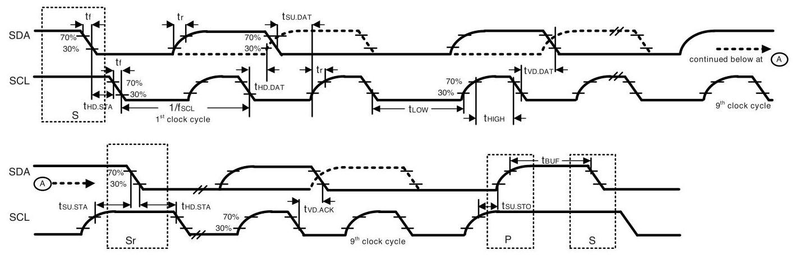

Figure 1. \( {\mathrm{I}}^{2}\mathrm{C} \) Bus Timing Diagram

### 3.5 SPI TIMING CHARACTERIZATION - 4-WIRE SPI MODE

Typical Operating Circuit of section 4.2, VDD \( = {1.8}\mathrm{\;V},\mathrm{{VDDIO}} = {1.8}\mathrm{\;V},{\mathrm{\;T}}_{\mathrm{A}} = {25}^{ \circ  }\mathrm{C} \) , unless otherwise noted.

<table><tr><td>PARAMETERS</td><td>CONDITIONS</td><td>MIN</td><td>TYP</td><td>MAX</td><td>UNITS</td><td>NOTES</td></tr><tr><td>SPI TIMING</td><td/><td/><td/><td/><td/><td/></tr><tr><td>fSPC, SCLK Clock Frequency</td><td>Default</td><td/><td/><td>24</td><td>MHz</td><td>1</td></tr><tr><td>tLow, SCLK Low Period</td><td/><td>17</td><td/><td/><td>ns</td><td>1</td></tr><tr><td>\( {\mathrm{t}}_{\mathrm{{HIGH}}} \) , SCLK High Period</td><td/><td>17</td><td/><td/><td>ns</td><td>1</td></tr><tr><td>tsu.cs, CS Setup Time</td><td/><td>39</td><td/><td/><td>ns</td><td>1</td></tr><tr><td>\( {\mathrm{t}}_{\mathrm{{HD}}.\mathrm{{CS}}} \) , CS Hold Time</td><td/><td>18</td><td/><td/><td>ns</td><td>1</td></tr><tr><td>tsu.spi, SDI Setup Time</td><td/><td>13</td><td/><td/><td>ns</td><td>1</td></tr><tr><td>\( {\mathrm{t}}_{\mathrm{{HD}}.\mathrm{{SDI}}} \) , SDI Hold Time</td><td/><td>8</td><td/><td/><td>ns</td><td>1</td></tr><tr><td>type, SDO Valid Time</td><td>\( {C}_{\text{load }} = {20}\mathrm{{pF}} \)</td><td/><td/><td>21.5</td><td>ns</td><td>1</td></tr><tr><td>\( {\mathrm{t}}_{\mathrm{{HD}},\mathrm{{SDO}}} \) , SDO Hold Time</td><td>\( {C}_{\text{load }} = {20}\mathrm{{pF}} \)</td><td>3.5</td><td/><td/><td>ns</td><td>1</td></tr><tr><td>\( {\mathrm{t}}_{\text{DIS.SDO,}} \) SDO Output Disable Time</td><td/><td/><td/><td>28</td><td>ns</td><td>1</td></tr><tr><td>Trall, SCLK Fall Time</td><td/><td/><td/><td>16</td><td>ns</td><td>2</td></tr><tr><td>\( {\mathrm{t}}_{\text{Rise }} \) , SCLK Rise Time</td><td/><td/><td/><td>16</td><td>ns</td><td>2</td></tr></table>

Table 6. 4-Wire SPI Timing Characteristics (24-MHz Operation)

Notes:

1. Based on characterization of 5 parts over temperature and voltage as mounted on evaluation board or in sockets

2. Based on design and device characterization

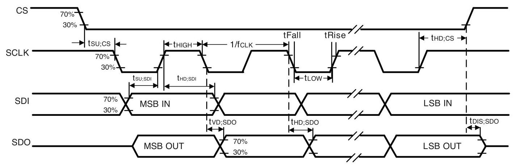

Figure 2. 4-Wire SPI Bus Timing Diagram

### 3.6 SPI TIMING CHARACTERIZATION - 3-WIRE SPI MODE

Typical Operating Circuit of section 4.2, VDD \( = {1.8}\mathrm{\;V},\mathrm{{VDDIO}} = {1.8}\mathrm{\;V},{\mathrm{\;T}}_{\mathrm{A}} = {25}^{ \circ  }\mathrm{C} \) , unless otherwise noted.

<table><tr><td>PARAMETERS</td><td>CONDITIONS</td><td>MIN</td><td>TYP</td><td>MAX</td><td>UNITS</td><td>NOTES</td></tr><tr><td>SPI TIMING</td><td/><td/><td/><td/><td/><td/></tr><tr><td>fSPC, SCLK Clock Frequency</td><td>Default</td><td/><td/><td>24</td><td>MHz</td><td>1</td></tr><tr><td>tLow, SCLK Low Period</td><td/><td>17</td><td/><td/><td>ns</td><td>1</td></tr><tr><td>\( {\mathrm{t}}_{\mathrm{{HIGH}}} \) , SCLK High Period</td><td/><td>17</td><td/><td/><td>ns</td><td>1</td></tr><tr><td>tsu.cs, CS Setup Time</td><td/><td>39</td><td/><td/><td>ns</td><td>1</td></tr><tr><td>\( {\mathrm{t}}_{\mathrm{{HD}}.\mathrm{{CS}}} \) , CS Hold Time</td><td/><td>5</td><td/><td/><td>ns</td><td>1</td></tr><tr><td>type, SDIO, SDIO Input Setup Time</td><td/><td>13</td><td/><td/><td>ns</td><td>1</td></tr><tr><td>\( {\mathrm{t}}_{\mathrm{{HD}}.\mathrm{{SDIO}}} \) , SDIO Input Hold Time</td><td/><td>8</td><td/><td/><td>ns</td><td>1</td></tr><tr><td>typ. SDIO, SDIO Output Valid Time</td><td>\( {C}_{\text{load }} = {20}\mathrm{{pF}} \)</td><td/><td/><td>18.5</td><td>ns</td><td>1</td></tr><tr><td>\( {\mathrm{t}}_{\mathrm{{HD}}.\mathrm{{SDIO}}} \) , SDIO Output Hold Time</td><td>\( {C}_{\text{load }} = {20}\mathrm{{pF}} \)</td><td>3.5</td><td/><td/><td>ns</td><td>1</td></tr><tr><td>\( {\mathrm{t}}_{\text{DIS.SDIO }} \) , SDIO Output Disable Time</td><td/><td/><td/><td>28</td><td>ns</td><td>1</td></tr><tr><td>\( {\mathrm{t}}_{\mathrm{{Fall}}} \) , SCLK Fall Time</td><td/><td/><td/><td>16</td><td>ns</td><td>2</td></tr><tr><td>\( {\mathrm{t}}_{\text{Rise }} \) , SCLK Rise Time</td><td/><td/><td/><td>16</td><td>ns</td><td>2</td></tr></table>

Table 7. 3-Wire SPI Timing Characteristics (24-MHz Operation)

Notes:

1. Based on characterization of 5 parts over temperature and voltage as mounted on evaluation board or in sockets

2. Based on design and device characterization

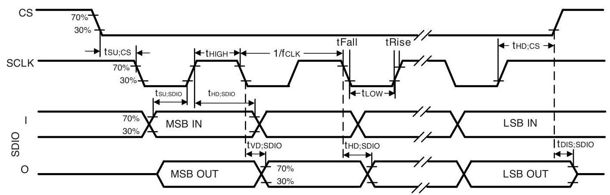

Figure 3. 3-Wire SPI Bus Timing Diagram

### 3.7 RTC (CLKIN) TIMING CHARACTERIZATION

Typical Operating Circuit of section 4.2, VDD \( = {1.8}\mathrm{\;V},\mathrm{{VDDIO}} = {1.8}\mathrm{\;V},{\mathrm{\;T}}_{\mathrm{A}} = {25}^{ \circ  }\mathrm{C} \) , unless otherwise noted.

<table><tr><td>PARAMETERS</td><td>CONDITIONS</td><td>MIN</td><td>TYP</td><td>MAX</td><td>UNITS</td><td>NOTES</td></tr><tr><td>RTC (CLKIN) TIMING</td><td/><td/><td/><td/><td/><td/></tr><tr><td>FRTC, RTC Clock Frequency</td><td>Default</td><td>31</td><td>32</td><td>50</td><td>kHz</td><td/></tr><tr><td>\( {\mathrm{t}}_{\text{HIGHRTC }} \) , RTC Clock High Period</td><td/><td>1</td><td/><td/><td>us</td><td/></tr><tr><td>TRIseRTC, RTC Clock Rise Time</td><td/><td>5</td><td/><td>500</td><td>ns</td><td/></tr><tr><td>TrallRTC, RTC Clock Fall Time</td><td/><td>5</td><td/><td>500</td><td>ns</td><td/></tr></table>

Table 8. RTC Timing Characteristics

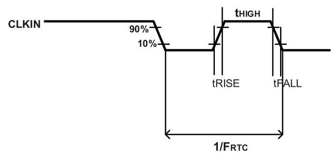

Figure 4. RTC Timing Diagram

### 3.8 ABSOLUTE MAXIMUM RATINGS

Stress above those listed as "Absolute Maximum Ratings" may cause permanent damage to the device. These are stress ratings only and functional operation of the device at these conditions is not implied. Exposure to the absolute maximum ratings conditions for extended periods may affect device reliability.

<table><tr><td>Parameter</td><td>Rating</td></tr><tr><td>Supply Voltage, VDD</td><td>-0.5 V to +4 V</td></tr><tr><td>Supply Voltage, VDDIO</td><td>-0.5 V to +4 V</td></tr><tr><td>Input Voltage Level (FSYNC, SCL, SDA)</td><td>-0.5 V to VDDIO + 0.5 V</td></tr><tr><td>Acceleration (Any Axis, unpowered)</td><td>20,000g for 0.2 ms</td></tr><tr><td>Operating Temperature Range</td><td>\( - {40}^{ \circ  }\mathrm{C} \) to \( + {85}^{ \circ  }\mathrm{C} \)</td></tr><tr><td>Storage Temperature Range</td><td>-40°C to +125°C</td></tr><tr><td>Electrostatic Discharge (ESD) Protection</td><td>2 kV (HBM); 500 V (CDM)</td></tr><tr><td>Latch-up</td><td>JEDEC Class II (2),125°C \( \pm  {100}\mathrm{\;{mA}} \)</td></tr></table>

Table 9. Absolute Maximum Ratings

## 4 APPLICATIONS INFORMATION

### 4.1 PIN OUT DIAGRAM AND SIGNAL DESCRIPTION

<table><tr><td>Pin Number</td><td>Pin Name</td><td>Pin Description</td></tr><tr><td>1</td><td>AP_SDO / AP_ADO</td><td>AP_SDO: AP SPI serial data output (4-wire mode); AP ADO: AP I3C \( {}^{\mathrm{{SM}}}/{\mathrm{I}}^{2} \) C slave address LSB</td></tr><tr><td>2</td><td>RESV</td><td>No Connect or Connect to GND</td></tr><tr><td>3</td><td>RESV</td><td>No Connect or Connect to GND</td></tr><tr><td>4</td><td>INT1 / INT</td><td>INT1: Interrupt 1 (Note: INT1 can be push-pull or open drain) INT: All interrupts mapped to pin 4</td></tr><tr><td>5</td><td>VDDIO</td><td>IO power supply voltage</td></tr><tr><td>6</td><td>GND</td><td>Power supply ground</td></tr><tr><td>7</td><td>RESV</td><td>Connect to GND</td></tr><tr><td>8</td><td>VDD</td><td>Power supply voltage</td></tr><tr><td>9</td><td>INT2 / FSYNC / CLKIN</td><td>INT2: Interrupt 2 (Note: INT2 can be push-pull or open drain) FSYNC: Frame sync input; Connect to GND if FSYNC not used CLKIN: External clock input</td></tr><tr><td>10</td><td>RESV</td><td>No Connect or Connect to GND</td></tr><tr><td>11</td><td>RESV</td><td>No Connect or Connect to GND</td></tr><tr><td>12</td><td>AP_CS</td><td>AP SPI Chip select (AP SPI interface); Connect to VDDIO if using AP \( {13}{\mathrm{C}}^{\mathrm{{SM}}}/{\mathrm{l}}^{2}\mathrm{C} \) interface</td></tr><tr><td>13</td><td>AP_SCL / AP_SCLK</td><td>AP_SCL: AP I3C \( {}^{\mathrm{{SM}}}/{\mathrm{I}}^{2}\mathrm{C} \) serial clock; AP_SCLK: AP SPI serial clock</td></tr><tr><td>14</td><td>AP SDA / AP SDIO / AP_SDI</td><td>AP_SDA: AP I3C \( {}^{\mathrm{{SM}}}/{\mathrm{I}}^{2}\mathrm{C} \) serial data; AP_SDIO: AP SPI serial data I/O (3-wire mode); AP SDI: AP SPI serial data input (4-wire mode)</td></tr></table>

Table 10. Signal Descriptions

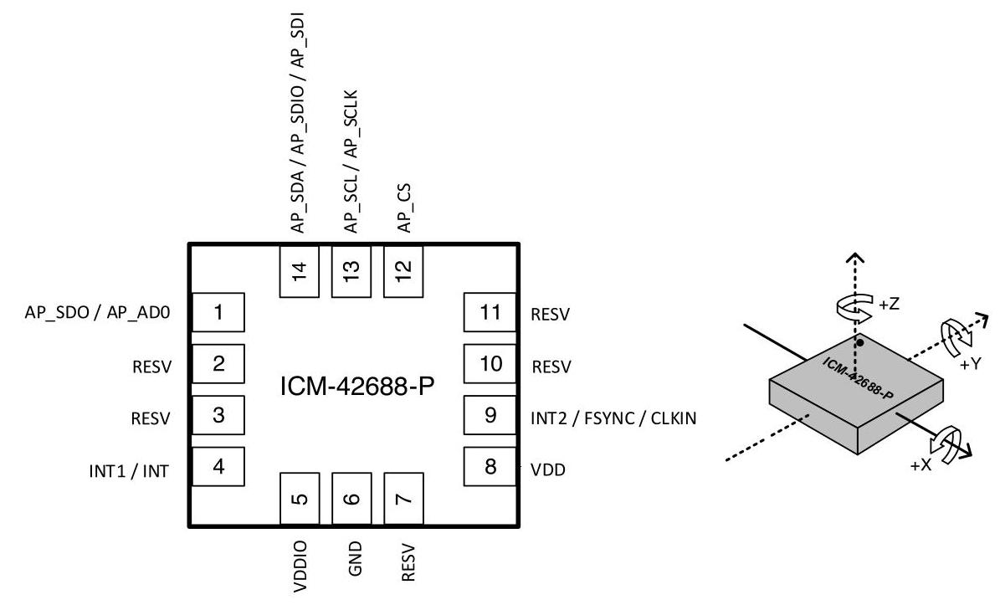

### 4.2 TYPICAL OPERATING CIRCUIT

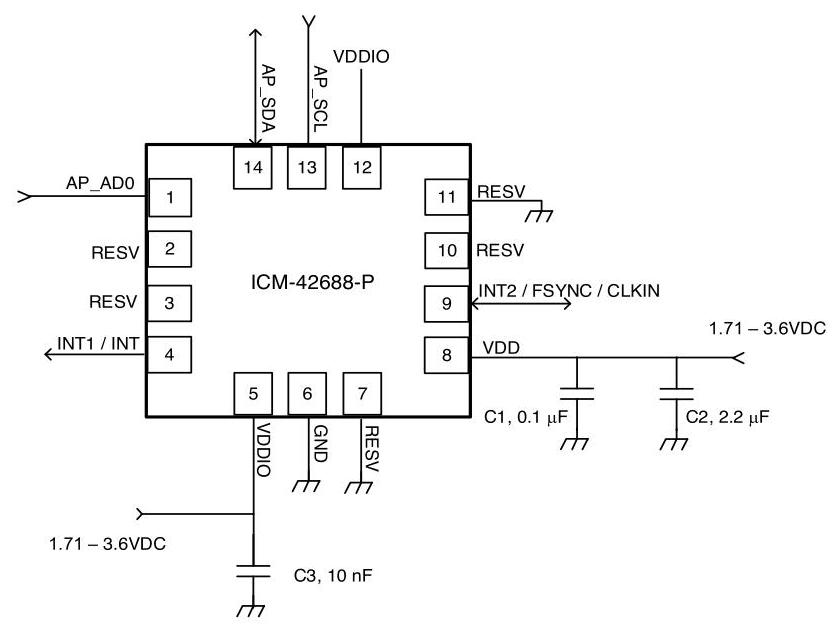

Figure 6. ICM-42688-P Application Schematic ( \( {\mathrm{{IZC}}}^{\mathrm{{SM}}}/{\mathrm{I}}^{2}\mathrm{C} \) Interface to Host)

Note: \( {\mathrm{I}}^{2}\mathrm{C} \) lines are open drain and pull-up resistors (e.g. \( {10}\mathrm{k}\Omega \) ) are required.

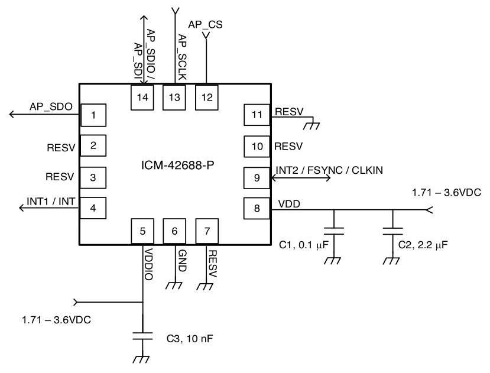

Figure 7. ICM-42688-P Application Schematic (SPI Interface to Host)

### 4.3 BILL OF MATERIALS FOR EXTERNAL COMPONENTS

<table><tr><td>Component</td><td>Label</td><td>Specification</td><td>Quantity</td></tr><tr><td rowspan="2">VDD Bypass Capacitors</td><td>C1</td><td>X7R, 0.1μF ±10%</td><td>1</td></tr><tr><td>C2</td><td>X7R, 2.2μF ±10%</td><td>1</td></tr><tr><td>VDDIO Bypass Capacitor</td><td>C3</td><td>X7R, 10nF ±10%</td><td>1</td></tr></table>

Table 11. Bill of Materials

### 4.4 SYSTEM BLOCK DIAGRAM

Figure 8. ICM-42688-P System Block Diagram

Note: The above block diagram is an example. Please refer to the pin-out (section 4.1) for other configuration options.

### 4.5 OVERVIEW

The ICM-42688-P is comprised of the following key blocks and functions:

- Three-axis MEMS rate gyroscope sensor with 16-bit ADCs and signal conditioning

- 20-bits data format support in FIFO for high-data resolution (see section 6 for details)

- Three-axis MEMS accelerometer sensor with 16-bit ADCs and signal conditioning

- 20-bits data format support in FIFO for high-data resolution (see section 6 for details)

- \( \;{\mathrm{{I3C}}}^{\mathrm{{SM}}},{\mathrm{I}}^{2}\mathrm{C} \) and SPI serial communications interfaces

- Self-Test

- Clocking

- Sensor Data Registers

- FIFO

- Interrupts

- Digital-Output Temperature Sensor

- Bias and LDOs

- Charge Pump

- Standard Power Modes

### 4.6 THREE-AXIS MEMS GYROSCOPE WITH 16-BIT ADCS AND SIGNAL CONDITIONING

The ICM-42688-P includes a vibratory MEMS rate gyroscope, which detects rotation about the X-, Y-, and Z- Axes. When the gyroscope is rotated about any of the sense axes, the Coriolis Effect causes a vibration that is detected by a capacitive pickoff. The resulting signal is amplified, demodulated, and filtered to produce a voltage that is proportional to the angular rate. This voltage is digitized using on-chip Analog-to-Digital Converters (ADCs) to sample each axis. The full-scale range of the gyro sensors may be digitally programmed to \( \pm  {15.625}, \pm  {31.25}, \pm  {62.5}, \pm  {125}, \pm  {250}, \pm  {500}, \pm  {1000} \) , and ±2000 degrees per second (dps).

### 4.7 THREE-AXIS MEMS ACCELEROMETER WITH 16-BIT ADCS AND SIGNAL CONDITIONING

The ICM-42688-P includes a 3-Axis MEMS accelerometer. Acceleration along a particular axis induces displacement of a proof mass in the MEMS structure, and capacitive sensors detect the displacement. The ICM-42688-P architecture reduces the accelerometers' susceptibility to fabrication variations as well as to thermal drift. When the device is placed on a flat surface, it will measure \( {0g} \) on the X- and Y-axes and +1g on the Z-axis. The accelerometers’ scale factor is calibrated at the factory and is nominally independent of supply voltage. The full-scale range of the digital output can be adjusted to \( \pm  {2g}, \pm  {4g}, \pm  {8g} \) and \( \pm  {16g} \) .

### 4.8 I3C \( {}^{\mathrm{{SM}}} \) , \( {\mathrm{I}}^{2} \) C AND SPI HOST INTERFACE

The ICM-42688-P communicates to the application processor using an I3C’ \( {}^{\mathrm{{SM}}} \) , \( {}^{1} \) C, or SPI serial interface. The ICM-42688-P always acts as a slave when communicating to the application processor.

### 4.9 SELF-TEST

Self-test allows for the testing of the mechanical and electrical portions of the sensors. The self-test for each measurement axis can be activated by means of the gyroscope and accelerometer self-test registers. When the self-test is activated, the electronics cause the sensors to be actuated and produce an output signal. The output signal is used to observe the self-test response.

The self-test response is defined as follows:

Self-test response = Sensor output with self-test enabled - Sensor output with self-test disabled

When the value of the self-test response is within the specified min/max limits of the product specification, the part has passed self-test. When the self-test response exceeds the min/max values, the part is deemed to have failed self-test.

### 4.10 CLOCKING

The ICM-42688-P has a flexible clocking scheme, allowing external or internal clock sources to be used for the internal synchronous circuitry. This synchronous circuitry includes the signal conditioning and ADCs, and various control circuits and registers.

The CLKIN pin on ICM-42688-P provides the ability to input an external clock. A highly accurate external clock may be used rather than the internal clocks sources, if greater clock accuracy is desired. External clock input supports highly accurate clock input from \( {31}\mathrm{{kHz}} \) to \( {50}\mathrm{{kHz}} \) , resulting in improvement of the following:

a) ODR uncertainty due to process, temperature, operating mode (PLL vs. RCOSC), and design limitations. This uncertainty can be as high as \( \pm  8\% \) in RCOSC mode and \( \pm  1\% \) in PLL mode. The CLKIN, assuming a \( {50}\mathrm{{ppm}} \) or better \( {32.768}\mathrm{{kHz}} \) source, will improve the ODR accuracy from \( \pm  {80},{000}\mathrm{{ppm}} \) to \( \pm  {50}\mathrm{{ppm}} \) in RCOSC mode, or from \( \pm  {10},{000}\mathrm{{ppm}} \) to \( \pm  {50}\mathrm{{ppm}} \) in PLL mod

b) System level sensitivity error. Any clock uncertainty directly impacts gyroscope sensitivity at the system level. Sophisticated systems can estimate ODR inaccuracy to some extent, but not to the extent improved by using CLKIN.

c) System-level clock/sensor synchronization. When using CLKIN, the accelerometer and gyroscope are on the same clock as the host. There is no need to continually re-synchronize the sensor data as the sensor sample points and period are known to be in exact alignment with the common system clock.

d) CLKIN helps EIS (Electronic Image Stabilization) performance by providing:

- Very accurate gyroscope sample points for use during integration to find true angular displacement.

- Automatic time alignment between the motion sensor and the host and potentially the camera system.

e) Other applications that benefit from CLKIN include navigation, gaming, robotics.

Allowable internal sources for generating the internal clock are:

a) An internal relaxation oscillator

b) Auto-select between internal relaxation oscillator and gyroscope MEMS oscillator to use the best available source

For internal sources, the only setting supporting specified performance in all modes is option b). It is recommended that option b) be used when using internal clock source.

### 4.11 SENSOR DATA REGISTERS

The sensor data registers contain the latest gyroscope, accelerometer, and temperature measurement data. They are read-only registers, and are accessed via the serial interface. Data from these registers may be read anytime.

### 4.12 INTERRUPTS

Interrupt functionality is configured via the Interrupt Configuration register. Items that are configurable include the interrupt pins configuration, the interrupt latching and clearing method, and triggers for the interrupt. Items that can trigger an interrupt are (1) Clock generator locked to new reference oscillator (used when switching clock sources); (2) new data is available to be read (from the FIFO and Data registers); (3) accelerometer event interrupts; (4) FIFO watermark; (5) FIFO overflow. The interrupt status can be read from the Interrupt Status register.

### 4.13 DIGITAL-OUTPUT TEMPERATURE SENSOR

An on-chip temperature sensor and ADC are used to measure the ICM-42688-P die temperature. The readings from the ADC can be read from the FIFO or the Sensor Data registers.

Temperature sensor register data TEMP_DATA is updated with new data at max(Accelerometer ODR, Gyroscope ODR).

Temperature data value from the sensor data registers can be converted to degrees centigrade by using the following formula:

Temperature in Degrees Centigrade \( = \left( {\text{TEMP_DATA}/{132.48}}\right)  + {25} \)

Temperature data stored in FIFO is an 8-bit quantity, FIFO_TEMP_DATA. It can be converted to degrees centigrade by using the following formula:

Temperature in Degrees Centigrade \( = \left( {\text{FIFO_TEMP_DATA}/{2.07}}\right)  + {25} \)

### 4.14 BIAS AND LDOS

The bias and LDO section generates the internal supply and the reference voltages and currents required by the ICM-42688-P.

### 4.15 CHARGE PUMP

An on-chip charge pump generates the high voltage required for the MEMS oscillator.

### 4.16 STANDARD POWER MODES

The following table lists the user-accessible power modes for ICM-42688-P.

<table><tr><td>Mode</td><td>Name</td><td>Gyro</td><td>Accel</td></tr><tr><td>1</td><td>Sleep Mode</td><td>Off</td><td>Off</td></tr><tr><td>2</td><td>Standby Mode</td><td>Drive On</td><td>Off</td></tr><tr><td>3</td><td>Accelerometer Low-Power Mode</td><td>Off</td><td>Duty-Cycled</td></tr><tr><td>4</td><td>Accelerometer Low-Noise Mode</td><td>Off</td><td>On</td></tr><tr><td>5</td><td>Gyroscope Low-Noise Mode</td><td>On</td><td>Off</td></tr><tr><td>6</td><td>6-Axis Low-Noise Mode</td><td>On</td><td>On</td></tr></table>

Table 12. Standard Power Modes for ICM-42688-P

## 5 SIGNAL PATH

The following figure shows a block diagram of the signal path for ICM-42688-P.

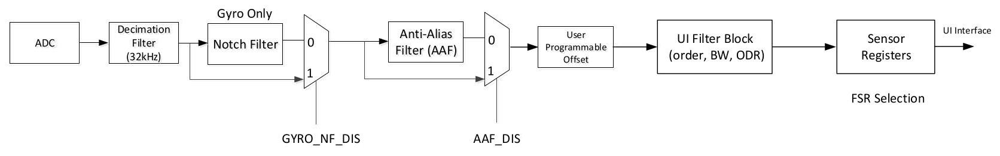

Figure 9. ICM-42688-P Signal Path

The signal path starts with ADCs for the gyroscope and accelerometer. Other components of the signal path are described below in further detail.

### 5.1 SUMMARY OF PARAMETERS USED TO CONFIGURE THE SIGNAL PATH

The following table shows the parameters that can control the signal path.

<table><tr><td>Parameter Name</td><td>Description</td></tr><tr><td>GYRO_AAF_DIS</td><td>Disables the Gyroscope Anti Alias Filter (AAF)</td></tr><tr><td>GYRO_AAF_DELT</td><td>Three parameters required to program the gyroscope AAF. This is a \( {2}^{\text{nd }} \) order filter with</td></tr><tr><td>GYRO_AAF_DELTSQR</td><td>programmable low pass filter. This is a user programmable filter which can be used to select</td></tr><tr><td>GYRO_AAF_BITSHIFT</td><td>the desired BW. This filter allows trading off RMS noise vs. latency for a given ODR.</td></tr><tr><td>ACCEL_AAF_DIS</td><td>Disables the Accelerometer Anti Alias Filter</td></tr><tr><td>ACCEL_AAF_DEL</td><td>Three parameters required to program the accelerometer AAF. This is a \( {2}^{\text{nd }} \) order filter with</td></tr><tr><td>ACCEL_AAF_DELTSQR</td><td>programmable low pass filter. This is a user programmable filter which can be used to select</td></tr><tr><td>ACCEL_AAF_BITSHIFT</td><td>the desired BW. This filter allows trading off RMS noise vs. latency for a given ODR.</td></tr><tr><td>GYRO_NF_DIS</td><td>Disables the gyro Notch Filter</td></tr><tr><td>GYRO_X/Y/Z_NF_COSWZ GYRO_X/Y/Z_NF_COSWZ_SEL</td><td>Factory trimmed parameters, designed to position a Notch at or near the sense peak frequency of Gyro. This allows the user to suppress only sense peak contribution to noise, while still maintaining a low latency high BW/ODR interface from the Sensor. This filter is available only in Gyro, and the parameters for X, Y, and Z are chosen independently.</td></tr><tr><td>GYRO_NF_BW_SEL</td><td>Factory trimmed parameter to cancel noise created by sense peak from Gyro. This parameter is common to all three axes</td></tr></table>

### 5.2 NOTCH FILTER

The Notch Filter is supported only for the gyroscope signal path. The following steps can be used to program the notch filter. Note that the notch filter is specific to each axis in the gyroscope, so the X, Y and Z axis can be programmed independently.

## Frequency of Notch Filter (each axis)

To operate the Notch filter, two parameters NF_COSWZ, and NF_COSWZ_SEL must be programmed for each gyroscope axis.

Parameters NF_COSWZ are defined for each axis of the gyroscope as GYRO_X_NF_COSWZ (register bank 1, register 0x0Fh & register Ox12h), GYRO_Y_NF_COSWZ (register bank 1, register 0x10h & register 0x12h), GYRO_Z_NF_COSWZ (register bank 1, register 0x11h & register 0x12h). Note that the parameters have 9-bit values across two different registers.

Parameters NF_COSWZ_SEL are defined for each axis of the gyroscope as GYRO_X_NF_COSWZ_SEL (register bank 1, register 0x12h, bit 3), GYRO_Y_NF_COSWZ_SEL (register bank 1, register 0x12h, bit 4), GYRO_Z_NF_COSWZ_SEL (register bank 1, register 0x12h, bit 5).

Each value must be calculated using the steps described below, and programmed into the corresponding register locations mentioned above.

fdesired is the desired frequency of the Notch Filter in kHz. The lower bound for fdesired is \( 1\mathrm{{kHz}} \) , and the upper bound is \( 3\mathrm{{kHz}} \) . Operating the notch filter outside this range is not supported.

---

Step1: Fdrv = 19.2MHz/(CLKDIV*10); See Bank 3 register 0x2A for CLKDIV

Step2: COSWZ = cos(2*pi*fdesired/Fdrv)

Step3:

	If abs \( \left( {\mathrm{{COSWZ}}\text{)} \leq  {0.875}}\right) \)

			NF_COSWZ = round[COSWZ*256]

			NF_COSWZ_SEL = 0

	else

			NF_COSWZ_SEL = 1

			if COSWZ > 0.875

					NF_COSWZ = round [8*(1-COSWZ)*256]

			else if COSWZ < -0.875

					NF_COSWZ = round [-8*(1+COSWZ)*256]

			end

	End

---

## Bandwidth of Notch Filter (common to all axes)

The notch filter allows the user to control the width of the notch from eight possible values using a 3-bit parameter GYRO_NF_BW_SEL in register bank 1, register 0x13h, bits 6:4. This parameter is common to all three axes.

<table><tr><td>GYRO_NF_BW_SEL</td><td>Notch Filter Bandwidth (Hz)</td></tr><tr><td>0</td><td>1449</td></tr><tr><td>1</td><td>680</td></tr><tr><td>2</td><td>329</td></tr><tr><td>3</td><td>162</td></tr><tr><td>4</td><td>80</td></tr><tr><td>5</td><td>40</td></tr><tr><td>6</td><td>20</td></tr><tr><td>7</td><td>10</td></tr></table>

The notch filter can be selected or bypassed by using the parameter GYRO_NF_DIS in register bank 1, register 0x0Bh, bit 0 as shown below.

<table><tr><td>GYRO_NF_DIS</td><td>Function</td></tr><tr><td>0</td><td>Enable notch filter</td></tr><tr><td>1</td><td>Disable notch filter</td></tr></table>

### 5.3 ANTI-ALIAS FILTER

Anti-alias filters for gyroscope and accelerometer can be independently programmed to have bandwidths ranging from 42 Hz to 3979 Hz. To program the anti-alias filter for a required bandwidth, use the table below to map the bandwidth to register values as shown:

a. Register bank 2, register 0x03h, bits 6:1, ACCEL_AAF_DELT: Code from 1 to 63 that allows programming the bandwidth for accelerometer anti-alias filter

b. Register bank 2, register 0x04h, bits 7:0 and Bank 2, register 0x05h, bits 3:0, ACCEL_AAF_DELTSQR: Square of the delt value for accelerometer

c. Register bank 2, register 0x05h, bits 7:4, ACCEL_AAF_BITSHIFT: Bitshift value for accelerometer used in hardware implementation

d. Register bank 1, register 0x0Ch, bits 5:0, GYRO_AAF_DELT: Code from 1 to 63 that allows programming the bandwidth for gyroscope anti-alias filter

e. Register bank 1, register 0x0Dh, bits 7:0 and Bank 1, register 0x0Eh, bits 3:0, GYRO_AAF_DELTSQR: Square of the delt value for gyroscope

f. Register bank 1, register 0x0Eh, bits 7:4, GYRO_AAF_BITSHIFT: Bitshift value for gyroscope used in hardware implementation

<table><tr><td>3dB Bandwidth (Hz)</td><td>ACCEL_AAF_DELT; GYRO_AAF_DELT</td><td>ACCEL_AAF_DELTSQR; GYRO_AAF_DELTSQR</td><td>ACCEL_AAF_BITSHIFT; GYRO_AAF_BITSHIFT</td></tr><tr><td>42</td><td>1</td><td>1</td><td>15</td></tr><tr><td>84</td><td>2</td><td>4</td><td>13</td></tr><tr><td>126</td><td>3</td><td>9</td><td>12</td></tr><tr><td>170</td><td>4</td><td>16</td><td>11</td></tr><tr><td>213</td><td>5</td><td>25</td><td>10</td></tr><tr><td>258</td><td>6</td><td>36</td><td>10</td></tr><tr><td>303</td><td>7</td><td>49</td><td>9</td></tr><tr><td>348</td><td>8</td><td>64</td><td>9</td></tr><tr><td>394</td><td>9</td><td>81</td><td>9</td></tr><tr><td>441</td><td>10</td><td>100</td><td>8</td></tr><tr><td>488</td><td>11</td><td>122</td><td>8</td></tr><tr><td>536</td><td>12</td><td>144</td><td>8</td></tr><tr><td>585</td><td>13</td><td>170</td><td>8</td></tr><tr><td>634</td><td>14</td><td>196</td><td>7</td></tr><tr><td>684</td><td>15</td><td>224</td><td>7</td></tr><tr><td>734</td><td>16</td><td>256</td><td>7</td></tr><tr><td>785</td><td>17</td><td>288</td><td>7</td></tr><tr><td>837</td><td>18</td><td>324</td><td>7</td></tr><tr><td>890</td><td>19</td><td>360</td><td>6</td></tr><tr><td>943</td><td>20</td><td>400</td><td>6</td></tr><tr><td>997</td><td>21</td><td>440</td><td>6</td></tr><tr><td>1051</td><td>22</td><td>488</td><td>6</td></tr><tr><td>1107</td><td>23</td><td>528</td><td>6</td></tr><tr><td>1163</td><td>24</td><td>576</td><td>6</td></tr><tr><td>1220</td><td>25</td><td>624</td><td>6</td></tr><tr><td>1277</td><td>26</td><td>680</td><td>6</td></tr><tr><td>1336</td><td>27</td><td>736</td><td>5</td></tr></table>

<table><tr><td>1395</td><td>28</td><td>784</td><td>5</td></tr><tr><td>1454</td><td>29</td><td>848</td><td>5</td></tr><tr><td>1515</td><td>30</td><td>896</td><td>5</td></tr><tr><td>1577</td><td>31</td><td>960</td><td>5</td></tr><tr><td>1639</td><td>32</td><td>1024</td><td>5</td></tr><tr><td>1702</td><td>33</td><td>1088</td><td>5</td></tr><tr><td>1766</td><td>34</td><td>1152</td><td>5</td></tr><tr><td>1830</td><td>35</td><td>1232</td><td>5</td></tr><tr><td>1896</td><td>36</td><td>1296</td><td>5</td></tr><tr><td>1962</td><td>37</td><td>1376</td><td>4</td></tr><tr><td>2029</td><td>38</td><td>1440</td><td>4</td></tr><tr><td>2097</td><td>39</td><td>1536</td><td>4</td></tr><tr><td>2166</td><td>40</td><td>1600</td><td>4</td></tr><tr><td>2235</td><td>41</td><td>1696</td><td>4</td></tr><tr><td>2306</td><td>42</td><td>1760</td><td>4</td></tr><tr><td>2377</td><td>43</td><td>1856</td><td>4</td></tr><tr><td>2449</td><td>44</td><td>1952</td><td>4</td></tr><tr><td>2522</td><td>45</td><td>2016</td><td>4</td></tr><tr><td>2596</td><td>46</td><td>2112</td><td>4</td></tr><tr><td>2671</td><td>47</td><td>2208</td><td>4</td></tr><tr><td>2746</td><td>48</td><td>2304</td><td>4</td></tr><tr><td>2823</td><td>49</td><td>2400</td><td>4</td></tr><tr><td>2900</td><td>50</td><td>2496</td><td>4</td></tr><tr><td>2978</td><td>51</td><td>2592</td><td>4</td></tr><tr><td>3057</td><td>52</td><td>2720</td><td>4</td></tr><tr><td>3137</td><td>53</td><td>2816</td><td>3</td></tr><tr><td>3217</td><td>54</td><td>2944</td><td>3</td></tr><tr><td>3299</td><td>55</td><td>3008</td><td>3</td></tr><tr><td>3381</td><td>56</td><td>3136</td><td>3</td></tr><tr><td>3464</td><td>57</td><td>3264</td><td>3</td></tr><tr><td>3548</td><td>58</td><td>3392</td><td>3</td></tr><tr><td>3633</td><td>59</td><td>3456</td><td>3</td></tr><tr><td>3718</td><td>60</td><td>3584</td><td>3</td></tr><tr><td>3805</td><td>61</td><td>3712</td><td>3</td></tr><tr><td>3892</td><td>62</td><td>3840</td><td>3</td></tr><tr><td>3979</td><td>63</td><td>3968</td><td>3</td></tr></table>

The anti-alias filter can be selected or bypassed for the gyroscope by using the parameter GYRO_AAF_DIS in register bank 1, register 0x0Bh, bit 1 as shown below. The anti-alias filter can be selected or bypassed for the accelerometer by using the parameter ACCEL_AAF_DIS in register bank 2, register \( 0 \times  {03}\mathrm{\;h} \) , bit0as shown below.

<table><tr><td>GYRO_AAF_DIS</td><td>Function</td></tr><tr><td>0</td><td>Enable gyroscope anti-aliasing filter</td></tr><tr><td>1</td><td>Disable gyroscope anti-aliasing filter</td></tr></table>

<table><tr><td>ACCEL_AAF_DIS</td><td>Function</td></tr><tr><td>0</td><td>Enable accelerometer anti-aliasing filter</td></tr><tr><td>1</td><td>Disable accelerometer anti-aliasing filter</td></tr></table>

### 5.4 USER PROGRAMMABLE OFFSET

Gyroscope and accelerometer offsets can be programmed by the user by using registers OFFSET_USERO, through OFFSET_USER8, in bank 0, registers 0x77h through 0x7Fh (bank 4) as shown below.

<table><tr><td>Register Address</td><td>Register Name</td><td>Bits</td><td>Function</td></tr><tr><td>0x77h</td><td>OFFSET_USERO</td><td>7:0</td><td>Lower bits of X-gyro offset programmed by user. Max value is \( \pm  {64}\mathrm{{dps}} \) , resolution is \( 1/{32}\mathrm{{dps}} \) .</td></tr><tr><td rowspan="2">0x78h</td><td rowspan="2">OFFSET_USER1</td><td>3:0</td><td>Upper bits of X-gyro offset programmed by user. Max value is \( \pm  {64}\mathrm{{dps}} \) , resolution is \( 1/{32}\mathrm{{dps}} \) .</td></tr><tr><td>7:4</td><td>Upper bits of Y-gyro offset programmed by user. Max value is \( \pm  {64}\mathrm{{dps}} \) , resolution is \( 1/{32}\mathrm{{dps}} \) .</td></tr><tr><td>0x79h</td><td>OFFSET_USER2</td><td>7:0</td><td>Lower bits of Y-gyro offset programmed by user. Max value is \( \pm  {64}\mathrm{{dps}} \) , resolution is \( 1/{32}\mathrm{{dps}} \) .</td></tr><tr><td>0x7Ah</td><td>OFFSET_USER3</td><td>7:0</td><td>Lower bits of Z-gyro offset programmed by user. Max value is \( \pm  {64}\mathrm{{dps}} \) , resolution is \( 1/{32}\mathrm{{dps}} \) .</td></tr><tr><td rowspan="2">0x7Bh</td><td rowspan="2">OFFSET_USER4</td><td>3:0</td><td>Upper bits of Z-gyro offset programmed by user. Max value is \( \pm  {64}\mathrm{{dps}} \) , resolution is \( 1/{32}\mathrm{{dps}} \) .</td></tr><tr><td>7:4</td><td>Upper bits of X-accel offset programmed by user. Max value is \( \pm  1\mathrm{\;g} \) , resolution is \( {0.5}\mathrm{\;g} \) .</td></tr><tr><td>0x7Ch</td><td>OFFSET_USER5</td><td>7:0</td><td>Lower bits of X-accel offset programmed by user. Max value is \( \pm  1\mathrm{\;g} \) , resolution is \( {0.5}\mathrm{\;g} \) .</td></tr><tr><td>0x7Dh</td><td>OFFSET_USER6</td><td>7:0</td><td>Lower bits of Y-accel offset programmed by user. Max value is \( \pm  1\mathrm{\;g} \) , resolution is \( {0.5}\mathrm{\;g} \) .</td></tr><tr><td rowspan="2">0x7Eh</td><td rowspan="2">OFFSET_USER7</td><td>3:0</td><td>Upper bits of Y-accel offset programmed by user. Max value is \( \pm  1\mathrm{\;g} \) , resolution is \( {0.5}\mathrm{\;g} \) .</td></tr><tr><td>7:4</td><td>Upper bits of Z-accel offset programmed by user. Max value is \( \pm  1\mathrm{\;g} \) , resolution is \( {0.5}\mathrm{\;g} \) .</td></tr><tr><td>0x7Fh</td><td>OFFSET_USER8</td><td>7:0</td><td>Lower bits of Z-accel offset programmed by user. Max value is \( \pm  1\mathrm{\;g} \) , resolution is \( {0.5}\mathrm{\;g} \) .</td></tr></table>

### 5.5 UI FILTER BLOCK

The UI filter block can be programmed to select filter order and bandwidth independently for gyroscope and accelerometer.

Gyroscope filter order can be selected by programming the parameter GYRO_UI_FILT_ORD in register bank 0, register 0x51h, bits 3:2, as shown below.

<table><tr><td>GYRO_UI_FILT_ORD</td><td>Filter Order</td></tr><tr><td>00</td><td>\( {1}^{\text{st }} \) order</td></tr><tr><td>01</td><td>2nd order</td></tr><tr><td>10</td><td>\( {3}^{rd} \) order</td></tr><tr><td>11</td><td>Reserved</td></tr></table>

Accelerometer filter order can be selected by programming the parameter ACCEL_UI_FILT_ORD in register bank 0, register 0x53h, bits 4:3 , as shown below.

<table><tr><td>ACCEL_UI_FILT_ORD</td><td>Filter Order</td></tr><tr><td>00</td><td>\( {1}^{\text{st }} \) order</td></tr><tr><td>01</td><td>2 order</td></tr><tr><td>10</td><td>3rd order</td></tr><tr><td>11</td><td>Reserved</td></tr></table>

Gyroscope and accelerometer filter 3dB bandwidth can be selected by programming the parameter GYRO_UI_FILT_BW in register bank 0, register 0x52h, bits 3:0, and the parameter ACCEL_UI_FILT_BW in register bank 0, register 0x52h, bits 7:4, as shown below. The values shown in bold correspond to low noise and the values shown in italics correspond to low latency. User can select the appropriate setting based on the application requirements for power and latency. Corresponding Noise Bandwidth (NBW) and Group Delay values are also shown.

## \( {1}^{\text{st }} \) Order Filter 3dB Bandwidth, Noise Bandwidth (NBW), Group Delay

<table><tr><td/><td colspan="11">3dB Bandwidth (Hz) for GYRO/ACCEL_UI_FILT_ORD=0 (1st order filter)</td></tr><tr><td/><td/><td colspan="10">GYRO/ACCEL_UI_FILT_BW</td></tr><tr><td>GYRO/ACCEL_ODR</td><td>ODR(Hz)</td><td>0</td><td>1</td><td>2</td><td>3</td><td>4</td><td>5</td><td>6</td><td>7</td><td>14</td><td>15</td></tr><tr><td>1</td><td>32000</td><td colspan="10">8400.0</td></tr><tr><td>2</td><td>16000</td><td colspan="10">4194.1</td></tr><tr><td>3</td><td>8000</td><td colspan="10">2096.3</td></tr><tr><td>4</td><td>4000</td><td colspan="10">1048.1</td></tr><tr><td>5</td><td>2000</td><td colspan="10">524.0</td></tr><tr><td>6</td><td>1000</td><td>498.3</td><td>227.2</td><td>188.9</td><td>111.0</td><td>92.4</td><td>59.6</td><td>48.8</td><td>23.9</td><td>262.0</td><td>2096.3</td></tr><tr><td>15</td><td>500</td><td>249.1</td><td>113.6</td><td>94.4</td><td>55.5</td><td>46.2</td><td>29.8</td><td>24.4</td><td>11.9</td><td>131.0</td><td>1048.1</td></tr><tr><td>7</td><td>200</td><td>99.6</td><td>90.9</td><td>75.5</td><td>44.4</td><td>37.0</td><td>23.8</td><td>19.5</td><td>9.6</td><td>104.8</td><td>419.2</td></tr><tr><td>8</td><td>100</td><td>49.8</td><td>90.9</td><td>75.5</td><td>44.4</td><td>37.0</td><td>23.8</td><td>19.5</td><td>9.6</td><td>104.8</td><td>209.6</td></tr><tr><td>9</td><td>50</td><td>24.9</td><td>90.9</td><td>75.5</td><td>44.4</td><td>37.0</td><td>23.8</td><td>19.5</td><td>9.6</td><td>104.8</td><td>104.8</td></tr><tr><td>10</td><td>25</td><td>12.5</td><td>90.9</td><td>75.5</td><td>44.4</td><td>37.0</td><td>23.8</td><td>19.5</td><td>9.6</td><td>104.8</td><td>52.4</td></tr><tr><td>11</td><td>12.5</td><td>12.5</td><td>90.9</td><td>75.5</td><td>44.4</td><td>37.0</td><td>23.8</td><td>19.5</td><td>9.6</td><td>104.8</td><td>52.4</td></tr></table>

<table><tr><td/><td colspan="11">NBW Bandwidth (Hz) for GYRO/ACCEL_UI_FILT_ORD=0 (1st order filter)</td></tr><tr><td/><td/><td colspan="10">GYRO/ACCEL_UI_FILT_BW</td></tr><tr><td>GYRO/ACCEL_ODR</td><td>ODR(Hz)</td><td>0</td><td>1</td><td>2</td><td>3</td><td>4</td><td>5</td><td>6</td><td>7</td><td>14</td><td>15</td></tr><tr><td>1</td><td>32000</td><td colspan="10">8831.7</td></tr><tr><td>2</td><td>16000</td><td colspan="10">4410.6</td></tr><tr><td>3</td><td>8000</td><td colspan="10">2204.6</td></tr></table>

<table><tr><td>4</td><td>4000</td><td colspan="10">1102.2</td></tr><tr><td>5</td><td>2000</td><td colspan="10">551.1</td></tr><tr><td>6</td><td>1000</td><td>551.1</td><td>230.8</td><td>196.3</td><td>126.5</td><td>108.9</td><td>75.8</td><td>64.1</td><td>34.1</td><td>275.6</td><td>2204.6</td></tr><tr><td>15</td><td>500</td><td>280.5</td><td>115.4</td><td>98.2</td><td>63.3</td><td>54.5</td><td>37.9</td><td>32.1</td><td>17.1</td><td>137.8</td><td>1102.2</td></tr><tr><td>7</td><td>200</td><td>112.2</td><td>92.4</td><td>78.5</td><td>50.6</td><td>43.6</td><td>30.3</td><td>25.7</td><td>13.7</td><td>110.3</td><td>440.9</td></tr><tr><td>8</td><td>100</td><td>56.1</td><td>92.4</td><td>78.5</td><td>50.6</td><td>43.6</td><td>30.3</td><td>25.7</td><td>13.7</td><td>110.3</td><td>220.5</td></tr><tr><td>9</td><td>50</td><td>28.1</td><td>92.4</td><td>78.5</td><td>50.6</td><td>43.6</td><td>30.3</td><td>25.7</td><td>13.7</td><td>110.3</td><td>110.3</td></tr><tr><td>10</td><td>25</td><td>14.1</td><td>92.4</td><td>78.5</td><td>50.6</td><td>43.6</td><td>30.3</td><td>25.7</td><td>13.7</td><td>110.3</td><td>55.2</td></tr><tr><td>11</td><td>12.5</td><td>14.1</td><td>92.4</td><td>78.5</td><td>50.6</td><td>43.6</td><td>30.3</td><td>25.7</td><td>13.7</td><td>110.3</td><td>55.2</td></tr></table>

<table><tr><td/><td colspan="11">Group Delay @DC (ms) for GYRO/ACCEL_UI_FILT_ORD=0 (1st order filter)</td></tr><tr><td/><td/><td colspan="10">GYRO/ACCEL_UI_FILT_BW</td></tr><tr><td>GYRO/ACCEL_ODR</td><td>ODR(Hz)</td><td>0</td><td>1</td><td>2</td><td>3</td><td>4</td><td>5</td><td>6</td><td>7</td><td>14</td><td>15</td></tr><tr><td>1</td><td>32000</td><td colspan="10">0.1</td></tr><tr><td>2</td><td>16000</td><td colspan="10">0.1</td></tr><tr><td>3</td><td>8000</td><td colspan="10">0.2</td></tr><tr><td>4</td><td>4000</td><td colspan="10">0.4</td></tr><tr><td>5</td><td>2000</td><td colspan="10">0.8</td></tr><tr><td>6</td><td>1000</td><td>0.6</td><td>1.8</td><td>2.0</td><td>2.8</td><td>3.1</td><td>4.1</td><td>4.7</td><td>8.1</td><td>1.5</td><td>0.2</td></tr><tr><td>15</td><td>500</td><td>1.1</td><td>3.6</td><td>4.0</td><td>5.5</td><td>6.1</td><td>8.1</td><td>9.3</td><td>16.2</td><td>3.0</td><td>0.4</td></tr><tr><td>7</td><td>200</td><td>2.7</td><td>4.4</td><td>5.0</td><td>6.8</td><td>7.6</td><td>10.2</td><td>11.7</td><td>20.3</td><td>3.8</td><td>1.0</td></tr><tr><td>8</td><td>100</td><td>5.3</td><td>4.4</td><td>5.0</td><td>6.8</td><td>7.6</td><td>10.2</td><td>11.7</td><td>20.3</td><td>3.8</td><td>1.9</td></tr><tr><td>9</td><td>50</td><td>10.5</td><td>4.4</td><td>5.0</td><td>6.8</td><td>7.6</td><td>10.2</td><td>11.7</td><td>20.3</td><td>3.8</td><td>3.8</td></tr><tr><td>10</td><td>25</td><td>21.0</td><td>4.4</td><td>5.0</td><td>6.8</td><td>7.6</td><td>10.2</td><td>11.7</td><td>20.3</td><td>3.8</td><td>7.5</td></tr><tr><td>11</td><td>12.5</td><td>21.0</td><td>4.4</td><td>5.0</td><td>6.8</td><td>7.6</td><td>10.2</td><td>11.7</td><td>20.3</td><td>3.8</td><td>7.5</td></tr></table>

\( {2}^{\text{nd }} \) Order Filter 3dB Bandwidth, Noise Bandwidth (NBW), Group Delay

<table><tr><td/><td colspan="11">3dB Bandwidth (Hz) for GYRO/ACCEL_UI_FILT_ORD=1 (2nd order filter)</td></tr><tr><td/><td/><td colspan="10">GYRO/ACCEL_UI_FILT_BW</td></tr><tr><td>GYRO/ACCEL ODR</td><td>ODR(Hz)</td><td>0</td><td>1</td><td>2</td><td>3</td><td>4</td><td>5</td><td>6</td><td>7</td><td>14</td><td>15</td></tr><tr><td>1</td><td>32000</td><td colspan="10">8400.0</td></tr><tr><td>2</td><td>16000</td><td colspan="10">4194.1</td></tr><tr><td>3</td><td>8000</td><td colspan="10">2096.3</td></tr><tr><td>4</td><td>4000</td><td colspan="10">1048.1</td></tr><tr><td>5</td><td>2000</td><td colspan="10">524.0</td></tr><tr><td>6</td><td>1000</td><td>493.3</td><td>230.7</td><td>191.6</td><td>117.5</td><td>97.1</td><td>59.6</td><td>48.0</td><td>21.3</td><td>262.0</td><td>2096.3</td></tr><tr><td>15</td><td>500</td><td>246.7</td><td>115.3</td><td>95.8</td><td>58.8</td><td>48.5</td><td>29.8</td><td>24.0</td><td>10.6</td><td>131.0</td><td>1048.1</td></tr><tr><td>7</td><td>200</td><td>98.7</td><td>92.3</td><td>76.6</td><td>47.0</td><td>38.8</td><td>23.8</td><td>19.2</td><td>8.5</td><td>104.8</td><td>419.2</td></tr><tr><td>8</td><td>100</td><td>49.3</td><td>92.3</td><td>76.6</td><td>47.0</td><td>38.8</td><td>23.8</td><td>19.2</td><td>8.5</td><td>104.8</td><td>209.6</td></tr><tr><td>9</td><td>50</td><td>24.7</td><td>92.3</td><td>76.6</td><td>47.0</td><td>38.8</td><td>23.8</td><td>19.2</td><td>8.5</td><td>104.8</td><td>104.8</td></tr><tr><td>10</td><td>25</td><td>12.3</td><td>92.3</td><td>76.6</td><td>47.0</td><td>38.8</td><td>23.8</td><td>19.2</td><td>8.5</td><td>104.8</td><td>52.4</td></tr><tr><td>11</td><td>12.5</td><td>12.3</td><td>92.3</td><td>76.6</td><td>47.0</td><td>38.8</td><td>23.8</td><td>19.2</td><td>8.5</td><td>104.8</td><td>52.4</td></tr></table>

<table><tr><td/><td colspan="11">NBW Bandwidth (Hz) for GYRO/ACCEL_UI_FILT_ORD=1 (2nd order filter)</td></tr><tr><td/><td/><td colspan="10">GYRO/ACCEL_UI_FILT_BW</td></tr><tr><td>GYRO/ACCEL_ODR</td><td>ODR(Hz)</td><td>0</td><td>1</td><td>2</td><td>3</td><td>4</td><td>5</td><td>6</td><td>7</td><td>14</td><td>15</td></tr><tr><td>1</td><td>32000</td><td colspan="10">8831.7</td></tr><tr><td>2</td><td>16000</td><td colspan="10">4410.6</td></tr><tr><td>3</td><td>8000</td><td colspan="10">2204.6</td></tr><tr><td>4</td><td>4000</td><td colspan="10">1102.2</td></tr><tr><td>5</td><td>2000</td><td colspan="10">551.1</td></tr><tr><td>6</td><td>1000</td><td>551.1</td><td>223.7</td><td>189.9</td><td>122.7</td><td>102.8</td><td>64.7</td><td>52.5</td><td>23.7</td><td>275.6</td><td>2204.6</td></tr><tr><td>15</td><td>500</td><td>259.6</td><td>111.9</td><td>95.0</td><td>61.4</td><td>51.4</td><td>32.4</td><td>26.3</td><td>11.9</td><td>137.8</td><td>1102.2</td></tr><tr><td>7</td><td>200</td><td>103.9</td><td>89.5</td><td>76.0</td><td>49.1</td><td>41.2</td><td>25.9</td><td>21.0</td><td>9.5</td><td>110.3</td><td>440.9</td></tr><tr><td>8</td><td>100</td><td>52.0</td><td>89.5</td><td>76.0</td><td>49.1</td><td>41.2</td><td>25.9</td><td>21.0</td><td>9.5</td><td>110.3</td><td>220.5</td></tr><tr><td>9</td><td>50</td><td>26.0</td><td>89.5</td><td>76.0</td><td>49.1</td><td>41.2</td><td>25.9</td><td>21.0</td><td>9.5</td><td>110.3</td><td>110.3</td></tr><tr><td>10</td><td>25</td><td>13.0</td><td>89.5</td><td>76.0</td><td>49.1</td><td>41.2</td><td>25.9</td><td>21.0</td><td>9.5</td><td>110.3</td><td>55.2</td></tr><tr><td>11</td><td>12.5</td><td>13.0</td><td>89.5</td><td>76.0</td><td>49.1</td><td>41.2</td><td>25.9</td><td>21.0</td><td>9.5</td><td>110.3</td><td>55.2</td></tr></table>

<table><tr><td/><td colspan="11">Group Delay @DC (ms) for GYRO/ACCEL_UI_FILT_ORD=1 (2nd order filter)</td></tr><tr><td/><td/><td colspan="10">GYRO/ACCEL_UI_FILT_BW</td></tr><tr><td>GYRO/ACCEL_ODR</td><td>ODR(Hz)</td><td>0</td><td>1</td><td>2</td><td>3</td><td>4</td><td>5</td><td>6</td><td>7</td><td>14</td><td>15</td></tr><tr><td>1</td><td>32000</td><td colspan="10">0.1</td></tr><tr><td>2</td><td>16000</td><td colspan="10">0.1</td></tr><tr><td>3</td><td>8000</td><td colspan="10">0.2</td></tr><tr><td>4</td><td>4000</td><td colspan="10">0.4</td></tr><tr><td>5</td><td>2000</td><td colspan="10">0.8</td></tr><tr><td>6</td><td>1000</td><td>0.7</td><td>2.1</td><td>2.4</td><td>3.2</td><td>3.7</td><td>5.2</td><td>6.1</td><td>12.0</td><td>1.5</td><td>0.2</td></tr><tr><td>15</td><td>500</td><td>1.3</td><td>4.1</td><td>4.7</td><td>6.4</td><td>7.3</td><td>10.4</td><td>12.2</td><td>24.0</td><td>3.0</td><td>0.4</td></tr><tr><td>7</td><td>200</td><td>3.3</td><td>5.1</td><td>5.8</td><td>8.0</td><td>9.1</td><td>12.9</td><td>15.3</td><td>30.0</td><td>3.8</td><td>1.0</td></tr><tr><td>8</td><td>100</td><td>6.5</td><td>5.1</td><td>5.8</td><td>8.0</td><td>9.1</td><td>12.9</td><td>15.3</td><td>30.0</td><td>3.8</td><td>1.9</td></tr><tr><td>9</td><td>50</td><td>12.9</td><td>5.1</td><td>5.8</td><td>8.0</td><td>9.1</td><td>12.9</td><td>15.3</td><td>30.0</td><td>3.8</td><td>3.8</td></tr><tr><td>10</td><td>25</td><td>25.7</td><td>5.1</td><td>5.8</td><td>8.0</td><td>9.1</td><td>12.9</td><td>15.3</td><td>30.0</td><td>3.8</td><td>7.5</td></tr><tr><td>11</td><td>12.5</td><td>25.7</td><td>5.1</td><td>5.8</td><td>8.0</td><td>9.1</td><td>12.9</td><td>15.3</td><td>30.0</td><td>3.8</td><td>7.5</td></tr></table>

\( {3}^{\text{rd }} \) Order Filter 3dB Bandwidth, Noise Bandwidth (NBW), Group Delay

<table><tr><td/><td colspan="11">3dB Bandwidth (Hz) for GYRO/ACCEL_UI_FILT_ORD=2 (3rd order filter)</td></tr><tr><td/><td/><td colspan="10">GYRO/ACCEL_UI_FILT_BW</td></tr><tr><td>GYRO/ACCEL_ODR</td><td>ODR(Hz)</td><td>0</td><td>1</td><td>2</td><td>3</td><td>4</td><td>5</td><td>6</td><td>7</td><td>14</td><td>15</td></tr><tr><td>1</td><td>32000</td><td colspan="10">8400.0</td></tr><tr><td>2</td><td>16000</td><td colspan="10">4194.1</td></tr><tr><td>3</td><td>8000</td><td colspan="10">2096.3</td></tr><tr><td>4</td><td>4000</td><td colspan="10">1048.1</td></tr><tr><td>5</td><td>2000</td><td colspan="10">524.0</td></tr><tr><td>6</td><td>1000</td><td>492.9</td><td>234.7</td><td>195.8</td><td>118.9</td><td>97.9</td><td>60.8</td><td>46.8</td><td>25.2</td><td>262.0</td><td>2096.3</td></tr><tr><td>15</td><td>500</td><td>246.4</td><td>117.4</td><td>97.9</td><td>59.5</td><td>48.9</td><td>30.4</td><td>23.4</td><td>12.6</td><td>131.0</td><td>1048.1</td></tr><tr><td>7</td><td>200</td><td>98.6</td><td>93.9</td><td>78.3</td><td>47.6</td><td>39.2</td><td>24.3</td><td>18.7</td><td>10.1</td><td>104.8</td><td>419.2</td></tr></table>

Page 33 of 112 Document Number: DS-000347 Revision: 1.8

<table><tr><td>8</td><td>100</td><td>49.3</td><td>93.9</td><td>78.3</td><td>47.6</td><td>39.2</td><td>24.3</td><td>18.7</td><td>10.1</td><td>104.8</td><td>209.6</td></tr><tr><td>9</td><td>50</td><td>24.6</td><td>93.9</td><td>78.3</td><td>47.6</td><td>39.2</td><td>24.3</td><td>18.7</td><td>10.1</td><td>104.8</td><td>104.8</td></tr><tr><td>10</td><td>25</td><td>12.3</td><td>93.9</td><td>78.3</td><td>47.6</td><td>39.2</td><td>24.3</td><td>18.7</td><td>10.1</td><td>104.8</td><td>52.4</td></tr><tr><td>11</td><td>12.5</td><td>12.3</td><td>93.9</td><td>78.3</td><td>47.6</td><td>39.2</td><td>24.3</td><td>18.7</td><td>10.1</td><td>104.8</td><td>52.4</td></tr></table>

<table><tr><td/><td colspan="11">NBW Bandwidth (Hz) for GYRO/ACCEL_UI_FILT_ORD=2 (3rd order filter)</td></tr><tr><td/><td/><td colspan="10">GYRO/ACCEL_UI_FILT_BW</td></tr><tr><td>GYRO/ACCEL ODR</td><td>ODR(Hz)</td><td>0</td><td>1</td><td>2</td><td>3</td><td>4</td><td>5</td><td>6</td><td>7</td><td>14</td><td>15</td></tr><tr><td>1</td><td>32000</td><td colspan="10">8831.7</td></tr><tr><td>2</td><td>16000</td><td colspan="10">4410.6</td></tr><tr><td>3</td><td>8000</td><td colspan="10">2204.6</td></tr><tr><td>4</td><td>4000</td><td colspan="10">1102.2</td></tr><tr><td>5</td><td>2000</td><td colspan="10">551.1</td></tr><tr><td>6</td><td>1000</td><td>551.1</td><td>221.3</td><td>188.5</td><td>120.1</td><td>100.0</td><td>62.9</td><td>48.6</td><td>26.4</td><td>275.6</td><td>2204.6</td></tr><tr><td>15</td><td>500</td><td>252.0</td><td>110.7</td><td>94.3</td><td>60.1</td><td>50.0</td><td>31.5</td><td>24.3</td><td>13.2</td><td>137.8</td><td>1102.2</td></tr><tr><td>7</td><td>200</td><td>100.8</td><td>88.6</td><td>75.4</td><td>48.1</td><td>40.0</td><td>25.2</td><td>19.5</td><td>10.6</td><td>110.3</td><td>440.9</td></tr><tr><td>8</td><td>100</td><td>50.4</td><td>88.6</td><td>75.4</td><td>48.1</td><td>40.0</td><td>25.2</td><td>19.5</td><td>10.6</td><td>110.3</td><td>220.5</td></tr><tr><td>9</td><td>50</td><td>25.2</td><td>88.6</td><td>75.4</td><td>48.1</td><td>40.0</td><td>25.2</td><td>19.5</td><td>10.6</td><td>110.3</td><td>110.3</td></tr><tr><td>10</td><td>25</td><td>12.6</td><td>88.6</td><td>75.4</td><td>48.1</td><td>40.0</td><td>25.2</td><td>19.5</td><td>10.6</td><td>110.3</td><td>55.2</td></tr><tr><td>11</td><td>12.5</td><td>12.6</td><td>88.6</td><td>75.4</td><td>48.1</td><td>40.0</td><td>25.2</td><td>19.5</td><td>10.6</td><td>110.3</td><td>55.2</td></tr></table>

<table><tr><td/><td colspan="11">Group Delay @DC (ms) for GYRO/ACCEL_UI_FILT_ORD=2 (3rd order filter)</td></tr><tr><td/><td/><td colspan="10">GYRO/ACCEL_UI_FILT_BW</td></tr><tr><td>GYRO/ACCEL_ODR</td><td>ODR(Hz)</td><td>0</td><td>1</td><td>2</td><td>3</td><td>4</td><td>5</td><td>6</td><td>7</td><td>14</td><td>15</td></tr><tr><td>1</td><td>32000</td><td colspan="10">0.1</td></tr><tr><td>2</td><td>16000</td><td colspan="10">0.1</td></tr><tr><td>3</td><td>8000</td><td colspan="10">0.2</td></tr><tr><td>4</td><td>4000</td><td colspan="10">0.4</td></tr><tr><td>5</td><td>2000</td><td colspan="10">0.8</td></tr><tr><td>6</td><td>1000</td><td>0.8</td><td>2.3</td><td>2.7</td><td>4.0</td><td>4.6</td><td>6.6</td><td>8.2</td><td>14.1</td><td>1.5</td><td>0.2</td></tr><tr><td>15</td><td>500</td><td>1.6</td><td>4.6</td><td>5.4</td><td>7.9</td><td>9.2</td><td>13.2</td><td>16.3</td><td>28.1</td><td>3.0</td><td>0.4</td></tr><tr><td>7</td><td>200</td><td>4.0</td><td>5.8</td><td>6.8</td><td>9.8</td><td>11.4</td><td>16.5</td><td>20.4</td><td>35.2</td><td>3.8</td><td>1.0</td></tr><tr><td>8</td><td>100</td><td>8.0</td><td>5.8</td><td>6.8</td><td>9.8</td><td>11.4</td><td>16.5</td><td>20.4</td><td>35.2</td><td>3.8</td><td>1.9</td></tr><tr><td>9</td><td>50</td><td>15.9</td><td>5.8</td><td>6.8</td><td>9.8</td><td>11.4</td><td>16.5</td><td>20.4</td><td>35.2</td><td>3.8</td><td>3.8</td></tr><tr><td>10</td><td>25</td><td>31.8</td><td>5.8</td><td>6.8</td><td>9.8</td><td>11.4</td><td>16.5</td><td>20.4</td><td>35.2</td><td>3.8</td><td>7.5</td></tr><tr><td>11</td><td>12.5</td><td>31.8</td><td>5.8</td><td>6.8</td><td>9.8</td><td>11.4</td><td>16.5</td><td>20.4</td><td>35.2</td><td>3.8</td><td>7.5</td></tr></table>

### 5.6 UI PATH ODR AND FSR SELECTION

Gyroscope ODR can be selected by programming the parameter GYRO_ODR in register bank 0, register 0x4Fh, bits 3:0 as shown below.

<table><tr><td>GYRO_ODR</td><td>Gyroscope ODR Value</td></tr><tr><td>0000</td><td>Reserved</td></tr><tr><td>0001</td><td>32kHz</td></tr></table>

<table><tr><td>0010</td><td>16kHz</td></tr><tr><td>0011</td><td>8kHz</td></tr><tr><td>0100</td><td>4kHz</td></tr><tr><td>0101</td><td>2kHz</td></tr><tr><td>0110</td><td>1kHz (default)</td></tr><tr><td>0111</td><td>200Hz</td></tr><tr><td>1000</td><td>100Hz</td></tr><tr><td>1001</td><td>50Hz</td></tr><tr><td>1010</td><td>25Hz</td></tr><tr><td>1011</td><td>12.5Hz</td></tr><tr><td>1100</td><td>Reserved</td></tr><tr><td>1101</td><td>Reserved</td></tr><tr><td>1110</td><td>Reserved</td></tr><tr><td>1111</td><td>500Hz</td></tr></table>

Gyroscope FSR can be selected by programming the parameter GYRO_UI_FS_SEL in register bank 0, register 0x4Fh, bits 7:5 as shown below.

<table><tr><td>GYRO_UI_FS_SEL</td><td>Gyroscope FSR Value</td></tr><tr><td>000</td><td>2000dps</td></tr><tr><td>001</td><td>1000dps</td></tr><tr><td>010</td><td>500dps</td></tr><tr><td>011</td><td>250dps</td></tr><tr><td>100</td><td>125dps</td></tr><tr><td>101</td><td>62.5dps</td></tr><tr><td>110</td><td>31.25dps</td></tr><tr><td>111</td><td>15.625dps</td></tr></table>

Accelerometer ODR can be selected by programming the parameter ACCEL_ODR in register bank 0, register 0x50h, bits 3:0 as shown below.

<table><tr><td>ACCEL_ODR</td><td>Accelerometer ODR Value</td></tr><tr><td>0000</td><td>Reserved</td></tr><tr><td>0001</td><td>32kHz (LN mode)</td></tr><tr><td>0010</td><td>16kHz (LN mode)</td></tr><tr><td>0011</td><td>8kHz (LN mode)</td></tr><tr><td>0100</td><td>4kHz (LN mode)</td></tr><tr><td>0101</td><td>2kHz (LN mode)</td></tr><tr><td>0110</td><td>1kHz (LN mode) (default)</td></tr><tr><td>0111</td><td>\( {200}\mathrm{\;{Hz}} \) (LP or LN mode)</td></tr><tr><td>1000</td><td>\( {100}\mathrm{\;{Hz}} \) (LP or LN mode)</td></tr><tr><td>1001</td><td>\( {50}\mathrm{{Hz}} \) (LP or LN mode)</td></tr><tr><td>1010</td><td>\( {25}\mathrm{{Hz}} \) (LP or LN mode)</td></tr></table>

<table><tr><td>1011</td><td>12.5Hz (LP or LN mode)</td></tr><tr><td>1100</td><td>6.25Hz (LP mode)</td></tr><tr><td>1101</td><td>3.125Hz (LP mode)</td></tr><tr><td>1110</td><td>1.5625Hz (LP mode)</td></tr><tr><td>1111</td><td>\( {500}\mathrm{\;{Hz}} \) (LP or LN mode)</td></tr></table>

Accelerometer FSR can be selected by programming the parameter ACCEL_UI_FS_SEL in register bank 0, register 0x50h, bits 7:5 as shown below.

<table><tr><td>ACCEL_UI_FS_SEL</td><td>Accelerometer FSR Value</td></tr><tr><td>000</td><td>16g</td></tr><tr><td>001</td><td>8g</td></tr><tr><td>010</td><td>4g</td></tr><tr><td>011</td><td>\( 2\mathrm{\;g} \)</td></tr><tr><td>100</td><td>Reserved</td></tr><tr><td>101</td><td>Reserved</td></tr><tr><td>110</td><td>Reserved</td></tr><tr><td>111</td><td>Reserved</td></tr></table>

## 6 FIFO

The ICM-42688-P contains a 2K byte FIFO register that is accessible via the serial interface. The FIFO configuration register determines which data is written into the FIFO. Possible choices include gyroscope data, accelerometer data, temperature readings, and FSYNC input. A FIFO counter keeps track of how many bytes of valid data are contained in the FIFO.

### 6.1 PACKET STRUCTURE

The following figure shows the FIFO packet structures supported in ICM-42688-P. Base data format for gyroscope and accelerometer is 16-bits per element. 20-bits data format support is included in one of the packet structures. When 20-bits data format is used, gyroscope data consists of 19-bits of actual data and the LSB is always set to 0, accelerometer data consists of 18-bits of actual data and the two lowest order bits are always set to 0 . When 20-bits data format is used, the only FSR settings that are operational are \( \pm  {2000}\mathrm{{dps}} \) for gyroscope and \( \pm  {16}\mathrm{\;g} \) for accelerometer, even if the FSR selection register settings are configured for other FSR values. The corresponding sensitivity scale factor values are 131 LSB/dps for gyroscope and 8192 LSB/g for accelerometer.

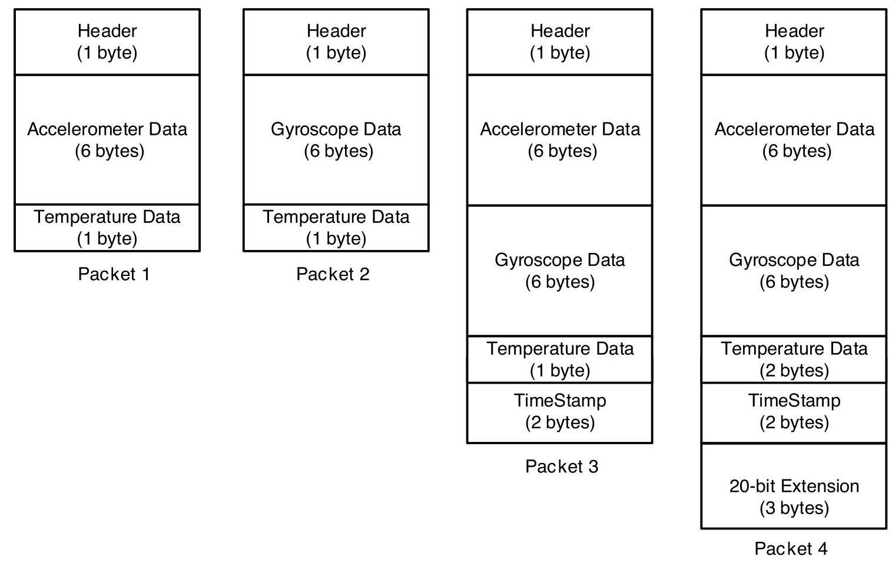

Figure 10. FIFO Packet Structure

The rest of this sub-section describes how individual data is packaged in the different FIFO packet structures.

Packet 1: Individual data is packaged in Packet 1 as shown below.

<table><tr><td>Byte</td><td>Content</td></tr><tr><td>0x00</td><td>FIFO Header</td></tr><tr><td>0x01</td><td>Accel X [15:8]</td></tr><tr><td>0x02</td><td>Accel X [7:0]</td></tr><tr><td>0x03</td><td>Accel Y [15:8]</td></tr><tr><td>0x04</td><td>Accel Y [7:0]</td></tr><tr><td>0x05</td><td>Accel Z [15:8]</td></tr><tr><td>0x06</td><td>Accel Z [7:0]</td></tr><tr><td>0x07</td><td>Temperature[7:0]</td></tr></table>

Packet 2: Individual data is packaged in Packet 2 as shown below.

<table><tr><td>Byte</td><td>Content</td></tr><tr><td>0x00</td><td>FIFO Header</td></tr><tr><td>0x01</td><td>Gyro X [15:8]</td></tr><tr><td>0x02</td><td>Gyro X [7:0]</td></tr><tr><td>0x03</td><td>Gyro Y [15:8]</td></tr><tr><td>0x04</td><td>Gyro Y [7:0]</td></tr><tr><td>0x05</td><td>Gyro Z [15:8]</td></tr><tr><td>0x06</td><td>Gyro Z [7:0]</td></tr><tr><td>0x07</td><td>Temperature[7:0]</td></tr></table>

Packet 3: Individual data is packaged in Packet 3 as shown below.

<table><tr><td>Byte</td><td>Content</td></tr><tr><td>0x00</td><td>FIFO Header</td></tr><tr><td>0x01</td><td>Accel X [15:8]</td></tr><tr><td>0x02</td><td>Accel X [7:0]</td></tr><tr><td>0x03</td><td>Accel Y [15:8]</td></tr><tr><td>0x04</td><td>Accel Y [7:0]</td></tr><tr><td>0x05</td><td>Accel Z [15:8]</td></tr><tr><td>0x06</td><td>Accel Z [7:0]</td></tr><tr><td>0x07</td><td>Gyro X [15:8]</td></tr><tr><td>0x08</td><td>Gyro X [7:0]</td></tr><tr><td>0x09</td><td>Gyro Y [15:8]</td></tr><tr><td>0x0A</td><td>Gyro Y [7:0]</td></tr><tr><td>0x0B</td><td>Gyro Z [15:8]</td></tr><tr><td>0x0C</td><td>Gyro Z [7:0]</td></tr><tr><td>0x0D</td><td>Temperature[7:0]</td></tr><tr><td>0x0E</td><td>TimeStamp [15:8]</td></tr><tr><td>0x0F</td><td>TimeStamp [7:0]</td></tr></table>

Packet 4: Individual data is packaged in Packet 4 as shown below.

<table><tr><td>Byte</td><td>Content</td><td/></tr><tr><td>0x00</td><td>FIFO Header</td><td/></tr><tr><td>0x01</td><td colspan="2">Accel X [19:12]</td></tr><tr><td>0x02</td><td colspan="2">Accel X [11:4]</td></tr><tr><td>0x03</td><td colspan="2">Accel Y [19:12]</td></tr><tr><td>0x04</td><td colspan="2">Accel Y [11:4]</td></tr><tr><td>0x05</td><td colspan="2">Accel Z [19:12]</td></tr><tr><td>0x06</td><td colspan="2">Accel Z [11:4]</td></tr><tr><td>0x07</td><td colspan="2">Gyro X [19:12]</td></tr><tr><td>0x08</td><td colspan="2">Gyro X [11:4]</td></tr><tr><td>0x09</td><td colspan="2">Gyro Y [19:12]</td></tr><tr><td>0x0A</td><td colspan="2">Gyro Y [11:4]</td></tr><tr><td>0x0B</td><td colspan="2">Gyro Z [19:12]</td></tr><tr><td>0x0C</td><td colspan="2">Gyro Z [11:4]</td></tr><tr><td>0x0D</td><td colspan="2">Temperature[15:8]</td></tr><tr><td>0x0E</td><td colspan="2">Temperature[7:0]</td></tr><tr><td>0x0F</td><td colspan="2">TimeStamp [15:8]</td></tr><tr><td>0x10</td><td colspan="2">TimeStamp [7:0]</td></tr><tr><td>0x11</td><td>Accel X [3:0]</td><td>Gyro X [3:0]</td></tr><tr><td>0x12</td><td>Accel Y [3:0]</td><td>Gyro Y [3:0]</td></tr><tr><td>0x13</td><td>Accel Z [3:0]</td><td>Gyro Z [3:0]</td></tr></table>

### 6.2 FIFO HEADER

The following table shows the structure of the 1byte FIFO header.

<table><tr><td>Bit Field</td><td>Item</td><td>Description</td></tr><tr><td>7</td><td>HEADER_MSG</td><td>1: FIFO is empty 0: Packet contains sensor data</td></tr><tr><td>6</td><td>HEADER_ACCEL</td><td>1: Packet is sized so that accel data have location in the packet, FIFO_ACCEL_EN must be 1 0: Packet does not contain accel sample</td></tr><tr><td>5</td><td>HEADER_GYRO</td><td>1: Packet is sized so that gyro data have location in the packet, FIFO_GYRO_EN must be 1 0: Packet does not contain gyro sample</td></tr><tr><td>4</td><td>HEADER_20</td><td>1: Packet has a new and valid sample of extended 20-bit data for gyro and/or accel 0 : Packet does not contain a new and valid extended 20-bit data</td></tr><tr><td>3:2</td><td>HEADER_TIMESTAMP_FSYNC</td><td>00: Packet does not contain timestamp or FSYNC time data 01: Reserved 10: Packet contains ODR Timestamp 11: Packet contains FSYNC time, and this packet is flagged as first ODR after FSYNC (only if FIFO_TMST_FSYNC_EN is 1)</td></tr><tr><td>1</td><td>HEADER ODR ACCEL</td><td>1: The ODR for accel is different for this accel data packet compared to the previous accel packet 0: The ODR for accel is the same as the previous packet with accel</td></tr><tr><td>0</td><td>HEADER_ODR_GYRO</td><td>1: The ODR for gyro is different for this gyro data packet compared to the previous gyro packet 0: The ODR for gyro is the same as the previous packet with gyro</td></tr></table>

Note at least HEADER_ACCEL or HEADER_GYRO must be set for a sensor data packet to be set.

### 6.3 MAXIMUM FIFO STORAGE

The maximum number of packets that can be stored in FIFO is a variable quantity depending on the use case. As shown in the figure below, the physical FIFO size is 2048 bytes. A number of bytes equal to the packet size selected (see section 6.1) is reserved to prevent reading a packet during write operation. Additionally, a read cache 2 packets wide is available.

When there is no serial interface operation, the read cache is not available for storing packets, being fed by the serial interface clock.

When serial interface operation happens, depending on the operation length and the packet size chosen, either 1 or 2 of the packet entries in read cache may become available for storing packets. In that case the total storage available is up to the maximum number of packets that can be accommodated in 2048 (2040 in case of 20 bytes packets) bytes + 1 packet size, depending on the packet size used.

Due to the non-deterministic nature of system operation, driver memory allocation should always be the largest size of 2080 bytes.

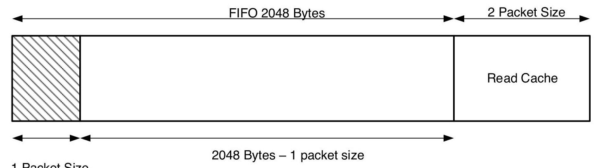

1 Packet Size Reserved to prevent reading a packet during write operation

Figure 11. Maximum FIFO Storage

### 6.4 FIFO CONFIGURATION REGISTERS

The following control bits in bank 0, register 0x5Fh determine what data is placed into the FIFO. The values of these bits may change while the FIFO is being filled without corruption of the FIFO.

<table><tr><td>BIT</td><td>NAME</td><td>FUNCTION</td></tr><tr><td>4</td><td>FIFO_HIRES_EN</td><td>0 Default setting; Sensor data have regular resolution 1: Sensor data in FIFO will have extended resolution enabling the 20 Bytes packet with priority on other setting below</td></tr><tr><td>3</td><td>FIFO_TMST_FSYNC_EN</td><td>0: FIFO will only contain ODR timestamp information 1: FIFO can also contain FSYNC time and FSYNC flag for one ODR after an FSYNC event</td></tr><tr><td>1</td><td>FIFO_GYRO_EN</td><td>0: Default setting; Gyroscope data not placed into FIFO 1: Enables gyroscope data packets of 6-bytes to be placed in FIFO</td></tr><tr><td>0</td><td>FIFO_ACCEL_EN</td><td>0: Default setting; Accelerometer data not placed into FIFO 1: Enables accelerometer data packets of 6-bytes to be placed in FIFO</td></tr></table>

Configuration register settings above impact FIFO header and FIFO packet size as follows:

<table><tr><td>FIFO_HIRES_EN</td><td>FIFO_ACCEL_EN</td><td>FIFO_GYRO_EN</td><td>FIFO_TMST_ FSYNC_EN</td><td>Header</td><td>Packet size</td></tr><tr><td>1</td><td>✘</td><td>✘</td><td>0</td><td>8’b_0111_10xx</td><td>20 Bytes</td></tr><tr><td>1</td><td>✘</td><td>✘</td><td>1</td><td>8’b_0111_11xx</td><td>20 Bytes</td></tr><tr><td>0</td><td>1</td><td>1</td><td>0</td><td>8’b_0110_10xx</td><td>16 Bytes</td></tr><tr><td>0</td><td>1</td><td>1</td><td>1</td><td>8’b_0110_11xx</td><td>16 Bytes</td></tr><tr><td>0</td><td>1</td><td>0</td><td>✘</td><td>8’b_0100_00xx</td><td>8 Bytes</td></tr><tr><td>0</td><td>0</td><td>1</td><td>✘</td><td>8’b_0010_00xx</td><td>8 Bytes</td></tr><tr><td>0</td><td>0</td><td>0</td><td>✘</td><td>No FIFO writes</td><td>No FIFO writes</td></tr></table>

## 7 PROGRAMMABLE INTERRUPTS

The ICM-42688-P has a programmable interrupt system that can generate an interrupt signal on the INT pins. Status flags indicate the source of an interrupt. Interrupt sources may be enabled and disabled individually. There are two interrupt outputs. Any interrupt may be mapped to either interrupt pin as explained in the register section. The following configuration options are available for the interrupts

- INT1 and INT2 can be push-pull or open drain

- Level or pulse mode

- Active high or active low Additionally, ICM-42688-P includes In-band Interrupt (IBI) support for the I3C \( {}^{\mathrm{{SM}}} \) interface.

## 8 APEX MOTION FUNCTIONS

The APEX (Advanced Pedometer and Event Detection - next gen) features ICM-42688-P consist of:

- Pedometer: Tracks Step count and issues a Step Detect Interrupt

- Tilt Detection: Issues an interrupt when the Tilt angle exceeds 35 degrees for more than a programmable time.

- Raise to Wake/Sleep: Gesture detection for wake and sleep events. Interrupt is issued when either of these two events are detected.

- Tap Detection: Issues an interrupt when Tap is detected, along with a register containing the Tap Count.

- Wake on Motion (WoM): Detects motion when accelerometer samples exceed a programmable threshold. This motion event can be used to enable chip operation from sleep mode.

- Significant Motion Detector (SMD): Detects motion if WoM events are detected during a programmable time window (2s or 4s).

### 8.1 APEX ODR SUPPORT

APEX algorithms are designed to work with the accelerometer, for a variety of ODR settings. However, there is a minimum ODR required for each algorithm. The following table shows the relationship between the available accelerometer ODRs and the operation of the APEX algorithms. In order to allow more flexible operation where we can control the ODR of the APEX algorithms independent of the accelerometer ODR, we allow for an additional selection determined by the field DMP_ODR. The tables below shows how DMP_ODR should be configured in relation to the accelerometer ODR and the expected performance. If the accelerometer ODR is set below the minimum DMP ODR (25 Hz), the APEX features cannot be enabled.

<table><tr><td>Accel ODR</td><td>DMP_ODR</td><td>Tap Detection</td><td>Pedometer</td><td>Tilt Detection</td><td>Raise to Wake/Sleep</td></tr><tr><td>< 25Hz</td><td>✘</td><td>Disabled</td><td>Disabled</td><td>Disabled</td><td>Disabled</td></tr><tr><td>≥ 25Hz</td><td>0 (25Hz)</td><td>Disabled</td><td>Low Power</td><td>Low Power</td><td>Enabled</td></tr><tr><td>≥50Hz</td><td>2 (50Hz)</td><td>Disabled</td><td>Normal</td><td>Normal</td><td>Enabled</td></tr></table>

<table><tr><td>Accel ODR</td><td>Tap Detection</td></tr><tr><td>200Hz</td><td>Low Power</td></tr><tr><td>500Hz</td><td>Normal</td></tr><tr><td>\( 1\mathrm{{kHz}} \)</td><td>High Performance</td></tr><tr><td>> 1kHz</td><td>Disabled</td></tr></table>

When the accelerometer ODR needs to be set differently from the DMP ODR, only the integer multiple of DMP ODR for accelerometer sensor ODR is suitable to use with DMP. For example, when the accelerometer ODR is set as \( {200}\mathrm{\;{Hz}} \) , the APEX features can be enabled with choices of \( {25}\mathrm{\;{Hz}} \) , or \( {50}\mathrm{\;{Hz}} \) , depending on the DMP_ODR register setting.

DMP ODR should not be changed on the fly. The following sequence should be followed for changing the DMP ODR:

1. Disable Pedometer, and Tilt Detection if they are enabled

2. Change DMP ODR

3. Set DMP_INIT_EN for one cycle (Register 0x4Bh in Bank 0)

4. Unset DMP_INIT_EN (Register 0x4Bh in Bank 0)

5. Enable APEX features of interest

### 8.2 DMP POWER SAVE MODE

DMP Power Save Mode can be enabled or disabled by DMP_POWER_SAVE (Register 0x56h in Bank 0). When the DMP Power Save Mode is enabled, APEX features are enabled only when WOM is detected. WOM must be explicitly enabled for the DMP to work in this mode. When WOM is not detected the APEX features are on pause. If the user does not want to use DMP Power Save Mode they may set DMP_POWER_SAVE = 0, and use APEX functions without WOM detection.

### 8.3 PEDOMETER PROGRAMMING

- Pedometer configuration parameters

1. LOW_ENERGY_AMP_TH_SEL (Register 0x40h in Bank 4)

2. PED_AMP_TH_SEL (Register 0x41h in Bank 4)

3. PED_STEP_CNT_TH_SEL (Register 0x41h in Bank 4)

4. PED_HI_EN_TH_SEL (Register 0x42h in Bank 4)

5. PED_SB_TIMER_TH_SEL (Register 0x42h in Bank 4)

6. PED_STEP_DET_TH_SEL (Register 0x42h in Bank 4)

7. SENSITIVITY_MODE (Register 0x48h in Bank 4)

8. There are 2 ODR and 2 sensitivity modes

<table><tr><td>Accel ODR (DMP_ODR)</td><td>normal</td><td>slow walk</td></tr><tr><td>\( {25}\mathrm{\;{Hz}}\left( 0\right) \)</td><td>low power</td><td>low power and slow walk</td></tr><tr><td>50 Hz (2)</td><td>high performance</td><td>slow walk</td></tr></table>

- Initialize Sensor in a typical configuration

1. Set accelerometer ODR to \( {50}\mathrm{\;{Hz}} \) (Register 0x50h in Bank 0)

2. Set accelerometer to Low Power mode (Register 0x4Eh in Bank 0)

ACCEL_MODE = 2 and (Register 0x4Eh in Bank 0), ACCEL_LP_CLK_SEL = 0, for low power mode

3. Set DMP ODR = \( {50}\mathrm{\;{Hz}} \) and turn on Pedometer feature (Register 0x56h in Bank 0)

4. Wait 1 millisecond

- Initialize APEX hardware

1. Set DMP_MEM_RESET_EN to 1 (Register 0x4Bh in Bank 0)

2. Wait 1 millisecond

3. Set LOW_ENERGY_AMP_TH_SEL to 10 (Register 0x40h in Bank 4)

4. Set PED_AMP_TH_SEL to 8 (Register 0x41h in Bank 4)

5. Set PED_STEP_CNT_TH_SEL to 5 (Register 0x41h in Bank 4)

6. Set PED_HI_EN_TH_SEL to 1 (Register 0x42h in Bank 4)

7. Set PED_SB_TIMER_TH_SEL to 4 (Register 0x42h in Bank 4)

8. Set PED_STEP_DET_TH_SEL to 2 (Register 0x42h in Bank 4)

9. Set SENSITIVITY_MODE to 0 (Register 0x48h in Bank 4)

10. Set DMP_INIT_EN to 1 (Register 0x4Bh in Bank 0)

11. Wait 50 milliseconds

12. Enable STEP detection, source for INT1 by setting bit 5 in register INT_SOURCE6 (Register 0x4Dh in Bank 4) to 1. Or if INT2 is selected for STEP detection, enable STEP detection source by setting bit 5 in register INT_SOURCE7 (Register 0x4Eh in Bank 4) to 1.

13. Turn on Pedometer feature by setting PED_ENABLE to 1 (Register 0x56h in Bank 0)

- Output registers

1. Read interrupt register (Register 0x38h in Bank 0) for STEP_DET_INT

2. If the step count is equal to or greater than 65535 (uint16), the STEP_CNT_OVF_INT (Register 0x38h in Bank 0) will be set to 1 . Example:

Take 1 step => output step count = 65533 (real step count is 65533)

- Take 1 step => output step count = 65534 (real step count is 65534)

Take 1 step => output step count = 0 and interrupt is fired (real step count is 65535+0 = 65535)

- Take 1 step => output step count = 1 (real step count is 65535+1=65536)

3. Read the step count in STEP_CNT (Register 0x31h and 0x32h in Bank 0)

4. Read the step cadence in STEP_CADENCE (Register 0x33h in Bank 0)

5. Read the activity class in ACTIVITY_CLASS (Register 0x34h in Bank 0)

### 8.4 TILT DETECTION PROGRAMMING

- Tilt Detection configuration parameters

1. TILT_WAIT_TIME (Register 0x43h in Bank 4)

This parameter configures how long of a delay after tilt is detected before interrupt is triggered

Default is 2 (4 s).

Range is \( 0 = 0\mathrm{\;s},1 = 2\mathrm{\;s},2 = 4\mathrm{\;s},3 = 6\mathrm{\;s} \)

For example, setting TILT_WAIT_TIME = 2 is equivalent to 4 seconds for all ODRs

- Initialize Sensor in a typical configuration

1. Set accelerometer ODR (Register 0x50h in Bank 0)

ACCEL_ODR = 9 for \( {50}\mathrm{\;{Hz}} \) or10for \( {25}\mathrm{\;{Hz}} \)

2. Set Accel to Low Power mode (Register 0x4Eh in Bank 0)

ACCEL_MODE = 2 and (Register 0x4Dh in Bank 0), ACCEL_LP_CLK_SEL = 0, for low power mode

3. Set DMP ODR (Register 0x56h in Bank 0)

DMP_ODR = 0 for \( {25}\mathrm{\;{Hz}},2 \) for \( {50}\mathrm{\;{Hz}} \)

4. Wait 1 millisecond

- Initialize APEX hardware

1. Set DMP_MEM_RESET_EN to 1 (Register 0x4Bh in Bank 0)

2. Wait 1 millisecond

3. Set TILT_WAIT_TIME (Register 0x43h in Bank 4) if default value does not meet needs

4. Wait 1 millisecond

5. Set DMP_INIT_EN to 1 (Register 0x4Bh in Bank 0)

6. Enable Tilt Detection, source for INT1 by setting bit 3 in register INT_SOURCE6 (Register 0x4Dh in Bank 4) to 1. Or if INT2 is selected for Tilt Detection, enable Tilt Detection source by setting bit 3 in register INT_SOURCE7 (Register 0x4Eh in Bank 4) to 1.

7. Wait 50 milliseconds

8. Turn on Tilt Detection feature by setting TILT_ENABLE to 1 (Register 0x56h in Bank 0)

- Output registers

1. Read interrupt register (Register 0x38h in Bank 0) for TILT_DET_INT

### 8.5 RAISE TO WAKE/SLEEP PROGRAMMING

- Raise to Wake/Sleep configuration parameters

1. SLEEP_TIME_OUT (Register 0x43h in Bank 4)

2. MOUNTING_MATRIX (Register 0x44h in Bank 4)

3. SLEEP_GESTURE_DELAY (Register 0x45h in Bank 4)

- Initialize Sensor in a typical configuration

1. Set accelerometer ODR (Register 0x50h in Bank 0) ACCEL_ODR = 10 for \( {25}\mathrm{\;{Hz}} \)

2. Set Accel to Low Power mode (Register 0x4Eh in Bank 0)

ACCEL_MODE = 2 and (Register 0x4Dh in Bank 0), ACCEL_LP_CLK_SEL = 0, for low power mode

3. Set DMP ODR (Register 0x56h in Bank 0)

DMP_ODR = 0 for \( {25}\mathrm{\;{Hz}},2 \) for \( {50}\mathrm{\;{Hz}} \)

4. Wait 1 millisecond

- Initialize APEX hardware

1. Set DMP_MEM_RESET_EN to 1 (Register 0x4Bh in Bank 0)

2. Wait 1 millisecond

3. Set SLEEP_TIME_OUT (Register 0x43h in Bank 4) if default value does not meet needs

4. Wait 1 millisecond

5. Set MOUNTING_MATRIX (Register 0x44h in Bank 4) if default value does not meet needs

6. Wait 1 millisecond

7. Set SLEEP_GESTURE_DELAY (Register 0x45h in Bank 4) if default value does not meet needs

8. Wait 1 millisecond

9. Set DMP_INIT_EN to 1 (Register 0x4Bh in Bank 0)

10. Enable Raise to Wake/Sleep, source for INT1 by setting bit 2,1 in register INT_SOURCE6 (Register 0x4Dh in Bank 4) to 1. Or if INT2 is selected for Raise to Wake/Sleep, enable Raise to Wake/Sleep source by setting bit 2,1 in register INT_SOURCE7 (Register 0x4Eh in Bank 4) to 1.

11. Wait 50 milliseconds

12. Turn on Raise to Wake/Sleep feature by setting R2W_EN to 1 (Register 0x56h in Bank 0)

- Output registers

1. Read interrupt register (Register 0x38h in Bank 0) for WAKE_INT, SLEEP_INT

### 8.6 TAP DETECTION PROGRAMMING

- Tap Detection configuration parameters

1. TAP_TMAX (Register 0x47h in Bank 4)

2. TAP_TMIN (Register 0x47h in Bank 4)

3. TAP_TAVG (Register 0x47h in Bank 4)

4. TAP_MIN_JERK_THR (Register 0x46h in Bank 4)

5. TAP_MAX_PEAK_TOL (Register 0x46h in Bank 4)

6. TAP_ENABLE (Register 0x56h in Bank 0)

- Initialize Sensor in a typical configuration

1. Set accelerometer ODR (Register 0x50h in Bank 0)

ACCEL_ODR = 15 for \( {500}\mathrm{\;{Hz}} \) (ODR of \( {200}\mathrm{\;{Hz}} \) or \( 1\mathrm{{kHz}} \) may also be used)

2. Set power modes and filter configurations as shown below

- For ODR up to \( {500}\mathrm{\;{Hz}} \) , set Accel to Low Power mode (Register 0x4Eh in Bank 0) ACCEL_MODE = 2 and ACCEL_LP_CLK_SEL = 0, (Register 0x4Dh in Bank 0) for low power mode Set filter settings as follows: ACCEL_DEC2_M2_ORD = 2 (Register 0x53h in Bank 0); ACCEL_UI_FILT_BW = 4 (Register 0x52h in Bank 0)

- For ODR of \( 1\mathrm{{kHz}} \) , set Accel to Low Noise mode (Register 0x4Eh in Bank 0) ACCEL_MODE = 1 Set filter settings as follows: ACCEL_UI_FILT_ORD = 2 (Register 0x53h in Bank 0); ACCEL_UI_FILT_BW = 0 (Register 0x52h in Bank 0)

3. Wait 1 millisecond

- Initialize APEX hardware

1. Set TAP_TMAX to 2 (Register 0x47h in Bank 4)

2. Set TAP_TMIN to 3 (Register 0x47h in Bank 4)

3. Set TAP_TAVG to 3 (Register 0x47h in Bank 4)

4. Set TAP_MIN_JERK_THR to 17 (Register 0x46h in Bank 4)

5. Set TAP_MAX_PEAK_TOL to 2 (Register 0x46h in Bank 4)

6. Wait 1 millisecond

7. Enable TAP source for INT1 by setting bit 0 in register INT_SOURCE6 (Register 0x4Dh in Bank 4) to 1. Or if INT2 is selected for TAP, enable TAP source by setting bit 0 in register INT_SOURCE7 (Register 0x4Eh in Bank 4) to 1.

8. Wait 50 milliseconds

9. Turn on TAP feature by setting TAP_ENABLE to 1 (Register 0x56h in Bank 0)

- Output registers

1. Read interrupt register (Register 0x38h in Bank 0) for TAP_DET_INT

2. Read the tap count in TAP_NUM (Register 0x35h in Bank 0)

3. Read the tap axis in TAP_AXIS (Register 0x35h in Bank 0)

4. Read the polarity of tap pulse in TAP_DIR (Register 0x35h in Bank 0)

### 8.7 WAKE ON MOTION PROGRAMMING

- Wake on Motion configuration parameters 1. WOM_X_TH (Register 0x4Ah in Bank 4) 2. WOM_Y_TH (Register 0x4Bh in Bank 4) 3. WOM_Z_TH (Register 0x4Ch in Bank 4) 4. WOM_INT_MODE (Register 0x57h in Bank 0) 5. WOM_MODE (Register 0x57h in Bank 0)

- Initialize Sensor in a typical configuration 1. Set accelerometer ODR (Register 0x50h in Bank 0) ACCEL_ODR = 9 for \( {50}\mathrm{\;{Hz}} \) 2. Set Accel to Low Power mode (Register 0x4Eh in Bank 0) ACCEL_MODE = 2 and (Register 0x4Dh in Bank 0), ACCEL_LP_CLK_SEL = 0, for low power mode 3. Wait 1 millisecond

- Initialize APEX hardware 1. Set WOM_X_TH to 98 (Register 0x4Ah in Bank 4) 2. Set WOM_Y_TH to 98 (Register 0x4Bh in Bank 4) 3. Set WOM_Z_TH to 98 (Register 0x4Ch in Bank 4) 4. Wait 1 millisecond 5. Enable all 3 axes as WOM sources for INT1 by setting bits 2:0 in register INT_SOURCE1 (Register 0x66h in Bank 0) to 1. Or if INT2 is selected for WOM, enable all 3 axes as WOM sources by setting bits 2:0 in register INT_SOURCE4 (Register 0x69h in Bank 0) to 1.

6. Wait 50 milliseconds

7. Turn on WOM feature by setting WOM_INT_MODE to 0, WOM_MODE to 1, SMD_MODE to 1 (Register 0x56h in

Bank 0)

- Output registers

1. Read interrupt register (Register 0x7Dh in Bank 0) for WOM_X_INT

2. Read interrupt register (Register 0x7Dh in Bank 0) for WOM_Y_INT

3. Read interrupt register (Register 0x7Dh in Bank 0) for WOM_Z_INT

### 8.8 SIGNIFICANT MOTION DETECTION PROGRAMMING

- Significant Motion Detection configuration parameters

1. WOM_X_TH (Register 0x4Ah in Bank 4)

2. WOM_Y_TH (Register 0x4Bh in Bank 4)

3. WOM_Z_TH (Register 0x4Ch in Bank 4)

4. WOM_INT_MODE (Register 0x57h in Bank 0)

5. WOM_MODE (Register 0x57h in Bank 0)

6. SMD_MODE (Register 0x57h in Bank 0)

- Initialize Sensor in a typical configuration

1. Set accelerometer ODR (Register 0x50h in Bank 0)

ACCEL_ODR = 9 for \( {50}\mathrm{\;{Hz}} \)

2. Set Accel to Low Power mode (Register 0x4Eh in Bank 0)

ACCEL_MODE = 2 and (Register 0x4Dh in Bank 0), ACCEL_LP_CLK_SEL = 0, for low power mode

3. Wait 1 millisecond

- Initialize APEX hardware

1. Set WOM_X_TH to 98 (Register 0x4Ah in Bank 4)

2. Set WOM_Y_TH to 98 (Register 0x4Bh in Bank 4)

3. Set WOM_Z_TH to 98 (Register 0x4Ch in Bank 4)

4. Wait 1 millisecond

5. Enable SMD source for INT1 by setting bit 3 in register INT_SOURCE1 (Register 0x66h in Bank 0) to 1. Or if INT2 is selected for SMD, enable SMD source by setting bit 3 in register INT_SOURCE4 (Register 0x69h in Bank 0) to 1.

6. Wait 50 milliseconds

7. Turn on SMD feature by setting WOM_INT_MODE to 0, WOM_MODE to 1, SMD_MODE to 3 (Register 0x56h in Bank 0)

- Output registers

1. Read interrupt register (Register 0x7Dh in Bank 0) for SMD_INT

## 9 DIGITAL INTERFACE

### 9.1 I3C \( {}^{\mathrm{{SM}}} \) , \( {\mathrm{I}}^{2}\mathrm{C} \) AND SPI SERIAL INTERFACES

The internal registers and memory of the ICM-42688-P can be accessed using \( {\mathrm{{I2C}}}^{\mathrm{{SM}}} \) at 12.5MHz (data rates up to \( {12.5}\mathrm{{Mbps}} \) in SDR mode, 25Mbps in DDR mode), I \( {}^{2} \) C at 1 MHz or SPI at 24 MHz. SPI operates in 3-wire or 4-wire mode. Pin assignments for serial interfaces are described in Section 4.1.

### 9.2 I3C \( {}^{\mathrm{{SM}}} \) INTERFACE

\( {\mathrm{{BC}}}^{\mathrm{{SM}}} \) is a new 2-wire digital interface comprised of the signals serial data (SDA) and serial clock (SCLK). \( {\mathrm{{BC}}}^{\mathrm{{SM}}} \) is intended to improve upon the \( {\mathrm{I}}^{2}\mathrm{C} \) interface, while preserving backward compatibility.

\( {\mathrm{{BC}}}^{\mathrm{{SM}}} \) carries the advantages of \( {\mathrm{I}}^{2}\mathrm{C} \) in simplicity, low pin count, easy board design, and multi-drop (vs. point to point), but provides the higher data rates, simpler pads, and lower power of SPI. \( {13C}^{\mathrm{{SM}}} \) adds higher throughput for a given frequency, in-band interrupts (from slave to master), dynamic addressing.

ICM-42688-P supports the following features of \( {\mathrm{{I3C}}}^{\mathrm{{SM}}} \) :

- SDR data rate up to \( {12.5}\mathrm{{Mbps}} \)

- DDR data rate up to \( {25}\mathrm{{Mbps}} \)

- Dynamic address allocation

- In-band Interrupt (IBI) support

- Support for asynchronous timing control mode 0

- Error detection (CRC and/or Parity)

- Common Command Code (CCC)

The ICM-42688-P always operates as an \( {\mathrm{{I2C}}}^{\mathrm{{SM}}} \) slave device when communicating to the system processor, which thus acts as the \( {\mathrm{{I3C}}}^{\mathrm{{SM}}} \) master. \( {\mathrm{{I3C}}}^{\mathrm{{SM}}} \) master controls an active pullup resistance on SDA, which it can enable and disable. The pullup resistance may be a board level resistor controlled by a pin, or it may be internal to the \( {\mathrm{{BC}}}^{\mathrm{{SM}}} \) master.

### 9.3 I \( {}^{2} \) C INTERFACE

\( {\mathrm{I}}^{2}\mathrm{C} \) is a two-wire interface comprised of the signals serial data (SDA) and serial clock (SCL). In general, the lines are open-drain and bidirectional. In a generalized \( {\mathrm{I}}^{2}\mathrm{C} \) interface implementation, attached devices can be a master or a slave. The master device puts the slave address on the bus, and the slave device with the matching address acknowledges the master.

The ICM-42688-P always operates as a slave device when communicating to the system processor, which thus acts as the master. SDA and SCL lines typically need pull-up resistors to VDDIO. The maximum bus speed is 1 MHz.

The slave address of the ICM-42688-P is b110100X, which is 7 bits long. The LSB bit of the 7-bit address is determined by the logic level on pin AP_ADO. This allows two ICM-42688-Ps to be connected to the same I \( {}^{2}\mathrm{C} \) bus. When used in this configuration, the address of one of the devices should be b1101000 (pin AP_AD0 is logic low) and the address of the other should be b1101001 (pin AP_AD0 is logic high).

### 9.4 \( {\mathrm{I}}^{2}\mathrm{C} \) COMMUNICATIONS PROTOCOL

## START (S) and STOP (P) Conditions

Communication on the \( {\mathrm{I}}^{2}\mathrm{C} \) bus starts when the master puts the START condition (S) on the bus, which is defined as a HIGH-to-LOW transition of the SDA line while SCL line is HIGH (see figure below). The bus is considered to be busy until the master puts a STOP condition (P) on the bus, which is defined as a LOW to HIGH transition on the SDA line while SCL is HIGH (see figure below). Additionally, the bus remains busy if a repeated START (Sr) is generated instead of a STOP condition. Data Format / Acknowledge

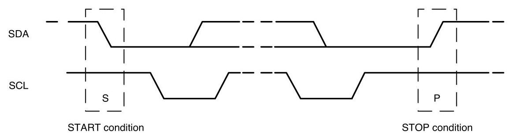

Figure 12. START and STOP Conditions

\( {1}^{2}\mathrm{C} \) data bytes are defined to be 8-bits long. There is no restriction to the number of bytes transmitted per data transfer. Each byte transferred must be followed by an acknowledge (ACK) signal. The clock for the acknowledge signal is generated by the master, while the receiver generates the actual acknowledge signal by pulling down SDA and holding it low during the HIGH portion of the acknowledge clock pulse.

If a slave is busy and cannot transmit or receive another byte of data until some other task has been performed, it can hold SCL LOW, thus forcing the master into a wait state. Normal data transfer resumes when the slave is ready, and releases the clock line (refer to the following figure).

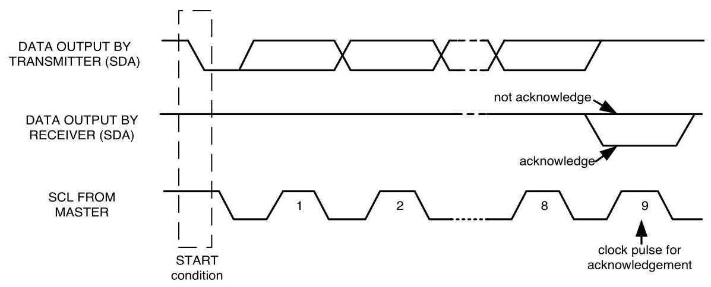

Figure 13. Acknowledge on the \( {\mathrm{I}}^{2}\mathrm{C} \) Bus

## Communications

After beginning communications with the START condition (S), the master sends a 7-bit slave address followed by an \( {8}^{\text{th }} \) bit, the read/write bit. The read/write bit indicates whether the master is receiving data from or is writing to the slave device. Then, the master releases the SDA line and waits for the acknowledge signal (ACK) from the slave device. Each byte transferred must be followed by an acknowledge bit. To acknowledge, the slave device pulls the SDA line LOW and keeps it LOW for the high period of the SCL line. Data transmission is always terminated by the master with a STOP condition (P), thus freeing the communications line. However, the master can generate a repeated START condition (Sr), and address another slave without first generating a STOP condition (P). A LOW to HIGH transition on the SDA line while SCL is HIGH defines the stop condition. All SDA changes should take place when SCL is low, with the exception of start and stop conditions.

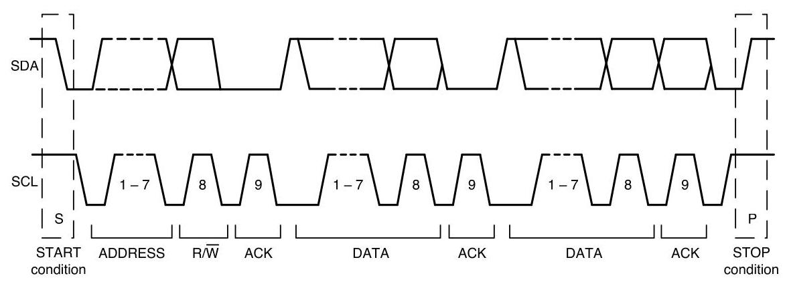

Figure 14. Complete \( {\mathrm{I}}^{2}\mathrm{C} \) Data Transfer

To write the internal ICM-42688-P registers, the master transmits the start condition (S), followed by the \( {\mathrm{I}}^{2}\mathrm{C} \) address and the write bit (0). At the \( {9}^{\text{th }} \) clock cycle (when the clock is high), the ICM-42688-P acknowledges the transfer. Then the master puts the register address (RA) on the bus. After the ICM-42688-P acknowledges the reception of the register address, the master puts the register data onto the bus. This is followed by the ACK signal, and data transfer may be concluded by the stop condition (P). To write multiple bytes after the last ACK signal, the master can continue outputting data rather than transmitting a stop signal. In this case, the ICM- 42688-P automatically increments the register address and loads the data to the appropriate register. The following figures show single and two-byte write sequences.

Single-Byte Write Sequence

<table><tr><td>Master</td><td>S</td><td>AD+W</td><td/><td>RA</td><td/><td>DATA</td><td/><td>P</td></tr><tr><td>Slave</td><td/><td/><td>ACK</td><td/><td>ACK</td><td/><td>ACK</td><td/></tr></table>

Burst Write Sequence

<table><tr><td>Master</td><td>S</td><td>AD+W</td><td/><td>RA</td><td/><td>DATA</td><td/><td>DATA</td><td/><td>P</td></tr><tr><td>Slave</td><td/><td/><td>ACK</td><td/><td>ACK</td><td/><td>ACK</td><td/><td>ACK</td><td/></tr></table>

To read the internal ICM-42688-P registers, the master sends a start condition, followed by the \( {\mathrm{I}}^{2}\mathrm{C} \) address and a write bit, and then the register address that is going to be read. Upon receiving the ACK signal from the ICM-42688-P, the master transmits a start signal followed by the slave address and read bit. As a result, the ICM-42688-P sends an ACK signal and the data. The communication ends with a not acknowledge (NACK) signal and a stop bit from master. The NACK condition is defined such that the SDA line remains high at the \( {9}^{\text{th }} \) clock cycle. The following figures show single and two-byte read sequences.

Single-Byte Read Sequence

<table><tr><td>Master</td><td>S</td><td>AD+W</td><td/><td>RA</td><td/><td>S</td><td>AD+R</td><td/><td/><td>NACK</td><td>P</td></tr><tr><td>Slave</td><td/><td/><td>ACK</td><td/><td>ACK</td><td/><td/><td>ACK</td><td>DATA</td><td/><td/></tr></table>

Burst Read Sequence

<table><tr><td>Master</td><td>S</td><td>AD+W</td><td/><td>RA</td><td/><td>S</td><td>AD+R</td><td/><td/><td>ACK</td><td/><td>NACK</td><td>P</td></tr><tr><td>Slave</td><td/><td/><td>ACK</td><td/><td>ACK</td><td/><td/><td>ACK</td><td>DATA</td><td/><td>DATA</td><td/><td/></tr></table>

## \( {9.5}\;{\mathrm{I}}^{2}\mathrm{C} \) TERMS

<table><tr><td>Signal</td><td>Description</td></tr><tr><td>S</td><td>Start Condition: SDA goes from high to low while SCL is high</td></tr><tr><td>AD</td><td>Slave \( {\mathrm{I}}^{2}\mathrm{C} \) address</td></tr></table>

<table><tr><td>W</td><td>Write bit (0)</td></tr><tr><td>R</td><td>Read bit (1)</td></tr><tr><td>ACK</td><td>Acknowledge: SDA line is low while the SCL line is high at the \( {9}^{\text{th }} \) clock cycle</td></tr><tr><td>NACK</td><td>Not-Acknowledge: SDA line stays high at the \( {9}^{\text{th }} \) clock cycle</td></tr><tr><td>RA</td><td>ICM-42688-P internal register address</td></tr><tr><td>DATA</td><td>Transmit or received data</td></tr><tr><td>P</td><td>Stop condition: SDA going from low to high while SCL is high</td></tr></table>

Table 13. \( {\mathrm{I}}^{2}\mathrm{C} \) Terms

### 9.6 SPI INTERFACE

The ICM-42688-P supports 3-wire or 4-wire SPI for the host interface. The ICM-42688-P always operates as a Slave device during standard Master-Slave SPI operation.

With respect to the Master, the Serial Clock output (SCLK), the Serial Data Output (SDO), the Serial Data Input (SDI), and the Serial Data IO (SDIO) are shared among the Slave devices. Each SPI slave device requires its own Chip Select (CS) line from the master.

CS goes low (active) at the start of transmission and goes back high (inactive) at the end. Only one CS line is active at a time, ensuring that only one slave is selected at any given time. The CS lines of the non-selected slave devices are held high, causing their SDO lines to remain in a high-impedance (high-z) state so that they do not interfere with any active devices.

SPI Operational Features

1. Data is delivered MSB first and LSB last

2. Data is latched on the rising edge of SCLK

3. Data should be transitioned on the falling edge of SCLK

4. The maximum frequency of SCLK is \( {24}\mathrm{{MHz}} \)

5. SPI read operations are completed in 16 or more clock cycles (two or more bytes). The first byte contains the SPI Address, and the following byte(s) contain(s) the SPI data. The first bit of the first byte contains the Read/Write bit and indicates the Read (1) operation. The following 7 bits contain the Register Address. In cases of multiple-byte Reads, data is two or more bytes:

SPI Address format

<table><tr><td>MSB</td><td/><td/><td/><td/><td/><td/><td>LSB</td></tr><tr><td>R/W</td><td>A6</td><td>A5</td><td>A4</td><td>A3</td><td>A2</td><td>A1</td><td>A0</td></tr></table>

SPI Data format

<table><tr><td>MSB</td><td/><td/><td/><td/><td/><td/><td>LSB</td></tr><tr><td>D7</td><td>D6</td><td>D5</td><td>D4</td><td>D3</td><td>D2</td><td>D1</td><td>D0</td></tr></table>

6. SPI write operations are completed in 16 clock cycles (two bytes). The first byte contains the SPI Address, and the second byte contains the SPI data. The first bit of the first byte contains the Read/Write bit and indicates the Write (0) operation. The following 7 bits contain the Register Address.

7. Supports Single or Burst Reads and Single Writes.

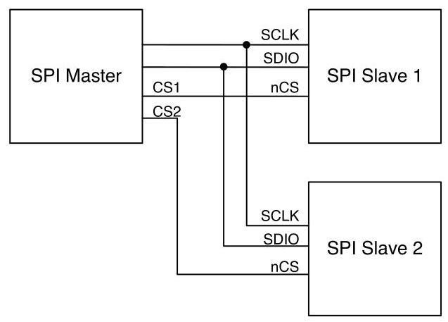

Figure 15. Typical SPI Master/Slave Configuration

## 10 ASSEMBLY

This section provides general guidelines for assembling InvenSense Micro Electro-Mechanical Systems (MEMS) devices packaged in LGA package.

### 10.1 ORIENTATION OF AXES

The diagram below shows the orientation of the axes of sensitivity and the polarity of rotation. Note the pin 1 identifier \( \left( \bullet \right) \) in the figure.

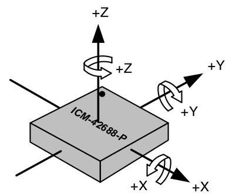

Figure 16. Orientation of Axes of Sensitivity and Polarity of Rotation

### 10.2 PACKAGE DIMENSIONS

14 Lead LGA (2.5x3x0.91) mm NiAu pad finish

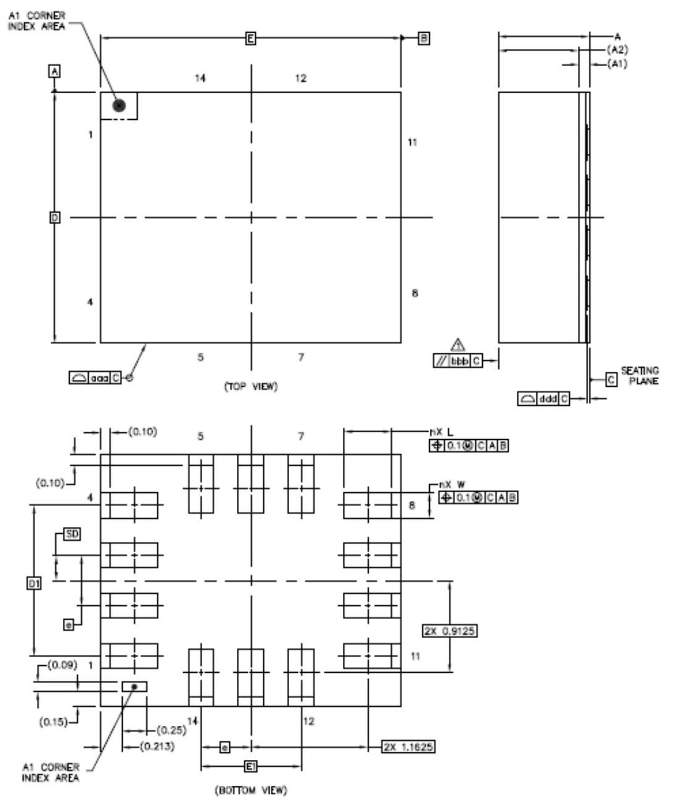

<table><tr><td rowspan="2"/><td rowspan="2">SYMBOLS</td><td colspan="3">DIMENSIONS IN MILLIMETERS</td></tr><tr><td>MIN</td><td>NOM</td><td>MAX</td></tr><tr><td>Total Thickness</td><td>A</td><td>0.85</td><td>0.91</td><td>0.97</td></tr><tr><td>Substrate Thickness</td><td>A1</td><td colspan="3">0.105REF</td></tr><tr><td>Mold Thickness</td><td>A2</td><td colspan="3">0.8REF</td></tr><tr><td rowspan="2">Body Size</td><td>D</td><td/><td>2.5</td><td>BSC</td></tr><tr><td>E</td><td/><td>3</td><td>BSC</td></tr><tr><td>Lead Width</td><td>W</td><td>0.2</td><td>0.25</td><td>0.3</td></tr><tr><td>Lead Length</td><td>L</td><td>0.425</td><td>0.475</td><td>0.525</td></tr><tr><td>Lead Pitch</td><td>e</td><td colspan="3">0.5BSC</td></tr><tr><td>Lead Count</td><td>n</td><td colspan="3">14</td></tr><tr><td rowspan="2">Edge Pin Center to Center</td><td>D1</td><td colspan="2">1.5</td><td>BSC</td></tr><tr><td>E1</td><td colspan="2">1</td><td>BSC</td></tr><tr><td>Body Center to Contact Pin</td><td>SD</td><td colspan="2">0.25</td><td>BSC</td></tr><tr><td>Package Edge Tolerance</td><td>aaa</td><td colspan="2">0.1</td><td/></tr><tr><td>Mold Flatness</td><td>bbb</td><td colspan="3">0.2</td></tr><tr><td>Coplanarity</td><td>ddd</td><td colspan="3">0.08</td></tr></table>

## 11 PART NUMBER PACKAGE MARKING

The part number package marking for ICM-42688-P devices is summarized below:

<table><tr><td>Part Number</td><td>Part Number Package Marking</td></tr><tr><td>ICM-42688-P</td><td>I428P</td></tr></table>

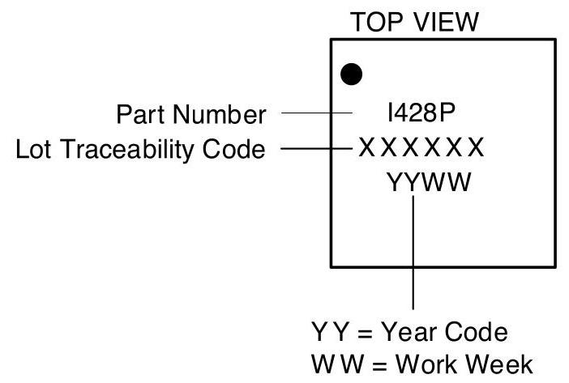

## 12 USE NOTES

### 12.1 ACCELEROMETER MODE TRANSITIONS

When transitioning from accelerometer Low Power (LP) mode to accelerometer Low Noise (LN) mode, if ODR is 6.25Hz or lower, software should change ODR to a value of \( {12.5}\mathrm{{Hz}} \) or higher, because accelerometer \( \mathrm{{LN}} \) mode does not support ODR values below 12.5Hz.

When transitioning from accelerometer LN mode to accelerometer LP mode, if ODR is greater than \( {500}\mathrm{{Hz}} \) , software should change ODR to a value of \( {500}\mathrm{{Hz}} \) or lower, because accelerometer LP mode does not support ODR values above \( {500}\mathrm{{Hz}} \) .

### 12.2 ACCELEROMETER LOW POWER (LP) MODE AVERAGING FILTER SETTING

Software drivers provided with the device use Averaging Filter setting of \( {16x} \) . This setting is recommended for meeting Android noise requirements in LP mode, and to minimize accelerometer offset variation when transitioning from LP to Low Noise (LN) mode. 1x averaging filter can be used by following the setting configuration shown in section 14.38 .

### 12.3 SETTINGS FOR \( {\mathrm{I}}^{2}\mathrm{C} \) , \( {\mathrm{{I3C}}}^{\mathrm{{SM}}} \) , AND SPI OPERATION

Upon bootup the device comes up in SPI mode. The following settings should be used for \( {\mathrm{I}}^{2}\mathrm{C},{13}^{\mathrm{C}}{}^{\mathrm{{SM}}} \) , and SPI operation.

Scenario 1: INT1/INT2 pins are used for interrupt assertion in I3C \( {}^{\mathrm{{SM}}} \) mode.

<table><tr><td>Register Field</td><td>\( {\mathrm{I}}^{2}\mathrm{C} \) Driver Setting</td><td>I3CSM Driver Setting</td><td>SPI Driver Setting</td></tr><tr><td>13C_EN (bit 4, register INTF_CONFIG6, address 0x7C, bank 1)</td><td>1</td><td>1</td><td>1</td></tr><tr><td>13C_SDR_EN (bit 0, register INTF_CONFIG6, address 0x7C, bank 1)</td><td>0</td><td>1</td><td>1</td></tr><tr><td>13C_DDR_EN (bit 1, register INTF_CONFIG6, address 0x7C, bank 1)</td><td>0</td><td>0</td><td>1</td></tr><tr><td>13C_BUS_MODE (bit 6, register INTF_CONFIG4, address 0x7A, bank 1)</td><td>0</td><td>0</td><td>0</td></tr><tr><td>I2C_SLEW_RATE (bits 5:3, register DRIVE_CONFIG, address 0x13, bank 0)</td><td>1</td><td>0</td><td>0</td></tr><tr><td>SPI_SLEW_RATE (bits 2:0, register DRIVE_CONFIG, address 0x13, bank 0)</td><td>1</td><td>5</td><td>5</td></tr></table>

Scenario 2: IBI is used for interrupt assertion in \( {\mathrm{{BC}}}^{\mathrm{{SM}}} \) mode.

<table><tr><td>Register Field</td><td>\( {\mathrm{I}}^{2}\mathrm{C} \) Driver Setting</td><td>I3CSM Driver Setting</td><td>SPI Driver Setting</td></tr><tr><td>13C_EN (bit 4, register INTF_CONFIG6, address 0x7C, bank 1)</td><td>1</td><td>1</td><td>1</td></tr><tr><td>13C_SDR_EN (bit 0, register INTF_CONFIG6, address 0x7C, bank 1)</td><td>0</td><td>1</td><td>1</td></tr><tr><td>I3C_DDR_EN (bit 1, register INTF_CONFIG6, address 0x7C, bank 1)</td><td>0</td><td>1</td><td>1</td></tr><tr><td>13C_BUS_MODE (bit 6, register INTF_CONFIG4, address 0x7A, bank 1)</td><td>0</td><td>0</td><td>0</td></tr><tr><td>I2C_SLEW_RATE (bits 5:3, register DRIVE_CONFIG, address 0x13, bank 0)</td><td>1</td><td>0</td><td>0</td></tr><tr><td>SPI_SLEW_RATE (bits 2:0, register DRIVE_CONFIG, address 0x13, bank 0)</td><td>1</td><td>5</td><td>5</td></tr></table>

### 12.4 NOTCH FILTER AND ANTI-ALIAS FILTER OPERATION

Use of Notch Filter and Anti-Alias Filter is supported only for Low Noise (LN) mode operation. The host is responsible for keeping the UI path in LN mode while Notch Filter and Anti-Alias Filter are turned on.

### 12.5 EXTERNAL CLOCK INPUT EFFECT ON ODR

ODR values supported by the device scale with external clock frequency, if external clock input is used. The ODR values shown in the datasheet are supported with external clock input frequency of \( {32}\mathrm{{kHz}} \) . For any other external clock input frequency, these ODR values will scale by a factor of (External clock value in kHz / 32). For example, if an external clock frequency of 32.768kHz is used, instead of ODR value of \( {500}\mathrm{{Hz}} \) , it will be \( {500} * \left( {{32.768}/{32}}\right)  = {512}\mathrm{{Hz}} \) .

### 12.6 INT_ASYNC_RESET CONFIGURATION

For register INT_CONFIG1 (bank 0 register 0x64) bit 4 INT_ASYNC_RESET, user should change setting to 0 from default setting of 1, for proper INT1 and INT2 pin operation.

### 12.7 FIFO TIMESTAMP INTERVAL SCALING

When RTC_MODE =1 (bank 0 register 0x4D bit2) and register INTF_CONFIG5 (bank 1 register 0x7B) bit 2:1 (PIN9_FUNCTION) is set to 10 for CLKIN input; THEN

If TMST_RES = 0 (corresponding to timestamp resolution of \( {1\mu }\mathrm{s} \) ), timestamp interval reported in FIFO requires scaling by a factor of 32.768/RTC Frequency. For example when \( \mathrm{{ODR}} = 1\mathrm{{kHz}} \) , RTC Frequency \( {32}\mathrm{{kHz}} \) , the true timestamp interval should be \( {1000}\mathrm{{\mu s}} \) . But the value in FIFO toggles between 976 and 977. After scaling 976.5 * 32.768/32 = 1000μs.

If TMST_RES = 1 (corresponding to timestamp resolution of 1 RTC clock period), timestamp interval reported in FIFO requires scaling by a factor of RTC clock period.

For example when ODR = 1kHz, RTC Frequency 32kHz, the true timestamp interval should be 1000μs. But the value in FIFO is 32. After scaling \( 1/{32}\mathrm{{kHz}} * {32} = {1000\mu }\mathrm{s} \) . ELSE

If TMST_RES = 0 (corresponding to timestamp resolution of \( {1\mu }\mathrm{s} \) ), timestamp interval reported in FIFO requires scaling by a factor of \( {32}/{30} \) .

For example when \( \mathrm{{ODR}} = 1\mathrm{{kHz}} \) , the true timestamp interval should be \( {1000}\mathrm{{\mu s}} \) . But the value in FIFO toggles between937and 938. After scaling \( {937.5} * {32}/{30} = {1000\mu }\mathrm{s} \) .

If TMST_RES = 1 (corresponding to timestamp resolution of \( {16\mu }\mathrm{s} \) ), timestamp interval reported in FIFO requires scaling by a factor of 16*32/30.

For example when ODR = 1kHz, the true timestamp interval should be 1000μs. But the value in FIFO toggles between 58 and 59. After scaling \( {58.5} * {16} * {32}/{30} = {1000\mu }\mathrm{s} \) .

### 12.8 SUPPLEMENTARY INFORMATION FOR FIFO_HOLD_LAST_DATA_EN

This section contains supplementary information for using register field FIFO_HOLD_LAST_DATA_EN (bit 7) of register INTF_CONFIG0 (address 0x4C, bank 0) .

The following table shows the values in FIFO: Page 59 of 112

<table><tr><td colspan="2">FIFO_HOLD_LAST_DATA_EN</td><td>16-bit FIFO Packet</td><td>20-bit FIFO Packet</td></tr><tr><td rowspan="3">0 (Insert Invalid code)</td><td rowspan="2">Valid sample</td><td rowspan="2">All values in: \{-32766 to \( + {32767}\} \)</td><td>Gyro: All Even numbers in \{-524256 to +524286\} Example: \{-524256, -524254, -524252, -524250 .....+524284, +524286\}</td></tr><tr><td>Accel: Every Other Even number in \{-524256 to +524284\} Example: \{-524256, -524252, -524248, -524244 .....+524280, +524284\}</td></tr><tr><td>Invalid sample</td><td>-32768</td><td>-524288</td></tr><tr><td rowspan="3">1 ("copy last valid" mode: No invalid code insertion)</td><td rowspan="2">Valid sample</td><td rowspan="2">All values in: \{-32768 to +32767\}</td><td>Gyro: All Even numbers in \{-524288 to +524286\} Example: \{-524288, -524286, -524284, -524282 .....+524284, +524286 \}</td></tr><tr><td>Accel: Every Other Even number in \{-524288 to +524284 \} Example: \{-524288, -524284, -524280 .....+524280, +524284\}</td></tr><tr><td>Invalid sample</td><td colspan="2">Copy last valid sample</td></tr></table>

Document Number: DS-000347

Revision: 1.8

The following table shows the values in sense registers on reset:

<table><tr><td/><td>FIFO_HOLD_LAST_DATA_EN = 0</td><td>FIFO_HOLD_LAST_DATA_EN = 1</td></tr><tr><td>Power On Reset till First Sample</td><td>Accel/Gyro/Temperature Sensor = -32768</td><td>Accel/Gyro/Temperature Sensor \( = 0 \)</td></tr></table>

The following table shows the values in sense registers after first sample is received. As shown in table, the combination of FIFO_HOLD_LAST_DATA_EN and FSYNC Tag determine the range of values read for valid samples and invalid samples.

<table><tr><td colspan="2" rowspan="2">FIFO_HOLD_LAST_DATA_EN</td><td rowspan="2">FSYNC tag disabled</td><td colspan="3">FSYNC Enabled on one Sensor</td></tr><tr><td colspan="2">Sensor selected for FSYNC Tag</td><td>Other Sensor Not selected for FSYNC tagging</td></tr><tr><td colspan="2"/><td/><td>FSYNC tagged</td><td>FSYNC not tagged</td><td/></tr><tr><td rowspan="2">0 (Insert Invalid code)</td><td>Valid sample</td><td>All values in: \{-32766 to +32767\}</td><td>All ODD values in: \{-32765 to +32767\}</td><td>All EVEN values in: \{-32766 to +32766\}</td><td>All values in: \{-32766 to +32767\}</td></tr><tr><td>Invalid sample</td><td colspan="4">Registers do not receive invalid samples. Registers hold last valid sample until new one arrives</td></tr><tr><td rowspan="2">1 ("copy last valid" mode: No invalid code insertion)</td><td>Valid sample</td><td>All values in: \{-32768 to +32767\}</td><td>All ODD values in: \{-32767 to +32767\}</td><td>All EVEN values in: \{-32768 to +32766\}</td><td>All values in: \{-32768 to +32767\}</td></tr><tr><td>Invalid sample</td><td colspan="4">Registers do not receive invalid samples. Registers hold last valid sample until new one arrives</td></tr></table>

### 12.9 REGISTER VALUES MODIFICATION

The only register settings that user can modify during sensor operation are for ODR selection, FSR selection, and sensor mode changes (register parameters GYRO_ODR, ACCEL_ODR, GYRO_FS_SEL, ACCEL_FS_SEL, GYRO_MODE, ACCEL_MODE). User must not modify any other register values during sensor operation. The following procedure must be used for other register values modification.

- Turn Accel and Gyro Off

- Modify register values

- Turn Accel and/or Gyro On

## 13 REGISTER MAP

This section lists the register map for the ICM-42688-P, for user banks 0, 1, 2, 3, 4.

### 13.1 USER BANK 0 REGISTER MAP

<table><tr><td>Addr (Hex)</td><td>Addr (Dec.)</td><td>Register Name</td><td>Serial I/F</td><td>Bit7</td><td>Bit6</td><td>Bit5</td><td>Bit4</td><td>Bit3</td><td>Bit2</td><td>Bit1</td><td>Bit0</td></tr><tr><td>11</td><td>17</td><td>DEVICE_CONFIG</td><td>R/W</td><td colspan="3">-</td><td>SPI_MODE</td><td/><td>-</td><td/><td>SOFT_RESET_ CONFIG</td></tr><tr><td>13</td><td>19</td><td>DRIVE_CONFIG</td><td>R/W</td><td colspan="2">-</td><td colspan="3">I2C_SLEW_RATE</td><td colspan="3">SPI_SLEW_RATE</td></tr><tr><td>14</td><td>20</td><td>INT_CONFIG</td><td/><td colspan="2">-</td><td>INT2_MODE</td><td>INT2_DRIVE_ CIRCUIT</td><td>INT2_POLARI TY</td><td>INT1_MODE</td><td>INT1_DRIVE_ CIRCUIT</td><td>INT1_POLARI TY</td></tr><tr><td>16</td><td>22</td><td>FIFO_CONFIG</td><td>R/W</td><td colspan="2">FIFO_MODE</td><td colspan="6">-</td></tr><tr><td>1D</td><td>29</td><td>TEMP_DATA1</td><td>SYNCR</td><td colspan="8">TEMP_DATA[15:8]</td></tr><tr><td>1E</td><td>30</td><td>TEMP_DATAO</td><td>SYNCR</td><td colspan="8">TEMP_DATA[7:0]</td></tr><tr><td>1F</td><td>31</td><td>ACCEL_DATA_X1</td><td>SYNCR</td><td colspan="8">ACCEL_DATA_X[15:8]</td></tr><tr><td>20</td><td>32</td><td>ACCEL_DATA_XO</td><td>SYNCR</td><td colspan="8">ACCEL_DATA_X[7:0]</td></tr><tr><td>21</td><td>33</td><td>ACCEL_DATA_Y1</td><td>SYNCR</td><td colspan="8">ACCEL_DATA_Y[15:8]</td></tr><tr><td>22</td><td>34</td><td>ACCEL_DATA_YO</td><td>SYNCR</td><td colspan="8">ACCEL_DATA_Y[7:0]</td></tr><tr><td>23</td><td>35</td><td>ACCEL_DATA_Z1</td><td>SYNCR</td><td colspan="8">ACCEL_DATA_Z[15:8]</td></tr><tr><td>24</td><td>36</td><td>ACCEL_DATA_ZO</td><td>SYNCR</td><td colspan="8">ACCEL_DATA_Z[7:0]</td></tr><tr><td>25</td><td>37</td><td>GYRO_DATA_X1</td><td>SYNCR</td><td colspan="8">GYRO DATA_X[15:8]</td></tr><tr><td>26</td><td>38</td><td>GYRO DATA_XO</td><td>SYNCR</td><td colspan="8">GYRO _DATA_X[7:0]</td></tr><tr><td>27</td><td>39</td><td>GYRO DATA_Y1</td><td>SYNCR</td><td colspan="8">GYRO DATA_Y[15:8]</td></tr><tr><td>28</td><td>40</td><td>GYRO _DATA_YO</td><td>SYNCR</td><td colspan="8">GYRO _DATA_Y[7:0]</td></tr><tr><td>29</td><td>41</td><td>GYRO DATA_Z1</td><td>SYNCR</td><td colspan="8">GYRO_DATA_Z[15:8]</td></tr><tr><td>2A</td><td>42</td><td>GYRO DATA_ZO</td><td>SYNCR</td><td colspan="8">GYRO_DATA_Z[7:0]</td></tr><tr><td>2B</td><td>43</td><td>TMST_FSYNCH</td><td>SYNCR</td><td colspan="8">TMST_FSYNC_DATA[15:8]</td></tr><tr><td>2C</td><td>44</td><td>TMST_FSYNCL</td><td>SYNCR</td><td colspan="8">TMST_FSYNC_DATA[7:0]</td></tr><tr><td>2D</td><td>45</td><td>INT_STATUS</td><td>R/C</td><td>-</td><td>UI_FSYNC_IN T</td><td>PLL_RDY_INT</td><td>RESET_DONE INT</td><td>DATA_RDY_I NT</td><td>FIFO_THS_IN T</td><td>FIFO_FULL_I NT</td><td>AGC_RDY_IN T</td></tr><tr><td>2E</td><td>46</td><td>FIFO_COUNTH</td><td>R</td><td colspan="8">FIFO_COUNT[15:8]</td></tr><tr><td>2F</td><td>47</td><td>FIFO_COUNTL</td><td>R</td><td colspan="8">FIFO_COUNT[7:0]</td></tr><tr><td>30</td><td>48</td><td>FIFO_DATA</td><td>R</td><td colspan="8">FIFO_DATA</td></tr><tr><td>31</td><td>49</td><td>APEX_DATAO</td><td>SYNCR</td><td colspan="8">STEP_CNT[7:0]</td></tr><tr><td>32</td><td>50</td><td>APEX_DATA1</td><td>SYNCR</td><td colspan="8">STEP_CNT[15:8]</td></tr><tr><td>33</td><td>51</td><td>APEX_DATA2</td><td>R</td><td colspan="8">STEP_CADENCE</td></tr><tr><td>34</td><td>52</td><td>APEX_DATA3</td><td>R</td><td colspan="5">-</td><td>DMP_IDLE</td><td colspan="2">ACTIVITY_CLASS</td></tr><tr><td>35</td><td>53</td><td>APEX_DATA4</td><td>R</td><td colspan="3">-</td><td colspan="2">TAP_NUM</td><td>TAP_AXIS</td><td/><td>TAP_DIR</td></tr><tr><td>36</td><td>54</td><td>APEX DATA5</td><td>R</td><td colspan="2">-</td><td colspan="6">DOUBLE_TAP_TIMING</td></tr><tr><td>37</td><td>55</td><td>INT_STATUS2</td><td>R/C</td><td colspan="4">-</td><td>SMD_INT</td><td>WOM_Z_INT</td><td>WOM_Y_INT</td><td>WOM_X_INT</td></tr><tr><td>38</td><td>56</td><td>INT_STATUS3</td><td>R/C</td><td colspan="2">-</td><td>STEP_DET_IN T</td><td>STEP_CNT_O VF_INT</td><td>TILT_DET_IN T</td><td>WAKE_INT</td><td>SLEEP_INT</td><td>TAP_DET_INT</td></tr><tr><td>4B</td><td>75</td><td>SIGNAL_PATH_RESET</td><td>W/C</td><td>-</td><td>DMP_INIT_E \( \mathrm{N} \)</td><td>DMP_MEM_ RESET_EN</td><td>-</td><td>ABORT_AND RESET</td><td>TMST_STROB E</td><td>FIFO_FLUSH</td><td>-</td></tr><tr><td>4C</td><td>76</td><td>INTF_CONFIGO</td><td>R/W</td><td>FIFO_HOLD_L AST_DATA_E \( \mathrm{N} \)</td><td>FIFO_COUNT REC</td><td>FIFO_COUNT ENDIAN</td><td>SENSOR DAT A_ENDIAN</td><td colspan="2">-</td><td colspan="2">UI_SIFS_CFG</td></tr><tr><td>4D</td><td>77</td><td>INTF_CONFIG1</td><td>R/W</td><td colspan="4"/><td>ACCEL_LP_CL K_SEL</td><td>RTC_MODE</td><td colspan="2">CLKSEL</td></tr><tr><td>4E</td><td>78</td><td>PWR_MGMT0</td><td>R/W</td><td/><td>-</td><td>TEMP_DIS</td><td>IDLE</td><td colspan="2">GYRO_MODE</td><td colspan="2">ACCEL_MODE</td></tr><tr><td>4F</td><td>79</td><td>GYRO_CONFIGO</td><td>R/W</td><td colspan="3">GYRO_FS_SEL</td><td>-</td><td colspan="4">GYRO_ODR</td></tr><tr><td>50</td><td>80</td><td>ACCEL_CONFIGO</td><td>R/W</td><td colspan="3">ACCEL_FS_SEL</td><td>-</td><td colspan="4">ACCEL_ODR</td></tr><tr><td>51</td><td>81</td><td>GYRO_CONFIG1</td><td>R/W</td><td colspan="3">TEMP_FILT_BW</td><td>-</td><td>GYRO_UI_FILT_ORD</td><td/><td>GYRO_DEC2_M2_ORD</td><td/></tr><tr><td>52</td><td>82</td><td>GYRO_ACCEL_CONFIGO</td><td>R/W</td><td colspan="4">ACCEL UI FILT BW</td><td colspan="4">GYRO UI FILT BW</td></tr><tr><td>53</td><td>83</td><td>ACCEL_CONFIG1</td><td>R/W</td><td/><td>-</td><td/><td colspan="2">ACCEL_UI_FILT_ORD</td><td>ACCEL_DEC2_M2_ORD</td><td/><td>-</td></tr></table>

<table><tr><td>Addr (Hex)</td><td>Addr (Dec.)</td><td>Register Name</td><td>Serial I/F</td><td>Bit7</td><td>Bit6</td><td>Bit5</td><td>Bit4</td><td>Bit3</td><td>Bit2</td><td>Bit1</td><td>Bit0</td></tr><tr><td>54</td><td>84</td><td>TMST_CONFIG</td><td>R/W</td><td colspan="3">-</td><td>TMST_TO_RE GS_EN</td><td>TMST_RES</td><td>TMST_DELTA EN</td><td>TMST_FSYNC _EN</td><td>TMST_EN</td></tr><tr><td>56</td><td>86</td><td>APEX_CONFIGO</td><td>R/W</td><td>DMP_POWE R_SAVE</td><td>TAP_ENABLE</td><td>PED_ENABLE</td><td>TILT_ENABLE</td><td>R2W_EN</td><td>-</td><td colspan="2">DMP_ODR</td></tr><tr><td>57</td><td>87</td><td>SMD_CONFIG</td><td>R/W</td><td colspan="4">-</td><td>WOM_INT_ MODE</td><td>WOM_MODE</td><td colspan="2">SMD_MODE</td></tr><tr><td>5F</td><td>95</td><td>FIFO CONFIG1</td><td>R/W</td><td>-</td><td>FIFO_RESUM E PARTIAL R D</td><td>FIFO_WM_G T_TH</td><td>FIFO_HIRES_ EN</td><td>FIFO_TMST_F SYNC_EN</td><td>FIFO_TEMP_ EN</td><td>FIFO_GYRO_ EN</td><td>FIFO_ACCEL EN</td></tr><tr><td>60</td><td>96</td><td>FIFO_CONFIG2</td><td>R/W</td><td colspan="8">FIFO_WM[7:0]</td></tr><tr><td>61</td><td>97</td><td>FIFO_CONFIG3</td><td>R/W</td><td colspan="4">-</td><td colspan="4">FIFO_WM[11:8]</td></tr><tr><td>62</td><td>98</td><td>FSYNC_CONFIG</td><td>R/W</td><td>-</td><td colspan="3">FSYNC_UI_SEL</td><td colspan="2">-</td><td>FSYNC_UI_FL AG_CLEAR_S EL</td><td>FSYNC_POLA RITY</td></tr><tr><td>63</td><td>99</td><td>INT_CONFIGO</td><td>R/W</td><td colspan="2">-</td><td colspan="2">UI_DRDY_INT_CLEAR</td><td colspan="2">FIFO_THS_INT_CLEAR</td><td colspan="2">FIFO_FULL_INT_CLEAR</td></tr><tr><td>64</td><td>100</td><td>INT_CONFIG1</td><td>R/W</td><td>-</td><td>INT_TPULSE_ DURATION</td><td>INT_TDEASSE RT_DISABLE</td><td>INT_ASYNC_ RESET</td><td colspan="2">-</td><td colspan="2"/></tr><tr><td>65</td><td>101</td><td>INT_SOURCEO</td><td>R/W</td><td>-</td><td>UI_FSYNC_IN T1_EN</td><td>PLL_RDY_INT 1_EN</td><td>RESET_DONE _INT1_EN</td><td>UI_DRDY_INT 1_EN</td><td>FIFO_THS_IN T1_EN</td><td>FIFO_FULL_I NT1_EN</td><td>UI_AGC_RDY _INT1_EN</td></tr><tr><td>66</td><td>102</td><td>INT_SOURCE1</td><td>R/W</td><td>-</td><td>I3C_PROTOC OL_ERROR_I NT1_EN</td><td colspan="2">-</td><td>SMD_INT1_E \( \mathrm{N} \)</td><td>WOM_Z_INT 1_EN</td><td>WOM_Y_INT 1_EN</td><td>WOM_X_INT 1_EN</td></tr><tr><td>68</td><td>104</td><td>INT_SOURCE3</td><td>R/W</td><td>-</td><td>UI FSYNC IN T2_EN</td><td>PLL RDY INT 2_EN</td><td>RESET DONE _INT2_EN</td><td>UI DRDY INT 2_EN</td><td>FIFO THS IN T2_EN</td><td>FIFO FULL I NT2_EN</td><td>UI AGC RDY _INT2_EN</td></tr><tr><td>69</td><td>105</td><td>INT SOURCE4</td><td>R/W</td><td>-</td><td>I3C PROTOC OL ERROR I NT2_EN</td><td colspan="2">-</td><td>SMD INT2 E \( \mathrm{N} \)</td><td>WOM Z INT 2_EN</td><td>WOM Y INT 2_EN</td><td>WOM X INT 2_EN</td></tr><tr><td>6C</td><td>108</td><td>FIFO_LOST_PKTO</td><td>R</td><td colspan="8">FIFO_LOST_PKT_CNT[15:8]</td></tr><tr><td>6D</td><td>109</td><td>FIFO_LOST_PKT1</td><td>R</td><td colspan="8">FIFO_LOST_PKT_CNT[7:0]</td></tr><tr><td>70</td><td>112</td><td>SELF_TEST_CONFIG</td><td>R/W</td><td/><td>ACCEL ST P OWER</td><td>EN_AZ_ST</td><td>EN_AY_ST</td><td>EN_AX_ST</td><td>EN_GZ_ST</td><td>EN_GY_ST</td><td>EN_GX_ST</td></tr><tr><td>75</td><td>117</td><td>WHO_AM_I</td><td>R</td><td colspan="8">WHOAMI</td></tr><tr><td>76</td><td>118</td><td>REG_BANK_SEL</td><td>R/W</td><td colspan="5">-</td><td colspan="3">BANK_SEL</td></tr></table>

### 13.2 USER BANK 1 REGISTER MAP

<table><tr><td>Addr (Hex)</td><td>Addr (Dec.)</td><td>Register Name</td><td>Serial 1/F</td><td>Bit7</td><td>Bit6</td><td>Bit5</td><td>Bit4</td><td>Bit3</td><td>Bit2</td><td>Bit1</td><td>Bit0</td></tr><tr><td>03</td><td>03</td><td>SENSOR_CONFIGO</td><td>R/W</td><td colspan="2">-</td><td>ZG_DISABLE</td><td>YG_DISABLE</td><td>XG_DISABLE</td><td>ZA_DISABLE</td><td>YA_DISABLE</td><td>XA_DISABLE</td></tr><tr><td>OB</td><td>11</td><td>GYRO_CONFIG_STATIC2</td><td>R/W</td><td colspan="6">-</td><td>GYRO_AAF_D IS</td><td>GYRO_NF_DI S</td></tr><tr><td>0C</td><td>12</td><td>GYRO_CONFIG_STATIC3</td><td>R/W</td><td colspan="2">-</td><td/><td/><td/><td>GYRO_AAF_DELT</td><td/><td/></tr><tr><td>0D</td><td>13</td><td>GYRO_CONFIG_STATIC4</td><td>R/W</td><td colspan="8">GYRO_AAF_DELTSQR[7:0]</td></tr><tr><td>OE</td><td>14</td><td>GYRO_CONFIG_STATIC5</td><td>R/W</td><td colspan="4">GYRO_AAF_BITSHIFT</td><td colspan="4">GYRO_AAF_DELTSQR[11:8]</td></tr><tr><td>OF</td><td>15</td><td>GYRO_CONFIG_STATIC6</td><td>R/W</td><td colspan="8">GYRO_X_NF_COSWZ[7:0]</td></tr><tr><td>10</td><td>16</td><td>GYRO_CONFIG_STATIC7</td><td>R/W</td><td colspan="8">GYRO_Y_NF_COSWZ[7:0]</td></tr><tr><td>11</td><td>17</td><td>GYRO_CONFIG_STATIC8</td><td>R/W</td><td colspan="8">GYRO_Z_NF_COSWZ[7:0]</td></tr><tr><td>12</td><td>18</td><td>GYRO_CONFIG_STATIC9</td><td>R/W</td><td colspan="2">-</td><td>GYRO_Z_NF_ COSWZ_SEL[ 0</td><td>GYRO_Y_NF_ COSWZ_SEL[ 0</td><td>GYRO_X_NF_ COSWZ_SEL[ 0</td><td>GYRO_Z_NF_ COSWZ[8]</td><td>GYRO_Y_NF_ COSWZ[8]</td><td>GYRO_X_NF_ COSWZ[8]</td></tr><tr><td>13</td><td>19</td><td>GYRO_CONFIG_STATIC10</td><td>R/W</td><td>-</td><td colspan="3">GYRO_NF_BW_SEL</td><td colspan="4">-</td></tr><tr><td>5F</td><td>95</td><td>XG_ST_DATA</td><td>R/W</td><td colspan="8">XG_ST_DATA</td></tr><tr><td>60</td><td>96</td><td>YG_ST_DATA</td><td>R/W</td><td colspan="8">YG_ST_DATA</td></tr><tr><td>61</td><td>97</td><td>ZG_ST_DATA</td><td>R/W</td><td colspan="8">ZG_ST_DATA</td></tr><tr><td>62</td><td>98</td><td>TMSTVALO</td><td>R</td><td colspan="8">TMST_VALUE[7:0]</td></tr><tr><td>63</td><td>99</td><td>TMSTVAL1</td><td>R</td><td colspan="8">TMST_VALUE[15:8]</td></tr><tr><td>64</td><td>100</td><td>TMSTVAL2</td><td>R</td><td colspan="4">-</td><td colspan="4">TMST_VALUE[19:16]</td></tr><tr><td>7A</td><td>122</td><td>INTF_CONFIG4</td><td>R/W</td><td>-</td><td>I3C_BUS_MO DE</td><td colspan="4">-</td><td>SPI_AP_4WIR E</td><td>-</td></tr><tr><td>7B</td><td>123</td><td>INTF CONFIG5</td><td>R/W</td><td colspan="5">-</td><td colspan="2">PIN9_FUNCTION</td><td>-</td></tr><tr><td>7C</td><td>124</td><td>INTF_CONFIG6</td><td>R/W</td><td>ASYNCTIMEO DIS</td><td colspan="2">-</td><td>I3C EN</td><td>I3C_IBI_BYTE EN</td><td>I3C_IBI_EN</td><td>I3C_DDR_EN</td><td>I3C_SDR_EN</td></tr></table>

Page 62 of 112

Document Number: DS-000347

Revision: 1.8

### 13.3 USER BANK 2 REGISTER MAP

<table><tr><td>Addr (Hex)</td><td>Addr (Dec.)</td><td>Register Name</td><td>Serial I/F</td><td>Bit7</td><td>Bit6</td><td>Bit5</td><td>Bit4</td><td>Bit3</td><td>Bit2</td><td>Bit1</td><td>Bit0</td></tr><tr><td>03</td><td>03</td><td>ACCEL_CONFIG_STATIC2</td><td>R/W</td><td>-</td><td colspan="6">ACCEL_AAF_DELT</td><td>ACCEL_AAF_ DIS</td></tr><tr><td>04</td><td>04</td><td>ACCEL_CONFIG_STATIC3</td><td>R/W</td><td colspan="8">ACCEL_AAF_DELTSQR[7:0]</td></tr><tr><td>05</td><td>05</td><td>ACCEL_CONFIG_STATIC4</td><td>R/W</td><td colspan="4">ACCEL_AAF_BITSHIFT</td><td colspan="4">ACCEL_AAF_DELTSQR[11:8]</td></tr><tr><td>3B</td><td>59</td><td>XA_ST_DATA</td><td>R/W</td><td colspan="8">XA_ST_DATA</td></tr><tr><td>3C</td><td>60</td><td>YA_ST_DATA</td><td>R/W</td><td colspan="8">YA_ST_DATA</td></tr><tr><td>3D</td><td>61</td><td>ZA_ST_DATA</td><td>R/W</td><td colspan="8">ZA_ST_DATA</td></tr></table>

### 13.4 USER BANK 3 REGISTER MAP

<table><tr><td>Addr (Hex)</td><td>Addr (Dec.)</td><td>Register Name</td><td>Serial I/F</td><td>Bit7</td><td>Bit6</td><td>Bit5</td><td>Bit4</td><td>Bit3</td><td>Bit2</td><td>Bit1</td><td>Bit0</td></tr><tr><td>2A</td><td>42</td><td>CLKDIV</td><td>R</td><td>-</td><td colspan="7">CLKDIV</td></tr></table>

### 13.5 USER BANK 4 REGISTER MAP

<table><tr><td>Addr (Hex)</td><td>Addr (Dec.)</td><td>Register Name</td><td>Serial I/F</td><td>Bit7</td><td>Bit6</td><td>Bit5</td><td>Bit4</td><td>Bit3</td><td>Bit2</td><td>Bit1</td><td>Bit0</td></tr><tr><td>40</td><td>64</td><td>APEX_CONFIG1</td><td>R/W</td><td colspan="4">LOW_ENERGY_AMP_TH_SEL</td><td colspan="4">DMP_POWER_SAVE_TIME_SEL</td></tr><tr><td>41</td><td>65</td><td>APEX_CONFIG2</td><td>R/W</td><td colspan="4">PED_AMP_TH_SEL</td><td colspan="4">PED_STEP_CNT_TH_SEL</td></tr><tr><td>42</td><td>66</td><td>APEX_CONFIG3</td><td>R/W</td><td colspan="3">PED_STEP_DET_TH_SEL</td><td colspan="3">PED_SB_TIMER_TH_SEL</td><td>PED_HI_EN_TH_SEL</td><td/></tr><tr><td>43</td><td>67</td><td>APEX_CONFIG4</td><td>R/W</td><td colspan="2">TILT_WAIT_TIME_SEL</td><td/><td>SLEEP_TIME_OUT</td><td/><td colspan="3">-</td></tr><tr><td>44</td><td>68</td><td>APEX_CONFIG5</td><td>R/W</td><td colspan="5">-</td><td colspan="3">MOUNTING_MATRIX</td></tr><tr><td>45</td><td>69</td><td>APEX_CONFIG6</td><td>R/W</td><td colspan="5">-</td><td colspan="3">SLEEP_GESTURE_DELAY</td></tr><tr><td>46</td><td>70</td><td>APEX_CONFIG7</td><td>R/W</td><td colspan="6">TAP_MIN_JERK_THR</td><td colspan="2">TAP_MAX_PEAK_TOL</td></tr><tr><td>47</td><td>71</td><td>APEX_CONFIG8</td><td>R/W</td><td>-</td><td/><td>TAP_TMAX</td><td colspan="2">TAP_TAVG</td><td colspan="3">TAP_TMIN</td></tr><tr><td>48</td><td>72</td><td>APEX_CONFIG9</td><td>R/W</td><td colspan="7">-</td><td>SENSITIVITY MODE</td></tr><tr><td>4A</td><td>74</td><td>ACCEL_WOM_X_THR</td><td>R/W</td><td colspan="8">WOM_X_TH</td></tr><tr><td>4B</td><td>75</td><td>ACCEL_WOM_Y_THR</td><td>R/W</td><td colspan="8">WOM_Y_TH</td></tr><tr><td>4C</td><td>76</td><td>ACCEL_WOM_Z_THR</td><td>R/W</td><td colspan="8">WOM_Z_TH</td></tr><tr><td>4D</td><td>77</td><td>INT SOURCE6</td><td>R/W</td><td colspan="2">-</td><td>STEP_DET_IN T1_EN</td><td>STEP_CNT_O FL_INT1_EN</td><td>TILT_DET_IN T1_EN</td><td>WAKE_DET_I NT1_EN</td><td>SLEEP_DET_I NT1_EN</td><td>TAP_DET_INT 1_EN</td></tr><tr><td>4E</td><td>78</td><td>INT_SOURCE7</td><td>R/W</td><td colspan="2">-</td><td>STEP_DET_IN T2 EN</td><td>STEP_CNT_O FL INT2 EN</td><td>TILT_DET_IN T2_EN</td><td>WAKE DET I NT2_EN</td><td>SLEEP_DET_I NT2_EN</td><td>TAP_DET_INT 2 EN</td></tr><tr><td>4F</td><td>79</td><td>INT_SOURCE8</td><td>R/W</td><td colspan="2">-</td><td>FSYNC IBI E N</td><td>PLL RDY IBI EN</td><td>UI DRDY IBI EN</td><td>FIFO THS IBI EN</td><td>FIFO FULL IB I EN</td><td>AGC RDY IBI EN</td></tr><tr><td>50</td><td>80</td><td>INT_SOURCE9</td><td>R/W</td><td>I3C PROTOC OL ERROR I BI EN</td><td colspan="2">-</td><td>SMD_IBI_EN</td><td>WOM Z IBI EN</td><td>WOM Y IBI EN</td><td>WOM X IBI EN</td><td>-</td></tr><tr><td>51</td><td>81</td><td>INT SOURCE10</td><td>R/W</td><td colspan="2">-</td><td>STEP DET IB I EN</td><td>STEP CNT O FL IBI EN</td><td>TILT DET IBI EN</td><td>WAKE DET I BI EN</td><td>SLEEP DET I BI EN</td><td>TAP DET IBI EN</td></tr><tr><td>77</td><td>119</td><td>OFFSET USERO</td><td>R/W</td><td colspan="8">GYRO X OFFUSER[7:0]</td></tr><tr><td>78</td><td>120</td><td>OFFSET USER1</td><td>R/W</td><td colspan="4">GYRO Y OFFUSER[11:8]</td><td colspan="4">GYRO X OFFUSER[11:8]</td></tr><tr><td>79</td><td>121</td><td>OFFSET USER2</td><td>R/W</td><td colspan="8">GYRO Y OFFUSER[7:0]</td></tr><tr><td>7A</td><td>122</td><td>OFFSET USER3</td><td>R/W</td><td colspan="8">GYRO Z OFFUSER[7:0]</td></tr><tr><td>7B</td><td>123</td><td>OFFSET_USER4</td><td>R/W</td><td colspan="4">ACCEL X OFFUSER[11:8]</td><td colspan="4">GYRO Z OFFUSER[11:8]</td></tr><tr><td>7C</td><td>124</td><td>OFFSET USER5</td><td>R/W</td><td colspan="8">ACCEL X OFFUSER[7:0]</td></tr><tr><td>7D</td><td>125</td><td>OFFSET USER6</td><td>R/W</td><td colspan="8">ACCEL Y OFFUSER[7:0]</td></tr><tr><td>7E</td><td>126</td><td>OFFSET USER7</td><td>R/W</td><td colspan="4">ACCEL Z OFFUSER[11:8]</td><td colspan="4">ACCEL Y OFFUSER[11:8]</td></tr><tr><td>7F</td><td>127</td><td>OFFSET USER8</td><td>R/W</td><td colspan="8">ACCEL Z OFFUSER[7:0]</td></tr></table>

Detailed register descriptions are provided in the sections that follow. Please note the following regarding Clock Domain for each register:

- Clock Domain: SCLK_UI means that the register is controlled from the UI interface

Register fields marked as Reserved must not be modified by the user. The Reset Value of the register can be used to determine the default value of reserved register fields, and unless otherwise noted this default value must be maintained even if the values of other register fields are modified by the user.

## 14 USER BANK 0 REGISTER MAP – DESCRIPTIONS

This section describes the function and contents of each register within USR Bank 0.

Note: The device powers up in sleep mode.

### 14.1 DEVICE_CONFIG

<table><tr><td colspan="3">Name: DEVICE_CONFIG Address: 17 (11h) Serial IF: R/W Reset value: 0x00 Clock Domain: SCLK UI</td></tr><tr><td>BIT</td><td>NAME</td><td>FUNCTION</td></tr><tr><td>7:5</td><td>-</td><td>Reserved</td></tr><tr><td>4</td><td>SPI_MODE</td><td>SPI mode selection 0: Mode 0 and Mode 3 (default) 1: Mode 1 and Mode 2</td></tr><tr><td>3:1</td><td>-</td><td>Reserved</td></tr><tr><td>0</td><td>SOFT_RESET_CONFIG</td><td>Software reset configuration 0: Normal (default) 1: Enable reset After writing 1 to this bitfield, wait 1ms for soft reset to be effective, before attempting any other register access</td></tr></table>

### 14.2 DRIVE_CONFIG

<table><tr><td colspan="3">Name: DRIVE_CONFIG Address: 19 (13h) Serial IF: R/W Reset value: 0x05 Clock Domain: SCLK_UI</td></tr><tr><td>BIT</td><td>NAME</td><td>FUNCTION</td></tr><tr><td>7:6</td><td>-</td><td>Reserved</td></tr><tr><td>5:3</td><td>I2C_SLEW_RATE</td><td>Controls slew rate for output pin 14 in \( {\mathrm{I}}^{2}\mathrm{C} \) mode only 000: 20ns-60ns 001: 12ns-36ns 010: 6ns-18ns 011: 4ns-12ns 100: 2ns-6ns 101: < 2ns 110: Reserved 111: Reserved</td></tr><tr><td>2:0</td><td>SPI_SLEW_RATE</td><td>Controls slew rate for output pin 14 in SPI or I3C \( {}^{\mathrm{{SM}}} \) mode, and for all other output pins 000: 20ns-60ns 001: 12ns-36ns 010: 6ns-18ns 011: 4ns-12ns 100: 2ns-6ns 101: < 2ns 110: Reserved 111: Reserved</td></tr></table>

### 14.3 INT_CONFIG

<table><tr><td colspan="3">Name: INT_CONFIG Address: 20 (14h) Serial IF: R/W Reset value: 0x00 Clock Domain: SCLK UI</td></tr><tr><td>BIT</td><td>NAME</td><td>FUNCTION</td></tr><tr><td>7:6</td><td>-</td><td>Reserved</td></tr><tr><td>5</td><td>INT2_MODE</td><td>INT2 interrupt mode 0: Pulsed mode 1: Latched mode</td></tr><tr><td>4</td><td>INT2_DRIVE_CIRCUIT</td><td>INT2 drive circuit 0: Open drain 1: Push pull</td></tr><tr><td>3</td><td>INT2_POLARITY</td><td>INT2 interrupt polarity 0: Active low (default) 1: Active high</td></tr><tr><td>2</td><td>INT1_MODE</td><td>INT1 interrupt mode 0: Pulsed mode 1: Latched mode</td></tr><tr><td>1</td><td>INT1_DRIVE_CIRCUIT</td><td>INT1 drive circuit 0: Open drain 1: Push pull</td></tr><tr><td>0</td><td>INT1_POLARITY</td><td>INT1 interrupt polarity 0: Active low (default) 1: Active high</td></tr></table>

### 14.4 FIFO_CONFIG

<table><tr><td colspan="3">Name: FIFO_CONFIG Address: 22 (16h) Serial IF: R/W Reset value: 0x00 Clock Domain: SCLK_UI</td></tr><tr><td>BIT</td><td>NAME</td><td>FUNCTION</td></tr><tr><td>7:6</td><td>FIFO_MODE</td><td>00: Bypass Mode (default) 01: Stream-to-FIFO Mode 10: STOP-on-FULL Mode 11: STOP-on-FULL Mode</td></tr><tr><td>5:0</td><td>-</td><td>Reserved</td></tr></table>

### 14.5 TEMP_DATA1

<table><tr><td colspan="3">Name: TEMP_DATA1 Address: 29 (1Dh) Serial IF: SYNCR Reset value: 0x80 Clock Domain: SCLK_UI</td></tr><tr><td>BIT</td><td>NAME</td><td>FUNCTION</td></tr><tr><td>7:0</td><td>TEMP_DATA[15:8]</td><td>Upper byte of temperature data</td></tr></table>

Document Number: DS-000347 Revision: 1.8

### 14.6 TEMP_DATA0

<table><tr><td colspan="3">Name: TEMP_DATA0 Address: 30 (1Eh) Serial IF: SYNCR Reset value: 0x00 Clock Domain: SCLK_UI</td></tr><tr><td>BIT</td><td>NAME</td><td>FUNCTION</td></tr><tr><td>7:0</td><td>TEMP_DATA[7:0]</td><td>Lower byte of temperature data</td></tr></table>

Temperature sensor register data TEMP_DATA is updated with new data at max(Accelerometer ODR, Gyroscope ODR).

Temperature data value from the sensor data registers can be converted to degrees centigrade by using the following formula:

Temperature in Degrees Centigrade \( = \left( {\text{TEMP_DATA}/{132.48}}\right)  + {25} \)

Temperature data stored in FIFO is an 8-bit quantity, FIFO_TEMP_DATA. It can be converted to degrees centigrade by using the following formula:

Temperature in Degrees Centigrade \( = \left( {\text{FIFO_TEMP_DATA}/{2.07}}\right)  + {25} \)

### 14.7 ACCEL_DATA_X1

<table><tr><td/><td>Name: ACCEL_DATA_X1 Address: 31 (1Fh) Serial IF: SYNCR Reset value: 0x80 Clock Domain: SCLK_UI</td><td/></tr><tr><td>BIT</td><td>NAME</td><td>FUNCTION</td></tr><tr><td>7:0</td><td>ACCEL_DATA_X[15:8]</td><td>Upper byte of Accel X-axis data</td></tr></table>

### 14.8 ACCEL_DATA_X0

<table><tr><td colspan="3">Name: ACCEL_DATA_XO Address: 32 (20h) Serial IF: SYNCR Reset value: 0x00 Clock Domain: SCLK_UI</td></tr><tr><td>BIT</td><td>NAME</td><td>FUNCTION</td></tr><tr><td>7:0</td><td>ACCEL_DATA_X[7:0]</td><td>Lower byte of Accel X-axis data</td></tr></table>

### 14.9 ACCEL_DATA_Y1

Name: ACCEL_DATA_Y1

Address: 33 (21h)

Serial IF: SYNCR

Reset value: 0x80

Clock Domain: SCLK_UI

BIT NAME FUNCTION

7:0 ACCEL_DATA_Y[15:8] Upper byte of Accel Y-axis data

Page 67 of 112

Document Number: DS-000347

Revision: 1.8

### 14.10 ACCEL_DATA_YO

<table><tr><td colspan="3">Name: ACCEL_DATA_YO Address: 34 (22h) Serial IF: SYNCR Reset value: 0x00 Clock Domain: SCLK UI</td></tr><tr><td>BIT</td><td>NAME</td><td>FUNCTION</td></tr><tr><td>7:0</td><td>ACCEL_DATA_Y[7:0]</td><td>Lower byte of Accel Y-axis data</td></tr></table>

### 14.11 ACCEL_DATA_Z1

Name: ACCEL_DATA_Z1

Address: 35 (23h)

Serial IF: SYNCR

Reset value: 0x80

Clock Domain: SCLK_UI

BIT NAME FUNCTION

7:0 ACCEL_DATA_Z[15:8] Upper byte of Accel Z-axis data

### 14.12 ACCEL_DATA_ZO

Name: ACCEL_DATA_ZO

Address: 36 (24h)

Serial IF: SYNCR

Reset value: 0x00

Clock Domain: SCLK_UI

<table><tr><td>BIT</td><td>NAME</td><td>FUNCTION</td></tr><tr><td>7:0</td><td>ACCEL_DATA_Z[7:0]</td><td>Lower byte of Accel Z-axis data</td></tr></table>

### 14.13 GYRO_DATA_X1

<table><tr><td colspan="3">Name: GYRO_DATA_X1 Address: 37 (25h) Serial IF: SYNCR Reset value: 0x80 Clock Domain: SCLK_UI</td></tr><tr><td>BIT</td><td>NAME</td><td>FUNCTION</td></tr><tr><td>7:0</td><td>GYRO_DATA_X[15:8]</td><td>Upper byte of Gyro X-axis data</td></tr></table>

### 14.14 GYRO_DATA_X0

<table><tr><td/><td>Name: GYRO_DATA_XO Address: 38 (26h) Serial IF: SYNCR Reset value: 0x00 Clock Domain: SCLK_UI</td><td/></tr><tr><td>BIT</td><td>NAME</td><td>FUNCTION</td></tr><tr><td>7:0</td><td>GYRO_DATA_X[7:0]</td><td>Lower byte of Gyro X-axis data</td></tr></table>

Page 68 of 112

Document Number: DS-000347

Revision: 1.8

### 14.15 GYRO_DATA_Y1

<table><tr><td colspan="3">Name: GYRO_DATA_Y1 Address: 39 (27h) Serial IF: SYNCR Reset value: 0x80 Clock Domain: SCLK_UI</td></tr><tr><td>BIT</td><td>NAME</td><td>FUNCTION</td></tr><tr><td>7:0</td><td>GYRO_DATA_Y[15:8]</td><td>Upper byte of Gyro Y-axis data</td></tr></table>

### 14.16 GYRO_DATA_YO

Name: GYRO_DATA_YO

Address: 40 (28h)

Serial IF: SYNCR

Reset value: 0x00

Clock Domain: SCLK_UI

<table><tr><td>BIT</td><td>NAME</td><td>FUNCTION</td></tr><tr><td>7:0</td><td>GYRO_DATA_Y[7:0]</td><td>Lower byte of Gyro Y-axis data</td></tr></table>

### 14.17 GYRO_DATA_Z1

Name: GYRO_DATA_Z1

Address: 41 (29h)

Serial IF: SYNCR

Reset value: 0x80

Clock Domain: SCLK_UI

<table><tr><td>BIT</td><td>NAME</td><td>FUNCTION</td></tr><tr><td>7:0</td><td>GYRO_DATA_Z[15:8]</td><td>Upper byte of Gyro Z-axis data</td></tr></table>

### 14.18 GYRO_DATA_ZO

Name: GYRO_DATA_ZO

Address: 42 (2Ah)

Serial IF: SYNCR

Reset value: 0x00

Clock Domain: SCLK_UI

FUNCTION

GYRO_DATA_Z[7:0] Lower byte of Gyro Z-axis data

### 14.19 TMST_FSYNCH

Name: TMST_FSYNCH Address: 43 (2Bh) Serial IF: SYNCR Reset value: 0x00 Clock Domain: SCLK_UI

<table><tr><td>BIT</td><td>NAME</td><td>FUNCTION</td></tr><tr><td>7:0</td><td>TMST_FSYNC_DATA_UI[15:8]</td><td>Stores the upper byte of the time delta from the rising edge of FSYNC to the latest ODR until the UI Interface reads the FSYNC tag in the status register</td></tr></table>

Document Number: DS-000347 Revision: 1.8

### 14.20 TMST_FSYNCL

<table><tr><td colspan="3">Name: TMST_FSYNCL Address: 44 (2Ch) Serial IF: SYNCR Reset value: 0x00 Clock Domain: SCLK_UI</td></tr><tr><td>BIT</td><td>NAME</td><td>FUNCTION</td></tr><tr><td>7:0</td><td>TMST_FSYNC_DATA_UI[7:0]</td><td>Stores the lower byte of the time delta from the rising edge of FSYNC to the latest ODR until the UI Interface reads the FSYNC tag in the status register</td></tr></table>

### 14.21 INT_STATUS

<table><tr><td colspan="3">Name: INT_STATUS Address: 45 (2Dh) Serial IF: R/C Reset value: 0x10 Clock Domain: SCLK_UI</td></tr><tr><td>BIT</td><td>NAME</td><td>FUNCTION</td></tr><tr><td>7</td><td>-</td><td>Reserved</td></tr><tr><td>6</td><td>UI_FSYNC_INT</td><td>This bit automatically sets to 1 when a UI FSYNC interrupt is generated. The bit clears to 0 after the register has been read.</td></tr><tr><td>5</td><td>PLL_RDY_INT</td><td>This bit automatically sets to 1 when a PLL Ready interrupt is generated. The bit clears to 0 after the register has been read.</td></tr><tr><td>4</td><td>RESET_DONE_INT</td><td>This bit automatically sets to 1 when software reset is complete. The bit clears to 0 after the register has been read.</td></tr><tr><td>3</td><td>DATA_RDY_INT</td><td>This bit automatically sets to 1 when a Data Ready interrupt is generated. The bit clears to 0 after the register has been read.</td></tr><tr><td>2</td><td>FIFO_THS_INT</td><td>This bit automatically sets to 1 when the FIFO buffer reaches the threshold value. The bit clears to 0 after the register has been read.</td></tr><tr><td>1</td><td>FIFO_FULL_INT</td><td>This bit automatically sets to 1 when the FIFO buffer is full. The bit clears to 0 after the register has been read.</td></tr><tr><td>0</td><td>AGC_RDY_INT</td><td>This bit automatically sets to 1 when an AGC Ready interrupt is generated. The bit clears to 0 after the register has been read.</td></tr></table>

### 14.22 FIFO_COUNTH

<table><tr><td colspan="3">Name: FIFO_COUNTH Address: 46 (2Eh) Serial IF: R Reset value: 0x00 Clock Domain: SCLK_UI</td></tr><tr><td>BIT</td><td>NAME</td><td>FUNCTION</td></tr><tr><td>7:0</td><td>FIFO_COUNT[15:8]</td><td>High Bits, count indicates the number of records or bytes available in FIFO according to FIFO_COUNT_REC setting. Reading this byte latches the data for both FIFO_COUNTH, and FIFO_COUNTL.</td></tr></table>

### 14.23 FIFO_COUNTL

Name: FIFO_COUNTL

Address: 47 (2Fh)

Serial IF: \( R \)

Reset value: 0x00

Clock Domain: SCLK_UI

<table><tr><td>BIT</td><td>NAME</td><td>FUNCTION</td></tr><tr><td>7:0</td><td>FIFO_COUNT[7:0]</td><td>Low Bits, count indicates the number of records or bytes available in FIFO according to FIFO_COUNT_REC setting. Note: Must read FIFO_COUNTH to latch new data for both FIFO_COUNTH and FIFO_COUNTL.</td></tr></table>

### 14.24 FIFO_DATA

Name: FIFO_DATA

Address: 48 (30h)

Serial IF: \( R \)

Reset value: 0xFF

Clock Domain: SCLK_UI

<table><tr><td>BIT</td><td>NAME</td><td>FUNCTION</td></tr><tr><td>7:0</td><td>FIFO_DATA</td><td>FIFO data port</td></tr></table>

### 14.25 APEX_DATA0

Name: APEX_DATA0 Address: 49 (31h) Serial IF: SYNCR Reset value: 0x00 Clock Domain: SCLK_UI

<table><tr><td>BIT</td><td>NAME</td><td>FUNCTION</td></tr><tr><td>7:0</td><td>STEP_CNT[7:0]</td><td>Pedometer Output: Lower byte of Step Count measured by pedometer</td></tr></table>

### 14.26 APEX_DATA1

Name: APEX_DATA1

Address: 50 (32h)

Serial IF: SYNCR

Reset value: 0x00

Clock Domain: SCLK_UI

<table><tr><td>BIT</td><td>NAME</td><td>FUNCTION</td></tr><tr><td>7:0</td><td>STEP_CNT[15:8]</td><td>Pedometer Output: Upper byte of Step Count measured by pedometer</td></tr></table>

### 14.27 APEX_DATA2

<table><tr><td colspan="3">Name: APEX_DATA2 Address: 51 (33h) Serial IF: R Reset value: 0x00 Clock Domain: SCLK_UI</td></tr><tr><td>BIT</td><td>NAME</td><td>FUNCTION</td></tr><tr><td>7:0</td><td>STEP_CADENCE</td><td>Pedometer Output: Walk/run cadency in number of samples. Format is u6.2. e.g. At \( {50}\mathrm{{Hz}} \) ODR and \( 2\mathrm{{Hz}} \) walk frequency, the cadency is 25 samples. The register will output 100.</td></tr></table>

### 14.28 APEX_DATA3

<table><tr><td colspan="3">Name: APEX_DATA3 Address: 52 (34h) Serial IF: R Reset value: 0x04 Clock Domain: SCLK_UI</td></tr><tr><td>BIT</td><td>NAME</td><td>FUNCTION</td></tr><tr><td>7:3</td><td>-</td><td>Reserved</td></tr><tr><td>2</td><td>DMP_IDLE</td><td>0: Indicates DMP is running 1: Indicates DMP is idle</td></tr><tr><td>1:0</td><td>ACTIVITY_CLASS</td><td>Pedometer Output: Detected activity 00: Unknown 01: Walk 10: Run 11: Reserved</td></tr></table>

### 14.29 APEX_DATA4

<table><tr><td colspan="3">Name: APEX_DATA4 Address: 53 (35h) Serial IF: R Reset value: 0x00 Clock Domain: SCLK_UI</td></tr><tr><td>BIT</td><td>NAME</td><td>FUNCTION</td></tr><tr><td>7:5</td><td>-</td><td>Reserved</td></tr><tr><td>4:3</td><td>TAP_NUM</td><td>Tap Detection Output: Number of taps in the current Tap event 00: No tap 01: Single tap 10: Double tap 11: Reserved</td></tr><tr><td>2:1</td><td>TAP_AXIS</td><td>Tap Detection Output: Represents the accelerometer axis on which tap energy is concentrated 00: X-axis 01: Y-axis 10: Z-axis 11: Reserved</td></tr><tr><td>0</td><td>TAP_DIR</td><td>Tap Detection Output: Polarity of tap pulse 0: Current accelerometer value - Previous accelerometer value is a positive value 1: Current accelerometer value - Previous accelerometer value is a negative value or zero</td></tr></table>

### 14.30 APEX_DATA5

<table><tr><td colspan="3">Name: APEX_DATA5 Address: 54 (36h) Serial IF: R Reset value: 0x00 Clock Domain: SCLK_UI</td></tr><tr><td>BIT</td><td>NAME</td><td>FUNCTION</td></tr><tr><td>7:6</td><td>-</td><td>Reserved</td></tr><tr><td>5:0</td><td>DOUBLE_TAP_TIMING</td><td>DOUBLE_TAP_TIMING measures the time interval between the two taps when double tap is detected. It counts every 16 accelerometer samples as one unit between the 2 tap pulses. Therefore, the value is related to the accelerometer ODR. Time in seconds = DOUBLE_TAP_TIMING * 16 / ODR For example, if the accelerometer ODR is \( {500}\mathrm{\;{Hz}} \) , and the DOUBLE_TAP_TIMING register reading is 6 , the time interval value is 6*16/500 = 0.192 seconds.</td></tr></table>

### 14.31 INT_STATUS2

<table><tr><td colspan="3">Name: INT_STATUS2 Address: 55 (37h) Serial IF: R/C Reset value: 0x00 Clock Domain: SCLK_UI</td></tr><tr><td>BIT</td><td>NAME</td><td>FUNCTION</td></tr><tr><td>7:4</td><td>-</td><td>Reserved</td></tr><tr><td>3</td><td>SMD_INT</td><td>Significant Motion Detection Interrupt, clears on read</td></tr><tr><td>2</td><td>WOM_Z_INT</td><td>Wake on Motion Interrupt on Z-axis, clears on read</td></tr><tr><td>1</td><td>WOM_Y_INT</td><td>Wake on Motion Interrupt on Y-axis, clears on read</td></tr><tr><td>0</td><td>WOM_X_INT</td><td>Wake on Motion Interrupt on X-axis, clears on read</td></tr></table>

### 14.32 INT_STATUS3

<table><tr><td colspan="3">Name: INT_STATUS3 Address: 56 (38h) Serial IF: R/C Reset value: 0x00 Clock Domain: SCLK UI</td></tr><tr><td>BIT</td><td>NAME</td><td>FUNCTION</td></tr><tr><td>7:6</td><td>-</td><td>Reserved</td></tr><tr><td>5</td><td>STEP_DET_INT</td><td>Step Detection Interrupt, clears on read</td></tr><tr><td>4</td><td>STEP_CNT_OVF_INT</td><td>Step Count Overflow Interrupt, clears on read</td></tr><tr><td>3</td><td>TILT_DET_INT</td><td>Tilt Detection Interrupt, clears on read</td></tr><tr><td>2</td><td>WAKE INT</td><td>Wake Event Interrupt, clears on read</td></tr><tr><td>1</td><td>SLEEP_INT</td><td>Sleep Event Interrupt, clears on read</td></tr><tr><td>0</td><td>TAP_DET_INT</td><td>Tap Detection Interrupt, clears on read</td></tr></table>

### 14.33 SIGNAL_PATH_RESET

<table><tr><td colspan="3">Name: SIGNAL_PATH_RESET Address: 75 (4Bh) Serial IF: W/C Reset value: 0x00 Clock Domain: SCLK UI</td></tr><tr><td>BIT</td><td>NAME</td><td>FUNCTION</td></tr><tr><td>7</td><td>-</td><td>Reserved</td></tr><tr><td>6</td><td>DMP_INIT_EN</td><td>When this bit is set to 1 , the DMP is enabled</td></tr><tr><td>5</td><td>DMP_MEM_RESET_EN</td><td>When this bit is set to 1 , the DMP memory is reset</td></tr><tr><td>4</td><td>-</td><td>Reserved</td></tr><tr><td>3</td><td>ABORT_AND_RESET</td><td>When this bit is set to 1 , the signal path is reset by restarting the ODR counter and signal path controls</td></tr><tr><td>2</td><td>TMST_STROBE</td><td>When this bit is set to 1 , the time stamp counter is latched into the time stamp register. This is a write on clear bit.</td></tr><tr><td>1</td><td>FIFO_FLUSH</td><td>When set to 1, FIFO will get flushed.</td></tr><tr><td>0</td><td>-</td><td>Reserved</td></tr></table>

### 14.34 INTF_CONFIGO

<table><tr><td colspan="3">Name: INTF_CONFIGO Address: 76 (4Ch) Serial IF: R/W Reset value: 0x30 Clock Domain: SCLK_UI</td></tr><tr><td>BIT</td><td>NAME</td><td>FUNCTION</td></tr><tr><td>7</td><td>FIFO_HOLD_LAST_DATA_E N</td><td>This bit selects the treatment of invalid samples. See Invalid Data Generation note below this register description. Setting this bit to 0 : In order to signal an invalid sample, and to differentiate it from a valid sample based on values only: Sense Registers: - Do not receive invalid samples. They hold the last valid sample. Repeated reading before new sample received will yield copies of the last valid sample. - Valid samples of values -32768, -32767 are replaced with -32766 - FSYNC Tagging can modify the least significant bit and further limit values (see section 12.8). FIFO: - 16-bit FIFO packet: Same as Sense Registers, except: - FSYNC tagging is not applied to data in FIFO. - 20-bit FIFO packet: - Invalid samples are indicated with the value -524288 - Valid samples in \{-524288 to -524258\} are replaced by -524256 - Valid Gyro samples: All Even numbers in \( \{  - {524256} \) to +524286\} - Valid Accel samples: All numbers divisible by 4 in \{-524256 to \( + {524284}\} \) - FSYNC tagging is not applied to data in FIFO. Setting this bit to 1 : Sense registers: - Do not receive invalid samples. They hold the last valid sample. Repeated reading before new sample received will yield copies of the last valid sample. - FSYNC Tagging can modify the least significant bit and further limit values (see section 12.8). FIFO: - Invalid sample will get copy of last valid sample - 16-bit FIFO packet: Same as Sense Registers, except: - FSYNC tagging is not applied to data in FIFO. - 20-bit FIFO packet: - Valid Gyro samples: All Even numbers in \{-524288 to \( + {524286}\} \) - Valid Accel samples: All numbers divisible by 4 in \{-524288 to +524284\} - FSYNC tagging is not applied to data in FIFO.</td></tr></table>

<table><tr><td>6</td><td>FIFO_COUNT_REC</td><td>0: FIFO count is reported in bytes 1: FIFO count is reported in records \( (1 \) record \( = {16} \) bytes for header + gyro + accel + temp sensor data + time stamp, or 8 bytes for header + gyro/accel + temp sensor data, or 20 bytes for header + gyro + accel + temp sensor data + time stamp + 20-bit extension data)</td></tr><tr><td>5</td><td>FIFO_COUNT_ENDIAN</td><td>0: FIFO count is reported in Little Endian format 1: FIFO count is reported in Big Endian format (default)</td></tr><tr><td>4</td><td>SENSOR_DATA_ENDIAN</td><td>0: Sensor data is reported in Little Endian format 1: Sensor data is reported in Big Endian format (default)</td></tr><tr><td>3:2</td><td>-</td><td>Reserved</td></tr><tr><td>1:0</td><td>UI_SIFS_CFG</td><td>Ox: Reserved 10: Disable SPI 11: Disable I2C</td></tr></table>

Invalid Data Generation: FIFO/Sense Registers may contain invalid data under the following conditions:

a) From power on reset to first ODR sample of any sensor (accel, gyro, temp sensor)

b) When any sensor is disabled (accel, gyro, temp sensor)

c) When accel and gyro are enabled with different ODRs. In this case, the sensor with lower ODR will generate invalid samples when it has no new data.

Invalid data can take special values or can hold last valid sample received. For -32768 to be used as a flag for invalid accel/gyro samples, the valid accel/gyro sample range is limited in such case as well. Bit 7 of INTF_CONFIGO controls what values invalid (and valid) samples can take as shown above.

### 14.35 INTF_CONFIG1

<table><tr><td colspan="3">Name: INTF_CONFIG1 Address: 77 (4Dh) Serial IF: R/W Reset value: 0x91 Clock Domain: SCLK UI</td></tr><tr><td>BIT</td><td>NAME</td><td>FUNCTION</td></tr><tr><td>7:4</td><td>-</td><td>Reserved</td></tr><tr><td>3</td><td>ACCEL_LP_CLK_SEL</td><td>0: Accelerometer LP mode uses Wake Up oscillator clock 1: Accelerometer LP mode uses RC oscillator clock</td></tr><tr><td>2</td><td>RTC_MODE</td><td>0: No input RTC clock is required 1: RTC clock input is required</td></tr><tr><td>1:0</td><td>CLKSEL</td><td>00: Always select internal RC oscillator 01: Select PLL when available, else select RC oscillator (default) 10: Reserved 11: Disable all clocks</td></tr></table>

### 14.36 PWR_MGMT0

<table><tr><td colspan="3">Name: PWR_MGMT0 Address: 78 (4Eh) Serial IF: R/W Reset value: 0x00 Clock Domain: SCLK UI</td></tr><tr><td>BIT</td><td>NAME</td><td>FUNCTION</td></tr><tr><td>7:6</td><td>-</td><td>Reserved</td></tr><tr><td>5</td><td>TEMP_DIS</td><td>0 : Temperature sensor is enabled (default) 1: Temperature sensor is disabled</td></tr><tr><td>4</td><td>IDLE</td><td>If this bit is set to 1 , the RC oscillator is powered on even if Accel and Gyro are powered off. Nominally this bit is set to 0 , so when Accel and Gyro are powered off, the chip will go to OFF state, since the RC oscillator will also be powered off</td></tr><tr><td>3:2</td><td>GYRO_MODE</td><td>00: Turns gyroscope off (default) 01: Places gyroscope in Standby Mode 10: Reserved 11: Places gyroscope in Low Noise (LN) Mode Gyroscope needs to be kept ON for a minimum of \( {45}\mathrm{\;{ms}} \) . When transitioning from OFF to any of the other modes, do not issue any register writes for 200μs.</td></tr><tr><td>1:0</td><td>ACCEL_MODE</td><td>00: Turns accelerometer off (default) 01: Turns accelerometer off 10: Places accelerometer in Low Power (LP) Mode 11: Places accelerometer in Low Noise (LN) Mode When transitioning from OFF to any of the other modes, do not issue any register writes for \( {200\mu }\mathrm{s} \) .</td></tr></table>

### 14.37 GYRO_CONFIGO

<table><tr><td colspan="3">Name: GYRO_CONFIG0 Address: 79 (4Fh) Serial IF: R/W Reset value: 0x06 Clock Domain: SCLK_UI</td></tr><tr><td>BIT</td><td>NAME</td><td>FUNCTION</td></tr><tr><td>7:5</td><td>GYRO_FS_SEL</td><td>Full scale select for gyroscope UI interface output 000: ±2000dps (default) 001: ±1000dps 010: ±500dps 011: ±250dps 100: ±125dps 101: ±62.5dps 110: \( \pm \) 31.25dps 111: ±15.625dps</td></tr><tr><td>4</td><td>-</td><td>Reserved</td></tr><tr><td>3:0</td><td>GYRO_ODR</td><td>Gyroscope ODR selection for UI interface output 0000: Reserved 0001: 32kHz 0010: 16kHz 0011: 8kHz 0100: 4kHz 0101: 2kHz 0110: 1kHz (default) 0111: 200Hz 1000: 100Hz 1001: 50Hz 1010: 25Hz 1011: 12.5Hz 1100: Reserved 1101: Reserved 1110: Reserved 1111: 500Hz</td></tr></table>

### 14.38 ACCEL_CONFIGO

<table><tr><td colspan="3">Name: ACCEL_CONFIGO Address: 80 (50h) Serial IF: R/W Reset value: 0x06 Clock Domain: SCLK_UI</td></tr><tr><td>BIT</td><td>NAME</td><td>FUNCTION</td></tr><tr><td rowspan="9">7:5</td><td rowspan="9">ACCEL_FS_SEL</td><td>Full scale select for accelerometer UI interface output</td></tr><tr><td>000: ±16g (default)</td></tr><tr><td>001: ±8g</td></tr><tr><td>010: ±4g</td></tr><tr><td>011: ±2g</td></tr><tr><td>100: Reserved</td></tr><tr><td>101: Reserved</td></tr><tr><td>110: Reserved</td></tr><tr><td>111: Reserved</td></tr><tr><td>4</td><td>-</td><td>Reserved</td></tr><tr><td/><td rowspan="2">ACCEL_ODR</td><td>Accelerometer ODR selection for UI interface output</td></tr><tr><td>3:0</td><td>0000: Reserved 0001: 32kHz (LN mode) 0010: 16kHz (LN mode) 0011: 8kHz (LN mode) 0100: 4kHz (LN mode) 0101: 2kHz (LN mode) 0110: 1kHz (LN mode) (default) 0111: 200Hz (LP or LN mode) 1000: 100Hz (LP or LN mode) 1001: 50Hz (LP or LN mode) 1010: 25Hz (LP or LN mode) 1011: 12.5Hz (LP or LN mode) 1100: 6.25Hz (LP mode) 1101: 3.125Hz (LP mode) 1110: 1.5625Hz (LP mode) 1111: 500Hz (LP or LN mode)</td></tr></table>

### 14.39 GYRO_CONFIG1

<table><tr><td colspan="3">Name: GYRO_CONFIG1 Address: 81 (51h) Serial IF: R/W Reset value: 0x16 Clock Domain: SCLK_UI</td></tr><tr><td>BIT</td><td>NAME</td><td>FUNCTION</td></tr><tr><td>7:5</td><td>TEMP_FILT_BW</td><td>Sets the bandwidth of the temperature signal DLPF 000: DLPF BW = 4000Hz; DLPF Latency = 0.125ms(default) 001: DLPF BW = 170Hz; DLPF Latency = 1ms 010: DLPF BW = 82Hz; DLPF Latency = 2ms 011: DLPF BW = 40Hz; DLPF Latency = 4ms 100: DLPF BW = 20Hz; DLPF Latency = 8ms 101: DLPF BW = 10Hz; DLPF Latency = 16ms 110: DLPF BW = 5Hz; DLPF Latency = 32ms 111: DLPF BW = 5Hz; DLPF Latency = 32ms</td></tr><tr><td>4</td><td>-</td><td>Reserved</td></tr><tr><td>3:2</td><td>GYRO_UI_FILT_ORD</td><td>Selects order of GYRO UI filter 00: 1° Order 01: 2° \( {}^{\mathrm{{nd}}} \) Order 10: 3° Order 11: Reserved</td></tr><tr><td>1:0</td><td>GYRO DEC2 M2 ORD</td><td>Selects order of GYRO DEC2_M2 Filter 00: Reserved 01: Reserved 10: 3° Order 11: Reserved</td></tr></table>

### 14.40 GYRO_ACCEL_CONFIG0

<table><tr><td colspan="3">Name: GYRO_ACCEL_CONFIGO Address: 82 (52h) Serial IF: R/W Reset value: 0x11 Clock Domain: SCLK_UI</td></tr><tr><td>BIT</td><td>NAME</td><td>FUNCTION</td></tr><tr><td>7:4</td><td>ACCEL_UI_FILT_BW</td><td>LN Mode: Bandwidth for Accel LPF 0 BW=ODR/2 1 BW=max(400Hz, ODR)/4 (default) 2 BW=max(400Hz, ODR)/5 3 BW=max(400Hz, ODR)/8 4 BW=max(400Hz, ODR)/10 5 BW=max(400Hz, ODR)/16 6 BW=max(400Hz, ODR)/20 7 BW=max(400Hz, ODR)/40 8 to 13: Reserved 14 Low Latency option: Trivial decimation @ ODR of Dec2 filter output. Dec2 runs at max(400Hz, ODR) 15 Low Latency option: Trivial decimation @ ODR of Dec2 filter output. Dec2 runs at max(200Hz, 8*ODR) LP Mode: 0 Reserved 1 1x AVG filter (default) 2 to 5 Reserved 6 16x AVG filter 7 to 15 Reserved</td></tr><tr><td>3:0</td><td>GYRO_UI_FILT_BW</td><td>LN Mode: Bandwidth for Gyro LPF 0 BW=ODR/2 1 BW=max(400Hz, ODR)/4 (default) 2 BW=max(400Hz, ODR)/5 3 BW=max(400Hz, ODR)/8 4 BW=max(400Hz, ODR)/10 5 BW=max(400Hz, ODR)/16 6 BW=max(400Hz, ODR)/20 7 BW=max(400Hz, ODR)/40 8 to 13: Reserved 14 Low Latency option: Trivial decimation @ ODR of Dec2 filter output. Dec2 runs at max(400Hz, ODR) 15 Low Latency option: Trivial decimation @ ODR of Dec2 filter output. Dec2 runs at max(200Hz, 8*ODR)</td></tr></table>

### 14.41 ACCEL_CONFIG1

<table><tr><td colspan="3">Name: ACCEL_CONFIG1 Address: 83 (53h) Serial IF: R/W Reset value: 0x0D Clock Domain: SCLK UI</td></tr><tr><td>BIT</td><td>NAME</td><td>FUNCTION</td></tr><tr><td>7:5</td><td>-</td><td>Reserved</td></tr><tr><td>4:3</td><td>ACCEL_UI_FILT_ORD</td><td>Selects order of ACCEL UI filter 00: \( {1}^{\text{st }} \) Order 01: 2° \( {}^{\mathrm{{nd}}} \) Order 10: 3° Order 11: Reserved</td></tr><tr><td>2:1</td><td>ACCEL_DEC2_M2_ORD</td><td>Order of Accelerometer DEC2 M2 filter 00: Reserved 01: Reserved 10: \( {3}^{\text{rd }} \) order 11: Reserved</td></tr><tr><td>0</td><td>-</td><td>Reserved</td></tr></table>

### 14.42 TMST_CONFIG

<table><tr><td colspan="3">Name: TMST_CONFIG Address: 84 (54h) Serial IF: R/W Reset value: 0x23 Clock Domain: SCLK UI</td></tr><tr><td>BIT</td><td>NAME</td><td>FUNCTION</td></tr><tr><td>7:5</td><td>-</td><td>Reserved</td></tr><tr><td>4</td><td>TMST_TO_REGS_EN</td><td>0: TMST_VALUE[19:0] read always returns Os 1: TMST_VALUE[19:0] read returns timestamp value</td></tr><tr><td>3</td><td>TMST_RES</td><td>Time Stamp resolution: When set to 0 (default), time stamp resolution is \( {1\mu }\mathrm{s} \) . When set to 1: If RTC is disabled, resolution is \( {16\mu }\mathrm{s} \) . If RTC is enabled, resolution is 1 RTC clock period</td></tr><tr><td>2</td><td>TMST_DELTA_EN</td><td>Time Stamp delta enable: When set to 1 , the time stamp field contains the measurement of time since the last occurrence of ODR.</td></tr><tr><td>1</td><td>TMST_FSYNC_EN</td><td>Time Stamp register FSYNC enable (default). When set to 1 , the contents of the Timestamp feature of FSYNC is enabled. The user also needs to select FIFO_TMST_FSYNC_EN in order to propagate the timestamp value to the FIFO.</td></tr><tr><td>0</td><td>TMST_EN</td><td>0: Time Stamp register disable 1: Time Stamp register enable (default)</td></tr></table>

### 14.43 APEX_CONFIG0

<table><tr><td colspan="3">Name: APEX_CONFIGO Address: 86 (56h) Serial IF: R/W Reset value: 0x82 Clock Domain: SCLK UI</td></tr><tr><td>BIT</td><td>NAME</td><td>FUNCTION</td></tr><tr><td>7</td><td>DMP_POWER_SAVE</td><td>0: DMP power save mode not active 1: DMP power save mode active (default)</td></tr><tr><td>6</td><td>TAP_ENABLE</td><td>0: Tap Detection not enabled 1: Tap Detection enabled when accelerometer ODR is set to one of the ODR values supported by Tap Detection (200Hz, 500Hz, 1kHz)</td></tr><tr><td>5</td><td>PED_ENABLE</td><td>0: Pedometer not enabled 1: Pedometer enabled</td></tr><tr><td>4</td><td>TILT_ENABLE</td><td>0: Tilt Detection not enabled 1: Tilt Detection enabled</td></tr><tr><td>3</td><td>R2W_EN</td><td>0: Raise to Wake/Sleep not enabled 1: Raise to Wake/Sleep enabled</td></tr><tr><td>2</td><td>-</td><td>Reserved</td></tr><tr><td>1:0</td><td>DMP_ODR</td><td>00: 25Hz 01: Reserved 10:50Hz 11: Reserved</td></tr></table>

### 14.44 SMD_CONFIG

<table><tr><td colspan="3">Name: SMD_CONFIG Address: 87 (57h) Serial IF: R/W Reset value: 0x00 Clock Domain: SCLK UI</td></tr><tr><td>BIT</td><td>NAME</td><td>FUNCTION</td></tr><tr><td>7:4</td><td>-</td><td>Reserved</td></tr><tr><td>3</td><td>WOM_INT_MODE</td><td>0: Set WoM interrupt on the OR of all enabled accelerometer thresholds 1: Set WoM interrupt on the AND of all enabled accelerometer threshold</td></tr><tr><td>2</td><td>WOM_MODE</td><td>0 : Initial sample is stored. Future samples are compared to initial sample 1: Compare current sample to previous sample</td></tr><tr><td>1:0</td><td>SMD_MODE</td><td>00: SMD disabled 01: Reserved 10: SMD short (1 sec wait) An SMD event is detected when two WOM are detected 1 sec apart 11: SMD long (3 sec wait) An SMD event is detected when two WOM are detected 3 sec apart</td></tr></table>

### 14.45 FIFO_CONFIG1

<table><tr><td colspan="3">Name: FIFO_CONFIG1 Address: 95 (5Fh) Serial IF: R/W Reset value: 0x00 Clock Domain: SCLK_UI</td></tr><tr><td>BIT</td><td>NAME</td><td>FUNCTION</td></tr><tr><td>7</td><td>-</td><td>Reserved</td></tr><tr><td>6</td><td>FIFO_RESUME_PARTIAL_RD</td><td>0: Partial FIFO read disabled, requires re-reading of the entire FIFO 1: FIFO read can be partial, and resume from last read point</td></tr><tr><td>5</td><td>FIFO_WM_GT_TH</td><td>Trigger FIFO watermark interrupt on every ODR (DMA write) if FIFO_COUNT ≥ FIFO_WM_TH</td></tr><tr><td>4</td><td>FIFO_HIRES_EN</td><td>Enable 3 bytes of extended 20-bits accel, gyro data + 1 byte of extended 16-bit temperature sensor data to be placed into the FIFO</td></tr><tr><td>3</td><td>FIFO_TMST_FSYNC_EN</td><td>Must be set to 1 for all FIFO use cases when FSYNC is used.</td></tr><tr><td>2</td><td>FIFO_TEMP_EN</td><td>Enable temperature sensor packets to go to FIFO</td></tr><tr><td>1</td><td>FIFO_GYRO_EN</td><td>Enable gyroscope packets to go to FIFO</td></tr><tr><td>0</td><td>FIFO_ACCEL_EN</td><td>Enable accelerometer packets to go to FIFO</td></tr></table>

### 14.46 FIFO_CONFIG2

<table><tr><td colspan="3">Name: FIFO_CONFIG2 Address: 96 (60h) Serial IF: R/W Reset value: 0x00 Clock Domain: SCLK_UI</td></tr><tr><td>BIT</td><td>NAME</td><td>FUNCTION</td></tr><tr><td>7:0</td><td>FIFO_WM[7:0]</td><td>Lower bits of FIFO watermark. Generate interrupt when the FIFO reaches or exceeds FIFO_WM size in bytes or records according to FIFO_COUNT_REC setting. Interrupt only fires once. This register should be set to non-zero value, before choosing this interrupt source.</td></tr></table>

### 14.47 FIFO_CONFIG3

<table><tr><td colspan="3">Name: FIFO_CONFIG3 Address: 97 (61h) Serial IF: R/W Reset value: 0x00 Clock Domain: SCLK UI</td></tr><tr><td>BIT</td><td>NAME</td><td>FUNCTION</td></tr><tr><td>7:4</td><td>-</td><td>Reserved</td></tr><tr><td>3:0</td><td>FIFO_WM[11:8]</td><td>Upper bits of FIFO watermark. Generate interrupt when the FIFO reaches or exceeds FIFO_WM size in bytes or records according to FIFO_COUNT_REC setting. Interrupt only fires once. This register should be set to non-zero value, before choosing this interrupt source.</td></tr></table>

Note: Do not set FIFO_WM to value 0 .

### 14.48 FSYNC_CONFIG

<table><tr><td colspan="3">Name: FSYNC_CONFIG Address: 98 (62h) Serial IF: R/W Reset value: 0x10 Clock Domain: SCLK_UI</td></tr><tr><td>BIT</td><td>NAME</td><td>FUNCTION</td></tr><tr><td>7</td><td>-</td><td>Reserved</td></tr><tr><td>6:4</td><td>FSYNC_UI_SEL</td><td>000: Do not tag FSYNC flag 001: Tag FSYNC flag to TEMP_OUT LSB 010: Tag FSYNC flag to GYRO_XOUT LSB 011: Tag FSYNC flag to GYRO_YOUT LSB 100: Tag FSYNC flag to GYRO_ZOUT LSB 101: Tag FSYNC flag to ACCEL_XOUT LSB 110: Tag FSYNC flag to ACCEL_YOUT LSB 111: Tag FSYNC flag to ACCEL_ZOUT LSB</td></tr><tr><td>3:2</td><td>-</td><td>Reserved</td></tr><tr><td>1</td><td>FSYNC_UI_FLAG_CLEAR_SE L</td><td>0: FSYNC flag is cleared when UI sensor register is updated 1: FSYNC flag is cleared when UI interface reads the sensor register LSB of FSYNC tagged axis</td></tr><tr><td>0</td><td>FSYNC_POLARITY</td><td>0: Start from Rising edge of FSYNC pulse to measure FSYNC interval 1: Start from Falling edge of FSYNC pulse to measure FSYNC interval</td></tr></table>

Please also refer to Section 12.8 for supplementary information on FSYNC tag.

### 14.49 INT_CONFIG0

<table><tr><td colspan="3">Name: INT_CONFIGO Address: 99 (63h) Serial IF: R/W Reset value: 0x00 Clock Domain: SCLK UI</td></tr><tr><td>BIT</td><td>NAME</td><td>FUNCTION</td></tr><tr><td>7:6</td><td>-</td><td>Reserved</td></tr><tr><td>5:4</td><td>UI_DRDY_INT_CLEAR</td><td>Data Ready Interrupt Clear Option (latched mode) 00: Clear on Status Bit Read (default) 01: Clear on Status Bit Read 10: Clear on Sensor Register Read 11: Clear on Status Bit Read AND on Sensor Register read</td></tr><tr><td>3:2</td><td>FIFO_THS_INT_CLEAR</td><td>FIFO Threshold Interrupt Clear Option (latched mode) 00: Clear on Status Bit Read (default) 01: Clear on Status Bit Read 10: Clear on FIFO data 1Byte Read 11: Clear on Status Bit Read AND on FIFO data 1 byte read</td></tr><tr><td>1:0</td><td>FIFO_FULL_INT_CLEAR</td><td>FIFO Full Interrupt Clear Option (latched mode) 00: Clear on Status Bit Read (default) 01: Clear on Status Bit Read 10: Clear on FIFO data 1Byte Read 11: Clear on Status Bit Read AND on FIFO data 1 byte read</td></tr></table>

### 14.50 INT_CONFIG1

<table><tr><td colspan="3">Name: INT_CONFIG1 Address: 100 (64h) Serial IF: R/W Reset value: 0x10 Clock Domain: SCLK UI</td></tr><tr><td>BIT</td><td>NAME</td><td>FUNCTION</td></tr><tr><td>7</td><td>-</td><td>Reserved</td></tr><tr><td>6</td><td>INT_TPULSE_DURATION</td><td>Interrupt pulse duration 0: Interrupt pulse duration is \( {100\mu }\mathrm{s} \) . Use only if ODR <4kHz. (Default) 1: Interrupt pulse duration is \( {8\mu }\mathrm{s} \) . Required if \( \mathrm{{ODR}} \geq  4\mathrm{{kHz}} \) , optional for \( \mathrm{{ODR}} \) < 4kHz.</td></tr><tr><td>5</td><td>INT_TDEASSERT_DISABLE</td><td>Interrupt de-assertion duration 0 : The interrupt de-assertion duration is set to a minimum of \( {100\mu }\mathrm{s} \) . Use only if ODR < 4kHz. (Default) 1: Disables de-assert duration. Required if ODR \( \geq  4\mathrm{{kHz}} \) , optional for ODR \( < \) 4kHz.</td></tr><tr><td>4</td><td>INT_ASYNC_RESET</td><td>User should change setting to 0 from default setting of 1 , for proper INT1 and INT2 pin operation</td></tr><tr><td>3:0</td><td>-</td><td>Reserved</td></tr></table>

### 14.51 INT_SOURCE0

<table><tr><td colspan="3">Name: INT_SOURCEO Address: 101 (65h) Serial IF: R/W Reset value: 0x10 Clock Domain: SCLK_UI</td></tr><tr><td>BIT</td><td>NAME</td><td>FUNCTION</td></tr><tr><td>7</td><td>-</td><td>Reserved</td></tr><tr><td>6</td><td>UI_FSYNC_INT1_EN</td><td>0: UI FSYNC interrupt not routed to INT1 1: UI FSYNC interrupt routed to INT1</td></tr><tr><td>5</td><td>PLL_RDY_INT1_EN</td><td>0: PLL ready interrupt not routed to INT1 1: PLL ready interrupt routed to INT1</td></tr><tr><td>4</td><td>RESET_DONE_INT1_EN</td><td>0: Reset done interrupt not routed to INT1 1: Reset done interrupt routed to INT1</td></tr><tr><td>3</td><td>UI_DRDY_INT1_EN</td><td>0: UI data ready interrupt not routed to INT1 1: UI data ready interrupt routed to INT1</td></tr><tr><td>2</td><td>FIFO_THS_INT1_EN</td><td>0: FIFO threshold interrupt not routed to INT1 1: FIFO threshold interrupt routed to INT1</td></tr><tr><td>1</td><td>FIFO_FULL_INT1_EN</td><td>0: FIFO full interrupt not routed to INT1 1: FIFO full interrupt routed to INT1</td></tr><tr><td>0</td><td>UI_AGC_RDY_INT1_EN</td><td>0: UI AGC ready interrupt not routed to INT1 1: UI AGC ready interrupt routed to INT1</td></tr></table>

### 14.52 INT_SOURCE1

<table><tr><td colspan="3">Name: INT_SOURCE1 Address: 102 (66h) Serial IF: R/W Reset value: 0x00 Clock Domain: SCLK_UI</td></tr><tr><td>BIT</td><td>NAME</td><td>FUNCTION</td></tr><tr><td>7</td><td>-</td><td>Reserved</td></tr><tr><td>6</td><td>I3C_PROTOCOL_ERROR_IN T1_EN</td><td>0: \( {\mathrm{{BC}}}^{\mathrm{{SM}}} \) protocol error interrupt not routed to INT1 1: \( {\mathrm{{I3C}}}^{\mathrm{{SM}}} \) protocol error interrupt routed to INT1</td></tr><tr><td>5:4</td><td>-</td><td>Reserved</td></tr><tr><td>3</td><td>SMD_INT1_EN</td><td>0: SMD interrupt not routed to INT1 1: SMD interrupt routed to INT1</td></tr><tr><td>2</td><td>WOM_Z_INT1_EN</td><td>0: Z-axis WOM interrupt not routed to INT1 1: Z-axis WOM interrupt routed to INT1</td></tr><tr><td>1</td><td>WOM_Y_INT1_EN</td><td>0: Y-axis WOM interrupt not routed to INT1 1: Y-axis WOM interrupt routed to INT1</td></tr><tr><td>0</td><td>WOM_X_INT1_EN</td><td>0: X-axis WOM interrupt not routed to INT1 1: X-axis WOM interrupt routed to INT1</td></tr></table>

### 14.53 INT_SOURCE3

<table><tr><td colspan="3">Name: INT_SOURCE3 Address: 104 (68h) Serial IF: R/W Reset value: 0x00 Clock Domain: SCLK UI</td></tr><tr><td>BIT</td><td>NAME</td><td>FUNCTION</td></tr><tr><td>7</td><td>-</td><td>Reserved</td></tr><tr><td>6</td><td>UI_FSYNC_INT2_EN</td><td>0: UI FSYNC interrupt not routed to INT2 1: UI FSYNC interrupt routed to INT2</td></tr><tr><td>5</td><td>PLL_RDY_INT2_EN</td><td>0: PLL ready interrupt not routed to INT2 1: PLL ready interrupt routed to INT2</td></tr><tr><td>4</td><td>RESET_DONE_INT2_EN</td><td>0: Reset done interrupt not routed to INT2 1: Reset done interrupt routed to INT2</td></tr><tr><td>3</td><td>UI_DRDY_INT2_EN</td><td>0: UI data ready interrupt not routed to INT2 1: UI data ready interrupt routed to INT2</td></tr><tr><td>2</td><td>FIFO_THS_INT2_EN</td><td>0: FIFO threshold interrupt not routed to INT2 1: FIFO threshold interrupt routed to INT2</td></tr><tr><td>1</td><td>FIFO_FULL_INT2_EN</td><td>0: FIFO full interrupt not routed to INT2 1: FIFO full interrupt routed to INT2</td></tr><tr><td>0</td><td>UI_AGC_RDY_INT2_EN</td><td>0: UI AGC ready interrupt not routed to INT2 1: UI AGC ready interrupt routed to INT2</td></tr></table>

### 14.54 INT_SOURCE4

<table><tr><td colspan="3">Name: INT_SOURCE4 Address: 105 (69h) Serial IF: R/W Reset value: 0x00 Clock Domain: SCLK_UI</td></tr><tr><td>BIT</td><td>NAME</td><td>FUNCTION</td></tr><tr><td>7</td><td>-</td><td>Reserved</td></tr><tr><td>6</td><td>I3C_PROTOCOL_ERROR_IN T2_EN</td><td>0: \( {\mathrm{{BC}}}^{\mathrm{{SM}}} \) protocol error interrupt not routed to INT2 1: \( {\mathrm{{I3C}}}^{\mathrm{{SM}}} \) protocol error interrupt routed to INT2</td></tr><tr><td>5:4</td><td>-</td><td>Reserved</td></tr><tr><td>3</td><td>SMD_INT2_EN</td><td>0: SMD interrupt not routed to INT2 1: SMD interrupt routed to INT2</td></tr><tr><td>2</td><td>WOM_Z_INT2_EN</td><td>0: Z-axis WOM interrupt not routed to INT2 1: Z-axis WOM interrupt routed to INT2</td></tr><tr><td>1</td><td>WOM_Y_INT2_EN</td><td>0: Y-axis WOM interrupt not routed to INT2 1: Y-axis WOM interrupt routed to INT2</td></tr><tr><td>0</td><td>WOM_X_INT2_EN</td><td>0: X-axis WOM interrupt not routed to INT2 1: X-axis WOM interrupt routed to INT2</td></tr></table>

### 14.55 FIFO_LOST_PKT0

Name: FIFO_LOST_PKTO

Address: 108 (6Ch)

Serial IF: \( R \)

Reset value: 0x00

Clock Domain: SCLK_UI

<table><tr><td>BIT</td><td>NAME</td><td>FUNCTION</td></tr><tr><td>7:0</td><td>FIFO_LOST_PKT_CNT[7:0]</td><td>Low byte, number of packets lost in the FIFO</td></tr></table>

### 14.56 FIFO_LOST_PKT1

Name: FIFO_LOST_PKT1

Address: 109 (6Dh)

Serial IF: \( R \)

Reset value: 0x00

Clock Domain: SCLK_UI

BIT NAME FUNCTION

FIFO_LOST_PKT_CNT[15:8] High byte, number of packets lost in the FIFO

### 14.57 SELF_TEST_CONFIG

<table><tr><td colspan="3">Name: SELF_TEST_CONFIG Address: 112 (70h) Serial IF: R/W Reset value: 0x00 Clock Domain: SCLK UI</td></tr><tr><td>BIT</td><td>NAME</td><td>FUNCTION</td></tr><tr><td>7</td><td>-</td><td>Reserved</td></tr><tr><td>6</td><td>ACCEL_ST_POWER</td><td>Set to 1 for accel self-test Otherwise set to 0 ; Set to 0 after self-test is completed</td></tr><tr><td>5</td><td>EN_AZ_ST</td><td>Enable Z-accel self-test</td></tr><tr><td>4</td><td>EN AY ST</td><td>Enable Y-accel self-test</td></tr><tr><td>3</td><td>EN_AX_ST</td><td>Enable X-accel self-test</td></tr><tr><td>2</td><td>EN_GZ_ST</td><td>Enable Z-gyro self-test</td></tr><tr><td>1</td><td>EN_GY_ST</td><td>Enable Y-gyro self-test</td></tr><tr><td>0</td><td>EN_GX_ST</td><td>Enable X-gyro self-test</td></tr></table>

### 14.58 WHO_AM_I

<table><tr><td>Serial IF: R</td><td>Name: WHO_AM_I Address: 117 (75h) Reset value: 0x47 Clock Domain: SCLK_UI</td><td/></tr><tr><td>BIT</td><td>NAME</td><td>FUNCTION</td></tr><tr><td>7:0</td><td>WHOAMI</td><td>Register to indicate to user which device is being accessed</td></tr></table>

## Description:

This register is used to verify the identity of the device. The contents of WHOAMI is an 8-bit device ID. The default value of the register is 0x47. This is different from the \( {\mathrm{I}}^{2}\mathrm{C} \) address of the device as seen on the slave \( {\mathrm{I}}^{2}\mathrm{C} \) controller by the applications processor.

### 14.59 REG_BANK_SEL

Note: This register is accessible from all register banks

<table><tr><td colspan="3">Name: REG_BANK_SEL Address: 118 (76h) Serial IF: R/W Reset value: 0x00 Clock Domain: ALL</td></tr><tr><td>BIT</td><td>NAME</td><td>FUNCTION</td></tr><tr><td>7:3</td><td>-</td><td>Reserved</td></tr><tr><td rowspan="9">2:0</td><td rowspan="9">BANK_SEL</td><td>Register bank selection</td></tr><tr><td>000: Bank 0 (default)</td></tr><tr><td>001: Bank 1</td></tr><tr><td>010: Bank 2</td></tr><tr><td>011: Bank 3</td></tr><tr><td>100: Bank 4</td></tr><tr><td>101: Reserved</td></tr><tr><td>110: Reserved</td></tr><tr><td>111: Reserved</td></tr></table>

Document Number: DS-000347

Revision: 1.8

## 15 USER BANK 1 REGISTER MAP – DESCRIPTIONS

This section describes the function and contents of each register within USR Bank 1.

### 15.1 SENSOR_CONFIGO

<table><tr><td colspan="3">Name: SENSOR_CONFIGO Address: 03 (03h) Serial IF: R/W Reset value: 0x80 Clock Domain: SCLK UI</td></tr><tr><td>BIT</td><td>NAME</td><td>FUNCTION</td></tr><tr><td>7:6</td><td>-</td><td>Reserved</td></tr><tr><td>5</td><td>ZG_DISABLE</td><td>0: Z gyroscope is on 1: \( Z \) gyroscope is disabled</td></tr><tr><td>4</td><td>YG_DISABLE</td><td>0: Y gyroscope is on 1: Y gyroscope is disabled</td></tr><tr><td>3</td><td>XG_DISABLE</td><td>0: X gyroscope is on 1: X gyroscope is disabled</td></tr><tr><td>2</td><td>ZA_DISABLE</td><td>0: Z accelerometer is on 1: \( Z \) accelerometer is disabled</td></tr><tr><td>1</td><td>YA_DISABLE</td><td>0: Y accelerometer is on 1: \( Y \) accelerometer is disabled</td></tr><tr><td>0</td><td>XA_DISABLE</td><td>0: X accelerometer is on 1: \( X \) accelerometer is disabled</td></tr></table>

### 15.2 GYRO_CONFIG_STATIC2

<table><tr><td colspan="3">Name: GYRO_CONFIG_STATIC2 Address: 11 (OBh) Serial IF: R/W Reset value: 0xA0 Clock Domain: SCLK_UI</td></tr><tr><td>BIT</td><td>NAME</td><td>FUNCTION</td></tr><tr><td>7:2</td><td>-</td><td>Reserved</td></tr><tr><td>1</td><td>GYRO_AAF_DIS</td><td>0: Enable gyroscope anti-aliasing filter (default) 1: Disable gyroscope anti-aliasing filter</td></tr><tr><td>0</td><td>GYRO_NF_DIS</td><td>0: Enable Notch Filter (default) 1: Disable Notch Filter</td></tr></table>

### 15.3 GYRO_CONFIG_STATIC3

<table><tr><td colspan="3">Name: GYRO_CONFIG_STATIC3 Address: 12 (OCh) Serial IF: R/W Reset value: 0x0D Clock Domain: SCLK_UI</td></tr><tr><td>BIT</td><td>NAME</td><td>FUNCTION</td></tr><tr><td>7:6</td><td>-</td><td>Reserved</td></tr><tr><td>5:0</td><td>GYRO_AAF_DELT</td><td>Controls bandwidth of the gyroscope anti-alias filter See section 5.2 for details</td></tr></table>

Page 90 of 112

### 15.4 GYRO_CONFIG_STATIC4

Name: GYRO_CONFIG_STATIC4

Address: 13 (ODh)

Serial IF: R/W

Reset value: 0xAA

Clock Domain: SCLK_UI

<table><tr><td>BIT</td><td>NAME</td><td>FUNCTION</td></tr><tr><td>7:0</td><td>GYRO_AAF_DELTSQR[7:0]</td><td>Controls bandwidth of the gyroscope anti-alias filter See section 5.2 for details</td></tr></table>

### 15.5 GYRO_CONFIG_STATIC5

Name: GYRO_CONFIG_STATIC5

Address: 14 (OEh)

Serial IF: R/W

Reset value: 0x80

Clock Domain: SCLK_UI

<table><tr><td>BIT</td><td>NAME</td><td>FUNCTION</td></tr><tr><td>7:4</td><td>GYRO_AAF_BITSHIFT</td><td>Controls bandwidth of the gyroscope anti-alias filter See section 5.2 for details</td></tr><tr><td>3:0</td><td>GYRO_AAF_DELTSQR[11:8]</td><td>Controls bandwidth of the gyroscope anti-alias filter See section 5.2 for details</td></tr></table>

### 15.6 GYRO_CONFIG_STATIC6

Name: GYRO_CONFIG_STATIC6

Address: 15 (OFh)

Serial IF: R/W

Reset value: OxXX (Factory trimmed on an individual device basis)

Clock Domain: SCLK_UI

<table><tr><td>BIT</td><td>NAME</td><td>FUNCTION</td></tr><tr><td>7:0</td><td>GYRO_X_NF_COSWZ[7:0]</td><td>Used for gyroscope X-axis notch filter frequency selection See section 5.1 for details</td></tr></table>

### 15.7 GYRO_CONFIG_STATIC7

Name: GYRO_CONFIG_STATIC7

Address: 16 (10h)

Serial IF: R/W

Reset value: OxXX (Factory trimmed on an individual device basis)

Clock Domain: SCLK_UI

<table><tr><td>BIT</td><td>NAME</td><td>FUNCTION</td></tr><tr><td>7:0</td><td>GYRO_Y_NF_COSWZ[7:0]</td><td>Used for gyroscope Y-axis notch filter frequency selection See section 5.1 for details</td></tr></table>

### 15.8 GYRO_CONFIG_STATIC8

<table><tr><td/><td>Name: GYRO_CONFIG_STATIC8</td><td/></tr><tr><td colspan="3">Address: 17 (11h)</td></tr><tr><td colspan="3">Serial IF: R/W</td></tr><tr><td colspan="3">Reset value: OxXX (Factory trimmed on an individual device basis)</td></tr><tr><td colspan="3">Clock Domain: SCLK_UI</td></tr><tr><td>BIT</td><td>NAME</td><td>FUNCTION</td></tr><tr><td>7:0</td><td>GYRO_Z_NF_COSWZ[7:0]</td><td>Used for gyroscope Z-axis notch filter frequency selection See section 5.1 for details</td></tr></table>

### 15.9 GYRO_CONFIG_STATIC9

Name: GYRO_CONFIG_STATIC9

Address: 18 (12h)

Serial IF: R/W

Reset value: OxXX (Factory trimmed on an individual device basis)

Clock Domain: SCLK_UI

<table><tr><td>BIT</td><td>NAME</td><td>FUNCTION</td></tr><tr><td>7:6</td><td>-</td><td>Reserved</td></tr><tr><td>5</td><td>GYRO_Z_NF_COSWZ_SEL[0]</td><td>Used for gyroscope Z-axis notch filter frequency selection See section 5.1 for details</td></tr><tr><td>4</td><td>GYRO_Y_NF_COSWZ_SEL[0]</td><td>Used for gyroscope Y-axis notch filter frequency selection See section 5.1 for details</td></tr><tr><td>3</td><td>GYRO_X_NF_COSWZ_SEL[0]</td><td>Used for gyroscope X-axis notch filter frequency selection See section 5.1 for details</td></tr><tr><td>2</td><td>GYRO_Z_NF_COSWZ[8]</td><td>Used for gyroscope Z-axis notch filter frequency selection See section 5.1 for details</td></tr><tr><td>1</td><td>GYRO_Y_NF_COSWZ[8]</td><td>Used for gyroscope Y-axis notch filter frequency selection See section 5.1 for details</td></tr><tr><td>0</td><td>GYRO_X_NF_COSWZ[8]</td><td>Used for gyroscope X-axis notch filter frequency selection See section 5.1 for details</td></tr></table>

### 15.10 GYRO_CONFIG_STATIC10

<table><tr><td colspan="3">Name: GYRO_CONFIG_STATIC10 Address: 19 (13h) Serial IF: R/W Reset value: 0x11 Clock Domain: SCLK UI</td></tr><tr><td>BIT</td><td>NAME</td><td>FUNCTION</td></tr><tr><td>7</td><td>-</td><td>Reserved</td></tr><tr><td>6:4</td><td>GYRO_NF_BW_SEL</td><td>Selects bandwidth for gyroscope notch filter See section 5.1 for details</td></tr><tr><td>3:0</td><td>-</td><td>Reserved</td></tr></table>

### 15.11 XG_ST_DATA

Name: XG_ST_DATA

Address: 95 (5Fh)

Serial IF: R/W

Reset value: OxXX (The value in this register indicates the self-test output generated during manufacturing tests) Clock Domain: SCLK_UI

<table><tr><td>BIT</td><td>NAME</td><td>FUNCTION</td></tr><tr><td>7:0</td><td>XG_ST_DATA</td><td>X-gyro self-test data</td></tr></table>

### 15.12 YG_ST_DATA

Name: YG_ST_DATA Address: 96 (60h) Serial IF: R/W Reset value: OxXX (The value in this register indicates the self-test output generated during manufacturing tests) Clock Domain: SCLK_UI

<table><tr><td>BIT</td><td>NAME</td><td>FUNCTION</td></tr><tr><td>7:0</td><td>YG_ST_DATA</td><td>Y-gyro self-test data</td></tr></table>

### 15.13 ZG_ST_DATA

Name: ZG_ST_DATA Address: 97 (61h) Serial IF: R/W Reset value: OxXX (The value in this register indicates the self-test output generated during manufacturing tests) Clock Domain: SCLK_UI

<table><tr><td>BIT</td><td>NAME</td><td>FUNCTION</td></tr><tr><td>7:0</td><td>ZG_ST_DATA</td><td>Z-gyro self-test data</td></tr></table>

### 15.14 TMSTVALO

Name: TMSTVALO

Address: 98 (62h)

Serial IF: \( R \)

Reset value: 0x00

Clock Domain: SCLK_UI

<table><tr><td>BIT</td><td>NAME</td><td>FUNCTION</td></tr><tr><td>7:0</td><td>TMST_VALUE[7:0]</td><td>When TMST_STROBE is programmed, the current value of the internal counter is latched to this register. Allows the full 20-bit precision of the time stamp to be read back.</td></tr></table>

### 15.15 TMSTVAL1

<table><tr><td colspan="3">Name: TMSTVAL1 Address: 99 (63h) Serial IF: R Reset value: 0x00 Clock Domain: SCLK_UI</td></tr><tr><td>BIT</td><td>NAME</td><td>FUNCTION</td></tr><tr><td>7:0</td><td>TMST_VALUE[15:8]</td><td>When TMST_STROBE is programmed, the current value of the internal counter is latched to this register. Allows the full 20-bit precision of the time stamp to be read back.</td></tr></table>

### 15.16 TMSTVAL2

Name: TMSTVAL2

Address: 100 (64h)

Serial IF: \( R \)

Reset value: 0x00

Clock Domain: SCLK_UI

<table><tr><td>BIT</td><td>NAME</td><td>FUNCTION</td></tr><tr><td>7:4</td><td>-</td><td>Reserved</td></tr><tr><td>3:0</td><td>TMST_VALUE[19:16]</td><td>When TMST_STROBE is programmed, the current value of the internal counter is latched to this register. Allows the full 20-bit precision of the time stamp to be read back.</td></tr></table>

### 15.17 INTF_CONFIG4

<table><tr><td colspan="3">Name: INTF_CONFIG4 Address: 122 (7Ah) Serial IF: R/W Reset value: 0x83 Clock Domain: SCLK_UI</td></tr><tr><td>BIT</td><td>NAME</td><td>FUNCTION</td></tr><tr><td>7:2</td><td>-</td><td>Reserved</td></tr><tr><td>6</td><td>I3C_BUS_MODE</td><td>0 : Device is on a bus with \( {\mathrm{I}}^{2}\mathrm{C} \) and \( {\mathrm{{I3C}}}^{\mathrm{{SM}}} \) devices 1: Device is on a bus with \( {\mathrm{I{3C}}}^{\mathrm{{SM}}} \) devices only</td></tr><tr><td>5:2</td><td>-</td><td>Reserved</td></tr><tr><td>1</td><td>SPI_AP_4WIRE</td><td>0: AP interface uses 3-wire SPI mode 1: AP interface uses 4-wire SPI mode (default)</td></tr><tr><td>0</td><td>-</td><td>Reserved</td></tr></table>

### 15.18 INTF_CONFIG5

<table><tr><td colspan="3">Name: INTF_CONFIG5 Address: 123 (7Bh) Serial IF: R/W Reset value: 0x00 Clock Domain: SCLK_UI</td></tr><tr><td>BIT</td><td>NAME</td><td>FUNCTION</td></tr><tr><td>7:3</td><td>-</td><td>Reserved</td></tr><tr><td>2:1</td><td>PIN9_FUNCTION</td><td>Selects among the following functionalities for pin 9 00: INT2 01: FSYNC 10: CLKIN 11: Reserved</td></tr><tr><td>0</td><td>-</td><td>Reserved</td></tr></table>

### 15.19 INTF_CONFIG6

<table><tr><td colspan="3">Name: INTF_CONFIG6 Address: 124 (7Ch) Serial IF: R/W Reset value: 0x5F Clock Domain: SCLK_UI</td></tr><tr><td>BIT</td><td>NAME</td><td>FUNCTION</td></tr><tr><td>7</td><td>ASYNCTIMEO_DIS</td><td>0: \( {\mathrm{{BC}}}^{\mathrm{{SM}}} \) Asynchronous Mode 0 timing control is enabled 1: \( {\mathrm{{BC}}}^{\mathrm{{SM}}} \) Asynchronous Mode 0 timing control is disabled</td></tr><tr><td>6:5</td><td>-</td><td>Reserved</td></tr><tr><td>4</td><td>I3C_EN</td><td>0: \( {\mathrm{{I3C}}}^{\mathrm{{SM}}} \) slave not enabled 1: \( {\mathrm{{BC}}}^{\mathrm{{SM}}} \) slave enabled</td></tr><tr><td>3</td><td>I3C_IBI_BYTE_EN</td><td>0: \( {\mathrm{{BC}}}^{\mathrm{{SM}}} \) IBI payload function not enabled 1: \( {\mathrm{{I3C}}}^{\mathrm{{SM}}} \) IBI payload function enabled</td></tr><tr><td>2</td><td>I3C_IBI_EN</td><td>0: \( {\mathrm{{I3C}}}^{\mathrm{{SM}}} \) IBI function not enabled 1: \( {\mathrm{{I3C}}}^{\mathrm{{SM}}} \) IBI function enabled</td></tr><tr><td>1</td><td>I3C_DDR_EN</td><td>0: \( {\mathrm{{I3C}}}^{\mathrm{{SM}}} \) DDR mode not enabled 1: \( {\mathrm{{I3C}}}^{\mathrm{{SM}}} \) DDR mode enabled</td></tr><tr><td>0</td><td>I3C_SDR_EN</td><td>0: \( {\mathrm{{I3C}}}^{\mathrm{{SM}}} \) SDR mode not enabled 1: \( {\mathrm{{I3C}}}^{\mathrm{{SM}}} \) SDR mode enabled</td></tr></table>

## 16 USER BANK 2 REGISTER MAP – DESCRIPTIONS

This section describes the function and contents of each register within USR Bank 2.

### 16.1 ACCEL_CONFIG_STATIC2

<table><tr><td colspan="3">Name: ACCEL_CONFIG_STATIC2 Address: 03 (03h) Serial IF: R/W Reset value: 0x30 Clock Domain: SCLK UI</td></tr><tr><td>BIT</td><td>NAME</td><td>FUNCTION</td></tr><tr><td>7</td><td>-</td><td>Reserved</td></tr><tr><td>6:1</td><td>ACCEL_AAF_DELT</td><td>Controls bandwidth of the accelerometer anti-alias filter See section 5.2 for details</td></tr><tr><td>0</td><td>ACCEL_AAF_DIS</td><td>0: Enable accelerometer anti-aliasing filter (default) 1: Disable accelerometer anti-aliasing filter</td></tr></table>

### 16.2 ACCEL_CONFIG_STATIC3

Name: ACCEL_CONFIG_STATIC3

Address: 04 (04h)

Serial IF: R/W

Reset value: 0x40

Clock Domain: SCLK_UI

<table><tr><td>BIT</td><td>NAME</td><td>FUNCTION</td></tr><tr><td>7:0</td><td>ACCEL_AAF_DELTSQR[7:0]</td><td>Controls bandwidth of the accelerometer anti-alias filter See section 5.2 for details</td></tr></table>

### 16.3 ACCEL_CONFIG_STATIC4

Name: ACCEL_CONFIG_STATIC4

Address: 05 (05h)

Serial IF: R/W

Reset value: 0x62

Clock Domain: SCLK_UI

<table><tr><td>BIT</td><td>NAME</td><td>FUNCTION</td></tr><tr><td>7:4</td><td>ACCEL_AAF_BITSHIFT</td><td>Controls bandwidth of the accelerometer anti-alias filter See section 5.2 for details</td></tr><tr><td>3:0</td><td>ACCEL_AAF_DELTSQR[11:8]</td><td>Controls bandwidth of the accelerometer anti-alias filter See section 5.2 for details</td></tr></table>

### 16.4 XA_ST_DATA

Name: XA_ST_DATA

Address: 59 (3Bh)

Serial IF: R/W

Reset value: OxXX (The value in this register indicates the self-test output generated during manufacturing tests) Clock Domain: SCLK_UI

<table><tr><td>BIT</td><td>NAME</td><td>FUNCTION</td></tr><tr><td>7:0</td><td>XA_ST_DATA</td><td>X-accel self-test data</td></tr></table>

Page 96 of 112 Document Number: DS-000347 Revision: 1.8

### 16.5 YA_ST_DATA

Name: YA_ST_DATA

Address: 60 (3Ch)

Serial IF: R/W

Reset value: OxXX (The value in this register indicates the self-test output generated during manufacturing tests) Clock Domain: SCLK_UI

<table><tr><td>BIT</td><td>NAME</td><td>FUNCTION</td></tr><tr><td>7:0</td><td>YA_ST_DATA</td><td>Y-accel self-test data</td></tr></table>

### 16.6 ZA_ST_DATA

Name: ZA_ST_DATA Address: 61 (3Dh) Serial IF: R/W Reset value: OxXX (The value in this register indicates the self-test output generated during manufacturing tests) Clock Domain: SCLK_UI

<table><tr><td>BIT</td><td>NAME</td><td>FUNCTION</td></tr><tr><td>7:0</td><td>ZA_ST_DATA</td><td>Z-accel self-test data</td></tr></table>

## 17 USER BANK 3 REGISTER MAP – DESCRIPTIONS

This section describes the function and contents of each register within USR Bank 3.

### 17.1 CLKDIV

<table><tr><td/><td>Name: CLKDIV</td><td/></tr><tr><td/><td>Address: 42 (2Ah)</td><td/></tr><tr><td>Serial IF: R</td><td/><td/></tr><tr><td/><td>Reset value: OxXX (Factory trimmed on an individual device basis)</td><td/></tr><tr><td/><td>Clock Domain: SCLK_UI</td><td/></tr><tr><td>BIT</td><td>NAME</td><td>FUNCTION</td></tr><tr><td>7</td><td>-</td><td>Reserved</td></tr><tr><td>6:0</td><td>CLKDIV</td><td>Clock divider value for Notch filter operation</td></tr></table>

## 18 USER BANK 4 REGISTER MAP – DESCRIPTIONS

This section describes the function and contents of each register within USR Bank 4.

### 18.1 APEX_CONFIG1

<table><tr><td colspan="3">Name: APEX_CONFIG1 Address: 64 (40h) Serial IF: R/W Reset value: 0xA2 Clock Domain: SCLK_UI</td></tr><tr><td>BIT</td><td>NAME</td><td>FUNCTION</td></tr><tr><td>7:4</td><td>LOW_ENERGY_AMP_TH_SEL</td><td>Pedometer Low Energy mode amplitude threshold selection Use default value 1010b</td></tr><tr><td>3:0</td><td>DMP_POWER_SAVE_TIME_S EL</td><td>When the DMP is in power save mode, it is awakened by the WOM and will wait for a certain duration before going back to sleep. This bitfield configures this duration. 0000: 0 seconds 0001: 4 seconds 0010: 8 seconds 0011: 12 seconds 0100: 16 seconds 0101: 20 seconds 0110: 24 seconds 0111: 28 seconds 1000: 32 seconds 1001: 36 seconds 1010: 40 seconds 1011: 44 seconds 1100: 48 seconds 1101: 52 seconds 1110: 56 seconds 1111: 60 seconds</td></tr></table>

### 18.2 APEX_CONFIG2

<table><tr><td colspan="3">Name: APEX_CONFIG2 Address: 65 (41h) Serial IF: R/W Reset value: 0x85 Clock Domain: SCLK_UI</td></tr><tr><td>BIT</td><td>NAME</td><td>FUNCTION</td></tr><tr><td>7:4</td><td>PED_AMP_TH_SEL</td><td>Pedometer amplitude threshold selection Use default value 1000b</td></tr><tr><td>3:0</td><td>PED_STEP_CNT_TH_SEL</td><td>Pedometer step count detection window Use default value 0101b 0000: 0 steps 0001: 1 step 0010: 2 steps 0011: 3 steps 0100: 4 steps 0101: 5 steps (default) 0110: 6 steps 0111: 7 steps 1000: 8 steps 1001: 9 steps 1010: 10 steps 1011: 11 steps 1100: 12 steps 1101: 13 steps 1110: 14 steps 1111: 15 steps</td></tr></table>

### 18.3 APEX_CONFIG3

<table><tr><td colspan="3">Name: APEX_CONFIG3 Address: 66 (42h) Serial IF: R/W Reset value: 0x51 Clock Domain: SCLK_UI</td></tr><tr><td>BIT</td><td>NAME</td><td>FUNCTION</td></tr><tr><td>7:5</td><td>PED_STEP_DET_TH_SEL</td><td>Pedometer step detection threshold selection Use default value 010b 000: 0 steps 001: 1 step 010: 2 steps (default) 011: 3 steps 100: 4 steps 101: 5 steps 110: 6 steps 111: 7 steps</td></tr><tr><td>4:2</td><td>PED_SB_TIMER_TH_SEL</td><td>Pedometer step buffer timer threshold selection Use default value 100b 000: 0 samples 001: 1 sample 010: 2 samples 011: 3 samples 100: 4 samples (default) 101: 5 samples 110: 6 samples 111: 7 samples</td></tr><tr><td>1:0</td><td>PED_HI_EN_TH_SEL</td><td>Pedometer high energy threshold selection Use default value 01b</td></tr></table>

### 18.4 APEX_CONFIG4

<table><tr><td colspan="3">Name: APEX_CONFIG4 Address: 67 (43h) Serial IF: R/W Reset value: 0xA4 Clock Domain: SCLK_UI</td></tr><tr><td>BIT</td><td>NAME</td><td>FUNCTION</td></tr><tr><td>7:6</td><td>TILT_WAIT_TIME_SEL</td><td>Configures duration of delay after tilt is detected before interrupt is triggered 00: 0s 01: 2s 10: 4s (default) 11: 6s</td></tr><tr><td>5:3</td><td>SLEEP_TIME_OUT</td><td>Configures the time out for sleep detection, for Raise to Wake/Sleep feature 000: 1.28sec 001: 2.56sec 010: 3.84sec 011: 5.12sec 100: 6.40sec 101: 7.68sec 110: 8.96sec 111: 10.24sec</td></tr><tr><td>2:0</td><td>-</td><td>Reserved</td></tr></table>

### 18.5 APEX_CONFIG5

<table><tr><td colspan="3">Name: APEX_CONFIG5 Address: 68 (44h) Serial IF: R/W Reset value: 0x8C Clock Domain: SCLK UI</td></tr><tr><td>BIT</td><td>NAME</td><td>FUNCTION</td></tr><tr><td>7:3</td><td>-</td><td>Reserved</td></tr><tr><td>2:0</td><td>MOUNTING_MATRIX</td><td>Defines mounting matrix, chip to device frame 000: [ 1 0 0; 0 1 0; 0 0 1] 001: [ 1 0 0; 0 -1 0; 0 0 -1] 010: [-1 0 0; 0 1 0; 0 0 -1] 011: [-1 0 0; 0 -1 0; 0 0 1] 100: \( \left\lbrack  {\begin{array}{lll} 0 & 1 & 0 \end{array};\begin{array}{lll} 1 & 0 & 0 \end{array};\begin{array}{ll} 0 & 0 \end{array} - 1}\right\rbrack \) 101: \( \left\lbrack  {\begin{array}{lll} 0 & 1 & 0 \end{array};\left\lbrack  \begin{matrix}  - 1 & 0 & 0 \end{matrix}\right\rbrack  ;\left\lbrack  \begin{matrix} 0 & 0 & 1 \end{matrix}\right\rbrack  }\right\rbrack \) 110: [ 0 -1 0; 1 0 0; 0 0 1] 111: \( \left\lbrack  {0 - {10}; - {100};{00} - 1}\right\rbrack \)</td></tr></table>

### 18.6 APEX_CONFIG6

<table><tr><td colspan="3">Name: APEX_CONFIG6 Address: 69 (45h) Serial IF: R/W Reset value: 0x5C Clock Domain: SCLK UI</td></tr><tr><td>BIT</td><td>NAME</td><td>FUNCTION</td></tr><tr><td>7:3</td><td>-</td><td>Reserved</td></tr><tr><td>2:0</td><td rowspan="2">SLEEP_GESTURE_DELAY</td><td>Configures detection window for sleep gesture detection 000: 0.32sec 001: 0.64sec 010: 0.96sec 011: 1.28sec 100: 1.60sec 101: 1.92sec 110: 2.24sec</td></tr><tr><td/><td>111: 2.56sec</td></tr></table>

### 18.7 APEX_CONFIG7

Name: APEX_CONFIG7

Address: 70 (46h)

Serial IF: R/W

Reset value: 0x45

Clock Domain: SCLK_UI

<table><tr><td>BIT</td><td>NAME</td><td>FUNCTION</td></tr><tr><td>7:2</td><td>TAP_MIN_JERK_THR</td><td>Tap Detection minimum jerk threshold Use default value 010001b</td></tr><tr><td>1:0</td><td>TAP_MAX_PEAK_TOL</td><td>Tap Detection maximum peak tolerance Use default value 01b</td></tr></table>

### 18.8 APEX_CONFIG8

<table><tr><td colspan="3">Name: APEX_CONFIG8 Address: 71 (47h) Serial IF: R/W Reset value: 0x5B Clock Domain: SCLK UI</td></tr><tr><td>BIT</td><td>NAME</td><td>FUNCTION</td></tr><tr><td>7</td><td>-</td><td>Reserved</td></tr><tr><td>6:5</td><td>TAP_TMAX</td><td>Tap measurement window (number of samples) Use default value 01b</td></tr><tr><td>4:3</td><td>TAP_TAVG</td><td>Tap energy measurement window (number of samples) Use default value 01b</td></tr><tr><td>2:0</td><td>TAP_TMIN</td><td>Single tap window (number of samples) Use default value 011b</td></tr></table>

### 18.9 APEX_CONFIG9

<table><tr><td colspan="3">Name: APEX_CONFIG9 Address: 72 (48h) Serial IF: R/W Reset value: 0x00 Clock Domain: SCLK_UI</td></tr><tr><td>BIT</td><td>NAME</td><td>FUNCTION</td></tr><tr><td>7:1</td><td>-</td><td>Reserved</td></tr><tr><td>0</td><td>SENSITIVITY_MODE</td><td>0: Low power mode at accelerometer ODR 25Hz; High performance mode at accelerometer \( \mathrm{{ODR}} \geq  {50}\mathrm{{Hz}} \) 1: Low power and slow walk mode at accelerometer ODR 25Hz; Slow walk mode at accelerometer \( \mathrm{{ODR}} \geq  {50}\mathrm{{Hz}} \)</td></tr></table>

### 18.10 ACCEL_WOM_X_THR

Name: ACCEL_WOM_X_THR

Address: 74 (4Ah)

Serial IF: \( R/W \)

Reset value: 0x00

Clock Domain: SCLK_UI

<table><tr><td>BIT</td><td>NAME</td><td>FUNCTION</td></tr><tr><td>7:0</td><td>WOM_X_TH</td><td>Threshold value for the Wake on Motion Interrupt for X-axis accelerometer WoM thresholds are expressed in fixed "mg" independent of the selected Range \( \left\lbrack  {0\mathrm{\;g} : 1\mathrm{\;g}}\right\rbrack \) ; Resolution \( 1\mathrm{\;g}/{256} =  \sim  {3.9}\mathrm{{mg}} \)</td></tr></table>

### 18.11 ACCEL_WOM_Y_THR

Name: ACCEL_WOM_Y_THR

Address: 75 (4Bh)

Serial IF: R/W

Reset value: 0x00

Clock Domain: SCLK_UI

<table><tr><td>BIT</td><td>NAME</td><td>FUNCTION</td></tr><tr><td>7:0</td><td>WOM_Y_TH</td><td>Threshold value for the Wake on Motion Interrupt for Y-axis accelerometer WoM thresholds are expressed in fixed "mg" independent of the selected Range \( \left\lbrack  {0\mathrm{\;g} : 1\mathrm{\;g}}\right\rbrack \) ; Resolution \( 1\mathrm{\;g}/{256} =  \sim  {3.9}\mathrm{{mg}} \)</td></tr></table>

### 18.12 ACCEL_WOM_Z_THR

Name: ACCEL_WOM_Z_THR Address: 76 (4Ch) Serial IF: R/W Reset value: 0x00

Clock Domain: SCLK_UI

<table><tr><td>BIT</td><td>NAME</td><td>FUNCTION</td></tr><tr><td>7:0</td><td>WOM_Z_TH</td><td>Threshold value for the Wake on Motion Interrupt for Z-axis accelerometer WoM thresholds are expressed in fixed "mg" independent of the selected Range \( \left\lbrack  {0\mathrm{\;g} : 1\mathrm{\;g}}\right\rbrack \) ; Resolution \( 1\mathrm{\;g}/{256} =  \sim  {3.9}\mathrm{{mg}} \)</td></tr></table>

### 18.13 INT_SOURCE6

<table><tr><td colspan="3">Name: INT_SOURCE6 Address: 77 (4Dh) Serial IF: R/W Reset value: 0x00 Clock Domain: SCLK UI</td></tr><tr><td>BIT</td><td>NAME</td><td>FUNCTION</td></tr><tr><td>7:6</td><td>-</td><td>Reserved</td></tr><tr><td>5</td><td>STEP_DET_INT1_EN</td><td>0: Step detect interrupt not routed to INT1 1: Step detect interrupt routed to INT1</td></tr><tr><td>4</td><td>STEP_CNT_OFL_INT1_EN</td><td>0: Step count overflow interrupt not routed to INT1 1: Step count overflow interrupt routed to INT1</td></tr><tr><td>3</td><td>TILT_DET_INT1_EN</td><td>0: Tilt detect interrupt not routed to INT1 1: Tile detect interrupt routed to INT1</td></tr><tr><td>2</td><td>WAKE_DET_INT1_EN</td><td>0: Wake detect interrupt not routed to INT1 1: Wake detect interrupt routed to INT1</td></tr><tr><td>1</td><td>SLEEP_DET_INT1_EN</td><td>0: Sleep detect interrupt not routed to INT1 1: Sleep detect interrupt routed to INT1</td></tr><tr><td>0</td><td>TAP_DET_INT1_EN</td><td>0: Tap detect interrupt not routed to INT1 1: Tap detect interrupt routed to INT1</td></tr></table>

### 18.14 INT_SOURCE7

<table><tr><td colspan="3">Name: INT_SOURCE7 Address: 78 (4Eh) Serial IF: R/W Reset value: 0x00 Clock Domain: SCLK UI</td></tr><tr><td>BIT</td><td>NAME</td><td>FUNCTION</td></tr><tr><td>7:6</td><td>-</td><td>Reserved</td></tr><tr><td>5</td><td>STEP_DET_INT2_EN</td><td>0: Step detect interrupt not routed to INT2 1: Step detect interrupt routed to INT2</td></tr><tr><td>4</td><td>STEP_CNT_OFL_INT2_EN</td><td>0: Step count overflow interrupt not routed to INT2 1: Step count overflow interrupt routed to INT2</td></tr><tr><td>3</td><td>TILT_DET_INT2_EN</td><td>0: Tilt detect interrupt not routed to INT2 1: Tile detect interrupt routed to INT2</td></tr><tr><td>2</td><td>WAKE_DET_INT2_EN</td><td>0: Wake detect interrupt not routed to INT2 1: Wake detect interrupt routed to INT2</td></tr><tr><td>1</td><td>SLEEP_DET_INT2_EN</td><td>0: Sleep detect interrupt not routed to INT2 1: Sleep detect interrupt routed to INT2</td></tr><tr><td>0</td><td>TAP_DET_INT2_EN</td><td>0: Tap detect interrupt not routed to INT2 1: Tap detect interrupt routed to INT2</td></tr></table>

### 18.15 INT_SOURCE8

<table><tr><td colspan="3">Name: INT_SOURCE8 Address: 79 (4Fh) Serial IF: R/W Reset value: 0x00 Clock Domain: SCLK UI</td></tr><tr><td>BIT</td><td>NAME</td><td>FUNCTION</td></tr><tr><td>7:6</td><td>-</td><td>Reserved</td></tr><tr><td>5</td><td>FSYNC_IBI_EN</td><td>0: FSYNC interrupt not routed to IBI 1: FSYNC interrupt routed to IBI</td></tr><tr><td>4</td><td>PLL_RDY_IBI_EN</td><td>0: PLL ready interrupt not routed to IBI 1: PLL ready interrupt routed to IBI</td></tr><tr><td>3</td><td>UI_DRDY_IBI_EN</td><td>0: UI data ready interrupt not routed to IBI 1: UI data ready interrupt routed to IBI</td></tr><tr><td>2</td><td>FIFO_THS_IBI_EN</td><td>0: FIFO threshold interrupt not routed to IBI 1: FIFO threshold interrupt routed to IBI</td></tr><tr><td>1</td><td>FIFO_FULL_IBI_EN</td><td>0: FIFO full interrupt not routed to IBI 1: FIFO full interrupt routed to IBI</td></tr><tr><td>0</td><td>AGC_RDY_IBI_EN</td><td>0: AGC ready interrupt not routed to IBI 1: AGC ready interrupt routed to IBI</td></tr></table>

### 18.16 INT_SOURCE9

<table><tr><td colspan="3">Name: INT_SOURCE9 Address: 80 (50h) Serial IF: R/W Reset value: 0x00 Clock Domain: SCLK UI</td></tr><tr><td>BIT</td><td>NAME</td><td>FUNCTION</td></tr><tr><td>7</td><td>I3C_PROTOCOL_ERROR_IBI EN</td><td>0: \( {\mathrm{{BC}}}^{\mathrm{{SM}}} \) protocol error interrupt not routed to \( \mathrm{{IBI}} \) 1: \( {\mathrm{{BC}}}^{\mathrm{{SM}}} \) protocol error interrupt routed to \( \mathrm{{IBI}} \)</td></tr><tr><td>6:5</td><td>-</td><td>Reserved</td></tr><tr><td>4</td><td>SMD_IBI_EN</td><td>0: SMD interrupt not routed to IBI 1: SMD interrupt routed to IBI</td></tr><tr><td>3</td><td>WOM_Z_IBI_EN</td><td>0: Z-axis WOM interrupt not routed to IBI 1: Z-axis WOM interrupt routed to IBI</td></tr><tr><td>2</td><td>WOM_Y_IBI_EN</td><td>0: Y-axis WOM interrupt not routed to IBI 1: Y-axis WOM interrupt routed to IBI</td></tr><tr><td>1</td><td>WOM_X_IBI_EN</td><td>0: X-axis WOM interrupt not routed to IBI 1: X-axis WOM interrupt routed to IBI</td></tr><tr><td>0</td><td>-</td><td>Reserved</td></tr></table>

### 18.17 INT_SOURCE10

<table><tr><td colspan="3">Name: INT_SOURCE10 Address: 81 (51h) Serial IF: R/W Reset value: 0x00 Clock Domain: SCLK UI</td></tr><tr><td>BIT</td><td>NAME</td><td>FUNCTION</td></tr><tr><td>7:6</td><td>-</td><td>Reserved</td></tr><tr><td>5</td><td>STEP_DET_IBI_EN</td><td>0: Step detect interrupt not routed to IBI 1: Step detect interrupt routed to IBI</td></tr><tr><td>4</td><td>STEP_CNT_OFL_IBI_EN</td><td>0: Step count overflow interrupt not routed to IBI 1: Step count overflow interrupt routed to IBI</td></tr><tr><td>3</td><td>TILT_DET_IBI_EN</td><td>0: Tilt detect interrupt not routed to IBI 1: Tile detect interrupt routed to IBI</td></tr><tr><td>2</td><td>WAKE_DET_IBI_EN</td><td>0: Wake detect interrupt not routed to IBI 1: Wake detect interrupt routed to IBI</td></tr><tr><td>1</td><td>SLEEP_DET_IBI_EN</td><td>0: Sleep detect interrupt not routed to IBI 1: Sleep detect interrupt routed to IBI</td></tr><tr><td>0</td><td>TAP_DET_IBI_EN</td><td>0: Tap detect interrupt not routed to IBI 1: Tap detect interrupt routed to IBI</td></tr></table>

### 18.18 OFFSET_USERO

<table><tr><td colspan="3">Name: OFFSET_USERO Address: 119 (77h) Serial IF: R/W Reset value: 0x00 Clock Domain: SCLK_UI</td></tr><tr><td>BIT</td><td>NAME</td><td>FUNCTION</td></tr><tr><td>7:0</td><td>GYRO_X_OFFUSER[7:0]</td><td>Lower bits of X-gyro offset programmed by user. Max value is \( \pm  {64}\mathrm{{dps}} \) , resolution is 1/32 dps.</td></tr></table>

### 18.19 OFFSET_USER1

<table><tr><td colspan="3">Name: OFFSET_USER1 Address: 120 (78h) Serial IF: R/W Reset value: 0x00 Clock Domain: SCLK_UI</td></tr><tr><td>BIT</td><td>NAME</td><td>FUNCTION</td></tr><tr><td>7:4</td><td>GYRO_Y_OFFUSER[11:8]</td><td>Upper bits of Y-gyro offset programmed by user. Max value is \( \pm  {64}\mathrm{{dps}} \) , resolution is 1/32 dps.</td></tr><tr><td>3:0</td><td>GYRO_X_OFFUSER[11:8]</td><td>Upper bits of X-gyro offset programmed by user. Max value is \( \pm  {64}\mathrm{{dps}} \) , resolution is \( 1/{32}\mathrm{{dps}} \) .</td></tr></table>

### 18.20 OFFSET_USER2

<table><tr><td colspan="3">Name: OFFSET_USER2 Address: 121 (79h) Serial IF: R/W Reset value: 0x00 Clock Domain: SCLK_UI</td></tr><tr><td>BIT</td><td>NAME</td><td>FUNCTION</td></tr><tr><td>7:0</td><td>GYRO_Y_OFFUSER[7:0]</td><td>Lower bits of Y-gyro offset programmed by user. Max value is \( \pm  {64}\mathrm{{dps}} \) , resolution is 1/32 dps.</td></tr></table>

### 18.21 OFFSET_USER3

Name: OFFSET_USER3

Address: 122 (7Ah)

Serial IF: R/W

Reset value: 0x00

Clock Domain: SCLK_UI

<table><tr><td>BIT</td><td>NAME</td><td>FUNCTION</td></tr><tr><td>7:0</td><td>GYRO_Z_OFFUSER[7:0]</td><td>Lower bits of Z-gyro offset programmed by user. Max value is \( \pm  {64}\mathrm{{dps}} \) , resolution is \( 1/{32} \) dps.</td></tr></table>

### 18.22 OFFSET_USER4

<table><tr><td colspan="3">Name: OFFSET_USER4 Address: 123 (7Bh) Serial IF: R/W Reset value: 0x00 Clock Domain: SCLK_UI</td></tr><tr><td>BIT</td><td>NAME</td><td>FUNCTION</td></tr><tr><td>7:4</td><td>ACCEL_X_OFFUSER[11:8]</td><td>Upper bits of X-accel offset programmed by user. Max value is \( \pm  1\mathrm{\;g} \) , resolution is 0.5mg.</td></tr><tr><td>3:0</td><td>GYRO_Z_OFFUSER[11:8]</td><td>Upper bits of Z-gyro offset programmed by user. Max value is \( \pm  {64}\mathrm{{dps}} \) , resolution is 1/32 dps.</td></tr></table>

### 18.23 OFFSET_USER5

Name: OFFSET_USER5

Address: 124 (7Ch)

Serial IF: R/W

Reset value: 0x00

Clock Domain: SCLK_UI

<table><tr><td>BIT</td><td>NAME</td><td>FUNCTION</td></tr><tr><td>7:0</td><td>ACCEL_X_OFFUSER[7:0]</td><td>Lower bits of X-accel offset programmed by user. Max value is \( \pm  1\mathrm{\;g} \) , resolution is \( {0.5}\mathrm{{mg}} \) .</td></tr></table>

### 18.24 OFFSET_USER6

<table><tr><td colspan="3">Name: OFFSET_USER6 Address: 125 (7Dh) Serial IF: R/W Reset value: 0x00 Clock Domain: SCLK_UI</td></tr><tr><td>BIT</td><td>NAME</td><td>FUNCTION</td></tr><tr><td>7:0</td><td>ACCEL_Y_OFFUSER[7:0]</td><td>Lower bits of Y-accel offset programmed by user. Max value is \( \pm  1\mathrm{\;g} \) , resolution is 0.5mg .</td></tr></table>

### 18.25 OFFSET_USER7

<table><tr><td colspan="3">Name: OFFSET_USER7 Address: 126 (7Eh) Serial IF: R/W Reset value: 0x00 Clock Domain: SCLK_UI</td></tr><tr><td>BIT</td><td>NAME</td><td>FUNCTION</td></tr><tr><td>7:4</td><td>ACCEL_Z_OFFUSER[11:8]</td><td>Upper bits of Z-accel offset programmed by user. Max value is \( \pm  1\mathrm{\;g} \) , resolution is 0.5mg.</td></tr><tr><td>3:0</td><td>ACCEL_Y_OFFUSER[11:8]</td><td>Upper bits of Y-accel offset programmed by user. Max value is \( \pm  1\mathrm{\;g} \) , resolution is 0.5mg.</td></tr></table>

### 18.26 OFFSET_USER8

Name: OFFSET_USER8

Address: 127 (7Fh)

Serial IF: R/W

Reset value: 0x00

Clock Domain: SCLK_UI

<table><tr><td>BIT</td><td>NAME</td><td>FUNCTION</td></tr><tr><td>7:0</td><td>ACCEL_Z_OFFUSER[7:0]</td><td>Lower bits of Z-accel offset programmed by user. Max value is \( \pm  1\mathrm{\;g} \) , resolution is \( {0.5}\mathrm{{mg}} \) .</td></tr></table>

## 19 REFERENCE

Please refer to "InvenSense MEMS Handling Application Note (AN-IVS-0002A-00)" for the following information:

- Manufacturing Recommendations

- Assembly Guidelines and Recommendations

- PCB Design Guidelines and Recommendations

- MEMS Handling Instructions

- ESD Considerations

- Reflow Specification

- Storage Specifications

- Package Marking Specification

- Tape & Reel Specification

- Reel & Pizza Box Label

- Packaging

- Representative Shipping Carton Label

- Compliance

- Environmental Compliance

- DRC Compliance

- Compliance Declaration Disclaimer

## 20 DOCUMENT INFORMATION

### 20.1 REVISION HISTORY

<table><tr><td>Revision Date</td><td>Revision</td><td>Description</td></tr><tr><td>11/18/2019</td><td>1.0</td><td>Initial Release</td></tr><tr><td>03/02/2020</td><td>1.1</td><td>Added product overview page (Page 1); Updated Conditions in Tables 1 and 2; Updated SPI timing characteristics specs (Tables 6, 7); Updated SPI interface description (Section 9.6)</td></tr><tr><td>04/19/2020</td><td>1.2</td><td>Updated specification notes (Tables 1, 2, 3, 4); Updated absolute maximum ratings (Table 8)</td></tr><tr><td>08/28/2020</td><td>1.3</td><td>Updated Internal Clock Source and Notes (Table 4); Added SPI SCLK Fall Time/Rise Time (Tables 6, 7); Updated APEX Hardware Initialization for Pedometer Programming (Section 8.3); Updated I3C \( {}^{\mathrm{{SM}}} \) Interface information (Section 9.2); Added Use Note 12.9 (Register Values Modification); Added ASYNCTIMEO_DIS information (Sections 13.2, 15.19)</td></tr><tr><td>09/28/2020</td><td>1.4</td><td>Added Section 3.7 RTC (CLKIN) Timing Characterization</td></tr><tr><td>05/05/2021</td><td>1.5</td><td>Updated FIFO Timestamp Interval Scaling (Section 12.7); Updated TMST_RES register field description (Section 14.42)</td></tr><tr><td>06/20/2021</td><td>1.6</td><td>Updated FIFO_COUNTH and FIFO_COUNTL description (Section 14.22, 14.23)</td></tr><tr><td>12/01/2022</td><td>1.7</td><td>Updated Figure 5</td></tr><tr><td>07/27/2023</td><td>1.8</td><td>Updated Notch Filter (Section 5.2); Added CLKDIV (Section 13.4, 17.1)</td></tr></table>

ICM-42688-P

This information furnished by InvenSense, Inc. (“InvenSense”) is believed to be accurate and reliable. However, no responsibility is assumed by InvenSense for its use, or for any infringements of patents or other rights of third parties that may result from its use. Specifications are subject to change without notice. InvenSense reserves the right to make changes to this product, including its circuits and software, in order to improve its design and/or performance, without prior notice. InvenSense makes no warranties, neither expressed nor implied, regarding the information and specifications contained in this document. InvenSense assumes no responsibility for any claims or damages arising from information contained in this document, or from the use of products and services detailed therein. This includes, but is not limited to, claims or damages based on the infringement of patents, copyrights, mask work and/or other intellectual property rights.

Certain intellectual property owned by InvenSense and described in this document is patent protected. No license is granted by implication or otherwise under any patent or patent rights of InvenSense. This publication supersedes and replaces all information previously supplied. Trademarks that are registered trademarks are the property of their respective companies. InvenSense sensors should not be used or sold in the development, storage, production or utilization of any conventional or mass-destructive weapons or for any other weapons or life threatening applications, as well as in any other life critical applications such as medical equipment, transportation, aerospace and nuclear instruments, undersea equipment, power plant equipment, disaster prevention and crime prevention equipment.

©2023 InvenSense. All rights reserved. InvenSense, MotionTracking, MotionProcessing, MotionProcessor, MotionFusion, MotionApps, DMP, AAR, and the InvenSense logo are trademarks of InvenSense, Inc. The TDK logo is a trademark of TDK Corporation. Other company and product names may be trademarks of the respective companies with which they are associated.

